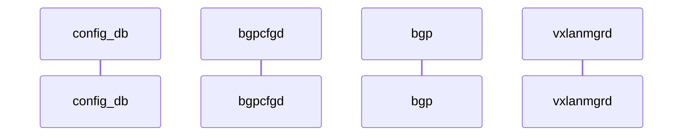

# EVPN Advertise Primary IP

# High Level Design Document

Rev 1.0

# Table of Contents

- [EVPN Advertise Primary IP](#EVPN-Advertise-Primary-IP)
- [High Level Design Document](#High-Level-Design-Document)
- [List of Tables](#List-of-Tables)
- [Revision](#Revision)
- [About this Manual](#About-this-Manual)
- [Scope](#Scope)
- [Definition/Abbreviation](#Definition/Abbreviation)
  - [Table 1: Abbreviations](#Table-1:-Abbreviations)
- [1 Feature Overview](#1-Feature-Overview)
  - [1.1 Requirements](#1_1-Requirements)
    - [1.1.1 Functional Requirements](#1_1_1-Functional-Requirements)
    - [1.1.2 Configuration and Management Requirements](#1_1_2-Configuration-and-Management-Requirements)
    - [1.1.3 Scalability Requirements](#1_1_3-Scalability-Requirements)
    - [1.1.4 Warm Boot Requirements](#1_1_4-Warm-Boot-Requirements)
    - [1.1.5 Notes:](#1_1_5-Notes:)
  - [1.2 Design Overview](#1_2-Design-Overview)
    - [1.2.1 Basic Approach](#1_2_1-Basic-Approach)
    - [1.2.2 Container](#1_2_2-Container)
    - [1.2.3 SAI Overview](#1_2_3-SAI-Overview)
- [2 Functionality](#2-Functionality)
  - [2.1 Target Deployment Use Cases](#2_1-Target-Deployment-Use-Cases)
  - [2.2 Functional Description](#2_2-Functional-Description)
    - [2.2.1 ...](#2_2_1-)
- [3 Design](#3-Design)
  - [3.1 Overview](#3_1-Overview)
  - [3.2 DB Changes](#3_2-DB-Changes)
    - [3.2.1 CONFIG DB](#3_2_1-CONFIG-DB)
    - [3.2.2 APP DB](#3_2_2-APP-DB)
    - [3.2.3 STATE DB](#3_2_3-STATE-DB)
    - [3.2.4 ASIC DB](#3_2_4-ASIC-DB)
    - [3.2.5 COUNTER DB](#3_2_5-COUNTER-DB)
  - [3.3 VxLAN Design Changes](#3_3-VxLAN-Design-Changes)
  - [3.4 SAI](#3_4-SAI)
  - [3.5 CLI](#3_5-CLI)
    - [3.5.1 IS-CLI Compliance](#3_5_1-IS-CLI-Compliance)
    - [3.5.2 Data Models](#3_5_2-Data-Models)
    - [3.5.3 Configuration Commands](#3_5_3-Configuration-Commands)
    - [3.5.4 Show Commands](#3_5_4-Show-Commands)
    - [3.5.5 Debug Commands](#3_5_5-Debug-Commands)
    - [3.5.6 REST API Support](#3_5_6-REST-API-Support)
- [4 Flow Diagrams](#4-Flow-Diagrams)
- [5 Error Handling](#5-Error-Handling)
- [6 Serviceability and Debug](#6-Serviceability-and-Debug)
- [7 Warm Boot Support](#7-Warm-Boot-Support)
- [8 Scalability](#8-Scalability)
- [9 Unit Test](#9-Unit-Test)
  - [9.1 Functional Test Cases](#9_1-Functional-Test-Cases)
  - [9.2 Negative Test Cases](#9_2-Negative-Test-Cases)
  - [9.3 Warm boot Test Cases](#9_3-Warm-boot-Test-Cases)
- [10 Configuration Example](#10-Configuration-Example)


# List of Tables

[Table 1: Abbreviations](#Table-1-abbreviations)

# Revision

| Rev  | Date       | Author           | Change Description           |
| ---- | ---------- | ---------------- | ---------------------------- |
| 0.1  | 10/22/2020 | Syed Hasan Naqvi | Initial version              |
| 0.2  | 11/02/2020 | Rajesh Sankaran  | Updated DB,SAI, CLI sections |

# About this Manual

This document provides general information about Advertise Primary IP (PIP) feature for EVPN Type-2 and Type-5 EVPN VxLAN routes in Logical VTEP case.

# Scope

This document describes the high level design and changes required for supporting Advertise Primary IP (PIP) for EVPN VxLAN. This feature allows EVPN L3VNI (Type-5) and Type-2 routes to be advertised with VTEP address unique to each of the two MCLAG nodes forming Logical VTEP.


# Definition/Abbreviation

## Table 1: Abbreviations

| Term  | Meaning                                                      |
| ----- | ------------------------------------------------------------ |
| PIP   | Primary (VTEP) IP address                                    |
| VIP   | Virtual (VTEP) IP address                                    |
| LVTEP | Logical VTEP                                                 |
| MCLAG | Multi-Chassis LAG                                            |
| RMAC  | Router-MAC  (attached as router-mac path attribute in Type-5 and Type-2 routes) |

# 1 Feature Overview

The pair of leaf nodes forming Logical VTEP advertise all of the EVPN routes with next-hop IP address common to each other. This causes following side effects:
1. BGP VRF-lite sessions are required between MCLAG peers in order to sync the prefixes/subnets belonging to hosts and routers connected to orphan ports.
2. Subnets and routes reachable only from one of the leaf node result in traffic trombone via MCLAG peer link.
3. Type-2 (MAC/MACIP) routes learnt on orphan ports are advertised with common LVTEP tunnel IP address, resulting in traffic trombone for the reverse direction traffic.

Scenarios (2) and (3) are shown in the diagram below.

<figure><figcaption align="center">Figure 1: Sub-optimal traffic forwarding in Logical VTEP</figcaption></figure></img></figure>


## 1.1 Requirements

### 1.1.1 Functional Requirements

Following are functional requirements for Advertise-PIP feature:

1. Ability to terminate VxLAN tunnel in hw and kernel with two separate VTEP IP addresses.
2. Ability to distinguish between primary and virtual VTEP IP addresses in EVPN control plane.
3. Ability to advertise Type-5 routes with primary VTEP IP address.
4. Ability to identify orphan and multi-homed interfaces in the system.
5. Ability to advertise Type-2 routes with primary or virtual VTEP IP address depending on interface were ARP/MAC is learnt is orphan (single-homed) or multi-homed.
6. Ability to handle transition of interface from single-homed to multi-homed interface, and vice-versa.
7. Support on all available platforms where EVPN VxLAN is supported.


Following are non-goals for the advertise-PIP feature:

1. Remove usage of MCLAG ICL (aka peer-link) in MLAG failure scenarios.
2. Remove usage of MCLAG ICL for traffic between links within MCLAG peers.


### 1.1.2 Configuration and Management Requirements

Following are configuration and management requirements for Advertise-PIP feature:

1. Ability to configure two separate source VTEP IP addresses for VxLAN termination.
2. Ability to enable and disable advertise-PIP for Type-5 routes alone.
3. Ability to enable and disable advertise-PIP for Type-2 routes alone.

### 1.1.3 Scalability Requirements

No specific scalability dimension introduced by this feature. This feature is required to work for the claimed route/port scaling numbers for any given platform.

### 1.1.4 Warm Boot Requirements

No known impact to warm-boot.


## 1.2 Design Overview

### 1.2.1 Basic Approach

The basic approach of `advertise-pip` feature is to advertise Type-5 routes with VTEP IP address as next-hop that is unique to the ToR/Leaf, instead of using the VTEP IP address that is common to the ToR/Leaf nodes forming logical VTEP. For Type-2 routes, the routes are selectively advertised with unique or common VTEP IP address as next-hop depending on the port on which MAC is learned is single homed or multi-homed, respectively.


<figure><figcaption align="center">Figure 2: Traffic forwarding after orphan subnets advertised with primary VTEP IP</figcaption></img></figure>

In the diagram above, subnet/MAC of multi-homed MCLAG-host-1 is advertised with LVTEP (VIP) IP address and <span style="color:green">green</span> traffic flow can land on `Leaf-1` or `Leaf-2`. Whereas, subnet/MAC of single-homed `Orphan-host-2` is advertised with VTEP IP address of `Leaf-2`, and <span style="color:red">red</span> traffic flow will be forwarded by `Spine` only to `Leaf-2`. Similarly, yellow traffic flow to `Orphan-host-1` will be forwarded by `Spine` only to `Leaf-1`.

#### 1.2.1.1 `advertise-pip` behavior in FRR

FRR supports `advertise-pip` feature in FRR 7.4 and available only for:

1. Type-5 routes, and
2. Type-2 routes for IP addresses configured on local interface(s).

PIP for Type-2 routes corresponding to hosts' MAC/MACIP is not supported.

As part of `advertise-pip` config, user is allowed to either enable advertise-pip or specify the primary VTEP IP address and/or router-mac as well:

```
sonic(config)# router bgp 10
sonic(config-router)# address-family l2vpn evpn
sonic(config-router-af)# advertise-pip
  <cr>
  ip    IP information
sonic(config-router-af)# advertise-pip ip
  A.B.C.D  ip address
sonic(config-router-af)# advertise-pip ip 1.1.1.1
  <cr>
  mac   MAC address
sonic(config-router-af)# advertise-pip ip 1.1.1.1 mac
  X:X:X:X:X:X    MAC address
  X:X:X:X:X:X/M  MAC address
```


Following is the behavior for picking the VTEP IP and router-mac addresses for Type-5 routes in FRR:

- IP address configured on VxLAN netdevice for L3VNI is used as the common (Logical) VTEP IP address.
- In order to enable `advertise-pip` functionality, L3VNI IRB netdevice should have an attached macvlan netdevice.
- The MAC address configured on IRB netdevice is considered as unique RMAC, and the MAC address configured on macvlan netdevice is considered as the common (logical) RMAC.
- If macvlan netdevice is not created, routes (1) & (2) are always advertised with LVTEP IP address irrespective of whether `advertise-pip` is configured or not.


#### 1.2.1.2  `advertise-pip` behavior in SONiC

As seen above, FRR's `advertise-pip` feature is tightly dependent on macvlan netdevice. Following two choices are available in SONiC to support this feature:


Option 1:

​    (a)  Create macvlan netdevice for each and every L3VNI IRB interface.
​    (b)  Maintain common LVTEP router-mac on macvlan netdevice. 
​    (c)  Maintain unique mac address the on IRB netdevice
​    (d)  Keep `advertise-pip` configuration as enabled by default.

Support for (b) & (c) goes against mclag design. MCLAG syncs mac address on IRB netdevice and therefore is treated as common mac. Change in this behavior will require a new knob in mclag.


Option 2:

​    (a) Keep `advertise-pip` as disabled by default.
​    (b) Remove dependency on macvlan netdevice.

Change (a) is required to avoid change in behavior as part of upgrade. And c

This approach requires patching the FRR code in SONiC.


Design in this HLD is choosing Option 2 above.

Secondly, FRR will be patched for supporting PIP for Type-2 routes corresponding to MAC/MACIP learned on orphan ports.


#### 1.2.1.2 L3VNI router MAC

In order to achieve above, user will be required to either:
(a) Avoid making L3VNI IRB vlan member of MCLAG or ICL, or
(b) Configure unique-ip for the IRB vlan


#### 1.2.1.3 Virtual VTEP IP (VIP) address
The local IP address configured on the VxLAN netdevice in the kernel will continue to be Virtual (LVTEP) IP address common to the MCLAG peers.
```
root@sonic:/home/admin# ip -d link show dev vtep1-1000
101: vtep1-1000: <BROADCAST,MULTICAST,UP,LOWER_UP> mtu 1500 qdisc noqueue master Bridge state UNKNOWN mode DEFAULT group default qlen 1000
    link/ether 52:54:00:75:22:57 brd ff:ff:ff:ff:ff:ff promiscuity 1
    vxlan id 100000 local 1.1.1.1 srcport 0 0 dstport 4789 nolearning ageing 300 udpcsum noudp6zerocsumtx noudp6zerocsumrx
    bridge_slave state forwarding priority 4 cost 100 hairpin off guard off root_block off fastleave off learning off flood on port_id 0x8002 port_no 0x2 designated_port 32770 designated_cost 0 designated_bridge 8000.52:54:0:75:22:57 designated_root 8000.52:54:0:75:22:57 hold_timer    0.00 message_age_timer    0.00 forward_delay_timer    0.00 topology_change_ack 0 config_pending 0 proxy_arp off proxy_arp_wifi off mcast_router 1 mcast_fast_leave off mcast_flood on addrgenmode eui64 numtxqueues 1 numrxqueues 1 gso_max_size 65536 gso_max_segs 65535
root@sonic:/home/admin#

```


#### 1.2.1.4 Primary VTEP IP (PIP) address for Type-5 routes

Advertise-PIP implementation in FRR uses two options for chosing primrary IP address for the VxLAN routes:
(a) Default BGP instance's router-id
(b) Primary IP address configured under the BGP VRF instance.

```
sonic(config)# router bgp 64512 vrf Vrf-red
sonic(config-router-bgp)# address-family l2vpn evpn
sonic(config-router-bgp-af)# advertise-pip ip 2.2.2.2
```

The above two options would be left to the user to chose.
No new CLI will be introduced in FRR for configuring the primary IP address for EVPN routes.


#### 1.2.1.5 Primary VTEP IP (PIP) address for Type-2 routes

```
sonic(config)# router bgp 64512
sonic(config-router-bgp)# address-family l2vpn evpn
sonic(config-router-bgp-af)# advertise-pip ip 2.2.2.2 peer-ip 1.1.1.1
```


#### 1.2.1.6 VxLAN source VTEP IP addresses

VxLAN interface configuration will continue to accept the source IP address.
```
sonic(config)# interface vxlan vtep-1
sonic(conf-if-vxlan-vtep-1)# source-ip 1.1.1.1
```

The second VTEP IP address can be configured as below:
```
sonic(conf-if-vxlan-vtep-1)# secondary-ip 2.2.2.2
```
The `source-ip` address will continue to be used for configuring the vxlan netdevice (as Virtual IP address) in the kernel and in the hw. The `secondary-ip` address will only be configured in hw for terminating vxlan tunnel. In order to let BGP advertise the routes with the PIP, `advertise-pip` is required to be configured as mentioned in previous section.

User will be required to create separate loopback interface with `secondary-ip` IP address.


#### 1.2.1.7 Kernel support for secondary VTEP IP
No changes are required in IP stack for terminating VxLAN packets coming with destination IP not same as VTEP IP configured on vxlan netdevices. Kernel can terminate vxlan tunnel as long as destination is local IP address.


### 1.2.2 Type-2 (MAC/MACIP) routes
Following will be the behavior of advertisement of type-2 routes when `advertise-pip` is enabled:

1. MAC and ARP/ND entries learnt on single-homed interface(s) will be advertised with PIP address.
2. MAC and ARP/ND entries learnt on multi-homed interface(s) will be advertised with VIP address.
3. MAC and ARP/ND entries learnt on MCLAG peer-link will not be advertised into EVPN.


#### 1.2.2.1 Identification of single-homed and multi-homed interfaces
Linux netdevices have group attribute that is available to be used for grouping of netdevices in order to given them common treatment (e.g. applying filter etc.)
```
root@sonic:/home/admin# ip -d link show PortChannel1
134: PortChannel1: <NO-CARRIER,BROADCAST,MULTICAST,UP> mtu 9100 qdisc noqueue state DOWN mode DEFAULT group default qlen 1000
    link/ether 52:54:00:85:4d:0f brd ff:ff:ff:ff:ff:ff promiscuity 0
    team addrgenmode eui64 numtxqueues 16 numrxqueues 16 gso_max_size 65536 gso_max_segs 65535
root@sonic:/home/admin#
```

By default netdevices belong to default (0) group.

Group of any given netdevice can be modified using below Linux command:
```
root@sonic:/home/admin# ip link set dev PortChannel1 group 1
root@sonic:/home/admin# ip -d link show PortChannel1
134: PortChannel1: <NO-CARRIER,BROADCAST,MULTICAST,UP> mtu 9100 qdisc noqueue state DOWN mode DEFAULT group 1 qlen 1000
    link/ether 52:54:00:85:4d:0f brd ff:ff:ff:ff:ff:ff promiscuity 0
    team addrgenmode eui64 numtxqueues 16 numrxqueues 16 gso_max_size 65536 gso_max_segs 65535
root@sonic:/home/admin#

```

#### 1.2.2.2 Static anycast gateway subnet advertisement
Type-2 routes for subnet and MAC address of SVI interfaces are advertised if `advertise-svi-ip` or `advertise-gw-ip` is configured under BGP EVPN configuration. 

These type-2 routes will be advertised with PIP in following cases:
* Vlan is configured as MCLAG unique-ip
* Vlan is not MCLAG vlan

In case VLAN is MCLAG VLAN (member of mclag Portchannel or peer-link), above type-2 routes will be advertised with VIP.

SVI netdevices for MCLAG vlans will be grouped in MCLAG_NETDEV_GROUP.
Rest of the SVI netdevices will be member of default(0) netdevice group.


#### 1.2.2.3 Netdevice groups
Following netdevice groups will be used:
| Group Name                  | Value | Description                                                  |
| --------------------------- | ----- | ------------------------------------------------------------ |
| MCLAG_NETDEV_GROUP          | 1     | Multi-homed interfaces (portchannel), MCLAG VLAN's SVI netdevices |
| MCLAG_PEERLINK_NETDEV_GROUP | 2     | Peer-link interface                                          |

Rest of the netdevices will remain member of default(0) group.


#### 1.2.2.3 Handling in FRR
Following is the high level behavior of Zebra:

1. Zebra will parse IFLA_GROUP attribute from netlink link events and maintain the group-id in `struct interface` (ifp) data-structure in order to identify the group of the interface anytime later while processing MAC/ARP/ND from kernel.
2. Zebra will send MAC/MACIP updates to BGP with 

### 1.2.3 Container
No new container is added by this feature.

### 1.2.4 SAI Overview
No changes to the Tunnel SAI specification. 

# 2 Functionality

## 2.1 Target Deployment Use Cases


## 2.2 Functional Description


# 3 Design

## 3.1 Overview


## 3.2 DB Changes

### 3.2.1 CONFIG DB

**VXLAN_TUNNEL_TABLE**

Producer:  config manager

Consumer: VxlanMgr

Description: Updated existing table to store primary IP.

Schema:

```
;Existing table
;defines VTEP. Updated to store primary IP associated with VTEP.
;
;Status: stable

key = VXLAN_TUNNEL:VTEP_NAME ; VTEP name as a string
primary_ip = ipv4 ; primary IP associated with VTEP.

```


### 3.2.2 APP DB

**VXLAN_TUNNEL_TABLE**

Producer:  VxlanMgr

Consumer: VxlanOrch

Description: Updated existing table to store primary IP.

Schema:

```
; Existing table
; Updated to store physical IP associated with VTEP.

key = VXLAN_TUNNEL_TABLE:VTEP_NAME
                          ; VTEP name as a string
; field = value
primary_ip = ipv4 ; primary IP associated with VTEP.
```


### 3.2.3 STATE DB

No Changes

### 3.2.4 ASIC DB

No Changes

### 3.2.5 COUNTER DB

No Changes


## 3.4 SAI

There are no changes to the Tunnel SAI header specification for this feature. 

Tunnel Terminator SAI objects with SIP as the remote IP and DIP as the VTEP IP are currently created. When the primary IP is configured or unconfigured an extra Tunnel terminator object with SIP as the remote IP and DIP as the configured primary IP is created or deleted. This newly created tunnel terminator object is associated with the same Tunnel SAI object that the Tunnel terminator corresponding to the VTEP IP is associated with.

## 3.5 CLI

### 3.5.1 IS-CLI Compliance


### 3.5.2 Data Models
TBD

### 3.5.3 Configuration Commands

#### 3.5.3.1 KLISH commands
The following commands will be used to configure secondary IP address for VxLAN.

```
sonic(config)# interface vxlan vtep-1
sonic(conf-if-vxlan-vtep-1)# source-ip 1.1.1.1
sonic(conf-if-vxlan-vtep-1)# primary-ip 2.2.2.2
sonic(conf-if-vxlan-vtep-1)# no primary-ip

```
#### 3.5.3.2 Click commands
The following commands will be used to configure secondary IP address for VxLAN.

```
# config vxlan primary-ip add <vtepname> <pip_ipv4>
# config vxlan primary-ip del <vtepname>
```

#### 3.5.3.3 Validations
- IPv4 address check
- Only a single Primary IP shall be allowed.
- Primary IP cannot be edited.
- Primary IP cannot be configured unless the VTEP IP is configured.
- VTEP IP cannot be deleted unless the Primary IP is deleted.

### 3.5.4 Show Commands

#### 3.5.4.1 VxLAN show commands

The below command and output is applicable for both KLISH and Click.

```
sonic# show vxlan interface
VTEP Information:

        VTEP Name : vtep-1, SIP  : 1.1.1.1  
        Primary IP : 2.2.2.2
        NVO Name  : nvo1,  VTEP : vtep-1
        Source interface  : Loopback10
        Primary IP interface : Loopback20
```


#### 3.5.4.2 BGP EVPN show commands

```
sonic# show evpn vni 100000
VNI: 100000
  Type: L3
  Tenant VRF: Vrf-red
  Local Vtep Ip: 1.2.1.1
  Vxlan-Intf: vt1-1000
  SVI-If: Vlan1000
  State: Up
  Client State: Up
  VNI Filter: none
  System MAC: 00:00:11:aa:bb:cc
  Router MAC: 00:00:11:aa:bb:cc
  L2 VNIs: 100
sonic#
```


### 3.5.5 Debug Commands


### 3.5.6 REST API Support
<< Required >> TBD


# 4 Flow Diagrams

### 4.1.1 Configure sequence of advertise-pip
Below flow diaram shows sample sequence of config of advertise-pip


### 4.1.2 Unconfigure sequence of advertise-pip
Sequence diagram below shows sample sequence of unconfiguring advertise-pip


# 5 Error Handling
TBD


# 6 Serviceability and Debug
TBD

# 7 Warm Boot Support
TBD

# 8 Scalability

NA

# 9 Unit Test

## 9.1 Functional Test Cases


## 9.2 Negative Test Cases


## 9.3 Scale Test Cases


## 9.4 Warm boot Test Cases

1. Verify EVPN traffic remains unimpacted when this feature is enabled and while device undergoes warm-reboot

# 10 Configuration Example

```

```

​        
