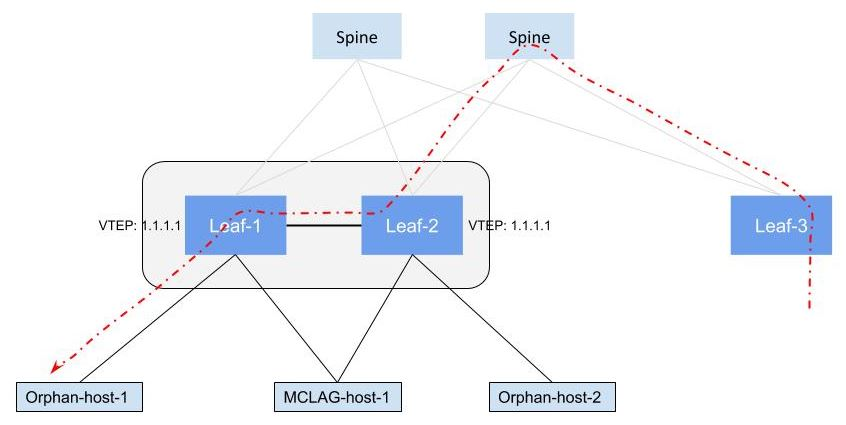
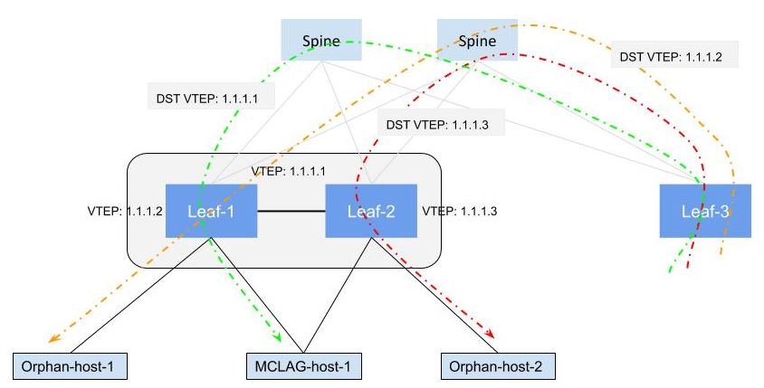
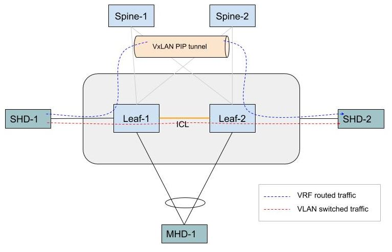
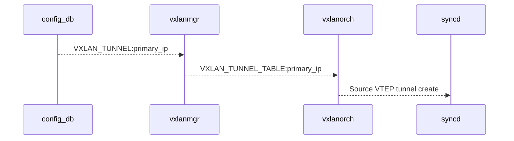
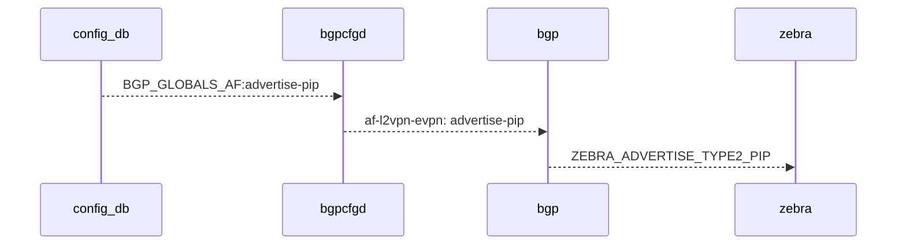

# EVPN Advertise Primary IP

# High Level Design Document

Rev 1.0

# Table of Contents

- [EVPN Advertise Primary IP](#EVPN-Advertise-Primary-IP)
- [High Level Design Document](#High-Level-Design-Document)
- [List of Tables](#List-of-Tables)
- [Revision](#Revision)
- [About this Manual](#About-this-Manual)
- [Scope](#Scope)
- [Definition/Abbreviation](#Definition/Abbreviation)
  - [Table 1: Abbreviations](#Table-1:-Abbreviations)
- [1 Feature Overview](#1-Feature-Overview)
  - [1.1 Requirements](#1_1-Requirements)
    - [1.1.1 Functional Requirements](#1_1_1-Functional-Requirements)
    - [1.1.2 Configuration and Management Requirements](#1_1_2-Configuration-and-Management-Requirements)
    - [1.1.3 Scalability Requirements](#1_1_3-Scalability-Requirements)
    - [1.1.4 Convergence Requirements](#1_1_4-Convergence-Requirements)
    - [1.1.5 Warm Boot Requirements](#1_1_5-Warm-Boot-Requirements)
  - [1.2 Design Overview](#1_2-Design-Overview)
    - [1.2.1 Basic Approach](#1_2_1-Basic-Approach)
    - [1.2.2 Container](#1_2_2-Container)
    - [1.2.3 SAI Overview](#1_2_3-SAI-Overview)
- [2 Functionality](#2-Functionality)
  - [2.1 Target Deployment Use Cases](#2_1-Target-Deployment-Use-Cases)
  - [2.2 Functional Description](#2_2-Functional-Description)
    - [2.2.1 VxLAN Primary IP address](#2_2_1-VxLAN-Primary-IP-address)
    - [2.2.2 VTEP IP address in Linux kernel VxLAN netdevices](#2_2_2-VTEP-IP-address-in-Linux-kernel-VxLAN-netdevices)
    - [2.2.3 BGP Router-ID](2_2_3-BGP-Router-ID)
    - [2.2.4 Source IP address in VxLAN frames originated in forwarding plane](2_2_4-Source-IP-address-in-VxLAN-frames)
    - [2.2.5 Advertise-PIP configuration for Type-5 routes](2_2_5-Advertise-PIP-configuration-for-Type-5-routes)
    - [2.2.6 Advertise-PIP for Type-2 (MAC/MACIP) routes](2_2_6-Advertise-PIP-for_Type-2-routes)
- [3 Design](#3-Design)
  - [3.1 Overview](#3_1-Overview)
  - [3.2 DB Changes](#3_2-DB-Changes)
    - [3.2.1 CONFIG DB](#3_2_1-CONFIG-DB)
    - [3.2.2 APP DB](#3_2_2-APP-DB)
    - [3.2.3 STATE DB](#3_2_3-STATE-DB)
    - [3.2.4 ASIC DB](#3_2_4-ASIC-DB)
    - [3.2.5 COUNTER DB](#3_2_5-COUNTER-DB)
  - [3.3 FRR](3_3-FRR)
  - [3.4 SAI](#3_4-SAI)
  - [3.5 CLI](#3_5-CLI)
    - [3.5.1 IS-CLI Compliance](#3_5_1-IS-CLI-Compliance)
    - [3.5.2 Data Models](#3_5_2-Data-Models)
    - [3.5.3 Configuration Commands](#3_5_3-Configuration-Commands)
    - [3.5.4 Show Commands](#3_5_4-Show-Commands)
    - [3.5.5 Debug Commands](#3_5_5-Debug-Commands)
    - [3.5.6 REST API Support](#3_5_6-REST-API-Support)
- [4 Flow Diagrams](#4-Flow-Diagrams)
- [5 Error Handling](#5-Error-Handling)
- [6 Serviceability and Debug](#6-Serviceability-and-Debug)
- [7 Warm Boot Support](#7-Warm-Boot-Support)
- [8 Scalability](#8-Scalability)
- [9 Unit Test](#9-Unit-Test)
  - [9.1 Functional Test Cases](#9_1-Functional-Test-Cases)
  - [9.2 Negative Test Cases](#9_2-Negative-Test-Cases)
  - [9.3 Warm boot Test Cases](#9_3-Warm-boot-Test-Cases)
- [10 Configuration Example](#10-Configuration-Example)


# List of Tables

[Table 1: Abbreviations](#Table-1-abbreviations)

# Revision

| Rev  | Date       | Author           | Change Description                                           |
| ---- | ---------- | ---------------- | ------------------------------------------------------------ |
| 0.1  | 10/22/2020 | Syed Hasan Naqvi | Initial version                                              |
| 0.2  | 11/02/2020 | Rajesh Sankaran  | Updated DB,SAI, CLI sections                                 |
| 0.3  | 01/15/2021 | Syed Hasan Naqvi | Addressed review comments, revamped the document, added REST URIs |
| 0.4  | 02/18/2021 | Syed Hasan Naqvi | Added VxLAN REST URIs, corrected details in multiple sections, addressed review comments. |
# About this Manual

This document provides general information about Advertise Primary IP (PIP) feature for EVPN Type-2 and Type-5 EVPN VxLAN routes in Logical VTEP case.

# Scope

This document describes the high level design and changes required for supporting Advertise Primary IP (PIP) for EVPN VxLAN. This feature allows EVPN L3VNI (Type-5) and Type-2 routes to be advertised with VTEP address unique to each of the two MCLAG nodes forming Logical VTEP.


# Definition/Abbreviation

## Table 1: Abbreviations

| Term  | Meaning                                                      |
| ----- | ------------------------------------------------------------ |
| PIP   | Primary (VTEP) IP address                                    |
| VIP   | Virtual (VTEP) IP address that is common to the  MCLAG peers forming Logical VTEP |
| LVTEP | Logical VTEP                                                 |
| MCLAG | Multi-Chassis LAG                                            |
| RMAC  | Router-MAC  (attached as router-MAC path attribute in Type-5 and Type-2 routes) |
| ICL   | Inter-Chassis Link  (aka MCLAG peer-link)                    |
| SHD   | Single-Homed Device : The device connected to only one of Leaf node in LVTEP pair |
| MHD   | Multi-Homed Device : The MCLAG device that is connected to both of the Leaf nodes forming LVTEP. |

# 1 Feature Overview

The pair of leaf nodes forming Logical VTEP advertise all of the EVPN routes with VIP as the next-hop IP address. 

This causes following side effects for the orphan subnets and MACs:

1. BGP VRF-lite session in each non-default VRF is required between MCLAG peers in order to sync the prefixes/subnets belonging to hosts and routers connected to orphan ports/VLANs.
2. Traffic from remote VTEP destined to subnets/routes reachable only from one of the LVTEP node results in traffic trombone via MCLAG peer link.
3. Traffic from remote VTEP destined to MAC/MACIP learnt on orphan ports results in traffic trombone via MCLAG peer link.


Reason for (1) above is because routes received from MCLAG peer are discarded due to self next-hop check in BGP. In Fig. 1 below, EVPN routes advertised by Leaf-1 with VIP next-hop will be discarded by Leaf-2 since VIP address is local IP address of Leaf-2 as well.


Scenarios (2) and (3) are shown in Fig. 1 below. Since EVPN routes (including the ones belonging to orphan ports/VLANs) are advertised with VIP as next-hop, and the spine routers form ECMP for the LVTEP VIP address, the traffic arriving on LVTEP can land on the LVTEP node to which the destination MAC/subnet is not connected to. This results in traffic taking another hop via ICL to reach the orphan subnet/MAC.


<figure><figcaption align="center">Figure 1: Sub-optimal traffic forwarding in Logical VTEP</figcaption></figure></img></figure>


The above sub-optimal forwarding via ICL, and the need to have BGP VRF-lite sessions between MCLAG peers, are avoided by allowing user to specify Primary VTEP IP addresses that is unique for each of the MCLAG peers.

When VxLAN Primary VTEP IP address is configured, the EVPN routes for the orphan hosts and Type-5 prefixes will be advertised with the Primary VTEP IP address as next-hop. And the Type-2 routes for multi-homed hosts will be advertised with Logical VTEP IP address (common to the MCLAG) as next-hop. The Type-5 routes advertised with PIP next-hop form overlay ECMP on the remote VTEPs. However, since a given Type-2 route cannot be advertised with two PIP next-hops (as otherwise it causes MAC move), the Type-2 routes for MHDs are advertised with the common VIP address as next-hop.


## 1.1 Requirements

### 1.1.1 Functional Requirements

Following are functional requirements for Advertise-PIP feature:

1. Ability to terminate VxLAN tunnel in hw and kernel with two separate VTEP IP addresses.
2. Ability to distinguish between primary and virtual VTEP IP addresses in EVPN control plane.
3. Ability to advertise Type-5 routes with primary VTEP IP address.
4. Ability to identify orphan and multi-homed interfaces in the system.
5. Ability to advertise Type-2 routes with primary or virtual VTEP IP address depending on interface were ARP/MAC is learnt is orphan (single-homed) or multi-homed.
6. Ability to handle transition of interface from single-homed to multi-homed interface, and vice-versa.
7. Support all above on all available platforms on which EVPN VxLAN is supported.
8. No impact to existing EVPN functionality if this feature is not configured.


Following are non-goals for the advertise-PIP feature:

1. Remove usage of ICL in MCLAG failure (leg down) scenarios.
2. Remove usage of MCLAG ICL for east-west L2 traffic between MCLAG peers.


### 1.1.2 Configuration and Management Requirements

Following are configuration and management requirements for Advertise-PIP feature:

1. Ability to configure two separate source VTEP IP addresses for VxLAN termination.

2. Ability to enable or disable advertisement of routes with PIP next-hop.

3. Ability to enable and disable advertise-PIP for Type-2 routes alone.

   

### 1.1.3 Scalability Requirements

This feature is required to work for the claimed route/port scaling numbers for any given platform. No new scalability requirements introduced by this feature. 

### 1.1.4 Convergence Requirements

This feature should not negatively impact EVPN VxLAN traffic convergence and performance numbers established with previous releases.

### 1.1.5 Warm Boot Requirements

Warm-boot is required to be supported when this feature is enabled.


## 1.2 Design Overview

### 1.2.1 Basic Approach


The basic approach of Advertise-PIP feature is to:

1. Advertise Type-5 routes with PIP as next-hop.
2.  Advertise Type-2 routes with PIP as next-hop for the MAC/MACIP learnt on the SHD.
3. Advertise Type-2 routes with VIP as next-hop for the MAC/MACIP learnt on the MHD.
4. Continue to advertise Type-3 routes with VIP as next-hop.


<figure><figcaption align="center">Figure 2: Traffic forwarding after routes for MAC/IP learnt on orphan ports are advertised with primary VTEP IP</figcaption></img></figure>


In the diagram above, MAC/IP of MHD `MCLAG-host-1` is advertised with LVTEP (VIP) IP address, and MAC/IP for SHDs `Orphan-host-1` and `Orphan-host-2` are advertised with PIP.  The <span style="color:green">green</span> traffic flow destined to the `MCLAG-host-1`'s MAC would be arriving with VIP destination IP address and will land on either Leaf-1 or Leaf-2. Both  Leaf-1 and Leaf-2 would be able to forward this traffic locally to the MCLAG interface.

Since MAC/IP of SHD `Orphan-host-2` is advertised with PIP of Leaf-2, the <span style="color:red">red</span> traffic flow will be arriving with PIP as destination IP, and Spine nodes will forward it only to Leaf-2. Similarly, yellow traffic flow to `Orphan-host-1` will be forwarded by Spine nodes only to Leaf-1. In other words, traffic trombone will no longer happen for the Orphan MAC/IP.

In case of VRF IPv4/IPv6 prefixes, both Leaf-1 and Leaf-2 would advertise Type-5 routes with their respective PIP as next-hop. And remote VTEPs will form ECMP. If the subnet is advertised by both Leaf-1 and Leaf-2, the load-balancing will be performed by remote VTEP (instead of Spine, as happens when VIP is used as next-hop). Whereas, in case a subnet was advertised only by Leaf-1 (or Leaf-2), remote VTEPs would send the traffic directly to the PIP of the specific Leaf node.

The Type-3 (IMET) routes are required to be always advertised with VIP as next-hop. If IMET routes had been advertised with PIP as next-hop by Leaf-1 and Leaf-2, two copies of the flooded packet (one to each PIP) would have been sent by the remote VTEPs, resulting in packet duplication.


#### 1.2.1.1 Advertise-PIP for east-west traffic within MCLAG

MCLAG's control plane protocol (iccpd) takes care of synchronizing MAC/MACIP between the MCLAG peers. However, L3 subnets/routes are not synchronized by iccpd. In order to synchronize routes, at present, BGP VRF-lite sessions are required in each of the VRFs configured on the MCLAG.

Enabling advertise-pip (i.e. configuring VxLAN primary-ip) will eliminate the requirement of creating BGP VRF-lite sessions between MCLAG peers.


<figure><figcaption align="center">Figure 3: Routed and Switched traffic forwarding within MCLAG cluster</figcaption></img></figure>


##### 1.2.1.1.1 Behavior of routed traffic within MCLAG

When PIP is configured on the MCLAG nodes, BGP VRF routes will be advertised with PIP as next-hop instead of VIP. This will allow Type-5 routes advertised by one MCLAG node to be accepted by the other MCLAG node. And there will be VxLAN tunnel created with the PIP VTEP addresses within the MCLAG cluster as shown in Figure 3 above. The routed traffic on MCLAG nodes will used the PIP VxLAN tunnel to reach the other MCLAG peer. The dotted -blue line shows the L3 routed traffic using VxLAN PIP tunnel in the diagram above.

The source IP address in the VxLAN encapsulated packets for the routed traffic is required to be PIP instead of VIP. Otherwise, VxLAN packets arriving on the other MCLAG peer will not be terminated due to VxLAN source-address (VIP) being the local IP address - as the VIP belongs to both of the MCLAG nodes.


##### 1.2.1.1.2 Behavior of switched traffic within MCLAG

Note that the devices forming MCLAG already have ICL for switching the east-west traffic, and VxLAN PIP tunnel provides redundant path that is not required. Therefore, Type-2 routes received from the MCLAG peer are required to be discarded in BGP.


Following are some of the rationales behind it:

**Using VIP as source-IP for L2VNI:**

The source IP address in the VxLAN encapsulated packets originated in a given L2VNI is VIP, instead of PIP. Due to this, the VxLAN packets originated by MCLAG node and arriving on its MCLAG peer will not be terminated as VIP being common to both. This will result in packet drop.

PIP is not used as source IP address in VxLAN encapsulated packets for L2VNI as this may result in traffic (tunnel termination) issues if PIP is configured, but there happens to be no routes advertised with PIP in the control plane due to persistent or transient situation.


**Using PIP as source-IP for L2VNI:**

Let's consider the case what if PIP is used as source IP address in VxLAN originated frames for L2VNI. When VxLAN primary IP address is configured on the MCLAG nodes, the MAC/MACIP of SHDs are advertised with PIP. This will create two parallel paths between MCLAG peers-- one via VxLAN PIP tunnel, and another via ICL. The existence of two paths would potentially cause duplication of frames as described below:

In Figure 3, assume SHD-1 sends L2 unicast packet, destined to SHD2, to Leaf-1. In the transient scenario if the MAC address of SHD-2 is aged out on Leaf-2, but not yet cleaned up from Leaf-1, Leaf-1 will forward the packet over VxLAN PIP tunnel to Leaf-2. Since the MAC is not present on Leaf-2, Leaf-2 will flood the packet to its local ports including ICL towards Leaf-1. At this point, if MAC is removed from Leaf-1 as well, the flooded packets arriving over ICL will be flooded within Leaf-1. And the SHD-1 will received copy of the frame that it sent.


On the other hand, ICL cannot be completely removed and replaced by PIP VxLAN tunnel since IMET routes cannot be advertised with PIP as mentioned in previous section.


In purview of above, Type-2 routes arriving with PIP as next-hop are required to be discarded in BGP control plane. This requires specifying MCLAG peer's  PIP address while enabling advertise-pip for Type-2 routes in EVPN default VRF. Please refer to sec. 2.2.6.4.

In other words, behavior for VLAN switched traffic remains as is even in presence of Advertise-PIP feature. Figure 3 shows the dotted-red line representing VLAN switched (unicast and BUM) traffic taking ICL to reach the other MCLAG node.


### 1.2.2 Container
No new container is added by this feature.

### 1.2.3 SAI Overview
No changes to the Tunnel SAI specification. 

# 2 Functionality

## 2.1 Target Deployment Use Cases

This feature is useful for avoiding suboptimal traffic forwarding in EVPN VxLAN Logical VTEP deployments. If Orphan ports or subnets are present on MCLAG nodes, this feature is recommended to be used.


## 2.2 Functional Description

### 2.2.1 VxLAN Primary IP address

VxLAN interface configuration will continue to accept the source IP address.

```
sonic(config)# interface vxlan vtep-1
sonic(conf-if-vxlan-vtep-1)# source-ip 1.1.1.1
```

The primary VTEP IP address unique to the MCLAG node can be configured as below:

```
sonic(conf-if-vxlan-vtep-1)# primary-ip 2.2.2.2
```

User will be required to create separate loopback interface with `primary-ip` IP address, and advertise it in BGP default VRF.

```
sonic(config)# interface Loopback 2
sonic(conf-if-lo2)# ip address 2.2.2.2/32
```


Note that both `source-ip` and `primary-ip` configurations are required to be created before adding any VLAN-VNI mappings. If VLAN-VNI mappings already exist, below error will be thrown and user will have to remove VNI-VRF and VNI-VLAN mappings and reconfigure the Primary IP.

```
sonic(conf-if-vxlan-vtep-3)# primary-ip 3.3.3.3
Error: Please delete all VLAN VNI mappings.
```


### 2.2.2 VTEP IP address in Linux kernel VxLAN netdevices

Linux IP stack can terminate VxLAN packets arriving with destination IP different from the VTEP IP configured on VxLAN netdevices. The VxLAN packets will be decapsulated by kernel as as long as destination is a locally configured IP address.

The VTEP IP address configured on the VxLAN netdevice in kernel can be seen as below:

```
root@sonic:/home/admin# ip -d link show dev vtep1-1000
101: vtep1-1000: <BROADCAST,MULTICAST,UP,LOWER_UP> mtu 1500 qdisc noqueue master Bridge state UNKNOWN mode DEFAULT group default qlen 1000
    link/ether 52:54:00:75:22:57 brd ff:ff:ff:ff:ff:ff promiscuity 1
    vxlan id 100000 local 1.1.1.1 srcport 0 0 dstport 4789 nolearning ageing 300 udpcsum noudp6zerocsumtx noudp6zerocsumrx
    bridge_slave state forwarding priority 4 cost 100 hairpin off guard off root_block off fastleave off learning off flood on port_id 0x8002 port_no 0x2 designated_port 32770 designated_cost 0 designated_bridge 8000.52:54:0:75:22:57 designated_root 8000.52:54:0:75:22:57 hold_timer    0.00 message_age_timer    0.00 forward_delay_timer    0.00 topology_change_ack 0 config_pending 0 proxy_arp off proxy_arp_wifi off mcast_router 1 mcast_fast_leave off mcast_flood on addrgenmode eui64 numtxqueues 1 numrxqueues 1 gso_max_size 65536 gso_max_segs 65535
root@sonic:/home/admin#

```


VxLAN netdevices will have below VTEP IP address configured in the kernel:

| VNI Type | VTEP IP address<br />(VxLAN Primary IP configured) | VTEP IP address<br />(VxLAN Primary IP not configured) |
| -------- | -------------------------------------------------- | ------------------------------------------------------ |
| L2VNI    | VIP                                                | VIP                                                    |
| L3VNI    | PIP                                                | VIP                                                    |


Configuring PIP on L3VNI VxLAN netdevices will cause:

- Type-5 prefixes to be automatically originated with PIP as next-hop.
- CPU originated L3VNI packets to use PIP


### 2.2.3 BGP Router-ID

It is recommended to configure BGP router-id of default VF same as the primary-IP configured under VxLAN interface. If BGP router-id is configured to be different from VxLAN primary-ip address, the configured primary IP address will be required to be provided to `advertise-pip` configuration under BGP default and non-default VRFs.


User will have to ensure that Primary IP address configured under VxLAN is same as BGP router-id or the IP address provided to advertise-pip configuration in BGP. If BGP router-id happens to be different from VxLAN primary IP address, routes will still be be advertised with the BGP router-id, but the incoming VxLAN frames will not be tunnel terminated in hw resulting into traffic failure.


### 2.2.4 Source IP address in VxLAN frames originated in forwarding plane

VxLAN packets originated by the LVTEP node configured with Primary-IP will have PIP as outer source IP address for L3VNI traffic.

For L2VNI (unicast or multicast), VxLAN originated traffic will have VIP as source IP address.

| Traffic Type | VxLAN source IP address<br />(VxLAN Primary IP configured) | VxLAN source IP address<br />(VxLAN Primary IP not configured) |
| ------------ | ---------------------------------------------------------- | ------------------------------------------------------------ |
| L2VNI        | VIP                                                        | VIP                                                          |
| L3VNI        | PIP                                                        | VIP                                                          |


### 2.2.5 Advertise-PIP configuration for user VRFs

Advertise-PIP for Type-5 and Type-2 routes gets enabled by default for the user VRFs by configuring:
(a) `primary-ip` under VxLAN interface configuration mode, and
(b) `mclag-separate-ip` for L3VNI IRB VLAN (please see next subsection)
And the routes are advertised with **BGP router-id** (of default VRF) as PIP next-hop.

The Type-5 routes in user VRFs are advertised with PIP as next-hop. And Type-2 routes are advertised with PIP/VIP depending on the MAC belonging to SHD/MHD, respectively. Please refer to sec 2.2.7 for details.


If the BGP router-id of default VRF is not configured same as the VxLAN Primary IP address, user is required to configure the PIP address in each and every user VRF explicitly using the configuration below.


```
sonic(config)# router bgp 10 vrf Vrf-red
sonic(config-router)# address-family l2vpn evpn
sonic(config-router-af)# advertise-pip
  <cr>
  ip    IP information
sonic(config-router-af)# advertise-pip ip
  A.B.C.D  ip address
sonic(config-router-af)# advertise-pip ip 1.1.1.1
```


Note that Advertise-PIP feature cannot be controlled on a per VRF basis. Once this feature is enabled, it applies to all of the VRFs. Therefore, it is not recommended to remove the advertise-pip configuration using `no advertise-pip` command.


#### 2.2.5.1 L3VNI Router-MAC and System-MAC

When VxLAN primary IP address is configured, it is required to ensure that L3VNI IRB MAC on the MCLAG node is also unique. Otherwise, Type-5 routes between MCLAG nodes would be discarded due to RMAC in the incoming routes being same as local MAC.

Also, note that Type-2 routes carry L3VNI and router-mac (along with L2VNI) if VLAN is member of L3VNI VRF. On the remote VTEP, these Type-2 routes may get converted to host routes and get installed in routing table with L3VNI and router-mac values. If the Type-2 route happens to be for MHD, the next-hop will be VIP. In that case, the router-mac must be a common routable MAC address for the MCLAG, instead of the unique system-mac address. This is achieved by automatically creating macvlan netdevice for the L3VNI IRB Vlan SVI interface,  if PIP is configured under VxLAN configuration.  And the common router-mac address is programmed on the macvlan netdevice.

```
root@sonic:/home/admin# ip -d link show dev irbmv-1000
200: irbmv-1000@Vlan1000: <BROADCAST,MULTICAST> mtu 9100 qdisc noop state DOWN mode DEFAULT group default qlen 1000
    link/ether 80:a2:35:81:ca:f0 brd ff:ff:ff:ff:ff:ff promiscuity 0
    macvlan mode private addrgenmode eui64 numtxqueues 1 numrxqueues 1 gso_max_size 65536 gso_max_segs 65535
```

ICCPd has been enhanced to discover these IRB macvlan netdevices and program the common router-mac on them. The common router-mac will be MCLAG gateway MAC address, if configured. Otherwise, it will be MCLAG active node's system-MAC. It is also ensured that the router-mac is installed in the hw for routing.

The above approach aligns with the existing FRR advertise-pip design, where the system-mac is obtained from SVI netdevice and router-mac is obtained from the macvlan netdevice attached to the SVI.


In order to let MCLAG(iccpd) automatically configure router-mac on the L3VNI IRB macvlan netdevices, user is required to configure MCLAG separate-ip for L3VNI IRB VLANs.

MCLAG separate IP configuration in KLISH:

```
sonic(config)# interface Vlan 1000
sonic(conf-if-Vlan1000)# mclag-separate-ip
```

The corresponding CLICK config command is:

```
admin@sonic:~$ sudo config mclag unique-ip add Vlan1000
```


### 2.2.6  Advertise-PIP configuration in BGP default VRF

The `advertise-pip` configuration is available in BGP default VRF and serves two purposes:
(a) It allows user to specify MCLAG peer-ip to discard Type-2 routes received from MCLAG peer across all of the VNIs.
(b) It enables advertise-pip functionality for Type-2 routes in default VRF

As discussed in sec. 1.2.1.1.2, Type-2 routes received from MCLAG peer are required to be discarded. This is achieved by using `peer-ip` in the advertise-pip configuration in default VRF:

```
sonic(config)# router bgp 64512
sonic(config-router-bgp)# address-family l2vpn evpn
sonic(config-router-bgp-af)# advertise-pip peer-ip 1.1.1.1
```

Where `peer-ip` is the Primary VTEP IP address configured on the MCLAG peer. 


If BGP router-id in default VRF cannot be configured to be same as VxLAN Primary IP address, the primary IP address has to be specified explicitly as shown below:

```
sonic(config)# router bgp 64512
sonic(config-router)# address-family l2vpn evpn
sonic(config-router-af)# advertise-pip ip 2.2.2.2 peer-ip 1.1.1.1
```


### 2.2.7 Advertise-PIP for Type-2 (MAC/MACIP) routes

Following will be the behavior of advertisement of type-2 routes when `advertise-pip` is enabled:

1. MAC and ARP/ND entries learnt on orphan port(s) will be advertised with PIP address.
2. MAC and ARP/ND entries learnt on multi-homed interface(s) will be advertised with VIP address.
3. MAC and ARP/ND entries learnt on MCLAG peer-link will not be advertised into EVPN.

Restriction (3) above is required to ensure same MAC is not advertised by both of the MCLAG nodes.


#### 2.2.6.1 Identification of single-homed and multi-homed interfaces

Linux netdevices have group attribute that is available to be used for grouping of netdevices in order to given them common treatment (e.g. applying filter etc.)

```
root@sonic:/home/admin# ip -d link show PortChannel1
134: PortChannel1: <NO-CARRIER,BROADCAST,MULTICAST,UP> mtu 9100 qdisc noqueue state DOWN mode DEFAULT group default qlen 1000
    link/ether 52:54:00:85:4d:0f brd ff:ff:ff:ff:ff:ff promiscuity 0
    team addrgenmode eui64 numtxqueues 16 numrxqueues 16 gso_max_size 65536 gso_max_segs 65535
root@sonic:/home/admin#
```

By default netdevices belong to default (0) group.

Group of any given netdevice can be modified using below Linux command:

```
root@sonic:/home/admin# ip link set dev PortChannel1 group 1
root@sonic:/home/admin# ip -d link show PortChannel1
134: PortChannel1: <NO-CARRIER,BROADCAST,MULTICAST,UP> mtu 9100 qdisc noqueue state DOWN mode DEFAULT group 1 qlen 1000
    link/ether 52:54:00:85:4d:0f brd ff:ff:ff:ff:ff:ff promiscuity 0
    team addrgenmode eui64 numtxqueues 16 numrxqueues 16 gso_max_size 65536 gso_max_segs 65535
root@sonic:/home/admin#
```


Following netdevice groups will be used to identify multi-homed or single-homed SVI or interface.

| Group Name                  | Value | Description                                                  |
| --------------------------- | ----- | ------------------------------------------------------------ |
| MCLAG_NETDEV_GROUP          | 1     | Multi-homed interfaces (portchannel), MCLAG VLAN's SVI netdevices |
| MCLAG_PEERLINK_NETDEV_GROUP | 2     | Peer-link interface                                          |

Rest of the netdevices will remain member of default(0) group.

ICCPd will take care of moving the netdevice to the appropriate group based on the MCLAG configurations.


#### 2.2.6.2 Static anycast gateway subnet advertisement

Type-2 routes for subnet and MAC address of SVI interfaces are advertised if `advertise-svi-ip` or `advertise-gw-ip` is configured under BGP EVPN configuration. 

These type-2 routes will be advertised with PIP in following cases:

* VLAN is configured as MCLAG unique-ip
* VLAN is not a MCLAG VLAN

In case VLAN is MCLAG VLAN (member of MCLAG Portchannel or MCLAG peer-link), above type-2 routes will be advertised with VIP.

SVI netdevices for MCLAG vlans will be grouped in MCLAG_NETDEV_GROUP.
Rest of the SVI netdevices will be member of default(0) netdevice group.


# 3 Design

## 3.1 Overview


## 3.2 DB Changes

### 3.2.1 CONFIG DB

**VXLAN_TUNNEL_TABLE**

Producer:  config manager

Consumer: VxlanMgr

Description: Updated existing table to store primary IP.

Schema:

```
;Existing table
;defines VTEP. Updated to store primary IP associated with VTEP.
;
;Status: stable

key = VXLAN_TUNNEL:VTEP_NAME ; VTEP name as a string
primary_ip = ipv4 ; primary IP associated with VTEP.

```


### 3.2.2 APP DB

**VXLAN_TUNNEL_TABLE**

Producer:  VxlanMgr

Consumer: VxlanOrch

Description: Updated existing table to store primary IP.

Schema:

```
; Existing table
; Updated to store physical IP associated with VTEP.

key = VXLAN_TUNNEL_TABLE:VTEP_NAME
                          ; VTEP name as a string
; field = value
primary_ip = ipv4 ; primary IP associated with VTEP.
```


### 3.2.3 STATE DB

No Changes

### 3.2.4 ASIC DB

No Changes

### 3.2.5 COUNTER DB

No Changes


## 3.3 FRR

Following is the high level behavior of Zebra:

1. Zebra will parse IFLA_GROUP attribute from netlink link events and maintain the group-id in `struct interface` (ifp) data-structure in order to identify the group of the interface anytime later while processing MAC/ARP/ND from kernel.
2. Zebra will send MAC/MACIP updates to BGP with PIP-flag for MAC/MACIP learnt on netdevice belonging to default(0) group. For rest of the netdevices, MAC/MACIP updates to BGP will be sent without the PIP-flag.

Following is the high level behavior of bgpd:

1. BGP will advertise Type-2 routes with PIP next-hop for the MAC/MACIP updates received with PIP-flag. For the rest, type-2 routes will be advertised with VIP as next-hop.
2. BGP will discard received Type-2 routes whose next-hop matches the configured `peer-ip` in advertise-pip configuration.


## 3. 4 SAI

There are no changes to the Tunnel SAI header specification for this feature. 

Tunnel Terminator SAI objects with SIP as the remote IP and DIP as the VTEP IP are currently created. When the primary IP is configured or unconfigured an extra Tunnel terminator object with SIP as the remote IP and DIP as the configured primary IP is created or deleted. This newly created tunnel terminator object is associated with the same Tunnel SAI object that the Tunnel terminator corresponding to the VTEP IP is associated with.


## 3.5 CLI

### 3.5.1 IS-CLI Compliance


### 3.5.2 Data Models
### 3.5.3 Configuration Commands

#### 3.5.3.1 KLISH commands
The following commands will be used to configure primary IP address for VxLAN.

```
sonic(config)# interface vxlan vtep-1
sonic(conf-if-vxlan-vtep-1)# source-ip 1.1.1.1
sonic(conf-if-vxlan-vtep-1)# primary-ip 2.2.2.2
sonic(conf-if-vxlan-vtep-1)# no primary-ip

```


Following BGP configuration commands would be available under default BGP VRF instance:

```
sonic(config)# router bgp 10
sonic(config-router)# address-family l2vpn evpn
sonic(config-router-af)# advertise-pip [ip A.B.C.D] peer-ip A.B.C.D
```


Following BGP configuration commands  would be available under non-default BGP VRF instance for Type-5 routes:

```
sonic(config)# router bgp 10 vrf Vrf-red
sonic(config-router)# address-family l2vpn evpn
sonic(config-router-af)# advertise-pip [ip A.B.C.D [mac XX:XX:XX:XX:XX:XX]]
```


#### 3.5.3.2 Click commands

The following commands will be used to configure Primary IP address for VxLAN.

```
# config vxlan primary-ip add <vtepname> <pip_ipv4>
# config vxlan primary-ip del <vtepname>
```

#### 3.5.3.3 Validations
- IPv4 address check
- Only a single Primary IP shall be allowed.
- Primary IP cannot be edited.
- Primary IP cannot be added or removed if VLAN VNI mappings are present.

### 3.5.4 Show Commands

#### 3.5.4.1 VxLAN show commands

The below KLISH command will now show the configured Primary VTEP IP address:

```

sonic# show vxlan interface

VTEP Name        :  vtep1
VTEP Source IP   :  1.1.1.1
VTEP Primary IP  :  2.2.2.2
EVPN NVO Name    :  nvo1
EVPN VTEP        :  vtep1
Source Interface :  Loopback10
Primary IP interface : Loopback20
sonic#
```


Below CLICK command will now show the configured Primary VTEP IP address:

```
admin@sonic:~$ show vxlan interface
VTEP Information:

        VTEP Name : vtep1, SIP  : 1.1.1.1
        Primary IP  : 2.2.2.2
        NVO Name  : nvo1,  VTEP : vtep1
        Source interface  : Loopback10
        Primary IP interface : Loopback20
admin@sonic:~$
```


#### 3.5.4.2 BGP EVPN show commands

Below show command shows details of the L3VNI in BGP.

```
sonic# show bgp l2vpn evpn vni 1000
VNI: 1000 (known to the kernel)
  Type: L3
  Tenant VRF: Vrf-red
  RD: 20:200
  Originator IP: 2.1.1.1
  Advertise-gw-macip : n/a
  Advertise-svi-macip : n/a
  Advertise-pip: Yes
  System-IP: 2.1.1.1
  System-MAC: 52:54:00:5e:d3:cf
  Router-MAC: 00:0a:0b:0c:0d:0e
  Import Route Target:
    64358:100
  Export Route Target:
    64358:100
```


If PIP is configured, it shows the Primary IP address, system-MAC and router-MAC addresses. This command can be used to confirm if PIP configuration is effective for the VRF.


### 3.5.5 Debug Commands

Existing show and debug commands are available to check with what next-hop and router-MAC routes are advertised.


### 3.5.6 REST API Support
Below are URIs for BGP Advertise-PIP config and GET.

``` 
curl  --insecure -X GET "https://<IP>restconf/data/openconfig-network-instance:network-instances/network-instance=default/protocols/protocol=BGP,bgp/bgp/global/afi-safis/afi-safi=L2VPN_EVPN/l2vpn-evpn/openconfig-bgp-evpn-ext:config/advertise-pip-peer-ip" -H  "accept: application/yang-data+json" 

curl  --insecure -X GET "https://<IP>/restconf/data/openconfig-network-instance:network-instances/network-instance=Vrf-Blue/protocols/protocol=BGP,bgp/bgp/global/afi-safis/afi-safi=L2VPN_EVPN/l2vpn-evpn/openconfig-bgp-evpn-ext:config" -H  "accept: application/yang-data+json" 

curl  --insecure -X GET "https://<IP>/restconf/data/openconfig-network-instance:network-instances/network-instance=Vrf-Blue/protocols/protocol=BGP,bgp/bgp/global/afi-safis/afi-safi=L2VPN_EVPN/l2vpn-evpn/openconfig-bgp-evpn-ext:config/advertise-pip-mac" -H  "accept: application/yang-data+json" 

curl --insecure -X PATCH "https://<IP>/restconf/data/openconfig-network-instance:network-instances/network-instance=Vrf-Red/protocols/protocol=BGP,bgp/bgp/global/afi-safis/afi-safi=L2VPN_EVPN/l2vpn-evpn/openconfig-bgp-evpn-ext:config/advertise-pip" -H  "accept: */*" -H  "Content-Type: application/yang-data+json" -d "{\"openconfig-bgp-evpn-ext:advertise-pip\": true }"

curl --insecure -X PATCH "https://<IP>/restconf/data/openconfig-network-instance:network-instances/network-instance=Vrf-Red/protocols/protocol=BGP,bgp/bgp/global/afi-safis/afi-safi=L2VPN_EVPN/l2vpn-evpn/openconfig-bgp-evpn-ext:config/advertise-pip" -H  "accept: */*" -H  "Content-Type: application/yang-data+json" -d "{\"openconfig-bgp-evpn-ext:advertise-pip\": false }"

curl --insecure -X DELETE "https://<IP>/restconf/data/openconfig-network-instance:network-instances/network-instance=Vrf-Red/protocols/protocol=BGP,bgp/bgp/global/afi-safis/afi-safi=L2VPN_EVPN/l2vpn-evpn/openconfig-bgp-evpn-ext:config/advertise-pip" -H  "accept: */*" -H  "Content-Type: application/yang-data+json"

curl  --insecure -X GET "https://<IP>/restconf/data/openconfig-network-instance:network-instances/network-instance=Vrf-Red/protocols/protocol=BGP,bgp/bgp/global" -H  "accept: application/yang-data+json" | json_pp

curl --insecure -X PATCH "https://<IP>/restconf/data/openconfig-network-instance:network-instances/network-instance=Vrf-Red/protocols/protocol=BGP,bgp/bgp/global/afi-safis/afi-safi=L2VPN_EVPN/l2vpn-evpn/openconfig-bgp-evpn-ext:config/advertise-pip-mac" -H  "accept: */*" -H  "Content-Type: application/yang-data+json" -d "{\"openconfig-bgp-evpn-ext:advertise-pip-mac\":\"22:22:33:44:22:66\"}"
```


VxLAN REST queries:

```
POST/PATCH:
curl -v -u admin:broadcom -H "Content-type: application/yang-data+json" -X PATCH https://10.59.135.245/restconf/data/openconfig-interfaces:interfaces/interface=vtep1/openconfig-vxlan:vxlan-if/config/primary-ip -k -d "{ \"primary-ip\": \"12.12.12.12\" }" -k
curl -v -u admin:broadcom -H "Content-Type: application/yang-data+json" -X PATCH https://10.59.135.245/restconf/data/openconfig-interfaces:interfaces/interface=vtep1/openconfig-vxlan:vxlan-if/config  -d "{\"openconfig-vxlan:config\":{\"source-vtep-ip\":\"4.5.6.7\", \"primary-ip\": \"2.2.3.6\"}}" -k
curl -v -u admin:broadcom -H "Content-type: application/yang-data+json" -X POST https://10.59.135.245/restconf/data/openconfig-interfaces:interfaces -d "{  \"openconfig-interfaces:interface\": [    {   \"name\": \"vtep1\",   \"config\": {  \"name\": \"vtep1\",  \"type\": \"IF_NVE\" }, \"openconfig-vxlan:vxlan-if\": { \"config\": { \"source-vtep-ip\": \"4.5.6.7\", \"primary-ip\": \"12.13.14.15\" }    }     } ] }" -k

DELETE:
curl -v -u admin:broadcom -X DELETE -H "Content-type: application/yang-data+json" https://10.59.135.245/restconf/data/openconfig-interfaces:interfaces/interface=vtep1/openconfig-vxlan:vxlan-if/config/primary-ip -k

GET:
curl -v -u admin:broadcom -H "Content-type: application/yang-data+json" -X GET https://10.59.135.245/restconf/data/openconfig-interfaces:interfaces/interface=vtep1/openconfig-vxlan:vxlan-if/config/primary-ip -k
curl -v -u admin:broadcom -H "Content-type: application/yang-data+json" -X GET https://10.59.135.245/restconf/data/openconfig-interfaces:interfaces/interface=vtep1 -k
curl -v -u admin:broadcom -H "Content-type: application/yang-data+json" -X GET https://10.59.135.245/restconf/data/openconfig-interfaces:interfaces/interface=vtep1/openconfig-vxlan:vxlan-if -k
curl -v -u admin:broadcom -H "Content-type: application/yang-data+json" -X GET https://10.59.135.245/restconf/data/openconfig-interfaces:interfaces/interface=vtep1/openconfig-vxlan:vxlan-if/config -k
```


# 4 Flow Diagrams

### 4.1.1 Configure sequence of VxLAN Primary IP
Below flow diagram shows sequence of config of VxLAN primary-ip:



### 4.1.1 Configure sequence of BGP advertise-pip

Below flow diagram shows sample sequence of config of advertise-pip:




# 5 Error Handling
No explicit error handling requirement introduced due to this feature.


# 6 Serviceability and Debug
Existing serviceability and debug applicable to this feature. No new debugging commands are added.


# 7 Warm Boot Support
Warm reboot will be supported. No specific changes required for supporting warm-reboot.


# 8 Scalability

No impact to scalability. Existing scale numbers will be supported with this feature.


# 9 Unit Test

## 9.1 Functional Test Cases

Type-5 and self Type-2 routes tests:

1. Configure advertise-pip under L3VNI BGP VRF instance and check Type-5 and self Type-2 routes are advertised with PIP next-hop same as BGP router-id.
2. Unconfigure advertise-pip and check Type-5 and self Type-2 routes are advertised with VIP next-hop.
3. Configure advertise-pip with an IP address under L3VNI BGP VRF instance and check Type-5 and Type-2 routes are advertised with configured PIP address.
4. Unconfigure advertise-pip and check routes are advertised with VIP next-hop.


Type-2 routes tests:

1. Configure advertise-pip under EVPN VRF instance and check MACs learnt on non-mclag interfaces are advertised with PIP and MAC addresses learnt on mclag interfaces are advertised with VIP next-hop.
2. Check mclag peer's orphan MAC addresses are not advertised locally in BGP.
3. Check mclag peer's orphan MAC addresses are not present in BGP evpn table and routes are discarded due to `peer-ip` config.
4. Remove advertise-pip under EVPN VRF instance and check all of the MACs are advertised with VIP.

## 9.2 Negative Test Cases

1. Reconfigure BGP router-id and check Type-2 and Type-5 routes are now advertised with new PIP.
2. Shutdown mclag peer-link and ensure routes are still advertised with the PIP and VIP.
3. Bring up mclag peer-link and ensure mclag peer's orphan MACs are not advertised locally.
4. Configure advertise-pip specifying the PIP address, and check if routes are now advertised with new PIP.
5. Remove PIP address from advertise-pip config, and check if routes are now advertised with BGP router-id.

## 9.3 Scale Test Cases

1. Learn 40K MAC addresses distributed across orphan and multihomed interfaces and check corresponding Type-2 routes are advertised correctly. Perform mclag member add/del which will cause group change.
2. Advertise 25K Type-5 prefixes from both of the mclag peers and check routes are forming overlay ECMP on remote leaf nodes.


## 9.4 Warm boot Test Cases

1. Verify EVPN traffic remains unimpacted when this feature is enabled and while device undergoes warm-reboot

# 10 Configuration Example

First configure VxLAN Primary IP, BGP router-id, and BGP advertise-pip configurations:

```
MCLAG node1:
sonic(config)# interface vxlan vtep-1
sonic(conf-if-vxlan-vtep-1)# source-ip 1.1.1.1
sonic(conf-if-vxlan-vtep-1)# primary-ip 2.2.2.2
sonic(config)# router bgp 10
sonic(config-router)# router-id 2.2.2.2
sonic(config-router)# address-family l2vpn evpn
sonic(config-router-af)# advertise-all-vni
sonic(config-router-af)# advertise-pip peer-ip 3.3.3.3

MCLAG node2:
sonic(config)# interface vxlan vtep-2
sonic(conf-if-vxlan-vtep-1)# source-ip 1.1.1.1
sonic(conf-if-vxlan-vtep-1)# primary-ip 3.3.3.3
sonic(config)# router bgp 10
sonic(config-router)# router-id 3.3.3.3
sonic(config-router)# address-family l2vpn evpn
sonic(config-router-af)# advertise-all-vni
sonic(config-router-af)# advertise-pip peer-ip 2.2.2.2
```


VRF and IRB VLAN configurations:

```
MCLAG node1 and node2:
sonic(config)# ip vrf Vrf-red

sonic(config)# interface Vlan 1000
sonic(conf-if-Vlan1000)# mclag-separate-ip                          !! MCLAG separate-ip
sonic(conf-if-Vlan1000)# ip vrf forwarding Vrf-red                  !! L3VNI IRB VLAN member of corresponding VRF

sonic(config)# interface Ethernet64                                 !! MCLAG Peer-Link
sonic(conf-if-Ethernet64)# switchport trunk allowed Vlan add 1000   !! IRB VLAN member of MCLAG Peer-Link
```


L3VNI configuration:

```
MCLAG node1:
sonic(config)# interface vxlan vtep-1
sonic(conf-if-vxlan-vtep-1)# map vni 1000 vlan 1000
sonic(conf-if-vxlan-vtep-1)# map vni 1000 vrf Vrf-red

MCLAG node2:
sonic(config)# interface vxlan vtep-1
sonic(conf-if-vxlan-vtep-1)# map vni 1000 vlan 1000
sonic(conf-if-vxlan-vtep-1)# map vni 1000 vrf Vrf-red
```


Create other L2VNI mappings, MCLAG, and BGP VRF instances as usual.


## 10.1 Applying Primary IP configuration on an existing EVPN router

As described in sec. 2.2.1 above, if VxLAN VNI mappings are already configured, user will have to remove them first.

```
sonic(config)# interface vxlan vtep3
sonic(conf-if-vxlan-vtep3)# show configuration
!
interface vxlan vtep3
 source-ip 3.1.1.1
 map vni 1000 vlan 1000
 map vni 10 vlan 10
 map vni 20 vlan 20
 map vni 1000 vrf Vrf-red
sonic(conf-if-vxlan-vtep3)# primary-ip 3.2.2.2
Error: Please delete all VLAN VNI mappings.
sonic(conf-if-vxlan-vtep3)#
```


Remove VNI-VRF map first:

```
sonic(conf-if-vxlan-vtep3)# no map vni 1000 vrf Vrf-red
```


And then VNI-VLAN mappings:

```
sonic(conf-if-vxlan-vtep3)# no map vni 10 vlan 10
sonic(conf-if-vxlan-vtep3)# no map vni 20 vlan 20
- or -
sonic(conf-if-vxlan-vtep3)# no map vni 10 vlan 10 count 11
```


Then configure the primary IP and re-apply the VNI-VLAN and VNI-VRF mappings:

```
sonic(conf-if-vxlan-vtep3)# primary-ip 3.2.2.2
sonic(conf-if-vxlan-vtep3)# map vni 10 vlan 10
sonic(conf-if-vxlan-vtep3)# map vni 20 vlan 20
sonic(conf-if-vxlan-vtep3)# map vni 1000 vlan 1000
sonic(conf-if-vxlan-vtep3)# map vni 1000 vrf  Vrf-red
```


Rest of the BGP and MCLAG configurations remain same as described above in this section.


# 11 Appendix

## 11.1 `advertise-pip` behavior in FRR

FRR supports `advertise-pip` feature starting from FRR 7.4 and available only for:

1. Type-5 routes, and
2. Type-2 routes for IP addresses configured on local interface(s).

PIP for Type-2 routes corresponding to the hosts' MAC/MACIP is not supported.

Following is the behavior for picking the VTEP IP and router-MAC addresses for Type-5 routes in FRR:

- IP address configured on VxLAN netdevice for L3VNI is used as the common (Logical) VTEP IP address.
- In order to enable `advertise-pip` functionality, L3VNI IRB netdevice should have an attached MACVLAN netdevice.
- The MAC address configured on IRB netdevice is considered as unique RMAC, and the MAC address configured on MACVLAN netdevice is considered as the common (logical) RMAC.
- If MACVLAN netdevice is not created, routes (1) & (2) are always advertised with LVTEP IP address irrespective of whether `advertise-pip` is configured or not.

