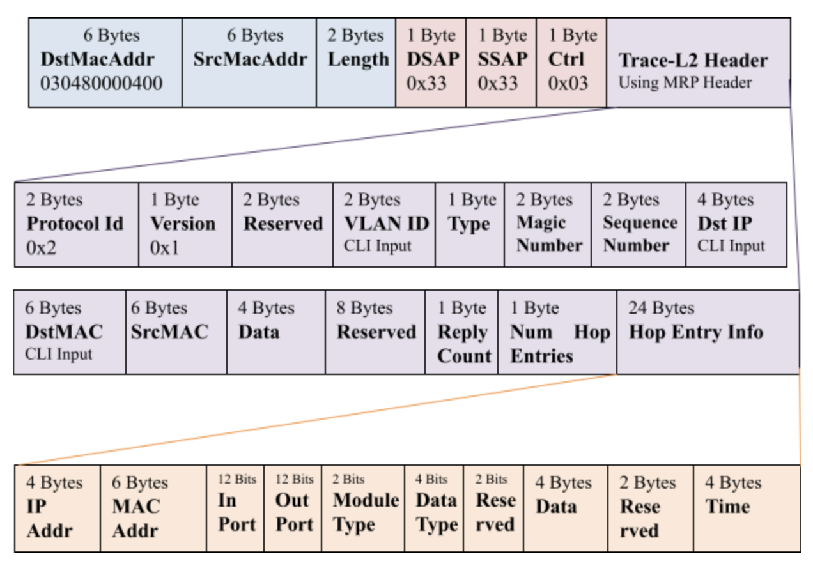

# Feature Name

L2 Traceroute

# High Level Design Document

#### Rev 1.1

# Table of Contents

# List of Tables

[Table 1: Abbreviations](#table-1-abbreviations)

# Revision
| Rev  |    Date    |       Author        | Change Description                                           |
|:--:|:--------:|:-----------------:|:------------------------------------------------------------:|
| 0.1  | 05/03/2021 |   Dhanasekar Rathinavel   | Initial version                                              |
|      |            |                      |                    |

# Definition/Abbreviation

### Table 1: Abbreviations

| **Term** | **Meaning**                    |
| -------- | ------------------------------ |
| LAN      | Local Area Network             |
| MAC      | Media Access Control addresses |
| VLAN     | Virtual Local Area Network     |
|          |                                |

# About this Manual

This document provides general overview of L2 Traceroute feature(Trace-L2).


# 1 Introduction and Scope

Trace-L2 can trace all the L2 traffic paths for a given VLAN or to a particular destination device in the given VLAN. The destination device is identified based on its IP, DNS name or unicast-MAC. The main use of the Trace-L2 feature is to provide flexibility to administrators to determine the L2 paths in a L2 topology.
Trace-L2 is a proprietary feature and it cannot interop with any other vendors. FYI, cisco has its own proprietary L2-traceroute.

# 2 Requirements Overview

## 2.1 Functional Requirements

Trace-L2 feature supports the following:

- Traces all the available paths to a particular IP, MAC or hostname in a VLAN.
- Probes the entire Layer 2 topology.
- Displays the input or output ports of each hop in the path.
- Displays the round trip travel time of each hop.
- Displays hops in a VLAN that form a loop.

The resulting trace displays a report that provides information about a packet’s path to a device, such as hop and port information and travel time. It also can locate any Layer 2 loop in a VLAN. The probed Layer 2 information is discarded when a new command is issued again.

For each hop in the path, trace-l2 displays its input/output port, L2 protocols of the input port, and the microsecond travel time between hop and hop. It also prints out the hops which form a loop, if any. Displaying L2 topology lets a user easily obtain information of all hops.

The devices that will participate in the trace-l2 protocol must be assigned to a VLAN. Devices that do not support the trace-l2 protocol will forward the trace-l2 packets without a reply. Hence, these devices are transparent to the trace-l2 protocol. The destination for the packet with the trace-l2 protocol must be a device that supports the trace-l2 protocol and the destination cannot be a client, such as a personal computer, or devices from other vendors. Trace-l2 will follow the xSTP path if enabled in the system.


## 2.2 Configuration and Management Requirements
- Trace-l2 first tries to use the IP address of the virtual routing interface that is associated with a VLAN. If the virtual routing interface is not available, it then uses the loopback address. If both addresses are not available, it displays MAC address only.
- One way time is not available because the trace-l2 protocol does not synchronize the clocks between hops.


## 2.3 Scalability Requirements
The trace-l2 command cannot reach any device beyond ~60 hops. The maximum hop number is ~60 which is the number of hub informations that can be stored in a 1500 bytes Ethernet packet.  


## 2.4 Warm Boot Requirements

This is a utility command. Warmboot will not be supported. 

## 2.5 Use case

The main use of the Trace-L2 feature is to provide flexibility to the administrators to determine the L2 paths in a L2 topology. The protocol provides a high level overview of the L2 topology.

# 3 Design

## 3.1 Overview

L2Trace container will have L2TraceMgr and L2Traced processes.

L2Trace process will register with the APP DB for receiving all the L2Trace configurations. L2TraceMgr will notify this configuration information to L2Traced for starting the session. 

L2Traced process will handle following interactions. L2Traced will use libevent for processing the incoming events and timers.

1) Packet processing 

- Socket of PF_PACKET type will be created for packet tx/rx 
- Filters will be attached to the socket to receive the L2Trace PDUs based on DA MAC (03:04:80:00:00:00)

2) Configuration -  L2Trace CLI commands will be received from L2TraceMgr via a unix domain socket.
3) Timers handling - Timer events are generated every 1sec for handling L2Trace protocol timers.
4) Port events - Netlink socket interface for processing create/delete of port, link state changes of port.
5) Operational updates - *L2Tracesync* is part of *L2Traced* and handles all the updates to APP DB. All DB interactions are detailed in the Section 3.2.

### 3.1.1 L2-Trace PDU processing

  

MRP(Media Ring Protection) protocol was a BROCADE proprietary protocol. The trace-l2 BPDU is a MRP RHP (ring health packet) which has the following format. 

```
destination MAC (6 bytes: 0304.8000.0000)  
source MAC (6 bytes)
length (2 bytes)
LLC header (3 bytes: 0x33 0x33 0x03)
protocol_id (2 bytes)  // set to 2, which indicates trace-l2 Packet
protocol_version (1 byte, should be 1)
Type                  // query/reply
```

These fields are followed by MRP packet format. The MRP protocol id field is increased from 1 to 2. 

We are holding the IP-rights to BROCADE MAC address so we can continue to use BROCADE Multicast MAC. 

When a trace-l2 command is issued, 

- the device constructs a RHP packet with protocol id of 2 and trace type of “query”. The payload includes the destination IP address or a destination unicast MAC address. The packet is flooded on the vlan. 

When a trace-l2 packet is received,

- If the payload destination addresses matches the device address, it appends its information to the payload, changes the trace type to “reply” and sends it back to through the input port. The reply packet is unicasted to the source, it uses the same packet format with trace type='reply'. The destination IP address must match the address of the VE associated with the queried vlan or any loopback address.
- If the destination address in the payload does not match, the device appends its information to the payload as a HOP entry and floods the BPDU to the entire vlan except the input port.
  - If the destination device finds itself already in the list of HOPs traveresed by the packet , a LOOP is identified and reported.
- During L2 forwarding query or reply, the source MAC address is always updated to avoid potential trouble such as station movement.

Only 1 active session can exist per VLAN+destination. A syslog error will be thrown if an active trace-l2 session is already in progress for the same VLAN+destination. When a reply comes back, the device prints the trace and cancels the associated timer. If there is no reply before the one-second timer gets expired, the one-second timer will print out failure and frees the data structure. If the reply is received after the timer expiry, it will be silently dropped. The assumption here is that one second of the waiting time is adequate in a L2 environment.

## 3.2 DB Changes

This section describes the changes made to different DBs for supporting the L2 Traceroute protocol.

### 3.2.1 APP DB

Following APP DB schemas are defined / modified for supporting this feature:

### TRACE_L2_SESSION_TABLE

    ;Stores Trace L2 session details
    ;Status: work in progress
    key                    = TRACE_L2_SESSION:"Vlan"vlanid:MAC:IP 
    session_id             = 4*DIGIT           ; max 4096 sessions
    path_count             = 2*DIGIT           ; 


### TRACE_L2_PATH_INFO_TABLE

    ;Stores Trace L2 paths per session
    ;Status: work in progress
    key                    = TRACE_L2_PATHS:session_id:path_no 
    hop_count              = 2*DIGIT            ; 


### TRACE_L2_HOP_INFO_TABLE

    ;Stores Trace L2 hop information per session details
    ;Status: work in progress
    key                    = TRACE_L2_HOP_INFO:session_id:path_no:hop_entry 
    device_name            = STRING            ; device name
    ip                     = STRING            ; ip address of the VE or Loopback ip of device 
    mac                    = STRING            ; mac address of the device
    in_port                = STRING            ; input port name
    out_port               = STRING            ; "FLOOD" or a port name
    is_loop                = true/false        ; 


## 3.3 Switch State Service Design

### 3.3.1 Orchestration Agent

No changes

### 3.3.2 BPDU trap mechanism

SONiC uses copp configuration file 00-copp.config.json for  configuring the trap group, ids, cpu priority queue and a policer. This  functionality has been extended for supporting L2-Trace BPDU trap to CPU.

## 3.4 SAI

No SAI changes required

## 3.5 User Interface

### 3.5.1 Data Models

Work in progress. Openconfig YANG model is not available for L2-Trace, We will propose a l2-trace-extenstion.

#### 3.5.2 CLI

##### 3.5.2.1 Configuration Commands

There is no config CLI. 

##### 3.5.2.2 Show Commands

- trace-l2 show  vlan <vlan_id> mac <destination_address>
- trace-l2 show  vlan <vlan_id> ip <destination_address>
```
 The probed topology is displayed using this command.

```

##### 3.5.2.3 Exec Commands

- trace-l2 vlan <vlan_id> mac <destination_address>
- trace-l2 vlan <vlan_id> ip <destination_address>

```
This command is used to trace traffic path of a packets in a L2 topology for a specific vlan

The <destination address> can be a MAC address, an IP address, or a host name. You can enter the
destination-address in one of the following formats:

- HHHH.HHHH.HHHH – Destination MAC address
- A.B.C.D – Destination IP address
- ASCII string – Destination host name

If a destination address is not specified as shown below or the destination does not exists, trace-l2 collects L2 topology information which can be displayed by issuing a ‘trace-l2 show’ command.
```

- trace-l2 vlan <vlan_id>
```
This command is used to probe L2 traffic path of a packets in a L2 topology for a specific vlan.
```


* show trace-l2 vlan <vlan_id> mac <destination_address>
* show trace-l2 vlan <vlan_id> ip <ip_address>
* show trace-l2 vlan <vlan_id>

# 4 Flow Diagrams

# 5 Serviceability and Debug

The existing logging mechanisms shall be used. Proposed debug framework shall be used for internal state dump.

# 6 Limitations

Following are not supported in the first release,

* L2-Trace to a hostname.
* L2-Trace on IPv6.
* L2-Trace over VxLAN.
* Maximum number of parallel sessions is limited to MAX Vlan. Even though the possibility can be extended infinitely to the combination of VLAN+MAC+IP, we shall plan to increase the max_parallel_sessions on need basis. 

# 7 Unit Test cases

| TC ID | Category         | Objective                                                    |
| ----- | ---------------- | ------------------------------------------------------------ |
| 1     | Basic            | Verify if all the Trace-L2 CLIs are available and gives necessary options. |
| 2     | Basic            | Trace-l2 operation on valid vlan                             |
| 3     | Basic            | Trace-l2 operation on valid host name which is reachable     |
| 4     | Basic            | Trace-l2 operation on valid host name which is not reachable |
| 5     | Integration      | Verify Mcast Suppression port works                          |
| 6     | Negative         | Trace-l2 operation on invalid vlan                           |
| 7     | Negative         | Trace-l2 operation on invalid host name                      |
| 8     | Negative         | Trace-l2 operation on Self IP Address                        |
| 9     | Negative         | Trace-l2 operation on Bridge MAC Address                     |
| 10    | Negative         | Perform more than one trace-l2 operation from different sessions |
| 11    | Interoperability | Perform Trace-L2 between SONiC and Non-SONiC device.         |
| 12    | Advanced         | Verify whether a LOOP is detected by Trace-L2.               |
| 13    | Basic            | Verify that Trace-L2 works on tagged ports                   |
| 14    | Advanced         | Verify that Trace-L2 works on a mix of tagged and untagged ports |
| 15    | Basic            | Verify trace-l2 in three node topology                       |
| 16    | Advanced         | Verify trace-l2 in four node topology                        |
| 17    | Basic            | Verify that time, input and output ports are displayed accurately |
| 18    | Basic            | Verify that the topology is held for 10 minutes              |
| 19    | Basic            | Verify trace-l2 to a destination IP                          |
| 20    | Basic            | Verify trace-l2 to a destination MAC                         |
| 21    | Basic            | Verify trace-l2 in multiple paths topology                   |
| 22    | Interaction      | Verify that Rx trace-l2 packet is dropped on STP non-fwding port |
| 23    | Negative         | Verify that Rx trace-l2 packet is dropped on port which is not part of vlan |
| 24    | Basic            | Verify new trace-l2 operation on Session1(VLAN1, destination1), cleans up operational data for same Session1(VLAN1, destination1) |
| 25    | Basic            | Verify new trace-l2 operation on Session2(VLAN2, destination2), does not cleanup operational data for Session1(VLAN1, destination1) |
| 26    | Advanced         | Verify no tracel2 topology exists after DUT Reload           |
| 27    | Advanced         | Verify that Ctrl+C behavior on trace-l2 exec CLI             |
| 28    | Advanced         | Verify trace-l2 operation over LAG/Port Channel              |
|       |                  |                                                              |
