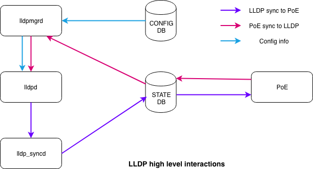

# Feature Name

LLDP enhancements

# High Level Design Document

#### Rev 0.1

# Table of Contents

  * [List of Tables](#list-of-tables)
  * [Revision](#revision)
  * [About This Manual](#about-this-manual)
  * [Scope](#scope)
  * [Definition/Abbreviation](#definitionabbreviation)
  * [Requirements Overview](#requirement-overview)
    * [Functional Requirements](#functional-requirements)
    * [Configuration and Management Requirements](#configuration-and-management-requirements)
    * [Scalability Requirements](#scalability-requirements)
    * [Warm Boot Requirements](#warm-boot-requirements)
  * [Functionality](#-functionality)
    * [Functional Description](#functional-description)
  * [Design](#design)
    * [Overview](#overview)
    * [DB Changes](#db-changes)
      * [CONFIG DB](#config-db)
      * [APP DB](#app-db)
    * [Switch State Service Design](#switch-state-service-design)
      * [Orchestration Agent](#orchestration-agent)
    * [SAI](#sai)
    * [CLI](#cli)
      * [Configuration Commands](#configuration-commands)
      * [Show Commands](#show-commands)
      * [Debug Commands](#debug-commands)
      * [Clear Commands](#clear-commands)
  * [Flow Diagrams](#flow-diagrams)
  * [Serviceability and Debug](#serviceability-and-debug)
  * [Warm Boot Support](#warm-boot-support)
  * [Scalability](#scalability)
  * [Industry standard CLI](#industry-standard-cli)
  * [Unit Test](#unit-test)

# List of Tables

[Table 1: Abbreviations](#table-1-abbreviations)

# Revision

| Rev  |    Date    |      Author      | Change Description |
| :--: | :--------: | :--------------: | ------------------ |
| 0.1  | 05/03/2021 | Sandeep, Praveen | Initial version    |
|      |            |                  |                    |
|      |            |                  |                    |
|      |            |                  |                    |


# About this Manual

This document provides general information about the LLDP MED and other enhancements in SONiC.

# Scope

This document describes the high level design of LLDP feature. 

# Definition/Abbreviation

### Table 1: Abbreviations

| **Term** | **Meaning**                       |
| -------- | --------------------------------- |
| CoS      | Class of service                  |
| DSCP     | Differentiated Service Code point |
| MED      | Media endpoint discovery          |
| PoE      | Power over Ethernet               |
|          |                                   |
|          |                                   |
|          |                                   |
|          |                                   |
|          |                                   |


# 1 Requirement Overview

## 1.1 Functional Requirements


 1. Support LLDP MED voice vlan with dot1p, cos and dscp marking value for phones to use 

 2. Support LLDP MED voice vlan configuration on physical interface

 3. Support LLDP MED Power management functionality

 4. Support configuring the management IP address to be advertised by LLDP

     


## 1.2 Configuration and Management Requirements

This feature will support CLI and REST based configurations.

 1. Support CLI configurations as mentioned in section 3.6.2

    

      


## 1.3 Scalability Requirements

No limit, all physical interfaces in the system can be enabled with LLDP and voice vlan.

## 1.4 Warm Boot Requirements

None


# 2 Functionality

## 2.1 Functional Description

### 2.1.1 LLDP-MED

LLDP-MED supports below TLVs:

Network policy profile -

Allows the device to advertise the voice VLAN information to endpoint devices like VoIP phones. Along with voice VLAN, tagging mode, dot1p CoS  and DSCP values can be sent to the endpoint device. Voice VLAN feature enables switch ports to carry voice traffic with defined priority so as to enable separation of voice and data traffic coming onto the port. This is to ensure that sound quality of an IP phone could be safeguarded from deteriorating when the data traffic on the port is high.

Note: Voice VLAN TLV should be enabled only with compatible devices

Possible combinations of voice vlan traffic -


- Assign Voice VLAN to the IP phone. Phone will send voice packets tagged with the voice vlan and the data traffic will come untagged. This is the most common deployment.
- Assign a Dot1p priority to the IP phone. Phone will send voice packets with 802.1p tag and data traffic will be untagged.
- Allow the IP phone to send untagged voice traffic. Voice traffic cannot be differentiated from data traffic and no QoS can be provided.

  


Power management TLV -

Allows the network device and endpoint device to exchange the power information like how the device is powered on, power priority, power required by the device.

### 2.1.2 LLDP Power negotiation

This supports inline power negotitation using LLDP as per IEEE 802.3at and 802.3bt standard.

### 2.1.3 LLDP Management TLV IP address

By default, LLDP will advertise the management IP address configured in the system over management interface. In case user wants to override this and advertise a specific IP address on an interface then the same can be acheived by using the configuration commands specified in Section 3.6.2.2.1

# 3 Design

## 3.1 Overview



## 3.2 DB Changes

This section describes the changes made to different DBs for supporting this feature.

### 3.2.1 CONFIG DB

Following config DB schemas are defined for supporting this feature.

### NETWORK_POLICY_PROFILE_TABLE

    ;Stores Network policy configuration for a profile number
    ;Status: work in progress
    key                    = NETWORK_POLICY_PROFILE|number     ; Network policy profile number


### NETWORK_POLICY_APP_TABLE

    ;Stores Network policy configuration for an application type
    ;Status: work in progress
    key                    = NETWORK_POLICY_APP|number|app_type     ; number is network policy profile number
                                                                    ; app_type can be voice or voice-signalling
    vlan                   = "id"                                   ; vlan id range 1 to 4094
    priority               = 1*DIGIT                                ; priority value range 0 to 7
    tagged                 = "true/false"                           ; vlan is tagged or untagged
    dscp                   = 2*DIGIT                                ; dscp value range 0 to 63


### LLDP_PORT_TABLE

    ;Stores LLDP configuration for the port
    ;Status: work in progress
    key                           = LLDP_PORT|ifname            ; LLDP port configuration
    enabled                       = "true/false"                ; LLDP enabled or disabled on port
    mode                          = "receive/transmit"          ; LLDP mode transmit or receive
    mgmt_ipv4                     = "ipv4 addr"                 ; IPv4 address to be advertised as management IP
    mgmt_ipv6                     = "ipv6 addr"                 ; IPv6 address to be advertised as management IP
    supp_med_network_policy_tlv   = "true/false"                ; Suppress LLDP-MED network policy TLV advertise
    supp_med_power_mgmt_tlv       = "true/false"                ; Suppress LLDP-MED power management TLV advertise
    supp_dot3_power_mgmt_tlv      = "true/false"                ; Suppress LLDP power negotiation TLV (802.3at/bt)
    network_policy                = 1*3DIGIT                    ; Network policy profile number


### 3.2.2 STATE DB

Below tables are updated by LLDP 

### LLDP_MED_POWER_MGMT_TLV_TABLE

```
;Stores LLDP-MED power management TLV received from LLDP neighbor
;Status: work in progress
key                    = LLDP_MED_POWER_MGMT_TLV:ifname   ; LLDP-MED power management TLV received on port
power_type             = "type"                           ; Power type pse or pd
power_source           = "source"                         ; Power source unknown or primary or backup
power_priority         = "priority"                       ; Power priority low, high, critical or unknown
power_level            = "level"                          ; Power value in milliwatts
```

### LLDP_8023AT_POWER_MGMT_TLV_TABLE

```
;Stores LLDP 802.3at power management TLV received from LLDP neighbor
;Status: work in progress
key                    = LLDP_8023AT_POWER_MGMT_TLV:ifname  ; LLDP 802.3 power management TLV received on port
device-type            = "type"                             ; Device type pse or pd
supported              = "true/false"                       ; whether Power is supported or not
enabled                = "true/false"                       ; whether Power is enabled or not
paircontrol            = "true/false"                       ; whether pair selection can be controlled or not
pairs                  = "pairs"                            ; power pairs in use signal or spare
class                  = 1DIGIT                             ; class 0 to 4
power-type             = 1DIGIT                             ; 802.3at type 1 or type 2
source                 = "source"                           ; Power source unknown or primary or backup
priority               = "priority"                         ; Power priority low, high, critical or unknown
requested              = "level"                            ; Requested power value in milliwatts
allocated              = "level"                            ; Allocated power value in milliwatts
```

### LLDP_8023BT_POWER_MGMT_TLV_TABLE

```
;Stores LLDP 802.3bt power management TLV received from LLDP neighbor
;Status: work in progress
key                    = LLDP_8023BT_POWER_MGMT_TLV:ifname  ; LLDP 802.3 power management TLV received on port
device-type            = "type"                             ; Power type pse or pd
supported              = "true/false"                       ; whether Power is supported or not
enabled                = "true/false"                       ; whether Power is enabled or not
paircontrol            = "true/false"                       ; whether pair selection can be controlled or not
pairs                  = "pairs"                            ; power pairs in use signal or spare
class                  = 1DIGIT                             ; class 0 to 4
power-type             = 1DIGIT                             ; 1 to 4, 802.3at type 1 or type 2, 802.3bt type 3 or type 4
source                 = "source"                           ; Power source unknown or primary or backup
priority               = "priority"                         ; Power priority low, high, critical or unknown
pd_4pid                = "true/false"                       ; PD supports 4 pair power 
requested              = "level"                            ; Requested power value in milliwatts
allocated              = "level"                            ; Allocated power value in milliwatts
requested-a            = "level"                            ; Requested mode A power value in milliwatts
requested-b            = "level"                            ; Requested mode B power value in milliwatts
allocated-a            = "level"                            ; Allocated mode A power value in milliwatts
allocated-b            = "level"                            ; Allocated mode B power value in milliwatts
pd-powering-status     = 1DIGIT                             ; 0 to 3, 3 - 4pair dual sig, 2 - 2pair dual sig, 1 - single sig
power-class-ext-a      = 1DIGIT                             ; 0 to 7
power-class-ext-b      = 1DIGIT                             ; 0 to 7
power-class-ext        = 1*2DIGIT                           ; 0 to 15
power-type-ext         = 1DIGIT                             ; 0 to 7 system power type extension
setup-pd-load          = "true/false"                       ; Power demand is electrically isolated or not
auto-class-req         = "true/false"                       ; PD requests autoclass measurement
power-down-req         = "true/false"                       ; PD requested power down
power-down-time        = 1*6DIGIT                           ; PD requested power down time range 0 to 262143
```


Below tables are updated by PoE module.

### POE_MED_POWER_MGMT_TLV_TABLE

```
;Stores LLDP-MED power management TLV received from LLDP neighbor
;Status: work in progress
key                    = POE_MED_POWER_MGMT_TLV:ifname   ; LLDP-MED power management TLV received on port
device-type            = "type"                          ; Device type pse or pd
source                 = "source"                        ; Power source unknown or primary or backup
priority               = "priority"                      ; Power priority low, high, critical or unknown
power                  = "level"                         ; Power value in milliwatts
```

### POE_8023AT_POWER_MGMT_TLV_TABLE

```
;Stores LLDP 802.3at power management TLV received from LLDP neighbor
;Status: work in progress
key                    = POE_8023AT_POWER_MGMT_TLV:ifname   ; LLDP 802.3 power management TLV received on port
device-type            = "type"                             ; Device type pse or pd
supported              = "true/false"                       ; whether Power is supported or not
enabled                = "true/false"                       ; whether Power is enabled or not
paircontrol            = "true/false"                       ; whether pair selection can be controlled or not
pairs                  = "pairs"                            ; power pairs in use signal or spare
class                  = 1DIGIT                             ; class 0 to 4
power-type             = 1DIGIT                             ; 802.3at type 1 or type 2
source                 = "source"                           ; Power source unknown or primary or backup
priority               = "priority"                         ; Power priority low, high, critical or unknown
requested              = "level"                            ; Requested power value in milliwatts
allocated              = "level"                            ; Allocated power value in milliwatts
```

### POE_8023BT_POWER_MGMT_TLV_TABLE

```
;Stores LLDP 802.3bt power management TLV received from LLDP neighbor
;Status: work in progress
key                    = POE_8023BT_POWER_MGMT_TLV:ifname   ; LLDP 802.3 power management TLV received on port
device-type            = "type"                             ; Power type pse or pd
supported              = "true/false"                       ; whether Power is supported or not
enabled                = "true/false"                       ; whether Power is enabled or not
paircontrol            = "true/false"                       ; whether pair selection can be controlled or not
pairs                  = "pairs"                            ; power pairs in use signal or spare
class                  = 1DIGIT                             ; class 0 to 4
power-type             = 1DIGIT                             ; 1 to 4, 802.3at type 1 or type 2, 802.3bt type 3 or type 4
source                 = "source"                           ; Power source unknown or primary or backup
priority               = "priority"                         ; Power priority low, high, critical or unknown
pd_4pid                = "true/false"                       ; PD supports 4 pair power (Not required since we are PSE ??)
requested              = "level"                            ; Requested power value in milliwatts
allocated              = "level"                            ; Allocated power value in milliwatts
requested-a            = "level"                            ; Requested mode A power value in milliwatts
requested-b            = "level"                            ; Requested mode B power value in milliwatts
allocated-a            = "level"                            ; Allocated mode A power value in milliwatts
allocated-b            = "level"                            ; Allocated mode B power value in milliwatts
pse-powering-status    = 1DIGIT                             ; 0 to 3, 3 - 4pair dual sig, 2 - 4pair single sig, 1 - 2pair power
power-pairs-ext        = 1DIGIT                             ; 0 to 3, 3 - both alt, 2 - alt B, 1 - alt A
power-class-ext-a      = 1DIGIT                             ; 0 to 7
power-class-ext-b      = 1DIGIT                             ; 0 to 7
power-class-ext        = 1*2DIGIT                           ; 0 to 15
power-type-ext         = 1DIGIT                             ; 0 to 7 system power type extension
max-power              = "level"                            ; Max available PSE power value in milliwatts
auto-class-support     = "true/false"                       ; PSE supports autoclass or not
auto-class-completed   = "true/false"                       ; PSE autoclass measurement completed

```

## 3.4 LLDP Container


## 3.5 SAI

None

## 3.6 CLI

### 3.6.1 Data Models

### 3.6.2 Configuration Commands

### 3.6.2.1 Global level 

### 3.6.2.1.1 Network policy profile

Create a network policy profile. The profile number can range from 1 to 128.

**[no] network-policy profile number**

Configure the network policy profile parameters using below command -

**[no] {voice | voice-signaling} vlan [** vlan-id **{** **[** **cos** value **| dscp** value **]** | **untagged** **}**| **[dot1p { ** **cos** value **| dscp** value **}] ]**

**voice** - to select application type voice

**voice-signalling** - to select application type voice-signalling

**vlan** vlan-id - specify the voice vlan 

**cos** value - specify L2 priority class of service value for the vlan

**dscp** value - specify the differentiated services code point value

**dot1p** - this option allows to use 802.1 priority tagging with VLAN 0

**untagged** - specify voice traffic to be untagged

Example -

Configuring voice vlan with tagging, cos and dscp values

```
sonic(config)# network-policy profile 1
sonic(conf-network-policy)# voice vlan 100 cos 4 dscp 20
```
Configuring voice vlan with priority tagging (vlan 0), cos and dscp values

```
sonic(config)# network-policy profile 2
sonic(conf-network-policy)# voice vlan dot1p cos 3 dscp 10
```

Configuring voice vlan as untagged 

```
sonic(config)# network-policy profile 3
sonic(conf-network-policy)# voice vlan 100 untagged
```
 ### 3.6.2.2 Interface level 

 ### 3.6.2.2.1 LLDP management ip address

This command can be used to configure an IPv4 or IPv6 management address that will be used to advertise by LLDP on an interface.

**[no] lldp tlv-set { management-address {ipv4|ipv6} ip-address}**

```
sonic(config)# interface Ethernet 0
sonic(conf-if-Ethernet0)# lldp tlv-set management-address ipv4 10.1.1.1
```


### 3.6.2.2.2 LLDP-MED network policy

This command can be used to configure the network policy profile for an interface.

**[no] network-policy <number>**

Example -

Configuring a network policy profile and applying it to an interface

```
sonic(config)# network-policy profile 1
sonic(conf-network-policy)# voice vlan 100 cos 4 dscp 20
sonic(config)# interface Ethernet 0
sonic(conf-if-Ethernet0)# network-policy 1
```

### 3.6.2.2.3 LLDP-MED TLV advertise selection

This command can be used to select whether to advertise the LLDP-MED TLVs or not. By default the LLDP-MED TLVs are advertised. 

**[no] lldp med-tlv-select [network-policy | power-management]** 

Example -

```
sonic(config)# interface Ethernet 0
sonic(conf-if-Ethernet0)# no lldp med-tlv-select network-policy
```

```
sonic(config)# interface Ethernet 0
sonic(conf-if-Ethernet0)# no lldp med-tlv-select power-management
```

### 3.6.2.2.4 LLDP 802.3 power management TLV advertise selection

This command can be used to select whether to advertise the LLDP 802.3at or bt power management TLVs or not. By default this TLV is advertised.

**[no] lldp tlv-select power-management**

Example -

```
sonic(config)# interface Ethernet 0
sonic(conf-if-Ethernet0)# no lldp tlv-select power-management
```


### 3.6.3 Show Commands

Below is an example of show lldp neighbor with LLDP-MED power management info -

sonic# show lldp neighbor

Interface:   Ethernet60,via: LLDP
  Chassis:
    ChassisID:    3c:2c:99:2d:87:35
    SysName:      sonic
    SysDescr:     SONiC Software Version: SONiC-Enterprise_Advanced-dbg - HwSku: Accton-AS7816-64X - Distribution: Debian 10.9 - Kernel: 4.19.0-9-2-amd64
    TTL:          20
    MgmtIP:       10.59.142.201
    MgmtIP:       fe80::3e2c:99ff:fe2d:8735
    Capability:   MAC_BRIDGE, ON
    Capability:   ROUTER, ON
  Port
    PortID:       Ethernet32
    PortDescr:    Eth1/9
    
    MED Extended Power via MDI:   
        Device type:  PSE
        Power Source: PSE
        Power Priority: high
        Power Value: 0


Below is an example of show lldp neighbor with LLDP 802.3at power management info -

sonic# show lldp neighbor

Interface:   Ethernet60,via: LLDP
  Chassis:
    ChassisID:    3c:2c:99:2d:87:35
    SysName:      sonic
    SysDescr:     SONiC Software Version: SONiC-Enterprise_Advanced-dbg - HwSku: Accton-AS7816-64X - Distribution: Debian 10.9 - Kernel: 4.19.0-9-2-amd64
    TTL:          20
    MgmtIP:       10.59.142.201
    MgmtIP:       fe80::3e2c:99ff:fe2d:8735
    Capability:   MAC_BRIDGE, ON
    Capability:   ROUTER, ON
  Port
    PortID:       Ethernet32
    PortDescr:    Eth1/9

    MDI Power:    supported: yes, enabled: yes, pair control: yes
        Device type:  PSE
        Power pairs:  spare
        Class:        class 1
        Power type:   1
        Power Source: PSE
        Power Priority: high
        PD requested power Value: 0
        PSE allocated power Value: 0


### 3.6.4 Debug Commands


### 3.6.5 Clear Commands


### 3.6.6 REST API Support

REST APIs is supported in this release

### 

# 4 Flow Diagrams


# 5 Serviceability and Debug


# 6 Warm Boot Support

Warm boot is not supported

# 7 Scalability

No limit, all physical interfaces in the system can be enabled with LLDP and voice vlan.


# 8 Unit Test


1. Verify configuring Network profile with voice application type and corresponding vlan attributes
2. Verify configuring Network profile with voice-signaling application type and corresponding vlan attributes
3. Verify applying and removing LLDP MED network profile to an interface
4. Verify LLDP-MED voice vlan TLV is advertised when profile is applied on interface and advertisement is stopped when profile is removed. Verify the voice vlan TLV has the information encoded as per the profile parameters.
5. When device is advertising the voice VLAN TLV, disable adversting this TLV (no lldp med-tlv-select network-policy) 
6. Configure an LLDP mgmt IPv4 address on an interface and verify the LLDP mgmt TLV advertised has the corresponding mgmt IPv4 address.
7. Configure an LLDP mgmt IPv6 address on an interface and verify the LLDP mgmt TLV advertised has the corresponding mgmt IPv6 address.
8. Remove the LLDP mgmt IP addresses configured and verify the default system mgmt IP addresses are advertised
8. Verify LLDP MED power management TLV exchange along with PoE
9. Verify LLDP 802.3at power management TLV exchange along with PoE
10. Verify LLDP MED power management TLV is not advertised when the TLV advertisement is stopped for that interface, verify the advertisement is started when enabled back.
11. Verify LLDP 802.3 power management TLV is not advertised when the TLV advertisement is stopped for that interface, verify the advertisement is started when enabled back.
