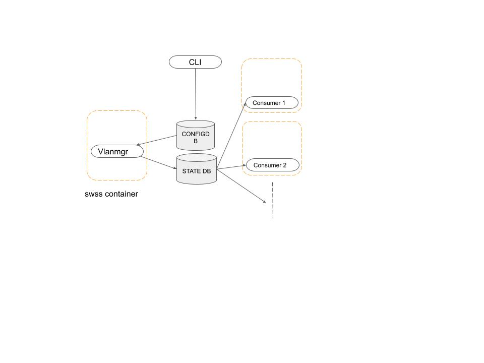

# Reserved VLAN range in SONiC

# High Level Design Document
#### Rev 0.1
# Table of Contents
* [List of Tables](#list-of-tables)
* [List of Figures](#list-of-figures)
* [Revision](#revision)
* [About this Manual](#about-this-manual)
* [Scope](#scope)
* [Defintions/Abbreviation](#definitionsabbreviation)
* [1 Overview](#1-overview)
    - [1.1 Use Cases](#11-use-cases)
* [2 Requirements](#2-requirements)
    - [2.1 Functional Requirements](#21-functional-requirements)
    - [2.2 Configuration and Management Requirements](#22-configuration-and-management-requirements)
    - [2.3 Scalability Requirements](#23-scalability-requirements)
    - [2.4 Supported Debug Counters](#24-supported-debug-counters)
* [3 Design](#3-design)
    - [3.1 CLI (and usage example)](#31-cli-and-usage-example)
        - [3.1.1 Configure Reserved Vlan range](#311-configure-reserved-vlan-range)
    - [3.2 Config DB](#32-config-db)
        - [3.2.1 RESERVED_VLAN_TABLE Table](#321-reserved-vlan-table)
    - [3.3 State DB](#33-state-db)
        - [3.3.1 RESERVED_VLAN_STATE_TABLE Table](#331-reserved-vlan-state-table)
    - [3.4 Notification](#34-notifications)
        - [3.4.1 RESERVEDVLANCHANGED](#341-reservedvlanchange)
        - [3.4.2 RESERVEDVLANALLOCATE](#341-reservedvlanallocate)
        - [3.4.3 RESERVEDVLANALLOCATED](#341-reservedvlanallocated)
    - [3.5 SWSS](#35-swss)
        - [3.5.1 Vlan Manager](#351-vlan-manager)
        - [3.5.2 SAI APIs](#352-sai-apis)
    - [3.6 syncd](#36-syncd)
    - [3.7 SAI](#37-sai)
    - [3.8 KLISH CLI](#38-klish-cli)
        - [3.8.1 Show Commands](#381-show-commands)
        - [3.8.2 Clear Commands](#382-clear-commands)
        - [3.8.3 Config Commands](#383-config-commands)
    - [3.9 SONIC Yang model](#39-sonic-yang-model)
* [4 Flows](#4-flows)
    - [4.1 General Flow](#41-general-flow)
* [5 Warm Reboot Support](#5-warm-reboot-support)
* [6 Unit Tests](#6-unit-tests)
* [7 Platform Support](#7-platform-support)
    - [7.1 Known Limitations](#7.1-known-limitations)
* [8 Open Questions](#8-open-questions)
* [9 Acknowledgements](#9-acknowledgements)
* [10 References](#10-references)
* [11 Sample Configuration](#11-sample-configuration)
- [Broadcom Internal Information : To be removed before publishing externally.](#broadcom-internal-information---to-be-removed-before-publishing-externally)
# List of Tables
* [Table 1: Abbreviations](#definitionsabbreviation)

# List of Figures

# Revision
| Rev | Date     | Author      | Change Description        |
|:---:|:--------:|:-----------:|---------------------------|
| 0.1 | 10/20/21 | Anil Pandey | Initial version           |
| 0.2 | 11/08/21 | Priyanka Gupta | Updated KLISH UI, yang models and UT section |

# About this Manual
This document provides an overview of the implementation of Reserved Vlans in SONiC.

# Scope
This document describes the high level design of the Reserved Vlans feature.

# Definitions/Abbreviation
| Abbreviation | Description                 |
|--------------|-----------------------------|
| PAC          | Port Access Control         |

## 1 Overview
The main goal of this feature is to provide a set of configurable Vlans that are reserved for use by various protocols. 
- A set of Vlans will be reserved by default.
- A config CLI command will be provided to change the reserved Vlan range.

## 1.1 Use Cases

# 2 Requirements

## 2.1 Functional Requirements

- When a feature needing reserved-vlan is enabled, it will try and pickup a not-in-use vlan from the default range. If not available user must
	- Free up a vlan from that range OR
	- Change the reserved vlan range 
	- Until either of the above is setup, the feature will not function.

- When a feature needing reserved vlan is enabled and it finds a vlan in the range, it is responsible for creating that vlan using the internal VLAN manager provided interface. The feature is responsible for create/delete/modifies port-membership for that vlan. 

- Default reserved VLAN range would be <3967-4094>.

- All show commands will necessarily inform the user of any vlan usage within the current reserved vlan range and urge to move the use to a different vlan.

- There will also be be warnings and syslog message (if a vlan in the reserved range is in use) that indicate that upon a migration to a future release, all user created config within the reserved vlan range will be deleted as part of migration. 

- User creation of vlans in reserved range will be blocked. But if a vlan is in use already (as part of migrated config), additional config on that vlan will be allowed.

## 2.2 Configuration and Management Requirements

## 2.3 Scalability Requirements

## 2.4 Supported Debug Counters

# 3 Design

## 3.1 CLI (and usage example)

### 3.1.1 Configure Reserved Vlan range

## 3.2 Config DB

One new table will be added to Config DB:
* RESERVED_VLAN_TABLE to store configured rserved vlan range

### 3.2.1 RESERVED_VLAN_TABLE Table

    ;Stores Reserved Vlan configuration
    key             = RESERVED_VLAN|"Vlan name"  

## 3.3 State DB
State DB will store information about:
* Reserved Vlans and whether it is in use

### 3.3.1 RESERVED_VLAN_TABLE Table

    ;Stores Reserved Vlan information
    key             = RESERVED_VLAN|"Vlan name" 
    inuse           = "true"/"false"  ; whether the reserved vlan is in use

## 3.4 Notifications
Notification will be sent from Vlanmgr to the consumers (Ex. PAC), indicating a change in reserved vlan range.

### 3.4.1 RESERVEDVLANCHANGED
Sent from Vlan Manager to indicate a chaneg in Rserved Vlan Range.

    OP: ""
    DATA: ""
    VALUES: ""

### 3.4.2 RESERVEDVLANALLOCATE
Sent from consumers to Vlan Manager to request for a new Rserved Vlan

    OP: "SET/DEL"
    DATA: vlan_name
    VALUES: comsumer_name

### 3.4.3 RESERVEDVLANALLOCATED
Sent from Vlan Manager to cosumer with a new rserved Vlan allocated

    OP: "SET"
    DATA: consumer_name
    VALUES: ""

## 3.5 SWSS

### 3.5.1 Vlan Manager

During boot up, VLAN Manager will update STATE_DB with default (or configured) reserved VLAN range. It will also update the 'in use' flag for each VLAN if the VLAN ID in reserved-vlan range is configured by the user.

When the Rerserved Vlan range is changed from config, Vlan Manager will be notified through config db. Vlan Manager will then change the Resreved Vlan range in state db and also update the 'in use' flag for the Vlans already in use. 

Vlan Manager will also notify the consumers (Ex. PAC), indicating that there is a change in Reserved Vlan range. The consumers will then send request to Vlan Manager to allocate a new Vlan for its use. The cosumer will need to send the request to Vlan Manager and then wait for the response with new allocated reserved Vlan.

The cosumers will send a request to Vlan Manager to de-allocate a reserved Vlan that it no longer needs.

Vlan Manager will set the 'in use' flag for the the Vlan that it chooses to allocate for the consumer.

VLAN manager will have a thread running to log messages on syslog periodically if there is a VLAN configured by the user from the reserved VLAN range.

### 3.5.2 SAI APIs

## 3.6 syncd

## 3.7 SAI

## 3.8 KLISH CLI

### 3.8.1 Show Commands
switch(config)# show system vlan reserved

  system vlan reservation: 400-527
        

### 3.8.3 Config Commands
switch(config)# system vlan 400 reserve 
 
  Reserves 128 continguous vlans
  
switch(config)# no system vlan 400 reserve

  This command would change the reserved vlan range to default.

## 3.9 YANG model
## 3.9.1 Openconfig Yang model

  grouping reserve-vlan-config {
  
    description
    
      "Grouping for reserved Vlans";
      
    leaf vlan-name {
    
      type string;
      
      description
      
        "Vlan name";
	
    }
    
  }

  grouping reserve-vlan-top {
  
    description
    
      "This group contains information about all the reserved vlans";

    container reserve-vlans {
    
      description
      
        "Enclosure for list of Vlans";

    container reserve-vlan {

        description
	
           "List of reserved Vlans";

        container config {
	
          description
	  
            "Reserve Vlan Config data";

          uses reserve-vlan-config;
	  
        }

        container state {
	
          config false;
	  
          description
	  
            "Vlan state";
	    
          uses reserve-vlan-config;
	  
        }
	
      }
      
    }
    
  }
  
  uses reserve-vlan-top;
  
}

## 3.9.2 Sonic Yang model
    container RESERVED_VLAN {
            list RESERVED_VLAN_LIST {
                key "vlan-name";

                leaf vlan-name {
                    type string;

                }
             }
        }

# 4 Flows

# 5 Warm Reboot Support

# 6 Unit Tests
  1) Configure reserved vlan range using "system vlan <vlan-id> reserve" command and check if RESERVED_VLAN table got updated with contiguous 128 vlans.
  2) Configure reserved vlan range using "system vlan <vlan-id> reserve" command and check the o/p for "show system vlan reserved".
  3) Unconfigure the reserved vlan using "no system vlan <vlan-id> reserve" command and check if default reserved vlans are being used using show command.
  4) Configure reserved vlan range using "system vlan <vlan-id> reserve" command. Try to configure vlan/change vlan membership from reserved vlan range and check if proper error messages are being displayed.
	

# 7 Platform Support

# 7.1 Known Limitations

# 8 Open Questions

# 9 Acknowledgements

# 10 References

# 11 Sample Configuration

