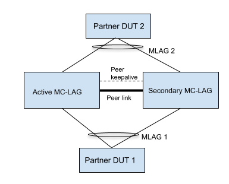
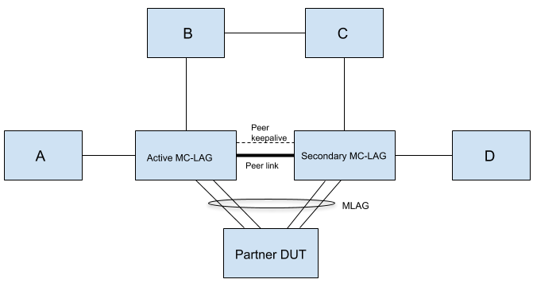

# Feature: Support for xSTP Application over ICCP

## STP over ICCP High Level Design Document


#### Rev 0.4 


[TOC]


<a name="list-of-tables"></a>
# List of Tables
[Table 1: Abbreviations](#table-1-abbreviations)


<a name="Revision"></a>
# Revision

| Rev  | Date       | Author                     | Change Description                       |
| ---- | ---------- | -------------------------- | ---------------------------------------- |
| 0.1  | 10/07/2019 | Ravi Vemuri                | Initial version                          |
| 0.2  | 10/30/2019 | Ravi Vemuri                | Add Targeted deployment use cases        |
| 0.3  | 11/06/2019 | Ravi Vemuri                | Rename StpIccpd to StpIccpdSyncd, Add additional tables/TLVs |
| 0.4  | 11/07/2019 | Divya Kumaran Chandralekha | Added protocol design details            |
| 0.5  | 11/18/2019 | Vijay Kumar Abbaraju       | Update the section 9 (Unit Test)         |


<a name="about-this-manual"></a>

# About this Manual
This document covers implementation of RFC 7727 (STP Application of ICCP) and the changes required in xSTP application to run xSTP over MLAG in Sonic.

<a name="scope"></a>
# Scope
This document describes the high level design of supporting xSTP as an ICCP application in a MC-LAG topology. It builds on top of the MC-LAG implementation available as part of the SONiC community. The existing MC-LAG solution in SONiC implements a *lite* version of ICCP and mLACP as specified in RFC 7275. This document refers to the 1.0 version of the MC-LAG HLD document.

<a name="definition-abbreviation"></a>
# Definition/Abbreviation

### Table 1: Abbreviations
| **Term** | **Meaning**                          |
| :------- | ------------------------------------ |
| BPDU     | Bridge Protocol Data Unit            |
| ICCP     | Inter-Chassis Communication Protocol |
| NRPV     | Node Root Priority Vector            |
| PVST     | Per VLAN spanning tree               |
| RG       | Redundancy Group                     |
| STP      | Spanning Tree Protocol               |
| ToR      | Top of Rack                          |

xSTP refers to all the variants of STP that are supported in SONiC.

<a name="references"></a>
# References
| **Document**           | **Link**                                 |
| ---------------------- | ---------------------------------------- |
| MC-LAG HLD Version 1.0 | https://github.com/shine4chen/SONiC/blob/mclag/doc/Sonic-mclag-hld.md |
| RFC 7727               | https://tools.ietf.org/html/rfc7727      |

<a name="1-feature-overview"></a>
# 1. Feature Overview

The current MC-LAG implementation in SONiC uses the Inter-Chassis Communication Protocol (RFC 7275) for establishing and running a MultiChassis LAG across two MC-LAG capable peer devices. 

RFC 7727 introduces support for STP as an application of ICCP. New ICCP TLVs are specified that are used to exchange and synchronize STP relevant information between the two MC-LAG peers. Though the RFC says that "STP application of ICCP enables the MC-LAG peers to act as a single root bridge participating in the operations of STP", SONiCs implementation of STP over MC-LAG places no such restriction.

<a name="11-requirements"></a>
## 1.1 Requirements

### 1.1.1 Functional Requirements

  - MC-LAG peers will be virtualized to be a single bridge for STP application
  - MC-LAG peers can either act as root bridge or non root bridge
  - Add the ICCP Application State Machine for STP
  - Add support for transmitting/receiving STP Connect/Disconnect TLVs
  - Add support for transmitting/receiving STP Configuration TLVs
  - Add support for transmitting/receiving STP State TLVs
  - Add support to handle received STP Connect/Disconnect/Config/State TLVs

### 1.1.2 Configuration and Management Requirements
There is no configuration/management for xSTP over ICCP.

### 1.1.3 Scalability Requirements
 No additional limits imposed on the current scalability numbers for supporting xSTP over MC-LAG.

### 1.1.4 Warm Boot Requirements
Existing STP variants in SONiC do not support Warm boot, by extension Warm boot for STP as an application over ICCP is not supported. 

<a name="functionality"></a>
# 2 Functionality

<a name="21-functional-description"></a>
## 2.1 Functional Description

 The Salient points of this implementation of STP over ICCP are as follows:


- MC-LAG peers will be virtualized to be a single bridge

- The virtualized Bridge Identifier is the MAC address of the Active MC-LAG device 


- The RG acts as if the ports connected to the STP network are for the same root bridge. This means that the xSTP application uses the virtualized Bridge Identifier on both MC-LAG ports and on orphan ports 


- The RFC specifies TLVs to exchange and sync STP configuration and state information. It is possible to exchange additional proprietary information by defining new TLVs.

Below points are specific to the STP protocol side 

- MC-LAG peers can either act as root bridge or non root bridge

- When STP-ICCP is operational , peer link will not participate in STP topology

- When STP-ICCP is not operational, peer link will participate in STP topology


### 2.1.1 Operational theory of PVST convergence in MC-LAG topology 

Bridges A and B are MC-LAG peers. 

Bridge C is the MC-LAG client device.

Bridge D and E are standalone bridges connected to Bridge A and Bridge B via orphans port P1 and P2 respectively.

Bridge identifier's have the following relative order D<E<MC-LAG peer<C, where Bridge D has the best priority making it act as root bridge.


__Figure 1: PVST initial convergence and Best info propogation__

Figure 1 shows the intial convergence. During startup, each bridge claims itself to be the Root bridge. But on the reception of the superior information from Bridge D, Bridge A would update the information to Bridge B. Meanwhile  Bridge B also would get superior information from Bridge E, it will update that information to A. This best information is called NRPV(Node root priority vector).


__Figure 2: Root port request and ack__

Figure 2 shows  the received NRPV will be stored and table in the figure depicts the NRPV values. Now both peer node will be aware of the best information from the table, here it is (D,P1) and P1 has to be the root port. There will be a root port request from both peers and B will agree on the root port request. Only after getting an agreement from peer, the root port will be moving to forwarding state.


__Figure 3: Propogation of superior info__

Figure 3 shows the propogation of superior information to rest of the bridges.


__Figure 4: Final topology convergence__

Figure 4 shows the port role and state once the convergence is done.


 


__Figure 5: Topology convergence when orphan bridges are externally connected__

Figure 5 shows when bridge D and E are externally connected and the convergence of that topology.


<a name="212-virtulaized-bridge"></a>
### 2.1.2 Virtualized bridge 

The MC-LAG peers will be virtualized to be a single bridge for external devices in the network. STP application uses the virtualized Bridge Identifier on both MC-LAG ports and on orphan ports. 

Bridge Identifier has 2 parts - 2 byte priority and 6 byte MAC.

The virtualized Bridge Identifier is derived from the MAC address of the Active MC-LAG device with least significant bit of the first octet of the MAC address(Individual/Group bit) set to 1. This is used to identify the MC-LAG client device is another MC-LAG peers or a standalone node. Since we set this least significant bit to set 1, there may be cases where MC-LAG peer will not become root bridge by default. So bridge priority has to be configured in case MC-LAG peer node needs to be the root bridge.

User is expected to configure same Bridge priority value on both MC-LAG peers. 

The MC-LAG peers can act as either root bridge or non-root bridge.

<a name="213-port-id-generation"></a>
### 2.1.3 Port ID generation

<a name="2131-orphan-ports"></a>

#### 2.1.3.1 Orphan ports  

As the MC-LAG peers act as a single bridge, the port identifier across the peers should be unique as per the 802.1D standard. 

To acheive this , active MC-LAG peer will use actual STP port ids and standby will use the STP port id's with 12th bit set to 1. 

<a name="2132-mc-lag-ports"></a>

#### 2.1.3.2 MC-LAG ports

For port-channels, internal STP port ids are dynamically allocated by STP application. So when a MC-LAG port-channel with same port-channel id is created on both MC-LAG peers, it might result in different internal STP port ids. When BPDU's are transmitted from the MC-LAG nodes, this can result in different port id's in the BPDU and on receiving node it may result in re-convergence in the STP topology.

To solve this issue, we need to ensure both MC-LAG peer nodes use the same STP TX port-id for MC-LAG. To achieve this, ICCP active node will generate the STP TX port ids and sync it to the peer. This synced information is used for encoding the port id in TX BPDU. 

Currently STP port-channel internal id's (including MC-LAG) will be in the range of (Max phy ports)  to (2 * Max phy ports). Since PO internal id's are dynamically generated locally on both MC-LAG peers, there could be conflicts between the locally generated internal port ids and synced port ids.

To have a unique STP TX port id for MC-LAG, below formula is used. 

STP TX port id = 2K - (STP PO internal Id - Max phy ports)

This formula ensures MC-LAGs will have unique TX port ids, even if the MC-LAG peers have different max number of physical ports in the device.

#### Table 2: STP port id assignment

| **Port ID **           | **STP port ID** | **STP TX port ID**                       |
| ---------------------- | --------------- | ---------------------------------------- |
| Ethernet0              | 0               | 0                                        |
| Ethernet4              | 4               | 4                                        |
| PortChannel 10         | 256             | 256                                      |
| PortChannel 5 (MC-LAG) | 257             | 2K - (STP PO internal Id - Max phy ports) ==> (2K - (257- 255)) => (2K -2) |
| PortChannel 1          | 258             | 258                                      |
| PortChannel 2 (MC-LAG) | 259             | (2K -3)                                  |


<a name="214-concept-of-nrpv"></a>
### 2.1.4 Concept of NRPV 

**NRPV**  (Node Root Priority Vector)– NRPV is the best root priority vector received by the MC-LAG peer.

Each MC-LAG peer node updates the other peer node about its best information (Root priority vector) for a given spanning tree instance.  —Since both MC-LAG peers exchange their NRPV with each other, this information can be used in spanning tree convergence. The NRPV information is used when MC-LAG peers are acting as a non-root bridge. 

When STP is enabled on MC-LAG peer nodes, it starts as root bridge and start sending out the configuration BPDU’s one of the nodes to the client node. On receiving the config BPDU from client node, the message priority vector from the config BPDU will be compared with the current NRPV of the peer node. If the received info is better than the current NRPV, that MC-LAG peer will update its own NRPV with the received info and will inform the other peer node with the new NRPV. This way both the MC-LAG peers will have the NRPV from each other. NRPV will be useful to take a decision on next root port without much delay when the current root port goes down. The node with the next better NRPV will elect the new root port.

NRPV is updated in following scenarios

- Operational status change of port associated with the "best" information, node will calculate new NRPV info and update it to peer node
- Reception of superior or inferior information on any port on the MC-LAG peers
- Non reception of BPDUs on the root port which eventually result in reconvergence

<a name="215-peer-link"></a>
### 2.1.5 Peer link 

Peer link should never be in STP blocking state and this should still provide a loop free L2 topology
in all scenarios. 

To acheive this , we can operationally disable STP on MC-LAG peer ports when STP-ICCP operational status is set to true( when STP-ICCP connect is success). This ensures peer link never goes to blocking state. As the peer link is not participating in STP topology, cost of this link is also not considered for STP convergence. 

In split brain scenario (peer keep-alive down) , when STP-ICCP sets the operational state to 'false' , STP uses the local System MAC as the bridge identifier on both MC-LAG peers. When the peer nodes runs standalone STP , there will be loop in the topology when peer link is not participating in STP topology. In this case,  we will enable back the STP on peer links , and ensures there won't be any loop. 

Whenever there is STP-ICCP sets the operational state change , there will be STP re-convergence.


<a name="216-root-port-transition"></a>
### 2.1.6 Root port role/state transition

Consider the scenario where a port role transition to root port. It could also happen that different ports on both MC-LAG peers receive BPDUs which could transition them to the root port role simultaneously. This could result in a momentary loop in the network. 

Introducing an extra validation on the root port transition will help to resolve this issue. A root port request has to be send to the remote MC-LAG peer node when a port is selected as root port. Once the MC-LAG peer gives a positive response for the root port request, that root port state will move to forwarding. 

This introduces a new role/state for the port, which is Root/Blocking. The port on being selected/elected to be the root port would transition to the Root/Blocking role/state. 

<a name="217-BPDU-transmission-role-state-on-MC-LAG port"></a>
### 2.1.7 BPDU Transmission, Role and State of MC-LAG port

BPDU will be send over MC-LAG only from one of the peer node. 

Initally only active node of the MCLAG sends the PDU to the client. This will ensure only one of the MC-LAG peer send the BPDU to client through MC-LAG. 

It is possible that STP BPDU’s can be received on a standby MC-LAG port. This can happen when the client device sends the BPDU on a diiferent port than the received one. This case (if we receive BPDU on a MC-LAG port than the transmitted one ) we shift the TX to the MC-LAG node which received the BPDU.

With this approach both STP BPDU transmit and receive will always happen from the same MC-LAG peer and it helps to reduce complexities involved in state machine handling when TX and RX happens on different peers.

To control the BPDU transmission on one of MC-LAG port , there has to be STP master node concept for each MC-LAG. STP master node is the one who is resposible for sending the BPDU on MC-LAG. During initialization, ICCP Active node will be the Master node. Master node changes to the other peer when TX shifts happen due to RX. 

In this approach , when 2 MC-LAG peers (dual MC-LAG case) connected together, this can lead to instablities during system start up. Due to the TX shift based on the RX , there could be possibilities the devices will never come to decide on the TX port. This can be resolved by making sure that transmission of the BPDU will only be moved to the received node if the system id of other end is better.

Port role and state (and state machine variables) of MC-LAG port will be synced from the master node.

<a name="218-bpdu-handling"></a>
### 2.1.8 BPDU handling 

<a name="2181-config-bpdu-handling"></a>
#### 2.1.8.1 Config BPDU Handling

As per 802.1d standard, STP config BPDUs are generated by the root bridge in the network and all other nodes on reception of the config BPDU will forward it on their designated ports.

When MC-LAG peers are acting as root bridge, config BPDUs are generated by both peers independently.

When MC-LAG peers are acting as the non root bridge, there is need for special handling to forward the config BPDU received on one of the MC-LAG peer to the other peer. When a config bpdu is received on root port of MC-LAG node, it will be communicated to remote peer via TLV. This happens only when there is change in config PDU.On receiving this message, remote peer has to start timer with timeout set to hello interval. On every timer expiry, remote peer has to generate a bpdu on all designated ports (except currosponding MC-LAG port , this is taken care by the logic of sending BPDU only from one of the MC-LAG port) based on the last info received info in the TLV. On non-reception of BPDU on peer node hosting the root port would run a timer to detect the non-reception of PDUs. On expiry of that timer it should inform remote peer so that it can stop sending the BPDUs.

<a name="2182-tc-handling"></a>
#### 2.1.8.2 TC Handling  

The TC/TCN message is generated on one of the bridges. This would be sent in a update message
to all members. MC-LAG on the reception of this update would act according to the spanning tree flavor configured. 

MC-LAG peers  acting as root bridge:-

On reception of TCN BPDU, MC-LAG node will take following actions

a) Respond with the TC ACK bit set in the config BPDU on the received port

b) Initiate fast-ageing for the STP instance

c) Transmit config BPDU with TC bit set on all the designated ports

d) Notify the MC-LAG peer node about the TC via STP-ICCP TLV.MC-LAG peer node on receiving the TC notification takes the action mentioned above in step b) and c). 


MC-LAG peers acting as non- root bridge:

On reception TCN BPDU, MC-LAG node will take following actions

a) If the MC-LAG node has the root port , transmit the TCN via that root port and respond with the TC ACK bit set in the config BPDU on the received port

b)  If the MC-LAG node doesnt have the root port, respond with the TC ACK bit set in the config BPDU on the received port and informs the peer node about the rx TCN via TLV . On reception of this TLV , peer node transmit the TCN via its root port. 

<a name="22-target-deployment-use-cases"></a>
## 2.2 Target Deployment Use Cases

The MC-LAG HLD talks about the supported ICCP uses cases in section 5.1. STP can theoretically be supported in all use cases supported by ICCP. For L2 scenarios the HLD says a peer-link must be configured. The following topologies elaborate some of the possible MC-LAG L2 deployments with STP.


__Figure 6: MC-LAG Basic L2 Topology__

In Figure 6, two MC-LAG peers are connected with a peer-keepalive link for ICCP communication, as well as with a peer-link to transfer data to the partner in case the MLAG links between the other MC-LAG peer and partner are down. All three devices (the two MC-LAG peers as well as the partner DUT) participate in xSTP.


__Figure 7: MC-LAG ToR Deployment__

Figure 7 shows MC-LAG devices deployed as ToR with multiple rack switches/servers dual-homing to the MC-LAG peers.



__Figure 8: MC-LAG North South L2 Topology__

Figure 8 shows an example of a topology with a MC-LAG both to the north and to the south.


__Figure 9: MC-LAG Two Tier Topology__

Figure 9 shows a two-tiered MC-LAG deployment with the 1st tier MC-LAG dual homed to both north and south devices, and the 2nd tier MC-LAG devices dual homing to the south.



__Figure 10: MC-LAG Topology with orphan ports__

In Figure 10 DUTs A,B,C,D connect to the orphan ports of the virtual bridge. The root device in this topology can be any one of the devices forming the topology.


<a name="24-failures-and-handling"></a>
## 2.4 Failures and Handling

Please also refer to sections 7.3, 7.4 in the MC-LAG HLD. The following section talks about the behavior of STP in the scenarios presented in the MC-LAG HLD. 

### 2.4.1 Peer-Keepalive link failure

- This leads to a split-brain scenario where each device thinks the peer is down. 
- Both devices become Active and revert to using their local System MAC as the bridgeIdentifier. 

### 2.4.2 Peer device failure
- If the Active device fails, the standby becomes the new Active and starts to use its local system MAC as the bridgeIdentifier. There will be traffic disruption in this case. 
- If the Standby device fails, there is no change detected at the partner. Devices connected to the Standby device through orphan ports will converge to the new topology. 

Please note that the MC-LAG HLD does not talk about using the same virtual Bridge Identifier when the Active device is unavailable so as to not disrupt traffic. The Standby device on becoming the new Active will use its local System MAC as the virtual BridgeIdentifier. 

### 2.4.3 Peer link failure
- If the peer-keepalive link and the peer-link are the same, then this failure leads to a split-brain scenario and the behavior is as explained in 2.4.1.
- If the two links are different, then the peer devices do not notice any change and will continue to function as is. 

<a name="3-design"></a>
# 3 Design

<a name="31-overview"></a>
## 3.1 Overview

A new STP application StpIccpdSyncd is introduced that implements the ICCP Application State Machine. The StpIccpdSyncd application will be added to the ICCPd container. It begins in the NONEXISTENT state until MC-LAG is configured. Once ICCP becomes OPERATIONAL, the StpIccpdSyncd application moves to RESET and starts to exchange "STP connect TLVs" with the peer StpIccpdSyncd application. Once the connection is established, the StpIccpdSyncd application moves to OPERATIONAL State and exchanges the "STP Config TLV". If both the StpIccpdSyncd applications on the peers verify that the virtual bridgeIdentifier as notified by iccpd is the same, the StpIccpdSyncd operational status is set to TRUE and the system MAC entry is updated. The STP Application, at this point, sets the bridgeIdentifier in the BPDUs to the common system MAC on all ports. The administrator has to ensure global STP configuration and per MC-LAG interface STP configuration is the same for both peers.

If STP is disabled, the StpIccpdSyncd sends a "STP Disconnect TLV" to the peer and sets the StpIccpdSyncd operational state to FALSE. On receiving a Disconnect TLV from the peer, StpIccpdSyncd sets the operational state to False, in which case the STP applications uses the local System MAC as the bridgeIdentifier. This is different from a peer down/peer unreachable case where StpIccpdSyncd operational state stays as TRUE but the bridgeIdentifier changes to the local system MAC.

StpIccpdSyncd interacts with STATE_DB for the following events published by mclagsyncd

| **Entry**         | **Parameters**          |
| ----------------- | ----------------------- |
| STATE_MCLAG_TABLE | oper_status, system_mac |

StpIccpdSyncd interacts with the CONFIG_DB for the following events published by xSTP applications

| **Entry**        | **Parameters** |
| ---------------- | -------------- |
| STP_GLOBAL_TABLE | mode           |


<a name="32-db-changes"></a>    
## 3.2 DB Changes

Since the StpIccpdSyncd process resides in the ICCPd docker, the communication between xSTP application and StpIccpdSyncd is over redisDb. The following tables are introduced to facilitate request and responses between xSTP and StpIccpdSyncd. As an example, consider the case where PVST on one MC-LAG peer device received a TC and this information needs to be communicated to the PVST application running on the peer MC-LAG device. The following happens in this case


- The PVST application which received the TC will populate the table STP_FASTAGEING_FLUSH_TABLE 
- StpIccpdSyncd will read this information, frame a state TLV and transport this information over ICCP to the peer. 
- The peer StpIccpdSyncd application on receiving the state TLV from ICCP, will write the information into the table STP_ICCP_VLAN_TC_TABLE.
- PVST application on the peer will read the table STP_ICCP_VLAN_TC_TABLE and process the TC information.

The naming convention for the tables is as follows

- for table entries populated by xSTP, the table name starts with STP
- for table entries populated by StpIccpdSyncd, the table name starts with STP_ICCP

### 3.2.1 STATE_DB changes

**STP_ICCP_TABLE**

    ;Defines the Operational State of the StpIccpdSyncd SM
    key              = STP_ICCP_TABLE|<mclag_id>           ;integer between 1-65535
    oper_status      = "down"/"up"                         ;StpIccpdSyncd operational status
    system_mac       = 12HEXDIG                            ;virtualized bridgeIdentifier
    
    Producer: StpIccpdSyncd
    Consumer: xSTP

This table provides the StpIccpdSyncd application status and the system MAC to be used as the virtual bridgeIdentifier. 

**STP_FASTAGEING_FLUSH_TABLE**

    ;Defines vlans for which fastageing is enabled
    ;Status: work in progress
    key              = STP_FASTAGEING_FLUSH_TABLE|"Vlan"vlanid       ; vlan id for which flush needs to be done
    state            = "true"                                        ; true perform flush
    
    Producer: xSTP
    Consumer: StpIccpdSyncd

Currently, this table exists in APP_DB and the STP applications produces content that is consumed by orchAgent. This table needs to be additionally created in STATE_DB for StpIccpdSyncd to consume.

**STP_ICCP_VLAN_TC_TABLE**

    ;Defines vlans for which a TC is received
    key             = STP_ICCP_VLAN_TC_TABLE|"Vlan"vlanid       ;vlan id for which a TC is received
    state           = "true"                                    ;True, if TC is received on this vlan id
    
    Producer: StpIccpdSyncd
    Consumer: xSTP

This tables conveys the vlanID which received a TC.

**STP_VLAN_INTF_FLUSH_TABLE**

    ;Defines vlan and port for which a TC was received
    key             = STP_VLAN_INTF_FLUSH_TABLE|"Vlan"vlanid|portid                        ; vlan id and port id for which flush needs to be done
    tc_type         = "TC Update Message" / "TC ACK Update Message" / "TCN Update Message" ; Topology Change Message Type
    
    Producer: xSTP
    Consumer: StpIccpdSyncd

Conveys the vlan id, port id, TC type for a TC, to the peer.

**STP_ICCP_VLAN_INTF_FLUSH_TABLE**

    ;Defines instance and port for which a TC is received
    key             = STP_ICCP_VLAN_INTF_FLUSH_TABLE|"Vlan"vlanid|portid                   ; vlan id and port id for which TC is received
    tc_type         = "TC Update Message" / "TC ACK Update Message" / "TCN Update Message" ; Topology Change Message Type
    
    Producer: StpIccpdSyncd
    Consumer: xSTP

This table conveys the vlan:port pair and the TC type for a topology change notification.

**STP_PORTCHANNEL_PORTID_MAP_TABLE**

    ;Defines the mapping between the port-channel and the internally generated portIds
    key               = STP_PORTCHANNEL_PORTID_MAP_TABLE|"PortChannel"portchannelid  ; PortChannel for which we are carrying the internal port id
    internal_port_id  = 1*4DIGIT                                                     ; Internal Port Id
    
    Producer: xSTP
    Consumer: StpIccpdSyncd

**STP_ICCP_PORTCHANNEL_PORTID_MAP_TABLE**

    ;Defines the mapping between the port-channel and the internally generated portIds
    key               = STP_ICCP_PORTCHANNEL_PORTID_MAP_TABLE|"PortChannel"portchannelid  ; PortChannel for which we are carrying the internal port id
    internal_port_id  = 1*4DIGIT                                                          ; Internal Port Id
    
    Producer: StpIccpdSyncd
    Consumer: xSTP

**STP_NRPV_TABLE**

    ;Defines the NRPV information to be conveyed to the peer
    key                = STP_NRPV_TABLE|"Vlan"vlanid|portid  ; vlan id and port id
    root_bridge_id     = 16HEXDIG                            ; root bridge id
    root_path_cost     = 1*9DIGIT                            ; port path cost
    desig_bridge_id    = 16HEXDIG                            ; designated bridge id
    desig_port         = 1*3DIGIT                            ; designated port
    
    Producer: xSTP
    Consumer: StpIccpdSyncd

**STP_ICCP_NRPV_TABLE**

    ;Defines the NRPV information to be conveyed by the peer
    key                = STP_ICCP_NRPV_TABLE|"Vlan"vlanid|portid  ; vlan id and port id
    root_bridge_id     = 16HEXDIG                                 ; root bridge id
    root_path_cost     = 1*9DIGIT                                 ; port path cost
    desig_bridge_id    = 16HEXDIG                                 ; designated bridge id
    desig_port         = 1*3DIGIT                                 ; designated port
    
    Producer: StpIccpdSyncd
    Consumer: xSTP

**STP_ROOT_PORT_REQUEST_TABLE**

    ;Request/Response for Root port
    key                = STP_ROOT_PORT_REQUEST_TABLE|"Vlan"vlanid|portid  ; vlan id and port id
    req_resp_field     = "request" / "response"                           ; signifies if this entry is a request or a response
    
    Producer: xSTP
    Consumer: StpIccpdSyncd

**STP_ICCP_ROOT_PORT_REQUEST_TABLE**

    ;Request/Response for root port
    key                = STP_ICCP_ROOT_PORT_REQUEST_TABLE|"Vlan"vlanid|portid  ; vlan id and port id
    req_resp_field     = "request" / "response"                                ; signifies if this entry is a request or a response
    
    Producer: StpIccpdSyncd
    Consumer: xSTP

**STP_TX_CONFIG_TABLE**

    ;Send Tx config message
    key                = STP_TX_CONFIG_TABLE|"Vlan"vlanid                                   ;"Vlan" followed by vlan id
    message_age        = 1*4DIGIT                                                           ; Message Age
    tx_on              = "on" / "off"                                                       ; Transmission ON or OFF
    
    Producer: xSTP
    Consumer: StpIccpdSyncd

**STP_ICCP_TX_CONFIG_TABLE**

    ;Send Tx config message
    key                = STP_ICCP_TX_CONFIG_TABLE|"Vlan"vlanid                              ;"Vlan" followed by vlan id
    message_age        = 1*4DIGIT                                                           ; Message Age
    tx_on              = "on" / "off"                                                       ; Transmission ON or OFF
    
    Producer: StpIccpdSyncd
    Consumer: xSTP

**STP_AGE_OUT_TABLE**

    ;status: work in progress
    key                = STP_AGE_OUT_TABLE|"Vlan"vlanid       ;"Vlan" followed by vlan id
    bridge_id          = 16HEXDIG                                    ; bridge id
    
    Producer: xSTP
    Consumer: StpIccpdSyncd

**STP_ICCP_AGE_OUT_TABLE**

    ;status: work in progress
    key                = STP_ICCP_AGE_OUT_TABLE|"Vlan"vlanid  ;"Vlan" followed by vlan id
    bridge_id          = 16HEXDIG                             ; bridge id
    
    Producer: StpIccpdSyncd
    Consumer: xSTP

**STP_SYNC_MCLAG_PORT_INFO_TABLE**

    ;defines the MCLAG port information table to be synced with the peer
    key                = STP_SYNC_MCLAG_PORT_INFO_TABLE|"Vlan"vlanid|portid       ; vlan id and port id
    state              = 1*DIGIT                                                  ; uint_8 
    tc_ack             = BIT                                                      ; state
    config_pending     = BIT                                                      ;
    change_detection_enabled = BIT                                                ;
    self_loop          = BIT                                                      ;
    auto_config        = BIT                                                      ;
    operEdge           = BIT                                                      ;
    kernel_state       = 2*BIT                                                    ;
    path_cost          = 1*DIGIT                                                  ;
    desig_root         = 16HEXDIG                                                 ; designated root
    desig_cost         = 1*9DIGIT                                                 ; designated cost
    desig_bridge       = 16HEXDIG                                                 ; designated bridge
    desig_port         = 1*3DIGIT                                                 ; designated port
    message_age_timer  = 1*4DIGIT                                                 ; messsage age timer
    forward_delay      = 2*DIGIT                                                  ; forward delay in secs (4 to 30 sec, DEF:15 sec)
    hold_time          = 1*DIGIT                                                  ; hold time in secs (1 sec)
    root_protect_timer = 1*3DIGIT                                                 ; root protect timer value
    
    Producer: xSTP
    Consumer: StpIccpdSyncd

**STP_ICCP_SYNC_MCLAG_PORT_INFO_TABLE**

    ;defines the MCLAG port information table synced from the peer
    key                = STP_ICCP_SYNC_MCLAG_PORT_INFO_TABLE|"Vlan"vlanid|portid  ; vlan id and port id
    state              = 1*DIGIT                                                  ; state
    tc_ack             = BIT                                                      ;
    config_pending     = BIT                                                      ;
    change_detection_enabled = BIT                                                ;
    self_loop          = BIT                                                      ;
    auto_config        = BIT                                                      ;
    operEdge           = BIT                                                      ;
    kernel_state       = 2*BIT                                                    ;
    path_cost          = 1*DIGIT                                                  ;
    desig_root         = 16HEXDIG                                                 ; designated root
    desig_cost         = 1*9DIGIT                                                 ; designated cost
    desig_bridge       = 16HEXDIG                                                 ; designated bridge
    desig_port         = 1*3DIGIT                                                 ; designated port
    message_age_timer  = 1*4DIGIT                                                 ; messsage age timer
    forward_delay      = 2*DIGIT                                                  ; forward delay in secs (4 to 30 sec, DEF:15 sec)
    hold_time          = 1*DIGIT                                                  ; hold time in secs (1 sec)
    root_protect_timer = 1*3DIGIT                                                 ; root protect timer value
    
    Producer: StpIccpdSyncd
    Consumer: xSTP

**STP_MASTER_NODE_REQ_RESP_TABLE**

    ;Master node request/response table
    key                = STP_MASTER_NODE_REQ_RESP_TABLE|"Vlan"vlanid|portid       ; vlan id and port id
    req_resp_field     = "request" / "response"                                   ; request/response
    
    Producer: xSTP
    Consumer: StpIccpdSyncd

**STP_ICCP_MASTER_NODE_REQ_RESP_TABLE**

    ;Master node request/response table
    key                = STP_ICCP_MASTER_NODE_REQ_RESP_TABLE|"Vlan"vlanid|portid  ; vlan id and port id
    req_resp_field     = "request" / "response"                                   ; request/response
    
    Producer: StpIccpdSyncd
    Consumer: xSTP

**STP_RPVST_REQUEST_PROPOSAL_TABLE**

    ;RPVST Request Proposal Sync/Ack Table
    key                = STP_RPVST_REQUEST_PROPOSAL_TABLE|"Vlan"vlanid|portid       ; vlan id and port id
    desig_root         = 16HEXDIG                                                   ; designated root
    ack_flag           = "request" / "ack"                                          ;
    
    Producer: xSTP
    Consumer: StpIccpdSyncd

**STP_ICCP_RPVST_REQUEST_PROPOSAL_TABLE**

    ;RPVST Request Proposal Sync/Ack Table
    key                = STP_ICCP_RPVST_REQUEST_PROPOSAL_TABLE|"Vlan"vlanid|portid  ; vlan id and port id
    desig_root         = 16HEXDIG                                                   ; designated root
    ack_flag           = "request" / "ack"                                          ;
    
    Producer: StpIccpdSyncd
    Consumer: xSTP

**STP_SYNCHRONIZATION_REQ_TABLE**

    ;Defines the Synchronization Request parameters for xSTP Synchronization
    ;Status: work in progress
    key               = STP_SYNCHRONIZATION_REQ_TABLE|GLOBAL                      ; Synchronization request from STP
    c_bit             = BIT                                                       ;
    s_bit             = BIT                                                       ;
    request_type      = "sys_data" / "instance" / "sys_data and instance"         ; Request a combination of system data and data of listed instances
    
    Producer: xSTP
    Consumer: StpIccpdSyncd

**STP_ICCP_SYNCHRONIZATION_REQ_TABLE**

    ;Defines the Synchronization Request parameters from StpIccpdSyncd to xSTP for Synchronization
    ;Status: work in progress
    key               = STP_ICCP_SYNCHRONIZATION_REQ_TABLE|GLOBAL                 ; Synchronization request to STP
    request_number    = 1*4DIGIT                                                  ; Request number
    c_bit             = BIT                                                       ;
    s_bit             = BIT                                                       ;
    request_type      = "sys_data" / "instance" / "sys_data and instance"         ; Request a combination of system data and data of listed instances


    Producer: StpIccpdSyncd
    Consumer: xSTP

**STP_SYNCHRONIZATION_RESPONSE_TABLE**

    ;Defines the Synchronization Request parameters for xSTP Synchronization
    ;Status: work in progress
    key               = STP_SYNCHRONIZATION_RESPONSE_TABLE|GLOBAL                 ; Synchronization response from STP
    request_number    = 1*4DIGIT                                                  ; Request number being serviced
    status            = "begin" / "end"                                           ; Signifies the beginning or the end of the response identified by request_number
    
    Producer: xSTP
    Consumer: StpIccpdSyncd

<a name="33-stp-application-tlvs"></a>
## 3.3 STP Application TLVs

The following TLVs defined in the RFC are supported.

| **Message**                     | **Type** | **Source**                               | **Destination**                          |
| ------------------------------- | -------- | ---------------------------------------- | ---------------------------------------- |
| STP Connect TLV                 | 0x2000   | CONFIG_DB: STP_GLOBAL_TABLE,STATE_DB: STATE_MCLAG_TABLE | N/A                                      |
| STP Disconnect TLV              | 0x2001   | CONFIG_DB: STP_GLOBAL_TABLE              | STATE_DB: STP_ICCP_TABLE                 |
| STP Disconnect Cause Sub-TLV    | 0x200C   | N/A                                      | N/A                                      |
| STP System Config TLV           | 0x2002   | STATE_DB: STATE_MCLAG_TABLE              | STATE_DB: STP_ICCP_TABLE                 |
| STP Region Name TLV             | 0x2003   | N/A                                      | N/A                                      |
| STP Revision Level TLV          | 0x2004   | N/A                                      | N/A                                      |
| STP Instance Priority TLV       | 0x2005   | N/A                                      | N/A                                      |
| STP Configuration Digest        | 0x2006   | N/A                                      | N/A                                      |
| STP Topology Changed Instances  | 0x2007   | STATE_DB: STP_FASTAGEING_FLUSH_TABLE     | STATE_DB: STP_ICCP_VLAN_TC_TABLE         |
| STP CIST Root Time Parameters   | 0x2008   | CONFIG_DB: STP_GLOBAL_TABLE              | N/A                                      |
| STP MIST Root Time Parameter    | 0x2009   | N/A                                      | N/A                                      |
| STP Synchronization Request TLV | 0x200A   | STATE_DB: STP_SYNCHRONIZATION_REQ_TABLE  | STATE:DB: STP_ICCP_SYNCHRONIZATION_REQ_TABLE |
| STP Synchronization Data TLV    | 0x200B   | STATE_DB: STP_SYNCHRONIZATION_RESPONSE_TABLE | N/A                                      |

The following TLVs are introduced to exchange further information between the STP peers.

| **Message**                          | **Type** | **Source**                               | **Destination**                          |
| ------------------------------------ | -------- | ---------------------------------------- | ---------------------------------------- |
| STP PortChannel to PortID Map        | 0x200D   | STATE_DB: STP_PORTCHANNEL_PORTID_MAP_TABLE | STATE_DB: STP_ICCP_PORTCHANNEL_PORTID_MAP_TABLE |
| STP NRPV TLV                         | 0x200E   | STATE_DB: STP_NRPV_TABLE                 | STATE_DB: STP_ICCP_NRPV_TABLE            |
| STP Root Request/Response TLV        | 0x200F   | STATE_DB: STP_ROOT_PORT_REQUEST_TABLE    | STATE_DB: STP_ICCP_ROOT_PORT_REQUEST_TABLE |
| STP TC By VlanID+Port                | 0x2010   | STATE_DB: STP_VLAN_INTF_FLUSH_TABLE      | STATE_DB: STP_ICCP_VLAN_INTF_FLUSH_TABLE |
| STP Tx Config TLV                    | 0x2011   | STATE_DB: STP_TX_CONFIG_TABLE            | STATE_DB: STP_ICCP_TX_CONFIG_TABLE       |
| STP Age out TLV                      | 0x2012   | STATE_DB: STP_AGE_OUT_TABLE              | STATE_DB: STP_ICCP_AGE_OUT_TABLE         |
| STP MCLAG Port Info TLV              | 0x2013   | STATE_DB: STP_SYNC_MCLAG_PORT_INFO_TABLE | STATE_DB: STP_ICCP_SYNC_MCLAG_PORT_INFO_TABLE |
| STP Master Node Request/Response TLV | 0x2014   | STATE_DB: STP_MASTER_NODE_REQ_RESP_TABLE | STATE_DB: STP_ICCP_MASTER_NODE_REQ_RESP_TABLE |
| STP RPVST Request Proposal TLV       | 0x2015   | STATE_DB: STP_RPVST_REQUEST_PROPOSAL_TABLE | STATE_DB: STP_ICCP_RPVST_REQUEST_PROPOSAL_TABLE |


### 3.3.1 STP PortChannel To PortID Map TLV


__Figure 11: STP PortChannel to PortID Map__

The following TLV is introduced to convey port-channel ID to internal port id. The Type field is defined as 0x200C for this new TLV.

- U=F=0

- Type

Set to 0x200C for "STP PortChannel to PortID Map"

- Length

Length of the TLV in octets excluding the U-bit, F-bit, Type, and Length fields.

TBD

### 3.3.2 STP NRPV TLV


__Figure 12: STP NRPV TLV__

The following TLV is introduced to convey node root priority vector. The Type field is defined as 0x200D for this new TLV.

- U=F=0

- Type

Set to 0x200D for "STP NRPV TLV"

- Length

Length of the TLV in octets excluding the U-bit, F-bit, Type, and Length fields.

TBD


### 3.3.3 STP Root Request/Response TLV


__Figure 13: STP Root Request/Response TLV__

The following TLV is introduced to convey Root request/response TLV. The Type field is defined as 0x200E for this new TLV.

- U=F=0

- Type

Set to 0x200E for "STP Root Request/Response TLV"

- Length

Length of the TLV in octets excluding the U-bit, F-bit, Type, and Length fields.

TBD

### 3.3.4 STP TC By VlanID+Port


__Figure 14: New STP State TLV for TC By VLAN and Port__

The following TLV is introduced to support TCN for RPVST+. The Type field is defined as 0x200F for this new TLV.

- U=F=0

- Type

Set to 0x200F for "STP Topology Changed TLV By VlanId:Port"

- Length

Length of the TLV in octets excluding the U-bit, F-bit, Type, and Length fields.

- VlanID

Vlan ID for which a TC is received

- Port ID

The  port on which the TC was received.

- TC Type

The values that this field carries and their significance is as follows

1 - "TC Update Message" 

2 - "TC ACK Update Message" 

3 - "TCN Update Message" 

### 3.3.5  STP Tx Config TLV


__Figure 15: STP Tx Config TLV__

The following TLV is introduced to carry Tx Config TLV. The Type field is defined as 0x2010 for this new TLV.

- U=F=0

- Type

Set to 0x2010 for "STP Tx Config TLV"

- Length

Length of the TLV in octets excluding the U-bit, F-bit, Type, and Length fields.

TBD

### 3.3.6  STP Age out TLV


__Figure 11: STP Age out TLV__

The following TLV is introduced to convey Root request/response TLV. The Type field is defined as 0x2011 for this new TLV.

- U=F=0

- Type

Set to 0x2011 for "STP Age out TLV"

- Length

Length of the TLV in octets excluding the U-bit, F-bit, Type, and Length fields.

TBD

### 3.3.7  STP MCLAG Port Info TLV


__Figure 16: STP MCLAG Port Info TLV__

The following TLV is introduced to convey Root request/response TLV. The Type field is defined as 0x2012 for this new TLV.

- U=F=0

- Type

Set to 0x2012 for "STP MCLAG Port Info TLV"

- Length

Length of the TLV in octets excluding the U-bit, F-bit, Type, and Length fields.

TBD

### 3.3.8  STP Master Node Request/Response TLV


__Figure 17: STP Master Node Request/Response TLV__

The following TLV is introduced to convey Root request/response TLV. The Type field is defined as 0x2013 for this new TLV.

- U=F=0

- Type

Set to 0x2013 for "STP Master Node Request/Response TLV"

- Length

Length of the TLV in octets excluding the U-bit, F-bit, Type, and Length fields.

TBD

### 3.3.9  STP RPVST Request Proposal TLV


__Figure 18: RPVST Request Proposal TLV Format__

The following TLV is introduced to convey Root request/response TLV. The Type field is defined as 0x2014 for this new TLV.

- U=F=0

- Type

Set to 0x2014 for "STP RPVST Request Proposal TLV"

- Length

Length of the TLV in octets excluding the U-bit, F-bit, Type, and Length fields.

TBD

<a name="33-stp-show-command"></a>

## 3.4 STP Show command

When MC-LAG node is non-root , the root port can be on local node or the remote peer. So show command is modified by adding (P) next to root port which indicate the root port present on remote MC-LAG peer.  


- show spanning_tree

``` 
Spanning-tree Mode: PVST 
VLAN 100 - STP instance 3
--------------------------------------------------------------------
STP Bridge Parameters:

Bridge           Bridge Bridge Bridge Hold  LastTopology Topology
Identifier       MaxAge Hello  FwdDly Time  Change       Change
hex              sec    sec    sec    sec   sec          cnt
0014002438874120 20     2      15     1     0            0       

RootBridge       RootPath  DesignatedBridge Root			Max Hel Fwd
Identifier       Cost      Identifier       Port			Age lo  Dly
hex                        hex                   			sec sec sec
000a001bed176620 4         000a001bed176620 Ethernet5(P) 20  2   15  

STP Port Parameters:

Port        Prio Path Port Uplink BPDU   State      Designated  Designated      Designated
Num         rity Cost Fast Fast   Filter            Cost        Root            Bridge
Ethernet13  128  4    Y    N      N      FORWARDING 0      		000a001bed176620 0014002438874120 

* (P) indicates root port present in remote MC-LAG peer
```
<a name="4-flow-diagrams"></a>

# 4 Flow Diagrams
Please  refer to section 8 in the MC-LAG HLD for a SONiC system diagram with ICCPd container and details. StpIccpdSyncd application is added to the ICCPd container. 

<a name="5-error-handling"></a>
# 5 Error Handling
<a name="6-serviceability-and-debug"></a>
# 6 Serviceability and Debug
All processing errors (Internal, ICCPd interaction) will be captured in syslog with ERROR level

<a name="7-warm-boot-support"></a>
# 7 Warm Boot Support
Warm Boot for STP over ICCP is not supported.

<a name="8-scalability"></a>
# 8 Scalability
No additional limits imposed on the current scalability numbers for supporting xSTP over MC-LAG.

<a name="9-unit-test"></a>
# 9 Unit Test
The following scenarios need to be unit-tested:
1) Disable the xSTP on both DUTs and read the status of STP_ICCP Table on both DUTs. The operational status of stp_iccp should be down.

2) Enable PVST/RPVST on both the DUTs and read the status of STP_ICCP Table on both DUTs. The operational status of stp_iccp should be up and the mac should be common mac.

3) On DUT1, program the STP_FASTAGEING_FLUSH_TABLE and read from STP_ICCP_VLAN_TC_TABLE on DUT2. Repeat the same from DUT2 to DUT1.

4) On DUT1, program the STP_VLAN_INTF_FLUSH_TABLE and read from STP_ICCP_VLAN_INTF_FLUSH_TABLE on DUT2. Repeat the same from DUT2 to DUT1.

5) On DUT1, program the STP_PORTCHANNEL_PORTID_MAP_TABLE and read from STP_ICCP_PORTCHANNEL_PORTID_MAP_TABLE on DUT2. Repeat the same from DUT2 to DUT1.

6) On DUT1, program the STP_NRPV_TABLE and read from STP_ICCP_NRPV_TABLE on DUT2. Repeat the same from DUT2 to DUT1.

7) On DUT1, program the STP_ROOT_PORT_REQUEST_TABLE and read from STP_ICCP_ROOT_PORT_REQUEST_TABLE on DUT2. Repeat the same from DUT2 to DUT1.

8) On DUT1, program the STP_TX_CONFIG_TABLE and read from STP_ICCP_TX_CONFIG_TABLE on DUT2. Repeat the same from DUT2 to DUT1.

9) On DUT1, program the STP_AGE_OUT_TABLE and read from STP_ICCP_AGE_OUT_TABLE on DUT2. Repeat the same from DUT2 to DUT1.

10) On DUT1, program the STP_SYNC_MCLAG_PORT_INFO_TABLE and read from STP_ICCP_SYNC_MCLAG_PORT_INFO_TABLE on DUT2. Repeat the same from DUT2 to DUT1.

11) On DUT1, program the STP_MASTER_NODE_REQ_RESP_TABLE and read from STP_ICCP_MASTER_NODE_REQ_RESP_TABLE on DUT2. Repeat the same from DUT2 to DUT1.

12) On DUT1, program the STP_RPVST_REQUEST_PROPOSAL_TABLE and read from STP_ICCP_RPVST_REQUEST_PROPOSAL_TABLE on DUT2. Repeat the same from DUT2 to DUT1.

13) On DUT1, program the STP_SYNCHRONIZATION_REQ_TABLE and read from STP_ICCP_SYNCHRONIZATION_REQ_TABLE on DUT2. Repeat the same from DUT2 to DUT1.

14) On DUT1, program the STP_SYNCHRONIZATION_REQ_TABLE and send data from STP_SYNCHRONIZATION_RESPONSE_TABLE and some other table like STP_NVPV_TABLE from DUT2. Read the data from DUT1.

15) Shut down the keep-alive peer link on DUT1 and read from STP_ICCP table on both DUT1 and DUT2.

16) Disable xSTP on DUT1 and read from STP_ICCP table on both DUT1 and DUT2.

17) Delete mclag on DUT1 and read from STP_ICCP table on both DUT1 and DUT2.

18) Verify that  PVST convergence in  topology 'MC-LAG North South L2 Topology' 1) when MC-LAG peers as root bridge 2) client bridge is root bridge 3) disable/enable the client port 4) Disable keep-alive link 5) Enbale keep-alive link

19) Verify that  PVST convergence in topology'MC-LAG Topology with orphan ports' 1) when MC-LAG peers as root bridge 2) client bridge is root bridge 3) disable/enable the client port 4) Disable keep-alive link 5) Enbale keep-alive link


