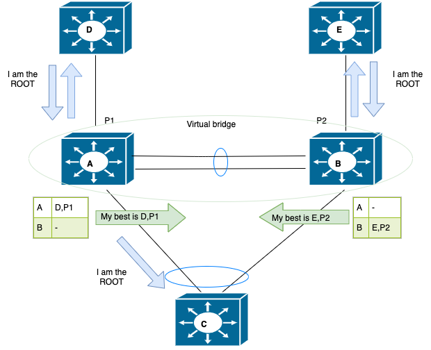
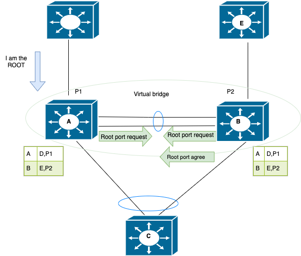
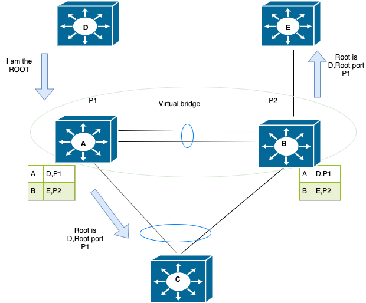
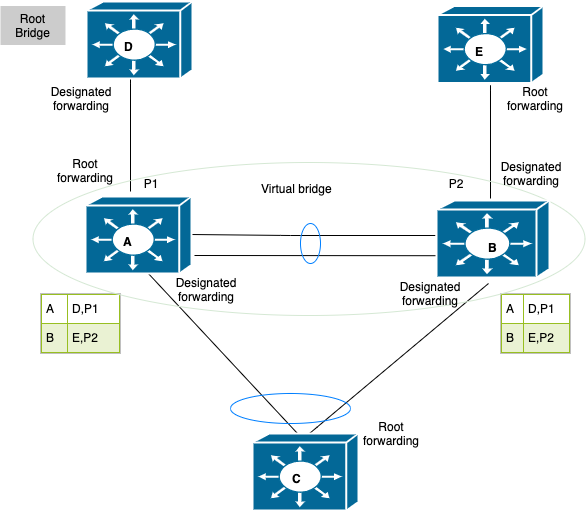
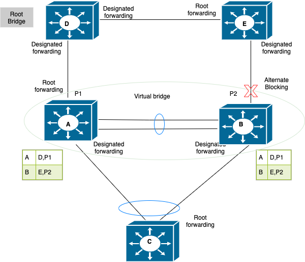
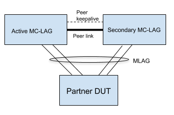
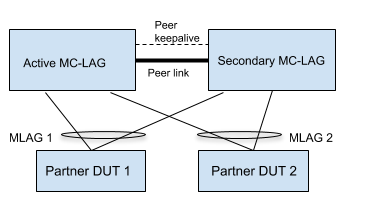
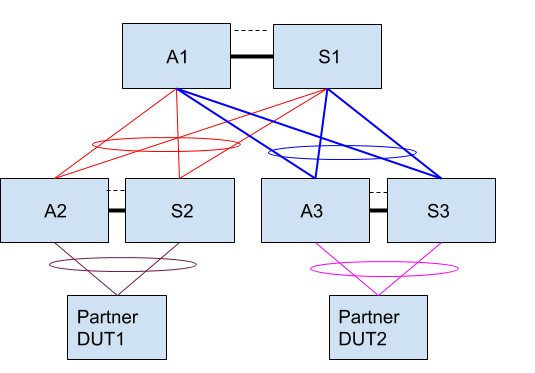

# Feature: Support for xSTP over MC-LAG

# STP over MC-LAG High Level Design Document


#### Rev 0.7 


[TOC]


<a name="list-of-tables"></a>
# List of Tables
[Table 1: Abbreviations](#table-1-abbreviations)


<a name="Revision"></a>
# Revision

| Rev  | Date       | Author                     | Change Description                       |
| ---- | ---------- | -------------------------- | ---------------------------------------- |
| 0.1  | 10/07/2019 | Ravi Vemuri                | Initial version                          |
| 0.2  | 10/30/2019 | Ravi Vemuri                | Add Targeted deployment use cases        |
| 0.3  | 11/06/2019 | Ravi Vemuri                | Rename StpIccpd to StpIccpdSyncd, Add additional tables/TLVs |
| 0.4  | 11/07/2019 | Divya Kumaran Chandralekha | Added protocol design details            |
| 0.5  | 11/18/2019 | Vijay Kumar Abbaraju       | Update the section 9 (Unit Test)         |
| 0.6  | 04/24/2020 | Divya Kumaran Chandralekha | Updated all sections inline with the current design |
| 0.7  | 05/12/2020 | Sandeep Kulambi            | Minor updates inline with latest changes |


<a name="about-this-manual"></a>

# About this Manual
This document covers implementation of xSTP over MC-LAG, including the RFC 7727 (STP Application of ICCP) support.

<a name="scope"></a>
# Scope
This document describes the high level design of supporting xSTP over MC-LAG, including STP as an ICCP application in a MC-LAG topology. It builds on top of the MC-LAG implementation available as part of the SONiC community. The existing MC-LAG solution in SONiC implements a *lite* version of ICCP and mLACP as specified in RFC 7275. This document refers to the 1.0 version of the MC-LAG HLD document.

<a name="definition-abbreviation"></a>

# Definition/Abbreviation

### Table 1: Abbreviations
| **Term** | **Meaning**                          |
| :------- | ------------------------------------ |
| BPDU     | Bridge Protocol Data Unit            |
| ICCP     | Inter-Chassis Communication Protocol |
| MC-LAG   | Multi-chassis Link Aggregation Group |
| NRPV     | Node Root Priority Vector            |
| PVST     | Per VLAN spanning tree               |
| RPVST    | Rapid Per VLAN spanning tr           |
| STP      | Spanning Tree Protocol               |
| ToR      | Top of Rack                          |

xSTP refers to all the variants of STP that are supported in SONiC. Currently PVST and Rapid-PVST are the supported variants.

<a name="references"></a>
# References
| **Document**          | **Link**                                 |
| --------------------- | ---------------------------------------- |
| MCLAG HLD Version 1.0 | https://github.com/shine4chen/SONiC/blob/mclag/doc/Sonic-mclag-hld.md |
| RFC 7727              | https://tools.ietf.org/html/rfc7727      |

<a name="1-feature-overview"></a>
# 1. Feature Overview

This feature provides support for running spanning-tree protocol over L2 MC-LAG networks. Spanning-tree protocol will be running on both MC-LAG peers and both peers together will act as a single xSTP bridge in the network. To behave as a single bridge both MC-LAG peers need to exchange protocol specific information, this is achieved via the support of RFC 7727.

The current MC-LAG implementation in SONiC uses the Inter-Chassis Communication Protocol (RFC 7275) for establishing and running a multi-chassis LAG across two MC-LAG capable peer devices. 

RFC 7727 introduces support for STP as an application of ICCP. New ICCP TLVs are specified that are used to exchange and synchronize STP relevant information between the two MC-LAG peers. RFC 7727 addresses a very specific use case where MC-LAG peers are expected to be the root bridge in the network. The implementation described in this document places no such restriction and supports MC-LAG peers acting either as root bridge or non-root bridge in the network. 


<a name="11-requirements"></a>
## 1.1 Requirements

### 1.1.1 Functional Requirements

  - Support MC-LAG peers acting as a single bridge in the network
  - Support MC-LAG peers in both root bridge and non-root bridge roles in the network
  - Support 2-tier MC-LAG scenarios
  - Support ICCP Application State Machine for STP

### 1.1.2 Configuration and Management Requirements
There is no configuration/management specific requirements for xSTP over MC-LAG.

### 1.1.3 Scalability Requirements
No additional limits imposed on the current scalability numbers for supporting xSTP over MC-LAG.

### 1.1.4 Warm Boot Requirements
Existing STP implementation does not support warm boot, by extension warm boot for xSTP over MC-LAG is not supported. 

<a name="functionality"></a>
# 2 Functionality

<a name="21-functional-description"></a>
## 2.1 Functional Description

The salient points of this implementation of xSTP over MC-LAG are as follows:

- MC-LAG peers will be virtualized to act as a single bridge in the network, for this purpose both peers will use a virtual bridge identifier which is derived based on the Active MC-LAG node MAC address.

- MC-LAG peers can either act as root bridge or non-root bridge.

- MC-LAG peers will use the virtual bridge identifier on both orphan ports and MC-LAG interfaces.

- RFC 7725 specifies TLVs to exchange and sync STP configuration and state information. This implementation introduces additional TLVs to support MC-LAG peers acting as non-root bridges in the network. 

- STP needs to be configured on both MC-LAG peers and the STP configuration across both MC-LAG peers must be consistent, for example if bridge priority value needs to be modified then same value should be configured on both MC-LAG peers. 

- When ICCP is operationally up, peer link will not participate in STP topology this ensures peer link will always forward the traffic.

- When ICCP is operationally down, both MC-LAG peers will act as independent bridges in the network and peer link will participate in STP topology to avoid any potential loops. Both MC-LAG peers will use their own bridge identifier instead of virtual bridge identifier in this case.


### 2.1.1 Operational theory of spanning-tree convergence in MC-LAG topology 

Bridges A and B are MC-LAG peers. 

Bridge C is the MC-LAG client device.

Bridge D and E are standalone bridges connected to Bridge A and Bridge B via orphan ports P1 and P2 respectively.

Bridge identifier's have the following relative values - D < E< MC-LAG peers < C, where Bridge D has the best bridge priority making it act as root bridge.




__Figure 1: Spanning-tree initial convergence and best info propagation__

Figure 1 shows the initial convergence. During startup, each bridge claims itself to be the root bridge. But on reception of superior information from Bridge D, Bridge A would update the information to Bridge B. Meanwhile Bridge B also would get superior information from Bridge E, it will update that information to A. This best information here is referred to as Node Root Priority Vector(NRPV).




__Figure 2: Root port request and ack__

Figure 2 shows the received NRPV will be stored and table in the figure depicts the NRPV values. Now both peer nodes will be aware of the best information from the table, here it is (D,P1) and P1 has to be the root port. There will be a root port request from both peers and B will agree on the root port request. Only after getting an agreement from peer i.e. Bridge B, the root port P1 on Bridge A will be moving to forwarding state.




__Figure 3: Propagation of superior info__

Figure 3 shows the propagation of superior information to rest of the bridges.




__Figure 4: Final topology convergence__

Figure 4 shows the port role and state once the convergence is done.


 



__Figure 5: Topology convergence when orphan bridges are directly connected__

Figure 5 shows when bridge D and E are directly connected and the convergence of that topology.


<a name="212-virtulaized-bridge"></a>
### 2.1.2 Virtual bridge identifier 

Bridge identifier has 2 parts - 2 byte priority and 6 byte MAC address

The virtual bridge identifier is derived from the MAC address of the Active MC-LAG device with least significant bit of the first octet of the MAC address(Individual/Group bit) set to 1. This is used to identify whether the MC-LAG client device is standalone node or another set of MC-LAG peers (dual MC-LAG).  

As the Individual/Group but is set to 1 in the MAC address component of bridge identifier, there may be cases where MC-LAG peers will not become root bridge by default. So bridge priority has to be configured in case MC-LAG peer node needs to be the root bridge in the network.

User must configure same bridge priority value on both MC-LAG peers. 

<a name="213-port-id-generation"></a>
### 2.1.3 Port ID generation

<a name="2131-orphan-ports"></a>

#### 2.1.3.1 Orphan ports  

As MC-LAG peers act as a single bridge, the port ids across the peers should be unique as per the IEEE 802.1D standard. To acheive this, active MC-LAG peer will use actual STP port ids and standby will use the STP port id's with 12th bit set to 1. This is applicable for both physical ports and port-channel interfaces.

<a name="2132-mc-lag-ports"></a>

#### 2.1.3.2 MC-LAG ports

For port-channel interfaces, internal STP port ids are dynamically allocated by STP application. So when an MC-LAG port-channel with same port-channel id is configured on both MC-LAG peers, it might result in different internal STP port id. When BPDU's are transmitted from the MC-LAG peers, this can result in different port id's encoded in the BPDU and on receiving node it may result in re-convergence in the STP topology.

To avoid this we need to ensure both MC-LAG peers use the same STP port id for a given MC-LAG interface. For this purpose, active node will sync it's local STP port id to standby node. This synced information is used for encoding the port id in BPDUs. 

<a name="214-concept-of-nrpv"></a>
### 2.1.4 Concept of NRPV 

**NRPV**  (Node Root Priority Vector)– refers to the best root priority vector received by the MC-LAG peer.

Each MC-LAG peer node updates the other peer node about it's best information (NRPV) for a given spanning tree instance.  Since both MC-LAG peers exchange their NRPV with each other, this information can be used in spanning tree calculation. The NRPV information is used when MC-LAG peers are acting as a non-root bridge. 

When STP is enabled on MC-LAG peer nodes, it starts as root bridge and start sending out the configuration BPDU’s one of the nodes to the client node. On receiving the config BPDU from client node, the message priority vector from the config BPDU will be compared with the current NRPV of the peer node. If the received info is better than the current NRPV, that MC-LAG peer will update its own NRPV with the received info and will inform the other peer node with the new NRPV. This way both the MC-LAG peers will have the NRPV from each other. NRPV will be useful to take a decision on next root port without much delay when the current root port goes down. The node with the next better NRPV will elect the new root port.

NRPV is updated in following scenarios

- Operational status change of port associated with the "best" information, node will calculate new NRPV info and update it to peer node
- Reception of superior information on any port on the MC-LAG peers
- Non reception of BPDUs on the root port which eventually result in ageing out the information and reconvergence of spanning-tree.

<a name="215-peer-link"></a>

### 2.1.5 STP-ICCP Operational state 

STP-ICCP Operational state is similar to ICCP operational state. When both MC-LAG peers are STP enabled and are able to exchange STP connect messages, STP-ICCP operations state transitions to up state. In case either ICCP operation state goes down or STP is disabled, STP-ICCP operational state goes down as well. STP-ICCP operational state is updated by StpIccpSyncd and STPd process receives these notifications via STATE DB updates.


### 2.1.6 Peer link 

Peer link should never be in STP blocking state as it will impact the traffic exchanged between MC-LAG peers. 

When STP-ICCP is operationally up and both MC-LAG peers act as a single bridge, peer-link can be considered as an internal link hence there is no need to run STP on it. So STP is disabled on the peer-link when STP-ICCP transitions to operational up state. Disabling STP also ensures the peer link never goes to STP blocking state (say during reconvergence), which avoids disrupting the traffic between MC-LAG peers.

When STP-ICCP is operationally down, both MC-LAG peers act as independent bridges in the network. STP is operationally enabled back when STP-ICCP operational state is down, this ensure there are no loops in the network via the peer link path.

<a name="216-root-port-transition"></a>
### 2.1.6 Root port role/state transition

Consider the scenario where a port transitions to root port role. In case both MC-LAG peers receive superior info BPDUs, it could result in root port role transition simultaneously on both nodes. This could result in a momentary loop in the network, until both nodes exchange their NRPV information and only one root port is elected.

To avoid this momentary loop, when a root port transition happens the port will not be moved to forwarding state immediately. When a root port is elected, the port will be kept in blocking state and a root port request will be sent to the MC-LAG peer to agree on the elected root port. MC-LAG peer on receiving the root port request, if the local NRPV value is inferior will send an agreement back. On receiving the agreement the root port will be moved to forwarding state.

This introduces a new role/state for the port, which is Root/Blocking. The port on being selected/elected to be the root port would transition to the Root/Blocking role/state. 

<a name="217-BPDU-transmission-role-state-on-MC-LAG port"></a>
### 2.1.7 BPDU Transmission, Role and State of MC-LAG interface

In case of MC-LAG interfaces, protocol state machines are run on one of the MC-LAG peer nodes and the STP port specific information is then synced to the other peer node. The MC-LAG peer on which state machine is running is considered master node and the other peer as non-master node.This master/non-master election applicable for only MCLAG ports and it is per instance + port. 

BPDUs are transmitted over MC-LAG interface only from master node, this ensures only one of the MC-LAG peer transmits the BPDU towards the MC-LAG client. 

Initially MCLAG active node will be selected as the master node and standby node will be non master node. When MC-LAG client device sends BPDU it can so happen that it is received on MC-LAG interface of non-master node. In such a case the master node role is changed to the MC-LAG peer receiving the BPDU, this ensures both STP BPDU transmit and receive will always happen from the same MC-LAG peer node. This helps to avoid complexities involved in state machine handling when transmit and receive of BPDU happens on different MC-LAG peers.


<a name="218-bpdu-handling"></a>
### 2.1.8 BPDU handling 

<a name="2181-config-bpdu-handling"></a>
#### 2.1.8.1 Config BPDU Handling

In case of PVST, STP config BPDUs are generated by the root bridge in the network and all other nodes on reception of the config BPDU will forward it on their designated ports.

When MC-LAG peers are acting as root bridge, config BPDUs are generated by both peers independently on orphan ports and only from one of the peer nodes for MC-LAG interfaces(per instance + port).

When MC-LAG peers are acting as the non-root bridge, hello timer is run on the MC-LAG peer which is not having the root port so that it can independently generate BPDUs on all it's designated ports. 

<a name="2182-tc-handling"></a>
#### 2.1.8.2 TC/TCN Handling  

When MC-LAG peers are the root bridge:

On reception of TCN BPDU, MC-LAG node will take following actions

a) Respond with the TC ACK bit set in the config BPDU on the received port

b) Initiate fast-ageing for the STP instance

c) Transmit config BPDU with TC bit set on all the designated ports

d) Notify the MC-LAG peer node about the topology change. MC-LAG peer node on receiving this notification takes the action mentioned above in step b) and c). 

When MC-LAG peers are non-root bridge:

On reception TCN BPDU, MC-LAG node will take following actions

a) If the MC-LAG peer has the root port, transmits the TCN BPDU via root port and respond with the TC ACK bit set in the config BPDU on the received port

b) If the MC-LAG node doesn't have the root port, responds with the TC ACK bit set in the config BPDU on the received port and informs the peer node about the received TCN BPDU. On reception of this information peer node will transmit the TCN BPDU via its root port. 


### 2.1.9 RPVST Proposal agreement handling

In case of RPVST, when a superior BPDU is received on the port and the port is elected as root port, the "sync" mechanism is triggered before responding back with an agreement. As part of "sync" mechanism all the forwarding ports (except edge ports) are put into blocking state, this ensures all the ports are in sync with the new information. Post this the bridge responds back with an agreement.

To implement this procedure across MC-LAG peers, a new TLV proposal sync request/ack is introduced. When a root port is elected and the "sync" mechanism is triggered on one MC-LAG peer, this information is conveyed to other MC-LAG peer via proposal sync request TLV. The MC-LAG peer receiving this message will trigger a "sync" mechansim and once all the ports are in sync responds back with proposal sync acknowledge TLV.  Only after receiving this proposal sync ack TLV the root port will be transitioned to forwarding state. This ensures the "sync" mechansim is handled across both MC-LAG peers.

<a name="22-target-deployment-use-cases"></a>

## 2.2 Target Deployment Use Cases

The following topologies elaborate some of the possible MC-LAG L2 deployments with STP.



__Figure 6: MC-LAG Basic L2 Topology__

In Figure 6, two MC-LAG peers are connected with a peer-keepalive link for ICCP communication, as well as with a peer-link to transfer data traffic to the partner in case the MC-LAG links between the other MC-LAG peer and partner are down. All three devices (the two MC-LAG peers as well as the partner DUT) participate in xSTP.



__Figure 7: MC-LAG ToR Deployment__

Figure 7 shows MC-LAG devices deployed as ToR with multiple rack switches/servers dual-homing to the MC-LAG peers.


__Figure 8: MC-LAG North South L2 Topology__

Figure 8 shows an example of a topology with a MC-LAG both to the north and to the south.



__Figure 9: MC-LAG Two Tier Topology__

Figure 9 shows a two-tiered MC-LAG deployment with the 1st tier MC-LAG dual homed to both north and south devices, and the 2nd tier MC-LAG devices dual homing to the south.


__Figure 10: MC-LAG Topology with orphan ports__

In Figure 10 DUTs A,B,C,D connect to the orphan ports of the virtual bridge. The root device in this topology can be any one of the devices forming the topology.


<a name="24-failures-and-handling"></a>
## 2.4 Failures and Handling

Please also refer to sections 7.3, 7.4 in the MC-LAG HLD. The following section talks about the behavior of STP in the scenarios presented in the MC-LAG HLD. 

### 2.4.1 Peer-Keepalive link failure

- This leads to ICCP session down  and each device thinks the peer is down. 
- Both devices switch from using virtual bridge identifier to their local system MAC based bridge identifier. 
- STP will be enabled on the peer-link and will be part of the STP topology

### 2.4.2 Peer device failure

When the peer device failure happens, ICCP session will go down resulting in STP-ICCP state also going down. This results in the peer device which is still up to switch to use its local system MAC as the bridge identifier. This will cause topology to reconverge again.

### 2.4.3 Peer link failure
- If the peer-keepalive link and the peer-link are the same, then this failure leads to a split-brain scenario and the behavior is as explained in 2.4.1.
- If the two links are different, then the peer devices do not notice any change and will continue to function as is. 

<a name="3-design"></a>
# 3 Design

<a name="31-overview"></a>
## 3.1 Overview

A new STP application StpIccpdSyncd is introduced that implements the ICCP Application State Machine. The StpIccpdSyncd application will be added to the ICCPd container. Once ICCP becomes OPERATIONAL and STP is enabled, the StpIccpdSyncd application starts to exchange "STP connect TLVs" with the peer StpIccpdSyncd application. Once the connection is established, the StpIccpdSyncd application moves to OPERATIONAL state and notifies the STP application with the virtual MAC and operational state information. STP Application, at this point, updates it's bridge identifier using the received virtual MAC information. The administrator has to ensure global STP configuration and per MC-LAG interface STP configuration is the same for both peers.

When STP is disabled or ICCP is no more in OPERATIONAL state, the StpIccpdSyncd sends a "STP Disconnect TLV" to the peer and sets the StpIccpdSyncd operational state to down. On receiving a Disconnect TLV from the peer, StpIccpdSyncd sets the operational state to down. On receiving this down notification STP applications reverts to using local System MAC as part of its bridge identifier. 

StpIccpdSyncd interacts with STATE_DB for the following events published by mclagsyncd

| **Entry**         | **Parameters**          |
| ----------------- | ----------------------- |
| STATE_MCLAG_TABLE | oper_status, system_mac |


<a name="32-db-changes"></a>    
## 3.2 DB Changes

StpIccpdSyncd process resides in the ICCPd docker and uses redis-db for communicating with STP application. The following tables are introduced to facilitate request and responses between STP application and StpIccpdSyncd. As an example, consider the case where STP application on one MC-LAG peer device needs to exchange NRPV information with the STP application running on the peer MC-LAG device. The following happens in this case


- The STP application generates the NRPV which will be populated in STP_COMMON_INFO_TABLE 
- StpIccpdSyncd will read this information, frame a TLV and transport this information over ICCP to the peer. 
- The peer StpIccpdSyncd application on receiving the state TLV from ICCP, will write the information into the table STP_ICCP_COMMON_INFO_TABLE.
- STP application on the peer will read the table STP_ICCP_COMMON_INFO_TABLE and process the NRPV information.

The naming convention for the tables is as follows

- for table entries populated by STP application, the table name starts with STP
- for table entries populated by StpIccpdSyncd, the table name starts with STP_ICCP

### 3.2.1 STATE_DB changes

**STP_ICCP_OPER_VMAC_TABLE**

    ;Defines the Operational State of the StpIccpdSyncd SM
    key              = STP_ICCP_OPER_VMAC_TABLE|<mclag_id> ;integer between 1-65535
    oper_status      = "down"/"up"                         ;StpIccpdSyncd operational status
    system_mac       = 12HEXDIG                            ;virtual MAC address    
    
    Producer: StpIccpdSyncd
    Consumer: STP Application

This table provides the StpIccpdSyncd application status and the virtual MAC address to be used in the bridge identifier. 


**STP_COMMON_INFO_TABLE**

    ;Defines the information to be conveyed to the peer
    key            = STP_COMMON_TABLE|"Vlan"vlanid|portname|msgtype; vlan id,port name,msg type
    root_bridge_id                  = 16HEXDIG    ; root bridge id
    root_path_cost                  = 1*9DIGIT    ; root path cost
    desig_bridge_id                 = 16HEXDIG    ; designated bridge id
    desig_port                      = 1*3DIGIT    ; designated port
    nrpv_valid                      = 1*DIGIT     ; nrpv is valid/invalid
    peer_nrpv_valid                 = 1*DIGIT     ; peer nrpv exists or not
    port_id                         = 1*3DIGIT    ; portid 
    port_path_cost                  = 1*9DIGIT    ; port path cost
    max_age                         = 1*4DIGIT    ; max age time
    message_age                     = 1*4DIGIT    ; message age time
    hello_time                      = 1*4DIGIT    ; hello age time
    fwd_delay                       = 1*4DIGIT    ; forward delay time
    root_port_req_resp_field        = "request"/"response"  ; request/response
    seq_no                          = 1*9DIGIT    ; root request seq no
    stp_port_id                     = 1*3DIGIT    ; stp port id
    state                           = 1*DIGIT     ; xstp port state
    role                            = 1*DIGIT     ; rstp port role 
    tc_ack                          = BIT         ; tc ack 
    self_loop                       = BIT         ; self loop detected
    oper_edge                       = BIT         ; operEdge port 
    reason_flag                     = 1*DIGIT     ; reason for mastership change(mclag port)
    ack                             = 1*DIGIT     ; ack for mastership request
    port_id_sync                    = 1*DIGIT     ; sync only stp port id
    master_node_req_resp_field      = "request"/"response"  ; request/response
    rpvst_req_proposal_ack_flag     = "request"/"response"  ; request/response
    nrpv_req_resp_field             = "request"/"response"  ; request/response
    designatedPriority_root         = 16HEXDIG    ; designated priority root id
    designatedPriority_cost         = 1*9DIGIT    ; designated priority rpc
    designatedPriority_bridge       = 16HEXDIG    ; designated priority bridge
    designatedPriority_port         = 1*9DIGIT    ; designated priority port id
    agree                           = 1*DIGIT     ; rstp state machine variable
    agreed                          = 1*DIGIT     ; rstp state machine variable
    disputed                        = 1*DIGIT     ; rstp state machine varibale
    forward                         = 1*DIGIT     ; rstp state machine varibale
    forwarding                      = 1*DIGIT     ; rstp state machine variable
    learn                           = 1*DIGIT     ; rstp state machine variable
    learning                        = 1*DIGIT     ; rstp state machine variable
    mcheck                          = 1*DIGIT     ; rstp state machine variable
    portTimes_max_age               = 1*4DIGIT    ; rstp port max age 
    portTimes_message_age           = 1*4DIGIT    ; rstp port message age
    portTimes_hello_time            = 1*4DIGIT    ; rstp port hello time
    portTimes_forward_delay         = 1*4DIGIT    ; rstp port forward delay time
    infoIs                          = 1*DIGIT     ; rstp state machine variable
    rcvdMsg                         = 1*DIGIT     ; rstp state machine variable
    selectedRole                    = 1*DIGIT     ; rstp state machine variable
    proposed                        = 1*DIGIT     ; rstp state machine variable
    proposing                       = 1*DIGIT     ; rstp state machine variable
    rcvdRSTP                        = 1*DIGIT     ; rstp state machine variable
    rcvdSTP                         = 1*DIGIT     ; rstp state machine variable
    selected                        = 1*DIGIT     ; rstp state machine variable
    sendRSTP                        = 1*DIGIT     ; rstp state machine variable
    synced                          = 1*DIGIT     ; rstp state machine variable
    operPt2PtMac                    = 1*DIGIT     ; rstp state machine variable
    pimState                        = 1*DIGIT     ; rstp pim state machine state
    pstState                        = 1*DIGIT     ; rstp pst state machine state
    prtState                        = 1*DIGIT     ; rstp prt state machine state
    ppmState                        = 1*DIGIT     ; rstp ppm state machine state
    ptxState                        = 1*DIGIT     ; rstp ptx state machine state
    message_type                    = 1*DIGIT     ; message type 
    
    Producer: STP Application
    Consumer: StpIccpdSyncd

**STP_ICCP_COMMON_INFO_TABLE**

    ;Defines the information to be conveyed by the peer
    key = STP_ICCP_COMMON_TABLE|"Vlan"vlanid|portname|msgtype; vlan id,port name,msg type
    root_bridge_id                    = 16HEXDIG    ; root bridge id
    root_path_cost                    = 1*9DIGIT    ; root path cost
    desig_bridge_id                   = 16HEXDIG    ; designated bridge id
    desig_port                        = 1*3DIGIT    ; designated port
    nrpv_valid                        = 1*DIGIT     ; nrpv is valid/invalid
    peer_nrpv_valid                   = 1*DIGIT     ; peer nrpv exists or not
    port_id                           = 1*3DIGIT    ; portid 
    port_path_cost                    = 1*9DIGIT    ; port path cost
    max_age                           = 1*4DIGIT    ; max age time
    message_age                       = 1*4DIGIT    ; message age time
    hello_time                        = 1*4DIGIT    ; hello age time
    fwd_delay                         = 1*4DIGIT    ; forward delay time
    root_port_req_resp_field          = "request"/"response"  ; request/response
    seq_no                            = 1*9DIGIT    ; root request seq no
    stp_port_id                       = 1*3DIGIT    ; stp port id
    state                             = 1*DIGIT     ; xstp port state
    role                              = 1*DIGIT     ; rstp port role 
    tc_ack                            = BIT         ; tc ack
    self_loop                         = BIT         ; self loop detected
    oper_edge                         = BIT         ; operEdge port 
    reason_flag                       = 1*DIGIT     ; reason for mastership change(mclag port)
    ack                               = 1*DIGIT     ; ack for mastership request
    port_id_sync                      = 1*DIGIT     ; sync only stp port id
    master_node_req_resp_field        = "request"/"response"  ; request/response
    rpvst_req_proposal_ack_flag       = "request"/"response"  ; request/response
    nrpv_req_resp_field               = "request"/"response"  ; request/response
    designatedPriority_root           = 16HEXDIG    ; designated priority root id
    designatedPriority_cost           = 1*9DIGIT    ; designated priority rpc
    designatedPriority_bridge         = 16HEXDIG    ; designated priority bridge
    designatedPriority_port           = 1*9DIGIT    ;  designated priority port id
    agree                             = 1*DIGIT     ; rstp state machine varibale
    agreed                            = 1*DIGIT     ; rstp state machine varibale
    disputed                          = 1*DIGIT     ; rstp state machine varibale
    forward                           = 1*DIGIT     ; rstp state machine varibale
    forwarding                        = 1*DIGIT     ; rstp state machine varibale
    learn                             = 1*DIGIT     ; rstp state machine varibale
    learning                          = 1*DIGIT     ; rstp state machine varibale
    mcheck                            = 1*DIGIT     ; rstp state machine varibale
    portTimes_max_age                 = 1*4DIGIT    ; rstp port max age 
    portTimes_message_age             = 1*4DIGIT    ; rstp port message age
    portTimes_hello_time              = 1*4DIGIT    ; rstp port hello time
    portTimes_forward_delay           = 1*4DIGIT    ; rstp port forward delay time
    infoIs                            = 1*DIGIT     ; rstp state machine varibale
    rcvdMsg                           = 1*DIGIT     ; rstp state machine varibale
    selectedRole                      = 1*DIGIT     ; rstp state machine varibale
    proposed                          = 1*DIGIT     ; rstp state machine varibale
    proposing                         = 1*DIGIT     ; rstp state machine varibale
    rcvdRSTP                          = 1*DIGIT     ; rstp state machine varibale
    rcvdSTP                           = 1*DIGIT     ; rstp state machine varibale
    selected                          = 1*DIGIT     ; rstp state machine varibale
    sendRSTP                          = 1*DIGIT     ; rstp state machine varibale
    synced                            = 1*DIGIT     ; rstp state machine varibale
    operPt2PtMac                      = 1*DIGIT     ; rstp state machine varibale
    pimState                          = 1*DIGIT     ; rstp pim state machine state
    pstState                          = 1*DIGIT     ; rstp pst state machine state
    prtState                          = 1*DIGIT     ; rstp prt state machine state
    ppmState                          = 1*DIGIT     ; rstp ppm state machine state
    ptxState                          = 1*DIGIT     ; rstp ptx state machine state
    
    Producer: StpIccpdSyncd
    Consumer: STP Application

**STP_AGE_OUT_TABLE**

    ;status: work in progress
    key                = STP_AGE_OUT_TABLE|"Vlan"vlanid|portname     ;"Vlan" followed by vlan id and port name
    bridge_id          = 16HEXDIG                                    ; bridge id
    
    Producer: STP Application
    Consumer: StpIccpdSyncd

**STP_ICCP_AGE_OUT_TABLE**

    ;status: work in progress
    key                = STP_ICCP_AGE_OUT_TABLE|"Vlan"vlanid|portname  ;"Vlan"and port name
    bridge_id          = 16HEXDIG                                      ; bridge id
    
    Producer: StpIccpdSyncd
    Consumer: STP Application

**<a name="33-stp-application-tlvs"></a>

## 3.3 STP Application TLVs

The following TLVs defined in the RFC are supported.

| **Message**        | **Type** |
| ------------------ | -------- |
| STP Connect TLV    | 0x2000   |
| STP Disconnect TLV | 0x2001   |


The following TLVs are introduced to exchange additional information between the MC-LAG peers.

| **Message**                       | **Type** |
| --------------------------------- | -------- |
| STP NRPV update TLV               | 0x2020   |
| STP NRPV req TLV                  | 0x2021   |
| STP Root port req TLV             | 0x2022   |
| STP Root port ack TLV             | 0x2023   |
| STP Topology change TLV           | 0x2024   |
| STP Designated Bridge Age out TLV | 0x2025   |
| STP Master req TLV                | 0x2026   |
| STP Master resp TLV               | 0x2027   |
| STP MCLAG Port Info TLV           | 0x2028   |
| STP Proposal sync req TLV         | 0x2029   |
| STP Proposal sync ack TLV         | 0x202a   |


### 3.3.1  STP NRPV Update TLV

The following TLV is introduced to convey the Node root priority vector information. The Type field is defined as 0x2020 for this new TLV.

| **Field**            | **Size** |
| -------------------- | -------- |
| Type = 0x2020        | 2 byte   |
| Length               | 2 byte   |
| VLAN id              | 2 byte   |
| Port Name            | 16 byte  |
| NRPV Valid           | 1 byte   |
| Root bridge id       | 8 byte   |
| Root path cost       | 4 byte   |
| Designated bridge id | 8 byte   |
| Designated port      | 2 byte   |
| Port id              | 2 byte   |
| Port path cost       | 4 byte   |
| Max age              | 1 byte   |
| Message age          | 1 byte   |
| Hello time           | 1 byte   |
| Forwarde delay time  | 1 byte   |
| Peer NRPV valid      | 1 byte   |


### 3.3.2  STP NRPV Request TLV

The following TLV is introduced to convey the NRPV request information. The Type field is defined as 0x2021 for this new TLV.

| **Field**     | **Size** |
| ------------- | -------- |
| Type = 0x2021 | 2 bytes  |
| Length        | 2 bytes  |
| VLAN id       | 2 bytes  |


### 3.3.3  STP Root port Request TLV

The following TLV is introduced to convey the Root port request information. The Type field is defined as 0x2022 for this new TLV.

| **Field**       | **Size** |
| --------------- | -------- |
| Type = 0x2022   | 2 bytes  |
| Length          | 2 bytes  |
| VLAN id         | 2 bytes  |
| Port Name       | 16 bytes |
| Sequence number | 4 bytes  |

### 3.3.4  STP Root port ack TLV

The following TLV is introduced to convey the Root port acknowledge information. The Type field is defined as 0x2023 for this new TLV.

| **Field**       | **Size** |
| --------------- | -------- |
| Type = 0x2023   | 2 bytes  |
| Length          | 2 bytes  |
| VLAN id         | 2 bytes  |
| Port Name       | 16 bytes |
| Sequence number | 4 bytes  |

### 3.3.5  STP Topology change TLV

The following TLV is introduced to convey the Topology change information. The Type field is defined as 0x2024 for this new TLV.

| **Field**     | **Size** |
| ------------- | -------- |
| Type = 0x2024 | 2 bytes  |
| Length        | 2 bytes  |
| VLAN id       | 2 bytes  |
| Port Name     | 16 bytes |
| TC Type       | 1 byte   |

### 3.3.6  STP Designated Bridge age out TLV

The following TLV is introduced to convey the STP Designated Bridge age out information. The Type field is defined as 0x2025 for this new TLV.

| **Field**       | **Size** |
| --------------- | -------- |
| Type = 0x2025   | 2 bytes  |
| Length          | 2 bytes  |
| VLAN id         | 2 bytes  |
| Desig Bridge id | 8 bytes  |


### 3.3.7  STP Master request TLV

The following TLV is introduced to convey the STP Master request information. The Type field is defined as 0x2026 for this new TLV.

| **Field**     | **Size** |
| ------------- | -------- |
| Type = 0x2026 | 2 bytes  |
| Length        | 2 bytes  |
| VLAN id       | 2 bytes  |
| Port Name     | 16 bytes |
| Reason flag   | 1 byte   |

### 3.3.8  STP Master response TLV

The following TLV is introduced to convey the STP Master response information. The Type field is defined as 0x2027 for this new TLV.

| **Field**     | **Size** |
| ------------- | -------- |
| Type = 0x2027 | 2 bytes  |
| Length        | 2 bytes  |
| VLAN id       | 2 bytes  |
| Port Name     | 16 bytes |
| Ack           | 1 byte   |

### 3.3.9  STP MC-LAG Port info TLV

The following TLV is introduced to convey the MC-LAG Port information. The Type field is defined as 0x2028 for this new TLV.

| **Field**                | **Size** |
| ------------------------ | -------- |
| Type = 0x2028            | 2 bytes  |
| Length                   | 2 bytes  |
| Vlan id                  | 2 bytes  |
| Port Name                | 16 bytes |
| STP Port id              | 2 bytes  |
| State                    | 1 byte   |
| Role                     | 1 byte   |
| TC Ack                   | 1 byte   |
| Self loop                | 1 byte   |
| Oper edge                | 1 byte   |
| Path cost                | 4 bytes  |
| Seq No                   | 9 bytes  |
| Design Root bridge id    | 8 bytes  |
| Design path cost         | 4 bytes  |
| Designated bridge id     | 8 bytes  |
| Designated port          | 2 bytes  |
| Port id sync             | 1 byte   |
| Nrpv valid               | 1 byte   |
| Peer NRPV Valid          | 1 byte   |
| Agree                    | 1 byte   |
| Agreed                   | 1 byte   |
| Disputed                 | 1 byte   |
| Forward                  | 1 byte   |
| Forwarding               | 1 byte   |
| Learn                    | 1 byte   |
| Learning                 | 1 byte   |
| Mcheck                   | 1 byte   |
| Max age                  | 1 byte   |
| Message age              | 1 byte   |
| Hello time               | 1 byte   |
| Forward delay time       | 1 byte   |
| InfoIs                   | 1 byte   |
| Rcvd msg                 | 1 byte   |
| Selected role            | 1 byte   |
| Proposed                 | 1 byte   |
| Proposing                | 1 byte   |
| RcvdRSTP                 | 1 byte   |
| RcvdSTP                  | 1 byte   |
| Selected                 | 1 byte   |
| sendRSTP                 | 1 byte   |
| synced                   | 1 byte   |
| Oper p2p                 | 1 byte   |
| PIM state                | 1 byte   |
| PRT state                | 1 byte   |
| PST state                | 1 byte   |
| PPM state                | 1 byte   |
| PTX state                | 1 byte   |
| PortPriority Rbridge id  | 8 bytes  |
| PortPriority path cost   | 4 bytes  |
| PortPriority bridge id   | 8 bytes  |
| PortPriority Desg port   | 2 bytes  |
| PortPriority Max age     | 1 byte   |
| PortPriority Message age | 1 byte   |
| PortPriority Hello time  | 1 byte   |
| PortPriority Fwd delay   | 1 byte   |
| Reason flag              | 1 byte   |
| Ack                      | 1 byte   |
| Reason flag              | 1 byte   |

### 3.3.10  STP Proposal sync request TLV

The following TLV is introduced to convey the STP Proposal sync request information. The Type field is defined as 0x2029 for this new TLV.

| **Field**     | **Size** |
| ------------- | -------- |
| Type = 0x2029 | 2 byte   |
| Length        | 2 byte   |
| VLAN id       | 2 byte   |
| Port Name     | 16 byte  |

### 3.3.11  STP Proposal sync ack TLV

The following TLV is introduced to convey the STP Proposal sync acknowledge information. The Type field is defined as 0x202a for this new TLV.

| **Field**     | **Size** |
| ------------- | -------- |
| Type = 0x202a | 2 byte   |
| Length        | 2 byte   |
| VLAN id       | 2 byte   |
| Port Name     | 16 byte  |


<a name="33-stp-show-command"></a>

## 3.4 STP Show command

When MC-LAG node is non-root , the root port can be on local node or the remote peer. So show command is modified by adding (P) next to root port which indicate the root port present on remote MC-LAG peer.  


- show spanning_tree

``` 
Spanning-tree Mode: PVST 
VLAN 100 - STP instance 3
--------------------------------------------------------------------
STP Bridge Parameters:

Bridge           Bridge Bridge Bridge Hold  LastTopology Topology
Identifier       MaxAge Hello  FwdDly Time  Change       Change
hex              sec    sec    sec    sec   sec          cnt
0014002438874120 20     2      15     1     0            0       

RootBridge       RootPath  DesignatedBridge Root			Max Hel Fwd
Identifier       Cost      Identifier       Port			Age lo  Dly
hex                        hex                   			sec sec sec
000a001bed176620 4         000a001bed176620 Ethernet5(P) 20  2   15  

STP Port Parameters:

Port        Prio Path Port Uplink BPDU   State      Designated  Designated      Designated
Num         rity Cost Fast Fast   Filter            Cost        Root            Bridge
Ethernet13  128  4    Y    N      N      FORWARDING 0      		000a001bed176620 0014002438874120 

* (P) indicates root port present in remote MC-LAG peer
```
<a name="4-flow-diagrams"></a>

# 4 Flow Diagrams
Please  refer to section 8 in the MC-LAG HLD for a SONiC system diagram with ICCPd container and details. StpIccpdSyncd application is added to the ICCPd container. 

<a name="5-error-handling"></a>
# 5 Error Handling

<a name="6-serviceability-and-debug"></a>
# 6 Serviceability and Debug
All processing errors (Internal, ICCPd interaction) will be captured in syslog with ERROR level

<a name="7-warm-boot-support"></a>
# 7 Warm Boot Support
Warm Boot for STP over ICCP is not supported.

<a name="8-scalability"></a>
# 8 Scalability
No additional limits imposed on the current scalability numbers for supporting xSTP over MC-LAG.

<a name="9-unit-test"></a>
# 9 Unit Test
The following scenarios need to be unit-tested:
1) Disable the xSTP on both DUTs and read the status of STP_ICCP Table on both DUTs. The operational status of stp_iccp should be down.

2) Enable PVST/RPVST on both the DUTs and read the status of STP_ICCP Table on both DUTs. The operational status of stp_iccp should be up and the mac should be common mac.

3) On DUT1, program the STP_COMMON_TABLE  and read from STP_ICCP_STP_COMMON_TABLE  on DUT2. Repeat the same from DUT2 to DUT1.

4) On DUT1, program the STP_AGE_OUT_TABLE and read from STP_ICCP_AGE_OUT_TABLE on DUT2. Repeat the same from DUT2 to DUT1.

5) Shut down the keep-alive peer link on DUT1 and read from STP_ICCP table on both DUT1 and DUT2.

6) Disable xSTP on DUT1 and read from STP_ICCP table on both DUT1 and DUT2.

7)Verify MCLAG configurations are received in backend and populated - peer link, mclag interface

8) Verify MCLAG operational status up/down and virtual mac is received by stpd and populated correctly

9) Verify MCLAG node role active/standby is received by stpd and populated correctly

10) Verify MCLAG peer interface operational status up/down are received by stpd and populated correctly

11) Verify various messages are exchanged between STPd running on both  peers - NRPV req/update, Master port req/resp

12) Verify various messages are exchanged between STPd running on both  peers - Root port req/resp, TC events

13) Verify various messages are exchanged between STPd running on both peers - mclag interface port sync

14) Verify peer link is removed from STP when ICCP STP is operationally UP

15) Verify peer link is added back when ICCP STP is operationally DOWN

16) Verify show command displaying the root port across the MCLAG peers 

17) Verify MCLAG nodes are able to exchange and agree on common MAC when STP ICCP is operationally UP

18)Verify MCLAG nodes uses local MAC as bridge Identifer when STP ICCP is operationally DOWN

19)Verify STP port id allocation for orphan ports

20)Verify master and non-master role selection of MCLAG port on active and standby nodes

21)Verify only master MCLAG port transmits the BPDUs to MCLAG Client 

22) Verify non-master to master transition of MCLAG port due to BPDU reception

23)Verify non-master to master node transition due to MCLAG port going down

24)Verify mclag port info sync happens only if there is a change in checksum

25)Verify the master and non-master role selection in dual MCLAG scenario

26) Verify STP port id allocation for mclag ports

27) Verify below cases when MCLAG peers acting as root bridge 

- Verify with MCLAG pairs connected to a client node and orphan node and PVST enabled on all nodes, convergence is fine
- Reboot standby node and verify once node comes up convergence is fine
- Reboot active node and verify once node comes up convergence is fine
- Reboot both MCLAG peers together and verify once node comes up convergence is fine
- Config reload active node and verify once node comes up convergence is fine
- Config reload standby node and verify once node comes up convergence is fine
- Config reload both MCLAG peers together and verify once node comes up convergence is fine
- Shutdown orphan ports and ensure topology converges fine 
- Enable the shutdown orphan ports and ensure topology converges fine 
- Shutdown MCLAG master port and ensure topology converges fine 
- Enable the shutdown MCLAG ports and ensure topology converges fine 
- Shutdown MCLAG non-master port and ensure topology converges fine 
- Enable the shutdown MCLAG ports and ensure topology converges fine 
- Verify TC/TCN handling across the MCLAG peers. Verify PVST convergence when new links added and path cost is changed
- Verify convergence by bringing down the peer link when peer link and keepalive link are different ports
- Verify convergence by bringing down the keep alive link when peer link and keepalive link are different ports
- Verify convergence by bringing down the keep alive peer link when both peer link and keepalive link are same port
- Verify convergence on global STP disable/enable 
- Verify convergence on VLAN STP disable/enable
- Verify convergence when ports are removed from VLAN Verify convergence when ports are added back to VLAN
- Verify MCLAG peers become root bridge when bridge priority(lower value) is configured on both MCLAG peers

28)  Verify TC 27 cases when MCLAG peers acting as non root bridge where orphan bridge is root bridge 

29)  Verify TC 27 cases when MCLAG peers acting as non root bridge where MCLAG client is root bridge
