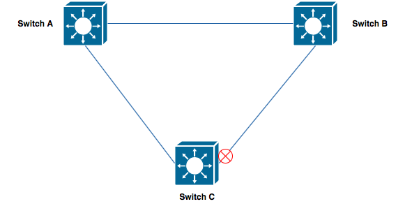
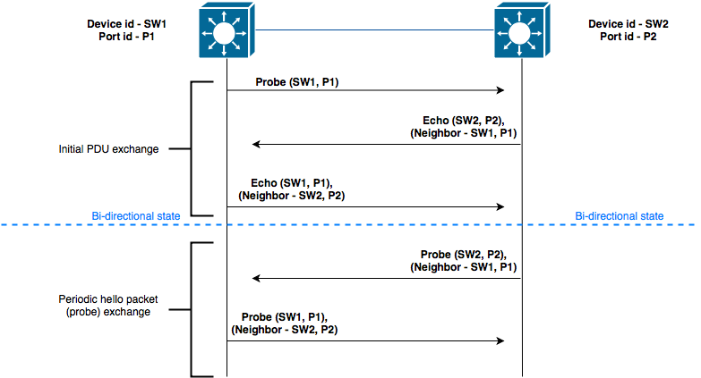
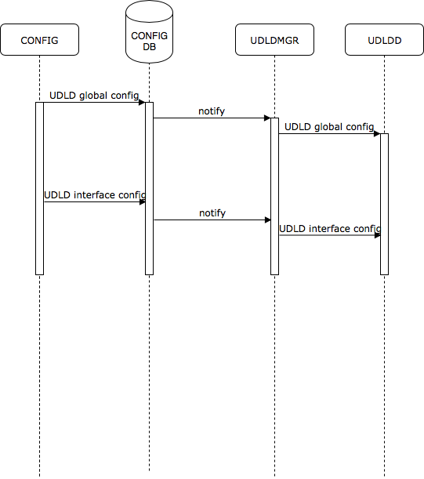
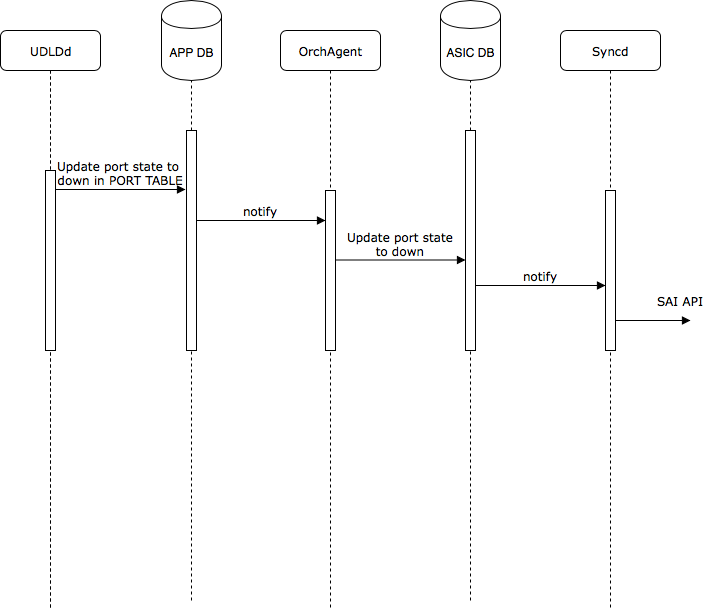
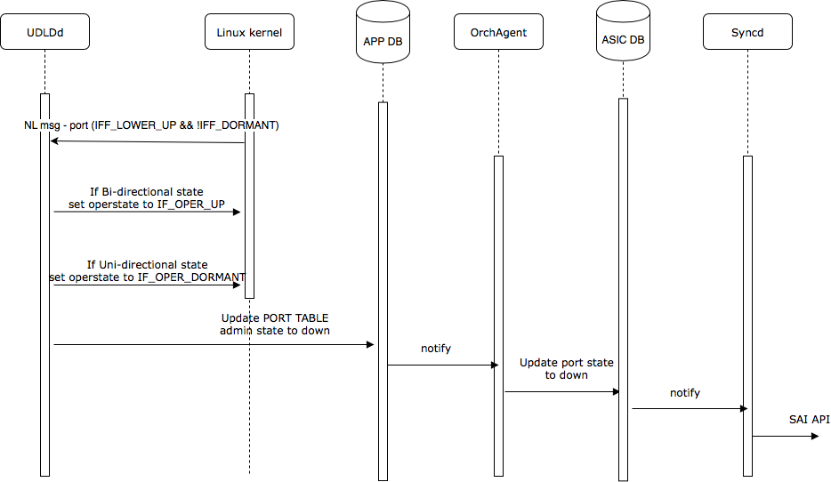

# Feature Name
UDLD - Uni-directional Link Detection Protocol
# High Level Design Document
#### Rev 0.1

# Table of Contents
  * [List of Tables](#list-of-tables)
  * [Revision](#revision)
  * [About This Manual](#about-this-manual)
  * [Scope](#scope)
  * [Definition/Abbreviation](#definitionabbreviation)
  * [Feature Overview](#feature-overview)
      * [Requirements](#requirements)
      * [Design overview](#design-overview)
  * [Functionality](#-functionality)
      * [Target Deployment Use Cases](#target-deployment-use-cases)
      * [Functional Description](#functional-description)
  * [Design](#design)
      * [Overview](#overview)
      * [DB Changes](#db-changes)
          * [CONFIG DB](#config-db)
          * [APP DB](#app-db)
      * [Switch State Service Design](#switch-state-service-design)
          * [Orchestration Agent](#orchestration-agent)
      * [SAI](#sai)
      * [User Interface](#user-interface)
          * [Data Models](#data-models)
          * [CLI](#cli)
              * [Configuration Commands](#configuration-commands)
              * [Show Commands](#show-commands)
              * [Debug Commands](#debug-commands)
              * [Clear Commands](#clear-commands)
  * [Flow Diagrams](#flow-diagrams)
  * [Error Handling](#error-handling)
  * [Serviceability and Debug](#serviceability-and-debug)
  * [Warm Boot Support](#warm-boot-support)
  * [Scalability](#scalability)
  * [Unit Test](#unit-test)
  * [Internal Design Information](#internal-design-information)

# List of Tables
[Table 1: Abbreviations](#table-1-abbreviations)

# Revision
| Rev |     Date    |       Author              | Change Description                |
|:---:|:-----------:|:-------------------------:|-----------------------------------|
| 0.1 | 11/11/2019 |     Sandeep Kulambi,                                                       Dhanasekar Rathinavel     | Initial version  |
| 0.2 | 02/13/2020 | Sandeep Kulambi,                                                       Dhanasekar Rathinavel | Addressed review comments, Added Appendix A for Errdisable recovery feature details |


# About this Manual
This document provides general information about the UDLD (Uni-directional Link Detection protocol) feature implementation in SONiC.
# Scope
This document describes the high level design of UDLD feature. 

# Definition/Abbreviation
### Table 1: Abbreviations
| **Term** | **Meaning**                     |
| -------- | ------------------------------- |
| PDU      | Protocol Data Unit              |
| REST     | Representational state transfer |
| STP      | Spanning tree protocol          |
| UDLD     | Uni-directional Link Detection  |


# 1 Feature Overview

UDLD is a layer 2 protocol that allows detection of uni-directional link failures which is required in  spanning-tree topologies for avoiding loops caused due to uni-directional link failures. 

## 1.1 Requirements

### 1.1.1 Functional Requirements


  1. Support UDLD protocol based on RFC 5171
  2. Support protocol operation on physical ports and static breakout ports
  3. Support protocol operation on member ports of port-channel interfaces


### 1.1.2 Configuration and Management Requirements
This feature will support CLI and REST based configurations, based on KLISH framework
 1. Support CLI configurations as mentioned in section 3.6.2
 2. Support show commands as mentioned in section 3.6.3
 3. Support debug commands as mentioned in section 3.6.4
 4. Support REST APIs for config and operational data

     

### 1.1.3 Scalability Requirements
UDLD scalability number will be same as the maximum number of physical ports supported on the device.

### 1.1.4 Warm Boot Requirements

Warm boot should be supported.

## 1.2 Design Overview
### 1.2.1 Basic Approach
This is a new feature development.

### 1.2.2 Container
A new container will be added to support UDLD.

### 1.2.3 SAI Overview
No SAI changes


# 2 Functionality

# 2 Functionality

## 2.1 Target Deployment Use Cases

Figure 1 below has a topology where spanning-tree is being run to break the loop in the network, the link connecting Switch B and Switch C is blocked on Switch C side. As long as Switch C receives the BPDUs from Switch B, the port will continue to be in blocking state. In case there is a uni-directional failure from Switch B towards Switch C, then Switch C will stop receiving the BPDUs resulting in STP timers expiring on Switch C and moving the port from blocking to forwarding state, this results in a loop in the network. To avoid this loop UDLD can be used to monitor the links and in the event of a uni-directional failure the link can be shutdown to avoid the loops.



__Figure 1: Spanning-tree topology__


## 2.2 Functional Description

UDLD exchanges periodic hello packets which helps in discovering the neighbor devices and monitoring of the link. UDLD must be enabled on both ends of the link for the protocol to operate correctly. 

For the UDLD PDU format and the TLVs please refer to RFC 5171 which has the detailed information.

UDLD exchanges following information to identify the participating device and ports in the network

- Device id - System MAC address of the device will be used for device id

- Device name - Hostname of the device will be used for device name

- Port id - Interface name will be used for port id

  

#### UDLD Message Types

- Probe message - This message is sent in 2 scenarios
   - When link comes up a probe message is sent for discovering the neighbors
   - Once UDLD reaches stable state (meaning bi-directional state) periodic messages are sent by each device as per message time interval configuration. The probe message in this case includes the neighbor device information in the echo TLV.
- Echo message - This message is sent when a new neighbor is discovered which can happen when a probe message is received on link up or on receiving the first echo message from the peer. This message ensures the neighbor information learnt is echoed back to the peer quickly.
- Flush message - This message is sent whenever UDLD is operationally getting disabled on the port, this allows the neighbor device to flush the information learnt without bringing down the link. This could be triggered in the case user is disabling UDLD or UDLD is shutting down the port.


Figure 2 below has the details of UDLD PDU exchange between 2 devices



__Figure 2: UDLD PDU exchange__


#### UDLD Operational modes

UDLD supports 2 operational modes which are user configurable

- Normal mode - In case of normal mode, the failure detection is always "event based". The event in this case is the reception of PDU. All actions are taken based on the information learnt from the received PDU. In case UDLD stops receiving the PDU, then there is no action taken (like shutting down the interface, however a log message will be generated in this case), this is a conservative approach taken to minimize the false positives during failure detection process. In case the received information from the PDU indicates failure then action is taken to shutdown the interface.
- Aggressive mode - Aggressive mode behavior is similar to Normal mode, except the case when the link is in bi-directional state and then stops receiving the PDUs, this is treated as a meaningful network event and UDLD takes the action of shutting down the interface.

By default when port is UDLD enabled, it operates in normal mode.


#### Failure detection scenarios

- Empty echo - UDLD PDU is transmitted on the port but when received from the neighbor PDU doesn't contain the local device information (no echo) resulting in empty echo state. On detecting this condition interface will be shutdown in both aggressive and normal mode
- Incoming UDLD packets stop - when the link is in bi-directional state and the UDLD PDU reception stops, this results in the detection of uni-directional failure after the timeout period. On detecting this condition interface will be shutdown in case of aggressive mode and UDLD state will be set as undetermined in case of normal mode
- Tx-Rx Loop - When the UDLD PDU transmitted on the port is received back it will be detected as Tx-Rx loop and the interface will be shutdown, this behavior is same in both aggressive and normal mode


#### UDLD port states

- Undetermined - UDLD has not received enough information from the peer to determine the state

- Shutdown - UDLD has determined the link to be uni-directional and has shutdown the interface

- Bi-directional - UDLD is able to exchange the PDUs and has determined the link to be bi-directional

  


#### UDLD - detection of uni-directional state

- Once the protocol has determined the link to be bi-directional if one of the peer stops receiving the PDUs it will wait for a duration of peer timeout interval for expiring the neighbor entry
- Once the neighbor entry expires UDLD will declare the link as uni-directional.
- With a message interval configuration of 1 sec and multipler of 3, the failure detection can be done in 3 seconds. 


#### Failure Recovery 

Once UDLD has detected the failure and has shutdown the interface, user can recover either using "udld reset" command or by doing "shut/no shut" on the interface.

After recovery when the port comes up, UDLD will exchange the PDUs with the neighboring device to determine the link state. During this period, the kernel interface will continue to be in down state so for all the applications in the system the port is still considered down. Once UDLD determines port is bi-directional the kernel interface state is moved to up state.

The kernel interface state can be controlled by user space applications via the interface specific flags available. During failure condition, UDLD will set the IF_OPER_DORMANT flag and then trigger the port  shutdown. After recovery when the port comes up, kernel will not move the port state to IF_OPER_UP as IF_OPER_DORMANT flag is set, kernel waits for user space application to update the oper state. Once UDLD determines the link is bi-directional, the port state is updated with IF_OPER_UP. This will result in netlink notifications to all the subscribed applications that the port is operationally up now. This mechanism ensures the port continues to be operationally down when the failure recovery is in progress and avoids the unnecessary port state change if the failure condition continue to persist.

#### LAG member port 

UDLD can be enabled on the member ports of port-channel interfaces, operationally the UDLD behavior on member ports is same as individual ethernet interfaces. When UDLD detects a failure and shuts down the port, the Linux kernel state for the port will be updated as down. Teamd will get this port down notification through netlink, the handling on the teamd side is similar to what happens when port goes down operationally.


#### Configuration considerations

- Both end of the links must be UDLD enabled for protocol to detect the uni-directional failures
- UDLD mode i.e. aggressive or normal should be same on both end of the links, different modes on both sides can result in delayed detection of uni-directional failures
- UDLD aggressive mode should be used only on point-to-point links
- Auto-negotiation and Link fault signaling (LFS) operate at Layer 1 and can discover link issues like uni-directional failures and bring down the link. However UDLD would still be useful in the cases where the link is up at Layer 1 but still has uni-directional failures due to mis-wiring or for any other reasons


# 3 Design

## 3.1 Overview
UDLD container will have UDLDMgr and UDLDd processes.

UDLDMgr process will register with the config DB for receiving all the UDLD configurations. UDLDMgr will notify this configuration information to UDLDd for protocol operation. 

UDLDd process will handle following interactions. UDLDd will use libevent for processing the incoming events and timers.
1) Packet processing 

- Socket of PF_PACKET type will be created for packet tx/rx 
- Filters will be attached to the socket to receive the UDLD PDUs based on DA MAC (01:00:0c:cc:cc:cc)

2) Configuration - All UDLD CLI will be received from UDLDMgr via unix domain socket
3) Timers handling - Timer events are generated every 1sec for handling UDLD protocol timers
4) Port events - Netlink socket interface for processing create/delete of port, link state changes of port
5) Operational updates - UDLDsync is part of UDLDd and handles all the updates to APP DB. All DB interactions are detailed in the Section 4.
6) UDLD Port state sync to Linux kernel - When UDLD determines the uni-directional failure, it updates the Linux kernel interface to down state and when bi-directional state is determined it updates the interface to up state.

## 3.2 DB Changes
This section describes the changes made to different DBs for supporting the UDLD protocol.
### 3.2.1 CONFIG DB
Following config DB schemas are defined for supporting this feature.
### UDLD_GLOBAL_TABLE
    ;Stores UDLD Global configuration
    ;Status: work in progress
    key                    = UDLD|GLOBAL      ; Global UDLD table key
    admin_enable           = "true/false"         ; Global UDLD enabled or not
    aggressive             = "true/false"         ; Aggressive mode enabled or not
    msg_time               = 2*DIGIT          ; Message time in secs (1 to 30, DEF:1)
    multiplier             = 2*DIGIT          ; Multiplier (3 to 10, DEF:3)

### UDLD_PORT_TABLE
    ;Stores UDLD configuration per interface
    ;Status: work in progress
    key             = UDLD_PORT|"ifname"  ; UDLD with prefix "ifname"
    admin_enable    = "true/false"            ; Interface level UDLD enabled or not
    aggressive      = "true/false"            ; Aggressive mode enabled or not

### 3.2.2 APP DB

### UDLD_GLOBAL_TABLE

```
;Stores UDLD Global operational information
;Status: work in progress
key                    = UDLD:GLOBAL      ; Global UDLD table key
device_id              = "deviceid"       ; Local device id
device_name            = "hostname"       ; Local device name
timeout_interval       = 2*DIGIT          ; Timeout interval (msg_time x multiplier)
```

### UDLD_PORT_TABLE

```
;Stores UDLD operational details for the PORT
;Status: work in progress
key                    = UDLD_PORT:"ifname"   ; UDLD PORT table key
status                 = "state"              ; UDLD state for the port
pdu_sent               = 1*10DIGIT            ; UDLD Tx PDU count   
pdu_received           = 1*10DIGIT            ; UDLD Rx PDU count
pdu_recv_error         = 1*10DIGIT            ; UDLD Rx Error PDU count
```
### UDLD_PORT_NEIGH_TABLE

```
;Stores UDLD operational details for the PORT
;Status: work in progress
key                = UDLD_PORT_NEIGH:"ifname":"index" ; UDLD neighbors table key
device_id          = N*DIGIT                          ; Device-id variable length hex value
port_id            = "ifname"                         ; Port-id name of peer
device_name        = "devicename"                     ; Device name of peer
msg_time           = 2*DIGIT                          ; Message time of peer
timeout_interval   = 2*DIGIT                          ; Timeout interval of peer
```

## 3.3 Switch State Service Design
### 3.3.1 Orchestration Agent
No changes

### 3.3.2 Control packet trap mechanism
SONiC uses COPP configuration file 00-copp.config.json for configuring the trap group, ids, CPU priority queue and a policer. UDLD packet trap is already supported and no changes are required for this in current release.

## 3.5 SAI
No SAI changes required

## 3.6 User Interface
### 3.6.1 Data Models
Openconfig YANG model is not available for UDLD, we are proposing the following openconfig extension for UDLD [OC-UDLD-EXT-YANG](openconfig-udld-ext.yang).
KLISH CLIs continue to use SONIC YANG.[SONIC-UDLD-YANG](sonic-udld.yang)

UDLD Openconfig YANG tree:
```
module: openconfig-udld-ext
  +--rw udld
     +--rw config
     |  +--rw admin-enable?   boolean
     |  +--rw aggressive?     boolean
     |  +--rw msg-time?       uint8
     |  +--rw multiplier?     uint8
     +--ro state
     |  +--ro admin-enable?   boolean
     |  +--ro aggressive?     boolean
     |  +--ro msg-time?       uint8
     |  +--ro multiplier?     uint8
     +--rw interfaces
        +--rw interface* [name]
           +--rw name      -> ../config/name
           +--rw config
           |  +--rw name?           oc-if:base-interface-ref
           |  +--rw admin-enable?   boolean
           |  +--rw aggressive?     boolean
           +--ro state
              +--ro name?             oc-if:base-interface-ref
              +--ro admin-enable?     boolean
              +--ro aggressive?       boolean
              +--ro local-info
              |  +--ro device-id?     string
              |  +--ro device-name?   string
              |  +--ro status?        identityref
              +--ro neighbors-info
              |  +--ro neighbor* [ifname index]
              |     +--ro ifname         oc-if:base-interface-ref
              |     +--ro index          uint16
              |     +--ro device-id?     string
              |     +--ro device-name?   string
              |     +--ro status?        identityref
              |     +--ro port-id?            string
              |     +--ro msg-time?           uint8
              |     +--ro timeout-interval?   uint8
              +--ro counters
                 +--ro frame-out?        yang:counter64
                 +--ro frame-in?         yang:counter64
                 +--ro frame-error-in?   yang:counter64
```

### 3.6.2 CLI

### 3.6.2.1 Configuration Commands
### 3.6.2.1.1 Global level 

### 3.6.2.1.1.1 Global UDLD configuration
This command allows enabling the UDLD at global level.

Use the no form of this command to disable the UDLD protocol.

**udld enable**

**no udld enable**

**Syntax Description:**

| Keyword | Description                 |
| ------- | --------------------------- |
| enable  | Enable UDLD at global level |


**Default**: UDLD is disabled

**Command Mode**: Global Config

Enabling UDLD globally will not enable UDLD on the ports, user needs to explicitly enable UDLD on the port.

### 3.6.2.1.1.2 UDLD aggressive mode

This command allows enabling the UDLD aggressive mode. By default all ports will operate in normal mode. When global aggressive mode is enabled all the ports will operate in aggressive mode.

Use the no form of this command to disable the UDLD aggressive mode.

**udld aggressive**

**no udld aggressive**

**Syntax Description:**

| Keyword | Description             |
| ------- | ----------------------- |
| aggressive  | Enable aggressive UDLD mode |

**Default**: Aggressive mode is disabled

**Command Mode**: Global Config

### 3.6.2.1.1.3 UDLD message time

This command allows configuring the UDLD message time. This allows user to configure the time interval at which periodic hellos are exchanged.

Use the no form of this command to reset the UDLD message time to default value.

**udld message-time <value\>**

**no udld message-time**

**Syntax Description:**

| Keyword              | Description                                             |
| -------------------- | ------------------------------------------------------- |
| message-time <value\> | Configure UDLD message time value range is 1 to 30 secs |

**Default**: 1 sec

**Command Mode**: Global Config

### 3.6.2.1.3 UDLD multiplier

This command allows configuring the UDLD multiplier value. This multiplier value is used to determine the timeout interval (i.e. message-time x multiplier value) after which UDLD declares the state of the link.

Use the no form of this command to reset the UDLD multiplier to default value.

**udld multiplier <value\>**

**no udld multiplier**

**Syntax Description:**

| Keyword            | Description                                       |
| ------------------ | ------------------------------------------------- |
| multiplier <value\> | Configure UDLD multiplier value, range is 3 to 10 |

**Default**: 3

**Command Mode**: Global Config

 ### 3.6.2.1.2 Interface level 

 ### 3.6.2.1.2.1 UDLD enable/disable on interface

This command allows enabling or disabling of UDLD on an interface, by default UDLD is disabled on the interface.

**udld enable**

**no udld enable ** 

**Syntax description**:
This command has no arguments or keywords. 

**Default**: Disabled

### 3.6.2.1.2.2 UDLD aggressive mode on interface

This command allows enabling or disabling of UDLD aggressive mode on an interface, by default UDLD runs in normal mode on the interface, unless aggressive mode is enabled globally.

**udld aggressive**

**no udld aggressive ** 

**Syntax description**:
| Keyword | Description             |
| ------- | ----------------------- |
| aggressive  | Enable aggressive UDLD mode |

**Default**: Disabled

### 3.6.2.2 Show Commands

- show udld global
``` 
show udld global  

UDLD Global Information
  Admin State:                UDLD enabled
  Mode:                       Aggressive
  UDLD message time:          1 secs
  UDLD multiplier:            3 
```

- show udld neighbors

``` 
show udld neighbors 

Port           Device Name     Device ID         Port ID         Neighbor State
---------------------------------------------------------------------------------
Ethernet1      Sonic           3c2c.992d.8201    Ethernet0       Bidirectional   
Ethernet3      Sonic           3c2c.992d.8201    Ethernet3       Bidirectional   
```

- show udld interface <ifname\>

``` 
show udld interface Ethernet1 

UDLD information for Ethernet1
  UDLD Admin State:                  Enabled
  Mode:                              Aggressive
  Status:                            Bidirectional
  Local device id:                   3c2c.992d.8201
  Local port id :                    Ethernet1 
  Local device name:                 Sonic
  Message time:                      1
  Timeout interval:                  3
  	Neighbor Entry 1
  	----------------------------------------------------------------------------------------
  	Neighbor device id:         3c2c.992d.8235 
  	Neighbor port id:           Ethernet0 
  	Neighbor device name:       Sonic
  	Neighbor message time:      1           
  	Neighbor timeout interval:  3
```

- show udld statistics [interface <name\>]
  This command displays the UDLD statistics. Statistics will be synced to APP DB every 10 seconds.
```
show udld statistics interface Ethernet0

UDLD Interface statistics for Ethernet0
Frames transmitted:         10
Frames received:            9
Frames with error:          0
```


### 3.6.2.3 Debug Commands

Following debug commands will be supported for enabling additional logging, all the logs in the context of UDLDd and UDLDMgr will be stored in /var/log/udldd.log. Any logs in orchagent context will be available in /var/log/syslog.

- debug udld packet [tx|rx|both] <ifname\>
- debug udld [set|reset] trace_lvl <module\>
- debug udld set log_lvl <level\>

Following debug commands will be supported to display internal information.

- debug udld dump all
- debug udld dump global
- debug udld dump interface <ifname\>

Note: All debug commands are available as part of CLICK CLI only

### 3.6.2.4 Exec Commands

### 3.6.2.4.1 clear command 

The below command allows to clear the UDLD statistics

- sonic-clear udld statistics [ interface <ifname\>] 

Note: This command is available as part of CLICK CLI only

### 3.6.2.4.2 UDLD reset command 

The below command allows to reset the interfaces which are shutdown by UDLD. 

- udld reset

An alternate way to bring up an interface disabled by UDLD is to perform "shut" followed by "no shut" operation on the specific interface.

Note: This command is available as part of CLICK CLI only

### 3.6.3 REST API Support

All REST operations are supported.
Below listed are some of the supported REST URI's.

```
<REST-SERVER:PORT>/restconf/data/openconfig-udld-ext:udld
<REST-SERVER:PORT>/restconf/data/openconfig-udld-ext:udld/config/admin-enable
<REST-SERVER:PORT>/restconf/data/openconfig-udld-ext:udld/config/aggressive
<REST-SERVER:PORT>/restconf/data/openconfig-udld-ext:udld/interfaces/interface=Ethernet0
<REST-SERVER:PORT>/restconf/data/openconfig-udld-ext:udld/interfaces/interface=Ethernet0/config/admin-enable
<REST-SERVER:PORT>/restconf/data/openconfig-udld-ext:udld/interfaces/interface=Ethernet0/config/aggressive
```

# 4 Flow Diagrams

### 4.1 UDLD configuration flow



__Figure 3: UDLD configuration flow__

### 4.2 UDLD operational state update



__Figure 4: UDLD port state update__

### 4.3 UDLD port recovery



__Figure 5: UDLD port recovery__


# 5 Error Handling

UDLD has limited interaction with other components in the system.

All the errors will be logged and captured in the UDLD log files. 

# 6 Serviceability and Debug

Debug and statistics commands as mentioned in Section 3.6.3 and 3.6.4 will be supported. 

All the logfile and the debug command output will be collected as part of techsupport.

# 7 Warm Boot Support
Currently there is no mechanism to send periodic hello packets during warm boot in SONiC. Due to this when warm boot is in progress and protocol daemons are restarted, peer devices will not receive the control packets which results in protocol timeouts and subsequent traffic disruption. To avoid these timeouts UDLD will be disabled operationally during warm boot, this is achieved by sending UDLD flush PDU on reception of which the peer device will stop monitoring the link for uni-directional failures. Once  warm boot is complete, UDLD will resume exchanging the PDUs to learn the neighbor information and to continue monitoring the links.

For links where UDLD has detected uni-directional failures and has shutdown the interfaces, those interfaces will continue to be operationally down during the warm boot. Post warm boot the state information is restored from the APP DB.

 

# 8 Scalability
Maximum number of ports in the device.


# 9 Unit Test

CLI:
1) Verify enabling/disabling of global UDLD Mode
2) Verify configuring various value of message-time 
3) Verify configuring various value of multiplier
4) Verify configuring various value of message-time 
5) Verify disabling global UDLD removes all the UDLD configuration both globally and at interface level
6) Verify enabling/disabling of normal mode global level
7) Verify enabling/disabling of UDLD on specific interface
8) Verify enabling/disabling of normal mode UDLD on specific interface
9) Verify global show udld command
10) Verify show udld neighbor command
11) Verify show udld interface command
12) Verify show udld counters command
13) Verify udld reset command
14) Verify clear udld counters command
15) Verify show running-config udld command
16) Verify save and reload with UDLD configuration

Functionality
1) Verify UDLD normal mode operation on an interface
2) Verify UDLD aggressive mode operation on an interface
3) Verify with different message-timer intervals PDUs are exchanged as per the configuration
11) Verify show udld interface command
12) Verify show udld counters command
13) Verify udld reset command
14) Verify clear udld counters command
15) Verify show running-config udld command
16) Verify save and reload with UDLD configuration

Functionality
1) Verify UDLD normal mode operation on an interface
2) Verify UDLD aggressive mode operation on an interface
3) Verify with different message-timer intervals PDUs are exchanged as per the configuration
4) Verify with different multipler values the timeout happens as per the configuration
5) Verify UDLD operation on the member port of LAG
6) Verify shut/no-shut of an interface when UDLD is in bi-directional state
7) Verify after uni-directional failure is detected UDLD shuts down the port
8) Verify shut/no-shut on UDLD disabled port recovers the port
9) Verify the failure detection by UDLD after bringing up the link which already has uni-directional failure
10) Verify UDLD operation with one end in normal mode and other end in aggressive mode
11) Verify UDLD in the scenario where the UDLD PDUs are looped back
12) Verify UDLD with PVST
13) Verify UDLD with RPVST
14) Verify UDLD operation with high CPU conditions
15) Verify UDLD interoperation with other vendor devices which support RFC 5171
16) Verify warm reboot with UDLD enabled
17) Verify UDLD docker stop and start
18) Verify techsupport has UDLD log files and debug command output collected

Logging and debugging
1) Verify debug messages are logged in /var/log/udldd.log and /var/log/syslog
2) Verify changing log level
3) Verify Pkt Tx/Rx Debug
4) Verify UDLD debug commands
5) Verify debug commands output is captured in techsupport

REST
1) Verify all REST commands


# 10 Internal Design Information

### 10.1 IS-CLI Compliance

|                        CLI Command                        |       Compliance       |           IS-CLI Command (if applicable)           | Link to the web site identifying the IS-CLI command (if applicable) |
| :-------------------------------------------------------: | :--------------------: | :------------------------------------------------: | ------------------------------------------------------------ |
|                        udld enable                        |      IS-CLI-like       |                        N/A                         |                                                              |
|                      udld aggressive                      |      IS-CLI-like       |                        N/A                         |                                                              |
|                     udld message-time                     |      IS-CLI-like       |                        N/A                         |                                                              |
|                      udld multiplier                      |      IS-CLI-like       |                        N/A                         |                                                              |
|                        udld enable                        | IS-CLI drop-in replace |                    udld enable                     |                                                              |
|                      udld aggressive                      | IS-CLI drop-in replace |                  udld aggressive                   |                                                              |
|                     show udld global                      |      IS-CLI-like       |                     show udld                      |                                                              |
|                    show udld neighbors                    |      IS-CLI-like       |                        N/A                         |                                                              |
|               show udld interface <ifname\>               |      IS-CLI-like       | show interface port *<port alias or number\>* udld |                                                              |
|        show udld statistics [interface <ifname\>]         |      IS-CLI-like       |                        N/A                         |                                                              |
|        debug udld packet [tx\|rx\|both] <ifname\>         |      IS-CLI-like       |                        N/A                         |                                                              |
|        debug udld [set\|reset] trace_lvl <module\>        |      IS-CLI-like       |                        N/A                         |                                                              |
|              debug udld set log_lvl <level\>              |      IS-CLI-like       |                        N/A                         |                                                              |
|               debug udld dump [global\|all]               |      IS-CLI-like       |                        N/A                         |                                                              |
|            debug udld dump interface <ifname\>            |      IS-CLI-like       |                        N/A                         |                                                              |
|       clear udld statistics [ interface <ifname\>]        |      IS-CLI-like       |                        N/A                         |                                                              |
|                        udld reset                         |      IS-CLI-like       |                        N/A                         |                                                              |
|       config errdisable recovery interval <value\>        |      IS-CLI-like       |       errdisable recovery interval <value\>        |                                                              |
| config errdisable recovery cause {enable\|disable} {udld} |      IS-CLI-like       |        errdisable recovery cause {feature}         |                                                              |
|                 show errdisable recovery                  |      IS-CLI-like       |              show errdisable recovery              |                                                              |

### 

# Appendix A

This appendix has information related to Errdisable recovery functionality for UDLD feature. This was a late addition in the release, hence captured under this Appendix section.

Errdisable recovery functionality allows automatic recovery of ports that are shutdown due to specific conditions detected by a feature (Ex - uni-directional failures in case of UDLD). There can be multiple features which can take this action of bringing down the interface, UDLD being one of them. When errdisable recovery is enabled, post shutdown of a port a recovery timer is started as per the configured recovery interval, on expiry of this timer the port is enabled back. This helps in automatic recovery of the port without user intervention.

Following CLICK CLIs are supported for this functionality -

The below command allows configuring the recovery interval.

Default - 300sec, Range - 30-65535

##### config errdisable recovery interval <value\>


The below command allows enabling/disabling of errdisable recovery functionality for UDLD. By default it is disabled.

##### config errdisable recovery cause {enable|disable} {udld}


The below command can be used to display the errdisable recovery status of UDLD and the recovery interval configured

##### show errdisable recovery 
```
Errdisable Cause    Status
------------------  --------
udld                disabled

Timeout for Auto-recovery: 300 seconds
```
