# ACL Enhancements in SONiC

High level design document version 0.2

# Table of Contents
[TOC]

# List of Tables
[Table 1 Abbreviations](#table-1-abbreviations)

# Revision
| Rev  | Date       | Author              | Change Description                       |
| ---- | ---------- | ------------------- | ---------------------------------------- |
| 0.1  | 07/12/2019 | Abhishek Dharwadkar | Initial version                          |
| 0.2  | 10/15/2019 | Abhishek Dharwadkar | Add ACL enhancement and policing details |
| 0.3  | 11/10/2019 | Abhishek Dharwadkar | Add FBS support for mirroring |

# About this Manual
This document provides general information about the ACL enhancements and Flow Based Services feature in SONiC.

# Scope
This document provides general information about the ACL enhancements and Flow Based Services feature implementation in SONiC.

# Definition/Abbreviation

## Table 1 Abbreviations
| **Term** | **Meaning**          |
| -------- | -------------------- |
| ACL      | Access Control List  |
| PBR      | Policy Based Routing |
| SPAN     | Switch Port ANalyzer |
| sFlow    | Sampled flow         |
| MQC      | Modular QoS CLIs     |

# Feature Overview

## Access control Lists
Access-control lists (ACLs) are used to filter traffic based on the contents of the Layer 2 and/or Layer 3 packet header. User ACLs are bound to interfaces on which traffic filtering is intended.

The primary benefits of an ACL are 

1. Provide a measure of security.
2. Save network resources by reducing unwanted traffic.
3. Block unwanted traffic or users from accessing the network resources
4. Reduce the chance of DOS attacks
5. Use as classification for QoS Actions like Rate-limiting, PCP Remarking, DSCP Remarking etc.
6. Use as classification to make forwarding decisions like PBR.

## Flow Based Services
Flow based services enhance the switches capability to have enhanced and better control over the traffic by providing a generic framework for "Match and Set" features. Incoming packets can be classified according to match rules using fields from L2-L4 headers and defined actions can be taken accordingly. 

Example features might be: -

1. QoS remarking and policing
2. Monitoring (e.g. SPAN, sFlow)
3. Forwarding (e.g. PBR, L2 redirect)

This feature provides a common infrastructure service for such features, and implements DHCP and PCP remarking as the first user of this service - other features are to follow in future releases. The common infrastructure service can itself use the SONiC ACL feature for packet match rule definition, or can use it's own UI for more sophisticated classifiers. 

## Requirements

### Functional Requirements

The following are the requirements for ACL enhancements and Flow Based Services feature:
1. Support Layer 2 ACL i.e. support match on Layer 2 fields like Source MAC, Destination MAC, PCP, etc.
2. Support L3 header fields like DSCP, ICMP type and ICMP code.
3. Support ACL application at Port/LAG, VLAN and Switch level.
4. Support hierarchical filtering of traffic across interfaces.
5. Support for dedicated TCAMs for ACL binding for better utilization of the ACL Tables and for getting detailed counter information.
3. Provide a industry standard MQC equivalent framework for fine grained classification of the traffic via ACL or fields of L2-L4 header and take specific actions on the classified traffic.
4. Support DSCP, COS Remarking and Policing QoS action. 
8. Support mirroring/SPAN action.
9. Enhance monitoring capabilities by supporting Flow based sFlow in future.
10. Enhance forwarding capabilities by supporting Flow based routing and Flow based forwarding in future.
11. Ability to bind multiple policies of different types to Ports/LAGs, VLANs and Switch.
12. Independent ingress and egress policy binding for a given interface.
13. Merge non conflicting actions from different policies using ASIC capabilities to simplify user configuration. 

### Configuration and Management Requirements
1. Support Classifiers from [QoS Openconfig](https://github.com/openconfig/public/blob/master/release/models/qos) except TTL and IPv6 Flow labels.
2. Augment conditions yang container to support match on ACL of types L2, IPv4, IPV6. 
3. Provide config commands to support configuration and application of Flow based Services Policies.
4. Provide statistics support

### Scalability Requirements
Flow based services will use the same resources as ACL. The exact numbers will be silicon specific.

### Warm Boot Requirements
Flow based services should work seamlessly across warmboot. Statistics must be preserved across warmboot.

## Design Overview

### Basic Approach

#### ACL Enhancements
A new ACL services daemon will be implemented to assist ACL orchagent for ACL. ACL Services daemon will support multiple ACL based features. The ACL manager, which is part of ACL services daemon will consume the user configuration from Config DB and build an aggregated ACL configuration in App DB. ACL Orchagent will consume the aggregated ACL from App DB. The schema for ACL table and ACL rule will remain identical to that of Config DB to minimize the impact on ACL orchagent.

#### Flow Based Services 
Flow based services will be implemented as part of ACL Services Daemon in SWSS. Flow based services is new code added to SONiC repository. Manageability related code will be added to manageability related  container.

### Container
This code will be part of ACL Services daemon in switch state service (swss) container.

### SAI Overview

Existing [ACL SAI](https://github.com/opencomputeproject/SAI/blob/master/inc/saiacl.h) will be used and no enhancements are necessary.

# Functionality

## Target Deployment Use Cases
1. Data traffic filtering using L2, L3 and L4 header fields.
2. Mirroring traffic flows using VLAN ID.
3. Increased ACL table application when there are less number of rules per ACL.
3. QoS policies can be used to fine tune traffic by classifying the traffic via L2-L4 ACL/Header fields and taking actions like Remarking, Policing etc.
4. Forwarding policies can used to control the traffic path in the network for a flow.

## Functional Description

### ACL

#### ACL enhancements for table of type l3 and l3v6 

DSCP, ICMP(v6) Type and ICMP(v6) Code keys are enabled on tables of type l3(v6) along with mirror table.

#### ACL enhancements for table of type mirror

ACL tables of type mirror will support additional match criteria for VLAN and PCP along with existing L3 and L4 header keys.

#### L2 ACLs

Layer 2 ACL can be used to filter traffic based on MAC header fields like Source MAC, Destination MAC, VLAN etc. Layer 2 ACLs can be used to filter traffic of any ether type including IPv4 and IPv6. Layer 2 ACLs can be applied to all interfaces ie Ethernet, PortChannel, VLAN or Switch. 

#### VLAN ACLs

VLAN ACLs provide traffic filtering for all traffic that is bridged within the same VLAN or routed in or out of a VLAN. VLAN ACLs are applied to both bridged and routed traffic. VLAN ACLs supports MAC, IPv4 or IPv6 ACLs.

#### Switch ACLs

Switch ACLs provide traffic filtering for all bridged or routed traffic in the switch. Switch ACLs supports MAC, IPv4 or IPv6 ACLs.

#### ACL Lookup mode

A new mode called ***advanced*** mode is available to help optimize TCAM utilization. The older ACL behavior is new called as ***legacy*** mode. In Legacy mode, each ACL Table of a given type consumes 1 SAI ACL table ( i.e. 1 to 1 mapped). Since each silicon only supports a small number of SAI ACL tables (typically single digit) this may lead to under utilization of TCAM resources of all entries in the Table are not used. In Advanced mode, all ACL tables used for the same functionality will be using the same SAI ACL table. Example All Datapath ACL bindings for L3 ACL will use 1 SAI table. Similarly all QoS Flow based services policies applied will use the same SAI ACL Table. This leads to better TCAM utilization in certain cases.

Lookup mode is only applicable for datapath ACL. Flow based services will always use lookup mode as ***advanced*** with no TCAM sharing, as actions like policing cant be supported in legacy mode.

#### Default rule for ACL tables of type l2, l3 and l3v6

All ACLs of type l2, l3 and l3v6 has a default deny any rule appended at the end with lowest priority internally for Datapath ACL. The default deny any rule is not applicable for Flow based services.

#### Evaluation of ACLs applied on different interfaces

The following diagram shows the different ACLs supported and the location where the ACLs will be applied.

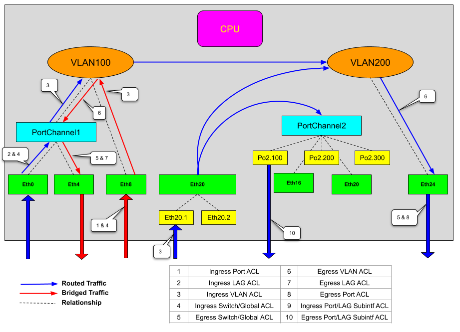

The following diagram shows the evaluation order for datapath ACLs. The same is applicable for Flow based services also and will be captured in upcoming sections. datapath ACLs have a default deny any rule. This rule will be applied only after user configured ACL rules are evaluated at Port/LAG, VLAN and Switch Level. 

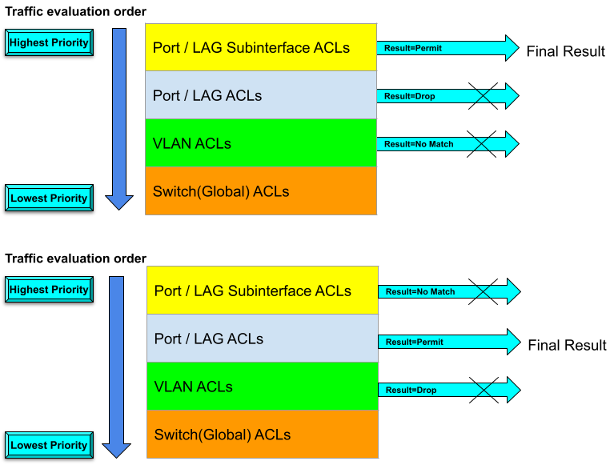

#### Interaction of L2 and IPv4/IPv6 ACLs

An incoming traffic can match both L2 and L3 (IPv4/IPv6) datapath ACLs. The traffic will be dropped when either of the ACL gives a result of drop. The counters for both ACLs will be incremented to indicate the match.

| Result from L2 ACL | Result from L3 ACL (IPv4 or IPv6) | Final Result |
| ------------------ | --------------------------------- | ------------ |
| FORWARD            | FORWARD                           | FORWARD      |
| DROP               | FORWARD                           | DROP         |
| FORWARD            | DROP                              | DROP         |
| DROP               | DROP                              | DROP         |

### Flow based services
Flow based services provide a modular and extensible framework to classify traffic  and take appropriate action for the traffic. Flow based services can be used for different features like QoS, Forwarding and Monitoring. 

Flow based services configuration is made up of 3 parts
1. Classification of traffic via Classifiers
2. Configuring actions to be taken for each classified flow via a Policy
3. Application of Policy to different interfaces

#### Classifiers

Classifiers are used to identify interesting traffic flows by using parts of L2-L4 headers directly or indirectly via an ACL. The criterion for identification is configured by the `MATCH_TYPE` key. 

##### Classification using ACLs

A classifier uses ACL for flow identification if the `MATCH_TYPE` is set to `"acl"`. The name of the ACL is specified by `ACL_NAME` key. Each classifier can use only 1 ACL of type L2, IPv4 or IPv6 to identify a traffic flow. The ACL must be already configured for the classifier to be considered as complete. If the ACL is not configured then the classifier is considered incomplete and acts as no-op. Classifiers support forward referencing of ACLs, so the configuration will be retained and no error will be displayed to the user when ACL is not present. When the ACL is configured, the classifier becomes active and applies any actions configured for it in the policies.

###### ACL Rules with permit action

Actions like DSCP remarking will be applied for ACL rules if they are configured with `PACKET_ACTION` of `FORWARD`. 

###### ACL Rules with deny action

Actions will be not taken for ACL rules if they are configured with `PACKET_ACTION` of `DROP`. This provides a mechanism to exclude certain specific sub flows, which makes it easier for the user to configure ACLs in certain scenarios. For example if an action say DSCP remarking needs to be taken if the packet has Source IP address which matches prefix 10.1.1.x/24, but DSCP remarking should not be applied to 2 specific IP addresses say 10.1.1.1 and 10.1.1.00 then user can configure 2 ACL rules with `DROP` as `PACKET_ACTION`  for the 2 excluded IPs and 3rd rule can be generic rule for the subnet with `FORWARD` as `PACKET_ACTION`. If this mechanism is unavailable then user has to configure 100s of rules for each specific IP address for which DSCP remarking needs to be applied.

##### Classification using L2-L4 header fields

Classification of the flow can also be done by directly specifying the header fields from L2-L4. This gives user ability to select combination of different fields from various headers for more fine grained classification of the flow. For example user can choose say Source MAC Address, VLAN, Destination IP address, TCP flags to identify a flow and take some action like Policing on it. This is not supported by ACLs. Configuration of mutually exclusive header fields like IPv4 address and IPv6 addresses is considered as invalid. If none of the L2-L4 match fields are specified then its considered as "Match Any". Modifying the match criterion may need reprogramming of the ASIC entry and can have impact on the traffic.

#### Policies

A policy provides information on the action that needs to be applied to the flows identified by the classifiers.  A policy consists of multiple sections or stanzas, where each section consists of a classifier and its corresponding actions. Each section has a priority associated with it which will indicate the order in which the ACL with appropriate will be programmed. 

Policies can be of different types based on the kind of actions supported. Policies of type QoS and monitoring are supported in SONiC 3.0.

##### Policy of type QoS

QoS Policies only support the following actions

1. DSCP Remarking : Set DSCP in IPv4 or IPv6 header to the new value specified in the configuration matches.
2. PCP Remarking : Set PCP value in 802.1Q VLAN header to the new value specified in the configuration.
3. Policing : Apply rate-limiting parameters.

##### Policy of type Monitoring

Monitoring policies only support the following actions

1. SPAN/ERSPAN session using session name

#### Applying policies to interfaces

When a policy is applied to an interface at ingress or egress, action will be taken in case of match, only traffic is ingressing or egressing from that interface. Traffic ingressing or egressing from other interfaces will not be affected. 

A policy can be applied in the following direction 

1. Ingress
2. Egress

A policy can be applied to the following interface types

1. Port or LAG
2. VLAN : Traffic tagged with or classified into the VLAN will be affected if matched.
3. Switch : All traffic flowing through the switch will be affect if matched

Only 1 policy of a given type (e.g QoS) can be applied to an interface in a given direction. For example on Ethernet0 only 1 QoS policy say P1 can be applied at ingress. Its not possible to apply another QoS policy say P2 for Ethernet0 at ingress. 

The same policy can be applied to different interfaces and both ingress and egress.

##### Evaluation of traffic within the same policy

As mentioned in [section 2.2.2](#2_2_2-policies), a policy can have multiple sections. Each section has a classifier, priority and actions associated with it. The policies are programmed in the ASIC in the order of the priority or the sections. The order of the evaluation is based on the numerical value of `PRIORITY`.

The following diagram shows the order in which the policy sections are evaluated and final results when only 1 section matches the traffic. The final result is picked up only from the matching section.

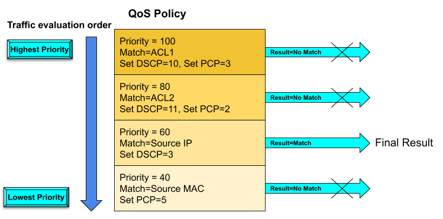

The following diagram shows the order in which the policy sections are evaluated and final results when multiple sections match the traffic. The final result is picked up from the section with highest numerical value of the priority.

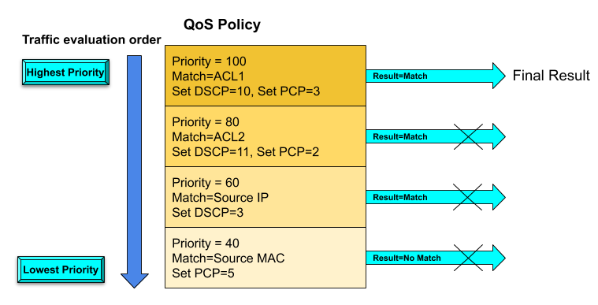

##### Evaluation of traffic across interfaces of same types

Policies applied to interfaces of same types are always non conflicting hence there is no conflict resolution between them.

##### Evaluation of traffic across interfaces of different types

A policy can be applied at Port level, VLAN level and Switch level. A given packet can match all the 3 policies.  All interface types have a implicit priority associated with them which is in the order Port/LAG > VLAN > Switch. When a packet matches Port Policy, VLAN Policy and Switch policy, only Port policy will be applied. The evaluation of the port policy is  same as described in [section 2.2.3](#2_2_3-evaluation-of-traffic-within-the-same-policy). Counter of only Port policy will increment.

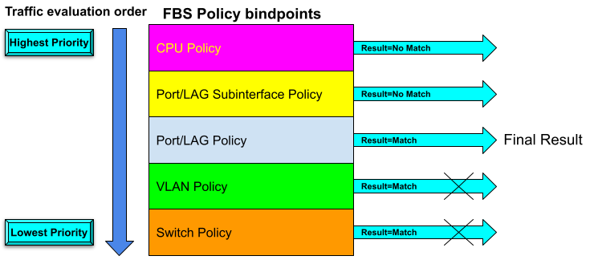

##### Evaluation of traffic across policies of different types

Data path ACLs, Mirror ACLs and Flow based services policies are internally converted into ACL tables and are added as members of a parallel lookup ACL table group. This results in all ACL tables to be looked up in parallel and results merged in ASIC. The maximum number of tables that can be looked up in parallel is ASIC dependent. CRM statistics for ACL table will provide this information.

Policies of different types are designed to take specific actions. QoS Polices are meant to take only QoS actions like DSCP remarking. Data path ACLs only support forward and drop actions and mirror ACL supports only mirror action. These actions are non conflicting so when a packet matches a QoS Policy, Data Path ACL to permit and mirror ACL, the packet will be permitted, QoS actions will be applied and a mirror copy will also be generated. Counters of Data path ACL, Mirror ACL and QoS policy may increment depending on the capability of the ASIC.

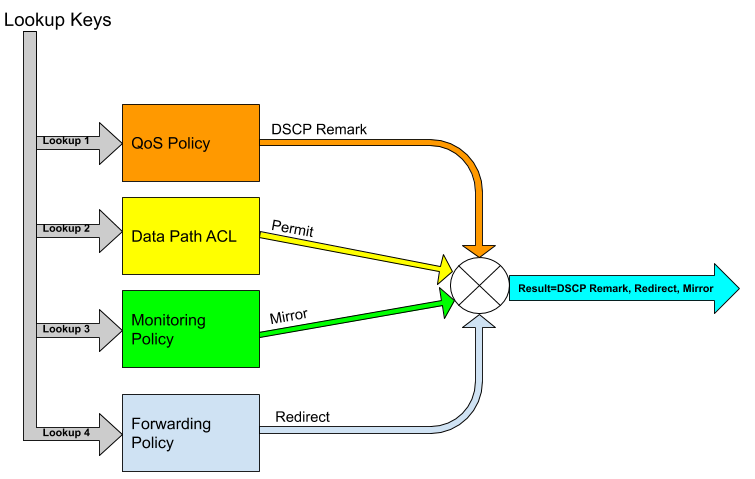

## Feature support matrix

### Policy Type support

| Policy Type | Release supported |
| ----------- | ----------------- |
| QoS         | SONiC 3.0         |

### QoS Policy actions support

| Feature        | Release supported |
| -------------- | ----------------- |
| DSCP Remarking | SONiC 3.0         |
| PCP Remarking  | SONiC 3.0         |
| Policing       | SONiC 3.0         |

### Monitoring Policy actions support

| Feature             | Release supported |
| ------------------- | ----------------- |
| SPAN/ERSPAN session | SONiC 3.0         |

# Design

## Overview
The following diagram shows the high level design overview of ACL enhancements and flow based services in SONiC. ACL Services Daemon is  composed of multiple sub-modules. The main module i.e. ACL Manager provides the ACL related APIs to create an ACL, delete an ACL, bind to an interface etc. Flow based services manager will handle the flow based services configuration and invoke appropriate ACL Manager APIs to program the polices in hardware.

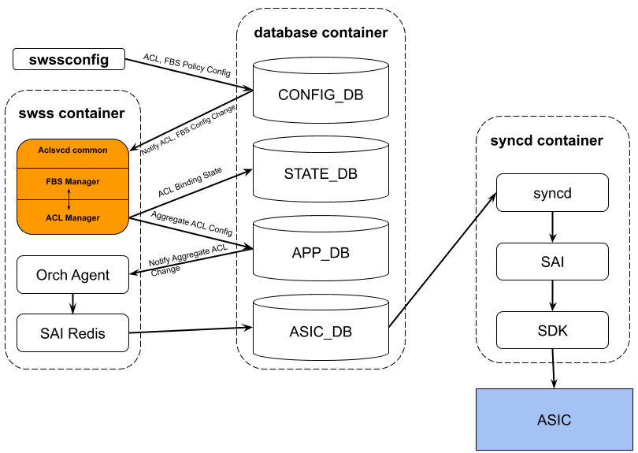

## DB Changes

### Config DB

#### Hardware Table

A new table called HARDWARE is introduced to configure ACL lookup parameters

```
key = HARDWARE:ACCESS_LIST
;field       = value
LOOKUP       = "advanced" / "legacy"
TCAM_SHARING = [0-1]*sharing_mode

;value annotations
sharing_mode = "ports"
```

#### ACL Table

A new ACL type called l2 is introduced to support MAC ACLs.

```
key           = ACL_TABLE:name            ; acl_table_name must be unique
;field        = value
policy_desc   = 1*255VCHAR                ; name of the ACL policy table description
stage         = "INGRESS"/"EGRESS"        ; stage of ACL lookup
type          = "l2"/"l3"/"l3v6"/"mirror" ; type of acl table, every type of
                                          ; table defines the match/action a
                                          ; specific set of match and actions.
ports         = [0-max_ports]*port_name   ; the ports to which this ACL
                                          ; table is applied, can be entry
                                          ; value annotations

;value annotations
max_ports     = 1*5DIGIT                ; number of ports supported on the chip
port_name     = 1*64VCHAR               ; name of the port, must be unique
                                        ; port name can be Ethernetxxx or
                                        ; PortChannelxxx, Vlanxxxx or Switch
```

#### ACL Rule 

##### ACL Rule of type L2

```
key = ACL_RULE:table_name:rule_name  ; key of the rule entry in the table,
                                     ; seq is the order of the rules
                                     ; when the packet is filtered by the
                                     ; ACL "policy_name".
                                     ; A rule is always assocaited with a
                                     ; policy.
;field        = value
PRIORITY      = acl_priority         ; rule priority. Supported range is 1-65535
PACKET_ACTION = "forward"/"drop"/"redirect:"redirect_action 
                           ; action when the fields are matched
                           ; In case of packet_action="redirect" a parameter is required
                           ; This parameter defines a destination for redirected packets
                           ; it could be:
                           ; name of physical port.          Example: "Ethernet10"
                           ; name of LAG port                Example: "PortChannel5"

SRC_MAC       = mac_addr ["/" mac_mask ] ; Source MAC address
DST_MAC       = mac_addr ["/" mac_mask ] ; Destination MAC address
ETHER_TYPE    = ethtype                  ; Ethernet type field
PCP           = pcp_val [ "/"" pcp_val]  ; PCP Value in range of 0-7
DEI           = BIT ["/" BIT ]           ; DEI Value. 0 or 1.
VLAN          = vlan_id                  ; VLAN ID. Supported range is 1-4094.
                                         ; valid only if the ACL is applied to Port or
                                         ; LAG or Switch. For VLAN binding this will be
                                         ; ignored.
    
;value annotations
acl_priority = 1*4DIGIT / %x31-36 %x30-35 %x30-35 %x30-33 %x30-35
ethtype      = "0x"3*4HEXDIG
mac_addr     = 2HEXDIG "-" 2HEXDIG "-" 2HEXDIG "-" 2HEXDIG "-" 2HEXDIG "-" 2HEXDIG 
               / 2HEXDIG ":" 2HEXDIG ":" 2HEXDIG ":" 2HEXDIG ":" 2HEXDIG ":" 2HEXDIG
vlan_id      = %x31-39                     ; 1-9
               / %x31-39 DIGIT             ; 10-99
               / %x31-39 2DIGIT            ; 100-999
               / %x31-33 3DIGIT            ; 1000-3999
               / %x34 %x30 %x30-39 %x30-34 ; 4000 - 4094
pcp_val      = %x30-37
```

#### ACL Rule of type l3 or l3v6

The following fields are supported for ACL Rule of type l3 or l3v6

```
key: ACL_RULE:table_name:rule_name         ; key of the rule entry in the table,
                                           ; priority is the order of the rules
                                           ; when the packet is filtered by the
                                           ; ACL Table.
                                           ; A rule is always assocaited with a
                                           ; ACL table.

;field        = value

DSCP          = dscp_val["/"dscp_val]  ; DSCP field. Valid range is 0-63
ICMP_TYPE     = h8/dec-octet         ; ICMP Type Value
ICMP_CODE     = h8/dec-octet         ; ICMP Code value
VLAN          = vlan_id              ; VLAN ID. Supported range is 1-4094. This is
                                     ; valid only if the ACL is applied to Port or
                                     ; LAG or Switch. For VLAN binding this will be
                                     ; ignored.

;value annotations
dscp_val    = DIGIT / %x31-36 %x30-33
h8          = 1*2HEXDIG
dec-octet   = DIGIT                   ; 0-9
              / 2DIGIT                ; 10-99
              / "1" 2DIGIT            ; 100-199
              / "2" %x30-34 DIGIT     ; 200-249
vlan_id      = %x31-39                     ; 1-9
               / %x31-39 DIGIT             ; 10-99
               / %x31-39 2DIGIT            ; 100-999
               / %x31-33 3DIGIT            ; 1000-3999
               / %x34 %x30 %x30-39 %x30-34 ; 4000 - 4094
```

#### Classifier table

A classifier is used to setup the match criterion to identify a traffic flow. A flow can be either identified by an ACL or part of L2-L4 header.

```
key           = CLASSIFIER_TABLE:name      ; name must be unique
                                           ; name must be 1-63 chars long

;field            = value
DESCRIPTION       = 1*255VCHAR
MATCH_TYPE        = "acl" / "fields"       ; Match on ACL or Match using individual
                                           fields.
ACL_NAME          = 1*255VCHAR             ; ACL name as present in ACL_TABLE
                                           ; valid when match_type = "acl"
SRC_MAC       = mac_addr ["/" mac_mask ]   ; Source MAC address
DST_MAC       = mac_addr ["/" mac_mask ]   ; Destination MAC address
ETHER_TYPE    = h16                        ; Ethernet type field
IP_PROTOCOL   = h8                         ; options of the l3_protocol_type field
SRC_IP        = ipv4_prefix                ; options of the source ipv4
                                           ; address (and mask) field
DST_IP        = ipv4_prefix                ; options of the destination ipv4
                                           ; address (and mask) field
SRC_IPV6      = ipv6_prefix                ; options of the source ipv4
                                           ; address (and mask) field
DST_IPV6      = ipv6_prefix                ; options of the destination ipv4
L4_SRC_PORT   = port_num                   ; source L4 port. Valid if IP Protocol is TCP
                                           ; or UDP 
L4_SRC_PORT_RANGE = port_num_L-port_num_H  ; source ports range of L4 ports field
L4_DST_PORT   = port_num                   ; destination L4 port. Valid if IP Protocol is
                                           ; TCP or UDP 
L4_DST_PORT_RANGE = port_num_L-port_num_H  ; destination ports range of L4 ports field
TCP_FLAGS     = h8/h8                      ; TCP flags field and mask
DSCP          = dscp_val[/dscp_val]        ; DSCP field. Valid range is 0-63
                                           ; address (and mask) field

;value annotations
h16           = 1*4HEXDIG
mac_addr      = 2HEXDIG "." 2HEXDIG "." 2HEXDIG "." 2HEXDIG "." 2HEXDIG "." 2HEXDIG 
                / 2HEXDIG ":" 2HEXDIG ":" 2HEXDIG ":" 2HEXDIG ":" 2HEXDIG ":" 2HEXDIG
port_num      = 1*5DIGIT   ; a number between 0 and 65535
port_num_L    = 1*5DIGIT   ; a number between 0 and 65535,
                           ; port_num_L < port_num_H
port_num_H    = 1*5DIGIT   ; a number between 0 and 65535,
                           ; port_num_L < port_num_H
dscp_val      = DIGIT / %x31-36 %x30-33
ipv4_prefix = dec-octet "." dec-octet "." dec-octet "." dec-octet "/" %d1-32

ipv6_prefix   =                               6( h16 ":" ) ls32
                 /                       "::" 5( h16 ":" ) ls32
                 / [               h16 ] "::" 4( h16 ":" ) ls32
                 / [ *1( h16 ":" ) h16 ] "::" 3( h16 ":" ) ls32
                 / [ *2( h16 ":" ) h16 ] "::" 2( h16 ":" ) ls32
                 / [ *3( h16 ":" ) h16 ] "::"    h16 ":"   ls32
                 / [ *4( h16 ":" ) h16 ] "::"              ls32
                 / [ *5( h16 ":" ) h16 ] "::"              h16
                 / [ *6( h16 ":" ) h16 ] "::"
   
dec-octet   = DIGIT                   ; 0-9
              / 2DIGIT                ; 10-99
              / "1" 2DIGIT            ; 100-199
              / "2" %x30-34 DIGIT     ; 200-249
h8          = 1*2HEXDIG
h16         = 1*4HEXDIG
ls32        = ( h16 ":" h16 ) / IPv4address
```

#### Policy table

Policy table is used to configure the policy parameters. 

```
key           = POLICY_TABLE:name            ; name must be unique
                                             ; name must be 1-63 chars long

;field      = value
TYPE        = "qos"               ; Only QoS is supported now.
DESCRIPTION = 1*255VCHAR          ; Policy Description

;value annotations
```

#### Policy sections table

Policy details table provides information on the classifiers to use and their corresponding actions. A policy can have up to 128 classifiers

```
key           = POLICY_SECTIONS_TABLE:policy_name:classifier_name ; name must be unique
                                                       ; name must be 1-63 chars long

;field            = value
PRIORITY          = 1*3DIGIT            ; Valid Range is 0-999
DESCRIPTION       = 1*255VCHAR          ; Policy Description
SET_DSCP          = dscp_val            
SET_PCP           = pcp_val
SET_POLICER_CIR   = 1*12DIGIT
SET_POLICER_CBS   = 1*12DIGIT
SET_POLICER_PIR   = 1*12DIGIT
SET_POLICER_PBS   = 1*12DIGIT

;value annotations
dscp_val      = DIGIT / %x31-36 %x30-33
pcp_val       = %x30-37
```

#### Policy binding table

This provides information on Policy application on ports

```
key           = POLICY_BINDING_TABLE:port_name   ; port_name is the name of the Port or
                                                 ; LAG or VLAN or "switch"

;field              = value
INGRESS_QOS_POLICY  = 1*63VCHAR
EGRESS_QOS_POLICY   = 1*63VCHAR

;value annotations
```

### App DB

#### ACL Table

ACL Table in the App DB will follow the same schema as that of Config DB. ACL Table in App DB is produced by ACL services daemon based on the Config DB information. The information will be consumed by ACL Orchagent to populate the ASIC DB. The ACL Table and Rule names will be different and will be populated by ACL Services daemon

#### ACL Rule

ACL Rule in App DB will contain additional packet actions for DSCP, PCP remarking and rate limiting.

```
key: ACL_RULE_TABLE:table_name:rule_name   ; key of the rule entry in the table,
                                           ; priority is the order of the rules
                                           ; when the packet is filtered by the
                                           ; ACL Table.
                                           ; A rule is always assocaited with a
                                           ; ACL table.

;field        = value
SET_DSCP            = dscp_val            
SET_PCP             = pcp_val
SET_POLICER         = 1*63VCHAR            ; Name of the policer
SET_MIRROR_SESSION  = 1*63VCHAR            ; Name of the mirror session

;value annotations
dscp_val      = DIGIT / %x31-36 %x30-33
pcp_val       = %x30-37
```

The SET_POLICER action uses the policer name as defined in POLICER_TABLE schema at  https://github.com/Azure/sonic-swss/blob/master/doc/swss-schema.md 

### State DB

None

### ASIC DB

None

### Counter DB

When ACL lookup mode is legacy, the counters will be stored in counters table as its done currently. When ACL lookup is in **advanced** mode, ACL counters will be stored in ACL_COUNTERS table. The schema for the same will be.

```
ACL_COUNTERS: rule_counter_name 
            ; rule_counter_name is a unique name generated in the following format
            ; <ACL_TABLE_NAME>:<ACL_RULE_NAME>:<INTERFACE_NAME>:<ACL_STAGE>

Packets : <packets_counter_value>
Bytes : <bytes_counter_value>
```

 For FBS policies the counters will be saved in

```
FBS_COUNTERS: flow_counter_name
             ; flow_counter_name is a unique name generated in the following format
             ; <POLICY_NAME>:<CLASSIFIER_NAME>:<INTERFACE_NAME>:<ACL_STAGE>

Packets : <packets_counter_value>
Bytes : <bytes_counter_value>
```

The Policer counters will be stored in

```
POLICER_COUNTERS: policer_counter_name
                ; policer_counter_name is a unique name generated in the following format 
                ; <POLICY_NAME>:<CLASSIFIER_NAME>:<INTERFACE_NAME>:<ACL_STAGE>

GreenPackets : <packets_counter_value>
GreenBytes : <bytes_counter_value>
YellowPackets : <packets_counter_value>
YellowBytes : <bytes_counter_value>
RedPackets : <packets_counter_value>
RedBytes : <bytes_counter_value>
```

## Switch State Service Design

### Orchestration Agent

Flow based services manager will utilize and extend the ACL Orchagent. ACL Orchagent will be extended to support DSCP, PCP remarking and policing action. To support policer as of the actions, Acl orchagent has to interact with Policer orchagent to get the SAI object ID associated with the policer name. This will be done using the existing APIs exposed by the policer orchagent namely `policerExists`, `getPolicerOid`, `increaseRefCount`, `decreaseRefCount`.

### ACL Services daemon

#### ACL Manager

ACL Manager handles the notification from Config DB ACL tables and ACL rules and populates them in App DB. When the ACL Lookup mode is configured as **advanced**,  ACL manager consolidates all ACL bindings for the ACL tables of the same type and populates the information in the same App DB thereby reducing the number of SAI ACL tables needed. If ACL lookup mode is configured as **legacy**, ACL manager acts as passthrough for all ACL tables and rules and populates them in App DB without any modifications.

ACL Manager also provides APIs to Create, Delete ACLs, Rules, and bind and unbind to various interfaces. No change is necessary to ACL manager is generic and can be used for datapath ACLs and Flow based services.

#### Policy Manager

A new submodule called policy manager will be added to ACL services daemon to handle configuration set in Config DB. Policy manager maintains a copy of various classifier, policies and bindings and call appropriate ACL managers APIs. ACL manager will populate necessary ACL tables and rules in App DB which will be picked up and programmed by ACL orchagent. The details of ACL manager is captured in ACL HLD.

### Other Process

No change to other process.

## SyncD
No changes to SyncD.

## SAI
No change to SAI.

## Manageability

### Data Models
Not supported in first release.

### Configuration Commands

The following commands are used to configure Policy based services

#### Configuring ACL lookup mode

```
sonic(config)# hardware
sonic(config-hardware)# access-list
sonic(config-hardware-acl)# lookup { advanced | legacy }
```


#### Creating a MAC ACL

```
sonic(config)# [no] mac access-list NAME
```

#### Creating a MAC ACL Rule

```
sonic(config-mac-acl)# [no] seq <1-65535> {permit | deny} {any | SMAC[/SMAC_MASK]}  {any | DMAC[/DMAC_MASK]}  [ETHERTYPE | ipv4 | ipv6 | arp] [vlan VLANID] [pcp <0-7>]
```

MAC address are in format documented in Config DB schema.

ETHERTYPE can be in decimal or hexadecimal format.

#### Applying ACL to different interfaces

```
sonic(config)# interface INTF_TYPE INTF_ID
sonic(config-if)# mac access-group NAME {in | out}
```

Supported INTF_TYPE are Ethernet, Vlan and PortChannel

#### Applying ACL to switch

```
sonic(config)# [no] {mac|ip|ipv6} access-group NAME {in | out}
```

#### Create classifier

```
root@sonic:~# config classifier add --help
Usage: config classifier add [OPTIONS] <name>

  Add a Classifier

Options:
  -m, --match-type <match-type>   Set match type to acl or fields  [required]
  -d, --description <description>
                                  Set classifier description
  --help                          Show this message and exit.

```

#### Update classifier with match parameters

```
root@sonic:~# config classifier update --help
Usage: config classifier update [OPTIONS] <name>

  Update a Classifier with flow identification criterion/criteria.

Options:
  --acl <acl-name>                Add ACL table name for flow classification
  --no-acl                        Delete ACL Table name used for flow
                                  classification
  --src-mac <src-mac>             Match source mac address (xx-xx-xx-xx-xx-xx
                                  [/xx-xx-xx-xx-xx-xx] format)
  --no-src-mac                    Delete match on source mac address
  --dst-mac <dst-mac>             Match destination mac address (xx-xx-xx-xx-
                                  xx-xx[/xx-xx-xx-xx-xx-xx] format)
  --no-dst-mac                    Delete match on destination mac address
  --ether-type <ether-type>       Match ethertype (hex or decimal format in
                                  1536-65535 range)
  --no-ether-type                 Delete match on ethertype
  --pcp <pcp>                     Match on PCP (0-7)
  --no-pcp                        Delete match on PCP
  --src-ip <src-ip>               Match source IP address (A.B.C.D[/M] format)
  --no-src-ip                     Delete match on source IP address
  --dst-ip <dst-ip>               Match on destination IP address (A.B.C.D[/M]
                                  format)
  --no-dst-ip                     Delete match on destination IP address
  --src-ipv6 <src-ipv6>           Match source IPv6 address (X:X::X.X[/M]
                                  format)
  --no-src-ipv6                   Delete match on source IPv6 address
  --dst-ipv6 <dst-ipv6>           Match on destination IPv6 address
                                  (X:X::X.X[/M] format)
  --no-dst-ipv6                   Delete match on destination IPv6 address
  --ip-proto <ip-proto>           Match on IP protocol/next Header (0-255)
  --no-ip-proto                   Delete match on IP protocol/next header
  --src-port <value or begin-end>
                                  Match on source port or source port range
                                  (0-65535)
  --no-src-port                   Delete match on source port or source port
                                  range
  --dst-port <dst-port>           Match on destination port or destination
                                  port range (0-65535)
  --no-dst-port                   Delete match on destination port or
                                  destination port range
  --tcp-flags <tcp-flags>         Match on TCP flags (fin not-fin syn not-syn
                                  rst not-rst psh not-psh ack not-ack urg not-
                                  urg ece not-ece cwr not-cwr in comma
                                  separated format)
  --no-tcp-flags <tcp-flags>      Delete match on TCP flags (fin not-fin syn
                                  not-syn rst not-rst psh not-psh ack not-ack
                                  urg not-urg ece not-ece cwr not-cwr in comma
                                  separated format)
  --dscp <dscp>                   Match on DSCP (0-63)
  --no-dscp                       Delete match on DSCP
  -d, --description <description>
  --help                          Show this message and exit.
```

#### Delete classifier

```
root@sonic:~# config classifier del --help
Usage: config classifier del [OPTIONS] <name>

  Delete a Classifier

Options:
  --help  Show this message and exit.
```

#### Add policy

```
root@sonic:~# config policy add --help
Usage: config policy add [OPTIONS] <name>

  Add a Flow Based Services Policy

Options:
  -t, --type <type>               Policy type (qos or monitoring)  [required]
  -d, --description <description>
                                  Set policy description
  --help                          Show this message and exit.
```

#### Delete policy

```
root@sonic:~# config policy del --help
Usage: config policy del [OPTIONS] <name>

  Delete a Flow Based Services Policy

Options:
  --help  Show this message and exit.
```

#### Add flow identified by a classifier to a policy

```
root@sonic:~# config flow add --help
Usage: config flow add [OPTIONS] <policy_name> <classifier_name>

  Add a Flow to Policy

Options:
  -p, --priority <type>           Set flow priority (0-1023)  [required]
  -d, --description <description>
                                  Set flow description
  --help                          Show this message and exit.
```

#### Delete flow identified by a classifier to a policy

```
root@sonic:~# config flow del --help
Usage: config flow del [OPTIONS] <policy_name> <classifier_name>

  Delete a Flow from Policy

Options:
  --help  Show this message and exit.
```

#### Add action(s) to flows

```
root@sonic:~# config flow update --help
Usage: config flow update [OPTIONS] <policy_name> <classifier_name>

  Add or Update flow results

Options:
  -p, --priority <type>           Set flow priority (0-1023)
  --set-dscp <Value>              DSCP remark to value (0-63)
  --no-set-dscp                   Delete DSCP remarking action
  --set-pcp <Value>               PCP remark to value (0-7)
  --no-set-pcp                    Delete PCP Remarking action
  --police                        Add rate limiting action
  --cir <cir>                     Conform rate
  --cbs <cbs>                     Conform burst size
  --pir <pir>                     Peak rate
  --pbs <pbs>                     Peak burst size
  --no-police                     Delete rate limiting action
  --mirror-session <session_name>
                                  Set mirror destination
  --no-mirror-session             Delete mirror destination
  -d, --description <description>
                                  Set flow description
  --help                          Show this message and exit.
```

The policers are implicitly configured as TRTCM policers of type bytes in color blind mode and drop as default action for packets of color red. 

#### Apply and remove the policy to interface

```
root@sonic:~# config service-policy bind --help
Usage: config service-policy bind [OPTIONS] <interface_name> <type> <stage>
                                  <policy_name>

  Apply policy to interface

Options:
  --help  Show this message and exit.


root@sonic:~# config service-policy unbind --help
Usage: config service-policy unbind [OPTIONS] <interface_name> <type> <stage>

  Remove policy from interface

Options:
  --help  Show this message and exit.
```

### Show Commands

#### Show classifier details

```
root@sonic:~# show classifier --help
Usage: show classifier [OPTIONS] [NAME]

  Show flow based services classifiers related information

Options:
  -m, --match-type <match-type>  Classifier type acl or fields
  -?, -h, --help                 Show this message and exit.
```

The following is the sample output

```
root@sonic:~# show classifier class0
classifier class0 match-type acl
  match-acl l3_ACL_0
  Referenced in flows:
    policy policy0 at priority 200
    
root@sonic:~# show classifier fields_class_0
Classifier fields_class_0 match-type fields
  Description:
  Match:
    src-ip 40.1.1.100/32
  Referenced in flows:
    policy mon_policy_0 at priority 999
    policy qos_policy_0 at priority 999
```

#### Show policy details

```
root@sonic:~# show policy --help
Usage: show policy [OPTIONS] [NAME]

  Show flow based services policies related information

Options:
  -f, --flow <flow>  Show information only for flow identified by classifer
  -t, --type <type>  Policy type (qos)
  -?, -h, --help     Show this message and exit.
```

The following is the sample output

```
root@sonic:~# show policy qos_policy_0
Policy qos_policy_0 Type qos
  Description: 
  Flow fields_class_0 at priority 999
    Description: 
    set-pcp 1
    set-pcp 1
    police cir 10000000 cbs 1000000 pir 0 pbs 0
  Flow fields_class_1 at priority 998
    Description: 
    set-pcp 2
    set-pcp 2
    police cir 20000000 cbs 2000000 pir 0 pbs 0
  Flow fields_class_2 at priority 997
    Description: 
    set-pcp 3
    set-pcp 3
    police cir 30000000 cbs 3000000 pir 0 pbs 0
  Flow fields_class_3 at priority 996
    Description: 
    set-pcp 4
    set-pcp 4
    police cir 40000000 cbs 4000000 pir 0 pbs 0
  Applied to:
    Ethernet0 at ingress


root@sonic:~# show policy mon_policy_0
Policy mon_policy_0 Type monitoring
  Description: 
  Flow fields_class_0 at priority 999
    Description: 
    mirror-session ERSPAN_DestIP_50.1.1.2
  Flow fields_class_1 at priority 998
    Description: 
    mirror-session ERSPAN_DestIP_60.1.1.2
  Flow fields_class_2 at priority 997
    Description: 
    mirror-session ERSPAN_DestIP_50.1.1.2
  Flow fields_class_3 at priority 996
    Description: 
    mirror-session ERSPAN_DestIP_60.1.1.2
  Applied to:
    Ethernet0 at ingress
```

#### Show policy binding summary

```
root@sonic:~# show service-policy summary --help
Usage: show service-policy summary [OPTIONS]

  Show summary of applied flow based services policies

Options:
  -i, --interface <interface>  Interface name
  -t, --type <type>            Policy type (qos)
  -?, -h, --help               Show this message and exit.
```

The following is the sample output

```
root@sonic:~# show service-policy summary
Ethernet0
  qos policy policy0 at ingress
  monitoring policy mon_policy_0 at ingress
Ethernet4
  qos policy policy0 at ingress
Ethernet8
  qos policy policy0 at egress

root@sonic:~# show service-policy summary -i Ethernet0
Ethernet0
  qos policy policy0 at ingress
```

#### Show/Clear policy binding and counters for an interface

```
root@sonic:~# show service-policy interface --help
Usage: show service-policy interface [OPTIONS] <interface_name>

  Show details by interface name

Options:
  -t, --type <type>    Policy type (qos or monitoring)
  -s, --stage <stage>  Stage (in or out)
  -c, --clear          Clear statistics
  -?, -h, --help       Show this message and exit.
```

The following is the sample output

```
root@sonic:~# show service-policy interface Ethernet0
Ethernet0
  Policy qos_policy_0 Type qos at ingress
  Description: 
    Flow fields_class_3 at priority 996 (Active)
      Description: 
      set-pcp 4
      set-dscp 4
      police: cir 40000000 cbs 4000000 pir 0 pbs 0
        type bytes mode color-blind
        operational cir 40000000 cbs 4000000 pir 0 pbs 0
        conformed 0 packets 0 bytes action forward
        exceed 0 frames 0 bytes action forward
        violated 0 frames 0 bytes action drop
      Packet matches: 0 frames 0 bytes
    Flow fields_class_2 at priority 997 (Active)
      Description: 
      set-pcp 3
      set-dscp 3
      police: cir 30000000 cbs 3000000 pir 0 pbs 0
        type bytes mode color-blind
        operational cir 30000000 cbs 3000000 pir 0 pbs 0
        conformed 0 packets 0 bytes action forward
        exceed 0 frames 0 bytes action forward
        violated 0 frames 0 bytes action drop
      Packet matches: 0 frames 0 bytes
```
#### Show/Clear policy binding and counters for a policy

```
root@sonic:~# show service-policy policy --help
Usage: show service-policy policy [OPTIONS] <policy_name>

  Show flow based services applied polcies information by policies name

Options:
  -t, --type <type>  Policy type (qos)
  -c, --clear        Clear statistics
  -?, -h, --help     Show this message and exit.
```

The following is the sample output 

```
root@sonic:~# show service-policy policy mon_policy_0
Ethernet0
  Policy mon_policy_0 Type monitoring at ingress
  Description: 
    Flow fields_class_3 at priority 996 (Active)
      Description: 
      mirror-session ERSPAN_DestIP_60.1.1.2
      Packet matches: 0 frames 0 bytes
    Flow fields_class_2 at priority 997 (Active)
      Description: 
      mirror-session ERSPAN_DestIP_50.1.1.2
      Packet matches: 0 frames 0 bytes
    Flow fields_class_1 at priority 998 (Active)
      Description: 
      mirror-session ERSPAN_DestIP_60.1.1.2
      Packet matches: 0 frames 0 bytes
    Flow fields_class_0 at priority 999 (Active)
      Description: 
      mirror-session ERSPAN_DestIP_50.1.1.2
      Packet matches: 0 frames 0 bytes
```

### REST API Support

Flow based services does not support any Rest APIs.

# Flow Diagrams

## Create a Classifier

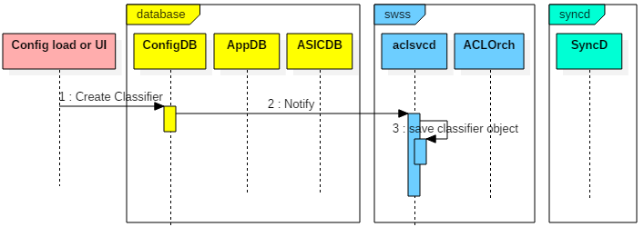

## Create a QoS Policy and Section


## Bind QoS policy to an interface

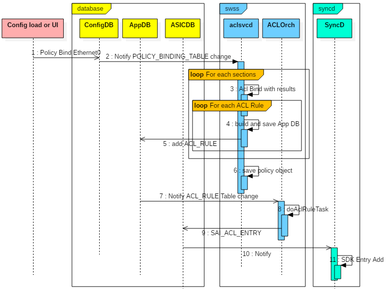

## Creating ACL rules with policer

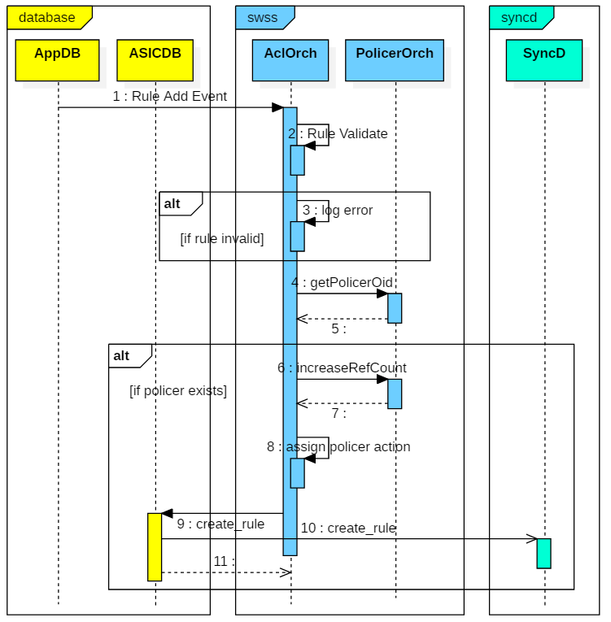

## Deleting ACL Rules with policer

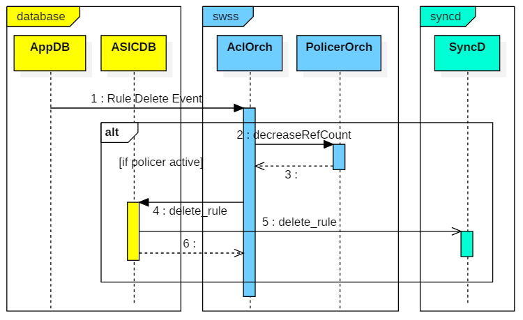

# Error Handling

ACL Orchagent handles the scaled scenarios currently. No enhancements necessary.

# Serviceability and Debug

1. show commands will help to see if the policy is active.
2. All processing errors will be captured in syslog for ACL services daemon and ACL orchagent. 
4. Debug command output will be captured as part of tech support for offline analysis.

# Warm Boot Support
Configured actions and counters should continue to work across warm reboot.

# Scalability

## Software scalability

The following is the support scale for Flow based services. The following numbers are recommended numbers and are not enforced by the software. Its expected that the user will not configure beyond the recommended scale.

| Configuration                         | Scale |
| ------------------------------------- | ----- |
| Maximum number of policies            | 128   |
| Maximum number of classifiers         | 128   |
| Maximum number of sections per policy | 64    |

## ACL Table Scalability

The applied policies will share the ACL resources of data path ACLs. Details on how the ACL resources will be shared among various ACL features will be captured in ACL Enhancements HLD.

# Limitation

The following the ASIC limitations that must be noted when configuring the policies.

1. Only the following combination of ACLs are supported in a policy due to key width limitations at ingress
   1. L2 + IPv4
   2. IPv4 + IPv6
2. At egress all sections of the policy must have the same type of ACLs ie L2 or IPv4 or IPv6. Applying a policy which has different combinations will be inactive.
3. All applied policies of the same type must have the same ACL key combinations across all interfaces. Example its not valid to apply QoS Policy P1 on Ethernet0 which uses L2 ACL1 and IPv4 ACL2 and QoS Policy P2 on Ethernet4 which uses IPv4 ACL3 and IPv6 ACL4.

# Unit Test
1. Verify Classifier creation with ACL
2. Verify classifier creation with Header fields
3. Verify Policy creation of Type QoS
4. Verify adding multiple classifiers with match as ACL and Header fields.
5. Verify DSCP remarking action add, delete and update
6. Verify PCP remarking action add, delete and update
7. Verify Policy binding at ingress and egress for Ethernet interface
8. Verify Policy binding at ingress and egress for Port-channel interface
9. Verify Policy binding at ingress and egress for Vlan interface
10. Verify Policy binding at ingress and egress for Switch interface
11. Verify DSCP remarking with switched and routed traffic
12. Verify PCP remarking with switched and routed traffic
13. Verify PCP remarking with Untagged to Tagged traffic
14. Verify Policer with Switch and routed traffic
15. Verify Policer parameter update takes effect
16. Verify Policer at ingress and egress
17. Verify Policer on Port, LAG, VLAN and Switch
18. Add Policy section with non existing classifier
19. Apply non existing policy to interface
20. Add non existing classifier to policy
21. Verify MAC ACL creating and deletion
22. Verify MAC ACL application on Ethernet, VLAN, PortChannel and Switch at ingress and egress
23. Verify monitoring policy with active mirror session
24. Verify monitoring policy with inactive mirror session and later activate the session
25. Verify monitoring policy with active mirror session and verify deactivate and reactivate


# Appendix A: Sample configuration

The following example shows configuration for Policy to do PCP and DSCP Remarking using 3 ACLs to classify and active on Ethernet0 interface at ingress.

**Using CLIs**

```
# Create classifier class0
config classifier add class0 -m acl
config classifier update class0 -a l3_ACL_0

# Create classifier class1
config classifier add class1 -m acl
config classifier update class1 -a l2_ACL_0

# Create policy policy0
config policy add policy0 -t qos

#create flow using classifier class0 and set results
config flow add policy0 class0 -p 200
config flow update policy0 class0 --set-dscp 15 --set-pcp 5

#create flow using classifier class0 and set results
config flow add policy0 class1 -p 100
config flow update policy0 class1 --set-dscp 30 --set-pcp 2

#apply policy to required interfaces
config service-policy bind Ethernet0 qos in policy0
config service-policy bind Ethernet4 qos in policy0
config service-policy bind Ethernet8 qos out policy0
```

**Using JSON** 

```json
{
    "CLASSIFIER_TABLE": {
        "class0": {
            "ACL_NAME": "l3_ACL_0", 
            "DESCRIPTION": "", 
            "MATCH_TYPE": "acl"
        }, 
        "class1": {
            "ACL_NAME": "l2_ACL_0", 
            "DESCRIPTION": "", 
            "MATCH_TYPE": "acl"
        }
    }, 
    "POLICY_TABLE": {
        "policy0": {
            "DESCRIPTION": "", 
            "TYPE": "qos"
        }
    }, 
    "POLICY_SECTIONS_TABLE": {
        "policy0|class0": {
            "PRIORITY": "200", 
            "SET_DSCP": "15", 
            "SET_PCP": "5"
        }, 
        "policy0|class1": {
            "PRIORITY": "100", 
            "SET_DSCP": "30", 
            "SET_PCP": "2"
        }
    }, 
    "POLICY_BINDING_TABLE": {
        "Ethernet0": {
            "INGRESS_QOS_POLICY": "policy0"
        }, 
        "Ethernet4": {
            "INGRESS_QOS_POLICY": "policy0"
        }, 
        "Ethernet8": {
            "EGRESS_QOS_POLICY": "policy0"
        }
    }
}
```

# Internal Design Information

Internal BRCM information to be removed before sharing with the community

## Future Design Enhancements

1. Once ACLs supports UDF, provide an option to use UDF also as part of field qualifier.
2. Use framework for Routing/Forwarding, sFlow etc.
3. Advanced mode can also support TCAM sharing for ports and VLANs. It can be enabled in next release.

## IS CLIs (Deferred from Buzznik release)
### Configuration Commands

The following commands are used to configure Policy based services

#### Create or delete classifiers

| Mode      | Config                                                       |
| --------- | ------------------------------------------------------------ |
| Syntax    | SONiC(config)# [**no**] **classifier** *NAME* **type** { **acl** \| **fields**} |
| SONiC 3.0 | Introduced |

#### Add or Delete Match ACL to classifier

| Mode   | Classifier                                              |
| ------ | ------------------------------------------------------- |
| Syntax | SONiC(config-classifier)# [**no**] **match access-list** *NAME* |
| SONiC 3.0 | Introduced |

#### Add or Delete Match on Source MAC

| Mode   | Classifier                                                   |
| ------ | ------------------------------------------------------------ |
| Syntax | SONiC(config-classifier)# [**no**] **match source-mac** *MAC* [ / *MAC_MASK*] |
| SONiC 3.0 | Introduced |

#### Add or Delete Match on Destination MAC

| Mode   | Classifier                                                   |
| ------ | ------------------------------------------------------------ |
| Syntax | SONiC(config-classifier)# [**no**] **match destination-mac** *MAC* [ / *MAC*_MASK] |
| SONiC 3.0 | Introduced |

#### Add or Delete Match on Ethertype

| Mode   | Classifier                                                   |
| ------ | ------------------------------------------------------------ |
| Syntax | SONiC(config-classifier)# [**no**] **match ether-type** *ETHER_TYPE* |
| SONiC 3.0 | Introduced |

#### Add or Delete Match on Source IPv4 Address

| Mode   | Classifier                                                   |
| ------ | ------------------------------------------------------------ |
| Syntax | SONiC(config-classifier)# [**no**] **match source ip-address** *IP_ADDR/PREFIX* |
| SONiC 3.0 | Introduced |

#### Add or Delete Match on Destination IPv4 Address

| Mode   | Classifier                                                   |
| ------ | ------------------------------------------------------------ |
| Syntax | SONiC(config-classifier)# [**no**] **match destination ip-address** *IP_ADDR/PREFIX* |
| SONiC 3.0 | Introduced |

#### Add or Delete Match on Source IPv6 Address

| Mode   | Classifier                                                   |
| ------ | ------------------------------------------------------------ |
| Syntax | SONiC(config-classifier)# [**no**] **match source ipv6-address** *IPV6_ADDR/PREFIX* |
| SONiC 3.0 | Introduced |

#### Add or Delete Match on Destination IPv6 Address

| Mode   | Classifier                                                   |
| ------ | ------------------------------------------------------------ |
| Syntax | SONiC(config-classifier)# [**no**] **match destination ipv6-address** *IPV6_ADDR/PREFIX* |
| SONiC 3.0 | Introduced |

#### Add or Delete Match on IP Protocol

| Mode   | Classifier                                                   |
| ------ | ------------------------------------------------------------ |
| Syntax | SONiC(config-classifier)# [**no**] **match protocol** *{ **tcp** \| **udp** \| NUMBER }* |
| SONiC 3.0 | Introduced |

#### Match Source or Destination TCP or UDP Port

| Mode   | Classifier                                                   |
| ------ | ------------------------------------------------------------ |
| Syntax | SONiC(config-classifier)# [**no**] **match** { **tcp** \| **udp** } **port** { **eq** *NUMBER* \| **range** *BEGIN* *END* } |
| SONiC 3.0 | Introduced |

#### Match Source or Destination TCP or UDP Port

| Mode   | Classifier                                                   |
| ------ | ------------------------------------------------------------ |
| Syntax | SONiC(config-classifier)# [**no**] **match** { **source** \| **destination** } **port** { **eq** *NUMBER* \| **range** *BEGIN* *END* } |
| SONiC 3.0 | Introduced |

#### Match TCP Flags

| Mode   | Classifier                                                   |
| ------ | ------------------------------------------------------------ |
| Syntax | SONiC(config-classifier)# [**no**] **match tcp-flags** { **syn** \| **ack** \| **fin** \| **ack** \| **psh** \| **urg** \| **ece** \| **cwr**} |
| SONiC 3.0 | Introduced |

#### Add or delete description to the classifier

| Mode   | Classifier                                                   |
| ------ | ------------------------------------------------------------ |
| Syntax | SONiC(config-classifier)# [**no**] **description** *STRING* |
| SONiC 3.0 | Introduced |

#### Add or delete policy

| Mode   | Config                                               |
| ------ | ------------------------------------------------------------ |
| Syntax | SONiC(config)# [**no**] **policy** *NAME* **type** { **qos** \| **monitoring** } |
| SONiC 3.0 | Introduced |

#### Add or delete flow identified by a classifier to a policy

| Mode   | Policy                                        |
| ------ | ------------------------------------------------------------ |
| Syntax | SONiC(config-policy)# [**no**] **flow** *NAME* **priority** *NUMBER* |
| SONiC 3.0 | Introduced |

#### Add DSCP Remarking action for QoS policy

| Mode   | Policy Classify                             |
| ------ | ------------------------------------------------------------ |
| Syntax | SONiC(config-policy-flow)# [**no**] **set dscp** *<0-63>* |
| SONiC 3.0 | Introduced |

#### Add PCP Remarking action for QoS policy

| Mode   | Config                                               |
| ------ | ------------------------------------------------------------ |
| Syntax | SONiC(config-policy-flow)# [**no**] **set pcp** *<0-7>* |
| SONiC 3.0 | Introduced |

#### Add policer for QoS policy

| Mode   | Config                                               |
| ------ | ------------------------------------------------------------ |
| Syntax | SONiC(config-policy-flow)# [**no**] **police cir** *<cir>* **cbs** *<cbs>* [**pir** *<pir>* **pbs** *<pbs>*] |
| SONiC 3.0 | Introduced |


#### Apply and remove the policy to interface

| Mode   | Config or Interface |
| ------ | ------------------------------------------------------------ |
| Syntax | SONiC(config)# [**no**] **service-policy** { **qos** \| **monitoring**} { **in** \| **out** } *NAME* |
| Syntax | SONiC(config-if)# [**no**] **service-policy** { **qos** \| **monitoring**} { **in** \| **out** } *NAME* |
| SONiC 3.0 | Introduced |

### Show Commands

#### Show classifier details

| Mode      | Exec                                |
| --------- | ----------------------------------- |
| Syntax    | SONiC# **show classifier** [*NAME*] |
| SONiC 3.0 | Introduced                          |

#### Show policy details
| Mode      | Exec                                                |
| --------- | --------------------------------------------------- |
| Syntax    | SONiC# **show policy** [*POLICY_NAME*] [**flow** [*CLASSIFIER_NAME*]] |
| SONiC 3.0 | Introduced                                          |

#### Show policy binding summary
| Mode      | Exec                                    |
| --------- | --------------------------------------- |
| Syntax    | SONiC# **show service-policy summary**  |
| SONiC 3.0 | Introduced                              |

#### Show policy binding for an interface
| Mode      | Exec                                                      |
| --------- | --------------------------------------------------------- |
| Syntax    | SONiC# **show service-policy interface** *INTERFACE_NAME* |
| SONiC 3.0 | Introduced                                                |

#### Show policy binding for a given policy
| Mode      | Exec                                                      |
| --------- | --------------------------------------------------------- |
| Syntax    | SONiC# **show service-policy policy** *POLICY_NAME* |
| SONiC 3.0 | Introduced                                                |

#### Clear policy binding statistics for an interface
| Mode      | Exec                                                         |
| --------- | ------------------------------------------------------------ |
| Syntax    | SONiC# **clear statistics service-policy interface** *INTERFACE_NAME* |
| SONiC 3.0 | Introduced                                                   |

#### Clear policy binding statistics for a given policy
| Mode      | Exec                                                         |
| --------- | ------------------------------------------------------------ |
| Syntax    | SONiC# **clear statistics service-policy policy** *POLICY_NAME* |
| SONiC 3.0 | Introduced                                                   |


