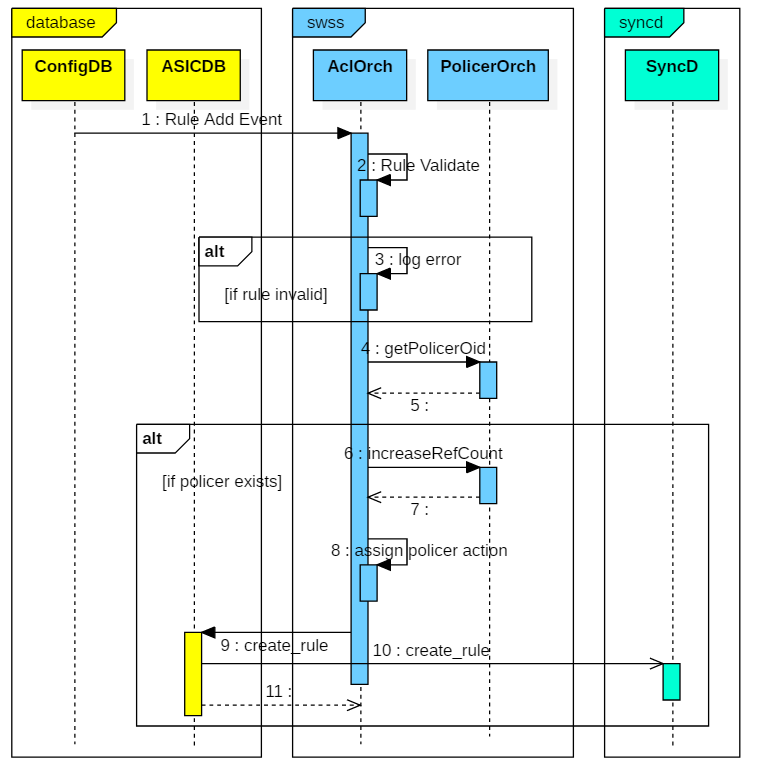
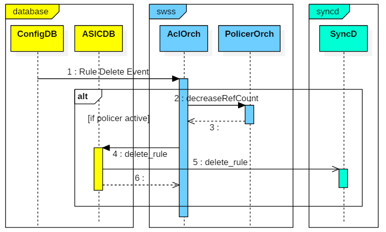

# ACL Enhancements in SONiC
High level design document for ACL enhancements in SONiC.

# High Level Design Document
Rev 0.1

# Table of Contents
- **[List of Tables](#list-of-tables)**
- **[Revision](#revision)**
- **[About this Manual](#about-this-manual)**
- **[Scope](#scope)**
- **[Definition/Abbreviation](#definition_abbreviation)**
	- [Table 1: Abbreviations](#table-1-abbreviations)
- **[1 Feature Overview](#1-feature-overview)**
	- [1.1 Requirements](#11-requirements)
		- [1.1.1 Functional Requirements](#111-functional-requirements)
		- [1.1.2 Configuration and Management Requirements](#112-configuration-and-management-requirements)
		- [1.1.3 Scalability Requirements](#113-scalability-requirements)
		- [1.1.4 Warm Boot Requirements](#114-warm-boot-requirements)
	- [1.2 Design Overview](#12-design-overview)
		- [1.2.1 Basic Approach](#121-basic-approach)
		- [1.2.2 Container](#122-container)
		- [1.2.3 SAI Overview](#123-sai-overview)
- **[2 Functionality](#2-functionality)**
	- [2.1 Target Deployment Use Cases](#21-target-deployment-use-cases)
	- [2.2 Functional Description](#22-functional-description)
- **[3 Design](#3-design)**
	- [3.1 Overview](#31-overview)
	- [3.2 DB Changes](#32-db-changes)
		- [3.2.1 CONFIG DB](#321-config-db)
			- *[3.2.1.1 ACL_TABLE Table](#3211-acl_table-table)*
			- *[3.2.1.2 ACL_RULE_TABLE Table for L2 ACL](#3212-acl_rule_table-table-for-l2-acl)*
			- *[3.2.1.3 ACL_RULE_TABLE Table additional actions](#3213-acl_rule_table-table-additional-actions)*
		- [3.2.2 APP DB](#322-app-db)
		- [3.2.3 STATE DB](#323-state-db)
		- [3.2.4 ASIC DB](#324-asic-db)
		- [3.2.5 COUNTER DB](#325-counter-db)
	- [3.3 Switch State Service Design](#33-switch-state-service-design)
		- [3.3.1 Orchestration Agent](#331-orchestration-agent)
			- *[3.3.1.1 ACL Orchagent](#3311-acl-orchagent)*
			- *[3.3.1.2 Policer Orchagent](#3312-policer-orchagent)*
		- [3.3.2 Other Process](#332-other-process)
	- [3.4 SyncD](#34-syncd)
	- [3.5 SAI](#35-sai)
	- [3.6 User Interface](#36-user-interface)
- **[4 Flow Diagrams](#4-flow-diagrams)**
	- [4.1 Creating ACL rules with policer](#41-creating-acl-rules-with-policer)
	- [4.2 Deleting ACL rules with policer](#42-deleting-acl-rules-with-policer)
- **[5 Error Handling](#5-error-handling)**
- **[6 Serviceability and Debug](#6-serviceability-and-debug)**
- **[7 Warm Boot Support](#7-warm-boot-support)**
- **[8 Scalability](#8-scalability)**
- **[9 Unit Test](#9-unit-test)**
- **[10 Internal Design Information](#10-internal-design-information)**

# List of Tables
[Table 1: Abbreviations](#table-1-abbreviations)

# Revision
| Rev  |    Date    |       Author        | Change Description |
| :--: | :--------: | :-----------------: | ------------------ |
| 0.1  | 09/25/2020 | Abhishek Dharwadkar | Initial version    |

# About this Manual
This document provides information about the ACL matches and actions enhancements feature implementation in SONiC.

# Scope
This document describes the high level design of ACL enhancements feature. This document covers the changes done for orchestration agent and doesn't cover the UI aspects of the configuration. A follow up HLD will contain the UI related aspects.

# Definition/Abbreviation

## Table 1: Abbreviations
| **Term** | **Meaning** |
| -------- | ------------------- |
| ACL | Access Control List |
| API | Application Programmable Interface |
| SAI | Switch Abstraction Interface |
| JSON | JavaScript Object Notation |


# 1 Feature Overview

Access-control lists (ACLs) are used to filter traffic based on the contents of the Layer 2 and/or Layer 3 packet header. ACLs configured and are then applied to interfaces on which traffic filtering is intended for the ACL to take effect.

## 1.1 Requirements

### 1.1.1 Functional Requirements

The following are the requirements for ACL enhancements:

1. Support Layer 2 ACL i.e. support match on Layer 2 fields like Source MAC, Destination MAC, PCP, etc.
2. Support L3 header based matches like DSCP, ICMP type and ICMP code for IPv4 and IPv6 ACLs.
3. Support ACL application at Switch level ie it will be applied to all interfaces ie Ethernet, Lags and Vlans.
4. Support DSCP, COS Remarking and Policing QoS action.

### 1.1.2 Configuration and Management Requirements
"config load" command will be used to read the configuration JSON file and set it into Config DB. Management framework is beyond the scope of this document.

### 1.1.3 Scalability Requirements
The exact numbers will be silicon specific.
### 1.1.4 Warm Boot Requirements

ACL functionality should be preserved across warm boot.

## 1.2 Design Overview
### 1.2.1 Basic Approach
This is an enhancement to existing ACL orchestration agent that's available in the community.

### 1.2.2 Container
ACL and Policer orchestration agent present in the swss container will be enhanced to support the new functionality mentioned in this document. No new containers will be added.

### 1.2.3 SAI Overview
Current SAI Specification  https://github.com/opencomputeproject/SAI/blob/master/inc/saiacl.h already has the necessary support. No changes needed in SAI.

# 2 Functionality
## 2.1 Target Deployment Use Cases
1. Data traffic filtering using L2, L3 and L4 header fields.
2. QoS actions can be used to fine tune traffic by classifying the traffic via ACL fields and taking actions like Remarking, Policing etc.

## 2.2 Functional Description
ACLs are used to filter traffic based on packets L2/L3/L4 header. Currently the filtering is based on L3 and L4 headers. This enhancement will add the capability to filter traffic based on Layer 2 header and also to take DSCP, PCP remarking and Policing based on ACL.

# 3 Design
## 3.1 Overview
Following diagram describes a top level overview of the existing SONiC Switch components. ACL and Policer orchestration agents will be enhanced.

## 3.2 DB Changes
Describe changes to existing DBs or any new DB being added.

### 3.2.1 CONFIG DB
#### 3.2.1.1 ACL_TABLE Table

A new ACL type called l2 is introduced to support MAC ACLs. The following shows the changes done to existing schema

```
key           = ACL_TABLE:name                 ; acl_table_name must be unique
;field        = value
type          = "l2"                           ; type of acl table, every type of
                                               ; table defines the match/action a
                                               ; specific set of match and actions.
```

#### 3.2.1.2 ACL_RULE_TABLE Table for L2 ACL

The following is the schema changes for L2 ACL rules.

```
key = ACL_RULE_TABLE:table_name:rule_name  ; key of the rule entry in the table,
                                     ; seq is the order of the rules
                                     ; when the packet is filtered by the
                                     ; ACL "policy_name".
                                     ; A rule is always assocaited with a
                                     ; policy.
;field        = value
priority      = 1*3DIGIT             ; rule priority. Valid values range
                                     ; could be platform dependent
PACKET_ACTION = "forward"/"drop"/"redirect:"redirect_action 
                           ; action when the fields are matched
                           ; In case of packet_action="redirect" a parameter is required
                           ; This parameter defines a destination for redirected packets
                           ; it could be:
                           ; name of physical port.          Example: "Ethernet10"
                           ; name of LAG port                Example: "PortChannel5"

redirect_action = 1*255CHAR              ; redirect parameter
                                         ; This parameter defines a destination for redirected packets
                                         ; it could be:
                                         ; name of physical port.          Example: "Ethernet10"
                                         ; name of LAG port                Example: "PortChannel5"
                                         ; next-hop ip address (in global) Example: "10.0.0.1"
                                         ; next-hop ip address and vrf     Example: "10.0.0.2@Vrf2"
                                         ; next-hop ip address and ifname  Example: "10.0.0.3@Ethernet1"
                                         ; next-hop group set of next-hop  Example: "10.0.0.1,10.0.0.3@Ethernet1"

SRC_MAC       = mac_addr ["/" mac_mask ] ; Source MAC address
DST_MAC       = mac_addr ["/" mac_mask ] ; Destination MAC address
ETHER_TYPE    = h16                      ; Ethernet type field
PCP           = pcp_val [ "/"" pcp_val]  ; PCP Value in range of 0-7
DEI           = BIT ["/" BIT ]           ; DEI Value. 0 or 1.
VLAN          = vlan_id                  ; VLAN ID. Supported range is 1-4094.
                                         ; valid only if the ACL is applied to Port or
                                         ; LAG or Switch. For VLAN binding this will be
                                         ; ignored.

;value annotations
mac_addr     = 2HEXDIG "-" 2HEXDIG "-" 2HEXDIG "-" 2HEXDIG "-" 2HEXDIG "-" 2HEXDIG 
               / 2HEXDIG ":" 2HEXDIG ":" 2HEXDIG ":" 2HEXDIG ":" 2HEXDIG ":" 2HEXDIG
vlan_id      = %x31-39                     ; 1-9
               / %x31-39 DIGIT             ; 10-99
               / %x31-39 2DIGIT            ; 100-999
               / %x31-33 3DIGIT            ; 1000-3999
               / %x34 %x30 %x30-39 %x30-34 ; 4000 - 4094
pcp_val      = %x30-37
```

#### 3.2.1.3 ACL_RULE_TABLE Table additional actions

The following new results will be added to the ACL_RULE_TABLE.

```
key = ACL_RULE_TABLE:table_name:rule_name   ; key of the rule entry in the table,
                                      ; seq is the order of the rules
                                      ; when the packet is filtered by the
                                      ; ACL "policy_name".
                                      ; A rule is always assocaited with a
                                      ; policy.
;field      = value
SET_DSCP    = DIGIT / %x31-36 %x30-33 ; 0-9 or 10 - 63
SET_PCP     = %x30-37                 ; 0-7
SET_POLICER = 1*255VCHAR              ; refer to the POLICER

;value annotations
```

POLICER_TABLE schema is defined in https://github.com/Azure/sonic-swss/blob/master/doc/swss-schema.md will be reused for Configuration DB. The table name will be POLICER in Configuration DB.

### 3.2.2 APP DB
No Change

### 3.2.3 STATE DB
No Change

### 3.2.4 ASIC DB
No Change

### 3.2.5 COUNTER DB
The Policer counters will be stored in

```
POLICER_COUNTERS: policer_name

GreenPackets : <packets_counter_value>
GreenBytes : <bytes_counter_value>
YellowPackets : <packets_counter_value>
YellowBytes : <bytes_counter_value>
RedPackets : <packets_counter_value>
RedBytes : <bytes_counter_value>
```

## 3.3 Switch State Service Design
### 3.3.1 Orchestration Agent
ACL and Policer Orch agents will be updated to support the new results.

#### 3.3.1.1 ACL Orchagent

A new class called AclRuleL2 will be added for L2 ACL Rule. The implementation of this class will be similar to that of AclRuleL3.

```
class AclRuleL2: public AclRule
{
public:
    AclRuleL2(AclOrch *m_pAclOrch, string rule, string table, acl_table_type_t type, bool createCounter = true);

    bool validateAddAction(string attr_name, string attr_value);
    bool validateAddMatch(string attr_name, string attr_value);
    bool validate();
    void update(SubjectType, void *);
protected:
    sai_object_id_t getRedirectObjectId(const string& redirect_param);
};
```

To support policer as one of the actions, ACL orchagent has to interact with Policer orchagent to get the SAI object ID associated with the policer name. This will be done using the existing APIs exposed by the policer orchagent namely `policerExists`, `getPolicerOid`, `increaseRefCount`, `decreaseRefCount`.

#### 3.3.1.2 Policer Orchagent
Policer orchagent will poll the policer counters every 10 seconds. This is not configurable as of now and will be populated in POLICER_COUNTER table.

### 3.3.2 Other Process
NA

## 3.4 SyncD
NA

## 3.5 SAI
https://github.com/opencomputeproject/SAI/blob/master/inc/saiacl.h already has the necessary support. No enhancements are necessary. The following QoS Actions will be used 
- SAI_ACL_ENTRY_ATTR_ACTION_SET_OUTER_VLAN_PRI
- SAI_ACL_ENTRY_ATTR_ACTION_SET_DSCP
- SAI_ACL_ENTRY_ATTR_ACTION_SET_POLICER

## 3.6 User Interface
NA

# 4 Flow Diagrams
This enhancement doesn't add any additional flows for L2 ACL support. The flows for different scenarios of ACL Orchagent are at <https://github.com/Azure/SONiC/wiki/ACL-High-Level-Design>. 

## 4.1 Creating ACL rules with policer


**Figure 1: Adding Rule with policer**
## 4.2 Deleting ACL rules with policer


**Figure 2: Deleting Rule with policer**
# 5 Error Handling
Errors will logged to syslogs.

# 6 Serviceability and Debug
Existing commands like "show acl table", "show acl rule" and "aclshow" will show the details of the configuration like match criteria and actions. Syslogs will contain logs generated by ACL and Policer orchestration agent which can be used for debugging.

# 7 Warm Boot Support
ACLs applied will be functional across warm reboots.

# 8 Scalability
Scalability is silicon dependent.

# 9 Unit Test
The following tests will be automated using Pytest.
1. Add ACL and rules with policer and verify ASIC DB and Counters DB.
2. Add ACL and rules with DSCP remarking and verify ASIC DB and Counters DB.
3. Add ACL and rules with PCP remarking and verify ASIC DB and Counters DB.
4. Delete ACL and rules with policer and verify ASIC DB and Counters DB cleanup.
5. Delete ACL and rules with DSCP remarking and verify ASIC DB and Counters DB cleanup.
6. Delete ACL and rules with PCP remarking and verify ASIC DB and Counters DB cleanup.

# 10 Internal Design Information
NA


