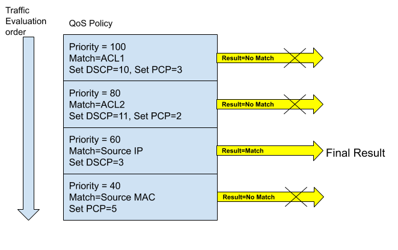
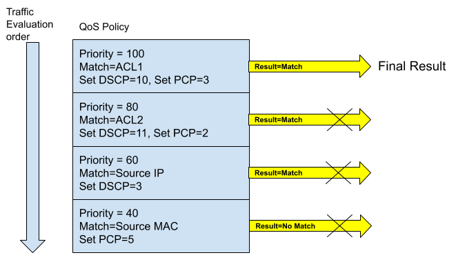
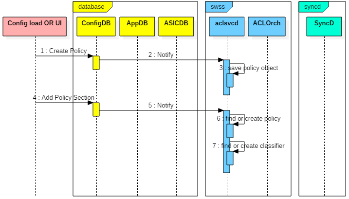

# Flow Based Services in SONiC

** High level design document version 1.0 **

# Table of Contents

- **[Flow Based Services in SONiC](#Flow-Based-Services-in-SONiC)**
- **[High Level Design Document](#High-Level-Design-Document)**
- **[List of Tables](#List-of-Tables)**
- **[Revision](#Revision)**
- **[About this Manual](#About-this-Manual)**
- **[Scope](#Scope)**
- **[Definition/Abbreviation](#DefinitionAbbreviation)**
	- [Table 1 Abbreviations](#Table-1-Abbreviations)
- **[1 Feature Overview](#1-Feature-Overview)**
	- [1.1 Requirements](#1_1-Requirements)
		- [1.1.1 Functional Requirements](#1_1_1-Functional-Requirements)
		- [1.1.2 Configuration and Management Requirements](#1_1_2-Configuration-and-Management-Requirements)
		- [1.1.3 Scalability Requirements](#1_1_3-Scalability-Requirements)
		- [1.1.4 Warm Boot Requirements](#1_1_4-Warm-Boot-Requirements)
	- [1.2 Design Overview](#1_2-Design-Overview)
		- [1.2.1 Basic Approach](#1_2_1-Basic-Approach)
		- [1.2.2 Container](#1_2_2-Container)
		- [1.2.3 SAI Overview](#1_2_3-SAI-Overview)
- **[2 Functionality](#2-Functionality)**
	- [2.1 Target Deployment Use Cases](#2_1-Target-Deployment-Use-Cases)
	- [2.2 Functional Description](#2_2-Functional-Description)
		- [2.2.1 Classifiers](#2_2_1-Classifiers)
			- *[2.2.1.1 Classification using ACLs](#2_2_1_1-Classification-using-ACLs)*
				- *[2.2.1.1.1 ACL Rules with permit action](#2_2_1_1_1-ACL-Rules-with-permit-action)*
				- *[2.2.1.1.2 ACL Rules with deny action](#2_2_1_1_2-ACL-Rules-with-deny-action)*
			- *[2.2.1.2 Classification using L2-L4 header fields](#2_2_1_2-Classification-using-L2-L4-header-fields)*
		- [2.2.2 Policies](#2_2_2-Policies)
			- *[2.2.2.1 Policy of type QoS](#2_2_2_1-Policy-of-type-QoS)*
		- [2.2.3 Applying policies to interfaces](#2_2_3-Applying-policies-to-interfaces)
			- *[2.2.3.1 Evaluation of traffic within the same policy](#2_2_3_1-Evaluation-of-traffic-within-the-same-policy)*
			- *[2.2.3.2 Evaluation of traffic across interfaces of same types](#2_2_3_2-Evaluation-of-traffic-across-interfaces-of-same-types)*
			- *[2.2.3.3 Evaluation of traffic across interfaces of different types](#2_2_3_3-Evaluation-of-traffic-across-interfaces-of-different-types)*
			- *[2.2.3.4 Evaluation of traffic across policies of different types](#2_2_3_4-Evaluation-of-traffic-across-policies-of-different-types)*
	- [2.3 Feature support matrix](#2_3-Feature-support-matrix)
		- [2.3.1 Policy Type support](#2_3_1-Policy-Type-support)
		- [2.3.2 QoS Policy actions support](#2_3_2-QoS-Policy-actions-support)
- **[3 Design](#3-Design)**
	- [3.1 Overview](#3_1-Overview)
	- [3.2 DB Changes](#3_2-DB-Changes)
		- [3.2.1 CONFIG DB](#3_2_1-CONFIG-DB)
			- *[3.2.1.1 Classifier table](#3_2_1_1-Classifier-table)*
			- *[3.2.1.2 Policy table](#3_2_1_2-Policy-table)*
			- *[3.2.1.3 Policy sections table](#3_2_1_3-Policy-sections-table)*
			- *[3.2.1.4 Policy binding table](#3_2_1_4-Policy-binding-table)*
		- [3.2.2 APP DB](#3_2_2-APP-DB)
		- [3.2.3 STATE DB](#3_2_3-STATE-DB)
		- [3.2.4 ASIC DB](#3_2_4-ASIC-DB)
		- [3.2.5 COUNTER DB](#3_2_5-COUNTER-DB)
	- [3.3 Switch State Service Design](#3_3-Switch-State-Service-Design)
		- [3.3.1 Orchestration Agent](#3_3_1-Orchestration-Agent)
		- [3.3.2 ACL Services daemon](#3_3_2-ACL-Services-daemon)
			- *[3.3.2.1 ACL Manager](#3_3_2_1-ACL-Manager)*
			- *[3.3.2.2 Policy Manager](#3_3_2_2-Policy-Manager)*
		- [3.3.3 Other Process](#3_3_3-Other-Process)
	- [3.4 SyncD](#3_4-SyncD)
	- [3.5 SAI](#3_5-SAI)
	- [3.6 Manageability](#3_6-Manageability)
		- [3.6.1 Data Models](#3_6_1-Data-Models)
		- [3.6.2 Configuration Commands](#3_6_2-Configuration-Commands)
			- *[3.6.2.1 Create or delete classifiers](#3_6_2_1-Create-or-delete-classifiers)*
			- *[3.6.2.2 Add or Delete Match ACL to classifier](#3_6_2_2-Add-or-Delete-Match-ACL-to-classifier)*
			- *[3.6.2.3 Add or Delete Match on Source MAC](#3_6_2_3-Add-or-Delete-Match-on-Source-MAC)*
			- *[3.6.2.4 Add or Delete Match on Destination MAC](#3_6_2_4-Add-or-Delete-Match-on-Destination-MAC)*
			- *[3.6.2.5 Add or Delete Match on Ethertype](#3_6_2_5-Add-or-Delete-Match-on-Ethertype)*
			- *[3.6.2.6 Add or Delete Match on Source IPv4 Address](#3_6_2_6-Add-or-Delete-Match-on-Source-IPv4-Address)*
			- *[3.6.2.7 Add or Delete Match on Destination IPv4 Address](#3_6_2_7-Add-or-Delete-Match-on-Destination-IPv4-Address)*
			- *[3.6.2.8 Add or Delete Match on Source IPv6 Address](#3_6_2_8-Add-or-Delete-Match-on-Source-IPv6-Address)*
			- *[3.6.2.9 Add or Delete Match on Destination IPv6 Address](#3_6_2_9-Add-or-Delete-Match-on-Destination-IPv6-Address)*
			- *[3.6.2.10 Add or Delete Match on IP Protocol](#3_6_2_10-Add-or-Delete-Match-on-IP-Protocol)*
			- *[3.6.2.11 Match Source or Destination TCP or UDP Port](#3_6_2_11-Match-Source-or-Destination-TCP-or-UDP-Port)*
			- *[3.6.2.12 Match Source or Destination TCP or UDP Port](#3_6_2_12-Match-Source-or-Destination-TCP-or-UDP-Port)*
			- *[3.6.2.13 Match TCP Flags](#3_6_2_13-Match-TCP-Flags)*
			- *[3.6.2.14 Add or delete description to the classifier](#3_6_2_14-Add-or-delete-description-to-the-classifier)*
			- *[3.6.2.15 Add or delete policy](#3_6_2_15-Add-or-delete-policy)*
			- *[3.6.2.16 Add or delete flow identified by a classifier to a policy](#3_6_2_16-Add-or-delete-flow-identified-by-a-classifier-to-a-policy)*
			- *[3.6.2.17 Add DSCP Remarking action](#3_6_2_17-Add-DSCP-Remarking-action)*
			- *[3.6.2.18 Add PCP Remarking action](#3_6_2_18-Add-PCP-Remarking-action)*
			- *[3.6.2.19 Apply and remove the policy to interface](#3_6_2_19-Apply-and-remove-the-policy-to-interface)*
		- [3.6.3 Show Commands](#3_6_3-Show-Commands)
			- *[3.6.3.1 Show classifier details](#3_6_3_1-Show-classifier-details)*
			- *[3.6.3.2 Show policy details](#3_6_3_2-Show-policy-details)*
			- *[3.6.3.3 Show policy binding summary](#3_6_3_3-Show-policy-binding-summary)*
			- *[3.6.3.4 Show policy binding for an interface](#3_6_3_4-Show-policy-binding-for-an-interface)*
			- *[3.6.3.5 Show policy binding for a given policy](#3_6_3_5-Show-policy-binding-for-a-given-policy)*
			- *[3.6.3.6 Clear policy binding statistics for an interface](#3_6_3_6-Clear-policy-binding-statistics-for-an-interface)*
			- *[3.6.3.7 Clear policy binding statistics for a given policy](#3_6_3_7-Clear-policy-binding-statistics-for-a-given-policy)*
		- [3.6.4 Debug Commands](#3_6_4-Debug-Commands)
		- [3.6.5 REST API Support](#3_6_5-REST-API-Support)
- **[4 Flow Diagrams](#4-Flow-Diagrams)**
	- [4.1 Create a Classifier](#4_1-Create-a-Classifier)
	- [4.2 Create a QoS Policy and Section](#4_2-Create-a-QoS-Policy-and-Section)
	- [4.3 Bind QoS policy to an interface](#4_3-Bind-QoS-policy-to-an-interface)
- **[5 Error Handling](#5-Error-Handling)**
- **[6 Serviceability and Debug](#6-Serviceability-and-Debug)**
- **[7 Warm Boot Support](#7-Warm-Boot-Support)**
- **[8 Scalability](#8-Scalability)**
	- [8.1 8.1 Software scalability](#8_1-8_1-Software-scalability)
	- [8.2 ACL Table Scalability](#8_2-ACL-Table-Scalability)
- **[9 Limitation](#9-Limitation)**
- **[10 Unit Test](#10-Unit-Test)**
- **[11 Appendix A: Sample configuration](#11-Appendix-A:-Sample-configuration)**
- **[12 Internal Design Information](#12-Internal-Design-Information)**
	- [12.1 Future Design Enhancements](#12_1-Future-Design-Enhancements)

# List of Tables
[Table 1 Abbreviations](#table-1-abbreviations)

# Revision
| Rev  |    Date    |       Author        | Change Description |
| ---- | ---------- | ------------------- | ------------------ |
| 0.1  | 07/12/2019 | Abhishek Dharwadkar | Initial version    |

# About this Manual
This document provides general information about the Flow Based Services feature in SONiC.

# Scope
This document provides general information about the Flow Based Services feature implementation in SONiC.

# Definition/Abbreviation

## Table 1 Abbreviations
| **Term** | **Meaning**          |
| -------- | -------------------- |
| ACL      | Access Control List  |
| PBR      | Policy Based Routing |
| SPAN     | Switch Port ANalyzer |
| sFlow    | Sampled flow         |
| MQC      | Modular QoS CLIs     |

# 1 Feature Overview

Flow based services enhance the switches capability to have enhanced and better control over the traffic by providing a generic framework for "Match and Set" features. Incoming packets can be classified according to match rules using fields from L2-L4 headers and defined actions can be taken accordingly. 

Example features might be: -

1. QoS remarking and policing
2. Monitoring (e.g. SPAN, sFlow)
3. Forwarding (e.g. PBR, L2 redirect)

This feature provides a common infrastructure service for such features, and implements DHCP and PCP remarking as the first user of this service - other features are to follow in future releases. The common infrastructure service can itself use the SONiC ACL feature for packet match rule definition, or can use it's own UI for more sophisticated classifiers. 

## 1.1 Requirements

### 1.1.1 Functional Requirements

The following are the requirements for Flow Based Services feature
1. Provide a industry standard MQC equivalent framework for fine grained classification of the traffic via ACL or fields of L2-L4 header and take specific actions on the classified traffic.
2. Support DSCP and COS Remarking action in SONiC release. More actions like policers etc. can be added in future.
3. Enhance monitoring capabilities by supporting Flow based sFlow, SPAN in future.
4. Enhance forwarding capabilities by supporting Flow based routing and Flow based forwarding in future.
5. Ability to bind multiple policies of different types to Ports/LAGs, VLANs and Switch.
6. Independent ingress and egress policy binding for a given interface.
7. Merge non conflicting actions from different policies using ASIC capabilities to simplify user configuration. 

### 1.1.2 Configuration and Management Requirements
1. Support Classifiers from [QoS Openconfig](https://github.com/openconfig/public/blob/master/release/models/qos) except TTL and IPv6 Flow labels.
2. Augment conditions yang container to support match on ACL of types L2, IPv4, IPV6. 
3. Provide config commands to support configuration and application of Flow based Services Policies.
4. Provide statistics support

### 1.1.3 Scalability Requirements
Flow based services will use the same resources as ACL. The exact numbers will be silicon specific.

### 1.1.4 Warm Boot Requirements
Flow based services should work seamlessly across warmboot. Statistics must be preserved across warmboot.

## 1.2 Design Overview

### 1.2.1 Basic Approach
Flow based services will be implemented as part of ACL Services Daemon in SWSS. Flow based services is new code added to SONiC repository. Manageability related code will be added to manageability related  container.

### 1.2.2 Container
This code will be part of ACL Services daemon in switch state service (swss) container.

### 1.2.3 SAI Overview

Existing ACL SAI will be used and no enhancements are necessary.

# 2 Functionality

## 2.1 Target Deployment Use Cases
1. QoS policies can be used to fine tune traffic by classifying the traffic via L2-L4 ACL/Header fields and taking actions like Remarking, Policing etc.
2. Forwarding policies can used to control the traffic path in the network for a flow.

## 2.2 Functional Description
Flow based services provide a modular and extensible framework to classify traffic  and take appropriate action for the traffic. Flow based services can be used for different features like QoS, Forwarding and Monitoring. 

Flow based services configuration is made up of 3 parts

1. Classification of traffic via Classifiers
2. Configuring actions to be taken for each classified flow via a Policy
3. Application of Policy to different interfaces

### 2.2.1 Classifiers

Classifiers are used to identify interesting traffic flows by using parts of L2-L4 headers directly or indirectly via an ACL. The criterion for identification is configured by the `MATCH_TYPE` key. 

#### 2.2.1.1 Classification using ACLs

A classifier uses ACL for flow identification if the `MATCH_TYPE` is set to `"acl"`. The name of the ACL is specified by `ACL_NAME` key. Each classifier can use only 1 ACL of type L2, IPv4 or IPv6 to identify a traffic flow. The ACL must be already configured for the classifier to be considered as complete. If the ACL is not configured then the classifier is considered incomplete and no action will be taken when traffic matches it. Classifiers support forward referencing of ACLs, so the configuration will be retained and no error will be displayed to the user when ACL is not present.

##### 2.2.1.1.1 ACL Rules with permit action

Actions like DSCP remarking will be applied for ACL rules if they are configured with `PACKET_ACTION` of `FORWARD`. 

##### 2.2.1.1.2 ACL Rules with deny action

Actions will be not taken for ACL rules if they are configured with `PACKET_ACTION` of `DROP`. This provides a mechanism to exclude certain specific sub flows, which makes it easier for the user to configure ACLs in certain scenarios. For example if an action say DSCP remarking needs to be taken if the packet has Source IP address which matches prefix 10.1.1.x/24, but DSCP remarking should not be applied to 2 specific IP addresses say 10.1.1.1 and 10.1.1.00 then user can configure 2 ACL rules with `DROP` as `PACKET_ACTION`  for the 2 excluded IPs and 3rd rule can be generic rule for the subnet with `FORWARD` as `PACKET_ACTION`. If this mechanism is unavailable then user has to configure 100s of rules for each specific IP address for which DSCP remarking needs to be applied.

#### 2.2.1.2 Classification using L2-L4 header fields

Classification of the flow can also be done by directly specifying the header fields from L2-L4. This gives user ability to select combination of different fields from various headers for more fine grained classification of the flow. For example user can choose say Source MAC Address, VLAN, Destination IP address, TCP flags to identify a flow and take some action like Policing on it. This is not supported by ACLs. Configuration of mutually exclusive header fields like IPv4 address and IPv6 addresses is considered as invalid. If none of the L2-L4 match fields are specified then its considered as "Match Any". Modifying the match criterion may need reprogramming of the ASIC entry and can have impact on the traffic.

### 2.2.2 Policies

A policy provides information on the action that needs to be applied to the flows identified by the classifiers.  A policy consists of multiple sections or stanzas, where each section consists of a classifier and its corresponding actions. Each section has a priority associated with it which will indicate the order in which the ACL with appropriate will be programmed. 

Policies can be of different types based on the kind of actions supported. Only policies of type QoS are supported in SONiC 3.0.

#### 2.2.2.1 Policy of type QoS

QoS Policies only support the following actions

1. DSCP Remarking : Set DSCP in IPv4 or IPv6 header to the new value specified in the configuration matches.
2. PCP Remarking : Set PCP value in 802.1Q VLAN header to the new value specified in the configuration.

### 2.2.3 Applying policies to interfaces

When a policy is applied to an interface at ingress or egress, action will be taken in case of match, only traffic is ingressing or egressing from that interface. Traffic ingressing or egressing from other interfaces will not be affected. 

A policy can be applied in the following direction 

1. Ingress
2. Egress

A policy can be applied to the following interface types

1. Port or LAG
2. VLAN : Traffic tagged with or classified into the VLAN will be affected if matched.
3. Switch : All traffic flowing through the switch will be affect if matched

Only 1 policy of a given type (e.g QoS) can be applied to an interface in a given direction. For example on Ethernet0 only 1 QoS policy say P1 can be applied at ingress. Its not possible to apply another QoS policy say P2 for Ethernet0 at ingress. 

The same policy can be applied to different interfaces and both ingress and egress.

#### 2.2.3.1 Evaluation of traffic within the same policy

As mentioned in [section 2.2.2](#2_2_2-policies), a policy can have multiple sections. Each section has a classifier, priority and actions associated with it. The policies are programmed in the ASIC in the order of the priority or the sections. The order of the evaluation is based on the numerical value of `PRIORITY`.

The following diagram shows the order in which the policy sections are evaluated and final results when only 1 section matches the traffic. The final result is picked up only from the matching section.

 

 
**Figure 1: Policy evaluation with single match**

The following diagram shows the order in which the policy sections are evaluated and final results when multiple sections match the traffic. The final result is picked up from the section with highest numerical value of the priority.

 

 
**Figure 2: Policy evaluation with multiple match**

#### 2.2.3.2 Evaluation of traffic across interfaces of same types

Policies applied to interfaces of same types are always non conflicting hence there is no conflict resolution between them.

#### 2.2.3.3 Evaluation of traffic across interfaces of different types

A policy can be applied at Port level, VLAN level and Switch level. A given packet can match all the 3 policies.  All interface types have a implicit priority associated with them which is in the order Port/LAG > VLAN > Switch. When a packet matches Port Policy, VLAN Policy and Switch policy, only Port policy will be applied. The evaluation of the port policy is  same as described in [section 2.2.3](#2_2_3-evaluation-of-traffic-within-the-same-policy). Counter of only Port policy will increment.

 

 
**Figure 3: Policy evaluation across interface types**

#### 2.2.3.4 Evaluation of traffic across policies of different types

Data path ACLs, Mirror ACLs and Flow based services policies are internally converted into ACL tables and are added as members of a parallel lookup ACL table group. This results in all ACL tables to be looked up in parallel and results merged in ASIC. The maximum number of tables that can be looked up in parallel is ASIC dependent. CRM statistics for ACL table will provide this information.

Policies of different types are designed to take specific actions. QoS Polices are meant to take only QoS actions like DSCP remarking. Data path ACLs only support forward and drop actions and mirror ACL supports only mirror action. These actions are non conflicting so when a packet matches a QoS Policy, Data Path ACL to permit and mirror ACL, the packet will be permitted, QoS actions will be applied and a mirror copy will also be generated. Counters of Data path ACL, Mirror ACL and QoS policy may increment depending on the capability of the ASIC.

 

 
**Figure 4: Result merge across interfaces of different types**

## 2.3 Feature support matrix

### 2.3.1 Policy Type support

| Policy Type | Release supported |
| ----------- | ----------------- |
| QoS         | SONiC 3.0         |

### 2.3.2 QoS Policy actions support

| Feature        | Release supported |
| -------------- | ----------------- |
| DSCP Remarking | SONiC 3.0         |
| PCP Remarking  | SONiC 3.0         |

# 3 Design

## 3.1 Overview
The following diagram shows the high level design overview of flow based services in SONiC. Flow based services is part of ACL services daemon. ACL Services Daemon is  composed of multiple sub-modules. The main module i.e. ACL Manager provides the ACL related APIs to create an ACL, delete an ACL, bind to an interface etc. A new manager called Flow based services manager will be added to the ACL services daemon which will use the Flow based services configuration to invoke appropriate ACL Manager APIs to program the polices in hardware.

 

 
**Figure 5: Flow Based Service Overview**

## 3.2 DB Changes

### 3.2.1 CONFIG DB

Flow based services will use the following new tables in Config DB

#### 3.2.1.1 Classifier table

A classifier is used to setup the match criterion to identify a traffic flow. A flow can be either identified by an ACL or part of L2-L4 header.

```
key           = CLASSIFIER_TABLE:name            ; name must be unique
                                                 ; name must be 1-63 chars long

;field            = value
DESCRIPTION       = 1*255VCHAR
MATCH_TYPE        = "acl" / "fields"         ; Match on ACL or Match using individual
                                           fields.
ACL_NAME          = 1*255VCHAR             ; ACL name as present in ACL_TABLE
                                           ; valid when match_type = "acl"
SRC_MAC       = mac_addr ["/" mac_mask ]   ; Source MAC address
DST_MAC       = mac_addr ["/" mac_mask ]   ; Destination MAC address
ETHER_TYPE    = h16                        ; Ethernet type field
IP_PROTOCOL   = h8                         ; options of the l3_protocol_type field
SRC_IP        = ipv4_prefix                ; options of the source ipv4
                                           ; address (and mask) field
DST_IP        = ipv4_prefix                ; options of the destination ipv4
                                           ; address (and mask) field
SRC_IPV6      = ipv6_prefix                ; options of the source ipv4
                                           ; address (and mask) field
DST_IPV6      = ipv6_prefix                ; options of the destination ipv4
L4_SRC_PORT   = port_num                   ; source L4 port. Valid if IP Protocol is TCP
                                           ; or UDP 
L4_SRC_PORT_RANGE = port_num_L-port_num_H  ; source ports range of L4 ports field
L4_DST_PORT   = port_num                   ; destination L4 port. Valid if IP Protocol is
                                           ; TCP or UDP 
L4_DST_PORT_RANGE = port_num_L-port_num_H  ; destination ports range of L4 ports field
TCP_FLAGS     = h8/h8                      ; TCP flags field and mask
DSCP          = dscp_val[/dscp_val]        ; DSCP field. Valid range is 0-63
                                           ; address (and mask) field

;value annotations
h16           = 1*4HEXDIG
mac_addr      = 2HEXDIG "." 2HEXDIG "." 2HEXDIG "." 2HEXDIG "." 2HEXDIG "." 2HEXDIG 
                / 2HEXDIG ":" 2HEXDIG ":" 2HEXDIG ":" 2HEXDIG ":" 2HEXDIG ":" 2HEXDIG
port_num      = 1*5DIGIT   ; a number between 0 and 65535
port_num_L    = 1*5DIGIT   ; a number between 0 and 65535,
                           ; port_num_L < port_num_H
port_num_H    = 1*5DIGIT   ; a number between 0 and 65535,
                           ; port_num_L < port_num_H
dscp_val      = DIGIT / %x31-36 %x30-33
ipv4_prefix = dec-octet "." dec-octet "." dec-octet "." dec-octet "/" %d1-32

ipv6_prefix   =                               6( h16 ":" ) ls32
                 /                       "::" 5( h16 ":" ) ls32
                 / [               h16 ] "::" 4( h16 ":" ) ls32
                 / [ *1( h16 ":" ) h16 ] "::" 3( h16 ":" ) ls32
                 / [ *2( h16 ":" ) h16 ] "::" 2( h16 ":" ) ls32
                 / [ *3( h16 ":" ) h16 ] "::"    h16 ":"   ls32
                 / [ *4( h16 ":" ) h16 ] "::"              ls32
                 / [ *5( h16 ":" ) h16 ] "::"              h16
                 / [ *6( h16 ":" ) h16 ] "::"
   
dec-octet   = DIGIT                   ; 0-9
              / 2DIGIT                ; 10-99
              / "1" 2DIGIT            ; 100-199
              / "2" %x30-34 DIGIT     ; 200-249
h8          = 1*2HEXDIG
h16         = 1*4HEXDIG
ls32        = ( h16 ":" h16 ) / IPv4address
```

#### 3.2.1.2 Policy table

Policy table is used to configure the policy parameters. 

```
key           = POLICY_TABLE:name            ; name must be unique
                                             ; name must be 1-63 chars long

;field      = value
TYPE        = "qos"               ; Only QoS is supported now.
DESCRIPTION = 1*255VCHAR          ; Policy Description

;value annotations
```

#### 3.2.1.3 Policy sections table

Policy details table provides information on the classifiers to use and their corresponding actions. A policy can have up to 128 classifiers

```
key           = POLICY_SECTIONS_TABLE:policy_name:classifier_name ; name must be unique
                                                       ; name must be 1-63 chars long

;field            = value
PRIORITY          = 1*3DIGIT            ; Valid Range is 0-999
DESCRIPTION       = 1*255VCHAR          ; Policy Description
SET_DSCP          = dscp_val            
SET_PCP           = pcp_val

;value annotations
dscp_val      = DIGIT / %x31-36 %x30-33
pcp_val       = %x30-37
```

#### 3.2.1.4 Policy binding table

This provides information on Policy application on ports

```
key           = POLICY_BINDING_TABLE:port_name   ; port_name is the name of the Port or
                                                 ; LAG or VLAN or "switch"

;field              = value
INGRESS_QOS_POLICY  = 1*63VCHAR
EGRESS_QOS_POLICY   = 1*63VCHAR

;value annotations
```

### 3.2.2 APP DB

APP DB is used indirectly via ACL.  Please see ACL Enhancements HLD for more details.

### 3.2.3 STATE DB

State DB is used indirectly via ACL.  Please see ACL Enhancements HLD for more details.

### 3.2.4 ASIC DB

ASIC DB is used indirectly via ACL.  Please see ACL Enhancements HLD for more details.

### 3.2.5 COUNTER DB

Counters DB is used indirectly via ACL.  Please see ACL Enhancements HLD for more details.

## 3.3 Switch State Service Design

### 3.3.1 Orchestration Agent

Flow based services manager will utilize and extend the ACL Orchagent. ACL Orchagent will be extended to support DSCP and PCP remarking action.

### 3.3.2 ACL Services daemon

#### 3.3.2.1 ACL Manager

ACL Manager provides APIs to Create, Delete ACLs, Rules, and bind and unbind to various interfaces. No change is necessary to ACL manager as it is designed taking into consideration data path ACLs or policies. 

#### 3.3.2.2 Policy Manager

A new submodule called policy manager will be added to ACL services daemon to handle configuration set in Config DB. Policy manager's job is to maintain a copy of various classifier, policies and bindings and call appropriate ACL managers APIs. ACL manager will populate necessary ACL tables and rules in App DB which will be picked up and programmed by ACL orchagent. The details of ACL manager is captured in ACL HLD.

### 3.3.3 Other Process

No change to other process.

## 3.4 SyncD
No changes to SyncD.

## 3.5 SAI
NA

## 3.6 Manageability

### 3.6.1 Data Models
Flow based services will use the [Openconfig QoS](https://github.com/openconfig/public/blob/master/release/models/qos/openconfig-qos.yang) yang model. Only classifiers related parts are supported, the URIs for which are listed below. 

- `/oc-qos:qos/interfaces` except
  - `/oc-qos:qos/interfaces/interface/input/queues`
  - `/oc-qos:qos/interfaces/interface/input/scheduler-policy`
  - `/oc-qos:qos/interfaces/interface/input/virtual-output-queues`
  - `/oc-qos:qos/interfaces/interface/output/queues`
  - `/oc-qos:qos/interfaces/interface/output/scheduler-policy`
  - `/oc-qos:qos/interfaces/interface/output/virtual-output-queues`
- `/oc-qos:qos/classifiers`

The following conditions are not supported

1. Hop limit (TTL) 
   1. `/oc-qos:qos/classifiers/classifier={classifier_name}/terms/term={term_id}/conditions/ipv4/config/hop-limit`
   2. `/oc-qos:qos/classifiers/classifier={classifier_name}/terms/term={term_id}/conditions/ipv4/state/hop-limit`
   3. `/oc-qos:qos/classifiers/classifier={classifier_name}/terms/term={term_id}/conditions/ipv6/config/hop-limit`
   4. `/oc-qos:qos/classifiers/classifier={classifier_name}/terms/term={term_id}/conditions/ipv6/state/hop-limit`
2. IPv6 Flow labels
   1. `/oc-qos:qos/classifiers/classifier={classifier_name}/terms/term={term_id}/conditions/ipv6/config/source-flow-label`
   2. `/oc-qos:qos/classifiers/classifier={classifier_name}/terms/term={term_id}/conditions/ipv6/config/destination-flow-label`
   3. `/oc-qos:qos/classifiers/classifier={classifier_name}/terms/term={term_id}/conditions/ipv6/state/source-flow-label`
   4. `/oc-qos:qos/classifiers/classifier={classifier_name}/terms/term={term_id}/conditions/ipv6/state/destination-flow-label`

An additional container will be augmented to `/oc-qos:qos/classifiers/classifier={classifier_name}/terms/term={term_id}/conditions` to support match on ACL.

### 3.6.2 Configuration Commands

The following commands are used to configure Policy based services

#### 3.6.2.1 Create or delete classifiers

| Mode      | Config                                                       |
| --------- | ------------------------------------------------------------ |
| Syntax    | SONiC(config)# [**no**] **classifier** *NAME* **type** { **acl** \| **fields**} |
| SONiC 3.0 | Introduced |

#### 3.6.2.2 Add or Delete Match ACL to classifier

| Mode   | Classifier                                              |
| ------ | ------------------------------------------------------- |
| Syntax | SONiC(config-classifier)# [**no**] **match access-list** *NAME* |
| SONiC 3.0 | Introduced |

#### 3.6.2.3 Add or Delete Match on Source MAC

| Mode   | Classifier                                                   |
| ------ | ------------------------------------------------------------ |
| Syntax | SONiC(config-classifier)# [**no**] **match source-mac** *MAC* [ / *MAC_MASK*] |
| SONiC 3.0 | Introduced |

#### 3.6.2.4 Add or Delete Match on Destination MAC

| Mode   | Classifier                                                   |
| ------ | ------------------------------------------------------------ |
| Syntax | SONiC(config-classifier)# [**no**] **match destination-mac** *MAC* [ / *MAC*_MASK] |
| SONiC 3.0 | Introduced |

#### 3.6.2.5 Add or Delete Match on Ethertype

| Mode   | Classifier                                                   |
| ------ | ------------------------------------------------------------ |
| Syntax | SONiC(config-classifier)# [**no**] **match ether-type** *ETHER_TYPE* |
| SONiC 3.0 | Introduced |

#### 3.6.2.6 Add or Delete Match on Source IPv4 Address

| Mode   | Classifier                                                   |
| ------ | ------------------------------------------------------------ |
| Syntax | SONiC(config-classifier)# [**no**] **match source ip-address** *IP_ADDR/PREFIX* |
| SONiC 3.0 | Introduced |

#### 3.6.2.7 Add or Delete Match on Destination IPv4 Address

| Mode   | Classifier                                                   |
| ------ | ------------------------------------------------------------ |
| Syntax | SONiC(config-classifier)# [**no**] **match destination ip-address** *IP_ADDR/PREFIX* |
| SONiC 3.0 | Introduced |

#### 3.6.2.8 Add or Delete Match on Source IPv6 Address

| Mode   | Classifier                                                   |
| ------ | ------------------------------------------------------------ |
| Syntax | SONiC(config-classifier)# [**no**] **match source ipv6-address** *IPV6_ADDR/PREFIX* |
| SONiC 3.0 | Introduced |

#### 3.6.2.9 Add or Delete Match on Destination IPv6 Address

| Mode   | Classifier                                                   |
| ------ | ------------------------------------------------------------ |
| Syntax | SONiC(config-classifier)# [**no**] **match destination ipv6-address** *IPV6_ADDR/PREFIX* |
| SONiC 3.0 | Introduced |

#### 3.6.2.10 Add or Delete Match on IP Protocol

| Mode   | Classifier                                                   |
| ------ | ------------------------------------------------------------ |
| Syntax | SONiC(config-classifier)# [**no**] **match protocol** *{ **tcp** \| **udp** \| NUMBER }* |
| SONiC 3.0 | Introduced |

#### 3.6.2.11 Match Source or Destination TCP or UDP Port

| Mode   | Classifier                                                   |
| ------ | ------------------------------------------------------------ |
| Syntax | SONiC(config-classifier)# [**no**] **match** { **tcp** \| **udp** } **port** { **eq** *NUMBER* \| **range** *BEGIN* *END* } |
| SONiC 3.0 | Introduced |

#### 3.6.2.12 Match Source or Destination TCP or UDP Port

| Mode   | Classifier                                                   |
| ------ | ------------------------------------------------------------ |
| Syntax | SONiC(config-classifier)# [**no**] **match** { **source** \| **destination** } **port** { **eq** *NUMBER* \| **range** *BEGIN* *END* } |
| SONiC 3.0 | Introduced |

#### 3.6.2.13 Match TCP Flags

| Mode   | Classifier                                                   |
| ------ | ------------------------------------------------------------ |
| Syntax | SONiC(config-classifier)# [**no**] **match tcp-flags** { **syn** \| **ack** \| **fin** \| **ack** \| **psh** \| **urg** \| **ece** \| **cwr**} |
| SONiC 3.0 | Introduced |

#### 3.6.2.14 Add or delete description to the classifier

| Mode   | Classifier                                                   |
| ------ | ------------------------------------------------------------ |
| Syntax | SONiC(config-classifier)# [**no**] **description** *STRING* |
| SONiC 3.0 | Introduced |

#### 3.6.2.15 Add or delete policy

| Mode   | Config                                               |
| ------ | ------------------------------------------------------------ |
| Syntax | SONiC(config)# [**no**] **policy** *NAME* **type** { **qos** } |
| SONiC 3.0 | Introduced |

#### 3.6.2.16 Add or delete flow identified by a classifier to a policy

| Mode   | Policy                                        |
| ------ | ------------------------------------------------------------ |
| Syntax | SONiC(config-policy)# [**no**] **flow** *NAME* **priority** *NUMBER* |
| SONiC 3.0 | Introduced |

#### 3.6.2.17 Add DSCP Remarking action

| Mode   | Policy Classify                             |
| ------ | ------------------------------------------------------------ |
| Syntax | SONiC(config-policy-flow)# [**no**] **set dscp** *<0-63>* |
| SONiC 3.0 | Introduced |

#### 3.6.2.18 Add PCP Remarking action

| Mode   | Config                                               |
| ------ | ------------------------------------------------------------ |
| Syntax | SONiC(config-policy-flow)# [**no**] **set pcp** *<0-7>* |
| SONiC 3.0 | Introduced |

#### 3.6.2.19 Apply and remove the policy to interface

| Mode   | Config or Interface |
| ------ | ------------------------------------------------------------ |
| Syntax | SONiC(config)# [**no**] **service-policy** { **qos** } { **in** \| **out** } *NAME* |
| Syntax | SONiC(config-if)# [**no**] **service-policy** { **qos** } { **in** \| **out** } *NAME* |
| SONiC 3.0 | Introduced |

### 3.6.3 Show Commands

#### 3.6.3.1 Show classifier details

| Mode      | Exec                                |
| --------- | ----------------------------------- |
| Syntax    | SONiC# **show classifier** [*NAME*] |
| SONiC 3.0 | Introduced                          |

#### 3.6.3.2 Show policy details
| Mode      | Exec                                                |
| --------- | --------------------------------------------------- |
| Syntax    | SONiC# **show policy** [*NAME*] [**flow** [*NAME*]] |
| SONiC 3.0 | Introduced                                          |

#### 3.6.3.3 Show policy binding summary
| Mode      | Exec                                    |
| --------- | --------------------------------------- |
| Syntax    | SONiC# **show service-policy** [*NAME*] |
| SONiC 3.0 | Introduced                              |

#### 3.6.3.4 Show policy binding for an interface
| Mode      | Exec                                                      |
| --------- | --------------------------------------------------------- |
| Syntax    | SONiC# **show service-policy interface** *INTERFACE_NAME* |
| SONiC 3.0 | Introduced                                                |

#### 3.6.3.5 Show policy binding for a given policy
| Mode      | Exec                                                      |
| --------- | --------------------------------------------------------- |
| Syntax    | SONiC# **show service-policy** *NAME* |
| SONiC 3.0 | Introduced                                                |

#### 3.6.3.6 Clear policy binding statistics for an interface
| Mode      | Exec                                                         |
| --------- | ------------------------------------------------------------ |
| Syntax    | SONiC# **clear statistics service-policy interface** *INTERFACE_NAME* |
| SONiC 3.0 | Introduced                                                   |

#### 3.6.3.7 Clear policy binding statistics for a given policy
| Mode      | Exec                                                         |
| --------- | ------------------------------------------------------------ |
| Syntax    | SONiC# **clear statistics service-policy** *NAME* |
| SONiC 3.0 | Introduced                                                   |

### 3.6.4 Debug Commands

TODO

### 3.6.5 REST API Support

All operations supported as per Openconfig Yang model.

# 4 Flow Diagrams

## 4.1 Create a Classifier

 

 
**Figure 6: Create a Classifier**

## 4.2 Create a QoS Policy and Section

 

 
**Figure 7: Create a QoS Policy and Section**

## 4.3 Bind QoS policy to an interface

 

 
**Figure 8: Bind QoS policy to an interface**

# 5 Error Handling
Please refer to ACL Enhancements HLD for details.

# 6 Serviceability and Debug
1. show commands will help to see if the policy is active.
2. CLI and Rest calls will return appropriate error information in case of invalid configuration.
3. All processing errors will be captured in syslog for ACL services daemon. 
4. Debug command output will be captured as part of tech support for offline analysis.

# 7 Warm Boot Support
Configured actions and counters should continue to work across warm reboot.

# 8 Scalability

## 8.1 8.1 Software scalability

The following is the support scale for Flow based services. When configuring using REST/CLIs etc, appropriate error will be displayed to the user when the configuration exceeds the scale. When configurating via JSON, user has to make sure that the configuration doesn't exceed the scale. Any configuration will be ignored but may cause undesired behavior after reboot. Syslogs will indicate that the configuration has exceeded the supported scale.

| Configuration                         | Scale |
| ------------------------------------- | ----- |
| Maximum number of policies            | 128   |
| Maximum number of classifiers         | 128   |
| Maximum number of sections per policy | 64    |

## 8.2 ACL Table Scalability

The applied policies will share the ACL resources of data path ACLs. Details on how the ACL resources will be shared among various ACL features will be captured in ACL Enhancements HLD.

# 9 Limitation

The following the ASIC limitations that must be noted when configuring the policies.

1. Only the following combination of ACLs are supported in a policy due to key width limitations
   1. L2 + IPv4
   2. IPv4 + IPv6
2. All applied policies of the same type must have the same ACL key combinations across all interfaces. Example its not valid to apply QoS Policy P1 on Ethernet0 which uses L2 ACL1 and IPv4 ACL2 and QoS Policy P2 on Ethernet4 which uses IPv4 ACL3 and IPv6 ACL4.

# 10 Unit Test
1. Verify Classifier creation with ACL
2. Verify classifier creation with Header fields
3. Verify Policy creation of Type QoS
4. Verify adding multiple classifiers with match as ACL and Header fields.
5. Verify DSCP remarking action add, delete and update
6. Verify PCP remarking action add, delete and update
7. Verify Policy binding at ingress and egress for Ethernet interface
8. Verify Policy binding at ingress and egress for Port-channel interface
9. Verify Policy binding at ingress and egress for Vlan interface
10. Verify Policy binding at ingress and egress for Switch interface
11. Verify DSCP remarking with switched and routed traffic
12. Verify PCP remarking with switched and routed traffic
13. Verify PCP remarking with Untagged to Tagged traffic
14. Add Policy section with non existing classifier
15. Apply non existing policy to interface


# 11 Appendix A: Sample configuration

The following example shows configuration for Policy to do PCP and DSCP Remarking using 3 ACLs to classify and active on Ethernet0 interface at ingress.

**Using CLIs**

```
classifier V4-MATCH-ANY type acl
    match access-list IPV4-PERMIT-ANY

classifier V6-MATCH-ANY type acl
    match access-list IPV6-PERMIT-ANY

classifier L2-MATCH-ANY type acl
    match access-list L2-PERMIT-ANY

policy FBS-QOS-POLICY type qos
    flow V4-MATCH-ANY priority 30
        set-dscp 30
    flow V6-MATCH-ANY priority 20
        set-dscp 16
    flow L2-MATCH-ANY priority 10
        set-pcp 2
        
interface Ethernet0
    service-policy qos in FBS-QOS-POLICY
        
```


**Using JSON** 

```json
{
  "CLASSIFIER_TABLE": {
    "V4-MATCH-ANY": {
      "DESCRIPTION": "Classification for Any IPv4 traffic",
      "MATCH-TYPE": "acl",
      "ACL_NAME": "IPV4-PERMIT-ANY"
    },
    "V6-MATCH-ANY": {
      "DESCRIPTION": "Classification for Any IPv6 traffic",
      "MATCH-TYPE": "acl",
      "ACL_NAME": "IPV6-PERMIT-ANY"
    },
    "L2-MATCH-ANY": {
      "DESCRIPTION": "Classification for any L2 traffic",
      "MATCH-TYPE": "acl",
      "ACL_NAME": "L2-PERMIT-ANY"
    }
  },
  "POLICY_TABLE": {
    "FBS-QOS-POLICY": {
      "type": "qos",
      "description": "Remark v4 DSCP to CS1(8), v6 DSCP to CS2 and PCP to EE"
    }
  },
  "POLICY_SECTIONS_TABLE": {
    "FBS-QOS-POLICY|V4-MATCH-ANY": {
      "DESCRIPTION": "Remark FBS-QOS-POLICY, V4-MATCH-ANY classification to CS1 (8)",
      "PRIORITY": 30,
      "SET_DSCP": 8
    },
    "FBS-QOS-POLICY|V6-MATCH-ANY": {
      "DESCRIPTION": "Remark FBS-QOS-POLICY, V6-MATCH-ANY classification to CS2 (16)",
      "PRIORITY": 20,
      "SET_DSCP": 16
    },
    "FBS-QOS-POLICY|L2-MATCH-ANY": {
      "DESCRIPTION": "Remark FBS-QOS-POLICY, L2-PERMIT-ANY classification to EE (16)",
      "PRIORITY": 10,
      "SET_PCP": 2
    }
  },
  "POLICY_BINDING_TABLE": {
    "Ethernet0": {
      "INGRESS_QOS_POLICY": "FBS-QOS-POLICY"
    }
  }
}
```

# 12 Internal Design Information

Internal BRCM information to be removed before sharing with the community

## 12.1 Future Design Enhancements

1. Once ACLs supports UDF, provide an option to use UDF also as part of field qualifier.
2. Use framework for Routing/Forwarding, Mirror, sFlow and Policing etc


