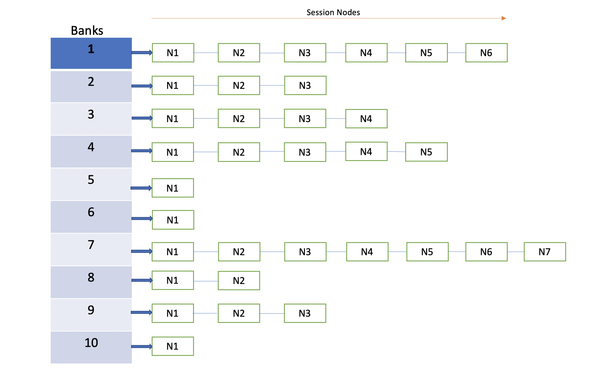

# Feature Name
BFD Scale Enhancement

# High Level Design Document
# Table of Contents
- [1 Feature Overview](#1-Feature-Overview)
    - [1.1 Target Deployment Use Cases](#11-Target-Deployment-Use-Cases)
    - [1.2 Requirements](#12-Requirements)
    - [1.3 Design Overview](#13-Design-Overview)
        - [1.3.1 Basic Approach](#131-Basic-Approach)
        - [1.3.2 Container](#132-Container)
        - [1.3.3 SAI Overview](#133-SAI-Overview)
- [2 Functionality](#2-Functionality)
- [3 Design](#3-Design)
    - [3.1 Overview](#31-Overview)
        - [3.1.1 Problem statement](#311-Problem-statement)
        - [3.1.2 Solutions to the identified issues](#312-Solutions-to-the-identified-issues)
        - [3.1.3 Service and Docker Management](#313-Service-and-Docker-Management)
        - [3.1.4 Packet Handling](#314-Packet-Handling)
    - [3.2 DB Changes](#32-DB-Changes)
        - [3.2.1 CONFIG DB](#321-CONFIG-DB)
        - [3.2.2 APP DB](#322-APP-DB)
        - [3.2.3 STATE DB](#323-STATE-DB)
        - [3.2.4 ASIC DB](#324-ASIC-DB)
        - [3.2.5 COUNTER DB](#325-COUNTER-DB)
        - [3.2.6 ERROR DB](#326-ERROR-DB)
    - [3.3 Switch State Service Design](#33-Switch-State-Service-Design)
        - [3.3.1 Orchestration Agent](#331-Orchestration-Agent)
        - [3.3.2 Other Processes](#332-Other-Processes)
    - [3.4 SyncD](#34-SyncD)
    - [3.5 SAI](#35-SAI)
    - [3.6 User Interface](#36-User-Interface)
        - [3.6.1 Data Models](#361-Data-Models)
        - [3.6.2 CLI](#362-CLI)
        - [3.6.2.1 Configuration Commands](#3621-Configuration-Commands)
        - [3.6.2.2 Show Commands](#3622-Show-Commands)
        - [3.6.2.3 Exec Commands](#3623-Exec-Commands)
        - [3.6.3 REST API Support](#363-REST-API-Support)
        - [3.6.4 gNMI Support](#364-gNMI-Support)
     - [3.7 Warm Boot Support](#37-Warm-Boot-Support)
     - [3.8 Upgrade and Downgrade Considerations](#38-Upgrade-and-Downgrade-Considerations)
     - [3.9 Resource Needs](#39-Resource-Needs)
- [4 Flow Diagrams](#4-Flow-Diagrams)
- [5 Error Handling](#5-Error-Handling)
- [6 Serviceability and Debug](#6-Serviceability-and-Debug)
- [7 Scalability](#7-Scalability)
- [8 Platform](#8-Platform)
- [9 Limitations](#9-Limitations)
- [10 Unit Test](#10-Unit-Test)
- [11 Internal Design Information](#11-Internal-Design-Information)
    - [11.1 IS-CLI Compliance](#111-IS-CLI-Compliance)
    - [11.2 Broadcom Packaging](#112-Broadcom-SONiC-Packaging)
    - [11.3 Broadcom Silicon Considerations](#113-Broadcom-Silicon-Considerations)    
    - [11.4 Design Alternatives](#114-Design-Alternatives)
    - [11.5 Broadcom Release Matrix](#115-Broadcom-Release-Matrix)

# List of Tables
[Table 1: Abbreviations](#table-1-Abbreviations)

# Revision
| Rev |     Date    |       Author       | Change Description                |
|:---:|:-----------:|:------------------:|-----------------------------------|
| 0.1 | 01/27/2021  |   Sumit Agarwal    | Initial version                   |

# About this Manual
This document provides comprehensive functional and design information about the *BFD scale support* feature implementation in SONiC.

# Definition/Abbreviation

### Table 1: Abbreviations
| **Term**                 | **Meaning**                         |
|--------------------------|-------------------------------------|
| BFD                      | Bidirectional Forwarding Detection  |
| OSPF                     | Open Shortest Route First           |
| PIM                      | Protocol-Independent Multicast      |
| BGP                      | Border Gateway Protocol             |
| msec                     | Milli Seconds                       |

# 1 Feature Overview
Bidirectional Forwarding Detection, (BFD) is a protocol defined by the BFD working group at IETF. The protocol defines a method of rapid detection of the failure of a forwarding path by checking that the next hop router is alive. The protocol will be able to detect the forwarding path failure in milliseconds depending on the actual configuration.  Currently a Routing Protocol takes a few seconds (from 3 seconds to 180 seconds or even more) to detect that the neighbouring router, the next hop router, is not operational causing packet loss due to incorrect routing information. BFD is designed to provide a rapid forwarding path failure detection service to a Routing Protocol in a few milliseconds.

This document summarizes enhancement to BFD design to support aggressive timers with a higher scale.

## 1.1 Target Deployment Use Cases
BFD supports creation of single-hop and multi-hop session to monitor forwarding path failure.
Single hop session are created for protocols like iBGP/OSPF/PIM.                
Multihop session are created usually for protocols like eBGP where the neighbours are multiple hop apart.

## 1.2 Requirements
Support 128 BFD single-hop sessions with 500 msec detection timeout with below config:

 - 64 IPv4 BFD sessions
 - 64 IPv6 BFD sessions
 - BFD sessions spread across 10 VRF
 - 120K IPv4 + IPv6 BGP routes
 - BFD Tx interval of 100 msec
 - BFD detection multiplier of 5

1 Overview  
BFD (Bidirectional Forwarding Detection) is an OAM protocol used to detect the health (or otherwise) of a forwarding path. It is used as a detection mechanism by other protocols, typically because it can detect failures faster than the protocol-native detection mechanisms.  BFD is widely used in Routing environments, and is broadly supported in OEM products. It is standardised through RFC 5880 and a set of related RFCs (RFC 5881 to RFC 5885).  

2 Functionality

NA

2.0 Overview  
NA

3 Interfaces  
NA

4 Configuration  
NA 

5 User Interfaces  
NA

6 Serviceability  
NA

7 Scaling  
Support up to 128 BFD sessions at an interval of 100 milliseconds (total 12000 pps)  

8 Warm Boot/ISSU  
NA 

9 Platforms  
All SONiC platforms  

10 Feature Interactions/Exclusions  
NA

11 Limitations  
NA

## 1.3 Design Overview
### 1.3.1 Basic Approach

This is a software implementation. In this, the BFD state machines and session termination uses existing FRR functionality. This is adapted to the SONiC system. These adaptions will result in FRR and SONiC upstream items. 

### 1.3.2 Container
*FRR*

### 1.3.3 SAI Overview
NA

# 2 Functionality

# 3 Design
## 3.1 Overview
### 3.1.1 Problem statement:
128 BFD sessions with timeout of 500 msec is unstable in a scaled setup(4 core system).
BFD session flaps intermittently.

While root causing the above issue below design issue was identified.
1. BFD process CPU usage is about 90%.
2. UDP sockets buffer overflows and BFD packets are dropped.
3. Single threaded BFD process is unable to keep up with both Rx and Tx packet processing.
4. BFD process is not scheduled frequently and deterministically enough.

### 3.1.2 Solutions to the identified issues:
#### 3.1.2.1 BFD process CPU usage is about 90%
Currently each BFD session has an Tx timer to send out a BFD packet, it is unnecessary to have so many timers which also consumes more CPU resources in scaled setup.

To reduce the number of timers, a timer wheel is created to send multiple BFD packets every 10 msec. Creation of timer wheel alone has reduced CPU usage of BFD process from 90% down to 15%.

Once BFD session state is UP, the session along with the pre-formed BFD Tx packet is added to Tx list (a list of all session to be added to timer wheel).

**Timer wheel operation:**
A timer wheel is created with 10 banks. Each bank is serviced by a 10 msec timer and all the banks in the timer wheel is serviced in 100 msec.

**Timer for 1st bank fires:**

 - Loop through all the nodes in the Tx list, identify and add the node to a timer wheel bank as per the Tx interval.

		For eg: 
		 1. If Tx interval is 75 msec, the session node will be added in the 8th bank in the timerwheel.
		 2. If the Tx interval is 45 msec the session will be added in the 5th  and 9th bank in the timer wheel.

 - Once all the node in the Tx list are added  to the timerwheel, for all
   the entries in the 1st bank Tx packets will be sent out.

**Timer for nth bank fires:**

 - Tx packet is sent out for all the nodes in the nth bank.

**Timer for last bank fires:**

 - Tx packet is sent for all the nodes in the last bank.
 - All the nodes in the timer wheel are deleted.

When the BFD state changes to down the session is deleted from Tx list.

Unlike classical timer wheel here nodes are added and deleted to timer wheel on expiry of timer corresponding to first and last timer wheel bank respectively.
 - This avoids complexity of adding and deleting nodes in timer wheel while servicing every timer wheel bank.
 - For limited nodes(128 BFD session) this design has shown better performance compared to classical design.

#### 3.1.2.2 UDP sockets buffer overflows and BFD packets are dropped:

Set the BFD socket receive buffer size using the socket option SO_RCVBUF.

Even after increasing the socket receive buffer size BFD packets were still dropped.

In the current design when socket read callback is triggered BFD reads only 1 packet from the socket. To receive 128 BFD packets BFD receive callback should be scheduled 128 times.

In the new design multiple(64) BFD packets are read in one socket read callback.
- This reduces the number of socket system calls significantly.
- It also avoids frequent context switch which occurs during socket system call.
- Increases throughput of BFD packet form socket to BFD process.

#### 3.1.2.3 Single threaded BFD process is unable to keep up with both Rx and Tx packet processing:

Even after above 2 solutions it was observed that BFD process is unable to send Tx packet and read BFD Rx packets from socket on time.

A single threaded BFD process shared across Tx, Rx as well as protocol interaction is a bottleneck and prevents Tx and Rx to happen in parallel.

 - A new thread bfdd_tx is created to send BFD Tx packets.
 - This new thread doesn't access any core BFD data structures and uses Mutex to prevent synchronisations issues.

bfdd thread adds and deletes the BFD session to Tx list(Tx list is discussed in solution 1)
Before adding and deleting a session to Tx list, bfdd thread acquires mutex semaphore.

Once BFD session state is UP and added to Tx list, bfdd_tx thread can run in parallel, independent of bfdd thread without requiring access to any core data structure of bfdd thread.

#### 3.1.2.4 BFD process is not scheduled frequently enough:
In Sonic system it is observed that there is a significant delay in scheduling of bfdd and bffd_tx threads. With the help of profiling tool(PERF tool) the delay in scheduling of bfd threads is observed to be in the order of 200+ msec.

To ensure bfdd threads are scheduled frequently and deterministically regardless of the load in the system, scheduling policy of bfdd and bfdd_tx threads is changed to SCHED_RR with a priority of 40.

The priority value of 40 is arrived after experimenting with different priority values and observing the stability of 128 BFD session in a scaled setup.

### 3.1.3 Service and Docker Management

NA

### 3.1.4 Packet Handling
NA

## 3.2 DB Changes

### 3.2.1 CONFIG DB
NA
### 3.2.2 APP DB
ANA
### 3.2.3 STATE DB
NA
### 3.2.4 ASIC DB
NA
### 3.2.5 COUNTER DB
NA
### 3.2.6 ERROR DB
NA

## 3.3 Switch State Service Design
### 3.3.1 Orchestration Agent
NA

### 3.3.2 Other Processes 
NA

## 3.4 SyncD
NA

## 3.5 SAI
NA

## 3.6 User Interface

### 3.6.1 Data Models
NA

### 3.6.2 CLI
#### 3.6.2.1 Configuration Commands
NA
#### 3.6.2.2 Show Commands
NA
#### 3.6.2.3 Exec Commands
NA
### 3.6.3 REST API Support
NA

### 3.6.4 gNMI Support
NA

## 3.7 Warm Boot Support
NA

## 3.8 Upgrade and Downgrade Considerations
NA

## 3.9 Resource Needs
Scheduling policy of bfdd and bfdd_tx threads is changed to SCHED_RR with a priority of 40.

# 4 Flow Diagrams
NA

# 5 Error Handling
NA

# 6 Serviceability and Debug
## 6.1 Debug CLI
A new  command "***show bfd statistics"*** is added in vtysh prompt to display global statistics:
 
	L13# show bfd statistics 
	BFD statistics:
	-----------------
	Tx schedule crossed 20 msec : 1129
	Rx schedule crossed 20 msec : 907
	Socket read crossed 5 msec  : 44
	Socket write crossed 5 msec : 533
	Max Tx schedule delay(msec) : 105
	Max Rx schedule delay(msec) : 128
	Max Socket read delay(msec) : 42
	Max socket write delay(msec): 50
	Max session exceeded        : 0

	BFD TW stats:
	-----------------
	Bank index: 0, Node count 34
	Bank index: 1, Node count 24
	Bank index: 2, Node count 15
	Bank index: 3, Node count 15
	Bank index: 4, Node count 7
	Bank index: 5, Node count 11
	Bank index: 6, Node count 1
	Bank index: 7, Node count 16
	Bank index: 8, Node count 23
	Bank index: 9, Node count 26
	
A new  clear command "***clear bfd statistics***" is added in vtysh prompt to reset global statistics.

## 6.2 LOG
A new log is added to display last 5 Rx packet timestamp when the BFD session state changes from UP to DOWN.

# 7 Scalability
Described in requirements section 1.2

# 8 Platform
All platforms with 4 and 8 core CPUs

# 9 Limitations
NA

# 10 Unit Test
*List unit test cases added for this feature (one-liners). These should ultimately align to tests (e.g SPytest, Pytest) that can be shared with the Community.*

# 11 Internal Design Information
*Internal BRCM information to be removed before sharing with the community.*

## 11.1 IS-CLI Compliance
*This is here because we don't want to be too externally obvious about a "follow the leader" strategy. However it must be filled in for all Klish commands.*

*The following table maps SONIC CLI commands to corresponding IS-CLI commands. The compliance column identifies how the command comply to the IS-CLI syntax:*

- ***IS-CLI drop-in replace**  ?? meaning that it follows exactly the format of a pre-existing IS-CLI command.*
- ***IS-CLI-like**  ?? meaning that the exact format of the IS-CLI command could not be followed, but the command is similar to other commands for IS-CLI (e.g. IS-CLI may not offer the exact option, but the command can be positioned is a similar manner as others for the related feature).*
- ***SONIC** - meaning that no IS-CLI-like command could be found, so the command is derived specifically for SONIC.*

|CLI Command|Compliance|IS-CLI Command (if applicable)| Link to the web site identifying the IS-CLI command (if applicable)|
|:---:|:-----------:|:------------------:|-----------------------------------|
| | | | |
| | | | |
| | | | |
| | | | |
| | | | |
| | | | |
| | | | |

***Deviations from IS-CLI:** If there is a deviation from IS-CLI, Please state the reason(s).*

## 11.2 Broadcom SONiC Packaging
*Cloud base vs. Enterprise etc*

## 11.3 Broadcom Silicon Considerations
*Where this feature is/not supported, silicon-specific scaling factors and behaviors*

## 11.4 Design Alternatives
*Please state any significant design alternatives considered (if any), and why these were not chosen*

## 11.5 Broadcom Release Matrix
*Please state the Broadcom release in which a feature is planned to be introduced. Where a feature spans multiple releases, then please state which enhancements/sub-features go into which Broadcom release*
|Release|Change(s)|
|:-------:|:-------------------------------------------------------------------------|
| | |
