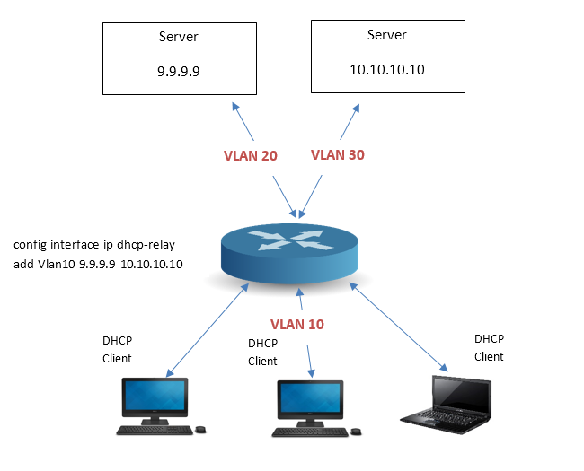
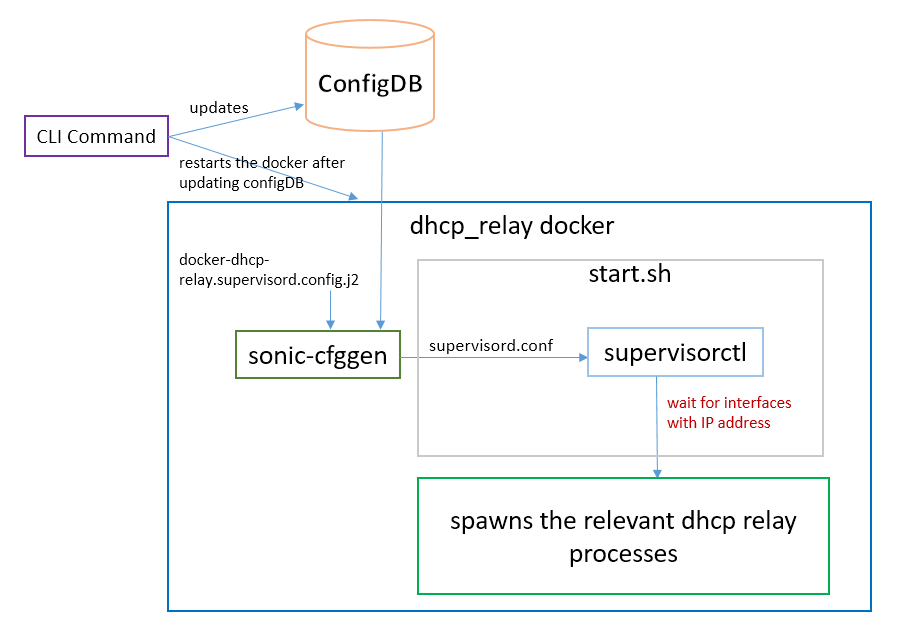

# Feature Name
DHCP Relay Enhancements.
# High Level Design Document
#### Rev 0.2

# Table of Contents
  * [List of Tables](#list-of-tables)
  * [Revision](#revision)
  * [About this Manual](#about-this-manual)
  * [Scope](#scope)
  * [Definition/Abbreviation](#definitionabbreviation)
    * [Table 1: Abbreviations](#table-1-abbreviations)
  * [1 Feature Overview](#1-feature-overview)
    * [1.1 Requirements](#11-requirements)
      * [1.1.1 Functional Requirements](#111-functional-requirements)
        * [1.1.1.1 New Functional Requirements](#1111-new-functional-requirements)
        * [1.1.1.2 Existing Functional Requirements](#1112-existing-functional-requirements)
      * [1.1.2 Configuration and Management Requirements](#112-configuration-and-management-requirements)
      * [1.1.3 Scalability Requirements](#113-scalability-requirements)
      * [1.1.4 Warm Boot Requirements](#114-warm-boot-requirements)
    * [1.2 Design Overview](#12-design-overview)
      * [1.2.1 Basic Approach](#121-basic-approach)
      * [1.2.2 Container](#122-container)
      * [1.2.3 SAI Overview](#123-sai-overview)
  * [2 Functionality](#2-functionality)
    * [2.1 Target Deployment Use Cases](#21-target-deployment-use-cases)
    * [2.2 Functional Description](#22-functional-description)
  * [3 Design](#3-design)
    * [3.1 Overview](#31-overview)
    * [3.2 DB Changes](#32-db-changes)
      * [3.2.1 CONFIG DB](#321-config-db)
      * [3.2.2 APP DB](#322-app-db)
      * [3.2.3 STATE DB](#323-state-db)
      * [3.2.4 ASIC DB](#324-asic-db)
      * [3.2.5 COUNTER DB](#325-counter-db)
    * [3.3 Switch State Service Design](#33-switch-state-service-design)
    * [3.4 SyncD](#34-syncd)
    * [3.5 SAI](#35-sai)
    * [3.6 User Interface](#36-user-interface)
      * [3.6.1 Data Models](#361-data-models)
      * [3.6.2 CLI](#362-cli)
        * [3.6.2.1 Configuration Commands](#3621-configuration-commands)
        * [3.6.2.2 Show Commands](#3622-show-commands)
        * [3.6.2.3 Clear Commands](#3623-clear-commands)
        * [3.6.2.4 Debug Commands](#3623-debug-commands)
        * [3.6.2.5 IS-CLI Compliance](#3624-is-cli-compliance)
      * [3.6.3 REST API Support](#363-rest-api-support)
  * [4 Flow Diagrams](#4-flow-diagrams)
  * [5 Error Handling](#5-error-handling)
  * [6 Serviceability and Debug](#6-serviceability-and-debug)
  * [7 Warm Boot Support](#7-warm-boot-support)
  * [8 Scalability](#8-scalability)
  * [9 Unit Test](#9-unit-test)
  * [10 Internal Design Information](#10-internal-design-information)

# List of Tables
[Table 1: Abbreviations](#table-1-abbreviations)

# Revision
| Rev |     Date    |          Author           | Change Description                |
|:---:|:-----------:|:-------------------------:|-----------------------------------|
| 0.1 | 10/21/2019  |   Abhimanyu Devarapalli   | Initial version                   |
| 0.2 | 12/2/2019   |   Abhimanyu Devarapalli   | Addressed few review comments.    |

# About this Manual
This document provides general information about the DHCP Relay Enhancements implemented in SONiC.
# Scope
The ISC-DHCP code is integrated in SONiC to provide DHCP Relay functionality. This document describes the enhancements made for DHCP Relay.

# Definition/Abbreviation

### Table 1: Abbreviations
| **Term**                 | **Meaning**                         |
|--------------------------|-------------------------------------|
| DHCP                     | Dynamic Host Configuration Protocol |
| VRF                      | Virtual Routing and Forwarding      |

# 1 Feature Overview
## 1.1 Requirements
### 1.1.1 Functional Requirements
#### 1.1.1.1 New Functional Requirements
1. Support relaying of IPv6 DHCP packets.
2. Support relay functionality in VRFs.The server and client interfaces need to be in the same VRF.
3. Support configuration of up to 4 relay addresses per L3 interface.
4. Support configuration of relay addresses on Physical, VLAN, Port channel interfaces and Port channel interfaces in L3 MCLAG.
5. Support DHCP Relay Statistics per interface.

#### 1.1.1.2 Existing Functional Requirements
1. Support relaying of IPv4 DHCP packets.
2. Support appending Circuit ID and Remote ID sub-options(option 82) for IPv4 DHCP packets.
3. Support rate limiting for DHCP packets.

### 1.1.2 Configuration and Management Requirements
1. Provide configuration and management commands using python Click module based framework.
2. Provide per interface configuration command to add/delete DHCP relay addresses.
3. Provide per interface show command to display the DHCP relay statistics.
4. Provide a show command to display the configured relay addresses.

### 1.1.3 Scalability Requirements
The maximum number of Relay addresses configurable per interface are 4.

### 1.1.4 Warm Boot Requirements
DHCP Relay configuration is stateless and hence no state is restored after warm reboot. Any UDP broadcast traffic that is relayed to IP Helper addresses is disrupted/dropped during the duration of the warm reboot or normal reboot.

## 1.2 Design Overview
### 1.2.1 Basic Approach
SONiC uses open source ISC DHCP to support DHCP Relay.

For each routing interface which has a DHCP Relay address configured, a DHCP relay agent process is created, by passing this routing interface as downstream interface and all other interfaces as upstream interfaces.

### 1.2.2 Container
dhcp_relay

### 1.2.3 SAI Overview
N/A

# 2 Functionality
## 2.1 Target Deployment Use Cases
DHCP Relay can be deployed in both the Enterprise networks and in the DC scenarios.



__Figure1: DHCP Relay Deployment Use Case__

## 2.2 Functional Description
Generally, the DHCP packets are broadcast. These broadcast packets cannot be exchanged between DHCP server and client that are not in the same subnet. The DHCP Relay enables DHCP packets to be exchanged between the server and client that are not in the same subnet. The DHCP relay converts the broadcast packets to unicast and forwards.

# 3 Design
## 3.1 Overview

The IPv4 DHCP relay process is spawned with the below options supported by ISC-DHCP

| **Protocol options** | **Description** |
|----------------------|-----------------|
|-id *ifname* | Specifies a downstream network interface: an interface from which requests from clients and other relay agents will be accepted. Multiple interfaces may be specified by using more than one -id option. This argument is intended to be used in conjunction with one or more -i or -iu arguments. |
|-iu *ifname* | Specifies an upstream network interface: an interface from which replies from servers and other relay agents will be accepted. Multiple interfaces may be specified by using more than one -iu option. This argument is intended to be used in conjunction with one or more -i or -id arguments. |
|-a | Append an agent option field to each request before forwarding it to the server. Agent option fields in responses sent from servers to clients will be stripped before forwarding such responses back to the client. The agent option field will contain two agent options: the Circuit ID sub-option and the Remote ID sub-option. Currently, the Circuit ID will be the printable name of the interface on which the client request was received. The client supports inclusion of a Remote ID sub-option as well, but this is not used by default |

Below is a sample IPv4 DHCP Relay process command:
```
/usr/sbin/dhcrelay -d -m discard -a %%h:%%p %%P --name-alias-map-file /tmp/port-name-alias-map.txt -id Vlan10
 -iu Ethernet64 -iu Vlan56 -iu PortChannel60 2.0.1.1
```

The IPv6 DHCP relay process is spawned with the below options supported by ISC-DHCP

| **Protocol options** | **Description** |
|----------------------|-----------------|
|-6 | Run dhcrelay as a DHCPv6 relay agent.|
|-l [*address%*]*ifname*[#*index*] | Specifies the "lower" network interface for DHCPv6 relay mode: the interface on which queries will be received from clients or from other relay agents. At least one -l option must be included in the command line when running in DHCPv6 mode. The interface name "ifname" is a mandatory parameter. The link address can be specified by address%; if it is not, dhcrelay will use the first non-link-local address configured on the interface. The optional #index parameter specifies the interface index. |
|-u [*address%*]*ifname* | Specifies the "upper" network interface for DHCPv6 relay mode: the interface to which queries from clients and other relay agents should be forwarded. At least one -u option must be included in the command line when running in DHCPv6 mode. The interface name ifname is a mandatory parameter. The destination unicast or multicast address can be specified by address%; if not specified, the relay agent will forward to the DHCPv6 All_DHCP_Relay_Agents_and_Servers multicast address. |

Below is a sample IPv6 DHCP Relay process command:
```
/usr/sbin/dhcrelay -6 -d --name-alias-map-file /tmp/port-name-alias-map.txt -l Vlan10 -u Ethernet64 -u Vlan56 -u PortChannel60
```

Please refer the [manual pages](https://kb.isc.org/docs/isc-dhcp-44-manual-pages-dhcrelay) of ISC-DHCP for more information.

## 3.2 DB Changes
### 3.2.1 CONFIG DB
To support a list of IPv6 DHCP Relay addresses on an interface, INTERFACE table is modified to add a new key-value pair where the value is a comma separated list of ipv6-dhcp-relay-addresses.
```
"INTERFACE": {
    "Ethernet24": {
        "dhcp_servers": ["31.1.0.2", "2.2.2.3", "11.19.0.144"],
        "dhcpv6_servers": ["2001::2", "3366::1"]
    }

127.0.0.1:6379[4]> hgetall INTERFACE|Ethernet24
1) "dhcp_servers@"
2) "31.1.0.2,2.2.2.3,11.19.0.144"
3) "dhcpv6_servers@"
4) "2001::2,3366::1"

Schema looks like this:
; key                      = INTERFACE|interface

field                      = value
DHCP_SERVERS               = list-of-ipv4-dhcp-relay-addresses
DHCPv6_SERVERS             = list-of-ipv6-dhcp-relay-addresses

; value annotations
list-of-ipv4-dhcp-relay-addresses   = 1^(,)4ipv4-dhcp-relay-address ; comma separated list of up to 4 ipv4 dhcp relay addresses
list-of-ipv6-dhcp-relay-addresses   = 1^(,)4ipv6-dhcp-relay-address ; comma separated list of up to 4 ipv6 dhcp relay addresses
ipv4-dhcp-relay-address             = ipv4-address
ipv6-dhcp-relay-address             = ipv6-address
ipv4-address                        = dec-octet "." dec-octet "." dec-octet "." dec-octet
ipv6-address                        = dec-octet ":" dec-octet ":" dec-octet ":" dec-octet
dec-octet                           = DIGIT                     ; 0-9
                                       / %x31-39 DIGIT         ; 10-99
                                       / "1" 2DIGIT            ; 100-199
                                       / "2" %x30-34 DIGIT     ; 200-249
```
Similar schema changes apply to VLAN and PORTCHANNEL tables.

### 3.2.2 APP DB
No changes are required in APP DB for this feature.
### 3.2.3 STATE DB
No changes are required in STATE DB for this feature.
### 3.2.4 ASIC DB
No changes are required in ASIC DB for this feature.
### 3.2.5 COUNTER DB
No changes are required in COUNTER DB for this feature.

## 3.3 Switch State Service Design
No changes are required in SWSS for this feature.

## 3.4 SyncD
No changes are required in SyncD for this feature

## 3.5 SAI
No changes needed in SAI for this feature.

## 3.6 User Interface
### 3.6.1 Data Models
N/A
### 3.6.2 CLI
#### 3.6.2.1 Configuration Commands

**config interface ip dhcp-relay [add|remove] <interface_name> <ip_addr1> <ip_addr2> <ip_addr3> <ip_addr4>**
- The above command enables user to add or remove IPv4 DHCP Relay addresses on an interface.
```
Usage:
config interface ip dhcp-relay [OPTIONS] COMMAND [ARGS]...

  Add or remove DHCP relay on an interface

Options:
  --help  Show this message and exit.

Commands:
  add
  remove

config interface ip dhcp-relay add [OPTIONS] <interface_name>
                                          <ip_addr1> <ip_addr2> <ip_addr3>
                                          <ip_addr4>

config interface ip dhcp-relay remove [OPTIONS] <interface_name>
                                             <ip_addr1> <ip_addr2> <ip_addr3>
                                             <ip_addr4>
```

**config interface ipv6 dhcp-relay [add|remove] <interface_name> <ip_addr1> <ip_addr2> <ip_addr3> <ip_addr4>**
- The above command enables user to add or remove IPv6 DHCP Relay addresses on an interface.
```
Usage:
config interface ipv6 dhcp-relay [OPTIONS] COMMAND [ARGS]...

  Add or remove DHCP relay on an interface

Options:
  --help  Show this message and exit.

Commands:
  add
  remove

config interface ipv6 dhcp-relay add [OPTIONS] <interface_name>
                                            <ip_addr1> <ip_addr2> <ip_addr3>
                                            <ip_addr4>

config interface ipv6 dhcp-relay remove [OPTIONS] <interface_name>
                                               <ip_addr1> <ip_addr2>
                                               <ip_addr3> <ip_addr4>
```

#### 3.6.2.2 Show Commands

**show ip dhcp-relay**
```
Usage:
show ip dhcp-relay [OPTIONS] COMMAND [ARGS]...

  Show IP DHCP relay information

Options:
  -?, -h, --help  Show this message and exit.

Commands:
  brief       Show IP DHCP relay information
  statistics  Show IP DHCP relay statistics

Sample output:

# show ip dhcp-relay brief
+------------------+-----------------------+
| Interface Name   | DHCP Helper Address   |
+==================+=======================+
| Vlan10           | 20.20.1.2             |
+------------------+-----------------------+

show ip dhcp-relay statistics [OPTIONS] <interface_name>

Sample output:
# show ip dhcp-relay statistics Vlan10

Packets relayed from client to server:     2
Packets relayed from server to client:     0
Errors relaying packets from clients:      0
Errors relaying packets from servers:      0
Packets dropped with bogus GIADDR:         0
Packets dropped due to bad relay info:     0
Packets dropped due to missing relay info: 0
Packets dropped due to invalid hdr length: 0
Packets dropped on interface with no IP:   0
Replies dropped on downstream interface:   0
Requests dropped on upstream interface:    0
```

**show ipv6 dhcp-relay**
```
Usage:
show ipv6 dhcp-relay [OPTIONS] COMMAND [ARGS]...

  Show IPv6 DHCP relay information

Options:
  -?, -h, --help  Show this message and exit.

Commands:
  brief       Show IPv6 DHCP relay information
  statistics  Show IPv6 DHCP relay statistics

Sample output:

# show ipv6 dhcp-relay brief
+------------------+-----------------------+
| Interface Name   | DHCP Helper Address   |
+==================+=======================+
| Vlan10           | 2001::2               |
+------------------+-----------------------+

show ipv6 dhcp-relay statistics [OPTIONS] <interface_name>

Sample output:
# show ipv6 dhcp-relay statistics Vlan10

Packets relayed from client to server:                            0
Packets relayed from server to client:                            0
Errors relaying packets from clients:                             0
Errors relaying packets from servers:                             0
Packets with wrong message type dropped on downstream interface:  0
Packets with wrong message type dropped on upstream interface:    0
```
#### 3.6.2.3 Clear Commands
**sonic-clear ip dhcp-relay statistics <interface_name>**
- The above command clears the IPv4 DHCP Relay statistics on a relay interface.
```
Usage:
sonic-clear ip dhcp-relay [OPTIONS] COMMAND [ARGS]...

  Clear IPv4 DHCP Relay statistics

Options:
  -?, -h, --help  Show this message and exit.

Commands:
  statistics
```

**sonic-clear ipv6 dhcp-relay statistics <interface_name>**
- The above command clears the IPv6 DHCP Relay statistics on a relay interface.
```
Usage:
sonic-clear ipv6 dhcp-relay [OPTIONS] COMMAND [ARGS]...

  Clear IPv6 DHCP Relay statistics

Options:
  -?, -h, --help  Show this message and exit.

Commands:
  statistics

```
#### 3.6.2.4 Debug Commands

**debug dhcp-relay**
This command enables the user to toggle between DEBUG and INFO logging levels for the DHCP Relay syslogs.
```
debug dhcp-relay
    Toggle DHCP Relay debug level
```

**debug ip dhcp-relay <interface_name>**
- The above command toggles the IPv4 DHCP Relay process syslog level on a relay interface.
```
Usage:
debug ip dhcp-relay [OPTIONS] COMMAND [ARGS]...

  Toggle DHCP Relay debug level

Options:
  -?, -h, --help  Show this message and exit.

Commands:
  default*  Toggle DHCP Relay on an interface
```

**debug ipv6 dhcp-relay <interface_name>**
- The above command toggles the IPv6 DHCP Relay process syslog level on a relay interface.
```
Usage:
debug ipv6 dhcp-relay [OPTIONS] COMMAND [ARGS]...

  Toggle DHCP Relay debug level

Options:
  -?, -h, --help  Show this message and exit.

Commands:
  default*  Toggle DHCP Relay on an interface
```
#### 3.6.2.5 IS-CLI Compliance
**Deviations from IS-CLI:** As click based CLI is only supported, the IS-CLI compliance is not applicable.

### 3.6.3 REST API Support
N/A

# 4 Flow Diagrams



__Figure2: DHCP Relay configuration Flow Diagram__

# 5 Error Handling
N/A

# 6 Serviceability and Debug
New debug command is added to toggle the logging of the DHCP relay process between INFO and DEBUG levels.

# 7 Warm Boot Support
Not applicable for this feature.

# 8 Scalability
Up to 4 DHCP relay addresses can be configured on each routing interface in the system.

# 9 Unit Test
1. Configure ip dhcp relay address on a physical routing interface in a default router and verify that relay is working.
2. Configure ip dhcp relay address on a VLAN interface in a default router and verify that relay is working.
3. Configure ip dhcp relay address on a port channel interface in a default router and verify that relay is working.
4. Configure ipv6 dhcp relay address on a physical routing interface in a default router and verify that relay is working.
5. Configure ipv6 dhcp relay address on a VLAN interface in a default router and verify that relay is working.
6. Configure ipv6 dhcp relay address on a port channel interface in a default router and verify that relay is working.
7. Configure ip dhcp relay address on a physical routing interface in a VRF and verify that relay is working.
8. Configure ip dhcp relay address on a VLAN interface in a VRF and verify that relay is working.
9. Configure ip dhcp relay address on a port channel interface in a VRF and verify that relay is working.
10. Configure ipv6 dhcp relay address on a physical routing interface in a VRF and verify that relay is working.
11. Configure ipv6 dhcp relay address on a VLAN interface in a VRF and verify that relay is working.
12. Configure ipv6 dhcp relay address on a port channel interface in a VRF and verify that relay is working.
13. Verify that the "show ip dhcp-relay brief" command displays all the configured relay addresses.
14. Verify that the "show ipv6 dhcp-relay brief" command displays all the configured relay addresses.
15. Verify that the DHCP Relay statistics are properly updated.
16. Verify that the "sonic-clear ip dhcp-relay" command clears the IPv4 DHCP relay statistics on a relay interface.
17. Verify that the "sonic-clear ipv6 dhcp-relay" command clears the IPv6 DHCP relay statistics on a relay interface.

# 10 Internal Design Information


