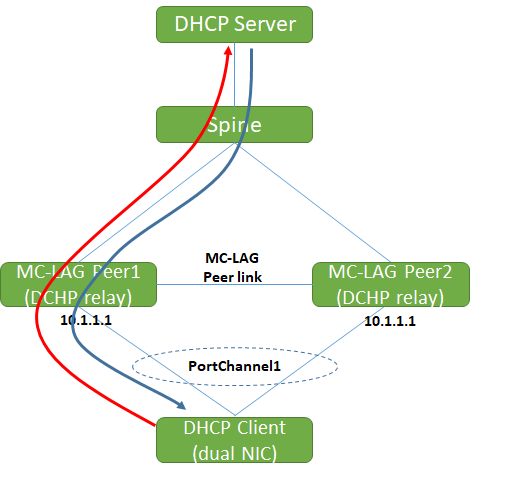
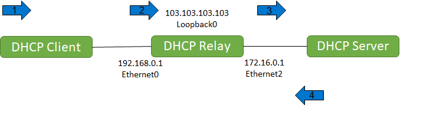
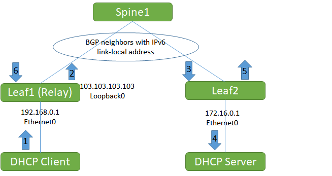
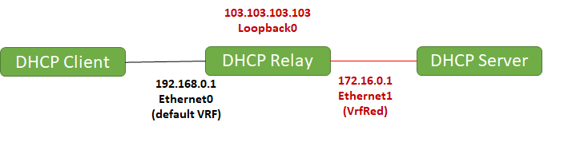
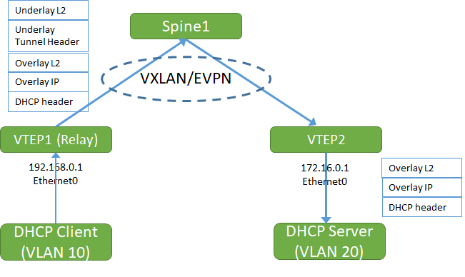

# Feature Name
DHCP Relay Enhancements.
# High Level Design Document
#### Rev 0.3

# Table of Contents
  * [List of Tables](#list-of-tables)
  * [Revision](#revision)
  * [About this Manual](#about-this-manual)
  * [Scope](#scope)
  * [Definition/Abbreviation](#definitionabbreviation)
    * [Table 1: Abbreviations](#table-1-abbreviations)
  * [1 Feature Overview](#1-feature-overview)
    * [1.1 Requirements](#11-requirements)
      * [1.1.1 Functional Requirements](#111-functional-requirements)
        * [1.1.1.1 New Functional Requirements](#1111-new-functional-requirements)
        * [1.1.1.2 Existing Functional Requirements](#1112-existing-functional-requirements)
      * [1.1.2 Configuration and Management Requirements](#112-configuration-and-management-requirements)
      * [1.1.3 Scalability Requirements](#113-scalability-requirements)
      * [1.1.4 Warm Boot Requirements](#114-warm-boot-requirements)
    * [1.2 Design Overview](#12-design-overview)
      * [1.2.1 Basic Approach](#121-basic-approach)
      * [1.2.2 Container](#122-container)
      * [1.2.3 SAI Overview](#123-sai-overview)
  * [2 Functionality](#2-functionality)
    * [2.1 Target Deployment Use Cases](#21-target-deployment-use-cases)
      * [2.1.1 MCLAG guidelines](#211-mclag)
    * [2.2 Functional Description](#22-functional-description)
  * [3 Design](#3-design)
    * [3.1 Overview](#31-overview)
      * [3.1.1 Option 82 Link-selection sub-option](#311-link-sel)
      * [3.1.2 Hop limit](#312-hop-limit)
      * [3.1.3 Source interface selection](#313-source-interface-sel)
      * [3.1.4 Relay over IPv6 next hops](#314-relay-over-ipv6-nexthop)
      * [3.1.5 VRFs and route leaking](#315-vrf-route-leaking)  
        * [3.1.5.1 Sub-option 151](#3151-vrf-suboption-151)  
      * [3.1.6 Relay and VTEP](#316-relay-and-vtep)
      * [3.1.7 Relay and SAG](#317-relay-and-sag)
      * [3.1.8 Rate limiting](#318-rate-limiting)
    * [3.2 DB Changes](#32-db-changes)
      * [3.2.1 CONFIG DB](#321-config-db)
      * [3.2.2 APP DB](#322-app-db)
      * [3.2.3 STATE DB](#323-state-db)
      * [3.2.4 ASIC DB](#324-asic-db)
      * [3.2.5 COUNTER DB](#325-counter-db)
    * [3.3 Switch State Service Design](#33-switch-state-service-design)
    * [3.4 SyncD](#34-syncd)
    * [3.5 SAI](#35-sai)
    * [3.6 User Interface](#36-user-interface)
      * [3.6.1 Data Models](#361-data-models)
      * [3.6.2 Click CLI](#362-cli)
        * [3.6.2.1 Configuration Commands](#3621-configuration-commands)
        * [3.6.2.2 Show Commands](#3622-show-commands)
        * [3.6.2.3 Clear Commands](#3623-clear-commands)
        * [3.6.2.4 Debug Commands](#3623-debug-commands)
        * [3.6.2.5 IS-CLI Compliance](#3624-is-cli-compliance)
      * [3.6.3 REST API Support](#363-rest-api-support)
      * [3.6.4 KLISH CLI](#364-klish)
        * [3.6.4.1 Configuration Commands](#3641-configuration-commands)
        * [3.6.4.2 Show Commands](#3642-show-commands)
        * [3.6.4.3 Clear Commands](#3643-clear-commands)
  * [4 Flow Diagrams](#4-flow-diagrams)
  * [5 Error Handling](#5-error-handling)
  * [6 Serviceability and Debug](#6-serviceability-and-debug)
  * [7 Warm Boot Support](#7-warm-boot-support)
  * [8 Scalability](#8-scalability)
  * [9 Unit Test](#9-unit-test)
  * [10 Future Enhancements](#10-future-enhancements)

# List of Tables
[Table 1: Abbreviations](#table-1-abbreviations)

# Revision
| Rev |     Date    |          Author           | Change Description                |
|:---:|:-----------:|:-------------------------:|-----------------------------------|
| 0.1 | 10/21/2019  |   Abhimanyu Devarapalli   | Initial version                   |
| 0.2 | 12/2/2019   |   Abhimanyu Devarapalli   | Addressed few review comments.    |
| 0.3 | 2/13/2020   |   Abhimanyu Devarapalli   | Added link-selection option, source interface selection, max hops, OC-Yang, KLISH CLI. |

# About this Manual
This document provides general information about the DHCP Relay Enhancements implemented in SONiC.
# Scope
The ISC-DHCP code is integrated in SONiC to provide DHCP Relay functionality. This document describes the enhancements made for DHCP Relay.

# Definition/Abbreviation

### Table 1: Abbreviations
| **Term**                 | **Meaning**                         |
|--------------------------|-------------------------------------|
| DHCP                     | Dynamic Host Configuration Protocol |
| VRF                      | Virtual Routing and Forwarding      |
| MC-LAG                   | Multi-chassis Link aggregation group|
| VTEP                     | VXLAN Tunnel End Point              |
| SAG                      | Static Anycast Gateway              |

# 1 Feature Overview
## 1.1 Requirements
### 1.1.1 Functional Requirements
#### 1.1.1.1 New Functional Requirements
1. Support DHCP Relay Option 82 Link selection sub-option - RFC 3527
2. Support configuration of source interface for relayed packets.
3. Support DHCP relay over RFC 5549 routes learned via BGP IPv6 link-local neighbors (BGP Unnumbered).
4. Support DHCP clients and DHCP servers in different VRF domains.
5. Support DHCP relay over VxLAN overlay tunnels.
6. Support configuration of maximum number of relay hops.  

#### 1.1.1.2 Existing Functional Requirements
1. Support relaying of IPv4 DHCP packets.
2. Support appending Circuit ID and Remote ID sub-options(option 82) for IPv4 DHCP packets.
3. Support rate limiting for DHCP packets.
4. Support relaying of IPv6 DHCP packets.
5. Support relay functionality in VRFs.
6. Support configuration of up to 4 relay addresses per L3 interface.
7. Support configuration of relay addresses on Physical, VLAN, Port channel interfaces and Port channel interfaces in L3 MCLAG.
8. Support DHCP Relay Statistics per interface.

### 1.1.2 Configuration and Management Requirements
#### 1.1.2.1 New Configuration Requirements
1. Support for OpenConfig YANG model - see [relay-agent.yang](https://github.com/openconfig/public/blob/master/release/models/relay-agent/openconfig-relay-agent.yang) for more details.
2. Support for KLISH CLI commands using management framework.

#### 1.1.2.2 Existing Configuration Requirements
1. Provide configuration and management commands using python Click module based framework.
2. Provide per interface configuration command to add/delete DHCP relay addresses.
3. Provide per interface show command to display the DHCP relay statistics.
4. Provide a show command to display the configured relay addresses.

### 1.1.3 Scalability Requirements
The maximum number of Relay addresses configurable per interface are 4. DHCP relay is qualified to handle up to 2000 DHCP clients.

### 1.1.4 Warm Boot Requirements
DHCP Relay configuration is stateless and hence no state is restored after warm reboot. Any UDP broadcast traffic that is relayed to IP Helper addresses is disrupted/dropped during the duration of the warm reboot or normal reboot.

## 1.2 Design Overview
### 1.2.1 Basic Approach
SONiC uses open source ISC DHCP to support DHCP Relay.

For each routing interface which has a DHCP Relay address configured, a DHCP relay agent process is created, by passing this routing interface as downstream interface and all other interfaces as upstream interfaces.

### 1.2.2 Container
dhcp_relay

### 1.2.3 SAI Overview
N/A

# 2 Functionality
## 2.1 Target Deployment Use Cases
DHCP Relay can be deployed in both the Enterprise networks and in the DC scenarios.


__Figure1: DHCP Relay Deployment Use Case__

&nbsp;
&nbsp;

&nbsp;
&nbsp;
__Figure2: DHCP Relay Deployment with MCLAG__

### 2.1.1 MCLAG guidelines

In MCLAG deployments, the following configuration guidelines need to be considered:

- The DHCP Relay configuration should be the same on both the MC-LAG peer switches with same set of DHCP servers.
- The DHCP Relay must be configured to use link-selection and source interface options. This is to ensure that response from server is received by the switch that relayed the DHCP packet.
- DHCP server must be reachable from both the MC-LAG peers.
- Clients may send the DHCP DISCOVER packet to either of the MC-LAG peers.
- The DHCP DISCOVER packet from client can be relayed by either of the MC-LAG peers.


**Sample configuration MC-LAG Peer switch:**

```
## Create Loopback
config loopback add Loopback0
config interface ip add Loopback0 103.103.103.103/32

## Create client VLAN
config vlan add 100

## Create client facing Port-channel
config portchannel add PortChannel101 --fallback true

## Add client port to the Port-channel
config portchannel member add PortChannel101 Ethernet1

## Setup MCLAG using loopback IP and Peer link 
config mclag add 1 103.103.103.103 113.113.113.133 Ethernet2

## Add Port-channel to MCLAG
config mclag member add 1 PortChannel101

## Add peer link and Port-channel to VLAN 100
config vlan member add 100 Ethernet2
config vlan member add -u 100 PortChannel101

## Configure IP address on the VLAN 100 interface
config interface ip add Vlan100 10.1.1.1/24

## Enable DHCP relay on VLAN 100 with link-selection and source interface
config interface ip dhcp_relay add Vlan100 55.55.55.1 -link-select=enable -src-intf=Loopback0
```

For more details on MC-LAG configuration, please refer to [HLD](https://github.com/Azure/SONiC/blob/master/doc/mclag/Sonic-mclag-hld.md) document.

## 2.2 Functional Description
Generally, the DHCP packets are broadcast. These broadcast packets cannot be exchanged between DHCP server and client that are not in the same subnet. The DHCP Relay enables DHCP packets to be exchanged between the server and client that are not in the same subnet. The DHCP relay converts the broadcast packets to unicast and forwards them to DHCP server.

# 3 Design
## 3.1 Overview

The IPv4 DHCP relay process is spawned with the below options supported by ISC-DHCP

| **Protocol options** | **Description** |
|----------------------|-----------------|
|-id *ifname* | Specifies a downstream network interface: an interface from which requests from clients and other relay agents will be accepted. Multiple interfaces may be specified by using more than one -id option. This argument is intended to be used in conjunction with one or more -i or -iu arguments. |
|-iu *ifname* | Specifies an upstream network interface: an interface from which replies from servers and other relay agents will be accepted. Multiple interfaces may be specified by using more than one -iu option. This argument is intended to be used in conjunction with one or more -i or -id arguments. |
|-a | Append an agent option field to each request before forwarding it to the server. Agent option fields in responses sent from servers to clients will be stripped before forwarding such responses back to the client. The agent option field contains two IDs: the Circuit ID sub-option and the Remote ID sub-option. The Circuit ID is set to the printable name of the interface on which the client request was received. The Remote ID is set to the MAC address of the interface. |
|-U *ifname* | Enables the addition of a RFC 3527 compliant link selection suboption for clients directly connected to the relay. This RFC allows a relay to specify two different IP addresses: one for the server to use when communicating with the relay (giaddr) the other for choosing the subnet for the client (the suboption). This can be useful if the server is unable to send packets to the relay via the address used for the subnet. |
|-c *count* | Maximum hop count. When forwarding packets, dhcrelay discards packets which have reached a hop count of COUNT. Default is 10. |

Below is a sample IPv4 DHCP Relay process command:
```
/usr/sbin/dhcrelay -d -m discard -a %%p %%P --name-alias-map-file /tmp/port-name-alias-map.txt -id Vlan10
 -iu Ethernet64 -iu Vlan56 -iu PortChannel60 2.0.1.1 -c 12 -U Loopback1
```

Below is a sample IPv4 DHCP relayed packet with option 82:
```
Option: (82) Agent Information Option
  Length: 31
  Option 82 Suboption: (1) Agent Circuit ID
      Length: 10
      Agent Circuit ID: 45746865726e65743130 ("Ethernet 10")
  Option 82 Suboption: (2) Agent Remote ID
      Length: 17
      Agent Remote ID: 63633a33373a61623a31373a36633a3961 ("cc:37:ab:17:6c:9a")
```

The IPv6 DHCP relay process is spawned with the below options supported by ISC-DHCP

| **Protocol options** | **Description** |
|----------------------|-----------------|
|-6 | Run dhcrelay as a DHCPv6 relay agent.|
|-l [*address%*]*ifname*[#*index*] | Specifies the "lower" network interface for DHCPv6 relay mode: the interface on which queries will be received from clients or from other relay agents. At least one -l option must be included in the command line when running in DHCPv6 mode. The interface name "ifname" is a mandatory parameter. The link address can be specified by address%; if it is not, dhcrelay will use the first non-link-local address configured on the interface. The optional #index parameter specifies the interface index. |
|-u [*address%*]*ifname* | Specifies the "upper" network interface for DHCPv6 relay mode: the interface to which queries from clients and other relay agents should be forwarded. At least one -u option must be included in the command line when running in DHCPv6 mode. The interface name ifname is a mandatory parameter. The destination unicast or multicast address can be specified by address%; if not specified, the relay agent will forward to the DHCPv6 All_DHCP_Relay_Agents_and_Servers multicast address. |
|-c *count* | Maximum hop count. When forwarding packets, dhcrelay discards packets which have reached a hop count of COUNT. Default is 10. |

Below is a sample IPv6 DHCP Relay process command:
```
/usr/sbin/dhcrelay -6 -d --name-alias-map-file /tmp/port-name-alias-map.txt -l Vlan10 -u Ethernet64 -u Vlan56 -u PortChannel60 -c 15
```

Please refer the [manual pages](https://kb.isc.org/docs/isc-dhcp-44-manual-pages-dhcrelay) of ISC-DHCP for more information.


### 3.1.1 Option 82 Link-selection sub-option
Typically, DHCP deployment involves a single routing domain between the client and server.  In such deployments, the 'giaddr' in relayed packet is used to identify the client subnet and also to communicate with the relay agent. In some networks, the client and server could be in different domains and may not be able to communicate directly. This is done to isolate the server from client attacks. In such scenarios, there is a need to differentiate the client subnet and the relay agent address ('giaddr').

The link selection suboption provides a mechanism to explicitly specify the subnet on which the DHCP client resides, which is different from 'giaddr'. The relay agent adds the suboption to specify the client subnet and the DHCP server uses the sub-option value (instead of giaddr) to assign the DHCP lease. The relay agent also sets the 'giaddr' value to its own IP address which is reachable from DHCP server. Refer to RFC 3527 for more details. Note that the link-selection sub-option is intended for DHCPv4 clients only and is not applicable for DHCPv6 clients.

&nbsp;

&nbsp;
__Figure3: DHCP Relay Link selection__

1. DHCP client generates request. 
2. Relay agent intercepts and adds link-selection sub option with 192.168.0.1 address.
3. Relay agent sets the `giaddr` based on the source interface configured. If source interface is configured as loopback 0, the `giaddr` is set to 103.103.103.103. The `giaddr` must be reachable from the server.
4. Server identifies the client subnet from link-selection option and allocates address from the 192.168.0.x pool. Server generates the offer packet and sends it to  the IP address specified in the `giaddr`.

```
# Enable link select on incoming interface, specifying Loopback0 as source interface
config interface ip dhcp-relay add Ethernet0 172.16.0.2 -link-select=enable -src-intf=Loopback0
```

```
# DHCP message - relay agent options

Option: (82) Agent Information Option
  Length: 37
  Option 82 Suboption: (1) Agent Circuit ID
      Length: 10
      Agent Circuit ID: 45746865726e65743030 ("Ethernet 0")
  Option 82 Suboption: (2) Agent Remote ID
      Length: 17
      Agent Remote ID: 63633a33373a61623a31373a36633a3961 ("cc:37:ab:17:6c:9a")
  Option 82 Suboption: (5) Link Selection
      Length: 4
      Link selection: C0A80001 (192.168.0.1)
```

### 3.1.2 Hop limit
Clients typically set the hop count field in the DHCP packet to 0. When forwarding DHCP packets, the relay agent increments the hop count field  by 1. If the hop count in DHCP packet is greater than or equal to the maximum number of hops allowed by the relay agent, the incoming packet is discarded. The hop limit ensures that the DHCP packets are not looped in the network where multiple relay agents are present. The default value of the maximum number of hops is 10, and can be configured to a value from 1 through 16. The hop limit configuration is per-interface (client facing) and applies to both DHCPv4 and DHCPv6 packets. The hop limit is only enforced for packets that are relayed to the server, it is not applied for response packets received from server. Interface counter is maintained to track the number of packets dropped due to hop limit.

```
# Set hop limit to 3 when enabling DHCP relay on Vlan100
config interface ip dhcp-relay max-hop-count add Vlan100 3
```

Note that in case of IPv4, the relay discards any incoming DHCP packet received with relay agent option 82. The hop limit for IPv4 is applicable only for packets without relay agent option.

### 3.1.3 Source interface selection
DHCP relay provides a source interface configuration option which specifies the source address to be used for relayed packets. If the source interface is not specified, the source IP address in the relayed packet is automatically determined by the routing stack based on the outgoing interface. The Linux kernel chooses the first address configured on the interface which falls in the same network as the destination address or nexthop router.

The source interface configuration option is per-interface (client facing) and applies to both DHCPv4 and DHCPv6 packets. For relaying DHCPv4 packets, the first IPv4 address of the source interface is used. For relaying DHCPv6 packets, the first IPv6 address of the source interface is used. If the configured source interface does not have any IP address, the source IP address in the relayed packet is determined by the routing stack based on the outgoing interface. If the address on the source interface is modified, then the relay agent picks up the updated IP address for relaying packets.

If link-selection sub-option is enabled, then it is mandatory to configure a source interface that is reachable from the server. Else, the link-selection sub-option is not added to the relayed packet.

```
# Set source interface to Loopback0, when enabling DHCP relay on Vlan100
config interface ip dhcp-relay src-intf add Vlan100 Loopback0
```

### 3.1.4 Relay over IPv6 next hops

In Datacenter network deployments, shown below, the DHCP server is reachable via IPv6 underlay network. DHCP relay is enabled on the Leaf1 switch, which has BGP neighborship with Spine1. The DHCP server is connected to Leaf2 switch which also has BGP neighborship with Spine1. The interfaces between Leaf and Spine do not have IPv4 address, but they are enabled for IPv6 forwarding using link-local address. BGP peering between Leaf and Spine switch is established using IPv6 link-local address. BGP supports RFC 5549, which allows an IPv4 prefix to be carried over an IPv6 next hop. On Leaf1, the IPv4 route to DHCP server is learned via BGP and points to the link-local nexthop of Spine1 (as shown below). Likewise, Spine1 also has similar IPv4 route that points to link-local nexthop of Leaf2.


&nbsp;

__Figure3: DHCP Relay over IPv6 nexthops__
1. DHCP client generates request.
2. Relay agent on Leaf1 is configured to use source interface as Loopback0. Relay agent sets the `giaddr` and source IPv4 address to 103.103.103.103, and forwards the request to DHCP server (172.16.0.2) as per the BGP RFC 5549 route.  
3. Leaf2 receives the relayed DHCP request from Spine1 and forwards it to the DHCP server which is directly connected. 
4. DHCP Server receives the relayed DHCP request, generates the offer packet and sends it to  the IP address specified in the `giaddr`, which is the Leaf1 loopback address 103.103.103.103.
5. Leaf2 has BGP RFC5549 route to reach the loopback address of Leaf1 (103.103.103.130). The DHCP offer is forwarded to the relay agent as per the BGP route.
6. Leaf1 receives the response from DHCP server, strips option 82, and forwards it to client.

```
# Sample configuration for Leaf switch

# Enable IPv6 on the interface towards Spine
root@sonic:/# config interface ipv6 enable use-link-local-only Vlan400

# Enable DHCP relay on incoming interface Vlan100 and use Loopback0 as source
root@sonic:/# config interface ip dhcp-relay add Vlan100 172.16.0.2 -src-intf=Loopback0

# BGP configuration to establish adjacency with Spine and redistribute connected routes
router bgp 100
 neighbor Vlan400 interface remote-as 100
 !
 address-family ipv4 unicast
  redistribute connected
 exit-address-family
 !
 address-family ipv6 unicast
  redistribute connected
  neighbor Vlan400 activate
 exit-address-family

#IPv4 route to the DHCP server pointing to IPv6 link-local nexthop
B>*  172.16.0.0/16 [200/0] via fe80::dac4:97ff:fe71:deb, Vlan400
```

### 3.1.5 VRFs and route leaking

DHCP relay agent supports forwarding of client requests to servers located in a different VRFs. For example, the client can be connected to an interface bound to default/global VRF, but the server is reachable via non-default/user VRF. To ensure reachability to server, a leaked route needs to be configured/learned in the default VRF.  The leaking of routes helps reach the destinations that are part of another VRF. A leaked route typically points to a next hop that is reachable over an interface that is part of another VRF. Likewise, to ensure reachability to client, a leaked route needs to be configured/learned in the non-default/user VRF. Route leaking can be achieved using static routes or via BGP route target import/export commands.

For packets relayed from client to server, the leaked route is used to send the packet in server VRF. Due to Linux kernel limitation, the response from server must be sent to the one of the interfaces in the server VRF else the packet gets discarded. To work around that, link-selection option must be enabled with a source interface that belongs to server VRF, so that the response from server is received by the application.

&nbsp;

&nbsp;
__Figure4: DHCP Relay with VRF route leaking__

```
#Static leaked route in default VRF:

sonic(config)# ip route 172.16.0.0/16 Ethernet1 nexthop-vrf VrfRed

#Configure Relay with link-selection and source interface enabled

# The source interface must belong to the server VRF
config interface ip dhcp-relay add Ethernet0 172.16.0.2 -src-intf=Ethernet1 -link-select=enable
```

#### 3.1.5.1 Sub-option 151

In some VRF deployments, there is a need for the DHCP server to know the client's VRF, so that the address allocation can be done based on that VRF. In such scenarios, DHCP relay needs to include the sub-option 151 as defined in RFC 6607 to convey VRF information.

The format of the sub-option 151 (Virtual subnet selection sub-option) added by the relay agent is shown below. The VRF name of the ingress interface on which DHCP request was received is inserted as sub-option 151.

```
 Suboption      Length     Type      Value
    151           7         0        ASCII VPN identifier (VRFNAME)
```

To ensure interoperability, the sub-option 151 must be enabled only when DHCP server supports address allocation based on VRF.

### 3.1.6 Relay and VTEP

DHCP relay can be configured in VXLAN BGP EVPN deployments to provide DHCP service to EVPN clients (VMs). Below diagram shows a typical deployment in VXLAN networks. Note that the client and server can be in same or different VRF domains.

&nbsp;

&nbsp;

* DHCP client is attached to VTEP1 on VLAN 10, which is bound to VrfRed.
* DHCP relay is enabled on VTEP1 for VLAN 10.
* DHCP server is on VTEP2 and is connected to VLAN 20, which is bound to VrfRed.
* VTEP1 has BGP EVPN type-5 route to DHCP server 172.16.0.1 that points to VXLAN tunnel nexthop.
* DHCP relay forwards the incoming packet to 172.16.0.1 with `giaddr` set to 192.168.0.1. Note that relay is unaware of the VxLAN tunnels.
* VTEP1 adds underlay L2/Tunnel headers and forwards the packet to destination VTEP2.
* VTEP2 removes the underlay L2 and tunnel headers, and forwards the DHCP packet to server.
* DHCP server responds to `giaddr` 192.168.0.1. VTEP2 has BGP EVPN type-5 route to relay agent IP address 192.168.0.1 that points to tunnel nexthop.  
* VTEP2 adds underlay L2/tunnel headers and sends the response packet to VTEP1.
* DHCP relay agent on VTEP1 receives the response from server, removes option 82, and forwards the packet to client on VLAN 10.

Note that DHCP relay in BGP EVPN deployments is applicable to L3 VNI configurations. For L2 VNI configurations, there is no need of DHCP relay, as the client and server are directly reachable over extended VLAN.  

Please refer to EVPN-VXLAN HLD for more details.

```
# Sample VTEP1 config

# Configure loopback interface and assign IP address
config loopback add Loopback1
config interface ip add Loopback1 55.55.55.55/32

# Configure spine link to enable IPv6 link-local
config interface ipv6 enable use-link-local-only Ethernet4

# Configure VXLAN tunnel endpoint using Loopback1 as source
config vxlan add vtep1 55.55.55.55
config vxlan evpn_nvo add nvo1 vtep1

# Configure IRB VLAN and bind to client VRF
config vlan add 1000
config vrf add VrfRed
config interface vrf bind Vlan1000 VrfRed
config interface ip add Vlan1000 10.0.0.1/8


# Create tenant/client VLAN and bind it to VRF
config vlan add 10
config vlan member add 10 Ethernet0
config interface vrf bind Vlan10 VrfRed
config interface ip add Vlan10 192.168.0.1/24

# Configure VNI 100 mapping for VLAN/VRF
config vxlan map add vtep1 1000 1000
config vrf add_vrf_vni_map VrfRed 1000

# Configure DHCP relay on client VLAN
config interface ip dhcp-relay add Vlan10 172.16.0.2

# BGP configuration (VTYSH)
vrf VrfRed
 vni 1000
 exit-vrf
 
router bgp 10
 bgp router-id 55.55.55.55
 neighbor Ethernet4 interface remote-as external

 address-family ipv4 unicast
  redistribute connected
 exit-address-family
 
 address-family l2vpn evpn
  neighbor Ethernet4 activate
  advertise-all-vni
 exit-address-family

router bgp 10 vrf VrfRed
 address-family ipv4 unicast
  redistribute connected
 exit-address-family

 address-family l2vpn evpn
  advertise ipv4 unicast
 exit-address-family
!

# Check BGP EVPN type-5 route to the DHCP server
# show bgp l2vpn evpn 
BGP table version is 8, local router ID is 55.55.55.55
Status codes: s suppressed, d damped, h history, * valid, > best, i - internal
Origin codes: i - IGP, e - EGP, ? - incomplete
EVPN type-1 prefix: [1]:[ESI]:[EthTag]
EVPN type-2 prefix: [2]:[EthTag]:[MAClen]:[MAC]:[IPlen]:[IP]
EVPN type-3 prefix: [3]:[EthTag]:[IPlen]:[OrigIP]
EVPN type-4 prefix: [4]:[ESI]:[IPlen]:[OrigIP]
EVPN type-5 prefix: [5]:[EthTag]:[IPlen]:[IP]

   Network          Next Hop            Metric LocPrf Weight Path
                    Extended Community
Route Distinguisher: 172.16.0.1:5096
*>  [5]:[0]:[16]:[172.16.0.0]
                    66.66.66.66                                    0 20 30 ?
                    RT:30:1000 ET:8 Rmac:52:54:00:af:32:eb

```

### 3.1.7 Relay and SAG

Static Anycast Gateway (SAG) allows multiple switches to simultaneously route packets using a common gateway address in an active-active router configuration. Each switch is configured with the same set of virtual IP address and a virtual MAC address.

DHCP relay requires an IP address to identify the subnet of downstream/client-facing interface. If the client interface is enabled for SAG, the DHCP relay uses the SAG IPv4 address as the `giaddr`. If the associated SAG interface does not have any IP address assigned, the relay discards the packet.  Since identical SAG IP address is configured on Leaf switches, the response from server may land on a different leaf switch, and may not reach the leaf switch that relayed the DHCP packet. To avoid this, it is recommended to use link-selection option with source interface.

&nbsp;

&nbsp;

```
# Configure a virtual MAC address for SAG
config ip anycast-mac-address add  00:00:00:00:00:01

# Configure SAG IPv4 address on the VLAN
# The SAG IPv4 address must be reachable from DHCP server
config interface ip anycast-address add Vlan10 192.168.0.1/24

# show ip static-anycast-gateway 
Configured Anycast Gateway MAC address: 00:00:00:00:00:01
IPv4 Anycast Gateway MAC address: enable
Total number of gateway: 1
Total number of gateway admin UP: 1
Total number of gateway oper UP: 1
Interfaces    Gateway Address    Master    Admin/Oper
------------  -----------------  --------  ------------
Vlan10        192.168.0.1/24                  up/up

# Configure IPv4 address on the Loopback interface
config interface ip add Loopback1 55.55.55.55/32

# Enable DHCP relay on the VLAN interface
# Enable link-selection and use Loopback1 as source interface
# Since Vlan10 has SAG IP configured, the `giaddr` is set to 55.55.55.55
config interface ip dhcp-relay add Vlan10 172.0.0.1 -src-intf=Loopback1 -link-select=enable
```

In the above sample configuration for Leaf switch, the SAG gateway '192.168.0.1' is configured on VLAN10. The DHCP relay is enabled on VLAN10. For relaying packet to DHCP server, the 'giaddr' is set to the SAG IP '55.55.55.55'. The DHCP server uses link-selection sub-option 5 to identify the client subnet to be leased. The response from DHCP server is sent to the Loopback IP which is unique to the originating leaf switch.

### 3.1.8 Rate limiting

The switch default forwarding behavior for DHCPv4 and DHCPv6 packets is to trap them to CPU. This is irrespective of whether DHCP relay is enabled. As part of switch initialization, the COPP rules are installed by SWSS. These COPP rules are part of SWSS docker and contain traps for DHCPv4 and DHCPv6 packets.

Below is the default COPP configuration for DHCP packets. The default priority queue is COS Queue 2. The default rate limit is 6000 packets per second - packets exceeding these limit are dropped in hardware. Any changes to the COPP rules require restart of SWSS docker.

```
# /etc/swss/config.d/00-copp.config.json

 "COPP_TABLE:trap.group.ip2me.dhcp": {
   "trap_ids": "ip2me,dhcp,dhcpv6",
   "trap_action":"trap",
   "trap_priority":"2",
   "queue": "2",
   "meter_type":"packets",
   "mode":"sr_tcm",
   "cir":"6000",
   "cbs":"6000",
   "red_action":"drop"
 }  
```

## 3.2 DB Changes
### 3.2.1 CONFIG DB
To support a list of IPv6 DHCP Relay addresses on an interface, INTERFACE table is modified to add a new key-value pair where the value is a comma separated list of ipv6-dhcp-relay-addresses.
```
"INTERFACE": {
    "Ethernet24": {
        "dhcp_servers": ["31.1.0.2", "2.2.2.3", "11.19.0.144"],
        "dhcpv6_servers": ["2001::2", "3366::1"]
    }

"VLAN": {
        "Vlan10": {
            "dhcp_relay_link_select": "enable",
            "dhcp_relay_max_hop_count": "10",
            "dhcp_relay_src_intf": "Loopback0",
            "dhcp_servers": ["1.2.0.1"],
            "members": [
                "Ethernet8"
            ],
            "vlanid": "10"
        },
    }

127.0.0.1:6379[4]> hgetall INTERFACE|Ethernet24
1) "dhcp_servers@"
2) "31.1.0.2,2.2.2.3,11.19.0.144"
3) "dhcpv6_servers@"
4) "2001::2,3366::1"

127.0.0.1:6379[4]> hgetall "VLAN|Vlan10"
 1) "vlanid"
 2) "10"
 3) "members@"
 4) "Ethernet8"
 5) "dhcp_relay_max_hop_count"
 6) "10"
 7) "dhcp_relay_link_select"
 8) "enable"
 9) "dhcp_servers@"
10) "1.2.0.1"
11) "dhcp_relay_src_intf"
12) "Loopback0"

Schema looks like this:
; key                      = INTERFACE|interface

field                      = value
DHCP_SERVERS               = list-of-ipv4-dhcp-relay-addresses
DHCPv6_SERVERS             = list-of-ipv6-dhcp-relay-addresses

; value annotations
list-of-ipv4-dhcp-relay-addresses   = 1^(,)4ipv4-dhcp-relay-address ; comma separated list of up to 4 ipv4 dhcp relay addresses
list-of-ipv6-dhcp-relay-addresses   = 1^(,)4ipv6-dhcp-relay-address ; comma separated list of up to 4 ipv6 dhcp relay addresses
ipv4-dhcp-relay-address             = ipv4-address
ipv6-dhcp-relay-address             = ipv6-address
ipv4-address                        = dec-octet "." dec-octet "." dec-octet "." dec-octet
ipv6-address                        = dec-octet ":" dec-octet ":" dec-octet ":" dec-octet
dec-octet                           = DIGIT                     ; 0-9
                                       / %x31-39 DIGIT         ; 10-99
                                       / "1" 2DIGIT            ; 100-199
                                       / "2" %x30-34 DIGIT     ; 200-249
```
Similar schema changes apply to PORTCHANNEL interface tables.

### 3.2.2 APP DB
No changes are required in APP DB for this feature.
### 3.2.3 STATE DB
No changes are required in STATE DB for this feature.
### 3.2.4 ASIC DB
No changes are required in ASIC DB for this feature.
### 3.2.5 COUNTER DB
No changes are required in COUNTER DB for this feature.

## 3.3 Switch State Service Design
No changes are required in SWSS for this feature.

## 3.4 SyncD
No changes are required in SyncD for this feature

## 3.5 SAI
No changes needed in SAI for this feature.

## 3.6 User Interface

Configuration and management for DHCP relay is supported via the following interfaces:

- Python based Click CLI framework commands
- REST API interface generated based on OC-YANG model
- KLISH based CLI commands using management framework

### 3.6.1 Data Models
N/A
### 3.6.2 Click CLI
#### 3.6.2.1 Configuration Commands

**config interface ip dhcp-relay [add|remove] <interface_name> <ip_addr1> <ip_addr2> <ip_addr3> <ip_addr4>  <-src-intf=> <-link-select=> <-max-hop-count=>**
- The above command adds or removes IPv4 DHCP Relay addresses on the given interface, and configures options on the interface.
```
Usage:
config interface ip dhcp-relay [OPTIONS] COMMAND [ARGS]...

  Add or remove DHCP relay on an interface

Options:
  -src-intf <src_intf>            Set the source IP address to be used for relaying the DHCP packets
  -link-select <link_select>      Enable/Disable link selection option
  -max-hop-count <max_hop_count>  Set the maximum hop count for the DHCP packet
  -?, -h, --help                  Show this message and exit.

Commands:
  add
  remove

config interface ip dhcp-relay add [OPTIONS] <interface_name>
                                          <ip_addr1> <ip_addr2> <ip_addr3> <ip_addr4>

config interface ip dhcp-relay remove [OPTIONS] <interface_name>
                                          <ip_addr1> <ip_addr2> <ip_addr3> <ip_addr4>
```

**config interface ip dhcp-relay src-intf [add|remove] <interface_name> <source_interface>**

- The above command adds or removes source interface selection on the given interface. Only one interface can be specified as the source interface. To update the existing source interface, a new interface needs to be added. If the link-selection option is enabled, the source interface cannot be removed. The link-selection must be disabled before removing the source interface configuration.

```
Usage: config interface ip dhcp-relay src-intf add [OPTIONS] <interface_name>
                                                   <src_intf>

  Set DHCP relay source interface

Options:
  -?, -h, --help  Show this message and exit.

Usage: config interface ip dhcp-relay src-intf remove [OPTIONS]
                                                      <interface_name>

  Remove DHCP relay source interface

Options:
  -?, -h, --help  Show this message and exit.
```

**config interface [ip|ipv6] dhcp-relay max-hop-count [add|remove] <interface_name> <max_hop_count>**

- The above command sets the maximum hop count value on the given interface. Use 'add' option to configure a non-default value. Use 'remove' option to reset the hop count to default value. The 'add' option can also be used to update currently configured value. The range for hop count is 1 to 16. The default value is 10.

```
Usage: config interface ip dhcp-relay max-hop-count add [OPTIONS]
                                                        <interface_name>
                                                        <max_hop_count>

  Set DHCP relay max hop count

Options:
  -?, -h, --help  Show this message and exit.


Usage: config interface ip dhcp-relay max-hop-count remove [OPTIONS] 
                                                           <interface_name>

  Reset DHCP relay max hop count

Options:
  -?, -h, --help  Show this message and exit.
```


**config interface ip dhcp-relay link-select [add|remove] <interface_name>**

- The above command adds or removes link-selection sub option on the given interface. The sub option is disabled by default. The source interface must be configured before enabling link-selection sub option. If the source interface is not configured, the link-select command fails with error message.

```
Usage: config interface ip dhcp-relay link-select add [OPTIONS]
                                                      <interface_name>

  Enable DHCP relay link selection suboption

Options:
  -?, -h, --help  Show this message and exit.

Usage: config interface ip dhcp-relay link-select remove [OPTIONS]
                                                         <interface_name>

  Disable DHCP relay link selection suboption

Options:
  -?, -h, --help  Show this message and exit.

```

**config interface ipv6 dhcp-relay [add|remove] <interface_name> <ip_addr1> <ip_addr2> <ip_addr3> <ip_addr4>**
- The above command adds or removes IPv6 DHCP Relay addresses on the given interface.
```
Usage:
config interface ipv6 dhcp-relay [OPTIONS] COMMAND [ARGS]...

  Add or remove DHCP relay on an interface

Options:
  --help  Show this message and exit.

Commands:
  add
  remove

config interface ipv6 dhcp-relay add [OPTIONS] <interface_name>
                                            <ip_addr1> <ip_addr2> <ip_addr3>
                                            <ip_addr4>

config interface ipv6 dhcp-relay remove [OPTIONS] <interface_name>
                                               <ip_addr1> <ip_addr2>
                                               <ip_addr3> <ip_addr4>
```


**config interface ipv6 dhcp-relay src-intf [add|remove] <interface_name> <source_interface>**

- The above command adds or removes source interface selection on the given interface. Only one interface can be specified as the source interface. To update the existing source interface, a new interface needs to be added.

```
Usage: config interface ipv6 dhcp-relay src-intf add [OPTIONS] <interface_name>
                                                               <src_intf>

  Set DHCP relay source interface

Options:
  -?, -h, --help  Show this message and exit.

Usage: config interface ipv6 dhcp-relay src-intf remove [OPTIONS]
                                                        <interface_name>

  Remove DHCP relay source interface

Options:
  -?, -h, --help  Show this message and exit.
```

#### 3.6.2.2 Show Commands

**show [ip|ipv6] dhcp-relay brief**
- This command displays DHCPv4/DHCPv6 helper addresses for all the interfaces that are enabled for relay.

```
Usage:
show ip dhcp-relay [OPTIONS] COMMAND [ARGS]...

  Show IP DHCP relay information

Sample output:

# show ip dhcp-relay brief
+------------------+-----------------------+
| Interface Name   | DHCP Helper Address   |
+==================+=======================+
| Vlan10           | 20.20.1.2             |
+------------------+-----------------------+

# show ipv6 dhcp-relay brief
+------------------+-----------------------+
| Interface Name   | DHCP Helper Address   |
+==================+=======================+
| Vlan10           | 2001::2               |
+------------------+-----------------------+
```

**show [ip|ipv6] dhcp-relay statistics [OPTIONS] <interface_name>**
- This command displays the DHCPv4/DHCPv6 statistics for the given interface. If the interface name is not specified, the command displays statistics for all the interfaces enabled for DHCP relay. If the given interface is not enabled for DHCP relay, the command returns an error message.

```
Sample output:
# show ip dhcp-relay statistics Vlan100
BOOTREQUEST messages received by the relay agent: 4
BOOTREQUEST messages forwarded by the relay agent: 2
BOOTREPLY messages forwarded by the relay agent: 0
DHCP DISCOVER messages received by the relay agent: 1
DHCP OFFER messages sent by the relay agent: 0
DHCP REQUEST messages received by the relay agent: 1
DHCP ACK messages sent by the relay agent: 0
DHCP RELEASE messages received by the relay agent: 0
DHCP DECLINE messages received by the relay agent: 0
DHCP INFORM messages received by the relay agent: 0
DHCP NACK messages sent by the relay agent: 0
Total number of DHCP packets dropped by the relay agent: 2
Number of DHCP packets dropped due to an invalid opcode: 0
Number of DHCP packets dropped due to an invalid option: 0
Errors relaying packets from clients: 0
Errors relaying packets from servers: 0
Packets dropped with bogus GIADDR: 0
Packets dropped due to bad relay info: 0
Packets dropped due to missing relay info: 0
Packets dropped due to invalid hdr length: 0
Packets dropped on interface with no IP: 0
Replies dropped on downstream interface: 0
Requests dropped on upstream interface: 2
DHCPv4 OFFER packets received from server: 0
DHCPv4 ACK packets received from server: 0
DHCPv4 NACK packets received from server: 0
Packets dropped on exceeding the max hop count: 0
DHCPv4 OFFER packets relayed to client on other downstream interface: 0
DHCPv4 ACK packets relayed to client on other downstream interface: 0
DHCPv4 NACK packets relayed to client on other downstream interface: 0

# show ip dhcp statistics Vlan200
Usage: show ip dhcp statistics [OPTIONS] <interface_name>

Error: Invalid interface. DHCP servers are not configured on the interface Vlan200

Sample output:
# show ipv6 dhcp-relay statistics Vlan100
DHCPv6 SOLICIT messages received by the relay agent: 1
DHCPv6 ADVERTISEMENT messages sent by the relay agent: 1
DHCPv6 REQUEST messages received by the relay agent: 1
DHCPv6 REPLY messages sent by the relay agent: 1
DHCPv6 CONFIRM messages received by the relay agent: 0
DHCPv6 RELEASE messages received by the relay agent: 0
DHCPv6 DECLINE messages received by the relay agent: 0
DHCPv6 REBIND messages received by the relay agent: 0
DHCPv6 RECONFIGURE messages sent by the relay agent: 0
DHCPv6 INFO-REQUEST messages received by the relay agent: 0
DHCPv6 RELAY-REPLY messages received by the relay agent: 2
DHCPv6 RELAY-FORWARD messages sent by the relay agent: 2
Total number of DHCPv6 packets dropped by the relay agent: 0
Number of DHCPv6 packets dropped due to an invalid opcode: 0
Number of DHCPv6 packets dropped due to an invalid option: 0
Packets relayed from server to client: 2
Errors relaying packets from servers: 0
Errors relaying packets from clients: 0
Packets with wrong message type dropped on downstream interface: 0
Packets with wrong message type dropped on upstream interface: 0
DHCPv6 RENEW packets received from client: 0
DHCPv6 LEASE-QUERY packets received from client: 0
DHCPv6 DHCPV4-QUERY packets received from client: 0
DHCPv6 INFORM-REQUEST packets received from downstream: 0
DHCPv6 LEASE QUERY packets sent to client: 0
DHCPv6 DHCPV4 RESPONSE packets sent to client: 0
Packets dropped on exceeding the max hop count: 0
DHCPv6 ADVERTISE packets sent to client on other downstream interface: 0
DHCPv6 REPLY packets sent to client on other downstream interface: 0
DHCPv6 RECONFIGURE packets sent to client on other downstream interface: 0
DHCPv6 LEASE QUERY packets sent to client on other downstream interface: 0
DHCPv6 DHCPV4 RESPONSE packets sent to client on other downstream interface: 0

# show ipv6 dhcp staitistics Vlan200
Usage: show ipv6 dhcp stat [OPTIONS] <interface_name>

Error: Invalid interface. DHCP servers are not configured on the interface Vlan200
```

**show [ip|ipv6] dhcp-relay detailed  [OPTIONS] <interface_name>**
- This command displays the relay configuration on the given interface. If the interface name is not specified, the command displays relay configuration for all the interfaces enabled for DHCP relay. If the given interface is not enabled for DHCP relay, the command returns an error message. If the source interface is not configured, the command output indicates it as 'Not Configured'.

```
Sample output:
# show ip dhcp-relay detailed Vlan200
Server Address: 114.0.0.2
Source Interface: Vlan100
Link Select: enable
Max Hop Count: 12

# show ip dhcp-relay detailed Vlan400
Server Address: 114.0.0.2
Source Interface: Not Configured
Link Select: disable
Max Hop Count: 10

# show ip dhcp detailed Vlan100
Usage: show ip dhcp detailed [OPTIONS] <interface_name>

Error: Invalid interface. DHCP servers are not configured on the interface Vlan100

# show ipv6 dhcp-relay detailed Vlan200
Server Address: 1122::1
Source Interface: Not Configured
Max Hop Count: 10

```

#### 3.6.2.3 Clear Commands
**sonic-clear [ip|ipv6] dhcp-relay statistics <interface_name>**
- The above command clears the DHCPv4/DHCPv6 Relay statistics on the given interface. If the given interface is not enabled for DHCP relay, the command returns an error message.
```
Usage:
sonic-clear ip dhcp-relay [OPTIONS] COMMAND [ARGS]...

  Clear IPv4 DHCP Relay statistics

Options:
  -?, -h, --help  Show this message and exit.

Commands:
  statistics

# sonic-clear ip dhcp-relay statistics Vlan100 
# sonic-clear ipv6 dhcp-relay statistics Vlan100 
```
#### 3.6.2.4 Debug Commands

**debug dhcp-relay**
This command toggles the logging level between DEBUG and INFO for the DHCP Relay.
```
debug dhcp-relay
    Toggle DHCP Relay debug level  
```

**debug [ip|ipv6] dhcp-relay <interface_name>**
- The above command toggles the IPv4/IPv6 DHCP Relay process syslog level on the given interface.
```
Usage:
debug ip dhcp-relay [OPTIONS] COMMAND [ARGS]...

  Toggle DHCP Relay debug level

Options:
  -?, -h, --help  Show this message and exit.

Commands:
  default*  Toggle DHCP Relay on an interface

# debug ip dhcp-relay Vlan100
# debug ipv6 dhcp-relay Vlan100
```

### 3.6.3 REST API Support
The REST SET and GET APIs supported by DHCP relay are listed below.  The REST APIs are generated based on the OpenConfig YANG model [relay-agent.yang](https://github.com/openconfig/public/blob/master/release/models/relay-agent/openconfig-relay-agent.yang).

```
# Please refer to CURL [man page](https://curl.haxx.se/docs/manpage.html)  for more details on the command line options:

 -X option specifies the request method
 -H option specifies extra header to include when sending HTTP request
 -d option sends the specified data in a POST request to the HTTP server

# For authorization, additional headers may be needed. For example: -H "authorization: Basic <encrypted credentials>"

# For DHCPv6 REST APIs, replace 'dhcp' with 'dhcpv6' in the command.
```

Get DHCP relay address on the given interface:
```
# curl -X GET "https://<switch_ip>/restconf/data/openconfig-relay-agent:relay-agent/dhcp/interfaces/interface=Ethernet0/config/helper-address" -H "accept: application/yang-data+json"

>>> {"openconfig-relay-agent:helper-address":["111.0.0.2"]}
```

Add DHCP relay address on the given interface:
```
# curl -X PUT "https://<switch_ip>/restconf/data/openconfig-relay-agent:relay-agent/dhcp/interfaces/interface=Ethernet0/config/helper-address" -H "accept: application/yang-data+json" -H "Content-Type: application/yang-data+json" -d "{ \"openconfig-relay-agent:helper-address\": [ \"9.9.9.9\" ]}"
```

Delete all DHCP relay addresses on the given interface:
```
# curl -X DELETE "https://<switch_ip>/restconf/data/openconfig-relay-agent:relay-agent/dhcp/interfaces/interface=Ethernet0/config/helper-address" -H "accept: application/yang-data+json"
```

Get DHCP relay statistics on the given interface:
```
# curl -X GET "https://<switch_ip>/restconf/data/openconfig-relay-agent:relay-agent/dhcpv6/interfaces/interface=Ethernet0/state/counters" -H "accept: application/yang-data+json"
```

For list of all REST APIS, go to "https://<switch_ip>/ui". The webserver provides information about all the REST URLs, REST Data, return codes and interactive support to execute REST queries.

The following REST APIs are not supported.  For the detailed list of deviations and unsupported objects, please refer to extensions YANG model for DHCP relay. 

  * Enabling/Disabling relay agent globally for all interfaces
  * Configuration of Circuit ID and Remote ID

```

    sonic-mgmt-framework
    |-models
    |--yang                                  /* Standard YANGs  */
    |  --extensions                          /* Extension YANGs */
    |    --openconfig-relay-agent-ext.yang   /* Deviations      */
```

## openconfig-relay-agent
```diff
  +--rw relay-agent
     +--rw dhcp
     |  +--rw config
-    |  |  +--rw enable-relay-agent?   boolean
     |  +--ro state
-    |  |  +--ro enable-relay-agent?   boolean
     |  +--rw agent-information-option
     |  |  +--rw config
-    |  |  |  +--rw enable?   boolean
     |  |  +--ro state
-    |  |     +--ro enable?   boolean
     |  +--rw interfaces
     |     +--rw interface* [id]
     |        +--rw id                          -> ../config/id
     |        +--rw config
     |        |  +--rw id?               oc-if:interface-id
     |        |  +--rw helper-address*   inet:ip-address
-    |        |  +--rw enable?           boolean
     |        +--ro state
     |        |  +--ro id?               oc-if:interface-id
     |        |  +--ro helper-address*   inet:ip-address
     |        |  +--ro counters
     |        |  |  +--ro total-dropped?            yang:counter64
     |        |  |  +--ro invalid-opcode?           yang:counter64
     |        |  |  +--ro invalid-options?          yang:counter64
     |        |  |  +--ro bootrequest-received?     yang:counter64
     |        |  |  +--ro dhcp-decline-received?    yang:counter64
     |        |  |  +--ro dhcp-discover-received?   yang:counter64
     |        |  |  +--ro dhcp-inform-received?     yang:counter64
     |        |  |  +--ro dhcp-release-received?    yang:counter64
     |        |  |  +--ro dhcp-request-received?    yang:counter64
     |        |  |  +--ro bootrequest-sent?         yang:counter64
     |        |  |  +--ro bootreply-sent?           yang:counter64
     |        |  |  +--ro dhcp-offer-sent?          yang:counter64
     |        |  |  +--ro dhcp-ack-sent?            yang:counter64
     |        |  |  +--ro dhcp-nack-sent?           yang:counter64
-    |        |  +--ro enable?           boolean
     |        +--rw interface-ref
     |        |  +--rw config
-    |        |  |  +--rw interface?      -> /oc-if:interfaces/interface/name
-    |        |  |  +--rw subinterface?   -> /oc-if:interfaces/interface[oc-if:name=current()/../interface]/subinterfaces/subinterface/index
     |        |  +--ro state
-    |        |     +--ro subinterface?   -> /oc-if:interfaces/interface[oc-if:name=current()/../interface]/subinterfaces/subinterface/index
-    |        |     +--ro interface?      -> /oc-if:interfaces/interface/name
     |        +--rw agent-information-option
     |           +--rw config
-    |           |  +--rw remote-id?    string
-    |           |  +--rw enable?       boolean
-    |           |  +--rw circuit-id?   string
     |           +--ro state
-    |              +--ro enable?            boolean
-    |              +--ro circuit-id?        string
-    |              +--ro remote-id?         string
-    |              +--ro sent-circuit-id?   string
-    |              +--ro sent-remote-id?    string
     +--rw dhcpv6
        +--rw config
-       |  +--rw enable-relay-agent?   boolean
        +--ro state
-       |  +--ro enable-relay-agent?   boolean
        +--rw options
        |  +--rw config
-       |  |  +--rw enable-interface-id?   boolean
-       |  |  +--rw enable-remote-id?      boolean
        |  +--ro state
-       |     +--ro enable-interface-id?   boolean
-       |     +--ro enable-remote-id?      boolean
        +--rw interfaces
           +--rw interface* [id]
              +--rw id               -> ../config/id
              +--rw config
              |  +--rw id?               oc-if:interface-id
              |  +--rw helper-address*   inet:ipv6-address
-             |  +--rw enable?           boolean
              +--ro state
              |  +--ro id?               oc-if:interface-id
              |  +--ro helper-address*   inet:ipv6-address
              |  +--ro counters
              |  |  +--ro total-dropped?                  yang:counter64
              |  |  +--ro invalid-opcode?                 yang:counter64
              |  |  +--ro invalid-options?                yang:counter64
              |  |  +--ro dhcpv6-solicit-received?        yang:counter64
              |  |  +--ro dhcpv6-decline-received?        yang:counter64
              |  |  +--ro dhcpv6-request-received?        yang:counter64
              |  |  +--ro dhcpv6-release-received?        yang:counter64
              |  |  +--ro dhcpv6-confirm-received?        yang:counter64
              |  |  +--ro dhcpv6-rebind-received?         yang:counter64
              |  |  +--ro dhcpv6-info-request-received?   yang:counter64
              |  |  +--ro dhcpv6-relay-reply-received?    yang:counter64
              |  |  +--ro dhcpv6-adverstise-sent?         yang:counter64
              |  |  +--ro dhcpv6-reply-sent?              yang:counter64
              |  |  +--ro dhcpv6-reconfigure-sent?        yang:counter64
              |  |  +--ro dhcpv6-relay-forw-sent?         yang:counter64
-             |  +--ro enable?           boolean
              +--rw interface-ref
              |  +--rw config
              |  |  +--rw interface?      -> /oc-if:interfaces/interface/name
-             |  |  +--rw subinterface?   -> /oc-if:interfaces/interface[oc-if:name=current()/../interface]/subinterfaces/subinterface/index
              |  +--ro state
              |     +--ro interface?      -> /oc-if:interfaces/interface/name
-             |     +--ro subinterface?   -> /oc-if:interfaces/interface[oc-if:name=current()/../interface]/subinterfaces/subinterface/index
              +--rw options
                 +--rw config
                 |  +--rw interface-id?          string
-                |  +--rw enable-interface-id?   boolean
-                |  +--rw enable-remote-id?      boolean
-                |  +--rw remote-id?             string
                 +--ro state
                    +--ro interface-id?          string
-                   +--ro sent-interface-id?     string
-                   +--ro sent-remote-id?        string
-                   +--ro enable-interface-id?   boolean
-                   +--ro enable-remote-id?      boolean
-                   +--ro remote-id?             string
```

### 3.6.4 KLISH CLI
#### 3.6.4.1 Configuration Commands

**IPv4 commands:**
The below command adds or removes IPv4 DHCP Relay addresses on the given interface. Up to 4 addresses can be specified at a time (separated by space). 

```
sonic# configure terminal
sonic(config)# interface Ethernet 0
sonic(conf-if-Ethernet0)# ip dhcp-relay 11.0.0.1
sonic(conf-if-Ethernet0)# no ip dhcp-relay 11.0.0.1

sonic(conf-if-Ethernet0)# ip dhcp-relay 11.0.0.1 12.0.0.1 13.0.0.1 14.0.0.1

# Delete specific helper addresses
sonic(conf-if-Ethernet0)# no ip dhcp-relay 11.0.0.1 12.0.0.1

# If IP address is not specified, delete all helper addresses
sonic(conf-if-Ethernet0)# no ip dhcp-relay
```

The below command enables/disables source interface selection on the given interface.

```
# Set source interface to Loopback1 on VLAN100
sonic(conf-if-Vlan100)# ip dhcp-relay src-intf Loopback1

# Disable source interface selection on VLAN100
sonic(conf-if-Vlan100)# no ip dhcp-relay src-intf
```

The below command enables/disables link-selection sub-option 5 on the given interface.

```
sonic(conf-if-Vlan100)# ip dhcp-relay link-select
sonic(conf-if-Vlan100)# no ip dhcp-relay link-select
```

The below command set/reset maximum hop limit on the given interface.

```
# Set the max hop count to 10 on VLAN100 
sonic(conf-if-Vlan100)# ip dhcp-relay max-hop-count 10

# Reset the max hop count value to default on VLAN100
sonic(conf-if-Vlan100)# no ip dhcp-relay max-hop-count
```

**IPv6 commands:**

The below command adds or removes IPv6 DHCP Relay addresses on the given interface. Up to 4 addresses can be specified at a time (separated by space).

```
sonic# configure terminal
sonic(config)# interface Ethernet 0
sonic(conf-if-Ethernet0)# ipv6 dhcp-relay 1111::1
sonic(conf-if-Ethernet0)# no ipv6 dhcp-relay 1111::1

sonic(conf-if-Ethernet0)# ipv6 dhcp-relay 1111::1 2222::2 3333::3 4444::4

# Delete specific helper addresses
sonic(conf-if-Ethernet0)# no ipv6 dhcp-relay 1111::1 2222::2

# If IP address is not specified, delete all helper addresses
sonic(conf-if-Ethernet0)# no ipv6 dhcp-relay
```

The below command enables/disables source interface selection on the given interface.

```
# Set source interface to Loopback1 on VLAN100
sonic(conf-if-Vlan100)# ipv6 dhcp-relay src-intf Loopback1

# Disable source interface selection on VLAN100
sonic(conf-if-Vlan100)# no ipv6 dhcp-relay src-intf
```

The below command set/reset maximum hop limit on the given interface.

```
# Set the max hop count to 10 on VLAN100
sonic(conf-if-Vlan100)# ipv6 dhcp-relay max-hop-count 10

# Reset the max hop count value to default on VLAN100
sonic(conf-if-Vlan100)# no ipv6 dhcp-relay max-hop-count
```

#### 3.6.4.2 Show Commands

**IPv4 commands:**
```
sonic# show ip dhcp-relay
  brief       Show IP DHCP relay information
  detailed    Show IP DHCP relay information
  statistics  Show IP DHCP relay statistics


sonic# show ip dhcp-relay brief
---------------------------------------
Interface         DHCP Helper Address
---------------------------------------
Ethernet0         30.1.1.1
Ethernet0         40.1.1.1


sonic# show ip dhcp-relay statistics
  String  Interface name

sonic# show ip dhcp-relay statistics Vlan100
BOOTREQUEST messages received by the relay agent        : 4
BOOTREQUEST messages forwarded by the relay agent       : 2
BOOTREPLY messages forwarded by the relay agent         : 0
DHCP DISCOVER messages received by the relay agent      : 1
DHCP OFFER messages sent by the relay agent             : 0
DHCP REQUEST messages received by the relay agent       : 1
DHCP ACK messages sent by the relay agent               : 0
DHCP RELEASE messages received by the relay agent       : 0
DHCP DECLINE messages received by the relay agent       : 0
DHCP INFORM messages received by the relay agent        : 0
DHCP NACK messages sent by the relay agent              : 0
Total number of DHCP packets dropped by the relay agent : 2
Number of DHCP packets dropped due to an invalid opcode : 0
Number of DHCP packets dropped due to an invalid option : 0

sonic# show ip dhcp-relay detailed Vlan100

Relay Interface: Vlan100
Server Address: 112.0.0.2
Source Interface: Loopback1
Link Select: enable
Max Hop Count: 10

```
**IPv6 commands:**

```
# Commands to show the IPv6 DHCP Relay information/statistics

sonic# show ipv6 dhcp-relay
  brief       Show IPv6 DHCP relay information
  statistics  Show IPv6 DHCP relay statistics

sonic# show ipv6 dhcp-relay brief
--------------------------------------
Interface         DHCP Helper Address
--------------------------------------
Ethernet0         300::1
Ethernet0         400::1
Ethernet0         500::1
  
sonic# show ipv6 dhcp-relay statistics
  String  Interface name

sonic# show ipv6 dhcp-relay statistics Vlan100
DHCPv6 SOLICIT messages received by the relay agent       : 1
DHCPv6 ADVERTISEMENT messages sent by the relay agent     : 1
DHCPv6 REQUEST messages received by the relay agent       : 1
DHCPv6 REPLY messages sent by the relay agent             : 1
DHCPv6 CONFIRM messages received by the relay agent       : 0
DHCPv6 RELEASE messages received by the relay agent       : 0
DHCPv6 DECLINE messages received by the relay agent       : 0
DHCPv6 REBIND messages received by the relay agent        : 0
DHCPv6 RECONFIGURE messages sent by the relay agent       : 0
DHCPv6 INFO-REQUEST messages received by the relay agent  : 0
DHCPv6 RELAY-REPLY messages received by the relay agent   : 2
DHCPv6 RELAY-FORWARD messages sent by the relay agent     : 2
Total number of DHCPv6 packets dropped by the relay agent : 0
Number of DHCPv6 packets dropped due to an invalid opcode : 0
Number of DHCPv6 packets dropped due to an invalid option : 0

sonic# show ipv6 dhcp-relay detailed Vlan100

Relay Interface: Vlan100
Server Address: 2000::2
Source Interface: Not Configured
Max Hop Count: 10

```

#### 3.6.4.3 Clear Commands

**IPv4 Commands:**
```
sonic# clear ip dhcp-relay
  statistics  clear ip dhcp-relay statistics

sonic# clear ip dhcp-relay statistics
  String(Max: 32 characters)  Interface name

sonic# clear ip dhcp-relay statistics Vlan100
```

**IPv6 Commands:**
```
sonic# clear ipv6 dhcp-relay
  statistics  clear ip dhcp-relay statistics

sonic# clear ipv6 dhcp-relay statistics
  String(Max: 32 characters)  Interface name

sonic# clear ipv6 dhcp-relay statistics Vlan100
```

# 4 Flow Diagrams


__Figure8: DHCP Relay configuration Flow Diagram__

# 5 Error Handling
N/A

# 6 Serviceability and Debug
New debug command is added to toggle the logging of the DHCP relay process between INFO and DEBUG levels.

# 7 Warm Boot Support
Not applicable for this feature.

# 8 Scalability
Up to 4 DHCP relay addresses can be configured on each routing interface in the system.

# 9 Unit Test
1. Configure ip dhcp relay address on a physical routing interface in a default router and verify that relay is working.
2. Configure ip dhcp relay address on a VLAN interface in a default router and verify that relay is working.
3. Configure ip dhcp relay address on a port channel interface in a default router and verify that relay is working.
4. Configure ipv6 dhcp relay address on a physical routing interface in a default router and verify that relay is working.
5. Configure ipv6 dhcp relay address on a VLAN interface in a default router and verify that relay is working.
6. Configure ipv6 dhcp relay address on a port channel interface in a default router and verify that relay is working.
7. Configure ip dhcp relay address on a physical routing interface in a VRF and verify that relay is working.
8. Configure ip dhcp relay address on a VLAN interface in a VRF and verify that relay is working.
9. Configure ip dhcp relay address on a port channel interface in a VRF and verify that relay is working.
10. Configure ipv6 dhcp relay address on a physical routing interface in a VRF and verify that relay is working.
11. Configure ipv6 dhcp relay address on a VLAN interface in a VRF and verify that relay is working.
12. Configure ipv6 dhcp relay address on a port channel interface in a VRF and verify that relay is working.
13. Verify that the "show ip dhcp-relay brief" command displays all the configured relay addresses.
14. Verify that the "show ipv6 dhcp-relay brief" command displays all the configured relay addresses.
15. Verify that the DHCP Relay statistics are properly updated.
16. Verify that the "sonic-clear ip dhcp-relay" command clears the IPv4 DHCP relay statistics on a relay interface.
17. Verify that the "sonic-clear ipv6 dhcp-relay" command clears the IPv6 DHCP relay statistics on a relay interface.
18. Enable link-selection and source selection on the interface, verify that the sub-option 5 is appended in relayed packet. Verify that the 'giaddr' and source address is set based on source interface configured. Verify that the DHCP server is allocating IP address based on sub-option 5.
19. Disable link-selection on the interface, verify that the sub-option 5 is no longer added in relayed packet.
20. Enable source selection on the interface, verify that the source IP address in the relayed packet is set based on the interface configured. Verify that the 'giaddr' is set based on the downstream/client side interface and not based on the configured source interface.
21. Disable source selection on the interface, verify that source IP adddress is set based on the outgoing/upstream interface. Verify that the 'giaddr' is set based on the downstream/client side interface.
22. Configure maximum hop count to 1. Verify that the relay discards any incoming DHCP packet that has hop count greater than or equal to 1.
23. Configure static IPv4 route to DHCP server address with IPv6 link-local nexthop. Verify that the agent relays the incoming packet to the DHCP server over the IPv6 underlay.
24. Configure/Unconfigure IPv4/IPv6 DHCP relay address via REST API.
25. Get IPv4/IPv6 DHCP relay address and statistics via REST API.

# 10 Future enhancements

1. Support DHCP relay over IPv4 unnumbered interfaces

