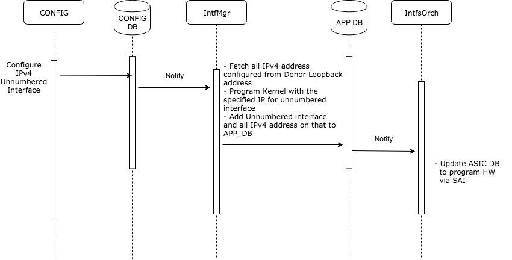
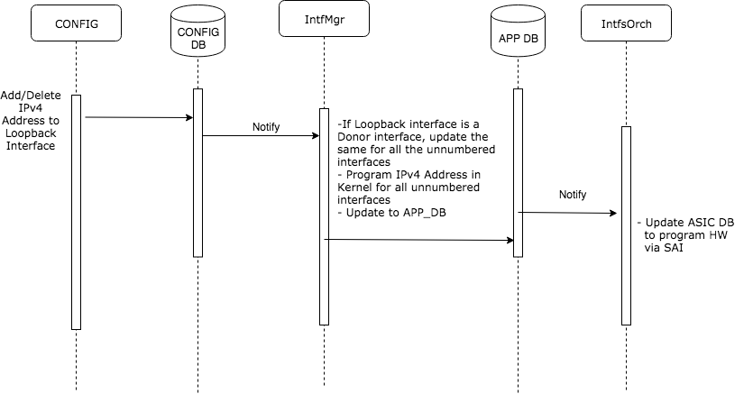
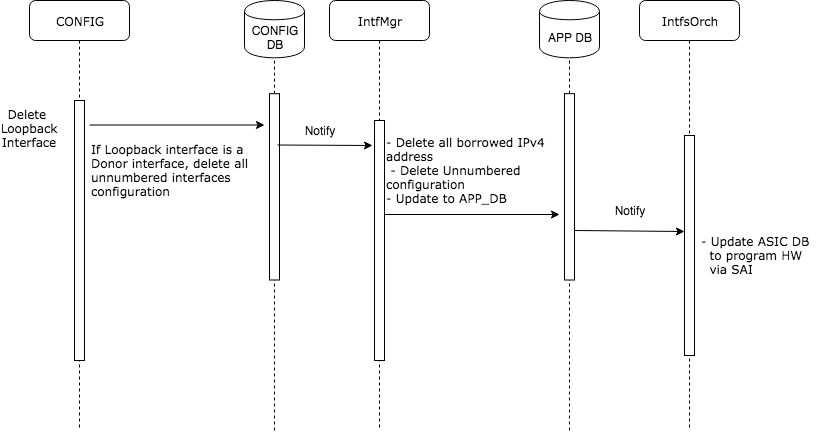

# Feature Name

## IPv4 Unnumbered Interfaces

# High Level Design Document

## Rev 0.3

[TOC]

# List of Tables
[Table 1: Abbreviations](#Table 1: Abbreviations)

# Revision

| Rev  | Date       | Author               | Change Description                     |
| ---- | ---------- | -------------------- | -------------------------------------- |
| 0.1  | 10/16/2019 | Praveen HM           | Initial version                        |
| 0.2  | 10/25/2019 | Praveen HM           | Updated after Internal review comments |
| 0.3  | 11/5/2019  | Laveen Thamilchelvam | Updated OA/SAI sections                |


# About this Manual
This document provides general information about the IPv4 Unnumbered interfaces feature implementation in SONiC.
# Scope
Currently SONiC supports only IPv4 numbered interface where each interface is assigned IP address from a unique subnet. This means a router cannot have overlapping connected routes. Typically to enable L3 over directly connected routers an IP address has to be assigned to both the routers, connected to same interface, belonging to the same subnet. Thus total number of IP addresses used depends on number of L3 interfaces supported by the router. With large number of L3 interface this scheme results in wastage of IP addresses and network subnets. With /31 support consumption of addresses  can be reduced but nevertheless two IP addresses are consumed per interface. To reduce network and address space consumption for supporting L3 over router interfaces unnumbered interfaces can be used.

This document describes the high level design of IPv4 Unnumbered Interfaces feature. 

# Definition/Abbreviation
## Table 1: Abbreviations
| **Term** | **Meaning**                    |
| -------- | ------------------------------ |
| ARP | Address Resolution Protocol |
|  BGP              | Border Gateway Protocol      |
|  ECMP     | Equal Cost Multi Path.                 |
|  IGP               | Interior Gateway Protocol           |
| OSPF     | Open Shortest Path First       |
| VRF      | Virtual Routing and Forwarding |


# 1 Requirement Overview
## 1.1 Functional Requirements


 1. Support IPv4 Unnumbered interface borrowing IPv4 addresses from a Donor interface
  2. Support only Loopback interface as Donor interface with /32 prefix
  3. Support IPv4 Unnumbered interface only on Physical and PortChannel interfaces
  4. Support IPv4 Unnumbered interface only for default VRF
  5. Support static routes over IPv4 Unnumbered interface
  6. Support OSPFv2 over IPv4 Unnumbered interface
   7. Support multiple IPv4 address on Donor interface and borrow all to IPv4 Unnumbered interface
   8. Support only single Donor for IPv4 Unnumbered interface
   9. Support ECMP for a single Donor interface providing IP address to multiple unnumbered interfaces
   10. Support IPv4 Unnumbered interface on breakout ports
   11. IPv4 Unnumbered interfaces would work only for point-to-point links
    12. Support L3 protocols over IPv4 Unnumbered interface


## 1.2 Configuration and Management Requirements
This feature will support IS-CLI and REST/gNMI based configurations.
 1. Support CLI configurations as mentioned in section 3.6.2
 2. Support show commands as mentioned in section 3.6.3

## 1.3 Scalability Requirements
None

## 1.4 Warm Boot Requirements

No explicit changes will be made for warm boot support. Existing functionality should continue to work.


# 2 Functionality

## 2.1 Functional Description
Unnumbered interface enables L3 processing on a point to point interface without explicitly configuring a unique IP address on it. IPv4 Unnumbered interface borrows IPv4 address from another L3 interface already configured on the router. This address is used as a source address in the L3 packets that are sent out of the unnumbered interface. The interface from which IPv4 address is borrowed is referred as *‘Donor’* interface and with this feature support, only Loopback interface is supported as Donor interface.

In the below network diagram


Ethernet0 and Ethernet1 are IPv4 unnumbered interfaces which borrow the IPv4 address from the corresponding Loopback1 and Loopback2 interfaces.

The IPv4 address borrowed from Donor interface will be programmed in the Linux Kernel for the interface configured as unnumbered. Linux IP stack supports ARP resolution for IPv4 Unnumbered interfaces and resolves ARP automatically when it sees routes with interface as the nexthop.

The routes over unnumbered interface could be configured static or dynamic with OSPFv2 routing protocol.

OSPF has to be configured on IPv4 unnumbered interface as point-to-point link. This way, OSPF detects neighbor and installs all routes learnt from neighbor to Zebra. Zebra has support to install routes with nexthop as interface to the RIB.

Sample configuration is provided to configure OSPF over IPv4 unnumbered interface. In this example, configuration is through vtysh.

```
Router A:
---------
router ospf
 ospf router-id 1.1.1.1
 network 1.1.1.1/32 area 0
!

interface Ethernet0
 ip ospf network point-to-point
 
Router B:
---------
router ospf
 ospf router-id 3.3.3.3
 network 3.3.3.3/32 area 0
!

interface Ethernet0
 ip ospf network point-to-point
```


# 3 Design
## 3.1 Overview

When an interface is configured as IPv4 unnumbered, the CONFIG_DB for that interface is updated with the Donor Loopback interface. Refer section 3.6.2 the config commands.

Interface Manager listens to this update and if an unnumbered interface is configured, then Interface Manager fetches all the IPv4 addresses from the Donor interface and programs these IPv4 address with network mask to the Kernel. Also Interface manager updates APP_DB to notify Orchestration agent for Hardware programming. 

## 3.2 DB Changes
This section describes the changes made to different DBs for supporting IPv4 Unnumbered interfaces.
### 3.2.1 CONFIG DB
Existing INTERFACE and PORTCHANNEL_INTERFACE table will be modified to add a new field

**INTERFACE**

    key             = INTERFACE|ifname   ; ifname
    unnumbered      = ifname             ; Donor ifname; if set, this is unnumbered interface

**PORTCHANNEL_INTERFACE**

    key             = PORTCHANNEL_INTERFACE|ifname   ; ifname
    unnumbered      = ifname                         ; Donor ifname; if set, this is unnumbered 
                                                     ; interface

### 3.2.2 APP DB

Existing INTF_TABLE will be modified to add a new field

**INTF_TABLE**

```
key             = INTF_TABLE:ifname  ; ifname
unnumbered      = ifname             ; Donor ifname; if set, this is unnumbered interface
```


## 3.3 Switch State Service Design
### 3.3.1 Orchestration Agent

 * Interface Orch:

   Unnumbered Interface:

   An Interface is identified as unnumbered interface if its corresponding Interface table entry has an unnumbered field with a valid interface name.

   Donor Interface:

   If any Interface table entry has this interface as its value corresponding to unnumbered field, then this interface is a Donor interface. Based on the APP_DB notifications corresponding operations are performed as illustrated in the table below:

   | APP_DB Notification                         | Operation | Donor Interface                                              | Unnumbered Interface                                         |
   | ------------------------------------------- | --------- | ------------------------------------------------------------ | ------------------------------------------------------------ |
   | APP_DB interface table entry without prefix | Add       | Same as existing Interface table add                         | Separate router interface will be created/deleted for every IP unnumbered interface. |
   |                                             | Del       | Check if all its unnumbered interfaces are deleted; if not retry | Same as existing Interface table del                         |
   | APP_DB interface table entry with IP prefix | Add       | For a given IP address configuration on  interface, there will be only one IP2ME route programmed in SAI for all its unnumbered interface | IP2ME route will not be programmed(add/del) if the interface is an unnumbered interface |

   VRF:
   Both Unnumbered intf and its corresponding Donor intf should be in same VRF.

* Route Orch:

   Subnet route of an unnumbered interface will not be programmed in SAI as the same subnet route of corresponding Donor interface would already be programmed.

   If a Donor interface has more than one subnet configured then the last subnet route will not be deleted unless all its corresponding unnumbered interfaces are deleted.

* Neighbor Orch:

   With IP unnumbered there can be more than one neighbor for a given IP address but with different outgoing interface. For these entries NeighOrch will not program the neighbor but will create nexthop. SAI_NEIGHBOR_ENTRY_ATTR_NO_HOST_ROUTE attribute will be used to indicate SAI to program only the nexthop.

   If there are more than one neighbor with the same IP in a VRF then it should be treated as ECMP. For ECMP, fpmsyncd should program corresponding route with all nexthop IP and interface.

## 3.5 SAI
SAI should support SAI_NEIGHBOR_ENTRY_ATTR_NO_HOST_ROUTE attribute.

SAI will be unaware of IP unnumbered behavior as it only traps packets based on Donor interface IP2ME/Subnet route. Once the packets are delivered to host interface, Linux kernel will be able to recognize and handle them in IP stack. 

## 3.6 CLI
### 3.6.1 Data Models
IPv4 unnumbered is already defined and supported in Openconfig IP/interface yang model.

https://github.com/openconfig/public/blob/master/release/models/interfaces/openconfig-if-ip.yang

### 3.6.2 Configuration Commands

A new Industry Standard CLI is defined under interface mode to configure IPv4 unnumbered interface. 

**[no] ip unnumbered <interface_name>**

interface_name is the Donor interface name from which IPv4 address will be borrowed.

'no' form of the command is used to delete IPv4 unnumbered configuration

Eg:

```
sonic(config)# interface Ethernet 0
sonic(conf-if-Ethernet0)# ip unnumbered Loopback1
sonic#
```

### 3.6.3 Show Commands

Existing "show ip interface" command will be modified to add another Flags column to display whether an interface is Unnumbered or not

- show ip interface

``` 
sonic# show ip interface
Flags: U-Unnumbered interface
Interface    IPv4 address/mask    Master    Admin/Oper    Flags
-----------  -------------------  --------  ------------  -----
Ethernet0    3.3.3.3/32                     up/up         U
Loopback1    3.3.3.3/32                     up/up
docker0      240.127.1.1/24                 up/down
eth0         10.59.135.70/20                up/up
lo           127.0.0.1/8                    up/up
sonic#
```

# 4 Flow Diagrams

## 4.1 Configure IPv4 Unnumbered interface



## 4.2 Update (Add/Delete) Loopback IPv4 address 


## 4.3 Delete Loopback interface


# 5 Serviceability and Debug

No new debug commands or logs are added as part of this feature. All existing debug commands/logs for IP and OSPF should be used.

# 6 Warm Boot Support
Warm boot is supported

# 7 Scalability
# 8 Unit Test

CLI:
1) Verify CLI to configure IPv4 unnumbered interface
2) Verify CONFIG_DB is populated with correct values
3) Verify CLI to show IPv4 unnumbered interfaces
4) Verify config save and config reload with IPv4 unnumbered interfaces configured

Functionality:
1) Verify IPv4 address is borrowed from the Donor Loopback interface
2) Verify IPv4 borrowed address is programmed in the Linux Kernel for the unnumbered interface
3) Verify APP_DB is populated with correct values
4) Verify RIF is programmed into Hardware
5) Verify adding Static route over IPv4 unnumbered interface
6) Verify ping works fine for unnumbered interface after Static route addition
7) Verify ARP is resolved for unnumbered interface
8) Verify OSPF neighborship over IPv4 unnumbered interface
9) Verify routes learnt from OSPF over unnumbered interface is programmed in Kernel and Hardware 
10) Verify configuring unnumbered interfaces for PortChannel interface
11) Verify configuring unnumbered interfaces for breakout port
12) Verify all multiple IPv4 address configured on Donor interface is borrowed to unnumbered interface
13) Verify adding/deleting IPv4 address to Donor interface reflects the same to unnumbered interface 
14) Verify ECMP over unnumbered interfaces
15) Verify traffic forwarding over unnumbered interfaces
16) Verify warmboot with unnumbered interfaces
17) Verify fastboot with unnumbered interfaces
18) Verify IPv4 unnumbered interfaces are programmed correctly after DUT reload
19) Verify deleting Donor interface cleans up all IP address and routes on unnumbered interface
20) Verify deleting Donor interface cleans up all CONFIG_DB and APP_DB 
21) Verify deleting Donor interface cleans up all RIF and Hardware programming
22) Verify BGP, BFD protocols over IPv4 unnumbered interfaces
23) Verify Donor loopback interface if binded to non default VRF, deletes all IP unnumbered configurations
24) Verify IPv4 unnumbered interface if binded to non default VRF, deletes all IP unnumbered configurations
25) Verify IPv6 address is not borrowed from the Donor interface
26) Verify IPv6 address can be configured on IPv4 unnumbered interface

Negative cases:
1) Verify invalid Donor interface cannot be configured for IPv4 unnumbered interface
2) Verify loopback interface binded to non default VRF cannot be used as Donor interface
3) Verify VLAN and Loopback interface cannot be configured as IPv4 unnumbered interface
4) Verify shutting down Donor interface will have no impact to IPv4 unnumbered interface
5) Verify IPv4 address cannot be added/deleted to IPv4 unnumbered interface
6) Verify IPv4 unnumbered configuration fails on interface already configured with an IPv4 address
7) Verify an IPv4 unnumbered interface cannot have multiple Donors

REST:
1) Verify all REST commands