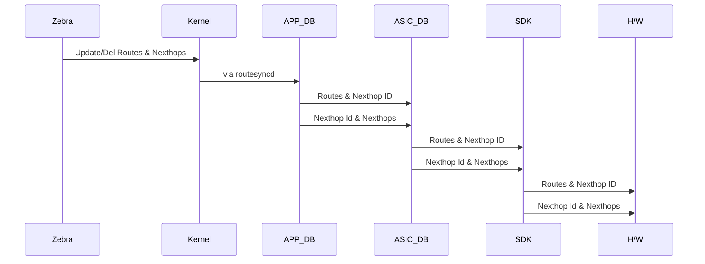

# Route Consistency Checker

#### Rev 0.1


# List of Tables

[Table 1: Abbreviations](#table-1-abbreviations)

# Revision

| Rev  |    Date    |        Author        | Change Description |
| :--: | :--------: | :------------------: | :----------------: |
| 0.1  | 04/27/2021 | Vijay Kumar Vasantha |  Initial version   |
| 0.2  | 05/12/2021 | Sayed Mohd Saquib    |  Added Config sec  |
| 0.3  | 05/12/2021 | Vijay Kumar Vasantha |  Added Design sec  |
| 0.4  | 08/06/2021 | Vijay Kumar Vasantha |  Added DB checks   |

# Definition/Abbreviation

### Table 1: Abbreviations

| **Term** | **Meaning**                    |
| -------- | ------------------------------ |
| ARP      | Address Resolution Protocol    |
| CLI      | Command Line Interface         |
| IP       | Internet Protocol              |
| LAG      | Link Aggregation Group         |
| LAN      | Local Area Network             |
| MAC      | Media Access Control addresses |
| VLAN     | Virtual Local Area Network     |
| VRF      | Virtual Routing and Forwarding |

# About this Manual

This document provides general overview of Route Consistency Checker (RCC). Route checker aims at checking the consistency of routes & nexthops between the source RIB and the all of destinations viz., kernel, APP_DB, ASIC_DB, hardware.


# 1 Introduction and Scope

This document describes the Functionality and High level design of the Route Consistency Checker(RCC).

In SONiC the routing module, which is the source of routes, resides in BGP docker. BGP docker in turn runs FRR daemon to compute & update routes & nexthops. FRR generated routes passes through multiple modules before it is being programmed in kernel & hardware. The routes & nexthops are stored in each of these intermediate module and passed to next module in pipeline through APP_DB & ASIC_DB redis tables. Below flow depicts the stages in route propagation from software to hardware.





The RCC is designed to detect in-consistency of the routes & nexthop from Zebra to all of these destinations,

- Kernel
- APP_DB
- ASIC_DB
- SAI


# 2 Feature Requirements

The Route Consistency Checker feature enables the user to check the consistency of routes & nexthop. It checks whether the route & nexthop in Zebra is consistent with route & nexthop Kernel, APP_DB, ASIC_DB & SAI. Any discrepancy in the routes & nexthop will be detected and displayed to user. User will be given option to start & stop the route consistency checker. 

For Route Consistency Checker the source of truth will be Zebra routing table. 

## 2.1 Functional Requirements

Route Consistency Checker will,

- Route consistency will enable user to check route consistency for a given VRF
- Route consistency will enable user to check route consistency for a address-family
- Route consistency will validate NextHops. It will check the associated egress interface and ARP/neighbor entries
- Route consistency will validate ECMP NextHops. It will check the associated egress interface and ARP/neighbor entries
- Route consistency will validate Tunnel NextHops. It will check the associated egress interface and ARP/neighbor entries for only the overlay nexthops
- Route consistency checker can be started by user and it will run in background
- Route consistency checker will dump inconsistent routes that can be viewed by an user CLI.
- As the route consistency checker is a CPU intensive operation, only one instance of checker can be active at any moment

## 2.2 Configuration and Management Requirements

This feature will support configuration and display CLIs, RESTConf, gNMI to control, monitor and rectify route consistency checker
As this is debuggability/reliability feature, this will not require any configurations to be done. Only operational commands need to be provided.

- Support start/stop of RCC
- Support configuration of RCC per VRF per address-family
- Support configuration to notify user of inconsistent routes & nexthops
- Support display to list the result of RCC
   

## 2.3 Scalability Requirements

RCC will be supported at maximum route and nexthop scale, below indicates maximum scale numbers
- Max number of Routes: 128k
- Max number of Nexthops: 4k
- Max number of ARP entries - 32k

Note that it is not recomended to run the RCC at high frequecy when the system is in scale and when the routes are volatile.

## 2.4 Warm Boot Requirements

route consistency checker will need to be stopped before warm-boot, fast-reboot, reboot etc. 
This is to ensure that route-consistency checker is not triggered when the system is volatile, thus avoiding adverse effects.

# 3 Feature Description

The following are the types of consistency checking run

## 3.1 Functional Description

### **Route discrepancy**

- **Data: Routes**

- **Source/Destination: Zebra/Hardware**

- **Detection:**
  - Scan the routes in SAI route table
  - Scan the routes in FRR by redirecting the output of "show ip route"
  - Compare the files generated to see any discrepancy in routes alone

- **In-consistency:**
  - **Zebra has more routes** 
  - **Action:**
    - The inconsistency is logged into a file/database.
  - **SAI has more routes**
  - **Action:**
    - The inconsistency is logged into a file/database.


Note:

- Newly added routes will be skipped from scanned output and it is determined from the 'uptime' of routes in zebra.
- Newly deleted routes will be skipped from scanned output. To determine that the route is newly deleted, either the deleted routes could be temporarily stored in a DB by module like RouteSyncd or the snapshot of software routes could be taken prior to snapshot of hardware routes with delay added that could account for route propagation from software to hardware. In addition to delay in taking the snapshot of routes, a watch list with multiple checkings could be carried out in RCC. To reduce the memory consumed, the latter approach where the delayed snapshots & repeated checking will be employed.

## 


- **Data: Routes**, **Nexthop**

- **Source/Destination: Zebra/Kernel**

- **Detection:**
  - Scan the routes in FRR by redirecting the output of "show ip route"
  - Scan the routes in kernel by redirecting the output of "ip route show" or use netlink socket to get route dump
  - Compare the files generated to see any discrepancy in routes alone

- **In-consistency:**
  - **Zebra has more routes** 
  - **Action:**
    - The inconsistency is logged into a file/database.
  - **Kernel has more routes**
  - **Action:**
    - The inconsistency is logged into a file/database.


- **Data: Routes**, **Nexthop**

- **Source/Destination: Zebra/APP-DB & ASIC-DB**

- **Detection:**
  - Scan the routes in FRR by redirecting the output of "show ip route"
  - Scan the routes in APP_DB by reading the content of ROUTE_TABLE & NEIGHBOR_TABLE
  - Scan the routes in ASIC_DB by reading the content of SAI_OBJECT_TYPE_ROUTE_ENTRY & SAI_OBJECT_TYPE_NEIGHBOR_ENTRY
  - For each route compare the nexthops

- **In-consistency:**
  - **Zebra has more routes** 
  - **Action:**
    - The inconsistency is logged into a file/database.
  - **DB has more routes**
  - **Action:**
    - The inconsistency is logged into a file/database.
  - **Routes nexthop does not match**
  - **Action:**
    - The inconsistency is logged into a file/database.


### **Route, Number of nexthops discrepancy because of limit **

Routes or number of nexthops hitting the limit in hardware/kernel will be treated as an issue. 


### **Route's nexthop discrepancy**

- **Data: Routes and Nexthops**''

- **Source/Destination: Zebra, ASIC-DB, SAI**

- **Detection:**
  - Scan the routes and nexthops in FRR by redirecting the output of "show ip route" and "show ip arp/nd", by doing so for each Route: <RIF, Nexthop IP, Dest MAC> could be mapped. 
  - Scan the routes in SAI by fetching SAI tables for Route, Nexthop, Nexthop Group, RIF, Neighbor etc.
  - Scan the below table in ASIC-DB, by doing so for each routeRoute: <RIF, Nexthop IP, Dest MAC> could be mapped, scanning ASIC-DB gives the interface-name for the nexthops.
    - Route Table
    - Nexthop Table 
    - ECMP Group Mapping Index
    - Neighbor Table
  - Compare each route reachability information, 
    - Log the discrepancy into a file or DB.

Note:

- This handles the case of inconsistent reachability information for both ECMP and non-ECMP case between S/W & H/W  and missing reachability information in H/W.

- **Source/Destination: Zebra,ASIC-DB/SAI**

- **Detection:**
  - Scan the routes and nexthops in FRR by redirecting the output of "show ip route" and "show ip arp/nd", by doing so for each Route: <RIF, Nexthop IP, Dest MAC> could be mapped. 
  - Scan the routes in kernel by redirecting the output of "ip route show" and "ip neighbor show", by doing so for each Route: <RIF, Nexthop IP, Dest MAC> could be mapped in kernel.
  - Compare each route reachability information, 
    - Log the discrepancy into a file or DB.

Note:

- This handles the case of inconsistent reachability information for both ECMP and non-ECMP case between Zebra & Kernel and missing reachability information in Kernel.


### Non-ECMP nexthops discrepancy

The below diagram depicts the usage of non-ecmp nexthops in hardware

https://docs.google.com/document/d/1O10j_YP9vn-MD46wP78dC_aqD34E_N7yi9O59d-98-s/edit

As depicted in the non-ecmp nexthops consists of below types of nexthops,

- Routes non-ecmp nexthops - Software aware

- ECMP members nexthops - Software aware

- Tunnel members level-2 underlay nexthops - Not software aware

- Internal nexthops & other module created nexthops - Not software aware

  

The software non-aware tunnel underlay nexthops and internal nexthops will not have reference count associated with it. So it is not feasible to detect and remove the additional nexthop entries in H/W (SAI).

The case of nexthop present in orch agent but nexthop not present in H/W will be handled in Route's nexthop discrepancy sec.

### ECMP nexthops discrepancy

The below diagram depicts the usage of ecmp nexthops in hardware


As depicted in the ecmp nexthops consists of below types of nexthops,

- Tunnel overlay ECMP group  - Software aware
- ECMP members nexthops - Software aware
- Tunnel underlay ECMP group and other internal ECMP group - Not software aware


The software non-aware tunnel underlay ECMP nexthops  will not have reference count associated with it. So it is not feasible to detect and remove the additional ECMP nexthop entries in H/W..

The case of ECMP nexthop present in orch agent but nexthop not present in H/W will be handled in Route's nexthop discrepancy sec.


Below table describes the summary of discrepancy and its action


| Src                              | Dst                               | Action                                                       |
| -------------------------------- | --------------------------------- | ------------------------------------------------------------ |
| Route in s/w                     | Route **not** in h/w              | Discrepancy is logged to a file                                |
| Route **not** in s/w             | Route in SAI                      | Discrepancy is logged to a file                           |
| Route & nexthop in s/w           | Route & nexthop **not** in kernel | Discrepancy is logged to a file                                                |
| Route & nexthop **not** in s/w   | Route & nexthop in kernel         | Discrepancy is logged to a file                                           |
| Nexthop in s/w                   | Nexthop **not** in SAI            | Discrepancy is logged to a file                                      |
| Nexthop **not** in s/w           | Nexthop in SAI                    | Discrepancy is logged to a file   |
| ECMP in s/w                      | ECMP **not** in SAI               | Discrepancy is logged to a file                                        |
| ECMP **not** in s/w              | ECMP in SAI                       | Discrepancy is logged to a file   |
| Routes nexthop is not consistent | Routes nexthop is not consistent  | Discrepancy is logged to a file                                  |


# 4 Feature Design

## 4.1 Design Overview

### 4.1.1 Basic Approach

Route Consistency Checker (Rccd) will be a new deamon running on host. Rccd will interact with Zebra, Kernel, SDK, Config-DB, ASIC-DB for its working.

Upon user trigger RCC will start the route scan, RCC will get the dump of routes from Zebra by issuing 'show' commands to FRR through a socket.
The above obtained output (routes, interface, nexthop, neighbor) from FRR will be redirected to a file.

Similarly RCC will get the output of routes, interface, neighbors from kernel by issuing 'ip show' from terminal and redirect the output to a file. RCC will dump the route, nexthop and neighbor tables from APP_DB and ASIC_DB, it will also get the output of hardware routes, nexthops, neighbors by issuing bcmsh commands and it will redirect the output to a file.

Once the information from Zebra, Kernel, APP_DB, ASIC_DB and H/W is present, RCC will flatten the routes and check for inconsistency.

Any inconsistency detected will be logged, depending upon user config the inconsistency will be tried to be resolved.


## 4.2 DB Changes

No DB changes are needed


## 5 CLI

### 5.1 Configuration Commands

There are no configuration command for this feature

### 5.2 Operational Commands

```

Command to trigger: consistency-check start route [[vrf Vrf1] [ address-family {ipv4|ipv6} ]] 
Command to abort: consistency-check stop route

```

#### Example1: Start consistency-checker for routes in all vrfs and both IPv4 & IPv6 address family
This will start the consistency checker routine for IPv4 & IPv6 routes in all VRFs.     
```
sonic# consistency-check start route
```

#### Example1: Start consistency-checker for routes in specific vrf and address-family
This will start the consistency checker routine for IPv4 routes in vrf default .     
```
sonic# consistency-check start route vrf default address-family ipv4
```

#### Example2: Start consistency-checker for routes in specific vrf and address-family
This will start the consistency checker routine for IPv6 routes in vrf default .     
```
sonic# consistency-check start route vrf default address-family ipv6
```


#### Example3: Start consistency-checker for routes in specific vrf and address-family
This will start the consistency checker routine for IPv4 routes in vrf Vrf1 .     
```
sonic# consistency-check start route vrf Vrf1 address-family ipv4
```

#### Example4: Stop consistency-checker for route
This will display the current status and terminate the consistency checker routine for routes.
```
sonic# consistency-check stop route
```

### 5.3 Show Commands

The following show command will be provided

```
show consistency-check status route
```
#### Example1: Display status of consistency-check 
sonic# show consistency-check status
```
sonic# show consistency-check status 
-------------------------------------------------------------
Feature              Consistency-status
-------------------------------------------------------------
Access-list          Consistent
Route                Consistent

```
show consistency-check status route
```
#### Example2: Display status of consistency-check for all VRFs
sonic# show consistency-check status route
```
```
Last Route consistency check ran at 12/02/2021, 20:13:11(UTC) took 3.01 seconds
Final Route consistency check status: Consistent
  Route check for vrf default and address-family ipv4:
    rib_vs_appdb: Consistent
    rib_vs_asicdb: Consistent
    rib_vs_fib: Consistent
    rib_vs_sai: Consistent
  Route check for vrf default and address-family ipv6:
    rib_vs_appdb: Consistent
    rib_vs_asicdb: Consistent
    rib_vs_fib: Consistent
    rib_vs_sai: Consistent
  Route check for vrf Vrf1 and address-family ipv4:
    rib_vs_appdb: Consistent
    rib_vs_asicdb: Consistent
    rib_vs_fib: Consistent
    rib_vs_sai: Consistent
  Route check for vrf Vrf1 and address-family ipv6:
    rib_vs_appdb: Consistent
    rib_vs_asicdb: Consistent
    rib_vs_fib: Consistent
    rib_vs_sai: Consistent    
  
```

```
#### Example3: Display status of consistency-check in detail
```
		      		       
sonic# show consistency-check status route
 Last Route consistency check ran at 12/02/2021, 05:13:14(UTC) took 39.09 seconds
 Final Route consistency check status: Inconsistent
   Route check for vrf default and address-family ipv4:
     rib_vs_appdb: Inconsistent
       Prefixes in rib not available in appdb:
         121.1.1.0/24
     rib_vs_asicdb: Inconsistent
       Prefixes in rib not available in asicdb:
         121.1.1.0/24
     rib_vs_fib: Consistent
     rib_vs_sai: Inconsistent
       Prefixes in rib not available in sai:
         121.1.1.0/24
   Route check for vrf default and address-family ipv6:
     rib_vs_appdb: Inconsistent
       Prefixes in rib not available in appdb:
         121::0/64
     rib_vs_asicdb: Inconsistent
       Prefixes in rib not available in appdb:
         121::0/64     
     rib_vs_fib: Consistent
     rib_vs_sai: Inconsistent
        Prefixes in rib not available in appdb:
         121::0/64 
```

```
 #### Example4: Display status of consistency-check in detail
```
sonic# show consistency-check status route
Last Route consistency check ran at 12/02/2021, 20:13:11(UTC) took 3.01 seconds
Final Route consistency check status: Inconsistent
  Route check for vrf default and address-family ipv4:
    rib_vs_appdb: Consistent
    rib_vs_asicdb: Consistent
    rib_vs_fib: Consistent
    rib_vs_sai: Consistent
  Route check for vrf default and address-family ipv6:
    rib_vs_appdb: Consistent
    rib_vs_asicdb: Consistent
    rib_vs_fib: Consistent
    rib_vs_sai: Consistent
  Route check for vrf Vrf1 and address-family ipv4:
    rib_vs_appdb: Consistent
    rib_vs_asicdb: Consistent
    rib_vs_fib: Consistent
    rib_vs_sai: Inconsistent
      Unequal prefixes:        
	99.0.0.1/32 - NHop(s) do not match:
          rib:1
            (Ethernet64, 64.0.0.2, 80:a2:35:26:45:61)
          sai:1
            (Ethernet68, 68.0.0.2, 80:a2:35:26:45:61)
  Route check for vrf Vrf1 and address-family ipv6:
    rib_vs_appdb: Consistent
    rib_vs_asicdb: Consistent
    rib_vs_fib: Consistent
    rib_vs_sai: Inconsistent  
      Unequal prefixes:        
	99::1/128 - NHop(s) do not match:
          rib:1
            (Ethernet64, 64::2, 80:a2:35:26:45:61)
          sai:1
            (Ethernet68, 68::2, 80:a2:35:26:45:61)    
```
 
```
#### Example6: Display status of consistency-check in detail
```
		      		       
sonic# show consistency-check status route
 Last Route consistency check ran at 12/02/2021, 05:13:14(UTC) took 39.09 seconds
 Final Route consistency check status: Inconsistent
   Route check for vrf default and address-family ipv4:
     rib_vs_appdb: Inconsistent
       Prefixes in appdb not available in rib:
        200.0.0.1/32
     rib_vs_asicdb: Inconsistent
       Prefixes in asicdb not available in rib:
        200.0.0.1/32
     rib_vs_fib: Consistent
     rib_vs_sai: Inconsistent
      Prefixes in sai not available in rib:
        200.0.0.1/32
   Route check for vrf default and address-family ipv6:
     rib_vs_appdb: Inconsistent
       Prefixes in appdb not available in rib:
        200::1/128
     rib_vs_asicdb: Inconsistent
       Prefixes in asicdb not available in rib:
        200::1/128   
     rib_vs_fib: Consistent
     rib_vs_sai: Inconsistent
       Prefixes in sai not available in rib:
        200::1/128
```

## 6 Serviceability and Debug

The existing logging mechanisms shall be used. Proposed debug framework shall be used for internal state dump.


## 7 Unit Test cases
- IPv4 connected routes in default VRF on Ethernet, Vlan, PortChannel, Eth subif, Po subif, Loopback, check consistency - Pass
- IPv6 connected routes in default VRF on Ethernet, Vlan, PortChannel, Eth subif, Po subif, Loopback, check consistency - Pass
- IPv4 connected routes in default VRF on Ethernet, Vlan, PortChannel, Eth subif, Po subif, Loopback, modify prefix, nexthop in APPDB, detect inconsistency - Pass
- IPv4 connected routes in default VRF on Ethernet, Vlan, PortChannel, Eth subif, Po subif, Loopback, modify prefix, nexthop in ASICDB, detect inconsistency - Pass
- IPv6 connected routes in default VRF on Ethernet, Vlan, PortChannel, Eth subif, Po subif, Loopback, modify prefix, nexthop in APPDB, detect inconsistency - Pass
- IPv6 connected routes in default VRF on Ethernet, Vlan, PortChannel, Eth subif, Po subif, Loopback, modify prefix, nexthop in ASICDB, detect inconsistency - Pass
- IPv4 connected routes in non-default VRF on Ethernet, Vlan, PortChannel, Eth subif, Po subif, Loopback, check consistency - Pass
- IPv6 connected routes in non-default VRF on Ethernet, Vlan, PortChannel, Eth subif, Po subif, Loopback, check consistency - Pass
- IPv4 connected routes in non-default VRF on Ethernet, Vlan, PortChannel, Eth subif, Po subif, Loopback, modify prefix, nexthop in APPDB, detect inconsistency - Pass
- IPv4 connected routes in non-default VRF on Ethernet, Vlan, PortChannel, Eth subif, Po subif, Loopback, modify prefix, nexthop in ASICDB, detect inconsistency - Pass
- IPv6 connected routes in non-default VRF on Ethernet, Vlan, PortChannel, Eth subif, Po subif, Loopback, modify prefix, nexthop in APPDB, detect inconsistency - Pass
- IPv6 connected routes in non-default VRF on Ethernet, Vlan, PortChannel, Eth subif, Po subif, Loopback, modify prefix, nexthop in ASICDB, detect inconsistency - Pass
- IPv4 static routes in default VRF, check consistency - Pass
- IPv6 static routes in default VRF, check consistency - Pass
- IPv4 static routes in non-default VRF, check consistency - Pass
- IPv6 static routes in non-default VRF, check consistency - Pass
- Learnt IPv4 routes in default VRF with nexthop as Ethernet, Vlan, PortChannel, Eth subif, Po subif, vxlan tunnel, check consistency - Pass
- Learnt IPv4 routes in default VRF with nexthop as Ethernet, Vlan, PortChannel, Eth subif, Po subif, vxlan tunnel, create inconsistency of route, nexthop, nbr, detect inconsistency - Pass
- Learnt IPv4 routes in non-default VRF with nexthop as Ethernet, Vlan, PortChannel, Eth subif, Po subif, vxlan tunnel, check consistency - Pass
- Learnt IPv4 routes in non-default VRF with nexthop as Ethernet, Vlan, PortChannel, Eth subif, Po subif, vxlan tunnel, create inconsistency of route, nexthop, nbr, detect inconsistency - Pass
- Learnt IPv4 routes in default VRF with ECMP nexthop as Ethernet, Vlan, PortChannel, Eth subif, Po subif, vxlan tunnel, check consistency - Pass
- Learnt IPv4 routes in non-default VRF with ECMP nexthop as Ethernet, Vlan, PortChannel, Eth subif, Po subif, vxlan tunnel, create inconsistency of route, nexthop, nbr, detect inconsistency - Pass
- Learnt IPv6 routes in default VRF with nexthop as Ethernet, Vlan, PortChannel, Eth subif, Po subif, vxlan tunnel, check consistency - Pass
- Learnt IPv6 routes in default VRF with nexthop as Ethernet, Vlan, PortChannel, Eth subif, Po subif, vxlan tunnel, create inconsistency of route, nexthop, nbr, detect inconsistency - Pass
- Learnt IPv6 routes in non-default VRF with nexthop as Ethernet, Vlan, PortChannel, Eth subif, Po subif, vxlan tunnel, check consistency - Pass
- Learnt IPv6 routes in non-default VRF with nexthop as Ethernet, Vlan, PortChannel, Eth subif, Po subif, vxlan tunnel, create inconsistency of route, nexthop, nbr, detect inconsistency - Pass
- Learnt IPv6 routes in default VRF with ECMP nexthop as Ethernet, Vlan, PortChannel, Eth subif, Po subif, vxlan tunnel, check consistency - Pass
- Learnt IPv6 routes in non-default VRF with ECMP nexthop as Ethernet, Vlan, PortChannel, Eth subif, Po subif, vxlan tunnel, create inconsistency of route, nexthop, nbr, detect inconsistency - Pass
- Scale IPv4 routes to 128k, check consistency - Pass
- Scale IPv4 routes to 128k, create inconsistency and detect inconsistency - Pass
- Scale IPv6 routes to 64k, check consistency - Pass
- Scale IPv6 routes to 64k, create inconsistency and detect inconsistency - Pass
- Scale IPv4 routes with 64 ECMP path, check consistency - Pass
- Scale IPv4 routes with 64 ECMP path, create and detect inconsistency - Pass
- Scale IPv6 routes with 64 ECMP path, check consistency - Pass
- Scale IPv6 routes with 64 ECMP path, create and detect inconsistency - Pass
