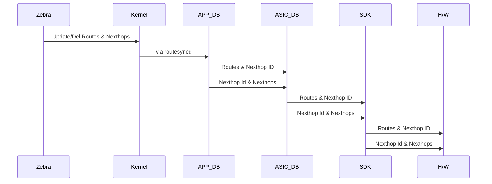

# Route Consistency Checker

#### Rev 0.1


# List of Tables

[Table 1: Abbreviations](#table-1-abbreviations)

# Revision

| Rev  |    Date    |        Author        | Change Description |
| :--: | :--------: | :------------------: | :----------------: |
| 0.1  | 04/27/2021 | Vijay Kumar Vasantha |  Initial version   |
| 0.2  | 05/12/2021 | Sayed Mohd Saquib    |  Added Config sec  |
| 0.3  | 05/12/2021 | Vijay Kumar Vasantha |  Added Design sec  |

# Definition/Abbreviation

### Table 1: Abbreviations

| **Term** | **Meaning**                    |
| -------- | ------------------------------ |
| ARP      | Address Resolution Protocol    |
| CLI      | Command Line Interface         |
| IP       | Internet Protocol              |
| LAG      | Link Aggregation Group         |
| LAN      | Local Area Network             |
| MAC      | Media Access Control addresses |
| VLAN     | Virtual Local Area Network     |
| VRF      | Virtual Routing and Forwarding |

# About this Manual

This document provides general overview of Route Consistency Checker (RCC). Route checker aims at checking the consistency of routes & nexthops between the source RIB and the destinations kernel & hardware.


# 1 Introduction and Scope

This document describes the Functionality and High level design of the Route Consistency Checker(RCC).

In SONiC the routing module, which is the source of routes, resides in BGP docker. BGP docker in turn runs FRR daemon to compute & update routes & nexthops. FRR generated routes passes through multiple modules before it is being programmed in kernel & hardware. The routes & nexthops are stored in each of these intermediate module and passed to next module in pipeline through various redis DB tables. Below flow depicts the stages in route propagation from software to hardware.





The RCC is designed to detect & rectify in-consistency of the routes & nexthop between the following source and destination pairs,

- Zebra to Kernel
- Zebra to H/W

Note that RCC does not try to detect & rectify any inconsistency between the intermediate modules/databases.

# 2 Feature Requirements

The Route Consistency Checker feature enables the user to check the consistency of routes & nexthop between Zebra & Hardware and Zebra & Kernel. Any discrepancy in the routes & nexthop will be detected and action to rectify the inconsistency will be taken. User will be given option to start & stop the route consistency checker. Once route consistency checker is started it will check & rectify discrepancy. 

For Route Consistency Checker the source of truth will be Zebra routing table. It would try to find & rectify any discrepancy between Zebra's route & nexthop and Hardware route & nexthop and between Zebra's route & nexthop and Kernel's route & nexthop.

## 2.1 Functional Requirements

Route Consistency Checker will,

- Route consistency will enable user to check route consistency for a given VRF
- Route consistency will enable user to check route consistency for a address-family
- Route consistency will validate NextHops. It will check the associated egress interface and ARP/neighbor entries
- Route consistency will validate ECMP NextHops. It will check the associated egress interface and ARP/neighbor entries
- Route consistency will validate Tunnel NextHops. It will check the associated egress interface and ARP/neighbor entries for only the overlay nexthops
- Route consistency checker can be started by user and it will run in background
- Route consistency checker will dump inconsistent routes into a file that can be viewed by an user CLI. The dumped file will have different table to rectified routes and non-rectified routes
- Route consistency checker will store all the previous outputs of inconsistency run in a file
- User will be given an option to correct the inconsistent routes across HW and SW (remedy)
- As the route consistency checker is a CPU intensive operation, only one instance of checker can be active at any moment

## 2.2 Configuration and Management Requirements

This feature will support configuration and display CLIs, RESTConf, gNMI to control, monitor and rectify route consistency checker
As this is debuggability/reliability feature, this will not require any configurations to be done. Only operational commands need to be provided.

- Support start/stop of RCC
- Support configuration of RCC per VRF per address-family
- Support configuration to notify user of inconsistent routes & nexthops
- Support configuration to enable/disable rectifying inconsistent routes & nexthops
- Support the threshold time period for making route as inconsistent
- Support the periodicity of RCC
- Support display to list the result of RCC
- Support the logging of actions taken for rectification
   

## 2.3 Scalability Requirements

RCC will be supported at maximum route and nexthop scale, below indicates maximum scale numbers
- Max number of Routes: 128k
- Max number of Nexthops: 4k
- Max number of ARP entries - 32k

Note that it is not recomended to run the RCC at high frequecy when the system is in scale and when the routes are volatile.

## 2.4 Warm Boot Requirements

route consistency checker will need to be stopped before warm-boot, fast-reboot, reboot etc. 
This is to ensure that route-consistency checker is not triggered when the system is volatile, thus avoiding adverse effects.

# 3 Feature Description

The following are the types of consistency checking run

## 3.1 Functional Description

### **Route discrepancy**

- **Data: Routes**

- **Source/Destination: Zebra/Hardware**

- **Detection:**
  - Scan the routes in hardware by redirecting "l3 defip show"
  - Scan the routes in FRR by redirecting the output of "show ip route"
  - Compare the files generated to see any discrepancy in routes alone

- **In-consistency:**
  - **Zebra has more routes** 
  - **Action:**
    - The inconsistency is logged into a file/database.
    - To resolve the inconsistency routes has to be deleted and re-added from FRR. This is achieved by issuing 'clear ip route <prefix>' command in FRR.
  - **Hardware has more routes**
  - **Action:**
    - The inconsistency is logged into a file/database.
    - To resolve the inconsistency routes has to be deleted from hardware. Add and Del a static route with NULL nexthop in Zebra.
      - Deling SDK routes 'l3 defip destory <ip>' deletes the route from H/W but could introduce inconsistency in SAI/SDK. Moreover the inconsistency start point could be anywhere after zebra. So to ensure that all the DBs and modules are consistent, add and del a static route with NULL nexthop in Zebra. The deletion of route will propagate and mostly delete the dangling route from Hardware.


Note:

- Routes missing from hardware in hardware route limit hit case will **not** be considered as discrepancy. The hardware limit is detected checking the bcmsh route limit output and checking the ERROR DB for 'missed to program in HW' routes.
- Newly added routes will be skipped from scanned output and it is determined from the 'uptime' of routes in zebra.
- Newly deleted routes will be skipped from scanned output. To determine that the route is newly deleted, either the deleted routes could be temporarily stored in a DB by module like RouteSyncd or the snapshot of software routes could be taken prior to snapshot of hardware routes with delay added that could account for route propagation from software to hardware. In addition to delay in taking the snapshot of routes, a watch list with multiple checkings could be carried out in RCC. To reduce the memory consumed, the latter approach where the delayed snapshots & repeated checking will be employed.

## 


- **Data: Routes**, **Nexthop**

- **Source/Destination: Zebra/Kernel**

- **Detection:**
  - Scan the routes in FRR by redirecting the output of "show ip route"
  - Scan the routes in kernel by redirecting the output of "ip route show" or use netlink socket to get route dump
  - Compare the files generated to see any discrepancy in routes alone

- **In-consistency:**
  - **Zebra has more routes** 
  - **Action:**
    - The inconsistency is logged into a file/database.
    - To resolve the inconsistency routes has to be deleted and re-added from FRR. This is achieved by issuing 'clear ip route <prefix>' command in FRR.
  - **Kernel has more routes**
  - **Action:**
    - The inconsistency is logged into a file/database.
    - To resolve the inconsistency routes has to be deleted from kernel. Add and Del a static route with NULL nexthop in Zebra.


### **Route, Number of nexthops discrepancy because of limit **

Routes or number of nexthops hitting the limit in hardware/kernel will not be treated as an issue and will be ignored. The limit is checked by issuing bcmsh command for route limit count and checking ERROR DB for 'missed to program in H/W' routes.


### **Route's nexthop discrepancy**

- **Data: Routes and Nexthops**''

- **Source/Destination: Zebra,ASIC-DB/Hardware**

- **Detection:**
  - Scan the routes and nexthops in FRR by redirecting the output of "show ip route" and "show ip arp/nd", by doing so for each Route: <RIF, Nexthop IP, Dest MAC> could be mapped. 
  - Scan the routes in hardware by redirecting below output to file, by doing so for each route Route: <RIF, Nexthop IP, Dest MAC> could be mapped.
    - "l3 defip show" - (Route: NexthopGroupID)
    - "l3 egress show" - (NexthopId: RIF, Dest Mac)
    - "l3 l3table show" - (NexthopId: NexthopIP)
    - "l3 ecmp egress show" - (NexthopGroupId: NexthopId)
  - Scan the below table in ASIC-DB, by doing so for each routeRoute: <RIF, Nexthop IP, Dest MAC> could be mapped, scanning ASIC-DB gives the interface-name for the nexthops.
    - Route Table
    - Nexthop Table 
    - ECMP Group Mapping Index
    - Neighbor Table
  - Compare each route reachability information, 
    - Log the discrepancy into a file or DB.
    - If there is any discrepancy in RIF, nexthop IP then indicate FRR to del & add the route information, by issuing 'clear ip route' command.
    - If there is any discrepancy in dest MAC then indicate OrchAgent to del & add the neighbor entry by issuing 'clear arp' command.

Note:

- This handles the case of inconsistent reachability information for both ECMP and non-ECMP case between S/W & H/W  and missing reachability information in H/W.

- **Source/Destination: Zebra,ASIC-DB/Hardware**

- **Detection:**
  - Scan the routes and nexthops in FRR by redirecting the output of "show ip route" and "show ip arp/nd", by doing so for each Route: <RIF, Nexthop IP, Dest MAC> could be mapped. 
  - Scan the routes in kernel by redirecting the output of "ip route show" and "ip neighbor show", by doing so for each Route: <RIF, Nexthop IP, Dest MAC> could be mapped in kernel.
  - Compare each route reachability information, 
    - Log the discrepancy into a file or DB.
    - If there is any discrepancy in RIF, nexthop IP then indicate FRR to del & add the route information, by issuing 'clear ip route' command.
    - If there is any discrepancy in dest MAC then indicate OrchAgent to del & add the neighbor entry by issuing 'clear arp' command.

Note:

- This handles the case of inconsistent reachability information for both ECMP and non-ECMP case between Zebra & Kernel and missing reachability information in Kernel.


### Non-ECMP nexthops discrepancy

The below diagram depicts the usage of non-ecmp nexthops in hardware

https://docs.google.com/document/d/1O10j_YP9vn-MD46wP78dC_aqD34E_N7yi9O59d-98-s/edit

As depicted in the non-ecmp nexthops consists of below types of nexthops,

- Routes non-ecmp nexthops - Software aware

- ECMP members nexthops - Software aware

- Tunnel members level-2 underlay nexthops - Not software aware

- Internal nexthops & other module created nexthops - Not software aware

  

The software non-aware tunnel underlay nexthops and internal nexthops will not have reference count associated with it. So it is not feasible to detect and remove the additional nexthop entries in H/W.

The case of nexthop present in orch agent but nexthop not present in H/W will be handled in Route's nexthop discrepancy sec.

### ECMP nexthops discrepancy

The below diagram depicts the usage of ecmp nexthops in hardware


As depicted in the ecmp nexthops consists of below types of nexthops,

- Tunnel overlay ECMP group  - Software aware
- ECMP members nexthops - Software aware
- Tunnel underlay ECMP group and other internal ECMP group - Not software aware


The software non-aware tunnel underlay ECMP nexthops  will not have reference count associated with it. So it is not feasible to detect and remove the additional ECMP nexthop entries in H/W..

The case of ECMP nexthop present in orch agent but nexthop not present in H/W will be handled in Route's nexthop discrepancy sec.


Below table describes the summary of discrepancy and its action


| Src                              | Dst                               | Action                                                       |
| -------------------------------- | --------------------------------- | ------------------------------------------------------------ |
| Route in s/w                     | Route **not** in h/w              | Readd to APPDB, ASIC, SDK, HW                                |
| Route **not** in s/w             | Route in h/w                      | Remove from APPDB, ASIC, SDK, H/W                            |
| Route & nexthop in s/w           | Route & nexthop **not** in kernel | Readd to kernel                                              |
| Route & nexthop **not** in s/w   | Route & nexthop in kernel         | Remove from kernel                                           |
| Nexthop in s/w                   | Nexthop **not** in h/w            | Readd to ASIC, SDK, HW                                       |
| Nexthop **not** in s/w           | Nexthop in h/w                    | No action. Other modules can be owner or can be SAI internal. Ref count can be zero. |
| ECMP in s/w                      | ECMP **not** in h/w               | Readd to ASIC, SDK, HW                                       |
| ECMP **not** in s/w              | ECMP in h/w                       | No action. Other modules can be owner or can be SAI internal. Ref count can be zero. |
| Routes nexthop is not consistent | Routes nexthop is not consistent  | Readd to APPDB, ASIC, SDK, HW                                |


# 4 Feature Design

## 4.1 Design Overview

### 4.1.1 Basic Approach

Route Consistency Checker (Rccd) will be a new deamon running in orch agent. Rccd will interact with Zebra, Kernel, SDK, Config-DB, ASIC-DB for its working.

RCC will get the configuration from Config-DB. To start the route scan, RCC will get the dump of routes from Zebra by issuing 'show' commands to FRR through a socket.
The above obtained output (routes, interface, nexthop, neighbor) from FRR will be redirected to a file.

Similarly RCC will get the output of routes, interface, neighbors from kernel by issuing 'ip show' from terminal and redirect the output to a file. RCC will get the output of hardware routes, nexthops, neighbors by issuing bcmsh commands and it will redirect the output to a file.

Once the information from Zebra, Kernel and H/W is present, RCC will flatten the routes and check for inconsistency.

Any inconsistency detected will be logged, depending upon user config the inconsistency will be tried to be resolved.


## 4.2 DB Changes

Only CONFIG_DB will be changed to store the configuration of RCC.

### 4.2.1 CONFIG_DB changes

**RCC_TABLE**

Producer:  config manager 

Consumer: VrrpMgr

Description: New table that stores Route Consistency Checker configuration for per router

Schema:

```
;New table
;holds the VRRP configuration per interface and VRID

key = RCC_TABLE:
; field = value
vrf_name     = string       ; RCC VRF instance
afi          = string       ; IPv4 or IPv6
threshold    = 1*3DIGITS    ; Transient time for routes, routes with timestamp lesser than this interval will be ignored in consistency check. Default = 30sec
auto_rectify = "True/False" ; Bool representing auto rectify is enabled/disabled. By default it is "False"
```

Example:- 

**admin@sonic:~$ redis-cli -n 4 keys RCC_TABLE\***
 1) "RCC_TABLE"


**admin@sonic:~$ redis-cli -n 4 HGETALL "RCC_TABLE"**
 1) "vrf_name"
 2) "VrfRed"
 3) "afi"
 4) "IPv4,"
 5) "threshold"
 6) "60"
 7) "auto_rectify"
 8) "True"

**admin@sonic:~$ redis-cli -n 4 HGETALL "RCC_TABLE"**
 1) "vrf_name"
 2) "VrfBlue"
 3) "afi"
 4) "IPv6,"


## 5 CLI

Configuring route-consistency checker parameters
```
sonic# consistency-check route interval 120 
    (Configures periodicity to 2 minutes)
sonic# consistency-check route threshold 30 
    (Suppress rectification for routes having updates younger than 30 seconds)
sonic# consistency-check route auto-rectify true|false 
    (Suppress rectification, only reports results is auto-rectify is set to false)
sonic# consistency-check route start [vrf Vrf1] [ ipv4|ipv6 ]
    (Start consistency check for route)
sonic# consistency-check route stop
    (Stop consistency checkfor route)

sonic# show consistency-check status
sonic# show consistency-check logs
```

### 5.1 Configuration Commands

Note: These are not configuration command per se. These will not be stored in the CONFIG_DB.
Rather, these are operational commands

#### Start consistency-checker for route
This will start the consistency checker routine for routes.   
If no parameters are configured, the defaults as below will be used:   
- interval : 120 seconds.  
- threshold : 30 seconds.  
- auto-rectify : false    
```
sonic# consistency-check route start
```

#### Set periodicity for consistency-checker
If consistency-checker is already running, new-interval will take effect for the next run onwards 
```
sonic# consistency-check route interval 30
```

#### Set threshold for consistency-checker
If consistency-checker is already running, threshold will take effect in the next run 
```
sonic# consistency-check route threshold 10
```

#### Set auto-rectify for consistency-checker
If consistency-checker is already running, auto-rectify will take effect in the next run
```
sonic# consistency-check route auto-rectify true
```

#### Stop consistency-checker for route
This will display the current status and stop the consistency checker routine for routes.
The parameters remain unchanged
```
sonic# consistency-check route stop
```

### 5.2 Show Commands

#### Display status of consistency-check
This will display the last or ongoing result of consistency-check for routes
```
sonic# show consistency-check status    
Consistency-check for routes
Parameters:
    Interval: 30 seconds
    Threshold: 10 seconds
    Auto-recify: true
Last run: 02 seconds ago
Next run: in 28 seconds

Summary:
Inconsistencies found: 2

=============================================================================
Routes of concern:
Unprogrammed routes at source:
B>*  100.1.5.0/24 [20/0] via 24.24.24.1, Ethernet64, 02:24:03
C>*  101.1.5.0/24 is directly connected, Vlan105, 02:24:06

Unexpected routes in hardware:

Unexpected routes in kernel:

Routes with inconsistent next-hops:

=============================================================================
Routes of interest:(inconsistency ignored due to threshold or other reasons):
Unprogrammed routes at source:
B>*  26.26.26.0/24 [20/0] via 24.24.24.1, Ethernet64, 00:00:06

Unexpected routes in hardware:

Unexpected routes in kernel:
240.127.1.0/24 dev docker0 proto kernel scope link src 240.127.1.1 linkdown

Routes with inconsistent next-hops:

=============================================================================
```

#### Display logs of consistency-check
This will display the current status and stop the consistency checker routine for routes.
The parameters remain unchanged
```
sonic# show consistency-check logs
Apr 21 22:25:00 Route consistency check-started
Apr 21 22:27:07 Zebra Route "B>*  100.1.5.0/24 [20/0] via 24.24.24.1, Ethernet64, 02:24:03" marked INCONSISTENT
Apr 21 22:28:08 Zebra Route "B>*  100.1.5.0/24 [20/0] via 24.24.24.1, Ethernet64, 02:24:03" auto-rectify attempt 1. DEL/ADD at APP_DB
Apr 21 22:28:35 Zebra Route "B>*  100.1.5.0/24 [20/0] via 24.24.24.1, Ethernet64, 02:24:03" auto-rectify attempt 2. DEL/ADD at APP_DB
Apr 21 22:30:04 Zebra Route "B>*  100.1.5.0/24 [20/0] via 24.24.24.1, Ethernet64, 02:24:03" auto-rectify SUCCESS
Apr 21 22:30:17 Zebra Route "B>*  26.26.26.0/24 [20/0] via 24.24.24.1, Ethernet64, 00:00:06" marked YELLOW (less than 10 seconds old)
Apr 21 22:30:25 Zebra Route "B>*  26.26.26.0/24 [20/0] via 24.24.24.1, Ethernet64, 00:00:06" marked INCONSISTENT
Apr 21 22:54:11 Zebra Route "B>*  26.26.26.0/24 [20/0] via 24.24.24.1, Ethernet64, 00:00:06" auto-rectify attempt 1. DEL/ADD at kernel
Apr 21 22:54:11 Zebra Route "B>*  26.26.26.0/24 [20/0] via 24.24.24.1, Ethernet64, 00:00:06" auto-rectify FAILED
Apr 21 22:54:24 Kernel Route "240.127.1.0/24 dev docker0 proto kernel scope link src 240.127.1.1 linkdown" IGNORE (host OS route)
Apr 21 22:54:32 Route-consistency check complete. Next run after 30 seconds.
```

## 6 Serviceability and Debug

The existing logging mechanisms shall be used. Proposed debug framework shall be used for internal state dump.


## 7 Unit Test cases

|      |      |      |
| ---- | ---- | ---- |
|      |      |      |
|      |      |      |
|      |      |      |
|      |      |      |
|      |      |      |
|      |      |      |
|      |      |      |
