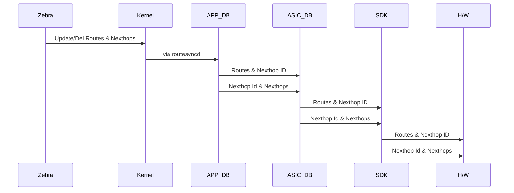

# Route Consistency Checker

#### Rev 0.1


# List of Tables

[Table 1: Abbreviations](#table-1-abbreviations)

# Revision
| Rev  |    Date    |       Author        | Change Description                                           |
|:--:|:--------:|:-----------------:|:------------------------------------------------------------:|
| 0.1  | 04/27/2021 |   Vijay Kumar Vasantha   | Initial version                                              |
|      |            |                      |                    |

# Definition/Abbreviation

### Table 1: Abbreviations

| **Term** | **Meaning**                    |
| -------- | ------------------------------ |
| ARP      | Address Resolution Protocol    |
| CLI      | Command Line Interface         |
| IP       | Internet Protocol              |
| LAG      | Link Aggregation Group         |
| LAN      | Local Area Network             |
| MAC      | Media Access Control addresses |
| VLAN     | Virtual Local Area Network     |
| VRF      | Virtual Routing and Forwarding |

# About this Manual

This document provides general overview of Route Consistency Checker (RCC). Route checker aims at checking the consistency of routes & nexthops between the source RIB and the destinations kernel & hardware.


# 1 Introduction and Scope

This document describes the Functionality and High level design of the Route Consistency Checker(RCC).

In SONiC the routing module, which is the source of routes, resides in BGP docker. BGP docker in turn runs FRR daemon to compute & update routes & nexthops. FRR generated routes passes through multiple modules before it is being programmed in kernel & hardware. The routes & nexthops are stored in each of these intermediate module and passed to next module in pipeline through various redis DB tables. Below flow depicts the stages in route propagation from software to hardware.





The RCC is designed to detect & rectify in-consistency of the routes & nexthop between the following source and destination pairs,

- Zebra to Kernel
- Zebra to H/W

Note that RCC does not try to detect & rectify any inconsistency between the intermediate modules/databases.

# 2 Feature Requirements

The Route Consistency Checker feature enables the user to check the consistency of routes & nexthop between Zebra & Hardware and Zebra & Kernel. Any discrepancy in the routes & nexthop will be detected and action to rectify the inconsistency will be taken. User will be given option to start & stop the route consistency checker. Once route consistency checker is started it will check & rectify discrepancy. 

For Route Consistency Checker the source of truth will be Zebra routing table. It would try to find & rectify any discrepancy between Zebra's route & nexthop and Hardware route & nexthop and between Zebra's route & nexthop and Kernel's route & nexthop.

Route Consistency Checker will,

- Route consistency will enable user to check route consistency for a given VRF
- Route consistency will enable user to check route consistency for a address-family
- Route consistency will validate NextHops. It will check the associated egress interface and ARP/neighbor entries
- Route consistency will validate ECMP NextHops. It will check the associated egress interface and ARP/neighbor entries
- Route consistency will validate Tunnel NextHops. It will check the associated egress interface and ARP/neighbor entries for the overlay.
- Route consistency checker can be started by user and it will run in background
- Route consistency checker will dump inconsistent routes into a file that can be viewed by an user CLI
- User will be given an option to correct the inconsistent routes across HW and SW (remedy)
- As the route consistency checker is a CPU intensive operation, only one instance of checker can be active at any moment

## 2.1 Functional Requirements

The following are the types of consistency checking run

### **Route discrepancy**

- **Data: Routes**

- **Source/Destination: Zebra/Hardware**

- **Detection:**
  - Scan the routes in hardware by redirecting ''l3 defip show"
  - Scan the routes in FRR by redirecting the output of "show ip route"
  - Compare the files generated to see any discrepancy in routes alone

- **In-consistency:**
  - **Zebra has more routes** 
  - **Action:**
    - The inconsistency is logged into a file/database.
    - To resolve the inconsistency routes has to be deleted from FRR and re-added. *Is it needed to be rectified?*
      - FRR should provide API/command to delete and re-add protocol routes, note that 'clear ip route' might not be effective as del & add happens fast and del might not be propagated till h/w.
      - One time route del/add might not result in rectification of route programming issue. Either it needs to be checked at each of the intermediate DB level or it needs to be del/add as many times as there are discrepancy in the programming chain (Zebra->RouteSync->APP-DB->RouteOrch->ASIC-DB->SDK)
      - Action: del and add one time - clear ip route in FRR, Have a socket to FRR like bgpcfgd. show ip route filename
  - **Hardware has more routes**
  - **Action:**
    - The inconsistency is logged into a file/database.
    - To resolve the inconsistency routes has to be deleted from hardware. *Is it needed to be rectified?*
      - Using 'l3 defip destory <ip>' deletes the route from H/W but SAI/SDK will have inconsistency.
      - Should the dangling route be traced back to ASIC_DB, RouteOrch, APP_DB? RouteOrch should have provide a mechanism to receive the del action either though debugsh command or a DB table. RouteOrch should react to either debugsh command or DB new table update.
      - Action: add and del static route with null nexthop


Note:

- Routes missing from hardware in hardware route limit hit case will **not** be considered as discrepancy
- Newly added routes will be skipped from scanned output and it is determined from the 'uptime' of routes in zebra.
- Newly deleted routes will be skipped from scanned output  and it is determined by RouteSyncd temporarily storing deleted routes in APP-DB.
- Action: Revisit, maintain watch list

## 


- **Data: Routes**, **Nexthop**

- **Source/Destination: Zebra/Kernel**

- **Detection:**
  - Scan the routes in FRR by redirecting the output of "show ip route"
  - Scan the routes in kernel by redirecting the output of "ip route show" or use netlink socket to get route dump
  - Compare the files generated to see any discrepancy in routes alone

- **In-consistency:**
  - **Zebra has more routes** 
  - **Action:**
    - The inconsistency is logged into a file/database.
    - To resolve the inconsistency routes has to be added in kernel. *Is it needed to be rectified?*
      - FRR should provide mechanism to del/add routes or FRR should provide API to inject routes into kernel.
      - Is there a need to check APP-DB, ASIC-DB for consistency of missed routes in kernel.
      - Action: del and add using clear command in frr
  - **Kernel has more routes**
  - **Action:**
    - The inconsistency is logged into a file/database.
    - To resolve the inconsistency routes has to be deleted from kernel. *Is it needed to be rectified?*
      - FRR should provide API to delete routes from kernel.
      - Action: add and del routes with source as static/sharpd (ip route del)


### **Route, Number of nexthops discrepancy because of limit **

Routes or number of nexthops hitting the limit in hardware/kernel will not be treated as an issue and will be ignored.

Action: Get route limit from bcmsh command, user should know what routes are missed to be programed in h/w. Check error db.

### **Route's nexthop discrepancy**

- **Data: Routes and Nexthops**''

- **Source/Destination: Zebra, ASIC-DB/Hardware**

- **Detection:**
  - Scan the routes in hardware by redirecting below output to file, by doing so for each route Route: <RIF, Nexthop IP, Dest MAC> could be mapped.
    - ''l3 defip show" - (Route: NexthopGroupID)
    - "l3 egress show" - (NexthopId: RIF, Dest Mac)
    - "l3 l3table show" - (NexthopId: NexthopIP)
    - "l3 ecmp egress show" - (NexthopGroupId: NexthopId)
  - Scan the routes in FRR by redirecting the output of "show ip route" and scan the below table in ASIC-DB, by doing so for each routeRoute: <RIF, Nexthop IP, Dest MAC> could be mapped.
    - Route Table
    - Nexthop Table 
    - ECMP Group Mapping Index
    - Neighbor Table
  - Compare each route reachability information, 
    - Log the discrepancy into a file or DB. *Is it needed to be rectified?*
    - If there is any discrepancy in rif, nexthop IP then indicate FRR to del & add the route information.
    - If there is any discrepancy in dest MAC then indicate OrchAgent (through debugsh or APP_DB) to del & add the entry in neighbor table
    - Action: issue arp clear command or arp clear in nbrsyncd

Note:

- This handles the case of inconsistent reachability information for both ECMP and non-ECMP case between S/W & H/W  and missing reachability information in H/W.


### Non-ECMP nexthops discrepancy

The below diagram depicts the usage of non-ecmp nexthops in hardware

https://docs.google.com/document/d/1O10j_YP9vn-MD46wP78dC_aqD34E_N7yi9O59d-98-s/edit

As depicted in the non-ecmp nexthops consists of below types of nexthops,

- Routes non-ecmp nexthops - Software aware

- ECMP members nexthops - Software aware

- Tunnel members level-2 underlay nexthops - Not software aware

- Internal nexthops & other module created nexthops - Not software aware

  

The software not aware tunnel underlay nexthops and internal nexthops will not have reference count associated with it. So it is not feasible to detect and remove the additional nexthop entries in H/W.

The case of nexthop present in orch agent but nexthop not present in H/W will be handled in Route's nexthop discrepancy sec.

### ECMP nexthops discrepancy

The below diagram depicts the usage of ecmp nexthops in hardware


As depicted in the ecmp nexthops consists of below types of nexthops,

- Tunnel overlay ECMP group  - Software aware
- ECMP members nexthops - Software aware
- Tunnel underlay ECMP group and other internal ECMP group - Not software aware


The software not aware tunnel underlay ECMP nexthops  will not have reference count associated with it.  So it is not feasible to detect and remove the additional ECMP nexthop entries in H/W..

The case of ECMP nexthop present in orch agent but nexthop not present in H/W will be handled in Route's nexthop discrepancy sec.


Below table describes the summary of discrepancy and its action


| Src                              | Dst                               | Action                                                       |
| -------------------------------- | --------------------------------- | ------------------------------------------------------------ |
| Route in s/w                     | Route **not** in h/w              | Readd to APPDB, ASIC, SDK, HW                                |
| Route **not** in s/w             | Route in h/w                      | Remove from APPDB, ASIC, SDK, H/W                            |
| Route & nexthop in s/w           | Route & nexthop **not** in kernel | Readd to kernel                                              |
| Route & nexthop **not** in s/w   | Route & nexthop in kernel         | Remove from kernel                                           |
| Nexthop in s/w                   | Nexthop **not** in h/w            | Readd to ASIC, SDK, HW                                       |
| Nexthop **not** in s/w           | Nexthop in h/w                    | No action. Other modules can be owner or can be SAI internal. Ref count can be zero. |
| ECMP in s/w                      | ECMP **not** in h/w               | Readd to ASIC, SDK, HW                                       |
| ECMP **not** in s/w              | ECMP in h/w                       | No action. Other modules can be owner or can be SAI internal. Ref count can be zero. |
| Routes nexthop is not consistent | Routes nexthop is not consistent  | Readd to APPDB, ASIC, SDK, HW                                |


## 2.2 Configuration and Management Requirements


## 2.3 Scalability Requirements


## 2.4 Warm Boot Requirements

TBD


## 5 CLI

route-consistency-checker [start | stop] //vrf, afi

show route-consistency-checker


### 5.1 Configuration Commands

```

```

### 5.2 Show Commands

```

```


## 6 Serviceability and Debug

The existing logging mechanisms shall be used. Proposed debug framework shall be used for internal state dump.


## 7 Unit Test cases

|      |      |      |
| ---- | ---- | ---- |
|      |      |      |
|      |      |      |
|      |      |      |
|      |      |      |
|      |      |      |
|      |      |      |
|      |      |      |