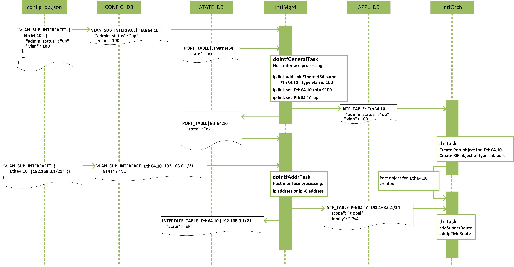
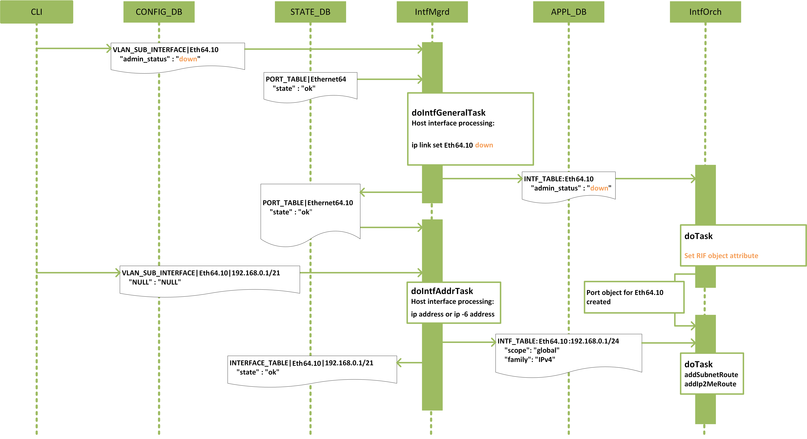
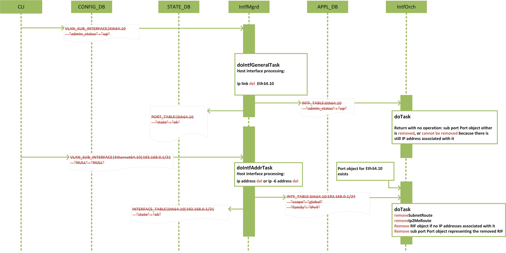

# SONiC sub port interface high level design

# Table of Contents
<!-- TOC -->

  * [Revision history](#revision-history)
  * [Scope](#scope)
  * [Acronyms](#acronyms)
  * [1 Requirements](#1-requirements)
  * [2 Schema design](#2-schema-design)
    * [2.1 Configuration](#21-configuration)
        * [2.1.1 Naming Convention for sub-interfaces](#211-naming-convention-for-sub-interfaces)
        * [2.1.2 config_db.json](#211-config-db-json)
        * [2.1.3 CONFIG_DB](#212-config-db)
        * [2.1.4 CONFIG_DB schemas](#213-config-db-schemas)
    * [2.2 APPL_DB](#22-appl-db)
    * [2.3 STATE_DB](#23-state-db)
    * [2.4 SAI](#24-sai)
        * [2.4.1 Create a sub port interface](#241-create-a-sub-port-interface)
        * [2.4.2 Runtime change on sub port interface attributes](#242-runtime-change-on-sub-port-interface-attributes)
            * [2.4.2.1 SAI-supported attributes](#2421-sai-supported-attributes)
            * [2.4.2.2 Set sub port interface admin status](#2422-set-sub-port-interface-admin-status)
        * [2.4.3 Remove a sub port interface](#243-remove-a-sub-port-interface)
    * [2.5 Linux integration](#25-linux-integration)
        * [2.5.1 Host sub port interfaces](#251-host-sub-port-interfaces)
        * [2.5.2 Route, neighbor subsystems](#252-route-neighbor-subsystems)
  * [3 Feature Support](#3-feature-support)
    * [3.1 IPv4/IPv6 address](#31-ipv4/ipv6-address)
    * [3.2 VRF](#32-vrf)
    * [3.3 RIF Counters & Oper Status](#33-rif-counters-&-oper-status)
    * [3.4 Port Channel Sub-interfaces](#34-port-channel-sub-interfaces)
    * [3.5 Parent Interface Admin/oper UP/DOWN](#35-parent-interface-admin/oper-up/down)
    * [3.6 Port Aliasing](#36-port-aliasing)
    * [3.7 Speed/Bandwidth](#37-speed/bandwidth)
    * [3.8 LAG](#38-lag)
    * [3.9 Dynamic Port Breakout](#39-dynamic-port-breakout)
    * [3.10 L2 Protocols](#310-l2-protocols)
    * [3.11 ARP/NDP](#311-arp/ndp)
    * [3.12 IPv4 Unnumbered](#312-ipv4-unnumbered)
    * [3.13 IPv6 Enable/disable](#313-ipv6-enable/disable)
    * [3.14 IPv4/IPv6 Routes with ECMP](#314-ipv4/ipv6-routes-with-ecmp)
    * [3.15 BGP](#315-bfd)
    * [3.16 OSPF](#316-ospf)
    * [3.17 OSPFv3](#317-ospfv3)
    * [3.18 BFD](#318-bfd)
    * [3.19 DHCP & DHCP Relay](#319-dhcp-7-dhcp-relay)
    * [3.20 IP Helper](#320-ip-helper)
    * [3.21 IPSLA](#321-ipsla)
    * [3.22 VRRP & SAG](#322-vrrp-&-sag)
    * [3.23 VxLAN](#323-vxlan)
    * [3.24 MCLAG](#324-mclag)
    * [3.25 QinQ](#325-qinq)
    * [3.26 PIM](#326-pim)
    * [3.27 IGMP](#327-igmp)
    * [3.28 QoS](#328-qos)
    * [3.29 MTU](#329-mtu)
    * [3.30 NAT](#330-nat)
    * [3.31 SPAN/ERSPAN](#331-span/erspan)
  * [4 Event flow diagrams](#4-event-flow-diagrams)
    * [4.1 Sub port interface creation](#41-sub-port-interface-creation)
    * [4.2 Sub port interface runtime admin status change](#42-sub-port-interface-runtime-admin-status-change)
    * [4.3 Sub port interface removal](#43-sub-port-interface-removal)
  * [5 CLI](#5-cli)
    * [5.1 Config commands](#51-config-commands)
        * [5.1.1 Config a sub port interface](#511-config-a-sub-port-interface)
        * [5.1.2 Config IP address on a sub port interface](#512-config-ip-address-on-a-sub-port-interface)
        * [5.1.3 Change admin status on a sub port interface](#513-change-admin-status-on-a-sub-port-interface)
    * [5.2 Show commands](#52-show-commands)
  * [6 Warm reboot support](#6-warm-reboot-support)
  * [7 Unit test](#7-unit-test)
    * [7.1 Sub port interface creation](#71-sub-port-interface-creation)
        * [7.1.1 Create a sub port interface](#711-create-a-sub-port-interface)
        * [7.1.2 Add an IP address to a sub port interface](#712-add-an-ip-address-to-a-sub-port-interface)
    * [7.2 Sub port interface admin status change](#72-sub-port-interface-admin-status-change)
    * [7.3 Sub port interface removal](#73-sub-port-interface-removal)
        * [7.3.1 Remove an IP address from a sub port interface](#731-remove-an-ip-address-from-a-sub-port-interface)
        * [7.3.2 Remove all IP addresses from a sub port interface](#732-remove-all-ip-addresses-from-a-sub-port-interface)
        * [7.3.3 Remove a sub port interface](#733-remove-a-sub-port-interface)
  * [8 Scalability](#8-scalability)
  * [9 Port channel renaming](#9-port-channel-renaming)
  * [10 Appendix](#10-appendix)
    * [10.1 Difference between a sub port interface and a vlan interface](#101-difference-between-a-sub-port-interface-and-a-vlan-interface)
  * [12 Acknowledgment](#11-acknowledgment)
  * [13 References](#12-references)

<!-- /TOC -->

# Revision history
| Rev |    Date     |       Author       | Change Description                |
|:---:|:-----------:|:------------------:|-----------------------------------|
| 0.1 | 07/01/2019  | Wenda Ni           | Initial version                   |
| 0.2 | 12/17/2020  | Preetham Singh     | Update with Feature support|

# Scope
A sub port interface is a logical interface that can be created on a physical port or a port channel.
A sub port interface serves as an interface to either a .1D bridge or a VRF, but not both.
This design focuses on the use case of creating a sub port interface on a physical port or a port channel and using it as a router interface to a VRF as shown in Fig. 1.


__Fig. 1: Sub port router interface__

Multiple L3 sub port interfaces, each characterized by a VLAN id in the 802.1q tag, can be created on a physical port or a port channel.
Sub port interfaces attaching to the same physical port or port channel can interface to different VRFs, though they share the same VLAN id space and must have different VLAN ids.
Sub port interfaces attaching to different physical ports or port channels can use the same VLAN id, even when they interface to the same VRF.
However, there is no L2 bridging between these sub port interfaces; each sub port interface is considered to stay in a separate bridge domain.

This design does NOT cover the case of creating and using sub port as a bridge port to a .1D bridge shown in Fig. 2.


__Fig. 2: Sub port bridge port__

# Acronyms
| Acronym                  | Description                                |
|--------------------------|--------------------------------------------|
| VRF                      | Virtual routing and forwarding             |
| RIF                      | Router interface                           |

# 1 Requirements

Manage the life cycle of a sub port interface created on a physical port or a port channel and used as a router interface to a VRF:
* Creation with the specified dot1q vlan id encapsulation
* Runtime admin status change
* Removal

A sub port interface shall support the following features:
* L3 forwarding (both unicast and multicast)
* BGP
	* BGP L2VPN EVPN
* ARP and NDP
* VRF
* RIF counters & Status
* QoS setting inherited from parent physical port or port channel
* MTU inherited from parent physical port or port channel
* Per sub port interface admin status config
* Port Aliasing
* Speed/Bandwidth
* Dynamic Port Breakout
* IPv4 Unnumbered
* IPv6 Enable/Disable
* IPv4 & IPv6 Routes with ECMP
* OSPF & OSPFv3
* BFD
* DHCP & DHCP Relay
* IP Helper
* IPSLA
* VRRP & SAG
* VxLAN
* MCLAG
* QinQ
* PIM
* IGMP
* NAT
* SPAN/ERSPAN

# 2 Schema design

We introduce a new table "VLAN_SUB_INTERFACE" in the CONFIG_DB to host the attributes of a sub port interface.
For APPL_DB and STATE_DB, we do not introduce new tables for sub port interfaces, but reuse existing tables to host sub port interface keys.

## 2.1 Configuration
### 2.1.1 Naming Convention for sub-interfaces:

Since Kernel has netdevice name length restriction to 15, port channel sub-interfaces(Physical interfaces as well in case interface number > 99) cannot follow the same nomenclature as physical sub-interfaces. Hence Long name to  short name conversion needs to be performed.

All DB & Kernel netdevice corresponding to the sub-interface should be created with a short name.

All applications interacting/maintaining sub-interfaces should be aware of this mapping to get parent interface properties.

CPP & Python API library will be provided to perform short name to long name conversion and vice versa.
Please refer to the API library section for details.

Short naming conventions for sub-interfaces will have Ethxxx.yyyy, Poxxx.yyyy format.

All click & klish config & show CLIs for sub-interfaces will follow long name format.

### 2.1.2 config_db.json
```
"VLAN_SUB_INTERFACE": {
    "{{ port_name }}.{{ subinterface_id }}": {
        "vlan" : <1-4094>,
        "admin_status" : "{{ adminstatus }}",
        "vrf_name" : <vrf-name>
    },
    "{{ port_name }}.{{ vlan_id }}|{{ ip_prefix }}": {}
},
```
A key in the VLAN_SUB_INTERFACE table is the name of a sub port, which consists of two sections delimited by a "." (symbol dot).
The section before the dot is the name of the parent physical port or port channel. The section after the dot is a unique number which uniquely identifies the sub-interface on the parent interface. Sub-interface id value can be in range 0-4294967295.

vlan field identifies the vlan to which the sub-interface is associated using .1Q trunking.
Note that subinterface_id and vlan_id for a subinterface can be different.
Unless the user configures vlan_id associated with the subinterface, the subinterface will NOT be provisioned in the SONiC system.

In Click CLI, user will be able to configure the vlan id associated with the sub-interface. If vlan_id is not provided, sub-interface ID will be used as vlan id.

admin_status of a sub port interface can be either up or down.
In the case field "admin_status" is absent in the config_db.json file, a sub port interface is set admin status up by default at its creation.

Example configuration:
```
"VLAN_SUB_INTERFACE": {
    "Eth64.10": {
        “vlan” : 100,
        "admin_status" : "up"
    },
    "Eth64.10|192.168.0.1/21": {},
    "Eth64.10|fc00::/7": {}
},
```

### 2.1.3 CONFIG_DB
```
VLAN_SUB_INTERFACE|{{ port_name }}.{{ subinterface_id }}
    "admin_status" : "{{ adminstatus }}"

VLAN_SUB_INTERFACE|{{ port_name }}.{{ subinterface_id }}|{{ ip_prefix }}
    "NULL" : "NULL"
```

### 2.1.4 CONFIG_DB schemas
```
; Defines for sub port interface configuration attributes
key             = VLAN_SUB_INTERFACE|subif_name      ; subif_name is the name of the sub port interface

; subif_name annotations
subif_name      = port_name "." subinterface_id         ; port_name is the name of parent physical port or port channel
                                                ; subinterface_id is DIGIT 1-4294967295

; field         = value
admin_status    = up / down                     ; admin status of the sub port interface

; field = value
vlan = <1-4094>                              ; Vlan id in range <1-4094>

; field = value
vrf_name = <vrf-name>                           ; Name of the Vrf
```

```
; Defines for sub port interface configuration attributes
key             = VLAN_SUB_INTERFACE|subif_name|IPprefix     ; an instance of this key will be repeated for each IP prefix

IPprefix        = IPv4prefix / IPv6prefix               ; an instance of this key/value pair will be repeated for each IP prefix

IPv4prefix      = dec-octet "." dec-octet "." dec-octet "." dec-octet "/" %d1-32
dec-octet       = DIGIT                 ; 0-9
                 / %x31-39 DIGIT        ; 10-99
                 / "1" 2DIGIT           ; 100-199
                 / "2" %x30-34 DIGIT    ; 200-249
                 / "25" %x30-35         ; 250-255

IPv6prefix      =                             6( h16 ":" ) ls32
                 /                       "::" 5( h16 ":" ) ls32
                 / [               h16 ] "::" 4( h16 ":" ) ls32
                 / [ *1( h16 ":" ) h16 ] "::" 3( h16 ":" ) ls32
                 / [ *2( h16 ":" ) h16 ] "::" 2( h16 ":" ) ls32
                 / [ *3( h16 ":" ) h16 ] "::"    h16 ":"   ls32
                 / [ *4( h16 ":" ) h16 ] "::"              ls32
                 / [ *5( h16 ":" ) h16 ] "::"              h16
                 / [ *6( h16 ":" ) h16 ] "::"
h16             = 1*4HEXDIG
ls32            = ( h16 ":" h16 ) / IPv4address
```

Example:
```
VLAN_SUB_INTERFACE|Eth64.10
    "vlan" : 100,
    "admin_status" : "up"

VLAN_SUB_INTERFACE|Eth64.10|192.168.0.1/21
    "NULL" : "NULL"

VLAN_SUB_INTERFACE|Eth64.10|fc00::/7
    "NULL" : "NULL"
```

## 2.2 APPL_DB
```
INTF_TABLE:{{ port_name }}.{{ vlan_id }}
    "admin_status" : "{{ adminstatus }}"

; field         = value
admin_status    = up / down             ; admin status of the sub port interface

; field = value
vlan = <1-4094>                      ; Vlan id in range <1-4094>

; field = value
vrf_name = <vrf-name>                   ; Name of the Vrf

INTF_TABLE:{{ port_name }}.{{ vlan_id }}:{{ ip_prefix }}
    "scope" : "{{ visibility_scope }}"
    "family": "{{ address_family }}"

; field         = value
scope           = global / local        ; local is an interface visible on this localhost only
family          = IPv4 / IPv6           ; address family
```

Example:
```
INTF_TABLE:Eth64.10
    "vlan" : 100
    "admin_status" : "up"

INTF_TABLE:Eth64.10:192.168.0.1/24
    "scope" : "global"
    "family": "IPv4"

INTF_TABLE:Eth64.10:fc00::/7
    "scope" : "global"
    "family": "IPv6"
```

## 2.3 STATE_DB

Following the current schema, sub port interface state of a physical port is set to the PORT_TABLE, while sub port interface state of a port channel is set to the LAG_TABLE.
```
PORT_TABLE|{{ port_name }}.{{ subinterface_id }}
    "state" : "ok"
```
```
LAG_TABLE|{{ port_name }}.{{ subinterface_id }}
    "state" : "ok"
```
```
INTERFACE_TABLE|{{ port_name }}.{{ subinterface_id }}|{{ ip_prefix }}
    "state" : "ok"
```

Example:
```
PORT_TABLE|Eth64.10
    "state" : "ok"
```
```
INTERFACE_TABLE|Eth64.10|192.168.0.1/21
    "state" : "ok"
```
```
INTERFACE_TABLE|Eth64.10|fc00::/7
    "state" : "ok"
```

## 2.4 SAI
SAI attributes related to a sub port interface are listed in the Table below.

| SAI attributes                                   | attribute value/type                         |
|--------------------------------------------------|----------------------------------------------|
| SAI_ROUTER_INTERFACE_ATTR_VIRTUAL_ROUTER_ID      | VRF oid                                      |
| SAI_ROUTER_INTERFACE_ATTR_TYPE                   | SAI_ROUTER_INTERFACE_TYPE_SUB_PORT           |
| SAI_ROUTER_INTERFACE_ATTR_PORT_ID                | parent physical port or port channel oid     |
| SAI_ROUTER_INTERFACE_ATTR_OUTER_VLAN_ID          | VLAN id (sai_uint16_t)                       |
| SAI_ROUTER_INTERFACE_ATTR_SRC_MAC_ADDRESS        | MAC address                                  |
| SAI_ROUTER_INTERFACE_ATTR_MTU                    | mtu size                                     |
| SAI_ROUTER_INTERFACE_ATTR_ADMIN_V4_STATE         | IPv4 Admin State|
| SAI_ROUTER_INTERFACE_ATTR_ADMIN_V6_STATE         | IPv6 Admin State|


### 2.4.1 Create a sub port interface
```
sai_attribute_t sub_intf_attrs[6];

sub_intf_attrs[0].id = SAI_ROUTER_INTERFACE_ATTR_VIRTUAL_ROUTER_ID;
sub_intf_attrs[0].value.oid = vrf_oid;

sub_intf_attrs[1].id = SAI_ROUTER_INTERFACE_ATTR_TYPE;
sub_intf_attrs[1].value.s32 = SAI_ROUTER_INTERFACE_TYPE_SUB_PORT;

sub_intf_attrs[2].id = SAI_ROUTER_INTERFACE_ATTR_PORT_ID;
sub_intf_attrs[2].value.oid = parent_port_oid;  /* oid of the parent physical port or port channel */

sub_intf_attrs[3].id = SAI_ROUTER_INTERFACE_ATTR_OUTER_VLAN_ID;
sub_intf_attrs[3].value.u16 = 10;

sai_mac_t mac = {0x00, 0xe0, 0xec, 0xc2, 0xad, 0xf1};
sub_intf_attrs[4].id = SAI_ROUTER_INTERFACE_ATTR_SRC_MAC_ADDRESS;
memcpy(sub_intf_attrs[4].value.mac, mac, sizeof(sai_mac_t));

sub_intf_attrs[5].id = SAI_ROUTER_INTERFACE_ATTR_MTU;
sub_intf_attrs[5].value.u32 = 9100;

uint32_t sub_intf_attrs_count = 6;
sai_status_t status = create_router_interface(&rif_id, switch_oid, sub_intf_attrs_count, sub_intf_attrs);
```

### 2.4.2 Runtime change on sub port interface attributes
#### 2.4.2.1 SAI-supported attributes
The following attributes are supported in SAI spec to be changed at run time.

| SAI attributes                                        | attribute value/type                         |
|-------------------------------------------------------|----------------------------------------------|
| SAI_ROUTER_INTERFACE_ATTR_ADMIN_V4_STATE              | true / false                                 |
| SAI_ROUTER_INTERFACE_ATTR_ADMIN_V6_STATE              | true / false                                 |
| SAI_ROUTER_INTERFACE_ATTR_SRC_MAC_ADDRESS             | MAC address                                  |
| SAI_ROUTER_INTERFACE_ATTR_MTU                         | mtu size                                     |
| SAI_ROUTER_INTERFACE_ATTR_INGRESS_ACL                 | ACL table or ACL table group oid             |
| SAI_ROUTER_INTERFACE_ATTR_EGRESS_ACL                  | ACL table or ACL table group oid             |
| SAI_ROUTER_INTERFACE_ATTR_V4_MCAST_ENABLE             | true / false                                 |
| SAI_ROUTER_INTERFACE_ATTR_V6_MCAST_ENABLE             | true / false                                 |
| SAI_ROUTER_INTERFACE_ATTR_NEIGHBOR_MISS_PACKET_ACTION | sai_packet_action_t                          |
| SAI_ROUTER_INTERFACE_ATTR_LOOPBACK_PACKET_ACTION      | sai_packet_action_t                          |


#### 2.4.2.2 Set sub port interface admin status
```
sai_attribute_t sub_intf_attr;

sub_intf_attr.id = SAI_ROUTER_INTERFACE_ATTR_ADMIN_V4_STATE;
sub_intf_attr.value.booldata = false;
sai_status_t status = set_router_interface_attribute(rif_id, &attr);

sub_intf_attr.id = SAI_ROUTER_INTERFACE_ATTR_ADMIN_V6_STATE;
sub_intf_attr.value.booldata = false;
sai_status_t status = set_router_interface_attribute(rif_id, &attr);
```

### 2.4.3 Remove a sub port interface
```
sai_status_t status = remove_router_interface(rif_id);
```

## 2.5 Linux integration
### 2.5.1 Host sub port interfaces

Inside SONiC, we use iproute2 package to manage host sub port interfaces.
Specifically, we use `ip link add link <parent_port_name> name <subif_name> type vlan id <vlan_id>` to create a host sub port interface.
This command implies the dependency that a parent host interface must be created before the creation of a host sub port interface.

Example:
```
ip link add link Ethernet64 name Eth64.10 type vlan id 100
ip link set Eth64.10 mtu 9100
ip link set Eth64.10 up
```
```
ip link del Eth64.10
```

We use `ip address` and `ip -6 address` to add and remove ip adresses on a host sub port interface.

Example:
```
ip address add 192.168.0.1/24 dev Eth64.10
```

Please note that the use of iproute2 package is internal to SONiC, specifically IntfMgrd.
Users should always use SONiC CLIs defined in Section 4 to manage sub port interfaces in order to have an event flowing properly across all components and DBs shown in Section 3.
The direct use of iproute2 commands, e.g., `ip link` and `ip address`, by users are not recommended.

### 2.5.2 Route, neighbor subsystems

Once the host sub port interfaces are properly set, route and neighbor subsystems should function properly on sub port interfaces.
fpmsyncd should receive route add/del updates on sub port interfaces from zebra over TCP socket port 2620. These updates are received in the format of netlink messages.
neighsyncd/nbrmgrd should receive neigh add/del netlink messages on sub port interfaces from its subscription to the neighbor event notification group RTNLGRP_NEIGH.

Internally, a sub port interface is represented as a Port object to be perceived seamlessly by NeighOrch and RouteOrch to create neighor and route entries, respectively, on it.

# 3 Feature Support

## 3.1 IPv4/IPv6 address:
IPv4 & IPv6 addresses can be configured on subinterfaces using the same set of CLIs. 
In presence of sub-interface, IP can be configured on the parent interface. All untagged packets will be classified to parent interface.

## 3.2 VRF:

User can bind the sub-interface to a VRF. This can be done using the same binding CLIs.

Below Config DB schema is applicable for sub-interface VRF binding.

```
key = VLAN_SUB_INTERFACE|subif_name ; subif_name is the name of the sub port interface

; subif_name annotations
subif_name = port_name "." subinterface_id ; port_name is the name of parent physical port or port channel
; vlanid is DIGIT 1-4094
; field = value
vrf_name = VRF_NAME ; Name of the VRF to which subinterface is bound to
; VRF_NAME = 1\*15VCHAR ;
```
```
Example:

VLAN_SUB_INTERFACE|Eth64.10
"vrf_name" : "Vrf-Red"
```  

Upon vrf binding, intfmgrd binds sub-interface netdev to vrf and also updates APPL_DB INTERFACE_TABLE and STATE_DB INTERFACE_TABLE with vrf information.

Note:

-   Different Sub-interfaces under same parent interface can bind to different VRFs
    
-   Same sub-interface under a different parent interface can bind to different VRFs.
    

Note:

Whenever a sub-interface is bound/unbound from a vrf, the sub-interface will be deleted and recreated to remove all L3 configurations.
  
Management VRF:
Sub-interfaces can be bound/unbound to management VRF mgmt.

## 3.3 RIF Counters & Oper Status:
-   Admin Status: Admin status per sub-interface can be controlled by administrator as mentioned in section 2.1.2. This status is updated in the kernel and same can be verified in the “show subinterfaces status” click command.
    
-   Oper Status: Oper Status of sub-interface is inherited from parent interface.
    
-   HW Counters: HW counters per subinterface can be supported upon RIF counter support(click command “show interface counters rif”).    

NOTE: RIF counters support will be part of future release. 

## 3.4 Port Channel Sub-interfaces:
Subinterfaces can be configured on portchannels.
All operation applicable to Physical sub-interfaces are applicable to portchannel sub-interfaces as well.

## 3.5 Parent Interface Admin/oper UP/DOWN:
-   Upon Parent interface admin UP/DOWN, Kernel automatically brings UP/DOWN all associated sub-interfaces.
    
-   Upon Parent interface oper DOWN: All sub-interfaces under the parent interface will be Oper Down.

## 3.6 Port Aliasing:
Port Aliasing will not be have any impact due to this feature. The parent interface component of subinterface naming will be inline with existing aliasing convention.
Example:
- Ethernet4.10 will be represented as Eth1/2.10 in standard interface naming mode
## 3.7 Speed/Bandwidth:
Speed & Bandwidth is not applicable per sub-interface, rather applicable on parent physical or port channel sub-interface.

## 3.8 LAG:
Subinterfaces cannot become member of a PortChannel interface. Such configurations will be blocked at CLI level.

## 3.9 Dynamic Port Breakout:
Upon port-breakout, subinterfaces on the parent interface needs to be removed automatically. Also, all configuration entries referring to a subinterface will also be removed automatically.

## 3.10 L2 Protocols:
None of L2 Protocols are supported on Subinterfaces.

Subinterfaces belong to a separate Bridge Domain. L2 Flooded frames in the vlan should not be sent on the corresponding subinterface and vice versa.

## 3.11 ARP/NDP:
ARP and IPv6 Neighbor Discovery should work seamlessly on sub-interfaces as  mentioned in section 2.5.2. These neighbors should be learnt on corresponding sub-interfaces in the kernel and propagated to neighsyncd via netlink messages. Neighsyncd should program these neighbors in the corresponding Host table.

## 3.12 IPv4 Unnumbered:
IPv4 unnumbered interfaces will be supported on subinterface.
Subinterfaces can borrow IP from other interface.
Also Sub-interface can be used as donor of IPv4 address to other interfaces.

## 3.13 IPv6 Enable/disable:
When IPv6 is enabled or disabled globally, IPv6 will be disabled/enabled on sub-interfaces as well.

When IPv6 is enabled globally, sub-interfaces will also have IPv6 enabled which will add EUI64 format auto-generated IPv6 LL on the sub-interface.

IPv6 use-link-local-only should be supported on sub-interfaces.

## 3.14 IPv4/IPv6 Routes with ECMP:
### 3.14.1 Static/Dynamic Routes:
-   User can configure static routes with next hop resolved on subinterfaces or pointing to subinterfaces.
    
-   User can configure static leak routes with next hop resolved on subinterfaces or pointing to subinterfaces.
    
Dynamic Routes with nexthop resolved on subinterfaces are also supported.

 FRR & Zebra populates interface Table from kernel netlink events. Hence this interface table is updated with subinterfaces as well.

FPMSyncd adds these routes with nexthop interface pointing to subinterface in APPL_DB ROUTE_TABLE.

Routeorch shall program these routes to appropriate LPM table pointing to sub-interfaces.

### 3.14.2 ECMP:
ECMP of nexthops resolved over subinterfaces should be supported:  
    An ECMP group can comprise of:
    
-   All subinterfaces    
-   Mix of subinterface and physical interface/PortChannels    
-   Mix of subinterface and vlan

## 3.15 BGP:
### 3.15.1 BGP L2VPN-EVPN:
Router subinterfaces are treated as router-ports, i.e. the communication on such interfaces is isolated (between switch and server) and doesn't stretch L2 domain over/across vxlan network. Since L2 domain is not stretched, there is no need to sync ARP/MAC except for MCLAG case.

Connected prefixes pointing to sub-interfaces in the VRF should be redistributed as EVPN Type 5 prefixes.

## 3.16 OSPF:
OSPF will be supported on sub-interfaces.
All Config commands, show commands and show command displays shall adapt to port name conversion from SONiC backend short names to user interface visible sub-interface name.

## 3.17 OSPFv3:
OSPFv3 will be supported on sub-interfaces.

## 3.18 BFD:
BFD sessions can run on subinterfaces.
User will be allowed on configure BFP sessions with sub-interface as a source.

## 3.19 DHCP & DHCP Relay:
DHCP client is only used by the ZTP application and eth0 interfaces. Other than that, there is no use case to run a DHCP client on the SONIC switch. There is no requirement to support DHCP clients on subinterfaces.

DHCP relay is supported on subinterfaces. Both the DHCP clients (downstream interface) and DHCP servers (upstream interface) can be reachable/attached via subinterfaces. Both DHCPv4 and DHCPv6 relay operation is supported on subinterfaces. All the DHCP relay CLICK/KLISH commands are interface specific. These commands are enhanced to support subinterfaces. DHCP config manager is enhanced to handle the subinterface naming format. The Option 82 Circuit-Id and Remote-Id values in the relayed packet are based on the subinterface name associated with the downstream interface. The maximum number of subinterfaces enabled for DHCP relay is limited - refer to DHCP Relay HLD for more details on scaling limits.

## 3.20 IP Helper:
IP Helper is not supported on sub-interfaces.

## 3.21 IPSLA:
IPSLA sessions can run on sub-interfaces.
IPSLA sessions can also be configured with source as sub-interface.

## 3.22 VRRP & SAG:
VRRP sessions can be configured on sub-interfaces. 

SAG will be supported on subinterfaces. SAG support on subinterfaces will be solely to provide gateway functionality across leaf nodes. Since subinterfaces are router ports, there is no L2 domain extension across vxlan network hence there will be no Type-2 MACIP sync across vxlan network.
 
Subinterface and SAG configuration should be symmetric across leaf nodes where the host could move. If not symmetric, traffic drop will be observed upon host move.

SAG will be directly configured on the sub-interface netdevice in the kernel.
 

- APP_DB Schema:
```
key = VRRP_TABLE:interface_name:vip:type

interface_name ; interface name as a string. Vlan, Ethernet, PortChannel or subinterface

vip ; virtual IP address in a.b.c.d/32 or a:b:c::d format

type ; IP(v6) address type string.

  

; field = value

vmac = virtual_mac_address ; Virtual MAC address associated with VRRP instance

isSag = true/false;
```  

- vrrporch:
VMAC programming: VMAC should be programmed pointing to Virtual RIF associated with the subinterface?
VIP Programming: VIP should be programmed pointing to Virtual RIF associated with subinterface?

- Admin/Oper Down of parent interface:
SAG Manager will monitor parent interface state and update SAG state in APP_DB SAG table.
  

- SAG on Subinterface on MCLAG:
SAG can be configured on MCLAG client port subinterfaces. ARP/ND sync across mclag nodes will happen for those learnt on subinterfaces.

## 3.23 VxLAN:
Underlay: If VxLAN tunnel IPs are reachable via subinterfaces, tunnels will NOT be provisioned in hardware

## 3.24 MCLAG:
- Subinterfaces as MCLAG Clients:
Support is needed for L3 Port Channel only. MCLAG Client interface as Router Port PortChannel.
Physical interface router port cannot be MCLAG client interface, so not applicable.
Vlan Interface (SVI) will have a physical port and LAG as switch port, so not applicable.

- Subinterfaces as peer-interface:
Peer interface is always switch port to carry tagged traffic in case of failover scenario.
And subinterface is applicable only to router ports. So the peer interface cannot be a subinterface. 

- Neighbors learnt on subinterfaces:
ARP and ND learnt on subintfs of a multihomed interface is required to be synced. And this is independent of whether the parent (Po) interface has an IP config or not. Users will be required to configure the same IP on MCLAG multihomed subintfs on the MCLAG peers.

## 3.25 QinQ:
Duble .1Q vlan tagged packets will be routed on subinterfaces based on outer vlan tag retaining the inner tag.

## 3.26 PIM:
PIM is not supported on sub-interfaces in this release.

## 3.27 IGMP:
IGMP is not supported on sub-interfaces in this release.

## 3.28 QoS:
QoS settings are inherited from parent interface.

## 3.29 MTU:
MTU on sub-interface is inherited by default from associated parent interface.
MTU can be explicitly configured on sub-interfaces which will override the MTU inherited from the parent interface.

## 3.30 NAT:
NAT feature will not be supported on sub-interfaces.

## 3.31 SPAN/ERSPAN:
- Sub-interface as Mirror source port will be supported via ACL mirroring.
- ERSPAN destination can be reachable via sub-interfaces.
- Sub-interface as mirror destination port will not be supported.


# 4 Event flow diagrams
## 4.1 Sub port interface creation


## 4.2 Sub port interface runtime admin status change


## 4.3 Sub port interface removal


# 5 CLIs
## 5.1 Config commands (Click)
### 5.1.1 Config a sub port interface
`subinterface` command category is introduced to the `config` command.

```
Usage: config [OPTIONS] COMMAND [ARGS]...

  SONiC command line - 'config' command

Options:
  --help  Show this message and exit.

Commands:
  ...
  subinterface           Sub-port-interface-related configuration tasks
```

`add` and `del` commands are supported on a sub port interface.
```
Usage: config subinterface [OPTIONS] COMMAND [ARGS]...

  Sub-port-interface-related configuration tasks

Options:
  --help    Show this message and exit.

Commands:
  add       Add a sub port interface
  del       Remove a sub port interface
```
```
Usage: config subinterface add <sub_port_interface_name> [vlan <1-4094>]
```
```
Usage: config subinterface del <sub_port_interface_name>
```

### 5.1.2 Config IP address on a sub port interface
Once a sub port interface is added, existing `config interface ip` is used to `add` or `del` ip address on it.
```
Usage: config interface ip [OPTIONS] COMMAND [ARGS]...

  Add or remove IP address

Options:
  --help    Show this message and exit.

Commands:
  add       Add an IP address towards the interface
  del       Remove an IP address from the interface
```
```
Usage: config interface ip add <sub_port_interface_name> <ip_addr>
```
```
Usage: config interface ip del <sub_port_interface_name> <ip_addr>
```

### 5.1.3 Change admin status on a sub port interface
Current `config interface startup` and `shutdown` commands are extended to sub port interfaces to set admin status up and down, respectively, on a sub port interface.
```
Usage: config interface startup [OPTIONS] <interface_name>

  Start up interface

Options:
  --help    Show this message and exit.
```
```
Usage: config interface shutdown [OPTIONS] <interface_name>

  Shut down interface

Options:
  --help    Show this message and exit.
```
```
Usage: config interface startup <sub_port_interface_name>
```
```
Usage: config interface shutdown <sub_port_interface_name>
```
## 5.1 Config commands (KLiSH)
### 5.1.1 Config a sub port interface
```
Command: [no] interface <subinterface-name>

Example 1:
sonic-cli(config)# interface Ethernet4.10
sonic-cli(conf-subif-Ethernet4.10)# 

Example 2:
sonic-cli(config)# interface PortChannel 100.100
sonic-cli(conf-subif-PortChannel100.100)# 
```
### 5.1.2 Config vlan-id on a sub port interface

```
Command: encapsulation dot1q vlan <vlan-id>
Command: no encapsulation

Example 1:
sonic-cli(conf-subif-Ethernet4.10)# encapsulation dot1q vlan-id 1000
 
```
### 5.1.3 Config IP address on a sub port interface

```
Command: [no] ip address <ipv4-address>
Command: [no] ipv6 address <ipv6-address>

Example 1:
sonic-cli(config)# interface Ethernet 4.10
sonic-cli(conf-subif-Ethernet4.10)# ip address 4.10.1.1/24
sonic-cli(conf-subif-Ethernet4.10)# ipv6 address 410::1/64
 
```

### 5.1.4 Change admin status on a sub port interface
```
Command: [no] shutdown

Example 1:
sonic-cli(conf-subif-Ethernet4.10)# shutdown
 
```

## 5.2 Show commands
```
Usage: show subinterfaces [OPTIONS] COMMAND [ARGS]...

  Show details of the sub port interfaces

Options:
  -?, -h, --help  Show this message and exit.

Commands:
  status       Show sub port interface status information
```
Example:
```
Sub port interface    Speed    MTU    Vlan    Admin                 Type
------------------  -------  -----  ------  -------  -------------------
     Eth64.10          100G   9100    100       up  dot1q-encapsulation
```

# 6 Warm reboot support
There is no special runtime state that needs to be kept for sub port interfaces.
This said, current warm reboot infrastructure shall support sub port interfaces naturally without the need for additional extension.
This is confirmed by preliminary trials on a Mellanox device.

# 7 Unit test
## 7.1 Sub port interface creation
Test shall cover the parent interface being a physical port or a port channel.

### 7.1.1 Create a sub port interface
| Test case description                                                                                  |
|--------------------------------------------------------------------------------------------------------|
| Verify that sub port interface configuration is pushed to CONIFG_DB VLAN_SUB_INTERFACE table           |
| Verify that sub port interface configuration is synced to APPL_DB INTF_TABLE by Intfmgrd               |
| Verify that sub port interface state ok is pushed to STATE_DB by Intfmgrd                              |
| Verify that a sub port router interface entry is created in ASIC_DB                                    |

### 7.1.2 Add an IP address to a sub port interface
Test shall cover the IP address being an IPv4 address or an IPv6 address.

| Test case description                                                                                  |
|--------------------------------------------------------------------------------------------------------|
| Verify that ip address configuration is pushed to CONIFG_DB VLAN_SUB_INTERFACE table                   |
| Verify that ip address configuration is synced to APPL_DB INTF_TABLE by Intfmgrd                       |
| Verify that ip address state ok is pushed to STATE_DB INTERFACE_TABLE by Intfmgrd                      |
| Verify that a subnet route entry is created in ASIC_DB                                                 |
| Verify that an ip2me route entry is created in ASIC_DB                                                 |

## 7.2 Sub port interface admin status change
| Test case description                                                                                  |
|--------------------------------------------------------------------------------------------------------|
| Verify that sub port interface admin status change is pushed to CONIFG_DB VLAN_SUB_INTERFACE table     |
| Verify that sub port interface admin status change is synced to APPL_DB INTF_TABLE by Intfmgrd         |
| Verify that sub port router interface entry in ASIC_DB has the updated admin status                    |

## 7.3 Sub port interface removal
### 7.3.1 Remove an IP address from a sub port interface
Test shall cover the IP address being an IPv4 address or an IPv6 address.

| Test case description                                                                                  |
|--------------------------------------------------------------------------------------------------------|
| Verify that ip address configuration is removed from CONIFG_DB VLAN_SUB_INTERFACE table                |
| Verify that ip address configuration is removed from APPL_DB INTF_TABLE by Intfmgrd                    |
| Verify that ip address state ok is removed from STATE_DB INTERFACE_TABLE by Intfmgrd                   |
| Verify that subnet route entry is removed from ASIC_DB                                                 |
| Verify that ip2me route entry is removed from ASIC_DB                                                  |

### 7.3.2 Remove all IP addresses from a sub port interface
| Test case description                                                                                  |
|--------------------------------------------------------------------------------------------------------|
| Verify that sub port router interface entry is removed from ASIC_DB                                    |

### 7.3.3 Remove a sub port interface
Test shall cover the parent interface being a physical port or a port channel.

| Test case description                                                                                  |
|--------------------------------------------------------------------------------------------------------|
| Verify that sub port interface configuration is removed from CONIFG_DB VLAN_SUB_INTERFACE table        |
| Verify that sub port interface configuration is removed from APPL_DB INTF_TABLE by Intfmgrd            |
| Verify that sub port interface state ok is removed from STATE_DB by Intfmgrd                           |

# 8 Scalability
Scalability is ASIC-dependent.
We enforce a minimum scalability requirement on the number of sub port interfaces that shall be supported on a SONiC switch.

| Name                                                              | Scaling value             |
|-------------------------------------------------------------------|---------------------------|
| Number of sub port interfaces per physical port or port channel   | 250                       |
| Number of sub port interfaces per switch                          | 750                       |

# 9 Appendix
## 9.1 Difference between a sub port interface and a vlan interface
Sub port interface is a router interface (RIF type sub port Vlan#) between a VRF and a physical port or a port channel.
Vlan interface is a router interface (RIF type vlan Vlan#) facing a .1Q bridge. It is an interface between a bridge port type router (connecting to a .1Q bridge) and a VRF, as shown in Fig. 3.


__Fig. 3: Vlan interface__

# 10 Open questions:
1. Miss policy to be defined in SAI specification

    When a 802.1q tagged packet is received on a physical port or a port channel, it will go to the sub port interface that matches the VLAN id inside the packet.
    If no sub port interfaces match the VLAN id in the packet tag, what is the default policy on handling the packet?

    As shown in Fig. 1, there is possiblity that a physical port or a port channel may not have a RIF type port created.
    In this case, if an untagged packet is received on the physical port or port channel, what is the policy on handling the untagged packet?

# 11 Acknowledgment
Wenda would like to thank his colleagues with Microsoft SONiC team, Shuotian, Prince, Pavel, and Qi in particular, Itai with Mellanox for all discussions that shape the design proposal, and community members for comments and feedbacks that improve the design.

# 12 References
[1] SAI_Proposal_Bridge_port_v0.9.docx https://github.com/opencomputeproject/SAI/blob/master/doc/bridge/SAI_Proposal_Bridge_port_v0.9.docx

[2] Remove the need to create an object id for vlan in creating a sub port router interface https://github.com/opencomputeproject/SAI/pull/998

[3] Sub port interface schema https://github.com/Azure/sonic-swss-common/pull/284

[4] Sub port interface implementation https://github.com/Azure/sonic-swss/pull/969

[5] Use dot1p in packet 802.1q tag to map a packet to traffic class (TC) inside a switch pipeline https://github.com/Azure/sonic-swss/pull/871; https://github.com/Azure/sonic-buildimage/pull/3412; https://github.com/Azure/sonic-buildimage/pull/3422

[6] Generate a CONFIG_DB with sub port interface config from minigraph https://github.com/Azure/sonic-buildimage/pull/3413

[7] CLI to support sub port interface admin status change https://github.com/Azure/sonic-utilities/pull/638

[8] CLI to show subinterfaces status https://github.com/Azure/sonic-utilities/pull/642

[8] CLI to add/del ip address on a sub port interface https://github.com/Azure/sonic-utilities/pull/651
