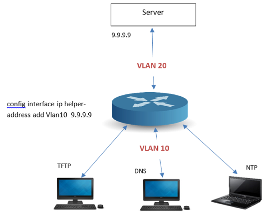
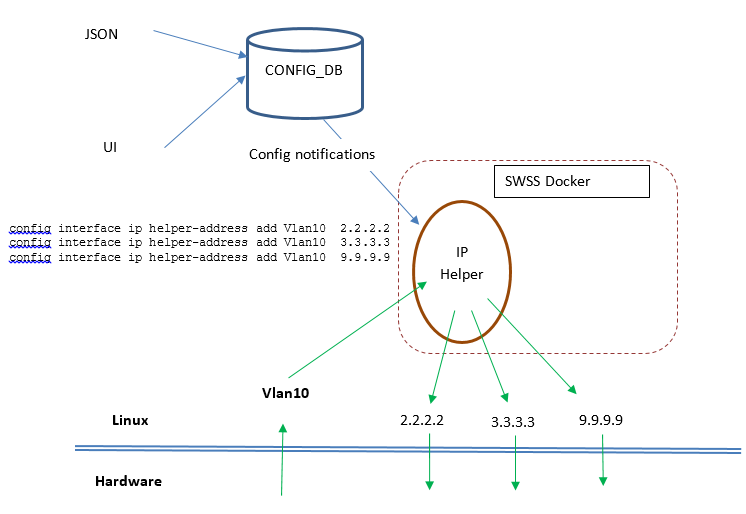

# IP Helper in SONiC

# High Level Design Document
#### Rev 0.1

# Table of Contents
  * [List of Tables](#list-of-tables)
  * [Revision](#revision)
  * [About This Manual](#about-this-manual)
  * [Scope](#scope)
  * [Definition/Abbreviation](#definition-abbreviation)
  * [1 Feature Overview](#1-feature-overview)
    * [1.1 Requirements](#11-requirements)
      * [1.1.1 Functional Requirements](#111-functional-requirements)
      * [1.1.2 Configuration and Management Requirements](#112-configuration-and-management-requirements)
      * [1.1.3 Scalability Requirements](#113-scalability-requirements)
      * [1.1.4 Warm Boot Requirements](#114-warm-boot-requirements)
    * [1.2 Design Overview](#12-design-overview)
      * [1.2.1 Basic Approach](#121-basic-approach)
      * [1.2.2 Container](#122-container)
      * [1.2.3 SAI Overview](#123-sai-overview)
  * [2 Functionality](#2-functionality)
    * [2.1 Target Deployment Use Cases](#21-target-deployment-use-cases)
    * [2.2 Functional Description](#22-functional-description)
      * [2.2.1 UDP ports forwarded](#221-udp-ports-forwarded)
      * [2.2.2 VRF support](#222-vrf-support)
    * [2.2.3 Packet validation](#223-packet-validation)
  * [3 Design](#3-design)
    * [3.1 Overview](#31-overview)
      * [3.1.1 IP Helper Manager](#321-ip-helper-manager)
      * [3.1.2 Packet processing](#312-packet-processing)
      * [3.1.3 Rate limiting](#313-rate-limiting)
    * [3.2 DB Changes](#32-db-changes)
      * [3.2.1 CONFIG DB](#321-config-db)
      * [3.2.2 APP DB](#322-app-db)
      * [3.2.3 COUNTER DB](#325-counter-db)
    * [3.3 SAI](#33-sai)
    * [3.4 CLI](#34-cli)
      * [3.4.1 Data Models](#341-data-models)
      * [3.4.2 Configuration Commands](#342-configuration-commands)
      * [3.4.3 Show Commands](#343-show-commands)
      * [3.4.4 Clear Commands](#344-clear-commands)      
  * [4 Error Handling](#5-error-handling)
  * [5 Serviceability and Debug](#6-serviceability-and-debug)
  * [6 Warm Boot Support](#7-warm-boot-support)
  * [7 Scalability](#8-scalability)
  * [8 Unit Test](#9-unit-test)
    * [8.1 CLI Test Cases](#91-cli-test-cases)
    * [8.2 Rest API Test Cases](#92-rest-api-test-cases)
    * [8.3 Functional Test Cases](#93-functional-test-cases)
    * [8.4 Scaling Test Cases](#94-scaling-test-cases)
    * [8.5 Warm Boot Test Cases](#95-warm-boot-test-cases)
    * [8.6 Negative Test Cases](#96-negative-test-cases)
  * [9 Future support](#9-future-support)

# List of Tables
[Table 1: Abbreviations](#table-1-abbreviations)

# Revision
| Rev |     Date    |       Author       | Change Description                |
|:---:|:-----------:|:---------------------:|-----------------------------------|
| 0.1 | 10/23/2019  | Kiran Kumar Kella     | Initial version                   |

# About this Manual
This document provides details on achieving IP Helper functionality in SONiC.

# Scope
This document describes the high level design of IP Helper functionality.

# Definition/Abbreviation
### Table 1: Abbreviations
| **Term**                 | **Meaning**                         |
|--------------------------|-------------------------------------|
| TFTP                     | Trivial File Transfer Protocol      |
| DNS                      | Domain Name System                  |
| NTP                      | Network Time Protocol               |
| VRF                      | Virtual Routing and Forwarding      |

# 1 Feature Overview
## 1.1 Requirements
### 1.1.1 Functional Requirements
1. Support relaying of UDP broadcast packets as unicast packets to the configured server also referred to as IP Helper address. Relay address and Helper address are used interchangeably through out the document.
2. Support configuration of the IP Helper address per interface.
3. Support configuration of up to 4 IP Helper addresses per interface.
4. Support for enabling UDP broadcast forwarding on default or custom UDP ports to be relayed.
5. Configuring an IP helper address along with UDP forwarding enable, allows relaying by default on the UDP default ports (more details in section 2).
6. Support relay of all-ones broadcast (255.255.255.255) and subnet broadcasts.
7. IP helper addresses are supported in IPv4 address family.
8. IPv4 broadcast packets other than UDP are not relayed.
9. IP Helper does not relay the DHCP broadcast packets. These are processed by DHCP Relay application.
10. If more than 1 IP Helper address is configured, the UDP broadcasts are relayed to all the IP Helper addresses configured on the interface.
11. Support configuring IP Helper address reachable via a different VRF domain. Useful in scenarios where the clients and servers are in different Virtual Forwarding domains.
12. Support configuration of IP Helper addresses on all L3 routing interfaces including Physical Ethernet, PortChannel and VLAN.
13. UDP broadcast traffic needs to be trapped to CPU to be software forwarded to configured relay server addresses.
14. UDP broadcast traffic is dropped if no Helper addresses are configured (or) if there is no route to the Helper addresses.
15. Support for per interface IP Helper statistics.
16. Support rate limiting of incoming UDP broadcast traffic.

### 1.1.2 Configuration and Management Requirements
1. Provide configuration and management commands using Python Click framework CLI.
2. Provide per interface configuration command to add/delete relay addresses.
3. Provide global command to specify the UDP protocols to be relayed.
4. Provide global command to specify the UDP broadcast trap rate to CPU.

### 1.1.3 Scalability Requirements
The maximum number of IP Helper addresses configurable per interface are 4. Configuration of Helper addresses is allowed on all Routing interfaces in the system.

### 1.1.4 Warm Boot Requirements
IP Helper configuration is stateless and hence no state is restored after warm reboot. Any UDP broadcast traffic that is relayed to IP Helper addresses is disrupted/dropped during the duration of the warm reboot or normal reboot.

## 1.2 Design Overview
### 1.2.1 Basic Approach
UDP broadcast packets are trapped to CPU to be relayed in the slow path.
IP Helper application is responsible for forwarding the UDP broadcasts as unicast packets to the relay servers.

### 1.2.2 Container
IP Helper process runs as part of the swss docker in SONiC.

### 1.2.3 SAI Overview
There are no changes to SAI headers/implementation to support this feature. Relayed packets are software forwarded and sent out via socket APIs through the kernel.

# 2 Functionality
## 2.1 Target Deployment Use Cases
IP Helper application can be deployed in both the Enterprise networks and in the DC scenarios.

The below diagram shows the deployment use case.



## 2.2 Functional Description
Hosts in a VLAN send UDP broadcasts on ports like TFTP, DNS, NTP, NetBIOS and custom UDP ports, where the unicast server is not known to the hosts. The Router in the VLAN that behaves as the relay helps in forwarding the requests from the hosts to the configured servers. Helper addresses reside in a different VLAN or Routing domain than the hosts.

### 2.2.1 UDP ports forwarded
When the Helper address is configured on an interface and global UDP forwarding is enabled, by default the UDP broadcasts sent on the following default ports are relayed.
- TFTP (port 69)
- DNS (port 53)
- NTP (37)
- NetBIOS Name Server (port 137)
- NetBIOS Datagram Server (port 138)
- TACACS service (port 49)

By default the forwarding to default UDP ports is disabled.

User can exclude any of the default UDP ports from being forwarded to using the 'config ip forward_protocol udp remove [port]' command.
User can configure custom UDP ports to be relayed by passing the UDP port argument in the 'config ip forward_protocol udp add [port]' command.
DHCP port is not allowed to be configured in the IP Helper forwarded ports, since it is handled by the DHCP Relay application.

### 2.2.3 VRF support
User can configure the server address reachable in a VRF domain, to relay the packets to.
Irrespective of the VRF membership of the interface the packets are received on, they are relayed to the configured server in default or non-default VRF as configured.
Without passing the vrf argument in the 'ip helper-address add' command, the relays are configured to be reachable via default VRF.

### 2.2.3 Packet validation
Packets are relayed only if they meet the following criteria:
- Destination IP address should be 255.255.255.255 or subnet broadcast of the receiving interface (for eg., 10.10.10.255 for the interface configured with subnet IP 10.10.10.10/24).
- UDP port must be one the ports configured to be forwarded (default or custom ports).
- IP TTL value should be >= 2.
- Helper address(es) are configured on the incoming interface.
- UDP forwarding global command should have been enabled.

If any of the criteria is not met, the packets are not relayed.

# 3 Design

## 3.1 Overview
New daemon "IP Helper Manager" is added for the Helper functionality.



### 3.1.1 IP Helper Manager
IP Helper Manager listens to the following events:
- Global UDP forwarding configuration from CONFIG_DB
- Helper addresses from the INTERFACE/VLAN_INTERFACE/PORTCHANNEL_INTERFACE CONFIG tables
- Interface table create/delete events from CONFIG_DB.
- Flush notification event from UI to clear the statistics in the COUNTERS_IP_HELPER table.

When the IP UDP forwarding is enabled, an ACL policy is added to trap the UDP broadcast packets to CPU at the configured rate limit value onto a low priority CoS queue 2.

### 3.1.2 Packet processing
IP Helper Manager receives the broadcast and net-directed broadcast packets incoming on any interface, via UDP RAW sockets with the IP_PKTINFO socket option enabled.

Following the reception, the packet is validated (as mentioned in 2.2.3), the IP TTL value is decremented, UDP checksum recalculated and the packet is sent out in the appropriate routing domain to the Helper addresses.

### 3.1.3 Rate limiting
ACL rule is added to rate limit the CPU bound packets based on the match criteria:
- MAC=FF:FF:FF:FF:FF:FF
- Ethernet protocol is IPv4
- IPv4 protocol is UDP.

## 3.2 DB Changes
### 3.2.1 CONFIG DB
To support a list of Helper addresses on an L3 interface, INTERFACE table is modified to add a new key-value pair where the value is a comma separated list of "vrf-name|ipv4-relay-address".
```
"INTERFACE": {
    "Ethernet24": {
        "helper_addresses": ["31.1.0.2" , "2.2.2.3" , "vrf20|11.19.0.144"]
    }

The Redis DB content looks like:

127.0.0.1:6379[4]> hgetall INTERFACE|Ethernet24
1) "helper_addresses@"
2) "31.1.0.2,2.2.2.3,vrf20|11.19.0.144"
    
Schema looks like this:
; key                      = INTERFACE|interface

field                      = value
HELPER_ADDRESSES           = list-of-helper-addresses

; value annotations
list-of-helper-addresses   = 1^(,)4helper-address ; comma separated list of up to 4 helper addresses
helper-address             = vrf-name|ip-address (or) ip-address
vrf-name                   = Vrf1*4DIGIT             ; vrf name
ip-address                 = dec-octet "." dec-octet "." dec-octet "." dec-octet
dec-octet                  = DIGIT                     ; 0-9  
                             / %x31-39 DIGIT         ; 10-99  
                             / "1" 2DIGIT            ; 100-199  
                             / "2" %x30-34 DIGIT     ; 200-249


Similar schema changes apply to VLAN_INTERFACE and PORTCHANNEL_INTERFACE tables.

To support enable/disable of global UDP broadcast forwarding mode and to selectively exclude/include ports from relaying, following table is added in CONFIG_DB

"UDP_BROADCAST_FORWARDING": {
    Ports: {
        "admin_mode" : "enable"
        "exclude_default_ports" : ["69"]
        "include_ports" : ["334", "2095"]
        "rate_limit_pps" : "6000"
    }
}

Schema looks like this:
; key                      = UDP_BROADCAST_FORWARDING

field                      = value
ADMIN_MODE                 = "enable"/"disable"
EXCLUDE_DEFAULT_PORTS      = port_list
INCLUDE_PORTS              = port_list
RATE_LIMIT_PPS             = rate-limit-value

; value annotations
port_list                  = 1^(,)udp-port-number ; comma separated list port numbers
udp-port-number            = 1*5DIGIT
rate-limit-value           = 3*5DIGIT
```
### 3.2.2 APP DB
No new tables are needed in APP_DB or STATE_DB for the IP Helper feature.

### 3.2.3 COUNTER DB
Following table is introduced to display the statistics of the relayed packets.

```
COUNTERS_IP_HELPER:<interface>
    "Packets received"
    "Packets relayed"
    "Packets dropped"
    "Invalid TTL packets"
    "All ones broadcast packets received"
    "Net directed broadcast packets received"
```

## 3.3 SAI
No changes needed in SAI for this feature.

## 3.4 CLI
### 3.4.1 Data Models
N/A

### 3.4.2 Configuration Commands

```
1. config interface ip helper_address add <interface-name> <ip-address> [-vrf <vrf-name]
Add IP helper address on an interface.

2. config interface ip helper_address remove <interface-name> <ip-address> [-vrf <vrf-name]
Remove IP helper address on an interface.

3. config ip forward_protocol udp enable
Enable UDP broadcast forwarding.

4. config ip forward_protocol udp disable
Disable UDP broadcast forwarding.

5. config ip forward_protocol udp add {[tftp/dns/ntp/netbios-name-server/netbios-datagram-server/tacacs] | <port>}
Add UDP port to the list of forwarding ports.

6. config ip forward_protocol udp remove {[tftp/dns/ntp/netbios-name-server/netbios-datagram-server/tacacs] | <port>}
Remove UDP port from the list of forwarding ports.

7. config ip forward_protocol udp rate_limit <value-in-pps>
Configure the UDP broadcast packet rate limiting value in the range 600 - 10000 pps. The default value is 600 pps.
```

### 3.4.3 Show Commands

```
1. show ip helper_address config <interface>
Use this command to display the IP Helper configuration on the interface

# show ip helper_address config Ethernet24

    Interface   Vrf         Relay address
    -------------------------------------
    Ethernet24              31.1.0.2
                            2.2.2.3
                vrf20       11.19.0.144

2. show ip helper_address config
Use this command to display the IP Helper configuration on all the interfaces

# show ip helper_address config

    Interface   Vrf         Relay address
    -------------------------------------
    Ethernet24              31.1.0.2
                            2.2.2.3
                vrf20       11.19.0.144
    Ethernet28              31.1.0.2


3. show ip forward_protocol
Use this command to display the IP Helper Global configuration

# show ip forward_protocol config

    UDP forwarding: Enabled

    UDP rate limit: 6000 pps

    UDP forwarding enabled on the ports: TFTP , NTP , 330 , 234, 1000

    UDP forwarding disabled on the ports: DNS , NetBios-Name-server , NetBios-datagram-server

4. show ip helper_address statistics [<interface>]
Use this command to display the IP Helper statistics on the interface.
Without the optional interface argument, the statistics are displayed for all the configured interfaces.

# show ip helper_address statistics Ethernet24

    Packets received                              : 1098
    Packets relayed                               :  980
    Packets dropped                               :  118
    Invalid TTL packets                           :   22
    All ones broadcast packets received           :  602
    Net directed broadcast packets received       :  496

# show ip helper-address statistics

Ethernet24
-----------
  Packets received                              : 1098
  Packets relayed                               :  980
  Packets dropped                               :  118
  Invalid TTL packets                           :   22
  All ones broadcast packets received           :  602
  Net directed broadcast packets received       :  496


Ethernet28
-----------
  Packets received                              : 100
  Packets relayed                               : 90
  Packets dropped                               : 10
  Invalid TTL packets                           : 5
  All ones broadcast packets received           : 50
  Net directed broadcast packets received       : 50
```
```
### 3.4.4 Clear Commands

```
1. clear ip helper_address statistics <interface>
Use this command to clear the relay statistics on an interface.

2. clear ip helper_address statistics
Use this command to clear the relay statistics on all the interfaces.
```

# 4 Error Handling

As there is no programming related to the IP Helper feature in the hardware, no hardware error handling is needed for this feature. Any error conditions while relaying the packets can be monitored from the statistics and the logs.

# 5 Serviceability and Debug
The relay statistics can be displayed per interface.
The swssloglevel utility can be used to enable debug tracing of the code at different severity levels.
All the show command outputs are captured as part of the 'show tech-support' output.

# 6 Warm Boot Support
Not applicable for this feature.

# 7 Scalability
Up to 4 IP Helper addresses can be configured on each of the routing interface in the system.
Up to 15 UDP ports (including default and custom ports) are allowed to be configured.

# 8 Unit Test
## 8.1 CLI Test Cases
1. Verify that the global UDP forwarding command is working as expected.
2. Verify that the UDP ports can be excluded or included from the list of forwarding ports.
3. Verify that the IP Helper addresses can be configured and unconfigured on an interface.
4. Verify that the IP Helper addresses can be configured in a VRF routing domain.
5. Verify that the clear statistics command is working as expected.
6. Verify that all show commands are correctly formatted and show the correct information.
   
## 8.2 Rest API Test Cases
N/A

## 8.3 Functional Test Cases
1. Enable global UDP forwarding and configure IP Helper address on an interface and verify relaying is working.
2. Disable global UDP forwarding and verify that relay is not happening.
3. With global UDP forwarding enabled, verify that the relay is happening for all the default UDP ports.
4. Configure UDP forwarding for custom ports and verify that the relay is happening for the port.
5. Configure multiple helper addresses on an interface and verify that packets are relayed to all the configured helper addresses.
6. Exclude an UDP port from being relayed to, and verify that the relay is not happening for that port.
7. Send packets with TTL=1 and verify that the packets are not relayed.
8. Send UDP broadcast traffic and verify that the relay statistics are implemented.
9. Execute the clear statistics command and and verify that the statistics are cleared.
10. Configure relay address in a VRF and verify that the packets are relayed in the VRF domain.
11. Check that the global rate limit is correctly applied.

## 8.4 Scaling Test Cases
1. Verify that 4 IP Helper addresses are configured on all the routing interfaces in the system and the forwarding of the UDP broadcast packets received on all the routing interfaces is happening.

## 8.5 Negative Test Cases
1. Verify that the relay is not working if the IP Helper address is not reachable in a default or non-default VRF routing domain.
2. Verify that the relay is not working if the VRF of the configured Helper address does not exist.

# 9 Future support
1. Support for per interface per helper address statistics.
2. Support for REST/gNMI/IS-CLI UI interfaces.
