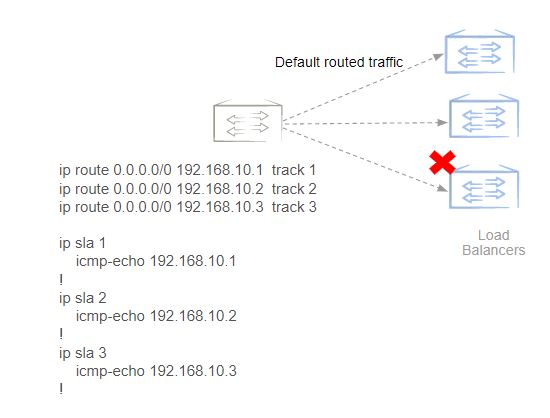
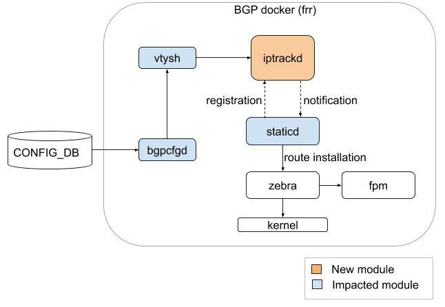
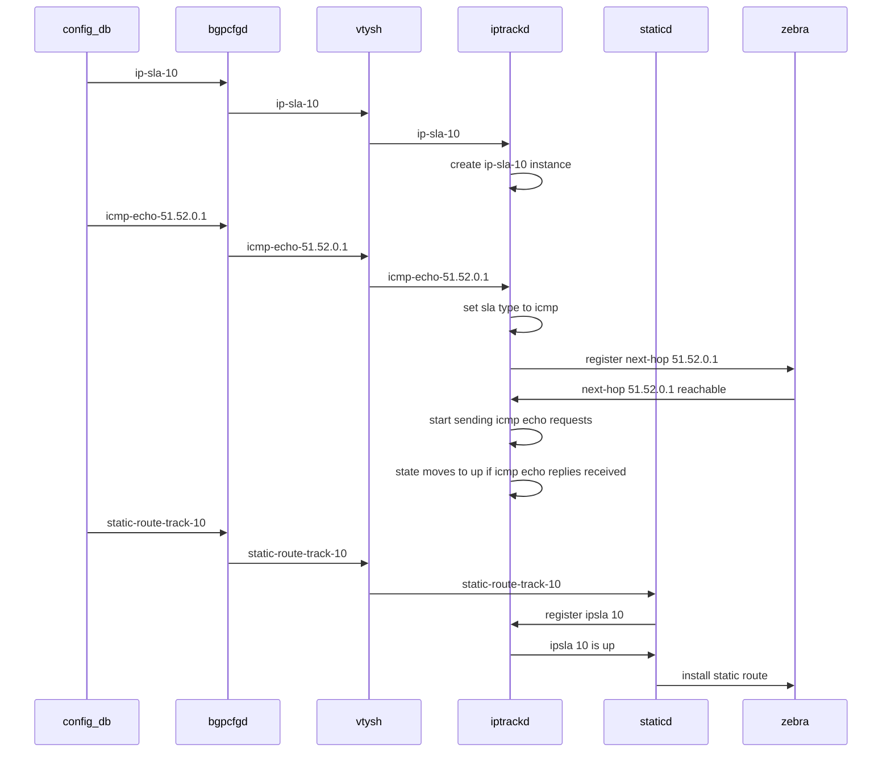
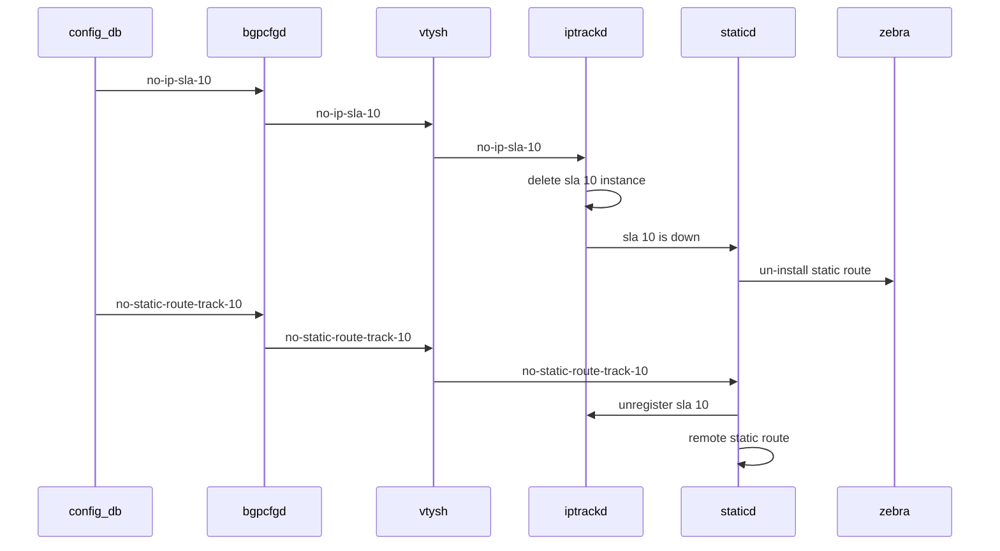

# ICMP and TCP SLA Track

# High Level Design Document

Rev 1.0

# Table of Contents

- [ICMP and TCP SLA Track](#ICMP-and-TCP-SLA-Track)
- [High Level Design Document](#High-Level-Design-Document)
- [List of Tables](#List-of-Tables)
- [Revision](#Revision)
- [About this Manual](#About-this-Manual)
- [Scope](#Scope)
- [Definition/Abbreviation](#Definition/Abbreviation)
  - [Table 1: Abbreviations](#Table-1:-Abbreviations)
- [1 Feature Overview](#1-Feature-Overview)
  - [1.1 Requirements](#1_1-Requirements)
    - [1.1.1 Functional Requirements](#1_1_1-Functional-Requirements)
    - [1.1.2 Configuration and Management Requirements](#1_1_2-Configuration-and-Management-Requirements)
    - [1.1.3 Scalability Requirements](#1_1_3-Scalability-Requirements)
    - [1.1.4 Warm Boot Requirements](#1_1_4-Warm-Boot-Requirements)
    - [1.1.5 Notes:](#1_1_5-Notes:)
  - [1.2 Design Overview](#1_2-Design-Overview)
    - [1.2.1 Basic Approach](#1_2_1-Basic-Approach)
    - [1.2.2 Container](#1_2_2-Container)
    - [1.2.3 SAI Overview](#1_2_3-SAI-Overview)
- [2 Functionality](#2-Functionality)
  - [2.1 Target Deployment Use Cases](#2_1-Target-Deployment-Use-Cases)
  - [2.2 Functional Description](#2_2-Functional-Description)
- [3 Design](#3-Design)
  - [3.1 Overview](#3_1-Overview)
  - [3.2 DB Changes](#3_2-DB-Changes)
    - [3.2.1 CONFIG DB](#3_2_1-CONFIG-DB)
    - [3.2.2 APP DB](#3_2_2-APP-DB)
    - [3.2.3 STATE DB](#3_2_3-STATE-DB)
    - [3.2.4 ASIC DB](#3_2_4-ASIC-DB)
    - [3.2.5 COUNTER DB](#3_2_5-COUNTER-DB)
  - [3.3 FRR Design Changes](#3_3-FRR-Design-Changes)
    - [3.3.1 IP Tracking Daemon Design](#3_3_1-IP-Tracking-Design)
    - [3.3.2 Static routing daemon design changes](#3_3_2-Static-routing-daemon-design-changes)
  - [3.4 SAI](#3_4-SAI)
  - [3.5 CLI](#3_5-CLI)
    - [3.5.1 IS-CLI Compliance](#3_5_1-IS-CLI-Compliance)
    - [3.5.2 Data Models](#3_5_2-Data-Models)
    - [3.5.3 Configuration Commands](#3_5_3-Configuration-Commands)
    - [3.5.4 Show Commands](#3_5_4-Show-Commands)
      - [3.5.4.1 show show ICMP SLA track commands](#3_5_4_1-show-ICMP-SLA-track-commands)
      - [3.5.4.2 show ICMP SLA track commands](#3_5_4_2-show-ICMP-SLA-track-commands)
    - [3.5.5 Debug Commands](#3_5_5-Debug-Commands)
    - [3.5.6 REST API Support](#3_5_6-REST-API-Support)
- [4 Flow Diagrams](#4-Flow-Diagrams)
- [5 Error Handling](#5-Error-Handling)
- [6 Serviceability and Debug](#6-Serviceability-and-Debug)
- [7 Warm Boot Support](#7-Warm-Boot-Support)
- [8 Scalability](#8-Scalability)
- [9 Unit Test](#9-Unit-Test)
  - [9.1 Functional Test Cases](#9_1-Functional-Test-Cases)
  - [9.2 Negative Test Cases](#9_2-Negative-Test-Cases)
  - [9.3 Warm boot Test Cases](#9_3-Warm-boot-Test-Cases)
- [10 Configuration Example](#10-Configuration-Example)
  - [10.1 IP SLA and Static route configuration examples]
  - [10.2 ACL configuration for assigning CIR/PIR to IP SLA traffic]


# List of Tables

[Table 1: Abbreviations](#Table-1-abbreviations)

# Revision

| Rev  | Date       | Author           | Change Description         |
| ---- | ---------- | ---------------- | -------------------------- |
| 0.1  | 05/01/2020 | Syed Hasan Naqvi | Initial version            |
| 0.2  | 06/22/2020 | Syed Hasan Naqvi,| Addressed review comments, |
|      |            | Vijay Vasantha   | Updated restconf details   |

# About this Manual

This document provides general information about ICMP and TCP SLA track features.

# Scope

This document describes the high level design of ICMP and TCP SLA track features being added to FRR docker. Static route commands are enhanced to conditionally install routes based on state of tracked objects.


# Definition/Abbreviation

## Table 1: Abbreviations

| Term | Meaning                           |
| ---- | --------------------------------- |
| ICMP | Internet Control Message Protocol |
| SLA  | Service Level Agreement           |
| TCP  | Transmission Control Protocol     |

# 1 Feature Overview

Services (e.g. TCP optimizer, Firewall, etc.) in the network are provisioned with some level of redundancy. And routers are required to conditionally forward traffic towards those services based on availability of the services. ICMP and TCP SLA track features provide periodic reachability check for the tracked services and conditionally install or uninstall static route(s) toward the service based on the health and liveliness of the service being tracked.


## 1.1 Requirements

### 1.1.1 Functional Requirements

Following are functional requirements for ICMP SLA track feature:

1. Ability to send ICMP echo request to, and process response from, given destination at configurable periodic interval.
2. Ability to send ICMP echo request with specific source address or from specific egress L3 interface.
3. Ability to detect reachability/unreachability of the tracked destination based on reception/loss of ICMP response above specified threshold number of times.
4. Ability to install or remove static route from hw depending on tracked destination becoming reachable or unreachable, respectively.
5. Ability to send and receive ICMP probes with static anycast IP address as source.
6. Ability to classify ICMP echo response frames and assign desired CIR/PIR in order to safe guard it from congestion.

Following are functional requirements of the TCP SLA track feature:

1. Ability to connect TCP socket from application layer to given destination and port at periodic interval.
2. Ability to establish TCP socket connection from specified source address and source port.
3. Ability to detect reachability/unreachability of tracked TCP port based on TCP session establishment being successful/unsuccessful above specified threshold number of times.
4. Ability to install or remove static route from hw depending on tracked TCP port becoming reachable or unreachable, respectively.
5. Ability to connect to remote TCP ports with static anycast IP address as source.
6. Ability to classify TCP connection frames and assign desired CIR/PIR in order to safe guard it from congestion.
   

### 1.1.2 Configuration and Management Requirements

Following are configuration and management requirements for ICMP and TCP SLA track features:

1. Ability to configure ICMP/TCP SLA track destinations in default or user VRFs.
2. Ability to schedule ICMP/TCP tracking at specified time in future and for specified duration of time.
3. Ability to configure a given track object for multiple static routes.
4. Ability to look at the history of past 1000 transition events from reachable to unreachable, and vice versa.

### 1.1.3 Scalability Requirements

- 50 ICMP destinations
- 50 TCP destinations
- Maximum frequency of ICMP echo requests : 1/sec.
- Maximum frequency of TCP connect operation: 1/sec.

### 1.1.4 Warm Boot Requirements

Static route installed before warm boot should continue to be installed in hw during warm reboot until reconciliation.

### 1.1.5 Notes:

Non-goals:

1. This feature doesn't require static route's next-hop to be **behind VxLAN tunnel**. Static route next-hops will continue to be regular IP next-hops.
2. SLA tracks mentioned here is **not intended** to measure jitter, delay, or RTT in real time. Configured frequency and timeout values **will not be considered real-time** in the operation, and actual events happening/processed may be off by several 10s or 100s of milliseconds.
3. A given SLA instance to track multiple targets of same or different types.


## 1.2 Design Overview

### 1.2.1 Basic Approach

A new process (iptrackd) is added to FRR container. Iptrackd handles the configuration and performs periodic probes for the ICMP or TCP destinations. Static routing daemon subscribes to tracked objects with iptrackd and depending on up/down notifications from iptrackd, it installs/removes route(s) from rib.


### 1.2.2 Container

No new container will be added. A new process (iptrackd) will be added in FRR docker and integrated with zebra and staticd. The details of the changes are described in design section below.

### 1.2.3 SAI Overview

There is no new SAI API or SAI attribute required for this feature.

# 2 Functionality

## 2.1 Target Deployment Use Cases
Diagram below shows typical use case of ICMP SLA track. There are a set of load-balancers in the network and router is supposed to forward traffic towards a load-balancer as long as it is active. In the diaram, the moment ping to third load-balancer fails, corresponding next-hop should be removed from the static route ecmp.


__Figure 1a: IP SLA Typical Use case__

TCP SLA track will be monitored periodically by the controller and may take appropriate action to move applications/services away from the failed target.

## 2.2 Functional Description
SLA track is configured using below config command.
```
sonic(config)# ip sla 10
```
A given SLA tracking object can be configured to track ICMP-echo or TCP-connect target.

ICMP-echo target can be configured using "icmp-echo" command:
```
sonic(config-ip-sla)# icmp-echo 192.168.10.1
```

TCP-connect target can be configured using "tcp-connect" command:
```
sonic(config-ip-sla)# tcp-connect 192.168.10.1 port 22
```
A given SLA track object cannot be configured to track multiple targets of same or different types.

Static route can be configured to track specific tracking object.
```
config# ip route 0.0.0.0/0 192.168.10.1 track 10
```
If the specified SLA tracking object does not exist, static route would stay down and will not be installed into the rib (zebra).

There is no restriction on tracking object's type, VRF, or target IP address and the static route's next-hop. That means, a static route can be configured to track an object that has target IP different than static-route's next-hop, or the target IP is of a different address-family, or in a differnet VRF. 

Even though there may not be a valid use-case for static route to track TCP-connect target, but it is allowed from the configuration.

# 3 Design

## 3.1 Overview
ICMP and TCP SLA tracks will be implemented in a separate module (iptrackd) within FRR docker. Static routing daemon (staticd) will be closely interacting with iptrackd and registering for specific SLA ids and getting status change notifictions for registered SLA ids.


__Figure 1a: IP SLA design__ 

Legend in the diagram shows new module (iptrackd), and the modules which will require changes to implement IP SLA track functionality. Details are in sec. 3.3.

## 3.2 DB Changes

### 3.2.1 CONFIG DB
ICMP and TCP SLA configurations will be stored in CONFIG DB.

Below is the config-db schema for the IP SLA configuration.


```
;New table
;holds the IP SLA configuration

key = IP_SLA|sla_number ; IP SLA instance number in (1-255) range

; field = value
threshold = threshold_value ; threshold number of probes to be successful/lost before IP SLA session is brought up/down. default=3 (optional)
timeout = timeout_value ; timeout value in no. of secs to wait before delaring loss of probe. default = 3 (optional)
frequency = frequency_value ; frequency in secs at which probe is sent periodically. default = 30 (optional)

;; Below fields to be populated for ICMP-echo IP SLA configuration
icmp_dst_ip = ip_address    ; IPv4 or IPv6 target IP address
vrf = vrf_name              ; VRF in which target IP address belongs (optional)
icmp_source_ip = ip_address ; Source IPv4/IPv6 address to use for sending ICMP echo requests (optional)
icmp_source_interface = interface_name ; Source interface to send ICMP echo requests from (optional)
icmp_size = payload_size ; ICMP echo request payload size in 28-1472 range (optional)
icmp_ttl = ttl_value ; TTL value in 1-255 range (optional)
icmp_tos = tos_value ; ToS value in 1-255 range (optional)

;; Below fields to be populated for TCP-connect IP SLA configuration
tcp_dst_ip = ip_address     ; IPv4 or IPv6 address of remote TCP target
tcp_dst_port = port_number  ; Target TCP port number 
vrf = vrf_name              ; VRF in which trget IP address belongs (optional)
tcp_source_ip = ip_address  ; Source IPv4/IPv6 address to use for TCP connection to target (optional)
tcp_source_interface = interface_name ; Souce interface to use while connecting to remote target (optional)
tcp_ttl = ttl_value             ; TTL value in TCP connection requests (optional)
tcp_tos = tos_value             ; ToS value in TCP connection requests (optional)
```

#### 3.2.1.1 ICMP SLA Track

Below is the ICMP SLA sample configuration in CONFIG DB.

```
key "IP_SLA|1"
{
"threshold"
"30"
"timeout"
"60"
"frequency"
"5"
"icmp_size"
"1500"
"icmp_source_interface"
"Ethernet64"
"icmp_source_ip"
"100.0.0.1"
"icmp_dst_ip"
"200.0.0.1"
"vrf"
"Vrf1"
}  

key "IP_SLA|2"
{
"threshold"
"10"
"timeout"
"30"
"frequency"
"2"
"icmp_size"
"1000"
"icmp_source_interface"
"Vlan1000"
"icmp_source_ip"
"50::1"
"icmp_dst_ip"
"20::1"
} 
```

#### 3.2.1.2 TCP SLA Track

Below is the TCP SLAsample configuration in CONFIG DB.

```
key "IP_SLA|3"
{
"threshold"
"20"
"timeout"
"100"
"frequency"
"5"
"tcp_source_ip"
"1.0.0.1"
"icmp_dst_ip"
"20.0.0.1"
"tcp_ttl"
"20"
} 

key "IP_SLA|4"
{
"threshold"
"30"
"timeout"
"60"
"frequency"
"5"
"tcp_source_ip"
"100::1"
"icmp_dst_ip"
"120::1"
"tcp_tos"
"48"
"vrf"
"Vrf5"
} 
```

#### 3.2.1.3 Static route config enhancement

### 3.2.2 APP DB

There is no change to APP DB.

### 3.2.3 STATE DB

There is no change to STATE DB.

### 3.2.4 ASIC DB

There is no change to ASIC DB.

### 3.2.5 COUNTER DB

There is no change to COUNTER DB.

## 3.3 FRR Design Changes

### 3.3.1 IP Tracking daemon (iptrackd) design
Following are new files added and functionalities implemented in iptrackd:
**iptrack_main.c** : Main routine and entry point for the daemon.
**iptrack_sla.c**: Submodule to create, start, stop, dump, and destroy IP SLA track objects.
**iptrack_icmp.c**: Submodule to handle ICMP echo request and response processing and triggering state change for ICMP-echo tracking objects. 
**iptrack_tcp.c**: Submodule to handle TCP connection request and success/failure events for TCP-connect tracking objects.
**iptrack_nht.c**: Submodule to register configured target with Zebra for route reachability.
**iptrack_zebra.c**: Submodule to handle interface, VRF, next-hop events from Zebra.
**iptrack_vty.c**: Submodule to handle config and show CLIs for IP SLA track.

### 3.3.3 Zebra and FRR library changes
IP SLA track registration by staticd will follow the same approach as implemented for bfd. This requires following zclient messages to be implemented in zebra and FRR library:


    ZEBRA_IPSLA_CLIENT_REGISTER
        Sent by staticd for registering itself as client of iptrackd 
        
    ZEBRA_IPSLA_CLIENT_DEREGISTER
        Message to deregister itself as iptrackd's client.
        
    ZEBRA_IPSLA_ID_REGISTER
        Message to register for status change notifications for specific SLA ID
    
    ZEBRA_IPSLA_ID_DEREGISTER
        Message to un-register specific SLA ID with iptrackd.
        
    ZEBRA_IPSLA_ID_STATE_UPDATE
        Message sent by iptrackd to its clients notifying state change for a given SLA ID.    


### 3.3.2 Static routing daemon design change

### 3.3.4 bgpcfgd changes
**Bgpcfgd** is a service already implemented in bgp docker to listen to config-db change events and convert such events to FRR config/unconfig commands. Bgpcfgd will be enhanced to process IP SLA track config-db changes and invoke corresponding vtysh commands.

## 3.4 SAI

There is no change to SAI.

## 3.5 CLI

### 3.5.1 IS-CLI Compliance
Configuration for SLA track will follow FRR configuration design pattern. FRR CLIs will be implemted and acessible via vtysh. Sonic configuration management framework will populate config-db entries for IP SLA track and bgpcfgd will listen to config change events and invoke corresponding ip-sla config commands.

IP SLA track show output will also follow the FRR design pattern. Sonic-management framework transformer code will invoke vtysh command and collect json output. The json output will be parsed and converted to render rest in the management framework modules.

### 3.5.3 Configuration Commands

The following commands will be used to configure ICMP SLA track.

```
sonic(config)# ip sla 10
sonic(config-ip-sla-10)# icmp-echo <destination> [vrf <vrf>]
sonic(config-ip-sla-10-icmp)# source-address <source-address>
sonic(config-ip-sla-10-icmp)# source-interface <interface>
sonic(config-ip-sla-10-icmp)# request-data-size <28-1472>
sonic(config-ip-sla-10-icmp)# ttl <1-255>
sonic(config-ip-sla-10-icmp)# tos <1-255>

```

The following commands will be used to configure TCP SLA track.


```
sonic(config)# ip sla 20
sonic(config-ip-sla-20)# tcp-connect <destionation> <port> [vrf <vrf>]
sonic(config-ip-sla-20-tcp)# source-address <ip-address>
sonic(config-ip-sla-20-tcp)# source-port <port>
sonic(config-ip-sla-20-tcp)# source-interface <interface>
sonic(config-ip-sla-20-tcp)# ttl <1-255>
sonic(config-ip-sla-20-tcp)# tos <1-255>
sonic(config-ip-sla-20-tcp)# exit
```

The following configuration commands are common to ICMP and TCP SLA Track:

```
sonic(config-ip-sla-number)# frequency <1-300>
sonic(config-ip-sla-number)# threshold <1-1000>
sonic(config-ip-sla-number)# timeout 1000
sonic(config-ip-sla-number)# 
```

Static route can be configured to track a given SLA track object:
```
sonic(config)# ip route 0.0.0.0 2.2.2.2 track 10
```

### 3.5.4 Show Commands

Summary output listing all of the configured IP SLAs:
```
sonic# show ip sla
SLA#    Type         State Target                    VRF          Transitions  Last change
----    ----         ----- ------------------------  -----------  -----------  -----------
10      TCP-connect  Up    51.52.0.1(22)             default      29           01:16:16 ago
11      ICMP-echo    Up    4090::2                   default      1            2d09h48m ago
12      TCP-connect  Down  4090::2(22)               default      0            2d09h50m ago
20      ICMP-echo    Up    51.52.0.1                 default      1            2d09h48m ago
```

#### 3.5.4.1 show ICMP SLA track commands
Show output of specific ICMP-echo IP SLA instance:

```
sonic# show ip sla 20
IP SLA Operation Number: 20
    Type of Operation: ICMP-echo
    ICMP destination IP address: 51.52.0.1
    ICMP source IP address:
    ICMP source interface: Vlan4090
    ICMP request data size: 32
    ICMP Time-To-Live(TTL): 0
    ICMP Type-of-Service(ToS): 0
    Source VRF: default
    Operation frequency (sec): 1
    Operation timeout (sec): 3
    Operation threshold: 3
    Operation state: Up
    Operation state transitions: 1
    Operation last state change: 2d09h49m ago
    ICMP Echo Request counter: 191708
    ICMP Echo Reply counter: 191707
    ICMP Error counter: 114
    ICMP Invalid responses: 0
sonic#
```

Detailed show output of specific ICMP-echo IP SLA instance:

```
sonic# show ip sla 20 detail
IP SLA Operation Number: 20
    Type of Operation: ICMP-echo
    ICMP destination IP address: 51.52.0.1
    ICMP source IP address:
    ICMP source interface: Vlan4090
    ICMP request data size: 32
    ICMP Time-To-Live(TTL): 0
    ICMP Type-of-Service(ToS): 0
    Source VRF: default
    Operation frequency (sec): 1
    Operation timeout (sec): 3
    Operation threshold: 3
    Operation state: Up
    Operation state transitions: 1
    Operation last state change: 2d09h50m ago
    ICMP Echo Request counter: 191758
    ICMP Echo Reply counter: 191758
    ICMP Error counter: 114
    ICMP Invalid responses: 0
    VRF present: True
    NHT registered: True
    NHT reachable: True
    Source interface present: True
    Socket fd: 14
    Threshold counter: 0
    Last error: Pkt send error(Network is unreachable)
    Last error happened: 2d09h50m ago
sonic#

```

History output of specific IP SLA instance:
```
sonic# show ip sla 20 history
Timestamp                 Event
---------                 -----
Sat Jun 20 10:27:27 2020  Started
Sat Jun 20 10:27:27 2020  Pkt send error(Network is unreachable)
Sat Jun 20 10:29:25 2020  State changed to: Up
sonic#


```

#### 3.5.4.2 show TCP SLA track commands
Show output of specific TCP-connect IP SLA instance:
```
sonic# show ip sla 10
IP SLA Operation Number: 10
    Type of Operation: TCP-connect
    TCP destination IP address: 51.52.0.1
    TCP destination port: 22
    TCP source IP address: 40.90.0.0
    TCP source port: 1020
    TCP source interface:
    TCP Time-To-Live(TTL): 0
    TCP ToS (Type-of-Service): 0
    Source VRF: default
    Operation frequency (sec): 1
    Operation timeout (sec): 3
    Operation threshold: 3
    Operation state: Up
    Operation state transitions: 29
    Operation last state change: 01:19:34 ago
    TCP connect request counter: 191876
    TCP connect success counter: 191762
    TCP connect error counter: 59
sonic#
```

Detailed show output of specific TCP-connect IP SLA instance:
```
sonic# show ip sla 10 detail
IP SLA Operation Number: 10
    Type of Operation: TCP-connect
    TCP destination IP address: 51.52.0.1
    TCP destination port: 22
    TCP source IP address: 40.90.0.0
    TCP source port: 1020
    TCP source interface:
    TCP Time-To-Live(TTL): 0
    TCP ToS (Type-of-Service): 0
    Source VRF: default
    Operation frequency (sec): 1
    Operation timeout (sec): 3
    Operation threshold: 3
    Operation state: Up
    Operation state transitions: 29
    Operation last state change: 01:19:39 ago
    TCP connect request counter: 191881
    TCP connect success counter: 191767
    TCP connect error counter: 59
    VRF present: True
    NHT registered: True
    NHT reachable: True
    Threshold counter: 3
    Last error: Socket connect error(Cannot assign requested address)
    Last error happened: 00:13:20 ago
sonic#

```


### 3.5.5 Clear commands 
Below commands can be used to clear statistics and history for all of the IP
SLA instances or for a particular one.

```
sonic# clear ip sla all
sonic# clear ip sla <1-255>
```

### 3.5.6 Debug Commands
Debugging for IP SLA can be enabled using below iptrack commands from FRR vtysh:
```
sonic# debug iptrack
sonic# debug iptrack sla <1-255>
```
The first command above enables debug logs for all of the IP SLA instances.
Whereas the second command above enables debug logs only for the given IP SLA
instance.


### 3.5.7 REST API Support

The following REST API with actions GET, HEAD, PATCH & DELETE will be supported for IP SLA.

/restconf/data/openconfig-ip-sla:ip-slas

/restconf/data/openconfig-ip-sla:ip-slas/ip-sla={ip-sla-id}

/restconf/data/openconfig-ip-sla:ip-slas/ip-sla

/restconf/data/openconfig-ip-sla:ip-slas/ip-sla={ip-sla-id}/config

/restconf/data/openconfig-ip-sla:ip-slas/ip-sla={ip-sla-id}/config/frequency

/restconf/data/openconfig-ip-sla:ip-slas/ip-sla={ip-sla-id}/config/threshold

/restconf/data/openconfig-ip-sla:ip-slas/ip-sla={ip-sla-id}/config/timeout

/restconf/data/openconfig-ip-sla:ip-slas/ip-sla={ip-sla-id}/config/tcp-source-port

/restconf/data/openconfig-ip-sla:ip-slas/ip-sla={ip-sla-id}/config/tcp-dst-port

/restconf/data/openconfig-ip-sla:ip-slas/ip-sla={ip-sla-id}/config/tcp-source-interface

/restconf/data/openconfig-ip-sla:ip-slas/ip-sla={ip-sla-id}/config/tcp-ttl

/restconf/data/openconfig-ip-sla:ip-slas/ip-sla={ip-sla-id}/config/tcp-tos

/restconf/data/openconfig-ip-sla:ip-slas/ip-sla={ip-sla-id}/config/tcp-source-ip

/restconf/data/openconfig-ip-sla:ip-slas/ip-sla={ip-sla-id}/config/tcp-dst-ip

/restconf/data/openconfig-ip-sla:ip-slas/ip-sla={ip-sla-id}/config/vrf

/restconf/data/openconfig-ip-sla:ip-slas/ip-sla={ip-sla-id}/config/icmp-source-interface

/restconf/data/openconfig-ip-sla:ip-slas/ip-sla={ip-sla-id}/config/icmp-source-ip

/restconf/data/openconfig-ip-sla:ip-slas/ip-sla={ip-sla-id}/config/icmp-dst-ip

/restconf/data/openconfig-ip-sla:ip-slas/ip-sla={ip-sla-id}/config/icmp-size

The following REST APIs with actions HEAD & GET will be supported for IP SLA.

/restconf/data/openconfig-ip-sla:ip-slas/ip-sla={ip-sla-id}/state

/restconf/data/openconfig-ip-sla:ip-slas/ip-sla={ip-sla-id}/state/ip-sla-id

/restconf/data/openconfig-ip-sla:ip-slas/ip-sla={ip-sla-id}/state/frequency

/restconf/data/openconfig-ip-sla:ip-slas/ip-sla={ip-sla-id}/state/threshold

/restconf/data/openconfig-ip-sla:ip-slas/ip-sla={ip-sla-id}/state/timeout

/restconf/data/openconfig-ip-sla:ip-slas/ip-sla={ip-sla-id}/state/tcp-source-port

/restconf/data/openconfig-ip-sla:ip-slas/ip-sla={ip-sla-id}/state/tcp-dst-port

/restconf/data/openconfig-ip-sla:ip-slas/ip-sla={ip-sla-id}/state/tcp-source-interface

/restconf/data/openconfig-ip-sla:ip-slas/ip-sla={ip-sla-id}/state/tcp-ttl

/restconf/data/openconfig-ip-sla:ip-slas/ip-sla={ip-sla-id}/state/tcp-tos

/restconf/data/openconfig-ip-sla:ip-slas/ip-sla={ip-sla-id}/state/tcp-source-ip

/restconf/data/openconfig-ip-sla:ip-slas/ip-sla={ip-sla-id}/state/tcp-dst-ip

/restconf/data/openconfig-ip-sla:ip-slas/ip-sla={ip-sla-id}/state/vrf

/restconf/data/openconfig-ip-sla:ip-slas/ip-sla={ip-sla-id}/state/icmp-source-interface

/restconf/data/openconfig-ip-sla:ip-slas/ip-sla={ip-sla-id}/state/icmp-source-ip

/restconf/data/openconfig-ip-sla:ip-slas/ip-sla={ip-sla-id}/state/icmp-dst-ip

/restconf/data/openconfig-ip-sla:ip-slas/ip-sla={ip-sla-id}/state/icmp-size

/restconf/data/openconfig-ip-sla:ip-slas/ip-sla={ip-sla-id}/state/transition

/restconf/data/openconfig-ip-sla:ip-slas/ip-sla={ip-sla-id}/state/timestamp

/restconf/data/openconfig-ip-sla:ip-slas/ip-sla={ip-sla-id}/state/lastchange

/restconf/data/openconfig-ip-sla:ip-slas/ip-sla={ip-sla-id}/state/transition-count

/restconf/data/openconfig-ip-sla:ip-slas/ip-sla={ip-sla-id}/state/icmp-operation-state

/restconf/data/openconfig-ip-sla:ip-slas/ip-sla={ip-sla-id}/state/icmp-success-counter

/restconf/data/openconfig-ip-sla:ip-slas/ip-sla={ip-sla-id}/state/icmp-fail-counter

/restconf/data/openconfig-ip-sla:ip-slas/ip-sla={ip-sla-id}/state/icmp-echo-req-counter

/restconf/data/openconfig-ip-sla:ip-slas/ip-sla={ip-sla-id}/state/icmp-echo-reply-counter

/restconf/data/openconfig-ip-sla:ip-slas/ip-sla={ip-sla-id}/state/icmp-error-counter

/restconf/data/openconfig-ip-sla:ip-slas/ip-sla={ip-sla-id}/state/tcp-operation-frequency

/restconf/data/openconfig-ip-sla:ip-slas/ip-sla={ip-sla-id}/state/tcp-operation-timeout

/restconf/data/openconfig-ip-sla:ip-slas/ip-sla={ip-sla-id}/state/tcp-operation-state

/restconf/data/openconfig-ip-sla:ip-slas/ip-sla={ip-sla-id}/state/tcp-operation-success-counter

/restconf/data/openconfig-ip-sla:ip-slas/ip-sla={ip-sla-id}/state/tcp-operation-fail-counter

/restconf/data/openconfig-ip-sla:ip-slas/ip-sla={ip-sla-id}/state/tcp-connect-req-counter

/restconf/data/openconfig-ip-sla:ip-slas/ip-sla={ip-sla-id}/state/tcp-connect-success-counter

/restconf/data/openconfig-ip-sla:ip-slas/ip-sla={ip-sla-id}/state/tcp-connect-fail-counter

# 4 Flow Diagrams

### 4.1.1 Configure sequence of ip-sla and static route
Below flow diaram shows sample sequence of config of ip-sla and static route
tracking a given ip-sla number.



### 4.1.2 Unconfigure sequence of ip-sla and static route
Sequence diagram below shows sample sequence of unconfiguring ip-sla instance
first and then removing the static route.




# 5 Error Handling
No SAI attribute change require error handling specific to IP SLA.


# 6 Serviceability and Debug

# 7 Warm Boot Support
No specific handling required for warm-boot.

Static routes would be maintained in forwarding plane until the reconciliation
timer expires (default 5 mins). IP SLA timeouts are to be configured such that
IP SLA state is brought up before reconciliation happens.

# 8 Scalability

| SLA Track Type | Max instances supported |
| -------------- | ----------------------- |
| ICMP           | 50                      |
| TCP            | 50                      |

# 9 Unit Test

## 9.1 Functional Test Cases

1. Verify ICMP echo and TCP connection requests are sent at specified interval
2. Verify when remote end is brought down/unconfigured, SLA track status goes down after threshold number of unsuccessful attempts.
3. Verify when remote end is brought up/configured, SLA track status goes up after threshold number of successful attempts.
4. Verify static route is installed/uninstalled after tracked SLA status goes up/down.
5. Verify ICMP echo and TCP connect with same IP addresses across different VRFs
6. Verify ICMP and TCP tracks are functional with connected, bgp, static, ospf, and leaked route sources.
7. Verify ICMP and TCP sla tracks do not flap while unknown neighbor traffic at line rate is sent causing cpu queues to get stressed.
8. Verify history of the ICMP and TCP track transitions are logged correctly.

## 9.2 Negative Test Cases
1. Verify ICMP and TCP tracks are resumed after reachable route is flapped.
2. Verify ICMP and TCP tracks are resumed after VRF is deleted and added back
3. Verify ICMP and TCP tracks are resumed after outgoing interface is flapped
4. Verify ICMP and TCP tracks are resumed after unconfig/config.
5. Verify multiple ICMP and TCP tracks to the same destination.

## 9.3 Scale Test Cases
1. Verify max no. of ICMP and TCP tracks at the same time in the same VRF.
2. Verify max no. of ICMP (50) and TCP tracks (50) in different VRFs.
3. Verify all of the ICMP and TCP tracks status transitions on various triggers (e.g. route flap, vrf flap, interface flap)

## 9.4 Warm boot Test Cases

1. Verify static route traffic remains unimpacted while device undergoes warm-reboot

# 10 Configuration Example

## 10.1 IP SLA and Static route configuration examples

```
ip sla 1
    icmp-echo 192.168.1.10 vrf Vrf-red
!

ip sla 2
    icmp-echo 192.168.1.20 vrf Vrf-red
!

ip sla 3
    icmp-echo fe80::dc25:d9ff:feef:90a2 vrf Vrf-red
        source-interface Ethernet0
    !
!

ip sla 4
    tcp-connect 192.168.1.10 port 22 vrf Vrf-red
!
```

```
ip route 0.0.0.0/0 192.168.1.10 track 1
ip route 0.0.0.0/0 192.168.1.20 track 2
```

## 10.2 ACL configuration for assigning CIR/PIR to IP SLA traffic
This section describes how ACL can be used to classify TCP traffic from remote
SLA tracked destination and assign desired CIR/PIR.

Please refer to ACL HLD for more details.

Following steps can be followed to configure the access-list and policy map:
i) Create ip access list 
ii) Create classifier & map this access list created in previous step.
iii) Create policy & map classifier created in previous step.
iv) Set CIR in policy map
v) Apply the policy map to entire switch (global mode)


Access list can be configured for specific source and destination pair and
corresponding source and destination TCP ports.
```
sonic(config)# ip access-list test-acl
sonic(config-ipv4-acl)# seq 1 permit tcp host 1.1.1.1 eq 1000 host 2.2.2.2 eq 2000
```

Or it can configured with source IP address range and the destination port
for the incoming TCP frames from remote.
```
sonic(config)# ip access-list test-acl
sonic(config-ipv4-acl)# seq 2 permit tcp 100.0.0.0/24 any eq 2000
```

Configure classifier:
```
sonic(config)# classifier c1 match-type acl
sonic(config-classifier)# ip access-group test-acl in
```

Configure QoS policy:
```
sonic(config)# policy p1 type qos
sonic(config-policy-flow)# police cir 1000
```

Verify QoS policy is configured:
```
sonic(config-policy-flow)# do show policy
Policy copp-system-policy Type copp
Policy p1 Type qos
  Description:
  Flow c1 at priority 50
    Description:
    police cir 1000 cbs 0 pir 0 pbs 0
  Applied to
    Switch at Ingress
sonic(config-policy-flow)#
```

For debgging purpose, counters can be verified as below:
```
debugsh> show system internal orchagent policer statistics
Policer Name: p1:c1:Switch:INGRESS
Policer OID: 0x12000000000bed
Status:0x0
Packets:166821121 Bytes:0x21353106432
GreenPackets:19780 GreenBytes:0x2531840
YellowPackets:101 YellowBytes:12928
RedPackets:166801304 RedBytes:21350567808

debugsh>
```
