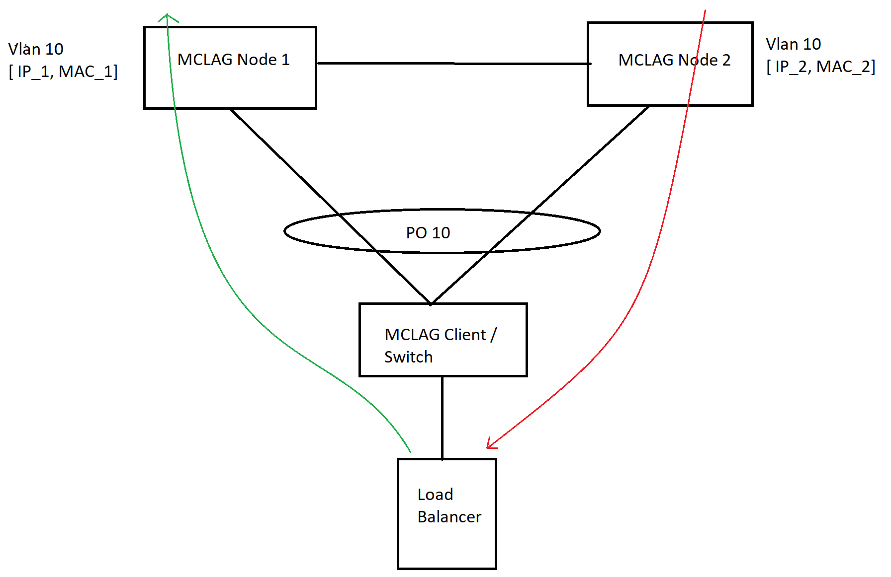

# SONiC MCLAG Enhancements for supporting Peer Gateway
Rev 0.1

# Table of Contents

### Table of Contents
- **[List of Tables](#List-of-Tables)**
- **[Revision](#Revision)**
- **[About this Manual](#About-this-Manual)**
- **[Definition/Abbreviation](#DefinitionAbbreviation)**
	- [Table 1: Abbreviations](#Table-1:-Abbreviations)
- **[1 Feature Overview](#1-Feature-Overview)**
	- [1.1 Functional Requirements](#1_1-Functional-Requirements)
		- [1.1.1 Peer Gateway Requirements](#1_1_1-Peer-Gateway-Requirements)
- **[2 Functionality](#2-Functionality)**
	- [2.1 Functional Description](#2_1-Functional-Description)
		- [2.1.1 Peer Gateway enhancements](#2_1_1-Peer-Gateway-enhancements)
- **[3 Design](#3-Design)**
	- [3.1 Overview](#3_1-Overview)
	- [3.2 DB Changes](#3_2-DB-Changes)
		- [3.2.1 CONFIG DB](#3_2_1-CONFIG-DB)
			- *[3.2.1.1 Peer Gateway Table](#3_2_1_1-MCLAG-Peer-Gateway-Table)*
		- [3.2.2 APP DB](#3_2_2-APP-DB)
			- *[3.2.2.1 Interface Table](#3_2_2_1-Interface-Table)*
	- [3.3 ICCP Changes](#3_3-ICCP-Changes)
		- [3.3.1 MC LAG Peer Gateway changes](#3_3_1-MC-LAG-Peer-Gateway-changes)
	- [3.4 SWSS Changes](#3_3-SWSS-Changes)
		- [3.4.1 Orchagent changes](#3_4_1-Orchagent-changes)
	- [3.5 CLI](#3_5-CLI)
		- [3.5.1 Click based CLI](#3_5_1-Click-based-CLI)
			- *[3.5.1.1 Configuration and show commands](#3_5_1_1-Configuration-and-show-commands)*
		- [3.5.2 Sonic CLI](#3_5_1-Sonic-CLI)
			- *[3.5.2.1 Configuration commands](#3_5_2_1-Configuration-commands)*
			- *[3.5.2.2 Show commands](#3_5_2_2-Show-commands)*
- **[4 Unit Test](#4-Unit-Test)**
	- [4.1 Redis DB table updates](#4_1-Redis-DB-table-updates)
	- [4.2 Config handling](#4_2-Config-handling)
	- [4.3 MLAG Peer Gateway Enhancements](#4_3-MLAG-Peer-Gateway-Enhancements)

# List of Tables

[Table 1: Abbreviations](#table-1-abbreviations)

# Revision
| Rev  | Date       | Author                                   | Change Description |
| ---- | ---------- | ---------------------------------------- | ------------------ |
| 0.1  | 06/05/2021 | Tapash Das                               | Peer Gateway support enhancement |

# About this Manual
This document provides general information about SONiC MCLAG feature enhancements for supporting Peer Gateway.


# Definition/Abbreviation
## Table 1: Abbreviations
| **Term** | **Definition**                       |
| -------- | ------------------------------------ |
| MCLAG    | Multi-Chassis Link Aggregation Group |
| ICCP     | Inter-Chassis Communication Protocol |

# 1 Feature Overview

This document captures the feature enhancements for supporting Peer Gateway over SONiC ICCP MCLAG.
This document is in addition to the Nephos MLAG HLD and Broadcom MLAG Enhancement HLD. 

## 1.1 Functional Requirements

### 1.1.1 MCLAG Peer Gateway Vlan interface Requirements
- MCLAG Peer gateway functionality allows a MCLAG switch/node to act as active gateway for packets that are addressed to the router MAC address of MCLAG Peer node.
- This feature enables local L3 forwarding of such packets without the need to switch the packet over peer link.
- This feature avoids traffic over peer link with Unique IP configuration.

# 2 Functionality

## 2.1 Functional Description

### 2.1.1 Peer Gateway enhancements
- With Unique IP configuration, MCLAG nodes uses separate IP's and separate MAC's.
- Due to LAG hashing, traffic with MAC of one of the MCLAG node can reach peer node. This traffic then gets switched over peer link.
- A new configuration command is introduced for allowing peer gateway configuration on Unique IP Vlan interface associated with MCLAG interface.
- With peer gateway configuration, traffic with peer node's router MAC will be routed by local node instead of switching the traffic over Peer Link.
- Peer gateway configuration is applicable to only vlan interface with Unique IP configured.
- Peer gateway configuration should be done in both MCLAG node.

# 3 Design

## 3.1 Overview
New changes will be added on top of the existing MCLAG implementation. 
MCLAG Peer Gateway enhancement allows interoperability with some network attached storage (NAS) or load balancer devices that do not perform a typical default gateway ARP request on boot up.
Peer gateway allows a MCLAG peer device to act as a active gateway for packets addressed to the other peer device router MAC.
It keeps the forwarding of the traffic local the MCLAG Peer nodes and avoids use of peer link (by not bridging the traffic to the other MCLAG peer node). 



**Figure 1: Overview of peer gateway**

As shown in figure, a load balancer device (not running standard ARP request for IP default gateway) is connected to an access switch / MCLAG Client which is attached to MCLAG devices MCLAG Node 1 and MCLAG Node 2.
MCLAG Nodes are configured with Vlan interface for the vlan where load balancer is connected (say Vlan 10).
As load balancer device don't perform standard ARP request to retrieve MAC address of default gateway, it uses another method to learn this MAC address.
This can be done by listening to network traffic and selecting the first received source MAC address as default gateway MAC address.

Lets assume load balancer device receives its first packet from MCLAG Node 2, in this case it will use MAC address of interface Vlan 10 (MAC 2) as default gateway MAC address. All routed traffic sent by load balancer device need then to reach MCLAG Node 2 in order to be routed correctly. This results in sub-optimal routing and traffic over peer link.

By enabling peer gateway, if traffic with gateway MAC as MAC 2 lands on MCLAG Node 1 (due to LAG hashing), MCLAG Node 1 will route the packet instead of switching to peer link. 

## 3.2 DB Changes

### 3.2.1 CONFIG DB

#### 3.2.1.1 MCLAG Peer Gateway Table

```
Producer: Configuration
Consumer: MclagSyncd 
Description: New table to store Peer gateway configuration for Vlan interfaces. MCLAG applications can query this table to check whether a interface is configured for Peer gateway support.

;New MCLAG Peer Gateway Table
key              = MCLAG_PEER_GATEWAY|ifname ; Only Vlan interface supported currently

```

### 3.2.2 APP DB

#### 3.2.2.1 INTF_TABLE table

```
Producer: MclagSyncd
Consumer: Interface Orch Agent
Description: Interface table contains peer mac address information.


key = INTF_TABLE:ifname ; Only Vlan interface supported currently

;fields
peer_gateway_mac        = 12HEXDIG ; system mac of MCLAG peer node.

```

## 3.3 ICCP Changes

### 3.3.1 Peer Gateway Changes
To support peer gateway configuration on Vlan interface for the vlans associated with MCLAG interface following changes will be done.
- For the vlan interface on which peer gateway is configured, update interface table in APP DB with MCLAG Peer nodes system MAC.
- Peer node's MAC is processed by Interface Orchagent to update MY MAC Table in SAI.

## 3.4 Switch State Service Design

### 3.4.1 Orchestration Agent

#### 3.4.1.1 Interface orch agent

Interface table in APP DB is updated with Peer nodes system MAC.
Interface Orch call newly introduced SAI attribute to updated the MY MAC Table in SAI.

## 3.5 CLI
### 3.5.1 Click based CLI

#### 3.5.1.1 Configuration and Show commands

New configuration commands is introduced to configure Peer Gateway.

##### 3.5.1.1.1 MCLAG Peer Gateway configuration

**config mclag peer-gateway {add | del} {Vlan-interface-names}**

- Vlan-interface-names : Vlan interface for which Peer Gateway can be configured.

##### 3.5.1.1.2 Show MCLAG Peer Gateway configuration

**mclagdctl dump peer-gateway**

- Dump MCLAG peer gateway configured vlan interface

### 3.5.2 SONiC CLI

#### 3.5.2.1 Configuration commands

Following KLISH based CLI configuration commands are introduced to configure MCLAG peer gateway.

##### 3.5.2.1.1 MCLAG peer gateway configuration

To configure and unconfigure MCLAG peer gateway at interface configuration level use below command. 
Config command enabled peer gateway functionality on Vlan interface.

```
sonic(conf-if-Vlan10)# [no] mclag-peer-gateway

```

#### 3.5.2.2 Show commands

Following new KLISH based show commands are introduced

Displays brief information about MCLAG peer gateway

```
1. show mclag peer-gateway

sonic# show mclag peer-gateway
Interface Name
==============
Vlan10
==============
Total count :    1
==============
```

# 4 Unit Test

## 4.1 Redis DB table updates
1. Verify that peer gateway configuration of add/delete is updated in CONFIG_DB MCLAG_PEER_GATEWAY Table

## 4.2 Config handling
1. Verify peer gateway configuration on vlan interface

## 4.3 MCLAG peer gateway enhancements
1. Verify traffic forwarding with MCLAG peeer gateway configuration.
2. Verify MY TCAM programing on ICCP session Up and session down.
3. Verify MY TCAM programing on adding vlan and removing vlan from peer link..
4. Verify IPv4 and IPv6 routing with traffic


