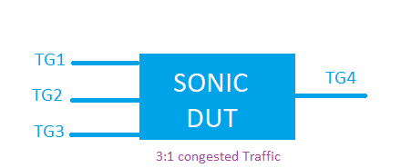

#  SQA Test Plan
# watermark using snapshot
#  SONiC 3.0-4.0.0 Projects and Buzznik/Cyrus Releases
[TOC]
# Test Plan Revision History
| Rev | Date | Author | Change Description |
|:---:|:-----------:|:------------------:|-----------------------------|
| 0.2  | 08/16/2021 | prudviraj kristipati | Enhanced version    |
| 0.1  | 10/30/2019 | phani kumar ravula | initial version    |

# List of Reviewers
|  Function | Name |
|:---:|:-----------:|
| Dev | shirisha dasari  |
| Dev | sachin suman  |
| Dev | sharad Agarwal |
| QA  | kalyan vadlamani |
| QA  | giri babu sajja |

# List of Approvers
|  Function | Name | Date Approved|
|:---:|:-----------:|:------------------:|
| Dev | shirisha dasari  |  |
| Dev | sachin suman  | |
| Dev | sharad Agarwal |
| QA  | kalyan vadlamani |  |
| QA  | giri babu sajja | |

# Definition/Abbreviation
| **Term** | **Meaning**                     |
| -------- | ------------------------------- |
|   PG         |	  priority group|
|   watermark  |   	peak counter value reached |

# Feature Overview
The snapshot feature supported by certain hardware provides a bird’s eye view of all the supported buffer counters at a particular instant. This enables the user to co-relate the different buffer usage statistics in co-relation with network events.

The watermark feature currently supported on SONiC iterates over all the supported counters one-by-one. While this essentially allows all the counter data to be collated into the DB, since the stats are collected sequentially, it does not allow the user to accurately co-relate all the buffer usage statistics at a particular instant.

In 4.0.0 Cyrus release BST is enhanced with Device buffer stats  ,Ingress and egress service pool buffer usage on global and per port                                                                                   

# 1 Test Focus Areas
## 1.1 CLI Testing
 - All CLI config commands related to Watermark counters
## 1.2 Functional Testing 
verifying below counter values for user watermark and persistent watermark
  - verifying for shared PG counters
  - verifying for queue unicast counters
  - verifying for queue multicast counters
  - verifying for buffer pool counters
  - verifying for drop counters

## 1.3 Scale and Performance Testing

# 2 Topologies
## 2.1 Topology 1

### 2.2 Switch configuration
- create one vlan and add vlan memebers and keep sending 3:1 congestion traffic.

# 3 Test  Case and Objectives
## 3.1 CLI
### 3.1.1 configure watermark telemetry interval and verify the configured interval is reflected in show command "show watermark telemetry interval".

| **Test ID** | **ft_sf_wm_telemetry_interval** |
|--------|:----------------|
| **Test Name** | **configure watermark telemetry interval and verify the configured interval is reflected under show command.** |
| **Test Setup** | **Topology1** |
| **Type** | **CLI** |
| **Steps** | **1) configure the watermark telemetry interval to non default value using CLI comamnd "config watermark telemetry interval interval-value".  2) verify the configured watermark telemetry value is refleced in "show watermark telemetry interval" comamnd output.** |

### 3.1.2 configure the non default snapshot interval and verify the configured interval is reflected in show command "show watermark interval".

| **Test ID** | **ft_sf_snapshot_interval** |
|--------|:----------------|
| **Test Name** | **configure the non default snapshot periodic interval.** |
| **Test Setup** | **Topology1** |
| **Type** | **CLI** |
| **Steps** | **1) configure the non default snapshot periodic interval using CLI "config watermark interval interval-value".  2) verify the configured snapshot interval value using "show watermark interval" CLI command.** |

### 3.1.3 verify the default snapshot interval value using the "show watermark interval" cli command.

| **Test ID** | **ft_sf_verify_default_snapshot_interval** |
|--------|:----------------|
| **Test Name** | **verify the default snapshot interval value.** |
| **Test Setup** | **Topology1** |
| **Type** | **CLI** |
| **Steps** | **1) Bring up the SONiC switch with default configuration. 2) clear the snapshot interval using CLI "sonic-clear watermark interval".  3) verify the snapshot interval value set to default vlaue using the command "show watermark interval" CLI command.** |

### 3.1.4 verify the CLI commnd  "show device watermark" and the default contents.

| **Test ID** | **ft_sf_verify_show device** |
|--------|:----------------|
| **Test Name** | **verify the CLI commnd  "show device watermark" and the default contents.** |
| **Test Setup** | **Topology1** |
| **Type** | **CLI** |
| **Steps** | **1) Bring up the SONiC switch with default configuration. 2) clear the device watermark using CLI "clear device watermark".  3)  verify the CLI commnd  "show device watermark" and the default contents.** |

## 3.2 Functional
### 3.2.1 Verify that shared PG counters get updated in Counter DB for configured user watermark interval.

| **Test ID**    | **ft_sf_pg_shared_using_counter_DB**                                |
| -------------- | :----------------------------------------------------------- |
| **Test Name**  | **Verify that shared PG counters get updated in Counter DB for configured user watermark interval.** |
| **Test Setup** | **Topology1**                                                |
| **Type**       | **Functional**                                               |
| **Steps**      | **1)  Bring up the SONiC switch with default configuration. 2) configure the non default watermark interval.3) Send the traffic in from 3 TG ports to the 4th TG port (i.e. send 3:1 congested trafic) continuously. 4) Verify that shared PG counters get updated in Counter DB for configured user watermark interval. 5) stop the traffic.** |

### 3.2.2 Verify port unicast counters get updated in Counter DB for configured watermark interval.

| **Test ID**    | **ft_sf_queue_unicast_using_counter_DB**                                |
| -------------- | :----------------------------------------------------------- |
| **Test Name**  | **Verify port unicast counters get updated in Counter DB for configured watermark interval.** |
| **Test Setup** | **Topology1**                                                |
| **Type**       | **Functional**                                               |
| **Steps**      | **1)  Bring up the SONiC switch with default configuration. 2) configure the non default watermark interval. 3) Send the unicast traffic in from 3 TG ports to the 4th TG port (i.e. send 3:1 congested trafic) continuously. 4)Verify egress port unicast counters get updated in Counter DB for configured user watermark interval. 5)stop the traffic.** |

### 3.2.3 Verify buffer pool counters get updated in Counter DB.

| **Test ID**    | **ft_sf_buffer_pool_using_counter_DB**                                |
| -------------- | :----------------------------------------------------------- |
| **Test Name**  | **Verify buffer pool counters get updated in Counter DB.** |
| **Test Setup** | **Topology1**                                                |
| **Type**       | **Functional**                                               |
| **Steps**      | **1)  Bring up the SONiC switch with default configuration. 2) configure the non default watermark interval. 3) convert the buffers.json.j2 file to buffers.json and load into the DUT.  4)  perform save and reboot. 5) Send the unicast traffic from 3 TG ports to the 4th TG port (i.e. send 3:1 congested trafic) continuously. 6) Verify buffer pool counters get updated in Counter DB. 7) stop the traffic.** |

### 3.2.4 Verify that shared PG counters get updated in watermark table for user watermark.

| **Test ID**    | **ft_sf_pg_shared_using_uwm**                                |
| -------------- | :----------------------------------------------------------- |
| **Test Name**  | **Verify that shared PG counters get updated in watermark table for user watermark.** |
| **Test Setup** | **Topology1**                                                |
| **Type**       | **Functional**                                               |
| **Steps**      | **1)  Bring up the SONiC switch with default configuration. 2) configure the non default watermark interval. 3) Send the traffic in from 3 TG ports to the 4th TG port (i.e. send 3:1 congested trafic) continuously. 4) Verify shared PG counters are getting updated with watermark values into Watermark tables for user watermark using CLI "show priority-group watermark shared". 5)stop the traffic.** |

### 3.2.5 Verify that port queue unicast counters are get updated in Watermark tables for user watermark.

| **Test ID**    | **ft_sf_queue_unicast_using_uwm**                                |
| -------------- | :----------------------------------------------------------- |
| **Test Name**  | **Verify that port queue unicast counters are get updated in Watermark tables for user watermark.** |
| **Test Setup** | **Topology1**                                                |
| **Type**       | **Functional**                                               |
| **Steps**      | **1)  Bring up the SONiC switch with default configuration. 2) configure the non default watermark interval. 3) Send the unicast traffic in from 3 TG ports to the 4th TG port (i.e. send 3:1 congested trafic) continuously. 4) Verify port queue unicast counters are getting updated into Watermark tables for user watermark using CLI "show queue watermark unicast". 5) stop the traffic.** |

### 3.2.6 Verify that port queue multicast counters are get updated in Watermark tables for user watermark.

| **Test ID**    | **ft_sf_queue_multicast_using_uwm**                                |
| -------------- | :----------------------------------------------------------- |
| **Test Name**  | **Verify that port queue multicast counters are get updated in Watermark tables for user watermark.** |
| **Test Setup** | **Topology1**                                                |
| **Type**       | **Functional**                                               |
| **Steps**      | **1)  Bring up the SONiC switch with default configuration. 2) configure the non default watermark interval. 3) Send the multicast traffic in from 3 TG ports to the 4th TG port (i.e. send 3:1 congested trafic) continuously. 4)  Verify  port queue multicast counters are getting updated into Watermark tables for user watermark using CLI "show queue watermark multicast". 5) stop the traffic.** |

### 3.2.7 Verify that shared PG counters for user watermark can be cleared successfully.

| **Test ID**    | **ft_sf_pg_shared_clear_using_uwm**                                |
| -------------- | :----------------------------------------------------------- |
| **Test Name**  | **Verify that shared PG counters for user watermark can be cleared successfully.** |
| **Test Setup** | **Topology1**                                                |
| **Type**       | **Functional**                                               |
| **Steps**      | **1)  Bring up the SONiC switch with default configuration. 2) configure the non default watermark interval. 3) Send the traffic in from 3 TG ports to the 4th TG port (i.e. send 3:1 congested trafic) continuously. 4) Verify shared PG counters are getting updated with watermark values in Watermark tables for user watermark using CLI "show priority-group watermark shared". 5)stop the traffic. 6) issue command to clear the shared PG counters using CLI "clear priority-group watermark shared".** |

### 3.2.8 Verify port queue unicast counters for user watermark can be cleared successfully.

| **Test ID**    | **ft_sf_queue_unicast_clear_using_uwm**                                |
| -------------- | :----------------------------------------------------------- |
| **Test Name**  | **Verify port queue unicast counters for user watermark can be cleared successfully.** |
| **Test Setup** | **Topology1**                                                |
| **Type**       | **Functional**                                               |
| **Steps**      | **1)  Bring up the SONiC switch with default configuration. 2) configure the non default watermark interval. 3) Send the unicast traffic in from 3 TG ports to the 4th TG port (i.e. send 3:1 congested trafic) continuously. 4) Verify port queue unicast counters are getting updated into Watermark tables for user watermark using CLI "show queue watermark unicast" 5)stop the traffic. 6)issue command to clear the port queue unicast counters using CLI command "clear queue watermark unicast"** |

### 3.2.9 Verify port queue multicast counters for user watermark can be cleared successfully.

| **Test ID**    | **ft_sf_queue_multicast_clear_using_uwm**                                |
| -------------- | :----------------------------------------------------------- |
| **Test Name**  | **Verify port queue multicast counters for user watermark can be cleared successfully.** |
| **Test Setup** | **Topology1**                                                |
| **Type**       | **Functional**                                               |
| **Steps**      | **1)  Bring up the SONiC switch with default configuration. 2) configure the non default watermark interval. 3) Send the multicast traffic in from 3 TG ports to the 4th TG port (i.e. send 3:1 congested trafic) continuously. 4)  Verify  port queue multicast counters are getting updated into Watermark tables for user watermark using CLI "show queue watermark multicast". 5)stop the traffic. 6) issue command to clear the port queue multicast counters using CLI command "clear queue watermark multicast"** |

### 3.2.10 Verify that shared PG counters get updated in watermark table for persistent watermark.

| **Test ID**    | **ft_sf_pg_shared_using_persistent_wm**                                |
| -------------- | :----------------------------------------------------------- |
| **Test Name**  | **Verify that shared PG counters get updated in watermark table for persistent watermark.** |
| **Test Setup** | **Topology1**                                                |
| **Type**       | **Functional**                                               |
| **Steps**      | **1)  Bring up the SONiC switch with default configuration. 2) Send the traffic in from 3 TG ports to the 4th TG port (i.e. send 3:1 congested trafic) continuosly. 3) Verify shared PG counters are getting updated with watermark values into Watermark tables for persistent watermark using CLI "show priority-group persistent-watermark shared". 4)stop the traffic.** |

### 3.2.11 Verify that port queue unicast counters are get updated in Watermark tables for persistent watermark.

| **Test ID**    | **ft_sf_queue_unicast_using_persistent_wm**                                |
| -------------- | :----------------------------------------------------------- |
| **Test Name**  | **Verify that port queue unicast counters are get updated in Watermark tables for persistent watermark.** |
| **Test Setup** | **Topology1**                                                |
| **Type**       | **Functional**                                               |
| **Steps**      | **1)  Bring up the SONiC switch with default configuration. 2) Send the unicast traffic in from 3 TG ports to the 4th TG port (i.e. send 3:1 congested trafic) continuously. 3) Verify port queue unicast counters are getting updated into Watermark tables for persistent watermark using CLI "show queue persistent-watermark unicast". 4) stop the traffic.** |

### 3.2.12 Verify that port queue multicast counters are get updated in Watermark tables for persistent watermark.

| **Test ID**    | **ft_sf_queue_multicast_using_persistent_wm**                                |
| -------------- | :----------------------------------------------------------- |
| **Test Name**  | **Verify that port queue multicast counters are get updated in Watermark tables for persistent watermark.** |
| **Test Setup** | **Topology1**                                                |
| **Type**       | **Functional**                                               |
| **Steps**      | **1)  Bring up the SONiC switch with default configuration. 2) Send the multicast traffic in from 3 TG ports to the 4th TG port (i.e. send 3:1 congested trafic) continuously. 3)  Verify  port queue multicast counters are getting updated into Watermark tables for persistent watermark using CLI "show queue persistent-watermark multicast". 4) stop the traffic.** |

### 3.2.13 Verify that shared PG counters for persistent-watermark can be cleared successfully.

| **Test ID**    | **ft_sf_pg_shared_clear_using_persistent_wm**                                |
| -------------- | :----------------------------------------------------------- |
| **Test Name**  | **Verify that shared PG counters for persistent-watermark can be cleared successfully.** |
| **Test Setup** | **Topology1**                                                |
| **Type**       | **Functional**                                               |
| **Steps**      | **1)  Bring up the SONiC switch with default configuration. 2) Send the traffic in from 3 TG ports to the 4th TG port (i.e. send 3:1 congested trafic) continuously. 3) Verify shared PG counters are getting updated with watermark values in Watermark tables for persistent watermark using CLI "show priority-group persistent-watermark shared". 4)stop the traffic. 5) issue command to clear the shared PG counters using CLI "clear priority-group persistent-watermark shared".** |

### 3.2.14 Verify port queue unicast counters for persistent-watermark can be cleared successfully.

| **Test ID**    | **ft_sf_queue_unicast_clear_using_persistent_wm**                                |
| -------------- | :----------------------------------------------------------- |
| **Test Name**  | **Verify port queue unicast counters for persistent-watermark can be cleared successfully.** |
| **Test Setup** | **Topology1**                                                |
| **Type**       | **Functional**                                               |
| **Steps**      | **1)  Bring up the SONiC switch with default configuration. 2) Send the unicast traffic in from 3 TG ports to the 4th TG port (i.e. send 3:1 congested trafic) continuously. 3) Verify port queue unicast counters are getting updated into Watermark tables for persistent watermark using CLI "show queue persistent-watermark unicast" 4)stop the traffic. 5)issue command to clear the port queue unicast counters using CLI command "clear queue persistent-watermark unicast"** |

### 3.2.15 Verify port queue multicast counters for persistent-watermark can be cleared successfully.

| **Test ID**    | **ft_sf_queue_multicast_clear_using_persistent_wm**          |
| -------------- | :----------------------------------------------------------- |
| **Test Name**  | **Verify port queue multicast counters for persistent-watermark can be cleared successfully.** |
| **Test Setup** | **Topology1**                                                |
| **Type**       | **Functional**                                               |
| **Steps**      | **1)  Bring up the SONiC switch with default configuration. 2) Send the multicast traffic in from 3 TG ports to the 4th TG port (i.e. send 3:1 congested trafic) continuously. 3)  Verify  port queue multicast counters are getting updated into Watermark tables for persistent watermark using CLI "show queue persistent-watermark multicast". 4)stop the traffic. 5) issue command to clear the port queue multicast counters using CLI command "clear queue persistent-watermark multicast"** |

### 3.2.16 Verify that counters are getting updated at the configured interval using counter DB.

| **Test ID**    | **ft_sf_verify_periodic_update_using_counter_DB**                                |
| -------------- | :----------------------------------------------------------- |
| **Test Name**  | **Verify that counters are getting updated at the configured interval.** |
| **Test Setup** | **Topology1**                                                |
| **Type**       | **Functional**                                               |
| **Steps**      | **1)  Bring up the SONiC switch with default configuration. 2) configure the non default watermark interval. 3) Send the traffic in from 3 TG ports to the 4th TG port (i.e. send 3:1 congested trafic) 4) Verify counters are getting updated with watermark values. 5)configure the non default watermark interval again with different interval value 6) verify that counters values are incremented after current configured interval expires** |

### 3.2.17 Verify that counters are getting cleared after the configured telemetry period expires using counter DB.

| **Test ID**    | **ft_sf_verify_periodic_clear_using_counter_DB**                                |
| -------------- | :----------------------------------------------------------- |
| **Test Name**  | **Verify that counters are getting cleared after the configured telemetry period expires.** |
| **Test Setup** | **Topology1**                                                |
| **Type**       | **Functional**                                               |
| **Steps**      | **1)  Bring up the SONiC switch with default configuration. 2) configure the non default telemetry interval. 3) Send the traffic in from 3 TG ports to the 4th TG port (i.e. send 3:1 congested trafic) and stop the traffic. 4) Verify counters are getting updated with watermark values. 5) verify the counter DB after telemetry period expires and counter values should get cleared.** |

### 3.2.18 Verify 'time-stamp' value for each snapshot interval is reflecting properly using counter DB.

| **Test ID**    | **ft_sf_verify_time_stamp_using_counter_DB**                                |
| -------------- | :----------------------------------------------------------- |
| **Test Name**  | **Verify that time-stamp value is updated for each snapshot interval using counter DB.** |
| **Test Setup** | **Topology1**                                                |
| **Type**       | **Functional**                                               |
| **Steps**      | **1) Bring up the SONiC switch with default configuration. 2) configure the non default telemetry interval. 3) Send the traffic in from 3 TG ports to the 4th TG port (i.e. send 3:1 congested trafic continuously. 4) verify the time-stamp value is updated for each snapshot interval using counter DB. 5) stop the traffic** |

### 3.2.19 Verify CPU counter values gets incremented properly using counter DB.

| **Test ID**    | **ft_sf_verify_cpu_counter_value_using_counter_DB**                                |
| -------------- | :----------------------------------------------------------- |
| **Test Name**  | **Verify 'cpu' counter value gets incremented properly using counter DB.** |
| **Test Setup** | **Topology1**                                                |
| **Type**       | **Functional**                                               |
| **Steps**      | **1) Bring up the SONiC switch with default configuration. 2) Send the traffic in from 3 TG ports to the 4th TG port i.e. send 3:1 congested trafic continuously with cpu mac. 3) verify the 'cpu' counter value gets incremented properly using counter DB. 4) stop the traffic** |

### 3.2.20 Verify buffer pool counter values gets incremented properly for user watermark using "show buffer_pool watermark" cli command.

| **Test ID**    | **ft_sf_buffer_pool_using_uwm**                                |
| -------------- | :----------------------------------------------------------- |
| **Test Name**  | **Verify buffer pool counter values gets incremented properly for user watermark using "show buffer_pool watermark" cli command.** |
| **Test Setup** | **Topology1**                                                |
| **Type**       | **Functional**                                               |
| **Steps**      | **1) Bring up the SONiC switch with default configuration. 2) convert the buffers.json.j2 file to buffers.json and load into the DUT.  3) perform save and reboot. 4) Send the unicast traffic from 3 TG ports to the 4th TG port i.e. send 3:1 congested trafic continuously. 5) verify the buffer pool counter value using cli command "show buffer_pool watermark" and verify that counters gets incremented properly using user watermark. 6) stop the traffic** |

### 3.2.21 Verify buffer pool counter values gets incremented properly for persistent watermark using "show buffer_pool persistent-watermark" cli command.

| **Test ID**    | **ft_sf_buffer_pool_using_persistent_wm**                                |
| -------------- | :----------------------------------------------------------- |
| **Test Name**  | **Verify buffer pool counter values gets incremented properly for persistent watermark using "show buffer_pool watermark" cli command.** |
| **Test Setup** | **Topology1**                                                |
| **Type**       | **Functional**                                               |
| **Steps**      | **1) Bring up the SONiC switch with default configuration. 2) convert the buffers.json.j2 file to buffers.json and load into the DUT.  3) perform save and reboot. 4) Send the unicast traffic from 3 TG ports to the 4th TG port i.e. send 3:1 congested trafic continuously. 5) verify the buffer pool counter value gets incremented properly using cli command "show buffer_pool persistent watermark". 6) stop the traffic** |

### 3.2.22 Verify that buffer pool counter values for user watermark can be cleared successfully.

| **Test ID**    | **ft_sf_buffer_pool_clear_using_uwm**                                |
| -------------- | :----------------------------------------------------------- |
| **Test Name**  | **Verify that buffer pool counter values for user watermark can be cleared successfully.** |
| **Test Setup** | **Topology1**                                                |
| **Type**       | **Functional**                                               |
| **Steps**      | **1) Bring up the SONiC switch with default configuration. 2) convert the buffers.json.j2 file to buffers.json and load into the DUT.  3) perform save and reboot. 4) Send the unicast traffic in from 3 TG ports to the 4th TG port (i.e. send 3:1 congested trafic continuously. 5) verify the buffer pool counter value gets incremented properly using user watermark. 6) stop the traffic 7) clear the buffer pool counters using the cli command "sonic-clear buffer-pool watermark" 8)verify that buffer_pool watermark counters gets cleared successfully** |

### 3.2.23 Verify buffer pool counter values gets incremented properly for persistent watermark using "show buffer_pool persistent-watermark" cli command.

| **Test ID**    | **ft_sf_buffer_pool_using_persistent_wm**                                |
| -------------- | :----------------------------------------------------------- |
| **Test Name**  | **Verify buffer pool counter values gets incremented properly for persistent watermark using "show buffer_pool watermark" cli command.** |
| **Test Setup** | **Topology1**                                                |
| **Type**       | **Functional**                                               |
| **Steps**      | **1) Bring up the SONiC switch with default configuration. 2) convert the buffers.json.j2 file to buffers.json and load into the DUT.  3)  perform save and reboot. 4) Send the unicast traffic from 3 TG ports to the 4th TG port (i.e. send 3:1 congested trafic continuously. 5) verify the buffer pool counter value gets incremented properly using persistent watermark. 6) stop the traffic 7) clear the buffer pool counters using the cli command "sonic-clear buffer-pool persistent-watermark" 8)verify that buffer_pool counters gets cleared successfully** |

### 3.2.24 verify the egress multicast buffer usage on a global buffer pool is successfully incremented or not when Multicast traffic is sent.

| **Test ID**    | **ft_sf_mc_share-buffer-count**                                |
| -------------- | :----------------------------------------------------------- |
| **Test Name**  | **verify the egress multicast buffer usage on a global buffer pool is successfully incremented or not when Multicast traffic is sent.
.** |
| **Test Setup** | **Topology1**                                                |
| **Type**       | **Functional**                                               |
| **Steps**      | **1)  Bring up the SONiC switch with default configuration. 2) configure the non default watermark interval. 3) convert the buffers.json.j2 file to buffers.json and load into the DUT.  4)  perform save and reboot. 5) Send the Multicast traffic from 3 or 4 ports  continuously. 6) Verify buffer pool counters get updated in Counter DB. 7) stop the traffic.** |

### 3.2.25 verify the device counters are updated in the counter DB when sending the congested traffic.
| **Test ID**    | **ft_sf_device_counters**                           	     |
| -------------- | :----------------------------------------------------------- |
| **Test Name**  | **verify the device counters are updated in the counter DB when sending the congested traffic.
.** |
| **Test Setup** | **Topology1**                                                |
| **Type**       | **Functional**                                               |
| **Steps**      | **1)  Bring up the SONiC switch with default configuration. 2) configure the non default watermark interval. 3) convert the buffers.json.j2 file to buffers.json and load into the DUT.  4)  perform save and reboot. 5) Send the unicast traffic from port-1 and port-2 destined to port-3 continuously. 6) Verify device buffer pool counters get updated in Counter DB. 7) Send the Multicast or unknown traffic from port-3 and port-4 that floods to remaining 3 ports continuously. 8)Verify device buffer pool counters get updated in Counter DB. 9) stop the traffic.** |

### 3.2.26 verify the egress unicast buffer usage on a Egress port is successfully incremented or not.

| **Test ID**    | **ft_sf_uc_share-buffer-count_per_port**                                |
| -------------- | :----------------------------------------------------------- |
| **Test Name**  | **verify the egress unicast buffer usage on a Egress port is successfully incremented or not..
.** |
| **Test Setup** | **Topology1**                                                |
| **Type**       | **Functional**                                               |
| **Steps**      | **1)  Bring up the SONiC switch with default configuration. 2) configure the non default watermark interval on interface4. 3) convert the buffers.json.j2 file to buffers.json and load into the DUT.  4)  perform save and reboot. 5) Send the unicast traffic from 3 or 4 ports continuously. 6) Verify device buffer pool counters get updated in Counter DB. 7) stop the traffic. 8) Send the unicast traffic from 3 or 4 ports continuously. 9) Verify device buffer pool counters get updated in Counter DB are showing 0.** |

### 3.2.27 verify the egress shared buffer usage on a Egress port is successfully incremented or not.

| **Test ID**    | **ft_sf_ucmc_share-buffer-count_per_port**                   |
| -------------- | :----------------------------------------------------------- |
| **Test Name**  | **verify the egress shared buffer usage on a Egress port is successfully incremented or not.** |
| **Test Setup** | **Topology1**                                                |
| **Type**       | **Functional**                                               |
| **Steps**      | **1)  Bring up the SONiC switch with default configuration. 2) configure the non default watermark interval on interface4. 3) convert the buffers.json.j2 file to buffers.json and load into the DUT.  4)  perform save and reboot. 5) Send the unicast traffic from port-1 and port-2 destined to port-3 continuously. 6) Verify device buffer pool counters get updated in Counter DB. 7) Send the Multicast or unknown traffic from port-3 and port-4 that floods to remaining 3 ports continuously. 8)Verify device buffer pool counters get updated in Counter DB. 9) stop the traffic.. 10) Repeat step 5 and step 7. 11) Verify device buffer pool counters get updated in Counter DB are showing 0.** |

### 3.2.28 verify the shared buffer usage on a Ingress port are successfully incremented or not.

| **Test ID**    | **ft_sf_um_share-buffer-count_per_port**                                |
| -------------- | :----------------------------------------------------------- |
| **Test Name**  | **verify the shared buffer usage on a Ingress port are successfully incremented or not
.** |
| **Test Setup** | **Topology1**                                                |
| **Type**       | **Functional**                                               |
| **Steps**      | **1)  Bring up the SONiC switch with default configuration. 2) configure the non default watermark interval on interface3. 3) convert the buffers.json.j2 file to buffers.json and load into the DUT.  4)  perform save and reboot. 5) Send the multicast traffic from 3 to 4 ports continuously. 6) Verify device buffer pool counters get updated in Counter DB. 7) stop the traffic.** |

# 4 Reference Links

http://gerrit-lvn-07.lvn.broadcom.net:8083/plugins/gitiles/sonic/documents/+/refs/changes/15/12815/9/devops/telemetry/watermarks_HLD-snapshot.md

https://github.com/BRCM-SONIC/sonic_doc_private/blob/master/devops/telemetry/watermarks_HLD-snapshot.md