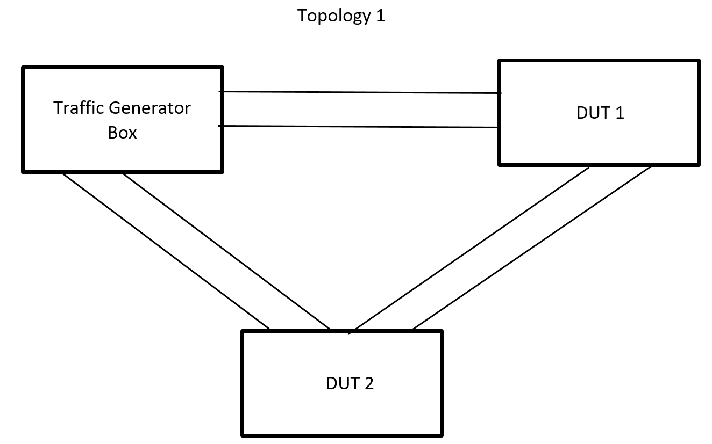

#  SQA Test Plan
# SONIC CoPP Management
#  SONiC 3.1 Project and Buzznik+ Release
[TOC]

## Test Plan Revision History

| Rev  | Date       | Author          | Change Description                                          |
| ---- | ---------- | --------------- | ----------------------------------------------------------- |
| 0.1  | 11/05/2020 | Gangadhara Sahu | Initial Version                                             |
| 0.2  | 06/05/2020 | Gangadhara Sahu | updated with new CLI after change in CLI as per MSFT design |

## List of Reviewers

| Function | Name |
| :------: | :--: |
|          |      |

## List of Approvers

| Function | Name | Date Approved |
| :------: | :--: | :-----------: |
|          |      |               |

## Definition/Abbreviation

| **Term** | **Meaning**                |
| -------- | -------------------------- |
| QoS      | Quality of Service         |
| CoPP     | Control Plane Policing     |
| CIR      | Committed Information Rate |
| CBS      | Committed Burst Size       |
| PIR      | Peak Information Rate      |
| PBS      | Peak Burst Size            |
## Introduction

### Objective 

The main objective of this document is to cover the test cases that will be executed to verify the new command line introduced to configure CoPP Mgmt or Control Plane Policing Management feature in SONIC Topologies and test cases  for testing the feature will be discussed as part of this document.

### Scope

This test plan will cover CoPP related enhancements done in Buzznik+ release which are mostly in the area of new CoPP policy CLI and  manageability.

1. Support creation of multiple CoPP classifiers with protocol trap match types
2. Support applying multiple CoPP classifiers to the system CoPP policy.
3. Support configuration of CoPP classifier actions such as assignment of the protocol trap to a specific CPU queue.
4. Support addition and configuration of a policer to a CoPP classifier to rate limit the bandwidth of each protocol trap matched by the classifier.
5. The new CLI introduced for the CoPP management feature in this release is supporting only klish command.   

### Out of scope

* Multi-dimensional protocol test cases along with COPP feature is out of scope or will not be covered as that is specific to system level testing with different protocol specific features enabled at the same time. 

## Feature Overview

The Control Plane Policing (CoPP) feature allows management of the network traffic flow handled by the control plane CPU. CoPP is designed to protect the CPU from getting overwhelmed by a high rate of CPU bound traffic which can affect system performance. CoPP policies allow configuration of trap IDs (traffic punted to CPU), CPU queue assignments, and policers to rate limit the traffic.

## 1 Test Focus Areas

### 1.1 CLI Testing 

  - All commands to support configuration CoPP classifiers. Some of the CLIs will be restricted to configure as it may cause system to go to unstable state if user wrongly configure those parameter. Please refer the below link for more details. https://docs.google.com/spreadsheets/d/1oj5X-jgHw3myZXCtltXq1IhukRA6RwaWu5tGdTD0LmY/edit#gid=1989870311
  - CoPP classifiers application to the system CoPP policy.

### 1.2 Functional Testing

  -	Support creation of multiple user defined CoPP classifiers with protocol trap match types.
  -	Support applying multiple user defined CoPP classifiers to the system CoPP policy.
  -	Support configuration of CoPP classifier actions such as assignment of the protocol trap to a specific CPU queue. System will allow user to configure protocol match types only if the same protocol match is not present already in the default copp policy. Meaning only non conflicting protocol match types will be allowed.
  -	Support addition and configuration of a policer to a CoPP classifier to rate limit the bandwidth of each protocol trap matched by the classifier.
  -	Config save and reload

### 1.3 Scalability Testing

* Support a CoPP classifier for each protocol trap supported by SONiC. This allows configuration of a separate policer with a unique rate limit value for each protocol trap.
* Multiple CoPP classifiers can be assigned to the same CPU queue. COPP management feature will allow max up to 32 CPU queues (internal design limitation).

## 2 Topologies

 

#### 								Topology 1 

  - Most of the test case will use only one to two links between DUT 1 and TGEN.
  - In case any control protocol which can not be simulated b/w DUT 1 and TGEN box, we will use DUT 1 and DUT 2.
  - First link b/w DUT 1 and TGEN will be used for pumping control traffic from TGEN towards DUT 1.
  - Second link b/w DUT 1 and TGEN will be used for mirroring the ingress packets from TG to DUT 1 in case any of the control traffic is not setup properly by TGEN.  

## 3 Test Case and objectives

### 3.1 CLI Test Cases

#### 3.1.1 Verify CoPP classifier global CLI

| **Test ID**    | **Copp311**                                                  |
| -------------- | :----------------------------------------------------------- |
| **Test Name**  | **Verify CoPP classifier global CLI**                        |
| **Test Setup** | **Topology 1**                                               |
| **Type**       | **Functional**                                               |
| **Steps**      | 1. Create a CoPP classifier.  2. Adding match protocol traps to the user defined CoPP Classifers.  sonic(config)# classifier copp-user-arp match-type copp  sonic(config-classifier)# match protocol arp_req   sonic(config-classifier)# exit   3. Delete the copp classifier globally. Verify the CoPP classifier got deleted along with its match protocol CLI using the command show copp classfier.  NOTE: creation/deletion/modify supported for only user defined classifiers only.  copp-system classifiers cannot be deleted or modified. |

#### 3.1.2 Verify match protocol CLI in copp classifier

| **Test ID**    | **Copp312**                                                  |
| -------------- | ------------------------------------------------------------ |
| **Test Name**  | **Verify CLI for CoPP classifier match protocol change**     |
| **Test Setup** | **Topology 1**                                               |
| **Type**       | **Functional**                                               |
| **Steps**      | 1. Create a copp class and add match protocol under it  sonic(config)# classifier copp-system-new match-type copp sonic(config-classifier)# match protocol ptp  sonic(config-classifier)# exit  2. Verify the copp class and its associated match protocol updated using the show copp classifiers CLI or show classifier match-type copp.  sonic# show classifier match-type copp  Classifier copp-system-new match-type copp  &nbsp;&nbsp;protocol ptp  3. Now remove the match protocol  sonic(config)# classifier copp-system-new match-type copp  sonic(config-classifier)# no match protocol ptp  sonic(config-classifier)# match protocol icmp  sonic(config-classifier)# exit  3. Verify the match protocol change for the copp class using the show policy type copp. sonic# show classifier match-type copp  Classifier copp-system-new match-type copp  &nbsp;&nbsp;protocol icmp |

#### 3.1.3 Verify trap action CLI in copp classifier  

| Test ID        | **Copp313**                                                  |
| -------------- | ------------------------------------------------------------ |
| **Test Name**  | **Verify CLI for CoPP classifier action as trap action**     |
| **Test Setup** | **Topology 1**                                               |
| **Type**       | **Functional**                                               |
| **Steps**      | 1. Configuring the copp action group with trap-action sonic(config)# copp-action copp-user-mtu sonic(config-action)# set trap-action trap NOTE: Here trap action could be one of the value from "drop, forward, copy, copy_cancel, trap, log, deny, transit". 2. Remove the trap action from the copp action group. sonic(config)# copp-action copp-user-mtu sonic(config-action)# no set trap-action trap 3. Apply new trap action for the copp action group. sonic(config)# copp-action copp-user-mtu sonic(config-action)# set trap-action copy 4. Verify the new trap action for the same copp action group using the command show copp actions.  NOTE: Each protocol can only be configured for a subset of these trap actions. These will show up as syslog errors in unsupported cases. |

#### 3.1.4 Verify trap queue CLI in CoPP classifier    

| Test ID        | **Copp314**                                                  |
| -------------- | ------------------------------------------------------------ |
| **Test Name**  | **Verify CLI for CoPP classifier action as CPU queue inside the CoPP policy** |
| **Test Setup** | **Topology 1**                                               |
| **Type**       | **Functional**                                               |
| **Steps**      | 1. Configuring the copp action group with trap-queue sonic(config)# copp-action copp-system-ip2me sonic(config-action)# set trap-queue 2 2. Remove the trap queue from the copp action group. sonic(config)# copp-action copp-system-ip2me sonic(config-action)# no set trap-queue 2 NOTE: no trap-queue => will set it to Queue 0. 3. Apply new trap queue for the copp action group. sonic(config)# copp-action copp-system-ip2me sonic(config-action)# set trap-queue 3 4. Verify the new trap action for the same copp action group using the command show copp actions. |

#### 3.1.5 ~~Verify CoPP classifier policer meter type bps CLI (not supported CLI)~~

#### 3.1.6 ~~Verify CoPP classifier policer mode from sr_tcm to tr_tcm (not supported CLI)~~

| Test ID        | **Copp316**                                                  |
| -------------- | ------------------------------------------------------------ |
| **Test Name**  | ~~**Verify CoPP classifier policer mode CLI (not supported)**~~ |
| **Test Setup** | **Topology 1**                                               |
| **Type**       | **Functional**                                               |
| **Steps**      | ~~1. Configuring the copp action group with policer mode sonic(config)# copp-action copp-user-ip2me sonic(config-action)# police mode sr_tcm red drop 2. Remove the police mode from the copp action group. sonic(config)# copp-action copp-user-ip2me sonic(config-action)# no police mode sr_tcm 3. Apply new police meter-mode as tr_tcm for the copp action group. sonic(config)# copp-action copp-system-ip2me sonic(config-action)# police mode tr_tcm red drop 4. Verify the new trap action for the same copp action group using the command show copp actions.~~ |

#### 3.1.7 Verify binding of copp class and copp action group to copp policy

| Test ID        | **Copp317**                                                  |
| -------------- | ------------------------------------------------------------ |
| **Test Name**  | **Verify binding of copp class and copp action group to copp policy** |
| **Test Setup** | **Topology 1**                                               |
| **Type**       | **Functional**                                               |
| **Steps**      | 1. Conigure the copp class  sonic(config)# classifier copp-user-ospf match-type copp  sonic(config-classifier)# match protocol ospf  sonic(config-classifier)# exit   2. Conigure the copp action group  sonic(config)# copp-action copp-user-ospf sonic(config-action)# set trap-action copy sonic(config-action)# set trap-priority 5  sonic(config-action)# set trap-queue 5  sonic(config-action)# police meter-type pps  sonic(config-action)# police mode sr_tcm red drop sonic(config-action)# police cir 10000 cbs 10000 sonic(config-action)# exit  3. Bind the copp class and action group to the copp policy.  sonic(config)# policy copp-system-policy type copp sonic(config-policy)# class copp-user-ospf sonic(config-policy-flow)# set copp-action copp-user-ospf sonic(config-policy-flow)# exit  4. Verify the show policy type copp to see the copp class and action in binding.  NOTE:  With new changes, copp-system classifiers cannot be modified (test 1). As user classifier can be created and bound to the copp policy after the copp-system classifier is removed from the policy. |

#### 3.1.8 Verify CoPP classifier policer rate CLI

| Test ID        | **Copp318**                                                  |
| -------------- | ------------------------------------------------------------ |
| **Test Name**  | **Verify CoPP classifier policer rate CLI**                  |
| **Test Setup** | **Topology 1**                                               |
| **Type**       | **Functional**                                               |
| **Steps**      | 1. Configuring the copp action group with policer rate sonic(config)# copp-action copp-user-ip2me sonic(config-action)# police cir 6000 cbs 6000 2. Remove the policer rate from the copp action group. sonic(config)# copp-action copp-user-ip2me sonic(config-action)# no police cir 6000 sonic(config-action)# no police cbs 6000 3. Apply new policer rate for the copp action group. sonic(config)# copp-action copp-user-ip2me sonic(config-action)# police cir 6300 cbs 6300 4. Verify the new policer rate for the same copp action group using the command show copp actions. |

#### 3.1.9 Verify show classifier match-type copp

| Test ID        | **Copp319**                                                  |
| -------------- | ------------------------------------------------------------ |
| **Test Name**  | **Verify CoPP classifier policer rate or show copp classifiers CLI** |
| **Test Setup** | **Topology 1**                                               |
| **Type**       | **Functional**                                               |
| **Steps**      | Verify shows classifier match-type copp to confirm the configured and default copp classes present in the system. sonic# show classifier match-type copp  Classifier copp-system-bgp match-type copp  &nbsp;&nbsp;protocol bgp   &nbsp;&nbsp;protocol bgpv6   Classifier copp-system-arp match-type copp   &nbsp;&nbsp;protocol arp_req   &nbsp;&nbsp;protocol arp_resp   &nbsp;&nbsp;protocol neigh_discovery   ... |

#### 3.1.10 Verify show copp protocols CLI

| Test ID        | **Copp3110**                                                 |
| -------------- | ------------------------------------------------------------ |
| **Test Name**  | **Verify CoPP classifier policer rate CLI**                  |
| **Test Setup** | **Topology 1**                                               |
| **Type**       | **Functional**                                               |
| **Steps**      | shows the copp protocol trap ids configured or present in the system by default sonic# show copp protocols  Classifier match-type copp protocols  &nbsp;&nbsp;protocol bgp  &nbsp;&nbsp;protocol bgpv6  &nbsp;&nbsp;protocol arp_req  &nbsp;&nbsp;protocol arp_resp  &nbsp;&nbsp;protocol neigh_discovery ... |

#### 3.1.11 Verify show copp actions CLI

| Test ID        | **Copp3111**                                                 |
| -------------- | ------------------------------------------------------------ |
| **Test Name**  | **Verify CoPP classifier policer rate CLI**                  |
| **Test Setup** | **Topology 1**                                               |
| **Type**       | **Functional**                                               |
| **Steps**      | shows configured CoPP action groups conigured or present in the system by default. sonic# show copp actions CoPP action group copp-system-arp &nbsp;&nbsp;&nbsp;&nbsp;&nbsp;&nbsp;    trap-action: copy &nbsp;&nbsp;&nbsp;&nbsp;&nbsp;    trap-priority: 3 &nbsp;&nbsp;&nbsp;&nbsp;&nbsp;    trap-queue: 3 &nbsp;&nbsp;&nbsp;&nbsp;&nbsp;    police cir 6000 cbs 6000 &nbsp;&nbsp;&nbsp;&nbsp;&nbsp;&nbsp;      meter-type: packets &nbsp;&nbsp;&nbsp;&nbsp;&nbsp;&nbsp;      mode: sr_tcm &nbsp;&nbsp;&nbsp;&nbsp;&nbsp;&nbsp;      red-action: drop   |

#### 3.1.12 Verify show policy type copp CLI  

| Test ID        | **Copp312**                                                  |
| -------------- | ------------------------------------------------------------ |
| **Test Name**  | **Verify CoPP classifier policer rate CLI**                  |
| **Test Setup** | **Topology 1**                                               |
| **Type**       | **Functional**                                               |
| **Steps**      | show the CoPP policy copp-system-policy  sonic# show policy type copp Policy copp-system-policy Type copp &nbsp;Flow copp-system-arp &nbsp;&nbsp;&nbsp;  Action copp-system-arp &nbsp;&nbsp;&nbsp;&nbsp;&nbsp;    trap-action: copy &nbsp;&nbsp;&nbsp;&nbsp;&nbsp;    trap-priority: 3 &nbsp;&nbsp;&nbsp;&nbsp;&nbsp;    trap-queue: 3 &nbsp;&nbsp;&nbsp;&nbsp;&nbsp;    police cir 6000 cbs 6000 &nbsp;&nbsp;&nbsp;&nbsp;&nbsp;&nbsp;      meter-type: packets &nbsp;&nbsp;&nbsp;&nbsp;&nbsp;&nbsp;      mode: sr_tcm &nbsp;&nbsp;&nbsp;&nbsp;&nbsp;&nbsp;      red-action: drop  .... |

#### 3.1.13 Verify show copp classifiers CLI

| Test ID        | **Copp3113**                                                 |
| -------------- | ------------------------------------------------------------ |
| **Test Name**  | **Verify show copp classifiers CLI**                         |
| **Test Setup** | **Topology 1**                                               |
| **Type**       | **Functional**                                               |
| **Steps**      | Verify shows copp classifiers CLI to confirm configured and default copp classes present in the system. sonic# show classifier match-type copp  Classifier copp-system-bgp match-type copp   protocol bgp    protocol bgpv6   Classifier copp-system-arp match-type copp    protocol arp_req    protocol arp_resp    protocol neigh_discovery   ... |

#### 3.1.14 Verify show copp policy CLI

| Test ID        | **Copp3114**                                                 |
| -------------- | ------------------------------------------------------------ |
| **Test Name**  | **Verify copp policy CLI**                                   |
| **Test Setup** | **Topology 1**                                               |
| **Type**       | **Functional**                                               |
| **Steps**      | Verify show copp policy CLI  sonic# show copp policy  Policy copp-system-policy Type copp &nbsp;Flow copp-system-arp &nbsp;&nbsp;&nbsp;  Action copp-system-arp &nbsp;&nbsp;&nbsp;&nbsp;&nbsp;    trap-action: copy &nbsp;&nbsp;&nbsp;&nbsp;&nbsp;    trap-priority: 3 &nbsp;&nbsp;&nbsp;&nbsp;&nbsp;    trap-queue: 3 &nbsp;&nbsp;&nbsp;&nbsp;&nbsp;    police cir 6000 cbs 6000 &nbsp;&nbsp;&nbsp;&nbsp;&nbsp;&nbsp;      meter-type: packets &nbsp;&nbsp;&nbsp;&nbsp;&nbsp;&nbsp;      mode: sr_tcm &nbsp;&nbsp;&nbsp;&nbsp;&nbsp;&nbsp;      red-action: drop  .... |

### 3.2 Functional Test Cases

##### 3.2.1 Verify single CoPP class with its copp action group applied to copp system policy 

| **Test ID**    | **Copp321**                                                  |
| -------------- | :----------------------------------------------------------- |
| **Test Name**  | **Verify single CoPP class with its copp action group applied to copp system policy** |
| **Test Setup** | **Topology 1**                                               |
| **Type**       | **Functional**                                               |
| **Steps**      | 1. Configure single copp class and single copp action group.   sonic(config)# classifier copp-user-arp match-type copp  sonic(config-classifier)# match protocol arp_req  sonic(config-classifier)# match protocol arp_resp  sonic(config-classifier)# match protocol neigh_discovery sonic(config-classifier)# exit    sonic(config)# copp-action copp-user-arp  sonic(config-action)# set trap-action copy  sonic(config-action)# set trap-priority 3   sonic(config-action)# set trap-queue 3  sonic(config-action)# police meter-type pps  sonic(config-action)# police mode sr_tcm red drop  sonic(config-action)# police cir 6000 cbs 6000  sonic(config-action)# exit   2. Apply or bind the single copp class and the copp action group to the default copp system policy after unbinding the copp-system-arp class from the policy sonic(config)# policy copp-system-policy type copp sonic(config-policy)# no class copp-system-arp sonic(config-policy)# class copp-user-arp sonic(config-policy-flow)# set copp-action copp-user-arp sonic(config-policy-flow)# exit 3. Verify the copp class and copp action for applied to copp system policy using show policy type copp. |
##### 3.2.2 Verify multiple copp classes applied to the copp system policy 

| **Test ID**    | **Copp322**                                                  |
| -------------- | :----------------------------------------------------------- |
| **Test Name**  | **Verify multiple copp classes applied to the copp system policy** |
| **Test Setup** | **Topology 1**                                               |
| **Type**       | **Functional**                                               |
| **Steps**      | 1.Configure multiple copp classes and multiple copp action groups.  2.Bind all the classes and corresponding copp action group to copp system policy.  3. Verify the copp system policy will show only one class and action group applied. Note that the copp-system classifiers cannot be modified. Intention here is to validate the protocols in the default copp system classifiers. |

- **Default CoPP policy config should show as** 

sonic(config)# classifier copp-system-arp match-type copp  
sonic(config-classifier)# match protocol arp_req  
sonic(config-classifier)# match protocol arp_resp  
sonic(config-classifier)# match protocol neigh_discovery 
sonic(config-classifier)# exit 
sonic(config)# classifier copp-system-lldp match-type copp 
sonic(config-classifier)# match protocol lldp 
sonic(config-classifier)# exit 
sonic(config)# classifier copp-system-bgp match-type copp 
sonic(config-classifier)# match protocol bgp 
sonic(config-classifier)# exit 
sonic(config-classifier)# match protocol bgpv6 
sonic(config-classifier)# exit 
sonic(config)# classifier copp-system-icmp match-type copp 
sonic(config-classifier)# match protocol icmp 
sonic(config-classifier)# match protocol icmpv6 
sonic(config-classifier)# match protocol dhcp 
sonic(config-classifier)# match protocol dhcpv6 
sonic(config-classifier)# exit 
sonic(config)# classifier copp-system-igmp match-type copp 
sonic(config-classifier)# match protocol igmp 
sonic(config-classifier)# exit 
sonic(config)# classifier copp-system-ip2me match-type copp 
sonic(config-classifier)# match protocol ip2me 
sonic(config-classifier)# exit 
sonic(config)# classifier copp-system-lacp match-type copp 
sonic(config-classifier)# match protocol lacp 
sonic(config-classifier)# exit 
sonic(config)# classifier copp-system-l3mtu match-type copp 
sonic(config-classifier)# match protocol src_nat_miss 
sonic(config-classifier)# match protocol dest_nat_miss 
sonic(config-classifier)# match protocol l3_mtu_error 
sonic(config-classifier)# exit 
sonic(config)# classifier copp-system-ospf match-type copp 
sonic(config-classifier)# match protocol ospf 
sonic(config-classifier)# exit 
sonic(config)# classifier copp-system-pim match-type copp 
sonic(config-classifier)# match protocol pim 
sonic(config-classifier)# exit 
sonic(config)# classifier copp-system-ptp match-type copp 
sonic(config-classifier)# match protocol ptp 
sonic(config-classifier)# exit 
sonic(config)# classifier copp-system-sflow match-type copp 
sonic(config-classifier)# match protocol sample_packet 
sonic(config-classifier)# exit 
sonic(config)# classifier copp-system-pvrst match-type copp 
sonic(config-classifier)# match protocol stp 
sonic(config-classifier)# match protocol pvrst 
sonic(config-classifier)# exit 
sonic(config)# classifier copp-system-subnet match-type copp 
sonic(config-classifier)# match protocol subnet 
sonic(config-classifier)# exit 
sonic(config)# classifier copp-system-suppress match-type copp 
sonic(config-classifier)# match protocol arp_suppress 
sonic(config-classifier)# match protocol nd_suppress 
sonic(config-classifier)# exit 
sonic(config)# classifier copp-system-iccp match-type copp 
sonic(config-classifier)# match protocol iccp 
sonic(config-classifier)# match protocol vrrp 
sonic(config-classifier)# match protocol vrrpv6 
sonic(config-classifier)# exit  

sonic(config)# copp-action copp-system-arp  
sonic(config-action)# set trap-action copy  
sonic(config-action)# set trap-priority 3  
sonic(config-action)# set trap-queue 3  
sonic(config-action)# police meter-type pps  
sonic(config-action)# police mode sr_tcm red drop 
sonic(config-action)# police cir 6000 cbs 6000 
sonic(config-action)# exit 
sonic(config)# copp-action copp-system-lldp 
sonic(config-action)# set trap-action trap 
sonic(config-action)# set trap-priority 7 
sonic(config-action)# set trap-queue 7 
sonic(config-action)# police meter-type pps 
sonic(config-action)# police mode sr_tcm red drop 
sonic(config-action)# police cir 1000 cbs 1000 
sonic(config-action)# exit 
sonic(config)# copp-action copp-system-bgp 
sonic(config-action)# set trap-action trap 
sonic(config-action)# set trap-priority 4  
sonic(config-action)# set trap-queue 4  
sonic(config-action)# police meter-type pps  
sonic(config-action)# police mode sr_tcm red drop 
sonic(config-action)# police cir 10000 cbs 10000 
sonic(config-action)# exit 
sonic(config)# copp-action copp-system-icmp 
sonic(config-action)# set trap-action trap 
sonic(config-action)# set trap-priority 3   
sonic(config-action)# set trap-queue 11 
sonic(config-action)# police meter-type pps  
sonic(config-action)# police mode sr_tcm red drop 
sonic(config-action)# police cir 1000 cbs 1000 
sonic(config-action)# exit 
sonic(config)# copp-action copp-system-igmp 
sonic(config-action)# set trap-action trap 
sonic(config-action)# set trap-priority 4 
sonic(config-action)# set trap-queue 4  
sonic(config-action)# police meter-type pps  
sonic(config-action)# police mode sr_tcm red drop  
sonic(config-action)# police cir 6000 cbs 6000  
sonic(config-action)# exit  
sonic(config)# copp-action copp-system-ip2me  
sonic(config-action)# set trap-action trap  
sonic(config-action)# set trap-priority 2   
sonic(config-action)# set trap-queue 2  
sonic(config-action)# police meter-type pps  
sonic(config-action)# police mode sr_tcm red drop 
sonic(config-action)# police cir 6000 cbs 6000 
sonic(config-action)# exit 
sonic(config)# copp-action copp-system-l3mtu 
sonic(config-action)# set trap-action trap 
sonic(config-action)# set trap-priority 1  
sonic(config-action)# set trap-queue 1  
sonic(config-action)# police meter-type pps  
sonic(config-action)# police mode sr_tcm red drop 
sonic(config-action)# police cir 500 cbs 500 
sonic(config-action)# exit 
sonic(config)# copp-action copp-system-ospf 
sonic(config-action)# set trap-action copy 
sonic(config-action)# set trap-priority 5  
sonic(config-action)# set trap-queue 5  
sonic(config-action)# police meter-type pps  
sonic(config-action)# police mode sr_tcm red drop 
sonic(config-action)# police cir 10000 cbs 10000 
sonic(config-action)# exit 
sonic(config)# copp-action copp-system-pim 
sonic(config-action)# set trap-action trap 
sonic(config-action)# set trap-priority 4  
sonic(config-action)# set trap-queue 4  
sonic(config-action)# police meter-type pps  
sonic(config-action)# police mode sr_tcm red drop 
sonic(config-action)# police cir 10000 cbs 10000 
sonic(config-action)# exit 
sonic(config)# copp-action copp-system-ptp 
sonic(config-action)# set trap-action trap 
sonic(config-action)# set trap-priority 7  
sonic(config-action)# set trap-queue 24  
sonic(config-action)# police meter-type pps  
sonic(config-action)# police mode sr_tcm red drop 
sonic(config-action)# police cir 10000 cbs 10000 
sonic(config-action)# exit 
sonic(config)# copp-action copp-system-sflow 
sonic(config-action)# set trap-action trap 
sonic(config-action)# set trap-priority 8  
sonic(config-action)# set trap-queue 8  
sonic(config-action)# police meter-type pps  
sonic(config-action)# police mode sr_tcm red drop 
sonic(config-action)# police cir 16000 cbs 16000 
sonic(config-action)# exit 
sonic(config)# copp-action copp-system-pvrst 
sonic(config-action)# set trap-action trap 
sonic(config-action)# set trap-priority 6  
sonic(config-action)# set trap-queue 6  
sonic(config-action)# police meter-type pps  
sonic(config-action)# police mode sr_tcm red drop 
sonic(config-action)# police cir 16000 cbs 16000 
sonic(config-action)# exit 
sonic(config)# copp-action copp-system-subnet 
sonic(config-action)# set trap-action trap 
sonic(config-action)# set trap-priority 10  
sonic(config-action)# set trap-queue 10  
sonic(config-action)# police meter-type pps  
sonic(config-action)# police mode sr_tcm red drop 
sonic(config-action)# police cir 6000 cbs 6000 
sonic(config-action)# exit   
sonic(config)# copp-action copp-system-suppress 
sonic(config-action)# set trap-action trap 
sonic(config-action)# set trap-priority 5  
sonic(config-action)# set trap-queue 9  
sonic(config-action)# police meter-type pps  
sonic(config-action)# police mode sr_tcm red drop 
sonic(config-action)# police cir 5000 cbs 5000 
sonic(config-action)# exit 
sonic(config)# copp-action copp-system-iccp 
sonic(config-action)# set trap-action trap 
sonic(config-action)# set trap-priority 5  
sonic(config-action)# set trap-queue 5  
sonic(config-action)# police meter-type pps  
sonic(config-action)# police mode sr_tcm red drop 
sonic(config-action)# police cir 5000 cbs 5000 
sonic(config-action)# exit sonic(config)# copp-action copp-system-lacp 
sonic(config-action)# set trap-action trap 
sonic(config-action)# set trap-priority 25  
sonic(config-action)# set trap-queue 25  
sonic(config-action)# police meter-type pps  
sonic(config-action)# police mode sr_tcm red drop 
sonic(config-action)# police cir 1000 cbs 1000 
sonic(config-action)# exit  

sonic(config)# policy copp-system-policy type copp 
sonic(config-policy)# class copp-system-arp 
sonic(config-policy-flow)# set copp-action copp-system-arp 
sonic(config-policy-flow)# exit 
sonic(config-policy)# class copp-system-lldp 
sonic(config-policy-flow)# set copp-action copp-system-lldp 
sonic(config-policy-flow)# exit 
sonic(config-policy)# class copp-system-bgp 
sonic(config-policy-flow)# set copp-action copp-system-bgp 
sonic(config-policy-flow)# exit 
sonic(config-policy)# class copp-system-icmp 
sonic(config-policy-flow)# set copp-action copp-system-icmp 
sonic(config-policy-flow)# exit 
sonic(config-policy)# class copp-system-igmp 
sonic(config-policy-flow)# set copp-action copp-system-igmp 
sonic(config-policy-flow)# exit 
sonic(config-policy)# class copp-system-ip2me 
sonic(config-policy-flow)# set copp-action copp-system-ip2me 
sonic(config-policy-flow)# exit 
sonic(config-policy)# class copp-system-lacp 
sonic(config-policy-flow)# set copp-action copp-system-lacp 
sonic(config-policy-flow)# exit 
sonic(config-policy)# class copp-system-l3mtu 
sonic(config-policy-flow)# set copp-action copp-system-l3mtu 
sonic(config-policy-flow)# exit 
sonic(config-policy)# class copp-system-ospf 
sonic(config-policy-flow)# set copp-action copp-system-ospf 
sonic(config-policy-flow)# exit 
sonic(config-policy)# class copp-system-pim 
sonic(config-policy-flow)# set copp-action copp-system-pim 
sonic(config-policy-flow)# exit 
sonic(config-policy)# class copp-system-ptp 
sonic(config-policy-flow)# set copp-action copp-system-ptp 
sonic(config-policy-flow)# exit 
sonic(config-policy)# class copp-system-sflow 
sonic(config-policy-flow)# set copp-action copp-system-sflow 
sonic(config-policy-flow)# exit 
sonic(config-policy)# class copp-system-pvrst 
sonic(config-policy-flow)# set copp-action copp-system-pvrst 
sonic(config-policy-flow)# exit 
sonic(config-policy)# class copp-system-subnet 
sonic(config-policy-flow)# set copp-action copp-system-subnet 
sonic(config-policy-flow)# exit 
sonic(config-policy)# class copp-system-suppress 
sonic(config-policy-flow)# set copp-action copp-system-suppress 
sonic(config-policy-flow)# exit 
sonic(config-policy)# class copp-system-iccp 
sonic(config-policy-flow)# set copp-action copp-system-iccp 
sonic(config-policy-flow)# exit 

##### 3.2.3 Verify modification of user defined CoPP classifier policer attributes while traffic is ON

| **Test ID**    | **Copp323**                                                  |
| -------------- | :----------------------------------------------------------- |
| **Test Name**  | **Verify modification of user defined CoPP classifier attributes while traffic is ON** |
| **Test Setup** | **Topology 1**                                               |
| **Type**       | **Functional**                                               |
| **Steps**      | Verify modification of the user defined CoPP classifier when the classifier is already in applied state with traffic  Verify add or delete of a protocol inside the same classifier  Verify the modification of  policer rate attributes like CIR, CBS, PIR and PBS on the fly while traffic is ON and policer in applied state with rate limit tolerance value of 5% to get best possible accuracy. Verify that copp policy config by using show policy type copp command.  Verify that classifier config for each of the above step using show policy type copp command.  Verify packets drop per sec using the show command bcmcmd "show c cpu". .NOTE: In pps mode, the CBS and PBS values are also in units of packets. We need to test the burst parameters by adjusting the TGEN traffic below the PPS rate limit but above the pkt burst size. For example, we would expect to see queue drops from "show queue counters CPU" when sending CPU traffic at 2000 pps using a single burst when configured at a higher rate limit (example 6000pps) but lower burst size such as 1000 pkts. |

##### 3.2.4 Verify modification of the CoPP classifier CPU queue and priority while traffic is ON

| **Test ID**    | **Copp324**                                                  |
| -------------- | :----------------------------------------------------------- |
| **Test Name**  | **Verify modification of the CoPP classifier CPU queue and priority while traffic is ON** |
| **Test Setup** | **Topology 1**                                               |
| **Type**       | **Functional**                                               |
| **Steps**      | Verify modification of the CoPP classifier CPU queue and priority when the classifier is already in applied state with traffic  Verify add or delete of a protocol inside the same classifier  Verify the modification of  CPU queue and priority  Verify that copp policy config by using show policy type copp command.  Verify packets drop per sec using the show command bcmcmd "show c cpu". Verify the new queue and priority taking into effect after change using the show command bcmcmd "show c cpu". |

##### 3.2.5 Verify modification of the CoPP classifier trap action while traffic is ON

| **Test ID**    | **Copp325**                                                  |
| -------------- | :----------------------------------------------------------- |
| **Test Name**  | **Verify modification of the CoPP classifier trap action while traffic is ON** |
| **Test Setup** | **Topology 1**                                               |
| **Type**       | **Functional**                                               |
| **Steps**      | Verify modification of the CoPP classifier trap action from forward to drop when the classifier is already in applied state with traffic  Verify add or delete of a protocol inside the same classifier  Verify the modification of  trap action  Verify that copp policy config by using show policy type copp command.  Verify the new trap action taking effect after change with traffic. Please note that not all classifier trap actions are supported for all types of protocols..   Here we change in trap actions as trap and drop but not copy. |

##### 3.2.6 Verify higher priority control traffic may starve out due to congestion in lower priority control traffic 

| **Test ID**    | **Copp326**                                                  |
| -------------- | :----------------------------------------------------------- |
| **Test Name**  | **Verify higher priority control traffic may starve out due to congestion in lower priority control traffic** |
| **Test Setup** | **Topology 1**                                               |
| **Type**       | **Functional**                                               |
| **Steps**      | Configure single classifier copp policy with two control protocol using the same CPU queue and send traffic.  Verify that copp policy config by using show policy type copp command.  Verify higher priority control traffic may starve out due to congestion in lower priority control traffic up to some extent due to CPU queue scheduling is round robin in Buzznik+ NOTE: With all CPU traffic types in separate queues, there will be a slight additional hit to latency in congested scenarios (12 queues in Buzznik increased to 20 queues in Buzznik+).  In a future enhancement, we will change to weighted round robin or strict priority with committed rates. |

##### 3.2.7 Verify system running all the user defined CoPP classes, action groups and binding 

| **Test ID**    | **Copp327**                                                  |
| -------------- | :----------------------------------------------------------- |
| **Test Name**  | **Verify system running all the user defined CoPP classes, action groups and binding** |
| **Test Setup** | **Topology 1**                                               |
| **Type**       | **Functional**                                               |
| **Steps**      | Verify system running all the user defined CoPP classes, action groups and binding working fine Here we are not configuring all user defined classes in copp policy.  Verify the trap_queue, priority, CIR etc for each control traffic queue using the command below. sonic# show policy type copp  Policy copp-system-policy Type copp    Flow copp-user-bgp      trap-action trap      trap-priority 5      trap-queue 5      ... and so on  Verify other show commands like show classifiers match-type copp, show copp actions etc.  sonic# show copp policy  |

- **Show policy type copp should show as below by default**

sonic# show policy type copp 
Policy copp-system-policy Type copp 
  &nbsp;Flow copp-user-system-arp 
  &nbsp;&nbsp;  Action copp-user-arp 
  &nbsp;&nbsp;&nbsp;    trap-action: copy 
  &nbsp;&nbsp;&nbsp;    trap-priority: 3 
  &nbsp;&nbsp;&nbsp;    trap-queue: 3 
  &nbsp;&nbsp;&nbsp;    police cir 6000 cbs 6000 
  &nbsp;&nbsp;&nbsp;&nbsp;      meter-type: packets 
  &nbsp;&nbsp;&nbsp;&nbsp;      mode: sr_tcm 
  &nbsp;&nbsp;&nbsp;&nbsp;      red-action: drop  
  &nbsp;Flow copp-user-bgp 
  &nbsp;&nbsp;  Action copp-user-bgp 
  &nbsp;&nbsp;&nbsp;    trap-action trap 
  &nbsp;&nbsp;&nbsp;    trap-priority 4 
  &nbsp;&nbsp;&nbsp;    trap-queue 4 
  &nbsp;&nbsp;&nbsp;    police cir 10000 cbs 10000 
  &nbsp;&nbsp;&nbsp;&nbsp;      meter-type: packets 
  &nbsp;&nbsp;&nbsp;&nbsp;      mode: sr_tcm 
  &nbsp;&nbsp;&nbsp;&nbsp;      red-action: drop  
  &nbsp;Flow copp-user-lldp 
  &nbsp;&nbsp;  Action copp-user-lldp 
  &nbsp;&nbsp;&nbsp;    trap-action trap 
  &nbsp;&nbsp;&nbsp;    trap-priority 7 
  &nbsp;&nbsp;&nbsp;    trap-queue 7 
  &nbsp;&nbsp;&nbsp;&nbsp;    police cir 1000 cbs 1000 
  &nbsp;&nbsp;&nbsp;&nbsp;      meter-type: packets 
  &nbsp;&nbsp;&nbsp;&nbsp;      mode: sr_tcm 
  &nbsp;&nbsp;&nbsp;&nbsp;      red-action: drop  
  &nbsp;Flow copp-user-icmp 
  &nbsp;&nbsp;  Action copp-user-icmp 
  &nbsp;&nbsp;&nbsp;    trap-action: copy 
  &nbsp;&nbsp;&nbsp;    trap-priority: 3 
  &nbsp;&nbsp;&nbsp;    trap-queue: 11 
  &nbsp;&nbsp;&nbsp;    police cir 1000 cbs 1000 
  &nbsp;&nbsp;&nbsp;&nbsp;      meter-type: packets 
  &nbsp;&nbsp;&nbsp;&nbsp;      mode: sr_tcm 
  &nbsp;&nbsp;&nbsp;&nbsp;      red-action: drop  
  &nbsp;Flow copp-user-igmp 
  &nbsp;&nbsp;  Action copp-user-igmp 
  &nbsp;&nbsp;&nbsp;    trap-action trap 
  &nbsp;&nbsp;&nbsp;    trap-priority 4 
  &nbsp;&nbsp;&nbsp;    trap-queue 4 
  &nbsp;&nbsp;&nbsp;    police cir 6000 cbs 6000 
  &nbsp;&nbsp;&nbsp;&nbsp;      meter-type: packets 
  &nbsp;&nbsp;&nbsp;&nbsp;      mode: sr_tcm 
  &nbsp;&nbsp;&nbsp;&nbsp;      red-action: drop   
  &nbsp;Flow copp-user-ip2me 
  &nbsp;&nbsp;  Action copp-user-imp2me 
  &nbsp;&nbsp;&nbsp;    trap-action trap 
  &nbsp;&nbsp;&nbsp;    trap-priority 2 
  &nbsp;&nbsp;&nbsp;    trap-queue 2 
  &nbsp;&nbsp;&nbsp;    police cir 6000 cbs 6000 
  &nbsp;&nbsp;&nbsp;&nbsp;      meter-type: packets 
  &nbsp;&nbsp;&nbsp;&nbsp;      mode: sr_tcm 
  &nbsp;&nbsp;&nbsp;&nbsp;      red-action: drop   
  &nbsp;Flow copp-user-mtu 
  &nbsp;&nbsp;  Action copp-user-mtu 
  &nbsp;&nbsp;&nbsp;    trap-action trap 
  &nbsp;&nbsp;&nbsp;    trap-priority 1 
  &nbsp;&nbsp;&nbsp;    trap-queue 1 
  &nbsp;&nbsp;&nbsp;    police cir 500 cbs 500 
  &nbsp;&nbsp;&nbsp;&nbsp;      meter-type: packets 
  &nbsp;&nbsp;&nbsp;&nbsp;      mode: sr_tcm 
  &nbsp;&nbsp;&nbsp;&nbsp;      red-action: drop   
  &nbsp;Flow copp-user-ospf 
  &nbsp;&nbsp;  Action copp-user-ospf 
  &nbsp;&nbsp;&nbsp;    trap-action copy 
  &nbsp;&nbsp;&nbsp;    trap-priority 5 
  &nbsp;&nbsp;&nbsp;    trap-queue 5 
  &nbsp;&nbsp;&nbsp;    police cir 10000 cbs 10000 
  &nbsp;&nbsp;&nbsp;&nbsp;      meter-type: packets 
  &nbsp;&nbsp;&nbsp;&nbsp;      mode: sr_tcm 
  &nbsp;&nbsp;&nbsp;&nbsp;      red-action: drop   
  &nbsp;Flow copp-user-pim 
  &nbsp;&nbsp;  Action copp-user-pim 
  &nbsp;&nbsp;&nbsp;    trap-action trap 
  &nbsp;&nbsp;&nbsp;    trap-priority 4 
  &nbsp;&nbsp;&nbsp;    trap-queue 4 
  &nbsp;&nbsp;&nbsp;    police cir 10000 cbs 10000 
  &nbsp;&nbsp;&nbsp;&nbsp;      meter-type: packets 
  &nbsp;&nbsp;&nbsp;&nbsp;      mode: sr_tcm 
  &nbsp;&nbsp;&nbsp;&nbsp;      red-action: drop   
  &nbsp;Flow copp-user-ptp 
  &nbsp;&nbsp;  Action copp-user-ptp 
  &nbsp;&nbsp;&nbsp;    trap-action trap 
  &nbsp;&nbsp;&nbsp;    trap-priority 7 
  &nbsp;&nbsp;&nbsp;    trap-queue 23 
  &nbsp;&nbsp;&nbsp;    police cir 10000 cbs 10000 
  &nbsp;&nbsp;&nbsp;&nbsp;      meter-type: packets 
  &nbsp;&nbsp;&nbsp;&nbsp;      mode: sr_tcm 
  &nbsp;&nbsp;&nbsp;&nbsp;      red-action: drop   
  &nbsp;Flow copp-user-sflow 
  &nbsp;&nbsp;  Action copp-user-sflow 
  &nbsp;&nbsp;&nbsp;    trap-action copy 
  &nbsp;&nbsp;&nbsp;    trap-priority 8 
  &nbsp;&nbsp;&nbsp;    trap-queue 8 
  &nbsp;&nbsp;&nbsp;    police cir 16000 cbs 16000 
  &nbsp;&nbsp;&nbsp;&nbsp;      meter-type: packets 
  &nbsp;&nbsp;&nbsp;&nbsp;      mode: sr_tcm 
  &nbsp;&nbsp;&nbsp;&nbsp;      red-action: drop   
  &nbsp;Flow copp-user-pvrst 
  &nbsp;&nbsp;  Action copp-user-pvrst 
  &nbsp;&nbsp;&nbsp;    trap-action trap 
  &nbsp;&nbsp;&nbsp;    trap-priority 6 
  &nbsp;&nbsp;&nbsp;    trap-queue 6 
  &nbsp;&nbsp;&nbsp;    police cir 16000 cbs 16000 
  &nbsp;&nbsp;&nbsp;&nbsp;      meter-type: packets 
  &nbsp;&nbsp;&nbsp;&nbsp;      mode: sr_tcm 
  &nbsp;&nbsp;&nbsp;&nbsp;      red-action: drop   
  &nbsp;Flow copp-user-subnet 
  &nbsp;&nbsp;  Action copp-user-subnet 
  &nbsp;&nbsp;&nbsp;    trap-action trap 
  &nbsp;&nbsp;&nbsp;    trap-priority 10 
  &nbsp;&nbsp;&nbsp;    trap-queue 10 
  &nbsp;&nbsp;&nbsp;    police cir 6000 cbs 6000 
  &nbsp;&nbsp;&nbsp;&nbsp;      meter-type: packets 
  &nbsp;&nbsp;&nbsp;&nbsp;      mode: sr_tcm 
  &nbsp;&nbsp;&nbsp;&nbsp;      red-action: drop   
  &nbsp;Flow copp-user-suppress 
  &nbsp;&nbsp;  Action copp-user-suppress 
  &nbsp;&nbsp;&nbsp;    trap-action trap 
  &nbsp;&nbsp;&nbsp;    trap-priority 5 
  &nbsp;&nbsp;&nbsp;    trap-queue 9 
  &nbsp;&nbsp;&nbsp;    police cir 5000 cbs 5000 
  &nbsp;&nbsp;&nbsp;&nbsp;      meter-type: packets 
  &nbsp;&nbsp;&nbsp;&nbsp;      mode: sr_tcm 
  &nbsp;&nbsp;&nbsp;&nbsp;      red-action: drop   
  &nbsp;Flow copp-user-iccp 
  &nbsp;&nbsp;  Action copp-user-iccp 
  &nbsp;&nbsp;&nbsp;    trap-action trap 
  &nbsp;&nbsp;&nbsp;    trap-priority 5 
  &nbsp;&nbsp;&nbsp;    trap-queue 5 
  &nbsp;&nbsp;&nbsp;    police cir 5000 cbs 5000 
  &nbsp;&nbsp;&nbsp;&nbsp;      meter-type: packets 
  &nbsp;&nbsp;&nbsp;&nbsp;      mode: sr_tcm 
  &nbsp;&nbsp;&nbsp;&nbsp;      red-action: drop  
  &nbsp;Flow copp-user-lacp 
  &nbsp;&nbsp;  Action copp-user-lacp 
  &nbsp;&nbsp;&nbsp;    trap-action trap 
  &nbsp;&nbsp;&nbsp;    trap-priority 25 
  &nbsp;&nbsp;&nbsp;    trap-queue 25 
  &nbsp;&nbsp;&nbsp;    police cir 1000 cbs 1000 
  &nbsp;&nbsp;&nbsp;&nbsp;      meter-type: packets 
  &nbsp;&nbsp;&nbsp;&nbsp;      mode: sr_tcm 
  &nbsp;&nbsp;&nbsp;&nbsp;      red-action: drop  

##### 3.2.8 Verify control traffic not matching all the applied matching protocols is classified as per copp-system-default class

| **Test ID**    | **Copp328**                                                  |
| -------------- | :----------------------------------------------------------- |
| **Test Name**  | **Verify control traffic not matching all the applied matching protocols is classified as per copp-system-default class** |
| **Test Setup** | **Topology 1**                                               |
| **Type**       | **Functional**                                               |
| **Steps**      | STEP 1: Configure few user defined CoPP class.  STEP 2: Apply the user defined class to CoPP policy after making sure this class match protocol does not exist in the applied policy.  STEP 3: Now send some control traffic which does not match any of the system defied copp class and user defined classes.  STEP 4: Verify the control traffic gets classified as per default copp class trap queue and CIR and CBS value. |

##### 3.2.9 Verify copp functionality for all default copp system classes applied to the copp system policy

| **Test ID**    | **Copp329**                                                  |
| -------------- | :----------------------------------------------------------- |
| **Test Name**  | **Verify copp functionality for all default copp system classes applied to the copp system policy** |
| **Test Setup** | **Topology 1**                                               |
| **Type**       | **Functional**                                               |
| **Steps**      | 1.Make sure all the default copp classes with their copp action groups present in the box.  2.Make sure the default binding present for all the classes with corresponding copp action group in copp system policy.  3. Verify the copp system policy will show only one class and action group applied. Intention here is to validate some of the protocols in the default copp system classifiers. NOTE: Verifying all the control protocols with traffic is not in scope. We will validate most of the control protocols with traffic but not all. |

### 3.3 Negative

#### 3.3.1 Negative Test Cases

##### 3.3.1 Verify default CoPP policy "copp-system-policy" can not be deleted

| **Test ID**    | **Copp331**                                                  |
| -------------- | ------------------------------------------------------------ |
| **Test Name**  | **Verify default CoPP policy "copp-system-policy" can not be deleted** |
| **Test Setup** | **Topology 1**                                               |
| **Type**       | **Functional**                                               |
| **Steps**      | Verify default CoPP policy "copp-system-policy" can not be deleted  |

##### 3.3.2 Verify one protocol can be bound to CoPP policy

| **Test ID**    | **Copp332**                                                  |
| -------------- | ------------------------------------------------------------ |
| **Test Name**  | **Verify one protocol can be bound to CoPP policy**          |
| **Test Setup** | **Topology 1**                                               |
| **Type**       | **Functional**                                               |
| **Steps**      | Verify only one protocol can be bound to CoPP policy  Same protocols can be added to multiple classifiers. When both classifiers are applied to the system copp policy at the same time.  Than, this will be user configuration error.  System will not actively prevent this config. |

##### 3.3.3 Verify default classifier is not removable from CoPP policy

| **Test ID**    | **Copp333**                                                  |
| -------------- | ------------------------------------------------------------ |
| **Test Name**  | **Verify default classifier is not removable from CoPP policy** |
| **Test Setup** | **Topology 1**                                               |
| **Type**       | **Functional**                                               |
| **Steps**      | Verify default classifier is not removable from CoPP policy But user defined copp classifiers can be removed from policy. copp-system-* and user defined classifiers can be removed from COPP Policy.  Only specifically the "copp-system-default" classifier cannot be removed. |

##### 3.3.4 Verify user cannot create new policies of type 'copp'

| **Test ID**    | **Copp334**                                                |
| -------------- | ---------------------------------------------------------- |
| **Test Name**  | **Verify user cannot create new policies of type 'copp'**  |
| **Test Setup** | **Topology 1**                                             |
| **Type**       | **Functional**                                             |
| **Steps**      | Verify user cannot create new policies of type 'copp'  |

##### 3.3.5 Verify CoPP across CoppMgrd process restart 

| **Test ID**    | **Copp335**                                                  |
| -------------- | ------------------------------------------------------------ |
| **Test Name**  | **Verify CoPP across CoppMgrd process restart**              |
| **Test Setup** | **Topology 1**                                               |
| **Type**       | **Functional**                                               |
| **Steps**      | Verify CoPP configuration and traffic rate limiting behavior etc. across CoppMgrd process restart  |

##### ~~3.3.6 Verify application of copp class with conflicting match protocols will throw valid error (not supported for now)~~ 

| **Test ID**    | **Copp336**                                                  |
| -------------- | ------------------------------------------------------------ |
| **Test Name**  | **~~Verify application of copp class with conflicting match protocols will throw valid error(not supported for now)~~** |
| **Test Setup** | **Topology 1**                                               |
| **Type**       | **Functional**                                               |
| **Steps**      | ~~Verify application of copp class to system copp policy with conflicting match protocols will throw valid error.  User can create copp classifier with duplicate match protocol (meaning the same match protocol which is already in applied default system copp policy). While applying the classifier to default system policy, it will throw error due to usage of duplicate match protocol. If user remove the class from system copp policy having conflicting match protocol, new user defined class with same match protocol will be allowed.~~ |

##### 3.3.7 Verify CoPP across SWSS docker restart

| **Test ID**    | **Copp337**                                                  |
| -------------- | ------------------------------------------------------------ |
| **Test Name**  | **Verify CoPP across SWSS docker restart**                   |
| **Test Setup** | **Topology 1**                                               |
| **Type**       | **Functional**                                               |
| **Steps**      | Verify CoPP configuration and traffic rate limiting behavior etc. across swss docker restart. |

### 3.4 Reboot/Reload/Upgrade Test Cases

##### 3.4.1 Verify CoPP configuration across warm reboot

| **Test ID**    | **Copp341**                                                  |
| -------------- | ------------------------------------------------------------ |
| **Test Name**  | **Verify CoPP configuration across warm reboot**             |
| **Test Setup** | **Topology 1**                                               |
| **Type**       | **Functional**                                               |
| **Steps**      | Verify CoPP configuration across warm reboot. 1. Verify that CoPP config is restored after warmboot. 2. Verify that traffic to CPU continues to get rate-limited as per configured CoPP policy after warmboot 2. Verify that CoPP policy is active after warmboot on the protocols that had classifers before warmboot |

##### 3.4.2 Verify CoPP configuration across fast reboot

| **Test ID**    | **Copp342**                                                  |
| -------------- | ------------------------------------------------------------ |
| **Test Name**  | **Verify CoPP configuration across fast reboot**             |
| **Test Setup** | **Topology 1**                                               |
| **Type**       | **Functional**                                               |
| **Steps**      | Verify CoPP configuration across fast reboot. 1. Verify that CoPP config is restored after fast reload. 2. Verify that traffic to CPU continues to get rate-limited as per configured CoPP policy after fast reload 2. Verify that CoPP policy is active after warmboot on the protocols that had classifers before fast reload. |

##### 3.4.3 Verify CoPP configuration across system reload

| **Test ID**    | **Copp343**                                                  |
| -------------- | ------------------------------------------------------------ |
| **Test Name**  | **Verify CoPP configuration across system reload**           |
| **Test Setup** | **Topology 1**                                               |
| **Type**       | **Functional**                                               |
| **Steps**      | Verify CoPP configuration across system reload. 1. Verify that CoPP config is restored after system reload. 2. Verify that traffic to CPU continues to get rate-limited as per configured CoPP policy after system reload 2. Verify that CoPP policy is active after warmboot on the protocols that had classifers before system reload. |

##### 3.4.4 Verify CoPP config and functionality across firmware upgrade and downgrade 

| **Test ID**    | **Copp343**                                                  |
| -------------- | ------------------------------------------------------------ |
| **Test Name**  | **Verify CoPP config and functionality across firmware upgrade and downgrade** |
| **Test Setup** | **Topology 1**                                               |
| **Type**       | **Functional**                                               |
| **Steps**      | Verify CoPP config and functionality across CoPP supported firmware upgrade and downgrade.  1. Verify that CoPP config is restored after firmware upgrade or downgrade.  2. Verify that traffic to CPU continues to get rate-limited as per configured CoPP policy after system reload.  3. Verify that CoPP policy is active after firmware upgrade or downgrade. NOTE: We will verify this across CoPP supported firmware only. In case we upgrade from CoPP non supported build to CoPP supported build, user should understand the default CoPP setting will differ. In case we downgrade from CoPP supported build to CoPP not supported build, user need to make sure to remove all user defined CoPP config prior to downgrade. |

### 3.5 Stress,Scale and Performance

#### 3.5.1 Scale test case

##### 3.5.1.1 Verify CoPP configuration with max number of CoPP classifiers configured

| **Test ID**    | **Copp3511**                                                 |
| -------------- | ------------------------------------------------------------ |
| **Test Name**  | **Verify CoPP configuration with max number of CoPP classifiers configured** |
| **Test Setup** | **Topology 1**                                               |
| **Type**       | **Functional**                                               |
| **Steps**      | Verify CoPP configuration with max number or 64 no of of CoPP classifiers configured |

##### 3.5.1.2 Verify CoPP classifier configured with max no of CPU queues configured

| **Test ID**    | **Copp3512**                                                 |
| -------------- | ------------------------------------------------------------ |
| **Test Name**  | **Verify CoPP classifier configured with max no of CPU queue configured** |
| **Test Setup** | **Topology 1**                                               |
| **Type**       | **Functional**                                               |
| **Steps**      | Verify CoPP configuration with max number of CPU queues configured or 20 queues. |

#### 3.5.2 Stress test case

##### 3.5.2.1 Verify CoPP policy classifier behavior when box is under stress 

| **Test ID**    | **Copp3521**                                                 |
| -------------- | ------------------------------------------------------------ |
| **Test Name**  | **Verify CoPP policy classifier behavior when box is under stress** |
| **Test Setup** | **Topology 1**                                               |
| **Type**       | **Functional**                                               |
| **Steps**      | Verify CoPP policy classifier behavior when box is under the stress. We need to configure BFD session aggressive timers or multiple ACL log actions hitting data traffic on the same port under test to stress the box while testing CoPP policy. Need to check with dev team to understand the if any other step required to stress the box while testing applied non default CoPP policy. High rate ARP traffic has been known to cause this problems. We can try this step. |

#### 3.5.3 Performance test case

##### 3.5.3.1 Verify CoPP policy classifier performance test when control and data traffic ingress with 100% line rate

| **Test ID**    | **Copp3531**                                                 |
| -------------- | ------------------------------------------------------------ |
| **Test Name**  | **Verify CoPP policy classifier performance test when control and data traffic ingress with 100% line rate** |
| **Test Setup** | **Topology 1**                                               |
| **Type**       | **Functional**                                               |
| **Steps**      | Verify CoPP policy classifier performance test by running CoPP related control along with data traffic at line on the same port. Verify that CoPP Policy is working fine for each control protocol even if port is congested with control and data traffic is running at 100% of line rate. Other than 100% line rate of control and data traffic, we need to change the rate limit value per individual protocol with 5% tolereance and mesaure 3 samples for each control protocol to record the acuracy of rate limiting values configured. |

### 3.6 Management

#### 3.6.1 SNMP test case
#### 3.6.2 gNMI test Case
#### 3.6.3 Verify CoPP specific OCYANG test case

#### 3.6.3.1 Verify CoPP policy classifier config GET, SET, POST, PUSH, DELETE operation using ocyang or sonicyang command which ever applicable

| **Test ID**    | **Copp3631**                                                 |
| -------------- | ------------------------------------------------------------ |
| **Test Name**  | **Verify CoPP policy classifier config GET, SET, POST, PUSH, DELETE operation using oc-yang or sonic-yang command which over applicable** |
| **Test Setup** | **Topology 1**                                               |
| **Type**       | **Functional**                                               |
| **Steps**      | Verify CoPP policy classifier config GET, SET, POST, PUSH, DELETE operation using ocyang or sonicyang command. The CoPP Mgmt HLD for B+ is not yet updated with ocyang or sonicyang command support.  This test case will be updated as when HLD is updated. |

## Reference Links

- [SONiC CoPP HLD link] http://gerrit-lvn-07.lvn.broadcom.net:8083/c/sonic/documents/+/20793/9/copp/SONiC_CoPP.md#237
- [SONIC CoPP Support Matrix] https://docs.google.com/spreadsheets/d/1oj5X-jgHw3myZXCtltXq1IhukRA6RwaWu5tGdTD0LmY/edit#gid=1989870311
