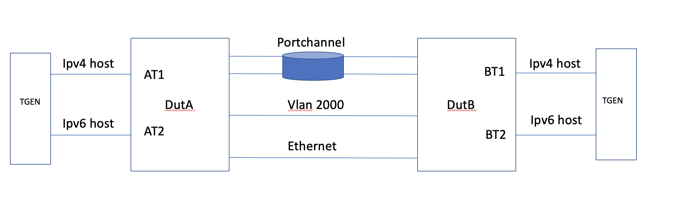

SQA Test Plan

# Policy Based Routing
#  SONiC 3.1.0 Project and Buzznik-Plus Release

Rev 1.9

[TOC]

## Test Plan Revision History

| Rev  | Date       | Author                        | Change Description                                    |
| ---- | ---------- | ----------------------------- | ----------------------------------------------------- |
| 1    | 04/15/2020 | Naveen Nag     | Initial Version                                       |
|     |            |            |                    |
|      |            |            |                    |
|      |            |            |                    |
|      |            |            |                    |
|      |            |            |                    |

## List of Reviewers

| Function | Name |
| :------: | :--: |
|          |      |

## List of Approvers

| Function | Name | Date Approved |
| :------: | :--: | :-----------: |
|          |      |               |

## Definition/Abbreviation

| **Term** | **Meaning**                        |
| -------- | ---------------------------------- |
| ACL      | Access Control List                |
| PBR      | Policy Based Routing               |
| SPAN     | Switch Port Analyzer               |
| sFlow    | Sampled flow                       |
| MQC      | Modular QoS CLIs                   |
| DSCP     | Differentiated Services Code Point |
| PCP      | Port control protocol              |
| CIR      | Commited Information Rate          |
| CBS      | Commited Bucket Size               |
| PIR      | Peak Information Rate              |
| PBS      | Peak Bucket Size                   |
|          |                                    |
|          |                                    |
|          |                                    |
|          |                                    |
|          |                                    |
|          |                                    |
|          |                                    |
## Introduction

### Objective 

The main objective of this document is to cover the test cases that will be executed for Policy Based routing in SONIC 3.1.0 Buzznik Plus release.  Topologies and test cases  for testing the feature will be discussed as part of this document.

### Scope

Only PBR (policy based forwarding) test cases will be covered in this test plan .

### Out of scope

* This test plan does not cover the legacy ACL & Qos Marking test cases. 
* For details on the legacy test cases please refer the test plan below
* http://gerrit-lvn-07.lvn.broadcom.net:8083/c/sonic/brcm-spytest/+/15132/1/testplans/QOS/aclratelimiting_aclenhancements.md
* Only Klish based CLI is supported in this release.

## Feature Overview

Access-control lists (ACLs) are used to filter traffic based on the contents of the Layer 2 and/or Layer 3 packet header. User ACLs are bound to interfaces on which traffic filtering is intended.

The primary benefits of an ACL are

1. Provide a measure of security.
2. Save network resources by reducing unwanted traffic.
3. Block unwanted traffic or users from accessing the network resources
4. Reduce the chance of DOS attacks
5. Use as classification for QoS Actions like Rate-limiting, PCP Remarking, DSCP Remarking etc.
6. Use as classification to make forwarding decisions like PBR.

Flow based services enhance the switches capability to have enhanced and better control over the traffic by providing a generic framework for "Match and Set" features. Incoming packets can be classified according to match rules using fields from L2-L4 headers and defined actions can be taken accordingly.

Example features might be: -

1. QoS remarking and policing
2. Monitoring (e.g. SPAN, sFlow)
3. Forwarding (e.g. PBR, L2 redirect) - This test plan focuses mainly on this feature . 

This feature provides a common infrastructure service for such features. The common infrastructure service can itself use the SONiC ACL feature for packet match rule definition, or can use it's own UI for more sophisticated classifiers.

## 1 Test Focus Areas

### 1.1 Functional Requirements

* Support Layer 2 ACL i.e. support match on Layer 2 fields like Source MAC, Destination MAC, PCP, etc.
* Support L3 header fields like DSCP, ICMP type and ICMP code.
* Support ACL application at Port/LAG, VLAN and Switch level.
* Support hierarchical filtering of traffic across interfaces.
* Support for dedicated TCAMs for ACL binding for better utilization of the ACL Tables and for getting detailed counter information.
* Provide a industry standard MQC equivalent framework for fine grained classification of the traffic via ACL or fields of L2-L4 header and take specific actions on the classified traffic.
* Support mirroring/SPAN action.
* Support flow based forwarding/routing.
* Enhance monitoring capabilities by supporting Flow based sFlow in future (Not yet supported)
* Ability to bind multiple policies of different types to Ports/LAGs, VLANs and Switch.
* Independent ingress and egress policy binding for a given interface.
* Merge non conflicting actions from different policies using ASIC capabilities to simplify user configuration.

## 2 Topologies

Topology 1

## 3 Test Case and objectives

### **3.1 CLI Test Cases**

### 3.1.1 Verify all the Klish based Policy with forwarding  CLIs options

| **Test ID**    | **FtOpSoRoPbr311**                                |
| -------------- | :----------------------------------------------------------- |
| **Test Name**  | **Verify all the Klish based policy with forwarding CLIs options** |
| **Test Setup** | **Topology1**                                                |
| **Type**       | **CLI**                                                      |
| **Steps**      | **Verify all the below Klish based config CLIs**.  policy pol_nag type forwarding  Try adding a classifier which doesn't exist   Suitable error should be thrown  add a classifier and then map it with the policy, it should be accepted   Now delete the classifier, the command should be accepted  verify the policy status, it should be inactive since classifier is deleted  Add back the same classifier and verify now the policy is actice   set interface to different options like Ethernet, portchannel and null  Try configuring ip next-hop & ipv6 next hop with invalid parameters and suitable errors should be seen  Verify all the show command and make sure all the parameters are displayed|

### 3.1.2 Verify all the PBR CLIs using OCI Yang/Rest api's.

| **Test ID**    | **FtOpSoRoPbr312**                                |
| -------------- | :----------------------------------------------------------- |
| **Test Name**  | **Verify all the PBR CLIs using OCI Yang/Rest api's.**       |
| **Test Setup** | **Topology1**                                                |
| **Type**       | **CLI**                                                      |
| **Steps**      | Verify all the below config CLIs using Rest api's**.   class clas_nag  sonic(config-policy)# class clas_nag  sonic(config-policy-flow)# set  interface  Set egress interface   ip         Internet Protocol Version 4 (IPv4)  ipv6       Internet Protocol Version 6 (IPv6)   set interface to different options like Ethernet, portchannel and null  set ip next-hop  set ipv6 next-hop   |

### **3.2 Functional Test Cases**

### **3.2.1 Policy based forwarding using MAC access list** ###

### 3.2.1.1 To verify the behavior on the L2 flooded traffic 

| **Test ID**    | **FtOpSoRoPbr3211**                                |
| -------------- | :----------------------------------------------------------- |
| **Test Name**  | To verify the behavior on the L2 flooded traffic           |
| **Test Setup** | **Topology1**                                                |
| **Type**       | **Functional**                                               |
| **Steps**      | 1) Configure the ports between the dut1 & dut2 as part of some vlan say 100  2) On the edge port from dut1, assign the port to vlan 100 and start a L2 stream with unknown destination address  3) Verify the traffic is being flooded across all the 4 links   4) configure mac access list as permit with src address and vlan 100   5) Create a classifier, bound the access list to it and create a policy and bound this classifier, set the interface as 3rd link   6)Apply this policy on the global lever and verify the traffic, it should be flooded over the 3rd link only even though all the 4 links are part of the same vlan.   7) Remove the policy binding and verify the traffic is now flooding across all the 4 links   8) Similarly verify the same by applying policying on the vlan and interface level, same behavior should be shown. |

### 3.2.1.2  To verify the behavior on the L2 switch traffic 

| **Test ID**    | **FtOpSoRoPbr3212**                                |
| -------------- | :----------------------------------------------------------- |
| **Test Name**  | **To verify the behavior on the L2 switch traffic** |
| **Test Setup** | **Topology1**                                                |
| **Type**       | **Functional**                                               |
| **Steps**      | 1) Configure the ports between the dut1 & dut2 as part of some vlan say 100  2) On the edge port from dut1 & dut2, assign the port to vlan 100 and start a L2 stream on both the nodes   3) Verify the traffic is being switched after initial flooding, verify the mac address and the port number   4) configure mac access list as permit with src address and vlan 100   5) Create a classifier, bound the access list to it and create a policy and bound this classifier, set the interface as 3rd link    6)Apply this policy on the global lever and now verify the traffic, it should be flooded over the 2nd link only even though all the 4 links are part of the same vlan.   7) Remove the policy binding and verify the traffic is now switching on a different link   8) Similarly verify the same by applying policying on the vlan and interface level, same behavior should be shown. |

### 3.2.1.3  To verify the various fields in the mac access list and make sure forwarding is happening based on the match

| **Test ID**    | **FtOpSoRoPbr3213**                                |
| -------------- | :----------------------------------------------------------- |
| **Test Name**  | **To verify the various fields in the mac access list and make sure forwarding is happening based on the match**          |
| **Test Setup** | **Topology1**                                                |
| **Type**       | **Functional**                                               |
| **Steps**      | 1) Configure the ports between the dut1 & dut2 as part of some vlan say 100  2) On the edge port from dut1 & dut2, assign the port to vlan 100 and start a L2 stream on both the nodes   3) Verify the traffic is being switched after initial flooding, verify the mac address and the port number   4) configure mac access list as permit with the following options IPv4 ethertype (0x800) > IPv6 ethertype (0x86dd) >ARP ethertype (0x806) > Ethertype value (0x600-0xffff) > Match packets using PCP value > Match packets using DEI value >Match packets using VLAN ID value   5) Create a classifier, bound the access list to it and create a policy and bound this classifier, and assign this on an 2nd interface between the nodes   6)Apply this policy on the global lever and verify the traffic, it should be flooded over the 2nd link only even though all the 4 links are part of the same vlan.   7) Remove the policy binding and verify the traffic is now switching on a different link   8) Similarly verify the same by applying policying on the vlan and interface level, same behavior should be shown.  |

### **3.2.2 Policy based forwarding using MAC match type fields** ###

### 3.2.2.1  To verify the forwarding functionality after matching  various fields  

| **Test ID**    | **FtOpSoRoPbr3221**                                |
| -------------- | :----------------------------------------------------------- |
| **Test Name**  | **To verify the forwarding functionality after matching  various fields** |
| **Test Setup** | **Topology1**                                                |
| **Type**       | **Functional**                                               |
| **Steps**      | 1) Configure the ports between the dut1 & dut2 as part of some vlan say 100  2) On the edge port from dut1 & dut2, assign the port to vlan 100 and start a L2 stream on both the nodes   3) Verify the traffic is being switched after initial flooding, verify the mac address and the port number   4) configure the classifier with match type as fields and have match statement to src, des , vlan, ether-type etc   5) Create a classifier, bound the access list to it and create a policy and bound this classifier, set the interface as 3rd link    6)Apply this policy on the global lever and now verify the traffic, it should be flooded over the 2nd link only even though all the 4 links are part of the same vlan.   7) Send the traffic with different parameters meaning different src or destination mac and verify this traffic should get flooded since no policy is matching this stanza.   8) Remove the policy binding and verify the traffic is now switching on a different link   9) Similarly verify the same by applying policying on the vlan and interface level, same behavior should be shown. |

### 3.2.2.2  To verify the L2 forwarding functionality after matching  various fields with Ipv4 & Ipv6 traffic  

| **Test ID**    | **FtOpSoRoPbr3222**                                |
| -------------- | :----------------------------------------------------------- |
| **Test Name**  | **To verify the L2 forwarding functionality after matching  various fields with Ipv4 & Ipv6 traffic** |
| **Test Setup** | **Topology1**                                                |
| **Type**       | **Functional**                                               |
| **Steps**      | 1) The configs are similar to the previous one   2) Instead of L2 traffic, send Ipv4 & Ipv6 traffic   3) Verify the policy is not hit since its not a plain L2 traffic   4) Try flapping the port and verify the behacior    |

### 3.2.2.3  To verify the L2 forwarding functionality after matching  Broacast and Multicast mac address  

| **Test ID**    | **FtOpSoRoPbr3223 **                                |
| -------------- | :----------------------------------------------------------- |
| **Test Name**  | **To verify the L2 forwarding functionality after matching  various fields with Ipv4 & Ipv6 traffic** |
| **Test Setup** | **Topology1**                                                |
| **Type**       | **Functional**                                               |
| **Steps**      | 1) The configs are similar to the previous one   2) Have a classifier to match to broadcast or multicast mac address   3) Verify the policy should be hit even thought it is broadcast or multicast address    |

### **3.2.3 Policy based forwarding using IP & Ipv6 access list. ** ###

### **In this section both Ipv4 & Ipv6 are combined together** ###

### 3.2.3.1  To verify the PBR functionality when there are multiple next-hop using Static routes  

| **Test ID**    | **FtOpSoRoPbr3231 **                                |
| -------------- | :----------------------------------------------------------- |
| **Test Name**  | To verify the PBR functionality when there are multiple next-hop using Static routes           |
| **Test Setup** | **Topology1**                                                |
| **Type**       | **Functional**                                               |
| **Steps**      | 1) Both Ipv4 & Ipv6 traffic will be verified in these subsequent test cases    2) The interfaces between the nodes are assigned /31 address & /127 address  3) Assign 10.1.1.12/31 on AT1 & 1001::12/127 on AT2   4) Similarly configure 20.1.1.12/31 & 2001::12/127 on BT1 & BT2 respectively   5) Add a static route on both nodes to reach these IP address via 3 interfaces   6)Start the bi-directional traffic and make sure it is going via one link .   7) Create a Ipv4 & Ipv6 accesslist to match the source & destination address   8) Bind it to a classifier and then apply it on a policy with next hop pointing on the Portchannel interface   9)Policy should have 2 stanza one each for Ipv4 & Ipv6   10) Apply this policy on the switch level   11) Now both traffic should reach the destination via Portchannel   12) Add few more next hop to the policy and shutdown the portchannel   13) Now the traffic should take the next interface on which the priority is more 14) Similarly try flapping the next hop interface and based on the priority the traffic should use the interface   15)  Remove the policy from the switch, verify the traffic is taking the first next hop in the routing table   16) Apply the policy on the AT1 & AT2 interface to select a specific next hop   17) Verify the traffic takes the specified path  |

### 3.2.3.2  To verify the PBR functionality with multiple next-hop reachable via OSPF as Dynamic protocol  

| **Test ID**    | **FtOpSoRoPbr3232 **                                |
| -------------- | :----------------------------------------------------------- |
| **Test Name**  | To verify the PBR functionality with multiple next-hop reachable via OSPF as Dynamic protocol           |
| **Test Setup** | **Topology1**                                                |
| **Type**       | **Functional**                                               |
| **Steps**      | 1) Both Ipv4 & Ipv6 traffic will be verified in these subsequent test cases    2) The interfaces between the nodes are assigned /31 address & /127 address  3) Assign 10.1.1.12/31 on AT1 & 1001::12/127 on AT2   4) Similarly configure 20.1.1.12/31 & 2001::12/127 on BT1 & BT2 respectively   5) Enable OSPF protocol on all the interfaces and make sure for 20.1.1.12 there are 3 next hops   6)Start the bi-directional traffic and make sure it is going via one link .   7) Create a Ipv4 & Ipv6 accesslist to match the source & destination address   8) Bind it to a classifier and then apply it on a policy with next hop pointing on the Portchannel interface   9)Policy should have 2 stanza one each for Ipv4 & Ipv6   10) Apply this policy on the switch level   11) Now both traffic should reach the destination via Portchannel   12) Shutdown the portchannel interface   13) Now the traffic should take the next interface on which the priority is more 14) Similarly try flapping the next hop interface and based on the priority the traffic should use the interface   15)  Remove the policy from the switch, verify the traffic is taking the first next hop in the routing table   16) Apply the policy on the AT1 & AT2 interface to select a specific next hop   17) Verify the traffic takes the specified path  |

### 3.2.3.3  To verify the PBR functionality with multiple next-hop reachable via BGP as Dynamic protocol  

| **Test ID**    | **FtOpSoRoPbr3233 **                                |
| -------------- | :----------------------------------------------------------- |
| **Test Name**  | To verify the PBR functionality with multiple next-hop reachable via OSPF as Dynamic protocol           |
| **Test Setup** | **Topology1**                                                |
| **Type**       | **Functional**                                               |
| **Steps**      | 1) Both Ipv4 & Ipv6 traffic will be verified in these subsequent test cases    2) The interfaces between the nodes are assigned /31 address & /127 address  3) Assign 10.1.1.12/31 on AT1 & 1001::12/127 on AT2   4) Similarly configure 20.1.1.12/31 & 2001::12/127 on BT1 & BT2 respectively   5) Enable BGP protocol on all the interfaces and make sure for 20.1.1.12 there are 3 next hops   6)Start the bi-directional traffic and make sure it is going via one link .   7) Create a Ipv4 & Ipv6 accesslist to match the source & destination address   8) Bind it to a classifier and then apply it on a policy with next hop pointing on the Portchannel interface   9)Policy should have 2 stanza one each for Ipv4 & Ipv6   10) Apply this policy on the switch level   11) Now both traffic should reach the destination via Portchannel   12) Shutdown the portchannel interface   13) Now the traffic should take the next interface on which the priority is more 14) Similarly try flapping the next hop interface and based on the priority the traffic should use the interface   15)  Remove the policy from the switch, verify the traffic is taking the first next hop in the routing table   16) Apply the policy on the AT1 & AT2 interface to select a specific next hop   17) Verify the traffic takes the specified path   18)Add back the switch policy with a different parameters, interface level policy should be preferred |

### 3.2.3.4  To verify the PBR functionality with multiple next-hop reachable via Static, BGP & OSPF as Dynamic protocol over the Ve interface  

| **Test ID**    | **FtOpSoRoPbr3234 **                                |
| -------------- | :----------------------------------------------------------- |
| **Test Name**  | To verify the PBR functionality with multiple next-hop reachable via OSPF as Dynamic protocol           |
| **Test Setup** | **Topology1**                                                |
| **Type**       | **Functional**                                               |
| **Steps**      | 1) In this test case the links between the nodes are added as part of vlan interface    2) The interfaces between the nodes are assigned /31 address & /127 address  3) Assign the interface as part of vlan and then configure 10.1.1.12/31 on AT1 & 1001::12/127 on AT2   4) Similarly configure 20.1.1.12/31 & 2001::12/127 on BT1 & BT2 respectively   5) Enable static route on first interface, OSPF protocol on second and BGP on the thrid interface   6)Start the bi-directional traffic, have permit for static route, deny for ospf and permit for BGP for both Ipv4 & Ipv6    7) Without any policy the traffic should be taking static route due to low admnistrative distance.   8) Create a Ipv4 & Ipv6 accesslist to match the source & destination address with next hop pointing to BGP for Ipv4 & OSPF for Ipv6   9) Verfify the traffic, based on the policy the traffic streams should take the next hop.   10) Switch the policy priority on the fly to change Ipv4 OSPF to higher than BGP and vice versa for Ipv6 so that next hops are changed and based on the permit/deny in the ACL corresponding traffic should be dropped   11) With  the policy at the global level,   apply it on the Vlan interface as well, the behavior should be same   12) with Policy on the Vlan interface, apply the same on the interface  which is part of the vlan and change the parameters to take a differnet next hop    13) Verify the port level policy takes precedence over vlan   14) Upon deleting port level policy, Vlan policy should take precedence .  15)  Upon Vlan policy deletion, switch level policy should work as before  

### 3.2.3.5  To verify the PBR functionality with redistributed across OSPF from  BGP   

| **Test ID**    | ** FtOpSoRoPbr3235 **                                |
| -------------- | :----------------------------------------------------------- |
| **Test Name**  |  To verify the PBR functionality with redistributed across OSPF from  BGP           |
| **Test Setup** | **Topology1**                                                |
| **Type**       | **Functional**                                               |
| **Steps**      | 1) Both Ipv4 & Ipv6 traffic will be verified in these subsequent test cases    2) The interfaces between the nodes are assigned /31 address & /127 address  3) Assign 10.1.1.12/31 on AT1 & 1001::12/127 on AT2   4) Similarly configure 20.1.1.12/31 & 2001::12/127 on BT1 & BT2 respectively   5) Enable OSPF protocol on all the interfaces and establish BGP session across the node, make sure for 20.1.1.12 there are 3 next hops learnt in BGP and redistributed into OSPF   6)Start the bi-directional traffic and make sure it is going via one link .   7) Create a Ipv4 & Ipv6 accesslist to match the source & destination address   8) Bind it to a classifier and then apply it on a policy with next hop pointing on the Portchannel interface   9)Policy should have 2 stanza one each for Ipv4 & Ipv6   10) Apply this policy on the switch level   11) Now both traffic should reach the destination via Portchannel   12) Shutdown the portchannel interface   13) Now the traffic should take the next interface on which the priority is more 14) Similarly try flapping the next hop interface and based on the priority the traffic should use the interface   15)  Remove the policy from the switch, verify the traffic is taking the first next hop in the routing table   16) Apply the policy on the AT1 & AT2 interface to select a specific next hop   17) Verify the traffic takes the specified path  |

### 3.2.3.6  To verify the PBR functionality with multiple next-hop reachable via BGP redistributed from OSPF

| **Test ID**    | ** FtOpSoRoPbr3236 **                                |
| -------------- | :----------------------------------------------------------- |
| **Test Name**  | To verify the PBR functionality with multiple next-hop reachable via OSPF as Dynamic protocol           |
| **Test Setup** | **Topology1**                                                |
| **Type**       | **Functional**                                               |
| **Steps**      | 1) Both Ipv4 & Ipv6 traffic will be verified in these subsequent test cases    2) The interfaces between the nodes are assigned /31 address & /127 address  3) Assign 10.1.1.12/31 on AT1 & 1001::12/127 on AT2   4) Similarly configure 20.1.1.12/31 & 2001::12/127 on BT1 & BT2 respectively   5) Enable BGP protocol on all the interfaces and make sure for 20.1.1.12 there are 3 next hops reachable via BGP after redistribution from OSPF   6)Start the bi-directional traffic and make sure it is going via one link .   7) Create a Ipv4 & Ipv6 accesslist to match the source & destination address   8) Bind it to a classifier and then apply it on a policy with next hop pointing on the Portchannel interface   9)Policy should have 2 stanza one each for Ipv4 & Ipv6   10) Apply this policy on the switch level   11) Now both traffic should reach the destination via Portchannel   12) Shutdown the portchannel interface   13) Now the traffic should take the next interface on which the priority is more 14) Similarly try flapping the next hop interface and based on the priority the traffic should use the interface   15) Remove the policy from the switch, verify the traffic is taking the first next hop in the routing table   16) Apply the policy on the AT1 & AT2 interface to select a specific next hop   17) Verify the traffic takes the specified path   18)Add back the switch policy with a different parameters, interface level policy should be preferred |

### 3.2.3.7  To verify the PBR functionality on User vrf and default vrf with the same IP configured on all the Vrf with next hop reachable via all the vrf  

| **Test ID**    | **FtOpSoRoPbr3237 **                                |
| -------------- | :----------------------------------------------------------- |
| **Test Name**  |  To verify the PBR functionality on User vrf and default vrf with the same IP configured on all the Vrf with next hop reachable via all the vrf            |
| **Test Setup** | **Topology1**                                                |
| **Type**       | **Functional**                                               |
| **Steps**      | 1) Both Ipv4 & Ipv6 traffic will be verified in these subsequent test cases    2) The interfaces between the nodes are assigned /31 address & /127 address with 1st interface belongs to default vrf, 2nd belongs to Vrf red and 3rd interface belongs to Vrf blue   3) Assign 10.1.1.12/31 on AT1 & 1001::12/127 on AT2 and leak this routes  to both Vrf red and blue  4) Similarly configure 20.1.1.12/31 & 2001::12/127 on BT1 & BT2 respectively and leak this routes  to both Vrf red and blue   5) Add a static route on both nodes to reach these IP address via 3 interfaces in their respective Vrf (leaking vrf routes)   6)Start the bi-directional traffic and make sure it is going via one link .   7) Create a Ipv4 & Ipv6 accesslist to match the source & destination address   8) Bind it to a classifier and then apply it on a policy with next hop pointing on the Portchannel interface   9)Policy should have 2 stanza one each for Ipv4 & Ipv6   10) Apply this policy on the switch level   11) Now both traffic should reach the destination via Portchannel   12) Add few more next hop to the policy and shutdown the portchannel   13) Now the traffic should take the next interface on which the priority is more 14) Similarly try flapping the next hop interface and based on the priority the traffic should use the interface   15)  Remove the policy from the switch, verify the traffic is taking the first next hop in the routing table   16) Apply the policy on the AT1 & AT2 interface to select a specific next hop   17) Verify the traffic takes the specified path  |

### 3.2.3.8  To verify the PBR functionality on User vrf and default vrf with the different IP configured on all the Vrf with next hop reachable via all the vrf with deny statement  

| **Test ID**    | ** FtOpSoRoPbr3238 **                                |
| -------------- | :----------------------------------------------------------- |
| **Test Name**  |  To verify the PBR functionality on User vrf and default vrf with the same IP configured on all the Vrf with next hop reachable via all the vrf            |
| **Test Setup** | **Topology1**                                                |
| **Type**       | **Functional**                                               |
| **Steps**      | 1) Both Ipv4 & Ipv6 traffic will be verified in these subsequent test cases    2) The interfaces between the nodes are assigned /31 address & /127 address with 1st interface belongs to default vrf, 2nd belongs to Vrf red and 3rd interface belongs to Vrf blue   3) Assign 10.1.1.12/31 on AT1 & 1001::12/127 on AT2 and leak this routes  to both Vrf red and blue  4) Similarly configure 20.1.1.12/31 & 2001::12/127 on BT1 & BT2 respectively and leak this routes  to both Vrf red and blue   5) Add a static route on both nodes to reach these IP address via 3 interfaces in their respective Vrf (leaking vrf routes)   6)Start the bi-directional traffic and make sure it is going via one link .   7) Create a Ipv4 & Ipv6 accesslist to match the source & destination address   8) Bind it to a classifier and then apply it on a policy with next hop pointing on the Portchannel interface   9)Policy should have 2 stanza one each for Ipv4 & Ipv6   10) Apply this policy on the switch level   11) Now both traffic should reach the destination via Portchannel   12) Add few more next hop which are present in user vrf red and blue   13) The policy should have next hop from default, vrf red and vrf blue in the order of priority configured 14) traffic should be taking default vrf since the priorty is more, get this next hop down   15)  Now the traffic should be taking vrf red as per the priority order   16) Change the ACL permit to deny for this entry and verify the traffic is getting dropped and policy counters are incrementing as expected   17) Shutdown the next in vrf red, now the traffic should take vrf Blue and no loss should be observed   18)Change from permit to deny on default vrf and get the next hop up   19) The traffic should now take default vrf but traffic should get dropped due to deny statement.  20)Change the statement to Permit and traffic should go through fine |

### 3.2.3.9  To verify the PBR functionality while changing the interface from trunk to access mode  

| **Test ID**    | **FtOpSoRoPbr3239 **                                |
| -------------- | :----------------------------------------------------------- |
| **Test Name**  | To verify the PBR functionality while changing the interface from trunk to access mode           |
| **Test Setup** | **Topology1**                                                |
| **Type**       | **Functional**                                               |
| **Steps**      | 1) Both Ipv4 & Ipv6 traffic will be verified in these subsequent test cases    2) The interfaces between the nodes are assigned /31 & /127 address which are added as part of vlan interfaces say vlan 100,200 & 300 respectively   3) Assign 10.1.1.12/31 on AT1 & 1001::12/127 on AT2   4) Similarly configure 20.1.1.12/31 & 2001::12/127 on BT1 & BT2 respectively   5) Enable BGP protocol on all the interfaces and make sure for 20.1.1.12 there are 3 next hops   6)Start the bi-directional traffic and make sure it is going via one link .   7) Create a Ipv4 & Ipv6 accesslist to match the source & destination address   8) Bind it to a classifier and then apply it on a policy with next hop pointing on the Portchannel interface   9)Policy should have 2 stanza one each for Ipv4 & Ipv6   10) There should be 3 policy with one permit at the interface level, second with deny on vlan 200 interface and last permit on the global level   11) Now both traffic should reach the destination via Portchannel on vlan 100 due to high priority   12) Change the mode of the first interface from trunk to access port and verify the traffic is still being received    13) Remove the policy from the interface level, vlan policy should kick in and now the traffic should take vlan 200 14) Since it is deny in vlan 200, the traffic should get denied and policy counters should increment.   15)  Remove the policy from the vlan interface, verify the traffic is taking based on the global policy   |

### 3.2.3.10  To verify the PBR functionality while clearing ARP & ND entires  

| **Test ID**    | **FtOpSoRoPbr32310 **                                |
| -------------- | :----------------------------------------------------------- |
| **Test Name**  | To verify the PBR functionality when there are multiple next-hop using Static routes           |
| **Test Setup** | **Topology1**                                                |
| **Type**       | **Functional**                                               |
| **Steps**      | 1) Both Ipv4 & Ipv6 traffic will be verified in these subsequent test cases    2) The interfaces between the nodes are assigned /31 address & /127 address  3) Assign 10.1.1.12/31 on AT1 & 1001::12/127 on AT2   4) Similarly configure 20.1.1.12/31 & 2001::12/127 on BT1 & BT2 respectively   5) Add a static route on both nodes to reach these IP address via 3 interfaces   6)Start the bi-directional traffic and make sure it is going via one link .   7) Create a Ipv4 & Ipv6 accesslist to match the source & destination address   8) Bind it to a classifier and then apply it on a policy with next hop pointing on the Portchannel interface, vlan and physical interface   9)Policy should have 2 stanza one each for Ipv4 & Ipv6   10) Apply this policy on the switch level   11) Now both traffic should reach the destination via Portchannel   12) While the traffic is running issue clear ARP first and verify the behavior   13) Once the ARP entries are learnt, shutdown the portchannel and verify the traffic is now taking the second interface based on the priority 14) Do a clear ARP and bring back the first interface   15) The traffic should take first interface after the clear ARP    16) Similarly repeat the steps while executing clear ND commands and verify no traffic drop seen for Ipv4 whereas for V6 the traffic should resumes once the neighbor entries are learnt |

### 3.2.3.11  To verify the PBR functionality while sending with different packets sizes( Runts, Jumbo frames etc)  

| **Test ID**    | ** FtOpSoRoPbr32311 **                                |
| -------------- | :----------------------------------------------------------- |
| **Test Name**  | To verify the PBR functionality while sending with different packets sizes( Runts, Jumbo frames etc)           |
| **Test Setup** | **Topology1**                                                |
| **Type**       | **Functional**                                               |
| **Steps**      | 1) Both Ipv4 & Ipv6 traffic will be verified in these subsequent test cases    2) The interfaces between the nodes are assigned /31 address & /127 address  3) Assign 10.1.1.12/31 on AT1 & 1001::12/127 on AT2   4) Similarly configure 20.1.1.12/31 & 2001::12/127 on BT1 & BT2 respectively   5) Add a static route on both nodes to reach these IP address via 3 interfaces   6)Start the bi-directional traffic and make sure it is going via one link .   7) Create a Ipv4 & Ipv6 accesslist to match the source & destination address   8) Bind it to a classifier and then apply it on a policy with next hop pointing on the Portchannel interface, vlan and physical interface   9)Policy should have 2 stanza one each for Ipv4 & Ipv6   10) Apply this policy on the interface level   11) Now both traffic should reach the destination via Portchannel   12) Send the traffic with 64 bytes (runts) and verify the traffic is dropped at the ingress it self   13) Set the packet size to 9000(jumbo) more than MTU 14) The traffic should get dropped since the MTU is less   15) Increase the MTU to 9100 of the first interface only and verify the traffic should be received    16) Bring down the first next hop, based on the policy the second next hop should be chosed but due to less MTU traffic should get dropped again   17) Remove the policy from the interface level and apply it on the switch level, the behavior should be same|

### 3.2.3.12  To verify the PBR functionality while sending with different TTL values  

| **Test ID**    | ** FtOpSoRoPbr32312 **                                |
| -------------- | :----------------------------------------------------------- |
| **Test Name**  | PBR should have no effect on TTL decrement behavior           |
| **Test Setup** | **Topology1**                                                |
| **Type**       | **Functional**                                               |
| **Steps**      | 1) Both Ipv4 & Ipv6 traffic will be verified in these subsequent test cases    2) The interfaces between the nodes are assigned /31 address & /127 address  3) Assign 10.1.1.12/31 on AT1 & 1001::12/127 on AT2   4) Similarly configure 20.1.1.12/31 & 2001::12/127 on BT1 & BT2 respectively   5) Add a static route on both nodes to reach these IP address via 3 interfaces   6)Start the bi-directional traffic and make sure it is going via one link .   7) Create a Ipv4 & Ipv6 accesslist to match the source & destination address   8) Bind it to a classifier and then apply it on a policy with next hop pointing on the Portchannel interface, vlan and physical interface   9)Policy should have 2 stanza one each for Ipv4 & Ipv6   10) Apply this policy on the interface level   11) Now both traffic should reach the destination via Portchannel   12) Send the Ipv4 traffic with TTL = 1   13) Ipv6 traffic with TTL=2 14) The traffic should get dropped  for Ipv4 since the TTL =0 after processing the packet whereas for Ipv6 no traffic drop should be seen   15) Switch the TTL values and now the Ipv6 traffic should be dropped whereas Ipv4 should be received   16)PBR should have no effect on TTL decrement behavior   17) Repeat the same after removing and applying the policy on the switch level |

### 3.2.3.13  To verify the PBR functionality with next hop set to null 0   

| **Test ID**    | ** FtOpSoRoPbr32313 **                                |
| -------------- | :----------------------------------------------------------- |
| **Test Name**  | To verify the PBR functionality with next hop set to null 0           |
| **Test Setup** | **Topology1**                                                |
| **Type**       | **Functional**                                               |
| **Steps**      | 1) Both Ipv4 & Ipv6 traffic will be verified in these subsequent test cases    2) The interfaces between the nodes are assigned /31 address & /127 address  3) Assign 10.1.1.12/31 on AT1 & 1001::12/127 on AT2   4) Similarly configure 20.1.1.12/31 & 2001::12/127 on BT1 & BT2 respectively   5) Enable OSPF protocol on all the interfaces and make sure for 20.1.1.12 there are 3 next hops   6)Start the bi-directional traffic and make sure it is going via one link .   7) Create a Ipv4 & Ipv6 accesslist to match the source & destination address   8) Bind it to a classifier and then apply it on a policy with next hop pointing on the Portchannel interface   9)Policy should have 2 stanza one each for Ipv4 & Ipv6   10) Create 4 stanza with next hop pointing to 3 interface and 4th setting the next hop ip to null and Apply this policy on the interface level   11) Now both traffic should reach the destination via Portchannel   12) Shutdown the portchannel interface   13) Now the traffic should take the next interface on which the priority is more 14) Similarly try flapping the next hop interface and based on the priority the traffic should use the interface   15) Once all the next hop available is shut, the traffic should hit null 0  and traffic should get dropped but policy counters should increment   16) Remove the policy from the switch and verify the traffic is taking the first next hop in the routing table   16) Apply the policy on the switch level and behavior should be same   17) Verify the traffic takes the specified path  |

### 3.2.3.14  To verify the PBR functionality on the  control plane traffic   

| **Test ID**    | ** FtOpSoRoPbr32314 **                                |
| -------------- | :----------------------------------------------------------- |
| **Test Name**  | To verify the PBR functionality with next hop set to null 0           |
| **Test Setup** | **Topology1**                                                |
| **Type**       | **Functional**                                               |
| **Steps**      | 1) Similar to the previous test case, enable OSPF across the node to make sure the connectivity is fine  2)Create an ACL to deny the OSPF control packets and apply it to a policy  3) Verify the PBR is applied to control plane, it shouldn't affect the control plane traffic  4)Similarly enable BGP protocol instead of OSPF and verify the PBR is not denying the BGP control plane packets  |

### 3.2.3.15 To have both PBR & non-PBR flows on the same link   

| **Test ID**    | ** FtOpSoRoPbr32315**                                |
| -------------- | :----------------------------------------------------------- |
| **Test Name**  | To have both PBR & non-PBR flows on the same link           |
| **Test Setup** | **Topology1**                                                |
| **Type**       | **Functional**                                               |
| **Steps**      | 1) Both Ipv4 & Ipv6 traffic will be verified in these subsequent test cases    2) The interfaces between the nodes are assigned /31 address & /127 address  3) Assign 10.1.1.12/31 on AT1 & 1001::12/127 on AT2   4) Similarly configure 20.1.1.12/31 & 2001::12/127 on BT1 & BT2 respectively   5) Enable OSPF protocol on all the interfaces and make sure for 20.1.1.12 there are 3 next hops   6)Start the bi-directional traffic with 10 different trafic flows  .  7) Create a Ipv4 & Ipv6 accesslist to match the source & destination address   8) Bind it to a classifier and then apply it on a policy with next hop pointing on the Portchannel interface   9)Policy should have 2 stanza one each for Ipv4 & Ipv6   10) Create 5 stanza with permit and deny for 5 flows only and apply this policy on the interface level   11) The permit flows should only reach the destination based on the policy applied whereas along with that non-pbr flow should be reaching the destination taking the next hop as available in the routing table   12) Shutdown the portchannel interface   13) Now the traffic should take the next interface on which the priority is more also verify the non-pbr flows, it should take the path specificed in the routing table 14) Remove the policy and verify all the 10 streams should now be taking non-pbr routes   15) Apply the policy on the global level and verify the behavior should be same |

### **3.2.4 Policy based forwarding using different fields in the classifier ** ###

### 3.2.4.1  To verify the PBR functionality when there are multiple fields matching ether-type & IP    

| **Test ID**    | **FtOpSoRoPbr3241 **                                |
| -------------- | :----------------------------------------------------------- |
| **Test Name**  | To verify the PBR functionality when there are multiple fields          |
| **Test Setup** | **Topology1**                                                |
| **Type**       | **Functional**                                               |
| **Steps**      | 1) Both Ipv4 & Ipv6 traffic will be verified in these subsequent test cases    2) The interfaces between the nodes are assigned /31 address & /127 address  3) Assign 10.1.1.12/31 on AT1 & 1001::12/127 on AT2   4) Similarly configure 20.1.1.12/31 & 2001::12/127 on BT1 & BT2 respectively   5) Configure OSPF on both nodes to reach these IP address via 3 interfaces   6)Start the bi-directional traffic and make sure it is going via one link .   7) Create a classifier-1 to ether type as ipv4 and ip protocol as tcp, Create a classifier-2 to ether type as ipv6 and ip protocol as udp, Create a classifier-3 to ether type as ipv4 and source address      Create a classifier-4 to ether type as ipv6 and destination address    8) Bind it to a classifier and then apply it on a policy with next hop pointing on the three different interfaces   9)Policy should have 4 stanza two each for Ipv4 & Ipv6   10) Apply this policy on the switch level   11) Send 10 streams of traffic IPv4 & Ipv6 with different flags such as tcp, udp, source & destination address as defined in the classifier    12)Verify the traffic path taken, for the traffic matching the policy it should take the interface set in the policy whereas for the other traffic it should take the default path available in the routing table    13) Shut the interface on which the traffic is going based on the policy applied, now the traffic should take the next interface on which the priority is more 14) Similarly try flapping the next hop interface and based on the priority the traffic should use the interface   15)  Remove the policy from the switch, verify the traffic is taking the first next hop in the routing table   16) Apply the policy on the AT1 & AT2 interface to select a specific next hop   17) Verify the traffic takes the specified path  |

### 3.2.4.2  To verify the PBR functionality when there are multiple fields matching l4-port and tcp flags    

| **Test ID**    | **FtOpSoRoPbr3242 **                                |
| -------------- | :----------------------------------------------------------- |
| **Test Name**  | To verify the PBR functionality when there are multiple fields          |
| **Test Setup** | **Topology1**                                                |
| **Type**       | **Functional**                                               |
| **Steps**      | 1) Both Ipv4 & Ipv6 traffic will be verified in these subsequent test cases    2) The interfaces between the nodes are assigned /31 address & /127 address  3) Assign 10.1.1.12/31 on AT1 & 1001::12/127 on AT2   4) Similarly configure 20.1.1.12/31 & 2001::12/127 on BT1 & BT2 respectively   5) Configure OSPF on both nodes to reach these IP address via 3 interfaces   6)Start the bi-directional traffic and make sure it is going via one link .   7) Create a classifier-1 with l4 port as tcp and set various tcp flags , Create a classifier-2 with l4 port as udp and set various udp flags,     8) Bind it to a classifier and then apply it on a policy with next hop pointing on the three different interfaces   9)Policy should have 4 stanza two each for Ipv4 & Ipv6   10) Apply this policy on the switch level   11) Send 10 streams of traffic IPv4 & Ipv6 with different flags such as tcp, udp, flags defined in the classifier    12)Verify the traffic path taken, for the traffic matching the policy it should take the interface set in the policy whereas for the other traffic it should take the default path available in the routing table    13) Shut the interface on which the traffic is going based on the policy applied, now the traffic should take the next interface on which the priority is more 14) Similarly try flapping the next hop interface and based on the priority the traffic should use the interface   15)  Remove the policy from the switch, verify the traffic is taking the first next hop in the routing table   16) Apply the policy on the AT1 & AT2 interface to select a specific next hop   17) Verify the traffic takes the specified path  |

### 3.2.4.3  To verify the PBR functionality while changing the interface from user vrf to default vrf on Ipv4 with policy applied on an interface    

| **Test ID**    | ** FtOpSoRoPbr3243 **                                |
| -------------- | :----------------------------------------------------------- |
| **Test Name**  | To verify the PBR functionality while changing the interface from user vrf to default vrf on Ipv4 with policy applied on an interface |
| **Test Setup** | **Topology1**                                                |
| **Type**       | **Functional**                                               |
| **Steps**      | 1) Only  Ipv4 will be verified in this test case    2) The interfaces between the nodes are assigned /31 address   3) Assign 10.1.1.12/31 on AT1    4) Similarly configure 20.1.1.12/31  on BT1   5) Configure OSPF on both nodes to reach these IP address via 3 interfaces, make sure the routes are leaked from vrf red and blue to default and vice versa such that all the routes are reachable through all the vrf   6)Start the bi-directional traffic and make sure it is going via one link .   7) Create a classifier-1 matching the source address and bind it a policy which has multiple next hops like ,set ip next-hop 10.1.1.1 vrf default, set ip next-hop 20.1.1.1 vrf VrfRed, set ip next-hop 30.1.1.1 , set interface null     8) Apply this policy to the interface and verify the next hop with default vrf is selected since the interface belongs to default vrf   10) Verify the traffic is taking the path  selected as per the policy   12)With the traffic running, assign the interface(At1) on which the policy is being applied to vrf Red   13) Now verify the next hop being selected, it should take as per the priority assigned  14) Make sure the policy is taking the next hop as set ip next-hop 30.1.1.1 which doesn't have any vrf assgined   15) The destination vrf should be same as source vrf, meaning 30.1.1.1 should be taking Vrf red    16) Assign AT1 to vrf Blue and verify the next hop taken, as said before based on the source interaface destination vrf should be set   17) Try flapping the interfaces and verify the path the traffic takes based on the priority |

### 3.2.4.4  To verify the PBR functionality while changing the interface from user vrf to default vrf on Ipv6 and also apply Ipv4 policy on Ipv6 traffic    

| **Test ID**    | ** FtOpSoRoPbr3244 **                                |
| -------------- | :----------------------------------------------------------- |
| **Test Name**  | To verify the PBR functionality while changing the interface from user vrf to default vrf on Ipv6 and also apply Ipv4 policy on Ipv6 traffic |
| **Test Setup** | **Topology1**                                                |
| **Type**       | **Functional**                                               |
| **Steps**      | 1) Only  Ipv6 will be verified in this test case    2) The interfaces between the nodes are assigned with /127 address  3) Assign 1001::12/127 on AT2   4) Similarly configure  2001::12/127 on BT2 respectively   5) Configure OSPF on both nodes to reach these IP address via 3 interfaces, make sure the routes are leaked from vrf red and blue to default and vice versa such that all the routes are reachable through all the vrf   6)Start the bi-directional traffic and make sure it is going via one link .   7) Create a classifier-1 matching the source address and bind it a policy which has multiple next hops like ,set ip next-hop 1000::10 vrf default, set ip next-hop 2000::10 vrf VrfRed, set ip next-hop 3000::10 , set interface null     8) Apply this policy to the interface and verify the next hop with default vrf is selected since the interface belongs to default vrf   10) Verify the traffic is taking the path  selected as per the policy   12)With the traffic running, assign the interface(At1) on which the policy is being applied to vrf Red   13) Now verify the next hop being selected, it should take as per the priority assigned  14) Make sure the policy is taking the next hop as set ip next-hop 3000::10 which doesn't have any vrf assgined   15) The destination vrf should be same as source vrf, meaning 3000::10 should be taking Vrf red    16) Assign AT1 to vrf Blue and verify the next hop taken, as said before based on the source interaface destination vrf should be set   17) Try flapping the interfaces and verify the path the traffic takes based on the priority 18)Remove Ipv6 policy and apply Ipv4 policy on a Ipv6 traffic with deny and verify the traffic shouldn't be affected and policy should not take into effect.|

### 3.2.4.5  To verify the PBR functionality when the policy has multiple match across interface, vlan and global    

| **Test ID**    | ** FtOpSoRoPbr3245 **                                |
| -------------- | :----------------------------------------------------------- |
| **Test Name**  | To verify the PBR functionality when the policy has multiple match across interface, vlan and global           |
| **Test Setup** | **Topology1**                                                |
| **Type**       | **Functional**                                               |
| **Steps**      | 1) Both Ipv4 & Ipv6 traffic will be verified in these subsequent test cases    2) The interfaces between the nodes are assigned /31 address & /127 address  3) Assign 10.1.1.12/31 on AT1 & 1001::12/127 on AT2   4) Similarly configure 20.1.1.12/31 & 2001::12/127 on BT1 & BT2 respectively   5) Configure OSPF on both nodes to reach these IP address via 3 interfaces   6)Start the bi-directional traffic and make sure it is going via one link .   7) Create a classifier-1 with matching source and destination address , Create a classifier-2 with a ACL applied which matches various L4 fields with deny and , Create a classifier-3 with matching ether type and vlan field    8) Bind classifier-1 to policy 1 which is applied to interface, classifier-2 to policy 2 applied on the global interface and classifier-3 to policy 3 on vlan interface   9)Policy should have 4 stanza two each for Ipv4 & Ipv6   10) With multiple match interface should get priority and verify the next hop specified as per the inteface policy is taken   11) Upon removing the policy from the interface, policy on the vlan interface should come into effect   12)Since the policy has deny, the traffic should get dropped and PBR counters should increment    13) Shut the interface on which the traffic is going based on the policy applied, now the traffic should take the next interface on which the priority is more 14) Similarly try flapping the next hop interface and based on the priority the traffic should use the interface   15)  Remove the policy from the vlan, Global policy should kick in and corresponding next hop should be taken   16) Reconfigure back the interface and vlan, verify the interface policy should come into effect as before  |

### 3.2.4.6  To verify the PBR functionality when the policy has all the three flavours - type as Qos, monitoring and forwarding  

| **Test ID**    | ** FtOpSoRoPbr3246 **                                |
| -------------- | :----------------------------------------------------------- |
| **Test Name**  | To verify the PBR functionality when the policy has all the three flavours - type as Qos, monitoring and forwarding          |
| **Test Setup** | **Topology1**                                                |
| **Type**       | **Functional**                                               |
| **Steps**      | 1) Both Ipv4 & Ipv6 traffic will be verified in these subsequent test cases    2) The interfaces between the nodes are assigned /31 address & /127 address  3) Assign 10.1.1.12/31 on AT1 & 1001::12/127 on AT2   4) Similarly configure 20.1.1.12/31 & 2001::12/127 on BT1 & BT2 respectively   5) Configure OSPF on both nodes to reach these IP address via 3 interfaces   6)Start the bi-directional traffic and make sure it is going via one link .   7) Here in this test case we will have all the 3 types of policy such as qos, monitoring and forwarding    8) Bind this policy to the interface   10) With multiple traffic streams matching all the 3 types of policy, start the traffic    11) Verify that all the 3 types of policy are being matched and correspondingly based on the policy the packets are treated   12) With qos and monotoring unchanged, add a new next hop with a higher priority   13) Verify the traffic is taking the next hop based on forwarding with qos and monitoring in place 14) Remove the policy from interface and apply it on the global   15)  the behavior should be same. |

### 3.2.6.7  To verify the PBR functionality with dynamically changing ACL rules with permit and deny statements  

| **Test ID**    | ** FtOpSoRoPbr3247 **                                |
| -------------- | :----------------------------------------------------------- |
| **Test Name**  | To verify the PBR functionality with dynamically changing ACL rules with permit and deny statements          |
| **Test Setup** | **Topology1**                                                |
| **Type**       | **Functional**                                               |
| **Steps**      | 1) Both Ipv4 & Ipv6 traffic will be verified in these subsequent test cases    2) The interfaces between the nodes are assigned /31 address & /127 address  3) Assign 10.1.1.12/31 on AT1 & 1001::12/127 on AT2   4) Similarly configure 20.1.1.12/31 & 2001::12/127 on BT1 & BT2 respectively   5) Enable BGP protocol on all the interfaces and make sure for 20.1.1.12 there are 3 next hops   6)Start the bi-directional traffic and make sure it is going via one link .   7) Create a Ipv4 & Ipv6 accesslist to match the source & destination address   8) Bind it to a classifier and then apply it on a policy with next hop pointing on the Portchannel interface   9)Policy should have 2 stanza one each for Ipv4 & Ipv6   10) Apply this policy on the switch level   11) Now both traffic should reach the destination via Portchannel   12) Shutdown the portchannel interface   13) Now the traffic should take the next interface on which the priority is more 14) Change the rule in the ACL to deny while the traffic is going on the second next hop   15)  Policy should be updated dynamically and the traffic should be dropped   16) SImilarly try playing around with permit or deny, add a new acl rule with higher priority to take the next hop, delete the acl rules, delete the acl completely while the traffic is running on   17) Verify the traffic path should be updated as per the acl rules present at the given point of time |

### 3.2.6.8  To verify the PBR functionality with dynamically changing classifiers    

| **Test ID**    | ** FtOpSoRoPbr3248 **                                |
| -------------- | :----------------------------------------------------------- |
| **Test Name**  | To verify the PBR functionality with dynamically changing classifiers       |
| **Test Setup** | **Topology1**                                                |
| **Type**       | **Functional**                                               |
| **Steps**      | 1) Both Ipv4 & Ipv6 traffic will be verified in these subsequent test cases    2) The interfaces between the nodes are assigned /31 address & /127 address  3) Assign 10.1.1.12/31 on AT1 & 1001::12/127 on AT2   4) Similarly configure 20.1.1.12/31 & 2001::12/127 on BT1 & BT2 respectively   5) Configure OSPF on both nodes to reach these IP address via 3 interfaces   6)Start the bi-directional traffic and make sure it is going via one link .   7) Create a classifier-1 to ether type as ipv4 and ip protocol as tcp, Create a classifier-2 to ether type as ipv6 and ip protocol as udp, Create a classifier-3 to ether type as ipv4 and source address      Create a classifier-4 to ether type as ipv6 and destination address    8) Bind it to a classifier and then apply it on a policy with next hop pointing on the three different interfaces   9)Policy should have 4 stanza two each for Ipv4 & Ipv6   10) Apply this policy on the switch level   11) Send 10 streams of traffic IPv4 & Ipv6 with different flags such as tcp, udp, source & destination address as defined in the classifier    12)Verify the traffic path taken, for the traffic matching the policy it should take the interface set in the policy whereas for the other traffic it should take the default path available in the routing table    13) Shut the interface on which the traffic is going based on the policy applied, now the traffic should take the next interface on which the priority is more 14) With the traffic going on, dynamically change the parameters in the classifier with or without matching the stream parameters   15)  When ever the stream parameters are matched the PBR should be kicked in and when ever it doesn't the normal routing should happen   16) Try by changing the classifier from ACL to multiple fields and deleting/adding the classifier   17) The behavior should be same as mentioned in step 14.  |

### 3.2.6.9  To verify the PBR functionality while changing the ACL look up mode from legacy to optimized   

| **Test ID**    | ** FtOpSoRoPbr3249 **                                |
| -------------- | :----------------------------------------------------------- |
| **Test Name**  | To verify the PBR functionality while changing the ACL look up mode from legacy to optimized            |
| **Test Setup** | **Topology1**                                                |
| **Type**       | **Functional**                                               |
| **Steps**      |  1) In this test case the links between the nodes are added as part of vlan interface    2) The interfaces between the nodes are assigned /31 address & /127 address  3) Assign the interface as part of vlan and then configure 10.1.1.12/31 on AT1 & 1001::12/127 on AT2   4) Similarly configure 20.1.1.12/31 & 2001::12/127 on BT1 & BT2 respectively   5) Enable static route on first interface, OSPF protocol on second and BGP on the thrid interface   6)Start the bi-directional traffic, have permit for static route, deny for ospf and permit for BGP for both Ipv4 & Ipv6    7) Without any policy the traffic should be taking static route due to low admnistrative distance.   8) Create a Ipv4 & Ipv6 accesslist to match the source & destination address with next hop pointing to BGP for Ipv4 & OSPF for Ipv6   9) Verfify the traffic, based on the policy the traffic streams should take the next hop.   10) Switch the policy priority on the fly to change Ipv4 OSPF to higher than BGP and vice versa for Ipv6 so that next hops are changed and based on the permit/deny in the ACL corresponding traffic should be dropped  11) Change the ACL mode from legacy to optimized, there shouldn't be any traffic drop   12) The traffic should be take PBR defined route if it matches and should take normal routing if it doesn't  13) Also try changing the policy from interface to global to vlan , based on the policy no matter where you apply the policy traffic should be take the route as defined in the rules.  14) Try deleting and adding the policy on the fly, the behavior should be same as mentioned in step 13   |

### 3.2.6.10  To verify the PBR functionality with dynamically changing the policy by adding and deleting rules   

| **Test ID**    | ** FtOpSoRoPbr32410 **                                |
| -------------- | :----------------------------------------------------------- |
| **Test Name**  | To verify the PBR functionality with dynamically changing the policy by adding and deleting rules           |
| **Test Setup** | **Topology1**                                                |
| **Type**       | **Functional**                                               |
| **Steps**      | 1) In this test case the links between the nodes are added as part of vlan interface    2) The interfaces between the nodes are assigned /31 address & /127 address  3) Assign the interface as part of vlan and then configure 10.1.1.12/31 on AT1 & 1001::12/127 on AT2   4) Similarly configure 20.1.1.12/31 & 2001::12/127 on BT1 & BT2 respectively   5) Enable static route on first interface, OSPF protocol on second and BGP on the thrid interface   6)Start the bi-directional traffic, have permit for static route, deny for ospf and permit for BGP for both Ipv4 & Ipv6    7) Without any policy the traffic should be taking static route due to low admnistrative distance.   8) Create a Ipv4 & Ipv6 accesslist to match the source & destination address with next hop pointing to BGP for Ipv4 & OSPF for Ipv6   9) Verfify the traffic, based on the policy the traffic streams should take the next hop.   10) Switch the policy priority on the fly to change Ipv4 OSPF to higher than BGP and vice versa for Ipv6 so that next hops are changed and based on the permit/deny in the ACL corresponding traffic should be dropped   11) Similarly add and delete different rules defined in acl or classifier in the policy with different priority    12) With dynamically changing the policy, the traffic should be take PBR defined route if it matches and should take normal routing if it doesn't   13) Also try changing the policy from interface to global to vlan , based on the policy no matter where you apply the policy traffic should be take the route as defined in the rules.   14) try deleting and adding the policy on the fly, the behavior should be same as mentioned in step 13 .   |

### **3.3 Reboot Test Cases**

### **3.3.1 To verify policy based forwarding with config reload ** ###

| **Test ID**    | ** FtOpSoRoPbr331**                                |
| -------------- | :----------------------------------------------------------- |
| **Test Name**  | To verify policy based forwarding with config reload    |
| **Test Setup** | **Topology1**                                                |
| **Type**       | **Functional**                                               |
| **Steps**      | 1) Configure both ACL based and multiple fields match classifiers    2) Add various ACL rules as part of the classifier and create multiple classifier matching different fields   3) Add these classifiers as part of the policy   4) Similarly configure multiple policies with different priority   5) Apply it on the interface, vlan and global matching different next hops for both Ipv4 & Ipv6   6)Start the bi-directional traffic and make sure it is taking the next hop based on the policy.   7) Save the config and do a config reload   8) Verify the traffic drop during the switch reboots, once the switch is up the traffic should take the next hop as before    9) Shut the next hops to verify the traffic is taking the next high priority route.   10) Remove and add the policy, the behavior should be same    |

### **3.3.2 To verify policy based forwarding with warm reload ** ###

| **Test ID**    | **FtOpSoRoPbr332 **                                |
| -------------- | :----------------------------------------------------------- |
| **Test Name**  | To verify policy based forwarding with warm reboot    |
| **Test Setup** | **Topology1**                                                |
| **Type**       | **Functional**                                               |
| **Steps**      | 1) Configure both ACL based and multiple fields match classifiers    2) Add various ACL rules as part of the classifier and create multiple classifier matching different fields   3) Add these classifiers as part of the policy   4) Similarly configure multiple policies with different priority   5) Apply it on the interface, vlan and global matching different next hops for both Ipv4 & Ipv6   6)Start the bi-directional traffic and make sure it is taking the next hop based on the policy.   7) Save the config and do a warm reload   8) Verify the traffic shouldn't get dropped as the  switch reboots    9) Once the switch is up, alter the policy and verify the traffic is taking the next high priority route.   10) Remove and add the policy, the behavior should be same    |

### **3.3.3 To verify policy based forwarding with fast reboot ** ###

| **Test ID**    | ** FtOpSoRoPbr333**                                |
| -------------- | :----------------------------------------------------------- |
| **Test Name**  | To verify policy based forwarding with fast reboot    |
| **Test Setup** | **Topology1**                                                |
| **Type**       | **Functional**                                               |
| **Steps**      | 1) Configure both ACL based and multiple fields match classifiers    2) Add various ACL rules as part of the classifier and create multiple classifier matching different fields   3) Add these classifiers as part of the policy   4) Similarly configure multiple policies with different priority   5) Apply it on the interface, vlan and global matching different next hops for both Ipv4 & Ipv6   6)Start the bi-directional traffic and make sure it is taking the next hop based on the policy.   7) Save the config and do a fast reboot   8) Verify the traffic  drop as the  switch reboots    9) Once the switch is up, alter the policy and verify the traffic is taking the next high priority route.   10) Remove and add the policy, the behavior should be same    |

### **3.3.4 To verify policy based forwarding with docker restart ** ###

| **Test ID**    | ** FtOpSoRoPbr334**                                |
| -------------- | :----------------------------------------------------------- |
| **Test Name**  | To verify policy based forwarding with docker restart     |
| **Test Setup** | **Topology1**                                                |
| **Type**       | **Functional**                                               |
| **Steps**      | 1) Configure both ACL based and multiple fields match classifiers    2) Add various ACL rules as part of the classifier and create multiple classifier matching different fields   3) Add these classifiers as part of the policy   4) Similarly configure multiple policies with different priority   5) Apply it on the interface, vlan and global matching different next hops for both Ipv4 & Ipv6   6)Start the bi-directional traffic and make sure it is taking the next hop based on the policy.   7) Save the config and do a docker restart   8) Verify the traffic  drop as the  switch reboots    9) Once the switch is up, alter the policy and verify the traffic is taking the next high priority route.   10) Remove and add the policy, the behavior should be same     |

### **3.4 Scale Test Cases**

### **3.4.1 To verify with maximum supported policies & classifiers ** ###

| **Test ID**    | **FtOpSoRoPbr341 **                                |
| -------------- | :----------------------------------------------------------- |
| **Test Name**  | To verify with maximum supported policies      |
| **Test Setup** | **Topology1**                                                |
| **Type**       | **Scale Test Case**                                               |
| **Steps**      | 1) Maximum number of supported classifiers are 128    2) Maximum number of supported policies are 128    3) Add one classifier each in policy and verify all the 128 policies are shown as expected   4) Send traffic matching to these 128 policies and verify the traffic should take the PBR path   5)Verify suitable error should be shown if the policy exceeds 128.   6) Similarly suitable error should be thrown if classifiers extends beyond 128  |

### **3.4.2 To verify with maximum supported section per policy** ###

| **Test ID**    | **FtOpSoRoPbr342 **                                |
| -------------- | :----------------------------------------------------------- |
| **Test Name**  | To verify with maximum supported policies      |
| **Test Setup** | **Topology1**                                                |
| **Type**       | **Scale Test Case**                                               |
| **Steps**      | 1) Maximum supported section per policy is 64   2) Create one policy and add 64 section to that policy    3) Verify all the sections are displayed in the show command   4) Send traffic matching to these 128 policies and verify the traffic should take the PBR path   5)Verify suitable error should be shown if the section exceeds 64 per policy  |

### **3.5 Stress Test Cases**

### **3.5.1 To verify with stressing on applying and removing the policy on an interface with 50% scale numbers  ** ###

| **Test ID**    | ** FtOpSoRoPbr351 **                                |
| -------------- | :----------------------------------------------------------- |
| **Test Name**  | To verify with maximum supported policies                    |
| **Test Setup** | **Topology1**                                                |
| **Type**       | **Stress Test Case**                                               |
| **Steps**      | 1) Create 50% of the scale numbers supported for policy, classifier and ACL   2) Have traffic running for these policy and verify it should take the path as per the routing table    3) Apply policy with different priorities and next hops on the interface    4) Verify the traffic is taking the path as per the PBR and corresponding counters are incrementing   5)Apply and remove the policy on an interace multiple times and verify the behavior  6) Similarly add and delete the classifier as part of the policy multiple times   7) Apply and remove the policy from interface to switch to vlan multiple times |

### **3.6 OC Yang  Test Cases**

### **3.6.1 To configure and verify PBR functionality while configuring using OC Yang  ** ###

| **Test ID**    | ** FtOpSoRoPbr361 **                                |
| -------------- | :----------------------------------------------------------- |
| **Test Name**  | To configure and verify PBR functionality while configuring using OC Yang                    |
| **Test Setup** | **Topology1**                                                |
| **Type**       | **OC Yang  Test Case**                                               |
| **Steps**      | 1) The configs are same as mentioned in the test case 3.2.3.1 2) Make sure all the PBR based commands are executed using Rest api    3) After applying the policy, verify all the show commands are working as expected    4) Verify the traffic is taking the path as per the PBR and corresponding counters are incrementing   5)Apply and remove the policy on an interace to switch level to vlan interface   6) Verify the traffic is taking as per the policy   7) Delete all the configs using OC yang and make sure it is working as expected. |

### 

## **Reference Links**

PBR HLD document -->
http://gerrit-lvn-07.lvn.broadcom.net:8083/plugins/gitiles/sonic/documents/+/refs/changes/56/19656/13/L24Services/ACL/ACLEnhancements.md

ACL/QoS Legacy test plan -->

http://gerrit-lvn-07.lvn.broadcom.net:8083/plugins/gitiles/sonic/brcm-spytest/+/refs/changes/32/15132/1/testplans/QOS/aclratelimiting_aclenhancements.md

