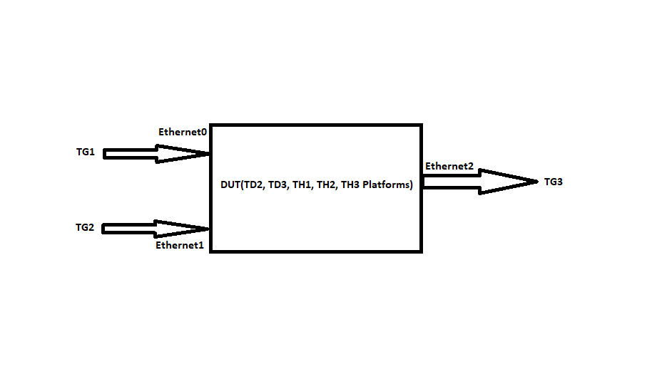

#  SQA Test Plan
#  QOS Scheduler and Shaper
#  SONiC 3.0 Project and Buzznik Release
[TOC]
# Test Plan Revision History
|Rev  | Date        | Author                 | Change Description      |
|:---:|:-----------:|:----------------------:|:-----------------------:|
| 0.1  | 11/06/2019 | Jagadish Ch            | Initial version         |

# List of Reviewers
| Function |         Name         |
| :------: | :------------------: |
|   Dev    |      Michael Li      |
|   Dev    |   Aravindu Maneti    |
|   QA     | Anil Kumar Kolkaleti |
|   QA     |   Giri Babu Sajja    |

# List of Approvers
| Function |         Name         | Date Approved |
| :------: | :------------------: | :-----------: |
|   Dev    |      Michael Li      |               |
|   Dev    |   Aravindu Maneti    |               |
|   QA     | Anil Kumar Kolkaleti |               |
|   QA     |   Giri Babu Sajja    |               |

# Definition/Abbreviation
| Term   | Meaning                                                |
|--------|--------------------------------------------------------|
| QoS    | Quality of Service                                     |
| SP     | Strict Priority                                        |
| WRR    | Weighted Round Robin                                   |
| DWRR   | Deficit Weighted Round Robin                           |

# Feature Overview
Quality of Service (QoS) scheduling and shaping features enable better service to certain traffic flows.

Queue scheduling provides preferential treatment of traffic classes mapped to specific egress queues. SONiC supports SP, WRR, and DWRR scheduling disciplines.

- SP - Higher priority egress queues get scheduled for transmission over lower priority queues.
- WRR - Egress queues receive bandwidth proportional to the configured weight. The scheduling granularity is per packet which causes large and small packets to be treated the same. Flows with large packets have an advantage over flows with smaller packets.
- DWRR - Similar to WRR but uses deficit counter scheduling granularity to account for packet size variations and provide a more accurate proportion of bandwidth.

# Test Approach
- Module prolog constitutes required TG streams creation, mapping configuration, different shaper and scheduler configurations. This configuration is ready to apply to the respective ports/queues in the test functions.
- Test function specific configurations will be handled in the test function itself.
- Functionality, Negative scenarios, Config save-reload, warm-reboot/cold reboot/fast-reboot, scaling tests are covered. 
- FtOpQosPrPsFn001, FtOpQosPrPsFn007 can be clubbed.
- FtOpQosPrPsFn002, FtOpQosPrPsFn005, FtOpQosPrPsFn006, FtOpQosPrPsFn008 can be clubbed.
- FtOpQosPrPsSc002, FtOpQosPrPsSc003 are manual test cases.
- All the shaper/scheduling related configuration is done through CONFIG_DB (config load)

# 1 Test Focus Areas
## 1.1 Functional Testing 
  - QoS shaper functionality on interface and queue level.
  - QoS scheduler functionality with scheduling mode as SP.
  - QoS scheduler functionality with scheduling mode as WRR.
  - QoS scheduler functionality with scheduling mode as DWRR.

## 1.2 Negative Testing 
  - QoS Shaping configuration errors when shaper applied on port-channel or vlan interfaces.
  - QoS Shaping configuration error when shaper configuration applied with attribute values are out of range/without mandatory attributes.

## 1.3 Reboot/Config Testing  
  - Warm reboot
  - Config save and reload
  - Fast-boot
  - config reload

## 1.4 Scale and Performance Testing
  - QoS functionality with maximum QoS scheduler profiles.
  - QoS functionality with scheduler profile configuration applied on all ports and queues.

  
# 2 Topologies
## 2.1 Topology 1

**Note:** All the ports used in the test scenarios are operating at same speed, let's say 10G.  

# 3 Test  Case and Objectives

## 3.1 Functional

### 3.1.1 Verify the functionality of Port-Level shaper configuration.
| **Test ID**    | **FtOpQosPrPsFn001**                                              |
| -------------- | :----------------------------------------------------------- |
| **Test Name**  | **Verify the functionality of Port-Level shaper configuration.** |
| **Test Setup** | **Topology**                                                 |
| **Type**       | **Functional**    
| **Steps**      | **<u>Procedure:</u> 1) Configure the IXIA connected ports as tagged members of non-default VLAN. 2) Configure "meter_type" as "bytes" and "pir" as 80% of total bandwidth of the port for egress port. Note:The bandwidth should be provided  in terms of bytes. 3) Send matched traffic from IXIA(TG0) connected to Ethernet0 towards Ethernet2 at line rate.  <u>Expected Result:</u> 1) Verify that IXIA connectedDUT ports are added as tagged members of non-default VLAN. 2) Verify that configuration is successful. 3) Verify that traffic transmitted from the egress port Ethernet2 as per the configured rate.** |

### 3.1.2 Verify the functionality of Queue-Level shaper configuration.

| **Test ID**    | **FtOpQosPrPsFn002**                                              |
| -------------- | :----------------------------------------------------------- |
| **Test Name**  | **Verify the functionality of Queue-Level shaper configuration.** |
| **Test Setup** | **Topology**                                                 |
| **Type**       | **Functional**                                               |
| **Steps**      | **<u>Procedure:</u> 1) Configure the IXIA connected ports as tagged members of non-default VLAN. 2)Configure "meter_type" as "bytes" and "pir" as 80% of total bandwidth of the port for Queue-1 and 20% of total bandwidth of the port for queue-2 for egress port(Ethernet2). Note:The bandwidth should be provided  in terms of bytes. 3) Send traffic from IXIAs(TG0, TG1) connected to Ethernet0, Ethernet1 towards Ethernet2 with priorities-1,2 respectively at line rate.  <u>Expected Result:</u> 1) Verify that IXIA connectedDUT ports are added as tagged members of non-default VLAN. 2) Verify that configuration is successful. 3) Verify that priorities-1, priorities-2 traffics are egressed from the egress port(Ethernet2) as per the configured rates.** |

### 3.1.3 Verify the scheduling of the queue in MinNotMet case.

| **Test ID**    | **FtOpQosPrPsFn003**                                              |
| -------------- | :----------------------------------------------------------- |
| **Test Name**  | **Verify the scheduling of the queue in MinNotMet case.** |
| **Test Setup** | **Topology**                                                 |
| **Type**       | **Functional**                                               |
| **Steps**      | **<u>Procedure:</u> 1) Configure the IXIA connected ports as tagged members of non-default VLAN. 2) Configure the min bandwidth and max bandwidth for the queue-1 of egress port(Ethernet2) as 9Gb and 10Gb respectively. 3) Configure the min bandwidth and max bandwidth for the queue-2 of egress port(Ethernet2) as  1.2Gb and 10Gb respectively. 4) Send traffic from IXIAs(TG0, TG1) connected to Ethernet0, Ethernet1 towards Ethernet2 with priorities-1,2 respectively at the rates 80%(8Gbps) and 100%(10Gbps) of the line rates.  <u>Expected Result:</u> 1) Verify that IXIA connectedDUT ports are added as tagged members of non-default VLAN. 2) Verify that configuration is successful. 3) Verify that configuration is successful. 4) Verify that priority-1 traffic is egressed without any loss.** |

### 3.1.4 Verify that other traffic streams are unaffected by the QoS shaping configuration at queue level.

| **Test ID**    | **FtOpQosPrPsFn004**                                              |
| -------------- | :----------------------------------------------------------- |
| **Test Name**  | **Verify that other traffic streams are unaffected by the QoS shaping configuration at queue level.** |
| **Test Setup** | **Topology**                                                 |
| **Type**       | **Functional**                                               |
| **Steps**      | **<u>Procedure:</u> 1) Configure the IXIA connected ports as tagged members of non-default VLAN. 2) Configure  shaper of 1Gbps on queue 0 of egress port(Ethernet2). Note:The bandwidth should be provided  in terms of bytes. 3) Configure scheduling between queue 0 and 1 of egress port as round robin(WFQ w/ weight of 1). 4) Send traffic from IXIA(TG0) connected to Ethernet0 towards Ethernet2 with priority-0 at line rate. 5) Without stopping previous traffic send traffic from IXIA(TG1) connected to Ethernet1 towards Ethernet2 with priority-1 at 9Gbps rate.  <u>Expected Result:</u> 1) Verify that IXIA connectedDUT ports are added as tagged members of non-default VLAN. 2) Verify that shaper rate is set to 1Gbps in queue0 of egress port(Ethernet2). 3) Verify that scheduling weights are set as per the configuration. 4) Verify that priority-0 traffic is egressed from the egress port(Ethernet2) at the rate of 1Gbps. 5) Verify that priority-1 traffic is egressed from the egress port(Ethernet2)at without any loss.** |

### 3.1.5 Verify that QOS shaper configuration at port level on one port is not effecting the other.

| **Test ID**    | **FtOpQosPrPsFn005**                                              |
| -------------- | :----------------------------------------------------------- |
| **Test Name**  | **Verify that QOS shaper configuration at port level on one port is not effecting the other.** |
| **Test Setup** | **Topology**                                                 |
| **Type**       | **Functional**                                               |
| **Steps**      | **<u>Procedure:</u> 1) Configure the IXIA connected ports as tagged members of non-default VLAN. 2) Configure  shaper of 1Gbps on Ethernet1 port. Note:The bandwidth should be provided  in terms of bytes. 3) Send a flow-1 from IXIA(TG0) connected to Ethernet0 towards Ethernet1 at 5Gbps rate. 4) Without stopping previous flow-1 send one more flow i.e. flow-2 from IXIA(TG0) connected to Ethernet0 towards Ethernet2 at 5Gbps rate.  <u>Expected Result:</u> 1) Verify that IXIA connectedDUT ports are added as tagged members of non-default VLAN. 2) Verify that shaper rate is set to 1Gbps for Ethernet1. 3) Verify that flow-1 traffic is egressed from the Ethernet1 at the rate of 1Gbps. 4) Verify that flow-2 traffic is egressed from Ethernet2 at without any loss.** |

### 3.1.6 Verify that after removing the QoS scheduler profile configuration on interface, the traffic rate is no longer rate limited.

| **Test ID**    | **FtOpQosPrPsFn006**                                              |
| -------------- | :----------------------------------------------------------- |
| **Test Name**  | **Verify that after removing the QoS scheduler profile configuration on interface, the traffic rate is no longer rate limited.** |
| **Test Setup** | **Topology**                                                 |
| **Type**       | **Functional**                                               |
| **Steps**      | **<u>Procedure:</u> 1) Configure the IXIA connected ports as tagged members of non-default VLAN. 2) Configure "meter_type" as "bytes" and "pir" as 80% of total port bandwidth for egress port(Ethernet2). 3) Send matched traffic from IXIA(TG0) connected to Ethernet0 towards Ethernet2 at line rate. 4) Remove the QoS scheduler profile on the egress port(Ethernet2) which we applied previously. 5) Send matched traffic from IXIA(TG0) connected to Ethernet0 towards Ethernet2 at line rate.  <u>Expected Result:</u> 1) Verify that IXIA connectedDUT ports are added as tagged members of non-default VLAN. 2) Verify that configuration is successful. 3) Verify that traffic transmitted from the egress port Ethernet2 as per the configured rate. 4) Verify that configuration is successful. 5) Verify that traffic transmitted from the egress port Ethernet2 without any loss.** |

### 3.1.7 Verify that traffic is rate-limited as per the updated value when user updates the existing QoS shaper configuration.

| **Test ID**    | **FtOpQosPrPsFn007**                                              |
| -------------- | :----------------------------------------------------------- |
| **Test Name**  | **Verify that traffic is rate-limited as per the updated value when user updates the existing QoS shaper configuration.** |
| **Test Setup** | **Topology**                                                 |
| **Type**       | **Functional**                                                   |
| **Steps**      | **<u>Procedure:</u> 1) Configure the IXIA connected ports as tagged members of non-default VLAN. 2) Configure "meter_type" as "bytes" and "pir" as 80% of total port bandwidth for Queue-1 and 20% of total port bandwidth for queue-2 of egress port(Ethernet2). Note:The bandwidth should be provided  in terms of bytes. 3) Send traffic from IXIAs(TG0, TG1) connected to Ethernet0, Ethernet1 towards Ethernet2 with priorities-1,2 respectively at line rate. 4) Do config qos clear 5) Send traffic from IXIAs(TG0, TG1) connected to Ethernet0, Ethernet1 towards Ethernet2 with priorities-1,2 respectively at line rate. 6) Configure max bandwidth as 20% for Queue-1 and 80% for queue-2 for egress port(Ethernet2). 7) Send traffic from IXIAs(TG0, TG1) connected to Ethernet0, Ethernet1 towards Ethernet2 with priorities other than 1, 2 at line rate.  <u>Expected Result:</u> 1) Verify that IXIA connectedDUT ports are added as tagged members of non-default VLAN. 2) Verify that configuration is successful. 3) Verify that priorities-1, priorities-2 traffics are egressed from the egress port(Ethernet2)at the rates 80% and 20% of line rates respectively. 4) Verify that all QOS related configuration is removed successfully. 5) Verify that both the traffics(priority-1, priority-2) are egressed at equal rates. 6) Verify that configuration is successful. 7) Verify that priorities-1, priorities-2 traffics are egressed from the egress port(Ethernet2)as per the configured rates.** |

### 3.1.8 Verify the functionality of QOS scheduling with both Queue-Level and interface level shaper configurations.

| **Test ID**    | **FtOpQosPrPsFn008**                                              |
| -------------- | :----------------------------------------------------------- |
| **Test Name**  | **Verify the functionality of QOS scheduling with both Queue-Level and interface level shaper configurations.** |
| **Test Setup** | **Topology**                                                 |
| **Type**       | **Functional**                                               |
| **Steps**      | **<u>Procedure:</u> 1) Configure the IXIA connected ports as tagged members of non-default VLAN. 2)Configure "meter_type" as "bytes" and "pir" as 80%(8Gbps) for Queue-1 and 20%(2Gbps) for queue-2 for egress port(Ethernet2). 3)Configure "meter_type" as "bytes" and "pir" as 70%(7Gbps) of total port bandwidth for egress port(Ethernet2). Note:The bandwidth should be provided  in terms of bytes. 4) Send traffic from IXIAs(TG0, TG1) connected to Ethernet0,Ethernet1 towards Ethernet2 with priorities-1,2 respectively at line rate.  <u>Expected Result:</u> 1) Verify that IXIA connectedDUT ports are added as tagged members of non-default VLAN. 2) Verify that configuration is successful. 3) Verify that configuration is successful. 4) Verify that priorities-1, priorities-2 traffics are egressed at the rates 5Gbps, 2Gbps respectively and the total traffic egressed from the egress port(Ethernet2) at the rate of 7Gbps.**|

### 3.1.9 Verify the shaper functionality on L3 interface.
| **Test ID**    | **FtOpQosPrPsFn009**                                              |
| -------------- | :----------------------------------------------------------- |
| **Test Name**  | **Verify the shaper functionality on L3 interface.** |
| **Test Setup** | **Topology**                                                 |
| **Type**       | **Functional**    
| **Steps**      | **<u>Procedure:</u> 1) Configure two routing interfaces using the DUT ports(Ethernet0, Ethernet2) which are connected to the IXIA. 2) Configure "meter_type" as "bytes" and "pir" as 80% of total bandwidth of the port for egress L3 interface(Ethernet2). Note:The bandwidth should be provided  in terms of bytes  3) Send L3 traffic from IXIA(TG0) connected to Ethernet0 towards Ethernet2 at line rate.  <u>Expected Result:</u> 1) Verify that IXIA connectedDUT ports are added as tagged members of non-default VLAN. 1) Verify that configuration is successful. 2) Verify that configuration is successful. 3) Verify that traffic transmitted from the egress L3 interface Ethernet2 as per the configured rate.** |

### 3.1.10 Verify the QOS shaper interaction with scheduler.
| **Test ID**    | **FtOpQosPrPsFn010**                                              |
| -------------- | :----------------------------------------------------------- |
| **Test Name**  | **Verify the QOS shaper interaction with scheduler.** |
| **Test Setup** | **Topology**                                                 |
| **Type**       | **Functional**    
| **Steps**      | **<u>Procedure:</u> 1) Configure the IXIA connected ports as tagged members of non-default VLAN. 2) Configure "pir" as 4Gbps, 6Gbps for Queue-1, Queue-2of egress port(Ethernet2) respectively. 3) Configure the scheduler weights for the queues-1,2 of egress port(Ethernet2) as 20 and 80 respectively. Note:The bandwidth should be provided  in terms of bytes. 4) Send traffic from IXIAs(TG0, TG1) connected to Ethernet0,Ethernet1 towards Ethernet2 with priorities-1,2 respectively at line rate.  <u>Expected Result:</u> 1) Verify that IXIA connectedDUT ports are added as tagged members of non-default VLAN. 2) Verify that shaper rates are set to 4Gbps, 6Gbps for Queue-1, 2 of egress port(Ethernet2) respectively. 3) Verify that scheduler weights are set to 20, 80 for Queue-1, 2 of egress port(Ethernet2) respectively. 4) Verify that priorities-1, priorities-2 traffics are egressed at the rates 20% of 4Gbps, 80% of 6Gbps respectively.**|

### 3.1.11 Verify the functionality of QOS scheduling with scheduling type as "WRR".

| **Test ID**    | **FtOpQosPrPsFn011**                                              |
| -------------- | :----------------------------------------------------------- |
| **Test Name**  | **Verify the functionality of QOS scheduling with scheduling type as "WRR".** |
| **Test Setup** | **Topology**                                                 |
| **Type**       | **Functional**                                               |
| **Steps**      | **<u>Procedure:</u> 1) Configure the IXIA connected ports as tagged members of non-default VLAN. 2)Configure SCHEDULER type as "WRR" and "weight" as 80 for Queue-1 and 20 for queue-2 of an egress port(Ethernet2). 3) Send traffic from IXIAs(TG0, TG1) connected to Ethernet0,Ethernet1 towards Ethernet2 with priorities-1,2 respectively at line rate.  <u>Expected Result:</u> 1) Verify that IXIA connectedDUT ports are added as tagged members of non-default VLAN. 2) Verify that configuration is successful. 3) Verify that priorities-1, priorities-2 traffics are egressed from the egress port(Ethernet2) as per the configured weights.**|

### 3.1.12 Verify the functionality of QOS scheduling with scheduling type as "DWRR".

| **Test ID**    | **FtOpQosPrPsFn012**                                              |
| -------------- | :----------------------------------------------------------- |
| **Test Name**  | **Verify the functionality of QOS scheduling with scheduling type as "DWRR".** |
| **Test Setup** | **Topology**                                                 |
| **Type**       | **Functional**                                               |
| **Steps**      | **<u>Procedure:</u> 1) Configure the IXIA connected ports as tagged members of non-default VLAN. 2)Configure SCHEDULER type as "DWRR" and "weight" as 80 for Queue-1 and 20 for queue-2 of an egress port(Ethernet2). 3) Send traffic from IXIAs(TG0, TG1) connected to Ethernet0,Ethernet1 towards Ethernet2 with priorities-1,2 respectively at line rate.  <u>Expected Result:</u> 1) Verify that IXIA connectedDUT ports are added as tagged members of non-default VLAN. 2) Verify that configuration is successful. 3) Verify that priorities-1, priorities-2 traffics are egressed from the egress port(Ethernet2) as per the configured weights.**|

## 3.2 Negative

### 3.2.1 Verify that QoS Shaping configuration errors out when applied on port-channel or vlan interfaces.

| **Test ID**    | **FtOpQosPrPsNt001**                                              |
| -------------- | :----------------------------------------------------------- |
| **Test Name**  | **Verify that QoS Shaping configuration errors out when applied on port-channel or vlan interfaces.** |
| **Test Setup** | **Topology**                                                 |
| **Type**       | **Negative**                                                 |
| **Steps**      | **<u>Procedure:</u> 1) Configure a port-channel interface, VLAN interface. 2) Configure a QOS shaper profile with "meter_type" as "bytes", "pir" as "125000000". 3) Apply the shaper profile to the port-channel interface. 4) Send traffic from IXIA(TG0) connected to Ethernet0 towards port-channel interface at line rate. 5) Apply the shaper profile to the VLAN interface. 6) Send traffic from IXIA(TG0) connected to Ethernet0 towards VLAN interface at line rate. <u>Expected Result:</u> 1) Verify that IXIA connectedDUT ports are added as tagged members of non-default VLAN. 2) Verify that configuration is successful. 3) Verify that configuration is not successful and syslog error message is observed. 4) Verify that traffic is egressed from port-channel interface without any loss(shaper is not applied to the port-channel interface) 5) Verify that configuration is not successful and syslog error message is observed. 6) Verify that traffic is egressed from VLAN interface without any loss(shaper is not applied to the VLAN interface)** |

## 3.3 Reboot/Reload/Upgrade Test Cases

### 3.3.1 Verify QOS port shaper functionality with valid startup configuration and after normal/cold reboot

| **Test ID**    | **FtOpQosPrPsLr001**                                              |
| -------------- | :----------------------------------------------------------- |
| **Test Name**  | **Verify QOS port shaper functionality with valid startup configuration and after normal/cold reboot** |
| **Test Setup** | **Topology**                                                 |
| **Type**       | **Cold-Reboot**                                                   |
| **Steps**      | **<u>Procedure:</u> 1) Configure the IXIA connected ports as tagged members of non-default VLAN. 2) "meter_type" as "bytes" and "pir" as 80% of total bandwidth of the port for egress port(Ethernet2). Note:The bandwidth should be provided  in terms of bytes. 3) Send matched traffic from IXIA(TG0) connected to Ethernet0 towards Ethernet2 at line rate. 4) Save the configuration and cold-reboot the device. 5) Send matched traffic from IXIA(TG0) connected to Ethernet0 towards Ethernet2 at line rate.  <u>Expected Result:</u> 1) Verify that IXIA connectedDUT ports are added as tagged members of non-default VLAN. 2) Verify that configuration is successful. 3) Verify that traffic transmitted from the egress port as per the configured rate. 4) Verify device is up after cold-reboot. 5) Verify that traffic transmitted from the egress port Ethernet2 as per the configured rate.** |

### 3.3.2 Verify QOS port shaper functionality with valid startup configuration and after fast-reboot

| **Test ID**    | **FtOpQosPrPsLr002**                                              |
| -------------- | :----------------------------------------------------------- |
| **Test Name**  | **Verify QOS port shaper functionality with valid startup configuration and after fast-reboot** |
| **Test Setup** | **Topology**                                                 |
| **Type**       | **Fast-Reboot**                                                   |
| **Steps**   |   **<u>Procedure:</u> 1) Configure the IXIA connected ports as tagged members of non-default VLAN. 2) "meter_type" as "bytes" and "pir" as 80% of total bandwidth of the port for egress port(Ethernet2). Note:The bandwidth should be provided  in terms of bytes. 3) Send matched traffic from IXIA(TG0) connected to Ethernet0 towards Ethernet2 at line rate. 4) Save the configuration and fast-reboot the device. 5) Send matched traffic from IXIA(TG0) connected to Ethernet0 towards Ethernet2 at line rate.  <u>Expected Result:</u> 1) Verify that IXIA connectedDUT ports are added as tagged members of non-default VLAN. 2) Verify that configuration is successful. 3) Verify that traffic transmitted from the egress port as per the configured rate. 4) Verify device is up after fast-reboot. 5) Verify that traffic transmitted from the egress port Ethernet2 as per the configured rate.** |

### 3.3.3 Verify QOS port shaper functionality with valid startup configuration and after config reload

| **Test ID**    | **FtOpQosPrPsLr003**                                              |
| -------------- | :----------------------------------------------------------- |
| **Test Name**  | **Verify QOS port shaper functionality with valid startup configuration and after config reload** |
| **Test Setup** | **Topology**                                                 |
| **Type**       | **Config-Reload**                                                   |
| **Steps**      | **<u>Procedure:</u> 1) Configure the IXIA connected ports as tagged members of non-default VLAN. 2) "meter_type" as "bytes" and "pir" as 80% of total bandwidth of the port for egress port(Ethernet2). Note:The bandwidth should be provided  in terms of bytes. 3) Send matched traffic from IXIA(TG0) connected to Ethernet0 towards Ethernet2 at line rate. 4) Save the configuration and do config reload. 5) Send matched traffic from IXIA(TG0) connected to Ethernet0 towards Ethernet2 at line rate.  <u>Expected Result:</u> 1) Verify that IXIA connectedDUT ports are added as tagged members of non-default VLAN. 2) Verify that configuration is successful. 3) Verify that traffic transmitted from the egress port as per the configured rate. 4) Verify device is up after config-reload. 5) Verify that traffic transmitted from the egress port Ethernet2 as per the configured rate.** |

### 3.3.4 Verify QOS port shaper functionality after warm reboot

| **Test ID**    | **FtOpQosPrPsLr004**                                              |
| -------------- | :----------------------------------------------------------- |
| **Test Name**  | **Verify QOS port shaper functionality after warm reboot** |
| **Test Setup** | **Topology**                                                 |
| **Type**       | **Warm-Reboot**                                                   |
| **Steps**     | **<u>Procedure:</u> 1) Configure the IXIA connected ports as tagged members of non-default VLAN. 2) "meter_type" as "bytes" and "pir" as 80% of total bandwidth of the port for egress port(Ethernet2). Note:The bandwidth should be provided  in terms of bytes. 3) Send matched traffic from IXIA(TG0) connected to Ethernet0 towards Ethernet2 at line rate. 4) Warm-reboot the device. 5) Send matched traffic from IXIA(TG0) connected to Ethernet0 towards Ethernet2 at line rate.  <u>Expected Result:</u> 1) Verify that IXIA connectedDUT ports are added as tagged members of non-default VLAN. 2) Verify that configuration is successful. 3) Verify that traffic transmitted from the egress port as per the configured rate. 4) Verify device is up after warm-reboot. 5) Verify that traffic transmitted from the egress port Ethernet2 as per the configured rate.** |

### 3.3.5 Verify QOS queue shaper functionality with valid startup configuration and after normal/cold reboot
| **Test ID**    | **FtOpQosPrPsLr005**                                              |
| -------------- | :----------------------------------------------------------- |
| **Test Name**  | **Verify QOS queue shaper functionality with valid startup configuration and after normal/cold reboot.** |
| **Test Setup** | **Topology**                                                 |
| **Type**       | **Cold-Reboot**                                               |
| **Steps**      | **<u>Procedure:</u> 1) Configure the IXIA connected ports as tagged members of non-default VLAN. 2)Configure "meter_type" as "bytes" and "pir" as 80% of total bandwidth of the port for Queue-1 and 20% of total bandwidth of the port for queue-2 for egress port(Ethernet2). Note:The bandwidth should be provided  in terms of bytes. 3) Send traffic from IXIAs(TG0, TG1) connected to Ethernet0, Ethernet1 towards Ethernet2 with priorities-1,2 respectively at line rate. 4) Save the configuration and cold reboot the device. 5) Send traffic from IXIAs(TG0, TG1) connected to Ethernet0, Ethernet1 towards Ethernet2 with priorities-1,2 respectively at line rate.  <u>Expected Result:</u> 1) Verify that IXIA connectedDUT ports are added as tagged members of non-default VLAN. 2) Verify that configuration is successful. 3) Verify that priorities-1, priorities-2 traffics are egressed from the egress port(Ethernet2) as per the configured rates. 4) Verify device is up after cold-reboot. 5) Verify that priorities-1, priorities-2 traffics are egressed from the egress port(Ethernet2) as per the configured rates.** |

### 3.3.6 Verify QOS queue shaper functionality with valid startup configuration and after fast-reboot
| **Test ID**    | **FtOpQosPrPsLr006**                                              |
| -------------- | :----------------------------------------------------------- |
| **Test Name**  | **Verify QOS queue shaper functionality with valid startup configuration and after fast-reboot.** |
| **Test Setup** | **Topology**                                                 |
| **Type**       | **Fast-Reboot**                                               |
| **Steps**      | **<u>Procedure:</u> 1) Configure the IXIA connected ports as tagged members of non-default VLAN. 2)Configure "meter_type" as "bytes" and "pir" as 80% of total bandwidth of the port for Queue-1 and 20% of total bandwidth of the port for queue-2 for egress port(Ethernet2). Note:The bandwidth should be provided  in terms of bytes. 3) Send traffic from IXIAs(TG0, TG1) connected to Ethernet0, Ethernet1 towards Ethernet2 with priorities-1,2 respectively at line rate. 4) Save the configuration and fast-reboot the device. 5) Send traffic from IXIAs(TG0, TG1) connected to Ethernet0, Ethernet1 towards Ethernet2 with priorities-1,2 respectively at line rate.  <u>Expected Result:</u> 1) Verify that IXIA connectedDUT ports are added as tagged members of non-default VLAN. 2) Verify that configuration is successful. 3) Verify that priorities-1, priorities-2 traffics are egressed from the egress port(Ethernet2) as per the configured rates. 4) Verify device is up after fast-reboot. 5) Verify that priorities-1, priorities-2 traffics are egressed from the egress port(Ethernet2) as per the configured rates.** |

### 3.3.7 Verify QOS queue shaper functionality with valid startup configuration and after config reload
| **Test ID**    | **FtOpQosPrPsLr007**                                              |
| -------------- | :----------------------------------------------------------- |
| **Test Name**  | **Verify QOS queue shaper functionality with valid startup configuration and after config reload.** |
| **Test Setup** | **Topology**                                                 |
| **Type**       | **Config-Reload**                                               |
| **Steps**      | **<u>Procedure:</u> 1) Configure the IXIA connected ports as tagged members of non-default VLAN. 2)Configure "meter_type" as "bytes" and "pir" as 80% of total bandwidth of the port for Queue-1 and 20% of total bandwidth of the port for queue-2 for egress port(Ethernet2). Note:The bandwidth should be provided  in terms of bytes. 3) Send traffic from IXIAs(TG0, TG1) connected to Ethernet0, Ethernet1 towards Ethernet2 with priorities-1,2 respectively at line rate. 4) Save the configuration and config reload the device. 5) Send traffic from IXIAs(TG0, TG1) connected to Ethernet0, Ethernet1 towards Ethernet2 with priorities-1,2 respectively at line rate.  <u>Expected Result:</u> 1) Verify that IXIA connectedDUT ports are added as tagged members of non-default VLAN. 2) Verify that configuration is successful. 3) Verify that priorities-1, priorities-2 traffics are egressed from the egress port(Ethernet2) as per the configured rates. 4) Verify device is up after config reload. 5) Verify that priorities-1, priorities-2 traffics are egressed from the egress port(Ethernet2) as per the configured rates.** |

### 3.3.8 Verify QOS queue shaper functionality with valid startup configuration and after warm-reboot
| **Test ID**    | **FtOpQosPrPsLr008**                                              |
| -------------- | :----------------------------------------------------------- |
| **Test Name**  | **Verify QOS queue shaper functionality with valid startup configuration and after warm-reboot.** |
| **Test Setup** | **Topology**                                                 |
| **Type**       | **Warm-Reboot**                                               |
| **Steps**      | **<u>Procedure:</u> 1) Configure the IXIA connected ports as tagged members of non-default VLAN. 2)Configure "meter_type" as "bytes" and "pir" as 80% of total bandwidth of the port for Queue-1 and 20% of total bandwidth of the port for queue-2 for egress port(Ethernet2). Note:The bandwidth should be provided  in terms of bytes. 3) Send traffic from IXIAs(TG0, TG1) connected to Ethernet0, Ethernet1 towards Ethernet2 with priorities-1,2 respectively at line rate. 4) Warm-reboot the device. 5) Send traffic from IXIAs(TG0, TG1) connected to Ethernet0, Ethernet1 towards Ethernet2 with priorities-1,2 respectively at line rate.  <u>Expected Result:</u> 1) Verify that IXIA connectedDUT ports are added as tagged members of non-default VLAN. 2) Verify that configuration is successful. 3) Verify that priorities-1, priorities-2 traffics are egressed from the egress port(Ethernet2) as per the configured rates. 4) Verify device is up after warm-reboot. 5) Verify that priorities-1, priorities-2 traffics are egressed from the egress port(Ethernet2) as per the configured rates.** |

## 3.4 Stress,Scale and Performance

### 3.4.1  Verify that failure occurs with configuration of max+1 QoS scheduler profiles

| **Test ID**    | **FtOpQosPrPsSc001**                                              |
| -------------- | :----------------------------------------------------------- |
| **Test Name**  | **Verify that failure occurs with configuration of max+1 QoS scheduler profiles** |
| **Test Setup** | **Topology**                                                 |
| **Type**       | **Scalability**                                                 |
| **Steps**      | **<u>Procedure:</u> 1) Configure max number of QoS scheduler profiles. 2) Configure one more QOS scheduler profile.  <u>Expected Result:</u> 1) Verify that QoS scheduler profiles are configured successfully. 2) Verify that configuration not successful and proper error message is displayed.** |

### 3.4.2  Verify  QoS shaper functionality at queue level on the physical interface by changing it's speed.

| **Test ID**    | **FtOpQosPrPsSc002**                                              |
| -------------- | :----------------------------------------------------------- |
| **Test Name**  | **Verify  QoS shaper functionality on the physical interface by changing it's speed at queue level.** |
| **Test Setup** | **Topology**                                                 |
| **Type**       | **Scalability**                                                 |
| **Steps**      | **<u>Procedure:</u> 1) Configure the IXIA connected DUT ports(Ethernet0, Ethernet1, Ethernet2) as tagged members of non-default VLAN. Note: All the ports are operating at same speeds let's say 100G 2)Configure "meter_type" as "bytes" and "pir" as 8Gbps of the port for Queue-1 and 2Gbps for queue-2 for egress port(Ethernet2). Note:The bandwidth should be provided  in terms of bytes. 3) Send traffic from IXIAs(TG0, TG1) connected to Ethernet0, Ethernet1 towards Ethernet2 with priorities-1,2 respectively at line rate. 4) Change the port speed for egress port(Ethernet2) to 40G, change the IXIA speed also to 40G accordingly. 5) Send traffic from IXIAs(TG0, TG1) connected to Ethernet0, Ethernet1 towards Ethernet2 with priorities-1,2 respectively at line rate.  <u>Expected Result:</u> 1) Verify that IXIA connectedDUT ports are added as tagged members of non-default VLAN. 2) Verify that configuration is successful. 3) Verify that priorities-1, priorities-2 traffics are egressed from the egress port(Ethernet2) at 8Gbps, 2Gbps respectively. 4) Verify that port speed is changes to 40G and the port is Up. 5) Verify that priorities-1, priorities-2 traffics are egressed from the egress port(Ethernet2) at 8Gbps, 2Gbps respectively.  Note: Repeat the test with different port types with different supported speeds configured on each port type** |

### 3.4.3  Verify  QoS shaper functionality at port level on the physical interface by changing it's speed.

| **Test ID**    | **FtOpQosPrPsSc003**                                              |
| -------------- | :----------------------------------------------------------- |
| **Test Name**  | **Verify  QoS shaper functionality on the physical interface by changing it's speed at port level.** |
| **Test Setup** | **Topology**                                                 |
| **Type**       | **Scalability**                                                 |
| **Steps**      | **<u>Procedure:</u>  Configure the IXIA connected DUT ports(Ethernet0, Ethernet2) as tagged members of non-default VLAN. Note: All the ports are operating at same speeds let's say 100G 2)Configure "meter_type" as "bytes" and "pir" as 8Gbps at port level for egress port(Ethernet2). Note:The bandwidth should be provided  in terms of bytes. 3) Send traffic from IXIA(TG0) connected to Ethernet0 towards Ethernet2 at line rate. 4) Change the port speed for egress port(Ethernet2) to 40G, change the IXIA speed also to 40G accordingly. 5) Send traffic from IXIA(TG0) connected to Ethernet0 towards Ethernet2 at line rate.  <u>Expected Result:</u> 1) Verify that IXIA connectedDUT ports are added as tagged members of non-default VLAN. 2) Verify that configuration is successful. 3) Verify that traffic is egressed from the egress port(Ethernet2) at 8Gbps rate. 4) Verify that port speed is changes to 40G and the port is Up. 5) Verify that traffic is egressed from the egress port(Ethernet2) at 8Gbps rate.  Note: Repeat the test with different port types with different supported speeds configured on each port type** |

## 3.5 UI
N/A UI's will be covered as part of spytest infra.

## 4 Reference Links
SONIC 3.0 'QoS Scheduling and Shaping' feature HLD @ http://gerrit-lvn-07.lvn.broadcom.net:8083/c/sonic/documents/+/13005 