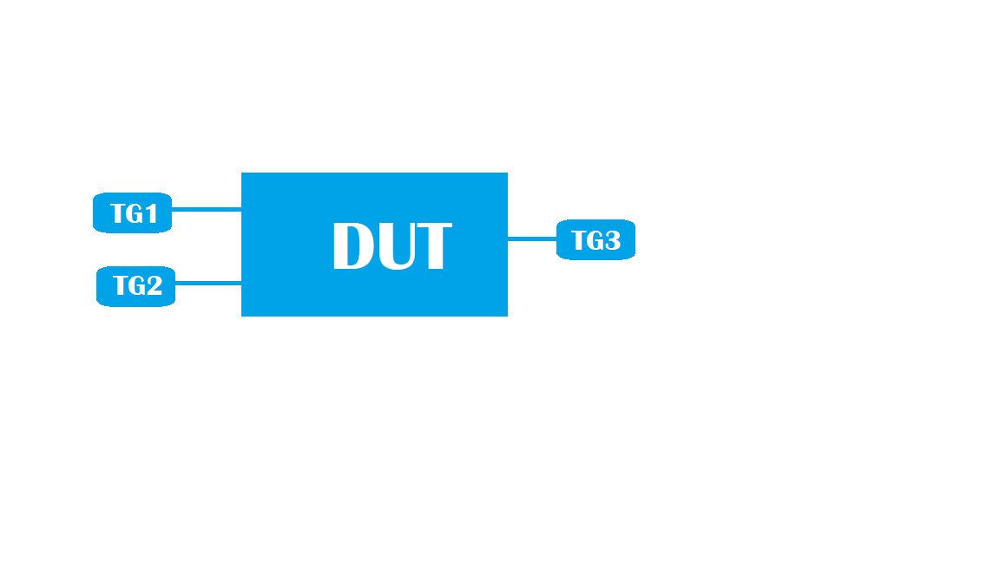

#  SQA Test Plan
#  ACL DSCP Mark/Remark
#  SONiC 3.0 Project and Buzznik Release
[TOC]

# Test Plan Revision History
| Rev  |    Date    |        Author        | Change Description |
| :--: | :--------: | :------------------: | ------------------ |
| 0.1  | 01/10/2019 | PrudviRaj Kristipati | Initial version    |

# List of Reviewers
| Function |        Name         |
| :------: | :-----------------: |
|   Dev    |     Adam Yeung      |
|   Dev    | Abhishek Dharwadkar |
|    QA    |  Michael Goldflam   |
|    QA    |  Kalyan Vadlamani   |
|    QA    |   Giri Babu Sajja   |

# List of Approvers
| Function |        Name        | Date Approved |
| :------: | :----------------: | :-----------: |
|   Dev    |     Adam Yeung     |               |
|   Dev    | Abhishek Dharwadka |               |
|    QA    |  Michael Goldflam  |               |
|    QA    |  Kalyan Vadlamani  |               |
|    QA    |  Giri Babu Sajja   |               |

# Definition/Abbreviation
| **Term** | **Meaning**                        |
| -------- | ---------------------------------- |
| DSCP     | Differentiated services code point |
| PCP      | Priority Code Point                |
| ACL      | Access control List                |
| MQC      | Modular QoS CLIs                   |

# Feature Overview
Flow based services enhance the switches capability to have enhanced and better control over the traffic by providing a generic framework for "Match and Set" features. 
Incoming packets can be classified according to match rules using fields from L2-L4 headers and defined actions can be taken accordingly.
Example: QOS remarking and policing.
This can be achieved by Modular QOS CLI's 

# 1 Test Focus Areas
## 1.1 Functional Testing 
  - All CLI and debug commands,
  - Scaling with max supported policies, classifiers.

## 1.2 Negative Testing 
  - Traffic flow for invalid scenarios
  - Clear policy binding statistics for an interface
  - Clear policy binding statistics for a given policy
  - Warm reboot
  - Config save and reload

## 1.3 Scale and Performance Testing

# 2 Topologies
## 2.1 Topology
####  

# 3 Test Case and Objectives
## 3.1 CLI

### 3.1.1 Verify the command Clear policy binding statistics for an interface command is working or not in the Device

| **Test ID**    | **ACLDSCP001**                                               |
| -------------- | :----------------------------------------------------------- |
| **Test Name**  | **Verify the command Clear policy binding statistics for an interface command is working or not in the Device** |
| **Test Setup** | **Topology**                                                 |
| **Type**       | **CLI**                                                      |
| **Steps**      | **1) Verify the command clear statistics service-policy interface INTFName  2) The output should not contain any counter values** |

### 3.1.2 Verify the command Clear policy binding statistics for a given policy command is working or not in the Device

| **Test ID**    | **ACLDSCP002**                                               |
| -------------- | :----------------------------------------------------------- |
| **Test Name**  | **Verify the command Clear policy binding statistics for a given policy command is working or not in the Device** |
| **Test Setup** | **Topology**                                                 |
| **Type**       | **CLI**                                                      |
| **Steps**      | **1) Configuring header fields of IPV4 and IPV6 address should not be successful 2)This is not supported by ACLs and configuration is invalid** |

### 3.1.3 Verify that Configuration of mutually exclusive header fields like IPv4 address and IPv6 addresses should not be successful

| **Test ID**    | **ACLDSCP003**                                               |
| -------------- | :----------------------------------------------------------- |
| **Test Name**  | **Verify that Configuration of mutually exclusive header fields like IPv4 address and IPv6 addresses should not be successful** |
| **Test Setup** | **Topology**                                                 |
| **Type**       | **CLI**                                                      |
| **Steps**      | **1) Create a policy P1 2)Now Try to configure the header fields like IPV4 and IPV6 addreses 3) observe that configuration shouldnot be successful** |

###3.1.4 Verify that same policy can be applied to different interfaces and verify the same in show commands

| **Test ID**    | **ACLDSCP004**                                               |
| -------------- | :----------------------------------------------------------- |
| **Test Name**  | **Verify that Same policy can be applied to different interfaces and verify the same in show commands.** |
| **Test Setup** | **Topology**                                                 |
| **Type**       | **CLI**                                                      |
| **Steps**      | **1) Create a Policy P1  2)Try to apply the same policy to different interfaces. 3)Now the configuration should be successful and verify the same with the available show commands.** |

## 3.2 Functional

### 3.2.1 Verify whether we can bind Multiple policies say p1,p2 of type QOS over Port or LAGs and VLANs.
| **Test ID**    | **ACLDSCP005**                                               |
| -------------- | :----------------------------------------------------------- |
| **Test Name**  | **Verify whether we can bind Multiple policies say p1,p2 of type QOS over Port or LAGs and VLANs.** |
| **Test Setup** | **Topology**                                                 |
| **Type**       | **Functional**                                               |
| **Steps**      | **1) Create 4 Policies P1-P4 2) Check whether created Polices  are created or not 3) After successful creation of Policies Try to bind each policy  in Different interfaces Say VLAN/LAG/PORT 4) Verify all the policies are successfully bind or not.** |

### 3.2.2 Verify Different actions for classifier like Add,Delete Match conditions

| **Test ID**    | **ACLDSCP006**                                               |
| -------------- | :----------------------------------------------------------- |
| **Test Name**  | **Verify Different actions for classifier like Add,Delete Match conditions** |
| **Test Setup** | **Topology**                                                 |
| **Type**       | **Functional**                                               |
| **Steps**      | **1) Create a classifier 2) Perform Different actions like Add,Delete of SRC MAC 3)Verify the same through show commands before and after 5)Repeat the steps 2 & 3 by taking randomly SIP,DIP,DMAC,VLAN number,TCP Port number,Ethertype.** |

### 3.2.3 Verify Different actions of Policies like Add,Delete

| **Test ID**    | **ACLDSCP007**                                               |
| -------------- | :----------------------------------------------------------- |
| **Test Name**  | **Verify Different actions of Policies like Add,Delete**     |
| **Test Setup** | **Topology**                                                 |
| **Type**       | **Functional**                                               |
| **Steps**      | **1) Create a Policy 2) Perform Different actions like Add,Delete of the policy 3)Now try to apply the policy to the interface  4)Verify the same configuration with respective show commands.** |

### 3.2.4 Verfiy that creation of classifier is successful and configuration will be retained and no error will be displayed on the Device when ACL is not present/configured

| **Test ID**    | **ACLDSCP008**                                               |
| -------------- | :----------------------------------------------------------- |
| **Test Name**  | **Verfiy that creation of classifier is successful and configuration will be retained and no error will be displayed on the Device when ACL is not present/configured** |
| **Test Setup** | **Topology**                                                 |
| **Type**       | **Functional**                                               |
| **Steps**      | **1) Create a classifier 2) Do Not Configure Any ACL 3)Verify the configuration in show command should be successful and no error is seen on the Device 4)Now create an ACL with match as DMAC and verify the traffic scenario as per the rule configured on the ACL.** |

### 3.2.5 Verify that when a packet matches Port/Vlan Policy only Port Policy will be applied and Counters of Port Policy are incremented

| **Test ID**    | **ACLDSCP009**                                               |
| -------------- | :----------------------------------------------------------- |
| **Test Name**  | **Verify that when a packet matches Port/Vlan Policy only Port Policy will be applied and Counters of Port Policy are increemented.** |
| **Test Setup** | **Topology**                                                 |
| **Type**       | **Functional**                                               |
| **Steps**      | **1) Create a Policy for VLAN and Port 2)Verify When a packet matches both vlan and port Policy only Port policy is applying or not.** |

### 3.2.6 Verify the DSCP Remarking functionality with DSCP marked value as 52 where ACL Match is SRC Mac in inbound/outbound direction

| **Test ID**    | **ACLDSCP010**                                               |
| -------------- | :----------------------------------------------------------- |
| **Test Name**  | **Verify the DSCP Remarking functionality with DSCP marked value as 52 where ACL Match is SRC Mac in inbound/outbound direction.** |
| **Test Setup** | **Topology**                                                 |
| **Type**       | **Functional**                                               |
| **Steps**      | **1) Create an ACL with match as SRC MAC 2)create a QOS policy with DSCP Marking as 52. 3)Apply policy to an interface in ingress direction 4)Verify matched traffic reached destination with DSCP Marked value. 5)Repeat the steps 3 &  for vlan interfaces. 6)Repeat the same steps for outbound direction.** |

### 3.2.7 Verify the DSCP Remarking functionality with DSCP marked value as 14 where ACL Match is SRC IPV4  inbound/outbound direction

| **Test ID**    | **ACLDSCP011**                                               |
| -------------- | :----------------------------------------------------------- |
| **Test Name**  | **Verify the DSCP Remarking functionality with DSCP marked value as 14 where ACL Match is SRC IPV4  inbound/outbound direction.** |
| **Test Setup** | **Topology**                                                 |
| **Type**       | **Functional**                                               |
| **Steps**      | **1) Create an ACL with match as SRC IPV4 2)create a QOS policy with DSCP Marking as 14. 3)Apply policy to an interface in ingress direction 4)Verify matched traffic reached destination with DSCP Marked value. 5)Repeat the steps 3 & 4 for vlan interfaces. 6)Repeat the same steps for outbound direction.** |

### 3.2.8 Verify the DSCP Remarking functionality with DSCP marked value as 32 where ACL Match is DEST IPV6  inbound/outbound direction

| **Test ID**    | **ACLDSCP012**                                               |
| -------------- | :----------------------------------------------------------- |
| **Test Name**  | **Verify the DSCP Remarking functionality with DSCP marked value as 32 where ACL Match is DEST IPV6  inbound/outbound direction.** |
| **Test Setup** | **Topology**                                                 |
| **Type**       | **Functional**                                               |
| **Steps**      | **1) Create an ACL with match as DEST IPV6 2)create a QOS policy with DSCP Marking as 32. 3)Apply policy to an interface in ingress direction 4)Verify matched traffic reached destination with DSCP Marked value. 5)Repeat the steps 3 & 4 for vlan interfaces 6)Repeat the same steps for outbound direction.** |

### 3.2.9 Verify the PCP Remarking functionality with PCP marked value as 2 where ACL Match is L2 Permit-Any inbound/outbound direction

| **Test ID**    | **ACLDSCP013**                                               |
| -------------- | :----------------------------------------------------------- |
| **Test Name**  | **Verify the PCP Remarking functionality with PCP marked value as 2 where ACL Match is L2 Permit-Any inbound/outbound direction.** |
| **Test Setup** | **Topology**                                                 |
| **Type**       | **Functional**                                               |
| **Steps**      | **1) Create an ACL with match as L2 Permit-ANY 2)create a QOS policy with PCP Marking as 2. 3)Apply policy to an interface in ingress direction 4)Verify matched traffic reached destination with PCP Marked value. 5)Repeat the steps 3 & 4 for vlan interfaces. 6)Repeat the same steps for outbound direction** |

### 3.2.10 Verify the DSCP Remarking is working fine when adding new actions to the actively bound policies

| **Test ID**    | **ACLDSCP014**                                               |
| -------------- | :----------------------------------------------------------- |
| **Test Name**  | **Verify the DSCP Remarking is working fine when adding new actions to the actively bound policies.** |
| **Test Setup** | **Topology**                                                 |
| **Type**       | **Functional**                                               |
| **Steps**      | **1) Create an classifier with match as DEST IPV6 2)create a policy with DSCP Marking as 32. 3)Apply policy to an interface in ingress direction 4)Verify matched traffic reached destination with DSCP Marked value. 5)Now create another action like PCP remark as 3 to the same policy 6)Verify matched traffic reached destination with PCP remark value. 7)Verify the same for egress direction also** |

### 3.2.11 Verify the DSCP Remarking is working fine when deleting of actions from the actively bound policies

| **Test ID**    | **ACLDSCP015**                                               |
| -------------- | :----------------------------------------------------------- |
| **Test Name**  | **Verify the DSCP Remarking is working fine when deleting of actions from the actively bound policies.** |
| **Test Setup** | **Topology**                                                 |
| **Type**       | **Functional**                                               |
| **Steps**      | **1) Create an classifier with match as L4_SRC_PORT 2)create a policy with DSCP Marking as 5. 3)Apply policy to an interface in Egress direction 4)Verify matched traffic reached destination with DSCP Marked value. 5)Now create another action like PCP remark as 2 to the same policy 6)Verify matched traffic reached destination with PCP remark value. 7)Now delete the DSCP marking action. 8)Now send the traffic and observe that only PCP remark action should get reflected 9)Verify the same for ingress direction also** |

### 3.2.12 Verify that policy evaluation is successful when new flows are added to the actively bound policies

| **Test ID**    | **ACLDSCP016**                                               |
| -------------- | :----------------------------------------------------------- |
| **Test Name**  | **Verify that policy evaluation is successful when new flows are added to the actively bound policies.** |
| **Test Setup** | **Topology**                                                 |
| **Type**       | **Functional**                                               |
| **Steps**      | **1) Create an classifier with match as IPV4-PERMIT-ANY. 2)create a policy with priority flow as 30 and set dscp remarking value as 20. 3)Apply policy to an interface in Egress direction 4)Verify matched traffic reached destination with DSCP Marked value. 5)Now create another priority flow as 20 and set dscp remarking value as 40 6)Now Verify matched traffic reaches destination with highest priority flow value. 7)Verify the same for ingress direction also** |

### 3.2.13 Verify that policy evaluation is successful when flow is deleted from the actively bound policies

| **Test ID**    | **ACLDSCP017**                                               |
| -------------- | :----------------------------------------------------------- |
| **Test Name**  | **Verify that policy evaluation is successful when flow is deleted from the actively bound policies.** |
| **Test Setup** | **Topology**                                                 |
| **Type**       | **Functional**                                               |
| **Steps**      | **1) Create an classifier with match as L2-MATCH-ANY. 2)create a policy with priority flow as 10 and set dscp remarking value as 16. 3)Apply policy to an interface in Egress direction 4)Verify matched traffic reached destination with DSCP Marked value. 5)Now create another priority flow as 20 and set dscp remarking value as 22 6)Verify matched traffic reached destination with highest priority flow value. 7)Now delete the priority flow with priority 10. 8)Now send the traffic and observe that only present flow should work. 9)Verify the same for ingress direction also** |

### 3.2.14 Verify that policy evaluation when multiple flows are configured and ensure that flow priority is enforced.

| **Test ID**    | **ACLDSCP018**                                               |
| -------------- | :----------------------------------------------------------- |
| **Test Name**  | **Verify that policy evaluation when multiple flows are configured and ensure that flow priority is enforced..** |
| **Test Setup** | **Topology**                                                 |
| **Type**       | **Functional**                                               |
| **Steps**      | **1) Create an classifier with match as IPV4-PERMIT-ANY and IPV6-PERMIT-ANY. 2)create a policy with priority flow V4-MATCH-ANY as 30 and set dscp remarking value as 30. 3)And create another policy with priority flow V6-MATCH-ANY as 20 and set dscp remarking value as 16.4)Apply policy to an interface in Egress direction 4)Verify matched traffic reached destination with DSCP Marked value which is having hightest priority flow. 6)Verify the same for ingress direction also** 7)Repeat the steps with the combination of L2-MATCH-ANY and IPV4-PERMIT-ANY** |

## 3.3 Negative
### 3.3.1 Verify that L2/IPV4 traffic flow should be successfully forwarded when classifier is created and no ACL rule is configured

| **Test ID**    | **ACLDSCP019**                                               |
| -------------- | :----------------------------------------------------------- |
| **Test Name**  | **Verify that L2/IPV4 traffic flow should be successfully forwarded when classifier is created and no ACL rule is configured** |
| **Test Setup** | **Topology**                                                 |
| **Type**       | **Negative**                                                 |
| **Steps**      | **1) Create a classifier followed by a policy 2) Do Not Configure Any ACL 3)Now Send L2 Traffic observe should be successfully forwarded as we didn’t created any ACL 4)Repeat step 3 with IPV4 Traffic.** |

### 3.3.2 Verify applying second policy of type QOS on the same interface is not allowed
| **Test ID**    | **ACLDSCP020**                                               |
| -------------- | :----------------------------------------------------------- |
| **Test Name**  | **Verify applying second policy of type QOS on the same interface is not allowed.** |
| **Test Setup** | **Topology**                                                 |
| **Type**       | **Negative**                                                 |
| **Steps**      | **1) Create a Policy P1 of Type QOS 2)Apply the policy on interface Ethernet0 in ingress direction. 3)Now create policy p2 and apply on interface Ethernet0 at ingress which shouldn’t be successful.** |

### 3.3.3 Verify that proper error message is thrown and proper results are shown when invalid value is used for set-dscp value

| **Test ID**    | **ACLDSCP021**                                               |
| -------------- | :----------------------------------------------------------- |
| **Test Name**  | **Verify that proper error message is thrown and proper results are shown when invalid value is used for set-dscp value.** |
| **Test Setup** | **Topology**                                                 |
| **Type**       | **Negative**                                                 |
| **Steps**      | **1) create a policy P1 2)Try to set invalid DSCP value and check proper error message is seen on the device** |

### 3.3.4 Verify that applying policies of different name say p1, p2 with same ACL combinations across same interface shouldn’t be successful
| **Test ID**    | **ACLDSCP022**                                               |
| -------------- | :----------------------------------------------------------- |
| **Test Name**  | **Verify that applying policies of different name say p1,p2 with same ACL combinations across same interface shouldn’t be successful.** |
| **Test Setup** | **Topology**                                                 |
| **Type**       | **Negative**                                                 |
| **Steps**      | **1) Create an ACL 2) Create Policies say P1,P2 3) Now Try to apply the policies P1,P2 with the created ACL on same interface say Ethernet0 4)observe that DUT shouldn’t allow this configuration 5)Now verify the same configuration with respective show commands.** |

## 3.4 Reboot/Reload/Upgrade Test Cases

#### 3.4.1 Verify that Classifier/Policy creation actions are present in the device after successful warm reboot

| **Test ID**    | **ACLDSCP023**                                               |
| -------------- | :----------------------------------------------------------- |
| **Test Name**  | **Verify that Classifier/Policy creation actions are present in the device after successful warm reboot** |
| **Test Setup** | **Topology**                                                 |
| **Type**       | **warm reboot**                                              |
| **Steps**      | **1) Create a classifier followed by a policy 2) Configure different actions 3)Now Verify the configuration done in Step 1 &2 4)Now save the config and do Warm Reboot 5)Now Verify configuration is same after warm Reboot or not.** |

#### 3.4.2 Verify whether DSCP remarking actions are successful after save and warm reboot

| **Test ID**    | **ACLDSCP024**                                               |
| -------------- | :----------------------------------------------------------- |
| **Test Name**  | **Verify whether DSCP remarking actions are successful after save and warm reboot** |
| **Test Setup** | **Topology**                                                 |
| **Type**       | **warm reboot**                                              |
| **Steps**      | **1) Create a policy 2) Configure any DSCP value BTW 0-63 3) Now check the value is as per configuration or not 4)Now save the config and do Warm Reboot 5)Now Verify configuration is  as per configured rules or not.** |

#### 3.4.3 Verify whether PCP remarking actions are successful after save and warm reboot

| **Test ID**    | **ACLDSCP025**                                               |
| -------------- | :----------------------------------------------------------- |
| **Test Name**  | **Verify whether PCP remarking actions are successful after save  and warm reboot** |
| **Test Setup** | **Topology**                                                 |
| **Type**       | **warm reboot**                                              |
| **Steps**      | **1) Create a policy 2) Configure any PCP value BTW 0-7 3) Now check the value is as per configuration or not 4)Now save the config and do Warm Reboot 5)Now Verify configuration is  as per configured rules or not.** |

## 3.5 Stress,Scale and Performance
### 3.5.1 Verify that Maximum number of Recommended policies can be created and then check the respective output for the same and proper error is Displayed by the Device when the limit is exceeded

| **Test ID**    | **ACLDSCP026**                                               |
| -------------- | :----------------------------------------------------------- |
| **Test Name**  | **Verify that Maximum number of Recommended policies can be created and then check the respective output for the same and proper error is Displayed by the Device when the limit is exceeded** |
| **Test Setup** | **Topology**                                                 |
| **Type**       | **Scalability**                                              |
| **Steps**      | **1) Configure Max Policies as per Spec 2) Check the respective show commands whether Policies are created or not DUT 3) check after reaching max Policies DUT should be throwing error or not.** |

### 3.5.2 Verify that Maximum number of Recommended classifiers can be created and then check the respective output for the same and proper error is displayed by the Device when the limit is exceeded

| **Test ID**    | **ACLDSCP027**                                               |
| -------------- | :----------------------------------------------------------- |
| **Test Name**  | **Verify that Maximum number of Recommended classifiers can be created and then check the respective output for the same and proper error is Displayed by the Device when the limit is exceeded** |
| **Test Setup** | **Topology**                                                 |
| **Type**       | **Scalability**                                              |
| **Steps**      | **1) Configure Max classifiers as per Spec 2) Check the respective show commands whether classifiers are created or not DUT 3) check after reaching max Policies DUT is throwing error or not.** |

	

​		
