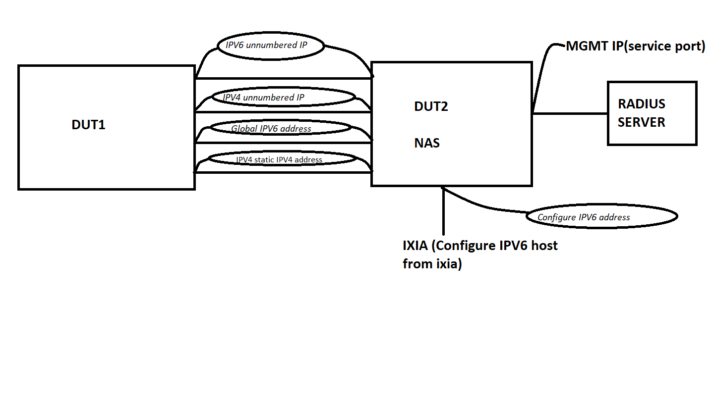
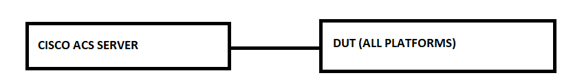

#  SQA Test Plan

#  RADIUS_Management_User_Authentication

#  SONiC 3.0 Project and Buzznik Release

[TOC]
# Test Plan Revision History
| Rev  |    Date    |        Author        | Change Description |
| :--: | :--------: | :------------------: | ------------------ |
| 0.1  | 10/10/2019 |       Sai Durga	   | Initial version    |

# List of Reviewers
| Function |         Name         |
| :------: | :------------------: |
|   Dev    |      Arun Barboza    |
|    QA    | Anil Kumar Kolkaleti |
|    QA    |   Giri Babu Sajja    |

# List of Approvers
| Function |         Name         | Date Approved |
| :------: | :------------------: | :-----------: |
|   Dev    |      Arun Barboza    |               |
|    QA    | Anil Kumar Kolkaleti |               |
|    QA    |   Giri Babu Sajja    |               |

# Definition/Abbreviation
| **Term** | **Meaning**  |
| -------- | ------------ |
|   SSH    |  Secure Shell |
|  RADIUS  | Remote Authentication Dial In User Service |
|  GNMI    | gRPC Network Management Interface          |
|  REST    |  Representational state transfer |

# Feature Overview
Remote Authentication Dial In User Service (RADIUS), is a protocol for carrying authentication, authorization, and configuration information between a Network Access Server (NAS) which desires to authenticate its links and a shared Authentication Server (AS). RFC2865. RADIUS can also be used for authenticating management access to a Network Access Server. RADIUS can also provide accounting service.

# Test Approach
1.Below items are covered in module config 
 - Checking default authentication parameters.
 - Configuring aaa login authenticationto radius.
 - Enabling failthrough mode.
 - Configuring one radius server.
 - Configuring IPV4 unnumbered feature on both the devices.
 - Configuring IPV6 unnumbered feature on both the devices.
 - Configuring global IPV6 address on both the devices on back to back links.
 - Configuring static IPV4 address on both the devices on back to back links.

2.Below tests are covered
 - SSH(IPV4 and IPV6) login using Free Radius, CISCO ACS, windows free radius .
 - SSH login by configuring source-ip for radius server.
 - SSH login via management VRF, IPV4 and IPV6 unnumbered interface. 
 - Failthorough and fallback mechanism.
 - Max radius server.
 - Stress test and memory leak testing by opening 50sessions 
 

3.To reduce run time,radius fastboot,config save and reload tests are covered in separate files in security folder (test_security_fast_reboot.py,test_security_save_reboot.py)

# 1 Test Focus Areas
## 1.1 CLI and config Testing
  - All CLI commands
  - Radius server with non-default values for all the parameters
  - MAX radius server key characters
  - Invalid server key

## 1.2 Fucntional Testing
  - SSH login using radius server(IPV4, IPV6 , CISCO ACS server)
  - SSH with the different auth types CHAP, PAP and mschapv2
  - Functionality after config save and reboot
  - Functionality after config save and fast reboot
  - Functionality after config save and warm reboot
  - Multiple radius servers with different priorities
  - Multiple radius servers with some unreachable servers and fail through mechanism enabled
  - SSH login authentication with radius server which is configured to use Management vrf 
  - SSH login authentication with radius server when source ip configured globally

## 1.3 Scaling Testing
  - MAX radius servers (IPV4 + IPV6 )
 
## 1.4 Stress and Memory leak Testing
  - Opening 50 sessions using radius credentials

# 2 Topologies
## 2.1 Topology1

## 2.2 Topology2

## 2.2 Topology3

# 3 Test  Case and Objectives
## 3.1 CLI and Management 

### 3.1.1 Verify that invalid characters for the server key,invalid ip for radius server and auth-type other than PAP,CHAP and MSCHAPV2 are not configured

| **Test ID**    | **FtOpSoScRaCfg003**                                   |
| -------------- | :--------------------------------------------------- |
| **Test Name**  | **Verify that invalid characters for the server key,invalid ip for radius server and auth-type other than PAP,CHAP and MSCHAPV2 are not configured**               |
| **Test Setup** | **Topology1**                                         |
| **Type**       | **CLI**                                              |
| **Steps**      | **Procedure: 1) Try to configure invalid server key both globally and server level 2) Try to configure invlaid IP for radius server 3) Try to configure auth-type other than PAP,CHAP and MSCHAPV2 Expected Results: 1,2 & 3) Verify that configuration is failed and error message displayed on the console ** |

## 3.2 Functional

### 3.2.1 Verify that aaa authentication can be configured to radius and login authentication is successful.

| **Test ID**    | **FtOpSoScRaFn001**                                              |
| -------------- | :----------------------------------------------------------- |
| **Test Name**  | **Verify that aaa authentication can be configured to radius and login authentication is successful** |
| **Test Setup** | **Topology1**                                                 |
| **Type**       | **Functional**                                               |
| **Steps**      | **Procedure: 1) Configure radius server with the key. 2) Configure aaa authentication login method to radius. 3) Issue ""show runningconfiguration all"" command 4) Try to ssh to the device using radius credentials Expected Results: 1) Verify that radius server configuration is successfully 2 & 3) Verify that radius server details and aaa authentication login method reflected in running configuration 4) Verify that user able to login successfully** |

### 3.2.2 Verify that login authentication successful when configured auth-port in the device and auth-port at radius server is same 

| **Test ID**    | **FtOpSoScRaFn002**                                              |
| -------------- | :----------------------------------------------------------- |
| **Test Name**  | **Verify that login authentication successful when configured auth-port in the device and auth-port at radius server is same** |
| **Test Setup** | **Topology1**                                                 |
| **Type**       | **Functional**                                               |
| **Steps**      | **Procedure: 1) Configure radius server with auth-port and configure aaa authentication login method to radius 2) SSH to the device Expected Results: 1) Verify that configuration is successful 2) Verify that login authentication successful if auth-port in the device and auth-port at radius server is same ** |

### 3.2.3 Verify that source-ip config modified to ipv6 address when ipv4 address configured first and then ipv6 address. 

| **Test ID**    | **FtOpSoScRaFn004**                                              |
| -------------- | :----------------------------------------------------------- |
| **Test Name**  | **Verify that source-ip config modified to ipv6 address when ipv4 address configured first and then ipv6 address.** |
| **Test Setup** | **Topology1**                                                 |
| **Type**       | **Functional**                                               |
| **Steps**      | **Procedure: 1) Configure radius server with the key along with source interface with ipv4 address. 2) Configure aaa authentication login method to radius. 3) Configure source interface for radius server with ipv4 address 4) Try to ssh to the device using radius credentials. Expected Results: 1) Verify that radius server configuration is successfully 2) Verify that configuration is successful 3) Verify that ipv4 address overridden with ipv6 address 4) Verify that user able to login successfully and also verify that radius authentication is done through configured ipv6 source interface ** |

### 3.2.4 Verify that user able to configure the radius source interface and also verify that radius packets are going through it

| **Test ID**    | **FtOpSoScRaFn005**                                              |
| -------------- | :----------------------------------------------------------- |
| **Test Name**  | **Verify that user able to configure the radius source interface and also verify that radius packets are going through it** |
| **Test Setup** | **Topology1**                                                 |
| **Type**       | **Functional**                                               |
| **Steps**      | **Procedure: 1) Configure radius server with the key along with source interfac. 2) Configure aaa authentication login method to radius. 3) Try to ssh to the device using radius credentials. Expected Results: 1) Verify that radius server configuration is successfully 2) Verify that configuration is successful 3) Verify that user able to login successfully and also verify that radius authentication is done through configured source interface ** |

 

### 3.2.5  Verify that user able to login with the radius credentials after config save and reboot 

| **Test ID**    | **FtOpSoScRaFn006**                                              |
| -------------- | :----------------------------------------------------------- |
| **Test Name**  | **Verify that user able to login with the radius credentials after config save and reboot** |
| **Test Setup** | **Topology1**                                                 |
| **Type**       | **Functional**                                               |
| **Steps**      | **Procedure: 1) Configure radius server with the key. 2) Configure aaa authentication login method to radius. 3) Try to ssh to the device using radius credentials. 4) Perfom config save and reboot the device and try to login using radius credentials Expected Results: 1) Verify that radius server configuration is successfully 2) Verify that configuration is successful 3) Verify that user able to login successfully 4) Verify that config saved to config_db.json file and authentication successful after reboot ** |

### 3.2.6  Verify that user able to login with the radius credentials after config save and fast boot 

| **Test ID**    | **FtOpSoScRaFn007**                                              |
| -------------- | :----------------------------------------------------------- |
| **Test Name**  | **Verify that user able to login with the radius credentials after config save and fast boot** |
| **Test Setup** | **Topology1**                                                 |
| **Type**       | **Functional**                                               |
| **Steps**      | **Procedure: 1) Configure radius server with the key. 2) Configure aaa authentication login method to radius. 3) Try to ssh to the device using radius credentials. 4) Perfom config save and fast-reboot the device and try to login using radius credentials Expected Results: 1) Verify that radius server configuration is successfully 2) Verify that configuration is successful 3) Verify that user able to login successfully 4) Verify that config saved to config_db.json file and authentication successful after fast-reboot ** |

### 3.2.7 Verify that login attempts from the second highest priority server when first high priority server is not available

| **Test ID**    | **FtOpSoScRaFn008**                                              |
| -------------- | :----------------------------------------------------------- |
| **Test Name**  | **Verify that login attempts from the second highest priority server when first high priority server is not  available** |
| **Test Setup** | **Topology1**                                                 |
| **Type**       | **Functional**                                               |
| **Steps**      | **Procedure: 1)Configure maximum radius servers with different priorities and make sure that highest priority server is not available and 8th server configured as second highest priority server 2) Configure aaa authentication login method to radius. 3) Try to ssh to the device by not using second highest priority radius credentials. Expected Results: 1) Verify that radius server configuration is successfully 2) Verify that configuration is successful 3) Verify that login authentication successful with the second highest priority server i.e., 8th server ** |

### 3.1.8 Verify that login authentication fails upon providing wrong credentials and authentication failure logs are generated in syslog file and successful upon providing valid credentials 

| **Test ID**    | **FtOpSoScRaFn009**                                              |
| -------------- | :----------------------------------------------------------- |
| **Test Name**  | **Verify that login authentication fails upon providing wrong credentials and authentication failure logs are generated in syslog file and successful upon providing valid credentials ** |
| **Test Setup** | **Topology1**                                                 |
| **Type**       | **Functional**                                               |
| **Steps**      | **Procedure: 1) Configure multiple radius server with the key and create a user in the device and make sure that the created user not present in the radius server. 2) Configure aaa authentication login method to radius. 3) Try to ssh to the device using wrong credentials i.e., with the user created in the device 4)Now login to the device using the credentials present in the radius server. Expected Results: 1) Verify that radius servers configuration is successfully 2) Verify that configuration is successful 3) Verify that login authentication failed because of wrong credentials and also verify that authentication failure logs are generated in syslog file 4) Verify that SSH authentication is successful** |

### 3.2.9 Verify that login is successful with the key which is configured in the server level even though different radius key configured in the global level  

| **Test ID**    | **FtOpSoScRaFn010**                                              |
| -------------- | :----------------------------------------------------------- |
| **Test Name**  | **Verify that login is successful with the key which is configured in the server level even though different radius key configured in the global level** |
| **Test Setup** | **Topology1**                                                 |
| **Type**       | **Functional**                                               |
| **Steps**      | **Procedure: 1) Configure radius server with the key which is present in the radius server and configure different key globally other than the one which is present in the radius server. 2) Configure aaa authentication login method to radius. 3) Try to ssh to the device Expected Results: 1) Verify that radius servers configuration is successfully 2) Verify that configuration is successful 3) Verify that login authentication successful ** |

### 3.2.10 Verify that authentication takes place with the local user only when the user is configured in both local and radius server and authentication order configured with local and radius  

| **Test ID**    | **FtOpSoScRaFn014**                                              |
| -------------- | :----------------------------------------------------------- |
| **Test Name**  | **Verify that authentication takes place with the local user only when the user is configured in both local and radius server and authentication order configured with local and radius** |
| **Test Setup** | **Topology1**                                                 |
| **Type**       | **Functional**                                               |
| **Steps**      | **Procedure: 1) Create a user in the device which is already present in the radius server  2) Configure aaa authentication login method to local and radius. 3) Configure radius server and try to ssh to the device Expected Results: 1) Verify that configuration is successful 2) Verify that configuration is successful 3) Verify that login authentication successful with the local user ** |

### 3.2.11 Verify that login authentication successful when authentication method set to radius and local 

| **Test ID**    | **FtOpSoScRaFn015**                                              |
| -------------- | :----------------------------------------------------------- |
| **Test Name**  | **Verify that login authentication successful when authentication method set to radius and local** |
| **Test Setup** | **Topology1**                                                 |
| **Type**       | **Functional**                                               |
| **Steps**      | **Procedure: 1) Configure radius server 2) Configure aaa authentication login method to radius and local. 3) Try to ssh to the device Expected Results: 1) Verify that configuration is successful 2) Verify that configuration is successful 3) Verify that login authentication successful with the radius user ** |

### 3.2.12 Verify that login authentication successful when radius server is configured to use Management vrf 

| **Test ID**    | **FtOpSoScRaFn016**                                              |
| -------------- | :----------------------------------------------------------- |
| **Test Name**  | **Verify that login authentication successful when radius server is configured to use Management vrf** |
| **Test Setup** | **Topology1**                                                 |
| **Type**       | **Functional**                                               |
| **Steps**      | **Procedure: 1) Configure radius server with the parameter -m to use Management vrf 2) Configure aaa authentication login method to radius and local. 3) Try to ssh to the device Expected Results: 1) Verify that configuration is successful 2) Verify that configuration is successful3) Verify that login authentication successful with the radius user ** |

### 3.2.14 Verify that login authentication successful with IPv6 radius server when authentication failed with the IPv4 server and failthrough mechanism is enables 

| **Test ID**    | **FtOpSoScRaFn018**                                              |
| -------------- | :----------------------------------------------------------- |
| **Test Name**  | **Verify that login authentication successful with IPv6 radius server when authentication failed with the IPv4 server and failthrough mechanism is enabled** |
| **Test Setup** | **Topology1**                                                 |
| **Type**       | **Functional**                                               |
| **Steps**      | **Procedure: 1) Configure both IPv4 and IPV6 radius servers and configure aaa authentication login method to radius 2) Enable failthrough mode 3) Login with the credentials of IPV6 server Expected Results: 1) Verify that radius servers configuration is successful 2) Verify that failthrough enabled 3) Verify that login authentication successful with with IPV6 server ** |

### 3.2.15  Verify that login authentication successful with the radius server after radius config saved and deleted and reboot is performed on the device

| **Test ID**    | **FtOpSoScRaFn019**                                              |
| -------------- | :----------------------------------------------------------- |
| **Test Name**  | **Verify that login authentication successful with the radius server after radius config saved and deleted and reboot is performed on the device** |
| **Test Setup** | **Topology1**                                                 |
| **Type**       | **Functional**                                               |
| **Steps**      | **Procedure: 1) Configure radius server and configure aaa authentication login method to radius 2) Save the config. 3) SSH to the device using radius credentials 4) Delete radius server and set aaa authentication login method to default 5) Reboot the device and SSH to the device using radius credentials Expected Results: 1) Verify that radius servers configuration is successful 2) Verify that config saved to config_db.json 3) Verify that login authentication successful 4) Verify that radius server deleted and authentication login method set to default 5) Verify that device is up and login authentication successful with radius server ** |

### 3.2.16  Verify that login authentication failed with radius credentials after deletion of radius server from the device 

| **Test ID**    | **FtOpSoScRaFn020**                                              |
| -------------- | :----------------------------------------------------------- |
| **Test Name**  | **Verify that login authentication failed with radius credentials after deletion of radius server from the device** |
| **Test Setup** | **Topology1**                                                 |
| **Type**       | **Functional**                                               |
| **Steps**      | **Procedure: 1) Configure radius server and configure aaa authentication login method to radius 2) SSH to the device using radius credentials 3) Delete radius server 4) Try to SSH to the device using radius credentials Expected Results: 1) Verify that radius servers configuration is successful 2) Verify that login authentication successful 3) Verify that radius server deleted 4) Verify that login authentication failed ** |

### 3.2.17 Verify that login authentication is successful with radius CISCO ACS server

| **Test ID**    | **FtOpSoScRaFn023**                                              |
| -------------- | :----------------------------------------------------------- |
| **Test Name**  | **Verify that login authentication is successful with radius CISCO ACS server** |
| **Test Setup** | **Topology3**                                                 |
| **Type**       | **Functional**                                               |
| **Steps**      | **Procedure: 1)Configure CISCO radius ACS server and set aaa authentication login to radius 2) SSH to the device with the credentials present in CISCO radius ACS server Expected Results: 1) Verify that configuration is successful 2) Verify that authentication is successful ** |

### 3.2.18  Verify that console login authentication is done via radius credentials when login authentication set to radius

| **Test ID**    | **FtOpSoScRaFn027**                                              |
| -------------- | :----------------------------------------------------------- |
| **Test Name**  | **Verify that console login authentication is done via radius credentials when login authentication set to radius** |
| **Test Setup** | **Topology1**                                                 |
| **Type**       | **Functional**                                               |
| **Steps**      | **Procedure: 1)Configure radius server  2)Configure aaa authentication login method to radius 3)Logout and try to login to console using the radius server credentials Expected Results: 1 & 2) Verify that configuration is successful 3) Verify that authentication is successful ** |

### 3.2.19  Verify that root login with radius server failed 

| **Test ID**    | **FtOpSoScRaFn028**                                              |
| -------------- | :----------------------------------------------------------- |
| **Test Name**  | **Verify that root login with radius server failed** |
| **Test Setup** | **Topology1**                                                 |
| **Type**       | **Functional**                                               |
| **Steps**      | **Procedure: 1) Configure radius server and aaa authentication method only to radius 2) Try to ssh / console using root user Expected Result: 1) Verify that configuration is successful 2) Verify that login authentication failed ** |

### 3.2.20  Verify that non-admin user doesnot get admin privileges 

| **Test ID**    | **FtOpSoScRaFn029**                                              |
| -------------- | :----------------------------------------------------------- |
| **Test Name**  | **Verify that non-admin user doesnot get admin privileges** |
| **Test Setup** | **Topology1**                                                 |
| **Type**       | **Functional**                                               |
| **Steps**      | **Procedure: 1) Configure radius server and aaa authentication method only to radius 2) Try to ssh using radius credentials with non-admin user Expected Result: 1) Verify that configuration is successful 2) Verify that login authentication successful and also verify that user doesnot get admin privileges ** |

### 3.2.21  Verify that login authentication fails when 2 unreachable radius servers and fail through is enabled

| **Test ID**    | **FtOpSoScRaFn030**                                              |
| -------------- | :----------------------------------------------------------- |
| **Test Name**  | **Verify that login authentication fails when 2 unreachable radius servers and fail through is enabled** |
| **Test Setup** | **Topology1**                                                 |
| **Type**       | **Functional**                                               |
| **Steps**      | **Procedure: 1) Configure radius server and aaa authentication method only to radius 2) Enable fail through.3) Try to ssh to the device Expected Result: 1) Verify that configuration is successful 2) Verify that fail through is enabled. 3) Verify that login authentication failed as both the server are unreachable ** |

### 3.2.22  Verify that SSH authentication successful with windows free radius server

| **Test ID**    | **FtOpSoScRaFn033**                                              |
| -------------- | :----------------------------------------------------------- |
| **Test Name**  | **Verify that SSH authentication successful with windows free radius server** |
| **Test Setup** | **Topology2**                                                 |
| **Type**       | **Functional**                                               |
| **Steps**      | **Procedure: 1)Configure  windows free radius server and set aaa authentication login to radius 2) SSH to the device with the credentials present in  windows free radius server Expected Results: 1) Verify that configuration is successful 2) Verify that authentication is successful ** |

### 3.2.23  Verify that login authentication successful when radius server is configured to use IPV4 unnumbered interface

| **Test ID**    | **FtOpSoScRaFn021**                                              |
| -------------- | :----------------------------------------------------------- |
| **Test Name**  | **Verify that login authentication successful when radius server is configured to use IPV4 unnumbered interface** |
| **Test Setup** | **Topology2**                                                 |
| **Type**       | **Functional**                                               |
| **Steps**      | **Procedure: 1) Configure radius server with the parameter -m to use IPV4 unnumered interace 2) Configure aaa authentication login method to radius and local. 3) Try to ssh to the device Expected Results: 1) Verify that configuration is successful 2) Verify that configuration is successful 3) Verify that login authentication successful with the radius user ** |

### 3.2.24  Verify that login authentication successful when radius server configured to use IPV6 unnumbered interface

| **Test ID**    | **FtOpSoScRaFn022**                                              |
| -------------- | :----------------------------------------------------------- |
| **Test Name**  | **Verify that login authentication successful when radius server configured to use IPV6 unnumbered interface** |
| **Test Setup** | **Topology2**                                                 |
| **Type**       | **Functional**                                               |
| **Steps**      | **Procedure: 1) Configure radius server with the parameter -m to use IPV6 unnumered interace 2) Configure aaa authentication login method to radius and local. 3) Try to ssh to the device Expected Results: 1) Verify that configuration is successful 2) Verify that configuration is successful 3) Verify that login authentication successful with the radius user ** |

## 3.3 Scaling

### 3.3.1   Verify that max of 8 mix of IPV4, IPV6 servers created in the device

| **Test ID**    | **FtOpSoScRaSc001**                                              |
| -------------- | :----------------------------------------------------------- |
| **Test Name**  | **Verify that max of 8 mix of IPV4, IPV6 servers created in the device** |
| **Test Setup** | **Topology1**                                                 |
| **Type**       | **Scalability**                                              |
| **Steps**      | **Procedure: 1) Configure miximum(8) of radius serverwith mix of IPV4, IPV6 2) Try to add one more server Expected Results: 1) Verify that 8 radius serverswith mix of IPV4, IPV6 created successfully 2) Verify that radius server configuration failed as max limit reached **|

## 3.4 Stress Testing

### 3.4.1 Verify that device is stable upon login to the devices with 50 sessions using radius server credentials and also verify that there should not be any memory leak 

| **Test ID**    | **FtOpSoScRaStTe001**                                              |
| -------------- | :----------------------------------------------------------- |
| **Test Name**  | **Verify that device is stable upon login to the devices with 50 sessions using radius server credentials and also verify that there should not be any memory leak** |
| **Test Setup** | **Topology1**                                                 |
| **Type**       | **Functional**                                               |
| **Steps**      | **Procedure: 1) Configure  radius server 2) Configure aaa authentication login method to radius and local. 3) Note down the free memory.  4) SSH to the device using radius credentials with 50 sessions. 5) Note down the free memory. Expected Results: 1) Verify that configuration is successful 2) Verify that configuration is successful 3) Mark the free memory as ?FreeMem0?. 4) Verify that login authentication successful with the radius user for 50 sessions 5)  Note the free memory as ?FreeMem1?. The difference between ?FreeMem0? and ?FreeMem1? (FreeMem1-FreeMem0) should be in permissible limits. ** |

