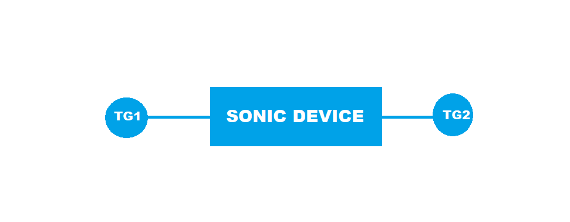

#  SQA Test Plan
#  SNMP BRIDGE-MIB and Q-BRIDGE-MIB Support
#  SONiC 3.0 Project and Buzznik Release
[TOC]
# Test Plan Revision History
| Rev | Date        | Author             | Change Description |
|:---:|:-----------:|:------------------:|-----------------------------|
| 0.1 | 24/10/2019  | Prasad Darnasi     | Initial version |

# List of Reviewers
|  Function | Name |
|:---:|:-----------:|
| Dev | Suresh Babu Rupanagudi  |
| Dev | Mohammed Faraaz C |
| QA  | Michael Goldflam |
| QA  | Kalyan Vadlamani |
| QA  | Kiran Obulampalli |
| QA  | Giri Babu Sajja |

# List of Approvers
|  Function | Name | Date Approved|
|:---:|:-----------:|:------------------:|
| Dev | Suresh Babu Rupanagudi  |     |
| Dev | Mohammed Faraaz C |      |
| QA  | Michael Goldflam |      |
| QA  | Kalyan Vadlamani |      |
| QA  | Kiran Obulampalli |      |
| QA  | Giri Babu Sajja |       |

# Definition/Abbreviation
| **Term** | **Meaning**                     |
| -------- | ------------------------------- |
| SNMP     | Simple Network Management Protocol |
| API      | Application Programmable Interface |
| MIB      | Management Information Base |

# Approach
 Integrating this to existing test_snmp.py module by adding one more TG link to the topology.
# Feature Overview
An OID in SNMP is an "Object Identifier". It's an address used to identify devices and their statuses.

# 1 Test Focus Areas
## 1.1 Functional Testing 
  - All BRIDGE-MIB and Q-BRIDGE-MIB Table requirement OIDs

## 1.2 Negative Testing. 

## 1.3 Scale and Performance Testing
   - All Q-BRIDGE-MIB scalar tests

# 2 Topologies
## 2.1 Topology 
####  

# 3 Test Case and Objectives

## 3.1 Functional

### 3.1.1 verify BRIDGE-MIB OID dot1dBaseBridgeAddress functionality.

| **Test ID** | **SNMPBr001** |
|--------|:----------------|
| **Test Name** | **verify BRIDGE-MIB OID dot1dBaseBridgeAddress functionality.** |
| **Test Setup** | **Topology** |
| **Type** | **Functional** |
| **Steps** | **1) Perform snmpget for dot1dBaseBridgeAddress Object 2) Verify MAC address used by the bridge.** |

### 3.1.2 Verify BRIDGE-MIB OID dot1dBaseNumPorts functionality.
| **Test ID**    | **SNMPBr002**                                |
| -------------- | :----------------------------------------------------------- |
| **Test Name**  | **Verify BRIDGE-MIB OID dot1dBaseNumPorts functionality.** |
| **Test Setup** | **Topology**                                                |
| **Type**       | **Functional**                                               |
| **Steps**      | **1) Perform snmpget for dot1dBaseNumPorts Object 2) Verify the number of ports controlled by this bridging entity.** |

### 3.1.3 Verify BRIDGE-MIB OID dot1dBaseType functionality.

| **Test ID**    | **SNMPBr003**                                |
| -------------- | :----------------------------------------------------------- |
| **Test Name**  | **Verify BRIDGE-MIB OID dot1dBaseType functionality.** |
| **Test Setup** | **Topology**                                                |
| **Type**       | **Functional**                                               |
| **Steps**      | **1) Perform snmpget for dot1dBaseType Object 2 Verify that what type of bridging this bridge can perform.**|

### 3.1.4 Verify BRIDGE-MIB OID dot1dBasePort functionality..

| **Test ID**    | **SNMPBr004**                                |
| -------------- | :----------------------------------------------------------- |
| **Test Name**  | **Verify BRIDGE-MIB OID dot1dBasePort functionality.** |
| **Test Setup** | **Topology**                                                |
| **Type**       | **Functional**                                               |
| **Steps**      | **1) Perform snmpget for dot1dBasePort Object 2) Verify the port number of the port for which this entry contains bridge management information.**|
### 3.1.5 Verify BRIDGE-MIB OID dot1dBasePortIfIndex functionality.

| **Test ID**    | **SNMPBr005**                                |
| -------------- | :----------------------------------------------------------- |
| **Test Name**  | **Verify BRIDGE-MIB OID dot1dBasePortIfIndex functionality.** |
| **Test Setup** | **Topology**                                                |
| **Type**       | **Functional**                                               |
| **Steps**      | **1) Perform snmpget for dot1dBasePortIfIndex Object 2) Verify the  value of the instance of the ifIndex object,defined in IF-MIB, for the interface corresponding to this port..**|
### 3.1.6 Verify BRIDGE-MIB OID dot1dBasePortDelayExceededDiscards functionality.

| **Test ID**    | **SNMPBr006**                                |
| -------------- | :----------------------------------------------------------- |
| **Test Name**  | **Verify BRIDGE-MIB OID dot1dBasePortDelayExceededDiscards functionality.** |
| **Test Setup** | **Topology**                                                |
| **Type**       | **Functional**                                               |
| **Steps**      | **1) Perform snmpget for dot1dBasePortDelayExceededDiscards Object 2) Verify the number of frames discarded by this port due to excessive transit delay to be zero.**|
### 3.1.7 Verify BRIDGE-MIB OID dot1dBasePortMtuExceededDiscards functionality.

| **Test ID**    | **SNMPBr007**                                |
| -------------- | :----------------------------------------------------------- |
| **Test Name**  | **Verify BRIDGE-MIB OID dot1dBasePortMtuExceededDiscards functionality.** |
| **Test Setup** | **Topology**                                                |
| **Type**       | **Functional**                                               |
| **Steps**      | **1) Send 10 packets with more than MTU size 2) Perform snmpget for dot1dBasePortMtuExceededDiscards Object  3) Verify the  number of frames discarded by this port due to an excessive size to be zero**|
### 3.1.8 Verify BRIDGE-MIB OID dot1dTpAgingTime functionality.

| **Test ID**    | **SNMPBr008**                                |
| -------------- | :----------------------------------------------------------- |
| **Test Name**  | **Verify BRIDGE-MIB OID dot1dTpAgingTime functionality.** |
| **Test Setup** | **Topology**                                                |
| **Type**       | **Functional**                                               |
| **Steps**      | **1) Ensure dynamic mac entry learned by sending few data packets 2) Perform snmpget for dot1dTpAgingTime Object 3) Verify the  timeout period in seconds for aging out.**|

## 3.2 Table Requirement

### 3.2.1 Verify Q-BRIDGE-MIB OID dot1qFdbDynamicCount functionality.

| **Test ID**    | **SNMPQBr001**                                |
| -------------- | :----------------------------------------------------------- |
| **Test Name**  | **Verify Q-BRIDGE-MIB OID dot1qFdbDynamicCount functionality.** |
| **Test Setup** | **Topology**                                                |
| **Type**       | **Functional**                                               |
| **Steps**      | **1) Learn few dynamic mac address by sending packets 2) Perform snmpwalk for dot1qFdbDynamicCount Object at table level 3) Verify the current number of dynamic entries in this Filtering Database.**|
### 3.2.2 Verify Q-BRIDGE-MIB OID dot1qTpFdbAddress functionality.

| **Test ID**    | **SNMPQBr002**                                |
| -------------- | :----------------------------------------------------------- |
| **Test Name**  | **Verify Q-BRIDGE-MIB OID dot1qTpFdbAddress functionality.** |
| **Test Setup** | **Topology**                                                |
| **Type**       | **Functional**                                               |
| **Steps**      | **1) Learn few unicast mac address on device 3) Perform snmpwalk for dot1qTpFdbAddress Object at table level 2) Verify the unicast MAC address for which the device has forwarding.**|
### 3.2.3 Verify Q-BRIDGE-MIB OID dot1qTpFdbPort functionality.

| **Test ID**    | **SNMPQBr003**                                |
| -------------- | :----------------------------------------------------------- |
| **Test Name**  | **Verify Q-BRIDGE-MIB OID dot1qTpFdbPort functionality.** |
| **Test Setup** | **Topology**                                                |
| **Type**       | **Functional**                                               |
| **Steps**      | **1)  Learn mac addresses by sending few packets 2) Perform snmpwalk for dot1qTpFdbPort Object at table level 3) Either the value '0', or the port number of the port on which a frame having a source address equal to the value of the corresponding instance of dot1qTpFdbAddress has been seen.**|
### 3.2.4 Verify Q-BRIDGE-MIB OID dot1qTpFdbStatus functionality.

| **Test ID**    | **SNMPQBr004**                                |
| -------------- | :----------------------------------------------------------- |
| **Test Name**  | **Verify Q-BRIDGE-MIB OID dot1qTpFdbStatus functionality.** |
| **Test Setup** | **Topology**                                                |
| **Type**       | **Functional**                                               |
| **Steps**      | **1) Learn a mac address my sending few packets 2) Perform snmpwalk for dot1qTpFdbStatus Object at table level 3) Verify the value of the corresponding instance of dot1qTpFdbPort was learned..**|
### 3.2.5 Verify Q-BRIDGE-MIB OID dot1qVlanIndex functionality.

| **Test ID**    | **SNMPQBr005**                                |
| -------------- | :----------------------------------------------------------- |
| **Test Name**  | **Verify Q-BRIDGE-MIB OID dot1qVlanIndex functionality.** |
| **Test Setup** | **Topology**                                                |
| **Type**       | **Functional**                                               |
| **Steps**      | **1) Create a vlan in the device 2) Perform snmpwalk for dot1qVlanIndex Object at table level 3) Verify the The VLAN-ID or other identifier referring to this VLAN.**|
### 3.2.5 Verify Q-BRIDGE-MIB OID dot1qVlanCurrentEgressPorts functionality.

| **Test ID**    | **SNMPQBr006**                                |
| -------------- | :----------------------------------------------------------- |
| **Test Name**  | **Verify Q-BRIDGE-MIB OID dot1qVlanCurrentEgressPorts functionality.** |
| **Test Setup** | **Topology**                                                |
| **Type**       | **Functional**                                               |
| **Steps**      | **1) Create a vlan and send tagged/untagged traffic for it  2) Perform snmpwalk for dot1qVlanCurrentEgressPorts Object at table level 3) Verify the set of ports that are transmitting traffic for this VLAN as either tagged or untagged frames.**|
### 3.2.6 Verify Q-BRIDGE-MIB OID dot1qVlanCurrentUntaggedPorts functionality.

| **Test ID**    | **SNMPQBr007**                                |
| -------------- | :----------------------------------------------------------- |
| **Test Name**  | **Verify Q-BRIDGE-MIB OID dot1qVlanCurrentUntaggedPorts functionality.** |
| **Test Setup** | **Topology**                                                |
| **Type**       | **Functional**                                               |
| **Steps**      | **1) create a vlan and send untagged traffic for it 2) Perform snmpwalk for dot1qVlanCurrentUntaggedPorts Object at table level 3) Verify the set of ports that are transmitting traffic for this VLAN as untagged frames.**|
### 3.2.7 Verify Q-BRIDGE-MIB OID dot1qVlanStaticName functionality.

| **Test ID**    | **SNMPQBr008**                                |
| -------------- | :----------------------------------------------------------- |
| **Test Name**  | **Verify Q-BRIDGE-MIB OID dot1qVlanStaticName functionality.** |
| **Test Setup** | **Topology**                                                |
| **Type**       | **Functional**                                               |
| **Steps**      | **1) Create a vlan and name it 2) Perform snmpwalk for dot1qVlanStaticName Object at table level 3) Verify that administratively assigned string, which may be used to identify the VLAN.**|
### 3.2.8 Verify Q-BRIDGE-MIB OID dot1qVlanStaticEgressPorts functionality.

| **Test ID**    | **SNMPQBr009**                                |
| -------------- | :----------------------------------------------------------- |
| **Test Name**  | **Verify Q-BRIDGE-MIB OID dot1qVlanStaticEgressPorts functionality.** |
| **Test Setup** | **Topology**                                                |
| **Type**       | **Functional**                                               |
| **Steps**      | **1) Create a vlan and add few ports to it 2)Perform snmpwalk for dot1qVlanStaticEgressPorts Object at table level 3) Verify the set of ports that are permanently assigned to the egress list.**|
### 3.2.9 Verify Q-BRIDGE-MIB OID dot1qVlanStaticUntaggedPorts functionality.

| **Test ID**    | **SNMPQBr010**                                |
| -------------- | :----------------------------------------------------------- |
| **Test Name**  | **Verify Q-BRIDGE-MIB OID dot1qVlanStaticUntaggedPorts functionality.** |
| **Test Setup** | **Topology**                                                |
| **Type**       | **Functional**                                               |
| **Steps**      | **1) Create a vlan and send untagged packets for this vlan 2) Perform snmpwalk for dot1qVlanStaticUntaggedPorts Object at table level 3) Verify the set of ports that should transmit egress packets for this VLAN as untagged.**|
### 3.2.10 Verify Q-BRIDGE-MIB OID dot1qVlanStaticRowStatus functionality.

| **Test ID**    | **SNMPQBr011**                                |
| -------------- | :----------------------------------------------------------- |
| **Test Name**  | **Verify Q-BRIDGE-MIB OID dot1qVlanStaticRowStatus functionality.** |
| **Test Setup** | **Topology**                                                |
| **Type**       | **Functional**                                               |
| **Steps**      | **1) Create a vlan  2) Perform snmpwalk for dot1qVlanStaticRowStatus Object at table level 3) Verify that this entry is reside in the table..**|
### 3.2.11 Verify Q-BRIDGE-MIB OID dot1qPvid functionality.
| **Test ID**    | **SNMPQBr012**                                |
| -------------- | :----------------------------------------------------------- |
| **Test Name**  | **Verify Q-BRIDGE-MIB OID dot1qPvid functionality.** |
| **Test Setup** | **Topology**                                                |
| **Type**       | **Functional**                                               |
| **Steps**      | **1) Create a vlan and sent untagged for it 2) Perform snmpwalk for dot1qPvid Object at table level 3) Verify the VLAN-ID assigned to untagged frames.**|

## 3.3 Scale and Performance

### 3.3.1 Verify Q-BRIDGE-MIB OID dot1qVlanVersionNumber functionality.

| **Test ID**    | **SNMPQBr013**                                |
| -------------- | :----------------------------------------------------------- |
| **Test Name**  | **Verify Q-BRIDGE-MIB OID dot1qVlanVersionNumber functionality.** |
| **Test Setup** | **Topology**                                                |
| **Type**       | **Functional**                                               |
| **Steps**      | **1) Perform snmpget for dot1qVlanVersionNumber Object 2) Verify the version number of IEEE 802.1Q that this device supports.**|
### 3.3.2 Verify Q-BRIDGE-MIB OID dot1qMaxVlanId functionality.

| **Test ID**    | **SNMPQBr014**                                |
| -------------- | :----------------------------------------------------------- |
| **Test Name**  | **Verify Q-BRIDGE-MIB OID dot1qMaxVlanId functionality.** |
| **Test Setup** | **Topology**                                                |
| **Type**       | **Functional**                                               |
| **Steps**      | **1) Perform snmpget for dot1qMaxVlanId Object 2) Verify the maximum IEEE 802.1Q VLAN-ID that this device out.**|
### 3.3.3 Verify Q-BRIDGE-MIB OID dot1qMaxSupportedVlans functionality.

| **Test ID**    | **SNMPQBr015**                                |
| -------------- | :----------------------------------------------------------- |
| **Test Name**  | **Verify Q-BRIDGE-MIB OID dot1qMaxSupportedVlans functionality.** |
| **Test Setup** | **Topology**                                                |
| **Type**       | **Functional**                                               |
| **Steps**      | **1) Perform snmpget for dot1qMaxSupportedVlans Object 2) Verify the maximum number of IEEE 802.1Q VLANs that this device supports.**|
### 3.3.4 Verify Q-BRIDGE-MIB OID dot1qNumVlans functionality.

| **Test ID**    | **SNMPQBr016**                                |
| -------------- | :----------------------------------------------------------- |
| **Test Name**  | **Verify Q-BRIDGE-MIB OID dot1qNumVlans functionality.** |
| **Test Setup** | **Topology**                                                |
| **Type**       | **Functional**                                               |
| **Steps**      | **1) Configure n number of vlans in the device 2) Perform snmpget for dot1qNumVlans Object 3) Verify the current number of IEEE 802.1Q VLANs that are configured in this device.**|
### 3.3.5 Verify Q-BRIDGE-MIB OID dot1qVlanNumDeletes functionality.

| **Test ID**    | **SNMPQBr017**                                |
| -------------- | :----------------------------------------------------------- |
| **Test Name**  | **Verify Q-BRIDGE-MIB OID dot1qVlanNumDeletes functionality.** |
| **Test Setup** | **Topology**                                                |
| **Type**       | **Functional**                                               |
| **Steps**      | **1) Create and delete a vlan for two times 2) Perform snmpget for dot1qVlanNumDeletes Object 3) Verify the number of times a VLAN entry has been deleted to be zero.**|

### 3.3.6 Verify Q-BRIDGE-MIB OID dot1qFdbTable functionality.

| **Test ID**    | **SNMPQBr018**                                |
| -------------- | :----------------------------------------------------------- |
| **Test Name**  | **Verify Q-BRIDGE-MIB OID dot1qFdbTable functionality.** |
| **Test Setup** | **Topology**                                                |
| **Type**       | **Functional**                                               |
| **Steps**      | **1) Create a vlan and send tagged/untagged traffic for it 2)Perform snmpwalk for dot1qFdbTable 3) Verify snmpget and snmpnextget are working fine for table result.**|

### 3.3.7 Verify Q-BRIDGE-MIB OID dot1qVlanStaticTable functionality.

| **Test ID**    | **SNMPQBr019**                                |
| -------------- | :----------------------------------------------------------- |
| **Test Name**  | **Verify Q-BRIDGE-MIB OID dot1qVlanStaticTable functionality.** |
| **Test Setup** | **Topology**                                                |
| **Type**       | **Functional**                                               |
| **Steps**      | **1) Create a vlan and send tagged/untagged traffic for it 2) Perform snmpwalk for dot1qVlanStaticTable 3) Verify snmpget and snmpnextget are working fine for table result.**|
