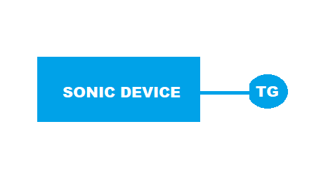

#  SQA Test Plan
#  SNMP Trap Infra Support
#  SONiC 3.0 Project and Buzznik Release
[TOC]
# Test Plan Revision History
| Rev | Date        | Author             | Change Description |
|:---:|:-----------:|:------------------:|-----------------------------|
| 0.1 | 10/10/2019  | Prasad Darnasi     | Initial version |

# List of Reviewers
|  Function | Name |
|:---:|:-----------:|
| Dev | Suresh Babu Rupanagudi  |
| Dev | Mohammed Faraaz C |
| QA  | Michael Goldflam |
| QA  | Kalyan Vadlamani |
| QA  | Kiran Obulampalli | 
| QA  | Giri Babu Sajja |    

# List of Approvers
|  Function | Name | Date Approved|
|:---:|:-----------:|:------------------:|
| Dev | Suresh Babu Rupanagudi  |     |
| Dev | Mohammed Faraaz C |      |
| QA  | Michael Goldflam |      |
| QA  | Kalyan Vadlamani |      |
| QA  | Kiran Obulampalli |      |
| QA  | Giri Babu Sajja |       |

# Definition/Abbreviation
| **Term** | **Meaning**                     |
| -------- | ------------------------------- |
| SNMP     | Simple Network Management Protocol |
| API      | Application Programmable Interface |

# Feature Overview
SNMP Traps are alert messages sent from a remote SNMP-enabled device to a central collector, the "SNMP manager".SNMP traps enable an agent to notify the management station of significant events by way of an unsolicited SNMP message..
Example: A Trap might tell you that a device link is down.

# Approach
 As SNMP traps support is part of mgmt-vrf feature, Adding test functions to the mgmt-vrf module.OSPF and BGP traps functions are adding in the respective modules.With this avoiding writing new module.
# 1 Test Focus Areas
## 1.1 Functional Testing 
  - All link up,down and reboot scenario.

## 1.2 Negative Testing. 
    
## 1.3 Scale and Performance Testing

# 2 Topologies
## 2.1 Topology 1
#### 

# 3 Test Case and Objectives

## 3.1 System Functional traps

### 3.1.1 Verify that a trap is sent when a link on the switch comes up.

| **Test ID** | **SNMPTrap001** |
|--------|:----------------|
| **Test Name** | **Verify that a trap is sent when a link on the switch comes up.** |
| **Test Setup** | **Topology** |
| **Type** | **Functional** |
| **Steps** | **1) Configure SNMP Trap Receiver on switch 2) Flap the link 3) Verify generated log has correct Object ID.** |

### 3.1.2 Verify that a trap is sent when a link on the switch goes down.
| **Test ID**    | **SNMPTrap002**                                |
| -------------- | :----------------------------------------------------------- |
| **Test Name**  | **Verify that a trap is sent when a link on the switch goes down** |
| **Test Setup** | **Topology**                                                |
| **Type**       | **Functional**                                               |
| **Steps**      | **1) Configure SNMP Trap Receiver on switch 2) Flap the link 3) Verify generated log has correct Object ID.** |

### 3.1.3 Verify that warmstart trap is sent when SNMP entity is reinitialized with config unaltered.

| **Test ID**    | **SNMPTrap003**                                |
| -------------- | :----------------------------------------------------------- |
| **Test Name**  | **Verify that warmstart trap is sent when SNMP entity is reinitialized with config unaltered.** |
| **Test Setup** | **Topology**                                                |
| **Type**       | **Functional**                                               |
| **Steps**      | **1) Configure SNMP Trap Receiver on switch 2)Reinitialize SNMP entity with config unaltere 3) Verify generated log has correct noification and description.**|

### 3.1.4 Verify that a trap is sent when SNMP entity is reinitialized with config altered.

| **Test ID**    | **SNMPTrap004**                                |
| -------------- | :----------------------------------------------------------- |
| **Test Name**  | **Verify that coldstart trap is sent when when SNMP entity is reinitialized with config altered.** |
| **Test Setup** | **Topology**                                                |
| **Type**       | **Functional**                                               |
| **Steps**      | **1) Configure SNMP Trap Receiver on switch 2) Reinitialize SNMP entity with config altered 3) Verify generated log has correct noification and description.**|

### 3.1.5 Verify that nsNotifyShutdown trap is sent when agent is in the process of being shut down.

| **Test ID**    | **SNMPTrap005**                                |
| -------------- | :----------------------------------------------------------- |
| **Test Name**  | **Verify that nsNotifyShutdown trap is sent when agent is in the process of being shut down.** |
| **Test Setup** | **Topology**                                                |
| **Type**       | **Functional**                                               |
| **Steps**      | **1) Configure SNMP Trap Receiver on switch 2) Shut down the snmp agent process 3) Verify generated log has respective trap objects.**|

## 3.2 OFPF and BGP Functional Traps

### 3.2.1 Verify that ospfNbrStateChange trap is sent when there has been a change in the state of a non-virtual OSPF neighbor.

| **Test ID**    | **SNMPOspfTr001**                                |
| -------------- | :----------------------------------------------------------- |
| **Test Name**  | **ospfNbrStateChange trap is sent when there has been a change in the state of a non-virtual OSPF neighbor.** |
| **Test Setup** | **Topology**                                                |
| **Type**       | **Functional**                                               |
| **Steps**      | **1) Configure SNMP Trap Receiver on switch 2) Ensure non-virtual OSPF neighborship 3) Change the state of OSPF non-virtual neighbor 4) Verify generated log has respective trap objects**|

### 3.2.2 Verify that ospfIfStateChange trap is sent that there has been a change in the state of a non-virtual OSPF interface.

| **Test ID**    | **SNMPOspfTr002**                                |
| -------------- | :----------------------------------------------------------- |
| **Test Name**  | **ospfIfStateChange trap is sent that there has been a change in the state of a non-virtual OSPF interface.** |
| **Test Setup** | **Topology**                                                |
| **Type**       | **Functional**                                               |
| **Steps**      | **1) Configure SNMP Trap Receiver on switch 2) Ensure OSPF neighborship through non-virtual OSPF interface 3) change in the state of non-virtual OSPF interface 4) Verify generated log has respective trap objects**|

### 3.2.3 Verify that bgpEstablishedNotification trap is sent when the BGP FSM enters the ESTABLISHED state.

| **Test ID**    | **SNMPBgpTr001**                                |
| -------------- | :----------------------------------------------------------- |
| **Test Name**  | **Verify that bgpEstablishedNotification trap is sent when the BGP FSM enters the ESTABLISHED state.** |
| **Test Setup** | **Topology**                                                |
| **Type**       | **Functional**                                               |
| **Steps**      | **1) Configure SNMP Trap Receiver on switch 2) Ensure BGP FSM enters ESTABLISHED 3) Verify generated log has respective trap objects.**|

### 3.2.4 Verify that bgpBackwardTransNotification trap is sent when when the BGP FSM moves from a higher numbered state to a lower numbered state.

| **Test ID**    | **SNMPBgpTr002**                                |
| -------------- | :----------------------------------------------------------- |
| **Test Name**  | **Verify that bgpBackwardTransNotification trap is sent when when the BGP FSM moves from a higher numbered state to a lower numbered state.** |
| **Test Setup** | **Topology**                                                |
| **Type**       | **Functional**                                               |
| **Steps**      | **1) Configure SNMP Trap Receiver on switch 2) Ensure BGP FSM enters ESTABLISHED 3)Flap the link such that BGP neighbor goes down 4) Verify generated log has respective trap objects**|