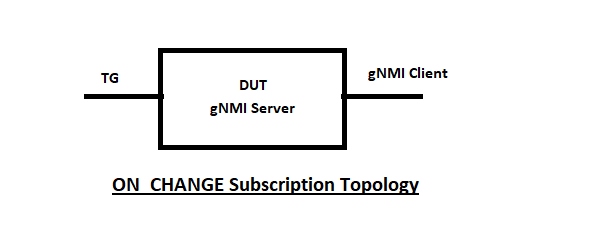

#  SQA Test Plan
#  ON_CHANGE subscription mechanism for streaming telemetry
#  SONiC 3.2.0 Release 

[TOC]

# Test Plan Revision History
| Rev  |    Date    |        Author        |      Change Description      |
| :--: | :--------: | :------------------: | :--------------------------: |
| 0.1  | 5/1/2021   | Prudvi Mangadu       |      Initial version         |

# List of Reviewers
| Function  |         Name         |
| :------:  | :------------------: |
|   DEV     |  Sachin Holla        |
|   DEV     |  Balachandra Mani    |
|   QA      |  Kalyan Vadlamani    |

# List of Approvers
| Function  |           Name         | Date Approved |
| :-------: | :--------------------: | :-----------: |
|   DEV     |  Sachin Holla          |               |
|   DEV     |  Balachandra Mani      |               |
|   QA      |  Kalyan Vadlamani      |               |

# Definition/Abbreviation
| **Term** | **Meaning**                                   |
| -------- | --------------------------------------------- |
| CLI      | Command-Line Interface                        |
| REST     | Representational State Transfer               |
| HLD      | High Level Design Document                    |
| URI      | Uniform Resource Identifier                   |

### Objective 
The main objective of this document is to cover the test cases that will be executed to verify the ON_CHANGE
 Subscription. Topologies and test cases  for testing the feature will be discussed as part of this document.

ON_CHANGE  support going to be supported in 3.2 release.

### Scope
This test plan will cover following aspects of ON_CHANGE Subscription.
1. Supported only for igmp-snooping URI mentioned under 10.4 - Onchange supported URI Paths of the [Telemetry
 Subscribe RPC](https://github.com/BRCM-SONIC/sonic_doc_private/blob/master/manageability/mgmt-framework/Telemetry_Subscribe_RPC.md)
2. Subscribe each URI to ON_CHANGE and Validating the ON_CHANGE notification.

# Feature Overview
Server sends data updates to the client when the value of subscribed path is changed. 
This mode is not suitable for frequently changing values like counters. 
Server can reject the ON_CHANGE subscribe request if it cannot support ON_CHANGE updates to the requested paths. 
Once accepted, server first sends current data for the subscribed paths to client (initial sync). 
Thereafter server sends only the delta updates to client when the values are changed on the server.

# 1 Test Focus Areas
## 1.1 Functional Testing 
   - Subscribe URI to ON_CHANGE and Validating the current data first time(initial sync).
   - Subscribe URI to ON_CHANGE and Validating the delta data.

## 1.2 Scale and Performance Testing
  - Subscribe Multiple/MAX URIs to ON_CHANGE and Validating the ON_CHANGE notification.
 
## 1.3 Negative Testing  
 - Server should reject the ON_CHANGE subscribe request if it cannot support ON_CHANGE updates to the requested paths
 
## 1.4  Reboot/Reload/Upgrade Testing
  - Verify ON_CHANGE Subscription across 
   ```
    - Warm reboot
    - Fast reboot
    - System reboot
    - Config reload
    - Telemetry docker restart
   ```
 
# 2 Topologies
## 2.1 Topology


# 3 Test  Case and Objectives
## 3.1 Functional
### 3.1.1 Verify that server first sends current data for the subscribed paths to client (initial sync). Thereafter server sends only the delta updates to client when the values are changed on the server
| **Test ID**    | **OnChange311**                                |
| -------------- | :----------------------------------------------------------- |
| **Test Name**  | **Verify that server first sends current data for the subscribed paths to client (initial sync). Thereafter server sends only the delta updates to client when the values are changed on the server** |
| **Test Setup** | **Topology**                                                |
| **Type**       | **Functional**                                               |
| **Steps**      | 1) Subscribe the URI to the ON_CHANGE notification, make sure Server accepts the subscribe request <br/> 2) Verify that server first sends current data for the subscribed paths to client (initial sync) <br/> 3) Now change the Subscribe path values by using any UI <br/> 4) Verify that server sends only the delta updates to client when the values are changed on the server. <br/>|

### 3.1.2 Verify that change the value for multiple times make sure ON_CHANGE notifies it correctly.
| **Test ID**    | **OnChange321**                                |
| -------------- | :----------------------------------------------------------- |
| **Test Name**  | **Verify that change the value for multiple times make sure ON_CHANGE notifies it correctly** |
| **Test Setup** | **Topology**                                                |
| **Type**       | **Functional**                                               |
| **Steps**      | 1) Subscribe the URI to the ON_CHANGE notification, make sure Server accepts the subscribe request <br/> 2) Verify that server first sends current data for the subscribed paths to client (initial sync) <br/> 3) Now change the Subscribe path values multiple time <br/> 4) Verify that server sends only the delta updates to client for each time values get change. <br/>|

### 3.1.3 Verify that ON_CHANGE config and state calls are working fine for all(Mentioned in HLD)URI paths.
| **Test ID**    | **OnChange313**                                |
| -------------- | :----------------------------------------------------------- |
| **Test Name**  | **Verify that ON_CHANGE config and state calls are working fine for all(Mentioned in HLD)URI paths** |
| **Test Setup** | **Topology**                                                |
| **Type**       | **Functional**                                               |
| **Steps**      | 1) Subscribe each URI to the ON_CHANGE notification, make sure Server accepts the subscribe request <br/> 2) Verify that server first sends current data for the subscribed paths to client (initial sync) <br/> |

### 3.1.4 Verify that ON_CHANGE subscribed send notification when value change by using CLICK UI.
| **Test ID**    | **OnChange314**                                |
| -------------- | :----------------------------------------------------------- |
| **Test Name**  | **Verify that ON_CHANGE subscribed send notification when value change by using CLICK UI** |
| **Test Setup** | **Topology**                                                |
| **Type**       | **Functional**                                               |
| **Steps**      | 1) Subscribe the URI to the ON_CHANGE notification, make sure Server accepts the subscribe request <br/> 2) Verify that server first sends current data for the subscribed paths to client (initial sync) <br/> 3) Now change the Subscribe path values by using CLICK UI <br/> 4) Verify that server sends only the delta updates to client when the values are changed on the server. <br/>|

### 3.1.5 Verify that ON_CHANGE subscribed send notification when value change by using Klish UI.
| **Test ID**    | **OnChange315**                                |
| -------------- | :----------------------------------------------------------- |
| **Test Name**  | **Verify that ON_CHANGE subscribed send notification when value change by using Klish UI** |
| **Test Setup** | **Topology**                                                |
| **Type**       | **Functional**                                               |
| **Steps**      | 1) Subscribe the URI to the ON_CHANGE notification, make sure Server accepts the subscribe request <br/> 2) Verify that server first sends current data for the subscribed paths to client (initial sync) <br/> 3) Now change the Subscribe path values by using KLISH UI <br/> 4) Verify that server sends only the delta updates to client when the values are changed on the server. <br/>|

### 3.1.6 Verify that ON_CHANGE subscribed send notification when value change by using REST UI.
| **Test ID**    | **OnChange316**                                |
| -------------- | :----------------------------------------------------------- |
| **Test Name**  | **Verify that ON_CHANGE subscribed send notification when value change by using REST UI** |
| **Test Setup** | **Topology**                                                |
| **Type**       | **Functional**                                               |
| **Steps**      | 1) Subscribe the URI to the ON_CHANGE notification, make sure Server accepts the subscribe request <br/> 2) Verify that server first sends current data for the subscribed paths to client (initial sync) <br/> 3) Now change the Subscribe path values by using REST UI <br/> 4) Verify that server sends only the delta updates to client when the values are changed on the server. <br/>|

### 3.1.7 Verify that IGMP snooping Functionality work fine with ON_CHANGE config.
| **Test ID**    | **OnChange317**                                |
| -------------- | :----------------------------------------------------------- |
| **Test Name**  | **Verify that IGMP snooping Functionality work fine with ON_CHANGE config** |
| **Test Setup** | **Topology**                                                |
| **Type**       | **Functional**                                               |
| **Steps**      | 1) Subscribe the URI to the ON_CHANGE notification, make sure Server accepts the subscribe request <br/> 2) Verify that server first sends current data for the subscribed paths to client (initial sync) <br/> 3) Configure IGMP snooping on DUT<br/> 4) Make sure Snooping entries are getting populated during ON_CHANGE is subscribed <br/>|


## 3.2 Scale and Performance Test Cases
### 3.2.1 Verify that ON_CHANGE notification with Multiple/MAX URIs to ON_CHANGE subscription.
| **Test ID**    | **OnChange321**                                |
| -------------- | :----------------------------------------------------------- |
| **Test Name**  | **Verify that ON_CHANGE notification with Multiple/MAX URIs to ON_CHANGE subscription** |
| **Test Setup** | **Topology**                                                |
| **Type**       | **Functional**                                               |
| **Steps**      | 1) Subscribe MAX/Available URI to the ON_CHANGE notification, make sure Server accepts the subscribe request <br/> 2) Verify that server first sends current data for the subscribed paths to client (initial sync) <br/>3) Change the values of all subscription paths<br/>4) Make sure delta updated should trigger for all changes<br/> |


## 3.3 Negative Test Cases
### 3.3.1 Verify that Server should reject the ON_CHANGE subscribe request for URIs not support ON_CHANGE.
| **Test ID**    | **OnChange331**                                |
| -------------- | :----------------------------------------------------------- |
| **Test Name**  | **Verify that Server should reject the ON_CHANGE subscribe request for URIs not support ON_CHANGE.** |
| **Test Setup** | **Topology**                                                |
| **Type**       | **Functional**                                               |
| **Steps**      | 1) Subscribe the unsupported URI to the ON_CHANGE notification, make sure Server should reject the subscribe request <br/> 2) Verify that server should not send data related to the path to client.<br/>|


## 3.4 Reboot/Reload/Upgrade Test Cases
### 3.4.1 Verify ON_CHANGE Subscription across warm reboot.
| **Test ID**    | **OnChange341**                                |
| -------------- | :----------------------------------------------------------- |
| **Test Name**  | **Verify ON_CHANGE Subscription across warm reboot** |
| **Test Setup** | **Topology**                                                |
| **Type**       | **Functional**                                               |
| **Steps**      | Verify ON_CHANGE Subscription across warm reboot <br/> |

###  3.4.2  Verify ON_CHANGE Subscription across fast reboot.
| **Test ID**    | **OnChange342**                                |
| -------------- | :----------------------------------------------------------- |
| **Test Name**  | **Verify ON_CHANGE Subscription across fast reboot** |
| **Test Setup** | **Topology1**                                                |
| **Type**       | **Functional**                                               |
| **Steps**      | Verify ON_CHANGE Subscription across fast reboot <br/>|

### 3.4.3 Verify ON_CHANGE Subscription across System reload.
| **Test ID**    | **OnChange343**                                |
| -------------- | :----------------------------------------------------------- |
| **Test Name**  | **Verify ON_CHANGE Subscription across System reload** |
| **Test Setup** | **Topology**                                                |
| **Type**       | **Functional**                                               |
| **Steps**      | Verify ON_CHANGE Subscription across System reload <br/> |

### 3.4.4 Verify ON_CHANGE Subscription across config reload.
| **Test ID**    | **OnChange344**                                |
| -------------- | :----------------------------------------------------------- |
| **Test Name**  | **Verify ON_CHANGE Subscription across config reload** |
| **Test Setup** | **Topology**                                                |
| **Type**       | **Functional**                                               |
| **Steps**      | Verify ON_CHANGE Subscription across config reload <br/>|

### 3.4.5 Verify ON_CHANGE Subscription across telemetry docker restart.
| **Test ID**    | **OnChange345**                                |
| -------------- | :----------------------------------------------------------- |
| **Test Name**  | **Verify ON_CHANGE Subscription across telemetry docker restart** |
| **Test Setup** | **Topology**                                                |
| **Type**       | **Functional**                                               |
| **Steps**      | Verify ON_CHANGE Subscription across telemetry docker restart <br/> |


## 4 Reference Links
<https://github.com/BRCM-SONIC/sonic_doc_private/blob/master/manageability/mgmt-framework/Telemetry_Subscribe_RPC.md>
