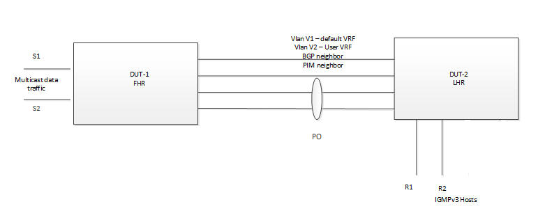

#  SQA Test Plan
#  SONIC PIM + IGMP Snooping Convergence
#  SONiC 3.2 Release
[TOC]

## Test Plan Revision History

| Rev  | Date       | Author          | Change Description |
| ---- | ---------- | --------------- | ------------------ |
| 0.1  | 28/12/2020 | Kesava Swamy K  | Initial Version    |
| 0.2  |            |                 |                    |

## List of Reviewers

| Function | Name |
| :------: | :--: |
|    QA      |   Chandra Bhushan Singh   |
|    QA      |   Hafis Saly   |
|    DEV     |   Ashok Krishnegowda   |

## List of Approvers

| Function | Name | Date Approved |
| :------: | :--: | :-----------: |
|          |      |               |

## Definition/Abbreviation

| **Term** | **Meaning**                |
| -------- | -------------------------- |
| PIM-SSM  | Protocol Independent Multicast - Source Specific Multicast       |
| IGMP     | Internet Group Management Protocol |

## Feature Overview

  **Problem**: In Sonic L3 multicast, if Vlan has 3 ports and if there is IGMP receiver present on only one port, multicast traffic will be forwarded to all members of the VLAN irrespective of the port where the IGMP join is received. This is because L3 multicast in Sonic doesn’t store port level information and the limitation is tied to the way SAI API’s are defined for IP multicast and L2 multicast. 

  So, today we support either L3 PIM or IGMP snooping on a given VLAN. In other words, we cannot do L3 switching and L2 switching for the same IPMC group. 

  **Solution**: As IGMP snooping holds VLAN port level information where the IGMP joins are received, the solution is to converge L3 multicast and IGMP snooping VLAN ports to derive ports where the multicast traffic to be forwarded instead of flooding on all member ports of the Vlan.

  **Expected behavior changes**: 
   - When a user configures IGMP snooping and PIM on the same VLAN, traffic disruption happens as we are flushing existing entries to converge OIFs from the beginning.
   - To avoid disruption of traffic, the suggestion is to configure IGMP snooping and PIM on VLAN even before starting the traffic.
   - Since we don’t share IPMC resources when both L3 multicast and IGMP snooping are enabled on VLAN, each L3 multicast entry will make use of one IPMC resource, so, there will be change in the scaling as per the chipset supported IPMC resource.

## 1 Test Focus Areas

  - This Test plan covers the validation of the multicast traffic forwarding in a Vlan (with multiple member ports) in which L3 multicast (PIM) and IGMP Snooping are configured. 

### 1.1 CLI Testing 
No new CLI added as a part of this feature enhancement.

### 1.2 Functional Testing

  - Verify that user can enable PIM SSM and IGMP Snooping on same Vlan interface.
  - Verify that with PIM SSM and IGMP snooping enabled on vlan interface (in default VRF), multicast traffic is only forwarded to the port on which the IGMPv3 Join is received/ IGMPv3 Host learned.
  - Verify that with PIM SSM and IGMP snooping enabled on vlan interface (in User VRF), multicast traffic is only forwarded to the port on which the IGMPv3 Join is received/ IGMPv3 Host learned.
  - Verify multicast traffic forwarding in vlan with PIM SSM and IGMP snooping enabled while IGMPv3 host/Join learned on one member port, and a new port is added into the Vlan but no IGMPv3 host/Join learned on that new port.
  - Verify multicast traffic forwarding in vlan with PIM SSM and IGMP snooping enabled when the member ports in the vlan are port channel interface.
  - Verify multicast traffic forwarding in vlan with PIM SSM and IGMP snooping enabled after shut no shut on the member ports of the vlan on which IGMPv3 Hosts/Joins are learned. 
  - Verify multicast traffic forwarding in vlan with PIM SSM and IGMP snooping enabled when different member ports in Vlan has IGMPv3 hosts learned with different source address.
  - Verify multicast traffic forwarding in vlan with PIM SSM and IGMP snooping enabled while IGMPv3 host/Join learned on one member port, and IGMP Snooping is enabled and disabled on Vlan Interface.
  - Verify multicast traffic forwarding in vlan with PIM SSM and IGMP snooping enabled while IGMPv3 host/Join learned on one member port, and PIM SSM is enabled and disabled on Vlan Interface.
  - Verify multicast traffic forwarding in vlan with PIM SSM and IGMP snooping enabled while IGMPv3 host/Join learned on all member ports, and then IGMPv3 Leave is sent on all ports except one port, traffic should get forwarded to that port only.
  - Verify multicast traffic forwarding in member ports of vlan with PIM SSM enabled first and IGMP snooping is enabled while traffic is forwarding (traffic disruption is expected, but make sure traffic is forwarded successfully after that).
  - Verify multicast traffic forwarding in member ports of vlan with PIM SSM and IGMP snooping is enabled first on Vlan interface and then ports are added to the Vlan Interface.
  - Verify multicast traffic forwarding in member ports of vlan with PIM SSM and IGMP snooping is enable after Warm boot.
  - Verify multicast traffic forwarding in member ports of vlan with PIM SSM and IGMP snooping is enable after fast boot.
  - Verify multicast traffic forwarding in member ports of vlan with PIM SSM and IGMP snooping is enable after reboot.

### 1.3 Scalability Testing
  - Verify max supported mroute entries in a Vlan with PIM SSM and IGMP snooping on the Vlan interface.

## 2 Topologies

 

#### 								Topology 1 

## 3 Test Case and objectives

### 3.1 CLI Test Cases

#### 3.1.1 Verify that user can enable PIM SSM and IGMP Snooping on same Vlan interface. 

| **Test ID**    | **FtOpSoRoPimIgFun001**                                               |
| -------------- | :----------------------------------------------------------- |
| **Test Name**  | **Verify that user can enable PIM SSM and IGMP Snooping on same Vlan interface.**      |
| **Test Setup** | **Topology 1**                                               |
| **Type**       | **Functional**                                               |
| **Steps**      | 1. On a Vlan interface configure PIM. 2. On the same Vlan interface, enable IGMP snooping.  3. Check the configuration is applied successfully.|

### 3.2 Functional Test Cases

#### 3.2.1 Verify that with PIM SSM and IGMP snooping enabled on Vlan interface, multicast traffic is only forwarded to the port on which the IGMPv3 Join is received/ IGMPv3 Host learned.  

| **Test ID**    | **FtOpSoRoPimIgFun002**                                               |
| -------------- | :----------------------------------------------------------- |
| **Test Name**  | **Verify that with PIM SSM and IGMP snooping enabled on Vlan interface, multicast traffic is only forwarded to the port on which the IGMPv3 Join is received/ IGMPv3 Host learned.** |
| **Test Setup** | **Topology 1**                                               |
| **Type**       | **Functional**                                               |
| **Steps**      | 1. Enable IGMP Snooping on the PIM enabled Vlan interface (in default VRF) in which only one TGen ports (Hosts) are members.  2. Send IGMPv3 Join with IS_INCLUDE (S1) from one of the TGen ports connected to LHR.  3. Check the IGMP Snooping table is updated properly for that Vlan and the port.  4. check the (S1, G) entry properly updated with corresponding OIF and IIF in both nodes.  5. Send the multicast data traffic from source S1 from TGen port connected to FHR.  6. Check that traffic is forwarded to only the port on which IGMPv3 Join is learned.|

#### 3.2.2 Verify that with PIM SSM and IGMP snooping enabled on Vlan interface, multicast traffic is only forwarded to the port on which the IGMPv3 Join is received/ IGMPv3 Host learned.  

| **Test ID**    | **FtOpSoRoPimIgFun003**                                               |
| -------------- | :----------------------------------------------------------- |
| **Test Name**  | **Verify that with PIM SSM and IGMP snooping enabled on Vlan interface, multicast traffic is only forwarded to the port on which the IGMPv3 Join is received/ IGMPv3 Host learned.** |
| **Test Setup** | **Topology 1**                                               |
| **Type**       | **Functional**                                               |
| **Steps**      | 1. Enable IGMP Snooping on the PIM enabled Vlan interface (in User VRF) in which only one TGen ports (Hosts) are members.  2. Send IGMPv3 Join with IS_INCLUDE (S1) from one of the TGen ports connected to LHR.  3. Check the IGMP Snooping table is updated properly for that Vlan and the port.  4. check the (S1, G) entry properly updated with corresponding OIF and IIF in both nodes.  5. Send the multicast data traffic from source S1 from TGen port connected to FHR.  6. Check that traffic is forwarded to only the port on which IGMPv3 Join is learned.|

#### 3.2.3 Verify multicast traffic forwarding in Vlan with PIM SSM and IGMP snooping enabled while IGMPv3 host/Join learned on one member port, and a new port is added into the Vlan but no IGMPv3 host/Join learned on that new port.

| **Test ID**    | **FtOpSoRoPimIgFun004**                                               |
| -------------- | :----------------------------------------------------------- |
| **Test Name**  | **Verify multicast traffic forwarding in vlan with PIM SSM and IGMP snooping enabled while IGMPv3 host/Join learned on one member port, and a new port is added into the Vlan but no IGMPv3 host/Join learned on that new port.** |
| **Test Setup** | **Topology 1**                                               |
| **Type**       | **Functional**                                               |
| **Steps**      | 1. Enable IGMP Snooping on the PIM enabled Vlan interface in which only one TGen ports (Hosts) are members.  2. Send IGMPv3 Join with IS_INCLUDE (S1) from one of the TGen ports connected to LHR.  3. Check the IGMP Snooping table is updated properly for that Vlan and the port.  4. check the (S1, G) entry properly updated with corresponding OIF and IIF in both nodes.  5. Send the multicast data traffic from source S1 from TGen port connected to FHR.  6. Check that traffic is forwarded to only the port on which IGMPv3 Join is learned.  7. Add one more TGen port as member port into that Vlan at LHR.  8. Check that multicast traffic still forwarded to the first port only, traffic should not forward to the other port.|

#### 3.2.4 Verify multicast traffic forwarding in Vlan with PIM SSM and IGMP snooping enabled after shut no shut on the member ports of the Vlan on which IGMPv3 Hosts/Joins are learned.

| **Test ID**    | **FtOpSoRoPimIgFun005**                                               |
| -------------- | :----------------------------------------------------------- |
| **Test Name**  | **Verify multicast traffic forwarding in Vlan with PIM SSM and IGMP snooping enabled after shut no shut on the member ports of the Vlan on which IGMPv3 Hosts/Joins are learned.** |
| **Test Setup** | **Topology 1**                                               |
| **Type**       | **Functional**                                               |
| **Steps**      | 1. Enable IGMP Snooping on the PIM enabled Vlan interface in which only one TGen ports (Hosts) are members.  2. Send IGMPv3 Join with IS_INCLUDE (S1) from one of the TGen ports (p1) connected to LHR.  3. Check the IGMP Snooping table is updated properly for that Vlan and the port.  4. check the (S1, G) entry properly updated with corresponding OIF and IIF in both nodes.  5. Send the multicast data traffic from source S1 from TGen port connected to FHR.  6. Check that traffic is forwarded to only the port on which IGMPv3 Join is learned.  7. Add one more TGen port (p2) as member port into that Vlan at LHR.  8. Check that multicast traffic still forwarded to the first port only, traffic should not forward to the other port.  9. Do shutdown on the port (p1) on which IGMP Join is learned.  10. Check that IGMP snooping table, and corresponding PIM table updated and no traffic is forwarded.  11. Do no shutdown, check that IGMP Snooping table, PIM table updated accordingly and traffic is resumed to that port (p1), and no traffic should be forwarded to other port (p2). |

#### 3.2.5 Verify multicast traffic forwarding in Vlan with PIM SSM and IGMP snooping enabled when different member ports in Vlan has IGMPv3 hosts learned with different source address.

| **Test ID**    | **FtOpSoRoPimIgFun006**                                               |
| -------------- | :----------------------------------------------------------- |
| **Test Name**  | **Verify multicast traffic forwarding in Vlan with PIM SSM and IGMP snooping enabled when different member ports in Vlan has IGMPv3 hosts learned with different source address.** |
| **Test Setup** | **Topology 1**                                               |
| **Type**       | **Functional**                                               |
| **Steps**      | 1. Enable IGMP Snooping on the PIM enabled Vlan interface in which both TGen ports (Hosts) are members.  2. Send IGMPv3 Join with IS_INCLUDE (S1) from one of the TGen port (p1) and IGMPv3 Join with IS_INCLUDe(S2) from other port (p2) connected to LHR.  3. Check the IGMP Snooping table is updated properly for that Vlan and the port.  4. check the (S1, G), (S2, G) entry properly updated with corresponding OIF and IIF in both nodes.  5. Send the multicast data traffic from source S1 from TGen port connected to FHR.  6. Check that traffic is forwarded to only the port (P1) on which corresponding Join for source S1 is learned.  7. Send the multicast data traffic from source S2 from TGen port connected to FHR.  6. Check that traffic is forwarded to only the port (P2) on which corresponding Join for source S2 is learned.|

#### 3.2.6 Verify multicast traffic forwarding in Vlan with PIM SSM and IGMP snooping enabled while IGMPv3 host/Join learned on all member ports, and then IGMPv3 Leave is sent on all ports except one port, traffic should get forwarded to that port only.

| **Test ID**    | **FtOpSoRoPimIgFun007**                                               |
| -------------- | :----------------------------------------------------------- |
| **Test Name**  | **Verify multicast traffic forwarding in Vlan with PIM SSM and IGMP snooping enabled while IGMPv3 host/Join learned on all member ports, and then IGMPv3 Leave is sent on all ports except one port, traffic should get forwarded to that port only.** |
| **Test Setup** | **Topology 1**                                               |
| **Type**       | **Functional**                                               |
| **Steps**      | 1. Enable IGMP Snooping on the PIM enabled Vlan interface in which both TGen ports (Hosts) are members.  2. Send IGMPv3 Join with IS_INCLUDE (S1) from both of the TGen port connected to LHR.  3. Check the IGMP Snooping table is updated properly for that Vlan and the port.  4. check the (S1, G) entry properly updated with corresponding OIF and IIF in both nodes.  5. Send the multicast data traffic from source S1 from TGen port connected to FHR.  6. Check that traffic is forwarded to both the TGen ports as the IGMP Join corresponding to that source is learned on both the ports.  7. Send IGMPv3 Leave from one of the TGen port (P2) for source S1, check the IGMP Snooping table updated properly and now traffic should be forwarded to that first port (p1) only (IGMP leave delay timer plays a role here, we need to wait for that time and check the traffic forwarding).|

#### 3.2.7 Verify multicast traffic forwarding in Vlan with PIM SSM and IGMP snooping enabled while IGMPv3 host/Join learned on one member port, and IGMP Snooping is enabled and disabled on Vlan Interface.

| **Test ID**    | **FtOpSoRoPimIgFun008**                                               |
| -------------- | :----------------------------------------------------------- |
| **Test Name**  | **Verify multicast traffic forwarding in Vlan with PIM SSM and IGMP snooping enabled while IGMPv3 host/Join learned on one member port, and IGMP Snooping is enabled and disabled on Vlan Interface.** |
| **Test Setup** | **Topology 1**                                               |
| **Type**       | **Functional**                                               |
| **Steps**      | 1. Enable IGMP Snooping on the PIM enabled Vlan interface in which both TGen ports (Hosts) are members.  2. Send IGMPv3 Join with IS_INCLUDE (S1) from one of the TGen port connected to LHR.  3. Check the IGMP Snooping table is updated properly for that Vlan and the port.  4. check the (S1, G) entry properly updated with corresponding OIF and IIF in both nodes.  5. Send the multicast data traffic from source S1 from TGen port connected to FHR.  6. Check that traffic is forwarded to that TGen port only on which Join is learned.  7. Disable and Enable IGMP snooping on that Vlan.  8. Check that after disable and enable IGMP Snooping traffic is forwarded to that TGen port only on which Join is learned and not flooded to other ports in that Vlan.|

#### 3.2.8 Verify multicast traffic forwarding in Vlan with PIM SSM and IGMP snooping enabled while IGMPv3 host/Join learned on one member port, and PIM SSM is enabled and disabled on Vlan Interface.

| **Test ID**    | **FtOpSoRoPimIgFun009**                                               |
| -------------- | :----------------------------------------------------------- |
| **Test Name**  | **Verify multicast traffic forwarding in Vlan with PIM SSM and IGMP snooping enabled while IGMPv3 host/Join learned on one member port, and PIM SSM is enabled and disabled on Vlan Interface.**                    |
| **Test Setup** | **Topology 1**                                               |
| **Type**       | **Functional**                                               |
| **Steps**      | 1. Enable IGMP Snooping on the PIM enabled Vlan interface in which both TGen ports (Hosts) are members.  2. Send IGMPv3 Join with IS_INCLUDE (S1) from one of the TGen port connected to LHR.  3. Check the IGMP Snooping table is updated properly for that Vlan and the port.  4. check the (S1, G) entry properly updated with corresponding OIF and IIF in both nodes.  5. Send the multicast data traffic from source S1 from TGen port connected to FHR.  6. Check that traffic is forwarded to that TGen port only on which IGMPv3 Join is learned.  7. Disable and Enable PIM SSM on that Vlan.  8. Check that after disable and enable PIM SSM traffic is forwarded to that TGen port only on which Join is learned and not flooded to other ports in that Vlan.|

#### 3.2.9 Verify multicast traffic forwarding in member ports of Vlan with PIM SSM enabled first and IGMP snooping is enabled while traffic is forwarding (traffic disruption is expected, but make sure traffic is forwarded successfully after that).

| **Test ID**    | **FtOpSoRoPimIgFun010**                                               |
| -------------- | :----------------------------------------------------------- |
| **Test Name**  | **Verify multicast traffic forwarding in member ports of Vlan with PIM SSM enabled first and IGMP snooping is enabled while traffic is forwarding (traffic disruption is expected, but make sure traffic is forwarded successfully after that).** |
| **Test Setup** | **Topology 1**                                               |
| **Type**       | **Functional**                                               |
| **Steps**      |2. Send IGMPv3 Join with IS_INCLUDE (S1) from one of the TGen port connected to LHR.  3. Check the IGMP Snooping table is updated properly for that Vlan and the port.  4. check the (S1, G) entry properly updated with corresponding OIF and IIF in both nodes.  5. Send the multicast data traffic from source S1 from TGen port connected to FHR.  6. Check that traffic is forwarded to both the TGen port in that Vlan at LHR.  7. While traffic is forwarding enable IGMP Snooping on the PIM enabled Vlan interface in which both TGen ports (Hosts) are members.  8. Check that as IGMP snooping is enabled IGMP snooping table entry get updated and PIM table entries also get re updated and traffic disruption happens. Check that after IGMP snooping entry get updated traffic is now forwarded to only one port on which IGMP Join is learned and not forwarded to other port. |

#### 3.2.10 Verify multicast traffic forwarding in member ports of Vlan with PIM SSM and IGMP snooping is enabled first on Vlan interface and then ports are added to the Vlan Interface.

| **Test ID**    | **FtOpSoRoPimIgFun011**                                               |
| -------------- | ------------------------------------------------------------ |
| **Test Name**  | **Verify multicast traffic forwarding in member ports of Vlan with PIM SSM and IGMP snooping is enabled first on Vlan interface and then ports are added to the Vlan Interface** |
| **Test Setup** | **Topology 1**                                               |
| **Type**       | **Functional**                                               |
| **Steps**      |1. Enable IGMP Snooping on the PIM enabled Vlan interface in which no TGen ports (Hosts) are members.  2. Add the TGen ports as member ports to that Vlan. Send IGMPv3 Join with IS_INCLUDE (S1) from one of the TGen port connected to LHR.  3. Check the IGMP Snooping table is updated properly for that Vlan and the port.  4. check the (S1, G) entry properly updated with corresponding OIF and IIF in both nodes.  5. Send the multicast data traffic from source S1 from TGen port connected to FHR.  6. Check that traffic is forwarded to that TGen port only on which Join is learned.  7. Check that traffic is forwarded to that TGen port only on which Join is learned and not flooded to other ports in that Vlan.|

#### 3.2.11 Verify multicast traffic forwarding in Vlan with PIM SSM and IGMP snooping enabled when the member ports in the Vlan are port channel interface.

| **Test ID**    | **FtOpSoRoPimIgFun012**                                              |
| -------------- | ------------------------------------------------------------ |
| **Test Name**  | **Verify multicast traffic forwarding in Vlan with PIM SSM and IGMP snooping enabled when the member ports in the Vlan are port channel interface.** |
| **Test Setup** | **Topology 1**                                               |
| **Type**       | **Functional**                                               |
| **Steps**      | 1. Have two port channel interfaces in one Vlan (PIM + IGMP Snooping enabled) interface and make sure a IGMPv3 join is sent on only one of the port channel.  2. Check that IGMP Snooping entry and PIM table entry updated properly in the corresponding Vlan.  3. Send the multicast traffic from TGen connected to FHR and check while traffic is forwarding it is not flooded to both the port channel interface, traffic should forward over one of the portchannel interface on which IGMPv3 join is learned. |

### 3.4 Reboot/Reload/Upgrade Test Cases

#### 3.4.1 Verify multicast traffic forwarding in member ports of Vlan with PIM SSM and IGMP snooping is enable after Warm boot.

| **Test ID**    | **FtOpSoRoPimIgFun013**                                               |
| -------------- | ------------------------------------------------------------ |
| **Test Name**  | **Verify multicast traffic forwarding in member ports of Vlan with PIM SSM and IGMP snooping is enable after Warm boot.**    |
| **Test Setup** | **Topology 1**                                               |
| **Type**       | **Functional**                                               |
| **Steps**      | 1. Enable IGMP Snooping on the PIM enabled Vlan interface in which both TGen ports (Hosts) are members.  2. Send IGMPv3 Join with IS_INCLUDE (S1) from one of the TGen port connected to LHR.  3. Check the IGMP Snooping table is updated properly for that Vlan and the port.  4. check the (S1, G) entry properly updated with corresponding OIF and IIF in both nodes.  5. Send the multicast data traffic from source S1 from TGen port connected to FHR.  6. Check that traffic is forwarded to that TGen port only on which Join is learned.  7. Do config save and perform Warm reboot on LHR node.  8. Check that after warm reboot all configuration is retained, and traffic should forward to the port on which IGMP Join is learned and not flood to other ports in that Vlan. |

#### 3.4.2 Verify multicast traffic forwarding in member ports of Vlan with PIM SSM and IGMP snooping is enable after fast boot.

| **Test ID**    | **FtOpSoRoPimIgFun014**                                               |
| -------------- | ------------------------------------------------------------ |
| **Test Name**  | **Verify multicast traffic forwarding in member ports of Vlan with PIM SSM and IGMP snooping is enable after fast boot.**   |
| **Test Setup** | **Topology 1**                                               |
| **Type**       | **Functional**                                               |
| **Steps**      | 1. Enable IGMP Snooping on the PIM enabled Vlan interface in which both TGen ports (Hosts) are members.  2. Send IGMPv3 Join with IS_INCLUDE (S1) from one of the TGen port connected to LHR.  3. Check the IGMP Snooping table is updated properly for that Vlan and the port.  4. check the (S1, G) entry properly updated with corresponding OIF and IIF in both nodes.  5. Send the multicast data traffic from source S1 from TGen port connected to FHR.  6. Check that traffic is forwarded to that TGen port only on which Join is learned.  7. Perform fast reboot on LHR node.  8. Check that after fast reboot all configuration is retained, and traffic should forward to the port on which IGMP Join is learned and not flood to other ports in that Vlan. |

#### 3.4.3 Verify multicast traffic forwarding in member ports of Vlan with PIM SSM and IGMP snooping is enable after reboot.

| **Test ID**    | **FtOpSoRoPimIgFun015**                                               |
| -------------- | ------------------------------------------------------------ |
| **Test Name**  | **Verify multicast traffic forwarding in member ports of Vlan with PIM SSM and IGMP snooping is enable after reboot.** |
| **Test Setup** | **Topology 1**                                               |
| **Type**       | **Functional**                                               |
| **Steps**      | 1. Enable IGMP Snooping on the PIM enabled Vlan interface in which both TGen ports (Hosts) are members.  2. Send IGMPv3 Join with IS_INCLUDE (S1) from one of the TGen port connected to LHR.  3. Check the IGMP Snooping table is updated properly for that Vlan and the port.  4. check the (S1, G) entry properly updated with corresponding OIF and IIF in both nodes.  5. Send the multicast data traffic from source S1 from TGen port connected to FHR.  6. Check that traffic is forwarded to that TGen port only on which Join is learned.  7. Perform a reboot on LHR node.  8. Check that after reboot all configuration is retained, and traffic should forward to the port on which IGMP Join is learned and not flood to other ports in that Vlan. |

### 3.5 Scale

#### 3.5.1 Scale test case

##### 3.5.1.1 Verify max supported mroute entries in a Vlan with PIM SSM and IGMP snooping on the Vlan interface.

| **Test ID**    | **FtOpSoRoPimIgFun016**                                              |
| -------------- | ------------------------------------------------------------ |
| **Test Name**  | **Verify max supported mroute entries in a Vlan with PIM SSM and IGMP snooping on the Vlan interface.** |
| **Test Setup** | **Topology 1**                                               |
| **Type**       | **Scale**                                                    |
| **Steps**      | 1. With IGMP Snooping enabled on Vlan along with PIM SSM, send max supported IGMPv3 Joins from TGen ports onto LHR.  2. Check the max mroute entries are updated in FHR and LHR nodes successfully.  3. Send the multicast traffic towards those hosts and check that traffic is not flooded to other ports in Vlan as IGMP Snooping is enabled.|

### 3.6 Management

#### 3.6.1 REST

##### 3.6.1.1 Verify multicast traffic forwarding in Vlan with PIM SSM and IGMP snooping enabled via REST

| **Test ID**    | **FtOpSoRoPimIgFun018**                                              |
| -------------- | ------------------------------------------------------------ |
| **Test Name**  | **Verify multicast traffic forwarding in Vlan with PIM SSM and IGMP snooping enabled via REST** |
| **Test Setup** | **Topology 1**                                               |
| **Type**       | **Functional**                                               |
| **Steps**      | This test case will be covered implicitly in REST run.  1. Through REST API, enable IGMP Snooping on the PIM enabled Vlan interface in which both TGen ports (Hosts) are members.  2. Send IGMPv3 Join with IS_INCLUDE (S1) from one of the TGen port connected to LHR.  3. Check the IGMP Snooping table is updated properly for that Vlan and the port.  4. check the (S1, G) entry properly updated with corresponding OIF and IIF in both nodes.  5. Send the multicast data traffic from source S1 from TGen port connected to FHR.  6. Check that traffic is forwarded to that TGen port only on which Join is learned.|

## Reference Links

HLD Not Available

