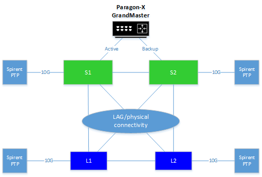
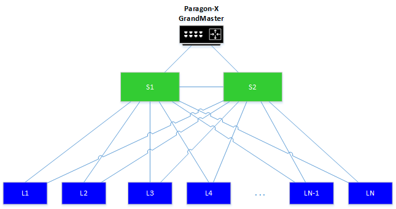
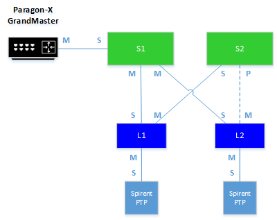

#  SQA Test Plan
# Precision Time Protocol (PTP)
#  SONiC 3.0 (Buzznik) Release
[TOC]
# Test Plan Revision History
| Rev | Date | Author | Change Description |
|:---:|:-----------:|:------------------:|-----------------------------|
| 0.1 | 10/28/2019 | Kevin Nguyen | Initial version |
| 0.2 | 12/19/2019 | Kevin Nguyen | Updated after review and HLD features updates and clarifications |

# List of Reviewers
|  Function | Name |
|:---:|:-----------:|
|  |   |

# List of Approvers
|  Function | Name | Date Approved|
|:---:|:-----------:|:------------------:|
|  |   |  |

# Definition/Abbreviation
| **Term** | **Meaning**                     |
| -------- | ------------------------------- |
| ARB      | Arbitrary				         |
| BMC      | Best Master Clock               |
| E2E      | End-to-end                      |
| GPS      | Global Positioning System       |
| LAN      | Local Area Network              |
| OCXO     | Oven Compensated Crystal Oscillator |
| NTP      | Network Time Protocol           |
| P2P      | Peer-to-peer                    |
| PDV      | Packet delay variation          |
| POSIX    | Portable Operating System Interface |
| PPB      | Parts Per Billion               |
| PPT      | Parts Per Trillion              |
| PPS      | Pulse Per Second                |
| PTP      | Precision Time Protocol         |
| TAI      | International Atomic Time       |
| UTC      | Coordinated Universal Time      |

# Feature Overview
Precision Time Protocol (PTP) is an IEEE-1588 protocol designed to synchronize real-time clocks between nodes of a distributed system communicating on a local area network.  PTP uses a master-slave hierarchy for clock distribution, where a Grandmaster clock is selected as the top of the hierarchy serving as the reference clock to the PTP domain.  PTP exchanges timing messages to orchestrate the clock synchronization between nodes in the PTP domain.  On a local area network, PTP is able to achieve sub-microsecond clock accuracy for distributed applications (i.e. audio/video streaming, navigation, telemetry/analytics, etc.).  As a result, PTP serves far more superior than NTP in terms of clock accuracy and more accessible than the costly GPS solution.

# 1 Test Focus Areas
## 1.1 PTP Clocks   
  - Boundary Clock (BC)
    - Profiles Supported:
      - Default (ieee 1588-2008) over L2 mcast / ucast, updv4 mcast / ucast, udpv6 mcast
      - G.8275.2 over udpv4 ucast 
  - End-to-end Transparent Clock (TC)
    - Profiles Supported:
      - Default (ieee 1588-2008) over L2 mcast, udpv4 mcast, udpv6 mcast 
## 1.2 Functional Testing 
  - All CLI and debug commands
  - PTP version 2
  - PTP Grandmaster clock and master/slave selection process
  - Redundancy and Fault Handling
## 1.3 Negative Testing 
  -	PTP interface (link flaps, mismatch)
  -	PTP domain mismatch
  -	Exceeding PTP packet MTU, hop count
  -	Warm reboot
  -	System reboot
  -	Docker restart
  -	config save and reload
  -	NOS Upgrade aka Firmware Upgrade

## 1.4 Scale and Performance Testing
  -	Scale (Max PTP ports, hop count)
  -	Performance (PTP offset, failover time)

# 2 Topologies
## 2.1 Topology 1
Figure 2.1.1 illustrates a two spine nodes and two leaf nodes IP Fabric topology.  This topology will be primarily used for testing and verifying the basic PTP functionalities such as PTP configuration, PTP message exchange, ingress/egress time stamping, Best Master Clock (BMC) selection, master-slave port role selection scenarios, PTP fault handling scenarios, PTP on L2 networks, etc.

## 2.2 Topology 2
Figure 2.2.1 illustrates the topology to determine the maximum number of active PTP interfaces on the supported platforms. That is, AS7712 (TH) as spine nodes and AS5712 (TD2) as leaf nodes.

# 3 Test  Case and Objectives
## 3.1 CLI
### 3.1.1 CLI Verification 
#### 3.1.1.1 PTP Configurations CLI

| **Test ID** | **iTAS Test Case Manager ID** |
|--------|:----------------|
| **Test Name** | **Verify cli commands to configure PTP** |
| **Test Setup** | **Topology1** |
| **Type** | **CLI** |
| **Steps** | **1) Verify help strings are displayed in cli mode \#sonic-cli sonic\# config terminal sonic(config)\# ptp ? sonic(config)\# ptp \<command / attribute\> ? 2) Config/unconfig each command / attribute under 'ptp ?' list** |

### 3.1.2 PTP Show and Debug CLI

| **Test ID**    | **iTAS Test Case Manager ID**                                |
| -------------- | :----------------------------------------------------------- |
| **Test Name**  | **PTP Show and Debug CLI**                                   |
| **Test Setup** | **Topology1**                                                |
| **Type**       | **CLI**                                                      |
| **Steps**      | **Verify the PTP show and debug CLI commands accurately display the relevant PTP information without errors 1) Create a PTP BC and TC on a Spine node and a leaf node 2) Perform the following show commands and verify the relevant PTP information are displayed accurately verify the output display all the correct local switch interfaces configured with PTP and their respective states root# show ptp verify the output displays all the correct PTP ports and current port state root# show ptp clock verify the output displays the correct information and properties of a local PTP clock root# show ptp parent verify the output displays the correct information and properties of the upstream PTP master root# show ptp port \<interface_name\> verify the output displays the correct PTP port state and properties root# show ptp time-property verify the output displays the correct time properties 3) Issue the “show ptp ?” option for the above CLI commands to verify the correct parameter options are displayed ** |

### 3.1.3 Negative CLI Verification

| **Test ID**    | **iTAS Test Case Manager ID**                                |
| -------------- | :----------------------------------------------------------- |
| **Test Name**  | **Negative CLI Verification**                                |
| **Test Setup** | **Topology1**                                                |
| **Type**       | **CLI**                                                      |
| **Steps**      | **Verify negative PTP CLI attempts are rejected with the proper error messages Perform the invalid PTP CLI commands or out of range and verify the command is rejected and the proper error messages is displayed** |

## 3.2 Functional Tests

### 3.2.1 PTPv2 Frame Encapsulation

#### 3.2.1.1 Untagged

| **Test ID**    | **iTAS Test Case Manager ID**                                |
| -------------- | :----------------------------------------------------------- |
| **Test Name**  | **PTPv2 Frame Encapsulation - Untagged**                     |
| **Test Setup** | **Topology1**                                                |
| **Type**       | **Functional**                                               |
| **Steps**      | **Verify the PTP frame encapsulation are correct and untagged 1) Configure following scenarios individually on the connecting PTP interfaces of both switches to verify untagged PTP frames Scenario 1: access port Scenario 2: router port 2) Created BC with the same PTP domain on S1 and L1 switches  3) Add ports connecting the two switches to PTP 4) Capture the PTP control frames in both directions and verify the PTP frame encapsulation are correct 5) Repeat for different interfaces types (1G, 10G, 40G, breakout) 6) Delete ports from PTP 7) Repeat for Transparent Clock (TC)** |

### 3.2.2 SYSLOG

| **Test ID**    | **iTAS Test Case Manager ID**                                |
| -------------- | :----------------------------------------------------------- |
| **Test Name**  | **SYSLOG**                                                   |
| **Test Setup** | **Topology1**                                                |
| **Type**       | **Functional**                                               |
| **Steps**      | **Verify the proper PTP SYSLOG messages are displayed during the different PTP states 1) Created BC with the same PTP domain on S1 and L1 switches 2) Add ports connecting the two switches to PTP 3) Verify the correct SYSLOG messages are displayed on the clock for the following clock states: Frequency Acquiring Frequency Acquired Time Sync 4) After observing the “Time Sync” SYSLOG, disconnect the PTP interface link to verify the “Holdover” SYSLOG is observed shortly after 5) After observing the “Holdover” SYSLOG, reconnect the PTP interface link and verify the SYSLOG messages in steps 3 6) Repeat for Transparent Clock (TC)** |

### 3.2.3 Grandmaster Selection

#### 3.2.3.1 External Grandmaster

| **Test ID**    | **iTAS Test Case Manager ID**                                |
| -------------- | :----------------------------------------------------------- |
| **Test Name**  | **External Grandmaster Selection**                           |
| **Test Setup** | **Topology1**                                                |
| **Type**       | **Functional**                                               |
| **Steps**      | **Verify an external PTP Grandmaster source is correctly selected based on the clock profile 1) Created BC with the same PTP domain on S1 and L1 switches 2) Connect the S1 switch to the Paragon-X 3) Add port connecting to the Paragon-X to S1 PTP clock  4) Configure the following clock profiles so that the Paragon-X is selected as the Grandmaster Scenario 1: Priority 1 Configure the Paragon-X port to have a higher "priority 1" value Configure S1, L1 switches to have a lower "priority 1" value sonic(config)# ptp priority1 200 5) Scenario 2: Priority 2 Configure the Paragon-X ports to have a higher “priority 2” value Configure the S1 and L1 SONiC switches to have a lower “priority 2” value 6) Verify S1, L1 switches display the correct PTP clock state in SYSLOG 7) Issue 'show ptp parent' on the S1 and L1 switches to confirm the Paragon-X contains the correct clock property and is selected as the Grandmaster** |

#### 3.2.3.2 Spine Node Grandmaster

| **Test ID**    | **iTAS Test Case Manager ID**                                |
| -------------- | :----------------------------------------------------------- |
| **Test Name**  | **Spine Node Grandmaster**                                   |
| **Test Setup** | **Topology1**                                                |
| **Type**       | **Functional**                                               |
| **Steps**      | **Verify the Spine1 (S1) node is correctly selected as the PTP Grandmaster source based on the clock profile 1) Created BC with the same PTP domain on S1 and L1 switches using default settings 2) Connect the S1 and L1 nodes. Temporarily remove any connections to the Paragon-X 3) Add ports connected S1 and L1 nodes to PTP clock on each node  4) Configure the following clock profiles so that Spine1 (S1) node is selected as the Grandmaster Scenario 1: Priority 1 Property Configure S1 node to have higher  "priority 1" value sonic(config)# ptp priority1 100 Configure L1 node to have a lower "priority 1" value 5) Scenario 2: Priority 2 Property Configure S1 and L1 to have same "priority 1" value Configure S1 node to have higher  "priority 2" value Configure L1 node to have lower  "priority 2" value 6) Verify S1, L1 switches display the correct PTP clock state in SYSLOG 8) Issue 'show ptp parent' on the S1 and L1 switches to confirm S1 node contains the correct clock property and is selected as the Grandmaster** |

#### 3.2.3.3 Leaf Node Grandmaster

| **Test ID**    | **iTAS Test Case Manager ID**                                |
| -------------- | :----------------------------------------------------------- |
| **Test Name**  | **Leaf Node Grandmaster**                                    |
| **Test Setup** | **Topology1**                                                |
| **Type**       | **Functional**                                               |
| **Steps**      | **Verify the Leaf1 (L1) node is correctly selected as the PTP Grandmaster source based on the clock profile 1) Created BC with the same PTP domain on S1 and L1 switches using default settings 2) Connect the S1 and L1 nodes. Temporarily remove any connections to the Paragon-X 3) Add ports connected S1 and L1 nodes to PTP clock on each node  4) Configure the following clock profiles so that Leaf1 (L1) node is selected as the Grandmaster Scenario 1: Priority 1 Property Configure L1 node to have higher  "priority 1" value sonic(config)# ptp priority1 100 Configure S1 node to have a lower "priority 1" value 5) Scenario 2: Priority 2 Property Configure S1 and L1 to have same "priority 1" value Configure L1 node to have higher  "priority 2" value Configure S1 node to have lower  "priority 2" value 6) Verify S1, L1 switches display the correct PTP clock state in SYSLOG 7) Issue 'show ptp parent' on the S1 and L1 switches to confirm L1 node contains the correct clock property and is selected as the Grandmaster** |

### 3.2.4 Port Role Selection

#### 3.2.4.1 Grandmaster Distance Metric

| **Test ID**    | **iTAS Test Case Manager ID**                                |
| -------------- | :----------------------------------------------------------- |
| **Test Name**  | **Grandmaster Distance Metric**                              |
| **Test Setup** | **Topology1**                                                |
| **Type**       | **Functional**                                               |
| **Steps**      | **Verify the Master-Slave role selection process between Spine and Leaf nodes using the grandmaster distance metric 1) Created BC with the same PTP domain on S1 and L1 switches 2) Enable PTP on the S1 and L1 ports for the below master/slave selection scenarios  3) Configure all BC to have identical Priority1 and Priority2 values 4) Verify the interface on S2 connecting to L2 will be in the “passive” state based on the grandmaster distance metric 5) Verify S1, L1, S2, L2 switches display the correct PTP clock state in SYSLOG 6) Issue 'show ptp' and 'show ptp port \<interface\>' on each node to verify the correct PTP Master/Slave port status between each PTP link** |

#### 3.2.4.2 Priority1 and Priority2 Metric

| **Test ID**    | **iTAS Test Case Manager ID**                                |
| -------------- | :----------------------------------------------------------- |
| **Test Name**  | **Priority1 and Priority2 Metric**                           |
| **Test Setup** | **Topology1**                                                |
| **Type**       | **Functional**                                               |
| **Steps**      | **Verify the Master-Slave role selection process between Spine and Leaf nodes using the Priority1 and Priority2 metric 1) Created BC with the same PTP domain on Spine and Leaf nodes using default settings 2) Enable PTP on the Spine and leaf node ports for the below master/slave selection scenarios 3) Configure S2 with the highest priority2 and L2 with the highest priority1 value 4) Verify the interface on L2 connected to S2 will be “master” since it has the highest priority1 value 5) Verify the interface on S2 connected to L1 will be “master” since it has the higher priority2 value 6) Verify S1, L1, S2, L2 switches display the correct PTP clock state in SYSLOG 7) Issue 'show ptp' and 'show ptp port \<interface\>' on each node to verify the correct PTP Master/Slave port status between each PTP link** |

### 3.2.5 PTP Network Scenarios

#### 3.2.5.1 PTP and STP

| **Test ID**    | **iTAS Test Case Manager ID**                                |
| -------------- | :----------------------------------------------------------- |
| **Test Name**  | **PTP and STP Overlap**                                      |
| **Test Setup** | **Topology1**                                                |
| **Type**       | **Functional**                                               |
| **Steps**      | **Verify the PTP optimal hierarchical network and the L2 STP topology can co-exist without errors or adverse behaviors 1) Bring up the setup in factory default l2 profile 2) Connect the boundary clock switches per the following topology 3) Add ports connecting switches to PTP 4) Configure Paragon-X as the Grandmaster Clock connected to S1 5) Enable STP and configure the STP priority such that S1 is the root switch 6) Issue 'show ptp', 'show ptp port \<interface type\> \<interface\>', 'show ptp clock', 'show ptp parent' on each SONiC PTP clocks to verify the correct master-slave port state, sync status, and grandmaster information 7) Confirm the PTP master-slave hierarchy between SONiC boundary clocks follow the STP tree and not necessarily the optimal PTP hierarchy 8) Disable STP 9) Verify the PTP master-slave hierarchy remains the same 10) Repeat for Transparent Clock (TC)** |

#### 3.2.5.2 PTP and BGP

| **Test ID**    | **iTAS Test Case Manager ID**                                |
| -------------- | :----------------------------------------------------------- |
| **Test Name**  | **PTP and STP Non-overlap**                                  |
| **Test Setup** | **Topology1**                                                |
| **Type**       | **Functional**                                               |
| **Steps**      | **Verify the PTP optimal hierarchical network and the L3 BGP topology can co-exist without errors or adverse behaviors 1) Bring up the setup under factory profile L3 2) Configure network connectivity via bgp 3) Create BC 4) Add ports connecting to switches to PTP 4) Configure Paragon-X as the Grandmaster Clock connected to S1 5) Issue 'show ptp', 'show ptp port \<interface type\> \<interface\>', 'show ptp clock', 'show ptp parent' on each SONiC switch to verify the correct master-slave port state, sync status, and grandmaster information 6) Repeat for Transparent Clock (TC)** |

### 3.2.6 Redundancy and Fault Handling

#### 3.2.6.1 Grandmaster Clock Fault Handling

##### 3.2.6.1.1 Grandmaster - PTP Link Failover

| **Test ID**    | **iTAS Test Case Manager ID**                                |
| -------------- | :----------------------------------------------------------- |
| **Test Name**  | **Grandmaster- PTP Link Failover**                           |
| **Test Setup** | **Topology1**                                                |
| **Type**       | **Functional**                                               |
| **Steps**      | **Verify the proper fault handling during a link failover between a Grandmaster clock and a PTP enabled switch 1) Configure the following Grandmaster link redundancy scenarios: Scenario 1: External Grandmaster connected to Spine Nodes: Paragon-X (Port 1) to S1 as the active Grandmaster link and Paragon-X (Port 2) to S2 as the backup Grandmaster link Scenario 2: External Grandmaster connected to Leaf Nodes Paragon-X (Port 1) to L1 as the active Grandmaster link and Paragon-X (Port 2) to L2 as the backup Grandmaster link Scenario 3: S1 Grandmaster connected to L1 S1 to L1 as the active Grandmaster link and S1 to L2 as the backup Grandmaster link 2) Start background traffic from Spirent to increase traffic load 3) Perform the following link failover scenarios to verify the boundary clocks transitions to “holdover” state and re-syncs with the backup Grandmaster link \- Active Grandmaster Link Disable \- Active Grandmaster Link Disconnect \- Active Grandmaster PTP Disable \- Delete PTP interface \- shutdown PTP Link \- PTP Link Disconnect 4) Verify the PTP enabled switches display the correct PTP clock state SYSLOG 5) Issue 'show ptp port', 'show ptp clock', and 'show ptp parent' on all the PTP enabled switches to confirm the Grandmaster information is updated with the new Grandmaster backup port 6) Verify no traffic loss 7) Perform the following link recovery scenarios to verify the boundary clocks transitions to “holdover” state and re-syncs with the initial active Grandmaster clock link \- Active Grandmaster Link Enable \- Active Grandmaster Link Reconnect \- Active Grandmaster PTP Enable \- Add PTP interface \- startup PTP Link \- PTP Link Reconnect 8) Verify the PTP enabled switches display the correct PTP clock state SYSLOG 9) Issue 'show ptp port', 'show ptp clock', and 'show ptp parent' on all the PTP enabled switches to confirm the Grandmaster information is reverted back to the initial active Grandmaster link** |

##### 3.2.6.1.2 Grandmaster - PTP Node Failover

| **Test ID**    | **iTAS Test Case Manager ID**                                |
| -------------- | :----------------------------------------------------------- |
| **Test Name**  | **Grandmaster - PTP Node Failover**                          |
| **Test Setup** | **Topology1**                                                |
| **Type**       | **Functional**                                               |
| **Steps**      | **Verify the proper fault handling during a node failover between a single Grandmaster clock and a PTP enabled switch 1) Configure the following Grandmaster link redundancy scenarios: Scenario 1: External Grandmaster connected to Spine Nodes: Paragon-X (Port 1) to S1 as the active Grandmaster link and Paragon-X (Port 2) to S2 as the backup Grandmaster link Scenario 2: External Grandmaster connected to Leaf Nodes Paragon-X (Port 1) to L1 as the active Grandmaster link and Paragon-X (Port 2) to L2 as the backup Grandmaster link Scenario 3: S1 Grandmaster connected to L1 S1 to L1 as the active Grandmaster link and S1 to L2 as the backup Grandmaster link 2) Start background traffic from Spirent to increase traffic load 3) Perform the following node disruption scenarios to trigger the Grandmaster clock failover to the backup Grandmaster \- Power off the boundary clock switch connected to the active Grandmaster port \- Disable PTP boundary clock on the switch connected to the active Grandmaster port 4) Verify the Grandmaster backup port transitions to active 5) Verify the remaining PTP enabled switches syncs to the new active Grandmaster 6) Verify the PTP enabled switches display the correct PTP clock state SYSLOG 7) Issue 'show ptp parent' and 'show ptp clock foreign-masters record' on all the PTP enabled switches to confirm the Grandmaster information is updated with the new Grandmaster backup port 8) Verify no traffic loss 9) Perform the following recovery scenarios to trigger the Grandmaster clock failover to the initial active Grandmaster \-	Power on the boundary clock switch connected to the initial active Grandmaster port \- Enable PTP boundary clock on the switch connected to the initial active Grandmaster port 10) Verify the boundary clock syncs back with the initial Grandmaster active port 11) Verify the remaining PTP enabled switches syncs back with the initial active Grandmaster link 12) Verify the PTP enabled switches display the correct PTP clock state SYSLOG 13) Issue 'show ptp parent' and 'show ptp clock foreign-masters record' on all the PTP enabled switches to confirm the Grandmaster information is reverted back to the initial active Grandmaster link** |

#### 3.2.6.2 PTP Clock Fault Handling

##### 3.2.6.2.1 ptp Clock Link Failover

| **Test ID**    | **iTAS Test Case Manager ID**                                |
| -------------- | :----------------------------------------------------------- |
| **Test Name**  | **ptp Clock Link Failover**                                  |
| **Test Setup** | **Topology1**                                                |
| **Type**       | **Functional**                                               |
| **Steps**      | **Verify the proper fault handling during a link failover between PTP clock switches 1) Connect PTP enabled switches to test the following boundary clock fault handling scenarios: Scenario 1: S1 connected to S2 Scenario 2: L1 connected to L2 Scenario 3: S1 connected to L1 2) Start background traffic from Spirent to increase traffic load 3) Perform the following link failover scenarios to verify the affected boundary clock nodes will failover to an alternate path \- shutdown link \- Delete PTP on interface \- PTP Link Disconnect 4) Verify the PTP enabled switches display the correct PTP clock state SYSLOG 5) Issue 'show ptp', 'show ptp clock', and 'show ptp parent' on the relevant PTP enabled switches to confirm the port and Master/Slave information are updated to reflect the failover 6) Perform the following link recovery scenarios to verify the boundary clocks transitions to “holdover” state and re-syncs with the initial active Grandmaster clock link \- startup PTP link \- Add PTP interface \- PTP Link Reconnect 7) Verify the PTP enabled switches display the correct PTP clock state SYSLOG 8) Issue 'show ptp', 'show ptp port interface', and 'show ptp parent' on the relevant PTP enabled switches to confirm the port and Master/Slave information are updated to reflect the fallback 9) Repeat for TC ** |

##### 3.2.6.2.2 PTP Clock Node Failover

| **Test ID**    | **iTAS Test Case Manager ID**                                |
| -------------- | :----------------------------------------------------------- |
| **Test Name**  | **PTP Clock Node Failover**                                  |
| **Test Setup** | **Topology1**                                                |
| **Type**       | **Functional**                                               |
| **Steps**      | **Verify the proper fault handling during a node failover between boundary clock switches 1) Connect PTP enabled switches to test the following boundary clock fault handling scenarios: Scenario 1: S1 connected to S2 Scenario 2: L1 connected to L2 Scenario 3: S1 connected to L1 2) Start background traffic from Spirent to increase traffic load 3) Perform the following link failover scenarios to verify the affected boundary clock nodes will failover to an alternate path \- power off \- Delete PTP on interface and disable PTP clock on switch 4) Verify the PTP enabled switches display the correct PTP clock state SYSLOG 5) Issue 'show ptp', 'show ptp clock', and 'show ptp parent' on the relevant PTP enabled switches to confirm the port and Master/Slave information are updated to reflect the failover 6) Perform the following node recovery scenarios to verify the boundary clocks transitions to “holdover” state and re-syncs with the initial active Grandmaster clock \- power on \- Enable PTP clock and add PTP on interface 7) Verify the PTP enabled switches display the correct PTP clock state SYSLOG 8) Issue 'show ptp', 'show ptp clock', and 'show ptp parent' on the relevant PTP enabled switches to confirm the port and Master/Slave information are updated to reflect the fallback 9) Repeat for TC** |

## 3.3 Negative

### 3.3.1  Interface and Global PTP Mismatch

| **Test ID**    | **iTAS Test Case Manager ID**                                |
| -------------- | :----------------------------------------------------------- |
| **Test Name**  | **Interface and Global PTP Mismatch**                        |
| **Test Setup** | **Topology1**                                                |
| **Type**       | **Negative**                                                 |
| **Steps**      | **Verify there are no adverse behavior on the switches when ports added to PTP but PTP disabled on the switch 1) Enable (add) ports connected to PTP switches and disable PTP clock on the switch for the following scenarios: Scenario 1: S1 connected to S2 Scenario 2: L1 connected to L2 Scenario 3: S1 connected to L1 2) Issue 'show ptp' to verify port state and verify no PTP frames are being sent from the interface 3) Delete ports from PTP and create a PTP clock on a switch 4) Issue 'show ptp' to verify port state and verify no PTP frames are being sent from the interface** |

### 3.3.2  PTP Interface Mismatch

| **Test ID**    | **iTAS Test Case Manager ID**                                |
| -------------- | :----------------------------------------------------------- |
| **Test Name**  | **PTP Interface Mismatch**                                   |
| **Test Setup** | **Topology1**                                                |
| **Type**       | **Negative**                                                 |
| **Steps**      | **Verify there are no adverse behavior on the switches when PTP is enabled on the local interface but not on the remote interface 1) Create a PTP clock and add PTP ports on a local switch and then disable PTP on a remote switch for the following scenarios: Scenario 1: S1 connected to S2 Scenario 2: L1 connected to L2 Scenario 3: S1 connected to L1 2) Verify PTP frames are being sent from the local switch 3) Verify no PTP frames are being sent from the remote switch 4) Verify there are no adverse behavior or errors** |

### 3.3.4  PTP Domain Mismatch

| **Test ID**    | **iTAS Test Case Manager ID**                                |
| -------------- | :----------------------------------------------------------- |
| **Test Name**  | **PTP Domain Mismatch**                                      |
| **Test Setup** | **Topology1**                                                |
| **Type**       | **Negative**                                                 |
| **Steps**      | **Verify there are no adverse behavior on the switches when PTP is enabled but on different PTP domains 1) Configure PTP domain 1 on S1 and L1 2) Configure PTP domain 2 on S2 and L2 3) Enable PTP on all the interfaces connecting the PTP clock switches, even interfaces between domain 1 and domain 2 PTP clock switches 4) Issue 'show ptp', 'show ptp clock' and 'show ptp parent' on all the PTP clock switches to confirm the domain 1 and domain 2 PTP clock switches syncs to different Grandmaster clocks 5) Verify there are no adverse behavior or errors on boundary clock switches with links connecting different PTP domains** |

### 3.3.5  PTP Packet Exceeding MTU

| **Test ID**    | **iTAS Test Case Manager ID**                                |
| -------------- | :----------------------------------------------------------- |
| **Test Name**  | **PTP Packet Exceeding MTU**                                 |
| **Test Setup** | **Topology1**                                                |
| **Type**       | **Negative**                                                 |
| **Steps**      | **Verify if the PTP packets exceed the configured MTU size, the packets will be dropped, but should not cause any switch crashes or lock-up 1) Configure forwarding traffic from Spirent with 1518 byte packet size 2) Configure the global MTU or interface MTU of the PTP enabled interfaces to be the same size as the Spirent packet size 3) Start traffic 4) Verify PTP frames are dropped and not forwarded 4) Repeat for jumbo frame size 9126 bytes** |

### 3.3.6  Exceeding PTP Hop Count

| **Test ID**    | **iTAS Test Case Manager ID**                                |
| -------------- | :----------------------------------------------------------- |
| **Test Name**  | **Exceeding PTP Hop Count**                                  |
| **Test Setup** | **Topology1**                                                |
| **Type**       | **Negative**                                                 |
| **Steps**      | **Verify there are no adverse effects when exceeding 4 PTP hop counts 1) Configure the PTP network to traverse 5 hop counts as follows: Paragon-X – S1 – S2 – L1 – L2 – Paragon-X 2) Using the Paragon-X, measure and note the total PTP offset introduced by the 5 hops 3) Verify there are no adverse effects such as crashes, system lockups, etc** |

## 3.4 Reboot/Reload/Upgrade Test Cases
### 3.4.1 Warm reboot

| **Test ID**    | **iTAS Test Case Manager ID**                                |
| -------------- | :----------------------------------------------------------- |
| **Test Name**  | **Warm Reboot**                                              |
| **Test Setup** | **Topology1**                                                |
| **Type**       | **Functional**                                               |
| **Steps**      | **Warm reboot on switch where boundary clocks is created.  LinuxPTP stack will be down during warm reboot. Hence, no warm reboot support for the PTP protocol handling. However, verify there are no adverse errors, crashes, lock-ups, etc 1) Configure topology as Paragon-X > S1 > L1 > Paragon-X 2) Start PTP traffic and verify there are no errors or loss 3) Issue 'warm-reboot -y' on each PTP enabled switch 4) Verify there are no adverse errors, crashes, lock-ups, etc 5) Verify the PTP network and traffic reconverge after the PTP enabled switch comes back online** |

### 3.4.2  Cold reboot

| **Test ID**    | **iTAS Test Case Manager ID**                                |
| -------------- | :----------------------------------------------------------- |
| **Test Name**  | **Cold Reboot**                                              |
| **Test Setup** | **Topology1**                                                |
| **Type**       | **Functional**                                               |
| **Steps**      | **Verify there are no adverse errors, crashes, lock-ups, etc after a cold reboot 1) Configure topology as Paragon-X > S1 > L1 > Paragon-X 2) Start PTP traffic and verify there are no errors or loss 3) Issue 'reboot -y' on each PTP enabled switch 4) Verify there are no adverse errors, crashes, lock-ups, etc 5) Verify the PTP network and traffic reconverge after the PTP enabled switch comes back online** |

### 3.4.3 Config reload

| **Test ID**    | **iTAS Test Case Manager ID**                                |
| -------------- | :----------------------------------------------------------- |
| **Test Name**  | **Config reload**                                            |
| **Test Setup** | **Topology1**                                                |
| **Type**       | **Functional**                                               |
| **Steps**      | **Verify there are no adverse errors, crashes, lock-ups, etc after a Config reload 1) Configure topology as Paragon-X > S1 > L1 > Paragon-X 2) Start PTP traffic and verify there are no errors or loss 3) Issue 'config reload -y' on each PTP enabled switch 4) Verify there are no adverse errors, crashes, lock-ups, etc 5) Verify the PTP network and traffic reconverge after the PTP enabled switch comes back online** |

### 3.4.4  Docker restart

| **Test ID**    | **iTAS Test Case Manager ID**                                |
| -------------- | :----------------------------------------------------------- |
| **Test Name**  | **Docker restart**                                           |
| **Test Setup** | **Topology1**                                                |
| **Type**       | **Functional**                                               |
| **Steps**      | **Verify there are no adverse errors, crashes, lock-ups, etc after a Docker restart 1) Configure topology as Paragon-X > S1 > L1 > Paragon-X 2) Start PTP traffic and verify there are no errors or loss 3) Issue 'docker restart swss' on each PTP enabled switch 4) Verify there are no adverse errors, crashes, lock-ups, etc 5) Verify the PTP network and traffic reconverge after the PTP enabled switch comes back online** |

### 3.4.5  Upgrade

| **Test ID**    | **iTAS Test Case Manager ID**                                |
| -------------- | :----------------------------------------------------------- |
| **Test Name**  | **Upgrade**                                                  |
| **Test Setup** | **Topology1**                                                |
| **Type**       | **Functional**                                               |
| **Steps**      | **Verify there are no adverse errors, crashes, lock-ups, etc after an upgrade to a later build (starting SONiC 3.0 Buzznik Release) or release, if applicable 1) Configure topology as Paragon-X > S1 > L1 > Paragon-X 2) Start PTP traffic and verify there are no errors or loss 3) Issue 'sonic_installer install \<http URL\>' on each PTP enabled switch 4) Verify there are no adverse errors, crashes, lock-ups, etc 5) Verify the PTP network reconverge after the PTP enabled switch comes back online** |

## 3.5 Management

#### 3.5.1 SNMP

#### 3.5.2 gNMI

#### 3.5.3 REST API

## 3.6 Stress,Scale and Performance

### 3.6.1 Stress and Stability

#### 3.6.1.1 Continuous PTP Toggle on Switch

| **Test ID**    | **iTAS Test Case Manager ID**|
| -------------- | :----------------------------------------------------------- |
| **Test Name**  | **Continuous PTP Toggle on Switch**|
| **Test Setup** | **Topology1** |
| **Type**       | **Functional**|
| **Steps**      | **Verify there are no adverse errors, crashes, lock-ups, etc., during continuous PTP toggling on the switch 1) Configure the PTP traverses 4 hop counts: paragon-x master – S1 – L1 - L2 – Paragon-x slave Scenario 1: BC-BC-BC Scenario 2: BC-TC-BC 2) Start background traffic and verify there are no errors or loss 3) Continuously disable and re-create BC on S1 and L2 (scenario 1) 4) Verify there are no adverse errors, crashes, lock-ups, etc 5) Verify the PTP traffic is able to reconverge successfully 6) Continuously disable and re-create TC on L1 (scenario 2) 7) Repeat steps 5 and 6** |

#### 3.6.1.2 Continuous Toggle on PTP Ports

| **Test ID**    | **iTAS Test Case Manager ID**|
| -------------- | :----------------------------------------------------------- |
| **Test Name**  | **Continuous Toggle on PTP Ports** |
| **Test Setup** | **Topology1** |
| **Type**       | **Functional**|
| **Steps**      | **Verify there are no adverse errors, crashes, lock-ups, etc., during continuous toggling on PTP ports 1) Configure the PTP traffic traverses 4 hop counts: paragon-x master – S1 – L1 - L2 – paragon-x slave Scenario 1: BC-BC-BC Scenario 2: BC-TC-BC 2) Start background traffic to increase traffic load 3) Continuously add and del the PTP port on S1 and L2 (scenario 1) 4) Verify there are no adverse errors, crashes, lock-ups, etc 5) Verify the PTP traffic is able to reconverge successfully 6) Continuously add and del the PTP port on L1 (scenario 2) 7) Repeat steps 5 and 6** |

#### 3.6.1.3 Continuous PTP Interface Link Flap

##### 3.6.1.3.1 Grandmaster Clock Link Flap

| **Test ID**    | **iTAS Test Case Manager ID**|
| -------------- | :----------------------------------------------------------- |
| **Test Name**  | **Grandmaster Clock Link Flap**|
| **Test Setup** | **Topology1** |
| **Type**       | **Functional**|
| **Steps**      | **Verify there are no adverse errors, crashes, lock-ups, etc., during continuous link flap between the Grandmaster and Boundary clock 1) Configure the PTP traffic traverses 4 hop counts: paragon-x – S1 – L1 - L2 – paragon-x 2) Start background traffic and verify there are no errors or loss Scenario 1: Paragon-X Grandmaster to S1 Scenario 2: Paragon-X Grandmaster to L1 3) Continuously flap the link between the Paragon-X Grandmaster and the boundary clock - Interface shutdown/startup - Cable disconnect / reconnect 4) Verify there are no adverse errors, crashes, lock-ups, etc 5) Verify the PTP traffic is able to reconverge successfully** |

##### 3.6.1.3.2  Boundary Clock Link Flap

| **Test ID**    | **iTAS Test Case Manager ID**|
| -------------- | :----------------------------------------------------------- |
| **Test Name**  | **Boundary Clock Link Flap**|
| **Test Setup** | **Topology1** |
| **Type**       | **Functional**|
| **Steps**      | **Verify there are no adverse errors, crashes, lock-ups, etc., during continuous link flap between Boundary clocks 1) Configure the PTP traffic traverses 4 hop counts: TGEN – S1 – L1 - L2 – TGEN 2) Start PTP traffic and verify there are no errors or loss 3) Start background traffic to increase traffic load Scenario 1: S1 - L1 Scenario 2: L1 - L2 4) Continuously flap the link between BC - Interface shutdown/startup - Cable disconnect / reconnect 5) Verify there are no adverse errors, crashes, lock-ups, etc 6) Verify the PTP traffic is able to reconverge successfully** |

#### 3.6.1.4 Continuous PTP Event Triggers

##### 3.6.1.4.1 Modifying network-transport

| **Test ID**    | **iTAS Test Case Manager ID**|
| -------------- | :----------------------------------------------------------- |
| **Test Name**  | **Modify network-transport** |
| **Test Setup** | **Topology1** |
| **Type**       | **Functional**|
| **Steps**      | **Verify there are no adverse errors, crashes, lock-ups, etc. after toggling network-transport between mcast and ucast 1) Configure the PTP traffic traverses 4 hop counts: paragon-x master – S1 – L1 - L2 – paragon-x slave 2) Start background traffic and verify there are no errors or loss Scenario 1: Toggle between l2 mcast and l2 ucast  Scenario 2: Toggle between ipv4 mcast abd ipv4 ucast 3) Continuously toggle network-transport for the above scenario 4) Verify there are no adverse errors, crashes, lock-ups, etc 5) Verify the PTP traffic is able to reconverge successfully** |

##### 3.6.1.4.2 Modifying Clock Priority1

| **Test ID**    | **iTAS Test Case Manager ID**|
| -------------- | :----------------------------------------------------------- |
| **Test Name**  | **Modifying Clock Priority1** |
| **Test Setup** | **Topology1** |
| **Type**       | **Functional**|
| **Steps**      | **Verify there are no adverse errors, crashes, lock-ups, etc. after modifying PTP clock priority on a boundary clock switch 1) Configure the PTP traffic traverses 4 hop counts: paragon-x master – S1 – L1 - L2 – paragon-x slave 2) Start background traffic and verify there are no errors or loss 3) Change the PTP priority 1 value Scenario 1: Increase Priority1 on S1 Increase the PTP priority 1 on a master S1 boundary clock switch in the PTP domain Scenario 2: Decrease Priority1 on S1 Decrease the PTP priority 1 on a master S1 boundary clock switch in the PTP domain Scenario 3: Increase Priority1 on L1 Increase the PTP priority 1 on a master L1 boundary clock switch in the PTP domain Scenario 4: Decrease Priority1 on L1 Decrease the PTP priority 1 on a master L1 boundary clock switch in the PTP domain 4) Verify there are no adverse errors, crashes, lock-ups, etc 5) Verify the PTP master-slave hierarchy reconverges based on the priority1 value** |

##### 3.6.1.4.3 Modifying Clock Priority2

| **Test ID**    | **iTAS Test Case Manager ID**|
| -------------- | :----------------------------------------------------------- |
| **Test Name**  | **Modifying Clock Priority2** |
| **Test Setup** | **Topology1** |
| **Type**       | **Functional**|
| **Steps**      | **Verify there are no adverse errors, crashes, lock-ups, etc. after modifying PTP clock priority on a boundary clock switch 1) Configure the PTP traffic traverses 4 hop counts: paragon-x master – S1 – L1 - L2 – paragon-x slave 2) Start back-ground traffic and verify there are no errors or loss 3) Change the PTP priority 2 value Scenario 1: Increase Priority2 on S1 Increase the PTP priority 2 on a master S1 boundary clock switch in the PTP domain Scenario 2: Decrease Priority2 on S1 Decrease the PTP priority 2 on a master S1 boundary clock switch in the PTP domain Scenario 3: Increase Priority2 on L1 Increase the PTP priority 2 on a master L1 boundary clock switch in the PTP domain Scenario 4: Decrease Priority2 on L1 Decrease the PTP priority 2 on a master L1 boundary clock switch in the PTP domain 4) Verify there are no adverse errors, crashes, lock-ups, etc 5) Verify the PTP master-slave hierarchy reconverges based on the priority1 value** |

#### 3.6.1.5 Continuous Reboot PTP Node

| **Test ID**    | **iTAS Test Case Manager ID**|
| -------------- | :----------------------------------------------------------- |
| **Test Name**  | **Continous PTP Node** |
| **Test Setup** | **Topology1** |
| **Type**       | **Functional**|
| **Steps**      | **Verify there are no adverse errors, crashes, lock-ups, etc. after continous rebooting a PTP node created with either BC or TC 1) Configure the PTP traffic traverses 4 hop counts: paragon-x master – S1 – L1 - L2 – paragon-x slave 2) Start background traffic and verify there are no errors or loss Scenario 1: BC  Scenario 2: TC 3) Continuously reboot PTP node for the above scenario 4) Verify there are no adverse errors, crashes, lock-ups, etc 5) Verify the PTP traffic is able to reconverge successfully** |

### 3.6.2 Scalability

#### 3.6.2.1 Uni-dimensional

##### 3.6.2.1.1 Maximum PTP Interface

###### 3.6.2.1.1.1 Minimum PTP Message Interval

| **Test ID**    | **iTAS Test Case Manager ID**|
| -------------- | :----------------------------------------------------------- |
| **Test Name**  | **Minimum PTP Message Interval** |
| **Test Setup** | **Topology1** |
| **Type**       | **Functional**|
| **Steps**      | **Determine the maximum number of PTP ports on a single PTP enabled switch when the frequency of PTP message intervals are maximized 1) Configure the following PTP topologies connecting all the ports between the SONiC switches.  Configure all the PTP interfaces with the lowest interval announce interval 0 announce timeout 3 sync interval -1 delay-request minimum interval -1 2) Start PTP traffic and verify there are no errors or loss 3) Start background traffic to increase traffic load 4) Determine the maximum PTP interfaces without experiencing any PTP traffic loss** |

###### 3.6.2.1.1.1 Maximum PTP Message Interval

| **Test ID**    | **iTAS Test Case Manager ID**|
| -------------- | :----------------------------------------------------------- |
| **Test Name**  | **Maximum PTP Message Interval** |
| **Test Setup** | **Topology1** |
| **Type**       | **Functional**|
| **Steps**      | **Determine the maximum number of PTP ports on a single PTP enabled switch when the frequency of PTP message intervals are minimized 1) Configure the following PTP topologies connecting all the ports between the SONiC switches.  Configure all the PTP interfaces with the lowest interval announce interval 4 announce timeout 10 sync interval 2 delay-request minimum interval 6 2) Start PTP traffic and verify there are no errors or loss 3) Start background traffic to increase traffic load 4) Determine the maximum PTP interfaces without experiencing any PTP traffic loss** |

#### 3.6.2.2 Multi-dimensional

| **Test ID**    | **iTAS Test Case Manager ID**|
| -------------- | :----------------------------------------------------------- |
| **Test Name**  | **Multi-dimensional** |
| **Test Setup** | **Topology1** |
| **Type**       | **Functional**|
| **Steps**      | **Verify maximum PTP scale with various scaled features without experiencing and PTP traffic errors or degradation Paragon-X – S1 – L1 - L2 – Paragon-X 2) Configure maximum PTP ports determined in the previous uni-dimensional PTP test cases 3) Configure the following multi-dimensional scale features: - Scaled VLAN - Scaled MAC - Scaled ACL 3) Start traffic such that streams traverses 4 hop counts TGEN – S1 – L1 - L2 – TGEN 4) Start background traffic to increase traffic load 5) Verify there are no adverse effects such as crashes, system lockups, etc.** |

### 3.6.3 Performance

#### 3.6.3.1 PTP Clock Accuracy

Topology: Paragon-X -- S1 (TH) -- L1 (TD2) -- Paragon-X use the Paragon-X to measure the time offset between the Grandmaster and the SONiC boundary clock nodes.

##### 3.6.3.1.1 Baseline Accuracy

The PTP baseline clock accuracy will be measured with only PTP traffic forwarding on a 10G link without any data traffic or external triggers introduced.

##### 3.6.3.1.2 Accuracy Under Load

The PTP clock accuracy under load will be measured with PTP traffic forwarding on a 10G link, in conjunctions with continuous L2 background traffic (4K VLANs and MACs) forwarding on the same PTP data path.

#### 3.6.3.2 Grandmaster Clock Failover Time

During a Grandmaster clock failover, determine the time it takes the boundary clocks to transition to the holdover clock state, the maximum clock drift tolerance in the holdover state, and the time it takes to re-sync to a new Grandmaster.

##### 3.6.3.2.1 Grandmaster to PTP switch Failover Baseline

The baseline failover performance between the Grandmaster and a SONiC PTP enabled switch on a 10G link will be measured with only PTP traffic forwarding without any data traffic or external triggers introduced.

##### 3.6.3.2.2 Grandmaster to PTP switch Failover Under Load

The failover under load performance between the Grandmaster and a SONiC PTP enabled switch on a 10G link will be measured with PTP traffic forwarding in conjunctions with L2 background traffic (4K VLANs and MACs) forwarding on the same PTP data path. 

# 4 Reference Links

SONiC LinuxPTP High Level Design Document (HLD)

< http://gerrit-lvn-07.lvn.broadcom.net:8083/c/sonic/documents/+/8025/6/base/ptp/linux_ptp.md >

