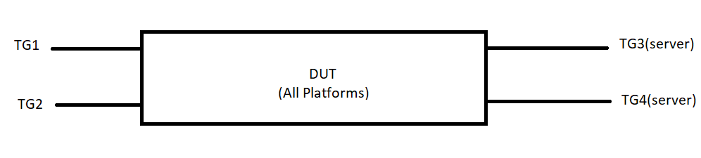

#  SQA Test Plan
#  IP Helper
#  SONiC 3.0 Project and Buzznik Release
[TOC]
# Test Plan Revision History
|Rev  | Date        | Author                 | Change Description      |
|:---:|:-----------:|:----------------------:|:-----------------------:|
| 0.1  | 11/05/2019 | SreenivasulaReddy V    | Initial version         |

# List of Reviewers
| Function | Name                     |
| :------: | :----------------------: |
|   Dev    | Kiran Kumar Kella        |
|   TA     | Kalyan Vadlamani         |
|   QA     | Giri Babu Sajja          |

# List of Approvers
| Function |         Name          | Date Approved |
| :------: | :-------------------: | :-----------: |
|   Dev    | Kiran Kumar Kella     |               |
|   QA     | Giri Babu Sajja       |               |

# Definition/Abbreviation
| **Term** |**Meaning**  |
| -------- |-----------------------------------   |
| TFTP     |Trivial File Transfer Protocol        |
| DNS      |Domain Name System                    |
| NTP      |Network Time Protocol                 |
| VRF	   |Trivial Virtual Routing and Forwarding|

# Feature Overview
Relaying of UDP broadcast packets as unicast packets to the configured server using configured IP Helper address.Hosts in a VLAN send UDP broadcasts on ports like TFTP, DNS, NTP, NetBIOS and custom UDP ports, where the unicast server is not known to the hosts. The Router in the VLAN that behaves as the relay helps in forwarding the requests from the hosts to the configured servers. Helper addresses reside in a different VLAN or Routing domain than the hosts.Configuration of IP Helper addresses on all L3 routing interfaces including Physical Ethernet, PortChannel and VLAN.

# Test Approach
1.Below items will be part of module config
 -Routing connectivity between DUT and TG's(server)
 -TG streams for UDP traffic simulation.
 -Ip Helper Address configuration
  
2.Tests covered
RtIpHeAdFn001,RtIpHeAdFn002,RtIpHeAdFn003,RtIpHeAdFn004,RtIpHeAdFn005,RtIpHeAdFn006,RtIpHeAdFn007,RtIpHeAdFn008,RtIpHeAdFn009,RtIpHeAdFn010 RtIpHeAdFn011,RtIpHeAdFn012,RtIpHeAdFn013,RtIpHeAdFn014,RtIpHeAdFn015,RtIpHeAdNt001,RtIpHeAdNt002,RtIpHeAdNt003,RtIpHeAdSc001.

3.To reduce run time,Ip Helper warmboot,cold boot,fastboot tests are covered in separate files in routing folder.

# 1 Test Focus Areas
## 1.1 Functional Testing 
  - IP Helper address functionality on all L3 routing interfaces including Physical Ethernet, PortChannel and VLAN.
  - IP Helper address functionality on default and custom UDP ports to be relayed.
  - IP Helper address reachable via a default and user VRF domains.
  - Rate limiting of incoming UDP broadcast traffic.

## 1.2 Negative Testing 
  - UDP broadcast Packet validation,the packets are not relayed if validation fails.

## 1.3 Reboot/Config Testing  
  - Warm reboot
  - Config save and reload
  - Fast-boot
  - DHCP Relay docker restart

## 1.4 Scale and Performance Testing
  - IP helper address functionality with Max supported helper addresses.

  
# 2 Topologies
## 2.1 Topology 1

# 3 Test  Case and Objectives

## 3.1 Functional

### 3.1.1 With global UDP forwarding enabled, verify that the relay is happening for all the default UDP ports when IP Helper address reachable via default VRF domain.
| **Test ID**    | **RtIpHeAdFn001**                                              |
| -------------- | :----------------------------------------------------------- |
| **Test Name**  | **With global UDP forwarding enabled, verify that the relay is happening for all the default UDP ports when IP Helper address reachable via default VRF domain.** |
| **Test Setup** | **Topology**                                                 |
| **Type**       | **Functional**    
| **Steps**      | **Procedure: 1)Bring up the DUT with factory defaults and needed routing config. 2)Enable global UDP forwarding. ex:config ip forward_protocol udp enable/disable 3)Configure IP helper address on client connected interface when IP Helper address is reachable via default VRF domain. ex:config interface ip helper-address add <interface-name> <ip-address> [-vrf <vrf-name]. 4)From TG(client side) send broadcast UDP traffic with UDP port number 69 (TFTP).  5) Observe that broadcast UDP traffic is relayed to helper address. 6)verify that the relay statistics are incremented properly. ex:show ip helper-address statistics Ethernet24 . 7)clear relay statistics and verify that the statistics are cleared. 8)Repeat step 4-7 steps for broadcast UDP traffic with UDP port numbers DNS (port 53),NTP (37),NetBIOS Name Server (port 137),NetBIOS Datagram Server (port 138),TACACS service (port 49) Expected Result: 1) verify that configuration is successful. 2) verify that configuration is successful. 3) Verify config is sucessful. 4) verify that configuration is successful. 5) Verify relaying of UDP broadcast packets as unicast packets to the configured server using configured IP Helper address. 6)verify that respective relay statistics are incremented properly. 7)verify that the statistics are cleared. 8)Verify relaying of UDP broadcast packets as unicast packets to the configured server using configured IP Helper address.** |

### 3.1.2 With global UDP forwarding enabled, verify that the relay is happening for all the default UDP ports when IP Helper address reachable via non-default VRF domain .

| **Test ID**    | **RtIpHeAdFn002**                                              |
| -------------- | :----------------------------------------------------------- |
| **Test Name**  | **With global UDP forwarding enabled, verify that the relay is happening for all the default UDP ports when IP Helper address reachable via non-default VRF domain.** |
| **Test Setup** | **Topology**                                                 |
| **Type**       | **Functional**                                               |
| **Steps**      | **Procedure: 1)Bring up the DUT with factory defaults and needed routing config. 2)Enable global UDP forwarding. ex:config ip forward_protocol udp enable/disable 3)Configure IP helper address on client connected interface when IP Helper address is reachable via non default VRF domain. ex:config interface ip helper-address add <interface-name> <ip-address> [-vrf <vrf-name]. 4)From TG(client side) send broadcast UDP traffic with UDP port number 69 (TFTP).  5) Observe that broadcast UDP traffic is relayed to helper address. 6)verify that the relay statistics are incremented properly. ex:show ip helper-address statistics Ethernet24 . 7)clear relay statistics and verify that the statistics are cleared. 8)Repeat step 4-7 steps for broadcast UDP traffic with UDP port numbers DNS (port 53),NTP (37),NetBIOS Name Server (port 137),NetBIOS Datagram Server (port 138),TACACS service (port 49) Expected Result: 1) verify that configuration is successful. 2) verify that configuration is successful. 3) Verify config is sucessful. 4) verify that configuration is successful. 5) Verify relaying of UDP broadcast packets as unicast packets to the configured server using configured IP Helper address. 6)verify that respective relay statistics are incremented properly. 7)verify that the statistics are cleared. 8)Verify relaying of UDP broadcast packets as unicast packets to the configured server using configured IP Helper address.** |
 

### 3.1.3 With global UDP forwarding enabled, verify that the relay is happening for all the default UDP ports when IP Helper address configured on Port Channel routing interface .

| **Test ID**    | **RtIpHeAdFn003**                                              |
| -------------- | :----------------------------------------------------------- |
| **Test Name**  | **With global UDP forwarding enabled, verify that the relay is happening for all the default UDP ports when IP Helper address configured on Port Channel routing interface .** |
| **Test Setup** | **Topology**                                                 |
| **Type**       | **Functional**                                               |
| **Steps**      | **Procedure: 1)Bring up the DUT with factory defaults and needed routing config. 2)Enable global UDP forwarding. ex:config ip forward_protocol udp enable/disable 3)Configure IP helper address on client connected Port Channel routing interface when IP Helper address is reachable via default/non default VRF domain. ex:config interface ip helper-address add <interface-name> <ip-address> [-vrf <vrf-name]. 4)From TG(client side) send broadcast UDP traffic with UDP port number 69 (TFTP).  5) Observe that broadcast UDP traffic is relayed to helper address. 6)verify that the relay statistics are incremented properly. ex:show ip helper-address statistics Ethernet24 . 7)clear relay statistics and verify that the statistics are cleared. Expected Result: 1) verify that configuration is successful. 2) verify that configuration is successful. 3) Verify config is sucessful. 4) verify that configuration is successful. 5) Verify relaying of UDP broadcast packets as unicast packets to the configured server using configured IP Helper address. 6)verify that respective relay statistics are incremented properly. 7)verify that the statistics are cleared.** |

 
### 3.1.4 With global UDP forwarding enabled, verify that the relay is happening for all the default UDP ports when IP Helper address configured on Vlan routing interface .

| **Test ID**    | **RtIpHeAdFn004**                                              |
| -------------- | :----------------------------------------------------------- |
| **Test Name**  | **With global UDP forwarding enabled, verify that the relay is happening for all the default UDP ports when IP Helper address configured on Vlan routing interface .** |
| **Test Setup** | **Topology**                                                 |
| **Type**       | **Functional**                                               |
| **Steps**      | **Procedure: 1)Bring up the DUT with factory defaults and needed routing config. 2)Enable global UDP forwarding. ex:config ip forward_protocol udp enable/disable 3)Configure IP helper address on client connected Vlan routing interface when IP Helper address is reachable via default/non default VRF domain. ex:config interface ip helper-address add <interface-name> <ip-address> [-vrf <vrf-name]. 4)From TG(client side) send broadcast UDP traffic with UDP port number 69 (TFTP).  5) Observe that broadcast UDP traffic is relayed to helper address. 6)verify that the relay statistics are incremented properly. ex:show ip helper-address statistics Ethernet24 . 7)clear relay statistics and verify that the statistics are cleared. 8)Repeat step 4-7 steps for broadcast UDP traffic with UDP port numbers DNS (port 53),NTP (37),NetBIOS Name Server (port 137),NetBIOS Datagram Server (port 138),TACACS service (port 49) Expected Result: 1) verify that configuration is successful. 2) verify that configuration is successful. 3) Verify config is sucessful. 4) verify that configuration is successful. 5) Verify relaying of UDP broadcast packets as unicast packets to the configured server using configured IP Helper address. 6)verify that respective relay statistics are incremented properly. 7)verify that the statistics are cleared. 8)Verify relaying of UDP broadcast packets as unicast packets to the configured server using configured IP Helper address.** |
 
### 3.1.5 Configure UDP forwarding for custom UDP ports and verify that the relay is happening for the port.

| **Test ID**    | **RtIpHeAdFn005**                                              |
| -------------- | :----------------------------------------------------------- |
| **Test Name**  | **Configure UDP forwarding for custom UDP ports and verify that the relay is happening for the port.** |
| **Test Setup** | **Topology**                                                 |
| **Type**       | **Functional**                                               |
| **Steps**      | **Procedure: 1)Bring up the DUT with factory defaults and needed routing config. 2)Enable global UDP forwarding. ex:config ip forward_protocol udp enable/disable 3)Configure client connected interface as Vlan routing interface and configure 2 IP helper addresses on vlan routing interface when IP Helper address is reachable . ex:config interface ip helper-address add <interface-name> <ip-address> [-vrf <vrf-name]. 4)Configure UDP forwarding for custom UDP ports  ex:config ip forward_protocol udp add {[tftp/dns/ntp/netbios-name-server/netbios-datagram-server/tacacs] <port>} 5)From TG(client side) send broadcast UDP traffic with custom UDP port numbers.  6) Observe that broadcast UDP traffic is relayed to helper address. 7)verify that the relay statistics are incremented properly. ex:show ip helper-address statistics Ethernet24 . Expected Result: 1) verify that configuration is successful. 2) verify that configuration is successful. 3) Verify config is sucessful. 4) verify that configuration is successful. 5) Verify relaying of UDP broadcast packets as unicast packets to the configured server using configured IP Helper address. 6)verify that respective relay statistics are incremented properly.** |
 

### 3.1.6 Configure multiple helper addresses on an interface and verify that packets are relayed to all the configured helper addresses.

| **Test ID**    | **RtIpHeAdFn006**                                              |
| -------------- | :----------------------------------------------------------- |
| **Test Name**  | **Configure multiple helper addresses on an interface and verify that packets are relayed to all the configured helper addresses.** |
| **Test Setup** | **Topology**                                                 |
| **Type**       | **Functional**                                               |
| **Steps**      | **Procedure: 1)Bring up the DUT with factory defaults and needed routing config. 2)Enable global UDP forwarding. ex:config ip forward_protocol udp enable/disable 3)Configure client connected interface as Vlan routing interface and configure 2 IP helper addresses on vlan routing interface when IP Helper address is reachable . ex:config interface ip helper-address add <interface-name> <ip-address> [-vrf <vrf-name]. 4)Configure UDP forwarding for UDP ports  ex:config ip forward_protocol udp add {[tftp/dns/ntp/netbios-name-server/netbios-datagram-server/tacacs] <port>} 5)From TG(client side) send broadcast UDP traffic with UDP port numbers.  6) Observe that broadcast UDP traffic is relayed to configured ip helper addresses. 7)verify that the relay statistics are incremented properly. ex:show ip helper-address statistics Ethernet24. Expected Result: 1) verify that configuration is successful. 2) verify that configuration is successful. 3) Verify config is sucessful. 4) verify that configuration is successful. 5) Verify relaying of UDP broadcast packets as unicast packets to the configured server using configured IP Helper address. 6)verify that respective relay statistics are incremented properly.** |

### 3.1.7 Verify that IPv4 broadcast packets other than UDP are not relayed.

| **Test ID**    | **RtIpHeAdFn007**                                              |
| -------------- | :----------------------------------------------------------- |
| **Test Name**  | **Verify that IPv4 broadcast packets other than UDP are not relayed.** |
| **Test Setup** | **Topology**                                                 |
| **Type**       | **Functional**                                               |
| **Steps**      | **Procedure: 1)Bring up the DUT with factory defaults and needed routing config. 2)Enable global UDP forwarding. ex:config ip forward_protocol udp enable/disable 3)Configure client connected interface as Vlan routing interface and configure 2 IP helper addresses on vlan routing interface when IP Helper address is reachable . ex:config interface ip helper-address add <interface-name> <ip-address> [-vrf <vrf-name]. 4)Configure UDP forwarding for UDP ports  ex:config ip forward_protocol udp add {[tftp/dns/ntp/netbios-name-server/netbios-datagram-server/tacacs] <port>} 5)From TG(client side) send broadcast non UDP traffic.  6) Observe that broadcast non UDP traffic is not relayed as traffic is not UDP. 7)verify that the relay statistics are not incremented . ex:show ip helper-address statistics Ethernet24. Expected Result: 1) verify that configuration is successful. 2) verify that configuration is successful. 3) Verify config is sucessful. 4) verify that configuration is successful. 5)Verify that IPv4 broadcast packets other than UDP are not relayed. 7)verify that the relay statistics are not incremented.** |

### 3.1.8 Verify IP Helper does not relay the DHCP broadcast packets.

| **Test ID**    | **RtIpHeAdFn008**                                              |
| -------------- | :----------------------------------------------------------- |
| **Test Name**  | **Verify IP Helper does not relay the DHCP broadcast packets.** |
| **Test Setup** | **Topology**                                                 |
| **Type**       | **Functional**                                                   |
| **Steps**      | **Procedure: 1)Bring up the DUT with factory defaults and needed routing config. 2)Enable global UDP forwarding. ex:config ip forward_protocol udp enable/disable 3)Configure client connected interface as Vlan routing interface and configure 2 IP helper addresses on vlan routing interface when IP Helper address is reachable . ex:config interface ip helper-address add <interface-name> <ip-address> [-vrf <vrf-name]. 4)Configure UDP forwarding for UDP ports  ex:config ip forward_protocol udp add {[tftp/dns/ntp/netbios-name-server/netbios-datagram-server/tacacs] <port>} 5)From TG(client side) send dhcp broadcast packets .  6)Observe that dhcp broadcast UDP traffic is not relayed to helper address. 7)verify that the relay statistics are not incremented . ex:show ip helper-address statistics Ethernet24. Expected Result: 1) verify that configuration is successful. 2) verify that configuration is successful. 3) Verify config is sucessful. 4) verify that configuration is successful. 5)Observe that dhcp broadcast UDP traffic is not relayed to helper address. 7)verify that the relay statistics are not incremented.** |

### 3.1.9 Exclude an UDP port from being relayed to, and verify that the relay is not happening for that port.

| **Test ID**    | **RtIpHeAdFn009**                                              |
| -------------- | :----------------------------------------------------------- |
| **Test Name**  | **Exclude an UDP port from being relayed to, and verify that the relay is not happening for that port.** |
| **Test Setup** | **Topology**                                                 |
| **Type**       | **Functional**                                               |
| **Steps**      | **Procedure: 1)Bring up the DUT with factory defaults and needed routing config. 2)Enable global UDP forwarding. ex:config ip forward_protocol udp enable/disable 3)Configure client connected interface as Vlan routing interface and configure 2 IP helper addresses on vlan routing interface when IP Helper address is reachable . ex:config interface ip helper-address add <interface-name> <ip-address> [-vrf <vrf-name]. 4)Configure UDP forwarding for UDP ports  ex:config ip forward_protocol udp add {[tftp/dns/ntp/netbios-name-server/netbios-datagram-server/tacacs]<port>} 5)From TG(client side) send broadcast  UDP traffic with custom UDP port number which is excluded for relay.  6)Verify that  broadcast packets are not relayed as UDP port is in exclude state for relay. 7)verify that the relay statistics are not incremented . ex:show ip helper-address statistics Ethernet24. Expected Result: 1) verify that configuration is successful. 2) verify that configuration is successful. 3) Verify config is sucessful. 4) verify that configuration is successful. 5)Observe that broadcast UDP traffic is not relayed to  helper address. 7)verify that the relay statistics are not incremented.** |

### 3.1.10 Verify UDP traffic relay when destination IP address is subnet broadcast of the receiving interface (for eg., 10.10.10.255 for the interface configured with subnet IP 10.10.10.10/24).

| **Test ID**    | **RtIpHeAdFn010**                                              |
| -------------- | :----------------------------------------------------------- |
| **Test Name**  | **Verify UDP traffic relay when destination IP address is subnet broadcast of the receiving interface (for eg., 10.10.10.255 for the interface configured with subnet IP 10.10.10.10/24).** |
| **Test Setup** | **Topology**                                                 |
| **Type**       | **Functional**                                                   |
| **Steps**      | **Procedure: 1)Bring up the DUT with factory defaults and needed routing config. 2)Enable global UDP forwarding. ex:config ip forward_protocol udp enable/disable 3)Configure client connected interface as Vlan routing interface and configure 2 IP helper addresses on vlan routing interface when IP Helper address is reachable . ex:config interface ip helper-address add <interface-name> <ip-address> [-vrf <vrf-name]. 4)Configure UDP forwarding for  UDP ports  ex:config ip forward_protocol udp add {[tftp/dns/ntp/netbios-name-server/netbios-datagram-server/tacacs] <port>} 5)From TG(client side) send broadcast UDP traffic with destination ip address as subnet broadcast of the receiving interface (for eg., 10.10.10.255 for the interface configured with subnet IP 10.10.10.10/24).  6) Observe that broadcast UDP traffic is relayed to helper address. 7)verify that the relay statistics are incremented properly. ex:show ip helper-address statistics Ethernet24 . Expected Result: 1) verify that configuration is successful. 2) verify that configuration is successful. 3) Verify config is sucessful. 4) verify that configuration is successful. 5) Verify relaying of UDP broadcast packets as unicast packets to the configured server using configured IP Helper address. 6)verify that respective relay statistics are incremented properly.** |

### 3.1.11 verify rate limiting functionality of incoming UDP broadcast traffic.

| **Test ID**    | **RtIpHeAdFn011**                                              |
| -------------- | :----------------------------------------------------------- |
| **Test Name**  | **verify rate limiting functionality of incoming UDP broadcast traffic.** |
| **Test Setup** | **Topology**                                                 |
| **Type**       | **Functional**                                                   |
| **Steps**      | **Procedure: 1)Bring up the DUT with factory defaults and needed routing config. 2)Enable global UDP forwarding. ex:config ip forward_protocol udp enable/disable 3)Configure client connected interface as Vlan routing interface and configure 2 IP helper addresses on vlan routing interface when IP Helper address is reachable . ex:config interface ip helper-address add <interface-name> <ip-address> [-vrf <vrf-name]. 4)Config UDP broadcast traffic rate limit to non default value. ex:config ip forward_protocol udp rate_limit <value-in-pps> 5)From TG(client side) send broadcast UDP traffic rate with more than configured rate limit  Expected Result: 1) verify that configuration is successful. 2) verify that configuration is successful. 3) Verify config is sucessful. 4) verify that configuration is successful. 5) Verify broadcast UDP traffic is rate limited as per configured value.** |

## 3.2 Negative
### 3.2.1 Send packets with TTL=1 and verify that the packets are not relayed.

| **Test ID**    | **RtIpHeAdNt001**                                              |
| -------------- | :----------------------------------------------------------- |
| **Test Name**  | **Send packets with TTL=1 and verify that the packets are not relayed.** |
| **Test Setup** | **Topology**                                                 |
| **Type**       | **Negative**                                                 |
| **Steps**      | **Procedure: 1)Bring up the DUT with factory defaults and needed routing config. 2)Enable global UDP forwarding. ex:config ip forward_protocol udp enable/disable 3)Configure client connected interface as Vlan routing interface and configure 2 IP helper addresses on vlan routing interface when IP Helper address is reachable . ex:config interface ip helper-address add <interface-name> <ip-address> [-vrf <vrf-name]. 4)Configure UDP forwarding for UDP ports  ex:config ip forward_protocol udp add {[tftp/dns/ntp/netbios-name-server/netbios-datagram-server/tacacs] <port>} 5)From TG(client side) send broadcast  UDP traffic with TTL=1.  6) Observe that broadcast UDP traffic is not relayed to  helper address. 7)verify that the relay statistics are not incremented . ex:show ip helper-address statistics Ethernet24. Expected Result: 1) verify that configuration is successful. 2) verify that configuration is successful. 3) Verify config is sucessful. 4) verify that configuration is successful. 5)Verify that  broadcast packets are not relayed as TTL=1. 6)verify that the relay statistics are not incremented.** |

### 3.2.2 Verify that the relay is not working if the IP Helper address is not reachable in a default or non-default VRF routing domain.

| **Test ID**    | **RtIpHeAdNt002**                                              |
| -------------- | :----------------------------------------------------------- |
| **Test Name**  | **Verify that the relay is not working if the IP Helper address is not reachable in a default or non-default VRF routing domain.** |
| **Test Setup** | **Topology**                                                 |
| **Type**       | **Negative**                                                 |
| **Steps**      | **Procedure: 1)Bring up the DUT with factory defaults and needed routing config. 2)Enable global UDP forwarding. ex:config ip forward_protocol udp enable/disable 3)Configure IP helper address on client connected interface when IP Helper address is not reachable via default/non default VRF domain. ex:config interface ip helper-address add <interface-name> <ip-address> [-vrf <vrf-name]. 4)Configure UDP forwarding for UDP ports  ex:config ip forward_protocol udp add {[tftp/dns/ntp/netbios-name-server/netbios-datagram-server/tacacs] <port>} 5)From TG(client side) send broadcast  UDP traffic.  6) Observe that broadcast UDP traffic is not relayed to  helper address. 7)verify that the relay statistics are not incremented . ex:show ip helper-address statistics Ethernet24. Expected Result: 1) verify that configuration is successful. 2) verify that configuration is successful. 3) Verify config is sucessful. 4) verify that configuration is successful. 5)Verify that  broadcast packets are not relayed . 6)verify that the relay statistics are not incremented.** |

### 3.2.3 Verify that the relay is not working if the VRF of the configured Helper address does not exist.

| **Test ID**    | **RtIpHeAdNt003**                                              |
| -------------- | :----------------------------------------------------------- |
| **Test Name**  | **Verify that the relay is not working if the VRF of the configured Helper address does not exist.** |
| **Test Setup** | **Topology**                                                 |
| **Type**       | **Negative**                                                 |
| **Steps**      | **Procedure: 1)Bring up the DUT with factory defaults and needed routing config. 2)Enable global UDP forwarding. ex:config ip forward_protocol udp enable/disable 3)Configure IP helper address on client connected interface when IP Helper address is configured wit non existing VRF domain. ex:config interface ip helper-address add <interface-name> <ip-address> [-vrf <vrf-name]. 4)Configure UDP forwarding for UDP ports  ex:config ip forward_protocol udp add {[tftp/dns/ntp/netbios-name-server/netbios-datagram-server/tacacs] <port>} 5)From TG(client side) send broadcast  UDP traffic .  6) Observe that broadcast UDP traffic is not relayed to  helper address. 7)verify that the relay statistics are not incremented . ex:show ip helper-address statistics Ethernet24. Expected Result: 1) verify that configuration is successful. 2) verify that configuration is successful. 3) Verify config is sucessful. 4) verify that configuration is successful. 5)Verify that  broadcast packets are not relayed . 6)verify that the relay statistics are not incremented.** |

## 3.3 Reboot/Reload/Upgrade Test Cases

### 3.3.1 Verify Ip helper functionality with valid startup configuration and after normal/cold reboot

| **Test ID**    | **RtIpHeAdFn012**                                              |
| -------------- | :----------------------------------------------------------- |
| **Test Name**  | **Verify Ip helper functionality with valid startup configuration and after normal/cold reboot** |
| **Test Setup** | **Topology**                                                 |
| **Type**       | **Reboot**                                                   |
| **Steps**      | **Procedure: 1)Bring up the DUT with factory defaults and needed routing config. 2)Enable global UDP forwarding. ex:config ip forward_protocol udp enable/disable 3)Configure IP helper address on client connected interface when IP Helper address is reachable via default VRF domain. ex:config interface ip helper-address add <interface-name> <ip-address> [-vrf <vrf-name]. 4)From TG(client side) send broadcast UDP traffic with UDP port number 69 (TFTP). 5)save and reboot the DUT  6) Observe that broadcast UDP traffic is relayed to helper address. 7)verify that the relay statistics are incremented properly. ex:show ip helper-address statistics Ethernet24 . 8)clear relay statistics and verify that the statistics are cleared. Expected Result: 1) verify that configuration is successful. 2) verify that configuration is successful. 3) Verify config is sucessful. 4) verify that configuration is successful. 5)DUT should retain the config after reboot 6) Verify relaying of UDP broadcast packets as unicast packets to the configured server using configured IP Helper address. 7)verify that respective relay statistics are incremented properly. 8)verify that the statistics are cleared.** |

### 3.3.2 Verify Ip helper functionality with valid startup configuration and after fast reboot

| **Test ID**    | **RtIpHeAdFn013**                                              |
| -------------- | :----------------------------------------------------------- |
| **Test Name**  | **Verify Ip helper functionality with valid startup configuration and after fast reboot** |
| **Test Setup** | **Topology**                                                 |
| **Type**       | **Reboot**                                                   |
| **Steps**      | **Procedure: 1)Bring up the DUT with factory defaults and needed routing config. 2)Enable global UDP forwarding. ex:config ip forward_protocol udp enable/disable 3)Configure IP helper address on client connected interface when IP Helper address is reachable via default VRF domain. ex:config interface ip helper-address add <interface-name> <ip-address> [-vrf <vrf-name]. 4)From TG(client side) send broadcast UDP traffic with UDP port number 69 (TFTP). 5)save and fast reboot the DUT  6) Observe that broadcast UDP traffic is relayed to helper address. 7)verify that the relay statistics are incremented properly. ex:show ip helper-address statistics Ethernet24 . 8)clear relay statistics and verify that the statistics are cleared. Expected Result: 1) verify that configuration is successful. 2) verify that configuration is successful. 3) Verify config is sucessful. 4) verify that configuration is successful. 5)DUT should retain the config after fast reboot 6) Verify relaying of UDP broadcast packets as unicast packets to the configured server using configured IP Helper address. 7)verify that respective relay statistics are incremented properly. 8)verify that the statistics are cleared.** |

### 3.3.3 Verify Ip helper functionality with valid startup configuration and after warm reboot

| **Test ID**    | **RtIpHeAdFn014**                                              |
| -------------- | :----------------------------------------------------------- |
| **Test Name**  | **Verify Ip helper functionality with valid startup configuration and after warm reboot** |
| **Test Setup** | **Topology**                                                 |
| **Type**       | **Reboot**                                                   |
| **Steps**      | **Procedure: 1)Bring up the DUT with factory defaults and needed routing config. 2)Enable global UDP forwarding. ex:config ip forward_protocol udp enable/disable 3)Configure IP helper address on client connected interface when IP Helper address is reachable via default VRF domain. ex:config interface ip helper-address add <interface-name> <ip-address> [-vrf <vrf-name]. 4)From TG(client side) send broadcast UDP traffic with UDP port number 69 (TFTP). 5)save and warm reboot the DUT  6) Observe that broadcast UDP traffic is relayed to helper address. 7)verify that the relay statistics are incremented properly. ex:show ip helper-address statistics Ethernet24 . 8)clear relay statistics and verify that the statistics are cleared. Expected Result: 1) verify that configuration is successful. 2) verify that configuration is successful. 3) Verify config is sucessful. 4) verify that configuration is successful. 5)IP Helper address is stateless config, so traffic loss is expected during Warm boot 6) Verify relaying of UDP broadcast packets as unicast packets to the configured server using configured IP Helper address. 7)verify that respective relay statistics are incremented properly. 8)verify that the statistics are cleared.** |

### 3.3.4 Verify that Ip helper functionality after dhcp relay docker restart.

| **Test ID**    | **RtIpHeAdFn015**                                              |
| -------------- | :----------------------------------------------------------- |
| **Test Name**  | **Verify that dhcp relay docker can be stopped and restarted and check that Ip helper address functionality.** |
| **Test Setup** | **Topology**                                                 |
| **Type**       | **Reboot**                                               |
| **Steps**      | **Procedure: 1)Bring up the DUT with factory defaults and needed routing config. 2)Enable global UDP forwarding. ex:config ip forward_protocol udp enable/disable 3)Configure IP helper address on client connected interface when IP Helper address is reachable via default VRF domain. ex:config interface ip helper-address add <interface-name> <ip-address> [-vrf <vrf-name]. 4)From TG(client side) send broadcast UDP traffic with UDP port number 69 (TFTP). 5)perform dhcp relay docker restart.  6) Observe that broadcast UDP traffic is relayed to helper address. 7)verify that the relay statistics are incremented properly. ex:show ip helper-address statistics Ethernet24 . 8)clear relay statistics and verify that the statistics are cleared. Expected Result: 1) verify that configuration is successful. 2) verify that configuration is successful. 3) Verify config is sucessful. 4) verify that configuration is successful. 5)DUT should not crash or hang after docker restart 6) Verify relaying of UDP broadcast packets as unicast packets to the configured server using configured IP Helper address. 7)verify that respective relay statistics are incremented properly. 8)verify that the statistics are cleared.** |

## 3.4 Stress,Scale and Performance

### 3.4.1  Verify that max IP Helper addresses are configured on the routing interfaces in the system and the forwarding of the UDP broadcast packets received on all the routing interfaces is happening.

| **Test ID**    | **FtOpSfFn005**                                              |
| -------------- | :----------------------------------------------------------- |
| **Test Name**  |**Verify that max IP Helper addresses are configured on the routing interfaces in the system and the forwarding of the UDP broadcast packets received on all the routing interfaces is happening.** |
| **Test Setup** | **Topology**                                                 |
| **Type**       | **Scalability**                                              |
| **Steps**      | **Procedure: 1)Bring up the DUT with factory defaults and needed routing config. 2)Enable global UDP forwarding. ex:config ip forward_protocol udp enable/disable 3)Configure max IP helper addresses on client connected interfaces when IP Helper address is reachable via default/non default VRF domain. ex:config interface ip helper-address add <interface-name> <ip-address> [-vrf <vrf-name]. 4)From TG(client side) send broadcast UDP traffic .  5) Observe that broadcast UDP traffic is  relayed to respective configured IP Helper addresses. 6)verify that the relay statistics are incremented properly. ex:show ip helper-address statistics Ethernet24 . 7)clear relay statistics and verify that the statistics are cleared. Expected Result: 1) verify that configuration is successful. 2) verify that configuration is successful. 3) Verify config is sucessful. 4) verify that configuration is successful. 5) Verify relaying of UDP broadcast packets as unicast packets to the configured server using configured IP Helper address. 6)verify that respective relay statistics are incremented properly. 7)verify that the statistics are cleared.** |

## 3.5 UI
N/A UI's will be covered as part of spytest infra.

## 4 Reference Links
<http://gerrit-lvn-07.lvn.broadcom.net:8083/plugins/gitiles/sonic/documents/+/refs/changes/29/13029/6/L3/ip_helper/ip_helper.md>