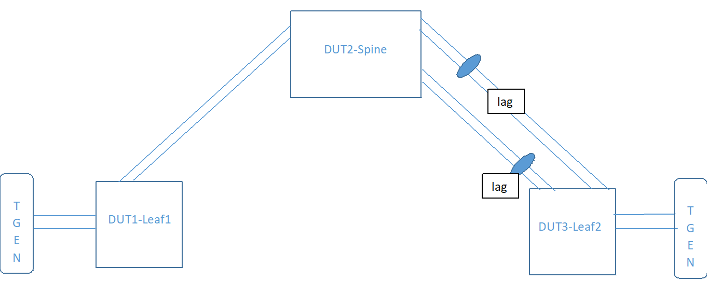

#  SQA Test Plan
# IP unnumbered Test Plan
#  SONiC 3.0 Project and Buzznik Release
[TOC]
# Test Plan Revision History
| Rev | Date | Author | Change Description |
|:---:|:-----------:|:------------------:|-----------------------------|
| 0.1 | 10/11/2019 | Manisha Joshi | Initial version |

# List of Reviewers
|  Function | Name |
|:---:|:-----------:|
| Dev | Praveen Hoskote Madhusudhana |
| SQA | Chandra Bhushan Singh |
| SQA | Hafis Saly |

# List of Approvers
|  Function | Name | Date Approved|
|:---:|:-----------:|:------------------:|
| Dev | Praveen Hoskote Madhusudhana |  |
| SQA | Hafis Saly | |

# Definition/Abbreviation
| **Term** | **Meaning**                     |
| -------- | ------------------------------- |
|     |        |

# Feature Overview

Unnumbered interface enables L3 processing on a point to point interface without explicitly configuring a unique IP address on it. IPv4 Unnumbered interface borrows IPv4 address from another L3 interface already configured on the router. This address is used as a source address in the L3 packets that are sent out of the unnumbered interface. The interface from which IPv4 address is borrowed is referred as *‘Donor’* interface and with this feature support, only Loopback interface is supported as Donor interface.

# 1 Test Focus Areas
This document covers test cases designed IPv4 unnumbered on SONiC 3.0 release.
Below is the link to  high level design of above features

IPv4 unnumbered: 

<http://gerrit-lvn-07.lvn.broadcom.net:8083/c/sonic/documents/+/12581>

# 2 Topologies
## 2.1 Topology 1

# 3 Test  Case and Objectives
## 3.1 **CLI**
### 3.1.1     Validate all IP unnumbered related CLI config/show commands

| Test ID | FtOpSoRoIPunFun001                                           |
|--------|:----------------|
| Test Name | Verify cli commands for IP unnumbered |
| Test Setup | Topology1 |
| Type | CLI |
| Steps | 1) Configure IP unnumbered and verify. 2) Remove the configuration and verify the config is removed 3) Add the configuration back and verify again |
## 3.2 **Functional**
#### 3.2.1	Verify unnumbered interface configuration on a physical interface along with arp, ping and trace route

| **Test    ID** | FtOpSoRoIPunFun002                                           |
| -------------- | ------------------------------------------------------------ |
| Test Name      | Verify unnumbered interface configuration on physical interface along with arp, ping and trace route |
| Test Setup     | Topology1                                                    |
| Type           | Functional                                                   |
| Steps          | 1) Configure loopback interface and assign an IPv4 addresses to it. 2) Configure IP unnumbered on a physical interface and verify 3) Remove the IP address on the loopback and verify the address is deleted 4) Add the IP address and verify again 5) Modify the IP address on the loopback interface and verify 6) Verify ARP, ping and trace route |

#### 3.2.2	Verify unnumbered interface configuration on a port channel along with arp, ping and trace route

| **Test    ID** | FtOpSoRoIPunFun003                                           |
| -------------- | ------------------------------------------------------------ |
| Test Name      | Verify unnumbered interface configuration on a port channel along with arp, ping and trace route |
| Test Setup     | Topology1                                                    |
| Type           | Functional                                                   |
| Steps          | 1) Configure loopback interface and assign an IPv4 and IPv6 address to it. 2) Configure IP unnumbered on a port channel and verify 3) Remove the IP address on the loopback and verify the address is deleted 4) Add the IP address and verify again 5) Modify the IP address on the loopback interface and verify 6) Deploy and un-deploy the port channel and re verify 7) Verify ARP, ping and trace route |

#### 3.2.3	Verify unnumbered interface configuration on a break out port

| **Test    ID** | FtOpSoRoIPunFun004                                           |
| -------------- | ------------------------------------------------------------ |
| Test Name      | Verify unnumbered interface configuration on a break out port |
| Test Setup     | Topology1                                                    |
| Type           | Functional                                                   |
| Steps          | 1) Configure loopback interface and assign an IPv4 and IPv6 address to it. 2) Configure unnumbered on a break out port and verify 3) Remove the IP address on the loopback and verify the address is deleted 4) Add the IP address and verify again 5) Modify the IP address on the loopback interface and verify 6)Remove and add the break-out configuration and verify again |

#### 3.2.4	Verify unnumbered interface after removing and adding the donor interface

| **Test    ID** | FtOpSoRoIPunFun005                                           |
| -------------- | ------------------------------------------------------------ |
| Test Name      | Verify unnumbered interface after removing and adding the donor interface |
| Test Setup     | Topology1                                                    |
| Type           | Functional                                                   |
| Steps          | 1) Configure loopback interface and assign an IPv4 and IPv6 address to it. 2) Configure unnumbered on a port channel.  4) Delete and add the loopback interface and verify unicast traffic over the unnumbered interfacae |

#### 3.2.5	Verify unnumbered interface with IPv6 address configured on that interface

| **Test    ID** | FtOpSoRoIPunFun006                                           |
| -------------- | ------------------------------------------------------------ |
| Test Name      | Verify unnumbered interface with IPv6 address configured on that interface |
| Test Setup     | Topology1                                                    |
| Type           | Functional                                                   |
| Steps          | 1) Configure loopback interface and assign an IPv4 and IPv6 address to it. 2) Configure unnumbered interface and manually configure .  4) Delete and add the loopback interface and verify traffic 5) Remove and add IPv6 address and verify it does not affect the unnumbered traffic |

#### 3.2.6	Verify unnumbered interface when the donor is having multiple addresses

| **Test    ID** | FtOpSoRoIPunFun007                                           |
| -------------- | ------------------------------------------------------------ |
| Test Name      | Verify IP unnumbered when the donor is having multiple addresses |
| Test Setup     | Topology1                                                    |
| Type           | Functional                                                   |
| Steps          | 1) Configure loopback interface and assign multiple IPv4 and IPv6 addresses. 2) Configure unnumbered interface 3) Verify all the IPv4 addresses are borrowed on the unnumbered interface. 4) Verify adding and removing IP addresses on the loopback interfaces affects the unnumbered interface as well |

#### 3.2.7	Verify multiple unnumbered interfaces with the same donor interface

| **Test    ID** | FtOpSoRoIPunFun008                                           |
| -------------- | ------------------------------------------------------------ |
| Test Name      | Verify multiple unnumbered interfaces having the same donor interface |
| Test Setup     | Topology1                                                    |
| Type           | Functional                                                   |
| Steps          | 1) Configure loopback interface and assign multiple IPv4 and IPv6 addresses. 2) Configure multiple unnumbered interface having the same donor 3) Verify if ARP is resolved for all the interfaces. 4)  Send traffic and verify |

#### 3.2.8	Verify unnumbered interface when we alter the donor interface

| **Test    ID** | FtOpSoRoIPunFun009                                           |
| -------------- | ------------------------------------------------------------ |
| Test Name      | Verify IPv4 unnumbered when we alter the donor interface     |
| Test Setup     | Topology1                                                    |
| Type           | Functional                                                   |
| Steps          | 1) Configure loopback interface and assign IPv4 and IPv6 addresses. 2) Configure multiple unnumbered interface having the same donor 3) Verify if ARP is resolved for all the interfaces. 4)  Send traffic and verify |

#### 3.2.9	Verify unnumbered interface for different subnets

| **Test    ID** | FtOpSoRoIPunFun010                                           |
| -------------- | ------------------------------------------------------------ |
| Test Name      | Verify unnumbered interface for different subnets            |
| Test Setup     | Topology1                                                    |
| Type           | Functional                                                   |
| Steps          | 1) Configure loopback interface and assign IPv4 and IPv6 addresses. 2) Configure unnumbered interface 3)Modify the subnets on the donor interface and verify that the unnumbered interface is not affected |

#### 3.2.10    Verify OSPF over unnumbered interface when the donor is also enabled with OSPF

| **Test    ID** | FtOpSoRoIPunFun011                                           |
| -------------- | ------------------------------------------------------------ |
| Test Name      | Verify OSPF over unnumbered interface when the donor is also enabled with OSPF |
| Test Setup     | Topology1                                                    |
| Type           | Functional                                                   |
| Steps          | 1) Configure loopback interface and assign IPv4 and IPv6 addresses. 2) Configure unnumbered interface 3) Configure OSPF on the loopback 4)  Verify OSPF neighbor table and verify both unnumbered interface and  loopback are present 5) Remove and add OSPF configuration on the loopback and verify the unnumbered interface is not affected. |

#### 3.2.11    Verify ECMP with OSPF over unnumbered interface

| **Test    ID** | FtOpSoRoIPunFun012                                           |
| -------------- | ------------------------------------------------------------ |
| Test Name      | Verify ECMP with OSPF over unnumbered interface              |
| Test Setup     | Topology1                                                    |
| Type           | Functional                                                   |
| Steps          | 1) Configure loopback interface and assign IPv4 and IPv6 addresses. 2) Configure multiple unnumbered interface and have the same donor interface 3) Send traffic and verify ECMP. 4) Modify the donor interface for one of the unnumbered interface and verify traffic again. |

#### 3.2.12	Verify OSPF with unnumbered interface on one side and a normal interface on the other side

| **Test    ID** | FtOpSoRoIPunFun013                                           |
| -------------- | ------------------------------------------------------------ |
| Test Name      | Verify OSPF with unnumbered interface on one side and a normal interface on the other side |
| Test Setup     | Topology1                                                    |
| Type           | Functional                                                   |
| Steps          | 1) Configure loopback interface and assign IPv4 and IPv6 addresses. 2) Configure unnumbered interface 3)Configure the other end as a normal and verify  OSPF. 3) Modify the subnet of the normal interface to same and different subnets and verify 4) Send traffic and verify |

#### 3.2.13	Verify OSPF with unnumbered interface after clear neighbors and removing and adding router ospf

| **Test    ID** | FtOpSoRoIPunFun014                                           |
| -------------- | ------------------------------------------------------------ |
| Test Name      | Verify OSPF with unnumbered interface after clear neighbors and removing and adding router ospf |
| Test Setup     | Topology1                                                    |
| Type           | Functional                                                   |
| Steps          | 1) Configure loopback interface and assign IPv4 and IPv6 addresses. 2) Configure unnumbered interface 3) Clear OSPF neighbors, clear routes and verify 4)Remove router OSPF globally and verify |

#### 3.2.14	Verify OSPF when the donor interface IP is the router-id

| **Test    ID** | FtOpSoRoIPunFun015                                           |
| -------------- | ------------------------------------------------------------ |
| Test Name      | Verify OSPF when the donor interface IP is the router-id     |
| Test Setup     | Topology1                                                    |
| Type           | Functional                                                   |
| Steps          | 1) Configure loopback interface and assign IPv4 and IPv6 addresses. 2) Configure unnumbered interface 3) Configure OSPF without the router and verify donor IP is taken as the router IP 4) Send traffic and verify 5)Modify the loopback IP and verify both unnumbered interface and ospf |

#### 3.2.15	Verify L3 MTU with unnumbered interface 

| **Test    ID** | FtOpSoRoIPunFun016                                           |
| -------------- | ------------------------------------------------------------ |
| Test Name      | Verify L3 MTU with unnumbered interface                      |
| Test Setup     | Topology1                                                    |
| Type           | Functional                                                   |
| Steps          | 1) Configure loopback interface and assign IPv4 and IPv6 addresses. 2) Configure unnumbered interface 3) Modify the IP MTU of the interface and verify |

#### 3.2.16	Verify OSPF BFD over unnumbered interface

| **Test    ID** | FtOpSoRoIPunFun017                                           |
| -------------- | ------------------------------------------------------------ |
| Test Name      | Verify OSPF BFD over unnumbered interface                    |
| Test Setup     | Topology1                                                    |
| Type           | Functional                                                   |
| Steps          | 1) Configure loopback interface and assign IPv4 and IPv6 addresses. 2) Configure unnumbered interface 3) configure BFD over OSPF and verify 4) Modify the BFD timer and verify the session |

#### 3.2.17	Verify BGP over unnumbered interface

| **Test    ID** | FtOpSoRoIPunFun018                                           |
| -------------- | ------------------------------------------------------------ |
| Test Name      | Verify BGP over unnumbered interface                         |
| Test Setup     | Topology1                                                    |
| Type           | Functional                                                   |
| Steps          | 1) Configure loopback interface and assign IPv4 and IPv6 addresses. 2) Configure unnumbered interface 3) Configure the unnumbered interfaces as neighbors iBGP neighbors and verify |

#### 3.2.18	Verify multi-hop BGP session over unnumbered interface

| **Test    ID** | FtOpSoRoIPunFun019                                           |
| -------------- | ------------------------------------------------------------ |
| Test Name      | Verify multi-hop BGP session over unnumbered interface       |
| Test Setup     | Topology1                                                    |
| Type           | Functional                                                   |
| Steps          | 1) Configure loopback interface and assign IPv4 and IPv6 addresses. 2) Configure unnumbered interface 3) Configure the unnumbered interfaces as BGP 4)Configure the loopback interfaces as BGP neighbors and verify |

#### 3.2.19	Verify BGP BFD over unnumbered interface

| **Test    ID** | FtOpSoRoIPunFun020                                           |
| -------------- | ------------------------------------------------------------ |
| Test Name      | Verify BGP BFD over unnumbered interface                     |
| Test Setup     | Topology1                                                    |
| Type           | Functional                                                   |
| Steps          | 1) Configure loopback interface and assign IPv4 and IPv6 addresses. 2) Configure unnumbered interface 3) Configure the unnumbered interfaces as neighbors iBGP neighbors, add BFD and verify 4) Modify the BFD timers and reverify |

#### 3.2.20	Verify BGP over unnumbered interface after a clear neighbors and removing and adding router BGP

| **Test    ID** | FtOpSoRoIPunFun021                                           |
| -------------- | ------------------------------------------------------------ |
| Test Name      | Verify BGP over unnumbered interface after a clear neighbors and removing and adding router BGP |
| Test Setup     | Topology1                                                    |
| Type           | Functional                                                   |
| Steps          | 1) Configure loopback interface and assign IPv4 and IPv6 addresses. 2) Configure unnumbered interface 3) Configure the unnumbered interfaces as neighbors iBGP neighbors and verify 4) Clear BGP neighbors, clear routes remove and add router BGP and verify |

#### 3.2.21  Verify static route configuration with unnumbered interface as next hop

| **Test    ID** | FtOpSoRoIPunFun022                                           |
| -------------- | ------------------------------------------------------------ |
| Test Name      | Verify static route configuration with unnumbered interface as next hop |
| Test Setup     | Topology1                                                    |
| Type           | Functional                                                   |
| Steps          | 1) Configure loopback interface and assign IPv4 and IPv6 addresses. 2) Configure unnumbered interface 3) Configure static route where the next hop and originating IP address both are unnumbered interfaces. 4)Send traffic  and verify |

#### 3.2.22  Verify unnumbered interface is not bound to non default VRF

| **Test    ID** | FtOpSoRoIPunFun023                                           |
| -------------- | ------------------------------------------------------------ |
| Test Name      | Verify unnumbered interface is bound to non default VRF after IP address gets removed |
| Test Setup     | Topology1                                                    |
| Type           | Functional                                                   |
| Steps          | 1) Configure loopback interface and assign IPv4 and IPv6 addresses.  2) Configure a non-default vrf 3)Remove IP address from the interface 4) Configure unnumbered interface after this and verify it is associated with default vrf |

#### 3.2.23  Verify static routes, BGP, OSPF with different unnumbered interfaces and same donor interface

| **Test ID** | FtOpSoRoIPunFun024                                           |
| ----------- | ------------------------------------------------------------ |
| Test Name   | Verify static routes, BGP, OSPF with different unnumbered interfaces and same donor interface |
| Test Setup  | Topology1                                                    |
| Type        | Functional                                                   |
| Steps       | Configure 3 unnumbered interfaces  2) Configure static routes on some interfaces, BGP on some and ospf on some other interfaces and verify 3) Have same donor for all the protocols 4) Remove IP address fro donor, delete the loopback interface and verify |

## 3.3 Negative

#### 3.3.1  Verify IP addresses cannot be added to an unnumbered interface

| **Test    ID** | FtOpSoRoIPunFun025                                           |
| -------------- | ------------------------------------------------------------ |
| Test Name      | Verify IP addresses cannot be added to an unnumbered interface |
| Test Setup     | Topology1                                                    |
| Type           | Functional                                                   |
| Steps          | 1) Configure loopback interface and assign IPv4 and IPv6 addresses. 2) Configure unnumbered interface 3) Verify that adding an IP address to the interface fails |

#### 3.3.2  Verify unnumbered interface cannot have multiple donors at the same time

| **Test    ID** | FtOpSoRoIPunFun026                                           |
| -------------- | ------------------------------------------------------------ |
| Test Name      | Verify unnumbered interface cannot have multiple donors at the same time |
| Test Setup     | Topology1                                                    |
| Type           | Functional                                                   |
| Steps          | 1) Configure loopback interface and assign IPv4 and IPv6 addresses. 2) Configure unnumbered interface 3) Verify that unnumbered interface cannot have multiple donors at the same time |

#### 3.3.3  Verify various error messages for unnumbered

| **Test    ID** | FtOpSoRoIPunFun027                                           |
| -------------- | ------------------------------------------------------------ |
| Test Name      | Verify various error messages for unnumbered                 |
| Test Setup     | Topology1                                                    |
| Type           | Functional                                                   |
| Steps          | 1) Configure loopback interface and assign IPv4 and IPv6 addresses. 2) Configure unnumbered interface 3) Verify error messages |

## 3.4 Reboot
#### 3.4.1    Verify unnumbered interface across a fast reboot

| Test ID    | FtOpSoRoIPunRel001                                           |
| ---------- | ------------------------------------------------------------ |
| Test Name  | Verify unnumbered interface across a reboot                  |
| Test Setup | Topology1                                                    |
| Type       | Functional                                                   |
| Steps      | 1) Configure unnumbered interface,send traffic and verify after a cold reboot |

#### 3.4.2    Verify unnumbered interface across a warm reboot

| Test ID    | FtOpSoRoIPunRel002                                           |
| ---------- | ------------------------------------------------------------ |
| Test Name  | Verify unnumbered interface across a warm reboot             |
| Test Setup | Topology1                                                    |
| Type       | Functional                                                   |
| Steps      | 1) Configure unnumbered interface,send traffic and verify after a warm reboot |

#### 3.4.3    Verify unnumbered interface across a config reload

| Test ID    | FtOpSoRoIPunRel003                                           |
| ---------- | ------------------------------------------------------------ |
| Test Name  | Verify unnumbered interface across a config reload           |
| Test Setup | Topology1                                                    |
| Type       | Functional                                                   |
| Steps      | 1) Configure unnumbered interface,send traffic and verify after a config reload |

## 3.5 Stress,Scale and Performance
#### 3.5.1    Verify  maximum IP unnumbered sessions 

| **Test ID** | FtOpSoRoIPunScl001                                           |
| ----------- | ------------------------------------------------------------ |
| Test Name   | Verify  maximum IP unnumbered sessions                       |
| Test Setup  | Topology1                                                    |
| Type        | Functional                                                   |
| Steps       | Configure maximum IP unnumbered interfaces sessions and verify |

## 3.6 Management

### 3.6.1    SNMP
### 3.6.2    gNMI
### 3.6.3     REST API

# 4 Reference Links

