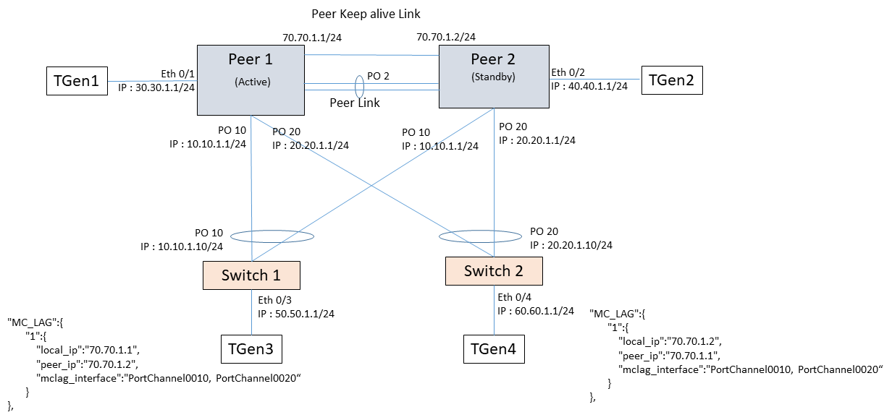
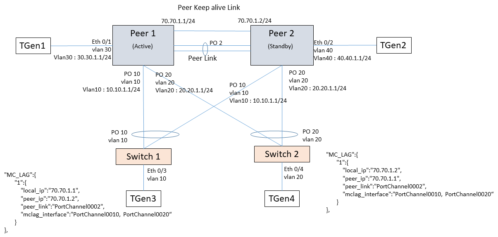
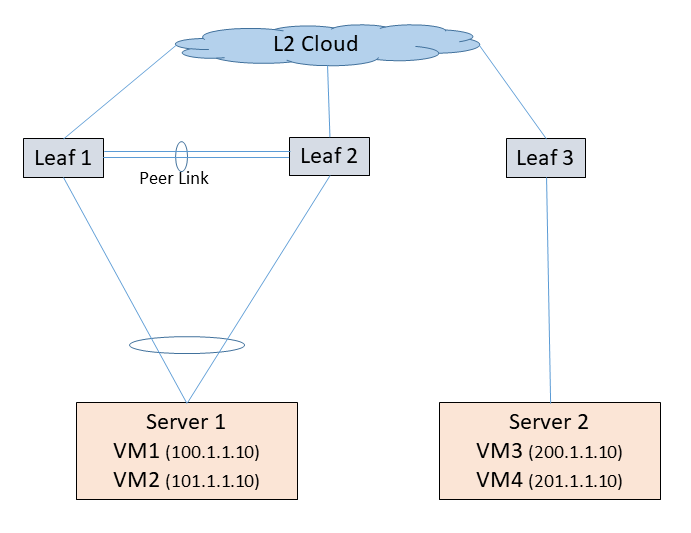

#  SQA Test Plan
# L3-MCLAG
#  SONiC 3.0 Project and Buzznik Release
[TOC]
# Test Plan Revision History
| Rev | Date | Author | Change Description |
|:---:|:-----------:|:------------------:|-----------------------------|
| 0.1 | 11/Oct/2019 | Sunil Rajendra | Initial version. |
| 0.2 | 25/Oct/2019 | Sunil Rajendra | Addressed review comments. |
| 0.3 | 6/Nov/2019 | Sunil Rajendra | Adding SAG Testcases. |

# List of Reviewers
|  Function | Name |
|:---:|:-----------:|
|  |   |

# List of Approvers
|  Function | Name | Date Approved|
|:---:|:-----------:|:------------------:|
|  |   |  |

# Definition/Abbreviation
| **Term** | **Meaning**                     |
| -------- | ------------------------------- |
| MCLAG | Multi-Chassis Link Aggregation Group |
| ICCP | Inter-Chassis Communication Protocol |
| FDB      | Layer-2 (MAC) based forwarding table |
| BGP | Border Gateway Protocol |
| GARP | Gratuitous ARP |
| ND | Neighbor Discovery |
| VRRP | Virtual Router Redundancy Protocol |
| SAG | Static Anycast Gateway |
| VRF | Virtual Routing and Forwarding |
| VM | Virtual Machine |
| REST     | Representational State Transfer |

# Feature Overview
This document covers the testcases to be executed for SONiC MCLAG feature.

Static Anycast Gateway (SAG) feature provides ability to configure same set of gateway IPs and common Gateway MAC on Vlan interfaces across routers without need to run any election protocol. All routers configured with same set of SAG IP provides gateway functionality. On VM move to different server, traffic routing is seamless with minimal control plane support.

# 1 Test Focus Areas
## 1.1 Functional Testing 
  - All CLI and debug commands
  - L3-MCLAG Traffic routing/forwarding.
  - L3-MCLAG Control Plane Testing.
  - Features over L3-MCLAG.
  - Triggers - link flaps/config-unconfig/clear.
  - SAG over L3-MCLAG.
## 1.2 Negative Testing 
  -	Reload/kill daemon
  -	reboot - warm/cold/fast
  -	docker restart/start/stop
  -	Config save and reload

## 1.3 Scale and Performance Testing

# 2 Topologies

## 2.1 Topology 1

## 2.2 Topology 2

## 2.3 Topology 3

# 3 Test  Case and Objectives
## 3.1 CLI
### 3.1.1 Verify L3-MCLAG configuration and deconfiguration.

| **Test ID** | **FtOpSoRoL3MclagCli001** |
|--------|:----------------|
| **Test Name** | **Verify L3-MCLAG configuration and deconfiguration.** |
| **Test Setup** | **Topology1** |
| **Type** | **CLI** |
| **Steps** | 1) Verify help strings are displayed for L3-MCLAG config and show CLIs. 2) Verify error messages are generated on giving invalid values. 3)Verify the valid values are accepted and reflected in the 'show run'. 4) Remove the configurations and verified they are removed from the 'show run' or database. |
## 3.2 Functional
### 3.2.1 Bring up L3-MCLAG interface and ping.

| **Test ID**    | **FtOpSoRoL3MclagFunc001**                                   |
| -------------- | :----------------------------------------------------------- |
| **Test Name**  | **Bring up L3-MCLAG interface and ping.**                    |
| **Test Setup** | **Topology1**                                                |
| **Type**       | **Functional**                                               |
| **Steps**      | 1) Configure as per topology. 2) Verify L3-MCLAG interface comes up. 3) Ping from peer to the client IP. It may fail or pass depending on the hashing. 4) Ping from client to the peer IP. It should pass.  5) Remove the configurations. 6) Repeat 3-4. They should fail 7) Reconfigure the IP and ping should succeed. 8) 'clear arp' and ping. |

### 3.2.2 Bring up L3-MCLAG interface with IPv6 and ping.

| **Test ID**    | **FtOpSoRoL3MclagFunc002**                                   |
| -------------- | :----------------------------------------------------------- |
| **Test Name**  | **Bring up L3-MCLAG interface with IPv6 and ping.**          |
| **Test Setup** | **Topology1**                                                |
| **Type**       | **Functional**                                               |
| **Steps**      | 1) Configure as per topology with IPv6 addresses. 2) Verify L3-MCLAG interface comes up. 3) Ping from peer to the client IP. It may fail or pass depending on the hashing. 4) Ping from client to the peer IP. It should pass.  5) Remove the configurations. 6) Repeat 3-4. They should fail. 7) Reconfigure the IP and ping should succeed. 8) 'clear nd' and ping. |

### 3.2.3 Modify the L3-MCLAG configuration.

| **Test ID**    | **FtOpSoRoL3MclagFunc003**                                   |
| -------------- | :----------------------------------------------------------- |
| **Test Name**  | **Bring up L3-MCLAG interface with IPv6.**                   |
| **Test Setup** | **Topology1**                                                |
| **Type**       | **Functional**                                               |
| **Steps**      | 1) Configure as per topology with both IPv4 and IPv6 addresses. 2) Verify L3-MCLAG interface comes up. 3) Ping from client to the peer IP. 4) Modify the IP addresses. 5) Verify the interface status should be Up. 6) Ping from client to the new peer IP should succeed. 7) Restore the IP. 8) Repeat 5-6. 9) Flap peer-link and MCLAG interfaces. 10) Repeat 8. 11) Repeat the above steps for IPv6. |

| Traffic Scenarios | Orphan    | Client    |
| ----------------- | --------- | --------- |
| **Orphan**        | Supported | Supported |
| **Client**        | Supported | Supported |

### 3.2.4 Verify IPv4 traffic and ARP table.

| **Test ID**    | **FtOpSoRoL3MclagFunc004**                                   |
| -------------- | :----------------------------------------------------------- |
| **Test Name**  | **Verify IPv4 traffic and ARP table.**                       |
| **Test Setup** | **Topology1**                                                |
| **Type**       | **Functional**                                               |
| **Steps**      | 1) Configure as per topology. 2) Configure appropriate static routes, so that routes are known in the routing table. 3) Verify the ARP table. ARP entries learned on MCLAG should be distributed to the peer. ARP entries over orphan port should not be distributed. 4) Configure the full mesh traffic between Tgen1, Tgen2, Tgen3. 5) Start all the traffic streams. 6) Verify traffic reaching the destinations and statistics at all the interfaces. 7) Shut Peer1 orphan port. 8) All rx/tx streams from Tgen1 should be stopped. 9) Noshut the port. 10) All streams should be restored. 11) Shut Peer1 MCLAG interface. 12) Tgen1-3 traffic should take standby link. 13) Repeat 9-10. 14) Shut Peer1 peer-link. 15) Tgen1-2 traffic should be dropped. 16) Repeat 13. 17) Repeat flapping cases for Peer2 and Switch1. |

### 3.2.5 Verify IPv6 traffic and ND table.

| **Test ID**    | **FtOpSoRoL3MclagFunc005**                   |
| -------------- | :------------------------------------------- |
| **Test Name**  | **Verify IPv6 traffic and ND table.**        |
| **Test Setup** | **Topology1**                                |
| **Type**       | **Functional**                               |
| **Steps**      | Execute previous testcase with IPv6 traffic. |

### 3.2.6 Verify traffic between two L3-MCLAGs.

| **Test ID**    | **FtOpSoRoL3MclagFunc006**                                   |
| -------------- | :----------------------------------------------------------- |
| **Test Name**  | **Verify traffic between two L3-MCLAGs.**                    |
| **Test Setup** | **Topology1**                                                |
| **Type**       | **Functional**                                               |
| **Steps**      | 1) Configure as per topology. 2) Configure appropriate static routes, so that routes are known in the routing table. 3) Verify the ARP table. 4) Configure bidirectional traffic between Tgen3, Tgen4. 5) Start all the traffic streams. 6) Verify traffic reaching the destinations and statistics at all the interfaces. 7) Flap Switch1 interfaces. 8) Flap Switch2 interfaces. 9) Repeat above steps along with IPv6 traffic. |

### 3.2.7 Verify traffic with Ve over L2-MCLAGs.

| **Test ID**    | **FtOpSoRoL3MclagFunc007**                                   |
| -------------- | :----------------------------------------------------------- |
| **Test Name**  | **Verify traffic with Ve over L2-MCLAGs.**                   |
| **Test Setup** | **Topology2**                                                |
| **Type**       | **Functional**                                               |
| **Steps**      | 1) Configure as per topology with Ve interfaces over L2-MCLAG. 2) Repeat previous cases with full mesh traffic between Tgen1,2,3,4. 3) Repeat with IPv6 traffic. |

### 3.2.8 Verify routing over Ve with orphan and L2-MCLAG members.

| **Test ID**    | **FtOpSoRoL3MclagFunc008**                                   |
| -------------- | :----------------------------------------------------------- |
| **Test Name**  | **Verify routing over Ve with orphan and L2-MCLAG members.** |
| **Test Setup** | **Topology2**                                                |
| **Type**       | **Functional**                                               |
| **Steps**      | 1) Configure orphan port and L2-MCLAG to be in the same vlan/Ve. 2) Repeat previous cases with full mesh traffic between Tgen1,2,3,4. 3) Repeat with IPv6 traffic. |

### 3.2.9 Verify traffic forwarding with adding/removing MCLAG members.

| **Test ID**    | **FtOpSoRoL3MclagFunc009**                                   |
| -------------- | :----------------------------------------------------------- |
| **Test Name**  | **Verify traffic forwarding with adding/removing MCLAG members.** |
| **Test Setup** | **Topology1/2**                                              |
| **Type**       | **Functional**                                               |
| **Steps**      | 1) Configure as per topology. 2) Configure full mesh streams and start them. 3) Add few members to MCLAG with both Peer1 and Peer2. 4) Verify traffic is load balances appropriately (verify ECMP). 5) Remove the members and verify the traffic. |

### 3.2.10 Verify traffic forwarding with adding/removing VLAN members.

| **Test ID**    | **FtOpSoRoL3MclagFunc010**                                   |
| -------------- | :----------------------------------------------------------- |
| **Test Name**  | **Verify traffic forwarding with adding/removing VLAN members.** |
| **Test Setup** | **Topology2**                                                |
| **Type**       | **Functional**                                               |
| **Steps**      | 1) Configure as per topology. 2) Configure full mesh streams and start them. 3) Toggle the MCLAG as member port and verify the traffic. 4) Modify the MCLAG to be member of another Vlan and verify the traffic 5) Restore the config and vlan members and verify the traffic. |

### 3.2.11 Verify GARP and DAD with L3-MCLAG.

| **Test ID**    | **FtOpSoRoL3MclagFunc011**                                   |
| -------------- | :----------------------------------------------------------- |
| **Test Name**  | **Verify GARP and DAD with L3-MCLAG.**                       |
| **Test Setup** | **Topology1/2**                                              |
| **Type**       | **Functional**                                               |
| **Steps**      | 1) Configure as per topology but with same IP at MCLAG ends. 2) Verify GARP is generated the appropriate log message is seen. 3) Verify DAD functionality for IPv6 addresses. |

### 3.2.12 Verify iBGP over L3-MCLAG.

| **Test ID**    | **FtOpSoRoL3MclagFunc012**                                   |
| -------------- | :----------------------------------------------------------- |
| **Test Name**  | **Verify iBGP over L3-MCLAG.**                               |
| **Test Setup** | **Topology1/2**                                              |
| **Type**       | **Functional**                                               |
| **Steps**      | 1) Configure as per topology. 2) Establish iBGP over L3-MCLAG. 3) Verify the session. 4) Verify the routes learnt. 5) Configure the matching traffic and verify the routing. 6) Repeat with BFD (if supported). 7) Verify the NH table. 8) 'clear bgp neighbors'. 9) 'clear bgp routes'. |

### 3.2.13 Verify eBGP over L3-MCLAG.

| **Test ID**    | **FtOpSoRoL3MclagFunc013**                                   |
| -------------- | :----------------------------------------------------------- |
| **Test Name**  | **Verify eBGP over L3-MCLAG.**                               |
| **Test Setup** | **Topology1/2**                                              |
| **Type**       | **Functional**                                               |
| **Steps**      | 1) Configure as per topology. 2) Establish eBGP over L3-MCLAG. 3) Verify the session. 4) Verify the routes learnt. 5) Configure the matching traffic and verify the routing. 6) Repeat with BFD (if supported). 7) Verify the NH table. 8) 'clear bgp neighbors'. 9) 'clear bgp routes'. |

### 3.2.14 Verify VRRP over L3-MCLAG.

| **Test ID**    | **FtOpSoRoL3MclagFunc014**                                   |
| -------------- | :----------------------------------------------------------- |
| **Test Name**  | **Verify VRRP over L3-MCLAG.**                               |
| **Test Setup** | **Topology1/2**                                              |
| **Type**       | **Functional**                                               |
| **Steps**      | 1) Configure as per topology. 2) Configure VRRP over L3-MCLAG. 3) Verify the ARP table. 4) Start the matching traffic. 5) Verify the traffic takes master link. 6) Shut the master link. 7) Verify the traffic takes backup link. |

### 3.2.15 Verify IPv4 SAG over L3-MCLAG.

| **Test ID**    | **FtOpSoRoL3MclagFunc015**                                   |
| -------------- | :----------------------------------------------------------- |
| **Test Name**  | **Verify IPv4 SAG over L3-MCLAG.**                           |
| **Test Setup** | **Topology3**                                                |
| **Type**       | **Functional**                                               |
| **Steps**      | 1) Configure as per topology. Dont configure real-IP. 2) Configure and start full mesh data traffic between VM1, VM2 and VM3. 3) Verify data traffic fails. 4) Configure real-IPs on all the nodes. 5) Verify data traffic converges. 6) Verify the ARP, MAC, route entries in all the nodes. 7) Move VM1 to Server2. 8) Verify ARP resolution happens as expected and traffic converges. 9) Move back VM1 to Server1. 10) Verify above steps. |

### 3.2.16 Verify DHCP-Relay over L3-MCLAG.

| **Test ID**    | **FtOpSoRoL3MclagFunc016**                                   |
| -------------- | :----------------------------------------------------------- |
| **Test Name**  | **Verify DHCP-Relay over L3-MCLAG.**                         |
| **Test Setup** | **Topology1/2**                                              |
| **Type**       | **Functional**                                               |
| **Steps**      | 1) Configure as per topology. 2) Configure DHCP-Relay over L3-MCLAG. 3) Verify the functionality. |

### 3.2.17 Verify ping with Unique-IP for L3-MCLAG.

| **Test ID**    | **FtOpSoRoL3MclagFunc017**                                   |
| -------------- | :----------------------------------------------------------- |
| **Test Name**  | **Verify ping with Unique-IP for L3-MCLAG.**                 |
| **Test Setup** | **Topology2**                                                |
| **Type**       | **Functional**                                               |
| **Steps**      | 1) Configure as per topology. 2) Bring up the L3-MCLAG with unique-IP on the vlan. 3) From Peer1, ping to the Peer2 IP. 4) From Peer1, ping to client IP. 5) Both pings should get succeed. 6) From Peer2, ping to Peer1 and client. 7) From client, ping to both the peers. 8) All pings should be successful. 9) Remove the unique-IPs and configure common IP. 10) Pings to previous IPs should get fail. 11) Reconfigure the unique-IPs and repeat 3-7. 12) Repeat above steps for unique-IPv6 addresses and ping6. |

### 3.2.18 Verify routing-protocols with Unique-IP for L3-MCLAG.

| **Test ID**    | **FtOpSoRoL3MclagFunc018**                                   |
| -------------- | :----------------------------------------------------------- |
| **Test Name**  | **Verify routing-protocols with Unique-IP for L3-MCLAG.**    |
| **Test Setup** | **Topology2**                                                |
| **Type**       | **Functional**                                               |
| **Steps**      | 1) Configure as per topology. 2) Bring up the L3-MCLAG with unique-IP on the vlan. 3) Establish BGP over peers and client. 4) Verify entries are learnt correctly on all the nodes. 5) Start the matching data traffic. 6) Verify routing happens properly. 7) Toggle the unique-IP config. 8) Verify traffic converges within acceptable time. 9) Repeat above steps with static routes over unique-IP. 10) Repeat above steps for unique-IPv6 addresses. |

### 3.2.19 Verify IPv6 SAG over L3-MCLAG.

| **Test ID**    | **FtOpSoRoL3MclagFunc019**                                   |
| -------------- | :----------------------------------------------------------- |
| **Test Name**  | **Verify IPv6 SAG over L3-MCLAG.**                           |
| **Test Setup** | **Topology3**                                                |
| **Type**       | **Functional**                                               |
| **Steps**      | 1) Configure as per topology. Dont configure real-IP. 2) Configure and start full mesh data traffic between VM1, VM2 and VM3. 3) Verify data traffic fails. 4) Configure global real-IPv6 addresses on all the nodes. 5) Verify data traffic converges. 6) Verify the ND, MAC, route entries in all the nodes. 7) Move VM1 to Server2. 8) Verify ND happens as expected and traffic converges. 9) Move back VM1 to Server1. 10) Verify above steps. |

### 3.2.20 Verify multi-IP SAG over L3-MCLAG.

| **Test ID**    | **FtOpSoRoL3MclagFunc020**                                   |
| -------------- | :----------------------------------------------------------- |
| **Test Name**  | **Verify multi-IP SAG over L3-MCLAG.**                       |
| **Test Setup** | **Topology3**                                                |
| **Type**       | **Functional**                                               |
| **Steps**      | 1) Configure as per topology. 2) Configure another set of IP on the vlans on all nodes. Configure one IP with lower mask within the subnet. Example: Configure below 3 IPs on same vlan 20.1.1.1/24 20.1.2.1/24 20.1.1.2/32 3) Start full mesh data traffic between all VMs covering multi-IPs. 4) Verify the ARP, MAC, route entries in all the nodes. 5) Move VM1 to Server2. 6) Verify the convergence of the traffic. Verify ARPs are resolved with real-IPs and no functional difference due  to the presence of lower-mask IP. 7) Remove the real-IPs. 8) Move back VM1 to Server1. 9) Verify traffic convergence fails. 10) Reconfigure the real-IPs. 11) Verify traffic convergence is successful. 12) Toggle the configs and verify above steps. 13) Repeat above steps for IPv6. |

### 3.2.21 Verify ping with SAG over L3-MCLAG.

| **Test ID**    | **FtOpSoRoL3MclagFunc021**                                   |
| -------------- | :----------------------------------------------------------- |
| **Test Name**  | **Verify ping with SAG over L3-MCLAG.**                      |
| **Test Setup** | **Topology3**                                                |
| **Type**       | **Functional**                                               |
| **Steps**      | 1) Configure as per topology with multi-IPs. 2) Ping to SAG with all the VMs. 3) Verify they are successful. 4) Move all the VMs to other Server. 5) Verify steps 2,3. 6) Move back all VMs to original position. 7) Verify steps 2,3. 8) Repeat with ping6. 9) Change the IP and IPv6 SAG address (trigger). |

### 3.2.22 Verify SAG over L3-MCLAG within VRF.

| **Test ID**    | **FtOpSoRoL3MclagFunc022**                                   |
| -------------- | :----------------------------------------------------------- |
| **Test Name**  | **Verify SAG over L3-MCLAG within VRF.**                     |
| **Test Setup** | **Topology3**                                                |
| **Type**       | **Functional**                                               |
| **Steps**      | 1) Repeat previous test cases within VRF. 2) Add 'clear' triggers. |

### 3.2.23 Verify IPv6 specific SAG over L3-MCLAG.

| **Test ID**    | **FtOpSoRoL3MclagFunc023**                                   |
| -------------- | :----------------------------------------------------------- |
| **Test Name**  | **Verify IPv6 SAG over L3-MCLAG.**                           |
| **Test Setup** | **Topology3**                                                |
| **Type**       | **Functional**                                               |
| **Steps**      | 1) Repeat IPV6 SAG cases with IPV6 specific triggers given below. 2) auto link-locals. 3) user configured link-local 4) Verify by default common-mac is taken from IPv4. 5) Test with different common-mac for IPv6. 6) Add a trigger of toggling underlying client ports from 'trunk' to 'access'. |

### 3.2.24 Verify SAG over L3-MCLAG with unique-IP.

| **Test ID**    | **FtOpSoRoL3MclagFunc024**                                 |
| -------------- | :--------------------------------------------------------- |
| **Test Name**  | **Verify SAG over L3-MCLAG with unique-IP.**               |
| **Test Setup** | **Topology3**                                              |
| **Type**       | **Functional**                                             |
| **Steps**      | 1) Repeat previous test cases with unique-IP for L3-MCLAG. |

## 3.3 Negative

### 3.3.1 Verify unknown unicast traffic forwarding.

| **Test ID**    | **FtOpSoRoL3MclagNeg001**                                    |
| -------------- | :----------------------------------------------------------- |
| **Test Name**  | **Verify unknown unicast traffic forwarding.**               |
| **Test Setup** | **Topology1/2**                                              |
| **Type**       | **Negative**                                                 |
| **Steps**      | 1) Configure as per topology. 2) Configure streams from Tgen1 and Tgen2 to unknown unicast IP of MCLAG. Start them. 3) Verify ARPs are generated appropriately. 4) Verify there are no traffic looping (follows split horizon). 5) Repeat it for IPv6 traffic. |

### 3.3.2 Verify L3MCLAG with common interface for session and control link.

| **Test ID**    | **FtOpSoRoL3MclagNeg002**                                    |
| -------------- | :----------------------------------------------------------- |
| **Test Name**  | **Verify L3MCLAG with common interface for session and control link.** |
| **Test Setup** | **Topology1/2**                                              |
| **Type**       | **Negative**                                                 |
| **Steps**      | 1) Configure L3MCLAG having session and control link on single interface. 2) The configuration should fail with proper message. |

### 3.3.3 Verify SAG over L3-MCLAG with different IPs.

| **Test ID**    | **FtOpSoRoL3MclagNeg003**                                    |
| -------------- | :----------------------------------------------------------- |
| **Test Name**  | **Verify SAG over L3-MCLAG within VRF.**                     |
| **Test Setup** | **Topology3**                                                |
| **Type**       | **Negative**                                                 |
| **Steps**      | 1) Configure different SAG IPs on different nodes. 2) Configure different common MACs on different nodes. |

### 3.3.4 Verify SAG over L3-MCLAG with different common-MAC.

| **Test ID**    | **FtOpSoRoL3MclagNeg004**                                    |
| -------------- | :----------------------------------------------------------- |
| **Test Name**  | **Verify SAG over L3-MCLAG within VRF.**                     |
| **Test Setup** | **Topology3**                                                |
| **Type**       | **Negative**                                                 |
| **Steps**      | 1) Configure different common-MACs for IPv4 and IPv6. 2) Remove common-MAC of IPv4. 3) Verify IPv4 doesnt derive the common-MAC of IPv6. 4) Reconfig IPv4 common-MAC. Remove common-MAC of IPv6. 5) Verify IPv6 derives the common-MAC of IPv4. |

## 3.4 Reboot/Reload/Upgrade Test Cases

### 3.4.1 Verify L3-MCLAG functionality with fast reboot.

| **Test ID**    | **FtOpSoRoL3MclagRe001**                                     |
| -------------- | :----------------------------------------------------------- |
| **Test Name**  | **Verify L3-MCLAG functionality with fast reboot.**          |
| **Test Setup** | **Topology1/2**                                              |
| **Type**       | **Functional**                                               |
| **Steps**      | 1) Configure as per topology. 2) Verify L3-MCLAG functionality. 3) fast reboot. 4) Repeat 2. |

### 3.4.2 Verify L3-MCLAG functionality with cold reboot.

| **Test ID**    | **FtOpSoRoL3MclagRe002**                                     |
| -------------- | :----------------------------------------------------------- |
| **Test Name**  | **Verify L3-MCLAG functionality with cold reboot.**          |
| **Test Setup** | **Topology1/2**                                              |
| **Type**       | **Functional**                                               |
| **Steps**      | 1) Configure as per topology. 2) Verify L3-MCLAG functionality. 3) cold reboot. 4) Repeat 2. |

### 3.4.3 Verify L3-MCLAG functionality with warm reboot.

| **Test ID**    | **FtOpSoRoL3MclagRe003**                                     |
| -------------- | :----------------------------------------------------------- |
| **Test Name**  | **Verify L3-MCLAG functionality with warm reboot.**          |
| **Test Setup** | **Topology1/2**                                              |
| **Type**       | **Functional**                                               |
| **Steps**      | 1) Configure as per topology. 2) Verify L3-MCLAG functionality. 3) warm reboot. 4) Repeat 2. |

### 3.4.4 Verify L3-MCLAG functionality with config reload.

| **Test ID**    | **FtOpSoRoL3MclagRe004**                                     |
| -------------- | :----------------------------------------------------------- |
| **Test Name**  | **Verify L3-MCLAG functionality with config reload.**        |
| **Test Setup** | **Topology1/2**                                              |
| **Type**       | **Functional**                                               |
| **Steps**      | 1) Configure as per topology. 2) Verify L3-MCLAG functionality. 3) save n reload. 4) Repeat 2. |

### 3.4.5 Verify L3-MCLAG functionality with docker restart.

| **Test ID**    | **FtOpSoRoL3MclagRe005**                                     |
| -------------- | :----------------------------------------------------------- |
| **Test Name**  | **Verify L3-MCLAG functionality with docker restart.**       |
| **Test Setup** | **Topology1/2**                                              |
| **Type**       | **Functional**                                               |
| **Steps**      | 1) Configure as per topology. 2) Verify L3-MCLAG functionality. 3) docker restart. 4) Repeat 2. |

### 3.4.6 Verify L3-MCLAG functionality with docker start/stop.

| **Test ID**    | **FtOpSoRoL3MclagRe006**                                     |
| -------------- | :----------------------------------------------------------- |
| **Test Name**  | **Verify L3-MCLAG functionality with docker start/stop.**    |
| **Test Setup** | **Topology1/2**                                              |
| **Type**       | **Functional**                                               |
| **Steps**      | 1) Configure as per topology. 2) Verify L3-MCLAG functionality. 3) docker start/stop. 4) Repeat 2. |

### 3.4.7 Verify L3-MCLAG functionality with upgrade.

| **Test ID**    | **FtOpSoRoL3MclagRe007**                                     |
| -------------- | :----------------------------------------------------------- |
| **Test Name**  | **Verify L3-MCLAG functionality with upgrade.**              |
| **Test Setup** | **Topology1/2**                                              |
| **Type**       | **Functional**                                               |
| **Steps**      | 1) Configure as per topology. 2) Verify L3-MCLAG functionality. 3) upgrade. 4) Repeat 2. |

### 3.4.8 Verify L3-MCLAG functionality with power cycle.

| **Test ID**    | **FtOpSoRoL3MclagRe008**                                     |
| -------------- | :----------------------------------------------------------- |
| **Test Name**  | **Verify L3-MCLAG functionality with power cycle.**          |
| **Test Setup** | **Topology1/2**                                              |
| **Type**       | **Functional**                                               |
| **Steps**      | 1) Configure as per topology. 2) Verify L3-MCLAG functionality. 3) power cycle the router. 4) Repeat 2. |

### 3.4.9 Verify SAG over L3-MCLAG functionality with warm reboot.

| **Test ID**    | **FtOpSoRoL3MclagRe009**                                     |
| -------------- | :----------------------------------------------------------- |
| **Test Name**  | **Verify SAG over L3-MCLAG functionality with warm reboot.** |
| **Test Setup** | **Topology3**                                                |
| **Type**       | **Functional**                                               |
| **Steps**      | 1) Configure as per topology. 2) Verify SAG over L3-MCLAG functionality. 3) warm reboot. 4) Repeat 2. |

## 3.5 Management

#### 3.5.1 SNMP

Not Supported

#### 3.5.2 gNMI

Not Supported

#### 3.5.3 REST API

Not Supported

## 3.6 Stress,Scale and Performance
### 3.6.1 Verify maximum supported MCLAG member ports.

| **Test ID**    | **FtOpSoRoL3MclagSc001**                                     |
| -------------- | :----------------------------------------------------------- |
| **Test Name**  | **Verify maximum supported MCLAG member ports.**             |
| **Test Setup** | **Topology1/2**                                              |
| **Type**       | **Scale**                                                    |
| **Steps**      | 1) Configure MCLAG with maximum supported members. 2) Traffic should be ECMP on all the links. 3) Toggle few member ports. 4) Flap few member ports. |

### 3.6.2 Verify maximum supported MCLAG clients.

| **Test ID**    | **FtOpSoRoL3MclagSc002**                                     |
| -------------- | :----------------------------------------------------------- |
| **Test Name**  | **Verify maximum supported MCLAG clients.**                  |
| **Test Setup** | **Topology1/2**                                              |
| **Type**       | **Scale**                                                    |
| **Steps**      | 1) Configure MCLAG with maximum supported clients. 2) Start full mesh traffic between the clients. |

### 3.6.3 Verify line-rate traffic in peer-link.

| **Test ID**    | **FtOpSoRoL3MclagSc003**                                     |
| -------------- | :----------------------------------------------------------- |
| **Test Name**  | **Verify line-rate traffic in peer-link.**                   |
| **Test Setup** | **Topology1/2**                                              |
| **Type**       | **Scale**                                                    |
| **Steps**      | 1) Configure as per topology. 2) Start full mesh traffic so that peer-link will have line-rate traffic. 3) 'clear arp' and verify there is no significant traffic loss. |

### 3.6.4 Verify maximum supported SAG on vlans over L3-MCLAG.

| **Test ID**    | **FtOpSoRoL3MclagSc004**                                 |
| -------------- | :------------------------------------------------------- |
| **Test Name**  | **Verify maximum supported SAG on vlans over L3-MCLAG.** |
| **Test Setup** | **Topology3**                                            |
| **Type**       | **Scale**                                                |
| **Steps**      | 1) Configure maximum SAG IPs and IPv6 on vlans.          |

# 4 Reference Links
HLD link:
<http://gerrit-lvn-07.lvn.broadcom.net:8083/c/sonic/documents/+/12075/2/MCLAG/MCLAG_HLD.md>

MCLAG definition:
https://www.juniper.net/documentation/en_US/junos/topics/concept/mc-lag-feature-summary-best-practices.html

Nephos MLAG HLD:
https://github.com/Azure/SONiC/blob/f478fe7cbc03c144f3b147e9638f460f764ce4b7/doc/Sonic-mclag-hld.md

Broadcom MLAG Enhancement HLD:
http://10.59.132.240:9009/projects/csg_sonic/ln406662/HLD/MLAG/MCLAG_HLD.md

SAG HLD:
<http://gerrit-lvn-07.lvn.broadcom.net:8083/c/sonic/documents/+/13024>