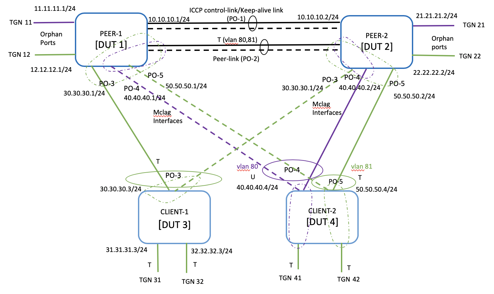
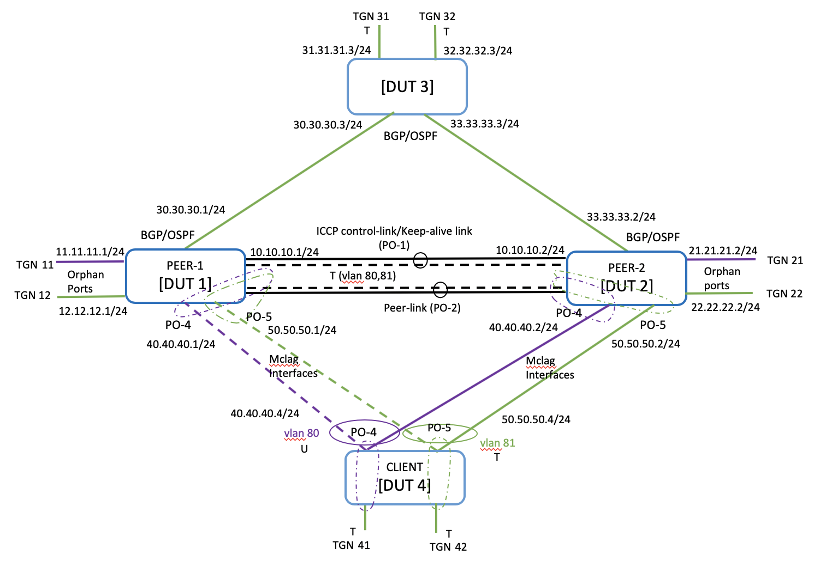

#  SQA Test Plan
# LACP GSHUT & Maintenance Mode
#  SONiC 3.1.0 Project and BuzznikPlus Release
[TOC]
# Test Plan Revision History
| Rev | Date | Author | Change Description |
|:---:|:-----------:|:------------------:|-----------------------------|
| 0.1 | 05/07/2020 | Sneha Ann Mathew | Initial version |

# List of Reviewers
|  Function | Name |
|:---:|:-----------:|
|  |   |

# List of Approvers
|  Function | Name | Date Approved|
|:---:|:-----------:|:------------------:|
|  |   |  |

# Definition/Abbreviation
| **Term** | **Meaning**                    |
| -------- | ------------------------------- |
|MCLAG     | Multi-Chassis Link Aggregation Group     |
|ICCP   | Inter-Chassis Communication Protocol |
| FDB     | Layer-2 (MAC) based forwarding table      |
| Orphan Port      | Interface connecting MCLAG peers and non-MCLAG client |
| MCLAG enabled Interface | Interface connecting MCLAG peers and MCLAG client     |
| SHD | Single-Homed Device |
| MHD | Multi-Homed Device |
| PO | PortChannel |
| REST     | Representational state transfer |


# Feature Overview
Multichassis link aggregation groups (MC-LAGs) enable a client device to form a logical LAG interface between two MC-LAG peers. An MC-LAG provides redundancy and load balancing between the two MC-LAG peers, multihoming support, and a loop-free Layer 2 network without running STP. 

Maintenance mode is a mechanism of isolating a router from active forwarding path so that maintenance operations can be performed. Maintenance operations could be moving the cables, changing configuration, reboot, or software upgrade

This test plan aims at verifying the portchannel  enhancements done for LACP graceful shutdown. And also to validate the traffic draining/maintenance mode solution that includes BGP, OSPF and LACP.

## Functional Requirements
|**Requirement ID**| **Requirement**|
|:-----|:-------------------------------|
|SONiC3.1_MCLAGMM_001| Upon enabling PortChannel maintenance mode, all the portchannels in the system should be operationally down and stop traffic transmission and reception |
|SONiC3.1_MCLAGMM_002| Provide configuration to enable/disable Port Channel maintenance mode with the KLISH and click CLI |
|SONiC3.1_MCLAGMM_003| All the supported portchannels in the device should enable/disable maintenance mode upon user trigger. |
|SONiC3.1_MCLAGMM_004| The portchannels should continue to be operationally down when warm boot is triggered by the user in the Port Channel maintenance mode. |
|SONiC3.1_MCLAGMM_005| Validate the traffic draining/maintenance mode solution that includes BGP, OSPF and LACP |


# 1 Test Focus Areas
## 1.1 Functional Testing 
  - Portchannel maintenance mode CLIs and show commands
  - PO in Maintenance mode functionality with Dynamic POs.
  - PortChannel Operations when PO in Maintenance mode
  - Verify traffic draining/Maintenance mode with various Reboot triggers
## 1.2 Negative Testing 
  -	Config save and reload
  -	Cold Reboot
  -	Fast Reboot
  -	Warm reboot
  -	Image Upgrade

## 1.3 Scale and Performance Testing
- Verify traffic loss is minimal with all reboot triggers

# 2 Topologies
##  2.1 Topology 1



Base config will be L3 Mclag with Mclag as dynamic POs configured in fallback mode.

POs will be tagged or untagged in member vlans (IP on Vlan)  and   one PO will have no vlan configs (IP on interface). 

Routing protocol BGP and static routes will be configured.

L3 traffic will be sent between Mclag Peers and clients and also between 2 clients.

## 2.2 Topology 2



Base config will be L3 Mclag with Mclag as dynamic POs configured in fallback mode.

POs will be tagged or untagged in member vlans (IP on Vlan)  and   one PO will have no vlan configs (IP on interface). 

Routing protocol OSPF/BGP will be configured.

L3 traffic will be sent between Mclag Peers and client and also between DUT3 and DUT4.


#3 Test  Case and Objectives

## 3.1 CLI
### 3.1.1 Verify CLI for PO maintenance mode config/unconfig.

| **Test ID** | FtOpSoRtMclagMMCli001 test_mclag_po_mm_cli |
|--------|:----------------|
| **Test Name** | Verify CLI for PO Maintenance mode config/unconfig |
| **Test Setup** | Topology1 |
| **Type** | CLI |
| **Steps** | <br />**1) Click CLI:<br />============**<br />Config CLIs:<br />----------------------<br />admin@sonic:~$ config portchannel maintenance-mode <enable/disable><br />Show CLIS:<br />----------------------<br />show interface portchannel <br /><br />**2) Klish CLI:<br />==============**<br />Config CLIs:<br />----------------------<br />sonic(config)# [no] portchannel maintenance-mode<br />Show CLIS:<br />----------------------<br />show interface portchannel \<po-id>   <br /><br/>- Verify syntax of klish CLIs.<br/>- Verify the configuration reflects in running config.<br />- Unconfigure the CLI and verify it is removed from running config.<br />- Verify show commands reflect the cofigured values. |
## 3.2 Functional
### 3.2.1 Configure PO maintenance mode on one MCLAG peer and verify all POs go down 

| **Test ID** | FtRtMclagPOMM  (test_mclag_po_mm) |
|--------|:----------------|
| **Test Name** | Configure PO maintenance mode on one MCLAG peer and verify all POs go down |
| **Test Setup** | Topology1 |
| **Type** | Functional |
| **Steps** | - Bringup MCLAG as shown in Topology1 and configure PO maintanence mode on one mclag node.<br/>- Verify all POs configured on the node is operationally down.<br />- Verify MCLAG interface counters that all traffic from client forwards to MCLAG peer<br />- Verify traffic forwarding.<br />- Verify MAC and ARP table.<br /> |

###  3.2.2 Configure new PO in maintenance mode and verify it is down

| **Test ID**    | FtRtMclagPOMMAddPO (test_mclag_PO_MM_add_PO)                 |
| -------------- | :----------------------------------------------------------- |
| **Test Name**  | Configure new PO in maintenance mode and verify it is down   |
| **Test Setup** | Topology1                                                    |
| **Type**       | Functional                                                   |
| **Steps**      | - With PO in maintenance mode, configure a new PO.<br/>- Verify newly configured PO is operationally down.<br />- Verify MCLAG interface counters that all traffic from client forwards to MCLAG peer<br />- Verify traffic forwarding.<br />- Verify MAC and ARP table.<br /> |


###  3.2.3 Unconfigure PO maintenance mode and verify all POs are Up

| **Test ID**    | FtRtMclagUnconfigPOMM (test_mclag_PO_MM_unconfig)            |
| -------------- | :----------------------------------------------------------- |
| **Test Name**  | Unconfigure PO maintenance mode and verify all POs are Up    |
| **Test Setup** | Topology1                                                    |
| **Type**       | Functional                                                   |
| **Steps**      | - Unconfigure PO maintenance mode.<br/>- Verify all POs including the newly configured PO is operationally Up.<br />- Verify MCLAG interface counters that traffic from client is load balanced to both MCLAG peers<br />- Verify traffic forwarding.<br />- Verify MAC and ARP table.<br /> |


###  3.2.4 Add/Delete Member Ports to PO in maintenance mode 

| **Test ID**    | FtRtMclagPOMMAddDelMemberPorts (test_mclag_PO_MM_add_del_member_ports) |
| -------------- | :----------------------------------------------------------- |
| **Test Name**  | Add/Delete Member Ports to PO in maintenance mode            |
| **Test Setup** | Topology1                                                    |
| **Type**       | Functional                                                   |
| **Steps**      | - Configure PO maintenance mode.<br/>- Add new member ports to existing POs and verify operation is allowed.<br />- Verify all POs are still down.<br />- Verify PO interface counters that newly added ports are not forwarding any traffic.<br />- Verify MAC and ARP table.<br />- Delete the newly added member ports and verify operation is allowed.<br />- Verify all POs are still down.<br />- Verify MCLAG interface counters that all traffic from client forwards to MCLAG peer.<br />- Unconfigure PO maintenance mode.<br />- Verify MCLAG interface counters that traffic from client is load balanced to both MCLAG peers.<br />- Verify MAC and ARP table.<br /> |


###  3.2.5 Verify Delete PO in maintenance mode 

| **Test ID**    | FtRtMclagPOMMDeletePO (test_mclag_PO_MM_delete_PO)           |
| -------------- | :----------------------------------------------------------- |
| **Test Name**  | Verify Delete PO in maintenance mode.                        |
| **Test Setup** | Topology1                                                    |
| **Type**       | Functional                                                   |
| **Steps**      | - Configure PO maintenance mode.<br/>- Delete an existing PO and verify operation is allowed.<br />- Unconfigure  maintenance mode and verify all POs<br/>- Add back the PO and Verify all POs are Up<br />- Verify MCLAG interface counters that traffic from client is load balanced to both MCLAG peers.<br /> |

###  3.2.6  Verify PO shut/no_shut in maintenance mode 

| **Test ID**    | FtRtMclagPOMMShutNoShutPO (test_mclag_PO_MM_shut_noshut_PO)  |
| -------------- | :----------------------------------------------------------- |
| **Test Name**  | Verify PO shut/no_shut in maintenance mode                   |
| **Test Setup** | Topology1                                                    |
| **Type**       | Functional                                                   |
| **Steps**      | - Configure PO maintenance mode.<br/>- no Shutdown PO interface explicitly and verify PO is still Down.<br />- Shutdown the PO interface explicitly and verify PO is still Down.<br />- Unconfigure  maintenance mode and verify all except above PO is Up<br/>- No Shutdow the PO and Verify all POs are Up<br />- Verify MCLAG interface counters that traffic from client is load balanced to both MCLAG peers.<br /> |

###  3.2.7  Verify maintenance  mode with PO in fallback state

| **Test ID**    | FtRtMclagPOMMfallbackPO (test_mclag_PO_MM_with_fallback)     |
| -------------- | :----------------------------------------------------------- |
| **Test Name**  | Verify maintenance  mode with PO in fallback state           |
| **Test Setup** | Topology1                                                    |
| **Type**       | Functional                                                   |
| **Steps**      | - Remove PO member ports at client side so that PO is UP in fallback state in one node say nodeA.  Also keep another interface Up (no lacp) towards other peer nodeB <br/>- Configure PO maintenance mode on nodeA in which fallback is enabled.<br/>- Verify PO in fallback state is Down in nodeA and Up in nodeB. <br />- Add member port to PO at client side so that LACP packet is initiated towards nodeA.<br />- Verify PO is still Down and fallback is enabled on peer nodeB.<br />- Add member port towards other peer at client side PO.<br />- Verify PO is Down in nodeA and LACP Up in nodeB.<br />- Unconfigure  maintenance mode and verify all POs Up in nodeA and nodeB<br/>- Verify MCLAG interface counters that traffic from client is load balanced to both MCLAG peers.<br />- Verify traffic forwarding.<br />- Verify MAC and ARP table.<br /> |


###  3.2.8  Verify PO maintenance mode with link-track enabled

| **Test ID**    | FtRtMclagPOMMLinkTrack (test_mclag_PO_MM_link_track)         |
| -------------- | :----------------------------------------------------------- |
| **Test Name**  | Verify PO maintenance mode with link-track enabled           |
| **Test Setup** | Topology 2                                                   |
| **Type**       | Functional                                                   |
| **Steps**      | - Enable link track on interface towards spine.<br />- Disable the upsream interfaces and verify Mclag interface is down.<br />- Configure PO maintenance mode and verify all POs down.<br/>- Enable the upstream interfaces and verify POs are still down<br />- Disable link_track and verify All POs are still down.<br />- Unconfigure  maintenance mode and verify all POs are Up<br/>- Verify MCLAG interface counters that traffic from client is load balanced to both MCLAG peers.<br /> |


###  3.2.9  Verify PO maintenance mode functionality on Active and Standby MCLAG Nodes

| **Test ID**    | FtRtMclagPOMMActiveStandby (test_mclag_PO_MM_active_standby) |
| -------------- | :----------------------------------------------------------- |
| **Test Name**  | Verify PO maintenance mode functionality on Active and Standby MCLAG Nodes |
| **Test Setup** | Topology1                                                    |
| **Type**       | Functional                                                   |
| **Steps**      | - Configure PO maintenance mode on Active Mclag node and verify all POs in it are Down.<br />- Unconfigure PO maintenance mode and verify POs are back Up.<br />- Configure PO maintenance mode on Standby Mclag node and verify all POs in it are Down.<br/>- Unconfigure PO maintenance mode and verify POs are back Up.<br />- Verify MCLAG interface counters that traffic from client is load balanced to both MCLAG peers.<br /> |


## 3.3 Reboot Scenarios

### 3.3.1 Verify Maintenance Mode solution with Config Save Reload.

| **Test ID**    | FtRtMclagPOMMSaveReload (test_mclag_PO_MM_save_reload)       |
| -------------- | :----------------------------------------------------------- |
| **Test Name**  | Verify Maintenance Mode solution with Config Save Reload.    |
| **Test Setup** | Topology 2                                                   |
| **Type**       | Performance                                                  |
| **Steps**      | - Bringup MCLAG as shown in Topology 2<br />- Configure PO maintenance mode/LACP GSHUT on the active mclag node in which trigger to be executed<br />- Configure graceful-shutdown for the routing protocols on the active mclag node so that the routes through this node are least preferred.<br /> **sonic(config-router-bgp)# graceful-shutdown<br/> sonic(config-router-ospf)# max-metric router-lsa administrative<br/> sonic(config)# portchannel maintenance-mode**<br />- Save the  config <br />- Clear counters and start Dut3-Dut4 traffic.<br />- Perform "config reload" on the active mclag node<br />- Stop Dut3-Dut4 Traffic after the Router is back UP.<br />- Measure traffic loss and verify traffic convergence is in subseconds.<br />- Verify the trigger node is still in maintanence mode  (ie; no upstream/downstream traffic ingress to the node) .<br />- Unconfigure maintanence mode and verify the traffic is load balanced.<br />- Verify MAC and ARP table.<br />- Verify end-end traffic forwarding. |

### 3.3.2 Verify Maintenance Mode solution with cold reboot.

| **Test ID**    | FtRtMclagPOMMColdReboot (test_mclag_PO_MM_cold_reboot)       |
| -------------- | :----------------------------------------------------------- |
| **Test Name**  | Verify Maintenance Mode solution with cold reboot.           |
| **Test Setup** | Topology 2                                                   |
| **Type**       | Performance                                                  |
| **Steps**      | - Bringup MCLAG as shown in Topology 2<br />- Configure PO maintenance mode on the standby mclag node in which trigger to be executed<br />- Configure graceful-shutdown for the routing protocols on the standby mclag node so that the routes through this node are least preferred.<br /> **sonic(config-router-bgp)# graceful-shutdown<br/> sonic(config-router-ospf)# max-metric router-lsa administrative<br/> sonic(config)# portchannel maintenance-mode**<br />- Save the  config <br />- Clear counters and start Dut3-Dut4 traffic.<br />- Perform "cold reboot" on the standby mclag node<br />- Stop Dut3-Dut4 Traffic after the Router is back UP.<br />- Measure traffic loss and verify traffic convergence is in subseconds.<br />- Verify the trigger node is still in maintanence mode  (ie; no upstream/downstream traffic ingress to the node) .<br />- Unconfigure maintanence mode and verify the traffic is load balanced.<br />- Verify MAC and ARP table.<br />- Verify end-end traffic forwarding. |

### 3.3.3 Verify Maintenance Mode solution with warm reboot.

| **Test ID**    | FtRtMclagPOMMWarmReboot (test_mclag_PO_MM_warm_reboot)       |
| -------------- | :----------------------------------------------------------- |
| **Test Name**  | Verify Maintenance Mode solution with warm reboot.           |
| **Test Setup** | Topology 2                                                   |
| **Type**       | Performance                                                  |
| **Steps**      | - Bringup MCLAG as shown in Topology 2<br />- Configure PO maintenance mode on the Mclag node in which trigger to be executed<br />- Configure graceful-shutdown for the routing protocols on Mclag node so that the routes through this node are least preferred.<br /> **sonic(config-router-bgp)# graceful-shutdown<br/> sonic(config-router-ospf)# max-metric router-lsa administrative<br/> sonic(config)# portchannel maintenance-mode**<br />- Save the  config <br /> - Clear counters and start Dut3-Dut4 traffic.<br />- Perform "warm reboot" on the Mclag node.<br />- Stop Dut3-Dut4 Traffic after the Router is back UP.<br />- Measure traffic loss and verify traffic convergence is in subseconds.<br />- Verify the trigger node is still in maintanence mode  (ie; no upstream/downstream traffic ingress to the node) .<br />- Unconfigure maintanence mode and verify the traffic is load balanced.<br />- Verify MAC and ARP table.<br />- Verify end-end traffic forwarding. |

### 3.3.4 Verify Maintenance Mode solution with fast reboot.

| **Test ID**    | FtRtMclagPOMMFastReboot (test_mclag_PO_MM_fast_reboot)       |
| -------------- | :----------------------------------------------------------- |
| **Test Name**  | Verify Maintenance Mode solution with fast reboot.           |
| **Test Setup** | Topology 2                                                   |
| **Type**       | Performance                                                  |
| **Steps**      | - Bringup MCLAG as shown in Topology 2<br />- Configure PO maintenance mode on the Mclag node in which trigger to be executed<br />- Configure graceful-shutdown for the routing protocols on the Mclag node so that the routes through this node are least preferred.<br /> **sonic(config-router-bgp)# graceful-shutdown<br/> sonic(config-router-ospf)# max-metric router-lsa administrative<br/> sonic(config)# portchannel maintenance-mode**<br />- Save the  config <br />- Clear counters and start Dut3-Dut4 traffic.<br />- Perform "fast reboot" on the Mclag node.<br />- Stop Dut3-Dut4 Traffic after the Router is back UP.<br />- Measure traffic loss and verify traffic convergence is in subseconds.<br />- Verify the trigger node is still in maintanence mode  (ie; no upstream/downstream traffic ingress to the node) .<br />- Unconfigure maintanence mode and verify the traffic is load balanced.<br />- Verify MAC and ARP table.<br />- Verify end-end traffic forwarding. |

### 3.3.5 Verify Maintenance Mode solution with Image Upgrade.

| **Test ID**    | FtRtMclagPOMMImageUpgrade (test_mclag_PO_MM_image_upgrade)   |
| -------------- | :----------------------------------------------------------- |
| **Test Name**  | Verify Maintenance Mode solution with Image Upgrade.         |
| **Test Setup** | Topology 2                                                   |
| **Type**       | Performance/Manual                                           |
| **Steps**      | - Bringup MCLAG as shown in Topology 2<br />- Configure PO maintenance mode on the Mclag node in which trigger to be executed<br />- Configure graceful-shutdown for the routing protocols on the Mclag node so that the routes through this node are least preferred.<br /> **sonic(config-router-bgp)# graceful-shutdown<br/> sonic(config-router-ospf)# max-metric router-lsa administrative<br/> sonic(config)# portchannel maintenance-mode**<br />- Save the  config <br />- Clear counters and start Dut3-Dut4 traffic.<br />- Perform "Image Upgrade/Sonic Install" on the Mclag node.<br />- Stop Dut3-Dut4 Traffic after the Router is back UP.<br />- Measure traffic loss and verify traffic convergence is in subseconds.<br />- Verify the trigger node is still in maintanence mode  (ie; no upstream/downstream traffic ingress to the node) .<br />- Unconfigure maintanence mode and verify the traffic is load balanced.<br />- Verify MAC and ARP table.<br />- Verify end-end traffic forwarding. |

## 3.4 Stress,Scale and Performance

Reboot test case 3.3.1 under section 3  will be done with scaled up ARPs/Routes. Also max possible Portchannels  will be created on the mclag nodes. All POs other than the configured Mclag interfaces will be with no member ports.
## 3.5 Management

#### 3.5.1 SNMP
N/A

#### 3.5.2 gNMI
N/A

#### 3.5.3 REST API
TBD - [will be added once HLD updated]

# 4 Reference Links

PortChannel Enhancements HLD:

http://gerrit-lvn-07.lvn.broadcom.net:8083/c/sonic/documents/+/20500

MCLAG HLD link :
<http://gerrit-lvn-07.lvn.broadcom.net:8083/c/sonic/documents/+/12075/2/MCLAG/MCLAG_HLD.md#441>

MCLAG definition:

https://www.juniper.net/documentation/en_US/junos/topics/concept/mc-lag-feature-summary-best-practices.html

Maintenance Mode Solution Document:

https://docs.google.com/document/d/1GOCRzMjnOAZsHMhF1p3IpEE56srWBFZko3_8eQQW3xY/edit#

```


```