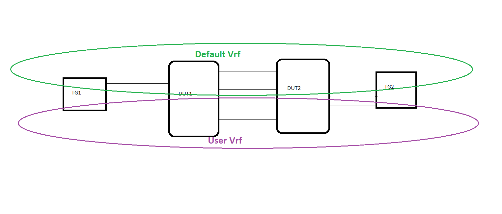

# SQA Test Plan

## OSPFv2

## SONiC 3.0 Project and Buzznik Release

## Test Plan Revision History

| Rev | Date | Author | Change Description |
|:---:|:-----------:|:------------------:|-----------------------------|
| 0.1 | 11/11/2019 | Sesha Reddy Koilkonda | Initial version |

## List of Reviewers

|  Function | Name |
|:---:|:-----------:|
|   Dev   |  Naveen K Suvarna        |
|   Dev   |  Narendra Bandarupalli   |
|   QA    |  Kalyan Vadlamani        |
|   QA    |  Michael Goldflam        |

## List of Approvers

|  Function | Name | Date Approved|
|:---:|:-----------:|:------------------:|
|   Dev   |  Naveen K Suvarna        |   |
|   Dev   |  Narendra Bandarupalli   |   |
|   QA    |  Kalyan Vadlamani        |   |
|   QA    |  Michael Goldflam        |   |

## Definition/Abbreviation

## Table 1:  Abbreviations

| **Term**    | **Meaning**                             |
|-------------|-----------------------------------------|
| OSPFv2      | Open Shortest Path First version 2      |
| IP          | Internet Protocol                       |
| BGP         | Border Gateway protocol                 |
| RIB         | Routing Information Base                |
| LSDB        | Link State Database                     |
| LSA         | Link State Advertisemnt                 |
| SPF         | Shortes Path First                      |
| VRF         | Virtual Routing and Forwarding          |
| BFD         | Bidirectional Forwarding Detection      |

## Feature Overview

Open Shortest Path First version 2 (OSPFv2) is a routing protocol which is described in RFC 2328. It is an Link State Interior Gateway Protocol.

OSPF describes link-state information in a message known as an LSA , which is then propagated through to all other routers in a link-state routing domain, by a process called flooding. Each OSPF router thus builds up an LSDB of all the link-state messages. From this collection of LSAs in the LSDB, each router can then calculate the shortest path to any other router, based on some common metric,by using an algorithm such as Edgar Djikstras Shortest Path First algorithm.

## 1 Test Focus Areas

### 1.1 Functional Testing

  - CLI commands
  - Functional Verification
  - Route re-distribution
  - Test on default and user VRFs

### 1.2 Negative Testing

  - Link flaps
  - Reload
  - Withdraw/advertise routes
  - Clear ip ospf
  - Warm reboot
  - Config save and reload

## 1.3 Scale and Performance Testing

  - Scaling with max supported Intra AS routes(10000)
  - Scaling with max supported external (type-5) routes(40000)

## 2 Topology

## 2.1 TEST APPROACH

## 2.1.1 CLI Test

### For verifying the CLI commands, there won't be any seperate test cases, Framework will take care of the CLI testing through click, for the 3.1 CLI section mentioned in this document.

## 2.1.2 Functionality Test

### As part of module configuration, bringing up the OSPF neighbourship with the Port based, LAG, VLAN interfaces along with the BGP neighbourship with TG. Redistribution of the static, conencted, bgp , kernel routes into the OSPF domain with the default metric also added part of the module configuration. This is done for both the Default and User vrfs. With this common module configuration in place, individual functions may configure/unconfigure the required configuration as per the test procedure. 

## 3 Test Case and Objectives

## 3.1 CLI Validation

## 3.1 CLI

### 3.1.1 Verify the cli commands for OSPFv2

|**Test ID** | **OSPFv2 CLI Test** |
|--------|:----------------|
| **Test Name** | **Verify cli commands for OSPFv2** |
| **Test Setup** | **Topology** |
| **Type** | **CLI** |
| **Steps** | **1) Verify CLI to cofigure OSPF router mode command configuration.   2) Verify CLI to cofigure OSPF router Id.   3) verify CLI to cofigure OSPF interface cost.   4) Verify CLI to cofigure OSPF interface Dead interval and multiplier configuration.   5) Verify CLI to cofigure OSPF interface Hello interval.   6) Verify CLI to cofigure OSPF interface network type.   7) Verify CLI to cofigure OSPF interface priority.   8) Verify CLI to cofigure OSPF interface retransmit interval .   9) Verify CLI to cofigure OSPF interface retransmit delay.   10) Verify CLI to cofigure OSPF interface command.   11) Verify CLI to cofigure OSPF interface priority.  12) Verify CLI to cofigure OSPF interface retransmit interval.  13)  Verify CLI to cofigure OSPF router refrence bandwidth.   14) Verify CLI to cofigure OSPF router default metricCLI to cofigure.  15) Verify CLI to cofigure OSPF router distance.  16) Verify CLI to cofigure  OSPF router distribute list.  17) Verify CLI to cofigure OSPF router neighbour priority.  18) Verify CLI to cofigure OSPF router refresh timer.  19) Verify CLI to cofigure OSPF router LSA timer.  20) Verify CLI to cofigure OSPF router SPF timers** |

## 3.2 Functional

### 3.2.1 Verify OSPF router Id selection

| **Test ID** | **FtOtSoRtOspfFn001** |
|--------|:----------------|
| **Test Name** | **Verify OSPF router Id selection** |
| **Test Setup** | **Topology** |
| **Type** | **Functional** |
| **Steps** | **1) Configure Router ID using the CLI 'ospf router-id' on the DUT1 and verify that ‘show ip ospf’ should display the configured router-id.   2) Assign ipaddress on the two physical interfaces and Configure two loopback interfaces lo1, lo2 with ip addresses and verify the router-id i.e. it should be same as step1.   3) Unconfigure the 'ospf router-id' on the DUT1 and do the bgp docker restart and Verify that highest ip address of the loopback interface should be chosen as the router-id.   4) Delete all loopback interfaces and do the bgp docker restart then verify that the highest physical ip address is choosen as the router-id.   5) remove the physical interface ip addresses and configure the 'ospf-router-id'.   6) Do the bgp docker restart and verify that ‘show ip ospf’ should display the configured router-id on the DUT** |

### 3.2.2 DR/BDR Election

| **Test ID** | **FtOtSoRtOspfFn002** |
|--------|:----------------|
| **Test Name** | **DR/BDR Election** |
| **Test Setup** | **Topology** |
| **Type** | **Functional** |
| **Steps** | **1) Configure 'router-id' on DUT1 and DUT2 with DUT1 being the highest and configure the required OSPF configuration on both the DUTS.   2) Verify OPSF DR selection i.e DUT1 will become the DR.   3)Configure the priority on DUT1,DUT2 with the DUT1 being the highest and do the bgp docker restart and Verify that OPSF DR selection i.e DUT1 will become the DR.** |

### 3.2.3 Verify OSPF single instance router configuration and Verify the detailed adjacency change logging

| **Test ID** | **FtOtSoRtOspfFn003** |
|--------|:----------------|
| **Test Name** | **Verify OSPF single instance router configuration and Verify the detailed adjacency change logging** |
| **Test Setup** | **Topology** |
| **Type** | **Functional** |
| **Steps** | **1) Configure 'router-id' on DUT1 and DUT2 with DUT1 being the highest and Configure the DUT1-DUT2 connected link with the correspomding ip addresses.   2) Add this network under area0 in both the DUTs.   3) Verify the deafult Hello, Dead timers on the DUT1.  4)Verify that OSPF neighbourship between DUT1-DUT2 is Full.   5) Modify the hello timer to non-default value and do the bgp docker restart on both the DUTs and Verify that OSPF neighbourship is Full.   6) Verify the OSPF adjacency change information in the syslog messages.** |

### 3.2.4 Verify that OSPF routers running MD5 authentication will form full adjacency with each other if they are configured with the same Key and KeyID

| **Test ID** | **FtOtSoRtOspfFn004** |
|--------|:----------------|
| **Test Name** | **Verify that OSPF routers running MD5 authentication will form full adjacency with each other if they are configured with the same Key and KeyID** |
| **Test Setup** | **Topology** |
| **Type** | **Functional** |
| **Steps** | **1) Confgure the different message-digest-key on DUT1-DUT2 and configure the required OSPF configuration on both the DUTs.  2) Verify OSPF interface Message Digest Key configuration   3) Verify that OSPF neighbourship is not Up and it should be in init state as they are configured with different MD keys.   4) Confgure the same   message-digest-key on both the DUTs and and do the bgp docker restart on both the DUTs.   5) Verify OSPF interface Message Digest Key configuration .  6) Verify that ospf authentication encrypt string is encrypted and not in clear-text and Verify that OSPF neighbourship is Full** |

### 3.2.5 verify that OSPF can be enabled on loopback interafces

| **Test ID** | **FtOtSoRtOspfFn005** |
|--------|:----------------|
| **Test Name** | **verify that OSPF can be enabled on loopback interafces** |
| **Test Setup** | **Topology** |
| **Type** | **Functional** |
| **Steps** | **1) Bring up the OSPF peering between DUT1-DUT2. Configure loopback interface1(lo1) on DUT1 and  loopback interface 2(lo2) on DUT2 and assign the ip address to the same and keep the loopback interfaces in OSPF network on both the DUTs.  2) Verify that OSPF interfaces will advertise the Prefixes for the addresses assigned to the Loopback Interfaces   3) Ping Lo1 from DUT2 and Lo2 from DUT1 and Verify that they are reachable.** |

### 3.2.6 Verify that the DUT does not send OSPF packets on a passive interface

| **Test ID** | **FtOtSoRtOspfFn006** |
|--------|:----------------|
| **Test Name** | **Verify that the DUT does not send OSPF packets on a passive interface.** |
| **Test Setup** | **Topology** |
| **Type** | **Functional** |
| **Steps** | **1) Bring up the OSPF peering between DUT1-DUT2.   2) Configure the corresponding DUT1 link as passive interface.   3) Verify that OSPF neighbourship prior to Dead timer expiry is Full.   4) Verify the OSPF neighbourship post Dead interval and it should be down.   5) Verify on the DUT2 that Passive interface is not sending any ospf message packets.   6) Remove the Passive interface configuration and verify that OSPF neighbourship is Up again.** |

### 3.2.7 Verify the OSPF neighbourship in various network types(stub, totaly stub area)

| **Test ID** | **FtOtSoRtOspfFn007** |
|--------|:----------------|
| **Test Name** | **Verify the OSPF neighbor states in various network types** |
| **Test Setup** | **Topology** |
| **Type** | **Functional** |
| **Steps** | **1) Configure DUT1-DUT2 as stub area and Bring up the OSPF neighbourship between DUT1-TG1 in backbone area. Send the OSPF routes from TG1, which is conneted to DUT1.   2) Verify that OSPF adjacency established b/w DUT1-DUT2 and DUT1 as ABR, advertises type-3 sumary LSA to DUT2 and Verify this LSA on DUT2.   3) Remove Stub area between DUT1-DUT2 and Configure as totally stub area with the required OSPF configuration then Advertise few routes from TG1.   4) Verify that OSPF adjacency established between DUT1-DUT2 and verify that as this is totally stub area, DUT1 won't send type-5 summary LSA to DUT2** |

### 3.2.8  Verify adjacency formation in stub, totaly stub area with non-default vrfs

| **Test ID** | **FtOtSoRtOspfFn008** |
|--------|:----------------|
| **Test Name** | **Verify the OSPF neighbor states in various network types in non-default vrfs** |
| **Test Setup** | **Topology** |
| **Type** | **Functional** |
| **Steps** | **1) Configure DUT1-DUT2 connected link as stub area in a user vrf and bring up the OSPF peering. Bring up the OSPF peering betweeen TG1-DUT1 in the same user Vrf and bring up the TG1-DUT1 neighbourship in another area with the same vrf. Advertise few routes from TG1.   2) Verify that OSPF adjacency is establisged between DUT1-DUT2 with the user vrf configuration and verigy that DUT1 as ABR, advertises type-3 sumary LSA to DUT2.   3) Unconfigure the the OSPF peering between DUT1-DUT2 and Configure DUT1-DUT2 as totally stub area in the same user vrf and with the required OSPF configuration then Advertise few routes from TG1.   4)   Verify that OSPF adjacency established between DUT1-DUT2 and verify that as this is totally stub area, DUT1 wont send type-3 sumary LSA to DUT2.** |

### 3.2.9 Verify the OSPF session over LAG interface

| **Test ID** | **FtOtSoRtOspfFn009** |
|--------|:----------------|
| **Test Name** | **Verify the OSPF session over LAG interface** |
| **Test Setup** | **Topology** |
| **Type** | **Functional** |
| **Steps** | **1) Create a LAG on DUT1,DUT2 and add the corresponding interfaces as LAG members and enable OSPF.  2) Verify that OSPF Session with the LAG interface is up.   3) Flap one of the LAG member and verify the OSPF session and still it should be up.   4) Shut all the LAG members on DUT1 and verify that OSPF sessin is down.  5) Unshut all the LAG members on DUT1 and verify that OSPF session is up.   6) Bring up the OSPF peering between TG1-DUT1 and TG2-DUT2 and Send the Traffic from TG1, with the destination as TG2 and verify that traffic is received on TG2.   7) Unconfigure default vrf configurations and repeat the above steps with the user vrf configuration.** |

### 3.2.10 Verify that the IPv4 traffic is forwarded based on the routes advertised by the OSPF protocol

| **Test ID** | **FtOtSoRtOspfFn010** |
|--------|:----------------|
| **Test Name** | **Verify that the IPv4 traffic is forwarded based on the routes advertised by the OSPF protocol.** |
| **Test Setup** | **Topology** |
| **Type** | **Functional** |
| **Steps** | **1) Bring up the OSPF neigubourship between DUT1-DUT2,TG1-DUT1 and TG2-DUT2.   2) Advetise the OSPF routes on to DUT2 from the TG2 port.   3) Verify that those routes are learnt on DUT1 and the send the traffic from TG1 for the learned routes.   4) Verify that the traffic is received on the TG2 which is connected to DUT2.** |

### 3.2.11 Verify that OSPF neighborship is getting formed over virtual link

| **Test ID** | **FtOtSoRtOspfFn011** |
|--------|:----------------|
| **Test Name** | **Verify that OSPF neighborship is getting formed over virtual link** |
| **Test Setup** | **Topology** |
| **Type** | **Functional** |
| **Steps** | **1) Bring up the OSPF adjacency between DUT1-TG1, DUT2-TG2 in the backbobe area.   2) Configure the virtual link between the DUT1-DUT2 connected link with area2 configuration. Bring up and configure loopback interfaces for the same and verify 'show ip ospf neighbor’ output.   3) Verify that DUT1 generates a router LSA in the backbone with a virtual link description and Unconfigure the ip address on the loopback interface of DUT1 which is selected as the vlink source address and Verify that DUT1 and DUT2 generate  router LSA in area 2 with the capability bit V set.   4) Repeat the above procedure in a user vrf** |

### 3.2.12 Verify OSPF Session with VLAN interfaces

| **Test ID** | **FtOtSoRtOspfFn012** |
|--------|:----------------|
| **Test Name** |**Verify OSPF Session with VLAN interfaces** |
| **Test Setup** | **Topology** |
| **Type** | **Functional** |
| **Steps** | **1) Bring up the VLAN interfaces between DUT1-DUT2 and assign the ip addresses and add them in area0.   2) Ospf session should be up with the VLAN interfaces.   3) Flap the physical interface to which this VLAN interface is associated and verify the OSPF neighbourship   4) Verify that OSPF session is down <br/5> Unconfigire the default vrf configuration and Repeat the above steps with the user vrf configuration.** |

### 3.2.13 Verify multiple areas with two or more node OSPF sessions

| **Test ID** | **FtOtSoRtOspfFn013** |
|--------|:----------------|
| **Test Name** | **Verify multiple areas with two or more node OSPF sessions** |
| **Test Setup** | **Topology** |
| **Type** | **Functional** |
| **Steps** | **1) Bring up OSPF peering between DUT-DUT2 in area0 and DUT1-TG1 in area1 and DUT2-TG2 in area2 and Verify OSPF interface area configurations   2) Verify the OSPF router area default cost configurations in both the areas.   3) on DUT1 create an export-list with permit for a network. From TG1 advertise the network matching with the export list and verify that DUT1 sending the Type-3 LSA for this network to DUT2. Advertise a non-matching network and verify that DUT1 does not include this in the Type-3 LSA sent to DUT2.  4) on DUT2 create an import-list with permit for a network. From TG2 advertise the network matching with the import list and verify that DUT2 sending the Type-3 LSA for this network to DUT1. Advertise a non-matching network and verify that DUT2 does not include this in the Type-3 LSA sent to DUT1.   5) Configure prefix-list on DUT with permit and deny combinations and verify both the scenarios by sending the appropriate routes from TG1.   6) verify the 'show ip ospf database router', 'show ip ospf database summary' outputs on DUT1 and DUT2.** |

### 3.2.14 Verify that in case of loss of backbone area, DUT is still stable, and OSPF LSA database is correct

| **Test ID** | **FtOtSoRtOspfFn014** |
|--------|:----------------|
| **Test Name** | **Verify that in case of loss of backbone area, DUT is still stable, and OSPF LSA database is correct.** |
| **Test Setup** | **Topology** |
| **Type** | **Functional** |
| **Steps** | **1) Between DUT1-DUT2 configure the backbone area.  2) Configure the OSPF session area1  between DUT1-TG1 and shut the corresponding link connected between DUT1-DUT2.   3) Verify that the DUT1 sends a type-3 Summary LSA Link State update with MAXAGE=3600 for the backbone network and The DUT flush's the network/routes learned from the backbone** |

### 3.2.15 Verify that OSPF routers must agree on rfc 1583 compatibilty to allow adjacencies to form

| **Test ID** | **FtOtSoRtOspfFn015** |
|--------|:----------------|
| **Test Name** | **Verify that OSPF routers must agree on rfc 1583 compatibilty to allow adjacencies to form** |
| **Test Setup** | **Topology** |
| **Type** | **Functional** |
| **Steps** | **1) Enable 'ospf rfc1583compatibility' on DUT1-DUT2 and enable OSPF on the DUTs.   2) Configure DUT1-DUT2 connected link in Area 0 and set AuthType type to MD5.   3) Verify that the OSPF neighbourship is coming up between DUT1-DUT2 with rfc1583compatibility enabled.** |

### 3.2.16 Validate the OSPF neighborship with various MTU configurations with MTU ignore option

| **Test ID** | **FtOtSoRtOspfFn016** |
|--------|:----------------|
| **Test Name** | **Validate the OSPF neighborship with various MTU configurations with MTU ignore option** |
| **Test Setup** | **Topology** |
| **Type** | **Functional** |
| **Steps** | **1) Configure the DUT1,DUT2 to ignore the MTU and configure the required OSPF configuration. Verify that the OSPF peering between DUT1-DUT2 is up.   2) Change the MTU on DUT1 to a value lower than the default value and do the bgp docker restart on both the DUTS Verify that the OSPF peering between DUT1 and DUT2 is up.   3) Change the MTU on DUT1 to a value higher than the default value and do the bgp docker restart on both the DUTS and Verify that the OSPF peering between DUT1 and DUT2 is up.   4) Change the MTU on DUT1 to the default value and do the bgp docker restart on both the DUTS and Verify that the OSPF peering between DUT1 and DUT2 is up.** |

### 3.2.17 Verify that a route with preference set with 255 shall never be used for forwarding

| **Test ID** | **FtOtSoRtOspfFn017** |
|--------|:----------------|
| **Test Name** | **Verify that a route with preference set with 255 shall never be used for forwarding** |
| **Test Setup** | **Topology** |
| **Type** | **Functional** |
| **Steps** | **1) Bring up OSPF peering between DUT-DUT2 in area0 and DUT1-TG1 in area1 and DUT2-TG2 in area2.From TG1 advertise an OSPF external route on to DUT1 and send traffic destined to the address in this network   from TG2 and verify that the traffic forwarded out the DUT1-TG1 interface.  2) Set the route preference for OSPF external routes to 255 and send the traffic destined to the address in this network from TG2 and verify that the traffic is not forwarded out the DUT1-TG1 interface.  3) Add a default route with second interface as out going interface on DUT1-TG1 and verify that The traffic is forwarded out the second interface in this scenario.** |

### 3.2.18 Verify the DUT behavior with route table maxed out with OSPF routes & local/Static routes

| **Test ID** | **FtOtSoRtOspfFn018** |
|--------|:----------------|
| **Test Name** | **Verify the DUT behavior with route table maxed out with OSPF routes & local/Static routes.** |
| **Test Setup** | **Topology** |
| **Type** | **Functional** |
| **Steps** | **1)Bring up the OSPF session Between DUT1-DUT2 and DUT1-TG1. Configure TG to advertise a number of routes larger than the maximum size of the Route Table, but less than the maximum size of the LSDB. At this point, the DUT will learn all the advertised LSAs, and add them to its LSDB.Verify that At this point the DUT has 1 local route, and (max-1) OSPF routes in the route table.   2) Configure a static route to some destination network, with the next hop as DUT2. Since the route table is full, the static route cannot be added to the route table. Verify that, the creation of the static route itself fails.   3) Disable OSPF on the DUT1 and verify that the DUT has 1 local route and no OSPF routes in the route table and Re-enable OSPF on the DUT. With the static route already present, (max-1) OSPF routes are added to the route table.   2) View the OSPF global status and verify that Stub Router Mode is disabled. Set the TG1 neighbor to advertise a number of Ext-1 routes that exceeds OSPFs maximum sie of LSDB. Verify that OSPF has entered Stub Router Mode on DUT1 and that it re-originates a Router LSA with the metric set to LSInfinity (0xFFFF)** |

### 3.2.19 Verify that the DUT handles adding more LSDB entries than the maximum gracefully

| **Test ID** | **FtOtSoRtOspfFn019** |
|--------|:----------------|
| **Test Name** | **Verify that the DUT handles adding more LSDB entries than the maximum gracefully** |
| **Test Setup** | **Topology** |
| **Type** | **Functional** |
| **Steps** | **1) Bring up the OSPF session Between DUT1-DUT2 and DUT1-TG1. Configure TG to advertise a number of routes larger than the maxium size of the LSDB. the DUT will learn enough LSAs to add to its LSDB until its table is full   2) Configure TG to advertise a number of routes larger than the maxium size of the LSDB. Once it is full, it will continue to acknowledge TG LSAs, but will stop adding them to its table. Verify that The DUT then goes into an overflow state, in which its router LSAs set the link cost for all non-stub links to LsInfinity, thus not allowing any other router to choose it as a preferred path.   3) Verify that after re-enabling the OSPF on DUT1, overflow state is not seen.  4) Verify that ospfExtLsdbLimit must be identical in all routers. If not, the routers will not converge, and the router with the smaller ospfExtLsdbLimit will not have a complete LSDB. Configure TG1 Port to advertise 6 external routes on DUT1, Set the ospfExtLsdbLimit as 4 in the DUT1, verify that DUT1 is having only 4 of the 6 routes.   5) Verify that when a router enters OverflowState, it flushes all AS-external-LSAs that the router itself had originated. All other AS-external-LSAs originated by other routers are kept in the database** |

### 3.2.20 Verify OSPF distance setting and its effect on ip routing table

| **Test ID** | **FtOtSoRtOspfFn020** |
|--------|:----------------|
| **Test Name** | **Verify OSPF distance setting and its effect on ip routing table** |
| **Test Setup** | **Topology** |
| **Type** | **Functional** |
| **Steps** | **1) Bring the OSPF session between DUT1-DUT2 and TG1-DUT1.   2)Advertise a route from the TG1 and verify in the DUT1 routing table.   3) configure the 'distance' to some value eg. '10' and verify the routing table in both the DUTs.   4) Change the distance value as '255' and verify the routing table on DUT1 and DUT2.** |

### 3.2.21 Verify OSPF router redistribute configurations with default metric

| **Test ID** | **FtOtSoRtOspfFn021** |
|--------|:----------------|
| **Test Name** | **Verify OSPF router redistribute configurations with default metric** |
| **Test Setup** | **Topology** |
| **Type** | **Functional** |
| **Steps** | **1) Bring up the OSPF session Between DUT1-DUT2 in area0 and DUT1-TG1 in area1, DUT2-TG2 in area2.   2) Configure a Static,Kernel route on both the DUTS. Redistribure Connected, Static, Kernel, BGP routes into OSPF domain with default metric and metric type as E2.   3) verify the cost for those re-distributed routes in the OSPF domain on DUT1,DUT2 and both should be same.   4) for the step2 above, Verify Route redistribution into OSPF using route map metric set.   5) For the step2 above, Verify Route redistribution into OSPF with with metric type as E1 and with default metric value.   6) verify the cost for those re-distributed routes in the OSPF domain on DUT1 and DUT2 and verify that DUT-DUT2 link cost is added to these routes on DUT2** |

### 3.2.22 Verify OSPF router redistribute configurations with non-default metric

| **Test ID** | **FtOtSoRtOspfFn022** |
|--------|:----------------|
| **Test Name** | **Verify OSPF router redistribute configurations with non-default metric** |
| **Test Setup** | **Topology** |
| **Type** | **Functional** |
| **Steps** | **1) Bring up the OSPF session Between DUT1-DUT2 in area0 and DUT1-TG1 in area1, DUT2-TG2 in area2.   2) Bring up BGP session between DUT1-TG1 and Configure a Static,Kernel route on both the DUTS. Redistribure Connected, Static, Kernel, BGP routes into OSPF domain with non-default metric and metric type as E2.   3) verify the cost for those re-distributed routes in the OSPF domain on DUT1,DUT2 and both should be same.   4) for the step2 above, Verify Route redistribution into OSPF using route map metric set.   5) For the step2 above, Verify the Route redistribution into OSPF with with metric type as E1 and with non-default metric value.   6) verify that cost for those re-distributed routes in the OSPF domain on DUT1 and DUT2 and verify that DUT-DUT2 link cost is added to these routes on DUT2** |

### 3.2.23 Verify OSPF router redistribute configurations with distribution list

| **Test ID** | **FtOtSoRtOspfFn023** |
|--------|:----------------|
| **Test Name** | **Verify OSPF router redistribute configurations with distribution list** |
| **Test Setup** | **Topology** |
| **Type** | **Functional** |
| **Steps** | **1) Bring up the OSPF session Between DUT1-DUT2 in area0 and DUT1-TG1 in area1, DUT2-TG2 in area2  2) Bring up BGP session between DUT1-TG1 and Configure a Static,Kernel route on both the DUTS and on DUT1 configure a distribution list. Redistribure Connected, Static, Kernel, BGP routes into OSPF domain with non-default metric and metric type as E2.   3) Verify that when OSPF redistributes the above routes as per the routes allowed by the distribution list.   4)Verify that when OSPF is configured to redistribute routes learned from multiple sources, each with different metric settings, OSPF will successfully redistribute those routes with the default metric and when route redistribution for OSPF is disabled, the routes that were being redistributed are withdrawn, and no longer redistributed.   5) Configure a Route tag on DUT1 and Verify that when OSPF is configured to redistribute BGP routes with a particular route tag OSPF imports BGP routes with the configured route tag.   6) Verify that when OSPF is configured to redistribute BGP routes but has subnetted routes disabled OSPF imports only BGP routes that have a standard class mask.** |

### 3.2.24 OSPF redistribution for the Default route

| **Test ID** | **FtOtSoRtOspfFn024** |
|--------|:----------------|
| **Test Name** | **OSPF redistribution for Default route** |
| **Test Setup** | **Topology** |
| **Type** | **Functional** |
| **Steps** | **1)  Bring up the OSPF session Between DUT1-DUT2 in area0 and DUT1-TG1 in area1, DUT2-TG2 in area2. Configure a default route on DUT1 and configure 'default-information originate always' with metric-type as E2 with default-metric.   2) Verify that on DUT1 advertises Type-3 LSA to the DUT2 and includes this default route and verify the cost for the same on DUT2.   3) Repeat the step1, with metric-type as E1 and Verify that default route is advertised to DUT2 and verify that DUT-DUT2 link cost is added to these routes on DUT2.   4) Repeat the step 1,2,3 with 'default-information originate' on DUT1 and verify that when there is no default route on DUT1, DUT1 will not advertise any default route on to DUT2.** |

### 3.2.25 OSPF-BFD neighbourship verification

| **Test ID** | **FtOtSoRtOspfFn025** |
|--------|:----------------|
| **Test Name** | **Verify OSPF single instance router configuration** |
| **Test Setup** | **Topology** |
| **Type** | **Functional** |
| **Steps** | **1) Bring up OSPF peering between DUT1-DUT2.  2) Enable BFD between DUT1-DUT2 corresponding link   3) Simulate the BFD down event between DUT1-DUT2 and Verify the OSPF session will flap immediately without waiting for dead timer due to BFD flap.** |

### 3.2.26 Verify OPSF max-metric functionality

| **Test ID** | **FtOtSoRtOspfFn026** |
|--------|:----------------|
| **Test Name** | **Verify OPSF max-metric functionality** |
| **Test Setup** | **Topology** |
| **Type** | **Functional** |
| **Steps** | **1) Bring up the OSPF session Between DUT1-DUT2 in area0 and DUT1-TG1 in area1, DUT2-TG2 in area2. advertise the few OSPF routes from TG1.   2) Configure 'max-metric router-lsa administrative' on DUT1 and Verify that DUT1 sends an router LSA and with the metric set as Infinity.   3) Unconfigure step2 configure 'max-metric router-lsa on-shutdown 20' on DUT1 and and trigger the link flap event for the DUT1-DUT2 connected link. Verify that DUT1 sends an router LSA and with the metric set as Infinity and this will be active for 20 seconds.   4) Unconfigure step3 and configure 'max-metric router-lsa on-startup 20'.   5) Verify that DUT1 sends an router LSA and with the metric set as Infinity and this will be active for next 20 seconds** |

### 3.2.27 Verify interface transmit delay

| **Test ID** | **FtOtSoRtOspfFn027** |
|--------|:----------------|
| **Test Name** | **Verify interface transmit delay** |
| **Test Setup** | **Topology** |
| **Type** | **Functional** |
| **Steps** | **1) Bring up the OSPF session Between DUT1-DUT2 in area0 and DUT1-TG1 in area1.   2) configure 'ip ospf transmit-delay' on DUT1 and advertise the few OSPF routes from TG1 to DUT1.   3) Verify that DUT1 sends the LSA with age should be incremented by this value.** |

### 3.2.28 Verify OSPF neighbourship in user vrf

| **Test ID** | **FtOtSoRtOspfFn028** |
|--------|:----------------|
| **Test Name** | **Verify OSPF neighbourship in user vrf** |
| **Test Setup** | **Topology** |
| **Type** | **Functional** |
| **Steps** | **1) Configure DUT1-DUT2 in a user vrf1 and bring up the OSPF peering. Bring up the OSPF peering betweeen TG1-DUT1 in the same user Vrf and bring up the TG1-DUT1 neighbourship in another area with the same vrf. Advertise few routes from TG1 to DUT1.   2) Verify that OSPF adjacency is establisged between DUT1-DUT2 with the user vrf configuration and verigy  that DUT1 as ABR, advertises type-3 sumary LSA to DUT2.** |

### 3.2.29 Validate the OSPF neighborship with non-default Hello and Dead intervals in a VRF instance

| **Test ID** | **FtOtSoRtOspfFn029** |
|--------|:----------------|
| **Test Name** | **Validate the OSPF neighborship with non-default Hello and Dead intervals..** |
| **Test Setup** | **Topology** |
| **Type** | **Functional** |
| **Steps** | **1) Configure user vrf on DUT1-DUT2 and add the corresponding dut links in the user vrf.  2) Configure the non-default heloo timers on both the DUTS.   3) Configure the required OSPF configuration for the user vrf and Verify that OSPF neighbourship.  4) OSPF neighbourship with the non-default hello timer should be up** |

### 3.2.30 Verify OSPF router redistribute configurations with default metric in user vrf

| **Test ID** | **FtOtSoRtOspfFn030** |
|--------|:----------------|
| **Test Name** | **Verify OSPF router redistribute configurations with default metric in user vrf** |
| **Test Setup** | **Topology** |
| **Type** | **Functional** |
| **Steps** | **1) Bring up the OSPF session Between DUT1-DUT2 in area0 and DUT1-TG1 in area1, DUT2-TG2 in area2 in the same user vrf.   2) Configure a Static,Kernel route on both the DUTS. Redistribure Connected, Static, Kernel, BGP routes into OSPF domain with default metric and metric type as E1.   3) verify the cost for those re-distributed routes in the OSPF domain on DUt1,DUT2 and both should be same.   4) for the step2 above, Verify Route redistribution into OSPF using route map metric set.   5) For the step2 above, Verify Route redistribution into OSPF with with metric type as E2 and with default metric value.   6) verify the cost for those re-distributed routes in the OSPF domain on DUT1 and DUT2 and verify that DUT-DUT2 link cost is added to these routes on DUT2** |

### 3.2.31 Verify OSPF router redistribute configurations with non-default metric in the user vrf

| **Test ID** | **FtOtSoRtOspfFn031** |
|--------|:----------------|
| **Test Name** | **Verify OSPF router redistribute configurations with non-default metric** |
| **Test Setup** | **Topology** |
| **Type** | **Functional** |
| **Steps** | **1) Bring up the OSPF session Between DUT1-DUT2 in area0 and DUT1-TG1 in area1, DUT2-TG2 in area2 in the same user vrf.   2) Configure a Static,Kernel route on both the DUTS. Redistribure Connected, Static, Kernel, BGP routes into OSPF domain with non-default metric and metric type as E1.   3) verify the cost for those re-distributed routes in the OSPF domain on DUT1,DUT2 and both should be same.   4) for the step2 above, Verify Route redistribution into OSPF using route map metric set.   5) For the step2 above, Verify the Route redistribution into OSPF with with metric type as E2 and with non-default metric value.   6) verify that cost for those re-distributed routes in the OSPF domain on DUT1 and DUT2 and verify that DUT-DUT2 link cost is added to these routes on DUT2** |

### 3.2.32 Verify OSPF router redistribute configurations with distribution list in the user vrf

| **Test ID** | **FtOtSoRtOspfFn032** |
|--------|:----------------|
| **Test Name** | **Verify OSPF router redistribute configurations with distribution list in the user vrf** |
| **Test Setup** | **Topology** |
| **Type** | **Functional** |
| **Steps** | **1) Bring up the OSPF session Between DUT1-DUT2 in area0 and DUT1-TG1 in area1, DUT2-TG2 in area2 in the same user vrf.  2) Configure a Static,Kernel route on both the DUTS and on DUT1 configure a distribution list. Redistribure Connected, Static, Kernel, BGP routes into OSPF domain with non-default metric and metric type as E1.   3) Verify that when OSPF redistributes the above routes as per the routes allowed by the distribution list.   4)Verify that when OSPF is configured to redistribute routes learned from multiple sources, each with different metric settings, OSPF will successfully redistribute those routes with the default metric and when route redistribution for OSPF is disabled, the routes that were being redistributed are withdrawn, and no longer redistributed.   5) Configure a Route tag on DUT1 and Verify that when OSPF is configured to redistribute BGP routes with a particular route tag OSPF imports BGP routes with the configured route tag.   6) Verify that when OSPF is configured to redistribute BGP routes but has subnetted routes disabled OSPF imports only BGP routes that have a standard class mask.** |

### 3.2.33 Verify that new OSPF neighborship comes-up fine when an OSPF interface is moved to a different VR

| **Test ID** | **FtOtSoRtOspfFn033** |
|--------|:----------------|
| **Test Name** | **Verify that new OSPF neighborship comes-up fine when an OSPF interface is moved to a different VR** |
| **Test Setup** | **Topology** |
| **Type** | **Functional** |
| **Steps** | **1)  Bring up the OSPF session Between DUT1-DUT2 in area0 and DUT1-TG1 in area1, DUT2-TG2 in area2 in the same user vrf. 2) Move the DUT1-DUT2 connected link to the other vrf and assign the same IP addresses i.e. DUT1-TG1 corresponding ip address for this new vrf links. Verfy that the OSPF neighbourship is coming up with the new VRF config.   3)Repeat the step2 with the Default and User vrf combination and verfy that OSPF neighbourship will be up for both the VRFs.** |

### 3.2.34 Verify OSPF reference bandwidth

| **Test ID** | **FtOtSoRtOspfFn034** |
|--------|:----------------|
| **Test Name** | **Verify OSPF reference bandwidth** |
| **Test Setup** | **Topology** |
| **Type** | **Functional** |
| **Steps** | **1) Bring up the OSPF session Between DUT1-DUT2 in area0 and DUT1-TG1 in area1.   2) Verify that OSPF default cost on all the interfaces is 1. configure 'auto-cost reference-bandwidth' to non-default value on DUT1 and advertise the few OSPF routes from TG1 to DUT1   3) Verify that on the DUT2, for the learned routes, the new cost should display as per the reference-bandwidth configured   4) Remove auto cost reference-bandwidth configuration on DUT1 and Verify that its restored to the original-value.   5) Verify that on the DUT2, cost should be ratained to initail value.** |

### 3.2.35 Verify Ospf Clear text Authentication

| **Test ID** | **FtOtSoRtOspfFn035** |
|--------|:----------------|
| **Test Name** | **Verify Ospf Clear text Authentication** |
| **Test Setup** | **Topology** |
| **Type** | **Functional** |
| **Steps** | **1) Confgure the DUT1-DUT2 with the Clear text authentication and configure different keys.  2) Verify that OSPF neighbourship is not Up and it should be in init state as they are configured with different keys.   3) Confgure the same Clear text key on both the DUTs and do the bgp docker restart .  4) Verify that ospf authentication encrypt string is not encrypted and in clear-text and Verify that OSPF neighbourship is Full** |

### 3.2.36 Verify LSA retransmission timer

| **Test ID** | **FtOtSoRtOspfFn036** |
|--------|:----------------|
| **Test Name** | **Verify LSA retransmission timer** |
| **Test Setup** | **Topology** |
| **Type** | **Functional** |
| **Steps** | **1) Bring up the OSPF session Between DUT1-DUT2 in area0 and DUT1-TG1 in area1.   2) Advertise few LSAs from the first port connected to TG on DUT1 and Verify that DUT1 retransmits the LSAs for every 5 seconds.    3) Change the retransmit timer to 10 sec Verify that The DUT1 retransmits the LSAs for every 10 seconds and continues retransmission until the LS age field reaches MaxAge   4) Remove the configured retransmit timer and verify that its restored to default value of 5 seconds.** |

### 3.2.37 Verify inter-area route summarization

| **Test ID** | **FtOtSoRtOspfFn037** |
|--------|:----------------|
| **Test Name** | **Verify inter-area route summarization** |
| **Test Setup** | **Topology** |
| **Type** | **Functional** |
| **Steps** | **1) Bring up the OSPF session Between DUT1-DUT2 in area0 and DUT1-TG1 in area1 and DUT2-TG2 in area2.   2) Advertise the various routes from TG1(111.1.1.0/24 with metric 10,111.1.2.0/24 with metric 20,111.1.3.0/24 with metric 30)   3) Verify that DUT1 should generate a Type 3 LSAs in area 0 for the above routes   4) Verify that DUT1 should install intra-area routes and DUT2 should install inter-area routes for the above destination   5) Send traffic to the above prefix from TG2, and verify that its successfully forwarded on to TG1   6) Configure an area range on DUT1(eg. area 1 range 111.1.0.0/16) and Verify That DUT1 should generate a single Type 3 LSA 111.1.0.0/16 and should max-age the three specific LSAs generated earlier. The metric should be 30, the maximum of the constituent networks.   7) Modify area range on DUT1 as 'area 1 range 111.1.0.0/18' and verify that DUT1 should install three intra-area routes for the above destination. DUT1 should also install a null route for the prefix 111.1.0.0/16   8) Change the address range to Advertise and specify a cost and verify that DUT1 should advertise the Type 3 LSA range with the configured cost.** |

### 3.2.38 Verify external route summarization

| **Test ID** | **FtOtSoRtOspfFn038** |
|--------|:----------------|
| **Test Name** | **Verify external route summarization** |
| **Test Setup** | **Topology** |
| **Type** | **Functional** |
| **Steps** | **1) Bring up the OSPF session Between DUT1-DUT2 in area0 and DUT1-TG1 in area1.   2) Establish eBGP sessions with DUT1-TG1 2nd port Advertise 1k routes from the same and Redistribute BGP routes into OSPF   3) Verify that DUT1 should generate an external LSA to the redistributed route   4) Configure a summary address on DUT1 and verify that Imported routes that have already been advertised and that fall within the range are flushed out of the AS and a single route corresponding to the range is advertised.   5) Advertise new BGP routes which fall into the already advertised address range and verify that There should be no further type-5 LSA generation   6) Withdraw all the BGP routes such that there is no route matching the summary address range and Verify that The summary address should be withdrawn   7) Re-advertise the BGP routes and Configure a route-map to match few advertised routes and deny others and Verify that Filters should be applied to the address range as well.** |

### 3.2.39 Verify intra area route calculations

| **Test ID** | **FtOtSoRtOspfFn039** |
|--------|:----------------|
| **Test Name** | **Verify intra area route calculations** |
| **Test Setup** | **Topology** |
| **Type** | **Functional** |
| **Steps** | **1) Bring up the OSPF session Between DUT1-DUT2 in area0 and DUT1-TG1 in area0 and DUT2-TG2 in area0 and DUT1-TG1 port2 in area0.  2) Advertise around 500 intra-area routes with metric 100 DUT1-TG1 port1.   3) Observe the routes on DUT2, DUT2 should calculate intra-area routes to the destination with cost 101.   4) Send traffic  destined to the intra-area routes from TG port connected to DUT2-TG2 and verify that Traffic should be forwarded successfully. Verify the routes are correctly downloaded in RTM and FIB on all switches.   5) Advertise the same 500 intra-area routes with metric 50 from DUT1-TG2 port.   6) Send traffic destined to the intra-area routes from TG port connected to DUT2-TG2 and verify that Traffic should be forwarded successfully the DUT1-TG2 link.   7) Readvertise the same 500 intra-area routes with metric 100 from DUT1-TG2 port and verify the DUT1 routing table i.e. both should be installed** |

### 3.2.40 Verify inter area route calculations

| **Test ID** | **FtOtSoRtOspfFn040** |
|--------|:----------------|
| **Test Name** | **Verify inter area route calculations** |
| **Test Setup** | **Topology** |
| **Type** | **Functional** |
| **Steps** | **1) Bring up the OSPF session Between DUT1-DUT2 in area0 and DUT1-TG1 in area1 and DUT2-TG2 in area2 and DUT1-TG1 port2 in area1.  2) Advertise around 500 intra-area routes with prefix length ranging from /10 to /32 with metric 100 from DUT1-TG1 port1.   3) Verify that DUT2 should calculate this inter area route in its routing table.   4) Send traffic  destined to the inter-area routes from TG port connected to DUT2-TG2 and verify that Traffic should be forwarded successfully. Verify the routes are correctly downloaded in RTM and FIB on all switches.   5) Advertise the same 500 intra-area routes with metric 50 from DUT1-TG1 2nd port.   6) Send traffic destined to the intra-area routes from TG port connected to DUT2-TG2 and verify that Traffic should be forwarded successfully the DUT1-TG1 2nd link.   Re-Advertise the same 500 intra-area routes with metric 100 from DUT1-TG2 port and verify the DUT1 routing table i.e. both should be installed where as on DUT2 only 1 route with D1 as next hop should be installed** |

### 3.2.41 Verify redistribution of various route types with various match and set parameters

| **Test ID** | **FtOtSoRtOspfFn041** |
|--------|:----------------|
| **Test Name** | **Verify redistribution of various route types with various match and set parameters** |
| **Test Setup** | **Topology** |
| **Type** | **Functional** |
| **Steps** | **1) Bring up the OSPF session Between DUT1-DUT2 in area0 and DUT1-TG1 in area1, DUT2-TG2 in area2.   2) Bring up BGP session between DUT1-TG1 and Configure a Static,Kernel route on both the DUTS.   3)Redistribute static and connected routes to OSPF on DUT1 with a non-existent route-map and Verify that All networks should be denied. None of the networks are redistributed into OSPF.   3) Configure deny/permit route-map instances with Match parameter is metric. Verify that All static routes matching permit instances should be redistributed and matching deny metric should be dropped. Routes with no match route-maps also should be dropped.   4) Configure set parameters in each route-map instance. Configure ‘set metric + <num>’ to increase metric by the specified number and Verify that LSAs should be originated for the matching routes with metric added.   5) Configure ‘set metric - <num>’ to decrease metric by the specified number and verify that LSAs should be originated for the matching routes with metric decreased   6) Configure ‘set metric none’ and verify that The metric in the external LSAs should be reset to zero.   7) Configure 'set ip next-hop <>' in the route-map and verify that The last configured next-hop value should be used.   8) Change the metric-type to type1 and verify that The LSAs should be originated with a type1 metric.   9) Configure tag to a value in the range '1- 4294967295' and verify that LSAs should be originated for the matching routes with the configured tag value. The tag should be propagated to the remote neighbors.   10) Verify the steps 3-9 for the connected, iBGP/eBGP redistributed routes.** |

### 3.3 Negative Testing

### 3.3.1 Verify OSPF functionality with link flap

| **Test ID** | **FtOtSoRtOspfFn042** |
|--------|:----------------|
| **Test Name** | **Verify OSPF functionality with link flap** |
| **Test Setup** | **Topology** |
| **Type** | **Functional** |
| **Steps** | **1) Bring up the OSPF neighbourship between DUT1-DUT2 and flap the Dut1-DUT2 corresponding link.   2) Verify the OSPF session after Dead timer expiry i.e. Session should be down.   3) Bring up the Dut1-DUT2 corresponding link and Verify that  OPSF session is up.   4) Advertise a route from TG1 and verify the same in routing table. Advertise the same route from TG2 and modify the interface cost on DUT1-TG1 with higher value. Verify that the routing table is updated with the route advertised from TG2.   5) Flap the link between DUT1-DUT2 and verify that route advertised by TG1 is in the routing table** |

### 3.3.2 Verify mtu mismatch detection on a link

| **Test ID** | **FtOtSoRtOspfFn043** |
|--------|:----------------|
| **Test Name** | **Verify mtu mismatch detection on a link** |
| **Test Setup** | **Topology** |
| **Type** | **Functional** |
| **Steps** | **1) Bring up the OSPF session betwwen DUT1-DUT2 and Verify that the OSPF peering between DUT1-DUT2 is up.   2) Change the MTU on DUT1 to non default value and do the bgp docker restart on both the DUTS.   3) Verify that the OSPF peering between DUT1 and DUT2 is not up it will be stuck at Exstart state.   4) Change the MTU on DUT1 to the default value and do the bgp docker restart on both the DUTS and Verify that the OSPF peering between DUT1 and DUT2 is up again.** |

### 3.3.3 Verify that'clear ip ospf vrf' command will work appropriately

| **Test ID** | **FtOtSoRtOspfFn044** |
|--------|:----------------|
| **Test Name** | **Verify 'clear ip ospf vrf' command will work appropriately** |
| **Test Setup** | **Topology** |
| **Type** | **Functional** |
| **Steps** | **1) Bring up the OSPF session Between DUT1-DUT2 in area0 and DUT1-TG1 in area1, DUT2-TG2 in area2 in the same user vrf .  2) Configure 'clear ip ospf vrf <vrf_name> <interface>' on DUT1(this interface is connected to DUT2) and Verify that OSPF session between DUT-DUT2 is goes down and other neighbourships are not impacted.** |

### 3.3.4 Verify OSPF application functionality with save and reboot

| **Test ID** | **FtOtSoRtOspfFn045** |
|--------|:----------------|
| **Test Name** | **Verify OSPF application functionality and performance when the device under test experiences both hard (power loss) and soft (software initiated) resets occur** |
| **Test Setup** | **Topology** |
| **Type** | **Functional** |
| **Steps** | **1) Bring up the OSPF session Between DUT1-DUT2 in area0 and DUT1-TG1 in area1. Verify that the OSPF session is up and advertise few routes from TG1 to DUT1. and save the configuration on DUT1 and reload the DUT1.   2) Once the DUT1 is up then the OSPF neighbourship also will come up and the corresponding OSPF routes are seen in the routing table. <br.> 3) Verify the above steps with the warm reboot also.** |

### 3.4 Scale

### 3.4.1 Verify the max system supported Intra AS routes routes and external (type-5) routes

| **Test ID** | **FtOtSoRtOspfFn046** |
|--------|:----------------|
| **Test Name** | **Verify the max system supported Intra AS routes routes and external (type-5) routes** |
| **Test Setup** | **Topology** |
| **Type** | **Functional** |
| **Steps**| **1)Bring up the OSPF session Between DUT1-DUT2 in area0 and DUT1-TG1 in area0, DUT2-TG2 in area2.   2) From TG1 send 10k OSPF routes and verify that DUT1 learns all those 10k routes.   From TG2 send 40k external routes and verify that DUT1 learns them installs in the routing table** |

### 3.5 Warm reboot

### 3.5.1 Verify the container warm and non-warm restart

| **Test ID** | **FtOtSoRtOspfFn047** |
|--------|:----------------|
| **Test Name** | **Verify the container warm and non-warm restart** |
| **Test Setup** | **Topology** |
| **Type** | **Functional** |
| **Steps**| **1) Bring up the OSPF session Between DUT1-DUT2 in area0 and DUT1-TG1 in area0, DUT2-TG2 in area2.   2) From TG1 send few OSPF routes and verify that DUT1 learns all those routes.   3) with the warn re-start disabled, do the config save and do the BGP docker restart on both the DUTs.   4) Verify that routes populated before the restart will be retained   5) Do the config save and do the system restart, and verify that all the routes will be newly populated   6) enable warm restart and do the config save and then do the BGP docker restart on both the DUTs   7)Verify that all routes have to reconcile over restart and state up of OSPF.** |

### 3.5.2 Verify Split config mode

| **Test ID** | **FtOtSoRtOspfFn048** |
|--------|:----------------|
| **Test Name** | **Verify Split config mode** |
| **Test Setup** | **Topology** |
| **Type** | **Functional** |
| **Steps**| **1) Bring up the OSPF session Between DUT1-DUT2 in area0 and DUT1-TG1 in area0, DUT2-TG2 in area2.   2) verify that All OSPFv2 configurations will be saved/updated into '/etc/frr/frr.conf' file and also verify that OSPFv2 configurations will not be saved in SONiC '/etc/sonic/config_db.json' file.   3) Bring up the BGP session b/w DUT1-TG1 port2 and also create a router map on the DUT1   4) DUT with the Split config mode, Verify that upon the BGP container restart, frr.conf saved OSPF configurations will be replayed along with other FRR related configurations** |

### 3.5.3 Verify Extended unified config mode

| **Test ID** | **FtOtSoRtOspfFn049** |
|--------|:----------------|
| **Test Name** | **Verify Extended unified config mode** |
| **Test Setup** | **Topology** |
| **Type** | **Functional** |
| **Steps**| **1)Bring up the OSPF session Between DUT1-DUT2 in area0 and DUT1-TG1 in area0, DUT2-TG2 in area2.   2) verify that All OSPFv2 configurations will be saved/updated into '/etc/frr/frr.conf' file and also verify that OSPFv2 configurations will not be saved in SONiC '/etc/sonic/config_db.json' file.   3) Bring up the BGP session b/w DUT1-TG1 port2 and also create a router map on the DUT1   4) DUT with theExtended unified config mode, Verify that upon the BGP container restart config_db.json supported FRR configurations will be merged with frr.conf saved configurations. This merged configuration will be replayed** |

### 3.6 Management

#### 3.6.1 SNMP

#### 3.6.2 gNMI

#### 3.6.3 REST API

### Reference Links

http://docs.frrouting.org/en/latest/ospfd.html
http://gerrit-lvn-07.lvn.broadcom.net:8083/c/sonic/documents/+/12953