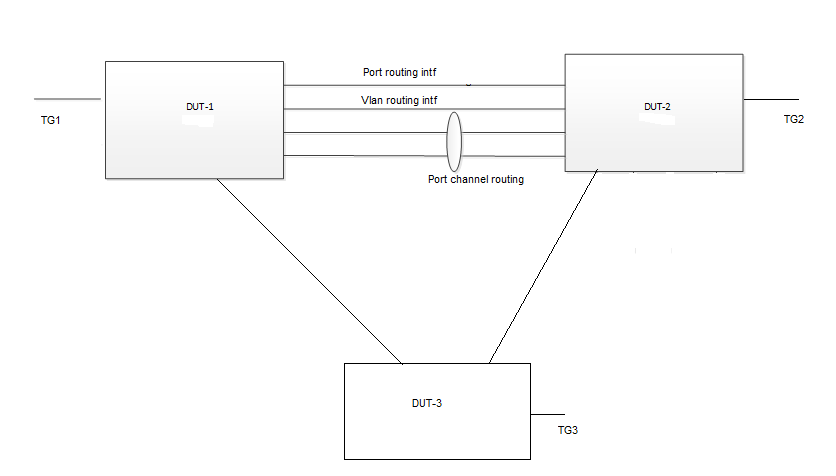

#  SQA Test Plan
#  SONIC RIF Counters
#  SONiC 4.0.0 Release

## Test Plan Revision History

| Rev  | Date       | Author          | Change Description |
| ---- | ---------- | --------------- | ------------------ |
| 0.1  | 5/20/2021 | Kesava Swamy K   | Initial Version    |
| 0.2  |            |                 |                    |

## List of Reviewers

| Function | Name |
| :------: | :--: |
|    QA      |   Chandra Bhushan Singh   |
|    DEV     |   Laveen Thamilchelvam    |

## List of Approvers

| Function | Name | Date Approved |
| :------: | :--: | :-----------: |
|          |      |               |

## Definition/Abbreviation

| **Term** | **Meaning**                |
| -------- | -------------------------- |
| RIF      | Routing Interface          |
| VRF      | Virtual Routing and Forwarding |

## Feature Overview

  This feature provide Layer 3 Routing Interface counter support in SONIC. Routing interface includes router port, L3 Port Channel, VLAN routing interface, and routed Subinterface.

## 1 Test Focus Areas

  - This Test plan covers the validation of the Routing interface counters. 

### 1.1 CLI Testing 
  - Validation of "show interface counters rif".
  - Validation of clear RIF statistics/counters command (HLD yet to be updated with actual command).
  - Validation of configuration command for the interval between two consecutive read/fetch from HW (HLD yet to be updated with actual command).

### 1.2 Functional Testing

  - Validate the Physical routing Interface RIF counters (RX/TX) for IPv4 & Ipv6 traffic in default VRF.
  - Validate the Vlan routing Interface RIF counters (RX/TX) for IPv4 & Ipv6 traffic in default VRF.
  - Validate the Port Channel routing Interface RIF counters (RX/TX) for IPv4 & Ipv6 traffic in default VRF.
  - Validate the sub interface (on physical port) routing Interface RIF counters (RX/TX) for IPv4 & Ipv6 traffic in default VRF.
  - Validate the Sub interface (on Physical Interface) RIF counters (RX/TX) for IPv4 & Ipv6 traffic, with parent interface also having IPv4/Ipv6 address configured. 
  - Validate the sub interface (on port channel interface) routing Interface RIF counters (RX/TX) for IPv4 & Ipv6 traffic in default VRF.
  - Validate the Sub interface (on Port Channel Interface) RIF counters (RX/TX) for IPv4 & Ipv6 traffic, with parent Port Channel interface also having IPv4/Ipv6 address configured.
  - Validate the Physical routing Interface RIF counters (RX/TX) for IPv4 & Ipv6 traffic in user VRF.
  - Validate the Vlan routing Interface RIF counters (RX/TX) for IPv4 & Ipv6 traffic in user VRF.
  - Validate the Port Channel routing Interface RIF counters (RX/TX) for IPv4 & Ipv6 traffic in user VRF.
  - Validate the sub interface (on physical port) routing Interface RIF counters (RX/TX) for IPv4 & Ipv6 traffic in user VRF.
  - Validate the sub interface (on port channel interface) routing Interface RIF counters (RX/TX) for IPv4 & Ipv6 traffic in user VRF.
  - Validate the Vlan routing (over port channel interface) Interface RIF counters (RX/TX) for IPv4 & Ipv6 traffic in user VRF.
  - Verify that RIF counters are updated properly after VRF binding is removed and re added.
  - Validate Clear counters command, clears all RIF counters.
  - Validate that after warm boot, RIF counters are reset to zero and gets updated again.
  - Validate that after Reboot/Fast reboot, RIF counters are updated properly.
  - Validate the configurability of "interval between two consecutive read/fetch from HW" and check the counters are getting updated as per configured interval.
  - Verify that PortChannel routing interface RIF counters are updated properly after port channel member ports are removed and re added.
  - Verify that Vlan routing interface RIF counters are updated properly after Vlan member port association is removed and re added.
  - Verify that Physical routing interface RIF counters are updated properly after shut no shut on the port.
  - Verify the RIF counters on Vlan interface having SAG configured for IPv4/IPv6.
  - Verify the RIF counters over mclag peer-link (port channel) for IPv4/Ipv6 traffic. 
  - Verify the RIF counters for control traffic - BGP/MCLAG.
  - Verify the RIF counters for ARP/ND control traffic.
  - Verify the RIF counters for different frame sizes.
  - Verify the RIF counters when traffic is continuously set to flow and counters value increment to max value.
  - Verify that RIF counters not updated for L2 traffic received.  
  - Verify that RIF counters not updated for L3 packets received with errors.  
  

## 2 Topologies

 

#### 								Topology 1
Topology Description -
 - Configure one Port based, one Vlan based, one Port channel based routing (IPv4/IPv6) interface over the links connecting the DUTs.
 - Configure the TG connected interfaces as routing interfaces with hosts configured on TG side.
 - In DUT1, configure 3 different static (IPv4/IPv6) routes with next hops set to Port, Vlan and Port Channel routing interfaces respectively towards DUT2.
 - In DUT2, configure 3 different static (IPv4/IPv6) routes with next hops set to Port, Vlan and Port Channel routing interfaces respectively towards DUT1.
 - In both the DUTs, configure a default (IPv4/IPv6) route with TG host as next hop.
 - In both the DUTs, configure a user VRF (This will be used in user VRF related tests.)
 - Traffic will be sent to any destination IP in each of those static routes, and counters on the corresponding next hop routing interface gets validated.
 - For each traffic flow between TG1<->TG2, RIF counters will be validated in RX/TX direction in the corresponding DUT based on the traffic flow.
 - For MCLAG and SAG interface counters validation, DUT3 will be sued as mclag client, and corresponding mclag port channel and other client Vlan will be configured in the respective test cases.

## 3 Test Case and objectives

### 3.1 CLI Test Cases

#### 3.1.1 Validate CLI command "show interface counters rif". 

| **Test ID**    | **FtOpSoRoRifCoCli001**                                               |
| -------------- | :----------------------------------------------------------- |
| **Test Name**  | **Validate CLI command "show interface counters rif".**      |
| **Test Setup** | **Topology 1**                                               |
| **Type**       | **CLI**                                               |
| **Steps**      | 1. Validate CLI options for "show interface counters rif".|

#### 3.1.2 Validate CLI command for clear interface rif counters (Command yet to be updated in HLD). 

| **Test ID**    | **FtOpSoRoRifCoCli002**                                               |
| -------------- | :----------------------------------------------------------- |
| **Test Name**  | **Validate CLI command for clear interface rif counters (Command yet to be updated in HLD).**|
| **Test Setup** | **Topology 1**                                               |
| **Type**       | **CLI**                                               |
| **Steps**      | 1. Validate CLI options for clear interface rif counters (Command yet to be updated in HLD)".|

#### 3.1.3 Validate CLI command for "interval between two consecutive read/fetch from HW" (Command yet to be updated in HLD). 

| **Test ID**    | **FtOpSoRoRifCoCli003**                                               |
| -------------- | :----------------------------------------------------------- |
| **Test Name**  | **Validate CLI command for "interval between two consecutive read/fetch from HW" (Command yet to be updated in HLD).**|
| **Test Setup** | **Topology 1**                                               |
| **Type**       | **CLI**                                               |
| **Steps**      | 1. Validate CLI options for "interval between two consecutive read/fetch from HW" (Command yet to be updated in HLD)".|

### 3.2 Functional Test Cases

#### 3.2.1 Validate the Physical Routing Interface RIF counters (RX/TX) for IPv4 & Ipv6 traffic in default VRF.  

| **Test ID**    | **FtOpSoRoRifCoFun001**                                               |
| -------------- | :----------------------------------------------------------- |
| **Test Name**  | **Validate the Physical Routing Interface RIF counters (RX/TX) for IPv4 & Ipv6 traffic in default VRF.** |
| **Test Setup** | **Topology 1**                                               |
| **Type**       | **Functional**                                               |
| **Steps**      | 1. From TG1, send IPv4 traffic destined to a network (route having physical routing interface as next hop).  2. While traffic is forwarding, in DUT1, verify the TX_BPS, TX_PPS counters corresponding to that physical routing interface.  3. While traffic is forwarding, in DUT2, verify the RX_BPS, RX_PPS counters corresponding to that physical routing interface.  4.Stop the traffic.  5. Verify the TX_OK counters in DUT1 and RX_OK counters in DUT2 corresponding to the physical routing interface.  6. Clear the interface counters for rif, verify the counters are cleared successfully.  7. From TG1, send IPv6 traffic destined to a network (having physical routing interface as next hop).  8. While traffic is forwarding, in DUT1, verify the TX_BPS, TX_PPS counters corresponding to that physical routing interface.  9. While traffic is forwarding, in DUT2, verify the RX_BPS, RX_PPS counters corresponding to that physical routing interface.  10.Stop the traffic.  11. Verify the TX_OK counters in DUT1 and RX_OK counters in DUT2 corresponding to the physical routing interface.  12. Clear the rif counters and check the counters are cleared successfully.|

#### 3.2.2 Validate the Vlan Routing Interface RIF counters (RX/TX) for IPv4 & Ipv6 traffic in default VRF.  

| **Test ID**    | **FtOpSoRoRifCoFun002**                                               |
| -------------- | :----------------------------------------------------------- |
| **Test Name**  | **Validate the Vlan Routing Interface RIF counters (RX/TX) for IPv4 & Ipv6 traffic in default VRF.** |
| **Test Setup** | **Topology 1**                                               |
| **Type**       | **Functional**                                               |
| **Steps**      | 1. From TG1, send IPv4 traffic destined to a network (route having Vlan routing interface as next hop).  2. While traffic is forwarding, in DUT1, verify the TX_BPS, TX_PPS counters corresponding to that Vlan routing interface.  3. While traffic is forwarding, in DUT2, verify the RX_BPS, RX_PPS counters corresponding to that Vlan routing interface.  4.Stop the traffic.  5. Verify the TX_OK counters in DUT1 and RX_OK counters in DUT2 corresponding to the Vlan routing interface.  6. Clear the interface counters for rif, verify the counters are cleared successfully.  7. From TG1, send IPv6 traffic destined to a network (having Vlan routing interface as next hop).  8. While traffic is forwarding, in DUT1, verify the TX_BPS, TX_PPS counters corresponding to that Vlan routing interface.  9. While traffic is forwarding, in DUT2, verify the RX_BPS, RX_PPS counters corresponding to that Vlan routing interface.  10.Stop the traffic.  11. Verify the TX_OK counters in DUT1 and RX_OK counters in DUT2 corresponding to the Vlan routing interface.  12. Clear the rif counters and check the counters are cleared successfully.|

#### 3.2.3 Validate the Port Channel Routing Interface RIF counters (RX/TX) for IPv4 & Ipv6 traffic in default VRF.  

| **Test ID**    | **FtOpSoRoRifCoFun003**                                               |
| -------------- | :----------------------------------------------------------- |
| **Test Name**  | **Validate the Port Channel Routing Interface RIF counters (RX/TX) for IPv4 & Ipv6 traffic in default VRF.** |
| **Test Setup** | **Topology 1**                                               |
| **Type**       | **Functional**                                               |
| **Steps**      | 1. From TG1, send IPv4 traffic destined to a network (route having Port Channel routing interface as next hop).  2. While traffic is forwarding, in DUT1, verify the TX_BPS, TX_PPS counters corresponding to that Port Channel routing interface.  3. While traffic is forwarding, in DUT2, verify the RX_BPS, RX_PPS counters corresponding to that Port Channel routing interface.  4.Stop the traffic.  5. Verify the TX_OK counters in DUT1 and RX_OK counters in DUT2 corresponding to the Port Channel routing interface.  6. Clear the interface counters for rif, verify the counters are cleared successfully.  7. From TG1, send IPv6 traffic destined to a network (having Port Channel routing interface as next hop).  8. While traffic is forwarding, in DUT1, verify the TX_BPS, TX_PPS counters corresponding to that Port Channel routing interface.  9. While traffic is forwarding, in DUT2, verify the RX_BPS, RX_PPS counters corresponding to that Port Channel routing interface.  10.Stop the traffic.  11. Verify the TX_OK counters in DUT1 and RX_OK counters in DUT2 corresponding to the Port Channel routing interface.  12. Clear the rif counters and check the counters are cleared successfully.|

#### 3.2.4 Validate the Sub interface (on Physical Interface) RIF counters (RX/TX) for IPv4 & Ipv6 traffic in default VRF.  

| **Test ID**    | **FtOpSoRoRifCoFun004**                                               |
| -------------- | :----------------------------------------------------------- |
| **Test Name**  | **Validate the Sub interface (on Physical Interface) RIF counters (RX/TX) for IPv4 & Ipv6 traffic in default VRF.** |
| **Test Setup** | **Topology 1**                                               |
| **Type**       | **Functional**                                               |
| **Steps**      | 1. Remove the IPv4/IPv6 address on the physical routing interface and configure a sub interface over that physical interface with those removed IPv4/Ipv6 address.  2. From TG1, send IPv4 traffic destined to a network (route having above sub interface as next hop).  3. While traffic is forwarding, in DUT1, verify the TX_BPS, TX_PPS counters on the sub interface corresponding to that physical routing interface. RIF counters for that physical interface should not get updated.  4. While traffic is forwarding, in DUT2, verify the RX_BPS, RX_PPS counters on the sub interface corresponding to that physical routing interface. RIF counters for that physical interface should not get updated.  5.Stop the traffic.  6. Verify the TX_OK counters in DUT1 and RX_OK counters in DUT2 for the sub interface corresponding to the physical routing interface.  7. Clear the interface counters for rif, verify the counters are cleared successfully on sub interface.  8. From TG1, send IPv6 traffic destined to a network (having sub interface as next hop).  9. While traffic is forwarding, in DUT1, verify the TX_BPS, TX_PPS counters on sub interface corresponding to that physical routing interface. RIF counters for that physical interface should not get updated.  10. While traffic is forwarding, in DUT2, verify the RX_BPS, RX_PPS counters on sub interface corresponding to that physical routing interface. RIF counters for that physical interface should not get updated.  11.Stop the traffic.  12. Verify the TX_OK counters in DUT1 and RX_OK counters in DUT2 for the sub interface corresponding to the physical routing interface.  13. Clear the rif counters and check the counters are cleared successfully.  14. Revert the sub interface config to physical routing interface.|

#### 3.2.5 Validate the Sub interface (on Physical Interface) RIF counters (RX/TX) for IPv4 & Ipv6 traffic, with parent interface also having IPv4/Ipv6 address configured.  

| **Test ID**    | **FtOpSoRoRifCoFun005**                                               |
| -------------- | :----------------------------------------------------------- |
| **Test Name**  | **Validate the Sub interface (on Physical Interface) RIF counters (RX/TX) for IPv4 & Ipv6 traffic, with parent interface also having IPv4/Ipv6 address configured.** |
| **Test Setup** | **Topology 1**                                               |
| **Type**       | **Functional**                                               |
| **Steps**      | 1. On the physical routing interface, configure a sub interface with different IPv4/Ipv6 address.  2. Configure a different IPv4/IPv6 static route with sub interface ip as next hops in DUT1, DUT2.  3. From TG1, send IPv4 traffic destined to a network (route having above sub interface as next hop).  4. While traffic is forwarding, in DUT1, verify the TX_BPS, TX_PPS counters on the sub interface. RIF counters for that physical routing interface should not get updated.  5. While traffic is forwarding, in DUT2, verify the RX_BPS, RX_PPS counters on the sub interface. RIF counters for that physical interface should not get updated.  6.Stop the traffic.  7. Verify the TX_OK counters in DUT1 and RX_OK counters in DUT2 for the sub interface.  8. Clear the interface counters for rif, verify the counters are cleared successfully on sub interface.  9. From TG1, send IPv4 traffic destined to a network (having parent routing interface as next hop).  10. While traffic is forwarding, in DUT1, verify the TX_BPS, TX_PPS counters on parent routing interface. RIF counters for that sub interface interface should not get updated for this traffic.  11. While traffic is forwarding, in DUT2, verify the RX_BPS, RX_PPS counters on parent routing interface. RIF counters of the corresponding sub interface should not get updated for this traffic.  12.Stop the traffic.  13. Verify the TX_OK counters in DUT1 and RX_OK counters in DUT2 for the parent routing interface.  14. Clear the rif counters and check the counters are cleared successfully.  15. Repeat the test for IPv6 traffic.  16. Revert the sub interface config.|

#### 3.2.6 Validate the Sub interface (on Port Channel Interface) RIF counters (RX/TX) for IPv4 & Ipv6 traffic in default VRF.  

| **Test ID**    | **FtOpSoRoRifCoFun006**                                               |
| -------------- | :----------------------------------------------------------- |
| **Test Name**  | **Validate the Sub interface (on Port Channel Interface) RIF counters (RX/TX) for IPv4 & Ipv6 traffic in default VRF.** |
| **Test Setup** | **Topology 1**                                               |
| **Type**       | **Functional**                                               |
| **Steps**      | 1. Remove the IPv4/Ipv6 address on the Port Channel routing interface and configure a sub interface over that Port Channel interface with those removed IPv4/Ipv6 address.  2. From TG1, send IPv4 traffic destined to a network (route having above sub interface as next hop).  2. While traffic is forwarding, in DUT1, verify the TX_BPS, TX_PPS counters on sub interface corresponding to that Port Channel routing interface. RIF counters for that physical interface should not get updated.  3. While traffic is forwarding, in DUT2, verify the RX_BPS, RX_PPS counters on the sub interface corresponding to that Port Channel routing interface. RIF counters for that physical interface should not get updated.  4.Stop the traffic.  5. Verify the TX_OK counters in DUT1 and RX_OK counters in DUT2 corresponding to the Port Channel routing interface.  6. Clear the interface counters for rif, verify the counters are cleared successfully.  7. From TG1, send IPv6 traffic destined to a network (having Port Channel routing interface as next hop).  8. While traffic is forwarding, in DUT1, verify the TX_BPS, TX_PPS counters corresponding to that Port Channel routing interface.  9. While traffic is forwarding, in DUT2, verify the RX_BPS, RX_PPS counters corresponding to that Port Channel routing interface.  10.Stop the traffic.  11. Verify the TX_OK counters in DUT1 and RX_OK counters in DUT2 corresponding to the Port Channel routing interface.  12. Clear the rif counters and check the counters are cleared successfully.|

#### 3.2.7 Validate the Sub interface (on Port Channel Interface) RIF counters (RX/TX) for IPv4 & Ipv6 traffic, with parent Port Channel interface also having IPv4/Ipv6 address configured.  

| **Test ID**    | **FtOpSoRoRifCoFun007**                                               |
| -------------- | :----------------------------------------------------------- |
| **Test Name**  | **Validate the Sub interface (on Port Channel Interface) RIF counters (RX/TX) for IPv4 & Ipv6 traffic, with parent Port Channel interface also having IPv4/Ipv6 address configured.** |
| **Test Setup** | **Topology 1**                                               |
| **Type**       | **Functional**                                               |
| **Steps**      | 1. On the Port channel routing interface, configure a sub interface with different IPv4/Ipv6 address.  2. Configure a different IPv4/IPv6 static route with sub interface as next hops in DUT1, DUT2.  3. From TG1, send IPv4 traffic destined to a network (route having above sub interface as next hop).  4. While traffic is forwarding, in DUT1, verify the TX_BPS, TX_PPS counters on the sub interface. RIF counters for that physical routing interface should not get updated.  5. While traffic is forwarding, in DUT2, verify the RX_BPS, RX_PPS counters on the sub interface. RIF counters for that Port Channel routing interface should not get updated.  6.Stop the traffic.  7. Verify the TX_OK counters in DUT1 and RX_OK counters in DUT2 for the sub interface.  8. Clear the interface counters for rif, verify the counters are cleared successfully on sub interface.  9. From TG1, send IPv4 traffic destined to a network (having parent routing interface as next hop).  10. While traffic is forwarding, in DUT1, verify the TX_BPS, TX_PPS counters on parent Port Channel routing interface. RIF counters for that sub interface interface should not get updated for this traffic.  11. While traffic is forwarding, in DUT2, verify the RX_BPS, RX_PPS counters on parent Port Channel routing interface. RIF counters of the corresponding sub interface should not get updated for this traffic.  12.Stop the traffic.  13. Verify the TX_OK counters in DUT1 and RX_OK counters in DUT2 for the parent routing interface.  14. Clear the rif counters and check the counters are cleared successfully.  15. Repeat the test for IPv6 traffic.  16. Revert the sub interface config.|

#### 3.2.8 Validate the Physical Routing Interface RIF counters (RX/TX) for IPv4 & Ipv6 traffic in user VRF.  

| **Test ID**    | **FtOpSoRoRifCoFun008**                                               |
| -------------- | :----------------------------------------------------------- |
| **Test Name**  | **Validate the Physical Routing Interface RIF counters (RX/TX) for IPv4 & Ipv6 traffic in user VRF.** |
| **Test Setup** | **Topology 1**                                               |
| **Type**       | **Functional**                                               |
| **Steps**      | 1. (Change in the config, move all the routing interfaces to user VRF) From TG1, send IPv4 traffic destined to a network (having physical routing interface as next hop).  2. While traffic is forwarding, in DUT1, verify the TX_BPS, TX_PPS counters corresponding to that physical routing interface.  3. While traffic is forwarding, in DUT2, verify the RX_BPS, RX_PPS counters corresponding to that physical routing interface.  4.Stop the traffic.  5. Verify the TX_OK counters in DUT1 and RX_OK counters in DUT2 corresponding to the physical routing interface.  6. Clear the interface counters for rif, verify the counters are cleared successfully.  7. From TG1, send IPv6 traffic destined to a network (having physical routing interface as next hop).  8. While traffic is forwarding, in DUT1, verify the TX_BPS, TX_PPS counters corresponding to that physical routing interface.  9. While traffic is forwarding, in DUT2, verify the RX_BPS, RX_PPS counters corresponding to that physical routing interface.  10.Stop the traffic.  11. Verify the TX_OK counters in DUT1 and RX_OK counters in DUT2 corresponding to the physical routing interface.|

#### 3.2.9 Validate the Vlan Routing Interface RIF counters (RX/TX) for IPv4 & Ipv6 traffic in user VRF.  

| **Test ID**    | **FtOpSoRoRifCoFun009**                                               |
| -------------- | :----------------------------------------------------------- |
| **Test Name**  | **Validate the Vlan Routing Interface RIF counters (RX/TX) for IPv4 & Ipv6 traffic in user VRF.** |
| **Test Setup** | **Topology 1**                                               |
| **Type**       | **Functional**                                               |
| **Steps**      | 1. (Change in the config, move all the routing interfaces to user VRF) From TG1, send IPv4 traffic destined to a network (route having Vlan routing interface as next hop).  2. While traffic is forwarding, in DUT1, verify the TX_BPS, TX_PPS counters corresponding to that Vlan routing interface.  3. While traffic is forwarding, in DUT2, verify the RX_BPS, RX_PPS counters corresponding to that Vlan routing interface.  4.Stop the traffic.  5. Verify the TX_OK counters in DUT1 and RX_OK counters in DUT2 corresponding to the Vlan routing interface.  6. Clear the interface counters for rif, verify the counters are cleared successfully.  7. From TG1, send IPv6 traffic destined to a network (having Vlan routing interface as next hop).  8. While traffic is forwarding, in DUT1, verify the TX_BPS, TX_PPS counters corresponding to that Vlan routing interface.  9. While traffic is forwarding, in DUT2, verify the RX_BPS, RX_PPS counters corresponding to that Vlan routing interface.  10.Stop the traffic.  11. Verify the TX_OK counters in DUT1 and RX_OK counters in DUT2 corresponding to the Vlan routing interface.|

#### 3.2.10 Validate the Port Channel Routing Interface RIF counters (RX/TX) for IPv4 & Ipv6 traffic in user VRF.  

| **Test ID**    | **FtOpSoRoRifCoFun010**                                               |
| -------------- | :----------------------------------------------------------- |
| **Test Name**  | **Validate the Port Channel Routing Interface RIF counters (RX/TX) for IPv4 & Ipv6 traffic in user VRF.** |
| **Test Setup** | **Topology 1**                                               |
| **Type**       | **Functional**                                               |
| **Steps**      | 1. (Change in the config, move all the routing interfaces to user VRF) From TG1, send IPv4 traffic destined to a network (route having Port Channel routing interface as next hop).  2. While traffic is forwarding, in DUT1, verify the TX_BPS, TX_PPS counters corresponding to that Port Channel routing interface.  3. While traffic is forwarding, in DUT2, verify the RX_BPS, RX_PPS counters corresponding to that Port Channel routing interface.  4.Stop the traffic.  5. Verify the TX_OK counters in DUT1 and RX_OK counters in DUT2 corresponding to the Port Channel routing interface.  6. Clear the interface counters for rif, verify the counters are cleared successfully.  7. From TG1, send IPv6 traffic destined to a network (having Port Channel routing interface as next hop).  8. While traffic is forwarding, in DUT1, verify the TX_BPS, TX_PPS counters corresponding to that Port Channel routing interface.  9. While traffic is forwarding, in DUT2, verify the RX_BPS, RX_PPS counters corresponding to that Port Channel routing interface.  10.Stop the traffic.  11. Verify the TX_OK counters in DUT1 and RX_OK counters in DUT2 corresponding to the Port Channel routing interface.|

#### 3.2.11 Validate the Sub interface (on Physical Interface) RIF counters (RX/TX) for IPv4 & Ipv6 traffic in user VRF.  

| **Test ID**    | **FtOpSoRoRifCoFun011**                                               |
| -------------- | :----------------------------------------------------------- |
| **Test Name**  | **Validate the Sub interface (on Physical Interface) RIF counters (RX/TX) for IPv4 & Ipv6 traffic in default VRF.** |
| **Test Setup** | **Topology 1**                                               |
| **Type**       | **Functional**                                               |
| **Steps**      | 1. (Change in the config, move all the routing interfaces to user VRF) Remove the IPv4/IPv6 address on the physical routing interface and configure a sub interface over that physical interface with those removed IPv4/Ipv6 address.  2. From TG1, send IPv4 traffic destined to a network (route having above sub interface as next hop).  3. While traffic is forwarding, in DUT1, verify the TX_BPS, TX_PPS counters on the sub interface corresponding to that physical routing interface. RIF counters for that physical interface should not get updated.  4. While traffic is forwarding, in DUT2, verify the RX_BPS, RX_PPS counters on the sub interface corresponding to that physical routing interface. RIF counters for that physical interface should not get updated.  5.Stop the traffic.  6. Verify the TX_OK counters in DUT1 and RX_OK counters in DUT2 for the sub interface corresponding to the physical routing interface.  7. Clear the interface counters for rif, verify the counters are cleared successfully on sub interface.  8. From TG1, send IPv6 traffic destined to a network (having sub interface as next hop).  9. While traffic is forwarding, in DUT1, verify the TX_BPS, TX_PPS counters on sub interface corresponding to that physical routing interface. RIF counters for that physical interface should not get updated.  10. While traffic is forwarding, in DUT2, verify the RX_BPS, RX_PPS counters on sub interface corresponding to that physical routing interface. RIF counters for that physical interface should not get updated.  11.Stop the traffic.  12. Verify the TX_OK counters in DUT1 and RX_OK counters in DUT2 for the sub interface corresponding to the physical routing interface.  13. Clear the rif counters and check the counters are cleared successfully.  14. Revert the sub interface config to physical routing interface.|

#### 3.2.12 Validate the Sub interface (on Port Channel Interface) RIF counters (RX/TX) for IPv4 & Ipv6 traffic in user VRF.  

| **Test ID**    | **FtOpSoRoRifCoFun012**                                               |
| -------------- | :----------------------------------------------------------- |
| **Test Name**  | **Validate the Sub interface (on Port Channel Interface) RIF counters (RX/TX) for IPv4 & Ipv6 traffic in default VRF.** |
| **Test Setup** | **Topology 1**                                               |
| **Type**       | **Functional**                                               |
| **Steps**      | 1. (Change in the config, move all the routing interfaces to user VRF) Remove the IPv4/Ipv6 address on the Port Channel routing interface and configure a sub interface over that Port Channel interface with those removed IPv4/Ipv6 address.  2. From TG1, send IPv4 traffic destined to a network (route having above sub interface as next hop).  2. While traffic is forwarding, in DUT1, verify the TX_BPS, TX_PPS counters on sub interface corresponding to that Port Channel routing interface. RIF counters for that physical interface should not get updated.  3. While traffic is forwarding, in DUT2, verify the RX_BPS, RX_PPS counters on the sub interface corresponding to that Port Channel routing interface. RIF counters for that Port Channel interface should not get updated.  4.Stop the traffic.  5. Verify the TX_OK counters in DUT1 and RX_OK counters in DUT2 corresponding to the Port Channel routing interface.  6. Clear the interface counters for rif, verify the counters are cleared successfully.  7. From TG1, send IPv6 traffic destined to a network (having Port Channel routing interface as next hop).  8. While traffic is forwarding, in DUT1, verify the TX_BPS, TX_PPS counters corresponding to that Port Channel routing interface.  9. While traffic is forwarding, in DUT2, verify the RX_BPS, RX_PPS counters corresponding to that Port Channel routing interface.  10.Stop the traffic.  11. Verify the TX_OK counters in DUT1 and RX_OK counters in DUT2 corresponding to the Port Channel routing interface.  12. Clear the rif counters and check the counters are cleared successfully.|

#### 3.2.13 Validate the Vlan routing (over Port channel interface) Interface RIF counters (RX/TX) for IPv4 & Ipv6 traffic.  

| **Test ID**    | **FtOpSoRoRifCoFun013**                                               |
| -------------- | :----------------------------------------------------------- |
| **Test Name**  | **Validate the Vlan routing (over Port channel interface) Interface RIF counters (RX/TX) for IPv4 & Ipv6 traffic.** |
| **Test Setup** | **Topology 1**                                               |
| **Type**       | **Functional**                                               |
| **Steps**      | 1. Remove the IPv4/IPv6 address on the Port Channel routing interface and configure two vlan routing interface over that Port Channel one in default VRF and another in user VRF with same IPv4/IPv6 address. Also configure the static routes for traffic flow.  2. From TG1, send IPv4 traffic destined to a network (route having above vlan routing interface as next hop in default VRF).  2. While traffic is forwarding, in DUT1, verify the TX_BPS, TX_PPS counters on Vlan routing interface corresponding to that Port Channel routing interface. RIF counters for other Vlan routing interface in user VRF should not get updated.  3. While traffic is forwarding, in DUT2, verify the RX_BPS, RX_PPS counters on the Vlan routing interface corresponding to that Port Channel routing interface. RIF counters for other Vlan routing interface in user VRF should not get updated.  4.Stop the traffic.  5. Verify the TX_OK counters in DUT1 and RX_OK counters in DUT2 corresponding to the Vlan routing interface.  6. Clear the interface counters for rif, verify the counters are cleared successfully.  7. (Move the TG ports to user VRF) From TG1, send IPv4 traffic destined to a network (having Vlan routing interface as next hop in user VRF).  8. While traffic is forwarding, in DUT1, verify the TX_BPS, TX_PPS counters corresponding to that Vlan routing interface. RIF counters for other Vlan routing interface in default VRF should not get updated.  9. While traffic is forwarding, in DUT2, verify the RX_BPS, RX_PPS counters corresponding to that Vlan routing interface. RIF counters for other Vlan routing interface in default VRF should not get updated.  10.Stop the traffic.  11. Verify the TX_OK counters in DUT1 and RX_OK counters in DUT2 corresponding to the Vlan routing interface.  12. Clear the rif counters and check the counters are cleared successfully.  13. Repeat the same test for Ipv6 traffic.|

#### 3.2.14 Verify that RIF counters are updated properly after vrf binding is removed and re added.  

| **Test ID**    | **FtOpSoRoRifCoFun014**                                               |
| -------------- | :----------------------------------------------------------- |
| **Test Name**  | **Verify that RIF counters are updated properly after vrf binding is removed and re added.** |
| **Test Setup** | **Topology 1**                                               |
| **Type**       | **Functional**                                               |
| **Steps**      | 1. For all different types of routing interfaces, remove and re bind the user VRF.  2. After that check the RIF counters for Ipv4 and IPv6 traffic flow.  3. This scenario gets validated in the corresponding user VRF tests.|

#### 3.2.15 Validate Clear counters command, clears all RIF counters.  

| **Test ID**    | **FtOpSoRoRifCoFun015**                                               |
| -------------- | :----------------------------------------------------------- |
| **Test Name**  | **Validate Clear counters command, clears all RIF counters.** |
| **Test Setup** | **Topology 1**                                               |
| **Type**       | **Functional**                                               |
| **Steps**      | 1. The validation of the clear counters command is internally covered in most of the tests.|

#### 3.2.16 Validate that after Warm boot, RIF counters are reset to zero and gets updated again.  

| **Test ID**    | **FtOpSoRoRifCoFun016**                                               |
| -------------- | :----------------------------------------------------------- |
| **Test Name**  | **Validate that after Warm boot, RIF counters are reset to zero and gets updated again.** |
| **Test Setup** | **Topology 1**                                               |
| **Type**       | **Functional**                                               |
| **Steps**      | 1. Send different traffic flows between TG1-TG2 such that corresponding routing interface counters (RX/TX) gets updated.  2. Stop the traffic.  3. Save configuration and perform Warm boot.  4. After DUT comes UP, check the rif counters reset to zero.  5. Send the traffic again, and check rif counters updated properly after Warm boot.|

#### 3.2.17 Validate the RIF counters after reboot/fast boot. 

| **Test ID**    | **FtOpSoRoRifCoFun017**                                               |
| -------------- | :----------------------------------------------------------- |
| **Test Name**  | **Validate the RIF counters after reboot/fast boot.** |
| **Test Setup** | **Topology 1**                                               |
| **Type**       | **Functional**                                               |
| **Steps**      | 1. Save configuration and perform reboot.  2. After DUT comes UP, check the rif counters by sending the corresponding traffic such that different routing interface rif counters update in setup.  3. Repeat the same for fast boot.|

#### 3.2.18 Validate the configurability of "interval between two consecutive read/fetch from HW" and check the counters are getting updated as per configured interval. 

| **Test ID**    | **FtOpSoRoRifCoFun018**                                               |
| -------------- | :----------------------------------------------------------- |
| **Test Name**  | **Validate the configurability of "interval between two consecutive read/fetch from HW" and check the counters are getting updated as per configured interval.** |
| **Test Setup** | **Topology 1**                                               |
| **Type**       | **Functional**                                               |
| **Steps**      | 1. configure non-default value for "interval between two consecutive read/fetch from HW" .  2. Send the continuous (IPv4/IPv6)traffic such that different routing interface rif counters update in setup.  3. Check that counters are getting updated as per the configured interval.  4. Repeat the test with min and max values of the configurability range for this interval.|

#### 3.2.19 Verify that Port Channel routing interface RIF counters are updated properly after port channel member ports are removed and re added.

| **Test ID**    | **FtOpSoRoRifCoFun019**                                               |
| -------------- | :----------------------------------------------------------- |
| **Test Name**  | **Verify that Port Channel routing interface RIF counters are updated properly after port channel member ports are removed and re added.** |
| **Test Setup** | **Topology 1**                                               |
| **Type**       | **Functional**                                               |
| **Steps**      |1. From TG1, send IPv4/Ipv6 traffic destined to a network (route having Port Channel routing interface as next hop).  2. While traffic is forwarding, in DUT1 remove the member ports in Port Channel and re add them. After Port Channel is UP and traffic forwarding, verify the TX_BPS, TX_PPS counters corresponding to that Port Channel routing interface.  3. While traffic is forwarding, in DUT2, verify the RX_BPS, RX_PPS counters corresponding to that Port Channel routing interface.  4.Stop the traffic.  5. Verify the TX_OK counters in DUT1 and RX_OK counters in DUT2 corresponding to the Port Channel routing interface.|

#### 3.2.20 Verify that Vlan routing interface RIF counters are updated properly after Vlan member port association is removed and re added.

| **Test ID**    | **FtOpSoRoRifCoFun020**                                               |
| -------------- | :----------------------------------------------------------- |
| **Test Name**  | **Verify that Vlan routing interface RIF counters are updated properly after Vlan member port association is removed and re added.** |
| **Test Setup** | **Topology 1**                                               |
| **Type**       | **Functional**                                               |
| **Steps**      |1. From TG1, send IPv4/IPv6 traffic destined to a network (route having Vlan routing interface as next hop).  2. While traffic is forwarding, in DUT1 remove the Vlan member port and re add it. After Vlan routing interface is UP and traffic forwarding, verify the TX_BPS, TX_PPS counters corresponding to that vlan routing interface.  3. While traffic is forwarding, in DUT2, verify the RX_BPS, RX_PPS counters corresponding to that Vlan routing interface.  4.Stop the traffic.  5. Verify the TX_OK counters in DUT1 and RX_OK counters in DUT2 corresponding to the Vlan routing interface.|

#### 3.2.21 Verify that Physical routing interface RIF counters are updated properly after shut no shut on the port.  

| **Test ID**    | **FtOpSoRoRifCoFun021**                                               |
| -------------- | :----------------------------------------------------------- |
| **Test Name**  | **Verify that Physical routing interface RIF counters are updated properly after shut no shut on the port.** |
| **Test Setup** | **Topology 1**                                               |
| **Type**       | **Functional**                                               |
| **Steps**      | 1. From TG1, send IPv4/IPv6 traffic destined to a network (route having physical routing interface as next hop).  2. While traffic is forwarding do shut no shut on the interface. After interface comes up and traffic is forwarding, verify the TX_BPS, TX_PPS counters corresponding to that physical routing interface.  3. While traffic is forwarding, in DUT2, verify the RX_BPS, RX_PPS counters corresponding to that physical routing interface.  4.Stop the traffic.  5. Verify the TX_OK counters in DUT1 and RX_OK counters in DUT2 corresponding to the physical routing interface.|

#### 3.2.22 Verify the RIF counters on Vlan interface having SAG configured for IPv4/IPv6. 

| **Test ID**    | **FtOpSoRoRifCoFun022**                                               |
| -------------- | :----------------------------------------------------------- |
| **Test Name**  | **Verify the RIF counters on Vlan interface having SAG configured for IPv4/IPv6.** |
| **Test Setup** | **Topology 1**                                               |
| **Type**       | **Functional**                                               |
| **Steps**      | 1. Configure MCLAG L3 peer link (port channel) between DUT1-DUT2 and mclag port channel between DUT1-DUT2, DUT2-DUT3.  2.Form BGP neighborship between MCLAG nodes over via vlan routing interface (on peer link port channel)  3. In both DUT1, DUT2, create a client vlan, and participate the mclag port channel and peer link port channel in that vlan.  4. Enable SAG, configure same SAG mac address on both the DUTs.  5. Configure SAG IPv4/IPv6 address on the client vlan in both the DUTs.  6. Configure a IPv4/IPv6 static route in DUT2 with TG2 as next hop.  7. From TG3 connected to DUT3 (mclag client) send the IPv4/Ipv6 traffic destined to the IPs in the static route network.  8. While traffic is forwarding verify the RX_BPS, RX_PPS, RX_OK counters corresponding to that client vlan routing interface in DUT1, DUT2.  9. Send traffic from TG2 destined to TG3, and verify the TX_OK, Tx_BPS, TX_PPS counters in DUT1, DUT2.|

#### 3.2.23 Verify the RIF counters over mclag peer-link (port channel) for IPv4/Ipv6 traffic. 

| **Test ID**    | **FtOpSoRoRifCoFun023**                                               |
| -------------- | :----------------------------------------------------------- |
| **Test Name**  | **Verify the RIF counters over mclag peer-link (port channel) for IPv4/Ipv6 traffic.** |
| **Test Setup** | **Topology 1**                                               |
| **Type**       | **Functional**                                               |
| **Steps**      | 1. Configure MCLAG L3 peer link (port channel) between DUT1-DUT2 and mclag port channel between DUT1-DUT2, DUT2-DUT3.  2. Form BGP neighborship between MCLAG nodes over via vlan routing interface (on peer link port channel)  3. In both DUT1, DUT2, create a client vlan, and participate the mclag port channel and peer link port channel in that vlan.  4. Enable SAG, configure same SAG mac address on both the DUTs.  5. Configure SAG IPv4/IPv6 address on the client vlan in both the DUTs.  6. Configure a IPv4/IPv6 static route in DUT2 with TG2 as next hop.  7. From TG3 connected to DUT3 (mclag client) send the IPv4/Ipv6 traffic destined to the IPs in the static route network.  8. While traffic is forwarding verify the RX_BPS, RX_PPS, RX_OK counters corresponding to that peer-link port channel routing interface in DUT1, DUT2.  9. Send  traffic from TG2 destined to TG3, and verify the TX_OK, Tx_BPS, TX_PPS counters in DUT1, DUT2 corresponding to the peer-link port channel routing interface.|

#### 3.2.24 Verify the RIF counters for control traffic - BGP/MCLAG 

| **Test ID**    | **FtOpSoRoRifCoFun024**                                               |
| -------------- | :----------------------------------------------------------- |
| **Test Name**  | **Verify the RIF counters for control traffic - BGP/MCLAG.** |
| **Test Setup** | **Topology 1**                                               |
| **Type**       | **Functional**                                               |
| **Steps**      | 1. With MCLAG peers configured over peer-link port channel, verify the RIF counters over the port channel and check the counters are updating for the mclag control traffic.  2. Verify the RIF counters on vlan routing interface for BGP control traffic.|

#### 3.2.25 Verify the RIF counters for ARP/ND control traffic.

| **Test ID**    | **FtOpSoRoRifCoFun025**                                               |
| -------------- | :----------------------------------------------------------- |
| **Test Name**  | **Verify the RIF counters for ARP/ND control traffic.** |
| **Test Setup** | **Topology 1**                                               |
| **Type**       | **Functional**                                               |
| **Steps**      | 1. Send ARP request/IPv6 ND packets from TG and check the RIF counters corresponding to that routing interface are getting updatied or not. 2. Repeat this for all different types of routing interfaces.|

#### 3.2.26 Verify the RIF counters for different frame sizes (in supported range).

| **Test ID**    | **FtOpSoRoRifCoFun026**                                               |
| -------------- | :----------------------------------------------------------- |
| **Test Name**  | **Verify the RIF counters for different frame sizes.** |
| **Test Setup** | **Topology 1**                                               |
| **Type**       | **Functional**                                               |
| **Steps**      | 1. Send the IPv4/IPv6 traffic with different frames sizes in supported range and check the RIF counters for different routing interfaces. (during execution/automation, this will be covered across all the test cases. In each test case, a different frame size will be used to cover the supported frame sizes.) |

#### 3.2.27 Verify the RIF counters when traffic is continuously set to flow and counters value increment to max value.

| **Test ID**    | **FtOpSoRoRifCoFun027**                                               |
| -------------- | :----------------------------------------------------------- |
| **Test Name**  | **Verify the RIF counters when traffic is continuously set to flow and counters value increment to max value.** |
| **Test Setup** | **Topology 1**                                               |
| **Type**       | **Functional**                                               |
| **Steps**      | 1. Let the Ipv4/IPv6 traffic (with random frame size in supported range) flow continuously for longer duration in the setup such that RIF counters of the different routing interfaces increment to its max values.  2. Check that after increment to max value, they are gracefully reset to zero and update again.|

### 3.3 Negative Test Cases

#### 3.3.1 Verify that RIF counters not updated for L2 traffic received.  

| **Test ID**    | **FtOpSoRoRifCoFun028**                                               |
| -------------- | :----------------------------------------------------------- |
| **Test Name**  | **Verify that RIF counters not updated for L2 traffic received.** |
| **Test Setup** | **Topology 1**                                               |
| **Type**       | **Functional**                                               |
| **Steps**      | 1. Configure the TG connected port as Vlan routing interface.  2. From TG send L2 tagged traffic with same vlan id.  3. Check that rif counters are not updated for Vlan routing interface as it is L2 traffic.|

#### 3.3.1 Verify that RIF counters not updated for L3 packets received with errors.  

| **Test ID**    | **FtOpSoRoRifCoFun028**                                               |
| -------------- | :----------------------------------------------------------- |
| **Test Name**  | **Verify that RIF counters not updated for L3 packets received with errors.** |
| **Test Setup** | **Topology 1**                                               |
| **Type**       | **Functional**                                               |
| **Steps**      | 1. Send IPv4/Ipv6 traffic with errors and check that the RIF counters are not updated for these error packets.|

### 3.4 Management

#### 3.4.1 REST

##### 3.4.1.1 Verify interface rif counters via REST

| **Test ID**    | **FtOpSoRoRifCoFun027**                                              |
| -------------- | ------------------------------------------------------------ |
| **Test Name**  | **Verify interface rif counters via REST** |
| **Test Setup** | **Topology 1**                                               |
| **Type**       | **Functional**                                               |
| **Steps**      | This test case will be covered implicitly in REST run.|

## Reference Links

https://github.com/BRCM-SONIC/sonic_doc_private/blob/992aca7e3afe2f4d8d5d06075d6f73655390628f/L3/RIFCounters/L3_RIF_Counters_HLD.md