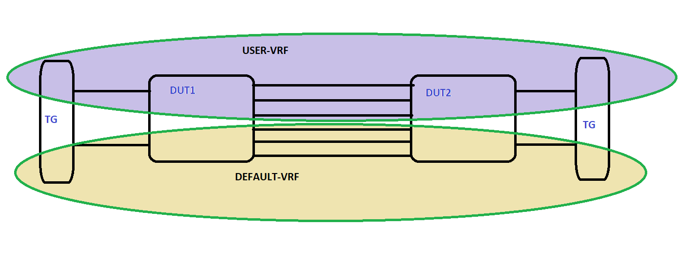

#  SQA Test Plan
#  BFD with VRF
#  SONiC 3.0 Project and Buzznik Release
[TOC]
# Test Plan Revision History
| Rev  |    Date    |        Author        | Change Description |
| :--: | :--------: | :------------------: | ------------------ |
| 0.1  | 22/10/2019 | vishnuvardhan talluri| Initial version    |

# List of Reviewers
| Function |        Name         |
| :------: | :-----------------: |
|   Dev    |  Narendra B         |
|   Dev    |  Sudhanshu kumar    |
|    QA    |  Kalyan Vadlamani   |
|    QA    |  Giri Babu Sajja    |

# List of Approvers
| Function |        Name         | Date Approved |
| :------: | :-----------------: | :-----------: |
|   Dev    |  Narendra B         |
|   Dev    |  Sudhanshu kumar    |
|    QA    |  Kalyan Vadlamani   |
|    QA    |  Giri Babu Sajja    |

# Definition/Abbreviation
| **Term** | **Meaning**                        |
| -------- | ---------------------------------- |
| BFD      | Bidirectional forwarding detection |
| VRF      | virtual route forwarding           |
| eBGP     | External border gateway protocol   |
| iBGP     | Interior border gateway protocol   |
| LAG      | Link aggregation                   |

# Feature Overview
Bidirectional Forwarding Detection, (BFD) is a protocol defined by the BFD working group at IETF. The protocol defines a method of rapid detection of the failure of a forwarding path by checking that the next hop router is alive. The protocol will be able to detect the forwarding path failure in milliseconds depending on the actual configuration.  Currently a Routing Protocol takes a few seconds (from 3 seconds to 180 seconds or even more) to detect that the neighbouring router, the next hop router, is not operational causing packet loss due to incorrect routing information. BFD is designed to provide a rapid forwarding path failure detection service to a Routing Protocol in a few milliseconds.   
BFD with Vrf provides a domain for the BFD packets. When we enable BFD on an interface, it is checked against that particular vrf. We enable BFD on the interface when the Vrf exists and the interface is bound to that vrf.  When VRF is associated with a BFD session, BFD packets are routed in that particular VRF
# 1 Test Focus Areas
## 1.1 Functional Testing 
  - All CLI related to BFD
  - Scaling with max supported of BFD sessions
  - Test on default and user VRFs
## 1.2 Negative Testing 
  -	Link flaps
  -	Reload
  -	Clear bgp
  -	Warm reboot
  -	BGP docker restart
  -	Config save and reload

## 1.3 Scale and Performance Testing

# 2 Topologies
## 2.1 Topology1 

## 2.2 Topology2, to test BFD with this topology BGP fast failover need to disable for case simulating BGP link down using shutdown

## 2.3 Solution approach to make existing module work for BFD-VRF
### We will modify the existing single-hop and multi-hop BFD modules by adding module configuration for non-default VRF instances, and reuse all the applicable scenarios. Where needed, new functions will be added to cover the scenarios described in this test plan. This will increase the minimum topology needed as we will have both the default and non-default VRF instances configured as part of the module configuration. The new topology is supported by our daily regression test beds.

# 3 Test  Case and Objectives
## 3.1 CLI
### 3.1.1 Verify cli commands for BFD single-hop with VRF

| **Test ID** | **FtOpSoRoBfdVrfCli001** |
|--------|:----------------|
| **Test Name** | **Verify cli commands for BFD single-hop with VRF** |
| **Test Setup** | **Topology1** |
| **Type** | **CLI** |
| **Steps** | **1) Verify CLI to cofigure BFD for BGP for VRF.  2) Verify CLI to configure transmit interval for VRF.  3) Verify CLI to configure receive interval for VRF.  4) Verify CLI to configure detection multiplier for VRF.  5) Verify CLI to configure echo multiplier for VRF.  6) Verify CLI to enable echo mode for VRF.  7) Verify CLI to disable echo mode for VRF.  8) Verify CLI to shutdown BFD peer for VRF.  9) Verify CLI to configure static IPv4 single hop peer for VRF.  10) Verify CLI to configure static IPv4 single hop peer with local address for VRF.  11) Verify CLI to configure static IPv4 single hop peer with interface for VRF.  12) Verify CLI to configure static IPv6 single hop peer for VRF.  13) Verify CLI to configure static IPv6 single hop peer with local address for VRF.  14) Verify CLI to configure static IPv6 single hop peer with interface for VRF.  15) Verify CLI to un-configure static IPv4 single hop peer with local address for VRF.  16) Verify CLI to un-configure static IPv4 single hop peer with interface for VRF.  17) Verify CLI to un-configure static IPv4 single hop peer for VRF.  18) Verify CLI to un-configure static IPv6 single hop peer for VRF.  19) Verify CLI to un-configure static IPv6 single hop peer with local address for VRF.  20) Verify CLI to un-configure static IPv6 single hop peer with interface for VRF.  21) Verify CLI to display IPv4 Peer for VRF.  22) Verify CLI to display IPv4 peer with local address for VRF.  23) Verify CLI to display IPv4 peer with interface for VRF.  24) Verify CLI to display IPv6 Peer for VRF.  25) Verify CLI to display IPv6 peer with local address for VRF.  26) Verify CLI to display IPv6 peer with interface for VRF.** |

### 3.1.2 Verify cli commands for BFD multi-hop with VRF

| **Test ID** | **FtOpSoRoBfdVrfCli002** |
|--------|:----------------|
| **Test Name** | **Verify cli commands for BFD multi-hop with VRF** |
| **Test Setup** | **Topology1** |
| **Type** | **CLI** |
| **Steps** | **1) Verify CLI to configure static IPv4 multi hop peer for VRF. 2) Verify CLI to configure static IPv6 multi hop peer for VRF. 3) Verify CLI to un-configure static IPv4 multi hop peer for VRF. 4)  Verify CLI to un-configure static IPv6 multi hop peer for VRF. 5) Verify CLI to display IPv4 multihop Peer for VRF. 6) Verify CLI to display IPv6 multihop Peer for VRF.**|

## 3.2 Functional
### 3.2.1 BFD for BGP establishment on single-hop IPv4&IPv6 on non-default vrf.

| **Test ID**    | **FtOpSoRoBfdVrfFn001** |
| -------------- | :----------------------------------------------------------- |
| **Test Name**  | **Verify BFD for BGP establishment on single-hop IPv4&IPv6 on non-default vrf** |
| **Test Setup** | **Topology1**    |
| **Type**       | **Functional**   |
| **Steps**      | **1) Configure non-default vrf with some name on dut1 and repeat the same on dut3.  2) Configure routing interfaces on dut1 and bind them to vrf and configure iBGP too on vrf.  3) Establish iBGP neighbor between dut1 and dut3 connected via an L2 switch dut2 to simulate remote link down events.  4) Configure BFD session between this iBGP neighbor dut1 and dut3.  5) Verify BFD session establishment for VRF.  6) Verify BFD packet transmission as per configured interval for VRF.  7) Verify BFD state notification to BGP for VRF.  8) Verify BFD session establishment trigger from BGP for VRF.  9) Verify dut allow change of BFD transmission configuration at run time for VRF, If we change the transmit-interval, the BFD peer renegotiates the receive-interval (which can change to a value different from the configured receive-interval value).  10) Verify above test scenario for IPv4&IPv6.**|

### 3.2.2 BFD for BGP functionality on single-hop IPv4&IPv6 on non-default vrf

| **Test ID**    | **FtOpSoRoBfdVrfFn002**  |
| -------------- | :----------------------------------------------------------- |
| **Test Name**  | **Verify BFD for BGP functionality on single-hop IPv4&IPv6 on non-default vrf** |
| **Test Setup** | **Topology1**    |
| **Type**       | **Functional**   |
| **Steps**      | **1) BFD for BGP on single-hop IPv4&IPv6 on non-default vrf.  2) Configure non-default vrf with some name on dut1 and repeat the same on dut3.  3) Configure routing interfaces on dut1 and bind them to vrf and configure iBGP too on vrf.  4) Establish multiple iBGP neighbors between dut1 and dut3 connected via an L2 switch dut2 to simulate remote link down events.  5) In few iBGP neighbors which for alternate path between the same set of peers use bgp peer groups to cover this too.  6)Configure BFD sessions between these iBGP neighbors dut1 and dut3.  7) Establish traffic across two end points through this BGP session.   8) Simulate link down event between the dut3 and the L2 switch dut2.  9) On dut1 BFD kicks in after configured receive-interval \* detect multiplier and BGP to teardown the session immediately.  10) Retrieve the routes learned via the above iBGP neighbor and verify that the above next hop is removed and alternate next hop is shown .  11) Monitor the traffic, observe that traffic is redirected through alternate path and based on the packet loss check convergence time to verify.  12) Verify above test scenario for IPv4&IPv6.**|

### 3.2.3 BFD functionality for IPv4&IPv6 single-hop static peer with local address & interface for non default VRF

| **Test ID**    | **FtOpSoRoBfdVrfFn003**   |
| -------------- | :----------------------------------------------------------- |
| **Test Name**  | **Verify BFD functionality for IPv4&IPv6 single-hop static peer with local address & interface for non default VRF** |
| **Test Setup** | **Topology1**   |
| **Type**       | **Functional**  |
| **Steps**      | **1) BFD for BGP on single-hop IPv4&IPv6 on non-default vrf.  2) Configure non-default vrf with some name on dut1 and repeat the same on dut3.  3) Configure routing interfaces on dut1 and bind them to vrf and configure iBGP too on vrf.  4) Establish multiple iBGP neighbors between dut1 and dut3 connected via an L2 switch dut2 to simulate remote link down events.  5) Configure BFD sessions through local-address and interface between these iBGP neighbors dut1 and dut3.  6) Establish traffic across two end points through this BGP session.   7) Simulate link down event between the dut3 and the L2 switch dut2.  8) On dut1 BFD kicks in after configured receive-interval \* detect multiplier and BGP to teardown the session immediately.  9) Retrieve the routes learned via the above iBGP neighbor and verify that the above next hop is removed and alternate next hop is shown .  10) Monitor the traffic and observe that traffic is redirected through alternate path and based on the packet loss check convergence time to verify.  11) Verify above test scenario for IPv4&IPv6.**|

### 3.2.4 BFD for BGP session timeout functionality on single-hop IPv4&IPv6 on non-default vrf

| **Test ID**    | **FtOpSoRoBfdVrfFn004**  |
| -------------- | :----------------------------------------------------------- |
| **Test Name**  | **Verify BFD for BGP session timeout functionality on single-hop IPv4&IPv6 on non-default vrf** |
| **Test Setup** | **Topology1**    |
| **Type**       | **Functional**   |
| **Steps**      | **1) Configure non-default vrf with some name on dut1 and repeat the same on dut3.  2) Configure routing interfaces on dut1 and bind them to vrf and configure iBGP too on vrf.  3) Establish multiple iBGP neighbors between dut1 and dut3 connected via an L2 switch dut2 to simulate remote link down events.  4) Configure BFD sessions between these iBGP neighbors dut1 and dut3.  5) Verify BFD sessions establishment for VRF.  6) Verify BFD session establishment trigger from BGP for VRF.  7) Verify BFD session state when deletion/shutdown of BFD peer session.  8) Verify timeout of BFD session for VRF for previous point scenario.  9) Verify timeout notification to BGP for VRF.  10) Verify BFD session state when deletion of BGP peer with BGP config for VRF.  11) Verify timeout of BFD session for VRF for previous point scenario.  12) Verify timeout notification to BGP for VRF.  13) Verify above test scenario for IPv4&IPv6.**|

### 3.2.5 BFD for BGP establishment on multi-hop IPv4&IPv6 on non-default vrf

| **Test ID**    | **FtOpSoRoBfdVrfFn005** |
| -------------- | :----------------------------------------------------------- |
| **Test Name**  | **Verify BFD for BGP establishment on multi-hop IPv4&IPv6 on non-default vrf** |
| **Test Setup** | **Topology1**   |
| **Type**       | **Functional**  |
| **Steps**      | **1) Configure non-default vrf with some name on dut1 and repeat the same on dut3.  2) Configure routing interfaces on dut1 and bind them to vrf and configure eBGP too on vrf.  3) Configure and setup multi-hop eBGP neighborship through the above VRF between dut1 and dut3 connected via an L2 switch dut2 to simulate remote link down events.  4) Configure BFD sessions between these eBGP neighbors dut1 and dut3.  5) Verify BFD session establishment for VRF.  6) Verify BFD packet transmission as per configured interval for VRF.  7) Verify BFD state notification to BGP for VRF.  8) Verify BFD session establishment trigger from BGP for VRF.  9) Verify dut allow change of BFD transmission configuration at run time for VRF, If we change the transmit-interval, the BFD peer renegotiates the receive-interval (which can change to a value different from the configured receive-interval value).  10) Verify above test scenario for IPv4&IPv6.**|

### 3.2.6 BFD for BGP functionality on multi-hop IPv4&IPv6 on non-default vrf

| **Test ID**    | **FtOpSoRoBfdVrfFn006**  |
| -------------- | :----------------------------------------------------------- |
| **Test Name**  | **Verify BFD for BGP functionality on multi-hop IPv4&IPv6 on non-default vrf** |
| **Test Setup** | **Topology1**   |
| **Type**       | **Functional**  |
| **Steps**      | **1) Configure non-default vrf with some name on dut1 and repeat the same on dut3.  2) Configure routing interfaces on dut1 and bind them to vrf and configure eBGP too on vrf.  3) Configure and setup multi-hop eBGP neighborship through the above VRF between dut1 and dut3 connected via an L2 switch dut2 to simulate remote link down events.  4) In few eBGP neighbors which for alternate path between the same set of peers use bgp peer groups to cover this too.  5) Configure BFD sessions between these eBGP neighbors dut1 and dut3.  6) Establish traffic across two end points through this BGP session.   7) Simulate link down event between the dut3 and the L2 switch dut2.  8) On dut1 BFD kicks in after configured receive-interval \* detect multiplier and BGP to teardown the session immediately.  9) Retrieve the routes learned via the above eBGP neighbor and verify that the above next hop is removed and alternate next hop is shown .  10) Monitor the traffic and observe that traffic is redirected through alternate path and based on the packet loss check convergence time to verify.  11) Verify above test scenario for IPv4&IPv6.**|

### 3.2.7 BFD for BGP session timeout functionality on multi-hop IPv4&IPv6 on non-default vrf

| **Test ID**    | **FtOpSoRoBfdVrfFn007**   |
| -------------- | :----------------------------------------------------------- |
| **Test Name**  | **Verify BFD for BGP session timeout functionality on multi-hop IPv4&IPv6 on non-default vrf** |
| **Test Setup** | **Topology1**    |
| **Type**       | **Functional**   |
| **Steps**      | **1) Configure non-default vrf with some name on dut1 and repeat the same on dut3.  2) Configure routing interfaces on dut1 and bind them to vrf and configure eBGP too on vrf.  3) Configure and setup multi-hop eBGP neighborship through the above VRF between dut1 and dut3 connected via an L2 switch dut2 to simulate remote link down events.  4) Configure BFD sessions between these eBGP neighbors dut1 and dut3.  5) Verify BFD session establishment for VRF.  6) Verify BFD session establishment trigger from BGP for VRF.  7) Verify BFD session state when deletion/shutdown of BFD peer session.  8) Verify timeout of BFD session for VRF for previous point scenario.  9) Verify timeout notification to BGP for VRF.  10) Verify BFD session state when deletion of BGP peer with BGP config for VRF.  11) Verify timeout of BFD session for VRF for previous point scenario.  12) Verify timeout notification to BGP for VRF.  13) Verify above test scenario for IPv4&IPv6.**|

### 3.2.8 BFD for BGP establishment on multi-hop IPv4&IPv6 over LAG on non-default vrf

| **Test ID**    | **FtOpSoRoBfdVrfFn008**      |
| -------------- | :----------------------------------------------------------- |
| **Test Name**  | **Verify BFD for BGP establishment on multi-hop IPv4&IPv6 over LAG on non-default vrf** |
| **Test Setup** | **Topology1**     |
| **Type**       | **Functional**    |
| **Steps**      | **1) Configure minimum of 2 dynamic portchannels(LAG) between dut1-dut2 and dut2-dut3(BFD need to bring up on dut1 and dut3, to bring up LAGs created on dut1 and dut3, creating LAGs on middle L2 switch, topology looks like d1-lag-d2-lag-d3 ).  2) Configure non-default vrf with some name on dut1 and repeat the same on dut3 via DUT2.  3) Configure vlan routing interfaces on dut1 and bind them to vrf and configure eBGP too on vrf.  4) Configure and setup multi-hop eBGP neighborship through the above VRF between dut1 and dut3 over LAG.  5) Configure BFD sessions between these eBGP neighbors dut1 and dut3.  6) Verify BFD session establishment for VRF.  7) Verify BFD packet transmission as per configured interval for VRF.  8) Verify BFD state notification to BGP for VRF.  9) Verify BFD session establishment trigger from BGP for VRF.  10) Verify above test scenario for IPv4&IPv6.**|

### 3.2.9 BFD for BGP functionality on multi-hop IPv4&IPv6 over LAG on non-default vrf

| **Test ID**    | **FtOpSoRoBfdVrfFn009**   |
| -------------- | :----------------------------------------------------------- |
| **Test Name**  | **Verify BFD for BGP functionality on multi-hop IPv4&IPv6 over LAG on non-default vrf** |
| **Test Setup** | **Topology1**    |
| **Type**       | **Functional**   |
| **Steps**      | **1) Configure minimum of 2 dynamic portchannels(LAG) between dut1-dut2 and dut2-dut3(BFD need to bring up on dut1 and dut3, to bring up LAGs created on dut1 and dut3, creating LAGs on middle L2 switch, topology looks like d1-lag-d2-lag-d3).  2) Configure non-default vrf with some name on dut1 and repeat the same on dut3 via DUT2.  3) Configure vlan routing interfaces on dut1 and bind them to vrf and configure eBGP too on vrf.  4) Configure and setup multi-hop eBGP neighborship through the above VRF between dut1 and dut3 over LAG.  5) Configure few eBGP neighbors to have an alternate path learned via BGP between the same set of peers. 6) Configure BFD sessions between these eBGP neighbors dut1 and dut3.  7) Establish traffic across two end points through this BGP session.   8) Verify BFD session establishment for VRF.  9) Verify session is not flap when LAG member down for VRF(LAG should up with atleast two members).  10) Verify session is not flap when LAG member up for VRF(LAG should up with atleast two members).  11) Verify session flap when LAG down for VRF,down the LAG either by shutdown LAG or down all members.  12) verify on dut1 BFD kicks in after configured receive-interval \* detect multiplier and BGP to teardown the session immediately .  13) Retrieve the routes learned via the above eBGP neighbor and verify that the above next hop is removed and alternate next hop is shown .  14) Monitor the traffic and observe that traffic is redirected through alternate path and based on the packet loss check convergence time to verify.  15) verify above steps 3 steps for all 3 cases lag down and lag member down&up.  16) Verify above test scenario for IPv4&IPv6.**|

### 3.2.10 BFD for BGP establishment on single-hop IPv4&IPv6 over LAG on non-default vrf

| **Test ID**    | **FtOpSoRoBfdVrfFn010**  |
| -------------- | :----------------------------------------------------------- |
| **Test Name**  | **Verify BFD for BGP establishment on single-hop IPv4&IPv6 over LAG on non-default vrf** |
| **Test Setup** | **Topology1**  |
| **Type**       | **Functional** |
| **Steps**      | **1) Configure minimum of 2 dynamic portchannels(LAG) between dut1-dut2 and dut2-dut3(BFD need to bring up on dut1 and dut3, to bring up LAGs configured on dut1 and dut3 need to configure LAGs on dut2,topology looks like d1-lag-d2-lag).  2) Configure non-default vrf with some name on dut1 and repeat the same on dut3 via DUT2 .  3) Configure vlan routing interfaces on dut1 and bind them to vrf, configure LAG to be member of the vlan routing interface and configure iBGP too on vrf.  4) Establish iBGP neighbor between dut1 and dut3 over LAG.  5) Configure BFD sessions between these iBGP neighbors dut1 and dut3.  6) Verify BFD sessions establishment for VRF.  7) Verify BFD packet transmission as per configured interval for VRF.  8) Verify BFD state notification to BGP for VRF.  9) Verify BFD sessions establishment trigger from BGP for VRF.**|

### 3.2.11 BFD for BGP functionality on single-hop IPv4&IPv6 over LAG on non-default vrf

| **Test ID**    | **FtOpSoRoBfdVrfFn011**   |
| -------------- | :----------------------------------------------------------- |
| **Test Name**  | **Verify BFD for BGP functionality on single-hop IPv4&IPv6 over LAG on non-default vrf** |
| **Test Setup** | **Topology1**   |
| **Type**       | **Functiona2**  |
| **Steps**      | **1) Configure minimum of 2 dynamic portchannels(LAG) between dut1-dut2 and dut2-dut3 (BFD need to bring up on dut1 and dut3, to bring up LAGs configured on dut1 and dut3 need to configure LAGs on dut2,topology looks like d1-lag-d2-lag).  2) Configure non-default vrf with some name on dut1 and repeat the same on dut3 via DUT2.  3) Configure vlan routing interfaces on dut1 and bind them to vrf, configure LAG to be member of the vlan routing interface and configure iBGP too on vrf.  4) Establish multiple iBGP neighbors between dut1 and dut3 over LAG.  5) Configure BFD sessions between these iBGP neighbors on dut1 and dut3.  6) Establish traffic across two end points through this BGP session.  7) Verify BFD sessions establishment for VRF.  8) Verify session is not flap when LAG member down for VRF(LAG should up with atleast two members).  9) Verify session is not flap when LAG member up for VRF(LAG should up with atleast two members).  10) Verify session flap when LAG down for VRF,down the LAG either by shutdown LAG or down all members.  11) verify on dut1 BFD kicks in after configured receive-interval \* detect multiplier and BGP to teardown the session immediately for above cases.  12) Retrieve the routes learned via the above iBGP neighbor and verify that the above next hop is removed and alternate next hop is shown as multiple iBGP sessions are there.  13) Monitor the traffic and observe that traffic is redirected through alternate path and based on the packet loss check convergence time to verify.  14) verify above steps 3 steps for all 3 cases lag down and lag member down&up.**|

### 3.2.12 BFD for BGP session timeout functionality on single-hop IPv4&IPv6 over LAG on non-default vrf

| **Test ID**    | **FtOpSoRoBfdVrfFn012**   |
| -------------- | :----------------------------------------------------------- |
| **Test Name**  | **Verify BFD for BGP session timeout functionality on single-hop IPv4&IPv6 over LAG on non-default vrf** |
| **Test Setup** | **Topology1**   |
| **Type**       | **Functional**  |
| **Steps**      | **1) Configure minimum of 2 dynamic portchannels(LAG) between dut1-dut2 and dut2-dut3(BFD need to bring up on dut1 and dut3, to bring up LAGs configured on dut1 and dut3 need to configure LAGs on dut2,topology looks like d1-lag-d2-lag).  2) Configure non-default vrf with some name on dut1 and repeat the same on dut3 via DUT2.  3) Configure vlan routing interfaces on dut1 and bind them to vrf, configure LAG to be member of the vlan routing interface and configure iBGP too on vrf.  4) Establish multiple iBGP neighbors between dut1 and dut3 over LAG.  5) Configure BFD sessions sessions between these iBGP neighbors dut1 and dut3.  6) Verify BFD session establishment for VRF.  7) Verify BFD session establishment trigger from BGP for VRF.  8) Verify BFD session state when deletion/shutdown of BFD peer session.  9) Verify timeout notification to BGP for VRF.  10) Verify no change in BFD session state when LAG member deleted and addded unless LAG is not down , Verify BFD session state when deletion of LAG&BGP on peer on with LAG-BGP config for VRF.  11) Verify timeout of BFD session for VRF for above scenarios.  12) Verify timeout notification to BGP for VRF.**|

### 3.2.13 BFD for BGP session timeout functionality on multi-hop IPv4&IPv6 over LAG on non-default vrf

| **Test ID**    | **FtOpSoRoBfdVrfFn013**     |
| -------------- | :----------------------------------------------------------- |
| **Test Name**  | **Verify BFD for BGP session timeout functionality on multi-hop IPv4&IPv6 over LAG on non-default vrf** |
| **Test Setup** | **Topology1**     |
| **Type**       | **Functional**    |
| **Steps**      | **1) Configure minimum of 2 dynamic portchannels(LAG) between dut1-dut2 and dut2-dut3(BFD need to bring up on dut1 and dut3, to bring up LAGs created on dut1 and dut3, creating LAGs on middle L2 switch, topology looks like d1-lag-d2-lag-d3).  2) Configure non-default vrf with some name on dut1 and repeat the same on dut3 via DUT2 .  3) Configure vlan routing interfaces on dut1 and bind them to vrf and configure eBGP too on vrf.  4) Configure and setup multi-hop eBGP neighborship through the above VRF between dut1 and dut3 over LAG, configure few eBGP neighbors to have alternate path.  5) Configure BFD sessions between these eBGP neighbors dut1 and dut3.  6) Verify BFD sessions establishment for VRF.  7) Verify BFD session establishment trigger from BGP for VRF.  8) Verify BFD session state when deletion/shutdown of BFD peer session.  9) Verify timeout of BFD session for VRF for previous point scenario.  10) Verify timeout notification to BGP for VRF.  11) Verify BFD session state when deletion of LAG&BGP on peer on with LAG-BGP config for VRF.  12) Verify timeout of BFD session for VRF for previous point scenario.  13) Verify timeout notification to BGP for VRF.  14) Verify above test scenario for IPv4&IPv6.**|

### 3.2.14 BFD for BGP functionality IPv4&IPv6 Multi-hop with ECMP on non-default vrf

| **Test ID**    | **FtOpSoRoBfdVrfFn014**  |
| -------------- | :----------------------------------------------------------- |
| **Test Name**  | **Verify BFD for BGP functionality IPv4&IPv6 Multi-hop with ECMP on non-default vrf** |
| **Test Setup** | **Topology1**    |
| **Type**       | **Functional**   |
| **Steps**      | **1) Configure non-default vrf with some name on dut1 and repeat the same on dut3 through an L2 switch DUT2.  2) Configure routing interfaces on dut1 and bind them to vrf and configure eBGP too on vrf.  3) Configure and setup multi-hop eBGP neighbors through the above VRF between dut1 and dut3 having ECMP paths for VRF.  4) Configure BFD sessions between these eBGP neighbors dut1 and dut3.  5) Verify BFD session establishment for BGP neighbour having ECMP paths for VRF.  6) Simulate link down on one of the link on L2 switch DUT2 and verify BFD session switch to next available ECMP path when active path DOWN for VRF.  7) Simulate link down on all paths and verify BFD session timeout on all ECMP paths DOWN for VRF.  8) Verify BFD session timeout when an intermediate path is DOWN for VRF when one link down simulated on DUT2.  9) Verify above test scenario for IPv4&IPv6.**|

### 3.2.15 BFD for BGP functionality on single hop by forming bgp neighbors on link-local address on non-default vrf

| **Test ID**    | **FtOpSoRoBfdVrfFn015**  |
| -------------- | :----------------------------------------------------------- |
| **Test Name**  | **Verify BFD for BGP functionality on single hop by forming bgp neighbors on link-local address on non-default vrf** |
| **Test Setup** | **Topology1**    |
| **Type**       | **Functional**   |
| **Steps**      | **1) Configure non-default vrf with some name on dut1 and repeat the same on dut3.  2) Configure and setup single hop iBGP neighborship through the above VRF between dut1 and dut3 on link-local address connected via an L2 switch dut2 to simulate remote link down events.  3) Configure BFD sessions between these iBGP neighbors up with link-local address between dut1 and dut3.  4) Verify BFD session establishment for VRF.  5) In few iBGP neighbors which for alternate path between the same set of peers use bgp peer groups to cover this too.  6) Establish traffic across two end points through this BGP session.   7) Simulate link down event between the dut3 and the L2 switch dut2.  8) On dut1 BFD kicks in after configured receive-interval \* detect multiplier and BGP to teardown the session immediately .  9) Retrieve the routes learned via the above eBGP neighbor and verify that the above next hop is removed and alternate next hop is shown .  10) Monitor the traffic and observe that traffic is redirected through alternate path.**|

### 3.2.16 BFD echo mode for BGP functionality on single-hop IPv4&IPv6 on non-default vrf

| **Test ID**    | **FtOpSoRoBfdVrfFn016**   |
| -------------- | :----------------------------------------------------------- |
| **Test Name**  | **Verify BFD for BGP functionality on single-hop IPv4&IPv6 on non-default vrf** |
| **Test Setup** | **Topology1**      |
| **Type**       | **Functional**     |
| **Steps**      | **1) Configure non-default vrf with some name on dut1 and repeat the same on dut3.  2) Configure routing interfaces on dut1 and bind them to vrf and configure iBGP too on vrf.  3) Establish multiple iBGP neighbors between dut1 and dut3 connected via an L2 switch dut2 to simulate remote link down events.  4) Configure BFD sessions with echo-mode between these iBGP neighbors dut1 and dut3.  5) Verify BFD session with echo mode for VRF.  6) Verify BFD echo mode packet transmission as per configured interval for VRF.  7) In few iBGP neighbors which for alternate path between the same set of peers use bgp peer groups to cover this too.  8) Establish traffic across two end points through this BGP session.   9) Simulate link down event between the dut3 and the L2 switch dut2.  10) On dut1 BFD kicks in after BFD packet is not echoed and BGP to teardown the session immediately .  11) Verify echo mode timeout of BFD session for VRF.  12) Verify echo mode timeout notification to BGP for VRF.  13) Retrieve the routes learned via the above iBGP neighbor and verify that the above next hop is removed and alternate next hop is shown .  14) Monitor the traffic and observe that traffic is redirected through alternate path.**|

### 3.2.17 BFD functionality for IPv4&IPv6 multi-hop static peer with local address & interface for non default VRF

| **Test ID**    | **FtOpSoRoBfdVrfFn017**   |
| -------------- | :----------------------------------------------------------- |
| **Test Name**  | **Verify BFD functionality for IPv4&IPv6 multi-hop static peer with local address & interface for non default VRF** |
| **Test Setup** | **Topology1**   |
| **Type**       | **Functional**  |
| **Steps**      | **1) Configure non-default vrf with some name on dut1 and repeat the same on dut3.  2) Configure routing interfaces on dut1 and bind them to vrf and configure eBGP too on vrf.  3) Configure and setup multi-hop eBGP neighborship through the above VRF between dut1 and dut3 connected via an L2 switch dut2 to simulate remote link down event.  4) configure multiple eBGP neighbors and configure BFD sessions through local-address and interfaces between these eBGP neighbors dut1 and dut3.  5) Establish traffic across two end points through this BGP session.   6) Simulate link down event between the dut3 and the L2 switch dut2.  7) On dut1 BFD kicks in after configured receive-interval \* detect multiplier and BGP to teardown the session immediately.  8) Retrieve the routes learned via the above eBGP neighbor and verify that the above next hop is removed and alternate next hop is shown .  9) Monitor the traffic and observe that traffic is redirected through alternate path.  10) Verify above test scenario for IPv4&IPv6.**|

### 3.2.18 BFD functionality along with IPv4&ipv6 BGP Fast Failover on non default vrf

| **Test ID**    | **FtOpSoRoBfdVrfFn018** |
| -------------- | :----------------------------------------------------------- |
| **Test Name**  | **Verify BFD functionality along with IPv4&ipv6 BGP Fast Failover on non default vrf** |
| **Test Setup** | **Topology1**   |
| **Type**       | **Functional**  |
| **Steps**      | **1) Configure and Establish IPv4 eBGP neighborship between two nodes connected via an L2 switch.  2) Configure and establish BFD sessions through across the same neighbors.  3) Configure BGP Fast failover against the above neighbor where BFD is configured.  4) Simulate link down between these neighbors through the L2 switch and Verify that BFD and BGP fast failover works together, verify the BGP down reason as fast failover on the DUT link is down as it is direct connection, BGP Fast failover takes precedence over BFD for directly connected eBGP neighbors.** |

### 3.2.19 Clear BFD counters for a particular neighbor

| **Test ID**    | **FtOpSoRoBfdVrfFn019** |
| -------------- | :----------------------------------------------------------- |
| **Test Name**  | **Verify Clear BFD counters for a particular neighbor** |
| **Test Setup** | **Topology1**    |
| **Type**       | **Functional**   |
| **Steps**      | **1) Configure non-default vrf with some name on dut1 and repeat the same on dut3.  2) Configure routing interfaces on dut1 and bind them to vrf and configure iBGP too on vrf.  3) Establish multiple iBGP neighbors between dut1 and dut3 connected via an L2 switch dut2 to simulate remote link down events.  4) Configure BFD between these iBGP neighbors dut1 and dut3.  5) Verify BFD session establishment for VRF.  6) Verify clear BFD counters cleared for a particular neighbor .**|

### 3.2.20 Multi-hop BFD establishment for BGP unnumbered on non-default vrf

| **Test ID**    | **FtOpSoRoBfdVrfFn020** |
| -------------- | :----------------------------------------------------------- |
| **Test Name**  | **Verify multi-hop BFD establishment for BGP IPv6 unnumbered on non-default vrf** |
| **Test Setup** | **Topology1**   |
| **Type**       | **Functional**  |
| **Steps**      | **1) Configure non-default vrf with some name on dut1 and  repeat the same on dut3.  2) Enable ipv6 routing on interfaces on dut1 and dut3 for user vrf and configure eBGP too on vrf.  3) Configure and setup multi-hop eBGP neighborship with ipv6 unnumbered interfaces through the above VRF between dut1 and dut3 connected via an L2 switch dut2 to simulate remote link down events.  4) Configure BFD sessions using ipv6 unnumbered interfaces between these eBGP neighbors dut1 and dut3.  5) Verify BFD session establishment for VRF.  6) Verify BFD state notification to BGP for VRF. **|

### 3.2.21 Singl-hop BFD establishment for BGP unnumbered on non-default vrf

| **Test ID**    | **FtOpSoRoBfdVrfFn021** |
| -------------- | :----------------------------------------------------------- |
| **Test Name**  | **Verify singl-hop BFD establishment for BGP IPv6 unnumbered on non-default vrf** |
| **Test Setup** | **Topology1**   |
| **Type**       | **Functional**  |
| **Steps**      | **1) Configure non-default vrf with some name on dut1 and  repeat the same on dut3.  2) Enable ipv6 routing on interfaces on dut1 and dut3 for user vrf and configure eBGP too on vrf.  3) Configure and setup singl-hop iBGP neighborship with ipv6 unnumbered interfaces through the above VRF between dut1 and dut3 connected via an L2 switch dut2 to simulate remote link down events.  4) Configure BFD sessions using ipv6 unnumbered interfaces between these iBGP neighbors dut1 and dut3.  5) Verify BFD session establishment for VRF.  6) Verify BFD state notification to BGP for VRF. **|

### 3.2.22 Single hop BFD using klish on non-default vrf.

| **Test ID**    | **FtOpSoRoBfdVrfFn022** |
| -------------- | :----------------------------------------------------------- |
| **Test Name**  | **Verify Single hop BFD using klish on non-default vrf** |
| **Test Setup** | **Topology1**    |
| **Type**       | **Functional**   |
| **Steps**      | **1) Configure non-default vrf with some name on dut1 and repeat the same on dut3.  2) Configure routing interfaces on dut1 and bind them to vrf and configure iBGP too on vrf.  3) Establish iBGP neighbor between dut1 and dut3 connected via an L2 switch dut2 to simulate remote link down events.  4) Configure BFD session between this iBGP neighbor dut1 and dut3 through klish.**|

### 3.2.23 Multi hop BFD using klish on non-default vrf.

| **Test ID**    | **FtOpSoRoBfdVrfFn023** |
| -------------- | :----------------------------------------------------------- |
| **Test Name**  | **Verify multi hop BFD using klish on non-default vrf** |
| **Test Setup** | **Topology1**    |
| **Type**       | **Functional**   |
| **Steps**      | **1) Configure non-default vrf with some name on dut1 and repeat the same on dut3.  2) Configure routing interfaces on dut1 and bind them to vrf and configure iBGP too on vrf.  3) Establish iBGP neighbor between dut1 and dut3 connected via an L2 switch dut2 to simulate remote link down events.  4) Configure BFD multi hop session dynamically or static  between this iBGP neighbor dut1 and dut3 through klish.**|

### 3.2.24 Single hop BFD using JSON and on non-default vrf.

| **Test ID**    | **FtOpSoRoBfdVrfFn024** |
| -------------- | :----------------------------------------------------------- |
| **Test Name**  | **Verify Single BFD using JSON and on non-default vrf** |
| **Test Setup** | **Topology1**    |
| **Type**       | **Functional**   |
| **Steps**      | **1) Configure non-default vrf with some name on dut1 and repeat the same on dut3.  2) Configure routing interfaces on dut1 and bind them to vrf and configure iBGP too on vrf.  3) Establish iBGP neighbor between dut1 and dut3 connected via an L2 switch dut2 to simulate remote link down events.  4) Configure BFD session between this iBGP neighbor dut1 and dut3 through JSON config file config_db.json.**|

## 3.3 Negative
#### 3.3.1 Clear BGP with BFD for BGP on multi-hop IPv4&IPv6 on non-default vrf

| **Test ID**    | **FtOpSoRoBfdVrfFn025**  |
| -------------- | :----------------------------------------------------------- |
| **Test Name**  | **Verify clear bgp with BFD for BGP on multi-hop IPv4&IPv6 on non-default vrf.** |
| **Test Setup** | **Topology1**   |
| **Type**       | **Functional**  |
| **Steps**      | **1) Configure non-default vrf with some name on dut1 and repeat the same on dut2.  2) Configure routing interfaces on dut1 and bind them to vrf and configure eBGP too on vrf.  3) Establish multi-hop eBGP neighborship between dut1 and dut2.  4) Configure BFD between these eBGP neighbors dut1 and dut2.  5) Issue clear bgp.  6)Enable and disable FRR logging when BFD session is esatblished.  7)Verify enable and disable BFD debug commands when BFD session is up.** |

#### 3.3.2 Clear bgp with BFD for BGP on single-hop IPv4&IPv6 on non-default vrf

| **Test ID**    | **FtOpSoRoBfdVrfFn026**  |
| -------------- | :----------------------------------------------------------- |
| **Test Name**  | **Verify Clear bgp with BFD for BGP on single-hop IPv4&IPv6 on non-default vrf.** |
| **Test Setup** | **Topology1**   |
| **Type**       | **Functional**  |
| **Steps**      | **1) Configure non-default vrf with some name on dut1 and repeat the same on dut2.  2) Configure routing interfaces on dut1 and bind them to vrf and configure iBGP too on vrf.  3) Establish multiple iBGP neighbors between dut1 and dut2.  4) Configure BFD between these iBGP neighbors dut1 and dut2.  5) Issue clear bgp.** |

## 3.4 Reboot/Reload/Upgrade Test Cases
#### 3.4.1 Warm Reboot BFD for BGP on single-hop IPv4&IPv6 on non-default vrf

| **Test ID**    | **FtOpSoRoBfdVrfFn027**  |
| -------------- | :----------------------------------------------------------- |
| **Test Name**  | **Verify Warm Reboot BFD for BGP on single-hop IPv4&IPv6 on non-default vrf.** |
| **Test Setup** | **Topology1**   |
| **Type**       | **Functional**  |
| **Steps**      | **1) Configure non-default vrf with some name on dut1 and repeat the same on dut2.  2) Configure routing interfaces on dut1 and bind them to vrf and configure iBGP too on vrf.  3) Establish multiple iBGP neighbors between dut1 and dut2.  4) Configure BFD between these iBGP neighbors dut1 and dut2.  5) Issue warm Reboot.** |

#### 3.4.2  Cold reboot BFD for BGP on single-hop IPv4&IPv6 on non-default vrf

| **Test ID**    | **FtOpSoRoBfdVrfFn028**  |
| -------------- | :----------------------------------------------------------- |
| **Test Name**  | **Verify cold Reboot BFD for BGP on single-hop IPv4&IPv6 on non-default vrf** |
| **Test Setup** | **Topology1**   |
| **Type**       | **Functional**  |
| **Steps**      | **1) Configure non-default vrf with some name on dut1 and repeat the same on dut2.  2) Configure routing interfaces on dut1 and bind them to vrf and configure iBGP too on vrf.  3) Establish multiple iBGP neighbors between dut1 and dut2.  4) Configure BFD between these iBGP neighbors dut1 and dut2.   5) Issue cold Reboot.** |

#### 3.4.3 Config reload BFD for BGP on single-hop IPv4&IPv6 on non-default vrf
| **Test ID**    | **FtOpSoRoBfdVrfFn029**  |
| -------------- | :----------------------------------------------------------- |
| **Test Name**  | **Verify Config reload BFD for BGP on single-hop IPv4&IPv6 on non-default vrf** |
| **Test Setup** | **Topology1**   |
| **Type**       | **Functional**  |
| **Steps**      | **1) Configure non-default vrf with some name on dut1 and repeat the same on dut2.  2) Configure routing interfaces on dut1 and bind them to vrf and configure iBGP too on vrf.  3) Establish multiple iBGP neighbors between dut1 and dut2.  4) Configure BFD between these iBGP neighbors dut1 and dut2.   5) Issue Config reload.** |

#### 3.4.4  BGP docker restart BFD for BGP on single-hop IPv4&IPv6 on non-default vrf
| **Test ID**    | **FtOpSoRoBfdVrfFn030**  |
| -------------- | :----------------------------------------------------------- |
| **Test Name**  | **Verify BGP docker restart BFD for BGP on single-hop IPv4&IPv6 on non-default vrf** |
| **Test Setup** | **Topology1**   |
| **Type**       | **Functional**  |
| **Steps**      | **1) Configure non-default vrf with some name on dut1 and repeat the same on dut2.  2) Configure routing interfaces on dut1 and bind them to vrf and configure iBGP too on vrf.  3) Establish multiple iBGP neighbors between dut1 and dut2.  4) Configure BFD between these iBGP neighbors dut1 and dut2.   5) Issue BGP docker restart.** |

#### 3.4.5 Warm Reboot BFD for BGP on multi-hop IPv4&IPv6 on non-default vrf

| **Test ID**    | **FtOpSoRoBfdVrfFn031**  |
| -------------- | :----------------------------------------------------------- |
| **Test Name**  | **Verify Warm Reboot BFD for BGP on multi-hop IPv4&IPv6 on non-default vrf.** |
| **Test Setup** | **Topology1**   |
| **Type**       | **Functional**  |
| **Steps**      | **1) Configure non-default vrf with some name on dut1 and repeat the same on dut2.  2) Configure routing interfaces on dut1 and bind them to vrf and configure eBGP too on vrf.  3) Establish multi-hop eBGP neighborship between dut1 and dut2.  4) Configure BFD between these eBGP neighbors dut1 and dut2.  5) Issue warm Reboot.** |

#### 3.4.6  Cold reboot BFD for BGP on multi-hop IPv4&IPv6 on non-default vrf

| **Test ID**    | **FtOpSoRoBfdVrfFn032**  |
| -------------- | :----------------------------------------------------------- |
| **Test Name**  | **Verify cold Reboot BFD for BGP on multi-hop IPv4&IPv6 on non-default vrf** |
| **Test Setup** | **Topology1**   |
| **Type**       | **Functional**  |
| **Steps**      | **1) Configure non-default vrf with some name on dut1 and repeat the same on dut2.  2) Configure routing interfaces on dut1 and bind them to vrf and configure eBGP too on vrf.  3) Establish multi-hop eBGP neighborship between dut1 and dut2.  4) Configure BFD between these eBGP neighbors dut1 and dut2.   5) Issue cold Reboot.** |

#### 3.4.7 Config reload BFD for BGP on multi-hop IPv4&IPv6 on non-default vrf
| **Test ID**    | **FtOpSoRoBfdVrfFn033**  |
| -------------- | :----------------------------------------------------------- |
| **Test Name**  | **Verify Config reload BFD for BGP on multi-hop IPv4&IPv6 on non-default vrf** |
| **Test Setup** | **Topology1**   |
| **Type**       | **Functional**  |
| **Steps**      | **1) Configure non-default vrf with some name on dut1 and repeat the same on dut2.  2) Configure routing interfaces on dut1 and bind them to vrf and configure eBGP too on vrf.  3) Establish multi-hop eBGP neighborship between dut1 and dut2.  4) Configure BFD between these eBGP neighbors dut1 and dut2.   5) Issue Config reload.** |

#### 3.4.8  BGP docker restart BFD for BGP on multi-hop IPv4&IPv6 on non-default vrf
| **Test ID**    | **FtOpSoRoBfdVrfFn034**  |
| -------------- | :----------------------------------------------------------- |
| **Test Name**  | **Verify BGP docker restart BFD for BGP on multi-hop IPv4&IPv6 on non-default vrf** |
| **Test Setup** | **Topology1**   |
| **Type**       | **Functional**  |
| **Steps**      | **1) Configure non-default vrf with some name on dut1 and repeat the same on dut2.  2) Configure routing interfaces on dut1 and bind them to vrf and configure eBGP too on vrf.  3) Establish multi-hop eBGP neighborship between dut1 and dut2.  4) Configure BFD between these eBGP neighbors dut1 and dut2.   5) Issue BGP docker restart.**

#### 3.4.9  Fast reboot BFD for BGP on multi-hop IPv4&IPv6 on non-default vrf
| **Test ID**    | **FtOpSoRoBfdVrfFn035**  |
| -------------- | :----------------------------------------------------------- |
| **Test Name**  | **Verify fast reboot BFD for BGP on multi-hop IPv4&IPv6 on non-default vrf** |
| **Test Setup** | **Topology1**   |
| **Type**       | **Functional**  |
| **Steps**      | **1) Configure non-default vrf with some name on dut1 and repeat the same on dut2.  2) Configure routing interfaces on dut1 and bind them to vrf and configure eBGP too on vrf.  3) Establish multi-hop eBGP neighborship between dut1 and dut2.  4) Configure BFD between these eBGP neighbors dut1 and dut2.   5) Issue fast reboot and observe that config befor and after fast reboot should be same.**

#### 3.4.10  Fast reboot BFD for BGP on single-hop IPv4&IPv6 on non-default vrf
| **Test ID**    | **FtOpSoRoBfdVrfFn036**  |
| -------------- | :----------------------------------------------------------- |
| **Test Name**  | **Verify fast reboot restart BFD for BGP on single-hop IPv4&IPv6 on non-default vrf** |
| **Test Setup** | **Topology1**   |
| **Type**       | **Functional**  |
| **Steps**      | **1) Configure non-default vrf with some name on dut1 and repeat the same on dut2.  2) Configure routing interfaces on dut1 and bind them to vrf and configure eBGP or ibgp too on vrf.  3) Establish single-hop eBGP or ibgp neighborship between dut1 and dut2.  4) Configure BFD between these eBGP neighbors dut1 and dut2.   5) Issue fast reboot  and observe that config befor and after fast reboot should be same.**

#### 3.4.9  Save and reload BFD for BGP on multi-hop IPv4&IPv6 on non-default vrf
| **Test ID**    | **FtOpSoRoBfdVrfFn037**  |
| -------------- | :----------------------------------------------------------- |
| **Test Name**  | **Verify save and reload BFD for BGP on multi-hop IPv4&IPv6 on non-default vrf** |
| **Test Setup** | **Topology1**   |
| **Type**       | **Functional**  |
| **Steps**      | **1) Configure non-default vrf with some name on dut1 and repeat the same on dut2.  2) Configure routing interfaces on dut1 and bind them to vrf and configure eBGP too on vrf.  3) Establish multi-hop eBGP neighborship between dut1 and dut2.  4) Configure BFD between these eBGP neighbors dut1 and dut2.   5) Issue save and reload and observe that config befor and after save and reload should be same.**

#### 3.4.10  Save and reload BFD for BGP on single-hop IPv4&IPv6 on non-default vrf
| **Test ID**    | **FtOpSoRoBfdVrfFn038**  |
| -------------- | :----------------------------------------------------------- |
| **Test Name**  | **Verify save and reload BFD for BGP on single-hop IPv4&IPv6 on non-default vrf** |
| **Test Setup** | **Topology1**   |
| **Type**       | **Functional**  |
| **Steps**      | **1) Configure non-default vrf with some name on dut1 and repeat the same on dut2.  2) Configure routing interfaces on dut1 and bind them to vrf and configure eBGP or ibgp too on vrf.  3) Establish single-hop eBGP or ibgp neighborship between dut1 and dut2.  4) Configure BFD between these eBGP neighbors dut1 and dut2.   5) Issue save and reload and observe that config befor and after save and reload should be same.**

## 3.5 Management

#### 3.5.1 SNMP

#### 3.5.2 gNMI

#### 3.5.3 REST API

## 3.6 Max scale test
#### 3.6.1 Verify maximum supported BFD instances over BGP configured on non default vrf and with combination of with and without vrf and repeat for single-hop and multi-hop
| **Test ID**    | **FtOpSoRoBfdVrfFn039**  |
| -------------- | :----------------------------------------------------------- |
| **Test Name**  | **Verify maximum supported BFD instances over BGP configured on non default vrf and with combination of with and without vrf and repeat for single-hop and multi-hop** |
| **Test Setup** | **Topology1**   |
| **Type**       | **Functional**  |
| **Steps**      | **1) Configure and establish single-hop BFD sessions on BGP on non default vrf, configure few single-hop BFD sessions on LAG, configure few static single-hop BFD sessions with interface and local address combinations.  2) Verify maximum supported BFD sessions are configurable using single-hop   3) Remove few BFD sessions.  4) Establish BFD sessions for default VRf for removed sessions, configuring few BFD sessions on default vrf ensures max sessions covered with and without vrf.  5) Verify maximum supported BFD sessions are configurable with combination of with and without vrf.  6) Unconfigure all single-hop BFD sessions.  7) Configure and establish multi-hop BFD sessions on BGP on non default vrf, configure few multi-hop BFD sessions on LAG and one multi-hop session with combination of ECMP,configure few static multi-hop BFD sessions with interface and local address combinations.  8) Verify maximum supported BFD sessions are configurable using multi-hop.**

# 4 Reference Links
#### Gerrit HLD link:
<http://gerrit-lvn-07.lvn.broadcom.net:8083/c/sonic/documents/+/12401/2/L3/BFD/bfd_vrf_support.md>
