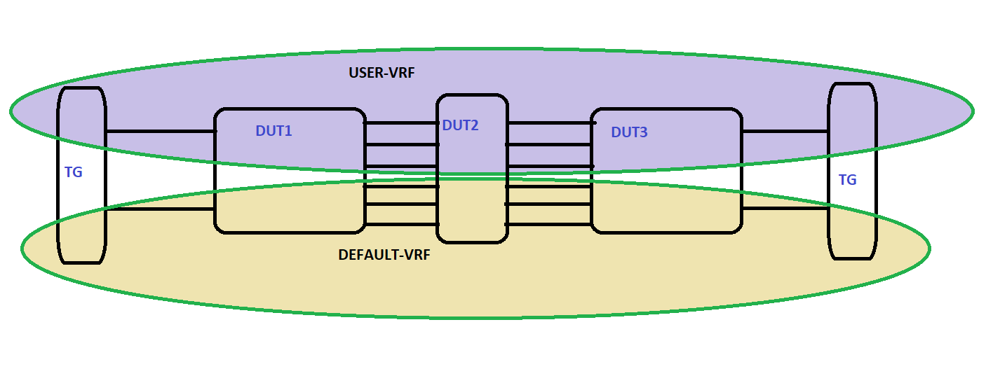

#  SQA Test Plan

#  BFD scaling with aggressive timers
#  SONiC 3.2.0 Release
[TOC]

# Test Plan Revision History
| Rev  |    Date    |      Author       | Change Description |
| :--: | :--------: | :---------------: | ------------------ |
| 0.1  | 05/01/2020 | Lakshminarayana D | Initial version    |

# List of Reviewers
| Function |       Name       |
| :------: | :--------------: |
|   Dev    |    Narendra B    |
|   Dev    |  Sumit Agarwal   |
|    QA    | Kalyan Vadlamani |

# List of Approvers
| Function |       Name       | Date Approved |
| :------: | :--------------: | :-----------: |
|   Dev    |    Narendra B    |               |
|   Dev    |  Sumit Agarwal   |               |
|    QA    | Kalyan Vadlamani |               |

# Definition/Abbreviation
| **Term** | **Meaning**                        |
| -------- | ---------------------------------- |
| BFD      | Bidirectional forwarding detection |
| VRF      | virtual route forwarding           |
| eBGP     | External border gateway protocol   |
| iBGP     | Interior border gateway protocol   |
| LAG      | Link aggregation                   |
| OSPF     | Open shortest path first           |
| PIM      | Protocol Independent Multicast     |

# Feature Overview
Bidirectional Forwarding Detection, (BFD) is a protocol defined by the BFD working group at IETF. The protocol defines a method of rapid detection of the failure of a forwarding path by checking that the next hop router is alive. The protocol will be able to detect the forwarding path failure in milliseconds depending on the actual configuration.  Currently a Routing Protocol takes a few seconds (from 3 seconds to 180 seconds or even more) to detect that the neighboring router, the next hop router, is not operational causing packet loss due to incorrect routing information. BFD is designed to provide a rapid forwarding path failure detection service to a Routing Protocol in a few milliseconds.   

Earlier SONIC releases supports 300ms\*3 (900ms) by default. From the 3.2.0, this feature will helps to detect failures in 100ms\*5 (500ms) i.e, configure transmit and receive interval as 100ms and detection multiplier as 5 with single hop configuration. This feature is mainly concentrating with maximum BFD sessions with multiple protocols. The current release will supports 128 BFD sessions.

# 1 Test Focus Areas
## 1.1 Functional Testing 
  - The main intention of the feature enhancement is to test maximum(128) BFD sessions with aggressive timers(100ms*5).
## 1.2 CLI Testing

- No new CLI added as a part of this feature enhancement.

# 2 Topologies

# 3 Test  Case and Objectives
## 3.1 Functional

### 3.1.1 Verify BFD for maximum sessions with single-hop aggressive times over IPv4&IPv6 in both default and non-default VRFs.

| **Test ID**    | **bfd_aggressive_func_001**              |
| -------------- | :--------------------------------------- |
| **Test Name**  | **Verify BFD for maximum sessions with single-hop aggressive times over IPv4&IPv6 in both default and non-default VRFs.** |
| **Test Setup** | **Topology1**                            |
| **Type**       | **Functional**                           |
| **Steps**      | **1) Configure non-default vrf with some name on dut1 and repeat the same on dut2.  2) Configure routing interfaces based on maximum BFD sessions supported on DUT in both default and user vrfs  3) Establish iBGP, OSPF and PIM sessions between dut1 and dut2 based on maximum BFD sessions.  4) Configure BFD sessions between dut1 and dut2 on this iBGP, OSPF and PIM neighbors.  5) Configure maximum static BFD sessions with non-default aggressive timers (100ms*5).  6) Verify BFD session establishment in default and user VRF.  7) Verify BFD packet transmission as per configured interval.  8) Verify above test scenario for IPv4&IPv6.** |

### 3.1.2 Verify BFD for maximum sessions with single-hop aggressive times with simulate link down events

| **Test ID**    | **bfd_aggressive_func_002**              |
| -------------- | :--------------------------------------- |
| **Test Name**  | **Verify BFD for maximum sessions with single-hop aggressive times with simulate link down events** |
| **Test Setup** | **Topology1**                            |
| **Type**       | **Functional**                           |
| **Steps**      | **1) Configure non-default vrf with some name on dut1 and repeat the same on dut2.  2) Configure routing interfaces based on maximum BFD sessions supported on DUT in both default and user vrfs  3) Establish iBGP, OSPF and PIM sessions between dut1 and dut2 based on maximum BFD sessions.  4) Configure BFD sessions between dut1 and dut2 on this iBGP, OSPF and PIM neighbors.  5) Configure maximum static BFD sessions with non-default aggressive timers (100ms*5).  6) Verify BFD session establishment in default and user VRF.  7) In few iBGP neighbors which for alternate path between the same set of peers use bgp peer groups to cover this too.  8) Configure BGP session between TG1 and dut1 in default vrf and TG2 and dut2 in user vrf and populate few routes into device.  9) Simulate link down event between the dut2 on each protocol interface and verify the other peers should not impact.  10) On dut1 BFD kicks in after configured receive-interval \* detect multiplier and BGP to teardown the session immediately.   11) Flap the links between the devices and BFD sessions formed properly without any issue.   12) Retrieve the routes learned via the above iBGP neighbor and verify that the above next hop is removed and alternate next hop is shown .  13) Monitor the traffic, observe that traffic is redirected through alternate path and based on the packet loss check convergence time to verify.  14) Verify above test scenario for IPv4&IPv6.** |

### 3.1.3 Verify BFD for maximum sessions with single-hop aggressive times with remove/add configured ip address

| **Test ID**    | **bfd_aggressive_func_003**              |
| -------------- | :--------------------------------------- |
| **Test Name**  | **Verify BFD for maximum sessions with single-hop aggressive times with remove and add configured ip address** |
| **Test Setup** | **Topology1**                            |
| **Type**       | **Functional**                           |
| **Steps**      | **1) Configure non-default vrf with some name on dut1 and repeat the same on dut2.  2) Configure routing interfaces based on maximum BFD sessions supported on DUT in both default and user vrfs  3) Establish iBGP, OSPF and PIM sessions between dut1 and dut2 based on maximum BFD sessions.  4) Configure BFD sessions between dut1 and dut2 on this iBGP, OSPF and PIM neighbors.  5) Configure maximum static BFD sessions with non-default aggressive timers (100ms*5).  6) Verify BFD session establishment in default and user VRF.  7) Remove and add ip addresses on each protocol interface and verify the other established BFD peers should not impact.  8) Configure BGP session between TG1 and dut1 in default vrf and TG2 and dut2 in user vrf and populate few routes into device.  9) Simulate link down event between the dut2 on each protocol interface and verify the other peers should not impact.  10) On dut1 BFD kicks in after configured receive-interval \* detect multiplier and BGP to teardown the session immediately.   11) Flap the links between the devices and BFD sessions formed properly without any issue.   12) Retrieve the routes learned via the above iBGP neighbor and verify that the above next hop is removed and alternate next hop is shown .  13) Monitor the traffic, observe that traffic is redirected through alternate path and based on the packet loss check convergence time to verify.  14) Verify above test scenario for IPv4&IPv6.** |

### 3.1.4 Verify BFD for maximum sessions with single-hop aggressive times with session timeout functionality

| **Test ID**    | **bfd_aggressive_func_004**              |
| -------------- | :--------------------------------------- |
| **Test Name**  | **Verify BFD for maximum sessions with single-hop aggressive times with session timeout functionality** |
| **Test Setup** | **Topology1**                            |
| **Type**       | **Functional**                           |
| **Steps**      | **1) Configure non-default vrf with some name on dut1 and repeat the same on dut2.  2) Configure routing interfaces based on maximum BFD sessions supported on DUT in both default and user vrfs  3) Establish iBGP, OSPF and PIM sessions between dut1 and dut2 based on maximum BFD sessions.  4) Configure BFD sessions between dut1 and dut2 on this iBGP, OSPF and PIM neighbors.  5) Configure maximum static BFD sessions with non-default aggressive timers (100ms*5).  6) Verify BFD session establishment in default and user VRF.  7) Verify BFD session state when deletion/shutdown of BFD peer session.  8) Verify timeout of BFD session for VRF for previous point scenario.  9) Verify timeout notification to configured protocols.  10) Verify BFD session state when deletion of BGP, OSPF, PIM peer config.  11) Verify timeout of BFD session for previous point scenario.  12)  Verify BFD session state when deletion of BGP, OSPF, PIM instances on router.  13) Verify above test scenario for IPv4&IPv6.** |

### 3.1.5 Verify BFD echo mode for maximum sessions with single-hop aggressive times

| **Test ID**    | **bfd_aggressive_func_005**              |
| -------------- | :--------------------------------------- |
| **Test Name**  | **Verify BFD echo mode for maximum sessions with single-hop aggressive times** |
| **Test Setup** | **Topology1**                            |
| **Type**       | **Functional**                           |
| **Steps**      | **1) Configure non-default vrf with some name on dut1 and repeat the same on dut2.  2) Configure routing interfaces based on maximum BFD sessions supported on DUT in both default and user vrfs  3) Establish iBGP, OSPF and PIM sessions between dut1 and dut2 based on maximum BFD sessions.  4) Configure BFD sessions between dut1 and dut2 on this iBGP, OSPF and PIM neighbors.  5) Configure maximum static BFD sessions with non-default aggressive timers (100ms*5).  6) Verify BFD session establishment in default and user VRF.  7) Verify BFD packet transmission as per configured interval.  8) Simulate link down event between the dut2 on each protocol interface and verify the other peers should not impact.  9) On dut1 BFD kicks in after configured receive-interval \* detect multiplier and BGP to teardown the session immediately.   10) Flap the links between the devices and BFD sessions formed properly without any issue.  11) Verify echo mode timeout of BFD sessions.  12) Verify echo mode timeout notification to BGP for VRF.  13) Retrieve the routes learned via the above iBGP neighbor and verify that the above next hop is removed and alternate next hop is shown .  14) Monitor the traffic and observe that traffic is redirected through alternate path.** |

### 3.1.6 Verify BFD for maximum sessions with single-hop aggressive times with max routes

| **Test ID**    | **bfd_aggressive_func_006**              |
| -------------- | :--------------------------------------- |
| **Test Name**  | **Verify BFD for maximum sessions with single-hop aggressive times with with max routes** |
| **Test Setup** | **Topology1**                            |
| **Type**       | **Functional**                           |
| **Steps**      | **1) Configure non-default vrf with some name on dut1 and repeat the same on dut2.  2) Configure routing interfaces based on maximum BFD sessions supported on DUT in both default and user vrfs  3) Establish iBGP, OSPF and PIM sessions between dut1 and dut2 based on maximum BFD sessions.  4) Configure BFD sessions between dut1 and dut2 on this iBGP, OSPF and PIM neighbors.  5) Configure maximum static BFD sessions with non-default aggressive timers (100ms*5).  6) Verify BFD session establishment in default and user VRF.  7) In few iBGP neighbors which for alternate path between the same set of peers use bgp peer groups to cover this too.  8) Configure BGP session between TG1 and dut1 in default vrf and TG2 and dut2 in user vrf and populate maximum (based on platform supported) routes into device.  9) Simulate link down event between the dut2 on each protocol interface and verify the other peers should not impact.  10) On dut1 BFD kicks in after configured receive-interval \* detect multiplier and BGP to teardown the session immediately.   11) Flap the links between the devices and BFD sessions formed properly without any issue.   12) Retrieve the routes learned via the above iBGP neighbor and verify that the above next hop is removed and alternate next hop is shown .  13) Monitor the traffic, observe that traffic is redirected through alternate path and based on the packet loss check convergence time to verify.  14) Verify above test scenario for IPv4&IPv6.** |

### 3.1.7 Clear BFD counters for a particular neighbor

| **Test ID**    | **bfd_aggressive_func_007**              |
| -------------- | :--------------------------------------- |
| **Test Name**  | **Verify Clear BFD counters for a particular neighbor** |
| **Test Setup** | **Topology1**                            |
| **Type**       | **Functional**                           |
| **Steps**      | **1) Configure non-default vrf with some name on dut1 and repeat the same on dut2.  2) Configure routing interfaces based on maximum BFD sessions supported on DUT in both default and user vrfs  3) Establish iBGP, OSPF and PIM sessions between dut1 and dut2 based on maximum BFD sessions.  4) Configure BFD sessions between dut1 and dut2 on this iBGP, OSPF and PIM neighbors.  5) Configure maximum static BFD sessions with non-default aggressive timers (100ms*5).  6) Verify BFD session establishment in default and user VRF.  7) Verify clear BFD counters cleared for a particular neighbor .** |

### 3.1.8 Verify clear BGP, OSPF and PIM protocols with maximum BFD sessions on single-hop with aggressive timers

| **Test ID**    | **bfd_aggressive_func_008**              |
| -------------- | :--------------------------------------- |
| **Test Name**  | **Verify clear BGP, OSPF and PIM protocols with maximum BFD sessions on single-hop with aggressive timers.** |
| **Test Setup** | **Topology1**                            |
| **Type**       | **Functional**                           |
| **Steps**      | **1) Configure 10 non-default vrfs with some name on dut1 and repeat the same on dut2.  2) Configure routing interfaces based on maximum BFD sessions supported on across create user vrfs  3) Establish iBGP, OSPF and PIM sessions between dut1 and dut2 across the configured user vrfs based on maximum BFD sessions.  4) Configure BFD sessions between dut1 and dut2 on this iBGP, OSPF and PIM neighbors.  5) Configure maximum static BFD sessions with non-default aggressive timers (100ms*5).  6) Verify BFD session establishment in default and user VRF.   7) Issue clear BGP, OSPF and PIM.  8) Verify BFD sessions established after clear protocols** |

### 3.1.9 Verify behavior with maximum BFD sessions configured over multiple vrfs on single-hop with aggressive timers

| **Test ID**    | **bfd_aggressive_func_009**              |
| -------------- | :--------------------------------------- |
| **Test Name**  | **Verify behavior with maximum BFD sessions configured over multiple vrfs on single-hop with aggressive timers** |
| **Test Setup** | **Topology1**                            |
| **Type**       | **Functional**                           |
| **Steps**      | **1) Configure non-default vrf with some name on dut1 and repeat the same on dut2.  2) Configure routing interfaces based on maximum BFD sessions supported on DUT in both default and user vrfs  3) Establish iBGP, OSPF and PIM sessions between dut1 and dut2 based on maximum BFD sessions.  4) Configure BFD sessions between dut1 and dut2 on this iBGP, OSPF and PIM neighbors.  5) Configure maximum static BFD sessions with non-default aggressive timers (100ms*5).  6) Verify BFD session establishment in default and user VRF.   7) In few iBGP neighbors which for alternate path between the same set of peers use bgp peer groups to cover this too.  8) Configure BGP session between TG1 and dut1 in default vrf and TG2 and dut2 in user vrf and populate both ipv4 and ipv6 maximum routes (based on platform supported) into device.  9) Simulate link down event between the dut2 on each protocol interface and verify the other peers should not impact.  10) On dut1 BFD kicks in after configured receive-interval \* detect multiplier and BGP to teardown the session immediately.   11) Flap the links between the devices and BFD sessions formed properly without any issue.   12) Retrieve the routes learned via the above iBGP neighbor and verify that the above next hop is removed and alternate next hop is shown .  13) Monitor the traffic, observe that traffic is redirected through alternate path and based on the packet loss check convergence time to verify. ** |

## 3.2 Reboot/Reload/Upgrade Test Cases

### 3.2.1 Verify warm reboot with maximum BFD sessions on single-hop with aggressive timers

| **Test ID**    | **bfd_aggressive_func_010**              |
| -------------- | :--------------------------------------- |
| **Test Name**  | **Verify warm reboot with maximum BFD sessions on single-hop with aggressive timers.** |
| **Test Setup** | **Topology1**                            |
| **Type**       | **Functional**                           |
| **Steps**      | **1) Configure non-default vrf with some name on dut1 and repeat the same on dut2.  2) Configure routing interfaces based on maximum BFD sessions supported on DUT in both default and user vrfs  3) Establish iBGP, OSPF and PIM sessions between dut1 and dut2 based on maximum BFD sessions.  4) Configure BFD sessions between dut1 and dut2 on this iBGP, OSPF and PIM neighbors.  5) Configure maximum static BFD sessions with non-default aggressive timers (100ms*5).  6) Verify BFD sessions establishment in default and user VRF.   7) Issue warm Reboot and verify BFD sessions establishment.** |

### 3.2.2  Verify save and reload with maximum BFD sessions on single-hop with aggressive timers

| **Test ID**    | **bfd_aggressive_func_011**              |
| -------------- | :--------------------------------------- |
| **Test Name**  | **Verify save and reload with maximum BFD sessions on single-hop with aggressive timers** |
| **Test Setup** | **Topology1**                            |
| **Type**       | **Functional**                           |
| **Steps**      | **1) Configure non-default vrf with some name on dut1 and repeat the same on dut2.  2) Configure routing interfaces based on maximum BFD sessions supported on DUT in both default and user vrfs  3) Establish iBGP, OSPF and PIM sessions between dut1 and dut2 based on maximum BFD sessions.  4) Configure BFD sessions between dut1 and dut2 on this iBGP, OSPF and PIM neighbors.  5) Configure maximum static BFD sessions with non-default aggressive timers (100ms*5).  6) Verify BFD sessions establishment in default and user VRF.   7) Issue reboot and verify BFD sessions establishment.** |

### 3.2.3 Verify Config reload with maximum BFD sessions on single-hop with aggressive timers
| **Test ID**    | **bfd_aggressive_func_012**              |
| -------------- | :--------------------------------------- |
| **Test Name**  | **Verify Config reload with maximum BFD sessions on single-hop with aggressive timers** |
| **Test Setup** | **Topology1**                            |
| **Type**       | **Functional**                           |
| **Steps**      | **1) Configure non-default vrf with some name on dut1 and repeat the same on dut2.  2) Configure routing interfaces based on maximum BFD sessions supported on DUT in both default and user vrfs  3) Establish iBGP, OSPF and PIM sessions between dut1 and dut2 based on maximum BFD sessions.  4) Configure BFD sessions between dut1 and dut2 on this iBGP, OSPF and PIM neighbors.  5) Configure maximum static BFD sessions with non-default aggressive timers (100ms*5).  6) Verify BFD sessions establishment in default and user VRF.   7) Issue config reload and verify BFD sessions establishment.** |

### 3.2.4  Verify BGP docker restart with maximum BFD sessions on single-hop with aggressive timers
| **Test ID**    | **bfd_aggressive_func_013**              |
| -------------- | :--------------------------------------- |
| **Test Name**  | **Verify BGP docker restart with maximum BFD sessions on single-hop with aggressive timers** |
| **Test Setup** | **Topology1**                            |
| **Type**       | **Functional**                           |
| **Steps**      | **1) Configure non-default vrf with some name on dut1 and repeat the same on dut2.  2) Configure routing interfaces based on maximum BFD sessions supported on DUT in both default and user vrfs  3) Establish iBGP, OSPF and PIM sessions between dut1 and dut2 based on maximum BFD sessions.  4) Configure BFD sessions between dut1 and dut2 on this iBGP, OSPF and PIM neighbors.  5) Configure maximum static BFD sessions with non-default aggressive timers (100ms*5).  6) Verify BFD sessions establishment in default and user VRF.   7) Issue BGP docker restart and verify BFD sessions establishment.** |

### 3.2.5  Verify Fast reboot with maximum BFD sessions on single-hop with aggressive timers
| **Test ID**    | **bfd_aggressive_func_014**              |
| -------------- | :--------------------------------------- |
| **Test Name**  | **Verify Fast reboot with maximum BFD sessions on single-hop with aggressive timers** |
| **Test Setup** | **Topology1**                            |
| **Type**       | **Functional**                           |
| **Steps**      | **1) Configure non-default vrf with some name on dut1 and repeat the same on dut2.  2) Configure routing interfaces based on maximum BFD sessions supported on DUT in both default and user vrfs  3) Establish iBGP, OSPF and PIM sessions between dut1 and dut2 based on maximum BFD sessions.  4) Configure BFD sessions between dut1 and dut2 on this iBGP, OSPF and PIM neighbors.  5) Configure maximum static BFD sessions with non-default aggressive timers (100ms*5).  6) Verify BFD sessions establishment in default and user VRF.   7) Issue fast reboot and verify BFD sessions establishment.** |
### 3.2.6  Verify image upgrade with maximum BFD sessions on single-hop with aggressive timers

| **Test ID**    | **bfd_aggressive_func_015**              |
| -------------- | :--------------------------------------- |
| **Test Name**  | **Verify image upgrade with maximum BFD sessions on single-hop with aggressive timers** |
| **Test Setup** | **Topology1**                            |
| **Type**       | **Functional**                           |
| **Steps**      | **1) Configure non-default vrf with some name on dut1 and repeat the same on dut2.  2) Configure routing interfaces based on maximum BFD sessions supported on DUT in both default and user vrfs  3) Establish iBGP, OSPF and PIM sessions between dut1 and dut2 based on maximum BFD sessions.  4) Configure BFD sessions between dut1 and dut2 on this iBGP, OSPF and PIM neighbors.  5) Configure maximum static BFD sessions with non-default aggressive timers (100ms*5).  6) Verify BFD sessions establishment in default and user VRF.   7) Upgrade the device with different image configured on dut and verify BFD sessions established properly after image upgrade.** |

### 3.2.7  Verify the behavior after performing multiple link flaps with maximum BFD sessions on single-hop with aggressive timers

| **Test ID**    | **bfd_aggressive_func_016**              |
| -------------- | :--------------------------------------- |
| **Test Name**  | **Verify the behavior after performing multiple link flaps with maximum BFD sessions on single-hop with aggressive timers** |
| **Test Setup** | **Topology1**                            |
| **Type**       | **Functional**                           |
| **Steps**      | **1) Configure non-default vrf with some name on dut1 and repeat the same on dut2.  2) Configure routing interfaces based on maximum BFD sessions supported on DUT in both default and user vrfs  3) Establish iBGP, OSPF and PIM sessions between dut1 and dut2 based on maximum BFD sessions.  4) Configure BFD sessions between dut1 and dut2 on this iBGP, OSPF and PIM neighbors.  5) Configure maximum static BFD sessions with non-default aggressive timers (100ms*5).  6) Verify BFD sessions establishment in default and user VRF.   7) Perform the link flaps for 10 times between the devices verify BFD sessions established properly after each link comes up.** |

### 3.2.8  Verify the behavior before pull the cables and connected back with maximum BFD sessions on single-hop with aggressive timers

| **Test ID**    | **bfd_aggressive_func_017**              |
| -------------- | :--------------------------------------- |
| **Test Name**  | **Verify the behavior before pull the cables and connected back with maximum BFD sessions on single-hop with aggressive timers** |
| **Test Setup** | **Topology1**                            |
| **Type**       | **Functional**                           |
| **Steps**      | **1) Configure non-default vrf with some name on dut1 and repeat the same on dut2.  2) Configure routing interfaces based on maximum BFD sessions supported on DUT in both default and user vrfs  3) Establish iBGP, OSPF and PIM sessions between dut1 and dut2 based on maximum BFD sessions.  4) Configure BFD sessions between dut1 and dut2 on this iBGP, OSPF and PIM neighbors.  5) Configure maximum static BFD sessions with non-default aggressive timers (100ms*5).  6) Verify BFD sessions establishment in default and user VRF.   7) Pull out the links connected between the devices and pull it back into same ports and verify BFD sessions established properly after links connected back** |

### 3.2.9  Verify the behavior after performing the show techsupport command with maximum BFD sessions on single-hop with aggressive timers

| **Test ID**    | **bfd_aggressive_func_018**              |
| -------------- | :--------------------------------------- |
| **Test Name**  | **Verify the behavior after performing the show techsupport command with maximum BFD sessions on single-hop with aggressive timers** |
| **Test Setup** | **Topology1**                            |
| **Type**       | **Functional**                           |
| **Steps**      | **1) Configure non-default vrf with some name on dut1 and repeat the same on dut2.  2) Configure routing interfaces based on maximum BFD sessions supported on DUT in both default and user vrfs  3) Establish iBGP, OSPF and PIM sessions between dut1 and dut2 based on maximum BFD sessions.  4) Configure BFD sessions between dut1 and dut2 on this iBGP, OSPF and PIM neighbors.  5) Configure maximum static BFD sessions with non-default aggressive timers (100ms*5).  6) Verify BFD sessions establishment in default and user VRF.   7) Perform the link flaps for 10 times between the devices verify BFD sessions established properly after each link comes up.** |

# 4 Reference Links

HLD Not Available

