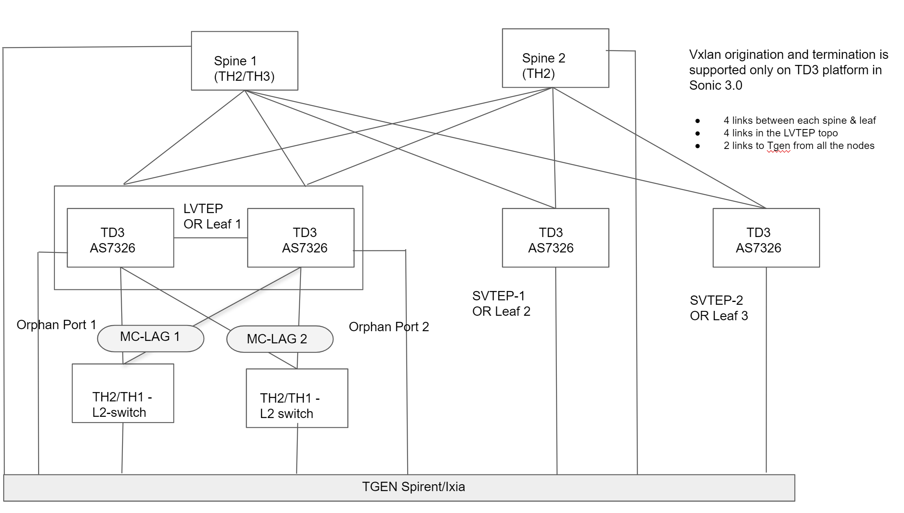

# SQA Test Plan

# IP Fabric using BGP EVPN
#  SONiC 3.0 Project and Buzznik Release

Rev 1.9

[TOC]

## Test Plan Revision History

| Rev  | Date       | Author                        | Change Description                                    |
| ---- | ---------- | ----------------------------- | ----------------------------------------------------- |
| 1    | 10/01/2019 | Gangadhara Sahu               | Initial Version                                       |
| 2    | 10/07/2019 | Julius                        | Added cases for L2VNI                                 |
| 3    | 10/07/2019 | Gangadhara Sahu               | Added cases for L3 VNI, SAG, ARP Suppression          |
| 4    | 10/11/2019 | Meenal                        | Added cases for LVTEP section                         |
| 5    | 10/18/2019 | Gangadhara, Meenal and Julius | Incorporated L2 VNI, L3 VNI and LVTEP review comments |

## List of Reviewers

| Function | Name |
| :------: | :--: |
|          |      |

## List of Approvers

| Function | Name | Date Approved |
| :------: | :--: | :-----------: |
|          |      |               |

## Definition/Abbreviation

| **Term** | **Meaning**                               |
| -------- | ----------------------------------------- |
| EVPN     | Ethernet VPN                              |
| EVI      | EVPN Instance                             |
| ESI      | Ethernet Segment Identifier               |
| RT       | Route-target                              |
| RD       | Route-distinguisher                       |
| VXLAN    | Virtual Extended LAN                      |
| VTEP     | VXLAN Tunnel End point                    |
| VRF      | Virtual Routing and Forwarding            |
| VNI      | VXLAN Network Identifier                  |
| NVO      | Network Virtualization Overlay            |
| L3GW     | Layer 3 Gateway                           |
| IRB      | Integrated Routing and Bridging           |
| IMET     | Inclusive Multicast Ethernet Tag          |
| BUM      | Broadcast, Unknown unicast, and Multicast |
| BGP      | Border Gateway Protocol                   |
| SHD      | Single-Homed Device                       |
| MHD      | Multi-Homed Device                        |
| ICCP     | Inter-Chassis Communication Protocol      |
## Introduction

### Objective 

The main objective of this document is to cover the test cases that will be executed for IP Fabric based in BGP EVPN Signaling feature in SONIC 3.0 Buzznik release.  Topologies and test cases  for testing the feature will be discussed as part of this document.

### Scope

BGP EVPN Signaling test cases will be covered in this test plan .

### Out of scope

* This test plan does not cover the legacy BGP test cases. 
* This test plan uses the MLAG scenarios and covers EVPN test case including LVTEP having MC-LAG configured. MC-LAG as a feature will be covered in separate MLAG test plan

## Feature Overview

Virtual Extensible LAN (VXLAN) is an overlay technology for network virtualization. It provides Layer 2 extension over a shared Layer 3 underlay infrastructure network by using MAC address in IP User Datagram Protocol (MAC in IP/UDP) tunneling encapsulation. The purpose of obtaining Layer 2 extension in the overlay network is to overcome the limitations of physical server racks and geographical location boundaries and achieve flexibility for workload placement within a data center or between different data centers.

The initial IETF VXLAN standards (RFC 7348) defined a multicast-based flood-and-learn VXLAN without a control plane. It relies on data-based flood-and-learn behavior for remote VXLAN tunnel endpoint (VTEP) peer discovery and remote end-host learning. The overlay broadcast, unknown unicast, and multicast traffic is encapsulated into multicast VXLAN packets and transported to remote VTEP switches through the underlay multicast forwarding. Flooding in such a deployment can present a challenge for the scalability of the solution. The requirement to enable multicast capabilities in the underlay network also presents a challenge because some organizations do not want to enable multicast in their data centers or WAN networks.

To overcome the limitations of the flood-and-learn VXLAN as defined in RFC 7348, organizations can use Multiprotocol Border Gateway Protocol (MP-BGP) Ethernet Virtual Private Network (EVPN) as the control plane for VXLAN. MP-BGP EVPN has been defined by IETF as the standards-based control plane for VXLAN overlays. 

The MP-BGP EVPN control plane provides protocol-based VTEP peer discovery and end-host reachability information distribution that allows more scalable VXLAN overlay network designs suitable for private and public clouds. The MP-BGP EVPN control plane introduces a set of features that reduces or eliminates traffic flooding in the overlay network and enables optimal forwarding for both east-west and north-south traffic.

## 1 Test Focus Areas

### 1.1 Underlay flavors

* IPv4 Unnumbered (using OSPF as routing protocol)
* RFC 5549 
* L3 port-channel - IPv4 numbered
* L3 port-channel - IPv6 numbered
* Physical interface (L3 router port or L3 Port Channel port) /31 subnet
* Untagged L3 VLAN interface (L2 switch port or LAG) with /31 subnet

## 2 Topologies

Topology 1

## 3 Test Case and objectives

### **3.1 CLI Test Cases**

### 3.1.1 Verify all the CLICK based VxlAN CLIs

| **Test ID**    | **iTAS Test Case Manager ID**                                |
| -------------- | :----------------------------------------------------------- |
| **Test Name**  | **Verify all the CLICK based VxlAN CLIs**                    |
| **Test Setup** | **Topology1**                                                |
| **Type**       | **CLI**                                                      |
| **Steps**      | **Verify all the below CLICK based config CLIs**.  config vxlan add <vtepname> <src_ipv4> config vxlan evpn_nvo add <nvoname> <vtepname> config vxlan map add <vtepname> <vlanid> <vnid> config vxlan map_range add <vtepname>  <vlanstart> <vlanend> <vnistart>  config vrf add_vrf_vni_map <vrf-name> <vni> config vrf del_vrf_vni_map <vrf-name> config neigh-suppress vlan <vlan-id> <"on"/"off">  **Verify all the below CLICK based show CLIs.**  1. show vxlan interface  2. show vxlan vlanvnimap  3. show vxlan vrfvnimap  4. show vxlan tunnel  5. show vxlan evpn_remote_mac <remoteip/all>  <vlanid/all>  6. show vxlan evpn_remote_vni <remoteip/all> |

### 3.1.2 Verify all the KLISH based VxlAN CLIs

| **Test ID**    | **iTAS Test Case Manager ID**                                |
| -------------- | :----------------------------------------------------------- |
| **Test Name**  | **Verify all the KLISH based VxlAN CLIs**                    |
| **Test Setup** | **Topology1**                                                |
| **Type**       | **CLI**                                                      |
| **Steps**      | Verify all the below config CLIs**.  VTEP Source IP configuration  switch(config) interface vxlan <vtepname>  switch(config-if-vtep1) [no] vxlan source-ip  <src_ipv4>  <vtepname> is a string.  <src_ipv4> is an IPV4 address in dotted notation A.B.C.D  EVPN NVO configuration  switch(config) evpn <nvo_name>  switch(config-evpn) nvo <vtepname>  <nvoname> and <vtepname> are strings. VLAN VNI Mapping configuration  switch(config-if-vtep1) [no] vxlan map vlan <vidstart> vni <vnistart>  count <n>  <n> is the number of mappings being configured.   <vidstart>, <vnistart> are the starting VID and VNID.   count is optional and when specified maps contigous sets of VIDs to contigous VNIDs switch(config-if-vtep1) [no] vxlan map vrf VRF-Blue vni 10001  Verify all the below show CLIs.**  show vlan brief  show mac |
### 3.1.3 Verify configuration replace feature for EVPN underlay and overlay configs

| **Test ID**    | **iTAS Test Case Manager ID**                                |
| -------------- | :----------------------------------------------------------- |
| **Test Name**  | **Verify configuration replace feature for EVPN underlay and overlay configs** |
| **Test Setup** | **Topology1**                                                |
| **Type**       | **CLI**                                                      |
| **Steps**      | Configure EVPN underlay and overlay and save the config using "config save" and "copy running to startup config".   Say the saved with name as "evpn_config_1".  Make sure traffic is running fine with this EVPN config.  Now change the underlay to different type (from RFC 5549 to IPv4 unnumbered) and change the overlay parameters as well like VTEP address, NVO names and different L2 VNI and L3 VNI config parameters. And save this config as "evpn_config_2".  Make sure all L2 VTEP and L3 VTEP traffic are running fine now.  Move "evpn_config_2" to "evpn_config_1" by using the configration replace feature. Verify that configuration replace feature is working correctly by checking all the underlay and overlay config and traffic running fine with new configuration in place. |

### **3.2 Functional Test Cases**

### **3.2.1 EVPN Control Plane Test case** ###

### 3.2.1.1 Test BGP EVPN session by removing a neighbor from EVPN address family 

| **Test ID**    | **iTAS Test Case Manager ID**                                |
| -------------- | :----------------------------------------------------------- |
| **Test Name**  | **Test BGP EVPN session by removing a neighbor from EVPN address family** |
| **Test Setup** | **Topology1**                                                |
| **Type**       | **Functional**                                               |
| **Steps**      | 1) Bring up EVPN topology with required configuration 2) Remove a neighbor from EVPN address family 3) Verify BGP EVPN session comes up for the neighbors configured under l2vpn evpn address family 4) Verify BGP EVPN session doesn’t come up for the neighbors not configured under l2vpn evpn address family 5) Add back the removed neighbor in step2 and verify BGP EVPN session comes up |

### 3.2.1.2 Test VxLAN by removing  the loopback interface bound to overlay gateway

| **Test ID**    | **iTAS Test Case Manager ID**                                |
| -------------- | :----------------------------------------------------------- |
| **Test Name**  | **Test VxLAN by removing  the loopback interface bound to overlay gateway** |
| **Test Setup** | **Topology1**                                                |
| **Type**       | **Functional**                                               |
| **Steps**      | 1) Bring up EVPN topology with required configuration 2) Remove loopback interface which is bound to overlay gateway on leaf1 3) Check tunnel operational status going down but EVPN routes should not be withdrawn even if tunnel is down 4) Configure same loopback interface to the overlay gateway 5) Check tunnel comes online. 6) Repeat the same case by removing the loopback IP and add back 7) Repeat the same case by removing and adding back different loopback interface to overlay gateway |

### 3.2.1.3 Test VxLAN by removing and adding back NVO name

| **Test ID**    | **iTAS Test Case Manager ID**                                |
| -------------- | :----------------------------------------------------------- |
| **Test Name**  | **Test VxLAN by removing and adding back NVO name**          |
| **Test Setup** | **Topology1**                                                |
| **Type**       | **Functional**                                               |
| **Steps**      | 1) Bring up EVPN topology with required configuration** **2) Remove NVO name  3) now tunnel should be deleted and overlay route should removed.  4)Now add back the NVO (same or different name)  5) Verify tunnel come up and traffic forwarding works. |

### 3.2.1.4 Test VxLAN by creating vlan after VxLAN map for that VLAN

| **Test ID**    | **iTAS Test Case Manager ID**                                |
| -------------- | :----------------------------------------------------------- |
| **Test Name**  | **Test VxLAN by creating vlan after VxLAN map for that VLAN** |
| **Test Setup** | **Topology1**                                                |
| **Type**       | **Functional**                                               |
| **Steps**      | 1)  switch(config-if-vtep1) [no] vxlan map VLAN <vidstart> vni <vnistart>  count <n>   2) config vlan add VLAN |

###  **3.2.2 L2 VNI Test Cases**

### 3.2.2.1  Test VxLAN by removing and adding back VLAN to VNI mapping while vxlan tunnel is up

| **Test ID**    | **iTAS Test Case Manager ID**                                |
| -------------- | :----------------------------------------------------------- |
| **Test Name**  | **Test VxLAN by removing and adding back VLAN to VNI mapping while vxlan tunnel is up** |
| **Test Setup** | **Topology1**                                                |
| **Type**       | **Functional**                                               |
| **Steps**      | 1) Bring up EVPN topology with required configuration** **2) Remove all the VLAN to VNI mapping on leaf1** **3) Verify that tunnel is still UP due to availability of other routes like type 5 route b/w leaf nodes** **4) Configure new VLAN to VNI mapping** **5) Check tunnel is still up and member of the newly extended VLAN with its VNI id and IMR routes are advertised for the new VLANs. |

### 3.2.2.2  Test VxLAN by removing and adding back RD

| **Test ID**    | **iTAS Test Case Manager ID**                                |
| -------------- | :----------------------------------------------------------- |
| **Test Name**  | **Test VxLAN by removing and adding back RD**                |
| **Test Setup** | **Topology1**                                                |
| **Type**       | **Functional**                                               |
| **Steps**      | 1) Bring up EVPN topology with required configuration** **2) Remove the RD configuration from leaf1** **3) Check tunnel gets deleted and routes are withdrawn** **4) Add back same RD in leaf1** **5) Check tunnel comes online and routes are advertised again** |

### 3.2.2.3  Test VxLAN by modifying RD

| **Test ID**    | **iTAS Test Case Manager ID**                                |
| -------------- | :----------------------------------------------------------- |
| **Test Name**  | **Test VxLAN by modifying RD**                               |
| **Test Setup** | **Topology1**                                                |
| **Type**       | **Functional**                                               |
| **Steps**      | 1) Bring up EVPN topology with required configuration** **2) modify the RD configuration in leaf1** **3) Check tunnel momentarily flaps** **4) check routes are advertised again with modified RD** |

### 3.2.2.4  Test VxLAN by removing and adding back import RT

| **Test ID**    | **iTAS Test Case Manager ID**                                |
| -------------- | :----------------------------------------------------------- |
| **Test Name**  | **Test VxLAN by removing and adding back import RT**         |
| **Test Setup** | **Topology1**                                                |
| **Type**       | **Functional**                                               |
| **Steps**      | 1) Bring up EVPN topology with required configuration** **2) Remove the import RT configuration from leaf1** **3) Check tunnel gets deleted and routes are not imported in leaf1** **4) Check tunnel status(Up) and routes are imported on remote nodes** **5) Add back the removed import RT configuration in leaf1** **6) Check tunnel comes online and routes are imported properly in leaf1** |

### 3.2.2.5  Test VxLAN by configuring wrong import RT

| **Test ID**    | **iTAS Test Case Manager ID**                                |
| -------------- | :----------------------------------------------------------- |
| **Test Name**  | **Test VxLAN by configuring wrong import RT**                |
| **Test Setup** | **Topology1**                                                |
| **Type**       | **Functional**                                               |
| **Steps**      | 1) Bring up EVPN topology with required configuration** **2) Configure import RT on leaf1 which is different than export RT configured in remote switches** **3) Check the tunnel is down and no routes imported in leaf1** **4) Correct the import RT value on leaf1 which is same as export RT configured in remote switches** **5) Check tunnel comes online and routes are imported properly in leaf1** |

### 3.2.2.6  Test VxLAN by removing and adding back export RT

| **Test ID**    | **iTAS Test Case Manager ID**                                |
| -------------- | :----------------------------------------------------------- |
| **Test Name**  | **Test VxLAN by removing and adding back export RT**         |
| **Test Setup** | **Topology1**                                                |
| **Type**       | **Functional**                                               |
| **Steps**      | 1) Bring up EVPN topology with required configuration** **2) Remove the export RT configuration from leaf1** **3) Check tunnel gets deleted and routes are not imported in remote switches** **4) Check tunnel status(Up) and routes are imported in leaf1** **5) Add back the removed export RT configuration in leaf1** **6) Check tunnel comes online and routes are imported properly in remote switches** |

### 3.2.2.7  Test VxLAN by configuring wrong export RT

| **Test ID**    | **iTAS Test Case Manager ID**                                |
| -------------- | :----------------------------------------------------------- |
| **Test Name**  | **Test VxLAN by configuring wrong export RT**                |
| **Test Setup** | **Topology1**                                                |
| **Type**       | **Functional**                                               |
| **Steps**      | 1) Bring up EVPN topology with required configuration** **2) Configure export RT in leaf1 which is different than import RT configured in remote switches** **3) Check the tunnel is down and no routes are imported in remote switches** **4) Correct the export RT value on leaf1 which is same as import RT configured in remote switches** **5) Check tunnel comes online and routes are imported properly in remote switches** |

### 3.2.2.8  Test VxLAN by configuring mis-match VNI ID

| **Test ID**    | **iTAS Test Case Manager ID**                                |
| -------------- | :----------------------------------------------------------- |
| **Test Name**  | **Test VxLAN by configuring mis-match VNI ID**               |
| **Test Setup** | **Topology1**                                                |
| **Type**       | **Functional**                                               |
| **Steps**      | 1) Bring up EVPN topology with required configuration** **2) On leaf1, map a VNI id (to VLAN) which is not configured in remote switches under EVPN instance** **3) Verify IMET routes are generated and advertised to all the switches from leaf1** **4) Verify no VxLAN tunnel created in this case** **5) In remote leaf or leaf 2, add the same step 2 configuration having same VNI mapping.  6) Verify tunnel is UP and routes are installed in remote switches |

### 3.2.2.9  Test VxLAN by clearing EVPN neighbor

| **Test ID**    | **iTAS Test Case Manager ID**                                |
| -------------- | :----------------------------------------------------------- |
| **Test Name**  | **Test VxLAN by clearing EVPN neighbor**                     |
| **Test Setup** | **Topology1**                                                |
| **Type**       | **Functional**                                               |
| **Steps**      | Bring up EVPN topology with required configuration Clear BGP EVPN neighbors verify tunnel momentarily flaps Verify routes are learned again once tunnel comes UP  |

### 3.2.2.10  Test VxLAN by clearing EVPN table

| **Test ID**    | **iTAS Test Case Manager ID**                                |
| -------------- | :----------------------------------------------------------- |
| **Test Name**  | **Test VxLAN by clearing EVPN table**                        |
| **Test Setup** | **Topology1**                                                |
| **Type**       | **Functional**                                               |
| **Steps**      | Bring up EVPN topology with required configuration Clear BGP EVPN table (soft-in) verify tunnel stays UP Verify routes are refreshed  |

### 3.2.2.11  Test VxLAN by removing redistribute connected from BGP

| **Test ID**    | **iTAS Test Case Manager ID**                                |
| -------------- | :----------------------------------------------------------- |
| **Test Name**  | **Test VxLAN by removing redistribute connected from BGP**   |
| **Test Setup** | **Topology1**                                                |
| **Type**       | **Functional**                                               |
| **Steps**      | Bring up EVPN topology with required configuration Remove redistribute connected from BGP in Leaf1 Verify tunnel goes down as VTEP IP is unreachable Add back redistribute connected to make VTEP reachable Verify tunnel comes UP and routes are learned properly  |

### 3.2.2.12  Test VxLAN by clearing BGP session with max path 1

| **Test ID**    | **iTAS Test Case Manager ID**                                |
| -------------- | :----------------------------------------------------------- |
| **Test Name**  | **Test VxLAN by clearing BGP session with max path 1**       |
| **Test Setup** | **Topology1**                                                |
| **Type**       | **Functional**                                               |
| **Steps**      | Bring up EVPN topology with required configuration Set max path value to 1 for BGP and verify only one path exists to remote VTEP Start the traffic Clear the BGP session while the traffic is ON Verify traffic loss is there until the tunnel comes back online  |

### 3.2.2.13  Test VxLAN by clearing BGP session with max path more than one

| **Test ID**    | **iTAS Test Case Manager ID**                                |
| -------------- | :----------------------------------------------------------- |
| **Test Name**  | **Test VxLAN by clearing BGP session with max path more than one** |
| **Test Setup** | **Topology1**                                                |
| **Type**       | **Functional**                                               |
| **Steps**      | Bring up EVPN topology with required configuration Set BGP max path value to more than one verify more than one entry exists to remote VTEP start the traffic Clear the BGP session maintained with spine1 while the traffic is ON Verify traffic switches towards spine2 and tunnel stays operational Verify there is no traffic loss as alternate path exists  |

### 3.2.2.14  Test VxLAN by deleting and adding back BGP EVPN address family configuration

| **Test ID**    | **iTAS Test Case Manager ID**                                |
| -------------- | :----------------------------------------------------------- |
| **Test Name**  | **Test VxLAN by deleting and adding back BGP EVPN address family configuration** |
| **Test Setup** | **Topology1**                                                |
| **Type**       | **Functional**                                               |
| **Steps**      | Bring up EVPN topology with required configuration Delete EVPN address family configuration from leaf1 Verify tunnel gets deleted and all routes withdrawn Add back EVPN address family configuration in leaf1 Verify tunnel comes online and routes are advertised  |

### 3.2.2.15  Test VxLAN by deleting and adding back BGP configuration

| **Test ID**    | **iTAS Test Case Manager ID**                                |
| -------------- | :----------------------------------------------------------- |
| **Test Name**  | **Test VxLAN by deleting and adding back BGP configuration** |
| **Test Setup** | **Topology1**                                                |
| **Type**       | **Functional**                                               |
| **Steps**      | Bring up EVPN topology with required configuration Delete BGP configuration from leaf1 Verify BGP session not exists and no tunnel Add back BGP configuration Verify tunnel comes online and routes are advertised  |

### 3.2.2.16  Test VxLAN for broadcast traffic

| **Test ID**    | **iTAS Test Case Manager ID**                                |
| -------------- | :----------------------------------------------------------- |
| **Test Name**  | **Test VxLAN for broadcast traffic**                         |
| **Test Setup** | **Topology1**                                                |
| **Type**       | **Functional**                                               |
| **Steps**      | Bring up EVPN topology with required configuration Initiate broadcast traffic for one of the VLAN in leaf1 Verify that broadcast traffic is flooded correctly to all remote VTEPs(part of that VLAN) and thereafter to local edge ports Remove that VLAN from one of the remote VTEP Verify that broadcast traffic is not flooded to that remote VTEP(VLAN removed) Add back the removed VLAN on that remote VTEP Verify that broadcast traffic is flooded now to this remote VTEP along with other remote switches  |

### 3.2.2.17  Test VxLAN for MAC aging and clear MAC

| **Test ID**    | **iTAS Test Case Manager ID**                                |
| -------------- | :----------------------------------------------------------- |
| **Test Name**  | **Test VxLAN for MAC aging and clear MAC**                   |
| **Test Setup** | **Topology1**                                                |
| **Type**       | **Functional**                                               |
| **Steps**      | Bring up EVPN topology with required configuration Start traffic from 10 different VLANs and learn them locally in leaf1 Verify all 10 MACs are advertised to remote VTEPs Stop the traffic & wait for MAC aging time to expire in leaf1 Verify all 10 MACs are removed from BGP EVPN routing table in leaf1 Start the step2 traffic again & relearn all those 10 MACs Verify all 10 MACs are advertised to remote VTEPs Stop the traffic & clear the MAC table in leaf1 Verify all MACs are withdrawn from remote VTEPs. Use the debug or internal command "bcmcmd l2 show" and ensure that both the local and remote macs are installed in the hardware.  Also we will have unicast bidirectional traffic to ensure that the traffic is not flooded (This will indicate that the mac is programmed correctly in the hw). |

### 3.2.2.18  Test VxLAN by shutting down the links towards downstream

| **Test ID**    | **iTAS Test Case Manager ID**                                |
| -------------- | :----------------------------------------------------------- |
| **Test Name**  | **Test VxLAN by shutting down the links towards downstream** |
| **Test Setup** | **Topology1**                                                |
| **Type**       | **Functional**                                               |
| **Steps**      | Bring up EVPN topology with required configuration Start traffic from 10 different VLANs and learn them locally on leaf1 Verify all 10 MACs are advertised to remote VTEPs Shutdown the link towards client from where the MACs are learnt Verify the MAC’s are withdrawn from all the remote VTEPs Enable back the shutdown links Verify all MACs are learned again and advertised to remote VTEPs  |

### 3.2.2.19  Test VxLAN for static MAC

| **Test ID**    | **iTAS Test Case Manager ID**                                |
| -------------- | :----------------------------------------------------------- |
| **Test Name**  | **Test VxLAN for static MAC**                                |
| **Test Setup** | **Topology1**                                                |
| **Type**       | **Functional**                                               |
| **Steps**      | Bring up EVPN topology with required configuration Configure static MAC in leaf1 Verify static MAC is advertised to remote VTEPs Remove the static MAC Verify static MAC is withdrawn from remote VTEPs Verify that traffic is not flooded once static entry is created.  Verify the above steps by shutting down the static MAC pointing interface. |

### 3.2.2.20  Test VxLAN for dynamic MAC movement

| **Test ID**    | **iTAS Test Case Manager ID**                                |
| -------------- | :----------------------------------------------------------- |
| **Test Name**  | **Test VxLAN for dynamic MAC movement**                      |
| **Test Setup** | **Topology 1**                                               |
| **Type**       | **Functional**                                               |
| **Steps**      | Bring up EVPN topology with required configuration Learn some MACs locally in leaf1 Stop the traffic towards leaf1, learn the same MACs from another leaf(leaf2) Verify that leaf2 updates those MACs as local Verify that leaf1 updates those MACs as remote learned from leaf2 Verify remote to remote MAC move as well. |

### 3.2.2.21  Test VxLAN for static MAC behavior across leaf nodes

| **Test ID**    | **iTAS Test Case Manager ID**                                |
| -------------- | :----------------------------------------------------------- |
| **Test Name**  | **Test VxLAN for static MAC behavior across leaf nodes**     |
| **Test Setup** | **Topology 1**                                               |
| **Type**       | **Functional**                                               |
| **Steps**      | Bring up EVPN topology with required configuration configure some static MACs in leaf1 Verify those MAC routes are advertised to all remote VTEPs Receive traffic with same MAC as SMAC on any one of the remote VTEP(leaf2) Verify that leaf2 do not learn the same MAC as dynamic entry  |

### 3.2.2.22  Test VxLAN for MAC route dampening

| **Test ID**    | **iTAS Test Case Manager ID**                                |
| -------------- | :----------------------------------------------------------- |
| **Test Name**  | **Test VxLAN for MAC route dampening**                       |
| **Test Setup** | **Topology1**                                                |
| **Type**       | **Functional**                                               |
| **Steps**      | Bring up EVPN topology with required configuration Configure duplicate MAC timer & count as 10 under EVPN instance in leaf1 Learn some MACs locally in leaf1 by sending traffic Start the same traffic(same MACs) from another leaf(leaf2) Both leafs 1 & 2 keep sending this MAC move updates 10 times with in the interval specified in mac dampening Verify that after mac dampening timer, none of leaf1 and leaf2 learns these set of MACs and error log is generated Traffic forwarding will be stopped for the dampened mac.  Verify that if MAC moves less than 10 times within the timers value configured OR mac moves 10 or more time but after the timer value specified, only duplicate mac event should be triggered without MAC being dampened. |

### 3.2.2.23  Test VxLAN by shutting down link between leaf and spine

| **Test ID**    | **iTAS Test Case Manager ID**                                |
| -------------- | :----------------------------------------------------------- |
| **Test Name**  | **Test VxLAN by shutting down link between leaf and spine**  |
| **Test Setup** | **Topology1**                                                |
| **Type**       | **Functional**                                               |
| **Steps**      | Bring up EVPN topology with required configuration Send traffic from leaf1 Verify traffic is load balanced across the 2 spines and reaches all remote VTEPs Shutdown links between anyone of the spine and leaf Verify traffic still forwarded through another spine Bring back all the shutdown ports Verify traffic is now load balanced across the 2 spines  |

### 3.2.2.24 Verify ping from SVTEP to LVTEP node IP with in extended VLAN boundary 

| **Test ID**    | **iTAS Test Case Manager ID to be updated**                  |
| -------------- | ------------------------------------------------------------ |
| **Test Name**  | **Verify ping from SVTEP to LVTEP node IP with in extended VLAN boundary** |
| **Test Setup** | **Topology 1**                                               |
| **Type**       | **Functional**                                               |
| **Steps**      | Verify ping from SVTEP to LVTEP node IP with in extended VLAN boundary  Here source ip and destination ip are with in the same subnet. |

### 3.2.2.25 Verify ping from host 1 connected to LVTEP to host 2 IP present in the extended VLAN

| **Test ID**    | **iTAS Test Case Manager ID to be updated**                  |
| -------------- | ------------------------------------------------------------ |
| **Test Name**  | **Verify ping from host 1 connected to LVTEP to host 2 IP present in the extended VLAN** |
| **Test Setup** | **Topology 1**                                               |
| **Type**       | **Functional**                                               |
| **Steps**      | Verify ping from host 1 connected to LVTEP to host 2 IP present in the extended VLAN.  This ping should trigger ARP resolution by ingress leaf node to destination IP leaf node.    After ARP is resolved, ping traffic should be forwarded   ARP suppression should be kicked in if static anycast gateway is configured on ingress VLAN interface.  Here ping source ip and dest ip are with in same subnet. |

### 3.2.2.26 Test remote macs are not aged out

| **Test ID**    | **iTAS Test Case Manager ID**                                |
| -------------- | :----------------------------------------------------------- |
| **Test Name**  | **Test Remote macs are not aged out**                        |
| **Test Setup** | **Topology1**                                                |
| **Type**       | **Functional**                                               |
| **Steps**      | Verify that the remote macs are not aging out.  check the "bcmcmd l2 show" and ensure that both the local and remote macs are installed in the hw.  Have unicast bidir traffic and ensure that the traffic is not flooded. |

### 3.2.2.27  Test VxLAN by removing and adding back VLAN to VNI mapping which causes tunnel flap

| **Test ID**    | **iTAS Test Case Manager ID**                                |
| -------------- | :----------------------------------------------------------- |
| **Test Name**  | **Test VxLAN by removing and adding back VLAN to VNI mapping which causes tunnel flap** |
| **Test Setup** | **Topology1**                                                |
| **Type**       | **Functional**                                               |
| **Steps**      | 1) Bring up EVPN topology with required configuration** **2) Remove all the VLAN to VNI mapping on leaf1** **3) Check tunnel goes down & deleted because there is no other EVPN routes exchanged b/w the leaf nodes and routes are withdrawn** **4) Configure new VLAN to VNI mapping** **5) Check tunnel comes online and routes are advertised for the new VLANs. |

### **3.2.3 LVTEP Test Cases**

### 3.2.3.1 LVTEP discovery with Loopback as VTEP

| **Test ID**    | **iTAS Test Case Manager ID** to be updated                  |
| -------------- | ------------------------------------------------------------ |
| **Test Name**  | **LVTEP discovery with Loopback as VTEP**                    |
| **Test Setup** | **Topology 1**                                               |
| **Type**       | **Functional**                                               |
| **Steps**      | 1) Bring up EVPN topology with required configuration 2) Configure loopback ip as VTEP.  3)Verify that the remote leaf node has discovered the LVTEP and the tunnel is up. |

### 3.2.3.2 L2 Traffic from single node leaf node to MLAG leaf node

| **Test ID**    | **iTAS Test Case Manager ID** to be updated                  |
| -------------- | :----------------------------------------------------------- |
| **Test Name**  | **L2 Traffic from single node leaf node to MLAG leaf node**  |
| **Test Setup** | **Topology 1**                                               |
| **Type**       | **Functional**                                               |
| **Steps**      | 1) Bring up EVPN topology with required configuration 2) Generate mac routes from MLAG peers on various vlans. 3) Verify mac tables in the MLAG peers and the remote leaf nodes.  4) Generate mac routes from Leaf2 and verify routes in MLAG peers. 5) Send bidirectional L2 traffic between Leaf2 and MLAG leaf node. 6) Verify traffic |

### 3.2.3.3 L2 Traffic from MLAG leaf node to MLAG leaf node

| **Test ID**    | **iTAS Test Case Manager ID** to be updated                  |
| -------------- | :----------------------------------------------------------- |
| **Test Name**  | **L2 Traffic from MLAG leaf node to MLAG leaf node**         |
| **Test Setup** | **Topology 2**                                               |
| **Type**       | **Functional**                                               |
| **Steps**      | 1) Bring up EVPN topology 2 with required configuration. Leaf1 consists of 2 MLAG peers and Leaf2 also consists of 2 MLAG peers. 2) Generate mac routes from MLAG peers on Leaf1 and MLAG peers on Leaf2 on various vlans ie. MLAG leaf nodes learn the MAC addresses and advertise them to the other Leaf nodes. 3) Verify mac tables in  all the MLAG peers of both leaf nodes. 4) Send bidirectional L2 traffic between Leaf1 and Leaf2. (Both are MLAG leaf nodes) 5) Verify traffic 6) Shutdown the uplink of one of the MLAG peers and verify  minimal traffic loss. 7) Unshut the interface and verify traffic  8) Shutdown the MLAG member port and verify minimal traffic loss. |

### 3.2.3.4 Asymmetric routing from Single node leaf node to MLAG leaf node

| **Test ID**    | **iTAS Test Case Manager ID** to be updated                  |
| -------------- | ------------------------------------------------------------ |
| **Test Name**  | **Asymmetric routing from Single node leaf node to MLAG leaf node** |
| **Test Setup** | **Topology 1**                                               |
| **Type**       | **Functional**                                               |
| **Steps**      | 1) Bring up EVPN topology with required configuration 2) Create vlans 30 and 40 on MLAG leaf and leaf2 respectively and extend them through evpn. 3) Verify MLAG peers of leaf1 have learnt mac on vlan 40 for the end host connected to leaf2. 3) Send traffic on vlan 40 from host connected to leaf2, destined to host connected to vlan 30 on MLAG leaf node. 4) Verify traffic. 5) Shutdown the uplink of one of the MLAG peers and verify  minimal traffic loss. 6) Unshut the interface and verify traffic  7) Shutdown the MLAG member port and verify minimal traffic loss. 8) Clear bgp and verify 9) Perform this testcase for both ipv4 and ipv6. |

### 3.2.3.5 Asymmetric routing from MLAG leaf node to single node leaf node

| **Test ID**    | **iTAS Test Case Manager ID** to be updated                  |
| -------------- | ------------------------------------------------------------ |
| **Test Name**  | **L2 Traffic from MLAG leaf node to single node leaf node**  |
| **Test Setup** | **Topology 1**                                               |
| **Type**       | **Functional**                                               |
| **Steps**      | 1) Bring up EVPN topology with required configuration 2) Create vlans 30 and 40 on MLAG leaf and leaf2 respectively and extend them through evpn. 3) Verify MLAG peers of leaf1 have learnt mac on vlan 40 for the end host connected to leaf2. 4) Send traffic on vlan 30 from host connected to leaf1 destined to host connected to vlan 40 on leaf2. 5) Verify traffic. 6) Shutdown the uplink of one of the MLAG peers and verify  minimal traffic loss. 7) Unshut the interface and verify traffic  8) Shutdown the MLAG member port and verify minimal traffic loss 9) Perform this testcase for both ipv4 and ipv6. |

### 3.2.3.6 Asymmetric routing from MLAG leaf node to MLAG leaf node

| **Test ID**    | **iTAS Test Case Manager ID** to be updated                  |
| -------------- | ------------------------------------------------------------ |
| **Test Name**  | **Asymmetric routing from MLAG leaf node to MLAG leaf node** |
| **Test Setup** | **Topology 1**                                               |
| **Type**       | **Functional**                                               |
| **Steps**      | 1) Bring up EVPN topology with required configuration 2) Create vlans 30 and 40 on MLAG leaf and leaf2 respectively and extend them through evpn. 3) Verify MLAG peers of leaf1 have learnt mac on vlan 40 for the end host connected to leaf2. 4) Send traffic on vlan 30 from host connected to leaf1. 5) Verify traffic. 6) Shutdown the uplink of one of the MLAG peers and verify  minimal traffic loss. 7) Unshut the interface and verify traffic  8) Shutdown the MLAG member port and verify minimal traffic loss 9)  Perform this testcase for both ipv4 and ipv6. |

### 3.2.3.7 Symmetric routing from MLAG leaf node to single node leaf node

| **Test ID**    | **iTAS Test Case Manager ID** to be updated                  |
| -------------- | ------------------------------------------------------------ |
| **Test Name**  | **Symmetric routing from MLAG leaf node to single node leaf node** |
| **Test Setup** | **Topology 1**                                               |
| **Type**       | **Functional**                                               |
| **Steps**      | 1) Bring up EVPN topology with required configuration 2) Learn L3 prefix routes on MLAG peers of Leaf1 and different L3 prefix routes on Leaf2 3) Verify vrf routing table on the MLAG peers of leaf1 has the L3 Prefix routes with SVTEP of Leaf2 as NH.(ie. to reach these prefixes, traffic has to be sent over the tunnel to Leaf2). 4) Verify vrf routing table on Leaf2 has the L3 Prefix routes with LVTEP of Leaf1 as NH. 5) Send traffic from MLAG leaf to Leaf2 prefixes and verify traffic. 6) Shutdown the uplink of one of the MLAG peers and verify  minimal traffic loss. 7) Unshut the interface and verify traffic  8) Shutdown the MLAG member port and verify minimal traffic loss 9) Perform this testcase for both ipv4 and ipv6 |

### 3.2.3.8 Symmetric routing from single node leaf node to MLAG node leaf node

| **Test ID**    | **iTAS Test Case Manager ID** to be updated                  |
| -------------- | ------------------------------------------------------------ |
| **Test Name**  | **Symmetric routing from single node leaf node to MLAG node leaf node** |
| **Test Setup** | **Topology 1**                                               |
| **Type**       | **Functional**                                               |
| **Steps**      | 1) Bring up EVPN topology with required configuration 2) Learn L3 prefix routes on MLAG peers of Leaf1 and different L3 prefix routes on Leaf2 in VRFs. 3) Verify vrf routing table on the MLAG peers of leaf1 has the L3 Prefix routes with SVTEP of Leaf2 as NH.(ie. to reach these prefixes, traffic has to be sent over the tunnel to Leaf2). 4) Verify vrf routing table on Leaf2 has the L3 Prefix routes with LVTEP of Leaf1 as NH. 5) Send traffic from MLAG leaf to Leaf2 prefixes and verify traffic. 6) Shutdown the uplink of one of the MLAG peers and verify  minimal traffic loss. 7) Unshut the interface and verify traffic  8) Shutdown the MLAG member port and verify minimal traffic loss  9) Perform this testcase for both ipv4 and ipv6 |

### 3.2.3.9 Symmetric routing from MLAG node leaf node to single node leaf node

| **Test ID**    | **iTAS Test Case Manager ID** to be updated                  |
| -------------- | ------------------------------------------------------------ |
| **Test Name**  | **Symmetric routing from MLAG node leaf node to single node leaf node** |
| **Test Setup** | **Topology 1**                                               |
| **Type**       | **Functional**                                               |
| **Steps**      | 1) Bring up EVPN topology with required configuration 2) Learn L3 prefix routes on MLAG peers of Leaf1 and different L3 prefix routes on Leaf2 in VRFs. 3) Verify vrf routing table on the MLAG peers of leaf1 has the L3 Prefix routes with SVTEP of Leaf2 as NH.(ie. to reach these prefixes, traffic has to be sent over the tunnel to Leaf2). 4) Verify vrf routing table on Leaf2 has the L3 Prefix routes with LVTEP of Leaf1 as NH. 5) Send traffic from MLAG prefixes to leaf2 prefixes and verify traffic. 6) Shutdown the uplink of one of the MLAG peers and verify  minimal traffic loss. 7) Unshut the interface and verify traffic  8) Shutdown the MLAG member port and verify minimal traffic loss  9) Perform this testcase for both ipv4 and ipv6 |

### 3.2.3.10 Symmetric routing from MLAG node leaf node to MLAG node leaf node

| **Test ID**    | **iTAS Test Case Manager ID** to be updated                  |
| -------------- | ------------------------------------------------------------ |
| **Test Name**  | **Symmetric routing from MLAG node leaf node to MLAG node leaf node** |
| **Test Setup** | **Topology 1**                                               |
| **Type**       | **Functional**                                               |
| **Steps**      | 1) Bring up EVPN topology with required configuration 2) Learn L3 prefix routes on MLAG peers of Leaf1 and different L3 prefix routes on MLAG peers of Leaf2 in VRFs. 3) Verify vrf routing table on the MLAG peers of leaf1 has the L3 Prefix routes with SVTEP of Leaf2 as NH.(ie. to reach these prefixes, traffic has to be sent over the tunnel to Leaf2). 4) Verify vrf routing table on Leaf2 has the L3 Prefix routes with LVTEP of Leaf1 as NH. 5) Send traffic from  leaf1 to leaf2 prefixes and verify traffic. 6) Shutdown the uplink of one of the MLAG peers and verify  minimal traffic loss. 7) Unshut the interface and verify traffic  8) Shutdown the MLAG member port and verify minimal traffic loss 9) Perform this testcase for both ipv4 and ipv6 |

### 3.2.3.11 L2 Traffic to orphan port from remote leaf nodes

| **Test ID**    | **iTAS Test Case Manager ID** to be updated                  |
| -------------- | ------------------------------------------------------------ |
| **Test Name**  | **L2 Traffic to orphan port from remote leaf nodes **        |
| **Test Setup** | **Topology 1**                                               |
| **Type**       | **Functional**                                               |
| **Steps**      | 1) Bring up EVPN topology with required configuration. 2) Generate mac routes from MLAG peers on various vlans.  3) Generate mac route from orphan port. 4) Verify mac tables in the MLAG peers and the remote leaf nodes. 5) Generate mac routes from Leaf2 and verify routes in MLAG peers. 6) Send bidirectional L2 traffic between Leaf2 and MLAG leaf node. 7) Verify traffic.  8) Send multiple streams and verify spine load-balancing is happening - i. Traffic is received on the MLAG leaf where orphan port is connected. ii. Traffic is received on MLAG peer node which will send traffic over peer-link to its peer to orphan port. |

###  3.2.3.12 Asymmetric Traffic to orphan port from remote leaf nodes

| **Test ID**    | **iTAS Test Case Manager ID** to be updated                  |
| -------------- | ------------------------------------------------------------ |
| **Test Name**  | **Asymmetric Traffic to orphan port from remote leaf nodes** |
| **Test Setup** | **Topology 1**                                               |
| **Type**       | **Functional**                                               |
| **Steps**      | 1) Bring up EVPN topology with required configuration 2) Configure ve 30 on the orphan port and extend vlan 30 through evpn. 3) Configure vrf and ip configs on ve 30 and configure 'redistribute connected' under bgp vrf. 4) Verify vrf routing tables in the MLAG peers and the remote leaf nodes. 5) Send  traffic from vlan40 of Leaf2 to the host ip on ve30 connected to the orphan port in MLAG leaf node. 6) Verify traffic. |

### 3.2.3.13 Symmetric Traffic to orphan port from remote leaf nodes

| **Test ID**    | **iTAS Test Case Manager ID** to be updated                  |
| -------------- | ------------------------------------------------------------ |
| **Test Name**  | **Symmetric Traffic to orphan port from remote leaf nodes**  |
| **Test Setup** | **Topology 1**                                               |
| **Type**       | **Functional**                                               |
| **Steps**      | 1) Bring up EVPN topology with required configuration 2) Learn prefix A from the orphan port on vrf red.  3) Verify vrf routing tables in the MLAG peers and the remote leaf nodes. Remote leaf node must show LVTEP as NH.MLAG leaf node must show prefix A with the ip on  the orphan port as NH in the vrf table.  5) Send  traffic from Leaf2 to prefixA. 6) Verify traffic. |

### 3.2.3.14 Traffic through Anycast Gateway within the MLAG

| **Test ID**    | **iTAS Test Case Manager ID** to be updated                  |
| -------------- | ------------------------------------------------------------ |
| **Test Name**  | **Traffic through SAG within the MLAG**                      |
| **Test Setup** | **Topology 1**                                               |
| **Type**       | **Functional**                                               |
| **Steps**      | 1) Bring up EVPN topology with required configuration 2) Configure SAG in MLAG peers of Leaf1.  3) Create vlans 30 and 40 on MLAG leaf and leaf2 respectively and extend them through evpn. 4) Verify MLAG peers of leaf1 have learnt mac on vlan 40 for the end host connected to leaf2. 5) Send traffic on vlan 40 from host connected to leaf2 to host on vlan 30 connected to MLAG leaf. 6) Verify traffic 7) Delete/Modify the SAG ip and verify behavior 8) Delete/Modify SAG MAC and verify behavior 9) Change the SAG ip to regular ip and vice versa.  Verify behavior. |

### 3.2.3.15 Traffic through Anycast Gateway across the MLAG clusters

| **Test ID**    | **iTAS Test Case Manager ID** to be updated                  |
| -------------- | ------------------------------------------------------------ |
| **Test Name**  | **Traffic through Anycast Gateway across the MLAG clusters** |
| **Test Setup** | **Topology 1**                                               |
| **Type**       | **Functional**                                               |
| **Steps**      | 1) Bring up EVPN topology with required configuration 2) Configure SAG on MLAG peers of Leaf1 and MLAG peers of Leaf2 .  3) Create vlans 30 and 40 on MLAG leaf and leaf2 respectively and extend them through evpn. 4) Verify MLAG peers of leaf1 have learnt mac on vlan 40 for the end host connected to leaf2. 5) Send traffic to host on vlan 40 from host connected to MLAG peers of leaf2. 6) Verify traffic. |

### 3.2.3.16 Traffic forwarding to silent hosts connected to  MLAG leaf node on an MLAG leaf port

| **Test ID**    | **iTAS Test Case Manager ID** to be updated                  |
| -------------- | ------------------------------------------------------------ |
| **Test Name**  | **Traffic forwarding to silent hosts connected to  MLAG leaf node on an MLAG leaf port** |
| **Test Setup** | **Topology 1**                                               |
| **Type**       | **Functional**                                               |
| **Steps**      | 1) Bring up EVPN topology with required configuration 2) Generate mac routes from MLAG peers on various vlans. 3) Create a host on vlan 10 connected to mlag port. This host is yet to start sending any traffic. 4) Verify mac tables in the MLAG peers and the remote leaf nodes. 5) Send L2 traffic between Leaf2 and MLAG leaf node. 6) Verify traffic. |

### 3.2.3.17 Traffic forwarding to silent hosts connected to  MLAG leaf node on an orphan port

| **Test ID**    | **iTAS Test Case Manager ID** to be updated                  |
| -------------- | ------------------------------------------------------------ |
| **Test Name**  | **Traffic forwarding to silent hosts connected to  MLAG leaf node on an orphan port** |
| **Test Setup** | **Topology 1**                                               |
| **Type**       | **Functional**                                               |
| **Steps**      | 1) Bring up EVPN topology with required configuration 2) Generate mac routes from MLAG peers on various vlans. 3) Create a host on vlan 10 connected to mlag port. This host is yet to start sending any traffic. 4) Verify mac tables in the MLAG peers and the remote leaf nodes. 5) Send L2 traffic between Leaf2 and MLAG leaf node. 6) Verify traffic. Verify that flooding happens to resolve the arp and then traffic flows fine. |

### 3.2.3.18 Flapping of the keepalive link when the traffic is on

| **Test ID**    | **iTAS Test Case Manager ID** to be updated                  |
| -------------- | ------------------------------------------------------------ |
| **Test Name**  | **Flapping of the keepalive link when the traffic is on**    |
| **Test Setup** | **Topology 1**                                               |
| **Type**       | **Functional**                                               |
| **Steps**      | 1) Bring up EVPN topology with required configuration 2) Generate different types of routes from MLAG peers and remote leaf node. 3) Send L2 traffic, asymmetric traffic, symmetric traffic. 4) Verify traffic. 5) Flap the keepalive link within the session timeout period without causing the ICCP session down 6) Verify no traffic loss. 7) Flap the keepalive link to create ICCP session down scenario. 8) Verify session is back up within the expected time and traffic resumes. |

### 3.2.3.19 Track the MLAG port and verify after flapping the port

| **Test ID**    | **iTAS Test Case Manager ID** to be updated                  |
| -------------- | ------------------------------------------------------------ |
| **Test Name**  | **Track the MLAG port and verify after flapping the port**   |
| **Test Setup** | **Topology 1**                                               |
| **Type**       | **Functional**                                               |
| **Steps**      | 1) Bring up EVPN topology with required configuration 2) Generate different types of routes from MLAG peers and remote leaf node. 3)Track the uplink port of the MLAG. 4) Send L2 traffic, asymmetric traffic, symmetric traffic. 5) Verify traffic. 6) Shutdown all the uplinks to the spine. Verify system brings down all the MLAG interfaces. 7) Verify traffic from MHD to the remote leaves will be sent to MLAG peer node who will directly forward the traffic to the Spines without going through the peer link. 8) Send traffic from remote leaf node destined to SHD attached to the MLAG node that has all the uplink ports down. Verify traffic goes through the MLAG peer node and peer link to reach the SHD  8) Unshut the uplink port and verify traffic. |

### 3.2.3.20 Verify traffic flows through peer-link when all MLAG ports are down and uplink tracking not enabled

| **Test ID**    | **iTAS Test Case Manager ID** to be updated                  |
| -------------- | ------------------------------------------------------------ |
| **Test Name**  | Verify traffic flows through peer-link when all MLAG ports are down and uplink tracking not enabled |
| **Test Setup** | **Topology 1**                                               |
| **Type**       | **Functional**                                               |
| **Steps**      | 1) Bring up EVPN topology with required configuration 2) Generate different types of routes from MLAG peers and remote leaf node. 3) Send L2 traffic, asymmetric traffic, symmetric traffic. 4) Verify traffic. 5) Shutdown all MLAG interfaces 6) Verify traffic from MHDs are sent to peer MLAG leaf only and traffic flows through the peer link and reaches the right MLAG peer node. 7) Unshut the uplink port and verify traffic. |

### 3.2.3.21 Flapping the ICCP protocol

| **Test ID**    | **iTAS Test Case Manager ID** to be updated                  |
| -------------- | ------------------------------------------------------------ |
| **Test Name**  | **Flapping the ICCP protocol **                              |
| **Test Setup** | **Topology 1**                                               |
| **Type**       | **Functional**                                               |
| **Steps**      | 1) Bring up EVPN topology with required configuration 2) Generate different types of routes from MLAG peers and remote leaf node. Learn  macs from hosts on different vlans connected to the MLAG peers. 3)Verify mac tables on both MLAG peers. Some macs are learnt locally, some learnt from remote leaf node and some from the peer over ICCP protocol. 4) Send L2 traffic, asymmetric traffic, symmetric traffic. 5) Verify traffic. 6) Flap the ICCP protocol. 7) Verify traffic. Verify MAC table on both the peer nodes. |

### 3.2.3.22 Change the keepalive interface from vlan to physical and vice versa

| **Test ID**    | **iTAS Test Case Manager ID** to be updated                  |
| -------------- | ------------------------------------------------------------ |
| **Test Name**  | **Change the keepalive interface from vlan to physical and vice versa** |
| **Test Setup** | **Topology 1**                                               |
| **Type**       | **Functional**                                               |
| **Steps**      | 1) Bring up EVPN topology with required configuration 2) Generate different types of routes from MLAG peers and remote leaf node. 3) Send L2 traffic, asymmetric traffic, symmetric traffic. 4) Verify traffic. 5) Change the keepalive link from vlan to router port. 6) Verify traffic. 7) Change it back to ve and verify traffic |

### 3.2.3.23 Failure of keepalive link

| **Test ID**    | **iTAS Test Case Manager ID** to be updated                  |
| -------------- | ------------------------------------------------------------ |
| **Test Name**  | **Failure of keepalive link**                                |
| **Test Setup** | **Topology 1**                                               |
| **Type**       | **Functional**                                               |
| **Steps**      | 1) Bring up EVPN topology with required configuration 2) Generate different types of routes from MLAG peers and remote leaf node. 3) Send L2 traffic, asymmetric traffic, symmetric traffic. 4) Verify traffic. 5) Shutdown the keepalive link. 6) Verify known unicast traffic from remote VTEP to active MLAG node to MHD/SHD is not disrupted. 7) Verify traffic to standby MLAG node to MHD will be dropped since MLAG interface will be down on standby MLAG node. 8) Bring up the keepalive link and verify traffic to standby MLAG  node. |

### 3.2.3.24 Verify Peer link failure scenario

| **Test ID**    | **iTAS Test Case Manager ID** to be updated                  |
| -------------- | ------------------------------------------------------------ |
| **Test Name**  | **Verify Peer link failure scenario**                        |
| **Test Setup** | **Topology 1**                                               |
| **Type**       | **Functional**                                               |
| **Steps**      | 1) Bring up EVPN topology with required configuration 2) Generate different types of routes from MLAG peers and remote leaf node. 3) Send L2 traffic, asymmetric traffic, symmetric traffic. 4) Verify traffic. 5) Shutdown the peer link. 6) Verify - i. Known unicast and BUM traffic toward MHD1 whose MLAG interface is up will be fine ii. Known unicast and BUM traffic toward MHD2 whose MLAG interface down will be dropped (i.e can't use peer link) iii. Known unicast traffic toward local SHD will be fine iv. Known unicast traffic toward remote SHD will be dropped7) Shutdown the MLAG interface. Verify traffic drops . 8) Unshut the MLAG interface and verify all traffic flows fine. |

### 3.2.3.25 Changing the control link to carry data traffic as well

| **Test ID**    | **iTAS Test Case Manager ID** to be updated                  |
| -------------- | ------------------------------------------------------------ |
| **Test Name**  | **Changing the control link to carry data traffic as well**  |
| **Test Setup** | **Topology 1**                                               |
| **Type**       | **Functional**                                               |
| **Steps**      | 1) Bring up EVPN topology with required configuration 2) Change the control link to carry data traffic as well. 3) verify all traffic flows fine (known unicast and BUM towards MHDs, local/remote SHDs) 4) Swap the links and verify all traffic  flows fine. |

### 3.2.3.26 MLAG Error recovery

| **Test ID**    | **iTAS Test Case Manager ID** to be updated                  |
| -------------- | ------------------------------------------------------------ |
| **Test Name**  | **MLAG Error recovery**                                      |
| **Test Setup** | **Topology 1**                                               |
| **Type**       | **Functional**                                               |
| **Steps**      | 1) Bring up EVPN topology with required configuration 2) Verify LVTEP is up on the remote leaf node.   3) Shutdown the keepalive link  4) After the MLAG is down, Unshut the keepalive interface. 5) Verify LVTEP is up 6) Restart ICCP protocol. Verify LVTEP is up. |

### 3.2.3.27 BUM traffic forwarder in an MLAG leaf node

| **Test ID**    | **iTAS Test Case Manager ID** to be updated                  |
| -------------- | ------------------------------------------------------------ |
| **Test Name**  | **BUM traffic forwarder in an MLAG leaf node**               |
| **Test Setup** | **Topology 1**                                               |
| **Type**       | **Functional**                                               |
| **Steps**      | 1) Bring up EVPN topology with required configuration 2) Verify system uses local-bias scheme where MLAG node will always floods traffic to MHDs if the MLAG interface is up.  3) Shutdown the MLAG interface, verify peer MLAG node floods to the MHD. 3) Verify spine  load-balances BUM traffic received from remote leafa to either MLAG node whose will use local-bias scheme to flood to MHDs 4) Verify BUM traffic is not looping between the nodes  5) Verify that BUM traffic received on local VTEP for a VLAN is replicated only to those remote sites/leaf nodes which have the corresponding  vlan of the traffic extended. |

### 3.2.3.28 Duplicate MAC detection should not be supported with in MLAG cluster nodes

| **Test ID**    | **iTAS Test Case Manager ID** to be updated                  |
| -------------- | ------------------------------------------------------------ |
| **Test Name**  | **Duplicate MAC detection not be supported with in MLAG cluster nodes** |
| **Test Setup** | **Topology 1**                                               |
| **Type**       | **Functional**                                               |
| **Steps**      | 1) Bring up EVPN topology with required configuration 2) Learn mac address of a host on vlan 100 connected to 1 of the MLAG peers 3) Continuously move the host between the 2 MLAG nodes who will continuously send MAC update to remote leaf nodes.  4) Verify mac table. Duplicate mac should NOT be detected  5) Also verify mac table in the remote leaf node.  6) Remove the host connected to the remote leaf node now 7) Verify mac table on all the leaf nodes. |

### 3.2.3.29 MAC Learning from peer node in the MLAG cluster

| **Test ID**    | **iTAS Test Case Manager ID** to be updated                  |
| -------------- | ------------------------------------------------------------ |
| **Test Name**  | **MAC Learning from peer node in the MLAG cluster**          |
| **Test Setup** | **Topology 1**                                               |
| **Type**       | **Functional**                                               |
| **Steps**      | 1) Bring up EVPN topology with required configuration 2) Learn mac address of a host on vlan 100 connected to 1 of the MLAG peers 3) Verify mac table. It should distinguish mac learnt from client connected to it, mac learnt from orphan ports , macs learnt from peer node and macs learnt from remote leaf 4) Move the host to the other MLAG peer 5) Verify mac table. Mac should now be learnt through the other peer and not local  |

### 3.2.3.30 Verify Same RD on MLAG peer nodes

| **Test ID**    | **iTAS Test Case Manager ID** to be updated                  |
| -------------- | ------------------------------------------------------------ |
| **Test Name**  | **Verify Same RD on MLAG peer nodes**                        |
| **Test Setup** | **Topology 1**                                               |
| **Type**       | **Functional**                                               |
| **Steps**      | 1) Bring up EVPN topology with required configuration 2) Configure same RD under evpn on both nodes of the MLAG and verify behavior. 3) Configure different RD under evpn on both nodes of the MLAG and verify behavior |

### 3.2.3.31 MAC Move detection in an MLAG cluster

| **Test ID**    | **iTAS Test Case Manager ID** to be updated                  |
| -------------- | ------------------------------------------------------------ |
| **Test Name**  | **MAC Move detection in an MLAG cluster**                    |
| **Test Setup** | **Topology 1**                                               |
| **Type**       | **Functional**                                               |
| **Steps**      | 1) Bring up EVPN topology with required configuration 2) Learn mac address of a host on vlan 100 connected to 1 of the MLAG peers 3) Move the host to the other MLAG peer 4) Verify mac table. Mac should now be learnt through the other peer and not local 5) Also verify mac table in the remote leaf node.  6) Move the host to the remote leaf node now 7) Verify mac table on all the leaf nodes. |

### 3.2.3.32 MAC Move detection between MLAG leaf node and a remote leaf node

| **Test ID**    | **iTAS Test Case Manager ID** to be updated                  |
| -------------- | ------------------------------------------------------------ |
| **Test Name**  | **MAC Move detection between MLAG leaf node and a remote leaf node** |
| **Test Setup** | **Topology 1**                                               |
| **Type**       | **Functional**                                               |
| **Steps**      | 1) Bring up EVPN topology with required configuration 2) Learn mac address of a host on vlan 100 connected to 1 of the MLAG peers 3) Move the host to a remote leaf node . 4) Verify mac table on the remote leaf node and the 2 MLAG peer nodes 5) Move the host back to the MLAG peer node  6) Verify mac table on all the leaf nodes. |

### 3.2.3.33 MAC flapping

| **Test ID**    | **iTAS Test Case Manager ID** to be updated                  |
| -------------- | ------------------------------------------------------------ |
| **Test Name**  | **MAC flapping**                                             |
| **Test Setup** | **Topology 1**                                               |
| **Type**       | **Functional**                                               |
| **Steps**      | 1) Bring up EVPN topology with required configuration 2) Learn mac address of a host on vlan 100 connected to 1 of the MLAG peers 3) Withdraw the mac and relearn the mac for a few times. 4) Verify mac table.  5) Verify mac table on all the leaf nodes. |

### 3.2.3.34 MAC Dampening

| **Test ID**    | **iTAS Test Case Manager ID** to be updated                  |
| -------------- | ------------------------------------------------------------ |
| **Test Name**  | **MAC Dampening**                                            |
| **Test Setup** | **Topology 1**                                               |
| **Type**       | **Functional**                                               |
| **Steps**      | 1) Bring up EVPN topology with required configuration. 2) Learn mac address of a host on vlan 100 connected to 1 of the MLAG peers. 3) Move the host to the other MLAG peer. 4) Verify mac table. Mac should now be learnt through the other peer and not local 5) Move the host from 1 leaf to another a few more times in quick successions  6) Verify that BGP has dampened this route, with other details like number of mac moves with in a given tolerance time. 7) Verify mac table on all the leaf nodes. 8) Verify after sometime, when the host move has stopped. The route should have been undampened. |

### 3.2.3.35 BGP neighborship flap  in an MLAG cluster

| **Test ID**    | **iTAS Test Case Manager ID** to be updated                  |
| -------------- | ------------------------------------------------------------ |
| **Test Name**  | **BGP neighborship flap  in an MLAG cluster**                |
| **Test Setup** | **Topology 1**                                               |
| **Type**       | **Functional**                                               |
| **Steps**      | 1) Bring up EVPN topology with required configuration 2) Learn mac address of a host on vlan 100 connected to 1 of the MLAG peers 3) Flap the bgp neighborship between the spine and 1 of the nodes in the MLAG leaf 4) Verify all traffic flows through the peer link for a while, until bgp neighborship comes up (or flows from the other spine directly to this node)   5) Verify mac table on all the leaf nodes.  |

### 3.2.3.36 Vxlan tunnel flapping in an MLAG cluster

| **Test ID**    | **iTAS Test Case Manager ID** to be updated                  |
| -------------- | ------------------------------------------------------------ |
| **Test Name**  | **Vxlan tunnel flapping in an MLAG cluster**                 |
| **Test Setup** | **Topology 1**                                               |
| **Type**       | **Functional**                                               |
| **Steps**      | 1) Bring up EVPN topology with required configuration 2) Learn mac address of a host on vlan 100 connected to 1 of the MLAG peers 3) Flap the vxlan tunnel by removing the vni mapping or by flapping the uplink port 4) Verify all routes learnt from this leaf node is marked as stale. 5) Verify mac table on all the leaf nodes. |

### 3.2.3.37 Verify BUM traffic received from VxLAN tunnel T1 

| **Test ID**    | **iTAS Test Case Manager ID** to be updated                  |
| -------------- | ------------------------------------------------------------ |
| **Test Name**  | **Verify BUM traffic received from VxLAN tunnel T1           |
| **Test Setup** | **Topology 1**                                               |
| **Type**       | **Functional**                                               |
| **Steps**      | 1)  Verify BUM traffic received from VxLAN tunnel T1 is not flooded back to another VxLAN tunnel T2  2) Verify BUM traffic received from VxLAN tunnel T1 is flooded over peer link  3) Verify BUM traffic received from VxLAN tunnel T1 is flooded to SHD and MHD connected to MLAG leaf1 |

### 3.2.3.38 Verify BUM traffic received from peer-link

| **Test ID**    | **iTAS Test Case Manager ID** to be updated                  |
| -------------- | ------------------------------------------------------------ |
| **Test Name**  | **Verify BUM traffic received from peer-link is not flooded back to VxLAN tunnel T1** |
| **Test Setup** | **Topology 1**                                               |
| **Type**       | **Functional**                                               |
| **Steps**      | 1) Verify BUM traffic received from peer-link is flooded to SHD  2) Verify BUM traffic received from peer-link is not flooded to MHD when MCLAG interface is up on MLAG peer 3) Verify BUM traffic received from peer-link is flooded to MHD when MCLAG interface is down on MLAG peer  4) Verify BUM traffic received from peer-link is not flooded back to peer-link |

### 3.2.3.39 Verify BUM traffic from SHD

| **Test ID**    | **iTAS Test Case Manager ID** to be updated                  |
| -------------- | ------------------------------------------------------------ |
| **Test Name**  | **Verify BUM traffic from SHD is flooded to SHD, MHD, all VxLAN tunnels and peer-link** |
| **Test Setup** | **Topology 1**                                               |
| **Type**       | **Functional**                                               |
| **Step**       | 1) Bring up EVPN topology with required configuration 2) Send BUM traffic  3) Verify BUM trafifc from SHD is flooded to SHD, MHD, all VxLAN tunnels and peer-link |

### 3.2.3.40 Verify BUM traffic received from MHD is flooded to SHD, other MHD, all VxLAN tunnels and peer-link

| **Test ID**    | **iTAS Test Case Manager ID** to be updated                  |
| -------------- | ------------------------------------------------------------ |
| **Test Name**  | **Verify BUM traffic received from MHD is flooded to SHD, other MHD, all VxLAN tunnels and peer-link** |
| **Test Setup** | **Topology 1**                                               |
| **Type**       | **Functional**                                               |
| **Steps**      | 1) Bring up EVPN topology with required configuration 2) Send BUM traffic  3) Verify BUM traffic from MHD is flooded to SHD, other MHD, all VxLAN tunnels and peer-link |

### 3.2.3.41 Session flap with Single peer-link for both control and data traffic 

| **Test ID**    | **iTAS Test Case Manager ID** to be updated                  |
| -------------- | ------------------------------------------------------------ |
| **Test Name**  | **Session flap with Single peer-link for both control and data traffic |
| **Test Setup** | **Topology 1**                                               |
| **Type**       | **Functional**                                               |
| **Steps**      | 1) Bring up EVPN topology with required configuration  2) Have a single peer-link for both control and data traffic 3) Shutdown this interface. 4) Verify ICCP session goes down. Verify traffic to MHD still flows fine, as long as the MLAG interface is up. Note that for SHD, some of it will be drop. It is for the case if remote traffic is received on MLAG2 node and SHD is connected to MLAG1 node. 5) Bring up this interface and verify ICCP session is back up and all traffic flows fine 6) Bring the ICCP session down and verify the same as above 7) Bring the remote MLAG node down. 8) Verify traffic to MHD flows completely through the active MLAG node and no traffic loss observed for the MHDs. |

### 3.2.3.42 Traffic when one of the MLAG nodes down

| **Test ID**    | **iTAS Test Case Manager ID** to be updated                  |
| -------------- | ------------------------------------------------------------ |
| **Test Name**  | **Traffic when one of the MLAG nodes down **                 |
| **Test Setup** | **Topology 1**                                               |
| **Type**       | **Functional**                                               |
| **Steps**      | 1) Bring up EVPN topology with required configuration 2) Bring the standby MLAG node down.  3) Verify no traffic drop on the active node for all the MHDs 4) Bring the standby node up and verify ICCP session is up 5) Bring the active node down 6) There is some traffic drop due to MLAG flap on the standby until it resumes. Verify traffic to MHDs resumes to flow fine without drop after this.  |

### 3.2.3.43 Verify BUM path selection per tunnel for multiple VLANs carrying BUM traffic 

| **Test ID**    | **iTAS Test Case Manager ID to be updated**                  |
| -------------- | ------------------------------------------------------------ |
| **Test Name**  | **Verify BUM path selection per tunnel for multiple VLANs carrying BUM traffic** |
| **Test Setup** | **Topology 1**                                               |
| **Type**       | **Functional**                                               |
| **Steps**      | Send 10 no of  L2 BUM traffic streams using the 10 extended VLANs .  Check that the same vxlan tunnel is member of all the 10 extended VLAN b/w leaf 1 and leaf2.  Check the BUM patch selection will choose only one path per tunnel out of all the underlay ECMP path.  Verify that when a new vlan is extended or old vlan is deleted or extended back, the same BUM path (as used by other extended VLANs) is used for carrying the BUM traffic.  Shut down the BUM path used by the tunnel and check that all the BUM traffic stream will go through a new BUM path selected by the tunnel.  Bring up the old BUM path which was shut down before. Verify that all the BUM traffic stream will switch over to old BUM patch after old BUM path comes up and current BUM path is made down. Configure the ECMP path such that BUM path selected as L3 LAG interface.  Verify the BUM replicated packets on LAG interface are load balanced across LAG member ports due to LAG hashing (only criteria used for hashing here is source UDP port because all other fields in inner and outer header will remain same except UDP source port). |

### **3.2.4 L3 VNI Test Cases**

### 3.2.4.1 Verify redistribute of connected and static routes via EVPN

| **Test ID**    | **iTAS Test Case Manager ID to be updated**                  |
| -------------- | :----------------------------------------------------------- |
| **Test Name**  | **Verify redistribute of connected and static routes via EVPN** |
| **Test Setup** | **Topology 1**                                               |
| **Type**       | **Functional**                                               |
| **Steps**      | 1. Extend L3 VNI across Leaf nodes.  2. Configure redistribution of connected routes into BGP.  3. Verify the connected route advertised to other leaf nodes using EVPN AF.  4. Verify all the configuration is displayed correctly in the running-config. 5. Verify connected routes are redistributed into BGP correctly for VRF/Address-families. 6. Verify these routes are exported into the BGP EVPN routing table with the correct route- target community attributes and correct RD value. Use overlapping prefixes as well. 7. Verify these routes are advertised to all EVPN neighbors correctly. 8. Verify that the L3VNI advertised with these routes is correct. 9. Verify that the gateway mac advertised with these routes is correct. 10. Disable redistribution of connected routes into BGP for all the VRF/Address-families. 11. Verify that routes are not present in the BGP VRF routing table. 12. Verify that exported routes are deleted from the BGP EVPN routing table. 13. Verify that these routes are withdrawn from the EVPN neighbors. 14. Re-enable redistribution of connected routes into BGP VRF/AF. 15. Verify that routes are not present in the BGP VRF routing table. 16. Verify that exported routes are deleted from the BGP EVPN routing table. 17. Verify that these routes are withdrawn from the EVPN neighbors. 18. Configure static routes in each of the VRF/AF. 19. Configure redistribution of static routes into BGP for the VRF/AF. 20. Verify that static routes are redistributed correctly into BGP VRF routing table. 21. Verify that these routes are exported into the EVPN routing table correctly. 22. Verify that these routes are advertised to the EVPN neighbors correctly. 23. Disable redistribution of static routes into BGP for the VRF/AF. 24. Verify that routes are not present in the BGP VRF routing table. 25. Verify that exported routes are deleted from the BGP EVPN routing table. 26. Verify that these routes are withdrawn from the EVPN neighbors. 27. Clear the VRF/AF IP routing table. 28. Verify that routes are deleted and re-exported/advertised to all the EVPN neighbors. 29. Clear the BGP VRF/AF routing table. 30. Verify that routes are deleted and re-exported/advertised to all the EVPN neighbors.  |

### 3.2.4.2 Verify redistribute of IPv4 prefix routes via EVPN

| **Test ID**    | **iTAS Test Case Manager ID to be updated**                  |
| -------------- | ------------------------------------------------------------ |
| **Test Name**  | **Verify redistribute IPv4 prefix routes via EVPN**          |
| **Test Setup** | **Topology 1**                                               |
| **Type**       | **Functional**                                               |
| **Steps**      | 1. Extend L3 VNI across Leaf nodes.  2. Configure redistribution of IPv4 prefix routes into BGP .3. Verify the IPv4 prefix route advertised to other leaf nodes using EVPN AF.  4. Verify all the configuration is displayed correctly in the running-config. 5. Verify IPv4 prefix routes are redistributed into BGP correctly for VRF/Address-families. 6. Verify these routes are exported into the BGP EVPN routing table with the correct route-target community attributes and correct RD value. Use overlapping prefixes as well. 7. Verify these routes are advertised to all EVPN neighbors correctly. 8. Verify that the L3VNI advertised with these routes is correct. 9. Verify that the gateway mac advertised with these routes is correct. 10. Disable redistribution of IPv4 prefix routes into BGP for all the VRF/Address-families. 11. Verify that routes are not present in the BGP VRF routing table. 12. Verify that exported routes are deleted from the BGP EVPN routing table. 13. Verify that these routes are withdrawn from the EVPN neighbors. 14. Re-enable redistribution of IPv4 prefix routes into BGP VRF/AF. 15. Verify that routes are not present in the BGP VRF routing table. 16. Verify that exported routes are deleted from the BGP EVPN routing table. 17. Verify that these routes are withdrawn from the EVPN neighbors.  |
### 3.2.4.3 Verify redistribute of IPv6 prefix routes via EVPN

| **Test ID**    | **iTAS Test Case Manager ID to be updated**                  |
| -------------- | ------------------------------------------------------------ |
| **Test Name**  | **Verify redistribute IPv6 prefix routes via EVPN**          |
| **Test Setup** | **Topology 1**                                               |
| **Type**       | **Functional**                                               |
| **Steps**      | 1. Extend L3 VNI across Leaf nodes.  2. Configure redistribution of IPv6 prefix routes into BGP. 3. Verify the IPv6 prefix route advertised to other leaf nodes using EVPN AF.  4. Verify all the configuration is displayed correctly in the running-config.  5. Verify IPv6 prefix routes are redistributed into BGP correctly for VRF/Address-families. 6. Verify these routes are exported into the BGP EVPN routing table with the correct route-target community attributes and correct RD value. Use overlapping prefixes as well. 7. Verify these routes are advertised to all EVPN neighbors correctly. 8. Verify that the L3VNI advertised with these routes is correct. 9. Verify that the gateway mac advertised with these routes is correct. 10. Disable redistribution of IPv6 prefix routes into BGP for all the VRF/Address-families. 11. Verify that routes are not present in the BGP VRF routing table. 12. Verify that exported routes are deleted from the BGP EVPN routing table. 13. Verify that these routes are withdrawn from the EVPN neighbors. 14. Re-enable redistribution of IPv6 prefix routes into BGP VRF/AF. 15. Verify that routes are not present in the BGP VRF routing table. 16. Verify that exported routes are deleted from the BGP EVPN routing table. 17. Verify that these routes are withdrawn from the EVPN neighbors.  |
### 3.2.4.4 Verify deletion of RD configuration for the VRF

| **Test ID**    | **iTAS Test Case Manager ID to be updated**                  |
| -------------- | ------------------------------------------------------------ |
| **Test Name**  | **Verify deletion of RD configuration for the VRF**          |
| **Test Setup** | **Topology 1**                                               |
| **Type**       | **Functional**                                               |
| **Steps**      | 1. Verify that exported routes are removed the EVPN routing table 2. Verify that routes are withdrawn from the EVPN neighbors.  |

### 3.2.4.5 Verify change of RD configuration for the VRF

| **Test ID**    | **iTAS Test Case Manager ID to be updated**                  |
| -------------- | ------------------------------------------------------------ |
| **Test Name**  | **Verify change of RD configuration for the VRF**            |
| **Test Setup** | **Topology 1**                                               |
| **Type**       | **Functional**                                               |
| **Steps**      | 1. Verify that routes advertised with the previous RD are deleted from the EVPN routing table.  2. Verify that routes are withdrawn from the EVPN neighbors.  3. Verify that VRF routes are exported to the EVPN routing table with the new RD value.  4. Verify that routes are advertised to the EVPN neighbors with the new RD value.  |
### 3.2.4.6 Verify change in export route-target for the VRF

| **Test ID**    | **iTAS Test Case Manager ID to be updated**                  |
| -------------- | ------------------------------------------------------------ |
| **Test Name**  | **Verify change in export route-target for the VRF**         |
| **Test Setup** | **Topology 1**                                               |
| **Type**       | **Functional**                                               |
| **Steps**      | 1. Verify that routes are NOT deleted from the EVPN routing table.  2. Verify that routes are re-advertised to the EVPN neighbors with the new route-target community attributes.  |

### 3.2.4.7 Verify deletion of export route-target for the VRF

| **Test ID**    | **iTAS Test Case Manager ID to be updated**                  |
| -------------- | ------------------------------------------------------------ |
| **Test Name**  | **Verify deletion of export route-target for the VRF**       |
| **Test Setup** | **Topology 1**                                               |
| **Type**       | **Functional**                                               |
| **Steps**      | 1. Verify that exported routes are removed the EVPN routing table. 2. Verify that routes are withdrawn from the EVPN neighbors.   |
### 3.2.4.8 Verify change in L3 VNI associated with VRF/AF

| **Test ID**    | **iTAS Test Case Manager ID to be updated**                  |
| -------------- | ------------------------------------------------------------ |
| **Test Name**  | **Verify change in L3 VNI associated with VRF/AF**           |
| **Test Setup** | **Topology 1**                                               |
| **Type**       | **Functional**                                               |
| **Steps**      | 1. Verify that the new VLAN is extended correctly. 2. Verify that routes are re-advertised correctly with the new L3VNI and GW mac-address.  |
### 3.2.4.9 Verify deletion of L3 VNI configuration for the VRF

| **Test ID**    | **iTAS Test Case Manager ID to be updated**                  |
| -------------- | ------------------------------------------------------------ |
| **Test Name**  | **Verify deletion of L3 VNI configuration for the VRF**      |
| **Test Setup** | **Topology 1**                                               |
| **Type**       | **Functional**                                               |
| **Steps**      | 1. Verify that exported routes are removed the EVPN routing table. 2. Verify that routes are withdrawn from the EVPN neighbors. |
### 3.2.4.10 Verify best route export to EVPN routing table

| **Test ID**    | **iTAS Test Case Manager ID to be updated**                  |
| -------------- | ------------------------------------------------------------ |
| **Test Name**  | **Verify best route export to EVPN routing table**           |
| **Test Setup** | **Topology 1**                                               |
| **Type**       | **Functional**                                               |
| **Steps**      | 1. Configure two BGP sessions in the VRF AF. 2.Learn same prefixes from these BGP neighbors. 3. Verify that only the best route is exported into the EVPN routing table. 4.Change the best route for these prefixes. 5. Verify that the new best route is exported into the EVPN routing table and the old best route is withdrawn from the EVPN routing table. 6.Verify that the new best route is advertised to the EVPN neighbors.  |
### 3.2.4.11 Verify flap of BGP VRF routes

| **Test ID**    | **iTAS Test Case Manager ID to be updated**                  |
| -------------- | ------------------------------------------------------------ |
| **Test Name**  | **Verify flap of BGP VRF routes**                            |
| **Test Setup** | **Topology 1**                                               |
| **Type**       | **Functional**                                               |
| **Steps**      | 1.	Verify that  flap of the BGP VRF routes and verify EVPN Prefix advertisements are generated correctly. |

### 3.2.4.12 Verify importing Routes via EVPN

| **Test ID**    | **iTAS Test Case Manager ID to be updated**                  |
| -------------- | ------------------------------------------------------------ |
| **Test Name**  | **Verify importing Routes via EVPN**                         |
| **Test Setup** | **Topology 1**                                               |
| **Type**       | **Functional**                                               |
| **Steps**      | 1. Verify all EVPN prefix routes are received and installed in the EVPN routing table. 2. Verify that prefix routes are imported in the appropriate VRF/AF routing table. correctly 3. Verify that imported routes are installed correctly in the IP VRF routing table.  4. Verify that imported routes installed in the IP routing table have the L3 VNI as the nexthop interface.  5. Verify that the imported routes installed in the IP routing table have the GW Mac address as the nexthop mac-address.  6. Delete the import route-target for the VRF. 7. Verify that received EVPN prefix routes are still present in the EVPN routing table. 8. Verify that imported routes are removed from the BGP VRF/AF routing table. 9. Configure a new import route-target for the VRF. 10. Verify that no routes are imported in to the BGP VRF/AF routing table. 11. Configure the original import route-target. 12. Verify that EVPN prefix routes are imported into the BGP VRF/AF routing table. 13. Verify that imported routes are correctly installed in t4e IP VRF/AF routing table. 14. Configure the same import route-target on multiple VRFs154. Verify that routes are imported into each of the BGP VRF/AF routing tables. 15. Verify that routes are installed in each of IP VRF/AF routing tables correctly.  |
### 3.2.4.13 Verify local VRF route is preferred over the imported route

| **Test ID**    | **iTAS Test Case Manager ID to be updated**                  |
| -------------- | ------------------------------------------------------------ |
| **Test Name**  | **Verify local VRF route is preferred over the imported route** |
| **Test Setup** | **Topology 1**                                               |
| **Type**       | **Functional**                                               |
| **Steps**      | 1. Configure BGP neighbors in the VRF/AF. 2. Learn the same prefixes that were imported 3. Verify that local VRF route is preferred over the imported route. |
### 3.2.4.14 Verify the new best route is exported via EVPN

| **Test ID**    | **iTAS Test Case Manager ID to be updated**                  |
| -------------- | ------------------------------------------------------------ |
| **Test Name**  | **Verify the new best route is exported via EVPN**           |
| **Test Setup** | **Topology 1**                                               |
| **Type**       | **Functional**                                               |
| **Steps**      | 1. Configure BGP neighbors in the VRF/AF.  2. Learn the same prefixes that were imported.  3.Verify that local VRF route is preferred over the imported route 4.Verify that the new best route is exported via EVPN  |
### 3.2.4.15 Verify clearing of EVPN routing table

| **Test ID**    | **iTAS Test Case Manager ID to be updated**                  |
| -------------- | ------------------------------------------------------------ |
| **Test Name**  | **Verify clearing of EVPN routing table**                    |
| **Test Setup** | **Topology 1**                                               |
| **Type**       | **Functional**                                               |
| **Steps**      | 1. Clear the EVPN routing table. Verify that routes are re-imported into the BGP VRF AF routing table. 2. Verify that routes are re-installed in the IP VRF/AF routing table. 3. Learn MAC-IP Routes from remote leaf switches in the EVPN routing table.  |
### 3.2.4.16 Verify symmetric IRB Forwarding

| **Test ID**    | **iTAS Test Case Manager ID to be updated**                  |
| -------------- | ------------------------------------------------------------ |
| **Test Name**  | **Verify symmetric IRB Forwarding**                          |
| **Test Setup** | **Topology 1**                                               |
| **Type**       | **Functional**                                               |
| **Steps**      | 1. Configure traffic devices on Spirent as per the following tables.  2. Configure full mesh of L2 traffic streams for each VLAN.  3. Configure full mesh of IPv4 L3 traffic streams for each VRF.  4. Verify all streams reach the destination.  5. Verify traffic is load balanced across all available links.  6. Toggle Leaf-Spine links and verify traffic forwarding continues with available links.  7. Modify underlay ECMP max-path configuration and verify traffic forwarding continues.  8. Clear the underlay routing table.  9. Verify VxLAN tunnels are operational after routing table is repopulated.   9. Verify forwarding continues.  10. Verify there is no flooding for L2 streams.  11. Clear the mac-address tables for all vlans.  12. Verify forwarding of L2 streams continues with flooding.  13. Verify flooding stops and unicast switching starts within a reasonable amount of time.  14. Reboot one of the spine switches.  15. Verify that forwarding continues with the remaining spine switches.  16. Verify that load balancing of traffic resumes once the spine switch is up.  17. Verify that streams are forwarded as per symmetric routing.  18. NOTE: Destination VLAN is not part of extended vlan list.  19. Verify bi-direction traffic b/w two leaf nodes.  |

### 3.2.4.17 Verify asymmetric IRB Forwarding

| **Test ID**    | **iTAS Test Case Manager ID to be updated**                  |
| -------------- | ------------------------------------------------------------ |
| **Test Name**  | **Verify asymmetric IRB Forwarding**                         |
| **Test Setup** | **Topology 1**                                               |
| **Type**       | **Functional**                                               |
| **Steps**      | 1. Configure traffic devices on Spirent as per the following tables.  2. Configure full mesh of L2 traffic streams for each VLAN.  3. Configure full mesh of IPv4 L3 traffic streams for each VRF. 4. Verify all streams reach the destination. 5. Verify traffic is load balanced across all available links. 6. Toggle Leaf-Spine links and verify traffic forwarding continues with available links. 7. Modify underlay ECMP max-path configuration and verify traffic forwarding continues. 8. Clear the underlay routing table. 9. Verify VxLAN tunnels are operational after routing table is repopulated. 10. Verify forwarding continues. 11. Verify there is no flooding for L2 streams. 12. Clear the mac-address tables for all vlans. 13. Verify forwarding of L2 streams continues with flooding. 14. Verify flooding stops and unicast switching starts within a reasonable amount of time. 15. Reboot one of the spine switches. 16. Verify that forwarding continues with the remaining spine switches. 17. Verify that load balancing of traffic resumes once the spine switch is up. 18. Verify that streams are forwarded as per asymmetric routing.  19. NOTE: Destination VLAN is part of extended vlan list. 20. Verify bi-direction traffic b/w two leaf nodes. |
### 3.2.4.18 Verify jumbo frames forwarding through IP Fabric

| **Test ID**    | **iTAS Test Case Manager ID to be updated**                  |
| -------------- | ------------------------------------------------------------ |
| **Test Name**  | **Verify jumbo frames forwarding through IP Fabric**         |
| **Test Setup** | **Topology 1**                                               |
| **Type**       | **Functional**                                               |
| **Steps**      | 1. Configure VTEPs and discover remote VTEPs via BGP.  2. Send traffic through the VLANs mapped to the EVPN instance and verify end to end traffic is established. 3. Send unidictional and bidirectional traffic. 4. Send traffic with L2, L3 and L4 headers through the L2 path. 5. Perform various triggers and verify that end to end traffic is restored.  |
### 3.2.4.19 Verify MTU value should be supported for Vxlan encapsulation for 9k byte inner packets 

| **Test ID**    | **iTAS Test Case Manager ID to be updated**                  |
| -------------- | ------------------------------------------------------------ |
| **Test Name**  | **Verify MTU value should be supported for Vxlan encapsulation for 9k byte inner packets** |
| **Test Setup** | **Topology 1**                                               |
| **Type**       | **Functional**                                               |
| **Steps**      | 1. Send 9k byte data packets generated from host end over VxLAN tunnel |

### 3.2.4.20 Verify IP fragmentation for VxLAN encapsulated packets IP Fabric 

| **Test ID**    | **iTAS Test Case Manager ID to be updated**                  |
| -------------- | ------------------------------------------------------------ |
| **Test Name**  | **Verify IP fragmentation for VxLAN encapsulated packets IP Fabric** |
| **Test Setup** | **Topology 1**                                               |
| **Type**       | **Functional**                                               |
| **Steps**      | 1. Send traffic with ip header having don’t fragment bit as 0 so that we can verify IP fragmentation when egress L3 MTU configured is less than packet frame size.  2. Send traffic with ip header having don’t fragment bit as 1 so that we can verify IP fragmentation do not kick in even if egress L3 MTU configured is less than packet frame size.  3. The packets should be dropped and show counters should show drop reason being MTU violation.  |
### 3.2.4.21 Verify IMR generation and Tunnel Membership with IPv4 Prefix route

| **Test ID**    | **iTAS Test Case Manager ID to be updated**                  |
| -------------- | ------------------------------------------------------------ |
| **Test Name**  | **Verify IMR generation and Tunnel Membership with IPv4 Prefix route** |
| **Test Setup** | **Topology 1**                                               |
| **Type**       | **Functional**                                               |
| **Steps**      | 1. Make sure there is no L2 VNI extended b/w Leaf nodes.   2. Now extend L3 VNI b/w leaf nodes.  3. Verify that IMR route is generated at source leaf node for ipv4 prefix routes and same is sent to remote leaf node and verify that vxlan tunnel comes up after same IMR is received.   |
### 3.2.4.22 Verify IMR generation and Tunnel Membership with IPv6 Prefix route

| **Test ID**    | **iTAS Test Case Manager ID to be updated**                  |
| -------------- | ------------------------------------------------------------ |
| **Test Name**  | **Verify IMR generation and Tunnel Membership with IPv6 Prefix route** |
| **Test Setup** | **Topology 1**                                               |
| **Type**       | **Functional**                                               |
| **Steps**      | 1. Make sure there is no L2 VNI extended b/w Leaf nodes. 2. Now extend L3 VNI b/w leaf nodes.   3. Verify that IMR route is generated at source leaf node for ipv6 prefix routes and same is sent to remote leaf node and verify that vxlan tunnel comes up after same IMR is received.   |
### 3.2.4.23 Verify IMR generation and Tunnel VLAN membership with RT modification

| **Test ID**    | **iTAS Test Case Manager ID to be updated**                  |
| -------------- | ------------------------------------------------------------ |
| **Test Name**  | **Verify IMR generation and Tunnel VLAN membership with RT modification** |
| **Test Setup** | **Topology 1**                                               |
| **Type**       | **Functional**                                               |
| **Steps**      | Verify IMR generation and Tunnel VLAN membership after RT modification so that tunnel  flaps but comes up successfully. |

### 3.2.4.24 Verify Fast External Failover with EVPN L3 Traffic

| **Test ID**    | **iTAS Test Case Manager ID to be updated**            |
| -------------- | ------------------------------------------------------ |
| **Test Name**  | **Verify Fast External Failover with EVPN L3 Traffic** |
| **Test Setup** | **Topology 1**                                         |
| **Type**       | **Functional**                                         |
| **Steps**      | Verify Fast External Failover with EVPN L3 Traffic     |

### 3.2.4.25 Verify traffic tromboning

| **Test ID**    | **iTAS Test Case Manager ID to be updated** |
| -------------- | ------------------------------------------- |
| **Test Name**  | **Verify Traffic tromboning**               |
| **Test Setup** | **Topology 1**                              |
| **Type**       | **Functional**                              |
| **Steps**      | Verify Traffic tromboning                   |

### 3.2.4.26 Verify slow path Forwarding Scenarios over IP Fabric  

| **Test ID**    | **iTAS Test Case Manager ID to be updated**                  |
| -------------- | ------------------------------------------------------------ |
| **Test Name**  | **Verify slow path Forwarding Scenarios over IP Fabric**     |
| **Test Setup** | **Topology 1**                                               |
| **Type**       | **Functional**                                               |
| **Steps**      | PING from local leaf to remote host across network/vlan. Verify slow path Forwarding Scenarios over IP Fabric. |

### 3.2.4.27 Verify traffic with duplicate ip across across VRF

| **Test ID**    | **iTAS Test Case Manager ID to be updated**            |
| -------------- | ------------------------------------------------------ |
| **Test Name**  | **Verify traffic with duplicate ip across across VRF** |
| **Test Setup** | **Topology 1**                                         |
| **Type**       | **Functional**                                         |
| **Steps**      | Verify traffic with duplicate ip across across VRF     |

### 3.2.4.28 Verify traffic forwarding to Silent Hosts connected to single node leaf node

| **Test ID**    | **iTAS Test Case Manager ID to be updated**                  |
| -------------- | ------------------------------------------------------------ |
| **Test Name**  | **Verify traffic forwarding to Silent Hosts connected to single node leaf node** |
| **Test Setup** | **Topology 1**                                               |
| **Type**       | **Functional**                                               |
| **Steps**      | Verify Traffic forwarding to Silent Hosts connected to single node leaf node. |

### 3.2.4.29 Verify traffic forwarding to Silent Hosts connected remote MC-LAG Leaf node port-channel interface

| **Test ID**    | **iTAS Test Case Manager ID to be updated**                  |
| -------------- | ------------------------------------------------------------ |
| **Test Name**  | **Verify traffic forwarding to Silent Hosts connected remote MC-LAG Leaf node port-channel interface** |
| **Test Setup** | **Topology 1**                                               |
| **Type**       | **Functional**                                               |
| **Steps**      | Verify traffic forwarding to Silent Hosts connected remote MC-LAG Leaf node port-channel interface. |

### 3.2.4.30 Verify traffic forwarding to Silent Hosts connected to remote MCT leaf node Orphon port

| **Test ID**    | **iTAS Test Case Manager ID to be updated**                  |
| -------------- | ------------------------------------------------------------ |
| **Test Name**  | **Verify traffic forwarding to Silent Hosts connected to remote MC-LAG leaf node Orphon port** |
| **Test Setup** | **Topology 1**                                               |
| **Type**       | **Functional**                                               |
| **Steps**      | Verify traffic forwarding to Silent Hosts connected to remote MCT leaf node Orphon port. |

### 3.2.4.31 Verify ping from host 1 connected to LVTEP to host 2 IP connected to SVTEP

| **Test ID**    | **iTAS Test Case Manager ID to be updated**                  |
| -------------- | ------------------------------------------------------------ |
| **Test Name**  | **Verify ping from host 1 connected to LVTEP to host 2 IP connected to SVTEP** |
| **Test Setup** | **Topology 1**                                               |
| **Type**       | **Functional**                                               |
| **Steps**      | Verify ping from host 1 connected to LVTEP to host 2 IP connected to SVTEP.  This ping should trigger ARP resolution by ingress leaf node to destination IP leaf node.    After ARP is resolved, ping traffic should be forwarded over the tunnel with VxLAN encapsulation.   ARP suppression should be kicked in if static anycast gateway is configured on ingress L3 VLAN interface.  Here ping source ip and dest ip are across subnet. |

### **3.2.5 Static Anycast Gateway Test Cases**

### 3.2.5.1 Verify traffic using SAG IP gateway using default mac address 

| **Test ID**    | **iTAS Test Case Manager ID to be updated**                  |
| -------------- | ------------------------------------------------------------ |
| **Test Name**  | **Verify traffic using SAG IP gateway using default mac address** |
| **Test Setup** | **Topology 1**                                               |
| **Type**       | **Functional**                                               |
| **Steps**      | Verify traffic using SAG IP gateway using default mac address |

### 3.2.5.2 Verify traffic using SAG IP gateway using user defined mac address

| **Test ID**    | **iTAS Test Case Manager ID to be updated**                  |
| -------------- | ------------------------------------------------------------ |
| **Test Name**  | **Verify traffic using SAG IP gateway using user defined mac address** |
| **Test Setup** | **Topology 1**                                               |
| **Type**       | **Functional**                                               |
| **Steps**      | Verify traffic using SAG IP gateway using user defined mac address |

### 3.2.5.3 Verify L3 traffic from LVTEP to SVTEP using IPv4 SAG and vice versa

| **Test ID**    | **iTAS Test Case Manager ID to be updated**                  |
| -------------- | ------------------------------------------------------------ |
| **Test Name**  | **Verify L3 traffic from LVTEP to SVTEP using IPv4 SAG and vice versa** |
| **Test Setup** | **Topology 1**                                               |
| **Type**       | **Functional**                                               |
| **Steps**      | Verify L3 traffic from LVTEP to SVTEP using IPv4 SAG and vice versa |

### 3.2.5.4 Verify L3 traffic from LVTEP to SVTEP using IPv6 SAG and vice versa

| **Test ID**    | **iTAS Test Case Manager ID to be updated**                  |
| -------------- | ------------------------------------------------------------ |
| **Test Name**  | **Verify L3 traffic from LVTEP to SVTEP using IPv6 SAG and vice versa** |
| **Test Setup** | **Topology 1**                                               |
| **Type**       | **Functional**                                               |
| **Steps**      | Verify L3 traffic from LVTEP to SVTEP using IPv6 SAG and vice versa |

### **3.2.6 ARP/ND suppression Test Cases**

### 3.2.6.1 Verify ARP/ND packet forwarding over VxLAN tunnel 

| **Test ID**    | **iTAS Test Case Manager ID to be updated**           |
| -------------- | ----------------------------------------------------- |
| **Test Name**  | **Verify ARP/ND packet forwarding over VxLAN tunnel** |
| **Test Setup** | **Topology 1**                                        |
| **Type**       | **Functional**                                        |
| **Steps**      | Verify ARP/ND packet forwarding over VxLAN tunnel     |

### 3.2.6.2 Verify local VTEP proxy ARP and ND response when it is learnt on remote VT

| **Test ID**    | **iTAS Test Case Manager ID to be updated**                  |
| -------------- | ------------------------------------------------------------ |
| **Test Name**  | **Verify local VTEP proxy ARP and ND response when it is learnt on remote VT ** |
| **Test Setup** | **Topology 1**                                               |
| **Type**       | **Functional**                                               |
| **Steps**      | Verify local VTEP proxy ARP and ND response when it is learnt on remote VT |

### 3.2.6.3 Verify VTEP will not do a proxy reply when request comes from local host for another local host learnt locally

| **Test ID**    | **iTAS Test Case Manager ID to be updated**                  |
| -------------- | ------------------------------------------------------------ |
| **Test Name**  | **Verify VTEP will not do a proxy reply when request comes from local host for another local host learnt locally  ** |
| **Test Setup** | **Topology 1**                                               |
| **Type**       | **Functional**                                               |
| **Steps**      | Verify VTEP will not do a proxy reply when request comes from local host for another local host learnt locally. |

### **3.2.7 Unit D Scale Testing** 

### 3.2.7.1  Test VxLAN for max number of 4K VLANs

| **Test ID**    | **iTAS Test Case Manager ID**                                |
| -------------- | :----------------------------------------------------------- |
| **Test Name**  | **Test VxLAN for max number of 4K VLANs**                    |
| **Test Setup** | **Topology1**                                                |
| **Type**       | **Functional**                                               |
| **Steps**      | Bring up EVPN topology with 4K VLANs Send traffic randomly for few VLANs Do some triggers and verify traffic Triggers like clearing the neighbors, shutting the links b/w leaf & spine, clearing routes |

### 3.2.7.2  Test VxLAN for max number of 40K MACs

| **Test ID**    | **iTAS Test Case Manager ID**                                |
| -------------- | :----------------------------------------------------------- |
| **Test Name**  | **Test VxLAN for max number of 40K MACs**                    |
| **Test Setup** | **Topology1**                                                |
| **Type**       | **Functional**                                               |
| **Steps**      | Bring up EVPN topology with 40K MACs Send traffic randomly for few MACs Do some triggers and verify traffic Triggers like clearing the neighbors, shutting the links b/w leaf & spine, clearing MAC/routes |

### 3.2.7.3  Verify scale no of VRFs used for L3 VNI is 1000

| **Test ID**    | **iTAS Test Case Manager ID to be updated**         |
| -------------- | --------------------------------------------------- |
| **Test Name**  | **Verify scale no of VRFs used for L3 VNI is 1000** |
| **Test Setup** | **Topology 1**                                      |
| **Type**       | **Functional**                                      |
| **Steps**      | Verify number of VRFs supported for L3 VNI is 1000  |

### 3.2.7.4  Verify scale test for SAG IPv6 addresses on leaf node with and without user defined GW mac

| **Test ID**    | **iTAS Test Case Manager ID to be updated**                  |
| -------------- | ------------------------------------------------------------ |
| **Test Name**  | **Verify scale test for SAG IPv6 addresses on leaf node with and without user defined GW mac** |
| **Test Setup** | **Topology 1**                                               |
| **Type**       | **Functional**                                               |
| **Steps**      | Verify scale test for SAG IPv6 addresses on leaf node with and without user defined GW mac. |

### 3.2.7.5  Verify scale test for SAG IPv4 addresses on leaf node with and without user defined GW mac 

| **Test ID**    | **iTAS Test Case Manager ID to be updated**                  |
| -------------- | ------------------------------------------------------------ |
| **Test Name**  | **Verify scale test for SAG IPv4 addresses on leaf node with and without user defined GW mac** |
| **Test Setup** | **Topology 1**                                               |
| **Type**       | **Functional**                                               |
| **Steps**      | Verify scale test for SAG IPv4 addresses on leaf node with and without user defined GW mac. |

### 3.2.7.6  Verify max Ipv4 route supported in TD3 is 81k

| **Test ID**    | **iTAS Test Case Manager ID to be updated**                  |
| -------------- | ------------------------------------------------------------ |
| **Test Name**  | **Verify max Ipv4 route supported in TD3 is 81k**            |
| **Test Setup** | **Topology 1**                                               |
| **Type**       | **Functional**                                               |
| **Steps**      | Verify max Ipv4 route supported in TD3 is 81k.  This scale no of route applicable for underlay and overlay network together. |

### 3.2.7.7  Verify max Ipv6 route supported in TD3

| **Test ID**    | **iTAS Test Case Manager ID to be updated**                  |
| -------------- | ------------------------------------------------------------ |
| **Test Name**  | **Verify max Ipv6 route supported in TD3**                   |
| **Test Setup** | **Topology 1**                                               |
| **Type**       | **Functional**                                               |
| **Steps**      | Verify max Ipv6 route having mask less than and equal to /64 (or ipv6 address size <=64b) is 32K in TD3.  Verify max Ipv6 route having mask more than /64 (or ipv6 address size <=64b) is 25K in TD3. This scale no of route applicable for underlay and overlay network together. |

### 3.2.7.8  Verify max no of vxlan tunnels supported in TD3 is 1024

| **Test ID**    | **iTAS Test Case Manager ID to be updated**                  |
| -------------- | ------------------------------------------------------------ |
| **Test Name**  | **Verify max no of vxlan tunnel supported in TD3 box is 1024** |
| **Test Setup** | **Topology 1**                                               |
| **Type**       | **Functional**                                               |
| **Steps**      | Verify max no of vxlan tunnels supported in TD-3 box is 1024. |

### **3.2.8 RFC 5549 Underlay Test cases**

### 3.2.8.1 Verify RFC 5549 underlay with BFD enabled running traffic across IPv6 link specific trigger

| **Test ID**    | **iTAS Test Case Manager ID to be updated**                  |
| -------------- | ------------------------------------------------------------ |
| **Test Name**  | **Verify RFC 5549 underlay with BFD enabled running traffic across IPv6 link specific trigger** |
| **Test Setup** | **Topology 1**                                               |
| **Type**       | **Functional**                                               |
| **Steps**      | Bring up the RFC 5549 underlay using the ipv6 link local.  Send multiple L2 and L3 traffic stream so that we can verify all the underlay paths are used for carrying ipv6 traffic.  Apply the IPv6 link specific triggers like clear ND table and re-learn.  Flap one or more underlay paths or add one more underlay path so that we can verify the traffic is re-routed through other available path.   Verify RFC 5549 underlay by running IPv4 and IPv6 overlay traffic. Verify the link failure triggers BFD event and route is converged to next best path fast enough due to BFD event. |

### **3.2.9 IPv4 unnumbered with OSPF enabled Test case**

### 3.2.9.1 Verify IPv4 unnumbered underlay running OSPF and BFD with traffic across generic trigger

| **Test ID**    | **iTAS Test Case Manager ID to be updated**                  |
| -------------- | ------------------------------------------------------------ |
| **Test Name**  | **Verify IPv4 unnumbered underlay running OSPF and BFD with traffic across generic trigger** |
| **Test Setup** | **Topology 1**                                               |
| **Type**       | **Functional**                                               |
| **Steps**      | Bring up the IPv4 Unnumbered underlay using OSPF protocol as IGP and enabled BFD on top of it.  Send multiple L3 and L3 traffic stream so that we can verify all the underlay paths are used for carrying ipv6 traffic.  Apply the IPv4 link specific triggers like clear ARP table and re-learn ARP.  Flap one or more underlay paths or add one more underlay path so that we can verify the traffic is re-routed through other available path. Verify IPv4 unnumbered underlay by running IPv4 and IPv6 overlay traffic. Verify the link failure triggers BFD event and route is converged to next best path fast enough due to BFD event. |

### **3.2.10 All other underlay test case (L3 Port-Channel, Router Port & L3 VLAN Interfaces)**

### 3.2.10.1 Verify all other underlay with traffic across generic trigger

| **Test ID**    | **iTAS Test Case Manager ID to be updated**                  |
| -------------- | ------------------------------------------------------------ |
| **Test Name**  | **Verify underlay ECMP with IPv4 and IPv6 traffic**          |
| **Test Setup** | **Topology 1**                                               |
| **Type**       | **Functional**                                               |
| **Steps**      | Bring up the underlay using L3 port-channel link and /31 ipv4 address and mix of other underlays like router port and L3 VLAN interface having either /31 or /127 mask or regular mask /24 ipv4 mask and /64 ipv6 mask.  Send multiple L3 and L3 traffic stream so that we can verify all the underlay paths are used for carrying ipv6 traffic.  Apply the link specific triggers like clear ARP table and re-learn ARP. Similarly clear ND table and re-learn ND entries.  Flap one or more underlay paths or add one more underlay path so that we can verify the traffic is re-routed through other available path.  Verify underlay by running IPv4 and IPv6 overlay traffic. |

### **3.2.11 ECMP Test cases**

### 3.2.11.1 Verify underlay ECMP with IPv4 and IPv6 traffic and triggers

| **Test ID**    | **iTAS Test Case Manager ID to be updated**                  |
| -------------- | ------------------------------------------------------------ |
| **Test Name**  | **Verify underlay ECMP with IPv4 and IPv6 traffic**          |
| **Test Setup** | **Topology 1**                                               |
| **Type**       | **Functional**                                               |
| **Steps**      | Send multiple ipv4 traffic stream so that we can verify all the underlay paths are used for carrying ipv4 traffic.  Send multiple ipv6 traffic stream so that we can verify all the underlay paths are used for carrying ipv6 traffic. Flap one or more underlay paths so that we can verify the traffic is re-routed through other available path.  Change the ECMP path number or BGP multi path number to see if it is taking effect for IPv4 traffic and IPv6 traffic stream separately. Here we are changing the ECMP path value from multiple to multiple. Verify underlay ECMP by running IPv4 traffic only  Verify underlay ECMP by running IPv6 traffic only.  Apply the triggers like underlay link flap, bgp session clear, underlay routing flap, spine/leaf reboot.  Apply each one trigger 10 times and than go to next trigger and cover all the trigger so as to stress the Leaf or Spine node. |

### 3.2.11.2 Verify overlay ECMP path with IPv4 and IPv6 traffic 

| **Test ID**    | **iTAS Test Case Manager ID to be updated**                  |
| -------------- | ------------------------------------------------------------ |
| **Test Name**  | **Verify overlay ECMP path with IPv4 and IPv6 traffic**      |
| **Test Setup** | **Topology 1**                                               |
| **Type**       | **Functional**                                               |
| **Steps**      | Extend the L3 VNI from LVTEP node to two SVTEP nodes SVTEP 1 and SVTEP 2.  Now have the same IPv4 subnet (say L3 interface with15.1.1.1/24 in Vrf1) advertised by LVTEP  and  SVTEP 1(say L3 interface with15.1.1.2/24 in Vrf1) to SVTEP 2 in the same VRF which is extended through the L3 VNI.   Now SVTEP 2 will show multiple overlay ECMP paths for the same prefix 15.1.1.0/24 one ECMP path pointing VTEP in LVTEP node 1 and second path pointing to VTEP in LVTEP node 2 and third ECMP path pointing to LVTEP in SVTEP 1. |

### 3.2.11.3 Verify underlay ECMP for BUM traffic and triggers

| **Test ID**    | **iTAS Test Case Manager ID to be updated**                  |
| -------------- | ------------------------------------------------------------ |
| **Test Name**  | **Verify underlay ECMP for BUM traffic**                     |
| **Test Setup** | **Topology 1**                                               |
| **Type**       | **Functional**                                               |
| **Steps**      | Send multiple L2 BUM traffic stream so that we can verify all the underlay paths are used for carrying the traffic.  Flap one or more underlay paths so that we can verify the traffic is re-routed through other available path.  Change the ECMP path number or BGP multi path number to see if it is taking effect for IPv4 traffic and IPv6 traffic stream separately. Here we are changing the ECMP path value from multiple to multiple. Verify underlay ECMP by running BUM IPv4 and IPv6 traffic separately.  Apply the triggers like underlay link flap, bgp session clear, underlay routing flap, spine/leaf reboot.  Apply each one trigger 10 times and than go to next trigger and cover all the trigger so as to stress the Leaf or Spine node. |

### 3.2.11.4 Verify change in underlay ECMP path to single path and vice versa

| **Test ID**    | **iTAS Test Case Manager ID to be updated**                  |
| -------------- | ------------------------------------------------------------ |
| **Test Name**  | **Verify change in underlay ECMP path to single path and vice versa** |
| **Test Setup** | **Topology 1**                                               |
| **Type**       | **Functional**                                               |
| **Steps**      | Send multiple unicast IPv4 or IPv6 traffic stream.  Verify that all the underlay paths are used for carrying the sent traffic  Change the ECMP path number to 1 or single path now to see if it is taking effect for IPv4 traffic and IPv6 traffic stream separately. Verify that only one underlay path is used for carrying the sent traffic even if there are multiple physical underlay paths available  Here we are changing the ECMP path value from multiple to single and vive versa. Now we can repeat the test by change the single path to multiple equal cost paths  Verify above steps for IPv4 and IPv6 traffic separately. |

### **3.3 Negative**

### 3.3.1 Negative Test Cases

### 3.4 Reboot/Reload/Upgrade Test Cases

### **3.4.1 Warm reboot and fast reboot**

### 3.4.1.1 Verify L2VPN EVPN configuration across warm reboot

| **Test ID**    | **iTAS Test Case Manager ID to be updated**            |
| -------------- | ------------------------------------------------------ |
| **Test Name**  | **Verify L2VPN EVPN configuration across warm reboot** |
| **Test Setup** | **Topology 1**                                         |
| **Type**       | **Functional**                                         |
| **Steps**      | Verify L2 VPN EVPN configuration across warm reboot    |

### 3.4.1.2 Test VxLAN with warm reboot

| **Test ID**    | **iTAS Test Case Manager ID**                                |
| -------------- | :----------------------------------------------------------- |
| **Test Name**  | **Test VxLAN with warm reboot**                              |
| **Test Setup** | **Topology1**                                                |
| **Type**       | **Functional**                                               |
| **Steps**      | Bring up EVPN topology with 40K MAC and 4K VLANs Send traffic for few VLANs Trigger warm reboot After reboot, verify routes are learned and no loss in traffic. |

### 3.4.1.3 Warm reboot of the MLAG peer

| **Test ID**    | **iTAS Test Case Manager ID** to be updated                  |
| -------------- | ------------------------------------------------------------ |
| **Test Name**  | **Warm reboot of the MLAG peer**                             |
| **Test Setup** | **Topology 1**                                               |
| **Type**       | **Functional**                                               |
| **Steps**      | 1) Bring up EVPN topology with required configuration 2) Generate different types of routes from MLAG peers and remote leaf node. 3) Send L2 traffic, asymmetric traffic, symmetric traffic. 4) Verify traffic. 5) Warm Reboot 1 of the MLAG peers. 6) Verify tunnel is still up on the remote leaf. 7) Verify traffic. |
### 3.4.1.4 Test L2 VTEP, L3 VTEP traffic across fast reboot

| **Test ID**    | **iTAS Test Case Manager ID**                                |
| -------------- | :----------------------------------------------------------- |
| **Test Name**  | **Test VxLAN with warm reboot**                              |
| **Test Setup** | **Topology1**                                                |
| **Type**       | **Functional**                                               |
| **Steps**      | Bring up EVPN topology with L2 VTEP and L3 VTEP. Have SVTEP and LVTEP in the topology.  Send traffic for few VLANs Apply fast reboot command After reboot, verify routes are learned and no loss or minimal in traffic. |

### **3.4.2  Cold reboot**

### 3.4.2.1 Verify EVPN configuration across cold reboot after saving the configuration.

| **Test ID**    | **iTAS Test Case Manager ID to be updated**                  |
| -------------- | ------------------------------------------------------------ |
| **Test Name**  | **Verify EVPN configuration across cold reboot after saving the configuration** |
| **Test Setup** | **Topology 1**                                               |
| **Type**       | **Functional**                                               |
| **Steps**      | Verify EVPN configuration across cold reboot after saving the configuration |

### 3.4.2.2 EVPN tunnel when 1 node reboots out of two MLAG leaf nodes

| **Test ID**    | **iTAS Test Case Manager ID** to be updated                  |
| -------------- | ------------------------------------------------------------ |
| **Test Name**  | **EVPN tunnel when 1 node reboots out of two MLAG leaf nodes** |
| **Test Setup** | **Topology 1**                                               |
| **Type**       | **Functional**                                               |
| **Steps**      | 1) Bring up EVPN topology with required configuration 2) Generate different types of routes from MLAG peers and remote leaf node. 3) Send L2 traffic, asymmetric traffic, symmetric traffic. 4) Verify traffic. 5) Reboot 1 of the MLAG peers. 6) Verify tunnel is still up on the remote leaf. 7) Verify traffic. Verify that traffic is load-balancing from Spine to the rebooted MLAG node after it comes back up. |

### **3.4.3 Config reload**

### 3.4.3.1 Verify EVPN configuration across cold reboot after saving the configuration.

| **Test ID**    | **iTAS Test Case Manager ID to be updated**                  |
| -------------- | ------------------------------------------------------------ |
| **Test Name**  | **Verify EVPN configuration across config reload after saving the configuration** |
| **Test Setup** | **Topology 1**                                               |
| **Type**       | **Functional**                                               |
| **Steps**      | Verify EVPN configuration across config reload after saving the configuration |

### **3.4.4  Docker restart**

### 3.4.4.1  Test VxLAN with SwSS docker restart

| **Test ID**    | **iTAS Test Case Manager ID**                                |
| -------------- | :----------------------------------------------------------- |
| **Test Name**  | **Test VxLAN with SwSS docker restart**                      |
| **Test Setup** | **Topology1**                                                |
| **Type**       | **Functional**                                               |
| **Steps**      | Bring up EVPN topology with 40K MAC and 4K VLANs Send traffic for few VLANs Trigger SwSS docker restart After reboot, verify routes are learned and no loss in traffic |

### 3.4.4.2  Test VxLAN with BGP docker restart

| **Test ID**    | **iTAS Test Case Manager ID**                                |
| -------------- | :----------------------------------------------------------- |
| **Test Name**  | **Test VxLAN with BGP docker restart**                       |
| **Test Setup** | **Topology1**                                                |
| **Type**       | **Functional**                                               |
| **Steps**      | Bring up EVPN topology with 40K MAC and 4K VLANs Send traffic for few VLANs Trigger BGP docker restart After reboot, verify routes are learned and no loss in traffic |

### 3.4.4.3  Test VxLAN with teamd docker restart

| **Test ID**    | **iTAS Test Case Manager ID**                                |
| -------------- | :----------------------------------------------------------- |
| **Test Name**  | **Test VxLAN with teamd docker restart**                     |
| **Test Setup** | **Topology1**                                                |
| **Type**       | **Functional**                                               |
| **Steps**      | Bring up EVPN topology with 40K MAC and 4K VLANs Send traffic for few VLANs Trigger teamd docker restart After reboot, verify routes are learned and no loss in traffic |

### 3.4.4.4 Verify L2 VPN EVPN configuration across FRR/BGP docker restart

| **Test ID**    | **iTAS Test Case Manager ID to be updated**                  |
| -------------- | ------------------------------------------------------------ |
| **Test Name**  | **Verify LVPN EVPN configuration across cold reboot after saving the configuration** |
| **Test Setup** | **Topology 1**                                               |
| **Type**       | **Functional**                                               |
| **Steps**      | Verify L2VPN EVPN configuration across cold reboot after saving the configuration. |

### 3.4.4.5 ICCP docker restart and start/stop protocol

| **Test ID**    | **iTAS Test Case Manager ID** to be updated                  |
| -------------- | ------------------------------------------------------------ |
| **Test Name**  | **ICCP docker restart and start/stop protocol**              |
| **Test Setup** | **Topology 1**                                               |
| **Type**       | **Functional**                                               |
| **Steps**      | 1) Bring up EVPN topology with required configuration 2) Generate different types of routes from MLAG peers and remote leaf node. 3) Send L2 traffic, asymmetric traffic, symmetric traffic. 4) Verify traffic. 5) ICCP docker restart on 1 of the peers. 6) Verify tunnel is still up on the remote leaf. 7) Verify traffic. |

### 3.4.4.6 Verify orchagent docker restart

| **Test ID**    | **iTAS Test Case Manager ID** to be updated                  |
| -------------- | ------------------------------------------------------------ |
| **Test Name**  | **Verify orchagent docker restart**                          |
| **Test Setup** | **Topology 1**                                               |
| **Type**       | **Functional**                                               |
| **Steps**      | Verify orchagent docker restart   Traffic should be resumed after the operation. |

### **3.4.5  Upgrade Test cases**

### 3.4.5.1 Verify EVPN configuration across image upgrade after saving the configuration

| **Test ID**    | **iTAS Test Case Manager ID to be updated**                  |
| -------------- | ------------------------------------------------------------ |
| **Test Name**  | **Verify EVPN configuration across image upgrade after saving the configuration** |
| **Test Setup** | **Topology 1**                                               |
| **Type**       | **Functional**                                               |
| **Steps**      | Verify EVPN configuration across image upgrade after saving the configuration. |

### 3.4.5.2 Verify BGP docker upgrade

| **Test ID**    | **iTAS Test Case Manager ID to be updated**                  |
| -------------- | ------------------------------------------------------------ |
| **Test Name**  | **Verify BGP docker upgrade**                                |
| **Test Setup** | **Topology 1**                                               |
| **Type**       | **Functional**                                               |
| **Steps**      | Verify EVPN configuration across BGP docker upgrade after saving the configuration.  Verify the traffic should be resumed. |

### 3.4.5.3 Verify orchagent docker upgrade

| **Test ID**    | **iTAS Test Case Manager ID to be updated**                  |
| -------------- | ------------------------------------------------------------ |
| **Test Name**  | **Verify orchagent docker upgrade**                          |
| **Test Setup** | **Topology 1**                                               |
| **Type**       | **Functional**                                               |
| **Steps**      | Verify EVPN configuration across orchagent upgrade after saving the configuration.  Verify the traffic should be resumed. |

### 3.4.5.4 Verify teamd docker upgrade 

| **Test ID**    | **iTAS Test Case Manager ID to be updated**                  |
| -------------- | ------------------------------------------------------------ |
| **Test Name**  | **Verify teamd docker upgrade**                              |
| **Test Setup** | **Topology 1**                                               |
| **Type**       | **Functional**                                               |
| **Steps**      | Verify EVPN configuration across teamd upgrade after saving the configuration.  Verify the traffic should be resumed. |

### 3.5 Management

### 3.5.1 SNMP

### 3.5.2 gNMI

### 3.5.3 REST APIs

### 3.6 Stress,Scale and Performance 

### 3.5.1 Add Stress Scale and Performance test cases here

## **Reference Links**

[SONiC EVPN L2 VxLAN HLD link]::https://docs.google.com/document/d/1yikKYBkx19UVG84UxrJoBhvbjI1Q6hOhLiTnc1XeXv8/edit
[Nephos MLAG HLD]: https://github.com/Azure/SONiC/blob/f478fe7cbc03c144f3b147e9638f460f764ce4b7/doc/Sonic-mclag-hld.md
[Broadcom MLAG Enhancement HLD]:http://10.59.132.240:9009/projects/csg_sonic/ln406662/HLD/MLAG/MCLAG_HLD.md(https://www.google.com/url?q=http%3A%2F%2F10.59.132.240%3A9009%2Fprojects%2Fcsg_sonic%2Fln406662%2FHLD%2FMLAG%2FMCLAG_HLD.md&sa=D&ust=1568696065534000&usg=AFQjCNGK0_yRDRF9ZeMH1YGXQhz31tOAsg)
[LVTEP HLD]:http://gerrit-lvn-07.lvn.broadcom.net:8083/plugins/gitiles/sonic/documents/+/refs/changes/47/11347/1/EVPN/LVTEP/EVPN_LVTEP_HLD.md

