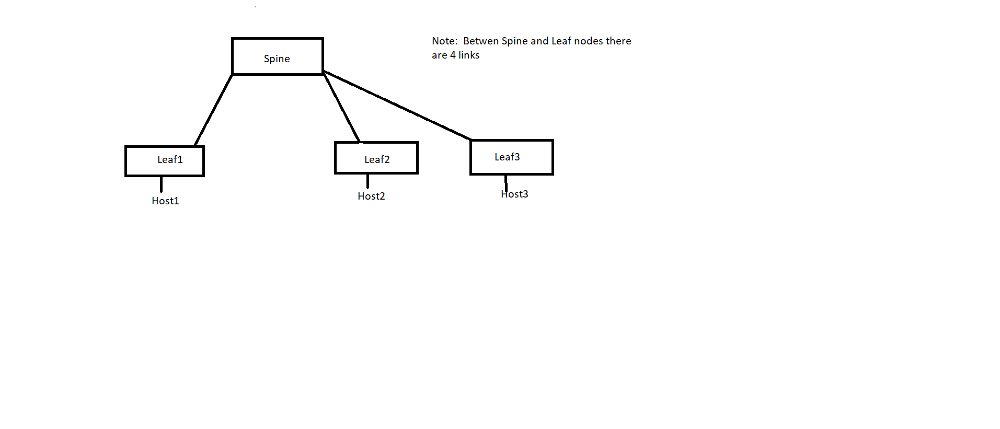

# SQA Test Plan

# VxLAN QOS
#  SONiC 3.1 BuzznikPlus Release

[TOC]

## Test Plan Revision History

| Rev  | Date       | Author | Change Description    |
| ---- | ---------- | ------ | ------------------    |
| 1    | 19/04/2019 | Julius | Initial Version       |
| 2    | 24/04/219  | Julius | comments incorporated |
| 3    |            |        |                       |
| 4    |            |        |                       |
| 5    |            |        |                       |

## List of Reviewers

| Function | Name |
| -------- | ---- |
|          |      |

## List of Approvers

| Function | Name | Date Approved |
| -------- | ---- | ------------- |
|          |      |               |

## Definition/Abbreviation

| **Term** | **Meaning**                               |
| -------- | ----------------------------------------- |
| EVPN     | Ethernet VPN                              |
| EVI      | EVPN Instance                             |
| ESI      | Ethernet Segment Identifier               |
| RT       | Route-target                              |
| RD       | Route-distinguisher                       |
| VXLAN    | Virtual Extended LAN                      |
| VTEP     | VXLAN Tunnel End point                    |
| VRF      | Virtual Routing and Forwarding            |
| VNI      | VXLAN Network Identifier                  |
| NVO      | Network Virtualization Overlay            |
| L3GW     | Layer 3 Gateway                           |
| IRB      | Integrated Routing and Bridging           |
| IMET     | Inclusive Multicast Ethernet Tag          |
| BUM      | Broadcast, Unknown unicast, and Multicast |
| BGP      | Border Gateway Protocol                   |
| SHD      | Single-Homed Device                       |
| MHD      | Multi-Homed Device                        |
| ICCP     | Inter-Chassis Communication Protocol      |
## Introduction

### Objective 

Objective of this document is to cover QOS test cases that will be executed for BGP EVPN feature in SONIC 3.1 Buzznik Plus release.  Topologies and test cases  for testing the feature will be discussed as part of this document.

### Scope

VxLAN QOS test cases will be covered in this test plan .

### Out of scope

* This test plan does not cover IP fabric with OSFP unnumbered underlay

## Feature Overview

Using this feature, operator can configure QOS to be uniform or pipe mode to set DSCP value for the outer IP header. 
But DSCP value for the payload should be preserved at both VxLAN tunnel origination and termination

- Uniform mode.
    - Tunnel origination
        - L2 forwarded traffic with/without VLAN tag and without L3 header, while encapsulation outer header DSCP value is set to 0
        - L2 forwarded traffic with/without VLAN tag and with L3 header, while encapsulation payload DSCP is copied to outer header DSCP
        - L3 forwarded traffic with/without VLAN tag, while encapsulation payload DSCP is copied to outer header DSCP
    - Tunnel termination
        - Outer header DSCP value is copied over to the inner IP header DSCP. Implementation is platform dependent.

- Pipe mode
    - Tunnel origination
        - while encapsulation user configured DSCP value is set to outer header DSCP
    - Tunnel termination
        - inner IP header DSCP value is retained

## 1 Test Focus Areas

### 1.1 Underlay flavors

* RFC 5549 

## 2 Topologies

Topology 1

## 3 Test Case and objectives

### **3.1 CLI Test Cases**

### 3.1.1 Verify KLISH VxLAN QOS CLIs	

| **Test ID**    | **iTAS Test Case Manager ID**                                |
| -------------- | :----------------------------------------------------------- |
| **Test Name**  | **Verify KLISH VxLAN QOS CLIs**                              |
| **Test Setup** | **Topology1**                                                |
| **Type**       | **CLI**                                                      |
| **Steps**      | **configure below KLISH based CLIs**.  1) switch(config-if-vtep1) qos-mode <uniform> 2) switch(config-if-vtep1) qos-mode <pipe {dscp <dscp_val>}> ***verify QOS mode config*** 1) show vxlan interface  2) verify pipe DSCP config boundary 3) verify CLI's syntax and help |

### **3.2 Functional Test Cases**

### 3.2.1 Test VxLAN QOS uniform mode for L2 forwarded traffic without IP header

| **Test ID**    | **iTAS Test Case Manager ID**                                |
| -------------- | :----------------------------------------------------------- |
| **Test Name**  | **Test VxLAN QOS uniform mode for L2 forwarded traffic without IP header**    |
| **Test Setup** | **Topology1**                                                |
| **Type**       | **Functional**                                               |
| **Steps**      | 1) setup EVPN environment 2) send L2 tagged traffic from host1 3) send L2 untagged traffic from host2 4) verify outer IP header is set to 0 by leaf1 and leaf2 5) verify the queue counters in both leaf and spine nodes |

### 3.2.2 Test VxLAN QOS uniform mode for known L2 forwarded traffic with IPv4 and IPv6 header

| **Test ID**    | **iTAS Test Case Manager ID**                                |
| -------------- | :----------------------------------------------------------- |
| **Test Name**  | **Test VxLAN QOS uniform mode for known L2 forwarded traffic with IPv4 and IPv6 header**  |
| **Test Setup** | **Topology1**                                                |
| **Type**       | **Functional**                                               |
| **Steps**      | 1) setup EVPN environment 2) send L2 tagged traffic with IPv4 header from host1 to host2 3) send L2 untagged traffic with IPv4 header from host2 to host1 4) verify inner packet's DSCP is copied to outer IP header's DSCP 5) verify original packet's DSCP is retained by capturing packets at host1 and 2 6) verify the queue counters in both leaf and spine nodes 7) repeat the testcase with IPv6 header |

### 3.2.3 Test VxLAN QOS uniform mode for L3 forwarded traffic

| **Test ID**    | **iTAS Test Case Manager ID**                                |
| -------------- | :----------------------------------------------------------- |
| **Test Name**  | **Test VxLAN QOS uniform mode for L3 forwarded traffic**    |
| **Test Setup** | **Topology1**                                                |
| **Type**       | **Functional**                                               |
| **Steps**      | 1) setup EVPN environment 2) send IPv4 tenant traffic from host1 to host2 3) send IPv6 tenant traffic from host2 to host1 4) verify inner packet's DSCP is copied to outer IP header's DSCP 5) verify original packet's DSCP is retained by capturing packets at host1 and 2 6) verify the queue counters in both leaf and spine nodes |

### 3.2.4 Test VxLAN QOS uniform mode for ARP and ND

| **Test ID**    | **iTAS Test Case Manager ID**                                |
| -------------- | :----------------------------------------------------------- |
| **Test Name**  | **Test VxLAN QOS uniform mode for ARP and ND**    |
| **Test Setup** | **Topology1**                                                |
| **Type**       | **Functional**                                               |
| **Steps**      | 1) setup EVPN environment 2) send ARP request from host1 3) send ND solicitation message from host2 4) verify leaf1 sets DSCP value to 0 for the outer IP header 5) verify leaf2 copies payload's DSCP to outer IP header DSCP 6) verify the queue counters in both leaf and spine nodes |

### 3.2.5 Test VxLAN QOS uniform mode for BUM

| **Test ID**    | **iTAS Test Case Manager ID**                                |
| -------------- | :----------------------------------------------------------- |
| **Test Name**  | **Test VxLAN QOS uniform mode for BUM**           |
| **Test Setup** | **Topology1**                                                |
| **Type**       | **Functional**                                               |
| **Steps**      | 1) setup EVPN environment 2) send L2 untagged BUM with L3 header from host1 to host2 3) send L2 tagged BUM with L3 header from host2 to host2 4) verify inner packet's DSCP is copied to outer IP header's DSCP 5) verify original packet's DSCP is retained by capturing packets at host1 and 2 6) verify the MULTICAST queue counters in both leaf and spine nodes |

### 3.2.6 Test VxLAN QOS pipe mode for known L2 forwarded traffic without IP header

| **Test ID**    | **iTAS Test Case Manager ID**                                |
| -------------- | :----------------------------------------------------------- |
| **Test Name**  | **Test VxLAN QOS pipe mode for known L2 forwarded traffic without IP header**                  |
| **Test Setup** | **Topology1**                                                |
| **Type**       | **Functional**                                               |
| **Steps**      | 1) setup EVPN environment 2) configure pipe mode dscp value to 10 in leaf1 & 20 in leaf2 3) send L2 tagged traffic from host1 to host2 4) send L2 untagged traffic from host2 to host1 5) verify leaf1 sets outer IP header DSCP to 10 & leaf2 sets 20 6) verify the queue counters in both leaf and spine nodes |

### 3.2.7 Test VxLAN QOS pipe mode for known L2 forwarded traffic with IPv4 and IPv6 header

| **Test ID**    | **iTAS Test Case Manager ID**                                |
| -------------- | :----------------------------------------------------------- |
| **Test Name**  | **Test VxLAN QOS pipe mode for known L2 forwarded traffic with IPv4 and IPv6 header**                |
| **Test Setup** | **Topology1**                                                |
| **Type**       | **Functional**                                               |
| **Steps**      | 1) setup EVPN environment 2) configure pipe mode dscp value to 10 in leaf1 & 20 in leaf2 3) send L2 tagged traffic with IPv4 header from host1 to host2 4) send L2 untagged traffic with IPv4 header from host2 to host1 5) verify leaf1 sets outer IP header DSCP to 10 & leaf2 sets 20 6) verify original packet's DSCP is retained by capturing packets at host1 and 2 7) verify the queue counters in both leaf and spine nodes 8) repeat testcase for L2 forwarded traffic with IPv6 header |

### 3.2.8 Test VxLAN QOS pipe mode for L3 traffic

| **Test ID**    | **iTAS Test Case Manager ID**                                |
| -------------- | :----------------------------------------------------------- |
| **Test Name**  | **Test VxLAN QOS pipe mode for L3 traffic**                  |
| **Test Setup** | **Topology1**                                                |
| **Type**       | **Functional**                                               |
| **Steps**      | 1) setup EVPN environment 2) configure pipe mode dscp value to 10 in leaf1 & 20 in leaf2 3) send IPv4 tenant traffic from host1 to host2 4) send IPv6 tenant traffic from host2 to host1 5) verify leaf1 sets outer IP header DSCP to 10 & leaf2 sets to 20 6) verify the queue counters in both leaf and spine nodes 7) verify inner packets DSCP value is retained by capturing Rx plts at host1 and 2 |

### 3.2.9 Test VxLAN QOS pipe mode for ARP and ND

| **Test ID**    | **iTAS Test Case Manager ID**                                |
| -------------- | :----------------------------------------------------------- |
| **Test Name**  | **Test VxLAN QOS pipe mode for ARP and ND**                  |
| **Test Setup** | **Topology1**                                                |
| **Type**       | **Functional**                                               |
| **Steps**      | 1) setup EVPN environment 2) configure pipe mode dscp value to 10 in leaf1 & 20 in leaf2 3) send ARP request from host1 4) send ND solicitation message from host2 5) verify leaf1 sets outer IP header DSCP to 40 & leaf2 sets to 60 6) verify the queue counters in both leaf and spine nodes  |

### 3.2.10 Test VxLAN QOS pipe mode for BUM

| **Test ID**    | **iTAS Test Case Manager ID**                                |
| -------------- | :----------------------------------------------------------- |
| **Test Name**  | **Test VxLAN QOS pipe mode for BUM**                         |
| **Test Setup** | **Topology1**                                                |
| **Type**       | **Functional**                                               |
| **Steps**      | 1) setup EVPN environment 2) configure pipe mode dscp value to 10 in leaf1 & 20 in leaf2 3) send L2 untagged BUM with L3 header from host1 4) send L2 tagged BUM with L3 header from host2 5) verify leaf1 sets outer IP header DSCP to 10 & leaf2 sets to 20 6) verify original packet's DSCP is retained by capturing packets at host1 and 2 7) verify the MULTICAST queue counters in both leaf and spine nodes  |

### 3.2.11 Test VxLAN QOS by changing the mode from uniform to pipe

| **Test ID**    | **iTAS Test Case Manager ID**                                |
| -------------- | :----------------------------------------------------------- |
| **Test Name**  | **Test VxLAN QOS by changing the mode from uniform to pipe** |
| **Test Setup** | **Topology1**                                                |
| **Type**       | **Functional**                                               |
| **Steps**      | 1) setup EVPN environment with default VxLAN QOS mode** **2) send IPv4 tenant traffic from host1 to host2 3) send IPv6 tenant traffic from host2 to host1 4) verify queuing happens according to Uniform mode 5) while the traffic is ON, change the mode from Uniform to Pipe 6) configure Pipe DSCP value as 10 in leaf1 and 20 in leaf2 7) verify the queuing happens according to the Pipe DSCP value 8) Remove the PIPE mode so that it will be changed to default Uniform mode 9) verify now the queuing happens according to Uniform mode |

### 3.2.12 Test VxLAN QOS by changing the pipe mode DSCP value

| **Test ID**    | **iTAS Test Case Manager ID**                                |
| -------------- | :----------------------------------------------------------- |
| **Test Name**  | **Test VxLAN QOS by changing the pipe mode DSCP value**      |
| **Test Setup** | **Topology1**                                                |
| **Type**       | **Functional**                                               |
| **Steps**      | 1)  setup EVPN environment 2) configure Pipe DSCP value as 10 in leaf1 and 20 in leaf2 3) send IPv4 tenant traffic from host1 to host2 4) send IPv6 tenant traffic from host2 to host1 5) verify the queuing happens according to Pipe mode config 6) while the traffic is ON, modify leaf1's DSCP value to 30 and leaf2 to 40 7) verify the queuing happens according to the new DSCP values |

### 3.2.13  Test VxLAN QOS by removing source VTEP interface

| **Test ID**    | **iTAS Test Case Manager ID**                                |
| -------------- | :----------------------------------------------------------- |
| **Test Name**  | **Test VxLAN QOS by removing source VTEP interface**         |
| **Test Setup** | **Topology1**                                                |
| **Type**       | **Functional**                                               |
| **Steps**      | 1) setup EVPN environment** **2) send IPv4 tenant traffic from host1 to host2 3) send IPv6 tenant traffic from host2 to host1 4) verify queuing happens according to default Uniform mode 5) remove the Source IP binded to the VTEP and add it back 6) Verify the queuing happens according to default Uniform mode without issues |

### 3.2.14  Test VxLAN QOS by clearing the BGP session

| **Test ID**    | **iTAS Test Case Manager ID**                                |
| -------------- | :----------------------------------------------------------- |
| **Test Name**  | **Test VxLAN QOS by clearing the BGP session**               |
| **Test Setup** | **Topology1**                                                |
| **Type**       | **Functional**                                               |
| **Steps**      | 1) setup EVPN environment** **2) configure Pipe DSCP value as 10 in leaf1 and 20 in leaf2 3) send IPv4 tenant traffic from host1 to host2 4) send IPv6 tenant traffic from host2 to host1 5) Verify queuing happens according to the Pipe DSCP values 6) modify leaf1's Pipe DSCP value to 30 and leaf2 to 40 7) clear the BGP sessions in both leaf1 and leaf2 8) verify queuing happens according to the new Pipe DSCP values |

### 3.2.15  Test VxLAN QOS by clearing the EVPN session

| **Test ID**    | **iTAS Test Case Manager ID**                                |
| -------------- | :----------------------------------------------------------- |
| **Test Name**  | **Test VxLAN QOS by clearing the EVPN session**              |
| **Test Setup** | **Topology1**                                                |
| **Type**       | **Functional**                                               |
| **Steps**      | 1) setup EVPN environment with default VxLAN QOS mode** **2) send IPv4 tenant traffic from host1 to host2 3) send IPv6 tenant traffic from host2 to host1 4) Verify queuing happens according to the Uniform mode 5) modify the mode to Pipe with leaf'1 DSCP value as 10 and leaf2 as 20 6) clear EVPN session in both leaf1 and leaf2 7) verify queuing happens according to the new Pipe DSCP values |

### 3.2.16  Test VxLAN QOS by shutting down all links b/w leaf and spine

| **Test ID**    | **iTAS Test Case Manager ID**                                |
| -------------- | :----------------------------------------------------------- |
| **Test Name**  | **Test VxLAN QOS by shutting down all links b/w leaf and spine** |
| **Test Setup** | **Topology1**                                                |
| **Type**       | **Functional**                                               |
| **Steps**      | 1) setup EVPN environment** **2) configure Pipe DSCP value as 10 in leaf1 and 20 in leaf2 3) send IPv4 tenant traffic from host1 to host2 4) send IPv6 tenant traffic from host2 to host1 5) Verify queuing happens according to the Pipe DSCP values 6) modify leaf1's Pipe DSCP value to 30 and leaf2 to 40 7) shutdown all links b/w spine and the 2 leaf nodes 8) Enable all the links to re-establish VxLAN tunnel 9) Verify the queuing happens according to the new Pipe DSCP values |

### 3.2.17  Test VxLAN QOS for ping packet in both PIPE and uniform mode

| **Test ID**    | **iTAS Test Case Manager ID**                                |
| -------------- | :----------------------------------------------------------- |
| **Test Name**  | **Test VxLAN QOS for ping packet in both PIPE and uniform mode** |
| **Test Setup** | **Topology1**                                                |
| **Type**       | **Functional**                                               |
| **Steps**      | 1) setup EVPN environment** **2) configure qos mode as uniform  3) from leaf1, ping remote leaf2's vtep ip  4) verify DSCP value at leaf2 5) send ping from host1 to host3 for both ipv4 and ipv6 tenant IP's  6) verify DSCP value at leaf2 7) configure qos mode as pipe 8) repeat step 3 to 6 |

### 3.2.18  Test VxLAN QOS with non default DSCP to TC configured for uniform mode

| **Test ID**    | **iTAS Test Case Manager ID**                                |
| -------------- | :----------------------------------------------------------- |
| **Test Name**  | **Test VxLAN QOS with non default DSCP to TC configured for uniform mode** |
| **Test Setup** | **Topology1**                                                |
| **Type**       | **Functional**                                               |
| **Steps**      | 1) setup EVPN environment** **2) configure qos mode as uniform in both leaf1 and leaf2  3) configure non default DSCP to TC (DSCP 30 to TC1) in leaf1  4) configure non default DSCP to TC(DSCP 30 to TC 4) in leaf2  5) send L3 tenant traffic from host1 to host2 with DSCP as 30  6) verify Leaf1 encapsulates outer IP header with DSCP value as 30  7) verify packets are queued to TC1 in leaf1 8) verify packets are queued to TC3 in leaf2 |

### 3.2.19  Test VxLAN QOS with ACL DSCP remarking

| **Test ID**    | **iTAS Test Case Manager ID**                                |
| -------------- | :----------------------------------------------------------- |
| **Test Name**  | **Test VxLAN QOS with ACL DSCP remarking** |
| **Test Setup** | **Topology1**                                                |
| **Type**       | **Functional**                                               |
| **Steps**      | 1) setup EVPN environment** **2) configure qos mode as uniform in both leaf1 and leaf2  3) configure ACL DSCP remarking (DSCP 20 to 40) in leaf1  4) configure ACL DSCP remarking(DSCP 40 to 50) in leaf2  5) send L3 tenant traffic from host1 to host2 with DSCP as 20  6) verify Leaf1 encapsulates outer IP header with remarked DSCP value 40  7) verify host2 Rx packets are of DSCP value 40  8) repeat testcase for pipe mode |

### **3.3 Unit D Scale Testing** 

### 3.3.1  Test VxLAN QOS for max number of 4K VLANs

| **Test ID**    | **iTAS Test Case Manager ID**                                |
| -------------- | :----------------------------------------------------------- |
| **Test Name**  | **Test VxLAN for max number of 4K VLANs**                    |
| **Test Setup** | **Topology1**                                                |
| **Type**       | **Functional**                                               |
| **Steps**      | 1) setup EVPN environment with 4K VNI 2) configure uniform mode in leaf1 and pipe mode 20 in leaf2 3) send bidirectional L2 traffic b/w leaf1 and leaf2 for all 4K VLANs 4) verify queuing happens as per the configuration |

### **3.4 Reboot**

### 3.4.1 Verify VxLAN QOS with warm reboot

| **Test ID**    | **iTAS Test Case Manager ID to be updated**                  |
| -------------- | ------------------------------------------------------------ |
| **Test Name**  | **Verify VxLAN QOS with warm reboot**                        |
| **Test Setup** | **Topology 1**                                               |
| **Type**       | **Functional**                                               |
| **Steps**      | 1) setup EVPN environment 2) configure uniform mode in leaf1 and pipe dscp 10 in leaf2 3) send IPv4 tenant traffic from host1 to host2 4) send IPv6 tenant traffic from host2 to host1 5) Verify queuing happens according to config 6) trigger warm reboot 7) Once node comes UP, Verify queuing happens according to config without any issue |

### 3.4.2 Test VxLAN QOS with config reload

| **Test ID**    | **iTAS Test Case Manager ID**                                |
| -------------- | :----------------------------------------------------------- |
| **Test Name**  | **Test VxLAN QOS with config reload**                        |
| **Test Setup** | **Topology1**                                                |
| **Type**       | **Functional**                                               |
| **Steps**      | 1) setup EVPN environment 2) configure uniform mode in leaf1 and pipe dscp 10 in leaf2 3) send IPv4 tenant traffic from host1 to host2 4) send IPv6 tenant traffic from host2 to host1 5) Verify queuing happens according to config 6) trigger config reload 7) Once node comes UP, Verify queuing happens according to config without any issue |

### 3.5 OCYang

### 3.5.1 Test VxLAN QOS using OCYang

| **Test ID**    | **iTAS Test Case Manager ID**                                |
| -------------- | :----------------------------------------------------------- |
| **Test Name**  | **Test VxLAN QOS using OCYang**                              |
| **Test Setup** | **Topology1**                                                |
| **Type**       | **Functional**                                               |
| **Steps**      | 1) setup EVPN environment 2) configure Pipe mode vxlan qos using OCYang 3) verify Vxlan QOS mode by get URIs 4) modify Vxlan qos mode from Pipe to Uniform mode using OCYang 5) verify Vxlan qos mode by get URIs  |

## **Reference Links**

[EVPN VXLAN HLD]:http://gerrit-lvn-07.lvn.broadcom.net:8083/plugins/gitiles/sonic/documents/+/refs/changes/67/20267/3/L3/EVPN/EVPN%20VXLAN%20HLD.md#4312-support-for-vxlan-qos-mode
