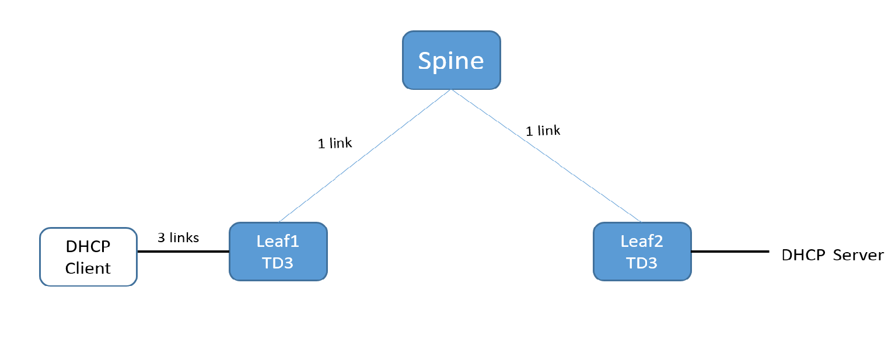
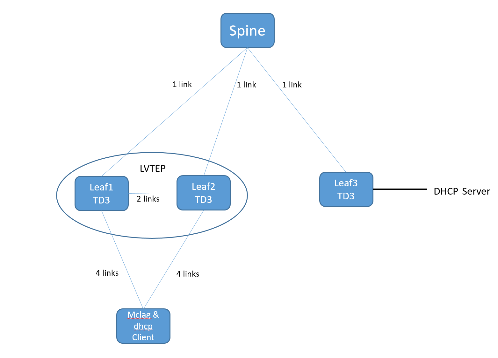

# SQA Test Plan

# DHCP Relay over VxLAN

# SONiC MR1 and Buzznik Plus

[TOC]

## Test Plan Revision History

| Rev  | Date       | Author               | Change Description |
| ---- | ---------- | -------------------- | ------------------ |
| 1    | 09/03/2020 | DHCP_Relay Test Team | Initial Version    |

## List of Reviewers

| Function | Name |
| :------: | :--: |
|          |      |

## List of Approvers

| Function | Name | Date Approved |
| :------: | :--: | :-----------: |
|          |      |               |

## Definition/Abbreviation

| **Term** | **Meaning**                    |
| -------- | ------------------------------ |
| EVPN     | Ethernet VPN                   |
| VXLAN    | Virtual Extended LAN           |
| VTEP     | VXLAN Tunnel End point         |
| VRF      | Virtual Routing and Forwarding |
| VNI      | VXLAN Network Identifier       |

## Introduction

### Objective 

The main objective of this document is to list out the test cases required to validate the working DHCP relay functionality over VxLAN in SONIC MR1 and Buzznik Plus release.  Topologies and test cases  for testing the feature will be discussed as part of this document.

### Scope

This test plan covers DHCP relay functionality only over VxLAN Overlay interface

### Out of scope

- 

## Feature Overview

**<TODO>**

## 1 Test Focus Areas

### 1.1 Underlay flavors

- VxLAN Overlay
- DHCP client on port-channel, router and VE port
- DHCP Server on Linux

## 2 Topologies

### 2.1 Topology-1 : SVTEP

### 2.2 Topology-2 : LVTEP

## 3 Test Case and objectives

### 3.1 Test Cases

#### 3.1.1.1  CLI options and help strings are appropriate for dhcp relay

| **Test ID**    | FtOpSoRoDHCPRCli001                                          |
| -------------- | :----------------------------------------------------------- |
| **Test Name**  | Verify  all the CLI options and help strings are appropriate for dhcp relay (with  option 82) |
| **Test Setup** | **Topology1**                                                |
| **Type**       | **CLI**                                                      |
| **Steps**      | 1. Configure DHCP relay on port-channel, Ve interface and router ports, with all supported sub options - link-selection, source -interface and max-hop-count, with max number of servers 2. Verify above config with show command - both brief and detailed one 3. Repeat above two steps for IPv6 interface |

#### 3.1.1.2 DHCP relay with L3 VNI, physical router port

| **Test ID**    | **FtOpSoRoDHCPRFt001**                                       |
| :------------- | :----------------------------------------------------------- |
| **Test Name**  | Verify  basic DHCP relay with L3 VNI, physical router port   |
| **Test Setup** | **Topology1**                                                |
| **Type**       | **Functional**                                               |
| **Steps**      | 1. Bring up the VxLAN tunnel, configuration of DHCP Server are part of base config. 2. Start the dhcp client on router port  to acquire address from the dhcp server 3. Verify that the desired address is assigned  4. Verify that ping is (from the assigned IP) to dhcp server is working fine  5. Also validate the DHCP Relay statistics 6. |

#### 3.1.1.3 DHCP relay with L3 VNI, VE interface

| **Test ID**    | **FtOpSoRoDHCPRFt002**                                       |
| :------------- | :----------------------------------------------------------- |
| **Test Name**  | Verify  basic DHCP relay with L3 VNI, VE interface           |
| **Test Setup** | **Topology1**                                                |
| **Type**       | **Functional**                                               |
| **Steps**      | 1. Bring up the VxLAN tunnel, configuration of DHCP Server are part of base config. 2. Start the dhcp client on VE interface  to acquire address from the dhcp server 3. Verify that the desired address is assigned  4. Verify that ping is (from the assigned IP) to dhcp server is working fine  5. Also validate the DHCP Relay statistics 6. |

#### 3.1.1.4 DHCP relay with L3 VNI, port-channel interface 

| **Test ID**    | **FtOpSoRoDHCPRFt003**                                       |
| :------------- | :----------------------------------------------------------- |
| **Test Name**  | Verify  basic DHCP relay with L3 VNI, port-channel interface |
| **Test Setup** | **Topology1**                                                |
| **Type**       | **Functional**                                               |
| **Steps**      | 1. Bring up the VxLAN tunnel, configuration of DHCP Server are part of base config. 2. Start the dhcp client on Port channel interface  to acquire address from the dhcp server 3. Verify that the desired address is assigned  4. Verify that ping is (from the assigned IP) to dhcp server is working fine  5. Also validate the DHCP Relay statistics 6. |

#### 3.1.1.5  Overlay dhcp relay function with source interface selection 

| **Test ID**    | **FtOpSoRoDHCPRFt004**                                       |
| :------------- | :----------------------------------------------------------- |
| **Test Name**  | Verify  dhcp relay function with source interface selection  |
| **Test Setup** | **Topology1**                                                |
| **Type**       | **Functional**                                               |
| **Steps**      | 1. Bring up the VxLAN tunnel, configuration of DHCP Server are part of base config. 2. Enable source -interface selection and then start the dhcp client on Portchannel interface  to acquire address from the dhcp server 3. Verify that the desired address is assigned  4. Verify that ping is (from the assigned IP) to dhcp server is working fine  5. Also validate the DHCP Relay statistics 6. Validate that the DHCP packet from client is relayed with configured source interface 7. Delete the source interface config and repeat step 2-6 |

#### 3.1.1.6  Overlay dhcp relay function with hop count 

| **Test ID**    | **FtOpSoRoDHCPRFt005**                                       |
| :------------- | :----------------------------------------------------------- |
| **Test Name**  | Verify  DHCP relay functionality when server connected remotely - with hop count  config |
| **Test Setup** | **Topology1**                                                |
| **Type**       | **Functional**                                               |
| **Steps**      | 1. Bring up the VxLAN tunnel, configuration of DHCP Server are part of base config. 2. Configure hop count to 1 and then start the dhcp client on Portchannel interface  to acquire address from the dhcp server 3. Verify that the desired address is not assigned  Reset the hop count to default and then start the dhcp client on Portchannel interface  to acquire address from the dhcp server 4. Verify that ping is (from the assigned IP) to dhcp server is working fine  5. Also validate the DHCP Relay statistics 6. Validate that the DHCP packet from client is relayed with configured source interface  |

#### 3.1.1.7 Overlay dhcp relay function with link Selection 

| **Test ID**    | **FtOpSoRoDHCPRFt006**                                       |
| :------------- | :----------------------------------------------------------- |
| **Test Name**  | Verify  the DHCP relay agent with option-82 ( Sub option: 5 Link Selection) |
| **Test Setup** | **Topology1**                                                |
| **Type**       | **Functional**                                               |
| **Steps**      | 1. Bring up the VxLAN tunnel, configuration of DHCP Server are part of base config. 2. Enable link-selection and then start the dhcp client on Portchannel interface  to acquire address from the dhcp server 3. Verify that the desired address is assigned  4. Verify that ping is (from the assigned IP) to dhcp server is working fine  5. Also validate the DHCP Relay statistics 6. Validate that the DHCP packet from client is relayed with configured source interface and also link-select option is inserted 7. Delete the link-selection config and repeat step 2-6 |

#### 3.1.1.8  Overlay dhcp relay function with client side link flap

| **Test ID**    | **FtOpSoRoDHCPRFt007                                         |
| :------------- | :----------------------------------------------------------- |
| **Test Name**  | Verify  dhcp relay functionality after shut/no shut of relay interface - client side |
| **Test Setup** | **Topology1**                                                |
| **Type**       | **Functional**                                               |
| **Steps**      | 1. Bring up the VxLAN tunnel, configuration of DHCP Server are part of base config. 2. Start the dhcp client on Portchannel interface  to acquire address from the dhcp server 3. Verify that the desired address is assigned  4. Verify that ping is (from the assigned IP) to dhcp server is working fine  5. Also validate the DHCP Relay statistics 6. Toggle the client side interface on the DHCP relay device 7. Verify that the address in intact and release/renew client address |

#### 3.1.1.9 Overlay dhcp relay function when the VTEP interface is flapping

| **Test ID**    | **FtOpSoRoDHCPRFt008                                         |
| :------------- | :----------------------------------------------------------- |
| **Test Name**  | Verify  dhcp relay functionality while toggling VTEP interface - clear, flap |
| **Test Setup** | **Topology1**                                                |
| **Type**       | **Functional**                                               |
| **Steps**      | 1. Bring up the VxLAN tunnel, configuration of DHCP Server are part of base config. 2. Start the dhcp client on Portchannel interface  to acquire address from the dhcp server 3. Verify that the desired address is assigned  4. Verify that ping is (from the assigned IP) to dhcp server is working fine  5. Also validate the DHCP Relay statistics 6. Toggle the VTEP interface on the DHCP relay device 7. Verify that the address in intact and release/renew client address |

#### 3.1.1.10 Overlay dhcp relay functionality with config reload 

| **Test ID**    | **FtOpSoRoDHCPRFt009                                         |
| :------------- | :----------------------------------------------------------- |
| **Test Name**  | Verify  dhcp relay functionality with config reload          |
| **Test Setup** | **Topology1**                                                |
| **Type**       | **Functional**                                               |
| **Steps**      | 1. Bring up the VxLAN tunnel, configuration of DHCP Server are part of base config. 2. Start the dhcp client on Portchannel interface  to acquire address from the dhcp server 3. Verify that the desired address is assigned  4. Verify that ping is (from the assigned IP) to dhcp server is working fine  5. Also validate the DHCP Relay statistics 6. Execute config reload on the DHCP Relay device 7. Verify that DHCP Relay configurations are intact and ping to DHCP server is working fine |

#### 3.1.1.11 Overlay dhcp relay functionality with warm reboot 

| **Test ID**    | **FtOpSoRoDHCPRFt010                                         |
| :------------- | :----------------------------------------------------------- |
| **Test Name**  | Verify  dhcp relay functionality with warm reboot            |
| **Test Setup** | **Topology1**                                                |
| **Type**       | **Functional**                                               |
| **Steps**      | 1. Bring up the VxLAN tunnel, configuration of DHCP Server are part of base config. 2. Start the dhcp client on Portchannel interface  to acquire address from the dhcp server 3. Verify that the desired address is assigned  4. Verify that ping is (from the assigned IP) to dhcp server is working fine  5. Also validate the DHCP Relay statistics 6. Reboot the DHCP Relay device using warm-reboot 7. Verify that DHCP Relay configurations are intact and ping to DHCP server is working fine |

#### 3.1.1.12 Overlay dhcp relay functionality with cold reboot    

| **Test ID**    | **FtOpSoRoDHCPRFt011                                         |
| :------------- | :----------------------------------------------------------- |
| **Test Name**  | Verify  dhcp relay functionality with cold reboot            |
| **Test Setup** | **Topology1**                                                |
| **Type**       | **Functional**                                               |
| **Steps**      | 1. Bring up the VxLAN tunnel, configuration of DHCP Server are part of base config. 2. Start the dhcp client on Portchannel interface  to acquire address from the dhcp server 3. Verify that the desired address is assigned  4. Verify that ping is (from the assigned IP) to dhcp server is working fine  5. Also validate the DHCP Relay statistics 6. Reboot the DHCP Relay device using cold-reboot 7. Verify that DHCP Relay configurations are intact and ping to DHCP server is working fine |

#### 3.1.1.13  Overlay dhcp relay functionality with server unreachable 

| **Test ID**    | **FtOpSoRoDHCPRFt012                                         |
| :------------- | :----------------------------------------------------------- |
| **Test Name**  | Verify  dhcp relay functionality when the DHCP server is not reachable |
| **Test Setup** | **Topology1**                                                |
| **Type**       | **Negative**                                               |
| **Steps**      | 1. Bring up the VxLAN tunnel, configuration of DHCP Server are part of base config. 2. Configure invalid DHCP server address and Start the dhcp client on Portchannel interface to acquire address from the dhcp server 3. Verify that the desired address is not assigned  4. |

#### 3.1.1.14 Overlay dhcp relay functionality with server fallback

| **Test ID**    | **FtOpSoRoDHCPRFt013                                         |
| :------------- | :----------------------------------------------------------- |
| **Test Name**  | Verify  dhcp relay functionality when the first three DHCP servers are not reachable but last one is |
| **Test Setup** | **Topology1**                                                |
| **Type**       | **Negative**                                               |
| **Steps**      | 1. Bring up the VxLAN tunnel, configuration of DHCP Server are part of base config. 2. Configure 3 invalid DHCP server and one valid server address. Start the dhcp client on Portchannel interface to acquire address from the dhcp server 3. Verify that the desired address is assigned  4. Verify that ping is (from the assigned IP) to dhcp server is working fine  5. Also validate the DHCP Relay statistics  |

#### 3.1.1.15 Overlay dhcp relay functionality with source-interface has no IP address configured

| **Test ID**    | **FtOpSoRoDHCPRFt0014                                        |
| :------------- | :----------------------------------------------------------- |
| **Test Name**  | Verify  dhcp relay functionality when source interface is used, but it has no IP address  configured |
| **Test Setup** | **Topology1**                                                |
| **Type**       | **Negative**                                                 |
| **Steps**      | 1. Bring up the VxLAN tunnel, configuration of DHCP Server are part of base config. 2. Enable source -interface selection. however there is no IP address configured on the source interface. Start the dhcp client on Portchannel interface  to acquire address from the dhcp server 3. Verify that the desired address is assigned  4. Verify that ping is (from the assigned IP) to dhcp server is working fine  5. Also validate the DHCP Relay statistics 6. Validate that the DHCP packet from client is relayed with  source IP as IP address of outgoing interface 7. Configure IP address on the source interface and repeat step 2-6 |

#### 3.1.1.16 Overlay dhcp relay functionality with link-selection and source-interface has no IP address configured

| **Test ID**    | **FtOpSoRoDHCPRFt0015                                        |
| :------------- | :----------------------------------------------------------- |
| **Test Name**  | Verify  dhcp relay functionality when link selection is enabled but it  source-interface has no IP address configured |
| **Test Setup** | **Topology1**                                                |
| **Type**       | **Negative**                                                 |
| **Steps**      | 1. Bring up the VxLAN tunnel, configuration of DHCP Server are part of base config. 2. Enable source -interface along with link-selection. However there is no IP address configured on the source interface. Start the dhcp client on Portchannel interface  to acquire address from the dhcp server 3. Verify that the desired address is assigned  4. Verify that ping is (from the assigned IP) to dhcp server is working fine  5. Also validate the DHCP Relay statistics 6. Validate that the DHCP packet from client is relayed with  source IP as IP address of outgoing interface 7. Configure IP address on the source interface and repeat step 2-6 |

#### 3.1.1.17 Overlay dhcp relay functionality with OC-Yang

| **Test ID**    | **FtOpSoRoDHCPRFt0016                                        |
| :------------- | :----------------------------------------------------------- |
| **Test Name**  | Verify  dhcp relay functionality with OC-Yang                |
| **Test Setup** | **Topology1**                                                |
| **Type**       | **Functional**                                               |
| **Steps**      | 1. Bring up the VxLAN tunnel, configuration of DHCP Server are part of base config. 2. Repeat Ft001-Ft006 using OC-Yang REST URIs |

#### 3.1.1.18 Overlay dhcp relay functionality with multiple  DHCP Servers   

| **Test ID**    | **FtOpSoRoDHCPRFt0017                                        |
| :------------- | :----------------------------------------------------------- |
| **Test Name**  | Verify  dhcp relay functionality with 4 DHCP Servers         |
| **Test Setup** | **Topology1**                                                |
| **Type**       | **Functional**                                               |
| **Steps**      | 1. Bring up the VxLAN tunnel, configuration of DHCP Server are part of base config. 2. Enable source -interface along with link-selection. Start the dhcp client on Portchannel interface  to acquire address from the dhcp server 3. Verify that the desired address is assigned  4. Verify that ping is (from the assigned IP) to dhcp server is working fine  5. Also validate the DHCP Relay statistics 6. Validate that the DHCP packet from client is relayed with  source IP as ip address of outgoing interface  |

#### 3.1.1.19 Overlay dhcp relay functionality with LVTEP

| **Test ID**    | **FtOpSoRoDHCPRFt0018                                        |
| :------------- | :----------------------------------------------------------- |
| **Test Name**  | Verify  dhcp relay functionality with LVTEP                  |
| **Test Setup** | **Topology2**                                                |
| **Type**       | **Functional**                                               |
| **Steps**      | 1. Bring up the VxLAN tunnel on LVTEP , configuration of DHCP Server as part of base config. 2. . Start the dhcp client  to acquire address from the dhcp server 3. Verify that the desired address is assigned to the client  4. Verify that ping is (from the assigned IP) to dhcp server is working fine  5. Also validate the DHCP Relay statistics  6. Test for scenarios with DHCP discover and offer messages on different Leaf nodes/links of MCLAG  |

#### 3.1.1.20 Overlay dhcp relay functionality with LVTEP & Orphan Clients

| **Test ID**    | **FtOpSoRoDHCPRFt0019                                        |
| :------------- | :----------------------------------------------------------- |
| **Test Name**  | Verify  dhcp relay functionality with LVTEP for Orphan Clients |
| **Test Setup** | **Topology2**                                                |
| **Type**       | **Functional**                                               |
| **Steps**      | 1. Bring up the VxLAN tunnel on LVTEP , configuration of DHCP Server as part of base config. 2. Connect an orphan port to the MCLAG switch . Start the dhcp client  to acquire address from the dhcp server 3. Verify that the desired address is assigned to the client  4. Verify that ping is (from the assigned IP) to dhcp server is working fine  5. Also validate the DHCP Relay statistics 6. Test for scenarios with DHCP discover and offer messages on different Leaf nodes/links of MCLAG  |

#### 3.1.1.21 Overlay dhcp relay functionality with LVTEP with default and non default VRF

| **Test ID**    | **FtOpSoRoDHCPRFt0020                                        |
| :------------- | :----------------------------------------------------------- |
| **Test Name**  | Verify  dhcp relay functionality with LVTEP with default and non default VRF |
| **Test Setup** | **Topology2**                                                |
| **Type**       | **Functional**                                               |
| **Steps**      | 1. Bring up the VxLAN tunnel on LVTEP , configuration of DHCP Server as part of base config. 2. Start the dhcp client  to acquire address from the dhcp server 3. Test clients connected in default and non default VRFs 3. Verify that the desired address is assigned to the clients  4. Verify that ping  (from the assigned IP) to dhcp server from different VRFs is working fine  5. Also validate the DHCP Relay statistics  |

#### 3.1.1.22 Overlay dhcp relay functionality with LVTEP with SAG

| **Test ID**    | **FtOpSoRoDHCPRFt0021                                        |
| :------------- | :----------------------------------------------------------- |
| **Test Name**  | Verify  dhcp relay functionality with LVTEP with SAG         |
| **Test Setup** | **Topology2**                                                |
| **Type**       | **Functional**                                               |
| **Steps**      | 1. Bring up the VxLAN tunnel on LVTEP , configuration of DHCP Server as part of base config. 2. Configure SAG IP in the LVTEP Nodes . Start the dhcp client  to acquire address from the dhcp server 3. Verify that the desired address is assigned to the client  4. Verify that ping is (from the assigned IP) to dhcp server is working fine  5. Also validate the DHCP Relay statistics 6. Test for scenarios with DHCP discover and offer messages on different Leaf nodes/links of MCLAG  |

#### 3.1.1.23 Overlay dhcp relay functionality with LVTEP with Unique IP

| **Test ID**    | **FtOpSoRoDHCPRFt0022                                |
| :------------- | :----------------------------------------------------------- |
| **Test Name**  | Verify  dhcp relay functionality with LVTEP with Unique IP    |
| **Test Setup** | **Topology2**                                                |
| **Type**       | **Functional**                                               |
| **Steps**      | 1. Bring up the VxLAN tunnel on LVTEP , configuration of DHCP Server as part of base config. 2. Configure Unique IP in the LVTEP Nodes . Start the dhcp client  to acquire address from the dhcp server 3. Verify that the desired address is assigned to the client  4. Verify that ping is (from the assigned IP) to dhcp server is working fine  5. Also validate the DHCP Relay statistics 6. Test for scenarioes with DHCP discover and offer messages on different Leaf nodes/links of mclag  |

#### 3.1.1.24  Overlay dhcp relay function with source interface selection, where source interface has multiple IP address configured

| **Test ID**    | **FtOpSoRoDHCPRFt023**                                       |
| :------------- | :----------------------------------------------------------- |
| **Test Name**  | Verify  dhcp relay function with source interface selection, where source interface has multiple IP address configured |
| **Test Setup** | **Topology1**                                                |
| **Type**       | **Functional**                                               |
| **Steps**      | 1. Bring up the VxLAN tunnel, configuration of DHCP Server are part of base config. 2. Configure multiple addresses on the interface to be used as source-interface. Enable source -interface selection and then start the dhcp client on Portchannel interface  to acquire address from the dhcp server 3. Verify that the desired address is assigned  4. Verify that ping is (from the assigned IP) to dhcp server is working fine  5. Also validate the DHCP Relay statistics 6. Validate that the DHCP packet from client is relayed with configured source interface. The first address configured should be used as source interface 7. Delete the first address from the source interface and repeat step 2-6 |

#### 3.1.1.25  Overlay dhcp relay function with source interface selection, where source interface to be used are physical/Ve/Portchannel

| **Test ID**    | **FtOpSoRoDHCPRFt024**                                       |
| :------------- | :----------------------------------------------------------- |
| **Test Name**  | Verify  dhcp relay function with source interface selection, where source interface to be used are physical/Ve/Portchannel |
| **Test Setup** | **Topology1**                                                |
| **Type**       | **Functional**                                               |
| **Steps**      | 1. Bring up the VxLAN tunnel, configuration of DHCP Server are part of base config. 2. Configure a VE interface as source-interface. Enable source -interface selection and then start the dhcp client on Portchannel interface  to acquire address from the dhcp server 3. Verify that the desired address is assigned  4. Verify that ping is (from the assigned IP) to dhcp server is working fine  5. Also validate the DHCP Relay statistics 6. Validate that the DHCP packet from client is relayed with configured source interface. The first address configured should be used as source interface 7. Repeat step 2-6 with source interface as port-channel and Physical interface. |

#### 3.1.1.26  Overlay dhcp relay functionality with 2000 DHCP clients

| **Test ID**    | **FtOpSoRoDHCPRSc001                                     |
| :------------- | :----------------------------------------------------------- |
| **Test Name**  | Verify  dhcp relay functionality with 2000 DHCP client       |
| **Test Setup** | **Topology1**                                                |
| **Type**       | **Scale**                                               |
| **Steps**      | 1. Bring up the VxLAN tunnel, configuration of DHCP Server are part of base config. 2. Enable source -interface along with link-selection. Start the dhcp client on 2000 different interfaces to acquire address from the dhcp server 3. Verify that the desired address is assigned to all 2000 interfaces 4. Verify that ping is (from the assigned IP) to dhcp server is working fine  5. Also validate the DHCP Relay statistics  |

### 3.2 Test Cases-

###               1. DHCP Relay with server reachable via IPv4 unnumbered interface 

###                2. Sub-option151/152

#### 3.2.1.1  CLI options and help strings are appropriate for dhcp relay sub-option 151

| **Test ID**    | FtOpSoRoDHCPRFt025                                           |
| -------------- | :----------------------------------------------------------- |
| **Test Name**  | Verify  all the CLI options and help strings are appropriate for dhcp relay (with option 82-sub-option 151 ) |
| **Test Setup** | **Topology1**                                                |
| **Type**       | **CLI**                                                      |
| **Steps**      | 1. Configure DHCP relay on port-channel, Ve interface and router ports, with all supported sub options - link-selection, source -interface and max-hop-count, vrf-select(sub-option 151) 2. Verify above config with show command - both brief and detailed one 3. Repeat above two steps for IPv6 interface |

#### 3.2.1.2 Verify DHCP relay with L3 VNI, physical router port with server reachable via IPv4 unnumbered interface

| **Test ID**    | **FtOpSoRoDHCPRFt026**                                       |
| :------------- | :----------------------------------------------------------- |
| **Test Name**  | Verify  basic DHCP relay with L3 VNI, physical router port with server reachable via IPv4 unnumbered interface |
| **Test Setup** | **Topology1**                                                |
| **Type**       | **Functional**                                               |
| **Steps**      | 1. Configure IPv4 DHCP relay with server reachable via IPv4 unnumbered interface 2. Start the dhcp client on router port  to acquire address from the dhcp server 3. Verify that client requests are relayed to the DHCP server,Verify that the desired address is assigned  4. Verify that ping is (from the assigned IP) to dhcp server is working fine  5. Also validate the DHCP Relay statistics  |

#### 3.2.1.3 Verify DHCP relay with L3 VNI, VE port with server reachable via IPv4 unnumbered interface

| **Test ID**    | **FtOpSoRoDHCPRFt027**                                       |
| :------------- | :----------------------------------------------------------- |
| **Test Name**  | Verify  basic DHCP relay with L3 VNI, VE port with server reachable via IPv4 unnumbered interface |
| **Test Setup** | **Topology1**                                                |
| **Type**       | **Functional**                                               |
| **Steps**      | 1. Configure IPv4 DHCP relay with server reachable via IPv4 unnumbered interface 2. Start the dhcp client on VE port  to acquire address from the dhcp server 3. Verify that client requests are relayed to the DHCP server,Verify that the desired address is assigned  4. Verify that ping is (from the assigned IP) to dhcp server is working fine  5. Also validate the DHCP Relay statistics  |

#### 3.2.1.4 Verify DHCP relay with L3 VNI, port-channel interface  with server reachable via IPv4 unnumbered interface 

| **Test ID**    | **FtOpSoRoDHCPRFt028**                                       |
| :------------- | :----------------------------------------------------------- |
| **Test Name**  | Verify  basic DHCP relay with L3 VNI, port-channel interface with server reachable via IPv4 unnumbered interface |
| **Test Setup** | **Topology1**                                                |
| **Type**       | **Functional**                                               |
| **Steps**      | 1. Configure IPv4 DHCP relay with server reachable via IPv4 unnumbered interface. 2. Start the dhcp client on Port channel interface  to acquire address from the dhcp server which is reachable via IPv4 unnumbered interface 3. Verify that client requests are relayed to the DHCP server and also verify that the desired address is assigned  4. Verify that ping is (from the assigned IP) to dhcp server is working fine  5. Also validate the DHCP Relay statistics  |

#### 3.2.1.5  Verify dhcp relay function with source interface selection 

| **Test ID**    | **FtOpSoRoDHCPRFt029**                                       |
| :------------- | :----------------------------------------------------------- |
| **Test Name**  | Verify  dhcp relay function with source interface selection with server reachable via IPv4 unnumbered interface |
| **Test Setup** | **Topology1**                                                |
| **Type**       | **Functional**                                               |
| **Steps**      | 1. Configure IPv4 DHCP relay with server reachable via IPv4 unnumbered interface. 2. Enable source -interface selection and then start the dhcp client on Portchannel interface  to acquire address from the dhcp server which is reachable via IPv4 unnumbered interface 3. Verify that the desired address is assigned  4. Verify that ping is (from the assigned IP) to dhcp server is working fine  5. Also validate the DHCP Relay statistics 6. Validate that the DHCP packet from client is relayed with configured source interface  |

#### 3.2.1.6 Verify dhcp relay function with link Selection option

| **Test ID**    | **FtOpSoRoDHCPRFt030**                                       |
| :------------- | :----------------------------------------------------------- |
| **Test Name**  | Verify  the DHCP relay agent with option-82 ( Sub option: 5 Link Selection) with server reachable via IPv4 unnumbered interface |
| **Test Setup** | **Topology1**                                                |
| **Type**       | **Functional**                                               |
| **Steps**      | 1. Configure IPv4 DHCP relay with server reachable via IPv4 unnumbered interface. 2. Enable link-selection and then start the dhcp client on Portchannel interface  to acquire address from the dhcp server  3. Verify that the desired address is assigned  4. Verify that ping is (from the assigned IP) to dhcp server is working fine  5. Also validate the DHCP Relay statistics 6. Verify that relayed packet includes sub-option 5  |

#### 3.2.1.7  Verify dhcp relay function with client side link flap

| **Test ID**    | **FtOpSoRoDHCPRFt031**                                       |
| :------------- | :----------------------------------------------------------- |
| **Test Name**  | Verify  dhcp relay functionality after shut/no shut of relay interface - client side |
| **Test Setup** | **Topology1**                                                |
| **Type**       | **Functional**                                               |
| **Steps**      | 1. Configure IPv4 DHCP relay with server reachable via IPv4 unnumbered interface. 2. Start the dhcp client on Portchannel interface  to acquire address from the dhcp server  3. Verify that the desired address is assigned  4. Verify that ping is (from the assigned IP) to dhcp server is working fine  5. Also validate the DHCP Relay statistics 6. Toggle the client side interface on the DHCP relay device 7. Verify that the address in intact and release/renew client address |

#### 3.2.1.8 Verify DHCP relay with IPv4 unnumbered configuration on Port channel interfaces

| **Test ID**    | **FtOpSoRoDHCPRFt033**                                       |
| :------------- | :----------------------------------------------------------- |
| **Test Name**  | Verify  dhcp relay functionality when the server is reachable via IPv4 unnumbered interface which is configured over Port-channel |
| **Test Setup** | **Topology1**                                                |
| **Type**       | **Functional**                                               |
| **Steps**      | 1. Configure IPv4 DHCP relay with server reachable via IPv4 unnumbered interface (Configured on router port). 2. Start the dhcp client on Portchannel interface  to acquire address from the dhcp server which is reachable via IPv4 unnumbered interface 3. Verify that the desired address is assigned  4. Verify that ping is (from the assigned IP) to dhcp server is working fine  5. Also validate the DHCP Relay statistics 6. Repeat steps 2-6 when unnumbered interface is configure on Port-channel |

#### 3.2.1.9 Verify dhcp relay forwards client requests after config reload

| **Test ID**    | **FtOpSoRoDHCPRFt034**                                       |
| :------------- | :----------------------------------------------------------- |
| **Test Name**  | Verify dhcp relay functionality with config reload when the server is reachable via IPv4 unnumbered interface |
| **Test Setup** | **Topology1**                                                |
| **Type**       | **Functional**                                               |
| **Steps**      | 1.Configure IPv4 DHCP relay with server reachable via IPv4 unnumbered interface. 2. Start the dhcp client on Portchannel interface  to acquire address from the dhcp server  3. Verify that the desired address is assigned  4. Verify that ping is (from the assigned IP) to dhcp server is working fine  5. Also validate the DHCP Relay statistics 6. Execute config reload on the DHCP Relay device 7. Verify that DHCP Relay configurations are intact and ping to DHCP server is working fine 8. Verify the relay forwards client requests after config reload |

#### 3.2.1.10 Verify dhcp relay forwards client requests after warm reboot 

| **Test ID**    | **FtOpSoRoDHCPRFt035**                                       |
| :------------- | :----------------------------------------------------------- |
| **Test Name**  | Verify  dhcp relay functionality with warm reboot            |
| **Test Setup** | **Topology1**                                                |
| **Type**       | **Functional**                                               |
| **Steps**      | 1. Configure IPv4 DHCP relay with server reachable via IPv4 unnumbered interface. 2. Start the dhcp client on Portchannel interface  to acquire address from the dhcp server  3. Verify that the desired address is assigned  4. Verify that ping is (from the assigned IP) to dhcp server is working fine  5. Also validate the DHCP Relay statistics 6. Reboot the DHCP Relay device using warm-reboot 7. Verify that DHCP Relay configurations are intact and ping to DHCP server is working fine 8. Verify the relay forwards client requests after warm-reboot |

#### 3.2.1.11 Verify dhcp relay functionality with cold reboot    

| **Test ID**    | **FtOpSoRoDHCPRFt036**                                       |
| :------------- | :----------------------------------------------------------- |
| **Test Name**  | Verify  dhcp relay functionality with cold reboot            |
| **Test Setup** | **Topology1**                                                |
| **Type**       | **Functional**                                               |
| **Steps**      | 1. Configure IPv4 DHCP relay with server reachable via IPv4 unnumbered interface. 2. Start the dhcp client on Portchannel interface  to acquire address from the dhcp server which is reachable via IPv4 unnumbered interface 3. Verify that the desired address is assigned  4. Verify that ping is (from the assigned IP) to dhcp server is working fine  5. Also validate the DHCP Relay statistics 6. Reboot the DHCP Relay device using cold-reboot 7. Verify that DHCP Relay configurations are intact and ping to DHCP server is working fine 8. Verify the relay forwards client requests after cold-reboot |

#### 3.2.1.12 Verify dhcp relay functionality with OC-Yang (sub-option 151)

| **Test ID**    | **FtOpSoRoDHCPRFt037**                                       |
| :------------- | :----------------------------------------------------------- |
| **Test Name**  | Verify  dhcp relay functionality with OC-Yang                |
| **Test Setup** | **Topology1**                                                |
| **Type**       | **Functional**                                               |
| **Steps**      | 1. Configure IPv4 DHCP relay with server reachable via IPv4 unnumbered interface 2. Repeat Ft001-Ft006 using OC-Yang REST URIs |

#### 3.2.1.13 Verify Dhcp relay over Router port by enabling sub-option 151

| **Test ID**    | **FtOpSoRoDHCPRFt038**                                       |
| :------------- | :----------------------------------------------------------- |
| **Test Name**  | Verify  dhcp relay functionality by enabling sub-option 151 over Router port |
| **Test Setup** | **Topology1**                                                |
| **Type**       | **Functional**                                               |
| **Steps**      | 1. Bring-up the topology by configuring DHCP Relay and Server details  2. Configure Relay with client and server are in different vrf's  3. Enable sub-option 151 and then start the dhcp client on router port  to acquire address from the dhcp  server 4. Verify that the desired address is assigned  5. Verify relay is appending client VRF name in the relayed pkt 6. Also validate the DHCP Relay statistics  |

#### 3.2.1.14 Verify Dhcp relay over VE interface by enabling sub-option 151

| **Test ID**    | **FtOpSoRoDHCPRFt039**                                       |
| :------------- | :----------------------------------------------------------- |
| **Test Name**  | Verify  dhcp relay functionality by enabling sub-option 151 over VE interface |
| **Test Setup** | **Topology1**                                                |
| **Type**       | **Functional**                                               |
| **Steps**      | 1. Bring-up the topology by configuring DHCP Relay and Server details  2. Configure Relay with client and server are in different vrf's  3. Enable sub-option 151 and then start the dhcp client on VE interface to acquire address from the dhcp  server 4. Verify that the desired address is assigned  5. Verify relay is appending client VRF name in the relayed pkt 6. Also validate the DHCP Relay statistics  |

#### 3.2.1.15 Verify Dhcp relay over port-channel interface by enabling sub-option 151

| **Test ID**    | **FtOpSoRoDHCPRFt040**                                       |
| :------------- | :----------------------------------------------------------- |
| **Test Name**  | Verify  dhcp relay functionality by enabling option 151 over Port-Channel interface |
| **Test Setup** | **Topology1**                                                |
| **Type**       | **Functional**                                               |
| **Steps**      | 1. Bring-up the topology by configuring DHCP Relay and Server details  2. Configure Relay with client and server are in different vrf's  3. Enable sub-option 151 and then start the dhcp client on port-channe interface to acquire address from the dhcp  server 4. Verify that the desired address is assigned  5. Verify relay is appending client VRF name in the relayed pkt 6. Also validate the DHCP Relay statistics |

#### 3.2.1.16 Verify Dhcp relay with sub-option 151 when server doesn't support option 151

| **Test ID**    | **FtOpSoRoDHCPRFt041**                                       |
| :------------- | :----------------------------------------------------------- |
| **Test Name**  | Verify  dhcp relay functionality by enabling option 151 but server doesn't support option 151 |
| **Test Setup** | **Topology1**                                                |
| **Type**       | **Functional**                                               |
| **Steps**      | 1. Bring-up the topology by configuring DHCP Relay and Server details  2. Configure Relay with client and server are in different vrf's  3. Enable sub-option 151 and then start the dhcp client on port-channel  4. Verify dhcp relay relayed pkt with option 151 5. Validate whether client gets an IP address from server or not 6. Also validate the DHCP Relay statistics |

#### 3.2.1.17 Verify Dhcp relay with sub-option 151 along with source interface 

| **Test ID**    | **FtOpSoRoDHCPRFt042**                                       |
| :------------- | :----------------------------------------------------------- |
| **Test Name**  | Verify  dhcp relay functionality by enabling option 151 along with source interface config |
| **Test Setup** | **Topology1**                                                |
| **Type**       | **Functional**                                               |
| **Steps**      | 1. Bring-up the topology by configuring DHCP Relay and Server details  2. Configure Relay with client and server are in different vrf's  3. Config source interface and Enable sub-option 151 then start the dhcp client on port-channel interface to acquire address from the dhcp  server 4. Verify that the desired address is assigned 5. Verify relay is appending client VRF name in the relayed pkt 6. Also validate the DHCP Relay statistics  |

#### 3.2.1.18 Verify Dhcp relay with sub-option 151 along with link-select option

| **Test ID**    | **FtOpSoRoDHCPRFt043**                                       |
| :------------- | :----------------------------------------------------------- |
| **Test Name**  | Verify  dhcp relay functionality by enabling option 151 along with link-select option |
| **Test Setup** | **Topology1**                                                |
| **Type**       | **Functional**                                               |
| **Steps**      | 1. Bring-up the topology by configuring DHCP Relay and Server details  2. Configure Relay with client and server are in different vrf's  3. Config Link-select and Enable sub-option 151 then start the dhcp client on port-channel interface to acquire address from the dhcp  server 4. Verify that the desired address is assigned 5. Verify relay is appending client VRF name in the relayed pkt 6. Also validate the DHCP Relay statistics  |

#### 3.2.1.19 Validate behavior of dhcp renew request when client VRF membership changed after getting an IP address (with sub-option 151)

| **Test ID**    | **FtOpSoRoDHCPRFt044**                                       |
| :------------- | :----------------------------------------------------------- |
| **Test Name**  | Verify  dhcp relay functionality by enabling option 151      |
| **Test Setup** | **Topology1**                                                |
| **Type**       | **Functional**                                               |
| **Steps**      | 1. Bring-up the topology by configuring DHCP Relay and Server details  2. Configure Relay with client and server are in different vrf's  3. Enable sub-option 151 then start the dhcp client on port-channel interface to acquire address from the dhcp  server 4. Verify that the desired address is assigned  5. Verify relay is appending client VRF name in the relayed pkt 6. Change the client VRF membership and verify the behavior 7. Also validate the DHCP Relay statistics |

#### 3.2.1.20 Verify dhcp relay by enabling/disabling relay on multiple interfaces

| **Test ID**    | **FtOpSoRoDHCPRFt045**                                       |
| :------------- | :----------------------------------------------------------- |
| **Test Name**  | Verify  dhcp relay by enabling/disabling relay on multiple interfaces |
| **Test Setup** | **Topology1**                                                |
| **Type**       | **Functional**                                               |
| **Steps**      | 1. Bring-up the topology by configuring DHCP Relay on multiple interfaces and Server details  2. Enable/Disable dhcp relay on multiple interfaces in a loop 3. Verify relay behavior 4. Verify that there is no crash while looping it  |

#### 3.2.1.21 Verify dhcp relay functionality with multiple dhcp servers 

| **Test ID**    | **FtOpSoRoDHCPRFt045**                                       |
| :------------- | :----------------------------------------------------------- |
| **Test Name**  | Verify  dhcp relay function with multiple dhcp server        |
| **Test Setup** | **Topology1**                                                |
| **Type**       | **Functional**                                               |
| **Steps**      | 1. Bring-up the topology by configuring DHCP Relay on multiple interfaces and multiple Server details  2. Start dhcp client on multiple interfaces to acquire address from the dhcp server  3. Verify that the desired address is assigned 4. Also validate the DHCP Relay statistics 5. Verify server details in show ip dhcp-relay details  |

#### 