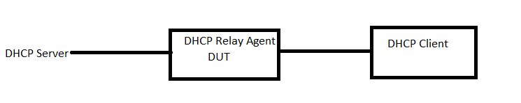

#  SQA Test Plan
#  DHCP Relay Enhancements
#  SONiC 3.0 Project and Buzznik Release
[TOC]
# Test Plan Revision History
|Rev  | Date        | Author                 | Change Description      |
|:---:|:-----------:|:----------------------:|:-----------------------:|
| 0.3  | 11/07/2019 | SreenivasulaReddy V    | Initial version         |

# List of Reviewers
| Function | Name                     |
| :------: | :----------------------: |
|   Dev    | Abhimanyu Devarapalli    |
|   TA     | Kalyan Vadlamani         |
|   QA     | Giri Babu Sajja          |

# List of Approvers
| Function |         Name            | Date Approved   |
| :------: | :---------------------: | :-------------: |
|   Dev    | Abhimanyu Devarapalli   |                 |
|   QA     | Giri Babu Sajja         |                 |

# Definition/Abbreviation
| **Term** |**Meaning**  |
| -------- |---------------------------------------|
| DHCP	   |Dynamic Host Configuration Protocol    |
| VRF	   |Virtual Routing and Forwarding |

# Feature Overview
Generally, the DHCP packets are broadcast. These broadcast packets cannot be exchanged between DHCP server and DHCP client, that are not in the same subnet. The DHCP Relay enables these DHCP packets to be exchanged between the server and client. The DHCP relay converts the broadcast packets to unicast and forwards.

# Test Approach
Preconfig required:
DHCP v4 and v6 server config.

1.Below items will be part of module config
 -Client and Server connected interfaces routing config 
 -DHCP relay configuration
  
2.Tests covered
RtDhReL3Fn016,RtDhReL3Fn017,RtDhReL3Fn018,RtDhReL3Fn019,RtDhReL3Fn020,RtDhReL3Fn021,RtDhReL3Fn022,RtDhReL3Fn023,RtDhReL3Fn024,RtDhReL3Fn025,RtDhReL3Fn026,RtDhReL3Fn027,RtDhReL3Fn028,RtDhReL3Fn029,RtDhReL3Fn030,RtDhReL3Fn031,RtDhReL3Fn032,RtDhReL3Nt005,RtDhReL3Sc001

3.To reduce run time,DHCP relay enhancements warmboot,cold boot,fastboot tests are covered in separate files in routing folder.

4.- DHCP relay is supported on all SONIC platforms

# 1 Test Focus Areas
## 1.1 Functional Testing 
  - Relaying of IPv4 DHCP packets on all L3 routing interfaces including Physical Ethernet, PortChannel and VLAN.
  - Relaying of IPv6 DHCP packets on all L3 routing interfaces including Physical Ethernet, PortChannel and VLAN.
  - DHCP relay via default and user or non default VRF domains.
  

## 1.2 Negative Testing 
  - DHCP relay when client and server connected ports are not in same VRF domain

## 1.3 Reboot/Config Testing  
  - Warm reboot
  - Config save and reload
  - Fast-boot
  - DHCP Relay docker restart

## 1.4 Scale and Performance Testing
  - DHCP relay functionality with Max supported relay addresses.

  
# 2 Topologies
## 2.1 Topology 1

# 3 Test  Case and Objectives

## 3.1 Functional

### 3.1.1 Verify IPv4 DHCP relay functionality on pysical routing interface,where server and client connected ports are in default VRF domain.
| **Test ID**    | **RtDhReL3Fn016**                                              |
| -------------- | :----------------------------------------------------------- |
| **Test Name**  | **Verify IPv4 DHCP relay functionality on pysical routing interface,where server and client connected ports are in default VRF domain.** |
| **Test Setup** | **Topology**                                                 |
| **Type**       | **Functional**    
| **Steps**      | **Procedure: 1)Bring up the DUT with factory defaults. 2)Config needed routing in Relay agent DUT,on ports connected to dhcp server and client connected interfaces.such that both client and server ports are in same default VRF domain. 3)Config dhcp relay config with ip helper address on dhcp client connected interface. 4)Send the DHCP request from the DHCP client.  5) Verify DHCP relay statistics are updated properly . Expected Result: 1) verify that configuration is successful. 2) verify that configuration is successful. 3) Verify config is sucessful. 4) DHCP client receives dhcp offer from dhcp server and gets an IP address from the respective DHCP server pool. 5) DHCP relay statistics are updated properly.** |

### 3.1.2 Verify IPv4 DHCP relay functionality on Vlan routing interface,where server and client connected ports are in default VRF domain.

| **Test ID**    | **RtDhReL3Fn017**                                              |
| -------------- | :----------------------------------------------------------- |
| **Test Name**  | **Verify IPv4 DHCP relay functionality on Vlan routing interface,where server and client connected ports are in default VRF domain.** |
| **Test Setup** | **Topology**                                                 |
| **Type**       | **Functional**                                               |
| **Steps**      | **Procedure: 1)Bring up the DUT with factory defaults. 2)Config needed vlan routing in Relay agent DUT on dhcp client connected port,ensure that both client and server ports are in same default VRF domain 3)Config dhcp relay config with ip helper address on dhcp client connected interface. 4)Send the DHCP request from the DHCP client.  5) Verify DHCP relay statistics are updated properly . Expected Result: 1) verify that configuration is successful. 2) verify that configuration is successful. 3) Verify config is sucessful. 4) DHCP client receives dhcp offer from dhcp server and gets an IP address from the respective DHCP server pool. 5) DHCP relay statistics are updated properly.** |
 

### 3.1.3 Verify IPv4 DHCP relay functionality on Port Channel routing interface,where server and client connected ports are in default VRF domain.

| **Test ID**    | **RtDhReL3Fn018**                                              |
| -------------- | :----------------------------------------------------------- |
| **Test Name**  | **Verify IPv4 DHCP relay functionality on Port Channel routing interface,where server and client connected ports are in default VRF domain.** |
| **Test Setup** | **Topology**                                                 |
| **Type**       | **Functional**                                               |
| **Steps**      | **Procedure: 1)Bring up the DUT with factory defaults. 2)Config needed port channel routing in Relay agent DUT on dhcp client connected port,ensure that both client and server ports are in same default VRF domain. 3)Config dhcp relay config with ip helper address on dhcp client connected interface. 4)Send the DHCP request from the DHCP client.  5) Verify DHCP relay statistics are updated properly . Expected Result: 1) verify that configuration is successful. 2) verify that configuration is successful. 3) Verify config is sucessful. 4) DHCP client receives dhcp offer from dhcp server and gets an IP address from the respective DHCP server pool. 5) DHCP relay statistics are updated properly.** |

### 3.1.4 Verify IPv4 DHCP relay functionality on pysical routing interface,where server and client connected ports are in user/non-default VRF domain.

| **Test ID**    | **RtDhReL3Fn019**                                              |
| -------------- | :----------------------------------------------------------- |
| **Test Name**  | **Verify IPv4 DHCP relay functionality on pysical routing interface,where server and client connected ports are in user/non-default VRF domain.** |
| **Test Setup** | **Topology**                                                 |
| **Type**       | **Functional**                                               |
| **Steps**      | **Procedure: 1)Bring up the DUT with factory defaults. 2)Config needed routing in Relay agent DUT in a non default VRF domain,on ports connected to dhcp server and client connected interfaces.such that both client and server ports are in same user or non default VRF domain. 3)Config dhcp relay config with ip helper address on dhcp client connected interface. 4)Send the DHCP request from the DHCP client.  5) Verify DHCP relay statistics are updated properly . Expected Result: 1) verify that configuration is successful. 2) verify that configuration is successful. 3) Verify config is sucessful. 4) DHCP client receives dhcp offer from dhcp server and gets an IP address from the respective DHCP server pool. 5) DHCP relay statistics are updated properly.** |

### 3.1.5 Verify IPv4 DHCP relay functionality on Vlan routing interface,where server and client connected ports are in user/non-default VRF domain..

| **Test ID**    | **RtDhReL3Fn020**                                              |
| -------------- | :----------------------------------------------------------- |
| **Test Name**  | **Verify IPv4 DHCP relay functionality on Vlan routing interface,where server and client connected ports are in user/non-default VRF domain.** |
| **Test Setup** | **Topology**                                                 |
| **Type**       | **Functional**                                               |
| **Steps**      | **Procedure: 1)Bring up the DUT with factory defaults. 2)Config needed vlan routing in Relay agent DUT on dhcp client connected port in a non default VRF domain,ensure that both client and server ports are in same non default VRF domain. 3)Config dhcp relay config with ip helper address on dhcp client connected interface. 4)Send the DHCP request from the DHCP client.  5) Verify DHCP relay statistics are updated properly . Expected Result: 1) verify that configuration is successful. 2) verify that configuration is successful. 3) Verify config is sucessful. 4) DHCP client receives dhcp offer from dhcp server and gets an IP address from the respective DHCP server pool. 5) DHCP relay statistics are updated properly.** |

 

### 3.1.6 Verify IPv4 DHCP relay functionality on Port Channel routing interface,where server and client connected ports are in user/non-default VRF domain.

| **Test ID**    | **RtDhReL3Fn021**                                              |
| -------------- | :----------------------------------------------------------- |
| **Test Name**  | **Verify IPv4 DHCP relay functionality on Port Channel routing interface,where server and client connected ports are in user/non-default VRF domain.** |
| **Test Setup** | **Topology**                                                 |
| **Type**       | **Functional**                                               |
| **Steps**      | **Procedure: 1)Bring up the DUT with factory defaults. 2)Config needed port channel routing in Relay agent DUT on dhcp client connected port,ensure that both client and server ports are in same user/non-default VRF domain. 3)Config dhcp relay config with ip helper address on dhcp client connected interface. 4)Send the DHCP request from the DHCP client.  5) Verify DHCP relay statistics are updated properly . Expected Result: 1) verify that configuration is successful. 2) verify that configuration is successful. 3) Verify config is sucessful. 4) DHCP client receives dhcp offer from dhcp server and gets an IP address from the respective DHCP server pool. 5) DHCP relay statistics are updated properly.** |

### 3.1.7 Verify IPv6 DHCP relay functionality on pysical routing interface,where server and client connected ports are in default VRF domain.

| **Test ID**    | **RtDhReL3Fn022**                                              |
| -------------- | :----------------------------------------------------------- |
| **Test Name**  | **Verify IPv6 DHCP relay functionality on pysical routing interface,where server and client connected ports are in default VRF domain.** |
| **Test Setup** | **Topology**                                                 |
| **Type**       | **Functional**                                               |
| **Steps**      | **Procedure: 1)Bring up the DUT with factory defaults. 2)Config needed routing in Relay agent DUT,on ports connected to dhcp server and client connected interfaces.such that both client and server ports are in same default VRF domain. 3)Config dhcp relay config with ip helper address on dhcp client connected interface. 4)Send the DHCP request from the DHCP client.  5) Verify DHCP relay statistics are updated properly . Expected Result: 1) verify that configuration is successful. 2) verify that configuration is successful. 3) Verify config is sucessful. 4) DHCP client receives dhcp offer from dhcp server and gets an IP address from the respective DHCP server pool. 5) DHCP relay statistics are updated properly. ** |

### 3.1.8 Verify IPv6 DHCP relay functionality on Vlan routing interface,where server and client connected ports are in default VRF domain.

| **Test ID**    | **RtDhReL3Fn023**                                              |
| -------------- | :----------------------------------------------------------- |
| **Test Name**  | **Verify IPv6 DHCP relay functionality on Vlan routing interface,where server and client connected ports are in default VRF domain.** |
| **Test Setup** | **Topology**                                                 |
| **Type**       | **Functional**                                                   |
| **Steps**      | **Procedure: 1)Bring up the DUT with factory defaults. 2)Config needed vlan routing in Relay agent DUT on dhcp client connected port,ensure that both client and server ports are in same default VRF domain 3)Config dhcp relay config with ip helper address on dhcp client connected interface. 4)Send the DHCP request from the DHCP client.  5) Verify DHCP relay statistics are updated properly . Expected Result: 1) verify that configuration is successful. 2) verify that configuration is successful. 3) Verify config is sucessful. 4) DHCP client receives dhcp offer from dhcp server and gets an IP address from the respective DHCP server pool. 5) DHCP relay statistics are updated properly.** |
 

### 3.1.9 Verify IPv6 DHCP relay functionality on Port Channel routing interface,where server and client connected ports are in default VRF domain.

| **Test ID**    | **RtDhReL3Fn024**                                              |
| -------------- | :----------------------------------------------------------- |
| **Test Name**  | **Verify IPv6 DHCP relay functionality on Port Channel routing interface,where server and client connected ports are in default VRF domain.** |
| **Test Setup** | **Topology**                                                 |
| **Type**       | **Functional**                                               |
| **Steps**      | **Procedure: 1)Bring up the DUT with factory defaults. 2)Config needed port channel routing in Relay agent DUT on dhcp client connected port,ensure that both client and server ports are in same default VRF domain. 3)Config dhcp relay config with ip helper address on dhcp client connected interface. 4)Send the DHCP request from the DHCP client.  5) Verify DHCP relay statistics are updated properly . Expected Result: 1) verify that configuration is successful. 2) verify that configuration is successful. 3) Verify config is sucessful. 4) DHCP client receives dhcp offer from dhcp server and gets an IP address from the respective DHCP server pool. 5) DHCP relay statistics are updated properly.** |

### 3.1.10 Verify IPv6 DHCP relay functionality on pysical routing interface,where server and client connected ports are in user/non-default VRF domain.

| **Test ID**    | **RtDhReL3Fn025**                                              |
| -------------- | :----------------------------------------------------------- |
| **Test Name**  | **Verify IPv6 DHCP relay functionality on pysical routing interface,where server and client connected ports are in user/non-default VRF domain.** |
| **Test Setup** | **Topology**                                                 |
| **Type**       | **Functional**                                                   |
| **Steps**      | **Procedure: 1)Bring up the DUT with factory defaults. 2)Config needed routing in Relay agent DUT in a non default VRF domain,on ports connected to dhcp server and client connected interfaces.such that both client and server ports are in same user or non default VRF domain. 3)Config dhcp relay config with ip helper address on dhcp client connected interface. 4)Send the DHCP request from the DHCP client.  5) Verify DHCP relay statistics are updated properly . Expected Result: 1) verify that configuration is successful. 2) verify that configuration is successful. 3) Verify config is sucessful. 4) DHCP client receives dhcp offer from dhcp server and gets an IP address from the respective DHCP server pool. 5) DHCP relay statistics are updated properly.** |

### 3.1.11 Verify IPv6 DHCP relay functionality on Vlan routing interface,where server and client connected ports are in user/non-default VRF domain.

| **Test ID**    | **RtDhReL3Fn026**                                              |
| -------------- | :----------------------------------------------------------- |
| **Test Name**  | **Verify IPv6 DHCP relay functionality on Vlan routing interface,where server and client connected ports are in user/non-default VRF domain.** |
| **Test Setup** | **Topology**                                                 |
| **Type**       | **Functional**                                                   |
| **Steps**      | **Procedure: 1)Bring up the DUT with factory defaults. 2)Config needed vlan routing in Relay agent DUT on dhcp client connected port in a non default VRF domain,ensure that both client and server ports are in same non default VRF domain. 3)Config dhcp relay config with ip helper address on dhcp client connected interface. 4)Send the DHCP request from the DHCP client.  5) Verify DHCP relay statistics are updated properly . Expected Result: 1) verify that configuration is successful. 2) verify that configuration is successful. 3) Verify config is sucessful. 4) DHCP client receives dhcp offer from dhcp server and gets an IP address from the respective DHCP server pool. 5) DHCP relay statistics are updated properly.** |

### 3.1.12 Verify IPv6 DHCP relay functionality on Port Channel routing interface,where server and client connected ports are in user/non-default VRF domain.
| **Test ID**    | **RtDhReL3Fn027**                                              |
| -------------- | :----------------------------------------------------------- |
| **Test Name**  | **Verify IPv6 DHCP relay functionality on Port Channel routing interface,where server and client connected ports are in user/non-default VRF domain.** |
| **Test Setup** | **Topology**                                                 |
| **Type**       | **Functional**    
| **Steps**      | **Procedure: 1)Bring up the DUT with factory defaults. 2)Config needed port channel routing in Relay agent DUT on dhcp client connected port,ensure that both client and server ports are in same user/non-default VRF domain. 3)Config dhcp relay config with ip helper address on dhcp client connected interface. 4)Send the DHCP request from the DHCP client.  5) Verify DHCP relay statistics are updated properly . Expected Result: 1) verify that configuration is successful. 2) verify that configuration is successful. 3) Verify config is sucessful. 4) DHCP client receives dhcp offer from dhcp server and gets an IP address from the respective DHCP server pool. 5) DHCP relay statistics are updated properly.** |

### 3.1.13 Verify the DHCPv4 and DHCPv6 relay functionality after moving the ports(both server and client connected) from default VRF to non-default VRF and vice versa
| **Test ID**    | **RtDhReL3Fn032**                                              |
| -------------- | :----------------------------------------------------------- |
| **Test Name**  | **Verify IPv4 DHCP relay functionality on pysical routing interface,where server and client connected ports are in default VRF domain.** |
| **Test Setup** | **Topology**                                                 |
| **Type**       | **Functional**    
| **Steps**      | **Procedure: 1)Bring up the DUT with factory defaults. 2)Config needed routing in Relay agent DUT,on ports connected to dhcp server and client connected interfaces.such that both client and server ports are in same default VRF domain. 3)Config dhcp relay config with ip helper address on dhcp client connected interface. 4)Send the DHCP request from the DHCP client.  5) Verify DHCP relay statistics are updated properly . 6)validate the relay functionality after moving the ports(both server and client connected) from default VRF to non-default VRF and vice versa DHCPv4 and DHCPv6 relay functionality Expected Result: 1) verify that configuration is successful. 2) verify that configuration is successful. 3) Verify config is sucessful. 4) DHCP client receives dhcp offer from dhcp server and gets an IP address from the respective DHCP server pool. 5) DHCP relay statistics are updated properly. 6)when both ports are in same domain, DHCP client receives dhcp offer from dhcp server and gets an IP address from the respective DHCPv4/v6 server pool.** |

## 3.2 Negative
### 3.2.1 Verify dhcp relay functionality when dhcp client and server connected ports are in different vrf domains

| **Test ID**    | **RtDhReL3Nt005**                                              |
| -------------- | :----------------------------------------------------------- |
| **Test Name**  | **Send packets with TTL=1 and verify that the packets are not relayed.** |
| **Test Setup** | **Topology**                                                 |
| **Type**       | **Negative**                                                 |
| **Steps**      | **Procedure: 1)Bring up the DUT with factory defaults. 2)Config needed routing in Relay agent DUT in a non default VRF domain,on ports connected to dhcp server and client connected interfaces.such that both client and server ports are not in same VRF domain. 3)Config dhcp relay config with ip helper address on dhcp client connected interface. 4)Send the DHCP request from the DHCP client.  5) Verify DHCP relay statistics are updated properly . Expected Result: 1) verify that configuration is successful. 2) verify that configuration is successful. 3) Verify config is sucessful. 4) dhcp packets are not relayed from client to server if server and client interfaces are not in same VRF domain.  5)The error sending packets count will be incremented.** |

## 3.3 Reboot/Reload/Upgrade Test Cases

### 3.3.1 Verify dhcp relay functionality with valid startup configuration and after normal/cold reboot

| **Test ID**    | **RtDhReL3Fn028**                                              |
| -------------- | :----------------------------------------------------------- |
| **Test Name**  | **Verify dhcp relay functionality with valid startup configuration and after normal/cold reboot** |
| **Test Setup** | **Topology**                                                 |
| **Type**       | **Reboot**                                                   |
| **Steps**      | **Procedure: 1)Bring up the DUT with factory defaults. 2)Config needed routing in Relay agent DUT in a non default VRF domain,on ports connected to dhcp server and client connected interfaces.such that both client and server ports are in same user or non default VRF domain. 3)Config dhcp relay config with ip helper address on dhcp client connected interface. 4)save and save reboot the DUT 5)Send the DHCP request from the DHCP client.  6) Verify DHCP relay statistics are updated properly. Expected Result: 1) verify that configuration is successful. 2) verify that configuration is successful. 3) Verify config is sucessful. 4)DUT should retain the config after save reboot 5) DHCP client receives dhcp offer from dhcp server and gets an IP address from the respective DHCP server pool. 6) DHCP relay statistics are updated properly.** |

### 3.3.2 Verify dhcp relay functionality with valid startup configuration and after fast reboot

| **Test ID**    | **RtDhReL3Fn029**                                              |
| -------------- | :----------------------------------------------------------- |
| **Test Name**  | **Verify dhcp relay functionality with valid startup configuration and after fast reboot** |
| **Test Setup** | **Topology**                                                 |
| **Type**       | **Reboot**                                                   |
| **Steps**      | **Procedure: 1)Bring up the DUT with factory defaults. 2)Config needed routing in Relay agent DUT in a non default VRF domain,on ports connected to dhcp server and client connected interfaces.such that both client and server ports are in same user or non default VRF domain. 3)Config dhcp relay config with ip helper address on dhcp client connected interface. 4)save and fast reboot the DUT 5)Send the DHCP request from the DHCP client.  6) Verify DHCP relay statistics are updated properly. Expected Result: 1) verify that configuration is successful. 2) verify that configuration is successful. 3) Verify config is sucessful. 4)DUT should retain the config after fast reboot 5) DHCP client receives dhcp offer from dhcp server and gets an IP address from the respective DHCP server pool. 6) DHCP relay statistics are updated properly.** |

### 3.3.3 Verify dhcp relay functionality with valid startup configuration and after warm reboot

| **Test ID**    | **RtDhReL3Fn030**                                              |
| -------------- | :----------------------------------------------------------- |
| **Test Name**  | **Verify Ip helper functionality with valid startup configuration and after warm reboot** |
| **Test Setup** | **Topology**                                                 |
| **Type**       | **Reboot**                                                   |
| **Steps**      | **Procedure: 1)Bring up the DUT with factory defaults. 2)Config needed routing in Relay agent DUT in a non default VRF domain,on ports connected to dhcp server and client connected interfaces.such that both client and server ports are in same user or non default VRF domain. 3)Config dhcp relay config with ip helper address on dhcp client connected interface. 4)save and warm reboot the DUT 5)Send the DHCP request from the DHCP client.  6) Verify DHCP relay statistics are updated properly. Expected Result: 1) verify that configuration is successful. 2) verify that configuration is successful. 3) Verify config is sucessful. 4)DUT should retain the config after warm reboot 5) DHCP client receives dhcp offer from dhcp server and gets an IP address from the respective DHCP server pool.DHCP relay is stateless config, so traffic loss is expected during Warm boot 6) DHCP relay statistics are updated properly.** |

### 3.3.4 Verify that DHCP relay functionality after dhcp relay docker restart.

| **Test ID**    | **RtDhReL3Fn031**                                              |
| -------------- | :----------------------------------------------------------- |
| **Test Name**  | **Verify that dhcp relay docker can be stopped and restarted and check that Ip helper address functionality.** |
| **Test Setup** | **Topology**                                                 |
| **Type**       | **Reboot**                                               |
| **Steps**      | **Procedure: 1)Bring up the DUT with factory defaults. 2)Config needed routing in Relay agent DUT in a non default VRF domain,on ports connected to dhcp server and client connected interfaces.such that both client and server ports are in same user or non default VRF domain. 3)Config dhcp relay config with ip helper address on dhcp client connected interface. 4)perform dhcp relay docker restart. 5)Send the DHCP request from the DHCP client.  6) Verify DHCP relay statistics are updated properly. Expected Result: 1) verify that configuration is successful. 2) verify that configuration is successful. 3) Verify config is sucessful. 4)DUT should not crash or hang after docker restart 5) DHCP client receives dhcp offer from dhcp server and gets an IP address from the respective DHCP server pool.DHCP relay is stateless config, so traffic loss is expected during Warm boot 6) DHCP relay statistics are updated properly.** |

## 3.4 Stress,Scale and Performance

### 3.4.1  Verify that max dhcp relay addresses can be configured on the routing interface. 

| **Test ID**    | **RtDhReL3Sc001**                                              |
| -------------- | :----------------------------------------------------------- |
| **Test Name**  |**Verify that max dhcp relay addresses can be configured on the routing interface.** |
| **Test Setup** | **Topology**                                                 |
| **Type**       | **Scalability**                                              |
| **Steps**      | **Procedure: 1)Bring up the DUT with factory defaults and needed routing config. 2)Enable global UDP forwarding. ex:config ip forward_protocol udp enable/disable 3)Configure max IP helper addresses on client connected interfaces when IP Helper address is reachable via default/non default VRF domain. ex:config interface ip helper-address add <interface-name> <ip-address> [-vrf <vrf-name]. 4)From TG(client side) send broadcast UDP traffic .  5) Observe that broadcast UDP traffic is  relayed to respective configured IP Helper addresses. 6)verify that the relay statistics are incremented properly. ex:show ip helper-address statistics Ethernet24 . 7)clear relay statistics and verify that the statistics are cleared. Expected Result: 1) verify that configuration is successful. 2) verify that configuration is successful. 3) Verify config is sucessful. 4) verify that configuration is successful. 5) Verify relaying of UDP broadcast packets as unicast packets to the configured server using configured IP Helper address. 6)verify that respective relay statistics are incremented properly. 7)verify that the statistics are cleared.** |

## 3.5 UI
N/A UI's will be covered as part of spytest infra.

## 4 Reference Links
<http://gerrit-lvn-07.lvn.broadcom.net:8083/plugins/gitiles/sonic/documents/+/refs/changes/74/13174/2/L3/DHCP_Relay/dhcp_relay_enhancements.md>

 