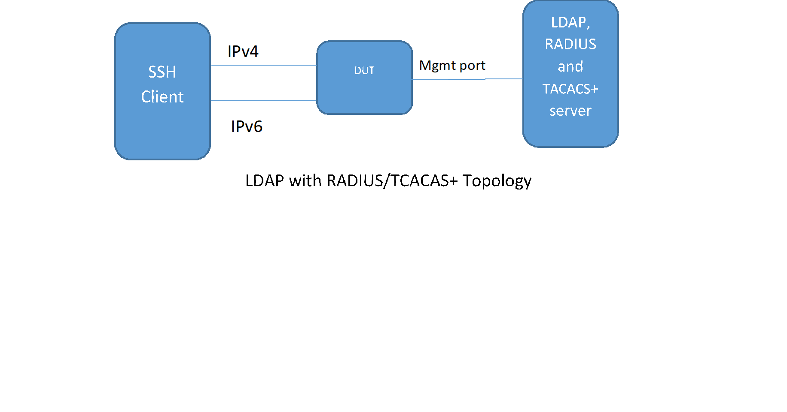

#  SQA Test Plan
# LDAP Integration with RADIUS and TACACS+
#  SONiC 3.1 Project and Buzznik+ Release
# Table of Contents
[TOC]
# Test Plan Revision History
| Rev | Date | Author | Change Description |
|:---:|:-----------:|:------------------:|-----------------------------|
| 0.1 | 5/15/2020 | Chandra Sekhar Reddy | Initial version |

# List of Reviewers
|  Function | Name |
|:---:|:-----------:|
|  |   |

# List of Approvers
|  Function | Name | Date Approved|
|:---:|:-----------:|:------------------:|
|  |   |  |

# Definition/Abbreviation
| **Term** | **Meaning**                     |
| -------- | ------------------------------- |
| LDAP     | Lightweight Directory Access Protocol  |
| TACACS+     | Terminal Access Controller Access Control System       |
| RADIUS     | Remote Authentication Dial-In User Service |
| PAM    | Pluggable Authentication Modules |

# Feature Overview
Lightweight Directory Access Protocol (LDAP) allows a client to access information stored in distributed directory services.Name Service information typically includes users, hosts, groups. This information is historically stored in flat files or other information services (like a directory service).
#####  LDAP NSS
LDAP can be used as an option in the Name Services Switch(NSS) configuration. The NSS configuration enables various programming APIs to use other sources than the default files (e.g., Use LDAP directory information instead of /etc/passwd for user and group information). User information includes uid, gid, and home directory.

#####  LDAP Authentication
The LDAP Pluggable Authentication Module (PAM) can be used to authenticate a CLI (SSH, or console) user to a Linux device like SONiC.

#####  LDAP Logon Authorization
The LDAP PAM can be used to authorize a user at login. (e.g., ensure the user logging on is a member of a group aka group-based logon authorization). This group can represent any membership (e.g., group of users who are permitted to logon to a host). In PAM, authorization task is done by account management modules.

#####  LDAP Sudoers Authorization
The sudoers policy plugin determines a user's sudo privileges. This policy is driven by the /etc/sudoers file. LDAP can be used to drive this policy by being a source in the NSS configuration. (e.g. can a user be allowed to execute the click config command?)

#####  TACACS+ or RADIUS Authentication with LDAP Name Service
- A user tries to login through a SSH client.
- A getpwnam_r() call is made to obtain user information.
- If the user is not found in the local /etc/passwd file, the NSS LDAP plugin retreives the data    from the LDAP server (or name service cache daemon). If not found, login fails.
- User information is returned to the SSH server.
- The SSH server makes a PAM Authentication request
- The PAM configuration causes a Authentication-Start to TACACS+ server. (or RADIUS Access-Request to RADIUS server).
- TACACS+ returns Authentication-Reply (PASS) (or RADIUS returns Access- Accept) -- (Goto 8.), - If Authentication-Reply (FAIL)/Access-Reject, the user authentication has failed. End.
- The user has authenticated successfully.
- Instead of TACACS+, RADIUS could be used as the authentication service as well.

# 1 Test Focus Areas
## 1.1 Functional Testing 
  - LDAP Authentication and Authorization
  - LDAP Name Service with RADIUS Authentication
  - LDAP Name Service with TACACS+ Authentication
## 1.2 Negative Testing 
  -	Config reload
  -	Cold Reboot
## 1.3 Scale Testing 
  -	8 LDAP servers are supported

# 2 Topologies
## 2.1 Topology 1

# 3 Test  Case and Objectives

## 3.1 Functional
### 3.1.1 Verify the IPv4 SSH login from client with LDAP User with LDAP Authentication
| **Test ID**    | **iTAS Test Case Manager ID**                                |
| -------------- | :----------------------------------------------------------- |
| **Test Name**  | **Verify the IPv4 SSH login from client with LDAP User with LDAP Authentication** |
| **Test Setup** | **Topology1**                                                |
| **Type**       | **Functional**                                               |
| **Steps**      | 1) Configure the IPv4 address between SSH client and DUT 2) Configure the Base DN in the device 3) Configure the LDAP server details in the device  4) Create LDAP user in the LDAP server with which SSH client will login 5) Configure aaa authentication with LDAP only with Failthrough disabled. 6) Try to connect via ssh to device and provide the credentials whatever configured in LDAP server 7) verify that user login and home directory created and check if any syslog messages for the login success 8) Try to connect user which is not configured in LDAP server, it will throw the proper syslog message and will not connect.  |

### 3.1.2 Verify the IPv4 SSH login from client with LDAP User with LDAP Authentication and Local with failthrough enabled
| **Test ID**    | **iTAS Test Case Manager ID**                                |
| -------------- | :----------------------------------------------------------- |
| **Test Name**  | **Verify the IPv4 SSH login from client with LDAP User with LDAP Authentication and Local with failthrough enabled** |
| **Test Setup** | **Topology1**                                                |
| **Type**       | **Functional**                                               |
| **Steps**      | 1) Configure the IPv4 address between SSH client and DUT 2) Configure the Base DN in the device 3) Configure the LDAP server details in the device  4) Create LDAP user in the LDAP server with which SSH client will login 5) Configure aaa authentication with LDAP and Local only with Failthrough enabled. 6) Try to connect via ssh to device and provide the credentials whatever configured in LDAP server 7) verify that user login and home directory created and check if any syslog messages for the login success 8) Try to connect local user which is not configured in LDAP server, it will login via local user configured in the system based on /etc/passwd details. 9) Try to connect user which is not configured either in local or in LDAP server, it will not login and throw proper syslog message.  |

### 3.1.3 Verify the IPv6 SSH login from client with LDAP User with LDAP Authentication
| **Test ID**    | **iTAS Test Case Manager ID**                                |
| -------------- | :----------------------------------------------------------- |
| **Test Name**  | **Verify the IPv6 SSH login from client with LDAP User with LDAP Authentication** |
| **Test Setup** | **Topology1**                                                |
| **Type**       | **Functional**                                               |
| **Steps**      | 1) Configure the IPv6 address between SSH client and DUT 2) Configure the Base DN in the device 3) Configure the LDAP server details in the device  4) Create LDAP user in the LDAP server with which SSH client will login 5) Configure aaa authentication with LDAP only with Failthrough disabled. 6) Try to connect via ssh to device and provide the credentials whatever configured in LDAP server 7) verify that user login and home directory created and check if any syslog messages for the login success 8) Try to connect user which is not configured in LDAP server, it will throw the proper syslog message and will not connect.  |

### 3.1.4 Verify the IPv6 SSH login from client with LDAP User with LDAP Authentication and Local with failthrough enabled
| **Test ID**    | **iTAS Test Case Manager ID**                                |
| -------------- | :----------------------------------------------------------- |
| **Test Name**  | **Verify the IPv6 SSH login from client with LDAP User with LDAP Authentication and Local with failthrough enabled** |
| **Test Setup** | **Topology1**                                                |
| **Type**       | **Functional**                                               |
| **Steps**      | 1) Configure the IPv6 address between SSH client and DUT 2) Configure the Base DN in the device 3) Configure the LDAP server details in the device  4) Create LDAP user in the LDAP server with which SSH client will login 5) Configure aaa authentication with LDAP and Local only with Failthrough enabled. 6) Try to connect via ssh to device and provide the credentials whatever configured in LDAP server 7) verify that user login and home directory created and check if any syslog messages for the login success 8) Try to connect local user which is not configured in LDAP server, it will login via local user configured in the system based on /etc/passwd details. 9) Try to connect user which is not configured either in local or in LDAP server, it will not login and throw proper syslog message.  |
### 3.1.5 Verify the IPv4 SSH login from client with LDAP User with LDAP name service and TACACS+ Authentication
| **Test ID**    | **iTAS Test Case Manager ID**                                |
| -------------- | :----------------------------------------------------------- |
| **Test Name**  | **Verify the IPv4 SSH login from client with LDAP User with LDAP name service and TACACS+ Authentication** |
| **Test Setup** | **Topology1**                                                |
| **Type**       | **Functional**                                               |
| **Steps**      | 1) Configure the IPv4 address between SSH client and DUT 2) Configure the Base DN in the device 3) Configure the LDAP server details in the device  4) Create LDAP user in the LDAP server with which SSH client will login 5) Configure aaa nss passwd ldap. 6) Configure aaa nss shadow ldap. 7) Configure aaa nss group ldap. 8) Configure tacacs+ server and passkey. 9) Configure aaa authentication ldap with failthrough disabled. 10) Try to connect via ssh to device and provide the credentials whatever configured in LDAP server 11) verify that user login and home directory created and check if any syslog messages for the login success 12) Try to connect user which is not configured in LDAP server, it will throw the proper syslog message and will not connect.  |

### 3.1.6 Verify the IPv4 SSH login from client with LDAP User with LDAP name service and TACACS+ Authentication and Local with failthrough enabled
| **Test ID**    | **iTAS Test Case Manager ID**                                |
| -------------- | :----------------------------------------------------------- |
| **Test Name**  | **Verify the IPv4 SSH login from client with LDAP User with LDAP name service and TACACS+ Authentication and Local with failthrough enabled** |
| **Test Setup** | **Topology1**                                                |
| **Type**       | **Functional**                                               |
| **Steps**      | 1) Configure the IPv4 address between SSH client and DUT 2) Configure the Base DN in the device 3) Configure the LDAP server details in the device  4) Create LDAP user in the LDAP server with which SSH client will login 5) Configure aaa nss passwd ldap. 6) Configure aaa nss shadow ldap. 7) Configure aaa nss group ldap. 8) Configure tacacs+ server and passkey. 9) Configure aaa authentication ldap with failthrough disabled. 10) Try to connect via ssh to device and provide the credentials whatever configured in LDAP server 11) verify that user login and home directory created and check if any syslog messages for the login success 12) Try to connect local configured user which is not configured in LDAP server, it will connect via local user based on the /etc/password details 13) Try to connect user which is not configured either in local or in LDAP server, it will not login and throw proper syslog message.  |

### 3.1.7 Verify the IPv6 SSH login from client with LDAP User with LDAP name service and TACACS+ Authentication
| **Test ID**    | **iTAS Test Case Manager ID**                                |
| -------------- | :----------------------------------------------------------- |
| **Test Name**  | **Verify the IPv6 SSH login from client with LDAP User with LDAP name service and TACACS+ Authentication** |
| **Test Setup** | **Topology1**                                                |
| **Type**       | **Functional**                                               |
| **Steps**      | 1) Configure the IPv6 address between SSH client and DUT 2) Configure the Base DN in the device 3) Configure the LDAP server details in the device  4) Create LDAP user in the LDAP server with which SSH client will login 5) Configure aaa nss passwd ldap. 6) Configure aaa nss shadow ldap. 7) Configure aaa nss group ldap. 8) Configure tacacs+ server and passkey. 9) Configure aaa authentication ldap with failthrough disabled. 10) Try to connect via ssh to device and provide the credentials whatever configured in LDAP server 11) verify that user login and home directory created and check if any syslog messages for the login success 12) Try to connect user which is not configured in LDAP server, it will throw the proper syslog message and will not connect.  |

### 3.1.8 Verify the IPv6 SSH login from client with LDAP User with LDAP name service and TACACS+ Authentication and Local with failthrough enabled
| **Test ID**    | **iTAS Test Case Manager ID**                                |
| -------------- | :----------------------------------------------------------- |
| **Test Name**  | **Verify the IPv6 SSH login from client with LDAP User with LDAP name service and TACACS+ Authentication and Local with failthrough enabled** |
| **Test Setup** | **Topology1**                                                |
| **Type**       | **Functional**                                               |
| **Steps**      | 1) Configure the IPv6 address between SSH client and DUT 2) Configure the Base DN in the device 3) Configure the LDAP server details in the device  4) Create LDAP user in the LDAP server with which SSH client will login 5) Configure aaa nss passwd ldap. 6) Configure aaa nss shadow ldap. 7) Configure aaa nss group ldap. 8) Configure tacacs+ server and passkey. 9) Configure aaa authentication ldap with failthrough disabled. 10) Try to connect via ssh to device and provide the credentials whatever configured in LDAP server 11) verify that user login and home directory created and check if any syslog messages for the login success 12) Try to connect local configured user which is not configured in LDAP server, it will connect via local user based on the /etc/password details 13) Try to connect user which is not configured either in local or in LDAP server, it will not login and throw proper syslog message.  |

### 3.1.9 Verify the IPv4 SSH login from client with LDAP User with LDAP name service and RADIUS Authentication
| **Test ID**    | **iTAS Test Case Manager ID**                                |
| -------------- | :----------------------------------------------------------- |
| **Test Name**  | **Verify the IPv4 SSH login from client with LDAP User with LDAP name service and RADIUS Authentication** |
| **Test Setup** | **Topology1**                                                |
| **Type**       | **Functional**                                               |
| **Steps**      | 1) Configure the IPv4 address between SSH client and DUT 2) Configure the Base DN in the device 3) Configure the LDAP server details in the device  4) Create LDAP user in the LDAP server with which SSH client will login 5) Configure aaa nss passwd ldap. 6) Configure aaa nss shadow ldap. 7) Configure aaa nss group ldap. 8) Configure radius server and passkey. 9) Configure aaa authentication ldap with failthrough disabled. 10) Try to connect via ssh to device and provide the credentials whatever configured in LDAP server 11) verify that user login and home directory created and check if any syslog messages for the login success 12) Try to connect user which is not configured in LDAP server, it will throw the proper syslog message and will not connect.  |

### 3.1.10 Verify the IPv4 SSH login from client with LDAP User with LDAP name service and RADIUS Authentication and Local with failthrough enabled
| **Test ID**    | **iTAS Test Case Manager ID**                                |
| -------------- | :----------------------------------------------------------- |
| **Test Name**  | **Verify the IPv4 SSH login from client with LDAP User with LDAP name service and RADIUS Authentication and Local with failthrough enabled** |
| **Test Setup** | **Topology1**                                                |
| **Type**       | **Functional**                                               |
| **Steps**      | 1) Configure the IPv4 address between SSH client and DUT 2) Configure the Base DN in the device 3) Configure the LDAP server details in the device  4) Create LDAP user in the LDAP server with which SSH client will login 5) Configure aaa nss passwd ldap. 6) Configure aaa nss shadow ldap. 7) Configure aaa nss group ldap. 8) Configure radius server and passkey. 9) Configure aaa authentication ldap with failthrough disabled. 10) Try to connect via ssh to device and provide the credentials whatever configured in LDAP server 11) verify that user login and home directory created and check if any syslog messages for the login success 12) Try to connect local configured user which is not configured in LDAP server, it will connect via local user based on the /etc/password details 13) Try to connect user which is not configured either in local or in LDAP server, it will not login and throw proper syslog message.  |

### 3.1.11 Verify the IPv6 SSH login from client with LDAP User with LDAP name service and RADIUS Authentication
| **Test ID**    | **iTAS Test Case Manager ID**                                |
| -------------- | :----------------------------------------------------------- |
| **Test Name**  | **Verify the IPv6 SSH login from client with LDAP User with LDAP name service and RADIUS Authentication** |
| **Test Setup** | **Topology1**                                                |
| **Type**       | **Functional**                                               |
| **Steps**      | 1) Configure the IPv6 address between SSH client and DUT 2) Configure the Base DN in the device 3) Configure the LDAP server details in the device  4) Create LDAP user in the LDAP server with which SSH client will login 5) Configure aaa nss passwd ldap. 6) Configure aaa nss shadow ldap. 7) Configure aaa nss group ldap. 8) Configure radius server and passkey. 9) Configure aaa authentication ldap with failthrough disabled. 10) Try to connect via ssh to device and provide the credentials whatever configured in LDAP server 11) verify that user login and home directory created and check if any syslog messages for the login success 12) Try to connect user which is not configured in LDAP server, it will throw the proper syslog message and will not connect.  |

### 3.1.12 Verify the IPv6 SSH login from client with LDAP User with LDAP name service and RADIUS Authentication and Local with failthrough enabled
| **Test ID**    | **iTAS Test Case Manager ID**                                |
| -------------- | :----------------------------------------------------------- |
| **Test Name**  | **Verify the IPv6 SSH login from client with LDAP User with LDAP name service and RADIUS Authentication and Local with failthrough enabled** |
| **Test Setup** | **Topology1**                                                |
| **Type**       | **Functional**                                               |
| **Steps**      | 1) Configure the IPv6 address between SSH client and DUT 2) Configure the Base DN in the device 3) Configure the LDAP server details in the device  4) Create LDAP user in the LDAP server with which SSH client will login 5) Configure aaa nss passwd ldap. 6) Configure aaa nss shadow ldap. 7) Configure aaa nss group ldap. 8) Configure radius server and passkey. 9) Configure aaa authentication ldap with failthrough disabled. 10) Try to connect via ssh to device and provide the credentials whatever configured in LDAP server 11) verify that user login and home directory created and check if any syslog messages for the login success 12) Try to connect local configured user which is not configured in LDAP server, it will connect via local user based on the /etc/password details 13) Try to connect user which is not configured either in local or in LDAP server, it will not login and throw proper syslog message.  |

### 3.1.13 Verify the IPv4 SSH login from client with LDAP User with Authentication TACACS+, Authorization LDAP, Name Service LDAP
| **Test ID**    | **iTAS Test Case Manager ID**                                |
| -------------- | :----------------------------------------------------------- |
| **Test Name**  | **Verify the IPv4 SSH login from client with LDAP User with Authentication TACACS+ password, Authorization LDAP, Name Service LDAP** |
| **Test Setup** | **Topology1**                                                |
| **Type**       | **Functional**                                               |
| **Steps**      | 1) Configure the IPv4 address between SSH client and DUT 2) Configure the Base DN in the device 3) Configure the LDAP server details in the device  4) Create LDAP user in the LDAP server with which SSH client will login 5) Configure aaa nss passwd ldap. 6) Configure aaa nss shadow ldap. 7) Configure aaa nss group ldap. 8) Configure tacacs+ server and passkey. 9) Configure aaa authentication ldap with failthrough disabled. 10) Configure ldap pam group dn and pam memeber attribute as memberUID. 11) Configure aaa authorization login as ldap. 12) Try to connect via ssh to device and provide the credentials whatever configured in LDAP server 13) verify that user login and home directory created and check if any syslog messages for the login success 14) Try to connect user which is not configured in LDAP server, it will throw the proper syslog message and will not connect.  |

### 3.1.14 Verify the IPv6 SSH login from client with LDAP User with Authentication TACACS+, Authorization LDAP, Name Service LDAP
| **Test ID**    | **iTAS Test Case Manager ID**                                |
| -------------- | :----------------------------------------------------------- |
| **Test Name**  | **Verify the IPv6 SSH login from client with LDAP User with Authentication TACACS+ password, Authorization LDAP, Name Service LDAP** |
| **Test Setup** | **Topology1**                                                |
| **Type**       | **Functional**                                               |
| **Steps**      | 1) Configure the IPv6 address between SSH client and DUT 2) Configure the Base DN in the device 3) Configure the LDAP server details in the device  4) Create LDAP user in the LDAP server with which SSH client will login 5) Configure aaa nss passwd ldap. 6) Configure aaa nss shadow ldap. 7) Configure aaa nss group ldap. 8) Configure tacacs+ server and passkey. 9) Configure aaa authentication ldap with failthrough disabled. 10) Configure ldap pam group dn and pam memeber attribute as memberUID. 11) Configure aaa authorization login as ldap. 12) Try to connect via ssh to device and provide the credentials whatever configured in LDAP server 13) verify that user login and home directory created and check if any syslog messages for the login success 14) Try to connect user which is not configured in LDAP server, it will throw the proper syslog message and will not connect.  |

### 3.1.15 Verify the IPv4 SSH login from client with LDAP User with Authentication RADIUS, Authorization LDAP, Name Service LDAP
| **Test ID**    | **iTAS Test Case Manager ID**                                |
| -------------- | :----------------------------------------------------------- |
| **Test Name**  | **Verify the IPv4 SSH login from client with LDAP User with Authentication RADIUS password, Authorization LDAP, Name Service LDAP** |
| **Test Setup** | **Topology1**                                                |
| **Type**       | **Functional**                                               |
| **Steps**      | 1) Configure the IPv4 address between SSH client and DUT 2) Configure the Base DN in the device 3) Configure the LDAP server details in the device  4) Create LDAP user in the LDAP server with which SSH client will login 5) Configure aaa nss passwd ldap. 6) Configure aaa nss shadow ldap. 7) Configure aaa nss group ldap. 8) Configure radius server and passkey. 9) Configure aaa authentication ldap with failthrough disabled. 10) Configure ldap pam group dn and pam memeber attribute as memberUID. 11) Configure aaa authorization login as ldap. 12) Try to connect via ssh to device and provide the credentials whatever configured in LDAP server 13) verify that user login and home directory created and check if any syslog messages for the login success 14) Try to connect user which is not configured in LDAP server, it will throw the proper syslog message and will not connect.  |

### 3.1.16 Verify the IPv6 SSH login from client with LDAP User with Authentication RADIUS, Authorization LDAP, Name Service LDAP
| **Test ID**    | **iTAS Test Case Manager ID**                                |
| -------------- | :----------------------------------------------------------- |
| **Test Name**  | **Verify the IPv6 SSH login from client with LDAP User with Authentication RADIUS password, Authorization LDAP, Name Service LDAP** |
| **Test Setup** | **Topology1**                                                |
| **Type**       | **Functional**                                               |
| **Steps**      | 1) Configure the IPv6 address between SSH client and DUT 2) Configure the Base DN in the device 3) Configure the LDAP server details in the device  4) Create LDAP user in the LDAP server with which SSH client will login 5) Configure aaa nss passwd ldap. 6) Configure aaa nss shadow ldap. 7) Configure aaa nss group ldap. 8) Configure radius server and passkey. 9) Configure aaa authentication ldap with failthrough disabled. 10) Configure ldap pam group dn and pam memeber attribute as memberUID. 11) Configure aaa authorization login as ldap. 12) Try to connect via ssh to device and provide the credentials whatever configured in LDAP server 13) verify that user login and home directory created and check if any syslog messages for the login success 14) Try to connect user which is not configured in LDAP server, it will throw the proper syslog message and will not connect.  |
### 3.1.17 Verify the IPv4 SSH login from client with LDAP User with Authentication TACACS+, Name Service LDAP, sudo Authorization LDAP
| **Test ID**    | **iTAS Test Case Manager ID**                                |
| -------------- | :----------------------------------------------------------- |
| **Test Name**  | **Verify the IPv4 SSH login from client with LDAP User with Authentication TACACS+, Name Service LDAP, sudo Authorization LDAP** |
| **Test Setup** | **Topology1**                                                |
| **Type**       | **Functional**                                               |
| **Steps**      | 1) Configure the IPv4 address between SSH client and DUT 2) Configure the Base DN in the device 3) Configure the LDAP server details in the device  4) Create LDAP user in the LDAP server with which SSH client will login 5) Configure aaa nss passwd ldap. 6) Configure aaa nss shadow ldap. 7) Configure aaa nss group ldap. 8) Configure tacacs+ server and passkey. 9) Configure aaa authentication ldap with failthrough disabled. 10) Configure ldap pam group dn and pam memeber attribute as memberUID. 11) Configure ldap aaa nss sudoers ldap and configure ldap sudoers dn. 12) Configure aaa authorization login as ldap. 13) Try to connect via ssh to device and provide the credentials whatever configured in LDAP server under sudoer group 14) verify that user login and home directory created and check if any syslog messages for the login success 15) verify that user can go to root by sudo -i and check gid,uid and groups should be root 16) Try to connect user which is not configured in LDAP server under sudoers, it will throw the proper syslog message and will not connect.  |
### 3.1.18 Verify the IPv6 SSH login from client with LDAP User with Authentication TACACS+, Name Service LDAP, sudo Authorization LDAP
| **Test ID**    | **iTAS Test Case Manager ID**                                |
| -------------- | :----------------------------------------------------------- |
| **Test Name**  | **Verify the IPv6 SSH login from client with LDAP User with Authentication TACACS+, Name Service LDAP, sudo Authorization LDAP** |
| **Test Setup** | **Topology1**                                                |
| **Type**       | **Functional**                                               |
| **Steps**      | 1) Configure the IPv6 address between SSH client and DUT 2) Configure the Base DN in the device 3) Configure the LDAP server details in the device  4) Create LDAP user in the LDAP server with which SSH client will login 5) Configure aaa nss passwd ldap. 6) Configure aaa nss shadow ldap. 7) Configure aaa nss group ldap. 8) Configure tacacs+ server and passkey. 9) Configure aaa authentication ldap with failthrough disabled. 10) Configure ldap pam group dn and pam memeber attribute as memberUID. 11) Configure ldap aaa nss sudoers ldap and configure ldap sudoers dn. 12) Configure aaa authorization login as ldap. 13) Try to connect via ssh to device and provide the credentials whatever configured in LDAP server under sudoer group 14) verify that user login and home directory created and check if any syslog messages for the login success 15) verify that user can go to root by sudo -i and check gid,uid and groups should be root 16) Try to connect user which is not configured in LDAP server under sudoers, it will throw the proper syslog message and will not connect.  |

### 3.1.19 Verify the IPv4 SSH login from client with LDAP User with Authentication RADIUS, Name Service LDAP, sudo Authorization LDAP
| **Test ID**    | **iTAS Test Case Manager ID**                                |
| -------------- | :----------------------------------------------------------- |
| **Test Name**  | **Verify the IPv4 SSH login from client with LDAP User with Authentication TACACS+, Name Service LDAP, sudo Authorization LDAP** |
| **Test Setup** | **Topology1**                                                |
| **Type**       | **Functional**                                               |
| **Steps**      | 1) Configure the IPv4 address between SSH client and DUT 2) Configure the Base DN in the device 3) Configure the LDAP server details in the device  4) Create LDAP user in the LDAP server with which SSH client will login 5) Configure aaa nss passwd ldap. 6) Configure aaa nss shadow ldap. 7) Configure aaa nss group ldap. 8) Configure radius server and passkey. 9) Configure aaa authentication ldap with failthrough disabled. 10) Configure ldap pam group dn and pam memeber attribute as memberUID. 11) Configure ldap aaa nss sudoers ldap and configure ldap sudoers dn. 12) Configure aaa authorization login as ldap. 13) Try to connect via ssh to device and provide the credentials whatever configured in LDAP server under sudoer group 14) verify that user login and home directory created and check if any syslog messages for the login success 15) verify that user can go to root by sudo -i and check gid,uid and groups should be root 16) Try to connect user which is not configured in LDAP server under sudoers, it will throw the proper syslog message and will not connect.  |
### 3.1.20 Verify the IPv6 SSH login from client with LDAP User with Authentication RADIUS, Name Service LDAP, sudo Authorization LDAP
| **Test ID**    | **iTAS Test Case Manager ID**                                |
| -------------- | :----------------------------------------------------------- |
| **Test Name**  | **Verify the IPv6 SSH login from client with LDAP User with Authentication TACACS+, Name Service LDAP, sudo Authorization LDAP** |
| **Test Setup** | **Topology1**                                                |
| **Type**       | **Functional**                                               |
| **Steps**      | 1) Configure the IPv6 address between SSH client and DUT 2) Configure the Base DN in the device 3) Configure the LDAP server details in the device  4) Create LDAP user in the LDAP server with which SSH client will login 5) Configure aaa nss passwd ldap. 6) Configure aaa nss shadow ldap. 7) Configure aaa nss group ldap. 8) Configure radius server and passkey. 9) Configure aaa authentication ldap with failthrough disabled. 10) Configure ldap pam group dn and pam memeber attribute as memberUID. 11) Configure ldap aaa nss sudoers ldap and configure ldap sudoers dn. 12) Configure aaa authorization login as ldap. 13) Try to connect via ssh to device and provide the credentials whatever configured in LDAP server under sudoer group 14) verify that user login and home directory created and check if any syslog messages for the login success 15) verify that user can go to root by sudo -i and check gid,uid and groups should be root 16) Try to connect user which is not configured in LDAP server under sudoers, it will throw the proper syslog message and will not connect.  |

### 3.1.21 Verify the IPv4 SSH login from client with LDAP User with Authentication TACACS+, Name Service LDAP, sudo Authorization LDAP with Mgmt VRF with source IP
| **Test ID**    | **iTAS Test Case Manager ID**                                |
| -------------- | :----------------------------------------------------------- |
| **Test Name**  | **Verify the IPv4 SSH login from client with LDAP User with Authentication TACACS+, Name Service LDAP, sudo Authorization LDAP with Mgmt VRF with source IP** |
| **Test Setup** | **Topology1**                                                |
| **Type**       | **Functional**                                               |
| **Steps**      | 1) Configure the IPv4 address between SSH client and DUT 2) Configure the Base DN in the device 3) Configure the LDAP server details in the device  4) Configure the Mgmt vrf IPv4 between DUT and LDAP Server  5) Create LDAP user in the LDAP server with which SSH client will login 6) Configure aaa nss passwd ldap. 7) Configure aaa nss shadow ldap. 8) Configure aaa nss group ldap. 9) Configure ldap source ip and vrf. 10) Configure tacacs+ server and passkey. 11) Configure aaa authentication ldap with failthrough disabled. 12) Configure ldap pam group dn and pam memeber attribute as memberUID. 13) Configure ldap aaa nss sudoers ldap and configure ldap sudoers dn. 14) Configure aaa authorization login as ldap. 15) Try to connect via ssh to device and provide the credentials whatever configured in LDAP server under sudoer group 16) verify that user login and home directory created and check if any syslog messages for the login success 17) verify that user can go to root by sudo -i and check gid,uid and groups should be root 18) Try to connect user which is not configured in LDAP server under sudoers, it will throw the proper syslog message and will not connect.  |

### 3.1.22 Verify the IPv6 SSH login from client with LDAP User with Authentication TACACS+, Name Service LDAP, sudo Authorization LDAP with Mgmt VRF with source IP
| **Test ID**    | **iTAS Test Case Manager ID**                                |
| -------------- | :----------------------------------------------------------- |
| **Test Name**  | **Verify the IPv6 SSH login from client with LDAP User with Authentication TACACS+, Name Service LDAP, sudo Authorization LDAP with Mgmt VRF with source IP** |
| **Test Setup** | **Topology1**                                                |
| **Type**       | **Functional**                                               |
| **Steps**      | 1) Configure the IPv6 address between SSH client and DUT 2) Configure the Base DN in the device 3) Configure the LDAP server details in the device  4) Configure the Mgmt vrf IPv6 between DUT and LDAP Server  5) Create LDAP user in the LDAP server with which SSH client will login 6) Configure aaa nss passwd ldap. 7) Configure aaa nss shadow ldap. 8) Configure aaa nss group ldap. 9) Configure ldap source ip and vrf. 10) Configure tacacs+ server and passkey. 11) Configure aaa authentication ldap with failthrough disabled. 12) Configure ldap pam group dn and pam memeber attribute as memberUID. 13) Configure ldap aaa nss sudoers ldap and configure ldap sudoers dn. 14) Configure aaa authorization login as ldap. 15) Try to connect via ssh to device and provide the credentials whatever configured in LDAP server under sudoer group 16) verify that user login and home directory created and check if any syslog messages for the login success 17) verify that user can go to root by sudo -i and check gid,uid and groups should be root 18) Try to connect user which is not configured in LDAP server under sudoers, it will throw the proper syslog message and will not connect.  |
### 3.1.23 Verify the IPv4 SSH login from client with LDAP User with Authentication RADIUS, Name Service LDAP, sudo Authorization LDAP with Mgmt VRF with source IP
| **Test ID**    | **iTAS Test Case Manager ID**                                |
| -------------- | :----------------------------------------------------------- |
| **Test Name**  | **Verify the IPv4 SSH login from client with LDAP User with Authentication RADIUS, Name Service LDAP, sudo Authorization LDAP with Mgmt VRF with source IP** |
| **Test Setup** | **Topology1**                                                |
| **Type**       | **Functional**                                               |
| **Steps**      | 1) Configure the IPv4 address between SSH client and DUT 2) Configure the Base DN in the device 3) Configure the LDAP server details in the device  4) Configure the Mgmt vrf IPv4 between DUT and LDAP Server  5) Create LDAP user in the LDAP server with which SSH client will login 6) Configure aaa nss passwd ldap. 7) Configure aaa nss shadow ldap. 8) Configure aaa nss group ldap. 9) Configure ldap source ip and vrf. 10) Configure radius server and passkey. 11) Configure aaa authentication ldap with failthrough disabled. 12) Configure ldap pam group dn and pam memeber attribute as memberUID. 13) Configure ldap aaa nss sudoers ldap and configure ldap sudoers dn. 14) Configure aaa authorization login as ldap. 15) Try to connect via ssh to device and provide the credentials whatever configured in LDAP server under sudoer group 16) verify that user login and home directory created and check if any syslog messages for the login success 17) verify that user can go to root by sudo -i and check gid,uid and groups should be root 18) Try to connect user which is not configured in LDAP server under sudoers, it will throw the proper syslog message and will not connect.  |

### 3.1.24 Verify the IPv6 SSH login from client with LDAP User with Authentication RADIUS, Name Service LDAP, sudo Authorization LDAP with Mgmt VRF with source IP
| **Test ID**    | **iTAS Test Case Manager ID**                                |
| -------------- | :----------------------------------------------------------- |
| **Test Name**  | **Verify the IPv6 SSH login from client with LDAP User with Authentication RADIUS, Name Service LDAP, sudo Authorization LDAP with Mgmt VRF with source IP** |
| **Test Setup** | **Topology1**                                                |
| **Type**       | **Functional**                                               |
| **Steps**      | 1) Configure the IPv6 address between SSH client and DUT 2) Configure the Base DN in the device 3) Configure the LDAP server details in the device  4) Configure the Mgmt vrf IPv6 between DUT and LDAP Server  5) Create LDAP user in the LDAP server with which SSH client will login 6) Configure aaa nss passwd ldap. 7) Configure aaa nss shadow ldap. 8) Configure aaa nss group ldap. 9) Configure ldap source ip and vrf. 10) Configure radius server and passkey. 11) Configure aaa authentication ldap with failthrough disabled. 12) Configure ldap pam group dn and pam memeber attribute as memberUID. 13) Configure ldap aaa nss sudoers ldap and configure ldap sudoers dn. 14) Configure aaa authorization login as ldap. 15) Try to connect via ssh to device and provide the credentials whatever configured in LDAP server under sudoer group 16) verify that user login and home directory created and check if any syslog messages for the login success 17) verify that user can go to root by sudo -i and check gid,uid and groups should be root 18) Try to connect user which is not configured in LDAP server under sudoers, it will throw the proper syslog message and will not connect.  |

## 3.2 Config Reload/Cold Reboot Test Cases
#### 3.2.1 Config Reload

### 3.2.1.1 Verify the IPv4 SSH login from client after config reload with LDAP User with Authentication TACACS+, Name Service LDAP, sudo Authorization LDAP

| **Test ID**    | **iTAS Test Case Manager ID**                                |
| -------------- | :----------------------------------------------------------- |
| **Test Name**  | **Verify the IPv4 SSH login from client after config reload with LDAP User with Authentication TACACS+, Name Service LDAP, sudo Authorization LDAP** |
| **Test Setup** | **Topology1**                                                |
| **Type**       | **Functional**                                               |
| **Steps**             | 1) After bringing the testbed as per the test case 3.1.17  2)  Save the config and reload 3) Try to connect via ssh to device and provide the credentials whatever configured in LDAP server under sudoer group 4) verify that user login and home directory created and check if any syslog messages for the login success
5) verify that user can go to root by sudo -i and check gid,uid and groups should be root |

### 3.2.1.2 Verify the IPv6 SSH login from client after config reload with LDAP User with Authentication TACACS+, Name Service LDAP, sudo Authorization LDAP

| **Test ID**    | **iTAS Test Case Manager ID**                                |
| -------------- | :----------------------------------------------------------- |
| **Test Name**  | **Verify the IPv6 SSH login from client after config reload with LDAP User with Authentication RADIUS, Name Service LDAP, sudo Authorization LDAP** |
| **Test Setup** | **Topology1**                                                |
| **Type**       | **Functional**                                               |
| **Steps**      | 1) After bringing the testbed as per the test case 3.1.18  2) Save the config and reload 3) Try to connect via ssh to device and provide the credentials whatever configured in LDAP server under sudoer group 4) verify that user login and home directory created and check if any syslog messages for the login success
5) verify that user can go to root by sudo -i and check gid,uid and groups should be root |

### 3.2.1.3 Verify the IPv4 SSH login from client after config reload with LDAP User with Authentication RADIUS, Name Service LDAP, sudo Authorization LDAP

| **Test ID**    | **iTAS Test Case Manager ID**                                |
| -------------- | :----------------------------------------------------------- |
| **Test Name**  | **Verify the IPv4 SSH login from client after config reload with LDAP User with Authentication RADIUS, Name Service LDAP, sudo Authorization LDAP** |
| **Test Setup** | **Topology1**                                                |
| **Type**       | **Functional**                                               |
| **Steps**      | 1) After bringing the testbed as per the test case 3.1.17  2) Save the config and reload 3) Try to connect via ssh to device and provide the credentials whatever configured in LDAP server under sudoer group 4) verify that user login and home directory created and check if any syslog messages for the login success
5) verify that user can go to root by sudo -i and check gid,uid and groups should be root |

### 3.2.1.4 Verify the IPv6 SSH login from client after config reload with LDAP User with Authentication RADIUS, Name Service LDAP, sudo Authorization LDAP

| **Test ID**    | **iTAS Test Case Manager ID**                                |
| -------------- | :----------------------------------------------------------- |
| **Test Name**  | **Verify the IPv6 SSH login from client after config reload with LDAP User with Authentication RADIUS, Name Service LDAP, sudo Authorization LDAP** |
| **Test Setup** | **Topology1**                                                |
| **Type**       | **Functional**                                               |
| **Steps**      | 1) After bringing the testbed as per the test case 3.1.18  2) Save the config and reload 3) Try to connect via ssh to device and provide the credentials whatever configured in LDAP server under sudoer group 4) verify that user login and home directory created and check if any syslog messages for the login success
5) verify that user can go to root by sudo -i and check gid,uid and groups should be root |

#### 3.2.2 Cold Reboot

### 3.2.2.1 Verify the IPv4 SSH login from client after Cold Reboot with LDAP User with Authentication TACACS+, Name Service LDAP, sudo Authorization LDAP

| **Test ID**    | **iTAS Test Case Manager ID**                                |
| -------------- | :----------------------------------------------------------- |
| **Test Name**  | **Verify the IPv4 SSH login from client after Cold Reboot with LDAP User with Authentication TACACS+, Name Service LDAP, sudo Authorization LDAP** |
| **Test Setup** | **Topology1**                                                |
| **Type**       | **Functional**                                               |
| **Steps**      | 1) After bringing the testbed as per the test case 3.1.17  2) Save the config and cold reboot 3) Try to connect via ssh to device and provide the credentials whatever configured in LDAP server under sudoer group 4) verify that user login and home directory created and check if any syslog messages for the login success
5) verify that user can go to root by sudo -i and check gid,uid and groups should be root |

### 3.2.2.2 Verify the IPv6 SSH login from client after Cold Reboot with LDAP User with Authentication TACACS+, Name Service LDAP, sudo Authorization LDAP

| **Test ID**    | **iTAS Test Case Manager ID**                                |
| -------------- | :----------------------------------------------------------- |
| **Test Name**  | **Verify the IPv6 SSH login from client after Cold Reboot with LDAP User with Authentication RADIUS, Name Service LDAP, sudo Authorization LDAP** |
| **Test Setup** | **Topology1**                                                |
| **Type**       | **Functional**                                               |
| **Steps**      | 1) After bringing the testbed as per the test case 3.1.18  2) Save the config and cold reboot 3) Try to connect via ssh to device and provide the credentials whatever configured in LDAP server under sudoer group 4) verify that user login and home directory created and check if any syslog messages for the login success
5) verify that user can go to root by sudo -i and check gid,uid and groups should be root |

### 3.2.2.3 Verify the IPv4 SSH login from client after Cold Reboot with LDAP User with Authentication RADIUS, Name Service LDAP, sudo Authorization LDAP

| **Test ID**    | **iTAS Test Case Manager ID**                                |
| -------------- | :----------------------------------------------------------- |
| **Test Name**  | **Verify the IPv4 SSH login from client after Cold Reboot with LDAP User with Authentication RADIUS, Name Service LDAP, sudo Authorization LDAP** |
| **Test Setup** | **Topology1**                                                |
| **Type**       | **Functional**                                               |
| **Steps**      | 1) After bringing the testbed as per the test case 3.1.17  2) Save the config and cold reboot 3) Try to connect via ssh to device and provide the credentials whatever configured in LDAP server under sudoer group 4) verify that user login and home directory created and check if any syslog messages for the login success
5) verify that user can go to root by sudo -i and check gid,uid and groups should be root |

### 3.2.2.4 Verify the IPv6 SSH login from client after Cold Reboot with LDAP User with Authentication RADIUS, Name Service LDAP, sudo Authorization LDAP

| **Test ID**    | **iTAS Test Case Manager ID**                                |
| -------------- | :----------------------------------------------------------- |
| **Test Name**  | **Verify the IPv6 SSH login from client after config reload with LDAP User with Authentication RADIUS, Name Service LDAP, sudo Authorization LDAP** |
| **Test Setup** | **Topology1**                                                |
| **Type**       | **Functional**                                               |
| **Steps**      | 1) After bringing the testbed as per the test case 3.1.18  2) Save the config and cold reboot 3) Try to connect via ssh to device and provide the credentials whatever configured in LDAP server under sudoer group 4) verify that user login and home directory created and check if any syslog messages for the login success
5) verify that user can go to root by sudo -i and check gid,uid and groups should be root |

## 3.3 Scale Testing
### 3.3.1 Verify the LDAP Scale testing with 8 IPv4 servers configured in the Device with SSH login from client with LDAP User with Authentication TACACS+, Authorization LDAP, Name Service LDAP
| **Test ID**    | **iTAS Test Case Manager ID**                                |
| -------------- | :----------------------------------------------------------- |
| **Test Name**  | **Verify the LDAP Scale testing with 8 IPv4 servers configured in the Device with SSH login from client with LDAP User with Authentication TACACS+, Authorization LDAP, Name Service LDAP** |
| **Test Setup** | **Topology1**                                                |
| **Type**       | **Functional**                                               |
| **Steps**      | 1) Configure the IPv4 address between SSH client and DUT 2) Configure the Base DN in the device 3) Configure the 8 LDAP servers with priority 1 to 8 in the device make sure 8 one is reachable  4) Create LDAP user in the LDAP server with which SSH client will login 5) Configure aaa nss passwd ldap. 6) Configure aaa nss shadow ldap. 7) Configure aaa nss group ldap. 8) Configure tacacs+ server and passkey. 9) Configure aaa authentication ldap with failthrough disabled. 10) Configure ldap pam group dn and pam memeber attribute as memberUID. 11) Configure aaa authorization login as ldap. 12) Try to connect via ssh to device and provide the credentials whatever configured in LDAP server 13) verify that user login after geeting the details from 8th server and home directory created and check if any syslog messages for the login success 14) Try to connect user which is not configured in LDAP server, it will throw the proper syslog message and will not connect.  |
### 3.3.2 Verify the LDAP Scale testing with 8 IPv6 servers configured in the Device with SSH login from client with LDAP User with Authentication TACACS+, Authorization LDAP, Name Service LDAP
| **Test ID**    | **iTAS Test Case Manager ID**                                |
| -------------- | :----------------------------------------------------------- |
| **Test Name**  | **Verify the LDAP Scale testing with 8 IPv6 servers configured in the Device with SSH login from client with LDAP User with Authentication TACACS+, Authorization LDAP, Name Service LDAP** |
| **Test Setup** | **Topology1**                                                |
| **Type**       | **Functional**                                               |
| **Steps**      | 1) Configure the IPv4 address between SSH client and DUT 2) Configure the Base DN in the device 3) Configure the 8 LDAP servers with priority 1 to 8 in the device make sure 8 one is reachable  4) Create LDAP user in the LDAP server with which SSH client will login 5) Configure aaa nss passwd ldap. 6) Configure aaa nss shadow ldap. 7) Configure aaa nss group ldap. 8) Configure tacacs+ server and passkey. 9) Configure aaa authentication ldap with failthrough disabled. 10) Configure ldap pam group dn and pam memeber attribute as memberUID. 11) Configure aaa authorization login as ldap. 12) Try to connect via ssh to device and provide the credentials whatever configured in LDAP server 13) verify that user login after geeting the details from 8th server and home directory created and check if any syslog messages for the login success 14) Try to connect user which is not configured in LDAP server, it will throw the proper syslog message and will not connect.  |
# 4 Reference Links

http://gerrit-lvn-07.lvn.broadcom.net:8083/c/sonic/documents/+/19406/13/manageability/ldap/ldap.md

