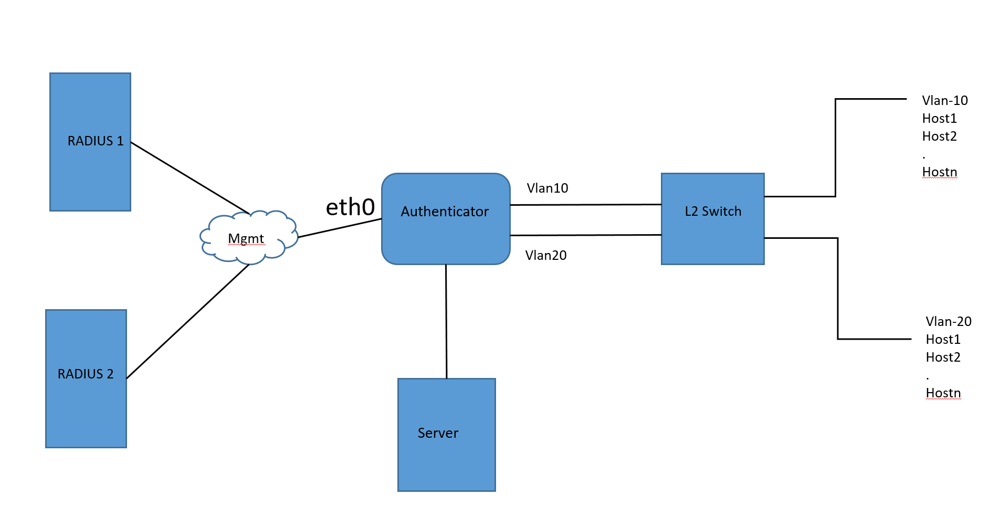

SQA Test Plan

# Port Access Control
#  SONiC 4.0.0 Release

Rev 1.9

[TOC]

## Test Plan Revision History

| Rev  | Date       | Author                        | Change Description                                    |
| ---- | ---------- | ----------------------------- | ----------------------------------------------------- |
| 1    | 31/05/2021 | Sooriya Gajendrababu | Initial Version                                       |
|     |            |            |                    |
|      |            |            |                    |
|      |            |            |                    |
|      |            |            |                    |
|      |            |            |                    |

## List of Reviewers

| Function | Name |
| :------: | :--: |
|          |      |

## List of Approvers

| Function | Name | Date Approved |
| :------: | :--: | :-----------: |
|          |      |               |

## Definition/Abbreviation

| **Term** | **Meaning**                    |
| -------- | ------------------------------ |
| VRF      | Virtual routing and forwarding |
| RIF      | Router interface               |
|          |                                |
## Introduction

### Objective 

The main objective of this document is to cover the test cases that will be executed for Port authentication methods dot1x and MAB.  Topologies and test cases  for testing the feature will be discussed as part of this document.

### Scope

- PAC authentication of hosts on access port 

### Out of scope

- Authentication on Trunk port not supported

## Feature Overview

Port Access Control (PAC) feature provides validation of client and user credentials to prevent unauthorized access to a specific switch port.

Local Area Networks (LANs) are often deployed in environments that permit unauthorized devices to be physically attached to the LAN infrastructure, or permit unauthorized users to attempt to access the LAN through equipment already attached. In such environments, it may be desirable to restrict access to the services offered by the LAN to those users and devices that are permitted to use those services. Port access control makes use of the physical characteristics of LAN infrastructures in order to provide a means of authenticating and authorizing devices attached to a LAN port that has point-to-point connection characteristics and of preventing access to that port in cases in which the authentication and authorization process fails. In this context, a port is a single point of attachment to the LAN, such as Ports of MAC bridges and associations between stations or access points in IEEE 802.11 Wireless LANs.

Dot1x:

IEEE 802.1X is an IEEE Standard for Port Access Control (PAC) that provides an authentication mechanism to devices wishing to attach to a LAN. The standard defines Extensible Authentication Protocol Over LAN (EAPOL). The 802.1X standard describes an architectural framework within which authentication and consequent actions take place. It also establishes the requirements for a protocol between the authenticator and the supplicant, as well as between the authenticator and the authentication server.

MAC Authentication Bypass(MAB):

Simple devices like camera or printers which do not support 802.1x authentication can make use of MAB feature where the device gets authenticated based on the device MAC address.

## 1 Test Focus Areas

### 1.1 Functional Requirements

- *PAC*
  The following are the requirements for Port Access Control feature:

  1. PAC is supported on physical interfaces only.
  2. The interfaces cannot be part of a port-channel / LAG.
  3. PAC is not supported on service port.
  4. User can configure PAC interfaces for switches using the following features:
     - 802.1x
     - MAB (MAC-based authentication bypass).
  5. MAB, and dot1x need support for access port.
  6. PAC supports the following Dynamic ACLs:
     - Named ACLs
     - Dynamic ACLs
     - Filter Id
     - Downloadable ACLs
  7. SONiC supports Single-Host mode where only one data client can be authenticated on a port and is granted access to the port at a given time.
  8. SONiC supports Multiple Hosts mode where only one data client can be authenticated on a port and after that access is granted to all clients connected to the port
  9. SONiC supports Multiple Domain Authentication mode where only one data and one voice client can be authenticated on a port.
  10. SONiC supports Multiple Authentication mode where one voice client and multiple data clients can be authenticated on a port and these clients are then granted access.
  11. SONiC supports the following specical VLANs:
      - Unauthenticated VLAN
      - Guest VLAN
      - Monitor VLAN
      - Open VLAN
      - Critical VLAN
      - Voice VLAN
  12. The following PAC port modes are supported on SONiC:
      - Auto
      - Force Authorized
      - Force Unauthorized

  *802.1x*

  1. SONiC shall make use of opensource 802.1x implementation **hostapd** suppied with **wpa_supplicant** package.

  *MAB*

  1. MAB can be used to authenticate clients that do not support EAP.

  *RADIUS*

  1. User can configure RADIUS servers. However, do not use a SONiC switch as the RADIUS server.
  2. RADIUS authentication is supported with FreeRADIUS, ClearPass and Cisco ISE.

## 2 Topologies

**Topology1**

## 3 Test Case and objectives

### **3.1 CLI Test Cases**

### 3.1.1 Verify boundary conditions for authentication configs

| **Test ID**    | **FtSysPacCli001**                                           |
| -------------- | :----------------------------------------------------------- |
| **Test Name**  | **Verify boundary conditions for authentication configs**    |
| **Test Setup** | **Topology1**                                                |
| **Type**       | **CLI**                                                      |
| **Steps**      | 1. Verify out of range values and invalid values  for below configs and gets denied          authentication critical recovery max-reauth          mab request format attribute 1 group size          authentication event no-response action authorize vlan <vlan-id>             authentication event fail action authorize vlan <vlan-id>          authentication event fail retry <max-attempts>          authentication max-users <count>          dot1x timeout  - quite-period,tx-period,supp-timeout,server-timeout,auth-period,start-period,held-period  |

### 3.1.2 Verify port authentication can be enabled only on physical interfaces and gets denied on Vlan,Portchannel,Po member ports and sub interfaces

| **Test ID**    | **FtSysPacCli002**                                           |
| -------------- | :----------------------------------------------------------- |
| **Test Name**  | **Verify port authentication can be enabled only on physical interfaces and gets denied on Vlan,Portchannel,Po member ports and sub interfaces** |
| **Test Setup** | **Topology1**                                                |
| **Type**       | **CLI**                                                      |
| **Steps**      | 1.Verify port authentication configuration gets denied for Vlan interface,Sub interface and Portchannel interfaces 2.Verify authentication can not be enabled on Portchannel member ports 3. Enable authentication on physical port and add it to Portchannel and verify it is not allowed  |

### 3.1.3 Verify running configs for interface and global authentication commands

| **Test ID**    | **FtSysPacCli003**                                           |
| -------------- | :----------------------------------------------------------- |
| **Test Name**  | **Verify running configs for interface and global authentication commands** |
| **Test Setup** | **Topology1**                                                |
| **Type**       | **CLI**                                                      |
| **Steps**      | 1. Verify below global configs are displayed in running-config authentication enable          authentication critical recovery max-reauth          authentication monitor          aaa authentication pac          mab request format attribute 1          dot1x system-auth-control 2.  Delete the configured global parameters and verify  it is removed from the running-config 3. Verify below interface configs are displayed in running config under interface          authentication event no-response action authorize vlan         authentication event fail action authorize vlan         authentication event fail retry         authentication max-users         authentication periodic         authentication port-control         authentication host-mode         authentication timer reauthentiate         authentication event server dead action         authentication event server dead action authorize voice         authentication event server alive action reinitialize         authentication open         authentication order         authentication priority         mab        dot1x timeout 4. Delete interface configs and verify it gets removed from running-config  |

### 3.1.4 Verify PAC configs/show outputs via REST URI

| **Test ID**    | **FtSysPacCli001**                                           |
| -------------- | :----------------------------------------------------------- |
| **Test Name**  | **Verify PAC configs/show outputs via REST URI**             |
| **Test Setup** | **Topology1**                                                |
| **Type**       | **CLI**                                                      |
| **Steps**      | 1. Configure authentication global and interface configs using REST methods POST,PUT and PATCH 2. Verify dot1x and mab session information using GET method 3. Delete authentication params globally and interface configs using DELETE method  |

### **3.2 Functional Test Cases**

### 3.2.1 Verify enabling authentication at an interface blocks all ingress traffic except for EAPOL/DHCP packets 

| **Test ID**    | **FtSysPacFunc001**                                          |
| -------------- | :----------------------------------------------------------- |
| **Test Name**  | **Verify enabling authentication at an interface blocks all ingress traffic except for EAPOL/DHCP packets** |
| **Test Setup** | **Topology1**                                                |
| **Type**       | **Functional**                                               |
| **Steps**      | 1. Enable authentication  on an interface 2. Verify IP/IPv6 data packets,BUM packets ingressing at authentication enabled  interface gets dropped 3.Verify  control packets like STP,LACP,ICMP,ARP packets ingressing on authentication enabled interface gets blocked 3.Verify EAPOL packets are not dropped 4.Verify DHCP packets are not dropped   |

### 3.2.2 Verify Egress traffic towards client not blocked without authentication 

| **Test ID**    | **FtSysPacFunc002**                                          |
| -------------- | :----------------------------------------------------------- |
| **Test Name**  | **Verify Egress traffic towards client not blocked without authentication** |
| **Test Setup** | **Topology1**                                                |
| **Type**       | **Functional**                                               |
| **Steps**      | 1. Enable authentication on an interface 2.Verify Egress traffic towards client not getting blocked without authentication 3. Verify BUM traffic towards client not getting dropped  |

### 3.2.3 Verify dot1x authentication in single host mode and verify only first user is allowed 

| **Test ID**    | **FtSysPacFunc003**                                          |
| -------------- | :----------------------------------------------------------- |
| **Test Name**  | **Verify dot1x authentication in single host mode and verify only first user is allowed** |
| **Test Setup** | **Topology1**                                                |
| **Type**       | **Functional**                                               |
| **Steps**      | 1. Enable authentication on an untagged interface with Vlan 10 on DUT1  2.Configure RADIUS servers on DUT1 authenticator. 3. Enable dot1x in single host mode 4. Send EAPOL packets from Client 5.Verify Authenticator (DUT1) encapsulates EAP packets and send sit to RADIUS server 6.Verify DUT1 moves client to  Authenticated state after sending EAP success,once authenticator receives Access-accept from RADIUS server 7.Verify "show authentication clients all" to see the client state 8.Verify MAC FDB entry gets populated with client mac address 9.Verify Traffic gets forwarded after client gets authenticated on the port(ping to server) 10.Verify CLient2 is blocked from accessing the server in single-Host mode 11. Logoff client 1 and verify FDB entry gets deleted and client1 gets blocked for all the traffic  |

### 3.2.4 Verify dot1x with multi-host mode and verify all users are allowed after first-user authenticated 

| **Test ID**    | **FtSysPacFunc004**                                          |
| -------------- | :----------------------------------------------------------- |
| **Test Name**  | **Verify dot1x with multi-host mode and verify all users are allowed after first-user authenticated** |
| **Test Setup** | **Topology1**                                                |
| **Type**       | **Functional**                                               |
| **Steps**      | 1. Enable authentication on an untagged interface with Vlan 10 on DUT1  2.Configure RADIUS servers on DUT1 authenticator. 3. Enable dot1x in multi-host mode 4. Send EAPOL packets from Client 5.Verify Authenticator (DUT1) encapsulates EAP packets and send sit to RADIUS server 6.Verify DUT1 moves client to  Authenticated state after sending EAP success,once authenticator receives Access-accept from RADIUS server 7.Verify "show authentication clients all" to see the client state 8.Verify MAC FDB entry gets populated with client mac address 9.Verify Traffic gets forwarded after client gets authenticated on the port(ping to server) 10.Verify all the subsequent Clients connected to port gets access to network and check MAC address gets updated for all the clients 11. Logoff client 1 and verify all the clients connected to the port gets blocked  |

### 3.2.5 Verify dot1x with multi-domain mode and verify one data client and one voice client granted access 

| **Test ID**    | **FtSysPacFunc005**                                          |
| -------------- | :----------------------------------------------------------- |
| **Test Name**  | **Verify dot1x with multi-domain mode and verify one data client and one voice client granted access** |
| **Test Setup** | **Topology1**                                                |
| **Type**       | **Functional**                                               |
| **Steps**      | 1. Enable authentication on an untagged interface with Vlan 10 on DUT1  2.Configure RADIUS servers on DUT1 authenticator. 3. Enable dot1x in multi-domain mode 4. Send EAPOL packets from one data Client and one Voice Client connected to NAS port 5.Verify Authenticator (DUT1) encapsulates EAP packets and send it to RADIUS server 6.Verify DUT1 moves client to  Authenticated state after sending EAP success,once authenticator receives Access-accept from RADIUS server 7.Verify RADIUS server attribute “Cisco-AVPair = "device-traffic-class=voice"” is used to identify a voice client. 8.Verify "show authentication clients all" to see the client state 9.Verify MAC FDB entry gets populated with client mac addresses 10.Verify Traffic gets forwarded after client gets authenticated on the port(ping to server) 11.Verify all the subsequent Clients connected to port gets blocked except the authenticated voice and data clients 12. Logoff data and voice clients and verify access to server is blocked  |

### 3.2.6 Verify dot1x in  multi-authentication mode and verify all users gets authenticated 

| **Test ID**    | **FtSysPacFunc006**                                          |
| -------------- | :----------------------------------------------------------- |
| **Test Name**  | **Verify dot1x in  multi-authentication mode and verify all users gets authenticated** |
| **Test Setup** | **Topology1**                                                |
| **Type**       | **Functional**                                               |
| **Steps**      | 1. Enable authentication on an untagged interface with Vlan 10 on DUT1  2.Configure RADIUS servers on DUT1 authenticator. 3. Enable dot1x in multi-auth mode 4. Send EAPOL packets from multiple clients connected to the same NAS port 5.Verify Authenticator (DUT1) encapsulates EAP packets and send sit to RADIUS server 6.Verify DUT1 moves all the clients to  Authenticated state after sending EAP success,once authenticator receives Access-accept from RADIUS server for each client 7.Verify "show authentication clients all" to see the clients authentication state 8.Verify MAC FDB entry gets populated with client mac addresses 9.Verify Traffic gets forwarded for all the authenticated Clients on the port(ping to server) 10.Verify unauthenticated new Host on the port not granted access  11.Logoff all the clients and verify Clients move to Unauthenticated state and access blocked  |

### 3.2.7 Verify in multi-authentication mode, one client logoff does not impact other clients in authenticated state 

| **Test ID**    | **FtSysPacFunc007**                                          |
| -------------- | :----------------------------------------------------------- |
| **Test Name**  | **Verify in multi-authentication mode, one client logoff does not impact other clients in authenticated state** |
| **Test Setup** | **Topology1**                                                |
| **Type**       | **Functional**                                               |
| **Steps**      | 1. Enable dot1x authentication on port in multi-auth mode 2. Verify multiple Clients gets authenticated individually  3.Logoff first client and verify other clients are still in authenticated state 4.Verify only Client1 blocked access and other clients are allowed access to server and traffic gets forwarded  |

### 3.2.8 Verify in multi-host mode ,if primary host gets logged-off,other hosts are blocked and verify after re-auth 

| **Test ID**    | **FtSysPacFunc008**                                          |
| -------------- | :----------------------------------------------------------- |
| **Test Name**  | **Verify in multi-host mode ,if primary host gets logged-off,other hosts are blocked and verify after re-auth** |
| **Test Setup** | **Topology1**                                                |
| **Type**       | **Functional**                                               |
| **Steps**      | 1. Enable dot1x authentication on port in multi-host method 2.Verify First Client gets authenticated and all subsequent clients are allowed access to server 3. Logoff the primary Client1 and verify all Clients blocked access 4. Try authenticating Client2 as first user and verify all Clients are allowed access |

### 3.2.9 Verify dot1x authenticate port mode force-authorized 

| **Test ID**    | **FtSysPacFunc009**                                          |
| -------------- | :----------------------------------------------------------- |
| **Test Name**  | **Verify dot1x authenticate port mode force-authorized**     |
| **Test Setup** | **Topology1**                                                |
| **Type**       | **Functional**                                               |
| **Steps**      | 1.Enable Dot1x globally and at interface level  2.Configure Radius Server  3. Change the port state of the interface to force-authorized. Verify the same using “show dot1x interface <number>”  4.Verify the client is not required to authenticate and is set to "force-authorized" 5. Try accessing the server from Dot1x client. Client should be able to access the
server   |

### 3.2.10 Verify dot1x authenticate port mode force-unauthorized                 

| **Test ID**    | **FtSysPacFunc010**                                          |
| -------------- | :----------------------------------------------------------- |
| **Test Name**  | **Verify dot1x authenticate port mode force-unauthorized**   |
| **Test Setup** | **Topology1**                                                |
| **Type**       | **Functional**                                               |
| **Steps**      | 1. Enable Dot1x globally and at interface level 2. Configure Radius Server 3. Change the port state of the interface to force-unauthorized. Verify the same using “show dot1x interface <number>” 4. Try accessing the server from Dot1x client. Client should not be able to access the server. Also verify that there is no EAPOL packets coming from DUT 5.Try accessing the server from non-Dot1x client. Client should not be able to access the server |

### 3.2.11 Verify port mode toggle between force authorized/unauthorized and auto

| **Test ID**    | **FtSysPacFunc011**                                          |
| -------------- | :----------------------------------------------------------- |
| **Test Name**  | **Verify port mode toggle between force -authorized/unauthorized and auto** |
| **Test Setup** | **Topology1**                                                |
| **Type**       | **Functional**                                               |
| **Steps**      | 1. Enable Dot1x globally and at interface level 2.Configure the port mode to force-authorized and verify port is set to force-authorized and client gets access to server without any authentication 3.Change the port mode to "auto" and verify Client requires authentication before granting server access 4.Change the port mode to force-unauthorized and verify no clients on the port gets authenticated 5.Change it to "auto" and verify Client gets authenticated and then granted access to server  |

### 3.2.12 Verify global authentication disable/enable 

| **Test ID**    | **FtSysPacFunc012**                                          |
| -------------- | :----------------------------------------------------------- |
| **Test Name**  | **Verify global authentication disable/enable**              |
| **Test Setup** | **Topology1**                                                |
| **Type**       | **Functional**                                               |
| **Steps**      | 1. Enable authentication on an untagged interfaces on Vlan 10 and Vlan 20 on DUT1  2.Enable dot1x authentication with single-host on one port and multi-host on another port 3.Verify dot1x aware clients gets authorized on all the ports  4.Verify client gets access to server 5.Disable authentication at global level with dot1x clients authenticated 6.Verify ports move to unauthorize state 7.Verify dot1x configs are still present under interface 8.Re-enable global authentication and verify all dot1x clients gets authenticated and gets access to server   |

### 3.2.13 Verify global dot1x authentication enable/disable 

| **Test ID**    | **FtSysPacFunc013**                                          |
| -------------- | :----------------------------------------------------------- |
| **Test Name**  | **Verify global dot1x authentication enable/disable**        |
| **Test Setup** | **Topology1**                                                |
| **Type**       | **Functional**                                               |
| **Steps**      | 1. Enable authentication on an untagged interfaces on Vlan 10 and Vlan 20 on DUT1  2.Enable dot1x authentication with single-host on one port and multi-host on another port 3.Verify dot1x aware clients gets authorized on all the ports  4.Verify client gets access to server 5.Disable dot1x authentication at global level with dot1x clients authenticated 6.Verify dot1x configs still present under interface and  ports move to unauthorize state  7.Re-enable global dot1x  authentication and verify all dot1x clients gets authenticated and gets access to server   |

### 3.2.14 Verify enabling re-authentication with different re-authenticate timer 

| **Test ID**    | **FtSysPacFunc014**                                          |
| -------------- | :----------------------------------------------------------- |
| **Test Name**  | **Verify enabling re-authentication with different re-authenticate timer** |
| **Test Setup** | **Topology1**                                                |
| **Type**       | **Functional**                                               |
| **Steps**      | 1. Enable dot1x globally and at interface level 2. Configure RADIUS sever 3.Verify Clients connected to NAS port gets authenticated 4.Verify by default no reauthentication happens for any of the authenticated clients 5.Enable "authentication periodic" on the port  and verify authenticator tries to re-authenticate port using server supplied Session-Timeout Value 6. Configure reauthentication timer on DUT between 1 and 65535 in seconds with different values on multiple ports and verify Client gets reauthenticated after timeout value as per config on that specific port 7.Remove reauthentication timer config and verify client gets reauthenticated based on server supplied timeout value 8.Disable reauthentication on one port  and verify authenticator do not attempt any reauthentication only for that specific port  |

### 3.2.15 With non-default re-authentication timer config , verify disabling re-authentication 

| **Test ID**    | **FtSysPacFunc015**                                          |
| -------------- | :----------------------------------------------------------- |
| **Test Name**  | **With non-default re-authentication timer config, verify disabling re-authentication** |
| **Test Setup** | **Topology1**                                                |
| **Type**       | **Functional**                                               |
| **Steps**      | 1. Enable DOt1x and verify client gets authenticated  on multiple NAS ports 2. Enable "re-authentication periodic" with non-default reauthentication timers on each port 3.Verify Clients gets re-authenticated as per the interface config 4.With re-authentication timer configured on port, disable re-authentication at port level 5.Verify clients are not re-authenticated  |

### 3.2.16 Verify default/non-default  max retry attempts if authentication fails 

| **Test ID**    | **FtSysPacFunc016**                                          |
| -------------- | :----------------------------------------------------------- |
| **Test Name**  | **Verify default/non-default  max retry attempts if authentication fails** |
| **Test Setup** | **Topology1**                                                |
| **Type**       | **Functional**                                               |
| **Steps**      | 1. Enable dot1x authentication on multiple interfaces 2. verify RADIUS server not reachable/down 3. Configure retry max-attempts with different values on each port in the range 1 to 5 using "authentication event fail retry <max-attempts>" 4.Verify number of attempts by each client connected to port is as per the retry count configured for each port before authentication set to Fail 5.Remove max-attempt configuration and verify it reties default 3 attempts 6. Bring up the RADIUS server and verify client gets authenticated successfully and granted access to servers  |

### 3.2.17 Verify DHCP packets should be dropped till authentication is in progress and forwarded after AUTH timeout 

| **Test ID**    | **FtSysPacFunc017**                                          |
| -------------- | :----------------------------------------------------------- |
| **Test Name**  | **Verify DHCP packets should be dropped till authentication is in progress. After AUTH timeout, DHCP packets should be forwarded and DHCP client should get IP address** |
| **Test Setup** | **Topology1**                                                |
| **Type**       | **Functional**                                               |
| **Steps**      | 1. Enable authentication globally and at interface level 2.Verify by default DHCP packets are dropped during authentication   3. Verify dhcp packets are forwarded once the authentication times out and client gets IP address from server 4. Verify with non-default do1tx timeout values and verify dhcp packets are dropped until the configured timeout value on the interface  |

### 3.2.18 Verify MAB authentication in single host mode 

| **Test ID**    | **FtSysPacFunc018**                                          |
| -------------- | :----------------------------------------------------------- |
| **Test Name**  | **Verify MAB authentication in single host mode**            |
| **Test Setup** | **Topology1**                                                |
| **Type**       | **Functional**                                               |
| **Steps**      | 1. Enable authentication on an untagged interface with Vlan 10 on DUT1  2.Configure RADIUS servers on DUT1 authenticator. 3. Enable MAB in single host mode globally and at interface level 4. Send packet from client with unknown source-mac address 5.Verify Authenticator (DUT1)  sends Access-Request to Radius server with username and password as Mac address learnt on the port 6.Verify DUT1 moves client to  Authenticated state once Radius server responds with Access-accept 7.Verify "show authentication clients all" to see the client state 8.Verify MAC FDB entry gets populated with client mac address 9.Verify Traffic gets forwarded after client gets authenticated on the port(ping to server) 10.Verify CLient2 is blocked from accessing the server in single-Host mode 11. Logoff client 1 and verify FDB entry gets deleted and client1 gets blocked for all the traffic  |

### 3.2.19 Verify MAB authentication in multi-host mode

| **Test ID**    | **FtSysPacFunc019**                                          |
| -------------- | :----------------------------------------------------------- |
| **Test Name**  | **Verify MAB authentication in multi-host mode**             |
| **Test Setup** | **Topology1**                                                |
| **Type**       | **Functional**                                               |
| **Steps**      | 1. Enable authentication on an untagged interface with Vlan 10 on DUT1  2.Configure RADIUS servers on DUT1 authenticator. 3. Enable MAB in multi host mode globally and at interface level 4. Send packet from first client with unknown source-mac address 5.Verify Authenticator (DUT1)  sends Access-Request to Radius server with username and password as Mac address learnt on the port 6.Verify DUT1 moves client to  Authenticated state once Radius server responds with Access-accept 7.Verify "show authentication clients all" to see the client state 8.Verify other clients connected to same port gets access to server 9.Verify MAC FDB entry gets populated with all the mac addresses 10.Verify Traffic gets forwarded after client gets authenticated on the port(ping to server) 11. Logoff client 1 and verify FDB entry gets deleted for the client son the port and access blocked for all the hosts  |

### 3.2.20 Verify MAB authentication in multi-domain mode 

| **Test ID**    | **FtSysPacFunc020**                                          |
| -------------- | :----------------------------------------------------------- |
| **Test Name**  | **Verify MAB authentication in multi-domain mode**           |
| **Test Setup** | **Topology1**                                                |
| **Type**       | **Functional**                                               |
| **Steps**      | 1. Enable authentication on an untagged interface with Vlan 10 on DUT1  2.Configure RADIUS servers on DUT1 authenticator. 3. Enable MAB in multi-domain mode 4. Send packets from one data Client and one Voice Client connected to NAS port 5.Verify Authenticator (DUT1) sends Access-request to RADIUS server with mac address as user-name and password 6.Verify DUT1 moves client to  Authenticated state after  authenticator receives Access-accept from RADIUS server 7.Verify RADIUS server attribute “Cisco-AVPair = "device-traffic-class=voice"” is used to identify a voice client. 8.Verify "show authentication clients all" to see the client state 9.Verify MAC FDB entry gets populated with client mac addresses 10.Verify Traffic gets forwarded after client gets authenticated on the port(ping to server) 11.Verify all the subsequent Clients connected to port gets blocked except the authenticated voice and data clients 12. Logoff data and voice clients and verify access to server is blocked  |

### 3.2.21 Verify MAB authentication in multi-authentication mode 

| **Test ID**    | **FtSysPacFunc021**                                          |
| -------------- | :----------------------------------------------------------- |
| **Test Name**  | **Verify MAB authentication in multi-authentication mode**   |
| **Test Setup** | **Topology1**                                                |
| **Type**       | **Functional**                                               |
| **Steps**      | 1. Enable authentication on an untagged interface with Vlan 10 on DUT1  2.Configure RADIUS servers on DUT1 authenticator. 3. Enable dot1x in multi-auth mode 4. Send packets from one data Client and one Voice Client connected to NAS port 5.Verify Authenticator (DUT1) sends Access-request to RADIUS server with mac address as user-name and password 6.Verify DUT1 moves client to  Authenticated state after  authenticator receives Access-accept from RADIUS server 7.Verify "show authentication clients all" to see the clients authentication state 8.Verify MAC FDB entry gets populated with client mac addresses 9.Verify Traffic gets forwarded for all the authenticated Clients on the port(ping to server) 10.Verify unauthenticated new Host on the port not granted access  11.Logoff all the clients and verify Clients move to Unauthenticated state and access blocked  |

### 3.2.22 Verify MAB with eap-md5  authentication method

| **Test ID**    | **FtSysPacFunc022**                                          |
| -------------- | :----------------------------------------------------------- |
| **Test Name**  | **Verify MAB with eap-md5 authentication method**            |
| **Test Setup** | **Topology1**                                                |
| **Type**       | **Functional**                                               |
| **Steps**      | 1. Enable MAB authentication on an interface 2.Verify default authentication method is EAP-MD5 3.Send packet from client with unknown mac address 4.Verify the MD5 hash of the Mac address as the password in the EAP-Message (Radius Attribute 79) is sent to the authentication server  |

### 3.2.23 Verify MAB with PAP authentication

| **Test ID**    | **FtSysPacFunc023**                                          |
| -------------- | :----------------------------------------------------------- |
| **Test Name**  | **Verify MAB with PAP authentication**                       |
| **Test Setup** | **Topology1**                                                |
| **Type**       | **Functional**                                               |
| **Steps**      | 1. Enable MAB authentication on an interface 2.Verify default authentication method is EAP-MD5 3.Modify the authentication method to PAP  3.Send packet from client with unknown mac address 4.Verify MAC address of the client is sent as the password similar to the format of Attribute 1 as clear text as part of the User-Password (Radius Attribute 2). 5.Verify Client gets authenticated and allowed access to server  |

### 3.2.24 Verify MAB with  CHAP authentication 

| **Test ID**    | **FtSysPacFunc024**                                          |
| -------------- | :----------------------------------------------------------- |
| **Test Name**  | **Verify MAB with  CHAP authentication**                     |
| **Test Setup** | **Topology1**                                                |
| **Type**       | **Functional**                                               |
| **Steps**      | 1. Enable MAB authentication on an interface 2.Verify default authentication method is EAP-MD5 3.Modify the authentication method to CHAP 3.Send packet from client with unknown mac address 4.Verify a randomly generated 16-octet challenge is sent as the CHAP-Challenge (Radius Attribute 60) along with the CHAP-Password (Radius Attribute 3) 5.Verify Client gets authenticated and allowed access to server 6.Verify Radius server send Access-reject if  server database not populated with the specified mac address  |

### 3.2.25 Verify MAB  Radius attribute1 with different group-sizes and different separator 

| **Test ID**    | **FtSysPacFunc025**                                          |
| -------------- | :----------------------------------------------------------- |
| **Test Name**  | **Verify MAB  Radius attribute1 with different group-sizes and different separator** |
| **Test Setup** | **Topology1**                                                |
| **Type**       | **Functional**                                               |
| **Steps**      | 1. Enable MAB authentication on an interface 2.Verify default authentication method is EAP-MD5 3.Modify the authentication method to CHAP 3.Send packet from client with unknown mac address 4.Verify a randomly generated 16-octet challenge is sent as the CHAP-Challenge (Radius Attribute 60) along with the CHAP-Password (Radius Attribute 3) 5.Verify MAC address of the client is taken and formatted using the default  Attribute 1 format ‘hhXX:XXhh:hhXX:hhXX:hhXX:hhXX'  6.Verify Client gets authenticated and allowed access to server 7. Modify the Attribute 1 format with separators -\|. ,group-sizes-1\|2\|4\|12 and lowercase\|uppercase 8.Verify Client gets authenticated with non-default Attribute1 format  |

### 3.2.26 Verify static FDB entry created for the client and gets deleted after log off 

| **Test ID**    | **FtSysPacFunc026**                                          |
| -------------- | :----------------------------------------------------------- |
| **Test Name**  | **Verify static FDB entry created for the client and gets deleted after log off** |
| **Test Setup** | **Topology1**                                                |
| **Type**       | **Functional**                                               |
| **Steps**      | 1. Enable global authentication and MAB at port level 2.Verify unknown Client mac address trapped to CPU and sent to RADIUS  server for authentication with mac address as username in Access-Request 3.Once Authenticator receives access-accept, it makes the Client on the port authenticated and it installs the FDB entry 4. Verify packets from the authenticated Client are not trapped to CPU ,with static FDB entries installed 5.Logoff the client and verify Static FDB entry gets deleted from the mac table  |

### 3.2.27 Verify Mac movement to different port and verify MAB authentication 

| **Test ID**    | **FtSysPacFunc027**                                          |
| -------------- | :----------------------------------------------------------- |
| **Test Name**  | **Verify Mac movement to different port and verify MAB authentication** |
| **Test Setup** | **Topology1**                                                |
| **Type**       | **Functional**                                               |
| **Steps**      | 1.	Configure two TG connected interfaces as access port with non-default vlan. 2.	Enable ‘mac authentication’ on the interface p1 and p2. 4.	Configure radius server such that mac m1 and m2 is allowed. 5.	Send both the macs m1 and m2 on port p1. 6.	Verify both clients of mac m1 and m2 authenticated and FDB entry installed 7.	Now, send both the macs m1 and m2 on port p2 on same vlan 8.	Verify Macs m1 and m2 now gets authenticated on P2 and FDB entry gets moved from p1 to p2. 9.	Now, resend both the macs m1 and m2 on port1. 10.	Verify Macs m1 and m2 now gets authenticated on P1 and FDB entry gets moved from p2 to p1.  |

### 3.2.28 Enable both dot1x and MAB authentication and verify authentication type is based on configured order 

| **Test ID**    | **FtSysPacFunc028**                                          |
| -------------- | :----------------------------------------------------------- |
| **Test Name**  | **Enable both dot1x and MAB authentication and verify authentication type is based on configured order** |
| **Test Setup** | **Topology1**                                                |
| **Type**       | **Functional**                                               |
| **Steps**      | 1. Enable both dot1x and MAB authentication methods on an interfaces 2. Verify client gets authenticated based on the configuration order on the port.It uses dot1x method by default 3. Logoff the client and re-authenticate the client and verify of the dot1x authentication times out, authenticator uses MAB to authorize the client  4.Repeat the same test with configuration order as MAB,dot1x and verify port gets authenticated using MAB first  |

### 3.2.29 Verify second authentication kicks in if first authentication mode times out 

| **Test ID**    | **FtSysPacFunc029**                                          |
| -------------- | :----------------------------------------------------------- |
| **Test Name**  | **Verify second authentication kicks in if first authentication mode times out** |
| **Test Setup** | **Topology1**                                                |
| **Type**       | **Functional**                                               |
| **Steps**      | 1. Enable both dot1x and MAB authentication methods on an interfaces 2. Verify client gets authenticated based on the configuration order on the port.It uses dot1x method by default 3. Logoff the client and re-authenticate the client and verify of the dot1x authentication times out, authenticator uses MAB to authorize the client  4.Repeat the same test with configuration order as MAB,dot1x and verify port gets authenticated using MAB first,if timed-out uses dot1x  |

### 3.2.30 Verify authentication order with user-configured priorities for different authentication methods 

| **Test ID**    | **FtSysPacFunc030**                                          |
| -------------- | :----------------------------------------------------------- |
| **Test Name**  | **Verify authentication order with user-configured priorities for different authentication methods** |
| **Test Setup** | **Topology1**                                                |
| **Type**       | **Functional**                                               |
| **Steps**      | 1. Enable both dot1x and MAB authentication on an interfaces p1 and p2 2.Configure authentication priority as [dot1x,MAB] on P1 and [MAB,dot1x] on P2 3.Verify client tries to  authenticate using dot1x on P1 and MAB on P2 as per the authentication priority 4.With authentication times out,verify MAB used on P1 and dot1x on P2 5.Delete the authentication priority to default list and verify authentication order decided upon the configuration order on each interface  |

### 3.2.31 Verify changing the priority on the fly after client got authenticated  

| **Test ID**    | **FtSysPacFunc031**                                          |
| -------------- | :----------------------------------------------------------- |
| **Test Name**  | **Verify changing the priority on the fly after client got authenticated** |
| **Test Setup** | **Topology1**                                                |
| **Type**       | **Functional**                                               |
| **Steps**      | 1. Enable dot1x and MAB authentication on interface with authentication priority as [MAB,dot1x]  2.Verify Client gets authenticated using MAB as per the priority  3.Modify the authentication priority to [dot1x,MAB] 4.Verify authenticated client will be re-authenticated using new method dot1x  |

### 3.2.32 Verify downloadable MAC,IP,IPv6 gets applied on the port with dot1x authentication ,check acl stats and gets removed after log off  

| **Test ID**    | **FtSysPacFunc032**                                          |
| -------------- | :----------------------------------------------------------- |
| **Test Name**  | **Verify downloadable MAC,IP,IPv6 gets applied on the port with dot1x authentication ,check acl stats and gets removed after log off** |
| **Test Setup** | **Topology1**                                                |
| **Type**       | **Functional**                                               |
| **Steps**      | 1. Enable dot1x authentication on P1 and MAB  on P2 2.Configure extended L2ACL,IPv4 ACL and IPv6 ACL on Radius server 3.Verify Clients on P1 and P2 gets authenticated as per the authentication method 4.Verify RADIUS servers send ACL attributes to Authenticator for each port 5.Verify DUT downloads all the extended ACL and applies to Ports P1 and P2 6.Send data traffic from clients and verify ACL stats gets incremented 7.Try removing dynamic ACL from port and it gets denied 8.Verify running-config does not show ACL configurations 9.Logoff the clients and verify all the dynamic ACLs applied on P1 and P2 gets removed and clients are blocked  |

### 3.2.33 Verify downloadable MAC,IP,IPv6 gets applied on the port with MAB authentication and gets removed after log off 

| **Test ID**    | **FtSysPacFunc033**                                          |
| -------------- | :----------------------------------------------------------- |
| **Test Name**  | **Verify downloadable MAC,IP,IPv6 gets applied on the port with MAB authentication and gets removed after log off** |
| **Test Setup** | **Topology1**                                                |
| **Type**       | **Functional**                                               |
| **Steps**      | 1. Enable dot1x authentication on P1 and MAB  on P2 2.Configure extended L2ACL,IPv4 ACL and IPv6 ACL on Radius server 3.Verify Clients on P1 and P2 gets authenticated as per the authentication method 4.Verify RADIUS servers send ACL attributes to Authenticator for each port 5.Verify DUT downloads all the extended ACL and applies to Ports P1 and P2 6.Send data traffic from clients and verify ACL stats gets incremented 7.Try removing dynamic ACL from port and it gets denied 8.Verify running-config does not show ACL configurations 9.Logoff the clients and verify all the dynamic ACLs applied on P1 and P2 gets removed and clients are blocked  |

### 3.2.34 Verify Named MAC,IP,IPv6 gets applied on the port with dot1x authentication and gets removed after log off  

| **Test ID**    | **FtSysPacFunc034**                                          |
| -------------- | :----------------------------------------------------------- |
| **Test Name**  | **Verify Named MAC,IP,IPv6 gets applied on the port with dot1x authentication and gets removed after log off** |
| **Test Setup** | **Topology1**                                                |
| **Type**       | **Functional**                                               |
| **Steps**      | 1. Enable dot1x authentication on P1 and MAB  on P2 2.Pre-Configure extended L2ACL,IPv4 ACL and IPv6 ACL on DUT  3.Verify Clients on P1 and P2 gets authenticated as per the authentication method 4.Verify RADIUS servers send "filter id/filter name" attributes to Authenticator specifying ACL names for each sessions on the authenticated port 5.Verify DUT applies all the extended ACL and applies to Ports P1 and P2 6.Send data traffic from clients and verify ACL stats gets incremented 9.Logoff the clients and verify all the dynamic ACLs applied on P1 and P2 gets removed and clients are blocked  |

### 3.2.35 Verify Named MAC,IP,IPv6 gets applied on the port with  MAB authentication and gets removed after log off  

| **Test ID**    | **FtSysPacFunc035**                                          |
| -------------- | :----------------------------------------------------------- |
| **Test Name**  | **Verify Named MAC,IP,IPv6 gets applied on the port with  MAB authentication and gets removed after log off** |
| **Test Setup** | **Topology1**                                                |
| **Type**       | **Functional**                                               |
| **Steps**      | 1. Enable dot1x authentication on P1 and MAB  on P2 2.Pre-Configure extended L2ACL,IPv4 ACL and IPv6 ACL on DUT  3.Verify Clients on P1 and P2 gets authenticated as per the authentication method 4.Verify RADIUS servers send "filter id/filter name" attributes to Authenticator specifying ACL names for each sessions on the authenticated port 5.Verify DUT applies all the extended ACL and applies to Ports P1 and P2 6.Send data traffic from clients and verify ACL stats gets incremented 9.Logoff the clients and verify all the dynamic ACLs applied on P1 and P2 gets removed and clients are blocked  |

### 3.2.36 Verify static ACL applied on the port gets removed before applying Dynamic ACLs and applied back after client logoff  

| **Test ID**    | **FtSysPacFunc036**                                          |
| -------------- | :----------------------------------------------------------- |
| **Test Name**  | **Verify static ACL applied on the port gets removed before applying Dynamic ACLs and applied back after client logoff** |
| **Test Setup** | **Topology1**                                                |
| **Type**       | **Functional**                                               |
| **Steps**      | 1. Enable dot1x authentication on P1 and MAB  on P2 with static ACLs applied 2.Configure extended L2ACL,IPv4 ACL and IPv6 ACL on Radius server 3.Verify Clients on P1 and P2 gets authenticated as per the authentication method 4.Verify RADIUS servers send ACL attributes to Authenticator for each port 5.Verify DUT removes the static ACLs and downloads all the extended ACL and applies to Ports P1 and P2 6.Send data traffic from clients and verify ACL stats gets incremented 7.Logoff the clients and verify all the dynamic ACLs applied on P1 and P2 gets removed and clients are blocked 8.Verify static ACLs are re-applied on the port after dynamic ACLs are removed  |

### 3.2.37 Change Radius User Filter ID and verify new filter-id gets applied upon re-authentication  

| **Test ID**    | **FtSysPacFunc037**                                          |
| -------------- | :----------------------------------------------------------- |
| **Test Name**  | **Change Radius User Filter ID and verify new filter-id gets applied upon re-authentication** |
| **Test Setup** | **Topology1**                                                |
| **Type**       | **Functional**                                               |
| **Steps**      | 1.Pre-Configure ACL "IP_Named_ACL1" and "IPv6_NAMED_ACL1" and "IP_Named_ACL2" and "IPv6_NAMED_ACL2" on DUT 2. Enable dot1x authentication on P1 3.Verify Client gets authenticated and Named ACLs "IP_Named_ACL1" and "IPv6_NAMED_ACL1" gets applied 4. Modify the Radius server to send different filter-name as "IP_Named_ACL2" and "IPv6_NAMED_ACL2" and upon reauthentication verify new Named ACLs gets applied on the ports 5.Logoff the client and verify all Named ACLs gets removed  |

### 3.2.38 Verify user cannot delete dynamically assigned ACL after port authenticated  

| **Test ID**    | **FtSysPacFunc038**                                          |
| -------------- | :----------------------------------------------------------- |
| **Test Name**  | **Verify user cannot delete dynamically assigned ACL after port authenticated** |
| **Test Setup** | **Topology1**                                                |
| **Type**       | **Functional**                                               |
| **Steps**      | 1. Enable dot1x authentication on P1 and MAB  on P2 2.Configure extended L2ACL,IPv4 ACL and IPv6 ACL on Radius server 3.Verify Clients on P1 and P2 gets authenticated as per the authentication method 4.Verify RADIUS servers send ACL attributes to Authenticator for each port 5.Verify DUT downloads all the extended ACL and applies to Ports P1 and P2 6.Send data traffic from clients and verify ACL stats gets incremented 7.Try removing dynamic ACL from port and it gets denied  |

### 3.2.39 Verify port assigned to default vlan if PAC enabled on port and gets removed after disabling  

| **Test ID**    | **FtSysPacFunc039**                                          |
| -------------- | :----------------------------------------------------------- |
| **Test Name**  | **Verify port assigned to default vlan if PAC enabled on port and gets removed after disabling** |
| **Test Setup** | **Topology1**                                                |
| **Type**       | **Functional**                                               |
| **Steps**      | 1. Enable dot1x on p1 and mab on p2 2.Verify both p1 and p2 will be assigned to default vlan 1 3.Disable authentication on both ports 4.Verify P1 and P2 will be removed from default vlan 1  |

### 3.2.40 Verify client on access port gets dynamic vlan assignment from RADIUS server  

| **Test ID**    | **FtSysPacFunc040**                                          |
| -------------- | :----------------------------------------------------------- |
| **Test Name**  | **Verify client on access port gets dynamic vlan assignment from RADIUS server** |
| **Test Setup** | **Topology1**                                                |
| **Type**       | **Functional**                                               |
| **Steps**      | 1. Enable dot1x on P1 and MAB on P2 2. Verify P1 and P2 will be assigned to default Vlan  3.Pre-configure Vlan 10 and Vlan 20 on dut. 4. Initiate Client authentication connected to P1 and P2 5.Configure RADIUS server for dynamic vlan 10 for P1 and 20 for P2 6.Verify P1 will be assigned to Vlan 10 and P2 to Vlan 20 after clients get authenticated supplied from RADIUS server 7.Verify FDB entries are learnt on Vlan 10 and Vlan 20  |

### 3.2.41 Verify dynamic vlan assignment without vlan statically created on dut  

| **Test ID**    | **FtSysPacFunc041**                                          |
| -------------- | :----------------------------------------------------------- |
| **Test Name**  | **Verify dynamic vlan assignment without vlan statically created on dut** |
| **Test Setup** | **Topology1**                                                |
| **Type**       | **Functional**                                               |
| **Steps**      | 1. Enable dot1x on P1 and MAB on P2 2. Verify P1 and P2 will be assigned to default Vlan  3.Remove Vlan 10 and Vlan 20 on dut if created previously 4. Initiate Client authentication connected to P1 and P2 5.Configure RADIUS server for dynamic vlan 10 for P1 and 20 for P2 6.Verify Vlans 10 and 20 are created dynamically on Dut and P1 will be assigned to Vlan 10 and P2 to Vlan 20 after clients get authenticated supplied from RADIUS server 7.Verify FDB entries are learnt on Vlan 10 and Vlan 20 8.Logoff the clients and verify dynamic Vlans are removed from dut  |

### 3.2.42 Verify client authentication status after deleting dynamically assigned vlan from dut  

| **Test ID**    | **FtSysPacFunc042**                                          |
| -------------- | :----------------------------------------------------------- |
| **Test Name**  | **Verify client authentication status after deleting dynamically assigned vlan from dut** |
| **Test Setup** | **Topology1**                                                |
| **Type**       | **Functional**                                               |
| **Steps**      | 1.Enable dot1x and MAB on P1 and P2 2.Preconfigure Vlan 10 and Vlan 20 on dut  3.Authorize clients and verify Vlan 10 assigned to P1 and Vlan 20 to P2 4.Delete Vlans 10,20 from dut after clients are authenticated 5.Verify clients are unauthorized and upon reauthentication,Vlans are created dynamically and assigned to P1 and P2  |

### 3.2.43 Verify dynamically assigned vlan gets removed after disabling authentication  

| **Test ID**    | **FtSysPacFunc043**                                          |
| -------------- | :----------------------------------------------------------- |
| **Test Name**  | **Verify dynamically assigned vlan gets removed after disabling authentication** |
| **Test Setup** | **Topology1**                                                |
| **Type**       | **Functional**                                               |
| **Steps**      | 1. Enable dot1x on P1 and MAB on P2 2. Verify P1 and P2 will be assigned to default Vlan  3.Remove Vlan 10 and Vlan 20 on dut if created previously 4. Initiate Client authentication connected to P1 and P2 5.Configure RADIUS server for dynamic vlan 10 for P1 and 20 for P2 6.Verify Vlans 10 and 20 are created dynamically on Dut and P1 will be assigned to Vlan 10 and P2 to Vlan 20 after clients get authenticated supplied from RADIUS server 7.Verify FDB entries are learnt on Vlan 10 and Vlan 20 8.Logoff the clients and verify dynamic Vlans are removed from dut  |

### 3.2.44 Verify Multiple Dot1x clients authenticated with same VLAN IDs in Radius Server response  

| **Test ID**    | **FtSysPacFunc044**                                          |
| -------------- | :----------------------------------------------------------- |
| **Test Name**  | **Verify Multiple Dot1x clients authenticated with same VLAN IDs in Radius Server response** |
| **Test Setup** | **Topology1**                                                |
| **Type**       | **Functional**                                               |
| **Steps**      | 1. Enable dot1x on P1 and MAB on P2 2. Verify P1 and P2 will be assigned to default Vlan  4. Initiate Client authentication connected to P1 and P2 5.Configure RADIUS server for dynamic vlan 10 for both P1 and  P2 clients 6.Verify Clients connected to P1 and P2 are authenticated and assigned to same Vlan ID 10 7.Verify FDB entries are learnt on Vlan 10 on both P1 and P2 |

### 3.2.45 Verify Multiple Dot1x clients authenticated with different VLAN IDs in Radius Server response  

| **Test ID**    | **FtSysPacFunc045**                                          |
| -------------- | :----------------------------------------------------------- |
| **Test Name**  | **Verify Multiple Dot1x clients authenticated with different VLAN IDs in Radius Server response** |
| **Test Setup** | **Topology1**                                                |
| **Type**       | **Functional**                                               |
| **Steps**      | 1. Enable dot1x on P1 and MAB on P2 2. Verify P1 and P2 will be assigned to default Vlan  3.Pre-configure Vlan 10 and Vlan 20 on dut. 4. Initiate Client authentication connected to P1 and P2 5.Configure RADIUS server for dynamic vlan 10 for P1 and 20 for P2 6.Verify P1 will be assigned to Vlan 10 and P2 to Vlan 20 after clients get authenticated supplied from RADIUS server 7.Verify FDB entries are learnt on Vlan 10 and Vlan 20  |

### 3.2.46 Delete/Modify the VLAN ID attribute in Radius Server while Dot1x client is being re-authenticated  

| **Test ID**    | **FtSysPacFunc046**                                          |
| -------------- | :----------------------------------------------------------- |
| **Test Name**  | **Delete/Modify the VLAN ID attribute in Radius Server while Dot1x client is being re-authenticated** |
| **Test Setup** | **Topology1**                                                |
| **Type**       | **Functional**                                               |
| **Steps**      | 1. Enable dot1x on P1 and MAB on P2 2. Verify P1 and P2 will be assigned to default Vlan  3.Pre-configure Vlan 10 and Vlan 20 on dut. 4. Initiate Client authentication connected to P1 and P2 5.Configure RADIUS server for dynamic vlan 10 for P1 and 20 for P2 6.Verify P1 will be assigned to Vlan 10 and P2 to Vlan 20 after clients get authenticated supplied from RADIUS server 7.Verify FDB entries are learnt on Vlan 10 and Vlan 20 8.Modify Vlan id attribute to Vlan30 and 40 on Radius server 9.Upon reauthentication, verify ports are moved to new Vlans 30 and 40  |

### 3.2.47 Multiple Dot1x clients authenticated on Access port with different VLAN IDs in Radius Server response  

| **Test ID**    | **FtSysPacFunc047**                                          |
| -------------- | :----------------------------------------------------------- |
| **Test Name**  | **Multiple Dot1x clients authenticated on Access port with different VLAN IDs in Radius Server response** |
| **Test Setup** | **Topology1**                                                |
| **Type**       | **Functional**                                               |
| **Steps**      | 1. Enable dot1x authentication P1 2. Three hosts c1,c2 and c3 connected to port P1 3. Configure RADIUS server with vlan attribute as Vlan 10 for c1,Vlan20 for c2 and Vlan30 for c3 4.Authenticate client one by one  5..Verify port P1 assigned to Vlan that was last vlan assigned by Radius server   |

### 3.2.48 Verify unauthenticed vlan authorizes client , if dot1x aware client authentication fails and verify delete/reconfigure the vlan  

| **Test ID**    | **FtSysPacFunc048**                                          |
| -------------- | :----------------------------------------------------------- |
| **Test Name**  | **Verify unauthenticed vlan authorizes client , if dot1x aware client authentication fails and verify delete/reconfigure the vlan** |
| **Test Setup** | **Topology1**                                                |
| **Type**       | **Functional**                                               |
| **Steps**      | 1. Enable dot1x on P1 and enable unauthenticated vlan on  the interface "authentication event fail action authorize vlan <vlan-id>" 2. Configure special vlan-unauthenticated vlan 30 on dut 3. Initiate client authentication with invalid credentials and authentication times out 4.Verify clients on P1 authorized with unauthenticated vlan  5.Verify clients able to access the servers 6.Verify delete/re-configure of unauthenticated vlan ,moves the client to unauthorized state and client blocked access  |

### 3.2.49 Verify Guest Vlan authorizes dot1x unaware client (MAB) and verify vlan delete/recreate guest vlan  

| **Test ID**    | **FtSysPacFunc049**                                          |
| -------------- | :----------------------------------------------------------- |
| **Test Name**  | **Verify Guest Vlan authorizes dot1x unaware client (MAB) and verify vlan delete/recreate guest vlan** |
| **Test Setup** | **Topology1**                                                |
| **Type**       | **Functional**                                               |
| **Steps**      | 1. Enable MAB on P1 and enable guest vlan  on  the interface "authentication event no-response action authorize vlan<vlan-id>" 2. Configure Guest vlan 40 on dut 3. Initiate client authentication for which RADIUS server not configured and authentication gets timed out 4.Verify clients on P1 authorized with Guest vlan  5.Verify clients able to access the servers 6.Verify delete/re-configure of Guest vlan ,moves the client to unauthorized state and client blocked access  |

### 3.2.50 Verify Critical Vlan authenticates the port if all Radius servers are marked Dead  

| **Test ID**    | **FtSysPacFunc050**                                          |
| -------------- | :----------------------------------------------------------- |
| **Test Name**  | **Verify Critical Vlan authenticates the port if all Radius servers are marked Dead** |
| **Test Setup** | **Topology1**                                                |
| **Type**       | **Functional**                                               |
| **Steps**      | 1. Enable authentication on P1  2. configure dead server action on p1 as "authentication event server dead vlan vlanid " command 3. Verify all the authentication servers are dead and verify clients already in authenticated state do not have any impact 4. Verify new client gets authenticated with Critical vlan as default PVID of P1 5. Repeat the test with non-default Vlans and verify Client gets authenticated with Critical vlan 6.Verify ping to server is working  |

### 3.2.51 Verify Critical vlan  authenticates the Voice client if all Radius servers are marked Dead  

| **Test ID**    | **FtSysPacFunc051**                                          |
| -------------- | :----------------------------------------------------------- |
| **Test Name**  | **Verify Critical  Vlan authenticates the Voice client if all Radius servers are marked Dead** |
| **Test Setup** | **Topology1**                                                |
| **Type**       | **Functional**                                               |
| **Steps**      | 1. Enable dot1x authentication o P1 with both data client and Voice client connected 2.Verify both clients are authenticated and granted access to server on Vlan 20 3. configure "authentication event server dead action authorize voice" on P1 4. With all the configured RADIUS servers dead,verify voice client gets authenticated  on critical voice vlan(vlan on which voice client connected)  |

### 3.2.52 Verify Critical VLAN dead action “Reinitialize”  

| **Test ID**    | **FtSysPacFunc052**                                          |
| -------------- | :----------------------------------------------------------- |
| **Test Name**  | **Verify Critical VLAN dead action “Reinitialize”**          |
| **Test Setup** | **Topology1**                                                |
| **Type**       | **Functional**                                               |
| **Steps**      | 1. Enable dot1x authentication on P1 in multi-auth mode 2. Verify clients c1 and c2 gets authenticated  3. configure critical vlan dead action as "Reinitialize" on P1 4. Bring down all the RADIUS servers 5.Initiate authentication from new client c3  and verify it gets authenticated on critical vlan and verify all authenticated clients c1 and c2 are terminated 6.Re-initiate authentication on c1 and c2 and verify they are authenticated using critical vlan   |

### 3.2.53 Verify Critical VLAN dead action “Authorize”  

| **Test ID**    | **FtSysPacFunc053**                                          |
| -------------- | :----------------------------------------------------------- |
| **Test Name**  | **Verify Critical VLAN dead action “Authorize”**             |
| **Test Setup** | **Topology1**                                                |
| **Type**       | **Functional**                                               |
| **Steps**      | 1. Enable dot1x authentication on P1 in multi-auth mode 2. Verify clients c1 and c2 gets authenticated  3. configure critical vlan dead action as "Authorize" on P1 4. Bring down all the RADIUS servers 5.Initiate authentication from new client c3  and verify it gets authenticated on critical vlan and verify all authenticated clients c1 and c2 are undisturbed  |

### 3.2.54 Verify Critical VLAN dead action “None”  

| **Test ID**    | **FtSysPacFunc054**                                          |
| -------------- | :----------------------------------------------------------- |
| **Test Name**  | **Verify Critical VLAN dead action “None”**                  |
| **Test Setup** | **Topology1**                                                |
| **Type**       | **Functional**                                               |
| **Steps**      | 1. Enable dot1x authentication on P1 in multi-auth mode 2. Verify clients c1 and c2 gets authenticated  3. configure critical vlan dead action as "None" on P1 4. Bring down all the RADIUS servers 5.Initiate authentication from new client c3  and verify it is not authorized  and verify all authenticated clients c1 and c2 are undisturbed  |

### 3.2.55 Critical VLAN alive-server action “Reinitialize”  

| **Test ID**    | **FtSysPacFunc055**                                          |
| -------------- | :----------------------------------------------------------- |
| **Test Name**  | **Critical VLAN alive-server action “Reinitialize”**         |
| **Test Setup** | **Topology1**                                                |
| **Type**       | **Functional**                                               |
| **Steps**      | 1. Enable dot1x authentication on P1 in multi-auth mode 2. Verify clients c1 and c2 gets authenticated  3. configure critical vlan "alive-server action “Reinitialize” on P1 4. Bring down all the RADIUS servers 5.Verify upon re-authentication, all the clients are authenticated in Critical vlan 6.Bring one the RADIUS server alive 7.Verify Authentication Manager triggers the re-authentication of supplicants authorized on the Critical VLAN  |

### 3.2.56 Verify open authentication mode allows client traffic before authentication  

| **Test ID**    | **FtSysPacFunc056**                                          |
| -------------- | :----------------------------------------------------------- |
| **Test Name**  | **Verify open authentication mode allows client traffic before authentication** |
| **Test Setup** | **Topology1**                                                |
| **Type**       | **Functional**                                               |
| **Steps**      | 1. Enable dot1x on P1 and MAB on P2 interfaces 2. Enable "authentication open" on both P1 and P2 3.Verify data clients connected to P1 and P2 are allowed access to servers in the network with Clients put in "Open" mode 4.Verify Vlan assigned reason as "Default Vlan" 5.Initiate client authentication and verify Clients are authorized based on the authentication method configured on the ports  |

### 3.2.57 Verify open authentication config gets ignored for ports in force-authorize and force-unauthorized modes  

| **Test ID**    | **FtSysPacFunc057**                                          |
| -------------- | :----------------------------------------------------------- |
| **Test Name**  | **Verify open authentication config gets ignored for ports in force-authorize and force-unauthorized modes** |
| **Test Setup** | **Topology1**                                                |
| **Type**       | **Functional**                                               |
| **Steps**      | 1. Enable dot1x on P1 and MAB on P2 interfaces 2. Enable "authentication open" on both P1 and P2 3. Configure P1 in "force-authorized" and P2 in "force-unauthorized" mode 4. Enable "authentication open" on both ports 5.Verify ports P1 and P2 not put in "open" state. P1 will be in force-authorized state and P2 will be in force-unauthorized state  6.Clients connected to P1 granted access and clients on P2 blocked   |

### 3.2.58 With open authentication configured, verify if client sends EAP packets -port not put in open state  

| **Test ID**    | **FtSysPacFunc058**                                          |
| -------------- | :----------------------------------------------------------- |
| **Test Name**  | **With open authentication configured, verify if client sends EAP packets -port not put in open state** |
| **Test Setup** | **Topology1**                                                |
| **Type**       | **Functional**                                               |
| **Steps**      | 1. Enable dot1x on P1 and MAB on P2 interfaces 2. Enable "authentication open" on both P1 and P2 3. Send "EAP" packets from hosts connected to P1 and P2 4.Verify clients not put in "Open" state  immediately and it will go through the dot1x and MAB authentication methods 5.Verify clients are authenticated and granted access to network  |

### 3.2.59 Verify Client still have access ,even if authentication fails in open mode  

| **Test ID**    | **FtSysPacFunc059**                                          |
| -------------- | :----------------------------------------------------------- |
| **Test Name**  | **Verify Client still have access ,even if authentication fails in open mode** |
| **Test Setup** | **Topology1**                                                |
| **Type**       | **Functional**                                               |
| **Steps**      | 1. Enable dot1x on P1 and MAB on P2 interfaces 2. Enable "authentication open" on both P1 and P2 3.Verify data clients connected to P1 and P2 are allowed access to servers in the network with Clients put in "Open" mode 4.Verify Vlan assigned reason as "Default Vlan" 5.Remove client configurations from RADIUS server 6.Initiate client authentication on both ports and verify authentication fails 7.Verify hosts are put in "Open" state and allowed access to network  |

### 3.2.60 Verify static ACL applied on port not removed in open mode  

| **Test ID**    | **FtSysPacFunc060**                                          |
| -------------- | :----------------------------------------------------------- |
| **Test Name**  | **Verify static ACL applied on port not removed in open mode** |
| **Test Setup** | **Topology1**                                                |
| **Type**       | **Functional**                                               |
| **Steps**      | 1. Enable dot1x on P1 and MAB on P2 interfaces and configure static ACLs on these ports 2. Enable "authentication open" on both P1 and P2 3.Verify data clients connected to P1 and P2 are allowed access to servers in the network with Clients put in "Open" mode 4.Verify Vlan assigned reason as "Default Vlan" 5.Configure RADIUS server for dynamic ACL /Named ACL 6.Initiate client authentication and verify Clients are authorized based on the authentication method configured on the ports and dynamic ACL gets applied to the ports 7.Verify static ACLs are not removed from the ports in Open authentication mode  |

### 3.2.61 Verify enabling monitor mode  and verify client gets authentication enforced  

| **Test ID**    | **FtSysPacFunc061**                                          |
| -------------- | :----------------------------------------------------------- |
| **Test Name**  | **Verify enabling monitor mode and verify client gets authentication enforced** |
| **Test Setup** | **Topology1**                                                |
| **Type**       | **Functional**                                               |
| **Steps**      | 1. Enable "authentication monitor" globally on dut 2.Verify clients connected to ports have authentication enforced in monitor mode 3.Verify Clients gets access to servers in the network 4. Initiate authentication from hosts connected and verify even if authentication fails,clients are put in authorized state  |

 

### 3.2.62 Verify diagnostic logs are logged with monitor mode  

| **Test ID**    | **FtSysPacFunc062**                                          |
| -------------- | :----------------------------------------------------------- |
| **Test Name**  | **Verify diagnostic logs are logged with monitor mode**      |
| **Test Setup** | **Topology1**                                                |
| **Type**       | **Functional**                                               |
| **Steps**      | 1. Enable "authentication monitor" globally on dut 2.Verify clients connected to ports have authentication enforced in monitor mode 3.Verify Clients gets access to servers in the network 4. Initiate authentication from hosts connected and verify even if authentication fails,clients are put in authorized state 5.Verify all the clients authentication logs are logged into file for debugging in monitor mode  |

### 3.2.63 Flap the port from monitor mode to normal mode and verify client gets authenticated   

| **Test ID**    | **FtSysPacFunc063**                                          |
| -------------- | :----------------------------------------------------------- |
| **Test Name**  | **Flap the port from monitor mode to normal mode and verify client gets authenticated** |
| **Test Setup** | **Topology1**                                                |
| **Type**       | **Functional**                                               |
| **Steps**      | 1. Enable "authentication monitor" globally on dut 2.Verify clients connected to ports have authentication enforced in monitor mode 3.Verify Clients gets access to servers in the network 4. Initiate authentication from hosts connected and verify even if authentication fails,clients are put in authorized state 5.Disable monitor mode and verify clients are put in unauthorized state with authentication fails 6.Configure RADIUS servers and verify clients are authenticated and granted access to servers  |

### 3.2.64 Perform Client authentication/log off for multiple clients and verify all events are logged in authentication history  

| **Test ID**    | **FtSysPacFunc064**                                          |
| -------------- | :----------------------------------------------------------- |
| **Test Name**  | **Perform Client authentication/log off for multiple clients and verify all events are logged in authentication history** |
| **Test Setup** | **Topology1**                                                |
| **Type**       | **Functional**                                               |
| **Steps**      | 1. Enable dot1x on P1 and MAB on P2 2. Configure RADIUS server 3.Authenticate Clients connected to P1 and P2 with dot1x and MAB authentication methods 4.Logoff the clients  5.Verify "show authentication authentication-history interface <P1/p2>" shows authentication events sorted by timestamp 6.Verify "show authentication authentication-history " shows authentication events sorted by timestamp for both ports P1 and P2  |

### 3.2.65 Verify dot1x statistics for all Client sessions and verify clear statistics reset the counters  

| **Test ID**    | **FtSysPacFunc065**                                          |
| -------------- | :----------------------------------------------------------- |
| **Test Name**  | **Verify dot1x statistics for all Client sessions and verify clear statistics reset the counters** |
| **Test Setup** | **Topology1**                                                |
| **Type**       | **Functional**                                               |
| **Steps**      | 1. Enable dot1x on P1 and MAB on P2 2. Configure RADIUS server 3.Authenticate Clients connected to P1 and P2 with dot1x and MAB authentication methods 4.Verify dot1x  counters are incremented for each clients  5. "clear dot1x statistics" and verify counters are rest to 0   |

### 3.2.66  Verify default/non-default values for timers - quiet-period | tx-period | server-timeout | supp-timeout | auth-period | start-period | held-period  

| **Test ID**    | **FtSysPacFunc066**                                          |
| -------------- | :----------------------------------------------------------- |
| **Test Name**  | **Verify default/non-default values for timers - quiet-period,tx-period,server-timeout,supp-timeout,auth-period,start-period,hold-period** |
| **Test Setup** | **Topology1**                                                |
| **Type**       | **Functional**                                               |
| **Steps**      | 1.Add Authentication server as Radius server on DUT 2.Configure dot1x quiet period as 20 seconds under interface 3.Try authenticate client with invalid credentials and DUT send EAP-Failure 4.Verify DUT waits for 20sec before sending out EAP-request as per configured 5.Configure dot1x server-timeout as 10 sec and bring down the RADIUS server 6.Send EAPOL message from client and DUT sends out Access-request to RADIUS server and expects response 7.Verify DUT waits for configured server-timeout 10sec before retransmitting the Access-request message 8.Configure supplicant-timeout as 10 sec  9.Verify DUT after sending EAP-Request to client, it waits for configured supplicant-timeout value and retransmits the EAP-request packet again 10.Configure dot1x tx-period as 10 seconds 11.Verify EAP-Request identity packets from dut getting timed-out after 10 sec with no response from supplicant  |

### 3.2.67 Configure and verify non-default max re-auth clients /sec globally  after dead RADIUS server comes up 

| **Test ID**    | **FtSysPacFunc067**                                          |
| -------------- | :----------------------------------------------------------- |
| **Test Name**  | **Configure non-default max re-auth clients /sec globally  after dead RADIUS server comes up** |
| **Test Setup** | **Topology1**                                                |
| **Type**       | **Functional**                                               |
| **Steps**      | 1. Enable dot1 and MAB on multiple interfaces 2. Authenticate 100 clients - 50 dot1x and 50 MAB clients 3.Verify all the clients are authenticated  4.Bring down all the RADIUS servers  5. Enable re-authentication and Configure max re-auth clients per sec as 5  6.Upon RADUS server bring up, re-authenticate the clients 7.Verify only 5 clients are re-authenticated every sec as per the config 8.Repeat the step with different values  |

### 3.2.68 Verify authentication with multiple RADIUS servers configured on authenticator 

| **Test ID**    | **FtSysPacFunc068**                                          |
| -------------- | :----------------------------------------------------------- |
| **Test Name**  | **Verify authentication with multiple RADIUS servers configured on authenticator** |
| **Test Setup** | **Topology1**                                                |
| **Type**       | **Functional**                                               |
| **Steps**      | 1. Configure multiple RADIUS servers on DUT 2.Initiate client authentication 3.Verify Authenticator DUT sends Access-request to first RADIUS server configured as per server-db  |

### 3.2.69 With Multiple Radius servers, verify server failover  

| **Test ID**    | **FtSysPacFunc069**                                          |
| -------------- | :----------------------------------------------------------- |
| **Test Name**  | **With Multiple Radius servers, verify server failover**     |
| **Test Setup** | **Topology1**                                                |
| **Type**       | **Functional**                                               |
| **Steps**      | 1. Configure multiple RADIUS servers on DUT 2.Initiate client authentication 3.Verify Authenticator DUT sends Access-request to first RADIUS server configured as per server-db 4.Bring down the RADIUS server and verify DUT uses second RADIUS server for authentication  |

### 3.2.70 With Dynamic vlan assigned for the port , verify RPVST is running on the vlan and convergence happens  

| **Test ID**    | **FtSysPacFunc070**                                          |
| -------------- | :----------------------------------------------------------- |
| **Test Name**  | **With Dynamic vlan assigned for the port , verify RPVST is running on the vlan and convergence happens** |
| **Test Setup** | **Topology1**                                                |
| **Type**       | **Functional**                                               |
| **Steps**      | 1.Enable RPVST on DUT. 2.Enable dot1x authentication on P1 and verify clients connected toP1 gets authenticated 3.Verify RADIUS supplied dynamic vlan gets applied to P1 4.Verify dynamic assigned vlan 20 will participate in RPVST and port moves to DES/FWD state after authentication  |

### 3.2.71 With Dynamic vlan assigned for the port , verify vlan gets assigned to MST instance 0  

| **Test ID**    | **FtSysPacFunc071**                                          |
| -------------- | :----------------------------------------------------------- |
| **Test Name**  | **With Dynamic vlan assigned for the port , verify vlan gets assigned to MST instance 0** |
| **Test Setup** | **Topology1**                                                |
| **Type**       | **Functional**                                               |
| **Steps**      | 1.Enable MSTP on DUT. 2.Enable dot1x authentication on P1 and verify clients connected toP1 gets authenticated 3.Verify RADIUS supplied dynamic vlan gets applied to P1 4.Verify dynamic assigned vlan 20 will be part of default MSI instance 0 and port moves to DES/FWD state after authentication  |

### 3.2.72 Verify non-default max-users per port and check remaining clients are denied 

| **Test ID**    | **FtSysPacFunc072**                                          |
| -------------- | :----------------------------------------------------------- |
| **Test Name**  | **Verify non-default max-users per port and check remaining clients are denied** |
| **Test Setup** | **Topology1**                                                |
| **Type**       | **Functional**                                               |
| **Steps**      | 1. Enable PAC  at interface 2.Configure max-users as 10 on the interface 3.Verify only 10 hosts are authenticated in multi-auth mode 4.Verify 11th host will not be authenticated  5.Delete max-user config and verify it rests to default 48 and 11th host will be authenticated  |

### 3.2.73 Validate dot1x and MAB events logged into Syslog messages 

| **Test ID**    | **FtSysPacFunc073**                                          |
| -------------- | :----------------------------------------------------------- |
| **Test Name**  | **Validate Syslog messages **                                |
| **Test Setup** | **Topology1**                                                |
| **Type**       | **Functional**                                               |
| **Steps**      | 1. Enable dot1x and MAB authentication 2. Verify clients are authenticated  3.Veriy all authentication specific events are logged into syslog  |

### **3.3 Reboot and Trigger Test Cases**

### 3.3.1 Remove and add  vlan from member port with client in authenticated state  ###

| **Test ID**    | **FtSysPacTriggger001**                                      |
| -------------- | :----------------------------------------------------------- |
| **Test Name**  | **Remove and add  vlan from member port with client in authenticated state** |
| **Test Setup** | **Topology1**                                                |
| **Type**       | **Functional**                                               |
| **Steps**      | 1.Define Radius Servers 2.Enable Dot1x /MAB globally and at interface level 3.Authenticate to the DUT with multiple Dot1x clients and MAB clients 4.Remove vlan from the port and readd 5.Ensure that the Dot1x clients are being disconnected asked to re-authenticate. Also ensure that dynamically applied VLANs and ACLs are removed from the interface 6.Ensure that new Dot1x /MAB clients authentication is successful and dynamic ACL and vlans are applied back  |

### 3.3.2 Verify client authentication after port flap

| **Test ID**    | **FtSysPacTriggger002**                                      |
| -------------- | :----------------------------------------------------------- |
| **Test Name**  | **Verify client authentication after port flap**             |
| **Test Setup** | **Topology1**                                                |
| **Type**       | **Functional**                                               |
| **Steps**      | 1.Define Radius Servers 2.Enable Dot1x /MAB globally and at interface level 3.Authenticate to the DUT with multiple Dot1x clients and MAB clients 4.admin down/up  the ports on DUT 5.Ensure that the Dot1x clients are being disconnected asked to re-authenticate. Also ensure that dynamically applied VLANs and ACLs are removed from the interface 6.Ensure that new Dot1x /MAB clients authentication is successful and dynamic ACL and vlans are applied back  |

### 3.3.3 Verify Client authentication after fastboot

| **Test ID**    | **FtSysPacTriggger003**                                      |
| -------------- | :----------------------------------------------------------- |
| **Test Name**  | **Verify Client authentication after fastboot**              |
| **Test Setup** | **Topology1**                                                |
| **Type**       | **Functional**                                               |
| **Steps**      | 1.Define Radius Servers 2.Enable Dot1x /MAB globally and at interface level 3.Authenticate to the DUT with multiple Dot1x clients and MAB clients 4.Do config save and "fastboot" 5.Ensure that the Dot1x /MAB clients are authenticated. 6.Ensure that new Dot1x /MAB clients authentication is successful and dynamic ACL and vlans are applied back  |

### 3.3.4 Verify Client authentication after config reload

| **Test ID**    | **FtSysPacTriggger004**                                      |
| -------------- | :----------------------------------------------------------- |
| **Test Name**  | **Verify Client authentication after config reload**         |
| **Test Setup** | **Topology1**                                                |
| **Type**       | **Functional**                                               |
| **Steps**      | 1.Define Radius Servers 2.Enable Dot1x /MAB globally and at interface level 3.Authenticate to the DUT with multiple Dot1x clients and MAB clients 4.Do config save and "config reload" 5.Ensure that the Dot1x /MAB clients are authenticated. 6.Ensure that new Dot1x /MAB clients authentication is successful and dynamic ACL and vlans are applied back  |

### 3.3.5  Verify Client authentication after Macsec docker restart

| **Test ID**    | **FtSysPacTriggger005**                                      |
| -------------- | :----------------------------------------------------------- |
| **Test Name**  | **Verify Client authentication after MACSEC docker restart** |
| **Test Setup** | **Topology1**                                                |
| **Type**       | **Functional**                                               |
| **Steps**      | 1.Define Radius Servers 2.Enable Dot1x /MAB globally and at interface level 3.Authenticate to the DUT with multiple Dot1x clients and MAB clients 4.Do config save and restart Macsec docker 5.Ensure that the Dot1x /MAB clients are authenticated. 6.Ensure that new Dot1x /MAB clients authentication is successful and dynamic ACL and vlans are applied back  |

### 3.3.6  Verify Client authentication states after warmboot

| **Test ID**    | **FtSysPacTriggger006**                                      |
| -------------- | :----------------------------------------------------------- |
| **Test Name**  | **Verify Client authentication states after warmboot**       |
| **Test Setup** | **Topology1**                                                |
| **Type**       | **Functional**                                               |
| **Steps**      | 1.Define Radius Servers 2.Enable Dot1x /MAB globally and at interface level 3.Authenticate to the DUT with multiple Dot1x clients and MAB clients 4.Do config save and warmboot 5.Verify  Statistics must be preserved across warmboot. 6.Verify authenticated clients are preserved across warmboot 7.Verify Authenticated client traffic is not disrupted  |

### **3.4 Scale Test Cases**

### 3.4.1 Verify dot1x authentication of clients on maximum supported 300 ports 

| **Test ID**    | **FtSysPacScale001**                                         |
| -------------- | :----------------------------------------------------------- |
| **Test Name**  | **Verify dot1x authentication of clients on maximum supported 300 ports** |
| **Test Setup** | **Topology1**                                                |
| **Type**       | **Functional**                                               |
| **Steps**      | 1. Enable dot1x authentication globally and at interface level on multiple ports 2. configure authentication in multi-auth mode 3.Try authentication 300 clients across multiple interfaces and verify 300 dot1x authenticated clients  4.Verify FDB entries  for all 300 clients 5.Verify all client traffic gets allowed after authentication 6.Logoff all the 300 clients and verify clients move to unauthorized state and gets blocked from accessing the server  |

### 3.4.2 Verify MAB authentication of clients on maximum supported 300 ports 

| **Test ID**    | **FtSysPacScale002**                                         |
| -------------- | :----------------------------------------------------------- |
| **Test Name**  | **Verify MAB authentication of clients on maximum supported 300 ports** |
| **Test Setup** | **Topology1**                                                |
| **Type**       | **Functional**                                               |
| **Steps**      | 1. Enable MAB authentication at interface level on multiple ports 2. configure authentication in multi-auth mode 3.Try authentication 300 clients across multiple interfaces and verify 300 MAB authenticated clients  4.Verify FDB entries  for all 300 clients 5.Verify all client traffic gets allowed after authentication 6.Logoff all the 300 clients and verify clients move to unauthorized state and gets blocked from accessing the server and MAC entries removed from FDB table  |

### 3.4.3 Verify 1024 authentication history entries at System level 

| **Test ID**    | **FtSysPacScale003**                                         |
| -------------- | :----------------------------------------------------------- |
| **Test Name**  | **Verify 1024 authentication history entries at System level** |
| **Test Setup** | **Topology1**                                                |
| **Type**       | **Functional**                                               |
| **Steps**      | 1. Enable dot1x and MAB authentication n multiple interfaces 2.Authenticate clients connected to PAC enabled ports 3.Logoff clients connected to PAC enabled ports 4.Repeat steps 2 and 3 for three to four times 5.Verify authentication history at system level has 1024 recent authentication events  |

### 3.4.4 Verify 20 authentication history entries at Interface level

| **Test ID**    | **FtSysPacScale004**                                         |
| -------------- | :----------------------------------------------------------- |
| **Test Name**  | **Verify 20 authentication history entries at Interface level** |
| **Test Setup** | **Topology1**                                                |
| **Type**       | **Functional**                                               |
| **Steps**      | 1. Enable dot1x and MAB authentication n multiple interfaces 2.Authenticate clients connected to PAC enabled ports
3.Logoff clients connected to PAC enabled ports
4.Repeat steps 2 and 3 for three to four times
5.Verify authentication history at interface level has 20 recent authentication events |

### 3.4.5 Verify 48 maximum clients on port in multi-auth mode 

| **Test ID**    | **FtSysPacScale001**                                         |
| -------------- | :----------------------------------------------------------- |
| **Test Name**  | **Verify 48 maximum clients on port in multi-auth mode**     |
| **Test Setup** | **Topology1**                                                |
| **Type**       | **Functional**                                               |
| **Steps**      | 1. Enable dot1x multi-auth  on P1 and MAB multi-auth on P2 2. Verify DUT authenticates 48 dot1x clients on P1 and 48 MAB clients on P2 3. Verify 49th client not authenticated on each port P1 and P2  |

### **3.5 Memory Leak** 

### 3.5.1 Verify no memory leak is seen upon multiple clients getting authenticated and logging off 

| **Test ID**    | **FtSysPacMem001**                                           |
| -------------- | :----------------------------------------------------------- |
| **Test Name**  | **Verify no memory leak is seen upon multiple clients getting authenticated and logging off** |
| **Test Setup** | **Topology1**                                                |
| **Type**       | **Functional**                                               |
| **Steps**      | 1. Enable dot1x and MAB authentication globally and at interface level on multiple ports 2. configure authentication in multi-auth mode and get the initial System memory usage 3.Try authentication 300 dot1x clients and 300 MAB clients  across multiple interfaces and verify all 600  clients are authenticated 4.Verify FDB entries  for all 300 clients 5.Verify all client traffic gets allowed after authentication 6.Logoff all the 300 clients and verify clients move to unauthorized state and gets blocked from accessing the server 7.Repeat the above steps multiple times and get memory usage for each iteration after logoff 8.Verify there is no memory leak seen on DUT  |

### 3.5.2 Verify no memory leak upon enabling/disabling authentication at global and interface level 

| **Test ID**    | **FtSysPacMem002**                                           |
| -------------- | :----------------------------------------------------------- |
| **Test Name**  | **Verify no memory leak upon enabling/disabling authentication at global and interface level** |
| **Test Setup** | **Topology1**                                                |
| **Type**       | **Functional**                                               |
| **Steps**      | 1. Enable global authentication 2. Enable dot1x and MAB authentication on multiple interfaces 3.Disable/Re-enable authentication at interface multiple times and verify there is no memory leak observed  |

## **Reference Links**

https://github.com/BRCM-SONIC/sonic_doc_private/pull/179/