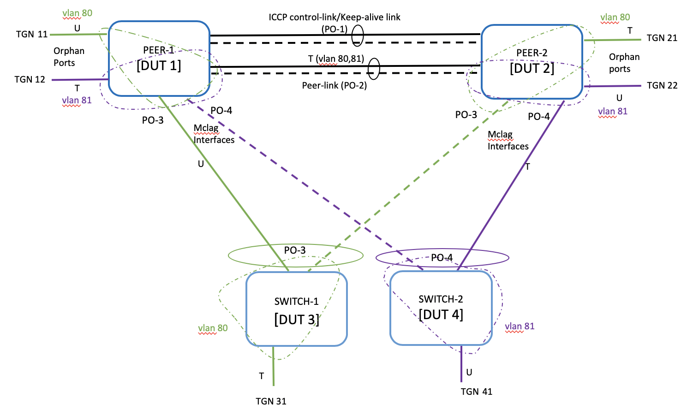
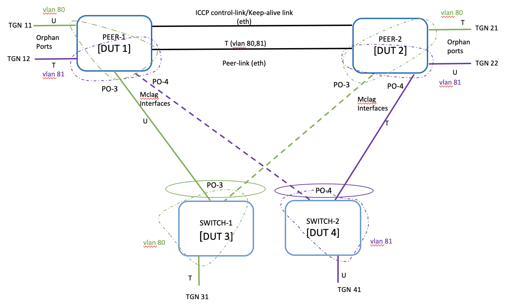

#  SQA Test Plan
# L2 MC-LAG
#  SONiC 3.0 Project and Buzznik Release
[TOC]
# Test Plan Revision History
| Rev | Date | Author | Change Description |
|:---:|:-----------:|:------------------:|-----------------------------|
| 0.1 | 10/04/2019 | Sneha Ann Mathew | Initial version |

# List of Reviewers
|  Function | Name |
|:---:|:-----------:|
|  |   |

# List of Approvers
|  Function | Name | Date Approved|
|:---:|:-----------:|:------------------:|
|  |   |  |

# Definition/Abbreviation
| **Term** | **Meaning**                    |
| -------- | ------------------------------- |
|MCLAG     | Multi-Chassis Link Aggregation Group     |
|ICCP   | Inter-Chassis Communication Protocol |
| FDB     | Layer-2 (MAC) based forwarding table      |
| Orphan Port      | Interface connecting MCLAG peers and non-MCLAG client |
| MCLAG enabled Interface | Interface connecting MCLAG peers and MCLAG client     |
| SHD | Single-Homed Device |
| MHD | Multi-Homed Device |
| PVST     | Per VLAN spanning tree protocol |
| REST     | Representational state transfer |
| STP      | Spanning tree protocol          |

# Feature Overview
Multichassis link aggregation groups (MC-LAGs) enable a client device to form a logical LAG interface between two MC-LAG peers. An MC-LAG provides redundancy and load balancing between the two MC-LAG peers, multihoming support, and a loop-free Layer 2 network without running STP. The MC-LAG peers use the Inter-Chassis Control Protocol (ICCP) to exchange control information and coordinate with each other to ensure that data traffic is forwarded properly.

This test plan aims at verifying the feature enhancements of SONiC ICCP L2 MCLAG. This includes data structure changes, MAC event handling optimizations for scaling performance. Support of static MAC address over MCLAG, port isolation ACL, and traffic recovery sequencing for traffic loop prevention.

## Functional Requirements
|**Requirement ID**| **Requirement**|
|:-----|:-------------------------------|
|SONiC3.0_MCLAG_001| Advertise locally configured Static MAC address to peer MCLAG node|
|SONiC3.0_MCLAG_002| Withdraw MAC from peer MCLAG node when static MAC address is un-configured |
|SONiC3.0_MCLAG_003| Dynamic MAC move is prohibited on Static MAC over MCLAG |
|SONiC3.0_MCLAG_004| Add CLI to configure MCLAG domain and corresponding attributes domain-id, local-ip-address and peer-ip-address |
|SONiC3.0_MCLAG_005| Add CLI to configure optional attribute [peer-interface] |
|SONiC3.0_MCLAG_006| Add CLI to configure keep-alive timer value |
|SONiC3.0_MCLAG_007| Add CLI to configure session-timeout value |
|SONiC3.0_MCLAG_008| Add CLI to support addition/deletion of mclag_interfaces |
|SONiC3.0_MCLAG_009| Optimize code flow and data structures to improve scaling performance |
|SONiC3.0_MCLAG_010| Support 40K FDB entries |
|SONiC3.0_MCLAG_011| Support 4K Vlans |
|SONiC3.0_MCLAG_012| MCLAG peer nodes should reconcile the local FDB table upon completion of warmboot |
# 1 Test Focus Areas
## 1.1 Functional Testing 
  - All new MCLAG CLIs and show commands
  - MCLAG bringup and functionality
  - MAC learning, aging and clear
  - Static MAC functionaly across MCLAG peers
  - MAC move between different interface types
  - Different traffic type forwarding
## 1.2 Negative Testing 
  -	Keep-alive link and Peer-links flaps
  -	Config save and reload
  -	Reboot
  -	Warm reboot

## 1.3 Scale and Performance Testing

 	- Support of 4K vlans & 40K macs.s

# 2 Topologies
## 2.1 Topology 1

## 2.2 Topology 2


# 3 Test  Case and Objectives
## 3.1 CLI
### 3.1.1 Verify all config and show CLIs of MCLAG

| **Test ID** | FtOpSoSwL2MclagCli001 |
|--------|:----------------|
| **Test Name** | Verify all config and show CLIs of MCLAG |
| **Test Setup** | Topology1 |
| **Type** | CLI |
| **Steps** | <br />**1) Click based CLI:<br />==============**<br /><br />Config CLIs:<br />----------------------<br />***config mclag {add \| del}  \<domain-id> \<local-ip-addr> \<peer-ip-addr>  [\<peer-ifname>]<br />config mclag member {add  \| del}  \<domain-id> \<portchannel-names><br />config mclag   keepalive-timer \<domain-id> \<keepalive-timer-val><br/>config mclag   session-timeout \<domain-id> \<session-timeout-val>***<br /><br />Show CLIS:<br />----------------------<br />***mclagdctl -i \<mclag-id> dump mac<br />mclagdctl -i \<mclag-id> dump portlist local<br />mclagdctl -i \<mclag-id> dump portlist peer<br />mclagdctl -i \<mclag-id> dump state***<br /><br /><br />**2) SONIC CLI:<br />==============**<br /><br />Config CLIs:<br />----------------------<br />***sonic(config)#[no] mclag domain<br />sonic(config-mclag-domain)# source-address<br />sonic(config-mclag-domain)# peer-address<br />sonic(config-mclag-domain)# peer-link<br />sonic(config-mclag-domain)# keepalive-interval<br />sonic(config-mclag-domain)# session-timeout***<br /><br />Show CLIS:<br />----------------------<br />***show mclag brief<br />show mclag interface***<br /><br />1) Verify syntax of listed CLIs<br/>2) Verify the configuration reflects in running config<br />3) Unconfigure the CLI and verify it is removed from running config<br />4) Verify show commands reflect the cofigured values |
## 3.2 Functional
### 3.2.1 Verify MCLAG bringup with peer-link and ICCP control-link as ethernet interface

| **Test ID** | FtOpSoSwL2MclagFn001 |
|--------|:----------------|
| **Test Name** | Verify MCLAG bringup with peer-link and control-link as ethernet interface |
| **Test Setup** | Topology2 |
| **Type** | Functional |
| **Steps** | 1)Bringup MCLAG as shown in Topology2<br/>2) Verify MCLAG state.<br />3) Verify MCLAG interface states and peer-link states<br />4) Verify traffic forwarding.<br />5) Verify MACs synced between Peer-1 and Peer-2<br />6)Verify Active Standby Roles of the peers based on local and peer node IP. |

###  3.2.2 Verify MCLAG bringup with peer-link and ICCP control-link as PortChannel

| **Test ID**    | FtOpSoSwL2MclagFn002                                         |
| -------------- | :----------------------------------------------------------- |
| **Test Name**  | Verify MCLAG bringup with peer-link and control-link as PortChannel |
| **Test Setup** | Topology1                                                    |
| **Type**       | Functional                                                   |
| **Steps**      | 1)Bringup MCLAG as shown in Topology1<br/>2) Verify MCLAG state.<br />3) Verify MCLAG interface states and peer-link states<br />4) Verify traffic forwarding.<br />5) Verify MACs synced between Peer-1 and Peer-2<br />6) Verify Active Standby Roles of the peers based on local and peer node IP. |

### 3.2.3 Verify MCLAG state keeping the ICCP control-link and peer-link same

| **Test ID**    | FtOpSoSwL2MclagFn003                                         |
| -------------- | :----------------------------------------------------------- |
| **Test Name**  | Verify MCLAG state keeping the ICCP control-link and peer-link same |
| **Test Setup** | Topology1 & Toplogy2                                         |
| **Type**       | Functional                                                   |
| **Steps**      | 1) Bringup MCLAG as shown in Topology1/Topology2<br/>2) Change the keep-alive/control link same as peer-link interface <br />3) Verify MCLAG state.<br />4) Verify MCLAG interface states and peer-link states<br />5) Verify traffic forwarding.<br />6) Verify MACs synced between Peer-1 and Peer-2<br />7) Verify Active Standby Roles of the peers based on local and peer node IP<br />8) Flap the control-link/peer-link interface and verify MAC sync and traffic forwarding<br />9) Disable Mclag interface on one peer and verify MAC sync and traffic forwarding<br />10) Disable peer-link and verify traffic forwarding in the failure scenario. |

### 3.2.4 Verify MCLAG by disable/enable member ports of PortChannels

| **Test ID**    | FtOpSoSwL2MclagFn004                                         |
| -------------- | :----------------------------------------------------------- |
| **Test Name**  | Verify MCLAG by disable/enable member ports of PortChannels  |
| **Test Setup** | Topology1                                                    |
| **Type**       | Functional                                                   |
| **Steps**      | 1) Bringup MCLAG as shown in Topology1<br />2) Disable/Enable odd/even member ports of the Mclag enabled Interface and peer-links <br />3) Verify MCLAG state.<br />4) Verify MCLAG interface states and peer-link states<br />5) Verify traffic forwarding.<br />6) Verify MACs synced between Peer-1 and Peer-2<br />7) Verify Active Standby Roles of the peers based on local and peer node IP. |

### 3.2.5 Add/Remove MCLAG enabled interfaces to MCLAG domain

| **Test ID**    | FtOpSoSwL2MclagFn005                                         |
| -------------- | :----------------------------------------------------------- |
| **Test Name**  | Add/Remove MCLAG interfaces to MCLAG domain                  |
| **Test Setup** | Topology1                                                    |
| **Type**       | Functional                                                   |
| **Steps**      | 1) Bringup MCLAG as shown in Topology1<br />2) Remove and add back one Mclag Interface from MCLAG domain on one of the Mclag peer.<br />3) Verify MCLAG state.<br />4) Verify MCLAG interface states and peer-link states<br />5) Verify traffic forwarding.<br />6) Verify MACs synced between Peer-1 and Peer-2<br />7) Remove and add back one Mclag Interface from MCLAG domain on second Mclag peer.<br />8) Repeat verifications 3-6 |

### 3.2.6 Flap ICCP control-link and ICCP session

| **Test ID**    | FtOpSoSwL2MclagFn006                                         |
| -------------- | :----------------------------------------------------------- |
| **Test Name**  | Flap ICCP control-link and ICCP session                      |
| **Test Setup** | Topology1                                                    |
| **Type**       | Functional                                                   |
| **Steps**      | 1) Bringup MCLAG as shown in Topology1<br />2) Flap the ICCP control-link/keep-alive link<br />3) Verify MCLAG state.<br />4) Verify MCLAG interface states and peer-link states<br />5) Verify traffic forwarding.<br />6) Verify MACs synced between Peer-1 and Peer-2<br />7)Flap the ICCP session between MCLAG peers and repeat verifications 3 to 6 |

### 3.2.7 Disable ICCP control-link/Keep-alive link and verify active standby role

| **Test ID**    | FtOpSoSwL2MclagFn007                                         |
| -------------- | :----------------------------------------------------------- |
| **Test Name**  | Disable ICCP control-link/Keep-alive link and verify active standby role |
| **Test Setup** | Topology1                                                    |
| **Type**       | Functional                                                   |
| **Steps**      | 1) Bringup MCLAG as shown in Topology1<br />2) Disable ICCP control-link/Keep-alive link<br />3) Verify MCLAG state.<br />4) Verify MCLAG interface states and peer-link states<br />5) Verify traffic forwarding [All traffic from client will be sent to Active node as LACP connection to standby is down].<br />6) Verify MAC table in Peer-1 and Peer-2<br />7) Verify Active Standby Roles of the peers based on local and peer node IP.<br />8) Enable back ICCP control-link/Keep-alive link |

### 3.2.8 Disable peer-link and verify traffic

| **Test ID**    | FtOpSoSwL2MclagFn008                                         |
| -------------- | :----------------------------------------------------------- |
| **Test Name**  | Disable peer-link and verify traffic                         |
| **Test Setup** | Topology1                                                    |
| **Type**       | Functional                                                   |
| **Steps**      | 1) Bringup MCLAG as shown in Topology1<br />2) Disable the peer-link<br />3) Verify MCLAG state.<br />4) Verify MCLAG interface states and peer-link states<br />5) Verify traffic forwarding.<br />6) Verify Orphan MACs and Mclag Interface MACs synced between Peer-1 and Peer-2. [MACs pointing to peer-link will be removed from both peers].<br />7) Enable back the peer-link |

### 3.2.9 Bring down one of the peers and verify active standby role

| **Test ID**    | FtOpSoSwL2MclagFn009                                         |
| -------------- | :----------------------------------------------------------- |
| **Test Name**  | Disable peer-link and verify traffic                         |
| **Test Setup** | Topology1                                                    |
| **Type**       | Functional                                                   |
| **Steps**      | 1) Bringup MCLAG as shown in Topology1<br />2) Unconfigure mclag in active peer node<br />3) Verify MCLAG state.<br />4) Verify MCLAG interface states and peer-link states<br />5) Verify traffic  [All traffic from client will be sent to standby node as LACP connection to active is down].<br />6) Verify MAC table in Peer-1 and Peer-2<br />7) Verify Active Standby Roles of the peers based on local and peer node IP.<br />8) Configure back mclag on active peer and unconfigure mclag on the standby peer.<br />9) Repeat verifications 3-7 [Traffic from client will be sent to Active node as LACP connection to standby is down]<br />10) Configure back Mclag on second peer. |

### 3.2.10 Verify MCLAG with non-default keep-alive and session-timeout timers

| **Test ID**    | FtOpSoSwL2MclagFn010                                         |
| -------------- | :----------------------------------------------------------- |
| **Test Name**  | Verify MCLAG with non-default keep-alive and session-timeout timers |
| **Test Setup** | Topology1                                                    |
| **Type**       | Functional                                                   |
| **Steps**      | 1) Bringup MCLAG as shown in Topology1<br />2) Configure non-default values for keep-alive  and session-timeout <br />3) Verify MCLAG state.<br />4) Verify MCLAG interface states and peer-link states<br />5) Verify traffic forwarding.<br />6) Verify MACs synced between Peer-1 and Peer-2<br />7) Verify Active Standby Roles of the peers based on local and peer node IP.<br />8) Configure back default keep-alive and session tiemout. |

### 3.2.11 Verify MAC learning on orphan ports, peer-link and mclag enabled interfaces

| **Test ID**    | FtOpSoSwL2MclagFn011                                         |
| -------------- | :----------------------------------------------------------- |
| **Test Name**  | Verify MAC learning on orphan ports, peer-link and mclag enabled interfaces |
| **Test Setup** | Topology1                                                    |
| **Type**       | Functional                                                   |
| **Steps**      | 1) Bringup MCLAG as shown in Topology1<br />2) Verify client side MACs are not learned on peer-links as MAC learning is disabled. <br />3) Verify MCLAG state.<br />4) Verify MCLAG interface states and peer-link states<br />5) Verify traffic forwarding.<br />6) Verify Mac entries learned on orphan ports and mclag enabled interfaces are synced between peers |

### 3.2.12 Verify MAC aging works fine with non-default age-time

| **Test ID**    | FtOpSoSwL2MclagFn012                                         |
| -------------- | :----------------------------------------------------------- |
| **Test Name**  | Verify MAC aging works fine with non-default age-time        |
| **Test Setup** | Topology1                                                    |
| **Type**       | Functional                                                   |
| **Steps**      | 1) Bringup MCLAG as shown in Topology1<br />2) Configure different non-default mac aging time on peer1 and peer2<br />3) Verify MCLAG state.<br />4) Verify MCLAG interface states and peer-link states<br />5) Verify traffic forwarding and stop traffic<br />6) Verify MAC table that locally aged out MACs are removed and remote learned MACs are not aged out. Verify remote MACs are removed when it is aged in the peer node.<br />7) Configure back default mac aging time. |

### 3.2.13 Verify clear MAC on MCLAG peer

| **Test ID**    | FtOpSoSwL2MclagFn013                                         |
| -------------- | :----------------------------------------------------------- |
| **Test Name**  | Verify clear MAC on MCLAG peer                               |
| **Test Setup** | Topology1                                                    |
| **Type**       | Functional                                                   |
| **Steps**      | 1) Bringup MCLAG as shown in Topology1<br />2) Verify MCLAG state.<br />3) Verify MCLAG interface states and peer-link states<br />4) Verify traffic forwarding and stop traffic.<br />5)Clear mac on one of the peers<br />6) Verify MAC table is synced between Peer-1 and Peer-2. Make sure only locally learned MACs are removed from the node and and remote MACs learned via ICCP is intact.<br />7) Start traffic and verify forwarding and FDB table. |


### 3.2.14 Verify static MAC over MCLAG.

| **Test ID**    | FtOpSoSwL2MclagFn014                                         |
| -------------- | :----------------------------------------------------------- |
| **Test Name**  | Verify static MAC over MCLAG                                 |
| **Test Setup** | Topology1                                                    |
| **Type**       | Functional                                                   |
| **Steps**      | 1) Bringup MCLAG as shown in Topology1<br />2) Configure static macs pointing to orphan port and mclag interface on one of the peer node<br />3) Verify MCLAG state.<br />4) Verify MCLAG interface states and peer-link states<br />5) Verify traffic forwarding.<br />6) Verify static MAC is synced between Peer-1 and Peer-2 <br />7) Unconfigure static MACs |

### 3.2.15 Verify MAC move between orphan ports and mclag interfaces.

| **Test ID**    | FtOpSoSwL2MclagFn015                                         |
| -------------- | :----------------------------------------------------------- |
| **Test Name**  | Verify static MAC over MCLAG                                 |
| **Test Setup** | Topology1                                                    |
| **Type**       | Functional                                                   |
| **Steps**      | 1) Bringup MCLAG as shown in Topology1<br />2) Verify MCLAG state.<br />3) Verify MCLAG interface states and peer-link states<br />4) Verify traffic forwarding.<br />5) Send traffic streams between SHD and MHD to cover MAC move in below scenarios<br />6) Verify MAC move between:<br /> (a) orphan ports on same MCLAG node <br /> (b) orphan ports between both MCLAG nodes <br /> (c) orphan ports and mclag interfaces <br /> (d) different mclag interfaces<br />7) Verify MAC table reflects the MAC move and syncs between Peer-1 and Peer-2<br />8) Configure few static MACs on MCLAG peer and generate traffic streams with those static MACs for dynamic MAC move and verify those streams dropped as the MAC move is not allowed.<br />9) Restore traffic streams and verify forwarding and FDB table. |

### 3.2.16 Disable/Enable orphan ports.

| **Test ID**    | FtOpSoSwL2MclagFn016                                         |
| -------------- | :----------------------------------------------------------- |
| **Test Name**  | Disable/Enable orphan ports                                  |
| **Test Setup** | Topology1                                                    |
| **Type**       | Functional                                                   |
| **Steps**      | 1) Bringup MCLAG as shown in Topology1<br />2) Disable/enable orphan ports<br />3) Verify MCLAG state.<br />4) Verify MCLAG interface states and peer-link states<br />5) Verify traffic forwarding.<br />6) Verify MACs synced between Peer-1 and Peer-2 |

### 3.2.17 Disable/Enable Mclag Interfaces.

| **Test ID**    | FtOpSoSwL2MclagFn017                                         |
| -------------- | :----------------------------------------------------------- |
| **Test Name**  | Disable/Enable Mclag Interfaces                              |
| **Test Setup** | Topology1                                                    |
| **Type**       | Functional                                                   |
| **Steps**      | 1) Bringup MCLAG as shown in Topology1<br />2) Disable the Mclag interfaces on one MCLAG peer node<br />3) Verify MCLAG state.<br />4) Verify MCLAG interface states and peer-link states<br />5) Verify traffic forwarding.<br />6) Verify MACs synced between Peer-1 and Peer-2<br />7) Enabled back the MCLAG interface in step and repeat verifications 3-6 |

### 3.2.18 Disable/Enable client ports.

| **Test ID**    | FtOpSoSwL2MclagFn018                                         |
| -------------- | :----------------------------------------------------------- |
| **Test Name**  | Disable/Enable client ports                                  |
| **Test Setup** | Topology1                                                    |
| **Type**       | Functional                                                   |
| **Steps**      | 1) Bringup MCLAG as shown in Topology1<br />2) Disable/enable client ports<br />3) Verify MCLAG state.<br />4) Verify MCLAG interface states and peer-link states<br />5) Verify traffic forwarding.<br />6) Verify MACs synced between Peer-1 and Peer-2 |

### 3.2.19 Verify BUM traffic flooding.

| **Test ID**    | FtOpSoSwL2MclagFn019                                         |
| -------------- | :----------------------------------------------------------- |
| **Test Name**  | Verify BUM traffic flooding                                  |
| **Test Setup** | Topology1                                                    |
| **Type**       | Functional                                                   |
| **Steps**      | 1) Bringup MCLAG as shown in Topology1<br />2) Send unknown_unicast, Multicast and broadcast traffic streams<br />3) Verify MCLAG state.<br />4) Verify MCLAG interface states and peer-link states<br />5) Verify traffic flooding is local-biased when mclag interface is UP.<br />6) Verify MACs synced between Peer-1 and Peer-2 <br />7) Disable MCLAG interface on active peer and verify traffic flooding is done by standby peer node. Note the Mclag interface member port which floods the traffic.<br />8) Enable MCLAG interface and verify traffic flooding changes to local-bias and no traffic loop seen. Also verify no duplicate packet recevied on the client node. <br />9) Bring down the Mclag interface member port on standby peer which flooded the traffic in step 7. Make sure traffic flooding as in step 8<br />10) Enable back the Mclag interface member port on standby peer which flooded the traffic in step 7. Make sure traffic flooding as in step 8 |

### 3.2.20 Add/remove vlans on Mclag Interfaces and orphan ports.

| **Test ID**    | FtOpSoSwL2MclagFn020                                         |
| -------------- | :----------------------------------------------------------- |
| **Test Name**  | Add/remove vlans on Mclag Interfaces and orphan ports.       |
| **Test Setup** | Topology1                                                    |
| **Type**       | Functional                                                   |
| **Steps**      | 1) Bringup MCLAG as shown in Topology1<br />2) Remove vlan membership from one mclag interface to another. Also from one orphan port to another<br />3) Verify MCLAG state.<br />4) Verify MCLAG interface states and peer-link states<br />5) Verify traffic forwarding forwards to right mclag interface.<br />6) Verify MACs synced between Peer-1 and Peer-2<br />7) Revert the vlan membership and Repeat verifications 3-6. |


## 3.3 Reboot Scenarios

### 3.3.1 Verify MCLAG with config reload.

| **Test ID**    | FtOpSoSwL2MclagPe001                                         |
| -------------- | :----------------------------------------------------------- |
| **Test Name**  | Verify MCLAG with config reload                              |
| **Test Setup** | Topology1                                                    |
| **Type**       | Performance                                                  |
| **Steps**      | 1) Bringup MCLAG as shown in Topology1<br />2) Configure few static MACs over MCLAG and non-default age time<br />3) Configure non-default Mclag timers<br />4) Save config and do "config reload"<br />5) Verify MCLAG state.<br />6) Verify MCLAG interface states and peer-link states<br />7) Verify traffic forwarding forwards to right mclag interface.<br />8) Verify MACs synced between Peer-1 and Peer-2<br />9) Verify configured timer vlaues are in effect. |

### 3.3.2 Verify MCLAG with reboot.

| **Test ID**    | FtOpSoSwL2MclagPe002                                         |
| -------------- | :----------------------------------------------------------- |
| **Test Name**  | Verify MCLAG with reboot                                     |
| **Test Setup** | Topology1                                                    |
| **Type**       | Performance                                                  |
| **Steps**      | 1) Bringup MCLAG as shown in Topology1<br />2) Configure few static MACs over MCLAG and non-default age time<br />3) Configure non-default Mclag timers<br />4) Reboot one peer after saving configs<br />5) Verify MCLAG state.<br />6) Verify MCLAG interface states and peer-link states<br />7) Verify traffic forwarding forwards to right mclag interface.<br />8) Verify MACs synced between Peer-1 and Peer-2<br />9) Verify configured timer vlaues are in effect. |

### 3.3.3 Verify MCLAG with warm reboot.

| **Test ID**    | FtOpSoSwL2MclagPe003                                         |
| -------------- | :----------------------------------------------------------- |
| **Test Name**  | Verify MCLAG with warm reboot                                |
| **Test Setup** | Topology1                                                    |
| **Type**       | Performance                                                  |
| **Steps**      | 1) Bringup MCLAG as shown in Topology1<br />2) Configure few static MACs over MCLAG and non-default age time<br />3) Configure non-default Mclag timers<br />4) Do Warm-reboot on one peer after saving configs<br />5) Verify MCLAG state.<br />6) Verify MCLAG interface states and peer-link states<br />7) Verify traffic forwarding forwards to right mclag interface.<br />8) Verify MACs synced between Peer-1 and Peer-2<br />9) Verify configured timer vlaues are in effect. |

### 3.3.4 Verify MCLAG with  container restart.

| **Test ID**    | FtOpSoSwL2MclagPe004                                         |
| -------------- | :----------------------------------------------------------- |
| **Test Name**  | Verify MCLAG with container restart                          |
| **Test Setup** | Topology1                                                    |
| **Type**       | Performance                                                  |
| **Steps**      | 1) Bringup MCLAG as shown in Topology1<br />2) Configure few static MACs over MCLAG and non-default age time<br />3) Configure non-default Mclag timers<br />4) Restart ICCPd, SwSS and Teamd containers<br />5) Verify MCLAG state.<br />6) Verify MCLAG interface states and peer-link states<br />7) Verify traffic forwarding forwards to right mclag interface.<br />8) Verify MACs synced between Peer-1 and Peer-2<br />9) Verify configured timer vlaues are in effect. |


## 3.4 Stress,Scale and Performance

### 3.4.1 Verify 4K vlans and 40K MACs support.

| **Test ID**    | FtOpSoSwL2MclagSc001                                         |
| -------------- | :----------------------------------------------------------- |
| **Test Name**  | Verify 4K vlans and 40K MACs support                         |
| **Test Setup** | Topology1                                                    |
| **Type**       | Functional                                                   |
| **Steps**      | 1) Bringup MCLAG as shown in Topology1<br />2) Configure 4K vlans on the mclag interfaces & peer-link<br />3) Configure few static MACs on the peer nodes<br />4) Scale traffic streams from MHD to MCLAG to 40K MACs<br />5) Verify MCLAG state.<br />6) Verify MCLAG interface states and peer-link states<br />7) Verify traffic forwarding.<br />8) Verify MACs synced between Peer-1 and Peer-2<br />9) Disable/Enable the peer-link and verify scaled MACs and traffic forwarding.<br />10) Disable/enable the control-link (ICCP session) and verify scaled MACs and traffic forwarding<br />11) Unconfigure static MACs and verify MAC table synced and forwarding works fine. |

### 3.4.2 Verify MCLAG with continuous Mclag interface flaps.

| **Test ID**    | FtOpSoSwL2MclagPe005                                         |
| -------------- | :----------------------------------------------------------- |
| **Test Name**  | Verify MCLAG with continuous Mclag interface flaps           |
| **Test Setup** | Topology1                                                    |
| **Type**       | Performance                                                  |
| **Steps**      | 1) Bringup MCLAG as shown in Topology1<br />2) Configure 4K vlans on the mclag interfaces & peer-link<br />3) Scale traffic streams from MHD to MCLAG to 40K MACs<br />4) Do continuous flap of the Mclag Interfaces periodically<br />5) Verify MCLAG state.<br />6) Verify MCLAG interface states and peer-link states<br />7) Verify traffic forwarding.<br />8) Verify MACs synced between Peer-1 and Peer-2<br /> |

### 3.4.3 Verify L2 MCLAG with line rate traffic.

| **Test ID**    | FtOpSoSwL2MclagPe006                                         |
| -------------- | :----------------------------------------------------------- |
| **Test Name**  | Verify L2 MCLAG with line rate traffic.                      |
| **Test Setup** | Topology1                                                    |
| **Type**       | Performance                                                  |
| **Steps**      | 1) Bringup MCLAG as shown in Topology1, configure ICCP control-link and peer-link to be same<br />2) Configure 4K vlans on the mclag interfaces & peer-link<br />3) Scale traffic streams from MHD to MCLAG to 40K MACs<br />4) Send line rate traffic over MCLAG interfaces<br />5) Verify MCLAG state.<br />6) Verify MCLAG interface states and peer-link states<br />7) Verify traffic forwarding.<br />8) Verify MACs synced between Peer-1 and Peer-2<br />9)Disable one Mclag interface so that traffic goes via peer-link ,verify MCLAG state<br /> |

## 3.5 Management

#### 3.5.1 SNMP

N/A

#### 3.5.2 gNMI

N/A

#### 3.5.3 REST API

N/A

# 4 Reference Links

HLD link :
<http://gerrit-lvn-07.lvn.broadcom.net:8083/c/sonic/documents/+/12075/2/MCLAG/MCLAG_HLD.md#441>

MCLAG definition:

https://www.juniper.net/documentation/en_US/junos/topics/concept/mc-lag-feature-summary-best-practices.html

```


```