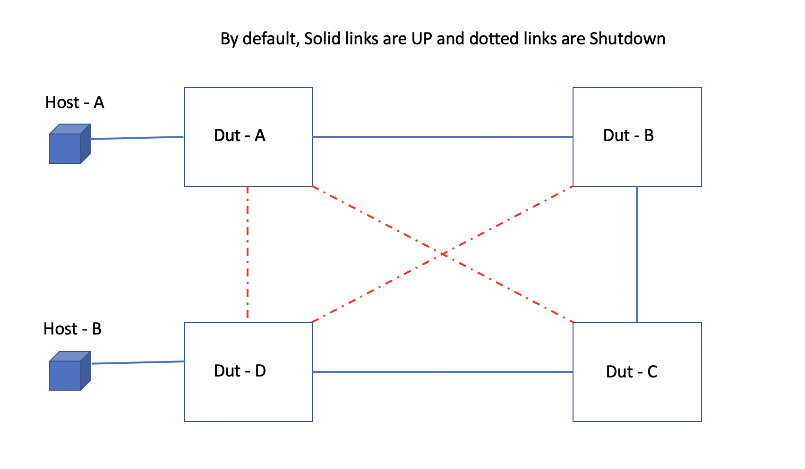

SQA Test Plan

# L2 Traceroute test plan 

#  SONiC 4.0 Project and Cyrus Release

Rev 1.0

[TOC]

## Test Plan Revision History

| Rev  | Date       | Author                        | Change Description                                    |
| ---- | ---------- | ----------------------------- | ----------------------------------------------------- |
| 1    | 06/09/2021 | Naveen Nag     | Initial Version                                       |
|     |            |            |                    |
|      |            |            |                    |
|      |            |            |                    |
|      |            |            |                    |
|      |            |            |                    |

## List of Reviewers

| Function | Name |
| :------: | :--: |
|          |      |

## List of Approvers

| Function | Name | Date Approved |
| :------: | :--: | :-----------: |
|          |      |               |

## Definition/Abbreviation

| **Term** | **Meaning** |
| -------- | ----------- |
|          |             |
|          |             |

## Introduction

### Feature Overview

L2 Traceroute can trace all the L2 traffic paths for a given VLAN or to a particular destination device in the given VLAN. The destination device is identified based on its IP, DNS name or MAC. The main use of the Trace-L2 feature is to provide flexibility to administrators to determine the L2 paths in a L2 topology.

L2 Traceroute is a proprietary feature and it cannot interop with any other vendors. FYI, cisco has its own proprietary L2-traceroute.

## 1 Test Focus Areas

### 1.1 Functional Requirements

L2 Traceroute feature supports the following:
- Traces all the available paths to a particular IP, MAC or hostname in a VLAN.
- Probes the entire Layer 2 topology.
- Displays the input or output ports of each hop in the path.
- Displays the round trip travel time of each hop.
- Displays hops in a VLAN that form a loop.
- Displays each hop's Layer 2 protocol such as STP, RSTP, 802.1w, SSTP or route-only.

 The resulting trace displays a report that provides information about a packet’s path to a device, such as hop and port information and travel time. It also can locate any Layer 2 loop in a VLAN. The probed Layer 2 information is discarded when a new command is issued again.For each hop in the path, L2 Traceroute displays its input/output port, L2 protocols of the input port, and the microsecond travel time between hop and hop. It also prints out the hops which form a loop, if any. Displaying L2 topology lets a user easily obtain information of all hops.

The devices that will participate in the L2 Traceroute protocol must be assigned to a VLAN and all devices on that VLAN must be SONiC devices that support the L2 Traceroute protocol. Devices that do not support the trace-l2 protocol will forward the L2 Traceroute packets without a reply. Hence, these devices are transparent to the L2 Traceroute protocol. The destination for the packet with the L2 Traceroute protocol must be a device that supports the L2 Traceroute protocol and the destination cannot be a client, such as a personal computer, or devices from other vendors.

L2 Traceroute will follow the xSTP path if enabled in the system

## 2 Topologies 

2.1 Topology

## 3 Test Case and objectives

### **3.1 Functional Test Cases**

As mentioned in the topology, the solid line is no shut(Up) and dotted lines are shutdown by default. Based on the test case requirements, the links will be shut. 

#### **3.1.1 To trace the L2 network in a 4 node topology  ** ####

| **Test ID**    | FtOpSoRoL2Trace311                                           |
| -------------- | :----------------------------------------------------------- |
| **Test Name**  | To trace the L2 network in a 4 node topology                 |
| **Test Setup** | **Topology1**                                                |
| **Type**       | **Functional**                                               |
| **Steps**      | 1) Get the topology up as mentioned in the topology  2) Configure vlan 777 and assign the ports to this vlan  3) Without sending any traffic, initiate L2 trace route vlan 777 without any mac or IP    4) Verify the protocol learn the L2 path by itself and display the incoming, outgoing interface, mac address and microsecond travel between the hop   5) Remove the vlan assosciation from the port between dutC and dutD    6) Start the L2 trace route again, now it should trace till dutC only    7) Bring back the link and verify L2 trace route displays 4 hops  8) Query the L2 trace route with the dutD MAC , the result should be same    9) Now configure an IP address on the Vlan777 on all the nodes    10) Upon quering L2 trace route with the dutD IP address, it should display 4 hops with IP address instead of MAC address   11)  Remove the IP address from the intermittent node and issue the L2 trace route with IP address  12) Verify that the mac address should be displayed since the IP address is missing from the intermittent node  13) Add back the IP address and verify the output has IP address now.   |

#### **3.1.2 To trace the L2 network over a port-channel interface ** ####

| **Test ID**    | FtOpSoRoL2Trace312                                           |
| -------------- | :----------------------------------------------------------- |
| **Test Name**  | To trace the L2 network over a port-channel interface        |
| **Test Setup** | **Topology1**                                                |
| **Type**       | **Functional**                                               |
| **Steps**      | 1) Assign the ports as part of a port-channel and assign them as part of Vlan 888  2) Make sure the port-channel has more than one port  3) Without traffic, issue L2 trace route with Vlan 888    4) Verify the protocol learn the L2 path by itself and display the incoming, outgoing interface, mac address and microsecond travel between the hop   5) Shutdown the members of the port-channel, make sure there is only one port part of the LAG   6) Issue L2 trace and verify the output is same as in step 4     7) Start the traffic from Host A on dutA to host B on dutB, bi-directional   8) Verify the traffic is being sent and received   9) Issue the L2 trace route with host B mac address and verify the output, it should 3 hops to reach   10) Shutdown the link from dutC to dutD and enable the link from dutB to dutD    11) Verify the L2 trace route now takes 2 hops   12) Alter the path from dutA to dutD by shutting down the links - dutA - dutC - dutB- dutD  13) Verify the L2 trace route should display this updated path   14) Bring back the links on the LAG interface and issue the L2 trace route, the result should be same as in step 13    15) Move the hostB to dutB, start the traffic   16) L2 traceroute should display 1 hop   17) Move the host to dutA it self, both the mac address are local   18) Issue L2 trace route and verify the output  |

#### **3.1.3 To verify L2 trace route with tagged, access and mixed combinations  ** ####

| **Test ID**    | FtOpSoRoL2Trace313                                           |
| -------------- | :----------------------------------------------------------- |
| **Test Name**  | To verify L2 trace route with tagged, access and both combinations |
| **Test Setup** | **Topology1**                                                |
| **Type**       | **Functional**                                               |
| **Steps**      | 1) Get the topology up as mentioned in the topology  2) Configure vlan 555 and assign the ports as tagged to this vlan  3) Without sending any traffic, initiate L2 trace route vlan 777 without any mac or IP    4) Verify the protocol learn the L2 path by itself and display the incoming, outgoing interface, mac address and microsecond travel between the hop   5) Change the tag port to access port on all the links on the nodes    6) Verify l2 trace route is successful    7) Keep the port as access from dutA-dutB & dutD - dutC, where as from duty-dutD change it to trunk port  8) Verify l2 trace route is successful    9) Assign the port between dutB-DUTC to a different vlan     10) Upon quering L2 trace route with Vlan555, it should trace only till dutB   |

#### **3.1.4 To verify if the L2 traceroute can identify a loop in network** ####

| **Test ID**    | FtOpSoRoL2Trace314                                           |
| -------------- | :----------------------------------------------------------- |
| **Test Name**  | To verify if the L2 traceroute can identify a loop in network |
| **Test Setup** | **Topology1**                                                |
| **Type**       | **Functional**                                               |
| **Steps**      | 1) Get the topology up as mentioned in the topology  2) Configure vlan 999 and assign the ports to this vlan  3) Without sending any traffic, initiate L2 trace route vlan 999 without any mac or IP    4) Verify the protocol learn the L2 path by itself and display the incoming, outgoing interface, mac address and microsecond travel between the hop   5) Bring the link between dutA & dutD    6) Upon issue L2 trace route, it should display that a loop is present in the network.    7) Bring down the link from dutC - dutD  8) L2 trace route should display 1 hop from dutA to dutD and 2 hop from dutA - dutC    9) Similarly introduce more loops in the network by bring up the links   10) Verify L2 traceroute is able to idenity the loops   |

#### **3.1.5 To verify the L2 trace route in a xSTP enabled network** ####

| **Test ID**    | FtOpSoRoL2Trace315                                           |
| -------------- | :----------------------------------------------------------- |
| **Test Name**  | To verify the L2 trace route in a xSTP enabled network       |
| **Test Setup** | **Topology1**                                                |
| **Type**       | **Functional**                                               |
| **Steps**      | 1) Enable all the links in the topology and make sure it is full mesh  2) Configure Vlan 555 and add all the links as part of this vlan   3) Issue L2trace route and verify it detects a loop   4) Configure  STP in the network with dutB as the root bridge  5) Verify all the redundant links are in blocked and the root, designated ports are chosen   6) Issue L2trace route and verify it takes the path as defined in the STP tree, make sure it doesn't display any blocked ports    7) Change the root bridge to differnet nodes and verify the behavior   8) Remove STP and verify L2 trace route detect the loop again   9) Enable PVST now and the behavior should be same as in STP  10) Issue L2 trace route and execute Ctrl+C  before it traces the path, make sure the command gets terminated   11) Try issuing L2 trace route on a non-existent vlan, the CLI should throw a suitable error   |

#### **3.1.6 To verify the L2 trace route in a Mclag scenario** ####

| **Test ID**    | FtOpSoRoL2Trace316                                           |
| -------------- | :----------------------------------------------------------- |
| **Test Name**  | To verify the L2 trace route in a Mclag scenario             |
| **Test Setup** | **Topology1**                                                |
| **Type**       | **Functional**                                               |
| **Steps**      | 1) Enable the links in such a way that dutB and dutC should be Mclag peers, dutA is the client and dutD is the uplink  2) Configure Peer link with Port-channel 1 and client as Port-channel 2, add these as members of Vlan444    3) Issue L2trace route from dutA and verify the trace route is successful   4) No loop should be detected since its a Mclag scenario  5) Verify all the redundant links are in blocked and the root, designated ports are chosen   6) Shutdown the Mclag lag link from dutB to dutA and issue the L2 trace route, it should be successful    7) Similarly shutdown the link from dutC to dutA, bring up the link from dutB to dutA and issue L2 trace route   8) Start the traffic from Host A to Host B bi-direction and verify L2 trace route with both Mac and Ip address    9) With traffic running, bring back the link, shutdown the other links and verify L2 traceroute is successful  10) Move  the host from dutB to dutC and issue the L2 trace route, verify the path  11) Shutdown the link from dutC to dutA and issue L2 trace route again, now it should take the ICL link   12) Save the config and reboot dutC, while the node is rebooting issue L2 trace route to the hostB MAC address   13) L2 trace route should fail since the mac is not available   14) Once the node is back online and mclag is up, verify L2 trace toute is success.   |

#### **3.1.7 To verify the L2 trace route in a ECMP case with L3 protocol enabled** ####

| **Test ID**    | FtOpSoRoL2Trace317                                           |
| -------------- | :----------------------------------------------------------- |
| **Test Name**  | To verify the L2 trace route in a ECMP case with L3 protocol enabled |
| **Test Setup** | **Topology1**                                                |
| **Type**       | **Functional**                                               |
| **Steps**      | 1) Configure vlan 100 between dutA-B, 200 between B-C, 300 between C-D & 400 between A-D  2) Configure Ip address on the vlan interface with a differnet ip as mentioned below    3) Vlan 100 - 10.1.1.0/24, 200 - 20.1.1.0/24, 300 - 30.1.1.0/24 & 400 - 40.1.1.0/24   4) Enable OSPF in the network and make sure all the IP address are reachable from all the nodes  5) From dutA, there should be a ECMP path to 20.1.1.0/24 network    6) Issue L2 trace route with the ip address 20.1.1.0/24 network, it should display 2 paths    7) Bring the direct link between dutA to dutC, configure vlan 500 and assign the ip address 50.1.1.0/24    8) Now there should be 3 ECMP path to 20.1.1.0/24 network    9) L2 trace route should display all the 3 paths  10) Remove the OSPF from the network and issue the L2 trace route for 20.1.1.0/24 network  11) Configure BGP and redistribute the connected routes, verify all the routes are reachable   12) Issue the L2 trace route with the 20.1.1.10/24 ip and verify it displays 2 paths   |

### **3.2 Negative Test Cases**

### 3.2.1 To verify the L2 trace route behavior while quering Invalid Mac-address  ###

| **Test ID**    | FtOpSoRoL2Trace321                                           |
| -------------- | :----------------------------------------------------------- |
| **Test Name**  | To verify the L2 trace route behavior while quering Invalid Mac-address |
| **Test Setup** | **Topology1**                                                |
| **Type**       | **Negative Test Case**                                       |
| **Steps**      | 1) Get the topology up as mentioned in the topology  2) Configure vlan 777 and assign the ports to this vlan  3) Without sending any traffic, initiate L2 trace route vlan 777 without any mac or IP    4) Verify the protocol learn the L2 path by itself and display the incoming, outgoing interface, mac address and microsecond travel between the hop   5) Try L2 traceroute with Multicast and broadcast Mac address, it should fail    6) Add a static mac on the intermidiate node and query L2 trace route, it should fail since we don't support static Mac query   7) Query L2 trace route with a unknown Mac, it should fail   8) Query L2 trace route with a Invalid Mac, it should fail    9) Similary add IP address to all the vlan interface and query for Broadcast, multicast , unknown and invalid IP address l  |

### **3.3 Scale Test Cases**

### 3.3.1 To verify the L2 trace route is successful for multiple vlans  ###

| **Test ID**    | FtOpSoRoL2Trace331                                           |
| -------------- | :----------------------------------------------------------- |
| **Test Name**  | To verify the L2 trace route is successful for multiple vlans |
| **Test Setup** | **Topology1**                                                |
| **Type**       | **Scale Test Case**                                          |
| **Steps**      | 1) Create 100 vlans say 2-102 and assign the ports as in topology 1  2) make sure the ports are part of vlans and there is no loop    3) Query L2 trace route for some random vlans say 14, 60,90,102, it should be successful and should display 3 hops with the MAC address    4) Configure IP address on the few vlans say 10,20 & 30, and query l2 trace route with the IP address for these vlans and verify it is successful   5) Try the same for other vlans which doesn't have an IP address , L2 trace route should fail    6) Bring the link up between dutA to dutD and create a loop, assign this port as part of few vlans say 50,60 & 70    7) Upon quering L2 trace route, loop should be detected for these vlans only whereas for the rest of the vlans it should be loop free   |

### **3.4 Stress Test Cases**

### 3.4.1 To verify mem leak and CPU usuage by stressing L2 trace route with the triggers  ###

| **Test ID**    | FtOpSoRoL2Trace341                                           |
| -------------- | :----------------------------------------------------------- |
| **Test Name**  | To verify mem leak and CPU usuage by stressing L2 trace route with the triggers |
| **Test Setup** | **Topology1**                                                |
| **Type**       | **Stress Test Case**                                         |
| **Steps**      | 1) Create 100 vlans say 2-102 and assign the ports as in topology 1  2) Make sure the ports are part of vlans and there is no loop    3) Query L2 trace route for some random vlans say 14, 60,90,102, it should be successful and should display 3 hops with the MAC address  4) Verify the mem leak and CPU usage before starting the trigger   5) Trigger L2 trace route continously and try removing and adding the port from the vlans on the intermidiate nodes    6) Tabulate the mem and CPU usage.    7) Make sure there are no mem leaks observed   8) Similarly try different triggers like removing the port from the vlans, adding and removing the IP address from the vlan interface, shut/no shut of the links etc  9) After each trigger, tabulate the mem and CPU usage.    |

## 4.0 **Reference Links**

 HLD document -->

https://github.com/BRCM-SONIC/sonic_doc_private/pull/175

