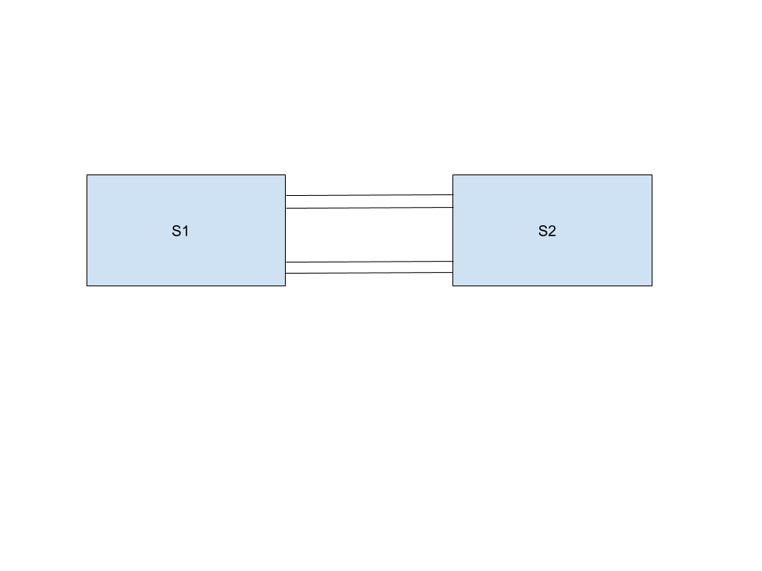

# LOOP GUARD TEST PLAN

# SONiC 3.1 Project and Buzznik_plus Release

[TOC]

# Test Plan Revision History

| Rev  |    Date    |        Author        | Change Description |
| :--: | :--------: | :------------------: | :----------------: |
| 0.1  | 07/30/2020 | Rakesh Kumar Vooturi |  Initial version   |

# List of Reviewers

| Function |         Name         |
| :------: | :------------------: |
|   Dev    |      Narendra       |
|    QA    | Anil Kumar Kolkaleti |
|    QA    |   Giri Babu Sajja    |

# List of Approvers

| Function |         Name         | Date Approved |
| :------: | :------------------: | :-----------: |
|   Dev    |      Narendra       |               |
|    QA    | Anil Kumar Kolkaleti |               |
|    QA    |   Giri Babu Sajja    |               |

# 1 Topologies

## 1.1 Topology

####  

# 2 Functional

### 2.1.1 Verify Loop guard functionality when enabled globally.

| **Test ID**    | **Tescase1**                                          |
| -------------- | :----------------------------------------------------------- |
| **Test Name**  | **Verify Loop guard functionality when enabled globally.** |
| **Test Setup** | **Topology**                                                 |
| **Type**       | **Functional**                                               |
| **Steps**      | **Steps: 1) Connect two switches S1 and S2 with ports 1 & 2 - Port1 of S1 connected to Port1 of S2. Port2 of S1 connected to Port2 of S2. 2)  Enable RPVST+ on S1 and S2. 3) Configure the bridge priority of S2 such that it becomes root bridge. Procedure: 1)  Check the port states on S1. 2)Enable Loop Guard on the switch S1. 3) Disable spanning tree on the port of switch S2 which is connected to non designated port of S1 4)Enable spanning tree on the port of switch S2 which is connected to non designated port of S1. Expected Result: 1) Verify on S1 that one of the ports is in the DISCARDING state and one is in the FORWARDING state. 2) Verify Loop Guard is enabled on the switch S1. 3) Verify that the port state of switch S1 is changed to loop-inconsistent blocking state. 4)  Verify that the port state is changed back to normal state.** |

### 2.1.2 Verify Loop guard functionality when enabled on an interface.

| **Test ID**    | **Tesctase2**                                          |
| -------------- | :----------------------------------------------------------- |
| **Test Name**  | **Verify Loop guard functionality when enabled on an interface.** |
| **Test Setup** | **Topology**                                                 |
| **Type**       | **Functional**                                               |
| **Steps**      | **Steps: 1) Connect two switches S1 and S2 with ports 1 & 2 - Port1 of S1 connected to Port1 of S2. Port2 of S1 connected to Port2 of S2. 2)  Enable RPVST+ on S1 and S2. 3) Configure the bridge priority of S2 such that it becomes root bridge. Procedure: 1)  Check the port states on S1. 2)Enable Loop Guard on non-designated port of the switch S1. 3) Disable spanning tree on the port of switch S2 which is connected to non designated port of S1 4)Enable spanning tree on the port of switch S2 which is connected to non designated port of S1. Expected Result: 1) Verify on S1 that one of the ports is in the DISCARDING state and one is in the FORWARDING state. 2)Verify Loop Guard is enabled on the non-designated port of the switch S1. 3) Verify that the port state of switch S1 is changed to loop-inconsistent blocking state. 4)  Verify that the port state is changed back to normal state.** |

### 2.1.3   Verify the port state in different RPVST instances, when Loop Guard is configured on that port for only one instance.

| **Test ID**    | **Tesctase3**                                          |
| -------------- | :----------------------------------------------------------- |
| **Test Name**  | ** Verify the port state in different RPVST instances, when Loop Guard is configured on that port for only one instance.** |
| **Test Setup** | **Topology**                                                 |
| **Type**       | **Functional**                                               |
| **Steps**      | **Steps: 1) Connect two switches S1 and S2 with ports 1 & 2 - Port1 of S1 connected to Port1 of S2. Port2 of S1 connected to Port2 of S2. 2)  Enable RPVST+ on S1 and S2. 3) Configure the bridge priority of S2 such that it becomes root bridge. Procedure: 1)  Check the port states on S1. 2)Enable Loop Guard on designated port of the switch S1 for one particular instance. 3) Disable spanning tree on the root bridge port S2 which is connected to the loop guard enabled port of the switch S1 in the above instance. 4)Check the port state of switch S1 for another instance. 5)Enable spanning tree on the previously disabled interface. Expected Result: 1) Verify on S1 that one of the ports is in the DISCARDING state and one is in the FORWARDING state. 2) Verify Loop Guard is enabled on the non-designated port of the switch S1 for that particular instance. 3)Verify that the port state of switch S1 is changed to loop-inconsistent blocking state for that instance. 4) Verify that the port state of switch S1 is not changed to loop-inconsistent blocking state for that instance. 5) Verify that the port state of switch S1 is changed back to normal state.** |

### 2.1.4 Verify that the port states can be changed to loop inconsistent state, when loop guard is configured on two interfaces.
| **Test ID**    | **Tesctase4**                                          |
| -------------- | :----------------------------------------------------------- |
| **Test Name**  | **Verify that the port states can be changed to loop inconsistent state, when loop guard is configured on two interfaces.** |
| **Test Setup** | **Topology**                                                 |
| **Type**       | **Functional**                                               |
| **Steps**      | **Steps: 1) Connect two switches S1 and S2 with ports 1 & 2 - Port1 of S1 connected to Port1 of S2. Port2 of S1 connected to Port2 of S2. 2)  Enable RPVST+ on S1 and S2. 3) Configure the bridge priority of S2 such that it becomes root bridge. Procedure: 1)  Check the port states on S1. 2)Enable Loop Guard on P1 and P2 ports of the switch S1. 3) Disable spanning tree on the port P1 and P2 of switch S2. 4)Enable spanning tree on the port P1 and P2 of switch S2. Expected Result: 1) Verify on S1 that one of the ports is in the DISCARDING state and one is in the FORWARDING state. 2) Verify Loop Guard is enabled on both P1 and P2 ports of the switch S1. 3) Verify that the port state of both P1 and P2 are changed to loop-inconsistent blocking state. 4)  Verify that the port state of both P1 and P2 are changed back to normal state.** |

### 2.1.5 Verify Loop guard functionality when enabled on a lag interface.
| **Test ID**    | **Tesctase5**                                          |
| -------------- | :----------------------------------------------------------- |
| **Test Name**  | **Verify Loop guard functionality when enabled on a lag interface.** |
| **Test Setup** | **Topology**                                                 |
| **Type**       | **Functional**                                               |
| **Steps**      | **Steps: 1) Connect two switches S1 and S2 with ports 1 & 2 - Port1 of S1 connected to Port1 of S2. Port2 of S1 connected to Port2 of S2. 2) Create 2 lag interfaces between S1 and S2 with ports 1&2 and 3&4. 3)  Enable RPVST+ on S1 and S2. 4) Configure the bridge priority of S2 such that it becomes root bridge. Procedure: 1)  Check the port states on S1. 2)Enable Loop Guard on non-designated lag interface of the switch S1. 3) Disable spanning tree on the port of switch S2 which is connected to non designated port of S1 4)Enable spanning tree on the port of switch S2 which is connected to non designated port of S1. Expected Result: 1) Verify on S1 that one of the ports is in the DISCARDING state and one is in the FORWARDING state. 2) Verify Loop Guard is enabled on the non-designated lag port of the switch S1. 3)Verify that the LAG interface port state is changed to loop-inconsistent blocking state. 4)  Verify that the port state is changed back to normal state.** |

### 2.1.6 To verify the Loop guard enabled port stays in blocking state even after shutting down the root forwarding port.
| **Test ID**    | **Tesctase6**                                          |
| -------------- | :----------------------------------------------------------- |
| **Test Name**  | **To verify the Loop guard enabled port stays in blocking state even after shutting down the root forwarding port.** |
| **Test Setup** | **Topology**                                                 |
| **Type**       | **Functional**                                               |
| **Steps**      | **Steps: 1) Connect two switches S1 and S2 with ports 1 & 2 - Port1 of S1 connected to Port1 of S2. Port2 of S1 connected to Port2 of S2. 2)  Enable RPVST+ on S1 and S2. 3) Configure the bridge priority of S2 such that it becomes root bridge. Procedure: 1)  Check the port states on S1. 2)Enable Loop Guard on non-designated ports of the switch. 3) Disable spanning tree on the port of switch S2 which is connected to non designated port of S1 4)Shutdown the root forwarding port on one end. Expected Result: 1) Verify on S1 that one of the ports is in the DISCARDING state and one is in the FORWARDING state. 2) Verify Loop Guard is enabled on the non-designated ports on S1. 3) Verify that the Loop guard enabled port state is changed to loop-inconsistent blocking state. 4)  Verify that the Loop guard enabled port stays in blocking state.** |

### 2.1.7 erify configuring guard option as none disables both root guard and loop guard, and also when global loop guard is enabled, port level loop guard is disabled.
| **Test ID**    | **Tesctase7**                                          |
| -------------- | :----------------------------------------------------------- |
| **Test Name**  | **erify configuring guard option as none disables both root guard and loop guard, and also when global loop guard is enabled, port level loop guard is disabled.** |
| **Test Setup** | **Topology**                                                 |
| **Type**       | **Functional**                                               |
| **Steps**      | **Steps: 1) Connect two switches S1 and S2 with ports 1 & 2 - Port1 of S1 connected to Port1 of S2. Port2 of S1 connected to Port2 of S2. 2)  Enable RPVST+ on S1 and S2. 3) Configure the bridge priority of S2 such that it becomes root bridge. Procedure: 1)  Check the port states on S1. 2)Enable Loop Guard on the switch S1. 3) Disable Loop Guard on non-designated port of the switch S1. Expected Result: 1) Verify on S1 that one of the ports is in the DISCARDING state and one is in the FORWARDING state. 2) Verify Loop Guard is enabled on the switch S1. 3) Verify Loop Guard is disabled on non-designated port of the switch S1.** |

